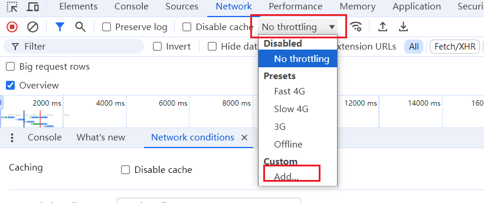
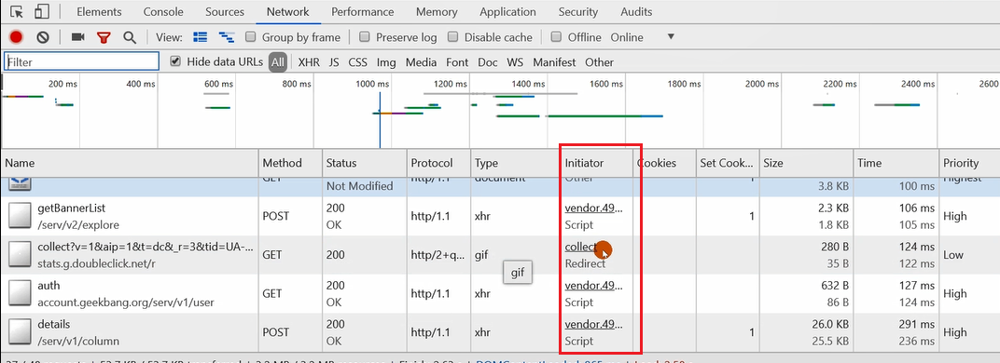
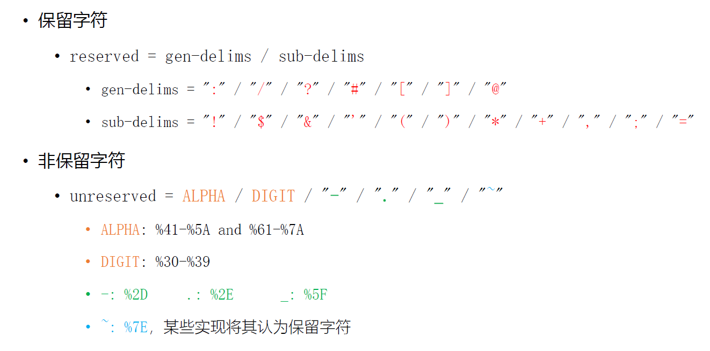
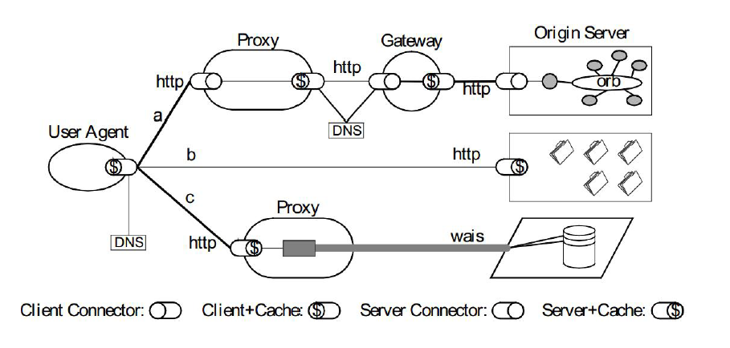
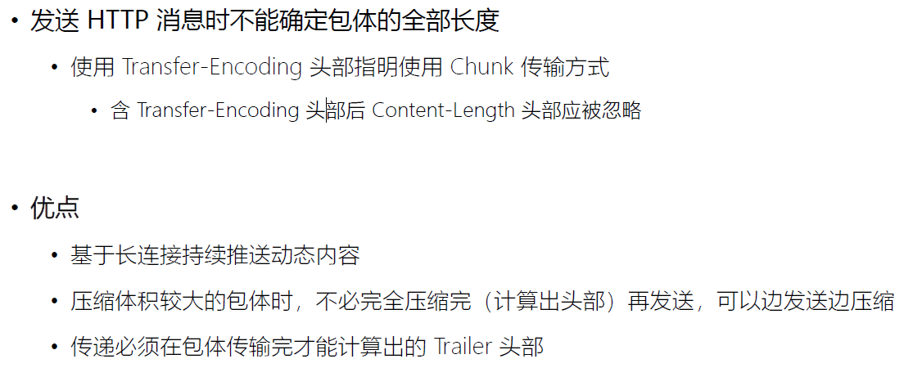
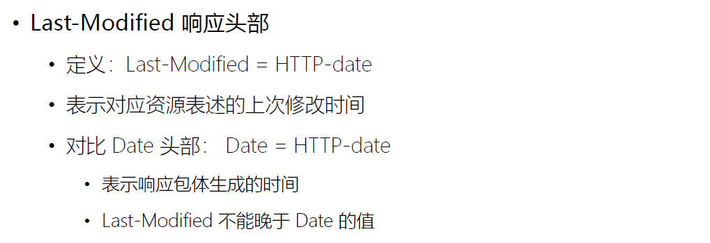
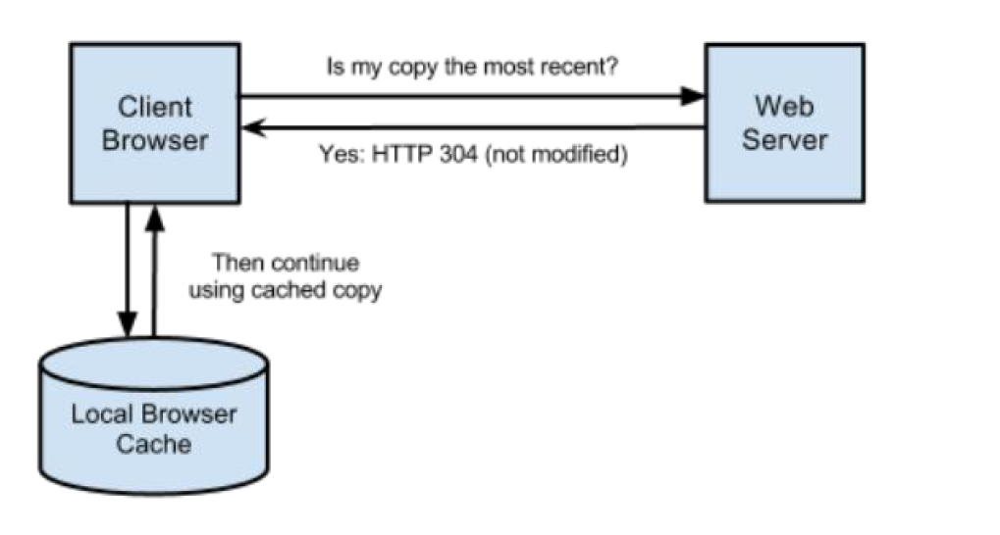
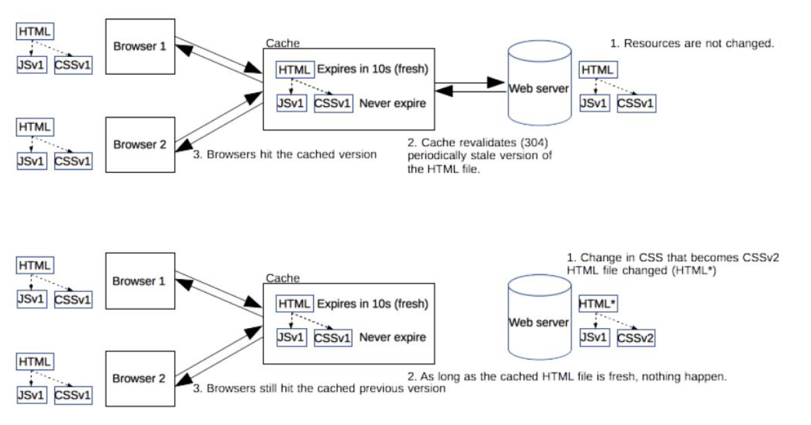
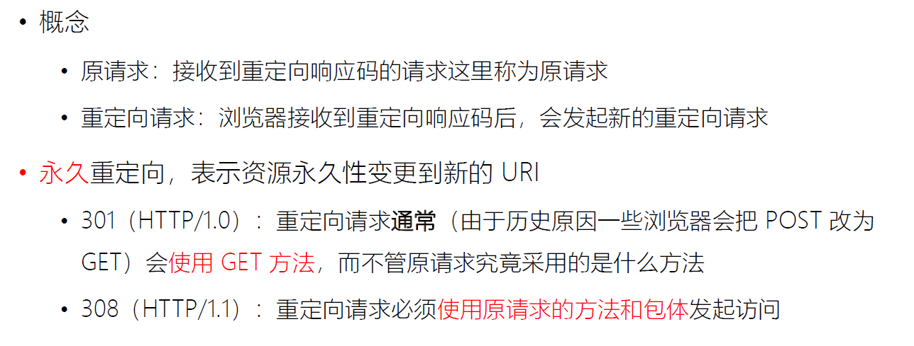
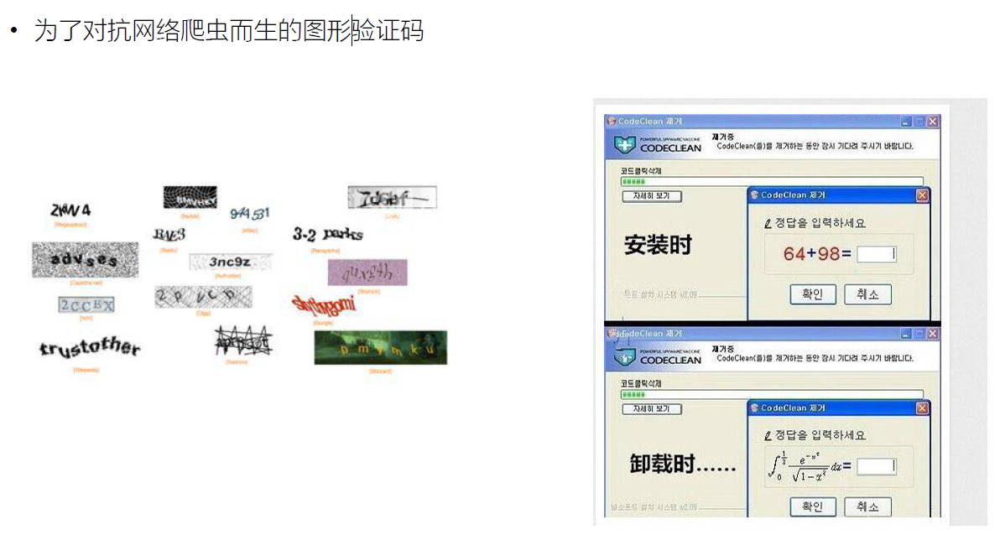

# 协议概述

以 TCP/IP 协议栈为依托，由上至下、从应用层至基础设施介绍协议

+ **应用层**
  + 第 1 部分：HTTP/1.1
  + 第 2 部分：Websocket
  + 第 3 部分：HTTP/2.0

+  **应用层的安全基础设施**
  + 第 4 部分：TLS/SSL
+ **传输层**
  + 第 5 部分：TCP
+  **网络层及数据链路层**
  + 第 6 部分：IP 层和以太网


## HTTP/1 课程安排

自顶而下、由业务到逻辑
• HTTP/1 协议为什么会如此设计？
	• 网络分层原理、REST 架构
• 协议的通用规则
	• 协议格式、URI、方法与响应码概览
• 连接与消息的路由
• 内容协商与传输
• cookie 的设计与问题
• 缓存的控制

## HTTP/1 的协议升级

支持服务器推送消息的 WebSocket 协议[http1不支持]
	• 建立会话
	• 消息传输
	• 心跳
	• 关闭会话
• 全面优化后的 HTTP/2.0 协议
• HTTP/2.0 必须开启的 TLS/SSL 协议

## TCP 与 IP 协议

传输层的 TCP 协议
	• 建立连接
	• 传输数据
	• 拥塞控制
	• 关闭连接
• 网络层的 IP 协议
	• IP 报文与路由
	• 网络层其他常用协议：ICMP、ARP、RARP
	• IPv6 的区别

# 第 1 课 基于ABNF语义定义的HTTP消息格式

## 浏览器发起 HTTP 请求的典型场景


## Hypertext Transfer Protocol (HTTP) 协议


## HTTP 协议格式


### ABNF （扩充巴科斯-瑙尔范式）操作符


### ABNF （扩充巴科斯-瑙尔范式）核心规则


## 基于 ABNF 描述的 HTTP 协议格式


### 案例分析:

#### telnet抓包


#### wireshark 报文分析


# 第 2 课 网络为什么要分层：OSI模型与TCP-IP模型

## OSI（Open System Interconnection Reference Model）概念模型


### 物理层

[物理层](https://baike.baidu.com/item/物理层/4329158?fromModule=lemma_inlink)是参考模型中的最底层，主要定义了系统的电气、机械、过程和功能标准。如：电压、物理数据速率、最大传输距离、物理联接器和其他的类似特性。物理层的主要功能是利用传输介质为数据链路层提供物理联接，负责数据流的物理传输工作。物理层传输的基本单位是比特流，即0和1，也就是最基本的电信号或光信号，是最基本的物理传输特征。 [5]物理层定义了通信网络之间物理链路的电气特性或机械特性，主要负责比特流和电压、光线等传输方式之间建立互换模式，并且依据比特流进行实时性传输，其中比特流记为0或1。 [10]

### 数据链路层

[数据链路层](https://baike.baidu.com/item/数据链路层/4329290?fromModule=lemma_inlink)是在通信实体间建立数据链路联接，传输的基本单位为“帧”，并为网络层提供[差错控制](https://baike.baidu.com/item/差错控制/1614020?fromModule=lemma_inlink)和流量控制服务。数据链路层由MAC(介质访问控制子层)和[LLC](https://baike.baidu.com/item/LLC/10072443?fromModule=lemma_inlink)(逻辑链路控制子层)组成。介质访问控制子层的主要任务是规定如何在物理线路上传输帧。逻辑链路控制子层对在同一条网络链路上的设备之间的通信进行管理。数据链路控制子层主要负责逻辑上识别不同协议类型，并对其进行封装。也就是说数据链路控制子层会接受网络协议数据、分组的数据报并且添加更多的控制信息，从而把这个分组传送到它的目标设备。 [5]

### 网络层

[网络层](https://baike.baidu.com/item/网络层/4329439?fromModule=lemma_inlink)主要为数据在节点之间传输创建逻辑链路，通过路由选择算法为分组选择最佳路径，从而实现拥塞控制、网络互联等功能。网络层是以[路由器](https://baike.baidu.com/item/路由器/108294?fromModule=lemma_inlink)为最高节点俯瞰网络的关键层，它负责把分组从源网络传输到目标网络的路由选择工作。互联网是由多个网络组成在一起的一个集合，正是借助了网络层的路由路径选择功能，才能使得多个网络之间的联接得以畅通，信息得以共享。网络层提供的服务有面向联接和面向无联接的服务两种。面向联接的服务是可靠的联接服务，是数据在交换之前必须先建立联接，然后传输数据，结束后终止之前建立联接的服务。网络层以虚电路服务的方式实现面向联接的服务。面向无联接的服务是一种不可靠的服务，不能防止报文的丢失、重发或失序。面向无联接的服务优点在于其服务方式灵活方便，并且非常迅速。网络层以数据报服务的方式实现面向无联接的服务。 [5]

### 传输层

[传输层](https://baike.baidu.com/item/传输层/4329536?fromModule=lemma_inlink)是网络体系结构中高低层之间衔接的一个接口层。传输层不仅仅是一个单独的结构层，而是整个分析体系协议的核心。传输层主要为用户提供End—to—End(端到端)服务，处理数据报错误、数据包次序等传输问题。传输层是计算机通信体系结构中关键一层，它向高层屏蔽了下层数据的通信细节，使用户完全不用考虑物理层、数据链路层和网络层工作的详细情况。传输层使用网络层提供的网络联接服务，依据系统需求可以选择数据传输时使用面向联接的服务或是面向无联接的服务。 [5]

### 会话层

[会话层](https://baike.baidu.com/item/会话层/4329656?fromModule=lemma_inlink)的主要功能是负责维护两个节点之间的传输联接，确保点到点传输不中断，以及管理数据交换等功能。会话层在应用进程中建立、管理和终止会话。会话层还可以通过对话控制来决定使用何种通信方式，[全双工](https://baike.baidu.com/item/全双工/310007?fromModule=lemma_inlink)通信或[半双工](https://baike.baidu.com/item/半双工/309852?fromModule=lemma_inlink)通信。会话层通过自身协议对请求与应答进行协调。 [5]会话层主要是管理不同主机上不同进程的通信内容，打造更加完整的协调机制，从而确保用户之间无论是建立对话还是释放会话连接，都能最大程度保证数据交换的及时性和规范性。 [10]

### 表示层

[表示层](https://baike.baidu.com/item/表示层/4329716?fromModule=lemma_inlink)为在应用过程之间传送的信息提供表示方法的服务。表示层以下各层主要完成的是从源端到目的端可靠地的数据传送，而表示层更关心的是所传送数据的语法和语义。表示层的主要功能是处理在两个通信系统中交换信息的表示方式，主要包括数据格式变化、[数据加密](https://baike.baidu.com/item/数据加密/11048982?fromModule=lemma_inlink)与解密、[数据压缩](https://baike.baidu.com/item/数据压缩/5198909?fromModule=lemma_inlink)与解压等。在网络带宽一定的前提下数据压缩的越小其传输速率就越快，所以表示层的数据压缩与解压被视为掌握网络传输速率的关键因素。表示层提供的数据加密服务是重要的网络安全要素，其确保了数据的安全传输，也是各种安全服务最为重视的关键。表示层为应用层所提供的服务包括：语法转换、语法选择和联接管理。 [5]

### 应用层

[应用层](https://baike.baidu.com/item/应用层/16412033?fromModule=lemma_inlink)是OSI模型中的最高层，是直接面向用户的一层，用户的通信内容要由应用进程解决，这就要求应用层采用不同的应用协议来解决不同类型的应用要求，并且保证这些不同类型的应用所采用的低层通信协议是一致的。应用层中包含了若干独立的用户通用服务协议模块，为网络用户之间的通信提供专用的程序服务。需要注意的是应用层并不是应用程序，而是为应用程序提供服务。 [5]

## OSI 模型与 TCP/IP 模型对照


### 报文头部


**1.4 网络为什么分层demo.pcapng**


```
Ethernet II						： 以太网II，
Internet Protocol Version		：互联网协议版本
Transmission Control Protocol	：传输控制协议
Transport Layer Security		：传输层安全
```


# 第 3 课 HTTP解决了什么问题？

## Form Follows Function：HTTP 协议为什么是现在这个样


## HTTP 解决了什么问题？

解决 WWW 信息交互必须面对的需求：
• 低门槛
• 可扩展性：巨大的用户群体，超长的寿命
• 分布式系统下的 Hypermedia：大粒度数据的网络传输
• Internet 规模
	• 无法控制的 scalability
		• 不可预测的负载、非法格式的数据、恶意消息
		• 客户端不能保持所有服务器信息，服务器不能保持多个请求间的状态信息
	• 独立的组件部署：新老组件并存
• 向前兼容：自 1993 年起 HTTP0.9\1.0（1996）已经被广泛使用


# 第 4 课 评估Web架构的七大关键属性

## 评估 Web 架构的关键属性

HTTP 协议应当在以下属性中取得可接受的均衡：
1. **性能 Performance**：影响高可用的关键因素
2. **可伸缩性 Scalability**：支持部署可以互相交互的大量组件
3. **简单性 Simplicity**：易理解、易实现、易验证
4. **可见性 Visiable**：对两个组件间的交互进行监视或者仲裁的能力。如缓存、分层设计等
5. **可移植性 Portability**：在不同的环境下运行的能力
6. **可靠性 Reliability**：出现部分故障时，对整体影响的程度
7. **可修改性** Modifiability：对系统作出修改的难易程度，由可进化性、可定制性、可扩展性、可配置性、可重用性构成

### 架构属性：可修改性

• 可进化性 Evolvability：一个组件独立升级而不影响其他组件
• 可扩展性 Extensibility ：向系统添加功能，而不会影响到系统的其他部分
• 可定制性 Customizability ：临时性、定制性地更改某一要素来提供服务，不对常规客户产生影响
• 可配置性 Configurability ：应用部署后可通过修改配置提供新的功能
• 可重用性 Reusabilit ：组件可以不做修改在其他应用在使用

## 架构属性：性能

• **网络性能 Network Performance**
	• Throughput 吞吐量：小于等于带宽 bandwidth
	• Overhead 开销：首次开销，每次开销
• **用户感知到的性能 User-perceived Performance**
	• Latency 延迟：发起请求到接收到响应的时间
	• Completion 完成时间：完成一个应用动作所花费的时间
• **网络效率 Network Efficiency**
	• 重用缓存、减少交互次数、数据传输距离更近、COD

## REST 架构下的 Webs


# 第 5 课 从五种架构风格推导出HTTP的REST架构

## 5 种架构风格

**• 数据流风格 Data-flow Styles**
	• 优点：简单性、可进化性、可扩展性、可配置性、可重用性
**• 复制风格 Replication Styles**
	• 优点：用户可察觉的性能、可伸缩性，网络效率、可靠性也可以提到提升
**• 分层风格 Hierarchical Styles**
	• 优点：简单性、可进化性、可伸缩性
**• 移动代码风格 Mobile Code Styles**
	• 优点：可移植性、可扩展性、网络效率
**• 点对点风格 Peer-to-Peer Styles**
	• 优点：可进化性、可重用性、可扩展性、可配置性

### 数据流风格 Data-flow Styles


评估 Web 架构的关键属性


### 复制风格 Replication Styles


评估 Web 架构的关键属性


### 分层风格Hierarchical Styles （一）


### 分层风格 Hierarchical Styles （二）


### 移动代码风格 Mobile Code Styles


### 点对点风格 Peer-to-Peer Styles


## 风格演进到REST架构


# 第 6课 如何用Chrome的Network面板分析HTTP报文

## Chrome 抓包：快速定位 HTTP 协议问题

• https://developers.google.com/web/tools/chrome-devtools/network/
• 快捷键：Control+Shift+I (Windows) or Command+Option+I (Mac)

## Chrome 抓包：Network 面板


• 控制器：控制面板的外观与功能
• 过滤器：过滤请求列表中显示的资源
	• 按住 Command （Mac）或 Ctrl （Window / Linux），然后点击过滤器可以同时选择多个过滤器
• 概览：显示 HTTP 请求、响应的时间轴
• 请求列表：默认时间排序，可选择显示列
• 概要：请求总数、总数据量、总花费时间等

### 控制器


**重要功能说明：**

**要跨页面加载保存请求： Preserve log**： 订住上一次的请求，用于问题分析

**自定义网络速度：**



### 过滤器：按类型

• XHR、JS、CSS、Img、Media、Font、Doc、WS (WebSocket)、Manifest 或 Other（此处未列出的任何其他类型）
• 多类型，按住 Command (Mac) 或 Ctrl（Windows、Linux）
• 按时间过滤：概览面板，拖动滚动条
• 隐藏 Data URLs：CSS 图片等小文件以 BASE64 格式嵌入 HTML 中，以减少 HTTP请求数

### 过滤器：属性过滤（一）

• **domain**：仅显示来自指定域的资源。 您可以使用通配符字符 (*) 纳入多个域
• **has-response-header**：显示包含指定 HTTP 响应标头的资源
• **is**：使用 is:running 可以查找 WebSocket 资源，is:from-cache 可查找缓存读出的资源
• **larger-than**： 显示大于指定大小的资源（以字节为单位）。 将值设为 1000 等同于设置为1k
• **method**：显示通过指定 HTTP 方法类型检索的资源
• **mime-type**：显示指定 MIME 类型的资源

多属性间通过空格实现 AND 操作


### 过滤器：属性过滤（二）

• mixed-content：显示所有混合内容资源 (mixed-content:all)，或者仅显示当前显示的资源(mixed-content:displayed)。
• scheme：显示通过未保护 HTTP (scheme:http) 或受保护 HTTPS (scheme:https) 检索的资源。
• set-cookie-domain：显示具有 Set-Cookie 标头并且 Domain 属性与指定值匹配的资源。
• set-cookie-name：显示具有 Set-Cookie 标头并且名称与指定值匹配的资源。
• set-cookie-value：显示具有 Set-Cookie 标头并且值与指定值匹配的资源。
• status-code：仅显示 HTTP 状态代码与指定代码匹配的资源

多属性间通过空格实现 AND 操作

### 请求列表的排序

• 时间排序，默认
• 按列排序
• 按活动时间排序
	• Start Time：发出的第一个请求位于顶部
	• Response Time：开始下载的第一个请求位于顶部
	• End Time：完成的第一个请求位于顶部
	• Total Duration：连接设置时间和请求/响应时间最短的请求位于顶部
	• Latency：等待最短响应时间的请求位于顶部


### 请求列表（一）

• Name : 资源的名称
• Status : HTTP 状态代码
• Type : 请求的资源的 MIME 类型

### 请求列表（二）

Initiator : 发起请求的对象或进程。它可能有以下几种值：
	• Parser （解析器） : Chrome的 HTML 解析器发起了请求
		• 鼠标悬停显示 JS 脚本
	• Redirect （重定向） : HTTP 重定向启动了请求
	• Script （脚本） : 脚本启动了请求
	• Other （其他） : 一些其他进程或动作发起请求，例如用户点击链接跳转到页面或在地址栏中输入网址



### 请求列表（三）

• Size : 服务器返回的响应大小（包括头部和包体），可显示解压后大小
• Time : 总持续时间，从请求的开始到接收响应中的最后一个字节
• Waterfall：各请求相关活动的直观分析图


### 预览请求内容（一）

• 查看头部
• 查看 cookie
• 预览响应正文：查看图像用
• 查看响应正文
• 时间详细分布
• 导出数据为 HAR 格式
• 查看未压缩的资源大小：Use Large Request Rows

### 预览请求内容（二）

• 浏览器加载时间（概览、概要、请求列表）
	• DOMContentLoaded 事件的颜色设置为蓝色，而 load 事件设置为红色
• 将请求数据复制到剪贴版
	• Copy Link Address: 将请求的网址复制到剪贴板
	• Copy Response: 将响应包体复制到剪贴板
	• Copy as cURL: 以 cURL 命令形式复制请求
	• Copy All as cURL: 以一系列 cURL 命令形式复制所有请求
	• Copy All as HAR: 以 HAR 数据形式复制所有请求
• 查看请求上下游：按住 shift 键悬停请求上，绿色是上游，红色是下游

### 浏览器加载时间

• 触发流程：
	• 解析 HTML 结构
	• 加载外部脚本和样式表文件
	• 解析并执行脚本代码 // 部分脚本会阻塞页面的加载
	• DOM 树构建完成 // DOMContentLoaded 事件
	• 加载图片等外部文件
	• 页面加载完毕 // load 事件


#### 请求时间详细分布（一）

• Queueing: 浏览器在以下情况下对请求排队
	• 存在更高优先级的请求
	• 此源已打开六个 TCP 连接，达到限值，仅适用于 HTTP/1.0 和 HTTP/1.1
	• 浏览器正在短暂分配磁盘缓存中的空间
• Stalled: 请求可能会因 Queueing 中描述的任何原因而停止
• DNS Lookup: 浏览器正在解析请求的 IP 地址
• Proxy Negotiation: 浏览器正在与代理服务器协商请求

#### 请求时间详细分布（二）

• Request sent: 正在发送请求
• ServiceWorker Preparation: 浏览器正在启动 Service Worker
• Request to ServiceWorker: 正在将请求发送到 Service Worker
• Waiting (TTFB): 浏览器正在等待响应的第一个字节。 TTFB 表示 Time To First Byte（至第一字节的时间）。 此时间包括 1 次往返延迟时间及服务器准备响应所用的时间
• Content Download: 浏览器正在接收响应
• Receiving Push: 浏览器正在通过 HTTP/2 服务器推送接收此响应的数据
• Reading Push: 浏览器正在读取之前收到的本地数据

# 第 6 课 URI的基本格式以及与URL的区别

## 当没有 URI 时


## 什么是 URI

• URL： RFC1738 （1994.12），Uniform Resource Locator，表示资源的位置，期望提供查找资源的方法
• URN：RFC2141 （1997.5），Uniform Resource Name，期望为资源提供持久的、位置无关的标识方式，并允许简单地将多个命名空间映射到单个URN命名空间
	• 例如磁力链接 magnet:?xt=urn:sha1:YNCKHTQC5C
• URI：RFC1630 （1994.6）、RFC3986 （2005.1，取代 RFC2396 和RFC2732 ），Uniform Resource Identifier，用以区分资源，是 URL 和 URN的超集，用以取代 URL 和 URN 概念

## Uniform Resource Identifier 统一资源标识符

• **Resource 资源**
	• 可以是图片、文档、今天杭州的温度等，也可以是不能通过互联网访问的实体，例如人、公司、实体书，也可以是抽象的概念，例如亲属关系或者数字符号
	• 一个资源可以有多个 URI
**• Identifier 标识符**
	• 将当前资源与其他资源区分开的名称
• **Uniform 统一**
	• 允许不同种类的资源在同一上下文中出现
	• 对不同种类的资源标识符可以使用同一种语义进行解读
	• 引入新标识符时，不会对已有标识符产生影响
	• 允许同一资源标识符在不同的、internet 规模下的上下文中出现

## URI 的组成

• 组成：schema【模式】, user information【用户信息】, host【主机】, port【端口】, path【路径】, query, fragment【片段】


### 合法的 URI

```java
• ftp://ftp.is.co.za/rfc/rfc1808.txt
• http://www.ietf.org/rfc/rfc2396.txt
• ldap://[2001:db8::7]/c=GB?objectClass?one
• mailto:John.Doe@example.com
• news:comp.infosystems.www.servers.unix tel:+1-816-555-1212
• telnet://192.0.2.16:80/
• urn:oasis:names:specification:docbook:dtd:xml:4.1.2
```

### URI 格式（一）


### URI 格式（二）


### URI格式（三）: hier-part


### 相对 URI


## 为什么要进行 URI 编码

传递数据中，如果存在用作分隔符的保留字符怎么办？
• 对可能产生歧义性的数据编码
	• 不在 ASCII 码范围内的字符
	• ASCII 码中不可显示的字符
	• URI 中规定的保留字符
	• 不安全字符（传输环节中可能会被不正确处理），如空格、引号、尖括号等


## 保留字符与非保留字符



## URI 百分号编码

```js
• 百分号编码的方式
	• pct-encoded = "%" HEXDIG HEXDIG
		• US-ASCII：128 个字符（95 个可显示字符，33 个不可显示字符）
		• 参见：https://zh.wikipedia.org/wiki/ASCII
	• 对于 HEXDIG 十六进制中的字母，大小写等价

• 非 ASCII 码字符（例如中文）：建议先 UTF8 编码，再 US-ASCII 编码

• 对 URI 合法字符，编码与不编码是等价的
	• 例如，“URI 转换”既可以“URI%e8%bd%ac%e6%8d%a”，也可以“%55%52%49%e8%bd%ac%e6%8d%a2”
		• https://www.baidu.com/s?wd=URI%20%e8%bd%ac%e6%8d%a2
		• https://www.baidu.com/s?wd=%55%52%49%20%e8%bd%ac%e6%8d%a2
```

# 第 7 课 详解 HTTP 的请求行

## 请求行


### request-target


### HTTP-version 

HTTP-version 版本号发展历史：https://www.w3.org/Protocols/History.html
• HTTP/0.9：只支持 GET 方法，过时
• HTTP/ 1.0：RFC1945，1996， 常见使用于代理服务器（例如 Nginx 默认配置）
• HTTP/ 1.1：RFC2616，1999
• HTTP/ 2.0：2015.5 正式发布


## 常见方法（RFC7231）

• **GET**：主要的获取信息方法，大量的性能优化都针对该方法，幂等方法
• **HEAD**：类似 GET 方法，但服务器不发送 BODY，用以获取 HEAD 元数据，幂等方法
• **POST**：常用于提交 HTML FORM 表单、新增资源等
• **PUT**：更新资源，带条件时是幂等方法
• **DELETE**：删除资源，幂等方法
• **CONNECT**：建立 tunnel 隧道
• **OPTIONS**：显示服务器对访问资源支持的方法，幂等方法
• **TRACE**：回显服务器收到的请求，用于定位问题。有安全风险

```
Changes with nginx 0.5.17 02 Apr 2007
*) Change: now nginx always returns the 405 status for the TRACE method.
```

curl 查看支持那些方法


## 用于文档管理的 WEBDAV 方法(RFC2518)

• **PROPFIND**：从 Web 资源中检索以 XML 格式存储的属性。它也被重载，以允许一个检索远程系统的集合结构（也叫目录层次结构）
• **PROPPATCH**：在单个原子性动作中更改和删除资源的多个属性
• **MKCOL**：创建集合或者目录
• **COPY**：将资源从一个 URI 复制到另一个 URI
• **MOVE**：将资源从一个 URI 移动到另一个 URI
• **LOCK**：锁定一个资源。WebDAV 支持共享锁和互斥锁。
• **UNLOCK**：解除资源的锁定


# 第 8 课 HTTP 响应行

## HTTP 响应行


## HTTP 的正确响应码

### 响应码分类：1xx

• 响应码规范：RFC6585 （2012.4）、RFC7231 （2014.6）
• 1xx：请求已接收到，需要进一步处理才能完成，HTTP1.0 不支持
	• 100 Continue：上传大文件前使用
		• 由客户端发起请求中携带 Expect: 100-continue 头部触发
    • 101 Switch Protocols：协议升级使用
        • 由客户端发起请求中携带 Upgrade: 头部触发，如升级 websocket 或者 http/2.0
    • 102 Processing：WebDAV 请求可能包含许多涉及文件操作的子请求，需要很长时间才能完成请求。该代码表示 服务器已经收到并正在处理请求，但无响应可用。这样可以防止客户端超时，并假设请求丢失	


### 响应码分类： 2xx

• 2xx：成功处理请求
	• 200 OK: 成功返回响应。
	• 201 Created: 有新资源在服务器端被成功创建。
	• 202 Accepted: 服务器接收并开始处理请求，但请求未处理完成。这样一个模糊的概念是有意如此设计，可以覆盖更多的场景。例如异步、需要长时间处理的任务。
	• 203 Non-Authoritative Information：当代理服务器修改了 origin server 的
原始响应包体时（例如更换了HTML中的元素值），代理服务器可以通过修改200为203的方式告知客户端这一事实，方便客户端为这一行为作出相应的处理。203响应可以被缓存。

​	• 204 No Content：成功执行了请求且不携带响应包体，并暗示客户端无需更新当前的页面视图。
​	• 205 Reset Content：成功执行了请求且不携带响应包体，同时指明客户端需要更新当前页面视图。
​	• 206 Partial Content：使用 range 协议时返回部分响应内容时的响应码
​	• 207 Multi-Status：RFC4918 ，在 WEBDAV 协议中以 XML 返回多个资源的状态。
​	• 208 Already Reported：RFC5842 ，为避免相同集合下资源在207响应码下重复上报，使用 208 可以使用父集合的响应码。

### 响应码分类： 3xx

• 3xx：重定向使用 Location 指向的资源或者缓存中的资源。在 RFC2068中规定客户端重定向次数不应超过 5 次，以防止死循环。
	• 300 Multiple Choices：资源有多种表述，通过 300 返回给客户端后由其自行选择访问哪一种表述。由于缺乏明确的细节，300 很少使用。
	• 301 Moved Permanently：资源永久性的重定向到另一个 URI 中。
	• 302 Found：资源临时的重定向到另一个 URI 中。

​	• 303 See Other：重定向到其他资源，常用于 POST/PUT 等方法的响应中。
​	• 304 Not Modified：当客户端拥有可能过期的缓存时，会携带缓存的标识etag、时间等信息询问服务器缓存是否仍可复用，而304是告诉客户端可以复用缓存。
​	• 307 Temporary Redirect：类似302，但明确重定向后请求方法必须与原请求方法相同，不得改变。
​	• 308 Permanent Redirect：类似301，但明确重定向后请求方法必须与原请求方法相同，不得改变。

## HTTP 的错误响应码

### 响应码分类： 4xx

**• 4xx：客户端出现错误**
	• 400 Bad Request：服务器认为客户端出现了错误，但不能明确判断为以下哪种错误时使用此错误码。例如HTTP请求格式错误。
	• 401 Unauthorized：用户认证信息缺失或者不正确，导致服务器无法处理请求。
	• 407 Proxy Authentication Required：对需要经由代理的请求，认证信息未通过代理服务器的验证
	• 403 Forbidden：服务器理解请求的含义，但没有权限执行此请求
	• 404 Not Found：服务器没有找到对应的资源
	• 410 Gone：服务器没有找到对应的资源，且明确的知道该位置永久性找不到该资源
	• 405 Method Not Allowed：服务器不支持请求行中的 method 方法
	• 406 Not Acceptable：对客户端指定的资源表述不存在（例如对语言或者编码有要求），服务器返回表述列表供客户端选择。
	• 408 Request Timeout：服务器接收请求超时
	• 409 Conflict：资源冲突，例如上传文件时目标位置已经存在版本更新的资源
	• 411 Length Required：如果请求含有包体且未携带 Content-Length 头部，且不属于chunk类请求时，返回 411
	• 412 Precondition Failed：复用缓存时传递的 If-Unmodified-Since 或 If-None-Match 头部不被满足
	• 413 Payload Too Large/Request Entity Too Large：请求的包体超出服务器能处理的最大长度
	• 414 URI Too Long：请求的 URI 超出服务器能接受的最大长度
	• 415 Unsupported Media Type：上传的文件类型不被服务器支持
	• 416 Range Not Satisfiable：无法提供 Range 请求中指定的那段包体
	• 417 Expectation Failed：对于 Expect 请求头部期待的情况无法满足时的响应码
	• 421 Misdirected Request：服务器认为这个请求不该发给它，因为它没有能力处理。
	• 426 Upgrade Required：服务器拒绝基于当前 HTTP 协议提供服务，通过Upgrade 头部告知客户端必须升级协议才能继续处理。
	• 428 Precondition Required：用户请求中缺失了条件类头部，例如 If-Match
	• 429 Too Many Requests：客户端发送请求的速率过快
	• 431 Request Header Fields Too Large：请求的 HEADER 头部大小超过限制
	• 451 Unavailable For Legal Reasons：RFC7725 ，由于法律原因资源不可访问

### 响应码分类： 5xx

• 5xx：服务器端出现错误
	• 500 Internal Server Error：服务器内部错误，且不属于以下错误类型
	• 501 Not Implemented：服务器不支持实现请求所需要的功能
	• 502 Bad Gateway：代理服务器无法获取到合法响应
	• 503 Service Unavailable：服务器资源尚未准备好处理当前请求
	• 504 Gateway Timeout：代理服务器无法及时的从上游获得响应
	• 505 HTTP Version Not Supported：请求使用的 HTTP 协议版本不支持
	• 507 Insufficient Storage：服务器没有足够的空间处理请求
	• 508 Loop Detected：访问资源时检测到循环
	• 511 Network Authentication Required：代理服务器发现客户端需要进行身份验证才能获得网络访问权限

# 第 10 课 如何管理跨代理服务器的长短连接

## HTTP 连接的常见流程


## 从 TCP 编程上看 HTTP 请求处理


## 短连接与长连接


### Connection 仅针对当前连接有效


```java
1、客户端向代理服务器1请求Connection: Keep-Alive使用长连接，但是代理服务器1返回Connection: close，不支持长连接
2、代理服务器1和代理服务器2之间不支持长连接
3、代理服务器2和目标服务器之间使用长链接
```

### 代理服务器老旧不支持Connection头部


# 第 11课 HTTP 消息在服务器端的路由

## Host 头部


 绝对【absolute】

### 规范与实现间是有差距的

• 关于 Host 头部：https://tools.ietf.org/html/rfc7230#section-5.4


## Host 头部与消息的路由


# 第 12 课 代理服务器转发消息时的相关头部

## 客户端与源服务器间存在多个代理



## 问题：如何传递 IP 地址？`X-Forwarded-For`


## 消息的转发

• **Max-Forwards 头部**
	• 限制 Proxy 代理服务器的最大转发次数，仅对 TRACE/OPTIONS 方法有效
	• Max-Forwards = 1*DIGIT
• **Via 头部**
	• 指明经过的代理服务器名称及版本
	• Via = 1#( received-protocol RWS received-by [ RWS comment ] )
		• received-protocol = [ protocol-name "/" ] protocol-version
		• received-by = ( uri-host [ ":" port ] ) / pseudonym
		• pseudonym = token
• **Cache-Control:no-transform**
	• 禁止代理服务器修改响应包体


# 第 13 课 请求与响应的上下文

## 请求的上下文: User-Agent


## 请求的上下文: Referer


## 请求的上下文: From


## 响应的上下文：Server


## 响应的上下文： Allow 与 Accept-Ranges


# 第 14 课 内容协商与资源表述

## 内容协商


## 内容协商的两种方式

• **Proactive 主动式内容协商：**
	• 指由客户端先在请求头部中提出需要的表述形式，而服务器根据这些请求头部提供特定的 representation 表述
**• Reactive 响应式内容协商：**
	• 指服务器返回 300 Multiple Choices 或者 406 Not Acceptable，由客户端选择一种表述 URI 使用

### Proactive 主动式内容协商

**accept头部表示客户端可以接受的类型**


### Reactive 响应式内容协商


## 常见的协商要素

• **质量因子 q**：内容的质量、可接受类型的优先级
• **媒体资源的 MIME 类型及质量因子**

​	• Accept: text/html,application/xhtml+xml,application/xml;q=0.9,*/*;q=0.8
​	• Accept:text/html,application/xhtml+xml,application/xml;q=0.9,image/webp,image/apng,*/*;q=0.8,
application/signed-exchange;v=b3

• **字符编码**：由于 UTF-8 格式广为使用， Accept-Charset 已被废弃
	• Accept-Charset: ISO-8859-1,utf-8;q=0.7,*;q=0.7
• **内容编码**：主要指压缩算法
	• Accept-Encoding: gzip, deflate, br
• **表述语言**
	• Accept-Language: zh-CN,zh;q=0.9,en-US;q=0.8,en;q=0.7
	• Accept-Language: zh-CN,zh;q=0.8,zh-TW;q=0.7,zh-HK;q=0.5,en-US;q=0.3,en;q=0.2

> 国际化与本地化
>
> • internationalization（i18n，i 和 n 间有 18 个字符）
> 	• 指设计软件时，在不同的国家、地区可以不做逻辑实现层面的修改便能够以不同的语言显示
> • localization（l10n，l 和 n 间有 10 个字符）
> 	• 指内容协商时，根据请求中的语言及区域信息，选择特定的语言作为资源表述


### 资源表述的元数据头部

• 媒体类型、编码
	• content-type: text/html; charset=utf-8
• 内容编码
	• content-encoding: gzip
• 语言
	• Content-Language: de-DE, en-CA

# 第 15 课 HTTP包体的传输方式

## HTTP 包体：承载的消息内容


## 两种传输 HTTP 包体的方式（一）定长包体


### 演示服务器返回Content-Length 不正确

服务端：

```py
#! /usr/bin/python
# -*- coding: utf-8 -*-
import socket
sock = socket.socket(socket.AF_INET,socket.SOCK_STREAM)
server_address = ("127.0.0.1",12345)
sock.bind(server_address)
sock.listen(100)

while True:
    conn,client_address = sock.accept()
    try:
        data = conn.recv(4096)
        response = 'HTTP/1.1 200 OK\r\nContent-Length: 6\r\n\r\nHelloWorld'
        # response = 'HTTP/1.1 200 OK\r\nContent-Disposition: attachment; filename=“aaa.jpg”\r\nContent-Length: 10\r\n\r\nHelloWorld'
        conn.send(response.encode())
    finally:
        conn.close()

```

```java
    public static void main(String[] args) {


        try {
            ServerSocket serverSocket = new ServerSocket(8081);

            while (true) {
                Socket client = serverSocket.accept();
                System.out.println("客户端连接了");
                String msg = "HTTP/1.1 200 OK\r\nContent-Length: 6\r\n\r\nHelloWorld";

                OutputStream outputStream = client.getOutputStream();
                outputStream.write(msg.getBytes());
                outputStream.flush();
                client.close();
            }
        } catch (IOException e) {
            throw new RuntimeException(e);
        }
    }
```


**现象：**浏览器按长度为6解析显式，抓包文件中显示为完整报文


抓包：


## 两种传输 HTTP 包体的方式（二）不定长包体



### 不定长包体的 chunk 传输方式


> • last-chunk = 1*("0") [ chunk-ext ] CRLF
>
> `1* 表示一个或者多个0`

### Trailer 头部的传输


## MIME 媒体类型Content-Type


https://www.iana.org/assignments/media-types/media-types.xhtml

## Content-Disposition 头部(RFC6266)

• disposition-type = "inline" | "attachment" | disp-ext-type
	• inline：指定包体是以 inline 内联的方式，作为页面的一部分展示
	• attachment：指定浏览器将包体以附件的方式下载
		• 例如： Content-Disposition: attachment
		• 例如： Content-Disposition: attachment; filename=“filename.jpg”
	• 在 multipart/form-data 类型应答中，可以用于子消息体部分
		• 如 Content-Disposition: form-data; name="fieldName";filename="filename.jpg"

# 第 16 课 HTML form 表单提交时的协议格式

## HTML FORM 表单


### HTML FORM 表单提交请求时的关键属性


### 几种提交 和enctype的html

```html
<html>
<body>

<p>POST方法默认提交</p>
<form action="/sendhttpreq" method="post">
	<p>姓名: <input type="text" name="name" style="width: 300px" /></p>
	<p>性别: <input type="radio" name="sex" value="male" checked>男
	<input type="radio" name="sex" value="female">女</p>
<p><input type="submit" value="提交" /></p>
</form>

<p>GET方法默认提交</p>
<form action="/sendhttpreq" method="get">
	<p>姓名: <input type="text" name="name" style="width: 300px" /></p>
	<p>性别: <input type="radio" name="sex" value="male" checked>男
	<input type="radio" name="sex" value="female">女</p>
	<p><input type="submit" value="提交" /></p>
</form>

<p>POST方法以application/x-www-form-urlencoded编码方式提交</p>
<form action="/sendhttpreq" method="post" enctype="application/x-www-form-urlencoded">
	<p>姓名: <input type="text" name="name" style="width: 300px" /></p>
	<p>性别: <input type="radio" name="sex" value="male" checked>男
	<input type="radio" name="sex" value="female">女</p>
	<p><input type="submit" value="提交" /></p>
</form>

<p>POST方法以multipart/form-data编码方式提交，且上传文件</p>
<form action="/sendhttpreq" method="post" enctype="multipart/form-data">
	<p>姓名: <input type="text" name="name" style="width: 300px" /></p>
	<p>性别: <input type="radio" name="sex" value="male" checked>男
	<input type="radio" name="sex" value="female">女</p>
	<p>要上传的文件１<input type="file" name="file1"/></p>
	<p>要上传的文件２<input type="file" name="file2"/></p>
	<p><input type="submit" value="提交" /></p>
</form>

</body>
</html>
```


### multipart(RFC1521)：一个包体中多个资源表述 boundary分隔


### Multipart 包体格式(RFC822)


### form-data格式协议全文解析：

```bash
POST /sendhttpreq HTTP/1.1  
Host: localhost:8081
Connection: keep-alive
Content-Length: 515
Cache-Control: max-age=0
sec-ch-ua: "Google Chrome";v="129", "Not=A?Brand";v="8", "Chromium";v="129"
sec-ch-ua-mobile: ?0
sec-ch-ua-platform: "Windows"
Origin: null
Content-Type: multipart/form-data; boundary=----WebKitFormBoundarylVkm9CSm7jRdIQPs
Upgrade-Insecure-Requests: 1
User-Agent: Mozilla/5.0 (Windows NT 10.0; Win64; x64) AppleWebKit/537.36 (KHTML, like Gecko) Chrome/129.0.0.0 Safari/537.36
Accept: text/html,application/xhtml+xml,application/xml;q=0.9,image/avif,image/webp,image/apng,*/*;q=0.8,application/signed-exchange;v=b3;q=0.7
Sec-Fetch-Site: cross-site
Sec-Fetch-Mode: navigate
Sec-Fetch-User: ?1
Sec-Fetch-Dest: document
Accept-Encoding: gzip, deflate, br, zstd
Accept-Language: zh-CN,zh;q=0.9,en;q=0.8

------WebKitFormBoundarylVkm9CSm7jRdIQPs
Content-Disposition: form-data; name="name"

jack
------WebKitFormBoundarylVkm9CSm7jRdIQPs
Content-Disposition: form-data; name="sex"

male
------WebKitFormBoundarylVkm9CSm7jRdIQPs
Content-Disposition: form-data; name="file1"; filename="1.txt"
Content-Type: text/plain

hello
------WebKitFormBoundarylVkm9CSm7jRdIQPs
Content-Disposition: form-data; name="file2"; filename="1.txt"
Content-Type: text/plain

hello
------WebKitFormBoundarylVkm9CSm7jRdIQPs--
```

说明：

```java
Content-Type: multipart/form-data; boundary=----WebKitFormBoundarylVkm9CSm7jRdIQPs
    boundary表示分隔符
    ----WebKitFormBoundarylVkm9CSm7jRdIQPs 描述body通过什么分割为一个multipart-body包
    
    ------WebKitFormBoundarylVkm9CSm7jRdIQPs    -- + boundary 表示一段分割
    ------WebKitFormBoundarylVkm9CSm7jRdIQPs--   --+ boundary + -- 表示整个报文的结束
    
    --分隔符 与 --分隔符-- 之间 是Multipart 包体格式
    
delimiter = "--" boundary CRLF 				--> ------WebKitFormBoundarylVkm9CSm7jRdIQPs
close-delimiter = "--" boundary "--" CRLF	--> ------WebKitFormBoundarylVkm9CSm7jRdIQPs--
```

# 第 17 课 断点续传与多线程下载是如何做到的 --HTTP Range规范

## 多线程、断点续传、随机点播等场景的步骤


## HTTP Range规范(RFC7233)


## Range 请求范围的单位


案例：获取第0-5字母


## Range 条件请求


## 服务器响应


## 多重范围与 multipart


# 第 18 课 Cookie的格式与约束

## Cookie 是什么？


## Cookie 与 Set-Cookie头部的定义


## Set-Cookie 中描述 cookie-pair 的属性


## Cookie 使用的限制


## Cookie 在协议设计上的问题


## 登录场景下 Cookie 与 Session 的常见用法


## 无状态的 REST 架构 VS 状态管理


## 第三方 Cookies，跟踪用户数据


# 第 19 课 浏览器的同源策略

## 为什么需要同源策略？


## 没有同源策略下的 Cookie


## 如果没有同源策略


## 浏览器的同源策略


## 安全性与可用性需要一个平衡点


## 跨站请求伪造攻击


## CSRF 的一种防攻击方式


## CORS：Cross-Origin Resource Sharing


### 简单请求的跨域访问


### 预检请求


## 跨域访问资源：请求头部


## 跨域访问资源：响应头部


# 第 20 课 条件请求的作用

## 资源 URI 与资源表述 Representation


## Preconditon 条件请求


## 强验证器与弱验证器的概念


## 验证器响应头部

**Etag 响应头部**


**Last-Modified 响应头部**



## 条件请求头部


## 缓存更新

### 缓存更新（一）：首次缓存


### 缓存更新（二）：基于过期缓存发起条件请求


## 增量更新


## 更新丢失问题


## 服务器处理条件请求的常见规则 ：Nginx


## 缓存的工作原理

### HTTP 缓存：为当前请求复用前请求的响应


### 如果缓存没有过期


### 如果缓存过期，则继续从服务器验证

如果缓存过期了，取询问服务器当前标签是否过去，如果返回304表示继续有效



验证是否从缓存获取：


### 私有缓存与共享缓存


### 过期的共享缓存--代理服务器


### 缓存实现示意图


## 判断缓存是否过期


### 为什么要预估缓存时间？


### 常见的预估时间


### Age 头部及 current_age 的计算


### 代理服务器缓存中的 Age 头部


## 复杂的 Cache-Control 头部

### Cache-Control 头部


### Cache-Control 头部在请求中的值


### Cache-Control 头部在响应中的值


## 什么样的 HTTP 响应会缓存？RFC7234


### 其他响应头部


### 使用缓存作为当前请求响应的条件


### Vary 缓存


### 如何缓存更新频率不同的资源（一）

> 1、html 不缓存或者缓存时间很短
>
> 2、js、css设置很长的缓存时间，需要更新时通过html中的版本号更新，获取拉取对于的版本





## Warning 头部：对响应码进行补充（缓存或包体转换）


## 验证请求与响应


# 多种重定向跳转方式的差异

重定向分析面板需要打开P热serverlog


## 为什么需要 URI 重定向

• 提交 FORM 表单成功后需要显示内容页，怎么办？
• 站点从 HTTP 迁移到 HTTPS，怎么办？
• 站点部分 URI 发生了变化，但搜索引擎或者流量入口站点只收录了老的URI，怎么办？
• 站点正在维护中，需要给用户展示不一样的内容，怎么办？
• 站点更换了新域名，怎么办？

## 重定向的流程


### Location 头部


## 重定向响应返回码




## 重定向循环


# 如何通过 tunnel 隧道访问被限制的网络


## 请求行


## tunnel 隧道的常见用途：传递 SSL 消息


## Http Tunnel 隧道的认证


# 网络爬虫的工作原理


## 对待网络爬虫的 2 种态度：欢迎常光临


## 对待网络爬虫的 2 种态度：拒绝访问




## 网络爬虫如何抓取数据？


## 爬虫常见的请求头部


## robots.txt：告知爬虫哪些内容不应爬取

Robots exclusion protocol：http://www.robotstxt.org/orig.html


# HTTP 协议的基本认证

## HTTP 基本认证


## 认证请求


## 认证响应


# 如何通过 DNS 协议解析域名？


## 什么是 DNS？


## DNS 域名结构


## 递归查询


## DNS 报文：查询与响应


### dig 工具查询


## DNS 报文


### Questions 格式


```java
0000   03 77 77 77 05 62 61 69 64 75 03 63 6f 6d 00 00   .www.baidu.com..
0010   01 00 01                                          ...


www.baidu.com: type A, class IN
    Name: www.baidu.com
    [Name Length: 13]
    [Label Count: 3]
    Type: A (1) (Host Address)
    Class: IN (0x0001)
```


### Answer 格式

