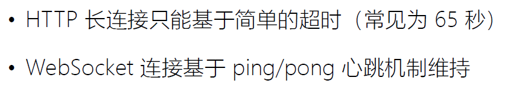

## Websocket 解决什么问题

### 如何及时获得更新？从轮询到通知

### Chrome 请求列表：分析 WebSocket

## 支持双向通讯的 WebSocket

## WebSocket 的成本

## 长连接的心跳保持

## 兼容 HTTP 协议

## 设计哲学：在 Web 约束下暴露 TCP 给上层

## 帧格式示意图

### 数据帧格式：RSV 保留值

### 数据帧格式：帧类型

### ABNF 描述的帧格式

## 如何从 HTTP 升级到 WebSocket

### URI 格式

### 建立握手

### 如何证明握手被服务器接受？预防意外

## 消息与数据帧

### 非控制帧的消息分片：有序

### 数据帧格式：消息内容的长度

## 发送消息

• 确保 WebSocket 会话处于 OPEN 状态
• 以帧来承载消息，一条消息可以拆分多个数据帧
• 客户端发送的帧必须基于掩码编码
• 一旦发送或者接收到关闭帧，连接处于 CLOSING 状态
• 一旦发送了关闭帧，且接收到关闭帧，连接处于 CLOSED 状态
• TCP 连接关闭后，WebSocket 连接才完全被关闭

## 掩码及其所针对的代理污染攻击

### 针对代理服务器的缓存污染攻击

### frame-masking-key 掩码

### 掩码如何防止缓存污染攻击？

## 心跳帧

## 关闭会话的方式

### 关闭帧格式

#### 关闭帧的错误码

