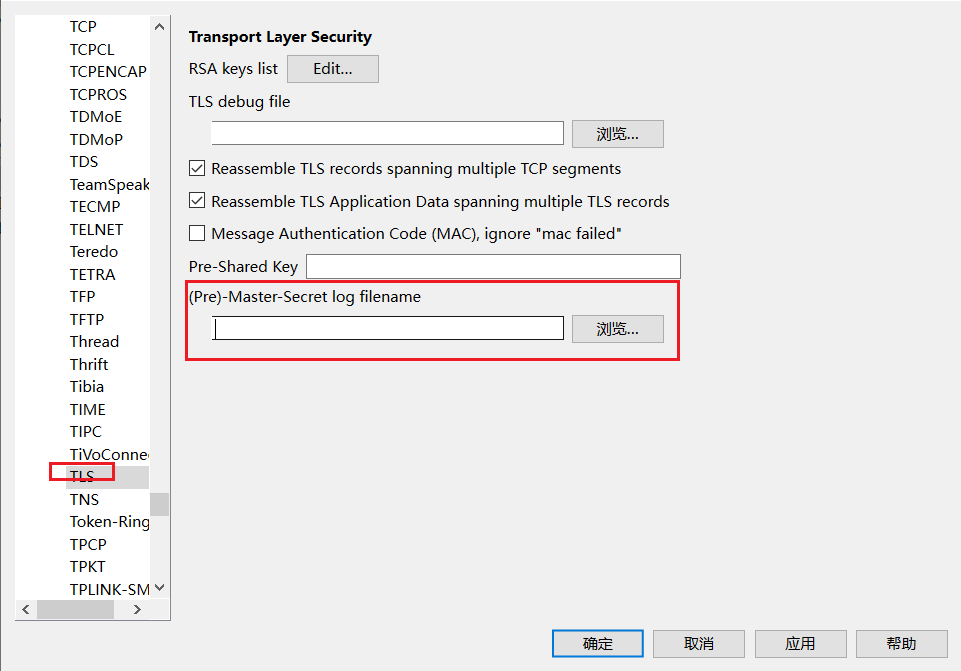
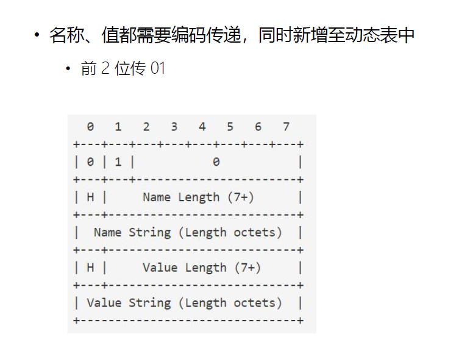
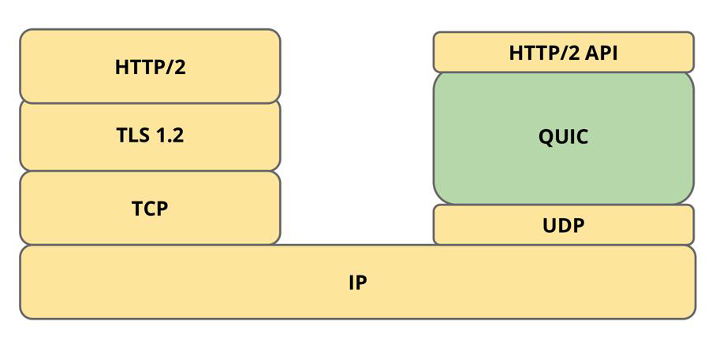
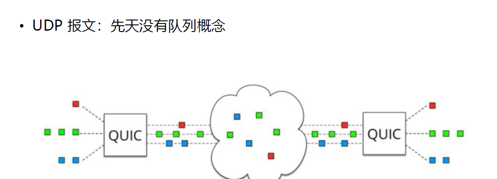

# HTTP-1

## HTTP/1.1 发展中遇到的问题

### HTTP/1.1 发明以来发生了哪些变化？


### HTTP/1.1 的高延迟问题


### 高延迟 VS 高带宽


### 无状态特性带来的巨大 HTTP 头部


## HTTP/1.1 为了解决性能问题做过的努力


## HTTP/1.1 不支持服务器推送消息


# HTTP/2 有哪些特性？

## 解决 HTTP/1 性能问题的 HTTP/2


## 主流浏览器对 HTTP/2 的支持程度


## HTTP/2 的应用状况


## 多路复用带来的提升


## HTTP/2 主要特性

• 传输数据量的大幅减少
	• 以二进制方式传输
	• 标头压缩
• 多路复用及相关功能
	• 消息优先级
• 服务器消息推送
	• 并行推送

# 如何使用 Wireshark 解密 TLS/SSL 报文？


## Chrome 浏览器检测 HTTP/2 插件

HTTP/2 and SPDY indicator
https://chromewebstore.google.com/detail/http2-and-spdy-indicator/mpbpobfflnpcgagjijhmgnchggcjblin

## 在 HTTP/2 应用层协议之下的 TLS 层


## TLS1.2 的加密算法


## Wireshark 如何解密 TLS 消息


```java
原理：获得 TLS 握手阶段生成的密钥
• 通过 Chrome 浏览器 DEBUG 日志中的握手信息生成密钥
• 步骤
    • 配置 Chrome 输出 DEBUG 日志
    	• 配置环境变量 SSLKEYLOGFILE
    • 在 Wireshark 中配置解析 DEBUG 日志
   	 	• 编辑->首选项->Protocols->TLS/SSL
    		• (Pre)-Master-Secret log filename
```

配置环境变量：




## 二进制格式与可见性


# 第 4 课 h2c：如何从 http://升级到 HTTP/2 协议？

## HTTP/2 是不是必须基于 TLS/SSL 协议？


## h2 与 h2c


## H2C：不使用 TLS 协议进行协议升级


### H2C：客户端发送的 Magic 帧


## 统一的连接过程


# 第 5 课 h2：如何从 https://升级到 HTTP/2 协议

## 在 HTTP/2 应用层协议之下的 TLS 层


## TLS 通讯过程


### Next Protocol Negotiation (NPN)


### Application-Layer Protocol Negotiation Extension


# 第 6 课 Stream、Message、Frame 间的关系

## HTTP/2 核心概念


## Stream、Message、Frame 间的关系


这幅图展示了HTTP/2协议中的一个连接中多个数据流的交互过程。

在HTTP/2中，一个连接可以同时处理多个数据流。**每个stream都有自己的标识符id和优先级信息**，并且可以在双向传输数据。图中用不同的颜色区分了不同数据流的帧（frame）。

从上到下，图中显示了一个请求-响应交互的过程：

1. **Connection**：表示整个TCP连接。
2. **Stream 1**：这是第一个数据流，用于发送请求和接收响应。请求消息由一个HEADERS帧组成，包含HTTP方法（GET）、路径（/index.html）等信息。响应消息由一个HEADERS帧和一个DATA帧组成，分别包含了状态码（200）、版本号（HTTP/2.0）以及响应体的数据。
3. **Stream N**：表示后续的数据流，可能用于其他请求或响应。

在时间轴上，帧以它们到达的顺序排列。例如，在Stream 1中，请求的HEADERS帧先于响应的HEADERS和DATA帧到达。这种多路复用的方式允许客户端和服务器并行地处理多个请求和响应，提高了网络效率。

## 消息的组成：HEADERS 帧与 DATA 帧


## 传输中无序，接收时组装


**在同一数据流内，帧是按顺序发送和接收的**；而在**不同数据流之间**，帧的传递则**没有特定的顺序**要求。

在同一数据流（如Stream 1）中，请求的HEADERS帧会先于响应的HEADERS和DATA帧到达，因为这些帧属于同一序列。而跨数据流（如Stream 1与Stream N），尽管它们可能同时进行，但是它们之间的帧传递并没有固定的顺序关系。例如，Stream N上的某个帧可能会比Stream 1上的另一个帧更早到达，或者相反。

这种设计使得HTTP/2能够更好地利用网络资源，提高并发性和性能。通过将请求和响应分解为独立的帧，并使用多路复用技术，HTTP/2能够在单个连接上同时处理多个数据流，从而减少延迟并改善用户体验

## 消息与帧


# 第 7 课 帧格式：Stream 流 ID 的作用

## 对比Websocket的帧格式


## 9 字节标准帧头部


## 标准帧头示意


## Stream ID 的作用


# 第 8 课 帧格式：帧类型及设置帧的子类型


## 9 字节标准帧头部：帧长度


### 帧类型 Type


### 帧类型


### Setting 设置帧格式（type=0x4）


### Setting 设置对象的类型


# 第 9 课 HPACK 如何减少 HTTP 头部的大小？

## HPACK 头部压缩

RFC7541
• 三种压缩方式
	• 静态字典
	• 动态字典
	• 压缩算法：Huffman 编码（最高压缩比 8:5）

## 静态字典


## HPACK 压缩示意


请求头先通过静态变量表，减少字节数 如：2 表示请求方法GET

静态表中没有的进行哈夫曼编码


### 索引表用法示意


### HPACK 压缩比：h2load


# 第 10 课 HPACK 中如何使用 Huffman 树编码？

## Huffman 编码


## Huffman 树的构造过程

1. 计算各字母的出现概率
2. 将出现频率最小的两个字母相加构成子树，左小右大
3. 重复步骤 2，直至完成树的构造
4. 给树的左链接编码为 0，右链接编码为 1
5. 每个字母的编码即从根结点至所在叶结点中所有链接的编码

## Huffman 树构造过程


## Huffman 编码举例


# 第 11 课 HPACK 中整型数字的编码

## 使用 5 位前缀：对小于 31 的整型数字的编码


## 使用 N 位前缀：整型的编码过程


> 大于N的编解码说明
>
> + 最高位为1  表示非结尾
> + 最高位为0  表示结束

## 使用 5 位前缀：对整型大数 1337 的编码举例

### 编码过程


```java
编码： 1337 = 31 + 128 * 10 + 26    

1337大于31。
	5位前缀用其最大值（31）填充。
    
I=1337-31=1306。
I（1306）大于或等于128，因此while循环体执行：
    I%128==26
    26 + 128 == 154  
    154以8位编码为：10011010
    I设置为10（1306/128==10） 
	I不再大于或等于128，因此while循环终止。
I、 现在为10的二进制数以8位编码为：00001010。
过程结束。
    
 
```

### 整型的解码过程


# 第 12 课 HPACK 中 HEADER 的编码格式

## HEADER 帧的格式


### CONTINUATION 持续帧(type=0x9)


## 同一地址空间下的静态表与动态表


## 字面编码


## HEADER 二进制编码

### HEADER 二进制编码格式（1）


### HEADER 二进制编码格式（2）


### HEADER 二进制编码格式（3）



### HEADER 二进制编码格式（4）


### HEADER 二进制编码格式（5）


### HEADER 二进制编码格式（6）


### HEADER 二进制编码格式（7）


## 动态表大小的两种控制方式


# 第 13 课 服务器端的主动消息推送

## 服务器推送的价值

• 提前将资源推送至浏览器缓存
• 特性
	• 推送可以基于已经发送的请求，例如客户端请求 html，主动推送 js 文件
• 实现方式
	• 推送资源必须对应一个请求
	• 请求由服务器端PUSH_PROMISE 帧发送
	• 响应在偶数 ID 的 STREAM 中发送

## 当获取 HTML 后，需要 CSS 资源时

### 浏览器触发方式：http1.0需要两次往返！


### PUSH_PROMISE 方式【http2】

• 在 Stream1 中通知客户端 CSS 资源即将来临
• 在 Stream2 中发送 CSS 资源（Stream1 和 2 可以并发！）


## 服务器推送 PUSH


## PUSH 帧的格式

• PUSH_PROMISE 帧，type=0x5，只能由服务器发送


## PUSH 推送模式的禁用

• SETTINGS_ENABLE_PUSH（0x2）
	• 1表示启用推送功能
	• 0表示禁用推送功能

# 第 14 课 stream 的状态变迁

## Stream 特性

• 一条 TCP 连接上，可以并发存在多个处于 OPEN 状态的 Stream
• 客户端或者服务器都可以创建新的 Stream
• 客户端或者服务器都可以首先关闭 Stream
• 同一条 Stream 内的 Frame 帧是有序的
• 从 Stream ID 的值可以轻易分辨 PUSH 消息
	• 所有为发送 HEADER/DATA 消息而创建的流，从1、3、5 等递增奇数开始
	• 所有为发送 PUSH 消息而创建的流，从 2、4、6 等递增偶数开始


## Message 特性

• 一条 HTTP Message 由 1 个 HEADER（可能含有 0 个或者多个持续帧构成）及 0 个或者多个 DATA 帧构成
• HEADER 消息同时包含 HTTP/1.1 中的 start line 与 headers 部分
• 取消 HTTP/1.1 中的不定长 Chunk 消息

## GET 消息发送示例


## POST 消息发送示例


## Stream 流的状态


• 帧符号
	• H: HEADERS 帧
	• PP: PUSH_PROMISE 帧
	• ES: END_STREAM 标志位
	• R: RST_STREAM 帧
• 流状态
	• idle：起始状态
	• closed
	• open：可以发送任何帧
	• half closed 单向关闭
		• remote：不再接收数据帧
		• local：不能再发送数据帧
• reserved
	• remote
	• local

# 第 15 课 RST_STREAM 帧及常见错误码

## RST_STREAM 帧（type=0x3）


## 常见错误码

• NO_ERROR (0x0): 没有错误。GOAWAY帧优雅关闭连接时可以使用此错误码
• PROTOCOL_ERROR (0x1): 检测到不识别的协议字段
• INTERNAL_ERROR (0x2):内部错误
• FLOW_CONTROL_ERROR (0x3): 检测到对端没有遵守流控策略
• SETTINGS_TIMEOUT (0x4): 某些设置帧发出后需要接收端应答，在期待时间内没有得到应答则由此错误码表示

• STREAM_CLOSED (0x5): 当Stream已经处于半关闭状态不再接收Frame帧时，又接收到了新的Frame帧
• FRAME_SIZE_ERROR (0x6): 接收到的Frame Size不合法
• REFUSED_STREAM (0x7): 拒绝先前的Stream流的执行
• CANCEL (0x8): 表示Stream不再存在
• COMPRESSION_ERROR (0x9): 对HPACK压缩算法执行失败

• CONNECT_ERROR (0xa): 连接失败
• ENHANCE_YOUR_CALM (0xb): 检测到对端的行为可能导致负载的持续增加，提醒对方“冷静”一点
• INADEQUATE_SECURITY (0xc): 安全等级不够
• HTTP_1_1_REQUIRED (0xd): 对端只能接受HTTP/1.1协议

# 第 16 课 不同请求的优先级

## Priority 优先级设置帧


## HEADER 帧的格式


## 数据流优先级


## exclusive 标志位


# 第 17 课 不同于 TCP 的流量控制


## 为什么需要 HTTP/2 应用层流控


## 由应用层决定发送速度

HTTP/2 中的流控制既针对单个 Stream，也针对整个 TCP 连接
• 客户端与服务器都具备流量控制能力
• 单向流控制：发送和接收独立设定流量控制
• 以信用为基础：接收端设定上限，发送端应当遵循接收端发出的指令
• 流量控制窗口（流或者连接）的初始值是 65535 字节
• 只有 DATA 帧服从流量控制
• 流量控制不能被禁用

## WINDOW_UPDATE 帧


## 流控制窗口


## SETTINGS_MAX_CONCURRENT_STREAMS 并发流


# 第 18 课 HTTP/2 与 gRPC 框架

## gRPC：支持多语言编程、基于 HTTP/2 通讯的中间件


## gRPC 测试

• 官网：https://grpc.io/
• 基于 Python 语言搭建测试环境
	• https://grpc.io/docs/quickstart/python/
	• 测试程序
		• git clone -b v1.21.0 https://github.com/grpc/grpc
		• cd grpc/examples/python/helloworld
		• 服务器：python greeter_server.py
		• 客户端：python greeter_client.py
• 注意
	• 欲抓取环回报文，请安装时勾选【install Npcap in Winpcap API-Compatible Mode 】
	• 如果 Npcap Loopback Adapter 未抓取到环回报文，请尝试其他接口
	• 若 50051 端口未被识别为 http/2，请手动设置“解码为 HTTP/2”


## helloworld.proto


## Protocol Buffers 编码：消息结构


### Protocol Buffers 编码：数据类型 Wire Type


### Protocol Buffers 字符串编码举例


# 第 19 课 HTTP/2 的问题及 HTTP/3 的意义

## TCP 以及 TCP+TLS 建链握手过多的问题


## 多路复用与 TCP 的队头阻塞问题


多路复用（Multiplexing）是一种通信技术，它允许多个数据流通过同一物理信道进行传输。在计算机网络中，多路复用可以应用于不同的协议层，比如应用层的HTTP/2多路复用、传输层的TCP连接上的多路复用等。多路复用提高了资源利用率和网络效率，减少了延迟。

TCP（Transmission Control Protocol，传输控制协议）是一种面向连接的、可靠的、基于字节流的传输层通信协议。TCP提供了流量控制、拥塞控制、错误检测和恢复等机制，确保了数据包能够准确无误地从源端发送到目的端。

**队头阻塞（Head-of-Line Blocking, HOL Blocking）**

`在TCP中，队头阻塞是指当一个数据包因为丢失或损坏而需要重传时，所有在其之后的数据包即使已经到达目的地也无法被处理，直到丢失的数据包被成功重传并正确排序为止`。这是因为TCP保证了数据的顺序性，接收方必须按照发送方发送的顺序来重组数据流。如果中间有数据包丢失，接收方会等待丢失的数据包重新到达后才能继续处理后续的数据包，这导致了队头阻塞现象。

**多路复用与队头阻塞的关系**

在使用多路复用技术的场景下，比如`HTTP/2中的多路复用，虽然可以在同一个TCP连接上同时发送多个请求和响应，但是这些请求和响应仍然共享同一个TCP连接的可靠性和顺序性保障。因此，如果其中一个流的数据包丢失，那么该流的重传过程可能会影响其他流的性能，导致队头阻塞的问题。`

为了解决这一问题，一些协议设计了特定的机制。例如，QUIC（Quick UDP Internet Connections）协议就是在UDP之上实现了一种新的多路复用方式，它允许每个流独立处理数据包丢失的情况，避免了一个流的重传影响到其他流，从而减轻了队头阻塞的影响。

总结来说，多路复用提高了网络资源的利用效率，但在传统的TCP连接中，由于其对数据包顺序性的要求，可能会遇到队头阻塞的问题。现代的协议设计正逐渐采用新的方法来减少这种影响，提高网络通信的效率和可靠性。

## TCP的问题

• 由操作系统内核实现，更新缓慢

## QUIC 协议在哪一层？



## 使 Chrome 支持 QUIC


## IETF QUIC 协议草案


# 第 20 课 HTTP/3：QUIC 协议概述

## HTTP/3 与 QUIC 协议


## HTTP3 的连接迁移	


## 解决了队头阻塞问题的 HTTP3



## HTTP3：1RTT 完全握手


## 会话恢复场景下的 0RTT 握手


## HTTP3：0RTT 恢复会话握手


# 第 21 课 七层负载均衡做了些什么？

## 四层负载均衡


## 七层负载均衡协议转换举例


## HTTP 协议转换


## WAF 防火墙（Web Application Firewall）


## 负载均衡算法


## 缓存功能


