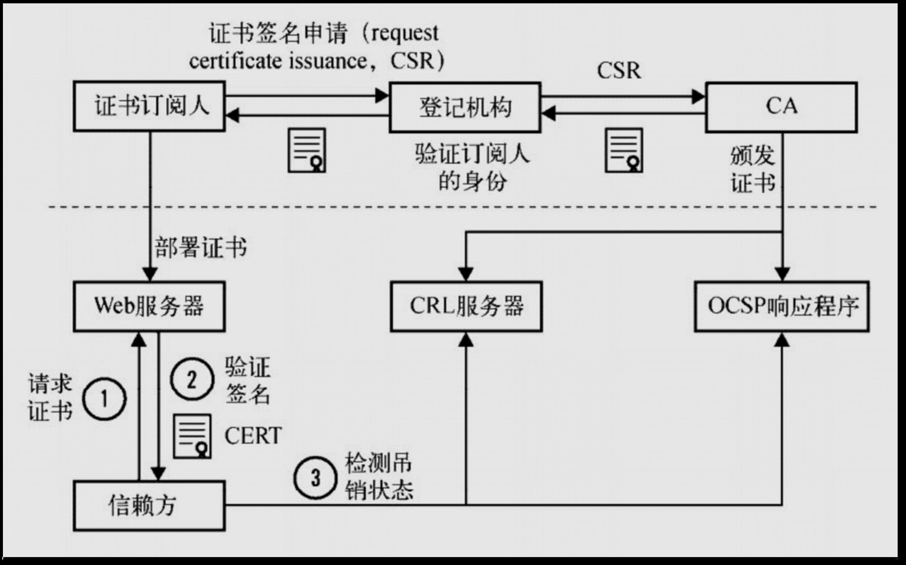
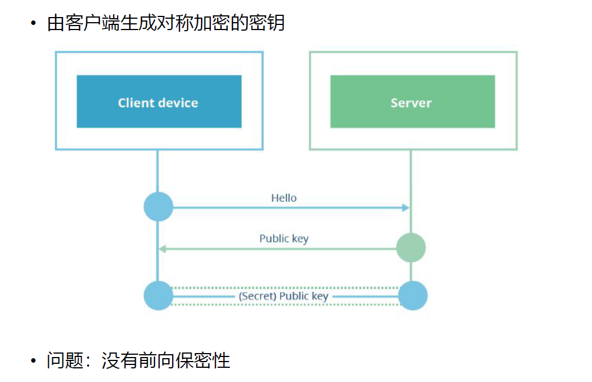
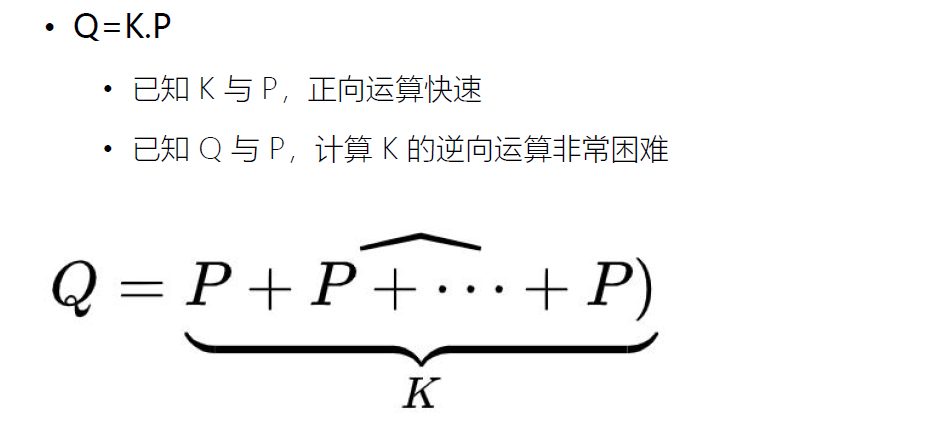
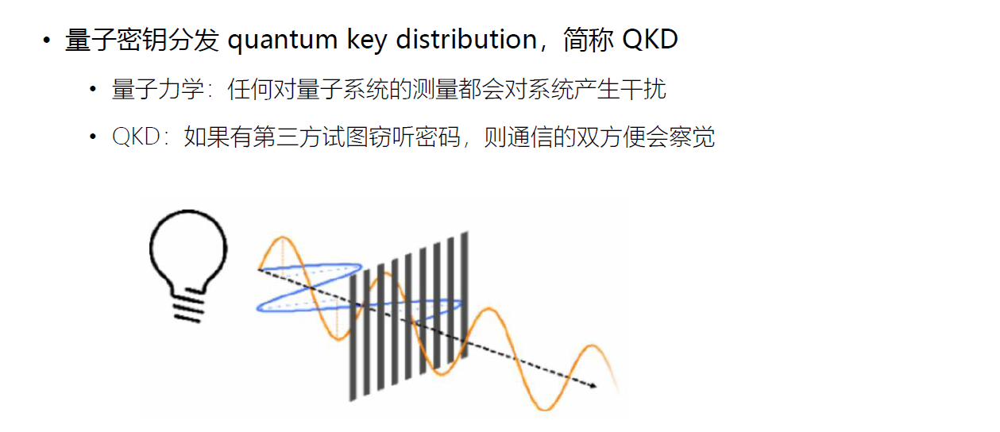

# 第 1 课 TLS/SSL 协议的工作原理

## TLS 设计目的

• 身份验证
• 保密性
• 完整性

## TLS/SSL 发展


## TLS 协议

• Record 记录协议
	• 对称加密
• Handshake 握手协议
	• 验证通讯双方的身份
	• 交换加解密的安全套件
	• 协商加密参数

## TLS 安全密码套件解读


# 第 2 课 对称加密的工作原理（1）：XOR 与填充

## 对称加密

## AES 对称加密在网络中的应用


## 对称加密与 XOR 异或运算 --对称加密基石


`A^B^B = A`异或两次密钥就会还原明文

## 填充 padding


# 第 3 课 对称加密的工作原理（2）：工作模式

## 分组工作模式 block cipher mode of operation

• 允许使用同一个分组密码密钥对多于一块的数据进行加密，并保证其安全性

## ECB（Electronic codebook）模式


## CBC（Cipher-block chaining）模式


## CTR（Counter）模式


## 验证完整性：hash 函数


## 验证完整性：MAC（Message Authentication Code）


这张图展示了消息认证码（Message Authentication Code, MAC）的生成和验证过程。MAC是一种用于确保数据完整性和身份验证的技术，通常在通信中使用。

### 发送方（Sender）
1. **消息（Message）**：发送方有一条需要发送的消息。
2. **密钥 (K)**：发送方和接收方共享一个秘密密钥。
3. **MAC算法**：发送方将消息和密钥输入到MAC算法中，生成一个MAC值。
4. **MAC值**：这个值是基于消息内容和密钥计算得出的固定长度的数据摘要。

### 接收方（Receiver）
1. **消息（Message）**：接收方收到发送方发来的消息。
2. **密钥 (K)**：接收方也拥有相同的秘密密钥。
3. **MAC算法**：接收方同样使用MAC算法，并将接收到的消息和密钥作为输入，重新计算出一个MAC值。
4. **比较MAC值**：
   - 如果两次计算得到的MAC值相同，则说明消息没有被篡改，且确实是来自正确的发送方。
   - 如果两个MAC值不同，则表示消息可能在传输过程中被修改或伪造。

通过这种方式，MAC可以保证消息的完整性和真实性。只有知道正确密钥的人才能生成匹配的MAC值，从而防止未经授权的第三方篡改信息。

## GCM


# 第 4 课 详解 AES 对称加密算法

## AES（Advanced Encryption Standard）加密算法

• 为比利时密码学家 Joan Daemen 和 Vincent Rijmen 所设计，又称 Rijndael 加密算法
• 常用填充算法：PKCS7
• 常用分组工作模式：GCM


## AES 的三种密钥长度


## AES 的加密步骤


## AES 加密流程


### （1）AddRoundKey 步骤


### 密钥扩展


### （2）SubBytes 步骤


### （3）ShiftRows 步


### （4） MixColumns 步骤


# 第 5 课 非对称密码与 RSA 算法

## 非对称密码


## 非对称加解密的过程


## RSA 算法


## RSA 算法中公私钥的产生

这就是RSA算法的一个简单示例，**它利用了大质数分解的困难性来实现安全的加密和解密过程**


这张图片介绍了RSA加密算法的基本步骤以及一个具体的例子。以下是详细的解释：


## RSA 算法加解密流程


# 第6课 基于 openssl 实战验证 RSA

## 使用 openssl 基于 RSA 算法生成公私钥

### • 生成私钥（公私钥格式参见 RFC3447）

​	• `openssl genrsa -out private.pem`


### 从私钥中提取出公钥

​	• `openssl rsa -in private.pem -pubout -out public.pem`


### 查看 ASN.1 格式的私钥

​	• `openssl asn1parse -i -in private.pem`


解析私钥中包含生成公私密钥中的 生成的


### 查看 ASN.1 格式的公钥

看 ASN.1 格式的公钥
• `openssl asn1parse -i -in public.pem (X.590)`


因为公钥(d,n)在bit string 中，继续解析

• `openssl asn1parse -i -in public.pem -strparse 19`


## 使用 RSA 公私钥加解密


```sh
# 加密文件
• openssl rsautl -encrypt -in hello.txt -inkey public.pem -pubin -out hello.en
# 解密文件
• openssl rsautl -decrypt -in hello.en -inkey private.pem -out hello.de
```

# 第 7 课 非对称密码应用：PKI 证书体系

## 非对称密码应用：数字签名


## 签发证书流程


## 签名与验签流程


这张图展示了数字签名的生成和验证过程。数字签名是一种用于确保数据完整性和身份认证的技术，通常在电子文档、电子邮件和其他在线通信中使用。

### 签名（Signing）流程：
1. **Hash Function**: 首先，对原始数据应用哈希函数，生成一个固定长度的哈希值。
2. **Encrypt Hash with Private Key**: 使用签名者的私钥加密这个哈希值，得到签名。
3. **Certificate**: 证书是与公钥绑定的身份证明文件，它可能包含在签名过程中。
4. **Attach to Data**: 将签名附加到原始数据上，形成数字签名的数据。

### 验证（Verification）流程：
1. **Digitally Signed Data**: 接收方收到带有数字签名的数据。
2. **Signature**: 提取数字签名中的签名部分。
3. **Decrypt using Public Key**: 使用签名者的公钥解密签名，得到原始的哈希值。
4. **Hash Function**: 对接收到的数据再次应用相同的哈希函数，生成新的哈希值。
5. **Compare Hashes**: 比较两个哈希值是否相等。如果相等，则说明签名有效，数据未被篡改；如果不相等，则说明数据已被篡改或签名无效。

通过这种方式，数字签名可以保证数据的完整性和发送者的真实性。

## 证书信任链


## PKI 公钥基础设施



## 证书类型


## 验证证书链


# 第 8 课 非对称密码应用：DH 密钥交换协议

## RSA 密钥交换



## DH 密钥交换


## DH 密钥交换协议举例


## DH 密钥交换协议的问题


# 第 9 课 ECC 椭圆曲线的原理

## ECC椭圆曲线的定义


## ECC 曲线的特性：+运算


## +运算的代数计算方法


## ECC+运算举例


## ECC 的关键原理



# 第 10 课 DH 协议升级：基于椭圆曲线的 ECDH 协议

## ECDH 密钥交换协议


## ECC 的关键原理


## ECDH 的步骤


## X25519 曲线


# 第 11 课 TLS1.2 与 TLS1.3 中的 ECDH 协议

## TLS1.2 通讯过程


## FREAK 攻击


## openssl 1.1.1 版本对 TLS1.3 的支持情况


## 测试 TLS 站点支持情况

https://www.ssllabs.com/ssltest/index.html


## TLS1.3 中的密钥交换


# 第 12 课 握手的优化：session 缓存、ticket 票据及 TLS1.3的0-RTT

## session 缓存：以服务器生成的 session ID 为依据


这张图展示了通过会话ID进行会话恢复的过程，具体步骤如下：

1. **客户端（Visitor）发送握手信息**：
   - 客户端向CloudFlare发送一个包含“Client random”和它支持的加密套件列表的消息。这个过程称为TLS握手的第一步。
2. **客户端发送会话ID**：
   - 在TLS握手过程中，如果客户端之前与服务器有过交互并保存了会话ID，那么在后续的连接中，客户端可以使用这个会话ID来尝试恢复之前的会话。
3. **CloudFlare查找对应的会话密钥**：
   - 当CloudFlare收到客户端发来的会话ID后，它会在其内部的加密数据库中查找与该会话ID相对应的会话密钥。
4. **会话恢复**：
   - 如果找到匹配的会话密钥，CloudFlare将使用这个密钥来解密和验证客户端发送的数据。由于双方都拥有相同的会话密钥，因此可以快速建立安全连接，而无需重新执行完整的TLS握手过程，从而提高了性能。

总结来说，通过会话ID进行会话恢复是一种优化机制，允许客户端和服务器利用先前协商好的会话密钥快速建立新的连接，避免了重复的公钥交换和计算密集型操作，显著提升了网络通信效率。

## session ticket


## TLS1.3 的 0RTT 握手


## 0-RTT 面临的重放攻击


这张图展示了0-RTT (Zero Round-Trip Time) 面临的重放攻击问题。0-RTT 是一种用于加速 TLS 握手的技术，它允许客户端在等待服务器确认之前就开始发送数据。然而，这种技术也带来了一些安全性挑战，特别是重放攻击。

### 图中的流程

1. **客户端发起POST请求**：客户端向服务器发送一个加密的0-RTT POST请求。
2. **服务器更改状态**：服务器接收到来自客户端的请求，并根据请求内容改变自己的状态。
3. **数据库更新**：服务器将相关信息更新到数据库中。

### 攻击者的行为

1. **攻击者拦截请求**：攻击者截获了客户端发送给服务器的加密0-RTT POST请求。
2. **攻击者重放请求**：攻击者将截获的请求重新发送给服务器。

### 后果

由于服务器无法区分原始请求和重放请求，它会对每个请求做出同样的反应，导致以下后果：
- 数据库可能被错误地更新多次。
- 系统可能会出现不一致的状态或行为。

### 解决方案

为了解决这个问题，通常需要采取一些额外的安全措施，例如：
- 使用一次性令牌（nonce）来确保每个请求都是唯一的。
- 实施更严格的身份验证和授权机制。
- 对请求的时间戳进行检查，以防止过期的请求被接受。

总之，虽然0-RTT 可以显著减少延迟并改善用户体验，但必须小心处理潜在的安全风险，如重放攻击。

# 第 13 课 TLS 与量子通讯的原理

## TLS 密码学回顾


## 克劳德·艾尔伍德·香农：信息论


## QKD 与光偏振原理



量子密钥分发（Quantum Key Distribution, QKD）是一种基于量子力学原理的安全通信协议，用于生成和分发共享的秘密密钥。QKD 利用了量子态不可克隆性和测量扰动性等特性，**使得任何窃听行为都会被发现**。

在这张图片中，主要介绍了以下几个概念：

1. **量子力**学：任何对量子子系统的测量量都会对系统产生干扰。这意味着在量子通信中，如果有人试图监听或篡改传输的信息，他们的行为会被检测出来。
2. **量子密钥分发（QKD）**：如果有第三方试图窃听密码，则通信的双方便会察觉。这是因为量子态一旦被测量就会塌缩，而且不同的测量基会导致不同的结果，这使得窃听者无法准确获取信息而不留下痕迹。
3. **波形图示例**：图中显示了一个光子的波函数，表示量子态随时间和空间的变化。这些波函数是量子力学的基础，用来描述粒子的位置、动量和其他物理属性的概率分布。

总的来说，QKD 提供了一种理论上无条件安全的密钥分发方法，适用于高度敏感的信息保护场景。

# 第 14 课 量子通讯BB84协议的执行流程

## BB84 协议


BB84 协议是一种量子密钥分发协议，由 Charles Bennett 和 Gilles Brassard 于 1984 年提出，因此得名 "BB84"。它是第一个被提出的量子密码学协议，用于在通信双方之间生成安全密钥，并利用量子力学的原理来确保密钥的保密性。以下是对 BB84 协议的介绍：

### 1. 协议概述

BB84 协议的核心思想是利用量子比特（qubits）的不可克隆性和量子态测量的随机性来实现安全的密钥分发。通信双方 Alice 和 Bob 可以通过一条量子信道（用于传输量子比特）和一条经典信道（用于公开信息）来交换密钥。BB84 协议确保即使有窃听者（通常称为 Eve）试图窃取信息，也无法获取密钥内容，因为窃听会被检测到。

### 2. 协议流程

BB84 协议的基本流程可以分为以下几个步骤：

#### **步骤 1**：选择基和生成量子比特

- Alice 生成一串随机的 0 和 1 作为原始比特串。
- 她随机选择两种基（基是量子态测量的方向），常用的有两种正交基：
  - **Z 基**（+ 基）： |0⟩ 和 |1⟩
  - **X 基**（× 基）： |+⟩ 和 |-⟩
- 对应比特值和基的量子态如下：
  - 在 Z 基中：0 表示 |0⟩，1 表示 |1⟩
  - 在 X 基中：0 表示 |+⟩，1 表示 |-⟩
- Alice 将原始比特串编码成量子态后，通过量子信道发送给 Bob。

#### **步骤 2**：Bob 的基选择和测量

- Bob 在接收量子比特时，随机选择 Z 基或 X 基来测量每个量子比特。
- 由于 Alice 和 Bob 的基选择是独立随机的，因此大约一半的比特会在相同的基下进行传输和测量，另一半则会因基的不同而导致测量结果不可靠。

#### **步骤 3**：基选择对比和丢弃不匹配的数据

- Alice 和 Bob 通过经典信道公开各自使用的基（不公开测量结果）。
- 当他们选择的基相同时，这些比特就可以保留；当基不同时，这些比特被丢弃。
- 剩下的比特串就是所谓的“原始密钥”。

#### **步骤 4**：检测窃听

- Alice 和 Bob 随机抽取一些比特，并公开它们的值来检测窃听者。
- 如果有窃听者（Eve）试图测量量子态，她的干预会改变测量结果，导致错误率增加。
- **如果错误率超过一定阈值，Alice 和 Bob 就可以判断量子信道可能被窃听，他们会丢弃该密钥并重新开始分发。**
- 如果错误率在安全范围内，他们就可以继续下一步。

#### **步骤 5**：信息协调和隐私放大

- 在确认安全性后，Alice 和 Bob 可以通过“信息协调”和“隐私放大”来进一步纠正错误并增强密钥的安全性，以生成最终的共享密钥。

### 3. BB84 协议的安全性

BB84 协议的安全性来源于量子力学的两个原理：

- **测量不可克隆性**：量子态无法被精确克隆，因此 Eve 不能无损复制量子比特。
- **测量扰动性**：任何对量子态的测量都会不可避免地改变量子态，从而引入错误，导致 Alice 和 Bob 能检测到窃听行为。

### 4. 应用场景

BB84 协议主要用于量子密钥分发（QKD），生成安全密钥，用于加密通信。通过 BB84 协议生成的密钥可以用于传统对称加密（如 AES）来实现保密通信。

### 总结

BB84 协议通过量子力学的原理确保密钥分发的安全性，即使存在窃听者，也无法在不被发现的情况下窃取密钥。这一特性使得 BB84 协议成为量子密码学领域的重要基础，被广泛研究并在量子通信系统中逐渐得到应用。

## BB84 协议示意图


这张图展示了量子密钥分发（Quantum Key Distribution, QKD）的一个实例，特别关注于BB84协议的工作原理。下面是对各个部分的详细说明：

1. **Alice's Bit Sequence**: 这是一系列随机产生的比特序列，作为要发送的信息基础。在这个例子中，Alice产生了以下比特序列：`1 0 1 1 0 0 1 1 0 0 1 1 1 0`

2. **Polarizers and Photon Source**: Alice使用两种类型的偏振器（polarizers）——水平/垂直（horizontal-vertical）和对角线（diagonal）。她随机选择每一步使用的偏振器类型，并相应地调整光子源发出的光子的偏振状态。

3. **Transmission**: 光子沿着光纤或其他介质从Alice传送到Bob。在此期间，光子的偏振状态保持不变。

4. **Bob's Detection Basis**: Bob也有两种类型的探测器（detectors）——水平/垂直和对角线。他独立且随机地选择每一步使用的探测器类型来检测光子的偏振状态。

5. **Measurement Results**: 根据所选的探测器类型，Bob记录下他的测量结果。例如，如果他选择了水平/垂直探测器并且检测到了一个水平偏振的光子，他会将其记录为"1"；如果是垂直偏振则记录为"0"。同样地，对于对角线探测器，对角线上半部分的光子被记作"1"，下半部分的光子被记作"0"。

6. **Sifted Key**: 最终得到的经过筛选的密钥（sifted key）是由Alice和Bob共同确定的。他们比较各自的选择，只保留那些两者使用相同类型的探测器时的结果。在这个例子中，最终得到的经过筛选的密钥是：`1 – – 1 0 0 – 1 0 0 – 1 0 0`

7. **Error Rate Calculation**: 由于量子力学的基本原理，即使没有外部干扰，也会有一定比例的误码率（error rate）。在这个案例中，误码率为50% * 50% = 25%，意味着大约四分之一的比特可能会因为探测器选择不当而导致错误。

通过这样的方式，Alice和Bob可以在没有任何中间人干预的情况下建立起一个共享的密钥，用于之后的经典通信加密。

## QKD 密钥纠错与隐私增强

