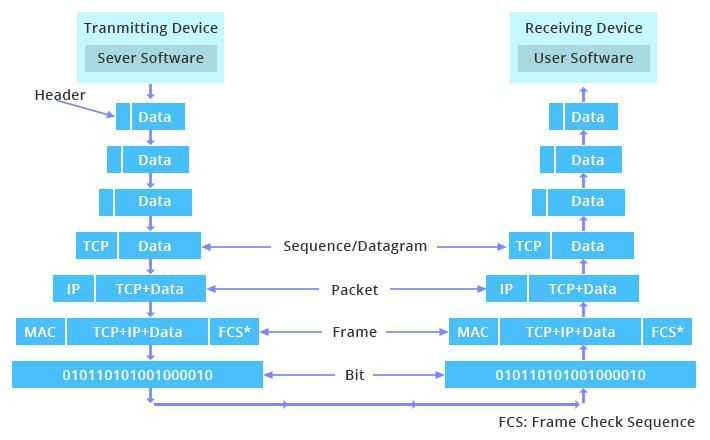
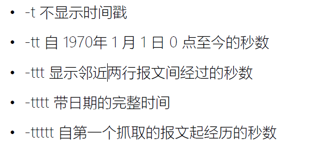
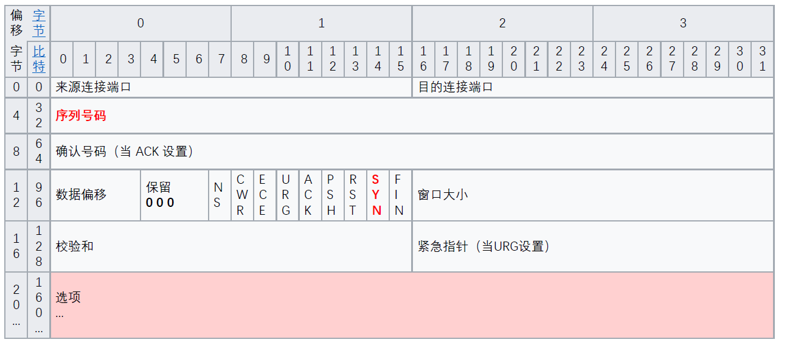
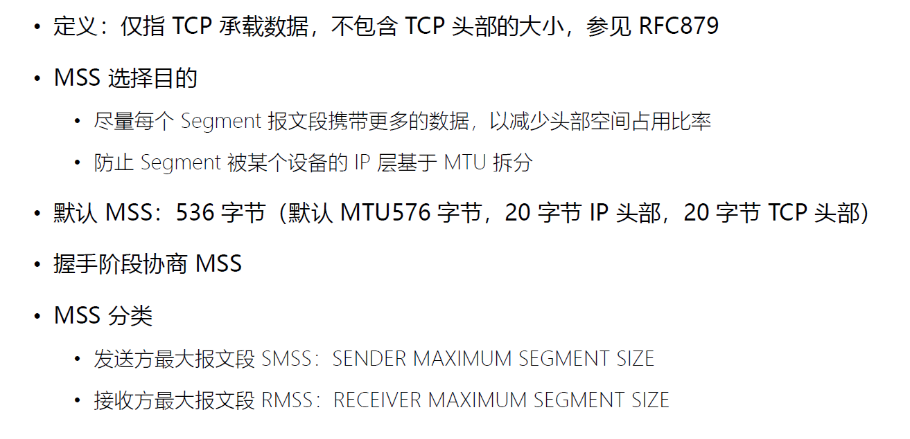
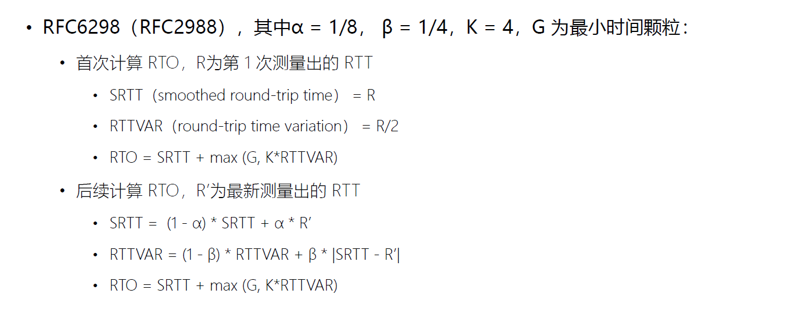
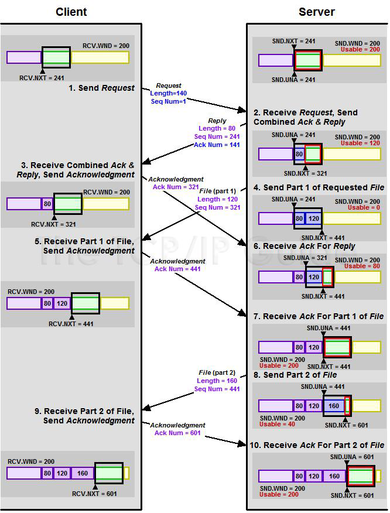
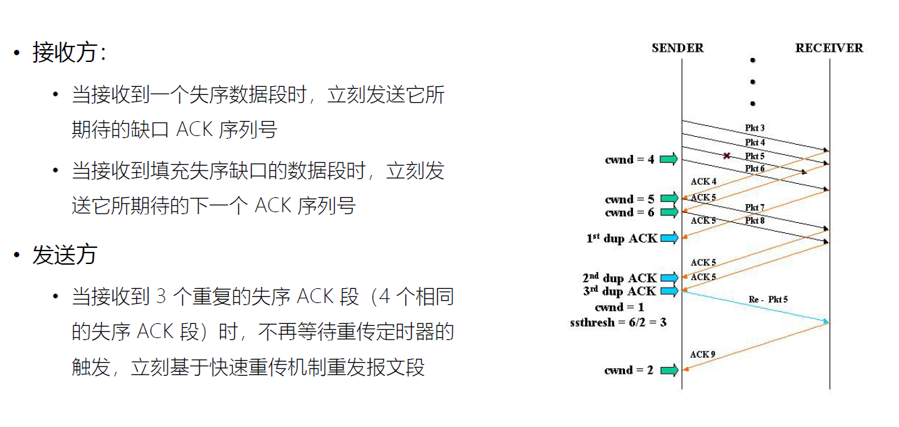
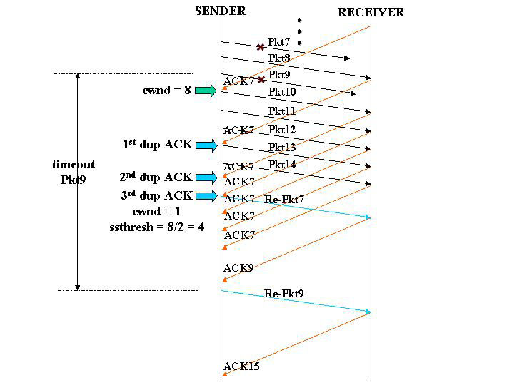

# 第 1 课 TCP 历史及其设计哲学

## TCP/IP 的前身 ARPA：NCP 协议


## 1973：TCP/IP 协议


## TCP/IP 协议发展


## TCPv4 协议分层后的互联网世界


## TCP/IP 的七个设计理念


# 第 2 课 TCP 解决了哪些问题？

## TCP 的作用


这张图展示了HTTP客户端如何通过互联网与HTTP服务器进行通信的过程。具体步骤如下：

1. **HTTP Client (Web Browser)**: 用户通过网页浏览器（HTTP客户端）发起HTTP请求。
2. **Client Network**: HTTP请求首先在网络客户端设备之间传递，然后通过路由器转发到互联网。
3. **Internet**: 请求通过互联网传输，经过多个路由器和网络节点到达目标服务器所在的网络。
4. **Server Network**: 请求进入服务器所在的目标网络，继续通过路由器转发直到达到HTTP服务器。
5. **HTTP Server (Web Site)**: HTTP服务器接收到请求，处理请求并返回相应的HTTP回复。
6. **Reply Transmission**: 回复沿原路径反向传输回客户端，依次通过服务器网络、互联网和客户端网络。
7. **HTTP Client (Web Browser)**: 最终，HTTP回复到达用户的网页浏览器，完成整个通信过程。

此图还标注了HTTP请求和回复的具体路径以及涉及的各种网络设备，包括路由器和网络节点。

## TCP协议的分层


## 层层嵌套的“信封”：报文头部



## 报文头部的层层组装与卸载


## TCP 协议特点

+ 在 IP 协议之上，解决网络通讯可依赖问题
	+ 点对点（不能广播、多播），面向连接
	+ 双向传递（全双工）
	+ 字节流：打包成报文段、保证有序接收、重复报文自动丢弃
	  + 缺点：不维护应用报文的边界（对比 HTTP、GRPC）
	  + 优点：不强制要求应用必须离散的创建数据块，不限制数据块大小
	+ 流量缓冲：解决速度不匹配问题
	+ 可靠的传输服务（保证可达，丢包时通过重发进而增加时延实现可靠性）
	+ 拥塞控制

# 第 3 课 TCP 报文格式

## 消息传输的核心要素

## IP头部


## UDP 头部


## TCP 协议的任务


## 如何标识一个连接？


## TCP Segment 报文段


### 常用选项


# 第 4 课 如何使用 tcpdump 分析网络报文

## 捕获及停止条件

• -D 列举所有网卡设备
• -i 选择网卡设备
• -c 抓取多少条报文
• --time-stamp-precision 指定捕获时的时间精度，默认毫秒 micro，可选纳秒 nano
• -s 指定每条报文的最大字节数，默认 262144 字节

## BPF：Expression 表达式


### 限定词


### 基于协议域过滤


## 文件操作


## 输出时间戳格式



## 分析信息详情


# 第 5 课 三次握手建立连接

## 握手的目标


TCP三次握手的过程中，客户端和服务器的序列号通常是不同的，这是正常的现象，因为每一方都会随机选择一个初始序列号来保证通信的安全性和防止数据包重传的混淆。让我们详细解释一下三次握手的流程和序列号的变化：

1. **客户端发送 SYN 包**：客户端首先向服务器发送一个带有 SYN 标志的包，表明希望建立连接。同时，客户端会随机生成一个初始序列号 ISNcISN_cISNc 并放在包中（设为 `Seq = ISN_c`），并等待服务器的响应。
2. **服务器返回 SYN + ACK 包**：服务器接收到客户端的 SYN 包后，同意建立连接并发送 SYN + ACK 包作为响应。此时，服务器也会生成一个随机的初始序列号 ISNsISN_sISNs，并将 `Seq = ISN_s` 放入包中。同时，服务器会在 `ACK` 字段中填入 `ISN_c + 1`，表示确认收到客户端的 SYN 包。
3. **客户端发送 ACK 包**：客户端接收到服务器的 SYN + ACK 包后，会发送一个 ACK 包来确认服务器的 SYN 包。此时，客户端会将 `Seq = ISN_c + 1`，并在 `ACK` 字段中填入 `ISN_s + 1`，表示已确认服务器的序列号。

在这个过程中，客户端的序列号和服务器的序列号在初始时各自随机生成，不会相同。这种随机性增加了TCP连接的安全性，防止外部攻击者猜测序列号并冒充连接。

## 三次握手


### 三次握手(1)：SYN 报文



### 三次握手(2)： SYN/ACK 报文


### 三次握手(3)： ACK 报文


# 第 6 课 三次握手状态变迁

## 三次握手流程


这张图展示了 TCP 三次握手的过程，说明了客户端和服务器在不同阶段的状态变化以及序列号（Seq Num）和确认号（Ack Num）的使用情况。

### 1. **CLOSED 状态**

表示没有任何连接，处于关闭状态。初始状态时，客户端和服务器都处于此状态。当应用程序试图建立连接时，会从 `CLOSED` 状态开始进入其他状态。

- **客户端和服务器**最初都处于 `CLOSED` 状态，表示没有连接。
- **客户端**发起连接请求（主动打开），进入 `SYN-SENT` 状态。
- **服务器**开始监听连接（被动打开），进入 `LISTEN` 状态。

### 2. **LISTEN 状态**

服务器在此状态下等待客户端的连接请求。通常是服务器的监听套接字在启动监听时进入 `LISTEN` 状态，准备接受传入的连接请求

- **服务器**在 `LISTEN` 状态中等待客户端的连接请求。

### 3. **SYN-SENT 状态**

客户端在发送 `SYN` 包之后进入此状态，等待服务器的 `SYN + ACK` 包以确认连接的建立。这种状态仅出现在客户端。

- **客户端**发送一个 SYN 包，包含一个随机生成的初始序列号 `Seq Num = 4567`。
- 发送完 SYN 包后，客户端进入 `SYN-SENT` 状态，等待服务器的响应。

### 4. **SYN-RECEIVED 状态**

服务器在收到客户端的 `SYN` 包并发送 `SYN + ACK` 包之后进入此状态。此状态表示服务器已经同意建立连接，并等待客户端的 `ACK` 包来确认连接的完成。

- **服务器**收到客户端的 SYN 包后，进入 `SYN-RECEIVED` 状态。
- **服务器**向客户端发送一个 SYN + ACK 包，包含服务器的随机初始序列号 `Seq Num = 12998`，并确认客户端的 SYN 包，`Ack Num = 4568`（即客户端序列号 + 1）。

### 5. **ESTABLISHED 状态**

连接已成功建立，客户端和服务器都可以开始在此状态下进行数据传输。在三次握手成功后，双方的状态都会变为 `ESTABLISHED`，表示连接进入数据传输阶段

- **客户端**收到服务器的 SYN + ACK 包后，发送一个 ACK 包来确认服务器的 SYN 包。
- **客户端的 ACK 包**中 `Seq Num = 4568`，`Ack Num = 12999`（服务器序列号 + 1）。
- **服务器**收到客户端的 ACK 包后，双方状态都进入 `ESTABLISHED`，连接建立完成，可以进行数据传输。

### 关键点

- **序列号（Seq Num）**：双方的初始序列号都是随机生成的，以确保连接的安全性。
- **确认号（Ack Num）**：用于确认接收方已收到的数据包，并加 1 表示期望的下一个序列号。

这个三次握手过程通过状态的逐步转换，保证了客户端和服务器之间的连接能够可靠地建立。

## netstat 命令查看 TCP 状态


## 两端同时发送SYN：双方使用固定源端口且同时建连接


# 第 7 课 三次握手中的性能优化与安全问题

## 服务器三次握手流程示例


这张图展示了 TCP 三次握手过程中服务器端的连接管理机制，特别是涉及操作系统内核中 SYN 队列和 ACCEPT 队列的处理过程。以下是各个步骤的解释：

1. **SYN 到达**：
   - 客户端向服务器发送 SYN 包，请求建立连接。
   - 服务器操作系统内核接收到 SYN 包后，将连接信息插入 **SYN 队列**（对应图中的步骤 1.2）。
   - SYN 队列的大小受 `tcp_max_syn_backlog` 参数限制，用于控制还未完成握手的连接请求数。
2. **SYN+ACK 发送**：
   - 服务器从 SYN 队列中取出连接信息（图中的步骤 2.2），并向客户端发送 SYN+ACK 包，表示同意连接并等待客户端的确认（ACK 包）。
   - 这一步在三次握手中属于服务器的第二步操作。
3. **ACK 到达**：
   - 客户端收到服务器的 SYN+ACK 后，发送 ACK 包来确认连接。
   - 当服务器接收到客户端的 ACK 包时，表明三次握手完成，连接正式建立（图中的步骤 2.1）。
   - 此时，服务器将该连接从 **SYN 队列**移入 **ACCEPT 队列**（步骤 2.3）。
4. **调用 accept**：
   - 应用程序（如 Nginx）调用 `accept` 系统调用，从 ACCEPT 队列中取出已完成握手的连接套接字，进行后续的数据传输处理。
   - ACCEPT 队列的大小由 `backlog` 参数控制，限制了可以排队等待 `accept` 的已连接套接字的数量。

### 总结

- **SYN 队列**：保存收到 SYN 包但未完成三次握手的半连接，受 `tcp_max_syn_backlog` 限制。
- **ACCEPT 队列**：保存完成三次握手、等待应用程序处理的已连接套接字，受 `backlog` 限制。
- **三次握手过程**：SYN -> SYN+ACK -> ACK，完成后进入 ACCEPT 队列，供应用程序使用。

这张图描述了服务器端连接处理的机制，特别是操作系统如何管理新连接的状态，从 SYN 队列到 ACCEPT 队列的转移，以保证高效连接管理。

## 超时时间与缓冲队列


## Fast Open 降低时延


这张图展示了 TCP Fast Open（TFO）技术与常规 TCP 连接的区别。TCP Fast Open 通过减少往返时间（RTT），加速了 TCP 连接的建立和数据传输，特别适用于重复连接的情况。

### 常规 TCP 连接（左侧图）

1. **第一次请求 (1st Req)**：
   - **SYN**：客户端向服务器发送 SYN 包，开始三次握手。
   - **SYN+ACK**：服务器回复 SYN+ACK，确认收到 SYN。
   - **ACK+HTTP GET**：客户端发送 ACK 完成三次握手，同时发送 HTTP GET 请求。
   - **Data**：服务器响应 HTTP GET 请求并返回数据。
   - **总耗时**：需要两个 RTT（Round-Trip Time，往返时间），一个用于三次握手，另一个用于发送和接收请求数据。
2. **第二次请求 (2nd Req)**：
   - 重复与第一次请求相同的三次握手过程。
   - 每次新连接都需要 2 个 RTT 来完成数据请求和响应。

### TCP Fast Open（右侧图）

1. **第一次请求 (1st Req)**：
   - **SYN**：客户端向服务器发送 SYN 包，开始三次握手。
   - **SYN+ACK+Cookie**：服务器回复 SYN+ACK，并附带一个 Cookie（用于标识客户端）。
   - **ACK+HTTP GET**：客户端发送 ACK 并附带 HTTP GET 请求。
   - **Data**：服务器响应 HTTP GET 请求并返回数据。
   - **总耗时**：与常规连接类似，首次连接仍需要 2 个 RTT。
2. **第二次请求 (2nd Req)**：
   - **SYN+Cookie+HTTP GET**：客户端利用之前获取的 Cookie，将 SYN 和 HTTP GET 请求合并发送。
   - **SYN+ACK+Data**：服务器在返回 SYN+ACK 的同时直接附带请求的数据。
   - **总耗时**：仅需 1 个 RTT 即可完成数据请求和响应，因为三次握手和数据传输同时进行。

### 关键点

- **Cookie 机制**：TCP Fast Open 使用服务器分配的 Cookie 来识别重复连接的客户端，以跳过传统的三次握手。
- **1 RTT 数据传输**：在重复连接时，客户端可在 SYN 包中附带数据，服务器直接回复数据，这样减少了 1 个 RTT，使得连接建立和数据传输更加高效。

### 总结

TCP Fast Open 技术在重复连接时有效减少了延迟，加快了数据传输速度，对于需要多次短时连接的应用场景（如 HTTP 请求）非常有用。

## Linux上打开TCP Fast Open


## 如何应对 SYN 攻击？


## tcp_syncookies


# 第 8 课 数据传输与 MSS 分段

## TCP 应用层编程示例


## TCP 流的操作


## TCP 流与报文段


图示表示应用层发送22字节流，报文段按mss分解成很多段

## MSS：Max Segment Size



## TCP 握手常用选项


# 第 9 课 重传与确认

## 报文有可能丢失


## PAR：Positive Acknowledgment with Retransmission


这张图片展示了一个简单的通信模型，说明了设备A和设备B之间的消息传输和确认机制。以下是详细的步骤解释：

1. **Device A 发送消息并启动计时器**：
   - Device A 向 Device B 发送一条消息，并同时启动一个计时器。

2. **Device B 接收消息并发送确认**：
   - Device B 收到消息后，向 Device A 发送一个确认消息。

3. **Device A 收到确认**：
   - Device A 收到确认消息后，知道消息已成功送达。

4. **重复上述过程**：
   - 这一过程会重复多次，每次 Device A 都会发送消息并等待确认。

5. **消息丢失情况**：
   - 如果某个消息在传输过程中丢失（如图中标记为红色叉号的消息），Device B 将不会收到该消息，因此也不会发送确认。

6. **超时重传**：
   - 当 Device A 的计时器到期而仍未收到确认时，它会重新发送之前的消息，并再次启动计时器。

7. **最终确认**：
   - Device B 最终收到重发的消息后，会发送确认消息，Device A 收到确认后，知道消息已经成功送达。

8. **循环结束**：
   - 这一过程会继续下去，直到所有消息都成功传输并得到确认。

这种机制确保了消息的可靠传输，即使在某些情况下消息可能会丢失或延迟。通过使用计时器和重传机制，可以有效地检测和纠正传输错误。

## 提升并发能力的 PAR 改进版


这张图片展示了一种称为“滑动窗口”(Sliding Window)的流量控制机制，用于管理两个设备(Device A 和 Device B)之间的数据传输。滑动窗口机制允许发送方在未收到确认前连续发送多个数据包，从而提高传输效率。图中描述了这一机制的工作原理以及当数据包丢失时的应对措施。

- **初始状态**: 设备A开始发送第一个数据包(Message #1)，并将发送限制(Limit)设置为2。这意味着它可以连续发送两个数据包而不必等待确认。
- **正常操作**:
  - 设备A发送Message #1和#2。
  - 设备B收到这两个数据包后，分别发送Ack #1和Ack #2作为确认。
  - 设备A收到Ack #1后，可以发送下一个数据包(Message #3)。
  - 设备B收到Message #3后，发送Ack #3作为确认。
  - 设备A收到Ack #2后，可以发送下一个数据包(Message #4)。
  - 设备B收到Message #4后，发送Ack #4作为确认。
- **数据包丢失的情况**:
  - 假设Message #4丢失，设备A没有收到Ack #4，其定时器(Timer)到期后会重新发送Message #4。
  - 设备B收到重新发送的Message #4后，发送Ack #4作为确认。
- **调整发送限制**:
  - 根据确认(Acknowledgment)的接收情况，设备A会动态调整其发送限制(Limit)。例如，在收到Ack #4后，设备A将其发送限制提升至2，然后发送Message #5和#6。

通过这种方式，滑动窗口机制能够在保证数据完整性和顺序的同时，最大化利用网络带宽，提高传输效率。

## Sequence 序列号/Ack 序列号


演示序列号是针对字节的


## 确认序号


## TCP 序列号


## PAWS (Protect Against Wrapped Sequence numbers)

**PAWS (Protection Against Wrapped Sequence numbers)**

- **定义**：PAWS是一种防止序列号回绕的机制。
- **作用**：PAWS通过在TCP选项中携带一个时间戳（Timestamp Option），并在接收端检查时间戳来判断序列号是否已经回绕。如果接收到的段的时间戳比之前接收到的段的时间戳旧，则认为该段可能是重复的或回绕的，从而丢弃该段。


## BDP 网络中的问题


# 第 10 课 RTO 重传定时器的计算

## 如何测量 RTT？


## 如何在重传下有效测量 RTT？


**使用TCP的时间戳选项（TCP Timestamps Option）**

- TCP时间戳选项（通常在TCP头的可选字段中）包含发送方的时间戳，并在响应的确认包中带回这些时间戳。
- 时间戳选项（RFC 1323）可以帮助准确测量RTT，尤其是在高速网络环境中，时间戳可以防止因重传和其他网络因素造成的测量误差。
- **计算方法**：发送方记录发送时间戳，接收方在响应的ACK包中回显此时间戳。发送方在收到ACK包时计算当前时间与发送时间的差值，从而得出RTT。

## RTO（ Retransmission TimeOut ）应当设多大


## RTO 应当更平滑


## 追踪 RTT 方差  --linux



# 第 11 课 滑动窗口：发送窗口与接收窗口

## 滑动窗口：发送窗口快照


### 可用窗口/发送窗口


### 46-51 字节已发送


### 32 到 36 字节已确认


## 发送窗口


### 约等于对端发送窗口的接收窗口


**类别#1 和#2 (紫色区域)**

- **序列号范围：28-31**
- **状态**：已接收并确认 (Received and Acknowledged)
  这些数据字节已经被接收端成功接收，并向发送端发送了确认（ACK）。发送端知道这些数据已经安全到达。

**类别#3 (绿色区域)**

- **序列号范围：32-51**
- **状态**：尚未接收，但发送端被允许发送 (Not Yet Received, Transmitter Permitted To Send)
  这部分是接收窗口的有效范围，接收端允许发送端发送这些数据字节。这部分表示当前窗口可以容纳的数据。

**类别#4 (黄色区域)**

- **序列号范围：52-55**
- **状态**：尚未接收，发送端不允许发送 (Not Yet Received, Transmitter May Not Send)
  这部分数据超出了当前接收窗口的范围，接收端不会接受这些数据，因此发送端必须等待窗口扩大才能发送。

# 第 12 课 窗口的滑动与流量控制

在TCP协议中，以下四个重要的变量用于描述发送端和接收端的状态以及窗口的管理机制：

1. **SND.UNA (Send Unacknowledged)**  

- **定义**：发送端最近未被确认的最小序列号。  
- **作用**：指示发送端已发送但尚未收到接收端确认（ACK）的第一个字节序列号。  
- **意义**：  
  - 发送端知道`SND.UNA`之前的字节已经成功被接收端确认。
  - 表示发送窗口的左边界。


2. **SND.NXT (Send Next)**  

- **定义**：发送端下一个要发送的字节序列号。  
- **作用**：指示发送端尚未发送的下一个字节。  
- **意义**：  
  - 随着发送数据，`SND.NXT`会增加。  
  - 表示发送窗口内已发送数据的结束位置，也可能标识发送窗口的右边界。


3. **SND.WND (Send Window)**  

- **定义**：发送窗口的大小，由接收端通告的`RCV.WND`决定。  
- **作用**：限制发送端在未收到确认（ACK）前，最多可以发送的数据量。  
- **意义**：  
  - 保证发送端不会发送超出接收端缓冲区容量的数据。  
  - 通过流量控制机制动态调整。

计算公式：
发送窗口范围=[SND.UNA,SND.UNA+SND.WND]


4. **RCV.NXT (Receive Next)**  

- **定义**：接收端希望接收的下一个字节序列号。  
- **作用**：指示接收端的接收状态和期望的下一个序列号。  
- **意义**：  
  - 发送端根据接收端的ACK更新自身的状态。  
  - 表示接收窗口的左边界。


5. **RCV.WND (Receive Window  

- **定义**：接收窗口的大小，指接收端还能容纳的字节数。  
- **作用**：接收端通过ACK报文中的`RCV.WND`告知发送端当前可接收数据的范围。  
- **意义**：  
  - 帮助发送端控制流量，避免数据拥堵。
  - 窗口滑动机制：当接收端处理并确认数据后，窗口向前滑动以接收更多数据。

计算公式：
接收窗口范围=[RCV.NXT,RCV.NXT+RCV.WND]


## TCP窗口滑动示例


## 客户端消息的发送


## 服务器消息的发送



# 第 13 课 操作系统缓冲区与滑动窗口的关系

## 窗口与缓存


## 收缩窗口导致的丢包


## 飞行中报文的适合数量


## Linux下调整接收窗口与应用缓存


## Linux中对TCP缓冲区的调整方式


# 第 14 课 如何减少小报文提高网络效率

## SWS(Silly Window syndrome)糊涂窗口综合症


## SWS 避免算法


## TCP delayed acknowledgment 延迟确认


## Nagle VS delayed ACK


## Linux 上更为激进的”Nagle”：TCP_CORK

• 结合 sendfile 零拷贝技术使用

# 第 15 课 拥塞控制（1）：慢启动

## 全局思考：拥塞控制


## 拥塞控制历史


## 慢启动


这张图讲解的是 **TCP 拥塞控制机制中的拥塞窗口（`cwnd`）** 和其增长策略。


### **主要内容解释：**

1. **拥塞窗口（`cwnd`）：**
   - 拥塞窗口是 TCP 协议用来控制数据发送速度的窗口，表示发送方在不引发网络拥塞的情况下，可以发送的最大数据量。
   - 公式：发送窗口大小公式：发送窗口大小 (`swnd`) = `min(cwnd, rwnd)` 
     - `cwnd`: 拥塞窗口，由网络拥塞状态决定。
     - `rwnd`: 接收窗口，是接收方广告的可用缓冲区大小。
2. **`cwnd`的增长策略（图中描述的是 \**慢启动阶段\**）：**
   - 每收到一个 **ACK（确认包）**，发送方会将拥塞窗口 `cwnd` 的大小 **翻倍**。
   - 图中展示的过程：
     - 发送方开始时发送少量数据（`packet`）。
     - 接收方返回 ACK 后，`cwnd` 随每次确认的到来快速增大。
     - 数据包发送量呈 **指数级增长**（`1 -> 2 -> 4 -> 8...`）。
3. **图中的内容：**
   - 横轴：时间。
   - 纵轴：序列号（Sequence Number）。
   - 方块（蓝色）：发送的数据包（`packet`）。
   - 圆圈（黄色）：接收方的 ACK 包。
   - 数据包和 ACK 包的交替代表了发送和确认的过程，反映 `cwnd` 的逐步扩张。


### **核心机制：慢启动**

- **起点**：TCP 连接开始时，`cwnd` 设置为一个较小值（通常是 1 个 MSS）。
- **增长方式**：每次收到 ACK 后，`cwnd` 加倍，形成指数增长。
- **作用**：探测网络带宽的可用情况，确保在不拥塞网络的情况下尽快增加吞吐量。

## 慢启动的初始窗口


# 第 16 课 拥塞控制（2）：拥塞避免

## 拥塞避免


## 慢启动与拥塞控制


# 第 17 课 拥塞控制（3）：快速重传与快速恢复

## 为何会接收到一个失序数据段？


## 快速重传（RFC2581）



## 超时不会启动快速重传



## 快速重传下一定要进入慢启动吗？


## 快速恢复（RFC2581）


# 第 18 课 SACK 与选择性重传算法

## 仅重传丢失段保守乐观


## 重传所有段--积极悲观


## SACK：TCP Selective Acknowledgment


## 引入SACK


## SACK


# 第 19 课 从丢包到测量驱动的拥塞控制算法

## 飞行中的数据与确认报文


## 大管道向小管道传输数据引发拥堵


## 最佳控制点在哪？


## 空队列的效果最好！


## BBR：TCP Bottleneck Bandwidth and Round-trip propagation time


# 第 20 课 Google BBR 拥塞控制算法原理

## BBR 在 Youtube 上的应用：吞吐量提升


## BBR 在 Youtube 上的应用：RTT 时延变短


## BBR 在 Youtube 上的应用：重新缓冲时间间隔变长


## 最佳控制点在哪


## BBR 如何找到准确的 RTprop 和 BtlBw？


## 基于 pacing_gain 调整


## 当线路变换时 pacing_gain 的作用


## 对比 CUBIC 下的慢启动


## 多条初始速度不同的 TCP 链路快速的平均分享带宽


## Google B4 WAN实践


## RTT 大幅下降


## 不同丢包率下的吞吐量：CUBIC VS BBR


## Youtube 一周以上 2 亿次播放数据统计


## SGSN 移动网络


## 收到 Ack 时


## 当发送数据时


# 第 21 课 四次握手关闭连接

## 关闭连接：防止数据丢失；与应用层交互


## 两端同时关闭连接


## TCP 状态机 [握手和回收状态变化概览]


这张图片展示了 **TCP（三次握手和四次挥手）连接的状态转移图**，描述了从建立连接到断开连接过程中可能的状态及其转移路径。以下是对图中主要部分的解释：

---

### 1. **CLOSED 状态**

- 表示当前连接处于关闭状态（初始状态）。
- 可能的动作：
  - **被动打开（Passive Open）**：等待外部连接请求，进入 `LISTEN` 状态。
  - **主动打开（Active Open）**：发起连接请求，发送 SYN，进入 `SYN-SENT` 状态。

---

### 2. **建立连接的三次握手**

- **LISTEN 状态**（服务器端）：
  - 等待接收到客户端的 SYN（同步）报文。
  - 接收到后，发送 SYN + ACK 报文，进入 `SYN-RECEIVED` 状态。

- **SYN-SENT 状态**（客户端）：
  - 客户端发送 SYN 报文后，进入此状态，等待服务器响应。
  - 接收到服务器的 SYN + ACK 后，发送 ACK，进入 `ESTABLISHED` 状态。

- **SYN-RECEIVED 状态**：
  - 当服务器收到 ACK 后，进入 `ESTABLISHED` 状态。

- **ESTABLISHED 状态**：
  - 连接已建立，双方可以进行数据传输。

---

### 3. **关闭连接的四次挥手**

**主动关闭方**（Initiator Sequence）：

- **FIN-WAIT-1 状态**：
  - 主动发起关闭连接，发送 FIN 报文，等待对方确认。
  - 接收到对方的 ACK 后，进入 `FIN-WAIT-2` 状态。

- **FIN-WAIT-2 状态**：
  - 等待对方发送 FIN 报文。
  - 接收到对方的 FIN 后，发送 ACK，进入 `TIME-WAIT` 状态。

- **TIME-WAIT 状态**：
  - 等待一定时间（确保对方收到 ACK），然后进入 `CLOSED` 状态。

**被动关闭方**（Responder Sequence）：

- **CLOSE-WAIT 状态**：
  - 接收到对方的 FIN 报文，发送 ACK。
  - 等待应用程序处理关闭请求。

- **LAST-ACK 状态**：
  - 应用程序完成处理后，发送 FIN 报文，等待对方确认。
  - 接收到对方的 ACK 后，进入 `CLOSED` 状态。

---

### 4. **特殊状态**

- **CLOSING 状态**：
  - 如果双方几乎同时发起关闭连接请求（即双方都发送 FIN 报文），进入此状态。
  - 发送和接收 ACK 后进入 `TIME-WAIT` 或直接关闭。

---

### 总结

1. **三次握手**：`SYN` → `SYN-ACK` → `ACK`，进入 `ESTABLISHED` 状态。
2. **四次挥手**：`FIN` → `ACK` → `FIN` → `ACK`，最终进入 `CLOSED` 状态。
3. 每个状态中操作和响应严格按照 TCP 协议规范进行，以确保可靠的数据传输和连接控制。

# 第 22 课 优化关闭连接时的TIME-WAIT状态

## TIME-WAIT状态过短或者不存在会怎么样？


## linux下TIME_WAIT优化：tcp_tw_reuse


## TIME_WAIT 优化


## RST 复位报文


# 第 23 课 keepalive 、校验和及带外数据

## TCP 的 Keep-Alive 功能


这张图片详细介绍了 **TCP 的 Keep-Alive 功能**，主要是关于 Linux 系统中 TCP Keep-Alive 的相关参数配置和其作用。以下是具体说明：

---

### **TCP Keep-Alive 功能的作用**
- **目的**：用于在空闲状态下检测连接是否仍然存活，避免死连接长时间占用系统资源。
- **工作原理**：在一个 TCP 连接没有数据传输的情况下，周期性发送探测包给对端。如果对端没有响应，则判断连接可能已经失效。
- **应用场景**：
  - 长时间空闲的 TCP 连接，例如数据库连接或后台服务。
  - 检测网络异常（例如设备断网或掉线）。

---

### **Linux 的 TCP Keep-Alive 参数**

1. **`net.ipv4.tcp_keepalive_time`**  
   - **含义**：空闲时间的周期。TCP 连接在空闲多长时间后开始发送 Keep-Alive 探测包。
   - **默认值**：7200 秒（2 小时）。
   - **解释**：假如一个连接在 7200 秒内没有任何数据传输，就会触发 Keep-Alive 探测机制。

2. **`net.ipv4.tcp_keepalive_intvl`**  
   - **含义**：探测包发送的时间间隔。即第一次发送探测包后，每隔多少秒再发送一次。
   - **默认值**：75 秒。
   - **解释**：如果前一个探测包没有响应，75 秒后发送下一个探测包。

3. **`net.ipv4.tcp_keepalive_probes`**  
   - **含义**：重试次数。探测包重试的最大次数。
   - **默认值**：9 次。
   - **解释**：如果连续 9 次探测都没有收到对端响应，则认为连接失效并关闭连接。

---

### **TCP Keep-Alive 的流程**
1. 在连接建立后，当连接处于 **空闲状态** 且时间超过 `tcp_keepalive_time` 时，开始发送第一个 Keep-Alive 探测包。
2. 如果探测包没有收到对端响应，系统按照 `tcp_keepalive_intvl` 间隔发送下一个探测包。
3. 如果连续 `tcp_keepalive_probes` 次探测都没有响应，连接被判定为失效，TCP 会关闭该连接。

---

### **实际应用与优化建议**
- **默认值过长**：默认设置下，2 小时空闲后才开始检测，并且需要 75 秒间隔发送 9 次探测（约 11 分钟）才能确定连接失效，这对敏感服务可能过慢。
- **优化建议**：
  - 缩短 `tcp_keepalive_time`，例如设置为 600 秒（10 分钟），以更快检测空闲连接。
  - 调整 `tcp_keepalive_intvl` 和 `tcp_keepalive_probes`，例如：
    - `tcp_keepalive_intvl = 30`
    - `tcp_keepalive_probes = 5`

---

### **相关命令**
- 查看当前设置：
  ```bash
  sysctl net.ipv4.tcp_keepalive_time
  sysctl net.ipv4.tcp_keepalive_intvl
  sysctl net.ipv4.tcp_keepalive_probes
  ```
- 修改参数（临时）：
  ```bash
  sysctl -w net.ipv4.tcp_keepalive_time=600
  sysctl -w net.ipv4.tcp_keepalive_intvl=30
  sysctl -w net.ipv4.tcp_keepalive_probes=5
  ```
- 修改参数（永久）：
  将参数添加到 `/etc/sysctl.conf` 文件中，然后执行 `sysctl -p` 应用更改。

---

### 总结
TCP Keep-Alive 功能是一种轻量的方式来检测空闲连接的存活状态，通过合理配置参数，可以避免死连接问题并提高网络资源利用率。

## 违反分层原则的校验和


## 应用调整 TCP 发送数据的时机


## 紧急处理数据


# 第 24 课 面向字节流的 TCP 连接如何多路复用？

## Multiplexing 多路复用


## HTTP2：TCP 连接之上的多路复用


## 非阻塞 socket：同时处理多个 TCP 连接


## epoll+非阻塞 socket


## epoll 为什么高效？


## 非阻塞+epoll+同步编程 = 协程


# 第 25 课 四层负载均衡可以做什么？

## OSI 模型下的七层 LB 与四层 LB


## 四层负载均衡与表示层的 TLS 卸载


## 四层负载均衡与连接五元组


## 三层路由器与四层负载均衡


## 多层 LB


## 信任的边界


## UDP 负载均衡的理论依据

