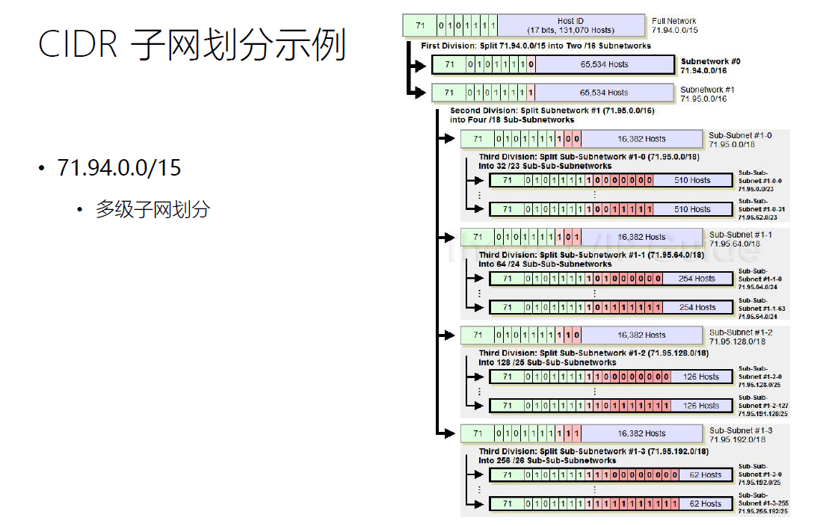
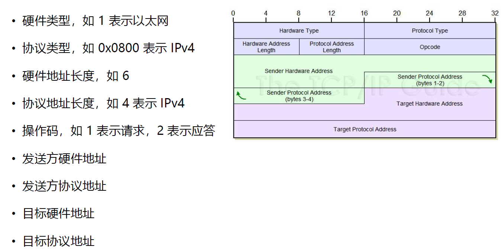
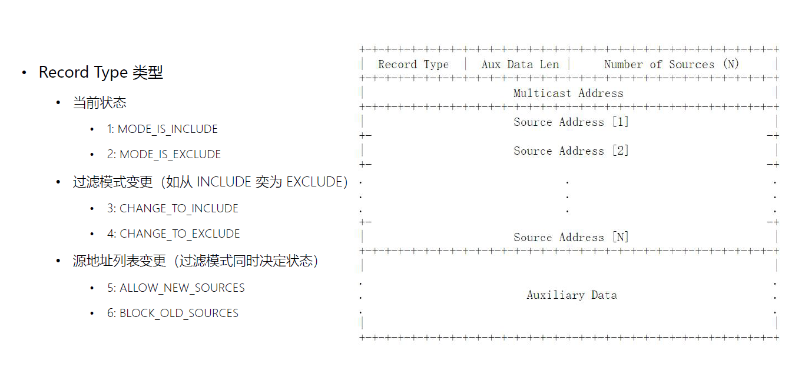

# 第 1 课 网络层与链路层的功能

## 网络层功能

## 数据链路层功能

## 细腰结构：IP 网络层的核心地位

## 多播：广播与组播

## 路由器与交换机

## 网络传输示例

这张图展示了一个典型的网络数据传输路径，包括本地网络（LAN）、路由器、互联网和目标服务器的连接结构。以下是详细解释：

---

### 1. **网络结构概述**
- **Client Host**:
  - 位于局域网内的客户端设备，例如一台电脑。
  - **IP 地址**：`10.2.14.77`（私有地址，用于局域网通信）。
  - **硬件地址**：`0A-A7-94-07-CB-D0`（MAC 地址，用于局域网内设备的唯一标识）。

- **Local Router**:
  - 局域网的网关设备，用于连接局域网和互联网。
  - **LAN IP 地址**：`10.2.14.1`（路由器在局域网内的 IP 地址）。
  - **Hardware Address**：未显示（路由器的 MAC 地址）。
  - 路由器在不同网络之间进行数据包转发。

- **Internet**:
  - 中间的网络设备（路由器、交换机等）将数据从局域网转发到目标服务器。

- **Internet Server**:
  - 位于远程的目标服务器。
  - **IP 地址**：`21.44.191.36`（公有地址，可被互联网访问）。

---

### 2. **数据传输路径**
数据从客户端发往目标服务器时，经历以下步骤：
1. **Link #1**:
   - 客户端主机通过局域网，发送数据包到路由器。
   - 局域网内通过 **ARP 协议** 将 IP 地址解析为硬件地址（MAC 地址）。

2. **Link #2 到 Link #6**:
   - 路由器将数据包发往互联网，通过多条网络链路（路由器间的路径）转发。
   - 每条链路（Link #2、Link #3、...）可能是不同的物理或逻辑网络设备。

3. **Internet Server**:
   - 数据包到达目标服务器（`21.44.191.36`）。
   - 服务器根据数据包的内容进行处理，并可能返回响应。

---

### 3. **地址类型说明**
- **私有 IP 地址**（局域网）：
  - `10.2.14.77` 和 `10.2.14.1` 是典型的私有地址，不能直接被互联网访问。
  - 通过路由器的 **NAT（网络地址转换）** 将私有地址转换为公网地址，才能与目标服务器通信。

- **公有 IP 地址**（互联网）：
  - `21.44.191.36` 是公有地址，能直接在互联网中访问。

- **硬件地址（MAC 地址）**：
  - 局域网内使用硬件地址（MAC 地址）进行设备识别，数据传输时仅在局域网有效。

---

### 4. **技术细节**
- **NAT（网络地址转换）**：
  - 路由器将局域网内的私有地址映射为公有地址，以便与互联网通信。

- **路由选择**：
  - 数据在互联网中经过多个路由器（Link #3 到 Link #6），根据路由表选择最佳路径。

- **分层模型**：
  - 数据传输涉及 **OSI 七层模型** 中的网络层和数据链路层：
    - **网络层（IP 地址）**：确保数据从源设备传输到目标设备。
    - **数据链路层（MAC 地址）**：确保数据包在局域网内正确传输。

---

### 5. **总结**
- 图中描述了一个典型的从局域网设备到互联网服务器的通信流程。
- 路由器和互联网设备共同负责转发数据包，而 IP 地址和 MAC 地址在不同层次起到各自的作用。
- 这种网络通信方式是互联网基础架构的核心部分。

# 第 2 课 IPv4 分类地址

## 易用性：IPv4 地址的点分十进制表示

## IP 地址的分配机构

## 当互联网规律很小时，类别信息被编码进 IP 地址

## 分类 IP 地址的优点

## 分类 IP 寻址的问题

# 第 3 课 CIDR无分类地址

## CIDR 子网掩码

## CIDR 子网划分示例

## 208.130.29.33 的寻址历程

## 全 0 或者全 1 的特殊含义

## 预留 IP 地址（RFC1918）

# 第 4 课 IP 地址与链路地址的转换：ARP 与 RARP 协议

## 链路层 MAC 地址

## 2.5 层协议 ARP：从 IP 地址寻找 MAC 地址

## 2.5 层协议：ARP

## ARP 报文格式：FrameType=0x0806

## 硬件类型与操作码

## 2.5 层协议 RARP：从 MAC 地址中寻找 IP 地址

## RARP 的工作流程

## RARP 报文格式：FrameType=0x8035

## ARP 欺骗（ARP spoofing/poisoning）

# 第 5 课 NAT 地址转换与 LVS 负载均衡

## IPv4 地址短缺

这张图描述了 **IPv4 地址分配** 和 **子网划分（Subnetting）** 的一个场景，并且重点体现了 **IPv4 地址短缺问题** 的解决方法之一，即通过子网划分优化地址利用率。

---

### 图解说明

1. **左侧的“1000 addresses”**：
   - 表示总共分配了 1000 个 IPv4 地址。
   - 如果不进行子网划分，这些地址可能被分配给一个大网络，导致浪费（例如一个小网络可能只需要几十个地址）。

2. **“Routeur central”（核心路由器）**：
   - 核心路由器负责连接所有的子网（`Sous-réseaux`）。
   - 核心路由器的任务是将流量转发到正确的子网。

3. **右侧的子网（Sous-réseaux）**：
   - 每个子网的网络地址如下：
     - `193.48.100.0/24`
     - `193.48.101.0/24`
     - `193.48.102.0/24`
     - `193.48.103.0/24`
   - `/24` 表示每个子网的子网掩码是 `255.255.255.0`，每个子网可以容纳 256 个地址（实际可用 254 个地址，预留广播地址和网络地址）。

---

### 核心概念解释

1. **IPv4 地址短缺问题**：
   - IPv4 地址长度为 32 位，全球总共只有约 43 亿个地址。
   - 随着互联网设备数量的增加，IPv4 地址资源已经耗尽，因此需要优化分配方式。
   - 子网划分是减少浪费的一种有效方法。

2. **子网划分（Subnetting）**：
   - 子网划分的目的是将一个较大的网络划分为多个小的子网。
   - 例如：原本 `193.48.0.0/22` 的网络（1024 个地址），通过划分生成 4 个子网（每个 /24 的网络）。

3. **CIDR（无类别域间路由）**：
   - 图中使用 CIDR 表示法（例如 `193.48.100.0/24`）。
   - CIDR 允许灵活分配地址块，解决传统类 A/B/C 网络分配过于僵化的问题。

---

### 图中场景总结

- IPv4 地址块被划分为 4 个子网，每个子网 `/24`。
- 核心路由器通过路由表管理这些子网之间的流量。
- 子网划分减少了地址浪费，提高了 IPv4 地址利用率。

---

### 实际应用

- **局域网划分**：企业内部可能有多个部门，每个部门对应一个子网。
- **服务隔离**：将不同服务部署到不同的子网中，增加安全性。
- **地址规划**：在地址资源有限的情况下，通过子网划分精确分配地址。

如果需要进一步优化地址利用，可以考虑迁移到 **IPv6**，它提供了更多的地址空间。

## 少量的公网 IP VS 大量的主机

## NAT（IP Network Address Translator）应用的前提

• 内网中主要用于客户端访问互联网
• 同一时间仅少量主机访问互联网
• 内网中存在一个路由器负责访问外网

## 单向（向外）转换 NAT：动态映射

这张图展示了网络地址转换（NAT）的工作原理。NAT是一种将私有IP地址转换为公有IP地址的技术，以便在互联网上进行通信。

以下是图中各个部分的详细解释：

1. **客户端发送请求**：
   - 客户端（Client）位于本地网络（Inside），其IP地址是10.0.0.207。
   - 客户端向服务器（Server）发送请求，目标IP地址是204.51.16.12。

2. **NAT路由器翻译源地址**：
   - NAT路由器接收到客户端的请求后，会将源地址从10.0.0.207转换为一个全局可路由的地址194.54.21.11。
   - 转换后的请求被发送到互联网上的服务器。

3. **服务器发送响应**：
   - 服务器接收到来自NAT路由器的请求，并发送响应回NAT路由器。
   - 响应的目标地址仍然是194.54.21.11。

4. **NAT路由器翻译目的地址**：
   - NAT路由器接收到服务器的响应后，会将目的地址从194.54.21.11转换回原始的内部地址10.0.0.207。
   - 转换后的响应被发送给客户端。

通过这种方式，NAT允许使用私有IP地址的设备能够访问互联网资源，同时保护了内部网络的安全性。

## NAPT 端口映射：Network Address Port Translation

这张图展示了网络地址和端口转换（NAPT）的工作原理。NAPT 是一种将多个私有 IP 地址和端口号映射到单个公共 IP 地址的不同端口号的技术，以实现多台计算机共享同一个公网 IP 进行上网的功能。

以下是图中各个部分的详细解释：

1. **客户端发送请求**：
   - 客户端（Client）位于本地网络（Inside），其 IP 地址是 10.0.0.207，使用的端口号是 7000。
   - 客户端向服务器（Server）发送请求，目标 IP 地址是 204.51.16.12，使用的端口号是 80。

2. **NAT 路由器翻译源地址和端口**：
   - NAT 路由器接收到客户端的请求后，会将源地址从 10.0.0.207 和端口号 7000 转换成一个全局可路由的地址 194.54.21.7 和一个新的端口号 7224。
   - 转换后的请求被发送到互联网上的服务器。

3. **服务器发送响应**：
   - 服务器接收到来自 NAT 路由器的请求，并发送响应回 NAT 路由器。
   - 响应的目标地址仍然是 194.54.21.7，使用的端口号是 7224。

4. **NAT 路由器翻译目的地址和端口**：
   - NAT 路由器接收到服务器的响应后，会将目的地址从 194.54.21.7 和端口号 7224 转换成原始的内部地址 10.0.0.207 和端口号 7000。
   - 转换后的响应被发送给客户端。

通过这种方式，NAPT 允许使用私有 IP 地址和不同端口号的设备能够访问互联网资源，同时保护了内部网络的安全性。

## 双向（向内）NAT：IP 地址静态映射

这张图展示了网络地址转换 (NAT) 的工作原理。NAT 是一种将私有 IP 地址转换为公有 IP 地址的技术，以便在互联网上进行通信。

以下是图中各个部分的详细解释：

1. **客户端发送请求**：
   - 客户端（Client）位于本地网络（Inside），其 IP 地址是 204.51.16.12。
   - 客户端向服务器（Server）发送请求，目标 IP 地址是 194.54.21.6。

2. **NAT 路由器翻译目的地址**：
   - NAT 路由器接收到客户端的请求后，会将目的地址从 194.54.21.6 转换成一个内部地址 10.0.0.207。
   - 转换后的请求被发送到本地网络中的服务器。

3. **服务器发送响应**：
   - 服务器接收到来自 NAT 路由器的请求，并发送响应回 NAT 路由器。
   - 响应的源地址是 10.0.0.207，目标地址是 204.51.16.12。

4. **NAT 路由器翻译源地址**：
   - NAT 路由器接收到服务器的响应后，会将源地址从 10.0.0.207 转换成原来的外部地址 194.54.21.6。
   - 转换后的响应被发送给客户端。

通过这种方式，NAT 允许使用私有 IP 地址的设备能够访问互联网资源，同时保护了内部网络的安全性。

## LVS（Linux Virtual Server）/NAT 工作模式

## NAT 优点

# 第 6 课 IP 选路协议

## 如何传输 IP 报文？

## 路由表 routing table

## RIP 内部选路协议

## OSPF 内部选路协议

### OSPF 最短路径树

### RC 构造最短路径树

## BGP：Border Gateway Protocol

## 路由跟踪工具

# 第 7 课 MTU 与 IP 报文分片

## IP 报文格式

## MTU（Maximum Transmission Unit）分片

## 常见网络 MTU

## 可能出现多次分片

## IP 分片示例

# 第 8 课 IP 协议的助手：ICMP 协议

## ICMP：Internet Control Message Protocol

这张图讲解的是 **ICMP（Internet Control Message Protocol，互联网控制报文协议）** 的工作原理，它是基于 **RFC 792** 的标准协议，用作 IP 协议的辅助，用于**报告错误和传递网络相关**的信息。

以下是对图的具体解析：

### **主要内容**

1. **RFC792**
   - 定义了 ICMP 协议的标准。
   - 作为 IP 层的助手，ICMP 的主要功能是：
     - **通知错误**：当 IP 数据包无法正常传递时，ICMP 会发送错误消息给源主机。
     - **传递信息**：提供诊断网络的问题，比如 ping 和 traceroute 工具。
2. **图的结构分析**
   - **本地网络 (Local Network)**：左侧为局域网设备（包括主机 A 和路由器 R1、R2）。
   - **远程网络 (Remote Network)**：右侧是目标网络，包括服务器 B 和路由器 R6。
   - **中间网络 (Internet)**：多个中间路由器 (R3, R4, R5) 连接两个网络。

### **工作过程**

1. **正常传输 (IP)**
   - 主机 A 试图将数据发送到目标服务器 B。
   - IP 数据包通过本地网络的路由器 (R1, R2)，进入互联网，经过中间路由器 (R3, R4, R5)，最终到达 R6 和服务器 B。
2. **ICMP 报错**
   - 如果在传输过程中，某个路由器（如 R3）发现错误（如目标不可达），则会生成一个 ICMP 报文。
   - **图中红色路径**：ICMP 报文从问题路由器 R3 返回到主机 A，通知其发生了错误。
   - 例如，ICMP 错误类型包括：
     - 主机不可达 (Host Unreachable)
     - 网络不可达 (Network Unreachable)
     - 超时 (Time Exceeded)

### **应用场景**

- **Ping 命令**：测试主机之间的连通性，利用 ICMP Echo 请求和响应。
- **Traceroute 工具**：跟踪数据包的路由路径，利用 ICMP 超时消息。

**总结**：ICMP 是 IP 协议的重要辅助工具，主要用于网络故障排查和信息反馈，它不用于传输数据，但在确保网络可靠性方面至关重要。

## ICMP协议格式

## ICMPv4 报文类型

## 目的地不可达报文：Type=3

## Echo 与 Echo Reply 报文

## TTL 超限：Type=11

# 第 9 课 多播与 IGMP 协议

## 广播与组播

这张图解释了网络通信中三种主要的通信方式：**单播 (Unicast)**、**广播 (Broadcast)** 和 **组播 (Multicast)**。

------

### **1. 单播 (Unicast)**

- **定义**：点对点通信模式，一个源节点向一个目标节点发送数据。

- 特点

  ：

  - 数据只发送给一个特定的接收者。
  - 用于一对一通信，例如：HTTP 请求、文件传输。

- **图示**：红色节点将数据发送给绿色节点（唯一接收者），而其他节点（黄色）不参与。

------

### **2. 广播 (Broadcast)**

- **定义**：点对全网通信模式，一个源节点向网络中的所有节点发送数据。

- 特点

  ：

  - 数据包会发送到同一网络中所有的节点。
  - 用于局域网的通信，如 ARP 请求、DHCP。

- **图示**：红色节点将数据发送给所有绿色节点（所有接收者），没有节点被排除。

------

### **3. 组播 (Multicast)**

- **定义**：点对组通信模式，一个源节点向特定的接收组发送数据。

- 特点

  ：

  - 数据仅发送给加入某个组的接收者，而非所有节点。
  - 提高传输效率，减少带宽浪费。
  - 常用于视频会议、流媒体播放等场景。

- **图示**：红色节点将数据发送给部分绿色节点（加入组的接收者），而其他节点（黄色）不接收。

------

### **对比总结**

| 通信模式 | 目标节点范围 | 数据传输效率 | 应用场景                     |
| -------- | ------------ | ------------ | ---------------------------- |
| 单播     | 单一目标     | 高           | 一对一通信（邮件、文件传输） |
| 广播     | 所有节点     | 较低         | ARP、DHCP                    |
| 组播     | 特定组       | 中高         | 视频直播、IPTV               |

通过这三种通信方式，可以满足不同的网络需求，在实际中根据场景选择适合的模式。

## 广播地址

## 组播IP地址

## 组播以太网地址 MAC

以太网地址是指 **MAC 地址（Media Access Control Address）**，它是计算机网络中设备的硬件地址，用于唯一标识一个网络接口。

------

### **MAC 地址的基本概念**

1. **长度**：
   - MAC 地址是一个 48 位（二进制）的标识符，通常以 12 位十六进制表示（每两位为一个字节）。
   - 格式示例：`00:1A:2B:3C:4D:5E` 或 `00-1A-2B-3C-4D-5E`。
2. **作用**：
   - MAC 地址用于以太网的局域网（LAN）通信。
   - 确保同一网络中每个设备具有唯一性。
3. **分配方式**：
   - 前 24 位：**组织唯一标识符 (OUI)**，由 IEEE 分配给厂商，用于标识设备的制造商。
   - 后 24 位：由厂商分配，用于标识设备。

------

### **MAC 地址的工作原理**

1. **在以太网中的作用**：
   - 以太网通过 MAC 地址识别设备，并在帧头中使用源 MAC 地址和目的 MAC 地址来通信。
   - 通过地址解析协议 (**ARP**)，IP 地址可以映射到对应的 MAC 地址。
2. **帧转发**：
   - 数据帧到达交换机后，交换机会根据目的 MAC 地址将帧转发到对应的端口。
   - 如果是广播帧（目的 MAC 地址为 `FF:FF:FF:FF:FF:FF`），数据会发送到局域网中的所有设备。

------

### **MAC 地址类型**

1. **单播地址**：
   - 表示单个设备的唯一地址，用于点对点通信。
   - 例如：`00:1A:2B:3C:4D:5E`。
2. **组播地址**：
   - 用于标识一组设备。
   - MAC 地址的最低有效位设置为 1，例如：`01:00:5E:00:00:01`。
3. **广播地址**：
   - 特殊的 MAC 地址，用于向网络中的所有设备发送数据。
   - 地址为：`FF:FF:FF:FF:FF:FF`。

------

### **MAC 地址与 IP 地址的区别**

| **特性**     | **MAC 地址**                     | **IP 地址**                   |
| ------------ | -------------------------------- | ----------------------------- |
| **层次**     | 数据链路层                       | 网络层                        |
| **长度**     | 48 位（12 个十六进制字符）       | IPv4 为 32 位，IPv6 为 128 位 |
| **作用范围** | 本地网络                         | 跨网络通信                    |
| **分配方式** | 由厂商硬件烧录，全球唯一         | 由网络管理员或 DHCP 动态分配  |
| **修改**     | 硬件绑定（可手动更改，但较少见） | 可轻松更改                    |

------

### **总结**

以太网中的 MAC 地址是硬件设备的独特标识符，用于局域网通信的低层寻址。在网络通信中，它与 IP 地址协作，实现设备识别和数据传输。

## IGMP（Internet Group Management Protocol）协议

## 0x22 Membership Report：状态变更通知

## Group Record 格式

# 第 10 课 支持万物互联的 IPv6 地址

## IPv6 目的

• 更大的地址空间：128 位长度
• 更好的地址空间管理
• 消除了 NAT 等寻址技术
• 更简易的 IP 配置管理
• 优秀的选路设计
• 更好的多播支持
• 安全性
• 移动性

## IPv6 地址的冒分十六进制表示法

## IPv6 地址分布

## 不同作用域下的多播

## 网络地址与主机地址

## IEEE802 48 位 MAC 地址映射主机地址（EUI-64）

# 第 11 课 IPv6 报文及分片

## IP 头部

## IPv6 主首部格式

## IPv6 报文格式

## IPv6 首部链

## 分片扩展首部

## IPv6 的分片

# 第 12 课 从 wireshark 报文统计中找规律