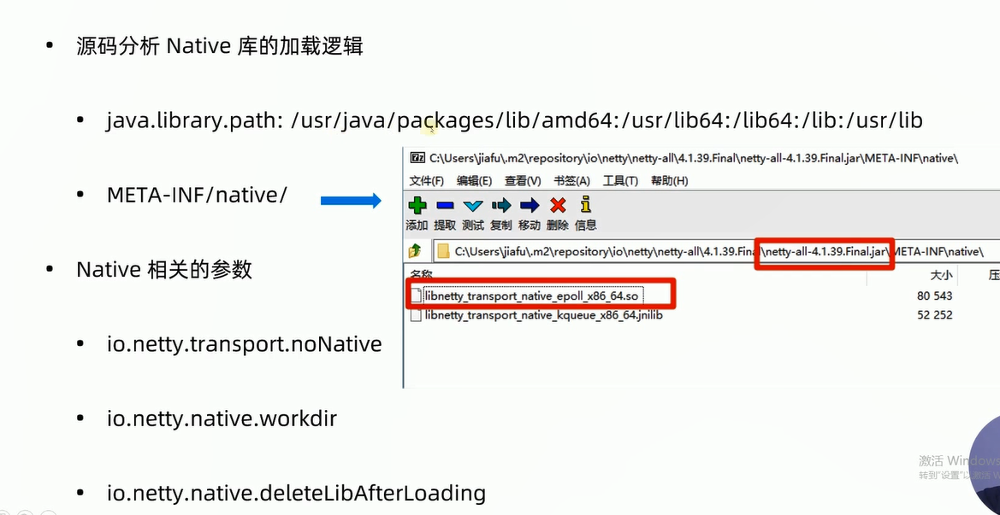
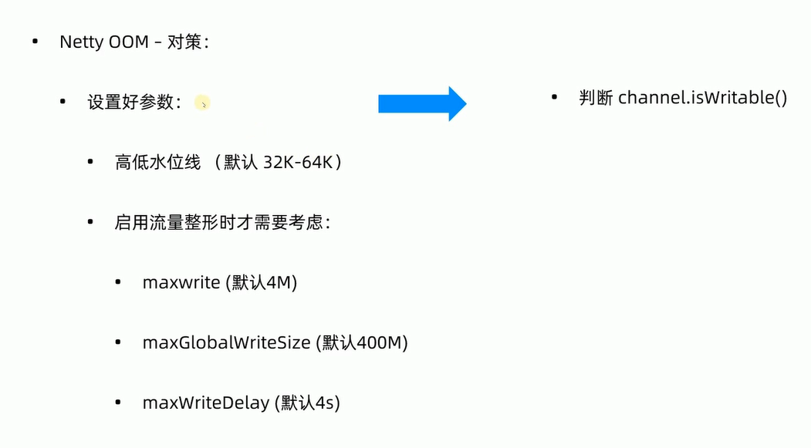

# 网络应用程序基本步骤


# 案例介绍及数据结构设计


## 数据结构


## 服务端

### 解码：


### 业务处理


### 编码


### 服务器


## 客户端


### 编解码：


### 客户端


## 测试


## 引入响应分发结果


思路：发送一个请求后，建立一个请求序列号【streamId】与Future映射关系

当消息返回后，根据请求序列号去映射关系中处理future


映射关系类


添加handler，处理结果返回的回调


测试


### Netty编程易错点：

- LengthFieldBasedFrameDecoder 中 initialBytesToStrip 未考虑设置     --未去掉长度字节
- ChannelHandler 顺序不正确
- ChannelHandler 该共享不共享 不该共享却共享
- 分配ByteBuf： 分配器直接用 ByteBufAllocator.DEFAULT 等，而不是采用 ChannelHandlerContext.alloc()
- 未考虑ByteBuf的释放
- 错以为ChannelHandlerContext.write(msg) 就写出数据了
- 乱用ChannelHandlerContext.channel().writeAndFlush(msg)，从头开始pipline，容易死循环

# 实战进阶：

## 调优参数：

- 调整System参数：

  - Linux系统参数：
    /proc/sys/net/ipv4/tcp_keepalive_time

  - Netty支持的系统参数：
    serverBoostrap.option(ChannelOption.SO_BACKLOG, 1024);
    SocketChannel -> .childOption
    ServerSocketChannel -> .option

    

  - Linux 系统参数：

    > 进行TCP连接时，系统为每个TCP连接创建一个socket句柄，也就是一个文件句柄，但是Linux对每个进程打开的文件句柄数量做了限制，如果超出：报错：too many open file
    > `ulimit -n[xxx]` ulimit命令修改的数值**只对当前登录用户**的目前适用环境有效，系统重启或用户推出后就会失效，所以可以作为程序启动脚本一部分，让它再程序启动前执行

  - Netty支持的系统参数(ChannelOption.[xxx]):
    不考虑UDP:
    IP_MULTICAST_TTL
    不考虑OIO编程：
    ChannelOptionSO_TIMEOUT=(“SO_TIMEOUT”);

    


- 权衡Netty核心参数：

  - 参数调整要点：
    option/childOption分不清：不会报错，但是不会生效
    不懂不要动，避免过早优化
    可配置(动态配置更好)

  

  - 需要调整的参数：
    最大打开文件数：
    TCP_NODELAY、SO_BACKLOG、SO_REUSEADDR(酌情处理)

  


- ChannelOption
  `childOption(ChannelOption.[XXX], [YYY])`
  `option(ChannelOption.[XXX],[YYY])`

- ChannelOption (非系统相关 11个)

  

  

System property
`-Dio.netty.[XXX] = [YYY]`


- 3个费脑参数：


## 跟踪诊断：

### 如何让应用易诊断：

1. **完善”线程名“**


2. **完善“Handler”名称**

   


3. 使用好Netty的日志

Netty日志框架原理

> 尝试使用sl4j，如果失败则使用jdk默认日志
>
> netty引入log4j，但是optional设置为true


修改JDK logger级别
使用slf4j + log4j示例
衡量好logging handler 的位置和级别


### 应用可视：

如何做Netty的可视化
Console 日志定时输出
JMX实时展示


- Netty值得可视化的数据

  


### 让应用内存不“泄露”


Netty内存泄露检测的源码解析


## 优化使用：

### 用好注解：

- @Sharable
  标识handler提醒可共享，不标记共享的不能重复加入pipeline


- @Skip
  跳过handler的执行
- @UnstableApi
  提醒不稳定，慎用
- @SuppressJava6Requirement
  去除 Java6 需求的报警
- @SuppressForbidden
  取出禁用报警

### 整改线程模型，让响应健步如飞

- 业务的两种场景：
  - CPU密集型：运算型
    保持当前线程模型：
    
    ```
    Runtime.getRuntime().availableProcessors() * 2
    io.netty.availableProcessors * 2
    io.netty.eventLoopThreads
    ```
  - IO密集型： 等待型
    整改线程模型：独立出 ”线程池“ 来处理业务
    
    1. 在handler内部使用JDK Executors
    2. 添加handler时，指定1个：
    
    ```java
    EventExecutorGroup eventExecutorGroup = new UnorderedThreadPoolEventExecutor(10);
    
    //指定hander运行的线程
    pipeline.addLast(eventExecutorGroup, serverHandler)
    ```
    
    为什么不用NioEventLoogGroup？

### 增强写，延迟与吞吐量的抉择：

- “写”的问题：


- 改进方式1：channelReadComplete

  


- 改进方式2：flushConsolidationHandler

  ```java
  pipeline.addLast("flushEnhance", new FlushConsolidationHandler(10, true));
  ```

  

### 如何让应用丝般”平滑“： 流量整形

- 流量整形的用途：
  - 网盘限速(主动)
  - 景点限流(被动)
  
- Netty内置的三种流量整形：
  - Channel级别
  - ChannelTrafficShapingHandler
  - GlobalTrafficShapingHandler
  
  
  
- **Netty流量整形的源码分析与总结**：
  
  - 读写流空判断：按一定时间段checkInterval(1s)来统计。writeLimit/readLimit设置的值为0时，表示关闭写整形/读整形
  - 等待事件范围控制：10ms(MINIMAL_WAIT) -> 15s (maxTime)
  - 读流控：取消读事件监听，让都缓存区满，然后对端写缓存区满，然后对端写不进去，对端对数据进行丢弃或减缓发送
  - 写流控：待发数据入Queue。
  
- 流量整形的使用：
  - ChannelTrafficShapingHandler
  
  - GlobalTrafficShapingHandler: **@share**
  
  - GlobalChannelTrafficShapingHandler: **@share**
  
    

### 为不同平台开启Native

+ 如何开启Native:

  + 修改代码：
    + NioServerSocketChannel -> [Prefix]ServerSocketChannel
    + NioEventLoopGroup -> [Prefix]EventLoopGroup
  + 准备好native库：
    


  源码分析Native库的加载逻辑：
  


## 安全增强：

### 设置”高低水位线“保护





### 启用空#闲监测：


### 简单有效的黑白名单

Netty中的 ”cidrPrefix“


Netty地址过滤功能源码分析：

+ 同一个IP只能有一个连接
+ IP地址过滤：黑名单 白名单


使用黑名单增强安全


```java
 //ipfilter 定义规则 同一网段
            IpSubnetFilterRule ipSubnetFilterRule = new IpSubnetFilterRule("127.1.1.1", 16, IpFilterRuleType.REJECT);
            RuleBasedIpFilter ruleBasedIpFilter = new RuleBasedIpFilter(ipSubnetFilterRule);

//添加处理器
pipeline.addLast("ipFilter", ruleBasedIpFilter);

```

### 使用自定义授权：


### 拿来即用的SSL-对话呈现表象：

SSL


#### **SSL的功能与设计：**


S


#### 抓包 揭露本质


#### Netty中使用SSL: io.netty.handler.ssl.SslHandler


