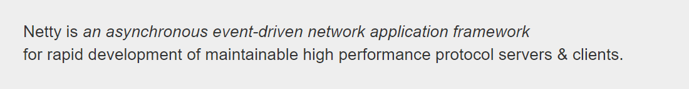
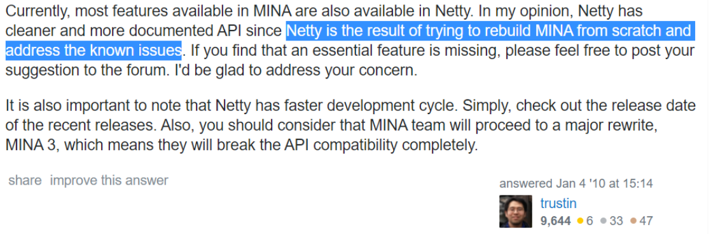
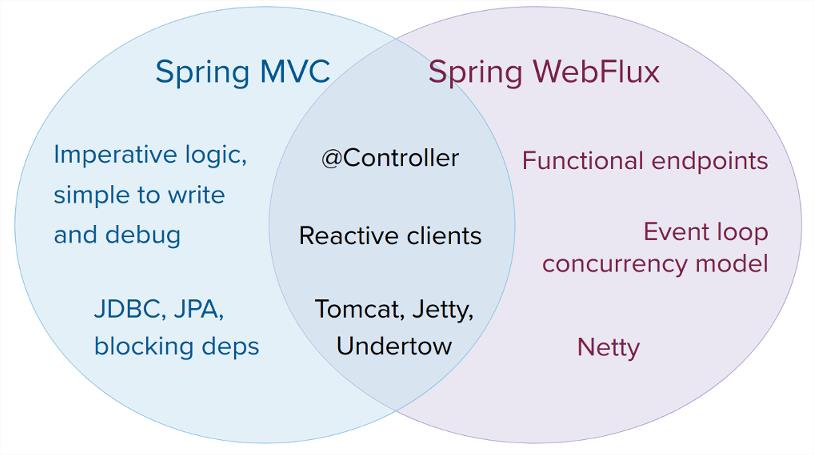

> 本文由 [简悦 SimpRead](http://ksria.com/simpread/) 转码， 原文地址 [www.sikun.top](http://www.sikun.top/archives/%E4%B8%80%E5%88%9D%E8%AF%86netty%E8%83%8C%E6%99%AF%E7%8E%B0%E7%8A%B6%E4%B8%8E%E8%B6%8B%E5%8A%BF)

> 参考学习资料：

参考学习资料：

*   极客时间傅健老师的《Netty 源码剖析与实战》Talk is cheap.show me the code!
*   课程链接：[https://time.geekbang.org/course/detail/100036701-146703](https://time.geekbang.org/course/detail/100036701-146703)

### 1、揭开 Netty 面纱

#### Netty 概述

Netty 由 Trustin Lee（韩国，Line 公司）2004 年开发



> Netty is a NIO client server framework which enables quick and easy development of network applications such as protocol servers and clients. It greatly simplifies and streamlines network programming such as TCP and UDP socket server.
> 
> 'Quick and easy' doesn't mean that a resulting application will suffer from a maintainability or a performance issue. Netty has been designed carefully with the experiences earned from the implementation of a lot of protocols such as FTP, SMTP, HTTP, and various binary and text-based legacy protocols. As a result, Netty has succeeded to find a way to achieve ease of development, performance, stability, and flexibility without a compromise.

*   本质: 网络应用程序框架
*   实现: 异步、事件驱动
*   特性: 高性能、可维护、快速开发
*   用途: 开发服务器和客户端

#### Netty 组件

三个组成部分：Core（核心）Transport Service（传输服务）Protocol support（协议支持）


#### 使用示例 1：echo

导入 pom 依赖

```xml
<dependency>
    <groupId>io.netty</groupId>
    <artifactId>netty-all</artifactId>
    <version>4.1.39.Final</version>
</dependency>
```

##### client 端

###### EchoClient

```java
import io.netty.bootstrap.Bootstrap;
import io.netty.channel.*;
import io.netty.channel.nio.NioEventLoopGroup;
import io.netty.channel.socket.SocketChannel;
import io.netty.channel.socket.nio.NioSocketChannel;
import io.netty.handler.logging.LogLevel;
import io.netty.handler.logging.LoggingHandler;
 
 
public final class EchoClient {
 
    public static void main(String[] args) throws Exception {
        // Configure the client.
        EventLoopGroup group = new NioEventLoopGroup();
        try {
            Bootstrap b = new Bootstrap();
            b.group(group)
             .channel(NioSocketChannel.class)
             .option(ChannelOption.TCP_NODELAY, true)
             .handler(new ChannelInitializer<SocketChannel>() {
                 @Override
                 public void initChannel(SocketChannel ch) throws Exception {
                     ChannelPipeline p = ch.pipeline();
                     p.addLast(new LoggingHandler(LogLevel.INFO));
                     p.addLast(new EchoClientHandler());
                 }
             });
 
            // Start the client.
            ChannelFuture f = b.connect("127.0.0.1", 8090).sync();
 
            // Wait until the connection is closed.
            f.channel().closeFuture().sync();
        } finally {
            // Shut down the event loop to terminate all threads.
            group.shutdownGracefully();
        }
    }
}
```

###### EchoClientHandler

```java
import io.netty.buffer.ByteBuf;
import io.netty.buffer.Unpooled;
import io.netty.channel.ChannelHandlerContext;
import io.netty.channel.ChannelInboundHandlerAdapter;
 
import java.util.concurrent.TimeUnit;
 
/**
 * Handler implementation for the echo client.  It initiates the ping-pong
 * traffic between the echo client and server by sending the first message to
 * the server.
 */
public class EchoClientHandler extends ChannelInboundHandlerAdapter {
 
    private final ByteBuf firstMessage;
 
    /**
     * Creates a client-side handler.
     */
    public EchoClientHandler() {
        firstMessage = Unpooled.wrappedBuffer("I am echo message".getBytes());
    }
 
    @Override
    public void channelActive(ChannelHandlerContext ctx) {
        ctx.writeAndFlush(firstMessage);
    }
 
    @Override
    public void channelRead(ChannelHandlerContext ctx, Object msg) {
        ctx.write(msg);
    }
 
    @Override
    public void channelReadComplete(ChannelHandlerContext ctx) throws InterruptedException {
        TimeUnit.SECONDS.sleep(3);
        ctx.flush();
    }
 
    @Override
    public void exceptionCaught(ChannelHandlerContext ctx, Throwable cause) {
        cause.printStackTrace();
        ctx.close();
    }
}
```

##### server 端

###### EchoServer

```java
import io.netty.bootstrap.ServerBootstrap;
import io.netty.channel.ChannelFuture;
import io.netty.channel.ChannelInitializer;
import io.netty.channel.ChannelPipeline;
import io.netty.channel.EventLoopGroup;
import io.netty.channel.nio.NioEventLoopGroup;
import io.netty.channel.socket.SocketChannel;
import io.netty.channel.socket.nio.NioServerSocketChannel;
import io.netty.handler.logging.LogLevel;
import io.netty.handler.logging.LoggingHandler;
 
/**
 * Echoes back any received data from a client.
 */
public final class EchoServer {
 
    public static void main(String[] args) throws Exception {
        EventLoopGroup workerGroup = new NioEventLoopGroup();
        final EchoServerHandler serverHandler = new EchoServerHandler();
        try {
            ServerBootstrap b = new ServerBootstrap();
            b.group(workerGroup)
             .channel(NioServerSocketChannel.class)
             .handler(new LoggingHandler(LogLevel.INFO))
             .childHandler(new ChannelInitializer<SocketChannel>() {
                 @Override
                 public void initChannel(SocketChannel ch) throws Exception {
                     ChannelPipeline p = ch.pipeline();
                     p.addLast(new LoggingHandler(LogLevel.INFO));
                     p.addLast(serverHandler);
                 }
             });
 
            ChannelFuture f = b.bind(8090).sync();
            f.channel().closeFuture().sync();
        } finally {
            workerGroup.shutdownGracefully();
        }
    }
}
```

###### EchoServerHandler

```java
import io.netty.channel.ChannelHandler.Sharable;
import io.netty.channel.ChannelHandlerContext;
import io.netty.channel.ChannelInboundHandlerAdapter;
 
/**
 * Handler implementation for the echo server.
 */
@Sharable
public class EchoServerHandler extends ChannelInboundHandlerAdapter {
 
    @Override
    public void channelRead(ChannelHandlerContext ctx, Object msg) {
        ctx.write(msg);
    }
 
    @Override
    public void channelReadComplete(ChannelHandlerContext ctx) {
        ctx.flush();
    }
 
    @Override
    public void exceptionCaught(ChannelHandlerContext ctx, Throwable cause) {
        cause.printStackTrace();
        ctx.close();
    }
}
```

#### 使用示例 2：http

##### HttpHelloWorldServer

```java
import io.netty.bootstrap.ServerBootstrap;
import io.netty.channel.Channel;
import io.netty.channel.ChannelInitializer;
import io.netty.channel.ChannelPipeline;
import io.netty.channel.EventLoopGroup;
import io.netty.channel.nio.NioEventLoopGroup;
import io.netty.channel.socket.nio.NioServerSocketChannel;
import io.netty.handler.codec.http.HttpServerCodec;
import io.netty.handler.codec.http.HttpServerExpectContinueHandler;
import io.netty.handler.logging.LogLevel;
import io.netty.handler.logging.LoggingHandler;
 
/**
 * An HTTP server that sends back the content of the received HTTP request
 * in a pretty plaintext form.
 */
public final class HttpHelloWorldServer {
 
 
    public static void main(String[] args) throws Exception {
        // Configure the server.
        EventLoopGroup bossGroup = new NioEventLoopGroup(1);
        EventLoopGroup workerGroup = new NioEventLoopGroup();
        try {
            ServerBootstrap b = new ServerBootstrap();
            b.group(bossGroup, workerGroup)
             .channel(NioServerSocketChannel.class)
             .handler(new LoggingHandler(LogLevel.INFO))
             .childHandler(new ChannelInitializer() {
                 @Override
                 protected void initChannel(Channel ch) throws Exception {
                     ChannelPipeline p = ch.pipeline();
                     p.addLast(new HttpServerCodec());
                     p.addLast(new HttpServerExpectContinueHandler());
                     p.addLast(new HttpHelloWorldServerHandler());
                 }
             });
 
            Channel ch = b.bind(8080).sync().channel();
 
            System.err.println("Open your web browser and navigate to " +
                    "http://127.0.0.1:8080");
 
            ch.closeFuture().sync();
        } finally {
            bossGroup.shutdownGracefully();
            workerGroup.shutdownGracefully();
        }
    }
}
```

##### HttpHelloWorldServerHandler

```java
import io.netty.buffer.Unpooled;
import io.netty.channel.ChannelFuture;
import io.netty.channel.ChannelHandlerContext;
import io.netty.channel.SimpleChannelInboundHandler;
import io.netty.handler.codec.http.DefaultFullHttpResponse;
import io.netty.handler.codec.http.FullHttpResponse;
import io.netty.handler.codec.http.HttpObject;
import io.netty.handler.codec.http.HttpRequest;
 
import static io.netty.handler.codec.http.HttpHeaderNames.CONTENT_LENGTH;
import static io.netty.handler.codec.http.HttpHeaderNames.CONTENT_TYPE;
import static io.netty.handler.codec.http.HttpHeaderValues.TEXT_PLAIN;
import static io.netty.handler.codec.http.HttpResponseStatus.OK;
 
public class HttpHelloWorldServerHandler extends SimpleChannelInboundHandler<HttpObject> {
 
    private static final byte[] CONTENT = "helloworld".getBytes();
 
    @Override
    public void channelReadComplete(ChannelHandlerContext ctx) {
        ctx.flush();
    }
 
    @Override
    public void channelRead0(ChannelHandlerContext ctx, HttpObject msg) {
        if (msg instanceof HttpRequest) {
            HttpRequest req = (HttpRequest) msg;
 
            FullHttpResponse response = new DefaultFullHttpResponse(req.protocolVersion(), OK,
                                                                    Unpooled.wrappedBuffer(CONTENT));
            response.headers()
                    .set(CONTENT_TYPE, TEXT_PLAIN)
                    .setInt(CONTENT_LENGTH, response.content().readableBytes());
 
            ChannelFuture f = ctx.write(response);
        }
    }
 
    @Override
    public void exceptionCaught(ChannelHandlerContext ctx, Throwable cause) {
        cause.printStackTrace();
        ctx.close();
    }
}
```

### 2、为什么舍近求远：不直接用 JDK NIO

Netty 做得更多：

*   支持常用应用层协议;
*   解决传输问题：粘包、半包现象;
*   支持流量整形;
*   完善的断连、ldle 等异常处理等。

#### Netty 做得更好之一：规避 JDK NIO bug

*   例 1：经典的 epoll bug ：异常唤醒空转导致 CPU 100%

 Netty 解决之道：`检测问题发生，然后处理` 

Netty中解决epoll bug的方法主要有以下两种：

**1. 统计空轮询次数**

Netty在NioEventLoop中定义了一个名为`selectCnt`的变量，用来统计select方法的空轮询次数。每次执行select方法后，selectCnt都会自增1。如果selectCnt超过了设定的阈值（默认是512），则认为发生了epoll bug，并会重新创建Selector。

**2. 计算select方法的执行时间**

Netty还提供了一种更精确的判断epoll bug的方法，那就是计算select方法的执行时间。如果select方法的执行时间明显小于设定的超时时间（默认是100毫秒），则认为发生了epoll bug，并会重新创建Selector。

**源码分析**

Netty中解决epoll bug的代码主要位于NioEventLoop类的`run()`方法中。该方法的逻辑如下：

```java
public void run() {
    try {
        while (!isShuttingDown()) {
            boolean selected = false;
            try {
                selected = selector.select(timeoutMillis);
            } catch (Throwable t) {
                if (t instanceof IOException) {
                    if (isShuttingDown()) {
                        break;
                    }
                }
                throw t;
            }

            if (selected) {
                processSelectedKeys();
                selectCnt = 1; // 重置空轮询计数器
            } else {
                selectCnt++;

                if (selectCnt > SELECTOR_AUTO_REBUILD_THRESHOLD) {
                    // 重新创建Selector
                    rebuildSelector();
                    selectCnt = 0;
                }
            }
        }
    } finally {
        cleanup();
    }
}
```

在`processSelectedKeys()`方法中，Netty会遍历Selector中所有已就绪的Channel，并对它们进行相应的处理。

在`rebuildSelector()`方法中，Netty会重新创建一个Selector，并将所有Channel重新注册到新的Selector上。

*   例 2：IP_TOS 参数（IP 包的优先级和 QoS 选项）使用时抛出异常 java.lang.AssertionError: Option not found

 Netty 解决之道：`遇到问题绕路走`

#### Netty 做得更好之二：API 更友好更强大

*   JDK 的 NIO 一些 API 不够友好，功能薄弱，例如 ByteBuffer -> Netty's ByteBuf
*   除了 NIO 外，也提供了其他一些增强：Theadlocal -> Netty's FastThreadLocal

#### Netty 做得更好之三：隔离变化、屏蔽细节

*   隔离 JDK NIO 的实现变化：nio -> nio2(aio)-> ....
*   屏蔽 JDK NIO 的实现细节

### 3、为什么孤注一掷：独选 Netty ?

#### 为什么不选 Apache Mina

同一作者，推荐 Netty ;



#### 为什么不选 Sun 的 Grizzly

三少: 用得少、文档少，更新少。

#### 为什么不选 Apple SwfitNIO 、ACE 等

其他语言，不考虑。

#### 为什么不选 Cindy 等

生命周期不长。

#### 为什么不选 Tomcat、Jetty

还没有独立出来。

### 4、Netty 的前尘往事

#### 从归属组织上看发展

*   JBoss
*   Netty

#### 从版本演变上看发展

*   2004 年 6 月 Netty2 发布  
    声称 Java 社区中第一个基于事件驱动的应用网络框架
*   2008 年 10 月 Netty3 发布
*   2013 年 7 月 Netty4 发布
*   2013 年 12 月发布 5.0.0.Alpha1
*   2015 年 11 月废弃 5.0.0

#### 题外话

##### 题外 1: 废弃 5.0 原因:

*   复杂
    
*   没有证明明显性能优势
    
*   维护不过来
    

##### 题外 2: 与 Apache Mina 的关系?

同一作者开发，都处于维护阶段（当前: MINA2.1.3:2019/06;Netty 4.1.39.Final: 2019/08)

*   2004 年 6 月 Netty2 发布
*   2005 年 5 月 Mina 发布

Alex 为 Apache Directory 开发网络框架，但是觉得不好用，看到 Netty2 后找到作者邀请合作开发，  
结合两种框架，随后有了 MINA。

#### 应用现状

*   截止 2019 年 9 月，30000 + 项目在使用
*   统计方法: 依赖项中声明 io.netty:netty-all
*   未考虑的情况: 非开源软件和 Netty 3.x 使用者

#### 一些典型项目

*   数据库: Cassandra
*   大数据处理: Spark、Hadoop
*   Message Queue: RocketMQ

#### 一些典型项目

*   检索: Elasticsearch
*   框架: gRPC、Apache Dubbo、Spring5
*   分布式协调器: ZooKeeper
*   工具类: async-http-client
*   其他参考: [https://netty.io/wiki/adopters.html](https://netty.io/wiki/adopters.html)

