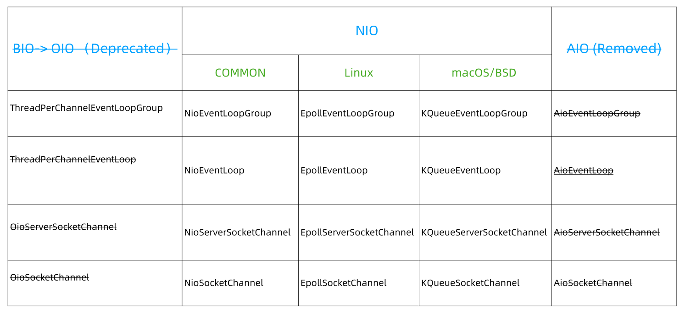

> 本文由 [简悦 SimpRead](http://ksria.com/simpread/) 转码， 原文地址 [www.sikun.top](http://www.sikun.top/archives/-er-nettyyuan-ma--cong--dian--ling-yu-zhi-shi--de-jiao-du-pou-xi-nettyzen-me-qie-huan-san-zhong-iomo-shi)

> 参考学习资料：

参考学习资料：

*   极客时间傅健老师的《Netty 源码剖析与实战》Talk is cheap.show me the code!
*   课程链接：[https://time.geekbang.org/course/detail/100036701-146703](https://time.geekbang.org/course/detail/100036701-146703)

#### 什么是经典的三种 I/O 模式

<table><thead><tr><th>I/O 模式</th><th>出现时间</th></tr></thead><tbody><tr><td>BIO （阻塞 I/O）</td><td>JDK1.4 之前</td></tr><tr><td>NIO （非阻塞 I/O）</td><td>JDK1.4（2002 年，java.nio 包）</td></tr><tr><td>AIO（异步 I/O）</td><td>JDK1.7 （2011 年）</td></tr></tbody></table>

#### 阻塞和非阻塞

*   阻塞：没有数据传输过来时，读会阻塞直到有数据；缓冲区满时，写操作也会阻塞。
*   非阻塞： 非阻塞遇到这些情况都是直接返回。

#### 同步和异步

*   同步：数据就绪后需要自己去读是同步。
*   异步：数据就绪后直接读好再回调给程序是异步。

#### Netty 对三种 I/O 模式的支持



首先 Netty 是都支持三种 IO 模式的，准确的来说是曾经都支持过，因为 BIO 被 Netty 给弃用了，AIO 被 Netty 给删除了。

**为什么不建议 (deprecate) 阻塞 I/O (BIO/OIO)?**

*   连接数高的情况下: 阻塞 -> 耗资源、效率低

**为什么删掉已经做好的 AIO 支持?**

*   Windows 实现成熟，但是很少用来做服务器。
*   Linux 常用来做服务器，但是 AIO 实现不够成熟。
*   Linux 下 AIO 相比较 NIO 的性能提升不明显。

**为什么 Netty 有多种 NIO 实现？**

通用的 NIO 实现 (Common）在 Linux 下也是使用 epoll，为什么自己单独实现? 实现得更好!

*   Netty 暴露了更多的可控参数，例如︰
    *   JDK 的 NIO 默认实现是水平触发
    *   Netty 是边缘触发（默认）和水平触发可切换
*   Netty 实现的垃圾回收更少、性能更好

**NIO 一定优于 BIO 么？**

*   BIO 代码简单。
*   特定场景：连接数少，并发度低，BIO 性能不输 NIO。

#### Netty 切换 I/O 模式

##### 怎么切换？

例如对于服务器开发：从 NIO 切换到 OIO

<table><thead><tr><th>NIO</th><th>OIO</th></tr></thead><tbody><tr><td>NioEventLoopGroup</td><td>OioEventLoopGroup</td></tr><tr><td>NioServerSocketChannel</td><td>OioServerSocketChannel</td></tr></tbody></table>

代码示例：

```java
public class MyServer {
    public static void main(String[] args) throws Exception {
        EventLoopGroup bossGroup = new NioEventLoopGroup();// 修改1
        EventLoopGroup workerGroup = new NioEventLoopGroup();// 修改2
        try {
            ServerBootstrap sb = new ServerBootstrap();
            sb.group(bossGroup, workerGroup)
              .channel(NioServerSocketChannel.class)// 修改3
              .handler(new LoggingHandler(LogLevel.INFO))
              .childHandler(new ChannelInitializer<SocketChannel>() {
                @Override
                public void initChannel(SocketChannel ch) throws Exception {
                    ChannelPipeline p = ch.pipeline();
                    p.addLast(new LoggingHandler(LogLevel.INFO));
                    p.addLast(new MyServerHandler());
                }
            });
            ChannelFuture f = sb.bind(8090).sync();
            f.channel().closeFuture().sync();
        } finally {
            bossGroup.shutdownGracefully();
            workerGroup.shutdownGracefully();
        }
    }
}
```

运行结果：


nio 切换成 oio：【图上标记的修改处的就是切换的模式的关键点。】

```java
public class MyServer {
    public static void main(String[] args) throws Exception {
        EventLoopGroup bossGroup = new OioEventLoopGroup();// 修改1
        EventLoopGroup workerGroup = new OioEventLoopGroup();// 修改2
        try {
            ServerBootstrap sb = new ServerBootstrap();
            sb.group(bossGroup, workerGroup)
              .channel(OioServerSocketChannel.class)// 修改3
              .handler(new LoggingHandler(LogLevel.INFO))
              .childHandler(new ChannelInitializer<SocketChannel>() {
                @Override
                public void initChannel(SocketChannel ch) throws Exception {
                    ChannelPipeline p = ch.pipeline();
                    p.addLast(new LoggingHandler(LogLevel.INFO));
                    p.addLast(new MyServerHandler());
                }
            });
            ChannelFuture f = sb.bind(8090).sync();
            f.channel().closeFuture().sync();
        } finally {
            bossGroup.shutdownGracefully();
            workerGroup.shutdownGracefully();
        }
    }
}
```

运作结果：


##### 原理是什么？

例如对于 ServerSocketChannel：工厂模式 + 泛型 + 反射实现

channel() 源码：

```java
public B channel(Class<? extends C> channelClass) {
        return this.channelFactory((io.netty.channel.ChannelFactory)(new ReflectiveChannelFactory((Class)ObjectUtil.checkNotNull(channelClass, "channelClass"))));
    }
```

源码分析：

> OioServerSocketChannel.class, 由 channelFactory 工厂创建返回，具体实现在 ReflectiveChannelFactory();

ReflectiveChannelFactory() 源码：

```java
public ReflectiveChannelFactory(Class<? extends T> clazz) {
        ObjectUtil.checkNotNull(clazz, "clazz");
        try {
            this.constructor = clazz.getConstructor();
        } catch (NoSuchMethodException var3) {
            throw new IllegalArgumentException("Class " + StringUtil.simpleClassName(clazz) + " does not have a public non-arg constructor", var3);
        }
    }
```

源码分析：

> 上图的代码中有 “this.constructor = clazz.getConstructor();” 获取无参构造；

```java
public T newChannel() {
        try {
            return (Channel)this.constructor.newInstance();
        } catch (Throwable var2) {
            throw new ChannelException("Unable to create Channel from class " + this.constructor.getDeclaringClass(), var2);
        }
    }
```

源码分析：

> 可以看出 “return constructor.newInstance();” 返回泛型“T” 就是要使用的 IO 模式。

总结来说：**Netty 实现 IO 模式的切换就是泛型 + 反射 + 工厂实现的。**

**除此之外，还有一点，"EventLoopGroup bossGroup = new NioEventLoopGroup();"; 实际上，它就相当于一个死循环，在 “NioEventLoop.java” 中，有个 run(), 如下源码，可以看出它是个死循环（for (;;) {}），现在可以简单的理解它就是循环监听、处理事件的。**

```java
@Override
protected void run() {
    for (;;) {
        try {
            try {
                switch (selectStrategy.calculateStrategy(selectNowSupplier, hasTasks())) {
                    case SelectStrategy.CONTINUE:
                        continue;
 
                    case SelectStrategy.BUSY_WAIT:
                        // fall-through to SELECT since the busy-wait is not supported with NIO
 
                    case SelectStrategy.SELECT:
                        select(wakenUp.getAndSet(false));
 
                        // 'wakenUp.compareAndSet(false, true)' is always evaluated
                        // before calling 'selector.wakeup()' to reduce the wake-up
                        // overhead. (Selector.wakeup() is an expensive operation.)
                        //
                        // However, there is a race condition in this approach.
                        // The race condition is triggered when 'wakenUp' is set to
                        // true too early.
                        //
                        // 'wakenUp' is set to true too early if:
                        // 1) Selector is waken up between 'wakenUp.set(false)' and
                        //    'selector.select(...)'. (BAD)
                        // 2) Selector is waken up between 'selector.select(...)' and
                        //    'if (wakenUp.get()) { ... }'. (OK)
                        //
                        // In the first case, 'wakenUp' is set to true and the
                        // following 'selector.select(...)' will wake up immediately.
                        // Until 'wakenUp' is set to false again in the next round,
                        // 'wakenUp.compareAndSet(false, true)' will fail, and therefore
                        // any attempt to wake up the Selector will fail, too, causing
                        // the following 'selector.select(...)' call to block
                        // unnecessarily.
                        //
                        // To fix this problem, we wake up the selector again if wakenUp
                        // is true immediately after selector.select(...).
                        // It is inefficient in that it wakes up the selector for both
                        // the first case (BAD - wake-up required) and the second case
                        // (OK - no wake-up required).
 
                        if (wakenUp.get()) {
                            selector.wakeup();
                        }
                        // fall through
                    default:
                }
            } catch (IOException e) {
                // If we receive an IOException here its because the Selector is messed up. Let's rebuild
                // the selector and retry. https://github.com/netty/netty/issues/8566
                rebuildSelector0();
                handleLoopException(e);
                continue;
            }
 
            cancelledKeys = 0;
            needsToSelectAgain = false;
            final int ioRatio = this.ioRatio;
            if (ioRatio == 100) {
                try {
                    processSelectedKeys();
                } finally {
                    // Ensure we always run tasks.
                    runAllTasks();
                }
            } else {
                final long ioStartTime = System.nanoTime();
                try {
                    processSelectedKeys();
                } finally {
                    // Ensure we always run tasks.
                    final long ioTime = System.nanoTime() - ioStartTime;
                    runAllTasks(ioTime * (100 - ioRatio) / ioRatio);
                }
            }
        } catch (Throwable t) {
            handleLoopException(t);
        }
        // Always handle shutdown even if the loop processing threw an exception.
        try {
            if (isShuttingDown()) {
                closeAll();
                if (confirmShutdown()) {
                    return;
                }
            }
        } catch (Throwable t) {
            handleLoopException(t);
        }
    }
}
```

**为什么服务器开发并不需要切换客户端对应 NioSocketChannel ？**

ServerSocketChannel 负责创建对应的 SocketChannel 。