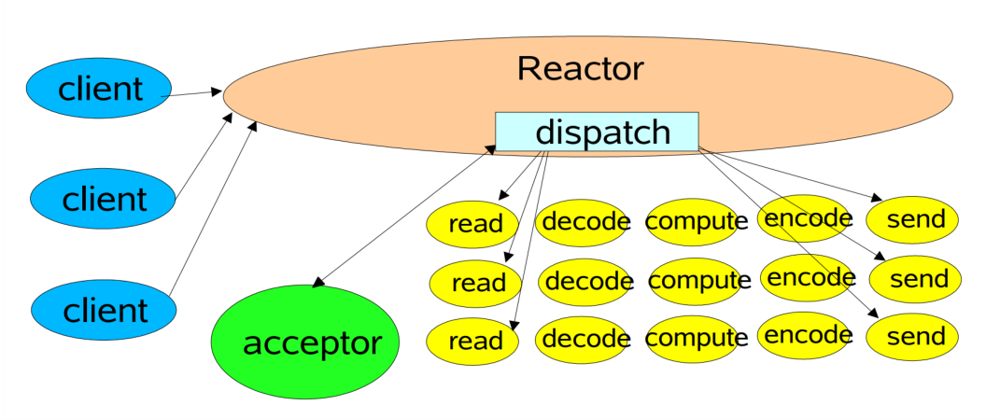

> 本文由 [简悦 SimpRead](http://ksria.com/simpread/) 转码， 原文地址 [www.sikun.top](http://www.sikun.top/archives/-san-nettyru-he-zhi-chi-san-zhong-reactor)

> 参考学习资料：

参考学习资料：

*   极客时间傅健老师的《Netty 源码剖析与实战》Talk is cheap.show me the code!
*   课程链接：[https://time.geekbang.org/course/detail/100036701-146703](https://time.geekbang.org/course/detail/100036701-146703)

#### 什么是 Reactor 及三种版本

** 反应堆设计模式（Reactor pattern）：** 是一种为处理并发服务请求，并将请求提交到一个或者多个服务处理程序的事件设计模式。当客户端请求抵达后，服务处理程序使用多路分配策略，由一个非阻塞的线程来接收所有的请求，然后派发这些请求至相关的工作线程进行处理。

三种版本：

*   Reactor 单线程模式（一个人包揽）
*   Reactor 多线程模式（多人分担）
*   主从 Reactor 多线程模式（多人细工分担）

<table><thead><tr><th>BIO</th><th>NIO</th><th>AIO</th></tr></thead><tbody><tr><td>Thread-Per-Connection</td><td>Reactor</td><td>Proactor</td></tr></tbody></table>

Reactor 是一种开发模式，模式的核心流程为：

注册感兴趣的事件 ----> 扫描是都有感兴趣的事件发生 ----> 事件发生后做出相应的处理。

对于每一种的 SocketChannel 它监听的事件也不同，如下图！


Thread-Per-Connection 模式：


Reactor 模式 V1：单线程



Reactor 模式 V2：多线程


Reactor 模式 V3：主从多线程


#### 如何在 Netty 中使用 Reactor 模式

<table><thead><tr><th>Reactor 模式</th><th>示例代码</th></tr></thead><tbody><tr><td>Reactor 单线程模式</td><td>EventLoopGroup eventGroup = new NioEventLoopGroup(1);<br>ServerBootstrap serverBootstrap = new ServerBootstrap();<br>serverBootstrap.group(eventGroup);</td></tr><tr><td>非主从 Reactor 多线程模式</td><td>EventLoopGroup eventGroup = new NioEventLoopGroup();<br>ServerBootstrap serverBootstrap = new ServerBootstrap();<br>serverBootstrap.group(eventGroup);</td></tr><tr><td>主从 Reactor 多线程模式</td><td>EventLoopGroup bossGroup = new NioEventLoopGroup();<br>EventLoopGroup workerGroup = new NioEventLoopGroup();<br>ServerBootstrap serverBootstrap = new ServerBootstrap();<br>serverBootstrap.group(bossGroup, workerGroup);</td></tr></tbody></table>

分析：

> 上表中非主从 Reactor 多线程模式中 "EventLoopGroup eventGroup = new NioEventLoopGroup()" 中没有给参数，参考 Reactor 单线程模式给的参数是 1，这里没有参数为什么是多线程模式？**那是因为如果我们不去设置的话，它会根据 CPU 核数去计算出一个最优的线程数**，现在单核 CPU 几乎没有了，所以现在几乎可以百分百的肯定这样就是多线程模式。

源码分析：

```java
public class MyServer {
    public static void main(String[] args) throws Exception {
        EventLoopGroup bossGroup = new NioEventLoopGroup();
        EventLoopGroup workerGroup = new NioEventLoopGroup();
        try {
            ServerBootstrap sb = new ServerBootstrap();
            // 主从Reactor模式的核心点
            sb.group(bossGroup, workerGroup)
              .channel(NioServerSocketChannel.class)
              .handler(new LoggingHandler(LogLevel.INFO))
              .childHandler(new ChannelInitializer<SocketChannel>() {
                @Override
                public void initChannel(SocketChannel ch) throws Exception {
                    ChannelPipeline p = ch.pipeline();
                    p.addLast(new LoggingHandler(LogLevel.INFO));
                    p.addLast(new MyServerHandler());
                }
            });
            ChannelFuture f = sb.bind(8090).sync();
            f.channel().closeFuture().sync();
        } finally {
            bossGroup.shutdownGracefully();
            workerGroup.shutdownGracefully();
        }
    }
}
```

分析：

> 主从 Reactor 模式的核心点，其中 bossGroup（可以理解为主）和 workerGroup（可以理解为从）都是需要被设置到 ServerBootstrap 中去，“sb.group(bossGroup,workerGroup)” 则是绑定

##### bossGroup 分析

group() 方法源码：

```java
public ServerBootstrap group(EventLoopGroup parentGroup, EventLoopGroup childGroup) {
    super.group(parentGroup);// 关键点
    ObjectUtil.checkNotNull(childGroup, "childGroup");
    if (this.childGroup != null) {
        throw new IllegalStateException("childGroup set already");
    } else {
        this.childGroup = childGroup;
        return this;
    }
}
```

```java
public B group(EventLoopGroup group) {
    ObjectUtil.checkNotNull(group, "group");
    if (this.group != null) {
        throw new IllegalStateException("group set already");
    } else {
        this.group = group; // 关键点！
        return this.self();
    }
}
```

分析：

> 可以看到 "this.group = group”；group 则是传入的 “bossGroup”；this.group 则是该类定义的成员。
>
> ```java
> volatile EventLoopGroup group;
> ```
>
> 而该成员在 group() 被 return.
>
> ```java
> public final EventLoopGroup group() {
>  	return this.bootstrap.group();
> }
> ```

源码：【查看哪里调用了该方法（windows 下的 idea 按 ctrl+alt+h 可以查询），如图】


分析：

> 图上标记的 “ChannelFuture regFuture = config().group().register(channel);” 不难看出我们取到了 group, 再将 channel 绑定进去，这里的 channel 指的是：在服务器的开发那就是 ServerSocketChannel。所以可以简单的理解：** 我们将 ServerSocketChannel 绑定到 bossGroup 上，** 有了 ServerSocketChannel 就能创建子的 SocketChannel, 再将子的 SocketChannel 绑定到之前的 workerGroup 上。

##### childGroup 分析

```java
public ServerBootstrap group(EventLoopGroup parentGroup, EventLoopGroup childGroup) {
    super.group(parentGroup);
    ObjectUtil.checkNotNull(childGroup, "childGroup");
    if (this.childGroup != null) {
        throw new IllegalStateException("childGroup set already");
    } else {
        this.childGroup = childGroup;// 关键点
        return this;
    }
}
```

分析：

> 这里的 “this.childGroup = childGroup;” 的 this.childGroup 也是定义的成员
> 
> ```java
> private volatile EventLoopGroup childGroup;
> ```

**谁在用 this.childGroup？**


分析：

> msg 即 SocketChannel，下面标红框的就是将 msg 进行绑定到 workerGroup 中,** 简单说就是两种 SocketChannel 绑定到两个 Group 里面去。** 这样就完成了主从 Reactor 模式的支持。