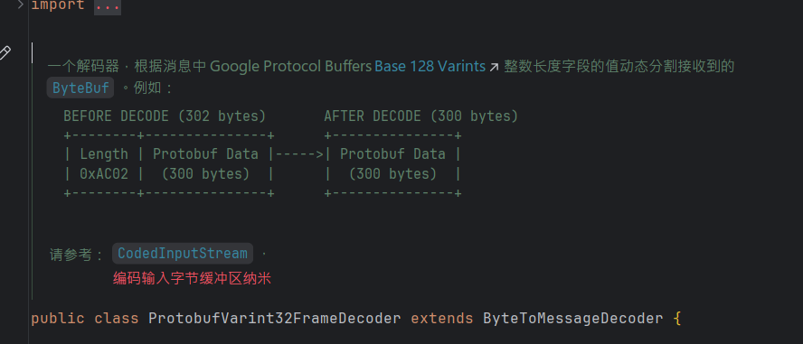

> 本文由 [简悦 SimpRead](http://ksria.com/simpread/) 转码， 原文地址 [www.sikun.top](http://www.sikun.top/archives/-wu-nettydui-er-ci-bian-jie-ma-de-zhi-chi)

> 参考学习资料：

参考学习资料：

*   极客时间傅健老师的《Netty 源码剖析与实战》Talk is cheap.show me the code!
*   课程链接：[https://time.geekbang.org/course/detail/100036701-146703](https://time.geekbang.org/course/detail/100036701-146703)

#### 为什么需要 “二次” 编解码？

假设我们把解决半包粘包问题的常用三种解码器叫一次解码器:


那么我们在项目中，除了可选的的压缩解压缩之外，还需要一层解码，因为一次解码的结果是字节，需要和项目中所使用的对象做转化，方便使用，这层解码器可以称为 “二次解码器”，相应的，对应的编码器是为了将 Java 对象转化成字节流方便存储或传输。

*   一次解码器：ByteToMessageDecoder
    *   io.netty.buffer.ByteBuf （原始数据流）-> io.netty.buffer.ByteBuf （用户数据）
*   二次解码器：MessageToMessageDecoder_
    
    *   io.netty.buffer.ByteBuf （用户数据）-> Java Object
    
    

> 解决 TCP 粘包、半包的一次解码器都是继承的 **ByteToMessageDecoder**, 而 **ByteToMessageDecoder** 主要是将原始数据流（可能存在粘包、半包问题的数据流）转换为用户数据（是一个字节数组）。所以我们需要二次解码器（都是直接继承 **MessageToMessageDecoder**）将字节数组转换成 Java 对象。
>
> 
>
> **有人会问能否将两次解码合二为一？**
>
> 可以，但是这里是不建议的，首先没有分层感，不够清晰，其次就是耦合性太高，不容易置换方案，Java 是最忌讳耦合性高的方案的。
>


#### 常用的 “二次” 编解码方式

*   Java 序列化（占空间，其他语言不支持）
*   Marshaling
*   XML（也是占用比较大），
*   JSON（比 XML 占空间小，但是没有 XML 那么通用性）
*   MessagePack（比 JSON 占用空间还小，却没有它可读性好
*   Protobuf
*   其他...

如此多的编解码方式该如何选择呢？

*   编码后占用空间，因为编解码的作用很大情况下是为了存储和传输。
*   编解码的速度，
*   是否追求可读性，
*   多语言（java、C、python）支持，例如 MessagePack的多语言支持。

综上所述比较合适的有 JSON，MessagePack 和 Protobuf。但是最流行的是 ProtoBuf。

#### Google Protobuf 简介与使用

①Protobuf 是一个灵活，高效的用于序列化数据的协议

②相比较 XML 、JSON，Protobuf 更小、更快、更便捷

③Protobuf 是跨语言的，并且自带了一个编译器（protoc），只需要用它进行编译，可以自动生成 Java，C++，Python 等代码，不需要再写其他代码（代价是可读性不好，看不懂...）


案例参考`io.netty.example.worldclock;`

```java
public class WorldClockServerInitializer extends ChannelInitializer<SocketChannel> {

    private final SslContext sslCtx;

    public WorldClockServerInitializer(SslContext sslCtx) {
        this.sslCtx = sslCtx;
    }

    @Override
    public void initChannel(SocketChannel ch) throws Exception {
        ChannelPipeline p = ch.pipeline();
        if (sslCtx != null) {
            p.addLast(sslCtx.newHandler(ch.alloc()));
        }

        p.addLast(new ProtobufVarint32FrameDecoder());//一次解码器 按长度粘包
        p.addLast(new ProtobufDecoder(WorldClockProtocol.Locations.getDefaultInstance()));//二次解码

        p.addLast(new ProtobufVarint32LengthFieldPrepender());//二次编码  添加长度
        p.addLast(new ProtobufEncoder());//一次编码

        p.addLast(new WorldClockServerHandler());
    }
}
```




#### 源码解读：Netty 对二次编解码的支持

打开 Netty 的源码，它对很多的编码器都提供支持，如图


随便点开一个看看，比如 bytes 包下的 ByteArrayDecoder.java

```java
public class ByteArrayDecoder extends MessageToMessageDecoder<ByteBuf> {
    @Override
    protected void decode(ChannelHandlerContext ctx, ByteBuf msg, List<Object> out) throws Exception {
        // copy the ByteBuf content to a byte array
        out.add(ByteBufUtil.getBytes(msg));
    }
}
```

分析：

> 可以看出 ByteArratDecoder.java 只有一个 decode() 方法；其中它有个 "ByteBuf msg" 的参数, 这个 msg 是 io.netty.buffer.ByteBuf，那这个类的作用就见其名了，是将 Netty 的 Bytebuf 转换成 jdk 里的字节数组。

再来看一看 Netty 支持的序列化，找到 serialization 包下的 ObjectEncoder.java

```java
@Sharable
public class ObjectEncoder extends MessageToByteEncoder<Serializable> {
    private static final byte[] LENGTH_PLACEHOLDER = new byte[4];
 
    @Override
    protected void encode(ChannelHandlerContext ctx, Serializable msg, ByteBuf out) throws Exception {
        int startIdx = out.writerIndex();
 
        ByteBufOutputStream bout = new ByteBufOutputStream(out);
        ObjectOutputStream oout = null;
        try {
            bout.write(LENGTH_PLACEHOLDER);
            // 压缩
            oout = new CompactObjectOutputStream(bout);
            oout.writeObject(msg);
            oout.flush();
        } finally {
            if (oout != null) {
                oout.close();
            } else {
                bout.close();
            }
        }
 
        int endIdx = out.writerIndex();
 
        out.setInt(startIdx, endIdx - startIdx - 4);
    }
}
```

分析：

> “CompactObjectOutputStream”，其中 Compact 是压缩的意思，意味着它的大小肯定比 java 的序列化要小

CompactObjectOutputStream 源码：


> 倒数的 2 行代码，倒数第一行只给一个类的 “Name”, 这点在反序列化（用发射）时就会用到，倒数第二行代码相比较 JDK 少了元信息，如下图是 JDK 的元信息：
> 
> 
> 
> 所以这么一对比才体会到 “Compact” 的意义所在！其他的也大同小异，比如 “string” 的解码器

