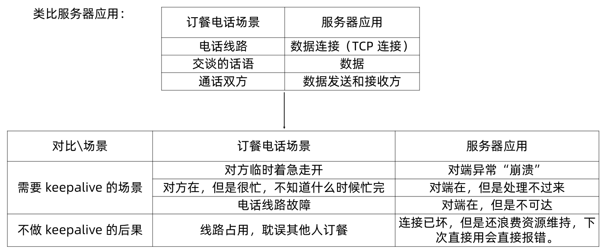

> 本文由 [简悦 SimpRead](http://ksria.com/simpread/) 转码， 原文地址 [www.sikun.top](http://www.sikun.top/archives/-liu-nettyzhong-kai-qi-tcpkeepalivehe-idlejian-ce)

> 参考学习资料：

参考学习资料：

*   极客时间傅健老师的《Netty 源码剖析与实战》Talk is cheap.show me the code!
*   课程链接：[https://time.geekbang.org/course/detail/100036701-146703](https://time.geekbang.org/course/detail/100036701-146703)

#### 为什么需要 keepalive ?



#### 怎么设计 keepalive ？

以 TCP keepalive 为例

问题出现概率小 -> 没有必要频繁  
判断需 “谨慎” -> 不能武断

TCP keepalive 核心参数：

```properties
sysctl -a|grep tcp_keepalive

net.ipv4.tcp_keepalive_time = 7200  
net.ipv4.tcp_keepalive_intvl = 75  
net.ipv4.tcp_keepalive_probes = 9  
```

当启用（默认关闭）keepalive 时，TCP 在连接没有数据；  
通过的 7200 秒后发送 keepalive 消息，当探测没有确认时，  
按 75 秒的重试频率重发，一直发 9 个探测包都没有确认，就认定连接失效。  
所以总耗时一般为：2 小时 11 分钟 (7200 秒 + 75 秒 * 9 次)

#### 为什么还需要应用层 keepalive ?

*   协议分层，各层关注点不同：  
    传输层关注是否 “通”，应用层关注是否可服务？ 类比前面的电话订餐例子，电话能通，  不代表有人接；服务器连接在，但是不定可以服务（例如服务不过来等）。
*   TCP 层的 keepalive 默认关闭，且经过路由等中转设备 keepalive 包可能会被丢弃。
*   TCP 层的 keepalive 时间太长：  
    默认 > 2 小时，虽然可改，但属于系统参数，改动影响所有应用。

> 提示：HTTP 属于应用层协议，但是常常听到名词 “HTTP Keep-Alive” 指的是对长连接和短连接的选择：
>
> *   Connection : Keep-Alive 长连接（HTTP/1.1 默认长连接，不需要带这个 header）
> *   Connection : Close 短连接

#### Idle 监测是什么？

Idle 监测，只是负责诊断，诊断后，做出不同的行为，决定 Idle 监测的最终用途：

*   发送 keepalive : 一般用来配合 keepalive ，减少 keepalive 消息。  
    Keepalive 设计演进：V1 定时 keepalive 消息 -> V2 空闲监测 + 判定为 Idle 时才发 keepalive。
    *   V1：keepalive 消息与服务器正常消息交换完全不关联，定时就发送；
    *   V2：有其他数据传输的时候，不发送 keepalive ，无数据传输超过一定时间，判定  
        为 Idle，再发 keepalive 。
*   直接关闭连接：
    
    *   快速释放损坏的、恶意的、很久不用的连接，让系统时刻保持最好的状态。
    *   简单粗暴，客户端可能需要重连。

实际应用中：Idle 和keepalive 结合起来使用。按需 keepalive ，保证不会空闲，如果空闲，关闭连接。

#### 如何在 Netty 中开启 TCP keepalive 和 Idle 检测

开启 keepalive：

*   Server 端开启 TCP keepalive
    *   `bootstrap.childOption(ChannelOption.SO_KEEPALIVE,true)`
    *   `bootstrap.childOption(NioChannelOption.of(StandardSocketOptions.SO_KEEPALIVE), true)`
    *   **提示：.option(ChannelOption.SO_KEEPALIVE,true) 存在但是无效**
*   开启不同的 Idle Check:  
    `ch.pipeline().addLast(“idleCheckHandler", new IdleStateHandler(0, 20, 0, TimeUnit.SECONDS));`

#### 源码解读：Netty 中两种 Keepalive 的区别

在 Server 端开启 TCP keepalive:　两种方式

```java
serverBootstrap.childOption(ChannelOption.SO_KEEPALIVE, true);
serverBootstrap.childOption(NioChannelOption.SO_KEEPALIVE,true)
```

在 "NioSocketChannel" 中有这个方法 setOption：

```java
@Override
public <T> boolean setOption(ChannelOption<T> option, T value) {
    if (PlatformDependent.javaVersion() >= 7 && option instanceof NioChannelOption) {
        return NioChannelOption.setOption(jdkChannel(), (NioChannelOption<T>) option, value);
    }
    return super.setOption(option, value);
} 
```

if 语句里的 "NioChannelOption.setOption()" 和 if 外的调用 “super.setOption()” 其实就是区别所在，if 语句里进入则：

```java
static <T> boolean setOption(Channel jdkChannel, NioChannelOption<T> option, T value) {
    java.nio.channels.NetworkChannel channel = (java.nio.channels.NetworkChannel) jdkChannel;
    if (!channel.supportedOptions().contains(option.option)) {
        return false;
    }
    if (channel instanceof ServerSocketChannel && option.option == java.net.StandardSocketOptions.IP_TOS) {
        // Skip IP_TOS as a workaround for a JDK bug:
        // See http://mail.openjdk.java.net/pipermail/nio-dev/2018-August/005365.html
        return false;
    }
    try {
        channel.setOption(option.option, value);
        return true;
    } catch (IOException e) {
        throw new ChannelException(e);
    }
}
```

而外面的调用则是：

```java
public <T> boolean setOption(ChannelOption<T> option, T value) {
        validate(option, value);
 
        if (option == SO_RCVBUF) {
            setReceiveBufferSize((Integer) value);
        } else if (option == SO_SNDBUF) {
            setSendBufferSize((Integer) value);
        } else if (option == TCP_NODELAY) {
            setTcpNoDelay((Boolean) value);
        } else if (option == SO_KEEPALIVE) {
            setKeepAlive((Boolean) value);
        } else if (option == SO_REUSEADDR) {
            setReuseAddress((Boolean) value);
        } else if (option == SO_LINGER) {
            setSoLinger((Integer) value);
        } else if (option == IP_TOS) {
            setTrafficClass((Integer) value);
        } else if (option == ALLOW_HALF_CLOSURE) {
            setAllowHalfClosure((Boolean) value);
        } else {
            return super.setOption(option, value);
        }
 
        return true;
    }
```

不难看出，上面的调用是 JDK 调用，下面的则是写一堆 if...else 来确定的，很明显，下面的方式没有上面的好

#### 源码解读：Idle 检测类

IdleState：

```java
public enum IdleState {
    /**
     * No data was received for a while.
     */
    READER_IDLE,
    /**
     * No data was sent for a while.
     */
    WRITER_IDLE,
    /**
     * No data was either received or sent for a while.
     */
    ALL_IDLE
}
```

IdleStateEvent:

```java
public class IdleStateEvent {
    public static final IdleStateEvent FIRST_READER_IDLE_STATE_EVENT = new IdleStateEvent(IdleState.READER_IDLE, true);
    public static final IdleStateEvent READER_IDLE_STATE_EVENT = new IdleStateEvent(IdleState.READER_IDLE, false);
    public static final IdleStateEvent FIRST_WRITER_IDLE_STATE_EVENT = new IdleStateEvent(IdleState.WRITER_IDLE, true);
    public static final IdleStateEvent WRITER_IDLE_STATE_EVENT = new IdleStateEvent(IdleState.WRITER_IDLE, false);
    public static final IdleStateEvent FIRST_ALL_IDLE_STATE_EVENT = new IdleStateEvent(IdleState.ALL_IDLE, true);
    public static final IdleStateEvent ALL_IDLE_STATE_EVENT = new IdleStateEvent(IdleState.ALL_IDLE, false);
 
    private final IdleState state;
    private final boolean first;
 
    /**
     * Constructor for sub-classes.
     *
     * @param state the {@link IdleStateEvent} which triggered the event.
     * @param first {@code true} if its the first idle event for the {@link IdleStateEvent}.
     */
    protected IdleStateEvent(IdleState state, boolean first) {
        this.state = ObjectUtil.checkNotNull(state, "state");
        this.first = first;
    }
 
    /**
     * Returns the idle state.
     */
    public IdleState state() {
        return state;
    }
 
    /**
     * Returns {@code true} if this was the first event for the {@link IdleState}
     */
    public boolean isFirst() {
        return first;
    }
}
```

IdleStateHandler

构造函数：

```java
/**
     * Creates a new instance firing {@link IdleStateEvent}s.
     *
     * @param readerIdleTimeSeconds
     *        an {@link IdleStateEvent} whose state is {@link IdleState#READER_IDLE}
     *        will be triggered when no read was performed for the specified
     *        period of time.  Specify {@code 0} to disable.
     * @param writerIdleTimeSeconds
     *        an {@link IdleStateEvent} whose state is {@link IdleState#WRITER_IDLE}
     *        will be triggered when no write was performed for the specified
     *        period of time.  Specify {@code 0} to disable.
     * @param allIdleTimeSeconds
     *        an {@link IdleStateEvent} whose state is {@link IdleState#ALL_IDLE}
     *        will be triggered when neither read nor write was performed for
     *        the specified period of time.  Specify {@code 0} to disable.
     */
public IdleStateHandler(
    int readerIdleTimeSeconds,
    int writerIdleTimeSeconds,
    int allIdleTimeSeconds) {
 
    this(readerIdleTimeSeconds, writerIdleTimeSeconds, allIdleTimeSeconds,
         TimeUnit.SECONDS);
}
 
/**
     * @see #IdleStateHandler(boolean, long, long, long, TimeUnit)
     */
public IdleStateHandler(
    long readerIdleTime, long writerIdleTime, long allIdleTime,
    TimeUnit unit) {
    this(false, readerIdleTime, writerIdleTime, allIdleTime, unit);
}
 
/**
     * Creates a new instance firing {@link IdleStateEvent}s.
     *
     * @param observeOutput
     *        whether or not the consumption of {@code bytes} should be taken into
     *        consideration when assessing write idleness. The default is {@code false}.
     * @param readerIdleTime
     *        an {@link IdleStateEvent} whose state is {@link IdleState#READER_IDLE}
     *        will be triggered when no read was performed for the specified
     *        period of time.  Specify {@code 0} to disable.
     * @param writerIdleTime
     *        an {@link IdleStateEvent} whose state is {@link IdleState#WRITER_IDLE}
     *        will be triggered when no write was performed for the specified
     *        period of time.  Specify {@code 0} to disable.
     * @param allIdleTime
     *        an {@link IdleStateEvent} whose state is {@link IdleState#ALL_IDLE}
     *        will be triggered when neither read nor write was performed for
     *        the specified period of time.  Specify {@code 0} to disable.
     * @param unit
     *        the {@link TimeUnit} of {@code readerIdleTime},
     *        {@code writeIdleTime}, and {@code allIdleTime}
     */
public IdleStateHandler(boolean observeOutput,
                        long readerIdleTime, long writerIdleTime, long allIdleTime,
                        TimeUnit unit) {
    if (unit == null) {
        throw new NullPointerException("unit");
    }
 
    this.observeOutput = observeOutput;
 
    if (readerIdleTime <= 0) {
        readerIdleTimeNanos = 0;
    } else {
        readerIdleTimeNanos = Math.max(unit.toNanos(readerIdleTime), MIN_TIMEOUT_NANOS);
    }
    if (writerIdleTime <= 0) {
        writerIdleTimeNanos = 0;
    } else {
        writerIdleTimeNanos = Math.max(unit.toNanos(writerIdleTime), MIN_TIMEOUT_NANOS);
    }
    if (allIdleTime <= 0) {
        allIdleTimeNanos = 0;
    } else {
        allIdleTimeNanos = Math.max(unit.toNanos(allIdleTime), MIN_TIMEOUT_NANOS);
    }
}
```

分析：

> 共五个参数
> 
> observeOutput 写超时是在 handler 的 write 方法记录最后一次的写时间，如果这个参数为 false，那么只会检测这个 write 方法记录的时间与当前时间差是否超过定义的空闲时间。但是如果是发送大数据包，发送的耗时时间超过了定义的空闲时间，也会触发事件。参数设置为 true 的话，不光检测 write 方法记录的时间，也会检测当前 channel 的发送缓冲区是否有变化，有变化表示数据正在发送中或者有新的 write 写入，不触发写空闲超时
> 
> 每一次的 write(ByteBuf) 方法会将此次的 byteBuf 写入到发送缓冲区，发送缓冲区将 btyeBuf 以一个链表存放，记录所有节点的一个总的数据大小 size，调用 flush() 时，会循环链表节点，写入到 socket, 每次写完，会从总 size 中减去此次已写入的字节数。当然，flush() 发送中要是来了新的 write(buf)，也会更新链表和总大小 size。
> 
> readerIdleTime 读空闲超时
> 
> writerIdleTime 写空闲时间
> 
> allIdleTime 读写空闲时间
> 
> unit 时间单位

#### 源码解读：读 Idle 检测的原理

```java
private final class ReaderIdleTimeoutTask extends AbstractIdleTask {
 
        ReaderIdleTimeoutTask(ChannelHandlerContext ctx) {
            super(ctx);
        }
 
        @Override
        protected void run(ChannelHandlerContext ctx) {
            long nextDelay = readerIdleTimeNanos;
            // reading变量会在channelRead设置为true,channelReadComplate设置为false
            // 如果为true,当前有一波还没读完，nextDelay大于0，直接再次放入定时任务下次再说
            if (!reading) {
                // 读完了，算当前时间距离上次读多长时间和读空闲超时时间
                nextDelay -= ticksInNanos() - lastReadTime;
            }
 
            // 小于0表示到位了，要发布事件
            if (nextDelay <= 0) {
                // Reader is idle - set a new timeout and notify the callback.
                // 再定时一个
                readerIdleTimeout = schedule(ctx, this, readerIdleTimeNanos, TimeUnit.NANOSECONDS);
 
                boolean first = firstReaderIdleEvent;
                firstReaderIdleEvent = false;
 
                try {
                    IdleStateEvent event = newIdleStateEvent(IdleState.READER_IDLE, first);
                    // 发布READER_IDLE事件，调用链上的UserEventTriggered方法
                    channelIdle(ctx, event);
                } catch (Throwable t) {
                    ctx.fireExceptionCaught(t);
                }
            } else {
                // Read occurred before the timeout - set a new timeout with shorter delay.
                readerIdleTimeout = schedule(ctx, this, nextDelay, TimeUnit.NANOSECONDS);
            }
        }
    }
```

分析：

> 上面的代码中两次重置 schedule 相当于循环，不断的更新定时时间 (delay)
> 
> *   如果读超时了，就重置 delay 为初始值，并进入 UserEventTriggered() 用户自定义的处理逻辑中
> *   如果没有读超时，就更新 delay 为一个更小的值

#### 源码解读：写 Idle 检测原理和参数 observeOutput 用途

```java
private final class WriterIdleTimeoutTask extends AbstractIdleTask {
 
    WriterIdleTimeoutTask(ChannelHandlerContext ctx) {
        super(ctx);
    }
 
    @Override
    protected void run(ChannelHandlerContext ctx) {
 
        // 这里和读一样，算时间，如果大于定义的空闲时间则nextDelay 《= 0
        long lastWriteTime = IdleStateHandler.this.lastWriteTime;
        long nextDelay = writerIdleTimeNanos - (ticksInNanos() - lastWriteTime);
        if (nextDelay <= 0) {
            // 重新设置一个定时
            writerIdleTimeout = schedule(ctx, this, writerIdleTimeNanos, TimeUnit.NANOSECONDS);
 
            // 回调函数执行后firstWriterIdleEvent = true，首次超时不检测缓冲区变化
            boolean first = firstWriterIdleEvent;
            firstWriterIdleEvent = false;
 
            try {
                // 这里就是构造函数中第一个参数observeOutput为true，检测缓冲区是否发生变化，如果变化了，表示正在发送中，就不触发事件直接return
                if (hasOutputChanged(ctx, first)) {
                    return;
                }
 
                IdleStateEvent event = newIdleStateEvent(IdleState.WRITER_IDLE, first);
                channelIdle(ctx, event);
            } catch (Throwable t) {
                ctx.fireExceptionCaught(t);
            }
        } else {
            // Write occurred before the timeout - set a new timeout with shorter delay.
            writerIdleTimeout = schedule(ctx, this, nextDelay, TimeUnit.NANOSECONDS);
        }
    }
}
 
 
private boolean hasOutputChanged(ChannelHandlerContext ctx, boolean first) {
    if (observeOutput) {
        if (lastChangeCheckTimeStamp != lastWriteTime) {
            lastChangeCheckTimeStamp = lastWriteTime;
 
            // 首次不触发超时
            if (!first) {
                return true;
            }
        }
 
        // 获取发送缓冲区
        Channel channel = ctx.channel();
        Unsafe unsafe = channel.unsafe();
        ChannelOutboundBuffer buf = unsafe.outboundBuffer();
 
        if (buf != null) {
            // 取当前的缓冲区要flush()发送的数据大小
            int messageHashCode = System.identityHashCode(buf.current());
            // 当前flush()共要发送多少数据，每次发送一些会更新buf的pendingWriteBytes
            long pendingWriteBytes = buf.totalPendingWriteBytes();
 
            // 和上次记的不一样，那说明缓冲区变化，，return true不触发事件
            if (messageHashCode != lastMessageHashCode || pendingWriteBytes != lastPendingWriteBytes) {
                lastMessageHashCode = messageHashCode;
                lastPendingWriteBytes = pendingWriteBytes;
 
                if (!first) {
                    return true;
                }
            }
 
            // 相同，Progress也是个发送过程中记录的变量，当前btyeBuf已写入socket的字节数
            long flushProgress = buf.currentProgress();
            if (flushProgress != lastFlushProgress) {
                lastFlushProgress = flushProgress;
 
                if (!first) {
                    return true;
                }
            }
        }
    }
 
    return false;
}
```