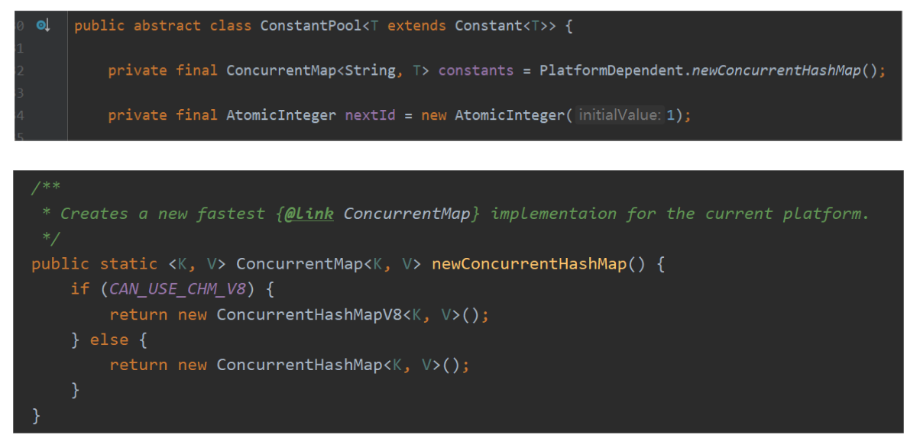
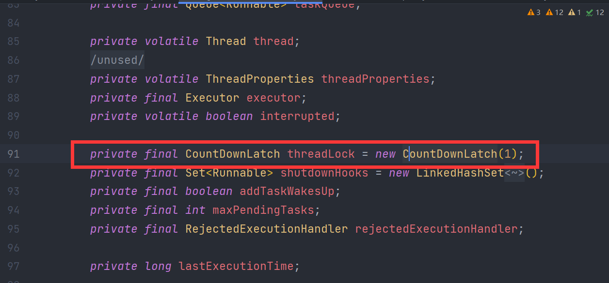
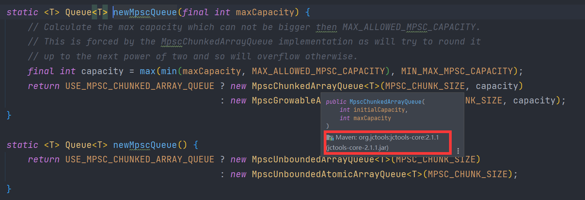
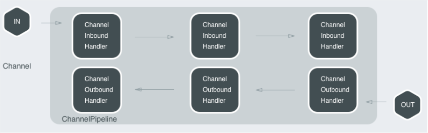
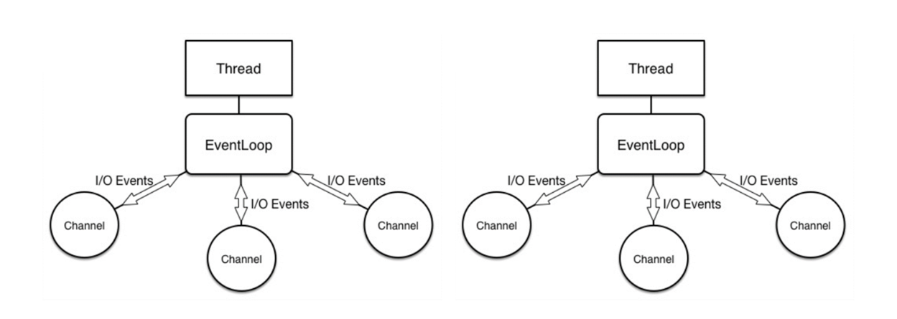
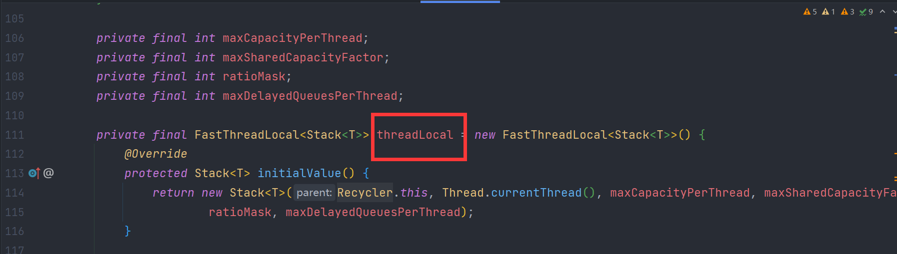

> 本文由 [简悦 SimpRead](http://ksria.com/simpread/) 转码， 原文地址 [www.sikun.top](http://www.sikun.top/archives/-qi-nettyde-na-xie--suo--shi)

> 参考学习资料：

参考学习资料：

*   极客时间傅健老师的《Netty 源码剖析与实战》Talk is cheap.show me the code!
*   课程链接：[https://time.geekbang.org/course/detail/100036701-146703](https://time.geekbang.org/course/detail/100036701-146703)

#### 同步问题的核心三要素

*   原子性：“并无一气呵成，岂能无懈可击”
*   可见性：“你做的改变，别人看不见”
*   有序性：“不按套路出牌”

#### 锁的分类

*   对竞争的态度：乐观锁（java.util.concurrent 包中的原子类）与悲观锁（Synchronized)
*   等待锁的人是否公平而言：公平锁 new ReentrantLock (true) 与非公平锁 new ReentrantLock ()
*   是否可以共享：共享锁与独享锁：ReadWriteLock ，其读锁是共享锁，其写锁是独享锁

#### Netty 玩转锁的五个关键点

##### [1] 在意锁的对象和范围 -> 减少粒度

例：初始化 channel （`io.netty.bootstrap.ServerBootstrap#init`）  
Synchronized method -> Synchronized block【netty-4.1.40.Final 及以后已经修改】

```java
@Override
void init(Channel channel) throws Exception {
    final Map<ChannelOption<?>, Object> options = options0();
    synchronized (options) {
        setChannelOptions(channel, options, logger);
    }
 
    final Map<AttributeKey<?>, Object> attrs = attrs0();
    synchronized (attrs) {
        for (Entry<AttributeKey<?>, Object> e: attrs.entrySet()) {
            @SuppressWarnings("unchecked")
            AttributeKey<Object> key = (AttributeKey<Object>) e.getKey();
            channel.attr(key).set(e.getValue());
        }
    }
 
    ChannelPipeline p = channel.pipeline();
 
    final EventLoopGroup currentChildGroup = childGroup;
    final ChannelHandler currentChildHandler = childHandler;
    final Entry<ChannelOption<?>, Object>[] currentChildOptions;
    final Entry<AttributeKey<?>, Object>[] currentChildAttrs;
    synchronized (childOptions) {
        currentChildOptions = childOptions.entrySet().toArray(newOptionArray(0));
    }
    synchronized (childAttrs) {
        currentChildAttrs = childAttrs.entrySet().toArray(newAttrArray(0));
    }
 
    p.addLast(new ChannelInitializer<Channel>() {
        @Override
        public void initChannel(final Channel ch) throws Exception {
            final ChannelPipeline pipeline = ch.pipeline();
            ChannelHandler handler = config.handler();
            if (handler != null) {
                pipeline.addLast(handler);
            }
 
            ch.eventLoop().execute(new Runnable() {
                @Override
                public void run() {
                    pipeline.addLast(new ServerBootstrapAcceptor(
                        ch, currentChildGroup, currentChildHandler, currentChildOptions, currentChildAttrs));
                }
            });
        }
    });
}
```

分析：

> 上面代码多处使用了 synchronized(){}, 而并非在 init 方法上使用 synchronized, 如果这么做那么锁的对象就是这个实例，锁的范围则是大括号方法的范围，但是实际上我们不需要这么做，只是把 Synchronized method -->Synchronized block，针对上图不同的属性，我们可以分别做锁, 这样就减少了锁的范围。

##### [2] 注意锁的对象本身大小 -> 减少空间占用

例：统计待发送的字节数（`io.netty.channel.ChannelOutboundBuffer`  
AtomicLong -> Volatile long + AtomicLongFieldUpdater

```java
private static final AtomicLongFieldUpdater<ChannelOutboundBuffer> TOTAL_PENDING_SIZE_UPDATER =
    AtomicLongFieldUpdater.newUpdater(ChannelOutboundBuffer.class, "totalPendingSize");
 
@SuppressWarnings("UnusedDeclaration")
private volatile long totalPendingSize;// 统计待发送的字节数
```

```java
private void incrementPendingOutboundBytes(long size, boolean invokeLater) {
    if (size == 0) {
        return;
    }
 
    long newWriteBufferSize = TOTAL_PENDING_SIZE_UPDATER.addAndGet(this, size);
    if (newWriteBufferSize > channel.config().getWriteBufferHighWaterMark()) {
        setUnwritable(invokeLater);
    }
}
```

这样的两个步骤直接使用原子类就能完成，为什么不用原子类而是用了两个较为复杂的方式完成?

> Atomic long VS long：  
> 前者是一个对象，包含对象头（object header）以用来保存 hashcode、lock 等信息，32 位系统占用 8 字节；64 位系统占 16 字节，所以在 64 位系统情况下：  
> volatile long = 8 bytes  
> AtomicLong = 8 bytes （volatile long）+ 16bytes （对象头）+ 8 bytes (引用) = 32 bytes  
> 至少节约 24 字节!  
> 结论：Atomic* objects -> Volatile primary type + Static Atomic*FieldUpdater

##### [3] 注意锁的速度 -> 提高并发性

例 1：记录内存分配字节数等功能用到的 LongCounter  
（`io.netty.util.internal.PlatformDependent#newLongCounter()` ）  
高并发时：java.util.concurrent.atomic.AtomicLong -> java.util.concurrent.atomic.LongAdder (JDK1.8)  
结论： 及时衡量、使用 JDK 最新的功能

```java
public static LongCounter newLongCounter() {
    if (javaVersion() >= 8) {
        return new LongAdderCounter();
    } else {
        return new AtomicLongCounter();
    }
}
```

```java
final class LongAdderCounter extends LongAdder implements LongCounter {
 
    @Override
    public long value() {
        return longValue();
    }
}
```

分析：

> 上图的代码就是筛选 jdk 版本然后有不同的返回类型，如果大于等于 8 则是 LongAdderCounter；而 LongAdderCounter 继承 java.util.concurrent.atomic.LongAdder;
> 
> 高并发时：java.util.concurrent.atomic.AtomicLong ->java.util.concurrent.atomic.LongAdder, 特定场景下是优于 AtomicLong ；

例 2：曾经根据不同情况，选择不同的并发包实现：JDK < 1.8 考虑  
ConcurrentHashMapV8（ConcurrentHashMap 在 JDK8 中的版本）



##### [4] 不同场景选择不同的并发类 -> 因需而变

例 1：关闭和等待关闭事件执行器（Event Executor）：  
Object.wait/notify【必须在监视器内使用】 -> CountDownLatch  
io.netty.util.concurrent.SingleThreadEventExecutor#threadLock：



例 2：Nio Event loop 中负责存储 task 的 Queue  
Jdk’s LinkedBlockingQueue (MPMC)多生产者多消费者 -> jctools’ MPSC  
io.netty.util.internal.PlatformDependent.Mpsc#newMpscQueue(int)：



##### [5] 衡量好锁的价值 -> 能不用则不用

局部串行：Channel 的 I/O 请求处理 Pipeline 是串行的



整体并行：多个串行化的线程（NioEventLoop）



Netty 应用场景下：局部串行 + 整体并行 > 一个队列 + 多个线程模式:

*   降低用户开发难度、逻辑简单、提升处理性能
*   避免锁带来的上下文切换和并发保护等额外开销

避免用锁：用 ThreadLocal 来避免资源争用，例如 Netty 轻量级的线程池实现  
io.netty.util.Recycler#threadLocal

