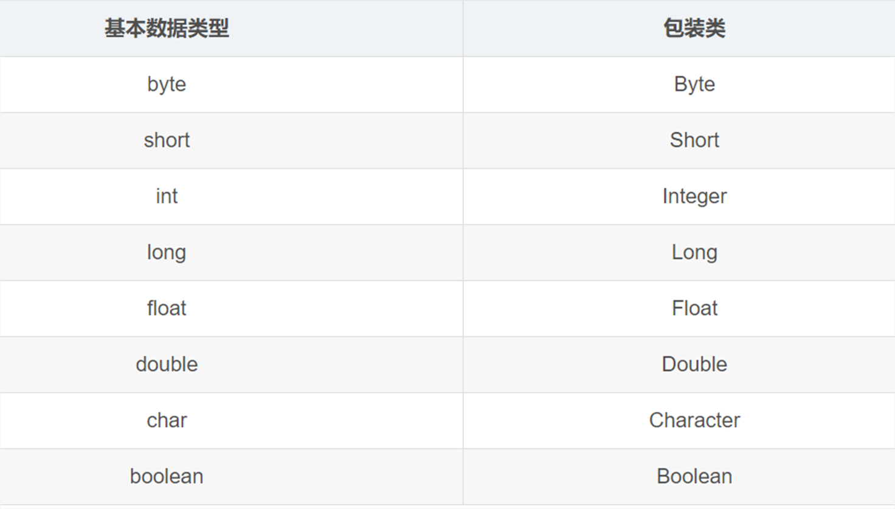
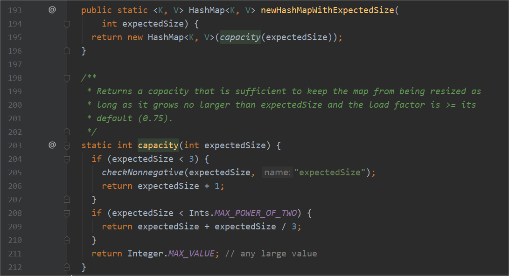
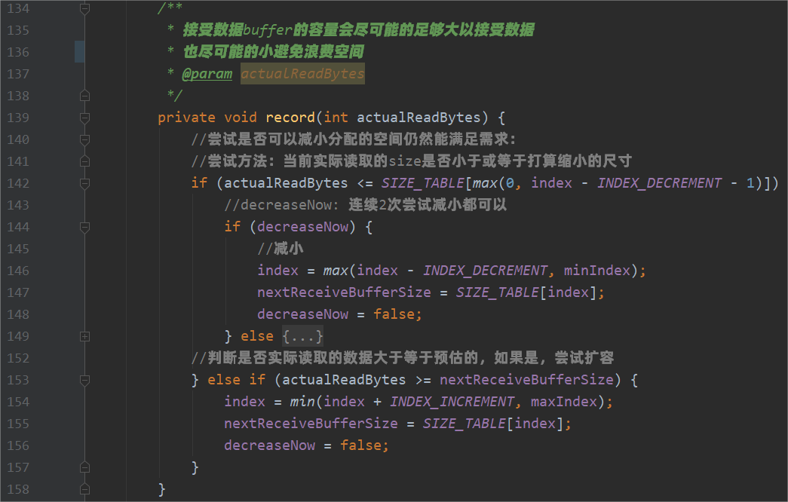
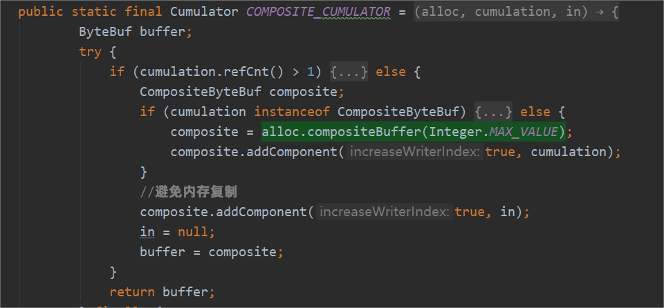
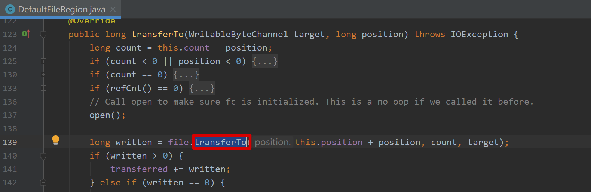

> 本文由 [简悦 SimpRead](http://ksria.com/simpread/) 转码， 原文地址 [www.sikun.top](http://www.sikun.top/archives/-ba-nettyru-he-wan-zhuan-nei-cun-shi-yong)

> 参考学习资料：

参考学习资料：

*   极客时间傅健老师的《Netty 源码剖析与实战》Talk is cheap.show me the code!
*   课程链接：[https://time.geekbang.org/course/detail/100036701-146703](https://time.geekbang.org/course/detail/100036701-146703)

#### 内存使用技巧的目标

目标：

*   内存占用少（空间）
*   应用速度快（时间）

对 Java 而言：减少 Full GC 的 STW（Stop the world）时间

#### Netty 内存使用技巧

##### [1] Netty 内存使用技巧 - 减少对像本身大小

例 1：用基本类型就不要用包装类：



例 2: 应该定义成类变量的不要定义为实例变量：

*   一个类 -> 一个类变量
*   一个实例 -> 一个实例变量
*   一个类 -> 多个实例
*   实例越多，浪费越多。

例 3: Netty 中结合前两者：  
io.netty.channel.ChannelOutboundBuffer#incrementPendingOutboundBytes(long, boolean)  
统计待写的请求的字节数

AtomicLong -> volatile long + static AtomicLongFieldUpdater

##### [2] Netty 内存使用技巧 - 对分配内存进行预估

例 1：对于已经可以预知固定 size 的 HashMap 避免扩容  
可以提前计算好初始 size 或者直接使用  
`com.google.common.collect.Maps#newHashMapWithExpectedSize`



例 2：Netty 根据接受到的数据动态调整（guess）下个要分配的 Buffer 的大小。可参考  
io.netty.channel.AdaptiveRecvByteBufAllocator



##### [3] Netty 内存使用技巧 - Zero-Copy

**例 1：使用逻辑组合，代替实际复制。**  
例如 CompositeByteBuf：  
io.netty.handler.codec.ByteToMessageDecoder#COMPOSITE_CUMULATOR



**例 2：使用包装，代替实际复制。**  
byte[] bytes = data.getBytes();  
ByteBuf byteBuf = Unpooled.wrappedBuffer(bytes);

**例 3：调用 JDK 的 Zero-Copy 接口。**  
Netty 中也通过在 DefaultFileRegion 中包装了 NIO 的 FileChannel.transferTo() 方法实  
现了零拷贝：io.netty.channel.DefaultFileRegion#transferTo



##### [4] Netty 内存使用技巧 - 堆外内存

JVM 内部 -> 堆（heap) + 非堆（non heap）

JVM 外部 -> 堆外（off heap）

优点：

*   更广阔的 “空间”-> 破除堆空间限制，减轻 GC 压力
*   减少 “冗余” 细节 -> 避免复制

缺点：

*   创建速度稍慢
*   风险大 -> 堆外内存受操作系统管理

##### [5] Netty 内存使用技巧 - 内存池

为什么引入对象池：

*   创建对象开销大
*   对象高频率创建且可复用
*   支持并发又能保护系统
*   维护、共享有限的资源


如何实现对象池？

*   开源实现：Apache Commons Pool
*   Netty 轻量级对象池实现 io.netty.util.Recycler

#### 源码解读：Netty 内存使用

源码解读总结：

**怎么从堆外内存切换堆内使用？**

*   方法 1：参数设置 io.netty.noPreferDirect = true;
*   方法 2：传入构造参数 false  
    ```java
    ServerBootstrap serverBootStrap = new ServerBootstrap();  
    UnpooledByteBufAllocator unpooledByteBufAllocator = new UnpooledByteBufAllocator(false);  
    serverBootStrap.childOption(ChannelOption.ALLOCATOR, unpooledByteBufAllocator)
    ```
    
    

**堆外内存的分配？**调用JDK的分配直接内存

*   ByteBuffer.allocateDirect(initialCapacity)

**内存池 / 非内存池的默认选择及切换方式？**

*   默认选择：安卓平台 -> 非 pooled 实现，其他 -> pooled 实现。
*   参数设置：io.netty.allocator.type = unpooled;
*   显示指定：serverBootStrap.childOption(ChannelOption.ALLOCATOR, UnpooledByteBufAllocator.DEFAULT)

**内存池实现？**

*   核心要点：有借有还，避免遗忘。