# 基础概念

###  I/O 的定义

I/O 的全称是Input/Output。虽常谈及I/O，但想必你也一时不能给出一个完整的定义。搜索了谷歌，发现也尽是些冗长的论述。要想厘清I/O这个概念，我们需要从不同的视角去理解它。

**计算机视角**

冯•诺伊曼计算机的基本思想中有提到计算机硬件组成应为五大部分：控制器，运算器，存储器，输入和输出。其中输入是指将数据输入到计算机的设备，比如键盘鼠标；输出是指从计算机中获取数据的设备，比如显示器；以及既是输入又是输出设备，硬盘，网卡等。

用户通过操作系统才能完成对计算机的操作。计算机启动时，第一个启动的程序是操作系统的内核，它将负责计算机的资源管理和进程的调度。换句话说：操作系统负责从输入设备读取数据并将数据写入到输出设备。

所以I/O之于计算机，有两层意思：

1. I/O设备          2. 对I/O设备的数据读写

*对于一次I/O操作，必然涉及2个参与方，一个输入端，一个输出端，而又根据参与双方的设备类型，我们又可以分为磁盘I/O，网络I/O（一次网络的请求响应，网卡）等。*

**程序员视角**：用户空间和内核空间

## 1、用户空间与内核空间

现在操作系统都是采用虚拟存储器，操作系统的核心是内核，独立于普通的应用程序，可以访问受保护的内存空间，也有访问底层硬件设备的所有权限。为了保证用户进程不能直接操作内核（kernel），保证内核的安全，操作系统将虚拟内存划分为两部分，一部分为内核空间，一部分为用户空间。对于32位操作系统，它的寻址空间（虚拟存储空间）为4G（2的32次方），linux操作系统中将最高的1G字节（从虚拟地址0xC0000000到0xFFFFFFFF）供内核使用，称为内核空间，而将较低的3G字节（从虚拟地址0x00000000到0xBFFFFFFF）供各个用户进程使用，称为用户空间。

我们构建的程序将运行在用户空间，用户空间无法操作内核空间，也就意味着用户空间的程序不能直接访问由内核管理的I/O，比如：硬盘、网卡等

在 Linux 系统中，内核模块运行在内核空间，对应的进程处于内核态；而用户程序运行在用户空间，对应的进程处于用户态。

内核态进程可以执行任意命令，调用系统的一切资源，而用户态进程只能执行简单的运算，不能直接调用系统资源。那用户态进程如何执行系统调用呢？用户态进程必须通过系统接口(System Call)，才能向内核发出指令，完成调用系统资源之类的操作。

所以I/O之于应用程序来说，强调的通过**向内核发起系统调用完成对I/O的间接访问**。换句话说应用程序发起的一次IO操作实际包含两个阶段：

1. **IO调用阶段：应用程序进程向内核发起系统调用**
2. **IO执行阶段：内核执行IO操作并返回**
   **2.1. 准备数据阶段：内核等待I/O设备准备好数据**
   **2.2. 拷贝数据阶段：将数据从内核缓冲区拷贝到用户空间缓冲区**

怎么理解准备数据阶段呢？

> 对于写请求：等待系统调用的完整请求数据，并写入内核缓冲区；
> 对于读请求：等待系统调用的完整请求数据；（若请求数据不存在于内核缓冲区）则将外围设备的数据读入到内核缓冲区。


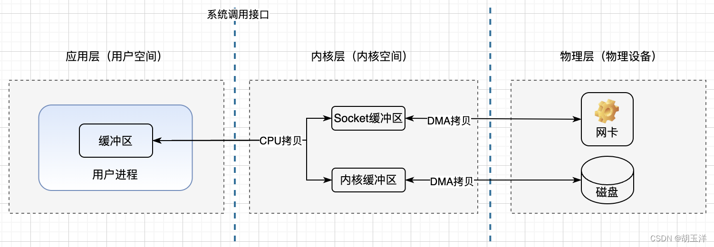

CPU 拷贝：由 CPU 直接处理数据的传送，数据拷贝时会一直占用 CPU 的资源。

DMA 拷贝：由 CPU 向DMA控制器下达指令，让 DMA 控制器来处理数据的传送，数据传送完毕再把信息反馈给 CPU，从而减轻了 CPU 资源的占有率。

上下文切换：当用户程序向内核发起系统调用时，CPU 将用户进程从用户态切换到内核态；当系统调用返回时，CPU 将用户进程从内核态切换回用户态。

## 2、缓存 IO、直接IO

### 缓存IO

缓存IO又被称作标准 IO，大多数文件系统的默认 IO 操作都是缓存 IO。在 Linux 的缓存 IO 机制中，数据会先从磁盘/网卡通过DMA方式被拷贝到内核空间的缓冲区中，然后才会从内核空间的缓冲区拷贝到应用程序的地址空间。

读数据：当应用程序调用read()读取数据的时候，如果这块数据存在于内核空间的缓冲区，就直接返回；如果在内核空间缓冲区不存，就从磁盘/网卡中读取到内核空间缓冲区，再拷贝到用户空间缓冲区。

写数据：用户进程调用write()，将数据从用户空间缓冲区复制到内核空间缓冲区，这时候对用户进程来说，写操作已完成，至于数据什么时候从内核缓冲区写入到磁盘/网卡，由操作系统决定，这种输出方式称为延迟写，延迟写减少了磁盘读写次数，但是降低了数据持久化的速度，当系统发生故障时还可能造成数据丢失。也可以通过调用sync()/fsync()/fdatasync()来强制写入磁盘。

缓存 IO 的优点：在一定程度上分离了用户空间和内核空间，保护系统本身运行安全；减少读写磁盘次数，提高性能。

缓存 IO 的缺点：数据在传输过程中需要在应用程序地址空间和内核进行多次数据拷贝操作，这些数据拷贝操作所带来的 CPU 以及内存开销是非常大的。

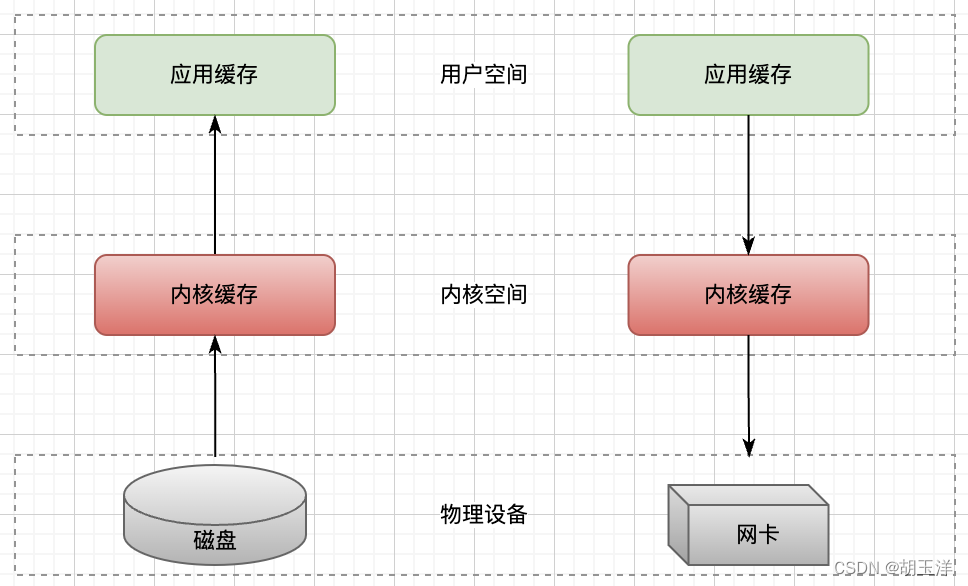

### 直接IO

与之对应的还有直接IO，就是应用程序直接访问磁盘/网卡数据，而不经过内核缓冲区，这样可以减少一次内核缓冲区到用户缓冲区的数据拷贝。比如DBMS这类应用，它们比操作系统更了解数据库中存放的数据，可以提供一套更加有效的缓存机制来提高数据库中数据的存取性能，因此更倾向于选择他们自己的缓存机制。

直接 IO 的优点：可以减少一次从内核缓冲区到用户缓冲区的数据拷贝。

直接IO 的缺点：如果访问的数据在应用缓冲区中不存在，那么每次都会从磁盘/网卡中直接读取数据，这种方式读取数据会非常慢，因此直接IO通常和异步IO结合使用才会得到比较好的性能。

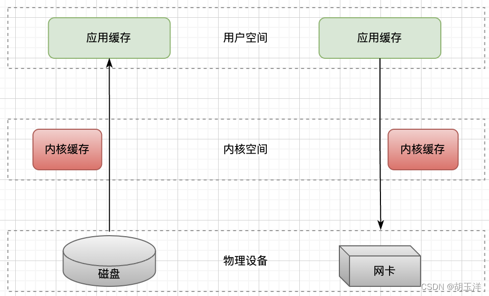

## 3、同步/异步/阻塞/非阻塞

同步：进程触发IO操作并等待，或者轮训去查询IO操作是否完成，等待结果，然后才能执行后续的操作；

异步：触发IO操作后，直接返回，继续做后续的操作，IO交给内核来处理，完成后内核通知进程IO完成；

阻塞：进程给CPU传达一个任务后，一直等待CPU处理完成，才继续执行后续操作；

非阻塞：进程给CPU传达任务后，继续执行后续操作，隔段时间再来查询是否完成。

同步和异步是针对于应用程序和内核的交互而言的，更加关注通知的方式，关注的是程序与内核的协作关系；阻塞和非阻塞更关注的是单个进程内部的执行状态，粒度更细，更微观，进程的阻塞是进程自身的一种主动行为。

举个例子：
双11期间，我想知道某个店铺是否有优惠券。
同步：我一直刷新页面，查询是否有优惠券；
异步：我点击了订阅，店铺有优惠券会发短信通知我；
阻塞：无论我不断刷新页面，还是点击订阅，优惠券发放之前我不能做其他事，只能干等着；
非阻塞：无论我不断刷新页面，还是点击订阅，优惠券发放之前我还可以做其他事，比如听歌、喝水。


## 4、Linux IO 模型

### 阻塞IO

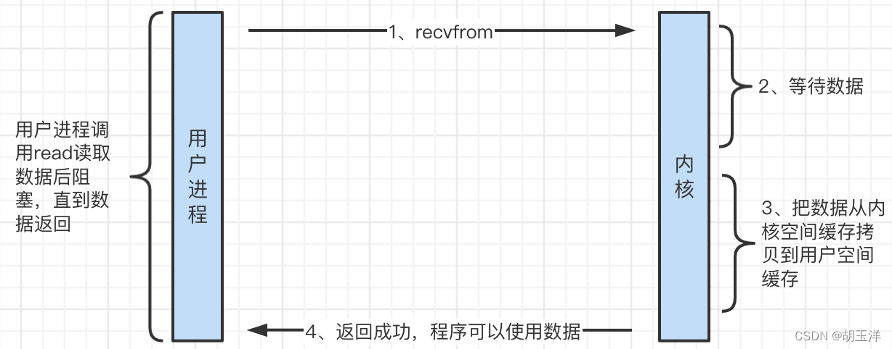

（1）用户进程发起read，进行recvfrom系统调用。
（2）内核开始准备数据（从网卡拷贝到缓冲区），进程请求的数据并不是一下就能准备好，准备数据是要消耗时间的。与此同时，用户进程阻塞，等待数据ing。
（3）把数据从内核空间拷贝到用户空间。
（4）内核返回结果，用户进程解除阻塞。

### 非阻塞IO

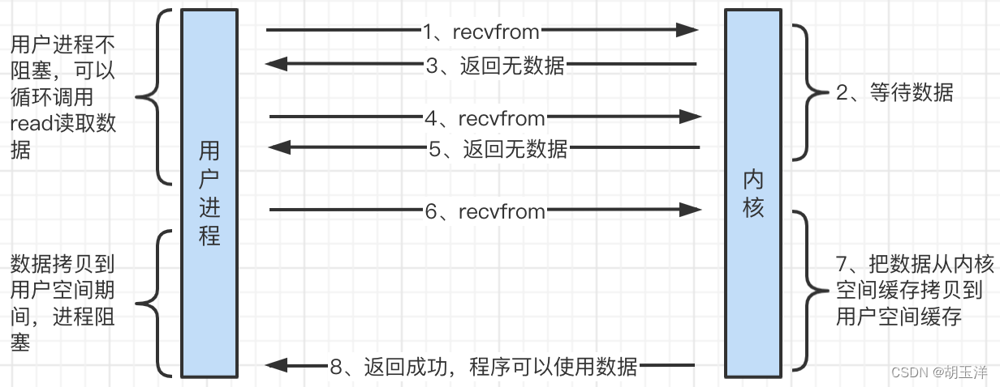

（1、3）用户进程发起read，进行recvfrom系统调用，如果数据还没准备好就直接返回。
（2）内核收到用户进程的调用后，开始准备数据。
（4、5）用户进程再次发起read读取数据，如果数据还没准备好，直接返回。
（6）用户进程再次发起read读取数据，这时候数据已经拷贝到内核缓冲区了。
（7）把数据从内核缓冲区拷贝到用户缓冲区，这个过程用户进程阻塞。
（8）内核返回结果，用户进程解除阻塞。

### IO多路复用

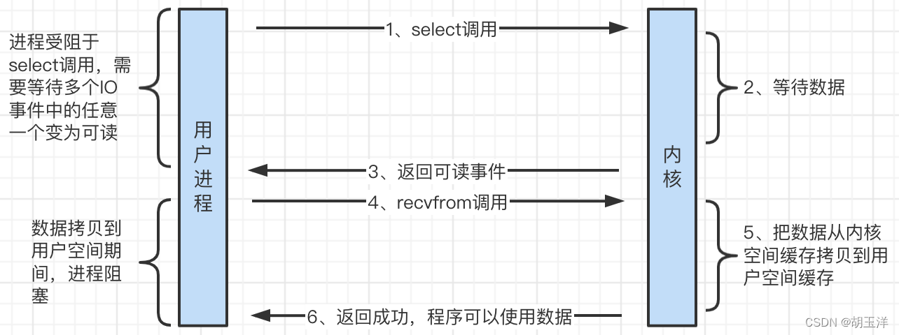

（1）当用户进程调用了select，用户进程会被阻塞。
（2）内核会“监视”所有select负责的socket。
（3）当任何一个socket中的数据准备好了，select就会返回。
（4）这个时候用户进程调用read操作。
（5）将数据从内核拷贝到用户空间缓存，在此期间用户进程会被阻塞。
（6）内核返回结果，用户进程解除阻塞。

### 信号驱动式IO

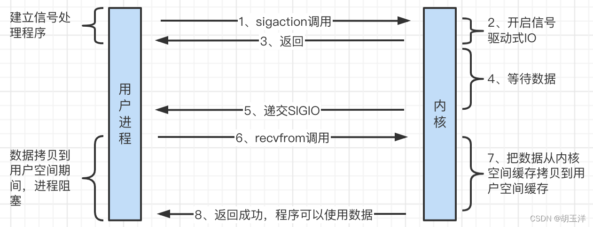

所谓信号驱动式I/O(signal-driven I/O)，就是预先告知内核，当某个描述符准备发生某件事情的时候，让内核发送一个信号通知应用进程。
（1、2、3）用户进程注册SIGIO信号处理函数，进行sigaction系统调用；内核开启信号驱动式IO并返回调用结果。
（4、5）内核等待数据返回后，会给用户进程发送一个SIGIO信号。
（6）用户进程在信号处理函数中调用recvfrom读取数据，数据返回前，用户进程阻塞。
（7）将数据从内核拷贝到用户空间缓存。
（8）内核返回结果，用户进程解除阻塞。

### 异步IO

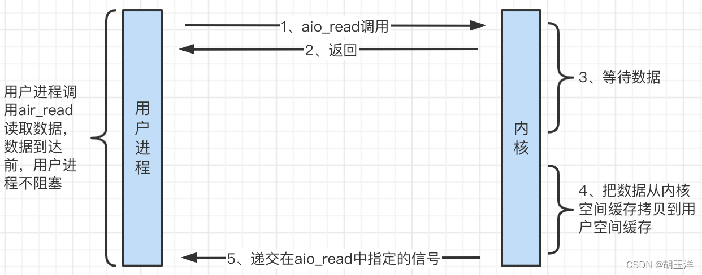

（1、2）用户进程进行aio_read系统调用之后，无论内核数据是否准备好，都会直接返回给用户进程，然后用户态进程可以去做别的事情。
（3）内核开始准备数据。
（4）把数据从内核缓冲区拷贝到用户缓冲区。
（5）数据拷贝完成后，内核会给用户发送一个signal或者执行一个基于线程的回调函数来完成这次IO处理过程。

# BIO阻塞IO

[BIO](https://so.csdn.net/so/search?q=BIO&spm=1001.2101.3001.7020)（Blocking IO）也就是阻塞IO，当服务端和客户端交互时，如果服务端接收了一个客户端请求，就要为这个客户端一直服务直到结束，否则无法为下一个客户端服务。BIO就属于同步阻塞IO。

## **BIO单线程处理请求**

BIO服务器端：

```java
@Slf4j
public class BIOServer {
    @SneakyThrows
    public static void main(String[] args) {
        ServerSocket serverSocket=new ServerSocket();
        try {
            serverSocket.bind(new InetSocketAddress("127.0.0.1",8080),50);
            log.info("server started.");
            while (true){
                Socket socket=serverSocket.accept(); // 如果没有客户端连接，会阻塞在这里，直到客户端发送了连接
                log.info("receive connection from client. client:{}",socket.getRemoteSocketAddress());
                byte[] buffer=new byte[64];
                socket.getInputStream().read(buffer); // 如果没有读取到当前客户端发送的数据，会阻塞在这里，直到客户端发送了数据
                log.info("receive message from client. client:{} message:{}",socket.getRemoteSocketAddress(),new String(buffer,"UTF-8"));
            }
        } catch (Exception e) {
            e.printStackTrace();
        }finally {
            serverSocket.close();
        }
    }
}
```

客户端：

```java
@Slf4j
public class BIOClient {
    @SneakyThrows
    public static void main(String[] args) {
        Socket socket = new Socket();
        try {
            socket.connect(new InetSocketAddress("127.0.0.1", 8080));
            log.info("client connect finished");
            socket.getOutputStream().write("hello".getBytes(StandardCharsets.UTF_8));
            log.info("client send finished");
        } catch (Exception e) {
            e.printStackTrace();
        } finally {
            socket.close();
        }
    }
}
```

- 以Run模式启动服务端
- 在客户端的 `socket.getOutputStream().write("hello".getBytes(StandardCharsets.UTF_8)); `处打上断点，以Debug模式运行一个客户端A，执行到断点时，服务端已经接收到客户端A的请求（在控制台打印了 `receive connection from client. client:/127.0.0.1:61501 `）
- 再以Debug模式运行一个客户端B，服务端没反应，因为这时客户端A还没发送数据，所以服务端目前是在 `socket.getInputStream().read(buffer); `的地方阻塞了（还在等着接收客户端A发送数据）
- 再以Debug模式运行一个客户端C，服务端同样没反应
- 让客户端A继续运行完，发现服务端读取到客户端A的数据（打印了`receive message from client. client:/127.0.0.1:61501 message:hello `）后，才能接收到客户端B的连接（打印了`receive connection from client. client:/127.0.0.1:61697 `）
- 让客户端B继续运行完，发现服务端读取到客户端B的数据（打印了`receive message from client. client:/127.0.0.1:61697 message:hello `）后，才能接收到客户端C的连接（打印了`receive connection from client. client:/127.0.0.1:61701 `）

BIO的“阻塞”就体现在这里，当一个服务端线程正在处理或者等待处理某个客户端的请求，是无法为其他客户端服务的。

## **BIO多线程处理请求**

假如当某个客户端连接上服务端后，不写数据或写数据比较慢，其他客户端的请求就不能被及时处理，这时可以通过多线程的方式来解决，每当收到一个新的客户端时，就单独让一个线程专门处理这个客户端的请求，如下：

```java
@Slf4j
public class BIOMultipleServer {
    private final static ExecutorService threadPool= Executors.newCachedThreadPool();
    @SneakyThrows
    public static void main(String[] args) {
        ServerSocket serverSocket=new ServerSocket();
        try {
            serverSocket.bind(new InetSocketAddress("127.0.0.1",8080),50);
            log.info("server started.");
            while (true){
                Socket socket=serverSocket.accept();
                log.info("receive connection from client. client:{}",socket.getRemoteSocketAddress());
                threadPool.submit(new Runnable() {
                    @SneakyThrows
                    @Override
                    public void run() {
                        byte[] buffer=new byte[64];
                        socket.getInputStream().read(buffer);
                        log.info("receive message from client. client:{} message:{}",socket.getRemoteSocketAddress(),new String(buffer,"UTF-8"));
                    }
                });
            }
        } catch (Exception e) {
            e.printStackTrace();
        }finally {
            serverSocket.close();
        }
    }
}
```

- 以Run模式启动服务端
- 在客户端的 `socket.getOutputStream().write("hello".getBytes(StandardCharsets.UTF_8)); `处打上断点，以Debug模式运行一个客户端A，执行到断点时，服务端已经接收到客户端A的请求（在控制台打印了 `receive connection from client. client:/127.0.0.1:61517 `）
- 再以Debug模式运行一个客户端B，执行到断点时，服务端已经接收到客户端B的请求（在控制台打印了 `receive connection from client. client:/127.0.0.1:61521 `）
- 再以Debug模式运行一个客户端C，执行到断点时，服务端已经接收到客户端C的请求（在控制台打印了 `receive connection from client. client:/127.0.0.1:61525 `）
- 让客户端A、B、C继续运行完，服务端也能正常接收消息

这样就可以通过多线程的方式解决服务端不能同时为多个客户端服务的弊端。但又带来了新的问题：每接收一个客户端就用一个线程去处理，如果创建的线程过多，会消耗大量的服务器资源，即使用线程池的方式来限制线程数量和上下文切换，如果多个客户端连接成功后都等待，也会导致服务端的线程都阻塞，治标不治本。因此BIO只适合连接数较少的场景，当连接数较多时，Java [NIO](https://so.csdn.net/so/search?q=NIO&spm=1001.2101.3001.7020)的优势就体现出来了。

# NIO三大组件Buffer、Channel、Selector

Java [NIO](https://so.csdn.net/so/search?q=NIO&spm=1001.2101.3001.7020)（Java New IO）也称为Java Non-Blocking IO，也就是非阻塞IO，说是非阻塞IO，其实NIO也支持阻塞IO模型（默认就是），相对于BIO来说，NIO最大的特点是支持IO多路复用模式，可以通过一个线程监控多个IO流(Socket)的状态，来同时管理多个客户端，极大提高了服务器的吞吐能力。

在NIO中有3个比较重要的组件：Buffer、Channel、Selector

## Buffer

Buffer顾名思义，缓冲区，类似于List、Set、Map，实际上它就是一个容器对象，对数组进行了封装，用数组来缓存数据，还定义了一些操作数组的API，如 put()、get()、flip()、compact()、mark() 等。在NIO中，无论读还是写，数据都必须经过Buffer缓冲区，如下图：

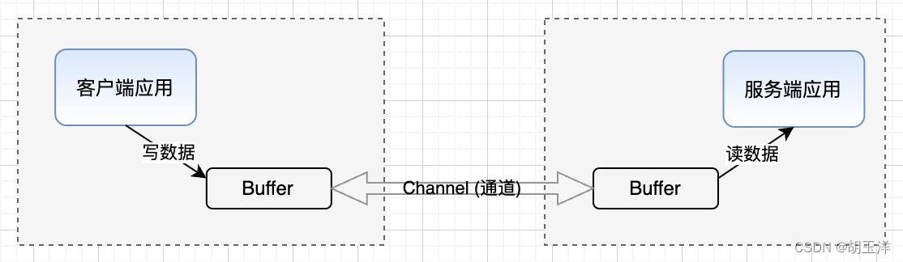


随便创建一个Buffer，再put两个字节：

```java
ByteBuffer byteBuffer = ByteBuffer.allocate(12);
byteBuffer.put((byte)'a');
byteBuffer.put((byte)'b'); 
```

发现这两个字节是被存到Buffer中一个叫hb的数组中了：

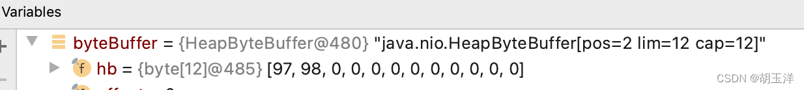

Buffer是所有缓存类的父类，对应实现有ByteBuffer、CharBuffer、IntBuffer、LongBuffer等跟ava基本数据类型对应的几个实现类：

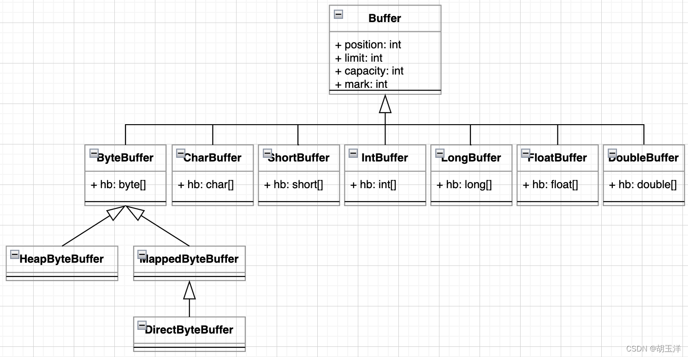

一般最长用的就是ByteBuffer，创建 ByteBuffer 有两种方式：HeapByteBuffer 和 DirectByteBuffer：

（1）HeapByteBuffer：占用JVM堆内内存，不用考虑垃圾回收，属于用户空间，相对于DirectByteBuffer来说拷贝数据效率较低，会受到Full GC影响（Full GC后，可能需要移动数据位置）。创建HeapByteBuffer的方式为：

```java
ByteBuffer heapBuffer = ByteBuffer.allocate(1024);
```

（2）DirectByteBuffer：占用堆外内存，读写效率高（读数据可以减少一次数据的复制），初次分配效率较低（需要调用系统函数），不受JVM GC的影响，但使用时要注意垃圾回收，使用不当可能造成内存泄漏。创建DirectByteBuffer的方式为：

```java
ByteBuffer directBuffer = ByteBuffer.allocateDirect(1024); 
```

为了可以更灵活地读/写数据，Buffer中有几个比较重要的属性：

● 容量（capacity）：即可以容纳的最大数据量；在缓冲区创建时被设定并且不能改变
● 位置（position）：当前读/写到哪个位置，下一次读/写就会从下一个位置开始，每次读写缓冲区数据时都会改变（累加），为下次读写作准备
● 上限（limit）：表示缓冲区的临时读/写上限，不能对缓冲区超过上限的位置进行读写操作，上限是可以修改的（flip函数）。读的时候读的是从position到limit之间的数据，写的时候也是从position位置开始写到limit位置。
● 标记（mark）：调用mark函数可以记录当前position的值（mark = position），以后再调用reset()可以让position重新恢复到之前标记的位置（position = mark）

用个例子来看下这几个属性在读/写数据过程中的变化

```java
public class BufferTest {
    public static void main(String[] args) throws IOException {
        // 1、初始化Buffer，先初始化一个长度为12的ByteBuffer，也就是创建了类型为byte一个长度为12的数组：
        ByteBuffer byteBuffer = ByteBuffer.allocate(12);
        System.out.println("【初始化ByteBuffer】 capacity: " + byteBuffer.capacity() + " position: " + byteBuffer.position() + " limit: " + byteBuffer.limit());

        // 2、写数据，写的过程中，每写入一个字节，position自增1，当写入8个字节数据后，position=8
        for (int i = 0; i < 8; i++) {
            byteBuffer.put((byte) i);
        }
        System.out.println("【ByteBuffer写完数据】 capacity: " + byteBuffer.capacity() + " position: " + byteBuffer.position() + " limit: " + byteBuffer.limit());

        // 3、将Buffer由写模式转化为读模式
        byteBuffer.flip();
        System.out.println("【ByteBuffer调flip】 capacity: " + byteBuffer.capacity() + " position: " + byteBuffer.position() + " limit: " + byteBuffer.limit());

        // 4、读数据，如果依次读取了6个字节，那现在position就指向下标为6的位置，limit不变
        for (int i = 0; i < 6; i++) {
            if (i == 3) {
                byteBuffer.mark();
            }
            byte b = byteBuffer.get();
        }
        System.out.println("【ByteBuffer读完数据】 capacity: " + byteBuffer.capacity() + " position: " + byteBuffer.position() + " limit: " + byteBuffer.limit());

        // 5、重置position
        byteBuffer.reset();
        System.out.println("【ByteBuffer调reset】 capacity: " + byteBuffer.capacity() + " position: " + byteBuffer.position() + " limit: " + byteBuffer.limit());
    }
}
```

① 初始化Buffer，先初始化一个长度为12的ByteBuffer，也就是创建了类型为byte一个长度为12的数组：

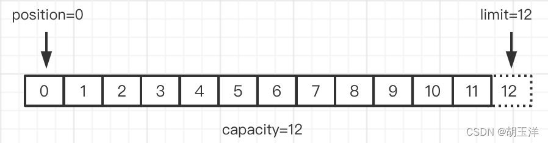
② 写数据，写的过程中，每写入一个字节，position自增1，当写入8个字节数据后，position=8，如下图：
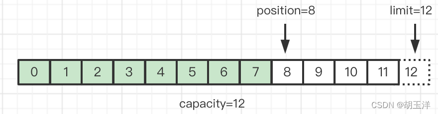

③ **<span style="color:red;"> 写数据转读数据 </span >**，现在Buffer中一共有8个字节的数据。因为对Buffer的读/写，都是从position位置到limit位置进行读/写的。如果现在想读取Buffer中的数据，需要执行一下Buffer的flip()函数，把limit置为8（position的值），position重新置为0，这时候position到limit之间的数据才是有效的（我们想要读取的）数据。所以通常**将Buffer由写模式转化为读模式时需要执行flip()函数**：

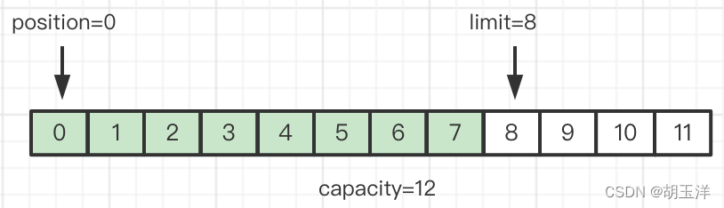

④ 读数据，如果依次读取了6个字节，那现在position就指向下标为6的位置，limit不变：

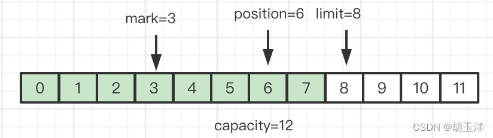

⑤ 重置position，前面在position=3的时候，调用`byteBuffer.mark()`;标记了一下当时position的值（mark=3），当读取完6个字节后，position=6。这时调用一下`byteBuffer.reset()`可以把position重置为当时mark的值（position=mark），也就是3：

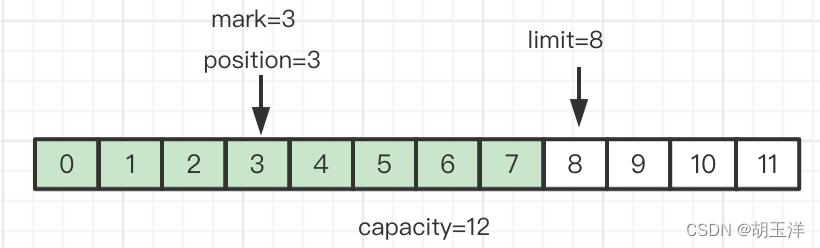

ByteBuffer中常用的的方法还有很多：

```java
byteBuffer.put((byte) 'a'); //在position位置存入字符a对应的字节
byteBuffer.put(1, (byte) 5); //在1位置存入数字5对应的字节
byteBuffer.get();// 从position的位置读取一个字节的数据，读完后会导致position加1
byteBuffer.get(i);// 从position=i的位置读取一个字节的数据，读完后不会导致position加1
byteBuffer.reset(); // 重置position的值为mark  与mark方法配套
byteBuffer.position(5); // 重置position的值为5
byteBuffer.flip(); // 写完数据后，切换到读模式，把limit置为position的值，position置为0，
byteBuffer.clear(); // 清空ByteBuffer，position=0，limit=capacity
byteBuffer.compact(); // 读了一部分数据后，切换到写模式，会把未读的数据向前压缩，只留下有效数据（一般认为position~limit之间的数据为有效数据），比如原来pos=2，limit=8，capacity=12，执行compact()后，pos=6，limit=12，capacity=12
```

这里不再一一详细介绍。

## Channel

Channel是对原 I/O 包中的流的模拟，到任何目的地(或来自任何地方)的所有数据都必须通过一个 Channel 对象，通道是双向的（一个Channel既可以读数据，也可以写数据），[BIO](https://so.csdn.net/so/search?q=BIO&spm=1001.2101.3001.7020)中的InputStream/OutputStream是单向的（InputStream/OutputStream只能读/写数据）。

Channel 有文件通道和网络通道，文件通道的实现主要是FIleChannel，网络通道的实现主要有ServerSocketChannel（主要用于服务器接收客户端请求，类似于BIO中的ServerSocket）、SocketChannel（主要用户服务器和客户端直接的数据读写，类似于BIO中的Socket）、DatagramChannel（用于基于UDP协议的数据读写）。

FileChannel可以对文件进行读写，下面是个简单的例子：

```java
public class FileChannelTest {
    public static void main(String[] args) throws IOException {
        FileChannel fileChannel = FileChannel.open(Paths.get("/Users/danny/data/file/file.txt"), StandardOpenOption.WRITE, StandardOpenOption.READ);
        // 通过FileChannel从文件中读数据
        ByteBuffer readBuffer=ByteBuffer.allocate(10);
        while (fileChannel.read(readBuffer) != -1){
            while (readBuffer.hasRemaining()){
                byte b=readBuffer.get();
            }
        }
        // 通过FileChannel向文件中写数据
        ByteBuffer writeBuffer=ByteBuffer.allocate(10);
        writeBuffer.put("Data".getBytes());
        writeBuffer.flip();
        while (writeBuffer.hasRemaining()){
            fileChannel.write(writeBuffer);
        }
    }
}
```

ServerSocketChannel 主要用于服务器接收客户端请求，SocketChannel 主要用户服务器和客户端直接的数据读写，跟BIO中ServerSocket和Socket通信差不多：
服务端：

```java
public class ServerSocketChannelTest {
    public static void main(String[] args) throws IOException {
        ServerSocketChannel serverSocketChannel = ServerSocketChannel.open();
        serverSocketChannel.configureBlocking(true); // 设置阻塞模式为阻塞，默认就是true
        serverSocketChannel.bind(new InetSocketAddress(8080));
        ByteBuffer byteBuffer = ByteBuffer.allocate(1024);
        SocketChannel socketChannel = serverSocketChannel.accept(); // 如果没有接收到新的客户端连接，这里会阻塞
        System.out.println("收到到客户端连接");
        int length = socketChannel.read(byteBuffer); // 如果读不到数据，这里会阻塞，无法处理其他Channel的读操作和连接请求
        System.out.println("读取到客户端数据：" + new String(byteBuffer.array(), 0, length));
    }
}
```

客户端：

```java
public class SocketChannelTest {
    public static void main(String[] args) throws IOException {
    	Socket socket = new Socket();
    	socket.connect(new InetSocketAddress("127.0.0.1", 8080));
    	System.out.println("连接服务端完成");
    	socket.getOutputStream().write(Constant.MESSAGE_128B.getBytes());
    	System.out.println("向服务端发送数据完成");
    	socket.close();
	}
}
```

## Selector

选择器Selector相当于管家，管理所有的IO事件，通过Selector可以使一个线程管理多个Channel（也就是多个网络连接），当一个或多个注册到Selector上的Channel发生可读/可写事件时，Selector能够感知到并返回这些事件。

一个Channel可以注册到多个不同的Selector上，多个Channel也可以注册到同一个Selector上。当某个Channel注册到Selector上时，会包装一个SelectionKey（包含一对一的Selector和Channel）放到该Selector中，这些后面看源码的时候再仔细画图分析。

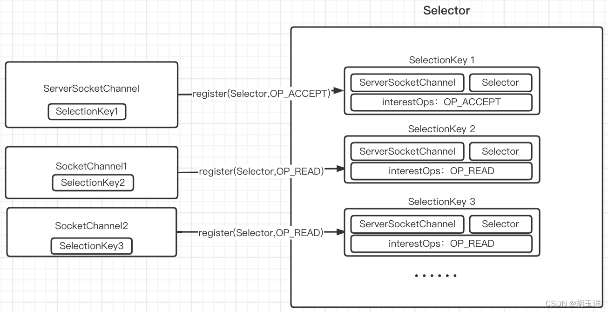

根据理解画了一张Selector在整个服务端和客户端交互中的作用的图，大致如下：

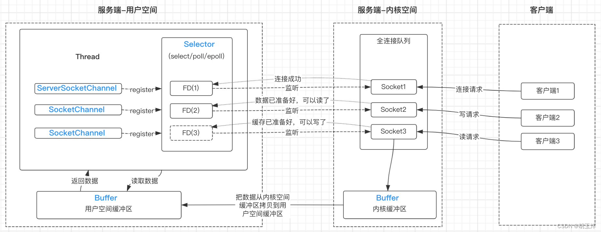

Selector可以作为一个观察者，可以把已知的Channel（无论是服务端用来监听客户端连接的ServerSocketChannel，还是服务端和客户端用来读写数据的SocketChannel）及其感兴趣的事件（READ、WRITE、CONNECT、ACCEPT）包装成一个SelectionKey，注册到Selector上，Selector就会监听这些Channel注册的事件（监听的时候如果没有事件就绪，Selector所在线程会被阻塞），一旦有事件就绪，就会返回这些事件的列表，继而服务端线程可以依次处理这些事件。

NIO使用了Selector，IO模型就是属于IO多路复用（同步非阻塞），可以同事检测多个IO事件，即使某一个IO事件尚未就绪，可以处理其他就绪的IO事件。同步体现在在Selector监听IO事件（Selector.select()方法）时，如果没有就绪事件，就会等待，不能做其他事；非阻塞体现在当某一个IO事件尚未就绪时，可以处理其他就绪的IO事件，比如在上图中，如果客户端2一直不发送数据，服务端也可以正常处理其他客户端的请求，而在BIO中（单线程环境），如果某个客户端连接到了服务端而迟迟不写数据，那么服务器端就会一直等待而无法及时接收其他客户端的请求。正是因为Selector，才可以让NIO在单线程的环境就能处理多个网络连接，为高并发编程打下基础。

代码见下面粘包拆包

# 粘包拆包出现的原因及解决方式

在基于TCP协议的网络编程中，不可避免地都会遇到粘包和拆包的问题。

## 什么是粘包和拆包？

先来看个例子，还是上篇文章 [《Java网络编程——NIO的阻塞IO模式、非阻塞IO模式、IO多路复用模式的使用》 ](https://huyuyang.blog.csdn.net/article/details/126065746)中“IO多路复用模式”一节中的代码：

### 服务端

```java
@Slf4j
public class NIOServer {

    public static void main(String[] args) throws Exception {
        ServerSocketChannel serverSocketChannel = ServerSocketChannel.open();
        serverSocketChannel.configureBlocking(false);
        serverSocketChannel.bind(new InetSocketAddress("127.0.0.1", 8080), 50);
        Selector selector = Selector.open();
        SelectionKey serverSocketKey = serverSocketChannel.register(selector, SelectionKey.OP_ACCEPT);
        while (true) {
            int count = selector.select();
            log.info("select event count:" + count);
            Set<SelectionKey> selectionKeys = selector.selectedKeys();
            Iterator<SelectionKey> iterator = selectionKeys.iterator();
            while (iterator.hasNext()) {
                SelectionKey selectionKey = iterator.next();
                if (selectionKey.isAcceptable()) {
                    handleAccept(selectionKey);
                }
                else if (selectionKey.isReadable()) {
                    handleRead(selectionKey);
                }
                iterator.remove();
            }
        }
    }

    private static void handleAccept(SelectionKey selectionKey) throws IOException {
        ServerSocketChannel serverSocketChannel = (ServerSocketChannel) selectionKey.channel();
        SocketChannel socketChannel = serverSocketChannel.accept();
        if (Objects.nonNull(socketChannel)) {
            log.info("receive connection from client. client:{}", socketChannel.getRemoteAddress());
            socketChannel.configureBlocking(false);
            Selector selector = selectionKey.selector();
            socketChannel.register(selector, SelectionKey.OP_READ);
        }
    }

    private static void handleRead(SelectionKey selectionKey) throws IOException {
        SocketChannel socketChannel = (SocketChannel) selectionKey.channel();
        ByteBuffer readBuffer = ByteBuffer.allocate(4);
        int length = socketChannel.read(readBuffer);
        if (length > 0) {
            log.info("receive message from client. client:{} message:{}", socketChannel.getRemoteAddress()
                    , new String(readBuffer.array(), 0, length, "UTF-8"));
        } else if (length == -1) {
            socketChannel.close();
            return;
        }
    }
    
}
```

### 客户端

```java
@Slf4j
public class NIOClient {

    @SneakyThrows
    public static void main(String[] args) {
        SocketChannel socketChannel = SocketChannel.open();
        try {
            socketChannel.connect(new InetSocketAddress("127.0.0.1", 8080));
            ByteBuffer byteBuffer1, byteBuffer2;
            socketChannel.write(byteBuffer1 = ByteBuffer.wrap("你".getBytes(StandardCharsets.UTF_8)));
            socketChannel.write(byteBuffer2 = ByteBuffer.wrap("好".getBytes(StandardCharsets.UTF_8)));
            log.info("client send finished");
        } catch (Exception e) {
            e.printStackTrace();
        } finally {
            socketChannel.close();
        }
    }
    
}
```

Run模式启动服务端后后，再运行客户端，发现服务端接收并打印的结果如下：

```
receive message from client. client:/127.0.0.1:63618 message:你�
receive message from client. client:/127.0.0.1:63618 message:��
```

咦？客户端发送的虽然是汉字，但发送和接收的都是[UTF-8编码]格式，怎么会乱码呢？而且第一个“你”字也被服务端解析出来了，并没有乱码。

再分别以Debug模式启动服务端、客户端来分析：
当客户端运行到`log.info("client send finished");`时，可以发现“你”转化为UTF-8的字节数组为`[-28, -67, -96] `，“好”转化为UTF-8的字节数组为其中“你”转化为`[-27, -91, -67] `，先后两次分别向服务端发送了3个字节的数据：

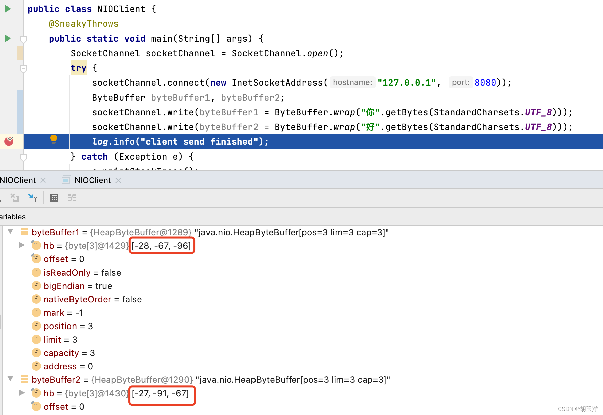

服务端读数据的Buffer大小为4字节，所以得分两次读取，第一次读取了前4个字节`[-28, -67, -96, -27] `：

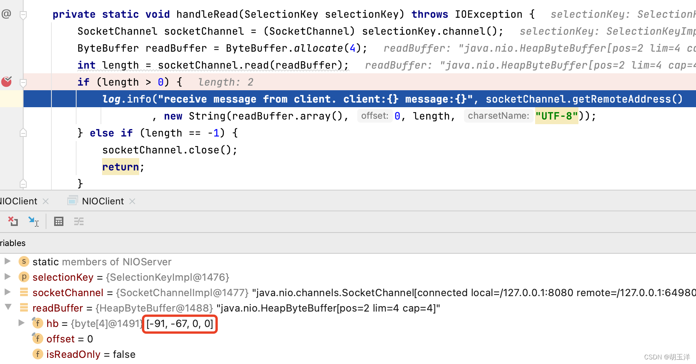

在第一次读取到前4个字节并根据UTF-8规则解析为汉字时，前3个字节是完整的，可以转换为“你”，但第4个字节只是“好”对应的UTF-8字节数组的一部分，是不完整的，所以在解析的时候失败了，就显示出了乱码符号。
同理，在第二次读取的后2个字节也是不完整的，解析也不会成功，也显示了2个乱码符号。

那就有人会说了，不能在读取的时候把Buffer的大小置为3、6、9吗？
这只是模拟这种情况的一个简单的例子，如果把Buffer大小设置为6，那客户端要发送“你a好”呢（UTF-8字节数组为`[-28, -67, -96, 97, -27, -91, -67]`）？还是可能会乱码（还是会把UTF-8字节数组拆开为`[-28, -67, -96, 97, -27, -91]`和`[-67]`），服务端分收到这两段数据后同样无法成功解析。

这就是我们常说的拆包（也有人叫半包），对应的还有粘包，就是在通过TCP协议交互数据过程中，TCP底层并不了解它的上层业务数据（比如此文的例子中放入ByteBuffer中要发送的数据，或者HTTP报文等）的具体含义，可能会根据实际情况（比如TCP缓冲区或者此文中定义的NIO接收数据的缓冲区ByteBuffer）对数据包进行拆分或合并。
当客户端发送了一段较长的数据包时，在客户端可能会分成若干个较小的数据包分别发送，或者在服务端也可能分成了若干个较小的数据包来接收。用一句话总结就是，客户端发送的一段数据包到服务端接收后可能会被拆分为多个数据包。
当客户端发送了若干个较短的数据包时，在发送端可能会拼接成一个较大的数据包来发送，在接收端也可能会合并成一个较大的数据包来接收。用一句话总结就是，客户端发送的多段数据包到服务端接收后可能会合并分为一个数据包。
在之前的文章 [《TCP协议学习笔记、报文分析》 ](https://blog.csdn.net/huyuyang6688/article/details/119975253)中也遇到了粘包的情况，客户端先后向服务端分别发送了长度为20、30、40的字符串，但是通过tcpdump抓包分析的结果是客户端向服务端只发送了一条length=90的TCP报文。

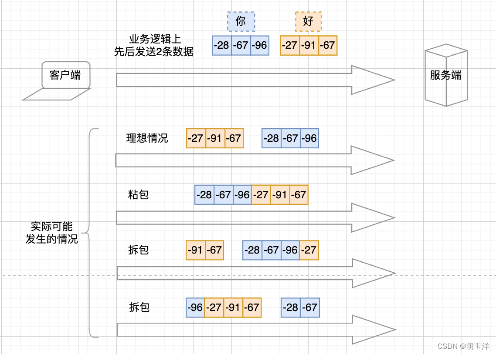

如上图所示：
从逻辑上来说，客户端先后向服务端发送了两段数据包：“你”和“好”对应的字节数组。实际上可能会发生很多种情况：
理想情况：理想情况下，数据包会按照正常逻辑一样，一个一个发送到服务端。
粘包：在某些情况下，比如当TCP缓冲区剩余空间大于所有数据包的大小，且发送时间间隔很短时，客户端也有可能会把这两段数据包合并成一个进行发送。
拆包：在某些情况下，比如当TCP缓冲区剩余空间大于某个数据包的大小时，客户端可能会把这个大的数据包拆分成若干个小的数据包分别发送。

## 粘包和拆包 

解决粘包、拆包问题的核心，就是要确认消息边界，当接收到一个较大的数据包时，可以正确把它拆分为几段正确的、有意义的业务数据，当收到若干个小的数据包时，也可以根据消息边界把他们合并、再拆分为正确的、有意义的业务数据。

常见的解决粘包、拆包的思路有：分隔符、固定消息长度、[TLV](https://so.csdn.net/so/search?q=TLV&spm=1001.2101.3001.7020)格式消息等。

### 1、分隔符`\n`解决粘包、拆包问题

可以用特定的分隔符来分隔消息，比如当发送“你好”（[-28, -67, -96, -27, -91, -67]）时，需要让“你”对应的字节数组（[-28, -67, -96]）作为一个整体被服务端解析，让“好”对应的字节数组（[-27, -91, -67]）作为一个整体被服务端解析，所以就可以在发送的时候，在“你”和“好”后面加一个分隔符（比如 “\n”），当服务端解析到“\n”就表示一个完整的数据包结束了。

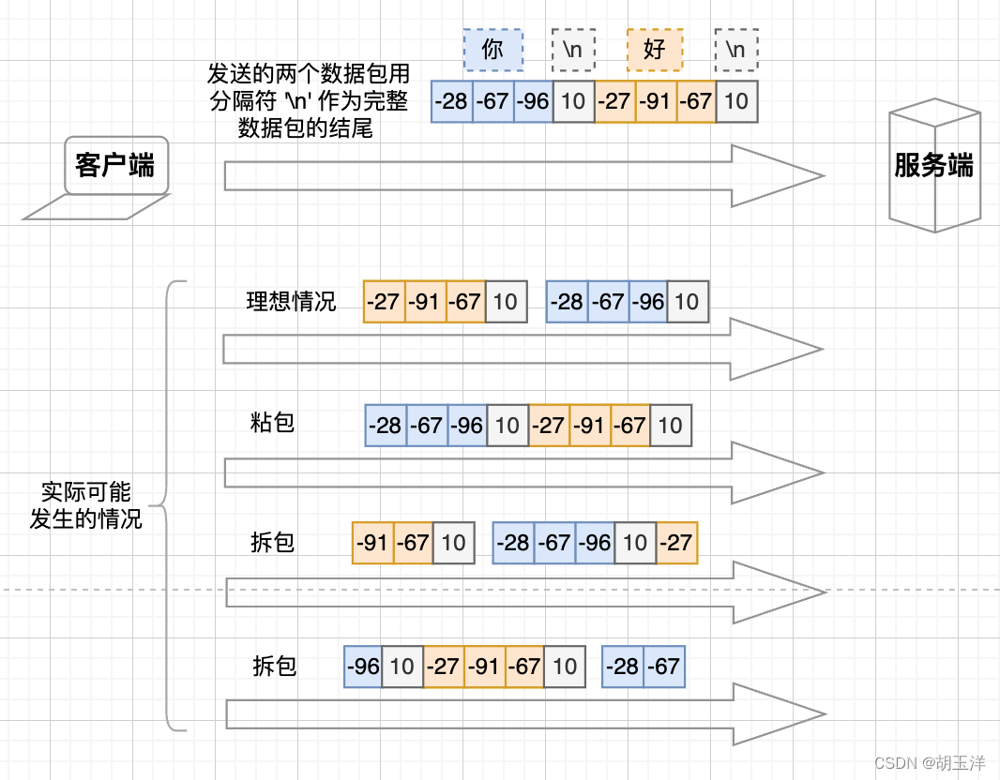

当发生粘包时，服务端把“\n”之前的数据当成一个完整的数据包来处理，然后继续读取数据直到再遇到“\n”时，说明又读取到了一个完整的数据包，…… 直到把数据读完。需要注意的是，在最后一段数据最后也需要加分隔符，因为不加的话服务端可能会认为还有数据没发送完，就不会把最后一段数据当作一个完整的数据包。
在发生拆包①时，服务端读取到第一个数据包（[-28, -67, -96, 10, -27]）后，只会把 [-28, -67, -96] 当成一个完整的数据包来处理，然后把剩余的 [-27] 缓存起来，到了后面遇到“\n”后，再把 [-27] 和“\n”前面的 [-91, -67] 拼接起来当成一个完整的数据包，就可以解析成“好”。拆包②也一样。

代码实现
服务端

```java
@Slf4j
public class NIOServer {

    private final static char SPLIT = '\n';

    public static void main(String[] args) throws Exception {
        ServerSocketChannel serverSocketChannel = ServerSocketChannel.open();
        serverSocketChannel.configureBlocking(false);
        serverSocketChannel.bind(new InetSocketAddress("127.0.0.1", 8080), 50);
        Selector selector = Selector.open();
        SelectionKey serverSocketKey = serverSocketChannel.register(selector, SelectionKey.OP_ACCEPT);
        while (true) {
            int count = selector.select();
            Set<SelectionKey> selectionKeys = selector.selectedKeys();
            Iterator<SelectionKey> iterator = selectionKeys.iterator();
            while (iterator.hasNext()) {
                SelectionKey selectionKey = iterator.next();
                if (selectionKey.isAcceptable()) {
                    handleAccept(selectionKey);
                } else if (selectionKey.isReadable()) {
                    handleRead(selectionKey);
                }
                iterator.remove();
            }
        }
    }

    private static void handleAccept(SelectionKey selectionKey) throws IOException {
        ServerSocketChannel serverSocketChannel = (ServerSocketChannel) selectionKey.channel();
        SocketChannel socketChannel = serverSocketChannel.accept();
        if (Objects.nonNull(socketChannel)) {
            log.info("receive connection from client. client:{}", socketChannel.getRemoteAddress());
            socketChannel.configureBlocking(false);
            Selector selector = selectionKey.selector();
            socketChannel.register(selector, SelectionKey.OP_READ);
        }
    }

    private static void handleRead(SelectionKey selectionKey) throws IOException {
        SocketChannel socketChannel = (SocketChannel) selectionKey.channel();
        ByteBuffer readBuffer = Objects.isNull(selectionKey.attachment()) ? ByteBuffer.allocate(4) : (ByteBuffer) selectionKey.attachment();//判断上次是否有附件对象
        int length = socketChannel.read(readBuffer);
        if (length > 0) {
            String readMessage = getSplitMessage(readBuffer);
            log.info("receive message from client. client:{} message:{}", socketChannel.getRemoteAddress(), readMessage);
            if (readBuffer.position()==readBuffer.capacity()){
                ByteBuffer newReadBuffer=ByteBuffer.allocate(readBuffer.capacity()*2);
                readBuffer.flip();
                newReadBuffer.put(readBuffer);
                readBuffer=newReadBuffer;
            }
            selectionKey.attach(readBuffer);//如果本次未满足拆包，缓存当前数据合并到下一次
        } else if (length == -1) {
            socketChannel.close();
            return;
        }
    }

    private static String getSplitMessage(ByteBuffer readBuffer) throws UnsupportedEncodingException {
        readBuffer.flip();
        StringBuilder receivedMessage = new StringBuilder();
        for (int i = 0; i < readBuffer.limit(); i++) {
            byte split = readBuffer.get(i);
            if (split == SPLIT) {
                int length = i - readBuffer.position();
                ByteBuffer byteBuffer = ByteBuffer.allocate(length);
                for (int j = 0; j < length; j++) {
                    byteBuffer.put(readBuffer.get());
                }
                readBuffer.get();//把间隔符取出来
                receivedMessage.append(new String(byteBuffer.array(),0,length,"UTF-8")).append("\n");
            }
        }
        readBuffer.compact();
        return receivedMessage.toString();
    }
    
}
```

>  `selectionKey.attach(readBuffer);`  
>
> 多次读取时传递

客户端

```java
@Slf4j
public class NIOClient {
    @SneakyThrows
    public static void main(String[] args) {
        SocketChannel socketChannel = SocketChannel.open();
        try {
            socketChannel.connect(new InetSocketAddress("127.0.0.1", 8080));
            ByteBuffer byteBuffer1, byteBuffer2, byteBuffer3, byteBuffer4;
            socketChannel.write(byteBuffer1 = ByteBuffer.wrap("你".getBytes(StandardCharsets.UTF_8)));
            socketChannel.write(byteBuffer2 = ByteBuffer.wrap("\n".getBytes(StandardCharsets.UTF_8)));
            socketChannel.write(byteBuffer3 = ByteBuffer.wrap("好".getBytes(StandardCharsets.UTF_8)));
            socketChannel.write(byteBuffer4 = ByteBuffer.wrap("\n".getBytes(StandardCharsets.UTF_8)));
            log.info("client send finished");
        } catch (Exception e) {
            e.printStackTrace();
        } finally {
            socketChannel.close();
        }
    }
}
```

### 2、固定消息长度解决粘包、拆包问题

让每个具有意义的数据包占用固定长度的空间进行传送，当实际数据长度小于固定长度时用某种无意义的数据填充（比如空格）。假设固定长度为4，用空格填充无效数据，当发送“你好”（[-28, -67, -96, -27, -91, -67]）时，需要把“你”对应的字节数组（[-28, -67, -96]）放到一个固定长度为4的数组里（[-28, -67, -96, 32]），因为“你”对应字节数组只占3位，所以剩余的一位用空格（32）来填充。同理，“好”也放到一个长度为4的字节数组中（[-27, -91, -67, 32]）。

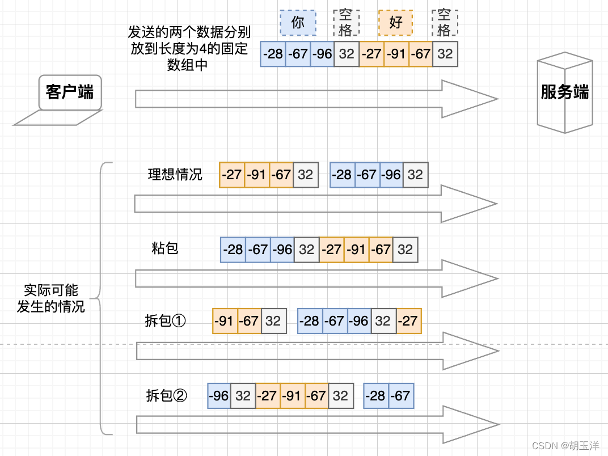

当发生粘包时，服务端会依次把每4（约定的固定长度）个字节当成一个完整的数据包来处理，如果收到的数据包长度不是4的倍数，说明有拆包的情况，会把剩余数据缓存起来，等后面读取到新的数据包，会把加上之前剩余未处理的数据再次每4个字节、4个字节地读取。

代码实现
服务端

```java
@Slf4j
public class NIOServer {

    private final static int FIXED_LENGTH = 4;

    public static void main(String[] args) throws Exception {
        ServerSocketChannel serverSocketChannel = ServerSocketChannel.open();
        serverSocketChannel.configureBlocking(false);
        serverSocketChannel.bind(new InetSocketAddress("10.100.63.93", 8080), 50);
        Selector selector = Selector.open();
        SelectionKey serverSocketKey = serverSocketChannel.register(selector, SelectionKey.OP_ACCEPT);
        while (true) {
            int count = selector.select();
            Set<SelectionKey> selectionKeys = selector.selectedKeys();
            Iterator<SelectionKey> iterator = selectionKeys.iterator();
            while (iterator.hasNext()) {
                SelectionKey selectionKey = iterator.next();
                if (selectionKey.isAcceptable()) {
                    handleAccept(selectionKey);
                } else if (selectionKey.isReadable()) {
                    handleRead(selectionKey);
                }
                iterator.remove();
            }
        }
    }

    private static void handleAccept(SelectionKey selectionKey) throws IOException {
        ServerSocketChannel serverSocketChannel = (ServerSocketChannel) selectionKey.channel();
        SocketChannel socketChannel = serverSocketChannel.accept();
        if (Objects.nonNull(socketChannel)) {
            log.info("receive connection from client. client:{}", socketChannel.getRemoteAddress());
            socketChannel.configureBlocking(false);
            Selector selector = selectionKey.selector();
            socketChannel.register(selector, SelectionKey.OP_READ);
        }
    }

    private static void handleRead(SelectionKey selectionKey) throws IOException {
        SocketChannel socketChannel = (SocketChannel) selectionKey.channel();
        ByteBuffer readBuffer = Objects.isNull(selectionKey.attachment()) ? ByteBuffer.allocate(4) : (ByteBuffer) selectionKey.attachment();
        int length = socketChannel.read(readBuffer);
        if (length > 0) {
            String readMessage = getSplitMessage(readBuffer);
            log.info("receive message from client. client:{} message:{}", socketChannel.getRemoteAddress(), readMessage);
            if (readBuffer.position() == readBuffer.capacity()) {
                ByteBuffer newReadBuffer = ByteBuffer.allocate(readBuffer.capacity() * 2);
                readBuffer.flip();
                newReadBuffer.put(readBuffer);
                readBuffer = newReadBuffer;
            }
            selectionKey.attach(readBuffer);
        } else if (length == -1) {
            socketChannel.close();
            return;
        }
    }

    private static String getSplitMessage(ByteBuffer readBuffer) throws UnsupportedEncodingException {
        readBuffer.flip();
        StringBuilder receivedMessage = new StringBuilder();
        while ((readBuffer.limit() - readBuffer.position()) >= FIXED_LENGTH) {
            ByteBuffer byteBuffer = ByteBuffer.allocate(FIXED_LENGTH);
            for (int i = 0; i < FIXED_LENGTH; i++) {
                byteBuffer.put(readBuffer.get());
            }
            receivedMessage.append(new String(byteBuffer.array(), 0, FIXED_LENGTH, "UTF-8")).append("\n");
        }
        readBuffer.compact();
        return receivedMessage.toString();
    }

}
```

客户端

```java
@Slf4j
public class NIOClient {
    @SneakyThrows
    public static void main(String[] args) {
        SocketChannel socketChannel = SocketChannel.open();
        try {
            socketChannel.connect(new InetSocketAddress("127.0.0.1", 8080));
            ByteBuffer byteBuffer1, byteBuffer2;
            socketChannel.write(byteBuffer1 = ByteBuffer.wrap("你 ".getBytes(StandardCharsets.UTF_8)));
            socketChannel.write(byteBuffer2 = ByteBuffer.wrap("好 ".getBytes(StandardCharsets.UTF_8)));
            log.info("client send finished");
        } catch (Exception e) {
            e.printStackTrace();
        } finally {
            socketChannel.close();
        }
    }
}
```

### 3、TLV格式消息解决粘包、拆包问题

TLV（Type Length Value），Type表示数据类型，Length表示数据长度，Value表示数据本身。类似于常见的网络协议（如TCP协议规定一个TCP报文由TCP首部和数据部分组成，TCP首部存放了源主机和目标主机的ip地址、端口号等信息，数据部分存放真正要传输的数据；还有HTTP协议，也是由HTTP头部和body两部分组成），把消息分成消息头和消息体（还可以有消息尾部，比如数据链路层的数据帧尾部就有4个字节校验位，用于保证数据包的完整性）。
为了防止粘包/拆包造成数据不可读的情况，可以约定把消息分为两部分：消息长度+消息内容，客户端发送数据之前，先把数据长度放到数据包的开头，接着再加上真正的数据内容，服务端读取的时候，可以先获取到消息的长度（比如是n），然后再依次读取n个字节数据，就是这个数据包的有效部分。

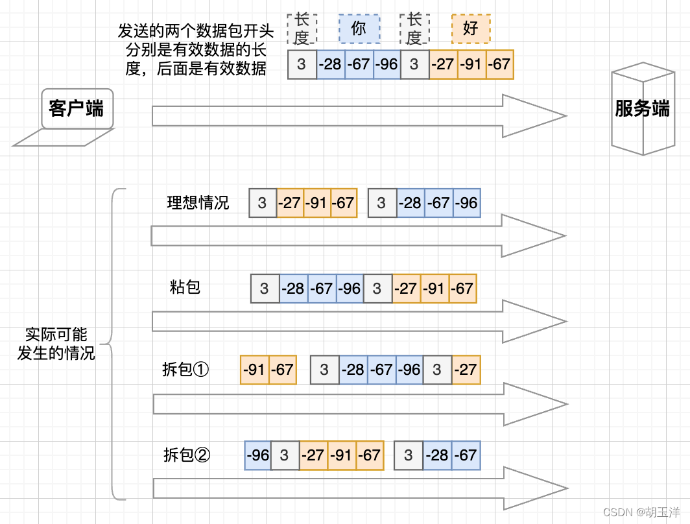

代码实现
服务端

```java
@Slf4j
public class NIOServer {

    public static void main(String[] args) throws Exception {
        ServerSocketChannel serverSocketChannel = ServerSocketChannel.open();
        serverSocketChannel.configureBlocking(false);
        serverSocketChannel.bind(new InetSocketAddress("127.0.0.1", 8080), 50);
        Selector selector = Selector.open();
        SelectionKey serverSocketKey = serverSocketChannel.register(selector, SelectionKey.OP_ACCEPT);
        while (true) {
            int count = selector.select();
            Set<SelectionKey> selectionKeys = selector.selectedKeys();
            Iterator<SelectionKey> iterator = selectionKeys.iterator();
            while (iterator.hasNext()) {
                SelectionKey selectionKey = iterator.next();
                if (selectionKey.isAcceptable()) {
                    handleAccept(selectionKey);
                } else if (selectionKey.isReadable()) {
                    handleRead(selectionKey);
                }
                iterator.remove();
            }
        }
    }

    private static void handleAccept(SelectionKey selectionKey) throws IOException {
        ServerSocketChannel serverSocketChannel = (ServerSocketChannel) selectionKey.channel();
        SocketChannel socketChannel = serverSocketChannel.accept();
        if (Objects.nonNull(socketChannel)) {
            log.info("receive connection from client. client:{}", socketChannel.getRemoteAddress());
            socketChannel.configureBlocking(false);
            Selector selector = selectionKey.selector();
            socketChannel.register(selector, SelectionKey.OP_READ);
        }
    }

    private static void handleRead(SelectionKey selectionKey) throws IOException {
        SocketChannel socketChannel = (SocketChannel) selectionKey.channel();
        ByteBuffer readBuffer = Objects.isNull(selectionKey.attachment()) ? ByteBuffer.allocate(4) : (ByteBuffer) selectionKey.attachment();
        int length = socketChannel.read(readBuffer);
        if (length > 0) {
            String readMessage = getSplitMessage(readBuffer);
            log.info("receive message from client. client:{} message:{}", socketChannel.getRemoteAddress(), readMessage);
            if (readBuffer.position() == readBuffer.capacity()) {
                ByteBuffer newReadBuffer = ByteBuffer.allocate(readBuffer.capacity() * 2);
                readBuffer.flip();
                newReadBuffer.put(readBuffer);
                readBuffer = newReadBuffer;
            }
            selectionKey.attach(readBuffer);
        } else if (length == -1) {
            socketChannel.close();
            return;
        }
    }

    private static String getSplitMessage(ByteBuffer readBuffer) throws UnsupportedEncodingException {
        readBuffer.flip();
        StringBuilder receivedMessage = new StringBuilder();
        while (readBuffer.position() < readBuffer.limit() && readBuffer.get(readBuffer.position()) <= (readBuffer.limit() - readBuffer.position())) {
            int length = readBuffer.get();// 有效数据长度
            ByteBuffer byteBuffer = ByteBuffer.allocate(length);
            for (int i = 0; i < length; i++) {
                byteBuffer.put(readBuffer.get());
            }
            receivedMessage.append(new String(byteBuffer.array(), 0, length, "UTF-8")).append("\n");
        }
        readBuffer.compact();
        return receivedMessage.toString();
    }
    
}
```

客户端

```java
@Slf4j
public class NIOClient {
    @SneakyThrows
    public static void main(String[] args) {
        SocketChannel socketChannel = SocketChannel.open();
        try {
            socketChannel.connect(new InetSocketAddress("127.0.0.1", 8080));
            ByteBuffer byteBuffer1, byteBuffer2;
            socketChannel.write(byteBuffer1 = generateTLVBuffer("你"));
            socketChannel.write(byteBuffer2 = generateTLVBuffer("好"));
            log.info("client send finished");
        } catch (Exception e) {
            e.printStackTrace();
        } finally {
            socketChannel.close();
        }
    }

    // 开头用1个字节来表示有效数据的长度（假设每个有效数据包长度不大于127），因此整个数据包长度为（1+有效数据的长度）
    private static ByteBuffer generateTLVBuffer(String msg) {
        byte[] bytes = msg.getBytes(StandardCharsets.UTF_8);
        ByteBuffer byteBuffer = ByteBuffer.allocate(1 + bytes.length);
        byteBuffer.put((byte) bytes.length);
        byteBuffer.put(bytes);
        byteBuffer.flip();
        return byteBuffer;
    }
}
```

以上代码只是用NIO来简单演示一下，解决粘包/拆包的方法，在Netty中提供了丰富的解码器（如StringDecoder、LineBasedFrameDecoder、DelimiterBasedFrameDecoder、FixedLengthFrameDecoder等）来解决粘包/拆包问题，开发者在开发过程中无需再考虑粘包/拆包的情况。

# NIO处理写事件(SelectionKey.OP_WRITE)

在前面[NIO](https://so.csdn.net/so/search?q=NIO&spm=1001.2101.3001.7020)的例子中，在服务端，有对连接事件（SelectionKey.OP_ACCEPT）的处理，也有对读事件（SelectionKey.OP_READ）的处理，但是没有对写事件（SelectionKey.OP_WRITE）进行处理，原因就是写事件有些特殊，在这里单独记录一下。

网上有一些例子都是在服务端读完数据后直接给客户端SocketChannel对应的SelectionKey注册上写事件（SelectionKey.OP_WRITE），写完数据后也不注销写事件：

```java
@Slf4j
public class NioServer {

    public static void main(String[] args) throws Exception {
        ServerSocketChannel serverSocketChannel = ServerSocketChannel.open();
        serverSocketChannel.configureBlocking(false);
        serverSocketChannel.bind(new InetSocketAddress(8080));
        Selector selector = Selector.open();
        serverSocketChannel.register(selector, SelectionKey.OP_ACCEPT);
        while (true) {
            int select = selector.select();
            Set<SelectionKey> selectionKeys = selector.selectedKeys();
            Iterator<SelectionKey> iterator = selectionKeys.iterator();
            while (iterator.hasNext()) {
                SelectionKey selectionKey = iterator.next();
                if (selectionKey.isAcceptable()) {
                    ServerSocketChannel serverSocket = (ServerSocketChannel) selectionKey.channel();
                    SocketChannel socketChannel = serverSocket.accept();
                    log.info("receive connection from client. client:{}", socketChannel.getRemoteAddress());
                    socketChannel.configureBlocking(false);
                    socketChannel.register(selector, SelectionKey.OP_READ);
                } else if (selectionKey.isReadable()) {
                    ByteBuffer byteBuffer = ByteBuffer.allocate(1024);
                    SocketChannel socketChannel = (SocketChannel) selectionKey.channel();
                    socketChannel.read(byteBuffer);
                    String message = new String(byteBuffer.array()).trim();
                    byteBuffer.clear();
                    log.info("receive message from client. client:{} message length:{}", socketChannel.getRemoteAddress(),message.length());
                    socketChannel.register(selectionKey.selector(), SelectionKey.OP_WRITE);
                    selectionKey.attach(message);
                } else if (selectionKey.isWritable()) {
                    SocketChannel socketChannel = (SocketChannel) selectionKey.channel();
                    String response = (String) selectionKey.attachment();
                    ByteBuffer byteBuffer = ByteBuffer.allocate(response.length());
                    byteBuffer.put(response.getBytes());
                    byteBuffer.flip();
                    socketChannel.write(byteBuffer);
                    log.info("send message to client. client:{} message length:{}", socketChannel.getRemoteAddress(), response.length());
                }
                iterator.remove();
            }
        }
    }

}
```

但实际上根本不能这么用，即使在服务端向客户端写完数据后，也会不断触发写事件（selector.select()返回， selectionKey.isWritable()返回true ）。


**什么时候会触发写事件呢？**

在前面的文章 [《Java网络编程——NIO的阻塞IO模式、非阻塞IO模式、IO多路复用模式的使用》 ](https://huyuyang.blog.csdn.net/article/details/126065746)中简单提到SelectionKey.OP_WRITE事件表示已经可以向通道写数据了（通道目前可以用于写操作），那什么时候才算“可以向通道写数据”呢？

如果有channel在Selector上注册了SelectionKey.OP_WRITE事件，在调用selector.select();时，系统会检查内核写缓冲区是否可写（当写缓冲区已满、channel调用了shutdownOutPut等情况，内核缓冲区不可写），如果可写，selector.select();会立即返回写事件。

把服务端处理读事件的代码优化如下：

```java
@Slf4j
public class NIOSelectorNonblockingWriteServer {

    private final static int MESSAGE_LENGTH = 1024 * 1024 * 100;

    public static void main(String[] args) throws Exception {
        ServerSocketChannel serverSocketChannel = ServerSocketChannel.open();
        serverSocketChannel.configureBlocking(false);
        serverSocketChannel.bind(new InetSocketAddress("127.0.0.1", 8080), 50);
        Selector selector = Selector.open();
        SelectionKey serverSocketKey = serverSocketChannel.register(selector, SelectionKey.OP_ACCEPT);
        while (true) {
            int count = selector.select();
            log.info("select event count:" + count);
            Set<SelectionKey> selectionKeys = selector.selectedKeys();
            Iterator<SelectionKey> iterator = selectionKeys.iterator();
            while (iterator.hasNext()) {
                SelectionKey selectionKey = iterator.next();
                // 有客户端请求建立连接
                if (selectionKey.isAcceptable()) {
                    handleAccept(selectionKey);
                }
                // 有客户端发送数据
                else if (selectionKey.isReadable()) {
                    handleRead(selectionKey);
                }
                // 可以向客户端发送数据
                else if (selectionKey.isWritable()) {
                    handleWrite(selectionKey);
                }
                iterator.remove();
            }
        }
    }

    private static void handleAccept(SelectionKey selectionKey) throws IOException {
        ServerSocketChannel serverSocketChannel = (ServerSocketChannel) selectionKey.channel();
        SocketChannel socketChannel = serverSocketChannel.accept();
        if (Objects.nonNull(socketChannel)) {
            log.info("receive connection from client. client:{}", socketChannel.getRemoteAddress());
            // 设置客户端Channel为非阻塞模式，否则在执行socketChannel.read()时会阻塞
            socketChannel.configureBlocking(false);
            Selector selector = selectionKey.selector();
            socketChannel.register(selector, SelectionKey.OP_READ);
        }
    }

    private static void handleRead(SelectionKey selectionKey) throws IOException {
        SocketChannel socketChannel = (SocketChannel) selectionKey.channel();
        ByteBuffer readBuffer = ByteBuffer.allocate(MESSAGE_LENGTH);
        int length = 0;
        while (length < MESSAGE_LENGTH) {
            length += socketChannel.read(readBuffer);
        }
        log.info("receive message from client. client:{} message length:{}", socketChannel.getRemoteAddress(), readBuffer.position());

        ByteBuffer writeBuffer = ByteBuffer.allocate(readBuffer.position());
        readBuffer.flip();
        writeBuffer.put(readBuffer);
        // 读完数据后，为 SelectionKey 注册可写事件
        if (!isInterest(selectionKey, SelectionKey.OP_WRITE)) {
            selectionKey.interestOps(selectionKey.interestOps() + SelectionKey.OP_WRITE);
        }
        writeBuffer.flip();
        selectionKey.attach(writeBuffer);
    }

    // 服务端可能是为每个Channel维护一块缓冲区，当向某个Channel写数据时缓冲区满了，还可以向其他Channel写数据
    private static void handleWrite(SelectionKey selectionKey) throws IOException {
        SocketChannel socketChannel = (SocketChannel) selectionKey.channel();
        ByteBuffer writeBuffer = (ByteBuffer) selectionKey.attachment();
        int writeLength = socketChannel.write(writeBuffer);
        log.info("send message to client. client:{} message length:{}", socketChannel.getRemoteAddress(), writeLength);
        if (!writeBuffer.hasRemaining()) {
            // 写完数据后，要把写事件取消，否则当写缓冲区有剩余空间时，会一直触发写事件
            selectionKey.interestOps(selectionKey.interestOps() - SelectionKey.OP_WRITE);
            // socketChannel.shutdownOutput(); // channel调用shutdownOutput()后，会停止触发写事件
        }
    }

    // 判断 SelectionKey 对某个事件是否感兴趣
    private static boolean isInterest(SelectionKey selectionKey, int event) {
        int interestSet = selectionKey.interestOps();
        boolean isInterest = (interestSet & event) == event;
        return isInterest;
    }
    
}
```

在服务端读取完客户端消息后，会先判断当前SelectionKey是否已经注册了写事件，如果没有则为其注册写事件。在服务端向客户端写完数据后，会取消写事件。

在上面判断SelectionKey是否已经注册了某个事件时，判断条件是 `selectionKey.interestOps() & SelectionKey.OP_WRITE `，selectionKey.interestOps()就是已经注册的事件，SelectionKey中可以只用1个整形数字来表示多个注册的事件（interestOps变量），SelectionKey.OP_READ=1（二进制为 00000001），SelectionKey.OP_WRITE=4（二进制为 00000100），SelectionKey.OP_CONNECT=8（二进制为 00001000），SelectionKey.OP_ACCEPT=16（二进制为 00010000）。当注册某个事件时，会把对应事件对应的整数（单个事件对应的整数或者多个事件对应的整数和）赋值给interestOps变量，比如注册读事件时，interestOps=1；注册读事件+写事件时，interestOps=1+4 。因此可以通过按位与的算法来判断当前SelectionKey是否注册过某个事件。


**为什么不在处理完读事件（selectionKey.isReadable()）后，直接写数据，而要重新注册一个读事件呢？**

那我们就继续看这个例子：

```java
@Slf4j
public class NIOSelectorBlockingWriteServer {

    private final static int MESSAGE_LENGTH = 1024 * 1024 * 100;

    public static void main(String[] args) throws Exception {
        ServerSocketChannel serverSocketChannel = ServerSocketChannel.open();
        serverSocketChannel.configureBlocking(false);
        serverSocketChannel.bind(new InetSocketAddress("127.0.0.1", 8080), 50);
        Selector selector = Selector.open();
        SelectionKey serverSocketKey = serverSocketChannel.register(selector, SelectionKey.OP_ACCEPT);
        while (true) {
            int count = selector.select();
            log.info("select event count:" + count);
            Set<SelectionKey> selectionKeys = selector.selectedKeys();
            Iterator<SelectionKey> iterator = selectionKeys.iterator();
            while (iterator.hasNext()) {
                SelectionKey selectionKey = iterator.next();
                // 有客户端请求建立连接
                if (selectionKey.isAcceptable()) {
                    handleAccept(selectionKey);
                }
                // 有客户端发送数据
                else if (selectionKey.isReadable()) {
                    handleRead(selectionKey);
                }
                iterator.remove();
            }
        }
    }

    private static void handleAccept(SelectionKey selectionKey) throws IOException {
        ServerSocketChannel serverSocketChannel = (ServerSocketChannel) selectionKey.channel();
        SocketChannel socketChannel = serverSocketChannel.accept();
        if (Objects.nonNull(socketChannel)) {
            log.info("receive connection from client. client:{}", socketChannel.getRemoteAddress());
            // 设置客户端Channel为非阻塞模式，否则在执行socketChannel.read()时会阻塞
            socketChannel.configureBlocking(false);
            Selector selector = selectionKey.selector();
            socketChannel.register(selector, SelectionKey.OP_READ);
        }
    }

    private static void handleRead(SelectionKey selectionKey) throws IOException {
        SocketChannel socketChannel = (SocketChannel) selectionKey.channel();
        ByteBuffer readBuffer = ByteBuffer.allocate(MESSAGE_LENGTH);
        int length = 0;
        while (length < MESSAGE_LENGTH) {
            length += socketChannel.read(readBuffer);
        }
        log.info("receive message from client. client:{} message length:{}", socketChannel.getRemoteAddress(), readBuffer.position());

        ByteBuffer writeBuffer = ByteBuffer.allocate(readBuffer.position());
        readBuffer.flip();
        writeBuffer.put(readBuffer);
        writeBuffer.flip();
        while (writeBuffer.hasRemaining()) {
            int writeLength = socketChannel.write(writeBuffer);
            log.info("send message to client. client:{} message length:{}", socketChannel.getRemoteAddress(), writeLength);
        }
    }

}
```

- Debug模式启动服务端NIOSelectorBlockingWriteServer，在最后一行`log.info("send message to client. client ……`打上断点
- Debug模式运行上面客户端NIOClient的例子，向服务端发送100MB的数据，在`ByteBuffer readBuffer = ByteBuffer.allocate(MESSAGE_LENGTH);`打上断点，运行到断点时，当服务端调用了`socketChannel.write(writeBuffer);`向客户端发送的数据还没来得及被客户端接收完时（这时候客户端卡在断点，并没有开始接收服务端的数据），数据会在服务端写缓冲区积压，在极限情况下，当服务写端缓冲区写满时，再调用`socketChannel.write(writeBuffer);`就写不进去了（返回0）。所以如果在处理完读事件后直接发送数据，遇到服务端写缓冲区满的情况时，会直接阻塞当前线程（比如这个例子中会不断执行`int writeLength = socketChannel.write(writeBuffer);`并返回0），无法及时处理其他客户端请求。
- 这时再起一个线程，以Debug模式运行NIOClient，当执行`socketChannel.write(writeBuffer);`向服务端写数据时，可能会阻塞（如果发送的数据量太大导致服务端接收缓存写满，此时服务端线程又在死循环，所以无法读取客户端发来的数据），如果这里不阻塞，执行到`socketChannel.read(readBuffer)`就会阻塞（因为服务端一直没有读取到该客户端发送的数据，肯定也还没执行向客户端发送数据的代码）。这里的客户端是以阻塞模式运行的，即使把客户端的SocketChannel设置为非阻塞模式，也是无法及时收到服务端返回的数据的。

所以在传输数据量较大，需要向客户端回写数据时，最好注册一个写事件，避免服务端缓冲区写满时导致线程阻塞，而无法及时处理其他事件的情况。这样才能体现NIO多路复用模式的特点，才能可以让一个线程同时为多个客户端服务。