下面是Java NIO系列文章的目录：[Java NIO Tutorial](http://tutorials.jenkov.com/java-nio/index.html)

1. [Java NIO 教程](http://tutorials.jenkov.com/java-nio/index.html)
2. [Java NIO概述](http://ifeve.com/overview/)
3. [Java NIO Channel](http://ifeve.com/channels/?spm=a2c6h.12873639.article-detail.8.3e1ba7fdgXOG3q)
4. [Java NIO Buffer](http://ifeve.com/buffers/?spm=a2c6h.12873639.article-detail.9.3e1ba7fdgXOG3q)
5. [Java NIO Scatter / Gather](http://ifeve.com/java-nio-scattergather/?spm=a2c6h.12873639.article-detail.10.3e1ba7fdgXOG3q)
6. [Java NIO 通道之间的数据传输](http://ifeve.com/java-nio-channel-to-channel/?spm=a2c6h.12873639.article-detail.11.3e1ba7fdgXOG3q)
7. [Java NIO Selector](http://ifeve.com/selectors/?spm=a2c6h.12873639.article-detail.12.3e1ba7fdgXOG3q)
8. [Java NIO FileChannel](http://ifeve.com/file-channel/?spm=a2c6h.12873639.article-detail.13.3e1ba7fdgXOG3q)
9. [Java NIO SocketChannel](http://ifeve.com/socket-channel/?spm=a2c6h.12873639.article-detail.14.3e1ba7fdgXOG3q)
10. [Java NIO ServerSocketChannel](http://ifeve.com/server-socket-channel/?spm=a2c6h.12873639.article-detail.15.3e1ba7fdgXOG3q)
11. [**Java NIO 非阻塞式服务器**](http://ifeve.com/non-blocking-server/?spm=a2c6h.12873639.article-detail.16.3e1ba7fdgXOG3q)
12. [Java NIO DataGramChannel](http://ifeve.com/datagram-channel/?spm=a2c6h.12873639.article-detail.17.3e1ba7fdgXOG3q)
13. [Java NIO Pipe](http://ifeve.com/pipe/)
14. [Java NIO 与IO](http://ifeve.com/java-nio-vs-io/)
15. [Java NIO Path](http://tutorials.jenkov.com/java-nio/path.html) （待翻译）
16. [Java NIO Files](http://tutorials.jenkov.com/java-nio/files.html) （待翻译）
17. [Java NIO AsynchronousFileChannel](http://tutorials.jenkov.com/java-nio/asynchronousfilechannel.html) （待翻译）

文章转自 [并发编程网-ifeve.com](http://ifeve.com/)

# Java NIO 概述

Java NIO 由以下几个核心部分组成：

- Channels
- Buffers
- Selectors

虽然Java NIO 中除此之外还有很多类和组件，但在我看来，Channel，Buffer 和 Selector 构成了核心的API。其它组件，如Pipe和FileLock，只不过是与三个核心组件共同使用的工具类。因此，在概述中我将集中在这三个组件上。其它组件会在单独的章节中讲到。

## Channel 和 Buffer

基本上，所有的 IO 在NIO 中都从一个Channel 开始。Channel 有点象流。 数据可以从Channel读到Buffer中，也可以从Buffer 写到Channel中。这里有个图示：


Channel和Buffer有好几种类型。下面是JAVA NIO中的一些主要Channel的实现：

- FileChannel
- DatagramChannel
- SocketChannel
- ServerSocketChannel

正如你所看到的，这些通道涵盖了UDP 和 TCP 网络IO，以及文件IO。

与这些类一起的有一些有趣的接口，但为简单起见，我尽量在概述中不提到它们。本教程其它章节与它们相关的地方我会进行解释。

以下是Java NIO里关键的Buffer实现：

- ByteBuffer
- CharBuffer
- DoubleBuffer
- FloatBuffer
- IntBuffer
- LongBuffer
- ShortBuffer

这些Buffer覆盖了你能通过IO发送的基本数据类型：byte, short, int, long, float, double 和 char。

Java NIO 还有个 MappedByteBuffer，用于表示内存映射文件， 我也不打算在概述中说明。

## Selector

Selector允许单线程处理多个 Channel。如果你的应用打开了多个连接（通道），但每个连接的流量都很低，使用Selector就会很方便。例如，在一个聊天服务器中。

这是在一个单线程中使用一个Selector处理3个Channel的图示：


要使用Selector，得向Selector注册Channel，然后调用它的select()方法。这个方法会一直阻塞到某个注册的通道有事件就绪。一旦这个方法返回，线程就可以处理这些事件，事件的例子有如新连接进来，数据接收等。

# Channel


Java NIO的通道类似流，但又有些不同：

- 既可以从通道中读取数据，又可以写数据到通道。但流的读写通常是单向的。
- 通道可以异步地读写。
- 通道中的数据总是要先读到一个Buffer，或者总是要从一个Buffer中写入。

正如上面所说，从通道读取数据到缓冲区，从缓冲区写入数据到通道。如下图所示：

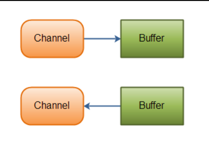

## Channel的实现

这些是Java NIO中最重要的通道的实现：

- FileChannel
- DatagramChannel
- SocketChannel
- ServerSocketChannel

FileChannel 从文件中读写数据。

DatagramChannel 能通过UDP读写网络中的数据。

SocketChannel 能通过TCP读写网络中的数据。

ServerSocketChannel可以监听新进来的TCP连接，像Web服务器那样。对每一个新进来的连接都会创建一个SocketChannel。

## 基本的 Channel 示例

下面是一个使用FileChannel读取数据到Buffer中的示例：

```java
RandomAccessFile aFile = new RandomAccessFile("data/nio-data.txt", "rw");
FileChannel inChannel = aFile.getChannel();

ByteBuffer buf = ByteBuffer.allocate(48);

int bytesRead = inChannel.read(buf);
while (bytesRead != -1) {

    System.out.println("Read " + bytesRead);
    buf.flip();

    while(buf.hasRemaining()){
    System.out.print((char) buf.get());
    }

    buf.clear();
    bytesRead = inChannel.read(buf);
}
aFile.close();
```


注意 buf.flip() 的调用，首先读取数据到Buffer，然后反转Buffer,接着再从Buffer中读取数据。下一节会深入讲解Buffer的更多细节。

# Buffer

Java NIO中的Buffer用于和NIO通道进行交互。如你所知，数据是从通道读入缓冲区，从缓冲区写入到通道中的。

缓冲区本质上是一块可以写入数据，然后可以从中读取数据的内存。这块内存被包装成NIO Buffer对象，并提供了一组方法，用来方便的访问该块内存。

## Buffer的基本用法

使用Buffer读写数据一般遵循以下四个步骤：

1. 写入数据到Buffer
2. 调用`flip()`方法  【postion = 0，limit设置为读极限】
3. 从Buffer中读取数据
4. 调用`clear()`方法或者`compact()`方法  【postion 设置为开始写的位置 limit 设置为写极限】

当向buffer写入数据时，buffer会记录下写了多少数据。一旦要读取数据，需要通过flip()方法将Buffer从写模式切换到读模式。在读模式下，可以读取之前写入到buffer的所有数据。

一旦读完了所有的数据，就需要清空缓冲区，让它可以再次被写入。有两种方式能清空缓冲区：调用clear()或compact()方法。clear()方法会清空整个缓冲区。compact()方法只会清除已经读过的数据。任何未读的数据都被移到缓冲区的起始处，新写入的数据将放到缓冲区未读数据的后面。

下面是一个使用Buffer的例子：

```java
RandomAccessFile aFile = new RandomAccessFile("data/nio-data.txt", "rw");
FileChannel inChannel = aFile.getChannel();

//create buffer with capacity of 48 bytes
ByteBuffer buf = ByteBuffer.allocate(48);

int bytesRead = inChannel.read(buf); //read into buffer.
while (bytesRead != -1) {

buf.flip(); //make buffer ready for read

while(buf.hasRemaining()){
System.out.print((char) buf.get()); // read 1 byte at a time
}

buf.clear(); //make buffer ready for writing
bytesRead = inChannel.read(buf);
}
aFile.close();
```


半包解码：

```java
        //对ByteBuffer进行编解码，如果有半包消息指针reset，继续读取后续的报文，将解码成功的消息封装成Task，投递到业务线程池中，进行业务逻辑编排，示例代码如下
        Object message = null;


        while (byteBuffer.hasRemaining()){
            byteBuffer.mark();//标记
            message =  decode(byteBuffer);//flip()切换到读

            if (message == null){
                byteBuffer.reset();//未解析到完整报文，恢复到标记位置,等待报文完整
                break;
            }

            messageList.add(message);
        }

        if (!byteBuffer.hasRemaining()){//
            byteBuffer.clear();
        }else {
            byteBuffer.compact();
        }
```


## 图解ByteBuffer

主要解释一下ByteBuffer的一些主要方法。

### ByteBuffer主要标志位说明

| 标志位   | 初始值           | 说明               |
| -------- | ---------------- | ------------------ |
| mark     | -1               | 标记位             |
| position | 0                | 当前位置           |
| limit    | 指定的缓冲区容量 | 已写入有效数据容量 |
| capacity | 指定的缓冲区容量 | 缓冲区容量         |

### ByteBuffer的初始化

ByteBuffer提供两种不同的构造函数，其本质主要是构建的ByteBuffer类型不同，其中一种构造函数参照源代码：

```java
//第一种，分配的是DirectByteBuffer
public static ByteBuffer allocateDirect(int capacity) {
      return new DirectByteBuffer(capacity);
}
//第二种，分配的是HeapByteBuffer
public static ByteBuffer allocate(int capacity) {
      if (capacity < 0)
          throw new IllegalArgumentException();
      return new HeapByteBuffer(capacity, capacity);
}
```

详细两种不同类型的Buffer这里不展开讨论，但是大多数情况下，如果对性能没有太大要求的话，一般默认使用HeapByteBuffer。当我们执行初始化操作后： ByteBuffer.allocate(缓冲区大小);.

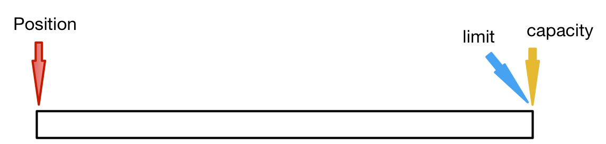

其中初始化的值，分别为position=0,limit和capacity等于我们指定的缓冲区大小，mark默认为-1。网上有一些教程的图示默认显示了mark为起始点，其实是一种低级错误，让别人误以为mark就等于起始位置。

### Put操作

顾名思义，put操作就是就是将数据放入缓冲区中，每一次put操作，都会position加上put进去的数据长度.position每加一，代表缓冲区内增加了一个字节的数据，具体put的操作原理如下：

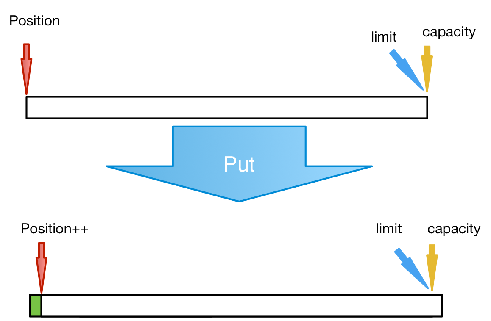

如果送入的数据大小大于缓冲区剩余容量，则会抛出异常:java.nio.BufferOverflowException,虽然可能有实际部分数据被写入缓冲区，但是flip之后，limit位置还是最后一次正确写入缓冲区的位置。

### Flip操作

Flip，从英文的直译为：翻转。但是，这并不是将数据翻转的意思，而其实是让limit指向当前position的位置,position指向起始位置，此时position=0,进行这一部操作之后，就可以确定了当前缓冲区的有效数据。并且为数据读取做准备。

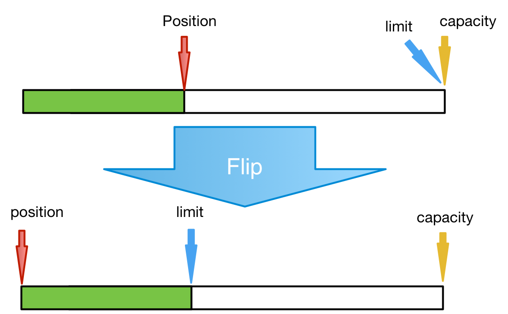

### Get操作

Get操作，就是按照position当前位置，取出缓冲区的数据，每一次取操作之后，position都会get出的数据长度。同样，position每加一，代表从缓冲区内读取到了一个字节的数据，不过数据并不会被删除，只是单纯的读取操作。

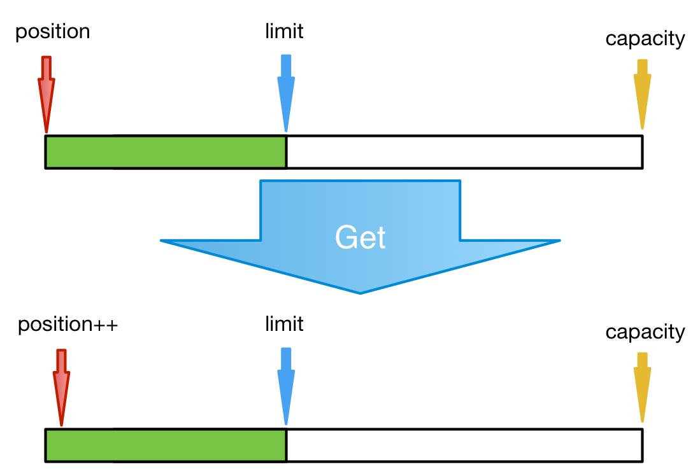

如果，get之后，position值大于limit值，则抛出异常：java.nio.BufferUnderflowException

### Mark操作和Reset操作

mark，就是标记当前的位置，一旦后续进行reset操作之后，可以快速地定位到mark的位置。在某一些应用场合中，配合reset，这是一个非常方便的操作函数。

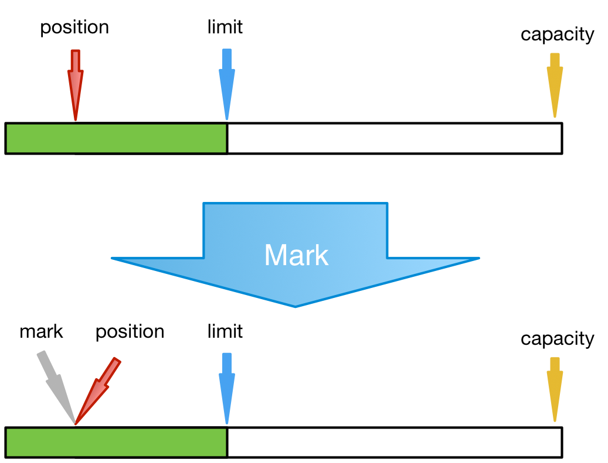

一旦进行过mark操作之后，后续读取操作中，如果再执行reset操作，就可以快速定位到标记位上:

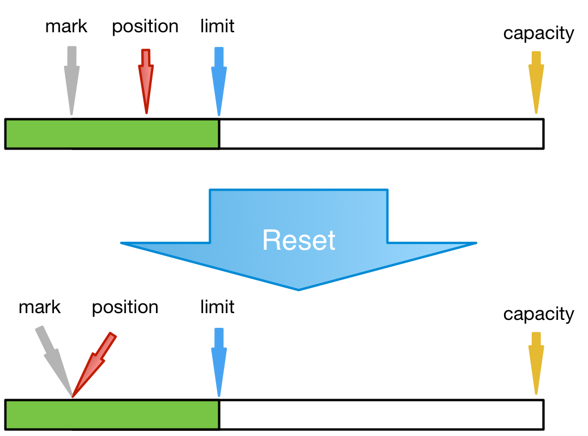

### Clear操作

Clear操作很简单，就是清空缓冲区的所有数据。因此，所有标志位都会被恢复成默认值，包括mark值，但是记住，不是数据，写入缓冲区的数据仍然保留，如果这时候执行get操作，仍然可以将数据获取出来。直观的话，可以直接看源代码：

```java
public final Buffer clear() {
       position = 0;
       limit = capacity;
       mark = -1;
       return this;
   }
```


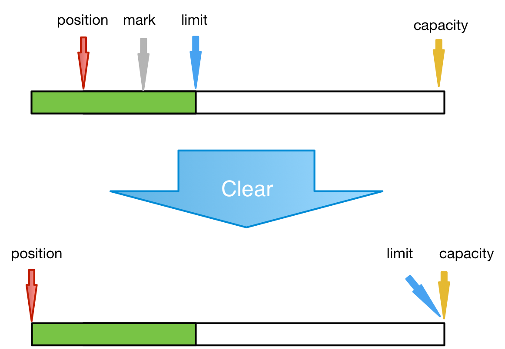

### Slice操作

slice方法的作用，就是做数据分割，将当前的position到limit之间的数据分割出来，返回一个新的ByteBuffer,同时,mark标记重置为-1。不过这里注意，分割出来的数据的容量刚好就是数据长度，而不是被分割之前的长度。

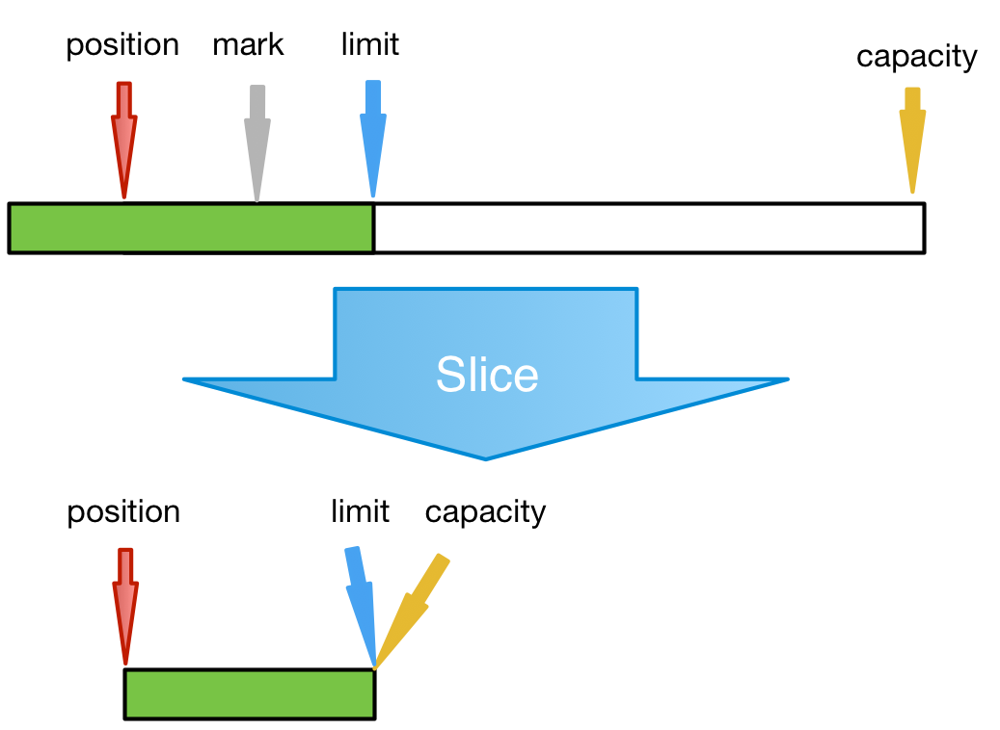

### 快速清除已读取的数据

有时候，我们只是想要去掉前面一部分，而保留后面一部分数据，同时保持缓冲区的大小不变呢，这里提供一种思路，如下:

```java
public void clearPrePositionData(ByteBuffer byteBuffer) {
      ByteBuffer buffer2 = byteBuffer.slice();
      byteBuffer.clear();
      if (buffer2.capacity() > 0) {

          byteBuffer.put(buffer2);
      } else {
          byteBuffer.mark();
          byteBuffer.reset();
      }
      byteBuffer.flip();
}
```

## Buffer的类型

Java NIO 有以下Buffer类型

- ByteBuffer
- MappedByteBuffer
- CharBuffer
- DoubleBuffer
- FloatBuffer
- IntBuffer
- LongBuffer
- ShortBuffer


如你所见，这些Buffer类型代表了不同的数据类型。换句话说，就是可以通过char，short，int，long，float 或 double类型来操作缓冲区中的字节。

MappedByteBuffer 有些特别，在涉及它的专门章节中再讲。

## Buffer的分配

要想获得一个Buffer对象首先要进行分配。 每一个Buffer类都有一个allocate方法。下面是一个分配48字节capacity的ByteBuffer的例子。

```java
ByteBuffer buf = ByteBuffer.allocate(48);
```

这是分配一个可存储1024个字符的CharBuffer：

```java
CharBuffer buf = CharBuffer.allocate(1024);
```

## 向Buffer中写数据

写数据到Buffer有两种方式：

- 从Channel写到Buffer。
- 通过Buffer的put()方法写到Buffer里。

从Channel写到Buffer的例子

```java
int bytesRead = inChannel.read(buf); //read into buffer.
```

通过put方法写Buffer的例子：

```java
buf.put(127);
```

put方法有很多版本，允许你以不同的方式把数据写入到Buffer中。例如， 写到一个指定的位置，或者把一个字节数组写入到Buffer。 更多Buffer实现的细节参考JavaDoc。

## 从Buffer中读取数据

从Buffer中读取数据有两种方式：

1. 从Buffer读取数据到Channel。
2. 使用get()方法从Buffer中读取数据。

从Buffer读取数据到Channel的例子：

```java
//read from buffer into channel.
int bytesWritten = inChannel.write(buf);
```

使用get()方法从Buffer中读取数据的例子

```java
byte aByte = buf.get();
```

get方法有很多版本，允许你以不同的方式从Buffer中读取数据。例如，从指定position读取，或者从Buffer中读取数据到字节数组。更多Buffer实现的细节参考JavaDoc。

## Buffer的`capacity`,`position`和`limit`

缓冲区本质上是一块可以写入数据，然后可以从中读取数据的内存。这块内存被包装成NIO Buffer对象，并提供了一组方法，用来方便的访问该块内存。

为了理解Buffer的工作原理，需要熟悉它的三个属性：

- capacity
- position
- limit

position和limit的含义取决于Buffer处在读模式还是写模式。不管Buffer处在什么模式，capacity的含义总是一样的。

这里有一个关于capacity，position和limit在读写模式中的说明，详细的解释在插图后面。


#### capacity

作为一个内存块，Buffer有一个固定的大小值，也叫“capacity”.你只能往里写capacity个byte、long，char等类型。一旦Buffer满了，需要将其清空（通过读数据或者清除数据）才能继续写数据往里写数据。

#### position

当你写数据到Buffer中时，position表示当前的位置。初始的position值为0.当一个byte、long等数据写到Buffer后， position会向前移动到下一个可插入数据的Buffer单元。position最大可为capacity – 1.

当读取数据时，也是从某个特定位置读。当将Buffer从写模式切换到读模式，position会被重置为0. 当从Buffer的position处读取数据时，position向前移动到下一个可读的位置。

#### limit

在写模式下，Buffer的limit表示你最多能往Buffer里写多少数据。 写模式下，limit等于Buffer的capacity。

当切换Buffer到读模式时， limit表示你最多能读到多少数据。因此，当切换Buffer到读模式时，limit会被设置成写模式下的position值。换句话说，你能读到之前写入的所有数据（limit被设置成已写数据的数量，这个值在写模式下就是position）


#### flip()方法

flip方法将Buffer从写模式切换到读模式。调用flip()方法会将position设回0，并将limit设置成之前position的值。

换句话说，position现在用于标记读的位置，limit表示之前写进了多少个byte、char等 —— 现在能读取多少个byte、char等。

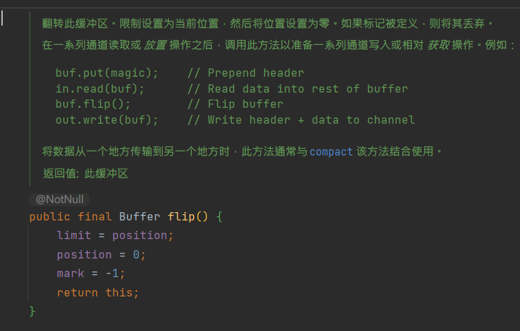


#### rewind()方法

`Buffer.rewind()`将**position设回0**，所以你可以重读Buffer中的所有数据。**limit保持不变**，仍然表示能从Buffer中读取多少个元素（byte、char等）。

> rewind
> 英 [ˌriːˈwaɪnd]   美 [ˌriːˈwaɪnd]  
> v.重绕(磁带等);倒带;倒片
> n.重绕;倒带器

#### clear()与compact()方法

一旦读完Buffer中的数据，需要让Buffer准备好再次被写入。可以通过clear()或compact()方法来完成。

如果调用的是clear()方法，position将被设回0，limit被设置成 capacity的值。换句话说，Buffer 被清空了。Buffer中的数据并未清除，只是这些标记告诉我们可以从哪里开始往Buffer里写数据。

如果Buffer中有一些未读的数据，调用clear()方法，数据将“被遗忘”，意味着不再有任何标记会告诉你哪些数据被读过，哪些还没有。


**如果Buffer中仍有未读的数据，且后续还需要这些数据，但是此时想要先先写些数据，那么使用compact()方法。**

compact()方法将所有未读的数据拷贝到Buffer起始处。然后将position设到最后一个未读元素正后面。limit属性依然像clear()方法一样，设置成capacity。现在Buffer准备好写数据了，但是不会覆盖未读的数据。

> compact
> 英 [kəmˈpækt , ˈkɒmpækt]   美 [ˈkɑːmpækt , kəmˈpækt]  
> n.契约;小汽车;带镜小粉盒;协定;协议;合约
> adj.紧凑的;紧密的;小型的;袖珍的;体积小的;坚实的;矮小而健壮的
> vt.把…紧压在一起(或压实)

#### mark()与reset()方法 组合

通过调用Buffer.mark()方法，可以标记Buffer中的一个特定position。之后可以通过调用Buffer.reset()方法恢复到这个position。例如：

```java
buffer.mark();

//call buffer.get() a couple of times, e.g. during parsing.
buffer.reset(); //set position back to mark.
```


## equals()与compareTo()方法

可以使用equals()和compareTo()方法两个Buffer。

#### equals()

当满足下列条件时，表示两个Buffer相等：

1. 有相同的类型（byte、char、int等）。
2. Buffer中剩余的byte、char等的个数相等。
3. Buffer中所有剩余的byte、char等都相同。

如你所见，equals只是比较Buffer的一部分，不是每一个在它里面的元素都比较。实际上，它只比较Buffer中的剩余元素。

#### compareTo()方法

compareTo()方法比较两个Buffer的剩余元素(byte、char等)， 如果满足下列条件，则认为一个Buffer“小于”另一个Buffer：

1. 第一个不相等的元素小于另一个Buffer中对应的元素 。
2. 所有元素都相等，但第一个Buffer比另一个先耗尽(第一个Buffer的元素个数比另一个少)。

*（译注：剩余元素是从 position到limit之间的元素）*

# 分散（scatter）/聚集（gather）

Java NIO开始支持scatter/gather，scatter/gather用于描述从Channel（译者注：Channel在中文经常翻译为通道）中读取或者写入到Channel的操作。

分散（scatter）从Channel中读取是指在读操作时将读取的数据写入多个buffer中。因此，Channel将从Channel中读取的数据“分散（scatter）”到多个Buffer中。

聚集（gather）写入Channel是指在写操作时将多个buffer的数据写入同一个Channel，因此，Channel 将多个Buffer中的数据“聚集（gather）”后发送到Channel。

scatter / gather经常用于需要将传输的数据分开处理的场合，例如传输一个由消息头和消息体组成的消息，你可能会将消息体和消息头分散到不同的buffer中，这样你可以方便的处理消息头和消息体。

## Scattering Reads

Scattering Reads是指数据从一个channel读取到多个buffer中。如下图描述：
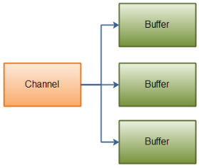

代码示例如下：

```java
ByteBuffer header = ByteBuffer.allocate(128);
ByteBuffer body   = ByteBuffer.allocate(1024);
ByteBuffer[] bufferArray = { header, body };
channel.read(bufferArray);
```

注意buffer首先被插入到数组，然后再将数组作为channel.read() 的输入参数。read()方法按照buffer在数组中的顺序将从channel中读取的数据写入到buffer，当一个buffer被写满后，channel紧接着向另一个buffer中写。
Scattering Reads在移动下一个buffer前，必须填满当前的buffer，这也意味着它不适用于动态消息(译者注：消息大小不固定)。换句话说，如果存在消息头和消息体，消息头必须完成填充（例如 128byte），Scattering Reads才能正常工作。

## Gathering Writes

Gathering Writes是指数据从多个buffer写入到同一个channel。如下图描述：
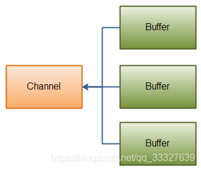

代码示例如下：

```java
ByteBuffer header = ByteBuffer.allocate(128);
ByteBuffer body   = ByteBuffer.allocate(1024);
//write data into buffers
ByteBuffer[] bufferArray = { header, body };
channel.write(bufferArray);
```

buffers数组是write()方法的入参，write()方法会按照buffer在数组中的顺序，将数据写入到channel，注意只有position和limit之间的数据才会被写入。因此，如果一个buffer的容量为128byte，但是仅仅包含58byte的数据，那么这58byte的数据将被写入到channel中。因此与Scattering Reads相反，Gathering Writes能较好的处理动态消息。

#  通道之间的数据传输

在Java NIO中，如果两个通道中有一个是FileChannel，那你可以直接将数据从一个channel（译者注：channel中文常译作通道）传输到另外一个channel。

### transferFrom()

FileChannel的transferFrom()方法可以将数据从源通道传输到FileChannel中（译者注：这个方法在JDK文档中的解释为将字节从给定的可读取字节通道传输到此通道的文件中）。下面是一个简单的例子：

```java
RandomAccessFile fromFile = new RandomAccessFile("fromFile.txt", "rw");
FileChannel fromChannel = fromFile.getChannel();

RandomAccessFile toFile = new RandomAccessFile("toFile.txt", "rw");
FileChannel toChannel = toFile.getChannel();

long position = 0;
long count = fromChannel.size();

toChannel.transferFrom(position, count, fromChannel);
```

方法的输入参数position表示从position处开始向目标文件写入数据，count表示最多传输的字节数。如果源通道的剩余空间小于 count 个字节，则所传输的字节数要小于请求的字节数。
此外要注意，在SoketChannel的实现中，SocketChannel只会传输此刻准备好的数据（可能不足count字节）。因此，SocketChannel可能不会将请求的所有数据(count个字节)全部传输到FileChannel中。

### transferTo()

transferTo()方法将数据从FileChannel传输到其他的channel中。下面是一个简单的例子：

```java
RandomAccessFile fromFile = new RandomAccessFile("fromFile.txt", "rw");
FileChannel fromChannel = fromFile.getChannel();

RandomAccessFile toFile = new RandomAccessFile("toFile.txt", "rw");
FileChannel toChannel = toFile.getChannel();

long position = 0;
long count = fromChannel.size();

fromChannel.transferTo(position, count, toChannel);
```


是不是发现这个例子和前面那个例子特别相似？除了调用方法的FileChannel对象不一样外，其他的都一样。
上面所说的关于SocketChannel的问题在transferTo()方法中同样存在。SocketChannel会一直传输数据直到目标buffer被填满。

# Selector

Selector（选择器）是Java NIO中能够检测一到多个NIO通道，并能够知晓通道是否为诸如读写事件做好准备的组件。这样，一个单独的线程可以管理多个channel，从而管理多个网络连接。

## 为什么使用Selector

仅用单个线程来处理多个Channels的好处是，只需要更少的线程来处理通道。事实上，可以只用一个线程处理所有的通道。对于操作系统来说，线程之间上下文切换的开销很大，而且每个线程都要占用系统的一些资源（如内存）。因此，使用的线程越少越好。

## Selector的创建

通过调用Selector.open()方法创建一个Selector，如下：

```java
Selector selector = Selector.open();
```

## 向Selector注册通道

为了将Channel和Selector配合使用，必须将channel注册到selector上。通过SelectableChannel.register()方法来实现，如下：

```java
channel.configureBlocking(false);
SelectionKey key = channel.register(selector,Selectionkey.OP_READ);
```

与Selector一起使用时，Channel必须处于非阻塞模式下。这意味着不能将FileChannel与Selector一起使用，因为FileChannel不能切换到非阻塞模式。而套接字通道都可以。
注意register()方法的第二个参数。这是一个“interest集合”，意思是在通过Selector监听Channel时对什么事件感兴趣。可以监听四种不同类型的事件：

1. Connect
2. Accept
3. Read
4. Write

通道触发了一个事件意思是该事件已经就绪。所以，某个channel成功连接到另一个服务器称为“连接就绪”。一个server socket channel准备好接收新进入的连接称为“接收就绪”。一个有数据可读的通道可以说是“读就绪”。等待写数据的通道可以说是“写就绪”。
这四种事件用SelectionKey的四个常量来表示：

1. SelectionKey.OP_CONNECT
2. SelectionKey.OP_ACCEPT
3. SelectionKey.OP_READ
4. SelectionKey.OP_WRITE

如果你对不止一种事件感兴趣，那么可以用“位或”操作符将常量连接起来，如下：

```java
int interestSet = SelectionKey.OP_READ | SelectionKey.OP_WRITE;
```

## SelectionKey

在上一小节中，当向Selector注册Channel时，register()方法会返回一个SelectionKey对象。这个对象包含了一些你感兴趣的属性：

- interest集合
- ready集合
- Channel
- Selector
- 附加的对象（可选）

##### interest集合

就像向Selector注册通道一节中所描述的，interest集合是你所选择的感兴趣的事件集合。可以通过SelectionKey读写interest集合，像这样：

```java
int interestSet = selectionKey.interestOps();
 
boolean isInterestedInAccept  = (interestSet & SelectionKey.OP_ACCEPT) == SelectionKey.OP_ACCEPT；
boolean isInterestedInConnect = interestSet & SelectionKey.OP_CONNECT;
boolean isInterestedInRead    = interestSet & SelectionKey.OP_READ;
boolean isInterestedInWrite   = interestSet & SelectionKey.OP_WRITE;
```

可以看到，用“位与”操作interest 集合和给定的SelectionKey常量，可以确定某个确定的事件是否在interest 集合中。

##### ready集合

ready 集合是通道已经准备就绪的操作的集合。在一次选择(Selection)之后，你会首先访问这个ready set。Selection将在下一小节进行解释。可以这样访问ready集合：

```java
int readySet = selectionKey.readyOps();
```

可以用像检测interest集合那样的方法，来检测channel中什么事件或操作已经就绪。但是，也可以使用以下四个方法，它们都会返回一个布尔类型：

```java
selectionKey.isAcceptable();
selectionKey.isConnectable();
selectionKey.isReadable();
selectionKey.isWritable();
```

##### Channel + Selector

从SelectionKey访问Channel和Selector很简单。如下：

```java
Channel  channel  = selectionKey.channel();
Selector selector = selectionKey.selector();
```

##### attach附加的对象

可以将一个对象或者更多信息附着到SelectionKey上，这样就能方便的识别某个给定的通道。例如，可以附加 与通道一起使用的Buffer，或是包含聚集数据的某个对象。使用方法如下：

```java
selectionKey.attach(theObject);
Object attachedObj = selectionKey.attachment();
```

还可以在用register()方法向Selector注册Channel的时候附加对象。如：

```java
SelectionKey key = channel.register(selector, SelectionKey.OP_READ, theObject);
```

粘包拆包应用：

以换行符区别

```java
@Slf4j
public class NIOServer {

    private final static char SPLIT = '\n';

    public static void main(String[] args) throws Exception {
        ServerSocketChannel serverSocketChannel = ServerSocketChannel.open();
        serverSocketChannel.configureBlocking(false);
        serverSocketChannel.bind(new InetSocketAddress("127.0.0.1", 8080), 50);
        Selector selector = Selector.open();
        SelectionKey serverSocketKey = serverSocketChannel.register(selector, SelectionKey.OP_ACCEPT);
        while (true) {
            int count = selector.select();
            Set<SelectionKey> selectionKeys = selector.selectedKeys();
            Iterator<SelectionKey> iterator = selectionKeys.iterator();
            while (iterator.hasNext()) {
                SelectionKey selectionKey = iterator.next();
                if (selectionKey.isAcceptable()) {
                    handleAccept(selectionKey);
                } else if (selectionKey.isReadable()) {
                    handleRead(selectionKey);
                }
                iterator.remove();
            }
        }
    }

    private static void handleAccept(SelectionKey selectionKey) throws IOException {
        ServerSocketChannel serverSocketChannel = (ServerSocketChannel) selectionKey.channel();
        SocketChannel socketChannel = serverSocketChannel.accept();
        if (Objects.nonNull(socketChannel)) {
            log.info("receive connection from client. client:{}", socketChannel.getRemoteAddress());
            socketChannel.configureBlocking(false);
            Selector selector = selectionKey.selector();
            socketChannel.register(selector, SelectionKey.OP_READ);
        }
    }

    private static void handleRead(SelectionKey selectionKey) throws IOException {
        SocketChannel socketChannel = (SocketChannel) selectionKey.channel();
        ByteBuffer readBuffer = Objects.isNull(selectionKey.attachment()) ? ByteBuffer.allocate(4) : (ByteBuffer) selectionKey.attachment();
        int length = socketChannel.read(readBuffer);
        if (length > 0) {
            String readMessage = getSplitMessage(readBuffer);
            log.info("receive message from client. client:{} message:{}", socketChannel.getRemoteAddress(), readMessage);
            if (readBuffer.position()==readBuffer.capacity()){
                ByteBuffer newReadBuffer=ByteBuffer.allocate(readBuffer.capacity()*2);
                readBuffer.flip();
                newReadBuffer.put(readBuffer);
                readBuffer=newReadBuffer;
            }
            selectionKey.attach(readBuffer);
        } else if (length == -1) {
            socketChannel.close();
            return;
        }
    }

    private static String getSplitMessage(ByteBuffer readBuffer) throws UnsupportedEncodingException {
        readBuffer.flip();
        StringBuilder receivedMessage = new StringBuilder();
        for (int i = 0; i < readBuffer.limit(); i++) {
            byte split = readBuffer.get(i);
            if (split == SPLIT) {
                int length = i - readBuffer.position();
                ByteBuffer byteBuffer = ByteBuffer.allocate(length);
                for (int j = 0; j < length; j++) {
                    byteBuffer.put(readBuffer.get());
                }
                readBuffer.get();//把间隔符取出来
                receivedMessage.append(new String(byteBuffer.array(),0,length,"UTF-8")).append("\n");
            }
        }
        readBuffer.compact();
        return receivedMessage.toString();
    }
    
}
```


## 通过Selector选择通道

一旦向Selector注册了一或多个通道，就可以调用几个重载的select()方法。这些方法返回你所感兴趣的事件（如连接、接受、读或写）已经准备就绪的那些通道。换句话说，如果你对“读就绪”的通道感兴趣，select()方法会返回读事件已经就绪的那些通道。
下面是select()方法：

- `int select()`
- `int select(long timeout)`
- `int selectNow()`

select()阻塞到至少有一个通道在你注册的事件上就绪了。

select(long timeout)和select()一样，除了最长会阻塞timeout毫秒(参数)。

selectNow()不会阻塞，不管什么通道就绪都立刻返回（译者注：此方法执行非阻塞的选择操作。如果自从前一次选择操作后，没有通道变成可选择的，则此方法直接返回零。）。

select()方法返回的int值表示有多少通道已经就绪。亦即，自上次调用select()方法后有多少通道变成就绪状态。如果调用select()方法，因为有一个通道变成就绪状态，返回了1，若再次调用select()方法，如果另一个通道就绪了，它会再次返回1。如果对第一个就绪的channel没有做任何操作，现在就有两个就绪的通道，但在每次select()方法调用之间，只有一个通道就绪了。

##### selectedKeys()

一旦调用了select()方法，并且返回值表明有一个或更多个通道就绪了，然后可以通过调用selector的selectedKeys()方法，访问“已选择键集（selected key set）”中的就绪通道。如下所示：

```java
Set selectedKeys = selector.selectedKeys();
```

当像Selector注册Channel时，Channel.register()方法会返回一个SelectionKey 对象。这个对象代表了注册到该Selector的通道。可以通过SelectionKey的selectedKeySet()方法访问这些对象。
可以遍历这个已选择的键集合来访问就绪的通道。如下：

```java
Set selectedKeys = selector.selectedKeys();
Iterator keyIterator = selectedKeys.iterator();
while(keyIterator.hasNext()) {
    SelectionKey key = keyIterator.next();
    if(key.isAcceptable()) {
        // a connection was accepted by a ServerSocketChannel.
    } else if (key.isConnectable()) {
        // a connection was established with a remote server.
    } else if (key.isReadable()) {
        // a channel is ready for reading
    } else if (key.isWritable()) {
        // a channel is ready for writing
    }
    keyIterator.remove();
}
```

这个循环遍历已选择键集中的每个键，并检测各个键所对应的通道的就绪事件。

注意每次迭代末尾的keyIterator.remove()调用。Selector不会自己从已选择键集中移除SelectionKey实例。必须在处理完通道时自己移除。下次该通道变成就绪时，Selector会再次将其放入已选择键集中。

SelectionKey.channel()方法返回的通道需要转型成你要处理的类型，如ServerSocketChannel或SocketChannel等。

## wakeUp()

某个线程调用select()方法后阻塞了，即使没有通道已经就绪，也有办法让其从select()方法返回。只要让其它线程在第一个线程调用select()方法的那个对象上调用Selector.wakeup()方法即可。阻塞在select()方法上的线程会立马返回。

如果有其它线程调用了wakeup()方法，但当前没有线程阻塞在select()方法上，下个调用select()方法的线程会立即“醒来（wake up）”。

## close()

用完Selector后调用其close()方法会关闭该Selector，且使注册到该Selector上的所有SelectionKey实例无效。通道本身并不会关闭。

## 完整的示例

这里有一个完整的示例，打开一个Selector，注册一个通道注册到这个Selector上(通道的初始化过程略去),然后持续监控这个Selector的四种事件（接受，连接，读，写）是否就绪。

```java
Selector selector = Selector.open();
channel.configureBlocking(false);
SelectionKey key = channel.register(selector, SelectionKey.OP_READ);
while(true) {
  int readyChannels = selector.select();
  if(readyChannels == 0) continue;
  Set selectedKeys = selector.selectedKeys();
  Iterator keyIterator = selectedKeys.iterator();
  while(keyIterator.hasNext()) {
    SelectionKey key = keyIterator.next();
    if(key.isAcceptable()) {
        // a connection was accepted by a ServerSocketChannel.
    } else if (key.isConnectable()) {
        // a connection was established with a remote server.
    } else if (key.isReadable()) {
        // a channel is ready for reading
    } else if (key.isWritable()) {
        // a channel is ready for writing
    }
    keyIterator.remove();
  }
}
```

# FileChannel

Java NIO中的FileChannel是一个连接到文件的通道。可以通过文件通道读写文件。
FileChannel无法设置为非阻塞模式，它总是运行在阻塞模式下。

## 打开FileChannel

在使用FileChannel之前，必须先打开它。但是，我们无法直接打开一个FileChannel，需要通过使用一个InputStream、OutputStream或RandomAccessFile来获取一个FileChannel实例。下面是通过RandomAccessFile打开FileChannel的示例：

```java
RandomAccessFile aFile = new RandomAccessFile("data/nio-data.txt", "rw");
FileChannel inChannel = aFile.getChannel();
```

## 从FileChannel读取数据

调用多个read()方法之一从FileChannel中读取数据。如：

```java
ByteBuffer buf = ByteBuffer.allocate(48);
int bytesRead = inChannel.read(buf);
```

首先，分配一个Buffer。从FileChannel中读取的数据将被读到Buffer中。然后，调用FileChannel.read()方法。该方法将数据从FileChannel读取到Buffer中。read()方法返回的int值表示了有多少字节被读到了Buffer中。如果返回-1，表示到了文件末尾。

## 向FileChannel写数据

使用FileChannel.write()方法向FileChannel写数据，该方法的参数是一个Buffer。如：

```java
String newData = "New String to write to file..." + System.currentTimeMillis();
 
ByteBuffer buf = ByteBuffer.allocate(48);
buf.clear();
buf.put(newData.getBytes());
buf.flip();

while(buf.hasRemaining()) {
    channel.write(buf);
}
```

注意FileChannel.write()是在while循环中调用的。因为无法保证write()方法一次能向FileChannel写入多少字节，因此需要重复调用write()方法，直到Buffer中已经没有尚未写入通道的字节。

## 关闭FileChannel

用完FileChannel后必须将其关闭。如：`channel.close();`

## FileChannel的position方法

有时可能需要在FileChannel的某个特定位置进行数据的读/写操作。可以通过调用position()方法获取FileChannel的当前位置。也可以通过调用position(long pos)方法设置FileChannel的当前位置。
这里有两个例子:

```java
long pos = channel.position();
channel.position(pos +123);
```

如果将位置设置在文件结束符之后，然后试图从文件通道中读取数据，读方法将返回-1 —— 文件结束标志。
如果将位置设置在文件结束符之后，然后向通道中写数据，文件将撑大到当前位置并写入数据。这可能导致“文件空洞”，磁盘上物理文件中写入的数据间有空隙。

## FileChannel的size方法

FileChannel实例的size()方法将返回该实例所关联文件的大小。如:

```java
long fileSize = channel.size();
```

## FileChannel的truncate方法

可以使用FileChannel.truncate()方法截取一个文件。截取文件时，文件将中指定长度后面的部分将被删除。如：`channel.truncate(1024);`这个例子截取文件的前1024个字节。

## FileChannel的force方法

FileChannel.force()方法将通道里尚未写入磁盘的数据强制写到磁盘上。出于性能方面的考虑，操作系统会将数据缓存在内存中，所以无法保证写入到FileChannel里的数据一定会即时写到磁盘上。要保证这一点，需要调用force()方法。
force()方法有一个boolean类型的参数，指明是否同时将文件元数据（权限信息等）写到磁盘上。
下面的例子同时将文件数据和元数据强制写到磁盘上：`channel.force(true);`

# SocketChannel

Java NIO中的SocketChannel是一个连接到TCP网络套接字的通道。可以通过以下2种方式创建SocketChannel：

1. 打开一个SocketChannel并连接到互联网上的某台服务器。
2. 一个新连接到达ServerSocketChannel时，会创建一个SocketChannel。

## 打开 SocketChannel

下面是SocketChannel的打开方式：

```java
SocketChannel socketChannel = SocketChannel.open();
socketChannel.connect(new InetSocketAddress("http://jenkov.com", 80));
```

## 关闭 SocketChannel

当用完SocketChannel之后调用SocketChannel.close()关闭SocketChannel：`socketChannel.close();

## 从 SocketChannel 读取数据

要从SocketChannel中读取数据，调用一个read()的方法之一。以下是例子：

```java
ByteBuffer buf = ByteBuffer.allocate(48);
int bytesRead = socketChannel.read(buf);
```

首先，分配一个Buffer。从SocketChannel读取到的数据将会放到这个Buffer中。然后，调用SocketChannel.read()。该方法将数据从SocketChannel 读到Buffer中。read()方法返回的int值表示读了多少字节进Buffer里。如果返回的是-1，表示已经读到了流的末尾（连接关闭了）。

## 写入 SocketChannel

写数据到SocketChannel用的是SocketChannel.write()方法，该方法以一个Buffer作为参数。示例如下：

```java
String newData = "New String to write to file..." + System.currentTimeMillis(); 

ByteBuffer buf = ByteBuffer.allocate(48);
buf.clear();
buf.put(newData.getBytes());

buf.flip();

while(buf.hasRemaining()) {
    channel.write(buf);
}
```

注意SocketChannel.write()方法的调用是在一个while循环中的。Write()方法无法保证能写多少字节到SocketChannel。所以，我们重复调用write()直到Buffer没有要写的字节为止。

## 非阻塞模式

可以设置 SocketChannel 为非阻塞模式（non-blocking mode）.设置之后，就可以在异步模式下调用connect(), read() 和write()了。

##### connect()

如果SocketChannel在非阻塞模式下，此时调用connect()，该方法可能在连接建立之前就返回了。为了确定连接是否建立，可以调用finishConnect()的方法。像这样：

```java
socketChannel.configureBlocking(false);
socketChannel.connect(new InetSocketAddress("http://jenkov.com", 80));
 
while(! socketChannel.finishConnect() ){
    //wait, or do something else...
}
```

##### write()

非阻塞模式下，write()方法在尚未写出任何内容时可能就返回了。所以需要在循环中调用write()。前面已经有例子了，这里就不赘述了。

##### read()

非阻塞模式下,read()方法在尚未读取到任何数据时可能就返回了。所以需要关注它的int返回值，它会告诉你读取了多少字节。

## 非阻塞模式与选择器

非阻塞模式与选择器搭配会工作的更好，通过将一或多个SocketChannel注册到Selector，可以询问选择器哪个通道已经准备好了读取，写入等。Selector与SocketChannel的搭配使用会在后面详讲。

# ServerSocketChannel

Java NIO中的 ServerSocketChannel 是一个可以监听新进来的TCP连接的通道, 就像标准IO中的ServerSocket一样。ServerSocketChannel类在 java.nio.channels包中。
例如：

```java
ServerSocketChannel serverSocketChannel = ServerSocketChannel.open();
 
serverSocketChannel.socket().bind(new InetSocketAddress(9999));
 
while(true){
    SocketChannel socketChannel = serverSocketChannel.accept();
    //do something with socketChannel...
}
```

## 打开 ServerSocketChannel

通过调用 ServerSocketChannel.open() 方法来打开ServerSocketChannel.如：`ServerSocketChannel serverSocketChannel = ServerSocketChannel.open();`

## 关闭 ServerSocketChannel

通过调用ServerSocketChannel.close() 方法来关闭ServerSocketChannel. 如：`serverSocketChannel.close();`

## 监听新进来的连接

通过 ServerSocketChannel.accept() 方法监听新进来的连接。当 accept()方法返回的时候,它返回一个包含新进来的连接的 SocketChannel。因此, accept()方法会一直阻塞到有新连接到达。通常不会仅仅只监听一个连接,在while循环中调用 accept()方法. 当然,也可以在while循环中使用除了true以外的其它退出准则。

## 非阻塞模式

ServerSocketChannel可以设置成非阻塞模式。在非阻塞模式下，accept() 方法会立刻返回，如果还没有新进来的连接,返回的将是null。 因此，需要检查返回的SocketChannel是否是null.如：

```java
ServerSocketChannel serverSocketChannel = ServerSocketChannel.open();
 
serverSocketChannel.socket().bind(new InetSocketAddress(9999));
serverSocketChannel.configureBlocking(false);

while(true){
    SocketChannel socketChannel = serverSocketChannel.accept();
    if(socketChannel != null){
        //do something with socketChannel...
    }
}
```

# DatagramChannel

Java NIO中的DatagramChannel是一个能收发UDP包的通道。因为UDP是无连接的[网络协议](https://so.csdn.net/so/search?q=网络协议&spm=1001.2101.3001.7020)，所以不能像其它通道那样读取和写入。它发送和接收的是数据包。

## 打开 DatagramChannel

下面是 DatagramChannel 的打开方式：

```java
DatagramChannel channel = DatagramChannel.open();
channel.socket().bind(new InetSocketAddress(9999));
```

这个例子打开的 DatagramChannel可以在UDP端口9999上接收数据包。

## 接收数据

通过receive()方法从DatagramChannel接收数据，如：

```java
ByteBuffer buf = ByteBuffer.allocate(48);
buf.clear();
channel.receive(buf);
```

receive()方法会将接收到的数据包内容复制到指定的Buffer. 如果Buffer容不下收到的数据，多出的数据将被丢弃。

## 发送数据

通过send()方法从DatagramChannel发送数据，如:

```java
String newData = "New String to write to file..." + System.currentTimeMillis();
 
ByteBuffer buf = ByteBuffer.allocate(48);
buf.clear();
buf.put(newData.getBytes());
buf.flip();
 
int bytesSent = channel.send(buf, new InetSocketAddress("jenkov.com", 80));
```

这个例子发送一串字符到”jenkov.com”服务器的UDP端口80。 因为服务端并没有监控这个端口，所以什么也不会发生。也不会通知你发出的数据包是否已收到，因为UDP在数据传送方面没有任何保证。

## 连接到特定的地址

可以将DatagramChannel“连接”到网络中的特定地址的。由于UDP是无连接的，连接到特定地址并不会像TCP通道那样创建一个真正的连接。而是锁住DatagramChannel ，让其只能从特定地址收发数据。
这里有个例子:`channel.connect(new InetSocketAddress("jenkov.com", 80));`
当连接后，也可以使用read()和write()方法，就像在用传统的通道一样。只是在数据传送方面没有任何保证。这里有几个例子：

```java
int bytesRead = channel.read(buf);
int bytesWritten = channel.write(but);
```

# NIO与IO

我应该何时使用IO，何时使用NIO呢？在本文中，我会尽量清晰地解析Java NIO和IO的差异、它们的使用场景，以及它们如何影响您的代码设计。

## Java NIO和IO的主要区别

| IO     | NIO      |
| ------ | -------- |
| 面向流 | 面向缓存 |
| 阻塞IO | 非阻塞IO |
| 无     | 选择器   |

## 面向流与面向缓冲

Java NIO和IO之间第一个最大的区别是，IO是面向流的，NIO是面向缓冲区的。 Java IO面向流意味着每次从流中读一个或多个字节，直至读取所有字节，它们没有被缓存在任何地方。此外，它不能前后移动流中的数据。如果需要前后移动从流中读取的数据，需要先将它缓存到一个缓冲区。 Java NIO的缓冲导向方法略有不同。数据读取到一个它稍后处理的缓冲区，需要时可在缓冲区中前后移动。这就增加了处理过程中的灵活性。但是，还需要检查是否该缓冲区中包含所有您需要处理的数据。而且，需确保当更多的数据读入缓冲区时，不要覆盖缓冲区里尚未处理的数据。

## 阻塞与非阻塞IO

Java IO的各种流是阻塞的。这意味着，当一个线程调用read() 或 write()时，该线程被阻塞，直到有一些数据被读取，或数据完全写入。该线程在此期间不能再干任何事情了。 Java NIO的非阻塞模式，使一个线程从某通道发送请求读取数据，但是它仅能得到目前可用的数据，如果目前没有数据可用时，就什么都不会获取。而不是保持线程阻塞，所以直至数据变的可以读取之前，该线程可以继续做其他的事情。 非阻塞写也是如此。一个线程请求写入一些数据到某通道，但不需要等待它完全写入，这个线程同时可以去做别的事情。 线程通常将非阻塞IO的空闲时间用于在其它通道上执行IO操作，所以一个单独的线程现在可以管理多个输入和输出通道（channel）。

## [选择器](https://so.csdn.net/so/search?q=选择器&spm=1001.2101.3001.7020)（Selectors）

Java NIO的选择器允许一个单独的线程来监视多个输入通道，你可以注册多个通道使用一个选择器，然后使用一个单独的线程来“选择”通道：这些通道里已经有可以处理的输入，或者选择已准备写入的通道。这种选择机制，使得一个单独的线程很容易来管理多个通道。

## NIO和IO如何影响应用程序的设计

无论您选择IO或NIO工具箱，可能会影响您应用程序设计的以下几个方面：

1. 对NIO或IO类的API调用。
2. 数据处理。
3. 用来处理数据的线程数。

##### API调用

当然，使用NIO的API调用时看起来与使用IO时有所不同，但这并不意外，因为并不是仅从一个InputStream逐字节读取，而是数据必须先读入缓冲区再处理。

##### 数据处理

使用纯粹的NIO设计相较IO设计，数据处理也受到影响。
在IO设计中，我们从InputStream或 Reader逐字节读取数据。假设你正在处理一基于行的文本数据流，例如：

> Name: Anna
> Age: 25
> Email: anna@mailserver.com
> Phone: 1234567890

该文本行的流可以这样处理：

```java
BufferedReader reader = new BufferedReader(new InputStreamReader(input));
 
String nameLine   = reader.readLine();
String ageLine    = reader.readLine();
String emailLine  = reader.readLine();
String phoneLine  = reader.readLine();
123456
```

请注意处理状态由程序执行多久决定。换句话说，一旦reader.readLine()方法返回，你就知道肯定文本行就已读完， readline()阻塞直到整行读完，这就是原因。你也知道此行包含名称；同样，第二个readline()调用返回的时候，你知道这行包含年龄等。 正如你可以看到，该处理程序仅在有新数据读入时运行，并知道每步的数据是什么。一旦正在运行的线程已处理过读入的某些数据，该线程不会再回退数据（大多如此）。下图也说明了这条原则：
（Java IO: 从一个阻塞的流中读数据） 而一个NIO的实现会有所不同，下面是一个简单的例子：

```java
ByteBuffer buffer = ByteBuffer.allocate(48);
int bytesRead = inChannel.read(buffer);
12
```

注意第二行，从通道读取字节到ByteBuffer。当这个方法调用返回时，你不知道你所需的所有数据是否在缓冲区内。你所知道的是，该缓冲区包含一些字节，这使得处理有点困难。
假设第一次 read(buffer)调用后，读入缓冲区的数据只有半行，例如，“Name:An”，你能处理数据吗？显然不能，需要等待，直到整行数据读入缓存，在此之前，对数据的任何处理毫无意义。
所以，你怎么知道是否该缓冲区包含足够的数据可以处理呢？好了，你不知道。发现的方法只能查看缓冲区中的数据。其结果是，在你知道所有数据都在缓冲区里之前，你必须检查几次缓冲区的数据。这不仅效率低下，而且可以使程序设计方案杂乱不堪。例如：

```java
ByteBuffer buffer = ByteBuffer.allocate(48);
int bytesRead = inChannel.read(buffer);
while(! bufferFull(bytesRead) ) {
bytesRead = inChannel.read(buffer);
}
12345
```

bufferFull()方法必须跟踪有多少数据读入缓冲区，并返回真或假，这取决于缓冲区是否已满。换句话说，如果缓冲区准备好被处理，那么表示缓冲区满了。
bufferFull()方法扫描缓冲区，但必须保持在bufferFull（）方法被调用之前状态相同。如果没有，下一个读入缓冲区的数据可能无法读到正确的位置。这是不可能的，但却是需要注意的又一问题。
如果缓冲区已满，它可以被处理。如果它不满，并且在你的实际案例中有意义，你或许能处理其中的部分数据。但是许多情况下并非如此。

##### 用来处理数据的线程数

NIO可让您只使用一个（或几个）单线程管理多个通道（网络连接或文件），但付出的代价是解析数据可能会比从一个阻塞流中读取数据更复杂。

如果需要管理同时打开的成千上万个连接，这些连接每次只是发送少量的数据，例如聊天服务器，实现NIO的服务器可能是一个优势。同样，如果你需要维持许多打开的连接到其他计算机上，如P2P网络中，使用一个单独的线程来管理你所有出站连接，可能是一个优势。

如果你有少量的连接使用非常高的带宽，一次发送大量的数据，也许典型的IO服务器实现可能非常契合。

# Path

Java `Path`接口是Java NIO在Java 6和Java 7中接收的Java NIO 2更新的一部分。Java 7中的Java NIO中添加了Java`Path`接口。`Path`接口位于`java.nio.file`包中，因此java“Path”界面的完全限定名为“java.nio.file.Path”。

Java“Path”实例表示文件系统中的*路径*。路径可以指向文件或目录。路径可以是绝对路径，也可以是相对路径。绝对路径包含从文件系统根目录到其指向的文件或目录的完整路径。相对路径包含相对于其他路径的文件或文件夹的路径。相对路径听起来可能有点混乱。别担心。稍后，我将在本JavaNIOPath教程中更详细地解释相对路径。

在某些操作系统中，不要将*文件系统路径*与“路径”环境变量混淆。“java.nio.file.Path”接口与“Path”环境变量无关。

在许多方面，`java.nio.file.Path`接口与[`java.io.file`](https://jenkov.com/java-io/file.html)类似类，但有一些细微的差异。但在许多情况下，您可以使用`Path`接口代替`File`类的使用。

## 创建 Path 实例

为了使用一个`java.nio.file.Path`实例，你必须创建一个`Path`实例。你使用`Paths`类（`java.nio.file.Paths`）中的一个静态方法来创建`Paths`实例，该方法名为`Paths.get()`。下面是一个Java `Paths.get()`的例子。

```java
import java.nio.file.Path;
import java.nio.file.Paths;

public class PathExample {

    public static void main(String[] args) {
        Path path = Paths.get("c:\\data\\myfile.txt");
    }
}
```

注意到例子顶部的两个 `import` 语句。要使用`Path`接口和`Paths`类，我们必须首先导入它们。

第二，注意`Paths.get("c:\\data\myfile.txt")`方法调用。正是对`Paths.get()`方法的调用，创建了`Path`实例。，换句话说，`Paths.get()`方法是`Path`实例的一个工厂方法。


### 创建一个绝对路径

创建绝对路径是通过调用`Paths.get()`工厂方法，以绝对文件为参数来完成的。下面是一个创建代表绝对路径的`Path`实例的例子。

```java
Path path = Paths.get("c:\\data\\myfile.txt");
```

绝对路径是`c:\data\myfile.txt`。`双重`字符在Java字符串中是必要的，因为是一个转义字符，意思是下面的字符告诉你在字符串中的这个地方真正要有什么字符。通过写你告诉Java编译器在字符串中写一个`字符`。

上面的路径是一个Windows文件系统的路径。在Unix系统中（Linux、MacOS、FreeBSD等），上述绝对路径可以是这样的。

```java
Path path = Paths.get("/home/jakobjenkov/myfile.txt");
```

现在的绝对路径是`/home/jakobjenkov/myfile.txt`。

如果你在Windows机器上使用这种路径（以`/`开头的路径），该路径将被解释为与当前驱动器的相对路径。例如，路径

```java
/home/jakobjenkov/myfile.txt
```

可以被解释为位于C盘上。然后路径将对应于这个完整的路径。

```java
C:/home/jakobjenkov/myfile.txt
```


### 创建相对路径

相对路径是指从一个路径（基本路径）指向一个目录或文件的路径。相对路径的完整路径（绝对路径）是由基本路径和相对路径组合而成的。

Java NIO `Path`类也可以用来处理相对路径。你使用`Paths.get(basePath, relativePath)`方法创建一个相对路径。下面是两个Java中的相对路径例子。

```java
Path projects = Paths.get("d:\\data", "projects");

Path file     = Paths.get("d:\\data", "projects\\a-project\\myfile.txt");
```

第一个例子创建了一个Java`Path`实例，指向路径（目录）`d:\data\projects`。第二个例子创建了一个`Path`实例，指向路径（文件）`d:\data\projects\a-projectmyfile.txt`。

在处理相对路径时，你可以在路径字符串中使用两个特殊的代码。这些代码是：

- .
- ..

`.`代码意味着 "当前目录"。例如，如果你创建一个像这样的相对路径。

```java
Path currentDir = Paths.get(".");
System.out.println(currentDir.toAbsolutePath());
```

那么Java `Path`实例所对应的绝对路径将是执行上述代码的应用程序所处的目录。

如果在一个路径字符串的中间使用了`.`，它只是意味着该路径在该点上所指向的同一目录。下面是一个`Path`的例子，说明了这一点：

```
Path currentDir = Paths.get("d:\\data\\projects\.\a-project");
```

这条路径将对应于路径:

```
d:\data\projects\a-project
```


他的`..`代码意味着 "父目录 "或 "上一级目录"。下面是一个`Path`Java例子，说明了这一点：

```
Path parentDir = Paths.get("..");
```

这个例子创建的`Path`实例将对应于运行此代码的应用程序所处目录的父目录

如果你在一个路径字符串的中间使用`..`代码，它将对应于在路径字符串的那个点上改变一个目录。比如说。:

```
String path = "d:\\data\\projects\\a-project\\..\\another-project";
Path parentDir2 = Paths.get(path);
```

本例创建的Java `Path`实例将对应于这个绝对路径：

```
d:\data\projects\another-project
```

`..`代码在`a-project`目录之后，向上改变父目录`projects`，然后从那里向下引用路径进入`another-project`目录。

`.`和`..`代码也可以与双线`Paths.get()`方法结合使用。这里有两个Java`Paths.get()`的例子，显示了简单的例子。

```
Path path1 = Paths.get("d:\\data\\projects", ".\\a-project");

Path path2 = Paths.get("d:\\data\\projects\\a-project",
                       "..\\another-project");
```

Java NIO `Path`类还有更多方法可以用来处理相对路径。在本教程的后面，你将了解更多这方面的信息。


## relativize()

Java Path方法`relativize()`可以创建一个新的Path，表示相对于第一个Path的第二个Path。例如，对于路径`/data`和`/data/subdata/subdata/myfile.txt"`，第二个路径可以表示为`/subdata/subdata/myfile.txt`相对于第一个路径。请看下面的例子:

```
Path basePath = Paths.get("/data");
Path path     = Paths.get("/data/subdata/subsubdata/myfile.txt");

Path basePathToPath = basePath.relativize(path);
Path pathToBasePath = path.relativize(basePath);

System.out.println(basePathToPath);
System.out.println(pathToBasePath);
```

这个例子打印出来的输出结果将是:

```
subdata/subsubdata/myfile.txt
../../..
```

如果你将相对路径`subdata/subsubdata/myfile.txt`添加到目录路径`/data`，你会得到完整路径`/data/subdata/subsubdata/myfile.txt`。

如果你把相对路径`../../..`加到完整的文件路径`/data/subdata/myfile.txt`上，你会得到`/data`。

注意：当你试图计算一个Path到另一个Path的相对路径时，你不能混合相对路径和绝对路径。relativize()方法会出现异常而失败。因此，这是不允许的。

```
Path basePath = Paths.get("/data");
Path path     = Paths.get("myfile.txt");

Path basePathToPath = basePath.relativize(path);
```

如果你尝试这样做，你会出现以下异常:

```
Exception in thread "main" java.lang.IllegalArgumentException: 'other' is different type of Path
	at java.base/sun.nio.fs.WindowsPath.relativize(WindowsPath.java:400)
	at java.base/sun.nio.fs.WindowsPath.relativize(WindowsPath.java:42)
	at com.jenkov.java.nio.PathExamples.main(PathExamples.java:33)
```


## normalize()

`Path`接口的`normalize()`方法可以规范化一个路径。归一化意味着它删除了路径字符串中间的所有`.`和`..`代码，并解决了路径字符串所指的路径。下面是一个Java`Path.normalize()`的例子。

```java
String originalPath = "d:\\data\\projects\\a-project\\..\\another-project";

Path path1 = Paths.get(originalPath);
System.out.println("path1 = " + path1);

Path path2 = path1.normalize();
System.out.println("path2 = " + path2);
```

这个`Path`例子首先创建了一个中间有`..`代码的路径字符串。然后这个例子从这个路径字符串创建了一个`Path`实例，并打印出这个`Path`实例（实际上是打印出`Path.toString()`）。

然后这个例子对创建的`Path`实例调用`normalize()'，返回一个新的`Path`实例。这个新的、规范化的`Path'实例也被打印出来。

下面是上述例子打印出来的输出。

```
path1 = d:\data\projects\a-project\..\another-project
path2 = d:\data\projects\another-project
```

正如你所看到的，规范化的路径不包含`a-project\..`部分，因为这是多余的。删除的部分没有给最终的绝对路径增加任何内容。

# Files

Java NIO `Files`类（`java.nio.file.Files`）提供了几种操作文件系统中文件的方法。这个Java NIO `Files`教程将介绍这些方法中最常用的。`Files`类包含许多方法，所以如果你需要的方法在这里没有描述，也请查看JavaDoc。`Files`类可能仍然有一个方法。

`java.nio.file.Files`类与[`java.nio.file.Path`](https://jenkov.com/tutorials/java-nio/path.html)实例一起工作，所以你需要在使用`Files`类之前理解`Path`类。


## Files.exists()

`Files.exists()`方法检查一个给定的`Path`是否存在于文件系统中。

有可能创建在文件系统中不存在的`Path`实例。例如，如果你打算创建一个新的目录，你将首先创建相应的`Path`实例，然后再创建目录。

由于`Path`实例可能指向文件系统中存在的路径，也可能不存在，你可以使用`Files.exists()`方法来确定它们是否存在（以防你需要检查）。

下面是一个Java的`Files.exists()`例子。

```java
Path path = Paths.get("data/logging.properties");

boolean pathExists =
        Files.exists(path,
            new LinkOption[]{ LinkOption.NOFOLLOW_LINKS});
```

这个示例中，我们首先创建了一个`Path`对象，然后利用`Files.exists()`来检查这个路径是否真实存在。

注意`Files.exists()`的的第二个参数。他是一个数组，这个参数直接影响到Files.exists()如何确定一个路径是否存在。在本例中，这个数组内包含了`LinkOptions.NOFOLLOW_LINKS`，表示检测时不包含符号链接文件。

## Files.createDirectory()

`Files.createDirectory()`方法从`Path`实例创建一个新目录。下面是一个Java的`Files.createDirectory()`例子:

```
Path path = Paths.get("data/subdir");

try {
    Path newDir = Files.createDirectory(path);
} catch(FileAlreadyExistsException e){
    // the directory already exists.
} catch (IOException e) {
    //something else went wrong
    e.printStackTrace();
}
```

第一行创建了一个Path实例，表示需要创建的目录。接着用try-catch把Files.createDirectory()的调用捕获住。如果创建成功，那么返回值就是新创建的路径。

如果目录已经存在了，那么会抛出java.nio.file.FileAlreadyExistException异常。如果出现其他问题，会抛出一个IOException。比如说，要创建的目录的父目录不存在，那么就会抛出IOException。父目录指的是你要创建的目录所在的位置。也就是新创建的目录的上一级父目录。

## Files.copy()

`Files.copy()`方法可以吧一个文件从一个地址复制到另一个位置。例如：

```
Path sourcePath      = Paths.get("data/logging.properties");
Path destinationPath = Paths.get("data/logging-copy.properties");

try {
    Files.copy(sourcePath, destinationPath);
} catch(FileAlreadyExistsException e) {
    //destination file already exists
} catch (IOException e) {
    //something else went wrong
    e.printStackTrace();
}
```

这个例子当中，首先创建了原文件和目标文件的Path实例。然后把它们作为参数，传递给Files.copy(),接着就会进行文件拷贝。

如果目标文件已经存在，就会抛出java.nio.file.FileAlreadyExistsException异常。类似的吐过中间出错了，也会抛出IOException。


### Overwriting Existing Files

copy操作可以强制覆盖已经存在的目标文件。下面是具体的示例：

```
Path sourcePath      = Paths.get("data/logging.properties");
Path destinationPath = Paths.get("data/logging-copy.properties");

try {
    Files.copy(sourcePath, destinationPath,
            StandardCopyOption.REPLACE_EXISTING);
} catch(FileAlreadyExistsException e) {
    //destination file already exists
} catch (IOException e) {
    //something else went wrong
    e.printStackTrace();
}
```

注意 `Files.copy()` 方法的第三个参数。这个参数指示`copy()`方法在目标文件已经存在的情况下覆盖一个现有的文件。

## Files.move()

Java NIO `Files`类还包含一个将文件从一个路径移动到另一个路径的功能。移动文件和重命名文件是一样的，只是移动文件既可以把它移动到不同的目录，又可以在同一操作中改变它的名字。是的，`java.io.File`类也可以用它的`renameTo()`方法做到这一点，但现在你在`java.io.file.Files`类中也有文件移动功能。

下面是一个Java `Files.move()`的例子。

```
Path sourcePath      = Paths.get("data/logging-copy.properties");
Path destinationPath = Paths.get("data/subdir/logging-moved.properties");

try {
    Files.move(sourcePath, destinationPath,
            StandardCopyOption.REPLACE_EXISTING);
} catch (IOException e) {
    //moving file failed.
    e.printStackTrace();
}
```

首先，源路径和目标路径被创建。源路径指向要移动的文件，目标路径指向该文件应该被移动到的地方。然后调用`Files.move()`方法。这将导致文件被移动。

注意传递给`Files.move()`的第三个参数。这个参数告诉`Files.move()`方法要覆盖目标路径上的任何现有文件。这个参数实际上是可选的。

如果移动文件失败，`Files.move()`方法可能抛出一个`IOException`。例如，如果一个文件在目标路径上已经存在，而你漏掉了`StandardCopyOption.REPLACE_EXISTING`选项，或者要移动的文件不存在等等。


## Files.delete()

`Files.delete()`方法可以删除一个文件或目录。下面是一个Java `Files.delete()`的例子:

```
Path path = Paths.get("data/subdir/logging-moved.properties");

try {
    Files.delete(path);
} catch (IOException e) {
    //deleting file failed
    e.printStackTrace();
}
```

首先创建指向要删除的文件的`Path`。其次调用`Files.delete()`方法。如果`Files.delete()`由于某种原因不能删除文件（例如，文件或目录不存在），将抛出一个`IOException`。


## Files.walkFileTree()

`Files.walkFileTree()`方法包含递归遍历目录树的功能。`walkFileTree()`方法接受一个``Path`实例和一个`FileVisitor`作为参数。`Path` 实例指向你想要遍历的目录。`FileVisitor`在遍历过程中被调用。

在我解释如何进行遍历工作之前，首先介绍一下`FileVisitor'的接口:

```
public interface FileVisitor {

    public FileVisitResult preVisitDirectory(
        Path dir, BasicFileAttributes attrs) throws IOException;

    public FileVisitResult visitFile(
        Path file, BasicFileAttributes attrs) throws IOException;

    public FileVisitResult visitFileFailed(
        Path file, IOException exc) throws IOException;

    public FileVisitResult postVisitDirectory(
        Path dir, IOException exc) throws IOException {

}
```

你必须自己实现 `FileVisitor` 接口，并将你的实现的一个实例传递给 `walkFileTree()`方法。在目录遍历过程中，你的 "`FileVisitor` "实现的每个方法都会在不同时间被调用。如果你不需要钩住所有这些方法，你可以扩展`SimpleFileVisitor`类，它包含了`FileVisitor`接口中所有方法的默认实现。

下面是一个 "walkFileTree() "的例子:

```
Files.walkFileTree(path, new FileVisitor<Path>() {
  @Override
  public FileVisitResult preVisitDirectory(Path dir, BasicFileAttributes attrs) throws IOException {
    System.out.println("pre visit dir:" + dir);
    return FileVisitResult.CONTINUE;
  }

  @Override
  public FileVisitResult visitFile(Path file, BasicFileAttributes attrs) throws IOException {
    System.out.println("visit file: " + file);
    return FileVisitResult.CONTINUE;
  }

  @Override
  public FileVisitResult visitFileFailed(Path file, IOException exc) throws IOException {
    System.out.println("visit file failed: " + file);
    return FileVisitResult.CONTINUE;
  }

  @Override
  public FileVisitResult postVisitDirectory(Path dir, IOException exc) throws IOException {
    System.out.println("post visit directory: " + dir);
    return FileVisitResult.CONTINUE;
  }
});
```

FileVisitor的方法会在不同时机被调用： preVisitDirectory()在访问目录前被调用。postVisitDirectory()在访问后调用。

visitFile()会在整个遍历过程中的每次访问文件都被调用。他不是针对目录的，而是针对文件的。visitFileFailed()调用则是在文件访问失败的时候。例如，当缺少合适的权限或者其他错误。

上述四个方法都返回一个FileVisitResult枚举对象。具体的可选枚举项包括：

- `CONTINUE`
- `TERMINATE`
- `SKIP_SIBLINGS`
- `SKIP_SUBTREE`

返回这个枚举值可以让调用方决定文件遍历是否需要继续。 CONTINE表示文件遍历和正常情况下一样继续。

TERMINATE表示文件访问需要终止。

SKIP_SIBLINGS表示文件访问继续，但是不需要访问其他同级文件或目录。

SKIP_SUBTREE表示继续访问，但是不需要访问该目录下的子目录。这个枚举值仅在preVisitDirectory()中返回才有效。如果在另外几个方法中返回，那么会被理解为CONTINE。


### Searching For Files

这里有一个`walkFileTree()`，它扩展了`SimpleFileVisitor`，以寻找一个名为`README.txt`的文件:

```
Path rootPath = Paths.get("data");
String fileToFind = File.separator + "README.txt";

try {
  Files.walkFileTree(rootPath, new SimpleFileVisitor<Path>() {
    
    @Override
    public FileVisitResult visitFile(Path file, BasicFileAttributes attrs) throws IOException {
      String fileString = file.toAbsolutePath().toString();
      //System.out.println("pathString = " + fileString);

      if(fileString.endsWith(fileToFind)){
        System.out.println("file found at path: " + file.toAbsolutePath());
        return FileVisitResult.TERMINATE;
      }
      return FileVisitResult.CONTINUE;
    }
  });
} catch(IOException e){
    e.printStackTrace();
}
```


### Deleting Directories Recursively

`Files.walkFileTree()`也可以用来删除一个目录及其中的所有文件和子目录。`Files.delete()`方法只在一个目录为空时才会删除。通过浏览所有的目录并删除每个目录中的所有文件（在`visitFile()`中），然后删除目录本身（在`postVisitDirectory()`中），你可以删除一个目录和所有子目录和文件。下面是一个递归目录删除的例子。

```
Path rootPath = Paths.get("data/to-delete");

try {
  Files.walkFileTree(rootPath, new SimpleFileVisitor<Path>() {
    @Override
    public FileVisitResult visitFile(Path file, BasicFileAttributes attrs) throws IOException {
      System.out.println("delete file: " + file.toString());
      Files.delete(file);
      return FileVisitResult.CONTINUE;
    }

    @Override
    public FileVisitResult postVisitDirectory(Path dir, IOException exc) throws IOException {
      Files.delete(dir);
      System.out.println("delete dir: " + dir.toString());
      return FileVisitResult.CONTINUE;
    }
  });
} catch(IOException e){
  e.printStackTrace();
}
```


## 文件类中的其他方法

`java.nio.file.Files`类包含许多其他有用的功能，如创建符号链接、确定文件大小、设置文件权限等功能。请查看`java.nio.file.Files`类的JavaDoc，了解有关这些方法的更多信息.


# AsynchronousFileChannel

In Java 7 the `AsynchronousFileChannel` was added to Java NIO. The `AsynchronousFileChannel` makes it possible to read data from, and write data to files asynchronously. This tutorial will explain how to use the `AsynchronousFileChannel`.


## Creating an AsynchronousFileChannel

You create an `AsynchronousFileChannel` via its static method `open()`. Here is an example of creating an `AsynchronousFileChannel`:

```
Path path = Paths.get("data/test.xml");

AsynchronousFileChannel fileChannel =
    AsynchronousFileChannel.open(path, StandardOpenOption.READ);
```

The first parameter to the `open()` method is a [Path](https://jenkov.com/tutorials/java-nio/path.html) instance pointing to the file the `AsynchronousFileChannel` is to be associated with.

The second parameter is one or more open options which tell the `AsynchronousFileChannel` what operations is to be performed on the underlying file. In this example we used the `StandardOpenOption.READ` which means that the file will be opened for reading.


## Reading Data

You can read data from an `AsynchronousFileChannel` in two ways. Each way to read data call one of the `read()` methods of the `AsynchronousFileChannel`. Both methods of reading data will be covered in the following sections.


## Reading Data Via a Future

The first way to read data from an `AsynchronousFileChannel` is to call the `read()` method that returns a `Future`. Here is how calling that `read()` method looks:

```
Future<Integer> operation = fileChannel.read(buffer, 0);
```

This version of the `read()` method takes `ByteBuffer` as first parameter. The data read from the `AsynchronousFileChannel` is read into this `ByteBuffer`. The second parameter is the byte position in the file to start reading from.

The `read()` method return immediately, even if the read operation has not finished. You can check the when the read operation is finished by calling the `isDone()` method of the `Future` instance returned by the `read()` method.

Here is a longer example showing how to use this version of the `read()` method:

```
AsynchronousFileChannel fileChannel = 
    AsynchronousFileChannel.open(path, StandardOpenOption.READ);

ByteBuffer buffer = ByteBuffer.allocate(1024);
long position = 0;

Future<Integer> operation = fileChannel.read(buffer, position);

while(!operation.isDone());

buffer.flip();
byte[] data = new byte[buffer.limit()];
buffer.get(data);
System.out.println(new String(data));
buffer.clear();
```

This example creates an `AsynchronousFileChannel` and then creates a `ByteBuffer` which is passed to the `read()` method as parameter, along with a position of 0. After calling `read()` the example loops until the `isDone()` method of the returned `Future` returns true. Of course, this is not a very efficient use of the CPU - but somehow you need to wait until the read operation has completed.

Once the read operation has completed the data read into the `ByteBuffer` and then into a String and printed to `System.out` .


## Reading Data Via a CompletionHandler

The second method of reading data from an `AsynchronousFileChannel` is to call the `read()` method version that takes a `CompletionHandler` as a parameter. Here is how you call this `read()` method:

```
fileChannel.read(buffer, position, buffer, new CompletionHandler<Integer, ByteBuffer>() {
    @Override
    public void completed(Integer result, ByteBuffer attachment) {
        System.out.println("result = " + result);

        attachment.flip();
        byte[] data = new byte[attachment.limit()];
        attachment.get(data);
        System.out.println(new String(data));
        attachment.clear();
    }

    @Override
    public void failed(Throwable exc, ByteBuffer attachment) {

    }
});
```

Once the read operation finishes the `CompletionHandler`'s `completed()` method will be called. As parameters to the `completed()` method are passed an `Integer` telling how many bytes were read, and the "attachment" which was passed to the `read()` method. The "attachment" is the third parameter to the `read()` method. In this case it was the `ByteBuffer` into which the data is also read. You can choose freely what object to attach.

If the read operation fails, the `failed()` method of the `CompletionHandler` will get called instead.


## Writing Data

Just like with reading, you can write data to an `AsynchronousFileChannel` in two ways. Each way to write data call one of the `write()` methods of the `AsynchronousFileChannel`. Both methods of writing data will be covered in the following sections.


## Writing Data Via a Future

The `AsynchronousFileChannel` also enables you to write data asynchronously. Here is a full Java `AsynchronousFileChannel` write example:

```
Path path = Paths.get("data/test-write.txt");
AsynchronousFileChannel fileChannel = 
    AsynchronousFileChannel.open(path, StandardOpenOption.WRITE);

ByteBuffer buffer = ByteBuffer.allocate(1024);
long position = 0;

buffer.put("test data".getBytes());
buffer.flip();

Future<Integer> operation = fileChannel.write(buffer, position);
buffer.clear();

while(!operation.isDone());

System.out.println("Write done");
```

First an `AsynchronousFileChannel` is opened in write mode. Then a `ByteBuffer` is created and some data written into it. Then the data in the `ByteBuffer` is written to the file. Finally the example checks the returned `Future` to see when the write operation has completed.

Note, that the file must already exist before this code will work. If the file does not exist the `write()` method will throw a `java.nio.file.NoSuchFileException` .

You can make sure that the file the `Path` points to exists with the following code:

```
if(!Files.exists(path)){
    Files.createFile(path);
}
```


## Writing Data Via a CompletionHandler

You can also write data to the `AsynchronousFileChannel` with a `CompletionHandler` to tell you when the write is complete instead of a `Future`. Here is an example of writing data to the `AsynchronousFileChannel` with a `CompletionHandler`:

```
Path path = Paths.get("data/test-write.txt");
if(!Files.exists(path)){
    Files.createFile(path);
}
AsynchronousFileChannel fileChannel = 
    AsynchronousFileChannel.open(path, StandardOpenOption.WRITE);

ByteBuffer buffer = ByteBuffer.allocate(1024);
long position = 0;

buffer.put("test data".getBytes());
buffer.flip();

fileChannel.write(buffer, position, buffer, new CompletionHandler<Integer, ByteBuffer>() {

    @Override
    public void completed(Integer result, ByteBuffer attachment) {
        System.out.println("bytes written: " + result);
    }

    @Override
    public void failed(Throwable exc, ByteBuffer attachment) {
        System.out.println("Write failed");
        exc.printStackTrace();
    }
});
```

The `CompletionHandler`'s `completed()` method will get called when the write operation completes. If the write fails for some reason, the `failed()` method will get called instead.

Notice how the `ByteBuffer` is used as attachment - the object which is passed on to the `CompletionHandler`'s methods.