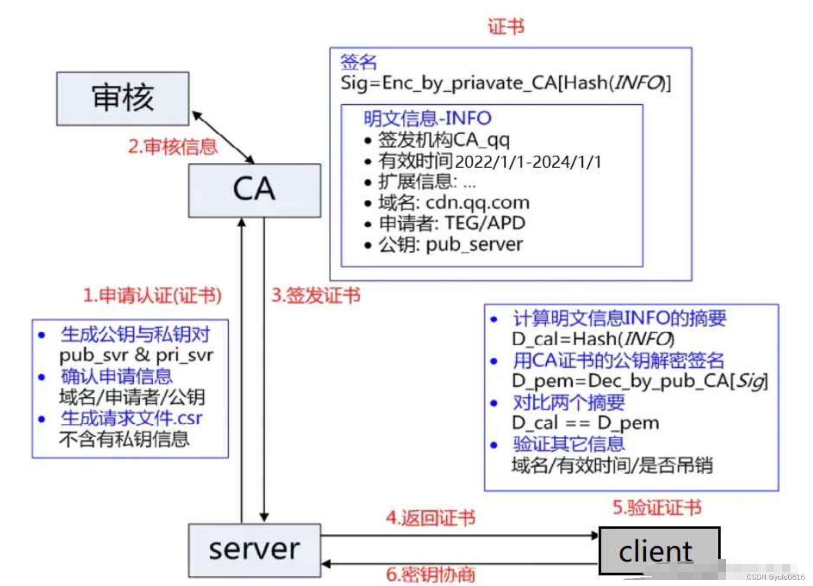

> 本文由 [简悦 SimpRead](http://ksria.com/simpread/) 转码， 原文地址 [blog.csdn.net](https://blog.csdn.net/weixin_54447296/article/details/131540293)

# 概述

## HTTP 与 HTTPS 有哪些区别？  

1.  HTTP 是超文本传输协议，信息是明文传输，存在安全风险的问题。HTTPS 则解决 HTTP 不安全的缺陷，在 TCP 和 HTTP 网络层之间加入了 SSL/TLS 安全协议，使得报文能够加密传输。
2.  HTTP 连接建立相对简单， TCP 三次握手之后便可进行 HTTP 的报文传输。而 HTTPS 在 TCP 三次握手之后，还需进行 SSL/TLS 的握手过程，才可进入加密报文传输。
3.  HTTP 的端口号是 80，HTTPS 的端口号是 443。
4.  HTTPS 协议需要向 CA（证书权威机构）申请数字证书，来保证服务器的身份是可信的。


## HTTPS 解决了 HTTP 的哪些问题？  

HTTP 由于是明文传输，所以安全上存在以下三个风险：

*   **窃听风险**，比如通信链路上可以获取通信内容，用户号容易没。
*   **篡改风险**，比如强制入垃圾广告，视觉污染，用户眼容易瞎。
*   **冒充风险**，比如冒充淘宝网站，用户钱容易没。


HTTP**S** 在 HTTP 与 TCP 层之间加入了 `SSL/TLS` 协议，可以很好的解决了上述的风险：

*   **信息加密**：交互信息无法被窃取，但你的号会因为「自身忘记」账号而没。
*   **校验机制**：无法篡改通信内容，篡改了就不能正常显示，但百度「竞价排名」依然可以搜索垃圾广告。
*   **身份证书**：证明淘宝是真的淘宝网，但你的钱还是会因为「剁手」而没。

可见，只要自身不做「恶」，SSL/TLS 协议是能保证通信是安全的。


## HTTPS 是如何解决上面的三个风险的？  

*   **混合加密**的方式实现信息的**机密性**，解决了窃听的风险。
*   **摘要算法**的方式来实现**完整性**，它能够为数据生成独一无二的「指纹」，指纹用于校验数据的完整性，解决了篡改的风险。
*   将服务器公钥放入到**数字证书**中，解决了冒充的风险。

一、HTTPS
=======

（一）定义
-----

> HTTPS （全称：[Hyper](https://so.csdn.net/so/search?q=Hyper&spm=1001.2101.3001.7020) Text Transfer Protocol over SecureSocket  
> Layer），是以安全为目标的 HTTP 通道，在 HTTP 的基础上通过传输加密和身份认证保证了传输过程的安全性。HTTPS 在 HTTP  
> 的基础下加入 SSL，HTTPS 的安全基础是 SSL，因此加密的详细内容就需要 SSL。 HTTPS 存在不同于 HTTP  
> 的默认端口及一个加密 / 身份验证层（在 HTTP 与 TCP 之间）。

http 与 tcp 协议[传输层](https://so.csdn.net/so/search?q=%E4%BC%A0%E8%BE%93%E5%B1%82&spm=1001.2101.3001.7020)中间加了一层软件层 SSL/TLS，http 和这层软件层合起来叫做 HTTPS。  
（ HTTPS 也是⼀个应⽤层协议. 是在 HTTP 协议的基础上引⼊了⼀个加密层. HTTP 协议内容都是按照⽂本的⽅式明⽂传输的， 这就导致在传输过程中可能被他人篡改）。

  
**所有的加密，都是为了防止中间有人进行窃取和篡改！！！！**

（二）HTTP 与 HTTPS
---------------

### 1. 端口不同，是两套服务

http 绑定的端口是 80； https 绑定的端口是 443；他们是两套服务，区别是 https 是加密的。

### 2.HTTP 效率更高，HTTPS 更安全

HTTP 不用加密，则效率更高，但是不安全；HTTP 需要加密，则效率相对不高，但是安全；  
在内网等绝对安全的条件下推荐使用 [HTTP 协议](https://so.csdn.net/so/search?q=HTTP%E5%8D%8F%E8%AE%AE&spm=1001.2101.3001.7020)。

（三）加密，解密，密钥等概念
--------------

**加密：** 加密就是把 明⽂ (要传输的信息，例如 "hello world") 进⾏⼀系列变换, ⽣成 密⽂。  
**解密**：解密就是把 密⽂ 再进⾏⼀系列变换，还原成 明⽂。  
**密钥**：在这个加密和解密的过程中, 往往需要⼀个或者多个中间的数据, 辅助进⾏这个过程, 这样的数据称为 密钥 (正确发⾳ yue 四声, 不过⼤家平时都读作 yao 四声)。

（四）为什么要加密？
----------

所有的加密，都是为了防止中间有人进行窃取和篡改

臭名昭著的 “运营商劫持”  
下载⼀个 天天动听  
未被劫持的效果, 点击下载按钮, 就会弹出天天动听的下载链接！

  
由于我们通过⽹络传输的任何的数据包都会经过运营商的⽹络设备 (路由器, 交换机等), 那么运营商的为网络设备就可以解析出你传输的数据内容, 并进⾏篡改.  
点击 “下载按钮”, 其实就是在给服务器发送了⼀个 HTTP 请求, 获取到的 HTTP 响应其实就包含了该 APP 的下载链接. 运营商劫持之后, 就发现这个请求是要下载天天动听, 那么就自动的把交给用户的响应给篡改成 “QQ 浏览器” 的下载地址了！

所以：因为 http 的内容是明⽂传输的，明文数据会经过路由器、wifi 热点、通信服务运营商、代理服务器等多个物理节点，如果信息在传输过程中被劫持，传输的内容就完全暴露了。劫持者还可以篡改传输的信息且不被双方察觉，这就是 中间人攻击 ，所以我们才需要对信息进行加密。

（五）常见的加密方式
----------

### 1. 对称加密

*   采用单钥密码系统的加密方法，同⼀个 密钥可以同时用作信息的加密和解密，这种加密方法称为对称加密，也称为单密钥加密，特征：加密和解密所用的密钥是相同的！
*   常见对称加密算法 (了解)： DES 、 3DES 、AES、TDEA、 Blowfish 、RC2 等  
    • 特点：算法公开、计算量小、加密速度快、加密效率高。

对称加密其实就是通过同⼀个 “密钥” , 把明文加密成密文, 并且也能把密文解密成明文.  
⼀个简单的对称加密, 按位异或  
假设 明文 a = 1234, 密钥 key = 8888  
则加密 a ^ key 得到的密文 b 为 9834.  
然后针对密文 9834 再次进行运算 b ^ key, 得到的就是原来的明文 1234。这里的 key 就是 对称加密中的密钥。 (对于字符串的对称加密也是同理, 每⼀个字符都可以表⽰成⼀个数字)  
当然, 按位异或只是最简单的对称加密. HTTPS 中并不是使用按位异或.


**凯撒密码**是一种较为简单的对称加密算法，可用于对英语文本进行加解密。其主要思想是：将明文中的每个字母按照字母表所在位置右移 K 位，得到密文（允许回绕）。

举个例子，设 K = 2，那么明文中的字母 "a" 用字母 "c" 代替，字母 "z" 用 字母 "b" 代替。此时 K = 2 就是对称加密算法中的密钥。


这种方式的缺点在于：每个字母经过加密后只有唯一的密文表示，如果黑客收集了很多数据后进行统计分析，很可能就破解了加密手段。

更好的方式是采用多个凯撒密码 K 轮询进行加密，比如位置为奇数的字母采用密钥 K = 2 加密，位置为偶数的字母采用密钥 K = 3 加密。

然而凯撒密码只能加密英文文本，若想要加密所有字符，可以采用**分组加密**的方式。

我们知道任何数据在计算机中实际存储的是 0/1 比特的组合。**分组加密**的主要思想是：将要加密的报文处理为 K 比特的分组，每个分组通过一对一的映射表进行加密。

举个例子，设 K = 3，映射表如下图，那么报文 010110001111 将会被加密为 101000111001。此时 K=3 以及映射表就是对称加密算法中的密钥。

与前面采用多个凯撒密码 K 作为密钥的方式一样，为了增加破解的难度，一种更好的方式是采用多个映射表，轮询对数据进行加密。

### 2. 非对称加密

非对称加密算法中加密和解密的钥匙不同，分别称为**公钥**(public key)和**私钥**(private key)；公钥和私钥是配对的；最⼤的缺点就是运算速度非常慢。其特点在于：

*   如果用公钥加密变成密文，则只能用私钥解密，此时公钥是不能解密的。【确保数据被劫持后公钥不能破解】

*   如果用私钥加密，则只能用公钥解密，此时私钥是不能解密的。【确保数据来源，鉴别身份】

*   公钥是对外公开的，任何人都能够得到；私钥只有自己知道，不能泄露。


常见非对称加密算法 (了解)：RSA，DSA，ECDSA、AES


非对称加密的数学原理比较复杂, 涉及到⼀些 数论 相关的知识. 这里举⼀个简单的生活上的例子！  
A 要给 B ⼀些重要的文件, 但是 B 可能不在. 于是 A 和 B 提前做出约定:  
B 说: 我桌子上有个盒子, 然后我给你⼀把锁, 你把文件放在盒子里锁锁上, 然后我回头拿着钥匙来开锁取文件，在这个场景中, 这把锁就相当于公钥, 钥匙就是私，公钥给谁都行 (不怕泄露), 但是私钥只有 B 自己持有，持有私钥的人才能解密。

```
案例：
让对方任意想一个3位数，并把这个数和91相乘，然后告诉我积的最后三位数，我就可以猜出对方想的是什么数字啦！比如对方想的是123，那么对方就计算出123 * 91等于11193，并把结果的末三位193告诉我。看起来，这么做似乎损失了不少信息，让我没法反推出原来的数。不过，我仍然有办法：只需要把对方告诉我的结果再乘以11，乘积的末三位就是对方刚开始想的数了。可以验证一下，193 * 11 = 2123，末三位正是对方所想的秘密数字！其实道理很简单，91乘以11等于1001，而任何一个三位数乘以1001后，末三位显然都不变（例如123乘以1001就等于123123）。
```

### 3.混合加密

通过**混合加密**的方式可以保证信息的**机密性**，解决了窃听的风险。


HTTPS 采用的是**对称加密**和**非对称加密**结合的「混合加密」方式：

*   在通信建立前采用**非对称加密**的方式交换「会话秘钥」，后续就不再使用非对称加密。
*   在通信过程中全部使用**对称加密**的「会话秘钥」的方式加密明文数据。

采用「混合加密」的方式的原因：

*   **对称加密**只使用一个密钥，运算速度快，密钥必须保密，无法做到安全的密钥交换。
*   **非对称加密**使用两个密钥：公钥和私钥，公钥可以任意分发而私钥保密，解决了密钥交换问题但速度慢。

（六）数据摘要 && 数据指纹
---------------

*   数字指纹 (数据摘要), 其基本原理是利⽤单向散列函数(Hash 函数) 对信息进行运算, 生成⼀串固定长度的字符串—数字摘要（这个字符串就叫做数据摘要 / 数据指纹）。数字指纹并不是⼀种加密机制，因为他不可以通过这个字符串反解出原数据，即：不可解密。但可以用来判断数据有没有被窜改。
*   摘要常见算法：有 MD5 、SHA1、SHA256、SHA512 等，算法把无限的映射成有限，因此可能会有碰撞（两个不同的信息，算出的摘要相同，但是概率非常低）
*   摘要特征：和 加密算法 的区别是，摘要严格意义不是加密，因为没有解密，只不过从摘要几乎无法反推原信息，通常用来进行数据对比。

**数字签名：摘要经过加密，就得到数字签名。**

理解链 - 承上启下：

*   对 http 进行对称加密，是否能解决数据通信安全的问题？问题是什么？
*   为何要用非对称加密？为何不全用对称加密？  
    HTTPS 工作过程探究：  
    既然要保证数据安全, 就需要进行 “加密”.  
    网络传输中不再直接传输明文了, 而是加密之后的 “密文”.  
    加密的方式有很多, 但是整体可以分成两⼤类: 对称加密 和文对称加密

二、HTTPS 的工作过程探究
===============

既然要保证数据安全, 就需要进行 “加密”.  
⽹络传输中不再直接传输明文了, 而是加密之后的 “密文”.  
加密的方式有很多, 但是整体可以分成两大类: 对称加密 和 非对称加密

（一）方案 1 - 只使用对称加密（明文传输不可取）
--------------------------

  
如果通信双方都各自持有同⼀个密钥 X，且没有别人知道，这两方的通信安全当然是可以被保证的（除非密钥被破解）。

引⼊对称加密之后，即使数据被截获，由于⿊客不知道密钥是啥，因此无法进行解密，也就不知道请求的真实内容是啥了！

但事情没这么简单. 服务器同⼀时刻其实是给很多客户端提供服务的，这么多的客户端，每个人用的秘钥都必须是不同的 (如果是相同那密钥就太容易扩散了, 黑客就也能拿到了)，因此服务器就需要维护每个客端和每个密钥之间的关联关系，这也是个很麻烦的事情~  
  
比较理想的做法，就是能在客⼾端和服务器建立连接的时候, 双方协商确定这次的密钥是啥~  
  
但是如果直接把密钥明文传输, 那么黑客也就能获得密钥了~~ 此时后续的加密操作就形同虚设了，  
因此密钥的传输也必须加密传输!

但是要想对密钥进行对称加密, 就仍然需要先协商确定⼀个 "密钥的密钥". 这就成了 "先有鸡还是先有蛋" 的问题了，此时密钥的传输再用对称加密就行不通了。

（二）方案 2 - 只使用非对称加密（仅单向安全，不可取）
-----------------------------

  
鉴于非对称加密的机制，如果服务器先把公钥以明文方式输给浏览器，之后浏览器向服务器传数据前都先用这个公钥加密好再传，从客户端到服务器信道似乎是安全的 (有安全问题)，因为只有服务器有相应的私钥能解开公钥加密的数据。

但是服务器到浏览器的这条路怎么保障安全？  
如果服务器用它的私钥加密数据传给浏览器，那么浏览器用公钥可以解密它，而这个公钥是⼀开始通过明文传输给浏览器的，若这个公钥被中间⼈劫持到了, 那他也能用该公钥解密服务器传来的信息了。

（三）方案 3 - 双方都使用非对称加密（效率太低不可行）
-----------------------------

1. 服务端拥有公钥 S(server) 与对应的私钥 S’，客⼾端拥有公钥 C 与对应的私钥 C’  
2. 客户和服务端交换公钥  
3. 客户端给服务端发信息：先用 S 对数据加密，再发送，只能由服务器解密，因为只有服务器有私钥 S’  
4. 服务端给客户端发信息：先用 C 对数据加密，在发送，只能由客户端解密，因为只有客户端有私钥 C’ 这样貌似也行，

但是：

*   效率太低
*   依旧有安全问题

（四）方案 4 - 非对称加密 + 对称加密
----------------------


*   服务端具有非对称公钥 S 和私钥 S’
*   客户端发起 https 请求，获取服务端公钥 S
*   客户端在本地生成对称密钥 C, 通过公钥 S 加密，发送给服务器。
*   由于中间的网络设备没有私钥, 即使截获了数据, 也无法还原出内部的原文, 也就无法获取到对称密钥 (真的吗？)
*   服务器通过私钥 S’解密, 还原出客户端发送的对称密钥 C. 并且使用这个对称密钥加密给客户端返回的响应数据.
*   后续客户端和服务器的通信都用对称加密即可. 由于该密钥只有客户端和服务器两个主机知道, 其他主机 / 设备不知道密钥即使截获数据也没有意义。

> 由于对称加密的效率比非对称加密高很多, 因此只是在开始阶段协商密钥的时候使用非对称加密, 后续的传输仍然使用对称加密。

虽然上面已经比较接近答案了，但是依旧有安全问题  
方案 2，3，4 都存在⼀个问题，如果最开始，中间人就已经开始攻击了呢？

**中间人攻击—针对上面的场景：**

Man-in-the-MiddleAttack，简称 “MITM 攻击”  
确实，在方案 2/3/4 中，客户端获取到公钥 S 之后，对客户端形成的对称秘钥 X 用服务端给客户端的公钥 S 进行加密，中间人即使窃取到了数据，此时中间人确实无法解出客客端形成的密钥 X，因为只有服务器有私钥 S’  
但是中间人的攻击，如果在最开始握手协商的时候就进行了，那就不⼀定了，假设 hacker 已经成功成为中间人！

1. 服务器具有非对称加密算法的公钥 S，私钥 S’  
2. 中间人具有非对称加密算法的公钥 M，私钥 M’  
3. 客户端向服务器发起请求，服务器明文传送公钥 S 给客户端  
4. 中间文劫持数据报文，提取公钥 S 并保存好，然后将被劫持报文中的公钥 S 替换成为自己的公钥 M，并将伪造报文发给客户端。  
5. 客户端收到报文，提取公钥 M(⾃⼰当然不知道公钥被更换过了)，自己形成对称秘钥 X，用公钥 M 加密 X，形成报文发送给服务器  
6. 中间⼈劫持后，直接⽤⾃⼰的私钥 M’进⾏解密，得到通信秘钥 X，再⽤曾经保存的服务端公钥 S 加密后，将报⽂推送给服务器  
7. 服务器拿到报⽂，⽤⾃⼰的私钥 S’解密，得到通信秘钥 X  
8. 双⽅开始采⽤ X 进⾏对称加密，进⾏通信。但是⼀切都在中间⼈的掌握中，劫持数据，进⾏窃听甚⾄修改，都是可以的。

上⾯的攻击方案，同样适用于方案 2，方案 3  
问题本质出在哪里了呢？  
**客户端无法确定收到的含有公钥的数据报文，就是目标服务器发送过来的！**

**这个时候就需要新的解决方案了，下面来引入证书。**

三、证书CA
====

服务端在使用 HTTPS 前，需要向 CA 机构申领⼀份数字证书，数字证书里有证书申请者信息、公钥信息等。服务器把证书传输给浏览器，浏览器从证书里获取公钥就行了，证书就如身份证，证明服务端公钥的权威性。  


> 这个证书可以理解成是⼀个结构化的字符串, 里面包含了以下信息:
> 
> 证书发布机构  
> 证书有效期  
> 公钥  
> 证书所有者  
> 签名  
> …

需要注意的是：申请证书的时候，需要在特定平台生成查，会同时生成⼀对密钥对，即公钥和私钥。这对密钥对就是用来在网络通信中进行明文加密以及数字签名的。


通过数字证书解决中间人攻击的具体过程为：

*   服务器（正规网站）首先生成一对公钥和私钥，然后将域名、申请者、公钥（注意不是私钥，私钥是无论如何也不能泄露的）等信息整合在一起，生成 .csr 文件，并将此文件发给认证中心 CA。

*   CA 收到申请后，会通过各种手段验证申请者的信息，如无异常，则**使用摘要算法得到 .csr 中明文信息的一个摘要，再用 CA 自己的`私钥`对这个摘要进行加密，生成一串密文，密文也称为数字签名。数字证书即包含此数字签名和 .csr 中明文信息。CA 把这个证书返回给申请人。**

*   为了防止中间人攻击，客户端要求服务器发送其证书，并进行验证。

*   客户端在验证证书时，把证书里的签名与及明文信息分别取出来，然后会**用自身携带的 CA 机构的`公钥`去解密签名，得到摘要 1，再利用摘要算法得到明文信息的摘要 2，对比摘要 1 和摘要 2，如果一样，说明证书是合法的，也就是证书里的公钥是正确的，否则说明证书不合法。** 


浏览器如何得到认证中心的公钥呢？万一此公钥是被伪造的呢？为了防止套娃，实际电脑**操作系统中会内置这些认证中心的公钥**！因而无需担心认证中心公钥被伪造的问题。

Chrome 浏览器一旦发现一个网站数字证书无效，就会生成如下界面进行提示，如果用户强制访问，则存在一定的风险。

s  


其中公钥会随着 CSR 文件，⼀起发给 CA 进行权威认证，私钥服务端自己保留，⽤来后续进行通信（其实主要就是用来交换对称秘钥）

⼀般认证过程很繁琐，网络各种提供证书申请的服务商，⼀般真的需要，直接找平台解决就行。

（一）数据签名
-------

签名的形成是基于非对称加密算法的，注意，目前暂时和 https 没有关系，不要和 https 中的公钥私钥搞混了。  


数字签名的制作过程：

1.  CA 机构拥有非对称加密的私钥和公钥。
2.  CA 机构对证书明文数据 T 进行 hash。
3.  对 hash 后的值用私钥加密，得到数字签名 S。

明文和数字签名共同组成了数字证书，这样一份数字证书就可以颁发给网站了。  

那浏览器拿到服务器传来的数字证书后，如何验证它是不是真的？（有没有被篡改、掉包）

浏览器验证过程：

1.  拿到证书，得到明文 T，签名 S。
2.  用 CA 机构的公钥对 S 解密（由于是浏览器信任的机构，所以浏览器保有它的公钥。详情见下文），得到 S’。
3.  用证书里指明的 hash 算法对明文 T 进行 hash 得到 T’。
4.  显然通过以上步骤，T’应当等于 S‘，除非明文或签名被篡改。所以此时比较 S’是否等于 T’，等于则表明证书可信。

为何么这样可以保证证书可信呢？我们来仔细想一下。


**中间人有可能篡改该证书吗？**
-----------------

假设中间人篡改了证书的原文，由于他没有 CA 机构的私钥，所以无法得到此时加密后签名，无法相应地篡改签名。浏览器收到该证书后会发现原文和签名解密后的值不一致，则说明证书已被篡改，证书不可信，从而终止向服务器传输信息，防止信息泄露给中间人。

既然不可能篡改，那整个证书被掉包呢？

**中间人有可能把证书掉包吗？**
-----------------

假设有另一个网站 B 也拿到了 CA 机构认证的证书，它想劫持网站 A 的信息。于是它成为中间人拦截到了 A 传给浏览器的证书，然后替换成自己的证书，传给浏览器，之后浏览器就会错误地拿到 B 的证书里的公钥了，这确实会导致上文 “中间人攻击” 那里提到的漏洞？

其实这并不会发生，因为证书里包含了网站 A 的信息，包括域名，浏览器把证书里的域名与自己请求的域名比对一下就知道有没有被掉包了。

**为什么制作数字签名时需要 hash 一次？**
-------------------------

我初识 HTTPS 的时候就有这个疑问，因为似乎那里的 hash 有点多余，把 hash 过程去掉也能保证证书没有被篡改。

最显然的是性能问题，前面我们已经说了非对称加密效率较差，证书信息一般较长，比较耗时。而 hash 后得到的是固定长度的信息（比如用 md5 算法 hash 后可以得到固定的 128 位的值），这样加解密就快很多。

当然也有安全上的原因，这部分内容相对深一些，感兴趣的可以看这篇解答：[crypto.stackexchange.com/a/12780](https://link.juejin.im/?target=https://crypto.stackexchange.com/a/12780)

**怎么证明 CA 机构的公钥是可信的？**
----------------------

你们可能会发现上文中说到 CA 机构的公钥，我几乎一笔带过，“浏览器保有它的公钥”，这是个什么保有法？怎么证明这个公钥是否可信？

让我们回想一下数字证书到底是干啥的？没错，为了证明某公钥是可信的，即 “该公钥是否对应该网站”，那 CA 机构的公钥是否也可以用数字证书来证明？没错，**操作系统、浏览器本身会预装一些它们信任的根证书**，如果其中会有 CA 机构的根证书，这样就可以拿到它对应的可信公钥了。

实际上证书之间的认证也可以不止一层，可以 A 信任 B，B 信任 C，以此类推，我们把它叫做`信任链`或`数字证书链`。也就是一连串的数字证书，由根证书为起点，透过层层信任，使终端实体证书的持有者可以获得转授的信任，以证明身份。

另外，不知你们是否遇到过网站访问不了、提示需安装证书的情况？这里安装的就是根证书。说明浏览器不认给这个网站颁发证书的机构，那么你就得手动下载安装该机构的根证书（风险自己承担 XD）。安装后，你就有了它的公钥，就可以用它验证服务器发来的证书是否可信了。


**每次进行 HTTPS 请求时都**必须**在 SSL/TLS 层进行握手传输密钥吗？**
----------------------------------------------

这也是我当时的困惑之一，显然每次请求都经历一次密钥传输过程非常耗时，那怎么达到只传输一次呢？

服务器会为每个浏览器（或客户端软件）维护一个 session ID，在 TLS 握手阶段传给浏览器，浏览器生成好密钥传给服务器后，服务器会把该密钥存到相应的 session ID 下，之后浏览器每次请求都会携带 session ID，服务器会根据 session ID 找到相应的密钥并进行解密加密操作，这样就不必要每次重新制作、传输密钥了！


四、最终方案
======

**非对称加密 + 对称加密 + 证书认证**

在客户端和服务器刚⼀建立连接的时候, 服务器给客⼾端返回⼀个证书，证书包含了之前服务端的公钥, 也包含了网站的身份信息。  


### 1. 客户端进行认证

当客户获取到这个证书之后, 会对证书进行校验 (防证书是伪造的)。

1.  判定证书的有效期是否过期
2.  判定证书的发布机构是否受信任 (**操作系统中已内置的受信任的证书发布机构**).
3.  验证证书是否被篡改: 从系统中拿到该证书发布机构的公钥, 对签名解密, 得到⼀个 hash 值 (称为数据摘要), 设为 hash1. 然后计算整个证书的 hash 值, 设为 hash2. 对⽐ hash1 和 hash2 是否相等. 如果相等, 则说明证书是没有被篡改过的。

### 2. 查看浏览器的受信任证书发布机构


五、一些问题
======

（一）中间人有没有可能篡改该证书？
-----------------

*   中间⼈篡改了证书的明文
*   由于他没有 CA 机构的私钥，所以无法 hash 之后用私钥加密形成签名，那么也就没法办法对篡改后的证书形成匹配的签名
*   如果强行篡改，客户端收到该证书后会发现明文和签名解密后的值不⼀致，则说明证书已被篡改，证书不可信，从而终止向服务器传输信息，防止信息泄露给中间人。

（二）中间人整个掉包证书？
-------------

*   因为中间人没有 CA 私钥，所以无法制作假的证书 (为什么？)
*   所以中间人只能向 CA 申请真证书，然后用自己申请的证书进行掉包。
*   这个确实能做到证书的整体掉包，但是别忘记，证书明文中包含了域名等服务端认证信息，如果整体掉包，客户端依旧能够识别出来。
*   永远记住：中间人没有 CA 私钥，所以对任何证书都无法进行合法修改，包括自己的！

（三）为什么摘要内容在网络传输的时候一定要加密形成签名?
----------------------------

常见的摘要算法有: MD5 和 SHA 系列！

理解判定证书篡改的过程: (这个过程就好比判定这个身份证是不是伪造的身份证)  
假设我们的证书只是⼀个简单的字符串 hello, 对这个字符串计算 hash 值 (比如 md5), 结果为 BC4B2A76B9719D91。  
如果 hello 中有任意的字符被篡改了, 比如变成了 hella, 那么计算的 md5 值就会变化很大。  
BDBD6F9CF51F2FD8 然后我们可以把这个字符串 hello 和哈希值 BC4B2A76B9719D91 从服务器返回给客户端, 此时客户端如何验证 hello 是否是被篡改过?  
那么就只要计算 hello 的哈希值, 看看是不是 BC4B2A76B9719D91 即可。  
如果被传输的哈希值是传输明文。黑客可以把 hello 篡改了, 同时也把哈希值重新计算下, 客户端就分辨不出来了。

  
所以被传输的哈希值不能传输明文， 需要传输密文。

所以，对证书明⽂ (这⾥就是 “hello”)hash 形成散列摘要，然后 CA 使用自己的私钥加密形成签名，将 hello 和加密的签名合起来形成 CA 证书，颁发给服务端，当客户端请求的时候，就发送给客户端，中间人截获了，因为没有 CA 私钥，就无法更改或者整体掉包，就能安全的证明，证书的合法性。  
最后，客户端通过操作系统里已经存的了的证书发布机构的公钥进行解密, 还原出原始的哈希值, 再进行校验。

（四）为什么签名不直接加密，⽽是要先 hash 形成摘要?
-----------------------------

缩⼩签名密⽂的⻓度, 加快数字签名的验证签名的运算速度。

（五）如何成为中间人 - 了解
---------------

*   ARP 欺骗：在局域⽹中，hacker 经过收到 ARP Request ⼴播包，能够偷听到其它节点的 (IP, MAC) 地址。例， ⿊客收到两个主机 A, B 的地址，告诉 B (受害者) ，⾃⼰是 A，使得 B 在发送给 A 的数据包都被⿊客截取
*   ICMP 攻击：由于 ICMP 协议中有重定向的报⽂类型，那么我们就可以伪造⼀个 ICMP 信息然后发送给局域⽹中的客⼾端，并伪装⾃⼰是⼀个更好的路由通路。从⽽导致⽬标所有的上⽹流量都会发送到我们指定的接⼝上，达到和 ARP 欺骗同样的效果
*   假 wifi && 假⽹站等


六、HTTPS通信流程
====

   HTTPS通信主要包括几个节点，**发起请求、验证身份、协商秘钥、加密会话**，具体流程如下（此例子只有客户端对服务端的单向验证）：

```java
1）客户端向服务端发起建立HTTPS请求。
2）服务器向客户端发送数字证书。
3）客户端验证数字证书，证书验证通过后客户端生成会话密钥（双向验证则此处客户端也会向服务器发送证书）。
4）服务器生成会话密钥（双向验证此处服务端也会对客户端的证书验证）。
5）客户端与服务端开始进行加密会话。
```


   具体流程如下：

   **第一步：客户端向服务端发起请求**

​             a.  客户端生成随机数R1 发送给服务端
​             b. 告诉服务端自己支持哪些加密算法和哈希算法

   **第二步：服务器向客户端发送数字证书**

​              a. 服务端生成随机数R2

​              b. 从客户端支持的加密算法中选择一种双方都支持的加密算法（此算法用于后面的会话密钥生成）和哈希算法用机构的证书公钥解密得到证书的内容和证书签名

​              c. 服务端生成把证书、随机数R2、会话密钥生成算法，一同发给客户端

   **第三步：客户端验证数字证书。**

​    这一部分是**浏览器内置的 TSL** 完成的：

​                  a. 首先浏览器会从内置的证书列表中索引，找到服务器下发证书对应的机构，如果没有找到，此时就会提示用户该证书是不是由权威机构颁发，是不可信任的。如果查到了对应的机构，则取出该机构颁发的公钥、会话密钥生成算法、随机数R2。
​                  b. 用机构的证书公钥解密得到证书的内容和证书签名，内容包括网站的网址、网站的公钥、证书的有效期等。浏览器会先验证证书签名的合法性。签名通过后，浏览器验证证书记录的网址是否和当前网址是一致的，不一致会提示用户。如果网址一致会检查证书有效期，证书过期了也会提示用户。这些都通过认证时，浏览器就可以安全使用证书中的网站公钥了。
​                  c. 浏览器生成一个随机数 R3，根据会话密钥算法使用R1、R2、R3生成会话密钥。

​                  d. 用服务端证书的公钥加密随机数R3并发送给服务端。

   注意：以上其实就是 HTTPS 的握手过程，这个过程主要是认证服务端证书（内置的公钥）的合法性。因为非对称加密计算量较大，整个通信过程只会用到一次非对称加密算法（主要是用来保护传输客户端生成的用于对称加密的随机数私钥）。后续内容的加解密都是通过一开始约定好的对称加密算法进行的。

   **第四步：服务器得到会话密钥**

​                 a. 服务器用私钥解密客户端发过来的随机数R3

​                 b. 根据会话密钥算法使用R1、R2、R3生成会话密钥

   **第五步：客户端与服务端进行加密会话**

   1） 客户端发送加密数据给服务端

   发送加密数据：客户端加密数据后发送给服务端。

   2）服务端响应客户端

   解密接收数据：服务端用会话密钥解密客户端发送的数据

   加密响应数据：用会话密钥把响应的数据加密发送给客户端。

   3）客户端解密服务端响应的数据

   解密数据：客户端用会话密钥解密响应数据


> **为什么有的网站不用HTTPS?**
>
>    HTTPS 虽然安全可靠，但是有的网站还是使用 HTTP，原因是什么呢？
>
>    1、HTTPS 由于使用了 SSL(包括 TLS) 而变得安全可靠，但是 SSL 由于要进行加密处理会导致整个通信变慢，频繁的加密、解密会消耗服务端和客户端的硬件资源。
>
>    2、SSL 不仅会导致通信慢，还会由于大量消耗 CPU 和内存等资源，导致整个处理速度变慢，和 HTTP 相比，网络负载可能可能会变慢 2 到 100 倍
>
>    3、如果使用了 HTTPS，那就意味着要增加硬件成本，此外从数字认证机构购买证书也是需要开销的。
>
>    总结：相较于HTTP协议，HTTPS确保了报文的机密性以及完整性。HTTPS确保这些的依赖就是SSL/TSL协议，SSL/TSL安全协议搭配数字证书保证了报文在传输过程中的绝对安全。但是使用HTTPS就意味着需要增加成本，因此实际中是否使用HTTPS，还需要进行各方面的权衡。


总结：HTTPS ⼯作过程中涉及到的密钥有三组.  
第⼀组 (⾮对称加密): ⽤于校验证书是否被篡改. 服务器持有私钥 (私钥在形成 CSR ⽂件与申请证书时获得), 客⼾端持有公钥 (操作系统包含了可信任的 CA 认证机构有哪些, 同时持有对应的公钥). 服务器在客⼾端请求时，返回携带签名的证书. 客⼾端通过这个公钥进⾏证书验证, 保证证书的合法性，进⼀步保证证书中携带的服务端公钥权威性。  
第⼆组 (⾮对称加密): ⽤于协商⽣成对称加密的密钥. 客⼾端⽤收到的 CA 证书中的公钥(是可被信任的) 给随机⽣成的对称加密的密钥加密, 传输给服务器, 服务器通过私钥解密获取到对称加密密钥.  
第三组 (对称加密): 客⼾端和服务器后续传输的数据都通过这个对称密钥加密解密.  
其实⼀切的关键都是围绕这个对称加密的密钥. 其他的机制都是辅助这个密钥⼯作的.  
第⼆组⾮对称加密的密钥是为了让客⼾端把这个对称密钥传给服务器.  
第⼀组⾮对称加密的密钥是为了让客⼾端拿到第⼆组⾮对称加密的公钥.

# SSL/TLS 握手

根据前面所述，进行一下小结：

*   HTTPS 通过混合加密算法解决 HTTP 传输数据容易被窃听的问题，此过程需要协商`会话密钥`。

*   HTTPS 通过摘要算法解决 HTTP 传输数据容易被篡改的问题，此过程需要协商`鉴别密钥`。

*   HTTPS 通过数字证书解决 HTTP 协议中身份容易被伪造的问题，此过程需要客户端验证服务器的`证书`。

那么 HTTPS 具体是怎么做的呢？通信双方在什么时候协商`会话密钥`和`鉴别密钥`、什么时候验证`证书`合法性的呢？答案是 SSL/TLS 协议握手的时候。

SSL/TLS 的「握手阶段」涉及**四次**通信，可见下图：


SSL/TLS 协议建立的详细流程：

**_1. ClientHello_**

首先，由客户端向服务器发起加密通信请求，也就是 `ClientHello` 请求。

在这一步，客户端主要向服务器发送以下信息：

（1）客户端支持的 SSL/TLS 协议版本，如 TLS 1.2 版本。

（2）客户端生产的随机数（`Client Random`），后面用于生产「会话秘钥」。

（3）客户端支持的密码套件列表，如 RSA 加密算法。

**_2. SeverHello_**

服务器收到客户端请求后，向客户端发出响应，也就是 `SeverHello`。服务器回应的内容有如下内容：

（1）确认 SSL/ TLS 协议版本，如果浏览器不支持，则关闭加密通信。

（2）服务器生产的随机数（`Server Random`），后面用于生产「会话秘钥」。

（3）确认的密码套件列表，如 RSA 加密算法。

（4）服务器的数字证书。

**_3. 客户端回应_**

客户端收到服务器的回应之后，首先通过浏览器或者操作系统中的 CA 公钥，确认服务器的数字证书的真实性。

如果证书没有问题，客户端会从数字证书中取出服务器的公钥，然后使用它加密报文，向服务器发送如下信息：

（1）一个随机数（`pre-master key`）。该随机数会被服务器公钥加密。

（2）加密通信算法改变通知，表示随后的信息都将用「会话秘钥」加密通信。

（3）客户端握手结束通知，表示客户端的握手阶段已经结束。这一项同时把之前所有内容的发生的数据做个摘要，用来供服务端校验。

上面第一项的随机数是整个握手阶段的第三个随机数，这样服务器和客户端就同时有三个随机数，接着就用双方协商的加密算法，**各自生成**本次通信的「会话秘钥」。

**_4. 服务器的最后回应_**

服务器收到客户端的第三个随机数（`pre-master key`）之后，通过协商的加密算法，计算出本次通信的「会话秘钥」。然后，向客户端发生最后的信息：

（1）加密通信算法改变通知，表示随后的信息都将用「会话秘钥」加密通信。

（2）服务器握手结束通知，表示服务器的握手阶段已经结束。这一项同时把之前所有内容的发生的数据做个摘要，用来供客户端校验。

至此，整个 SSL/TLS 的握手阶段全部结束。接下来，客户端与服务器进入加密通信，就完全是使用普通的 HTTP 协议，只不过用「会话秘钥」加密内容。
