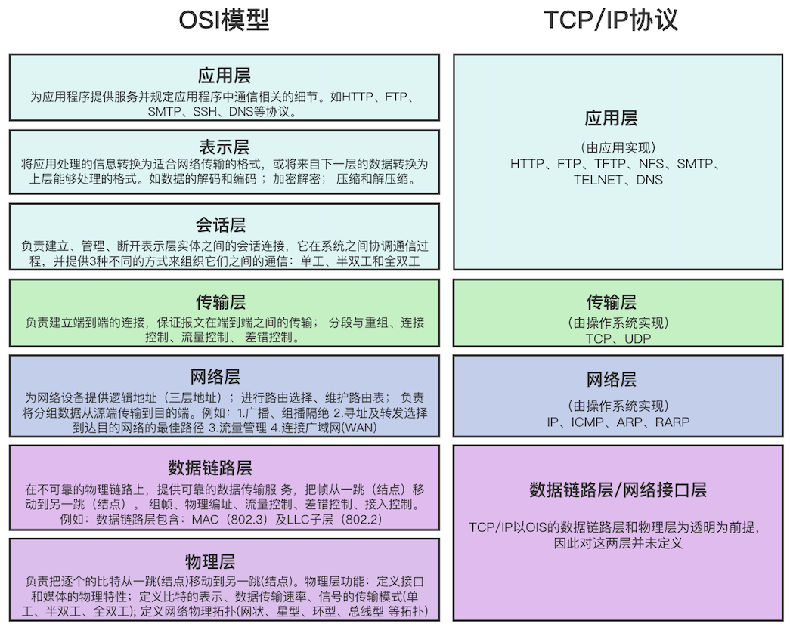
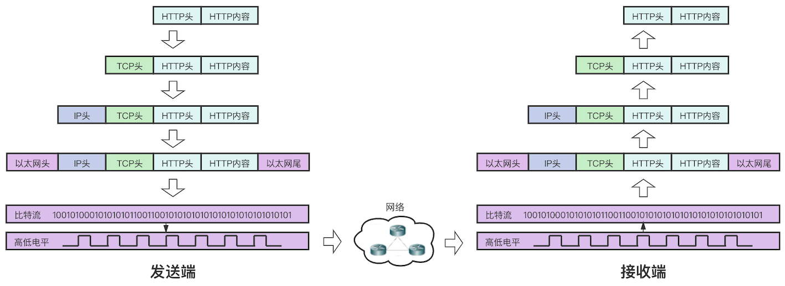
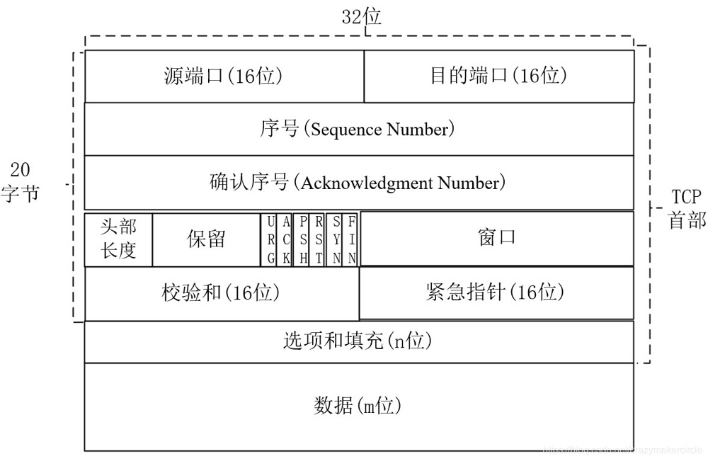
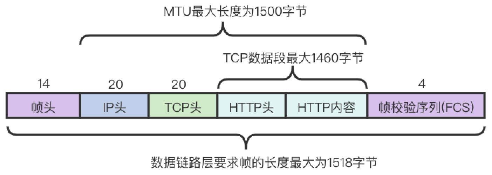
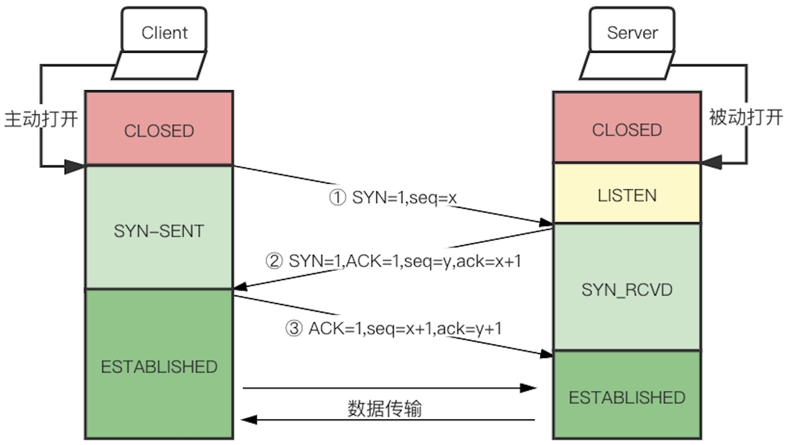
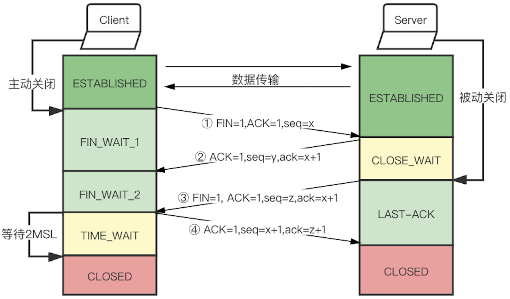
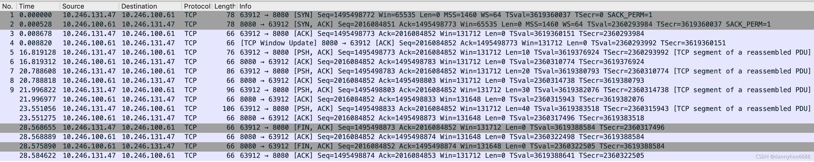
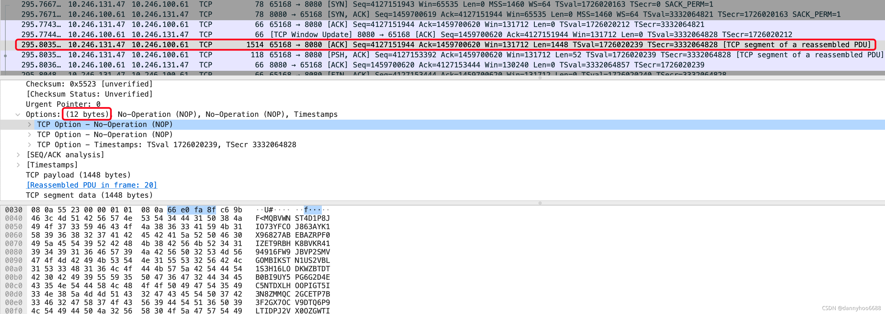

> 本文由 [简悦 SimpRead](http://ksria.com/simpread/) 转码， 原文地址 [blog.csdn.net](https://blog.csdn.net/huyuyang6688/article/details/119975253)

TCP（Transmission Control Protocol 传输控制协议）协议是基于 IP 协议，面向连接的、可靠的、基于[字节流](https://so.csdn.net/so/search?q=%E5%AD%97%E8%8A%82%E6%B5%81&spm=1001.2101.3001.7020)的传输层通信协议。

*   基于 IP 协议：在 TCP/IP 协议栈中，TCP 协议是基于 IP 协议之上传输的，TCP 协议报文中的源端口 + IP 协议报文中的源地址 + TCP 协议报文中的目标端口 + IP 协议报文中的目标地址，组合起来唯一确定一条 TCP 连接。
    
*   面向连接、可靠：与 UDP 不同，TCP 传输数据之前会通过 “三次握手” 建立起一条 TCP 连接，然后再传输数据，最后通过 “四次挥手” 释放连接。这里的连接是指两端可以感知到对方的存在才会真正开始交互，但不是真实存在的，是虚拟的。TCP 连接在两个计算机操作系统上的表现就是双方都通过一定的数据结构来维持的一种状态。此外，TCP 会利用顺序控制、重发机制、流量控制、拥塞控制等来保证通信的可靠性。
    
*   基于字节流：流的含义就是不间断的数据结构，这里只没有固定的报文边界，假如发送的内容比较大，TCP 会把数据切割成一段一段的，放到内核缓冲区，最终一个报文发送多少字节的数据是不确定的（可能受 MTU、MSS、发送窗口大小、拥塞窗口大小等影响）。比如调用 2 次 write 函数往 socket 中依次写入两批数据，第一批 600 字节、第二批 800 字节，write 函数只是把这些数据拷贝到内核缓冲区，具体实际发送了几次报文，每条报文多少数据是不确定的：
    
    可能发出 2 条报文，第一个 600 字节（第一批数据），第二个 800 字节（第二批数据）；
    
    可能发出 1 条报文，一次性发送 1400 字节（第一批数据 + 第二批数据）；
    
    可能发出 2 条报文，第一个 1000 字节（第一批数据的 600 字节 + 第二批数据的 400 字节），第二个 400 字节（第二批数据的 400 字节）；
    
    可能发出 2 条报文，第一个 300 字节（第一批数据的 300 字节），第二个 1100 字节（第一批数据的 300 字节 + 第二批数据的 800 字节）；
    
    ……
    

### TCP 协议报文

协议就是计算机与计算机之间通过网络实现通信时事先达成的一种 “约定”。了解 TCP 协议报文之前，先简单回顾下【OSI 七层模型】和【TCP/IP 协议】。

OSI（Open System Interconnect），开放系统互联，一般称它 OSI 参考模型，它是 ISO（国际标准化组织）为了更好普及网络而推出的规范。OSI 定义了网络互联的七层框架：物理层、数据链路层、网络层、传输层、会话层、表示层、应用层，每一层实现各自的协议和功能，实现和相邻层的网络通信。

TCP/IP 协议不是单单指 TCP、IP 协议，是指由 HTTP、FTP、SMTP、TCP、UDP、IP 等协议组成的协议簇，是对这些[通信协议](https://so.csdn.net/so/search?q=%E9%80%9A%E4%BF%A1%E5%8D%8F%E8%AE%AE&spm=1001.2101.3001.7020)的统称。至于为啥叫它 TCP/IP 协议，我猜可能是 TCP 协议和 IP 协议比较有代表性吧~



至于 OSI 参考模型和 TCP/IP 四层协议的区别，我理解 OSI 参考模型是学术上定义的标准，是一个理论上的网络通信模型，没有对协议进行详细的定义。而 TCP/IP 协议是参考这个标准的具体实现，是在实际的实现中运行的网络协议。OSI 参考模型注重 “通信协议必要的功能是什么”，而 TCP/IP 则更强调 “在计算机上实现协议应该开发哪种程序”。

以 `curl -H "Content-Type:application/json" -X POST --data '{"param1": "value2", "param2": "value2"}' http://192.168.2.188/service` 为例，来分析一下通过 HTTP 协议从客户端向服务端发送数据，数据如何传输的：



客户端为发送端，服务端为接收端。

1、应用层把【Content-Type:application/json】放到 HTTP 头，把【{“param1”: “value2”, “param2”: “value2”}】放到 HTTP BODY（上图 HTTP 内容）中，组成一个 HTTP 报文；

2、传输层把接收到的 HTTP 报文作为 TCP 的内容，加上 TCP 头（包含源端口号、目标端口号等），拼接成一个数据段（TCP 报文），如果 TCP 的内容（HTTP 报文）很大，在传输层可能会把 TCP 的内容拆分为多份，拼接成多个数据段（TCP 报文）

3、网络层把接收到的 TCP 报文加上 IP 头（包含源 IP 地址、目标 IP 地址等），组成一个数据包（IP 报文）

4、数据链路层把接收到的 IP 报文加上以太网头部（包含源 MAC 地址、目标 MAC 地址等）和以太网尾部（FCS 帧检验序列），组成一个数据帧。

5、数据链路层的数据帧封装完成后会通过物理层转换成比特流在物理介质上传输。比特流也就是二进制流（01010101010101010101010101），在介质就是以电流的高低电平的形式的形式传输。

发送端从应用层、传输层、网络层、数据链路层由上至下按照顺序传输数据，接收端则从数据链路层、网络层、传输层、应用层由下至上向每个上一级分层传输数据。每个分层上，在处理由上一层传过来的数据时可以附上当前分层的协议所必须的首部信息，然后接收端对收到的数据进行数据 “首部” 与“内容”的分离，再转发给上一分层，并最终将发送端的数据恢复为原状。

### TCP 三次握手、四次挥手

前面说 TCP 是面向连接传输的，通信双方通过三次握手建立 “连接”。这里的“连接” 是指通信双方知道对方的存在，双方有对应的 socket 资源，有对应的发送缓存和接收缓存，有相应的拥塞控制策略等。连接并不是真实存在的，只是一种状态，通信双方通过一定的数据结构来维持这种状态。

分析三次握手之前，先了解一下 TCP 报文的内容，可能会理解地更容易一些。



*   **源端口**：客户端（发送方）对应应用的的端口号，某个应用发起网络请求时，操作系统会给它分配一个对应端口号
    
*   **目的端口**：服务端（接收方）对应应用的端口号，一般都是启动监听时设置的，比如起了一个 tomcat，端口号为 8080
    
*   **序号（Sequence Number）**：序号的语义和控制标志位 SYN 的值有关。
    
    当 SYN=1 时，当前 TCP 报文为刚开始建立连接的阶段。序号的值为 ISN（初始化序列号），是根据计时器、源 IP、目的 IP、源端口、目的端口等条件随机生成的；
    
    当 SYN=0 时，是正式传输数据的阶段。客户端（发送方）发送数据时，会为每个 TCP 报文段设置有序的序列号，当前报文段的序号值是所发送的数据的第一个字节的序号。比如客户端要发送 3 个连续的报文段，每个 TCP 报文携带的数据长度为 2 字节，即三个报文的数据分别为【第 1 个字节 + 第 2 个字节】、【第 3 个字节 + 第 4 个字节】、【第 5 个字节 + 第 6 个字节】，那这 3 个报文段对应的序号分别为 1、3、5
    
*   **确认序号（Acknowledgement Number）**：接收端期望收到发送端下一个报文的序号。
    
    比如客户端发送了长度为 2 字节的三个报文【第 1 个字节 + 第 2 个字节】、【第 3 个字节 + 第 4 个字节】、【第 5 个字节 + 第 6 个字节】，即这 3 个报文段对应的序号分别为 1、3、5，那服务端对应回应的 3 个报文的确认序号分别为 3、5、7，意思就是告诉客户端说**已收到序号为 3 之前的所有数据，请继续发送序号为 3 的数据吧**、**已收到序号为 5 之前的所有数据，请继续发送序号为 5 的数据吧**、**已收到序号为 7 之前的所有数据，请继续发送序号为 7 的数据吧**
    
*   **头部长度**：TCP 报文首部的长度，其值表示头部所包含的 32bit 的倍数，比如 TCP 头部一共为 20 字节（5*32bit），那该值就是 5
    
*   **保留**：保留字段
    
*   **控制位**：每个控制为占 1 字节，具体含义如下
    

<table><thead><tr><th align="left"><strong>标志位</strong></th><th><strong>说明</strong></th></tr></thead><tbody><tr><td align="left">URG</td><td>占 1 位，表示紧急指针字段有效。URG 位指示报文段里的上层实体（数据）标记为 “紧急” 数据。当 URG=1 时，其后的紧急指针指示紧急数据在当前数据段中的位置(相对于当前序列号的字节偏移量)，TCP 接收方必须通知上层实体。</td></tr><tr><td align="left">ACK</td><td>占 1 位，置位 ACK=1 表示确认号字段有效；TCP 协议规定，接建立后所有发送的报文的 ACK 必须为 1；当 ACK=0 时，表示该数据段不包含确认信息。当 ACK=1 时，表示该报文段包括一个对已被成功接收报文段的确认序号 Acknowledgment Number，该序号同时也是下一个报文的预期序号。</td></tr><tr><td align="left">PSH</td><td>占 1 位，表示当前报文需要请求推（push）操作；当 PSH=1 时，接收方在收到数据后立即将数据交给上层，而不是直到整个缓冲区满。</td></tr><tr><td align="left">RST</td><td>占 1 位，置位 RST=1 表示复位 TCP 连接；用于重置一个已经混乱的连接，也可用于拒绝一个无效的数据段或者拒绝一个连接请求。如果数据段被设置了 RST 位，说明报文发送方有问题发生。</td></tr><tr><td align="left">SYN</td><td>占 1 位，在连接建立时用来同步序号。当 SYN=1 而 ACK=0 时，表明这是一个连接请求报文。对方若同意建立连接，则应在响应报文中使 SYN=1 和 ACK=1。 综合一下，SYN 置 1 就表示这是一个连接请求或连接接受报文。</td></tr><tr><td align="left">FIN</td><td>占 1 位，用于在释放 TCP 连接时，标识发送方比特流结束，用来释放一个连接。当 FIN = 1 时，表明此报文的发送方的数据已经发送完毕，并要求释放连接。</td></tr></tbody></table>

*   **选项和填充部分**：这部分不是必填的，可以根据需要增加对应的数据。较常见的选项字段是 MSS（Maximum segment size），表示每个 TCP 报文的数据段的最大长度，MSS 只存在于 SYN 报文中（因此 TCP 协议是在三次握手阶段协商 MSS 的大小），一般情况下，MSS 的值越大，网络利用率越高，但是也有可能降低网络速度。TCP 协议一般通过 MTU 来确定 MSS 的值，在 MTU 中，IP 数据报的大小不超过 1500 字节，而 IP 数据报的首部 20 字节，所以 TCP 报文段不超过 1480 字节；TCP 报文段首部 20 字节，所以 TCP 携带的数据不超过 1460 字节，即 MSS 最大值为 1460。【MTU：最大控制单元，数据链路层要求帧的大小不能超过 1518 字节（14 字节的帧头 + 4 字节帧校验和 + 最多 1500 字节数据），这 1500 字节的数据就是 MTU】



#### 三次握手

三次握手建立连接的过程：

通信双方建立连接，通常情况下都是 Server 端先打开一个服务端套接字（ServerSocket）来监听对方的连接请求，称为被动打开；Server 端被动打开后，Client 端就可以主动向 Server 端发起连接请求了，称为主动打开。



1、Client 生成序列号 Sequence Number（假设生成的 seq 值为 x），SYN 标志位为 1，向 Server 发送一次 TCP 请求报文，表示请求与对方建立连接，同时 Client 进入 SYN-SENT 状态。【服务端老哥，我想请求和你建立连接】

2、Server 在 LISTEN 的状态下接收到 SYN 请求后，生成序列号 Sequence Number（假设生成的 seq 值为 y），ACK 标志位设为 1，SYN 标志位设为 1，确认序号 Acknowledgement Number（ack）为 Client 第一次握手报文的 seq+1（x+1），表示已收到对方的请求，并且向对方确认建立连接，然后将这个数据包发送给 Client，之后 Server 进入 SYN_RCVD 状态，同时 Server 会创建一个与 Client 通信的 Socket 放到半连接队列中。【客户端老弟，我知道了，我同意和你建立连接】

3、Client 在收到 Server 的第二次握手报文（FIN+ACK）后，会向 Server 回复一个报文，ACK 标志位为 1，确认序号 Acknowledgement Number（ack）为 Server 第二次握手报文的 seq+1（y+1），表示已经收到对方的确认连接请求，同时进入 ESTABLISHED 状态。当 Server 收到 Client 的第三次握手报文后，也进入 ESTABLISHED 状态，同时会把对应的 Socket 放入全连接队列中。【好的，我知道了】

完成这三个过程后，双方都认为对方已经具备接收数据的条件了，就可以开始传输数据了。

【思考】

*   可以只握手 2 次就认为成功建立连接吗？为什么握手需要 3 次？
    
    如果只握手 2 次就认为成功建立连接，那服务端发出第 2 次 FIN+ACK 报文后，就认为建立连接成功，假如第 2 次 FIN+ACK 报文中途丢失了，客户端就认为服务端还没准备好，如果服务端向客户端发送数据时，客户端会丢弃服务端所有报文直到收到第 2 次握手的 FIN+ACK 报文，但这已经不可能了。
    
    我理解是至少需要 3 次，也可以 4 次、5 次、100 次，只是 3 次是让客户端和服务端都能保证消息已经发送到对方且已收到对方的回应。第 1 握手，客户端向服务端申请建立连接，是必要的；第 2 次握手，是为了保证让客户端知道服务端已经准备好资源与之建立连接，对于客户端来说也是必要的，否则客户端会认为服务端没收到连接请求；第 3 次握手，是为了保证让服务端知道” 客户端已经知道服务端已经同意和客户端建立连接”。这样对于双方的消息，都是有来有回，基本做到了 “可靠连接”。
    
    补充 (2022-11-11 21:09:16)：  
    在谢希仁著《计算机网络》第四版中讲三次握手的目的是**为了防止已失效的连接请求报文段突然又传送到了服务端，因而产生错误**。在书中的例子讲到，**已失效的连接请求报文段**的产生在这样一种情况下：client 发出的第一个连接请求报文段并没有丢失，而是在某个网络结点长时间的滞留了，以致延误到连接释放以后的某个时间才到达 server。本来这是一个早已失效的报文段。但 server 收到此失效的连接请求报文段后，就误认为是 client 再次发出的一个新的连接请求。于是就向 client 发出确认报文段，同意建立连接。假设不采用 “三次握手”，那么只要 server 发出确认，新的连接就建立了。由于现在 client 并没有发出建立连接的请求，因此不会理睬 server 的确认，也不会向 server 发送数据。但 server 却以为新的运输连接已经建立，并一直等待 client 发来数据。这样，server 的很多资源就白白浪费掉了。采用“三次握手” 的办法可以防止上述现象发生。例如刚才那种情况，client 不会向 server 的确认发出确认。server 由于收不到确认，就知道 client 并没有要求建立连接。”
    
*   第一次握手中断怎么办？Client 没有接收到 Server 的 ACK 报文，会重试
    
    当 Client 的第一次握手 FIN 包中断后，Client 会超时重传，且重传超时时间（RTO）是呈指数增长的，比如第一次超时重传时间是 1s、第二次是 3s、第三次 7s、第四次 15s、第五次 31s，重传次数（tcp_syn_retries）默认是 5 次，可以在系统中设置。
    
*   第二次握手中断怎么办？
    
    如果第二次 Server 向 Client 发送 SYN、ACK 包的时候中断了，那首先 Client 会认为自己第一次的 SYN 包可能没到 Server，所以 Client 会重新发送第一次 SYN 包；其次 Server 也会认为自己第二次向 Client 发送的 SYN、ACK 包丢了，也会重传第二次的 SYN、ACK 握手包，重传次数（tcp_synack_retries）默认是 5 次。
    
*   第三次握手中断怎么办？
    
    如果第三次握手中断，Server 会认为自己第二次的 SYN、ACK 包发送失败了，所以会重传第二次的 SYN、ACK 包，如果重传次数超过了最大设置，Server 就会主动断开连接，状态由 SYN_RCVD 变为 CLOSED。Client 这时已经是 ESTABLISHED 状态，可以发送数据，但是因为 Server 还不是 ESTABLISHED 状态，所以不会接收 Client 发送的数据，因此 Client 也会重传所发的数据，等超过发送数据的重传次数（tcp_retries2），Client 也会主动断开连接。
    

#### TCP 四次挥手

四次挥手断开连接的过程：

  
1、Client 主动关闭连接，序列号 Sequence Number 为和 Server 通信时 Server 的最后一次 ACK 报文的 ack 的值（假设 seq 值为 x），FIN 标志位为 1，向 Server 发送一次 TCP 请求报文，表示请求和对方断开连接，同时 Client 进入 FIN_WAIT_1 状态。【服务端老哥，我想和你断开连接，我不再向你发送数据了】

2、Server 收到客户端的 FIN 报文后，会回发 ACK 报文，ACK 标志位为 1，确认序号 Acknowledgement Number（ack）为 Client 第一次挥手报文的 seq+1（x+1）。【收到，请客户端老弟稍等一下，我准备好了跟你说】

3、当 Server 可以断开连接的时候（手头上没有需要处理的任务），跟 Client 第一次挥手一样，向 Client 发送 FIN 报文，FIN 标志位为 1，ACK 标志位为 1，序列号 Sequence Number 的值为和 Client 通信时 Client 的最后一次 ACK 报文的 ack 的值（假设 seq=z），确认序号 Acknowledgement Number（ack）为 Client 第一次握手报文的 seq+1（x+1）。【客户端老弟，根据你的断开请求我已经准备好，我要断开连接了】

4、Client 收到 Server 断开连接的 FIN 报文后，会回复一个 ACK 报文，ACK 标志位为 1，确认序号 Acknowledgement Number（ack）为 Server 第三次挥手报文的 seq+1（y+1）。这时 Client 会等待 [2MSL](https://blog.csdn.net/xiaofei0859/article/details/6044694)（数据包在网络中存活的时间是一个 MSL，通信中一来一回就是 2 个 MSL），确保 Server 收到第四次 ACK 报文，如果 Server 没收到，会在 2MSL 之内重新发送 FIN 报文，并重新等待 2MSL。【好的，我知道了】

至此，Client 和 Server 之间的 TCP 连接断开，都进入 CLOSED 状态。

思考：

*   为什么挥手需要 4 次？
    
    同样我理解是至少需要 4 次。
    
    当 Server 收到 Client 的第 1 次 FIN 报文时，仅仅表示 Client 不再发送数据了但是还能接收数据，Server 也未必全部数据都发送给 Client 了，所以 Server 可以立即 Close，也可以发送一些数据给 Client 后，再发送 FIN 报文给 Client 来表示同意关闭连接，因此，Server 的 ACK 报文和 FIN 报文一般都会分开发送。
    

### TCP 抓包分析

了解了理论后，通过 tcpdump 来抓包分析下 TCP 三次握手、传输数据、四次挥手的过程是怎样的。找两台机器分别充当服务端（10.246.100.61）和客户端（10.246.131.47）。

在服务端执行`sudo tcpdump -S -nn -i en0 port 8080`来监听服务端 8080 端口的网络数据

在服务端（MacOS Big Sur11.3.1）启动监听程序：

```java
public class Server {
    public static void main(String[] args) {
        ServerSocket serverSocket = new ServerSocket(8080);
        while (true){
            Socket clientSocket = serverSocket.accept(); //如果没有客户端连接会在此堵塞
            System.out.println("接收到一个客户端");
            while (true) {
                InputStream inputStream = clientSocket.getInputStream();
                BufferedReader bufferedReader = new BufferedReader(new InputStreamReader(inputStream));
                String content = bufferedReader.readLine();
                if (content == null) {
                    clientSocket.close();
                    System.out.println("clientSocket.close();");
                    break;
                }
                System.out.println("服务端接收到信息：" + content);
            }
        }
    }
}
```

在客户端（MacOS Big Sur11.5.2 ）向服务端建立 TCP 通信、发送数据：

```java
public class Client {
    public static void main(String[] args) throws IOException {
        Socket socket =null;
        try {
            socket =  new Socket("10.246.100.61", 8080);
            String content = StringUtils.randomAlphanumeric(10);
            OutputStream outputStream = socket.getOutputStream();
            BufferedWriter bufferedWriter=new BufferedWriter(new OutputStreamWriter(outputStream));
            bufferedWriter.write(content); //发送10个字节的字符串
            bufferedWriter.flush();
            bufferedWriter.write(content+content); //发送20个字节的字符串
            bufferedWriter.flush();
            bufferedWriter.write(content+content+content);  //发送30个字节的字符串
            bufferedWriter.flush();
            bufferedWriter.write(content+content+content+content);  //发送40个字节的字符串
            bufferedWriter.flush();
        } catch (IOException e) {
            e.printStackTrace();
        } finally {
            try {
                socket.close();
            } catch (IOException e) {
                e.printStackTrace();
            }
        }
    }
}
```

**1、服务端启动监听，客户端以 debug 模式运行，监听到的报文是这样的**：

```
10:18:41.756843 IP 10.246.131.47.63912 > 10.246.100.61.8080: Flags [S], seq 1495498772, win 65535, options [mss 1460,nop,wscale 6,nop,nop,TS val 3619360037 ecr 0,sackOK,eol], length 0
10:18:41.757370 IP 10.246.100.61.8080 > 10.246.131.47.63912: Flags [S.], seq 2016084851, ack 1495498773, win 65535, options [mss 1460,nop,wscale 6,nop,nop,TS val 2360293984 ecr 3619360037,sackOK,eol], length 0
10:18:41.765520 IP 10.246.131.47.63912 > 10.246.100.61.8080: Flags [.], ack 2016084852, win 2058, options [nop,nop,TS val 3619360151 ecr 2360293984], length 0
10:18:41.765662 IP 10.246.100.61.8080 > 10.246.131.47.63912: Flags [.], ack 1495498773, win 2058, options [nop,nop,TS val 2360293992 ecr 3619360151], length 0
10:18:58.575970 IP 10.246.131.47.63912 > 10.246.100.61.8080: Flags [P.], seq 1495498773:1495498783, ack 2016084852, win 2058, options [nop,nop,TS val 3619376924 ecr 2360293992], length 10: HTTP
10:18:58.576153 IP 10.246.100.61.8080 > 10.246.131.47.63912: Flags [.], ack 1495498783, win 2058, options [nop,nop,TS val 2360310774 ecr 3619376924], length 0
10:19:02.545456 IP 10.246.131.47.63912 > 10.246.100.61.8080: Flags [P.], seq 1495498783:1495498803, ack 2016084852, win 2058, options [nop,nop,TS val 3619380793 ecr 2360310774], length 20: HTTP
10:19:02.545660 IP 10.246.100.61.8080 > 10.246.131.47.63912: Flags [.], ack 1495498803, win 2058, options [nop,nop,TS val 2360314738 ecr 3619380793], length 0
10:19:03.753664 IP 10.246.131.47.63912 > 10.246.100.61.8080: Flags [P.], seq 1495498803:1495498833, ack 2016084852, win 2058, options [nop,nop,TS val 3619382076 ecr 2360314738], length 30: HTTP
10:19:03.753819 IP 10.246.100.61.8080 > 10.246.131.47.63912: Flags [.], ack 1495498833, win 2057, options [nop,nop,TS val 2360315943 ecr 3619382076], length 0
10:19:05.307899 IP 10.246.131.47.63912 > 10.246.100.61.8080: Flags [P.], seq 1495498833:1495498873, ack 2016084852, win 2058, options [nop,nop,TS val 3619383518 ecr 2360315943], length 40: HTTP
10:19:05.308117 IP 10.246.100.61.8080 > 10.246.131.47.63912: Flags [.], ack 1495498873, win 2057, options [nop,nop,TS val 2360317496 ecr 3619383518], length 0
10:19:10.325498 IP 10.246.131.47.63912 > 10.246.100.61.8080: Flags [F.], seq 1495498873, ack 2016084852, win 2058, options [nop,nop,TS val 3619388584 ecr 2360317496], length 0
10:19:10.325731 IP 10.246.100.61.8080 > 10.246.131.47.63912: Flags [.], ack 1495498874, win 2057, options [nop,nop,TS val 2360322498 ecr 3619388584], length 0
10:19:10.332732 IP 10.246.100.61.8080 > 10.246.131.47.63912: Flags [F.], seq 2016084852, ack 1495498874, win 2057, options [nop,nop,TS val 2360322505 ecr 3619388584], length 0
10:19:10.341464 IP 10.246.131.47.63912 > 10.246.100.61.8080: Flags [.], ack 2016084853, win 2058, options [nop,nop,TS val 3619388641 ecr 2360322505], length 0
```

当客户端代码执行完`socket = new Socket("192.168.2.202", 8080);`后，tcpdump 监听到了第 1-4 行报文，可以发现 1-3 行是就是客户端与服务端三次握手建立连接的过程：

1.  第一次握手时，客户端 seq=1495498772；
2.  第二次握手时，服务端回复的 ack 为第一次客户端的 seq+1=1495498773，服务端发送的 seq=2016084851；
3.  第三次握手时，客户端回复的 ack 为第二次服务端的 seq+1=2016084852。

第 4 行报文用 Wireshark 分析可以看到有 TCP Window Update 的标志，这是服务端根据自己处理能力，调整 TCP 窗口为 131712，可以发现后面的报文中 Win 都变成 131712 了。



然后客户端每执行一次`bufferedWriter.flush();` ，就会有一条【客户端向服务端发送数据】和【服务端回复 ack】的报文。代码中客户端一共发送了 4 次数据，tcpdump 也监听到了 4 组对应发送数据和 ack 的报文。

最后 4 行就是四次挥手的过程。

1.  客户端发送数据完毕后，向服务端发起了断开连接的第一次挥手报文，FIN 标志位为 1，seq=1495498873（上述通信过程中最后一个报文的末尾位置 + 1），ack=2016084852（还是握手过程中服务端的 seq，通信期间服务端一直在接收数据，并没有发送数据）。
2.  服务端收到客户端的 FIN 报文后，回复了一个 ACK 报文，ACK 标志位为 1，seq=1495498874。此时服务端可能还有数据需要处理，所以只回复了一个 ACK 报文，并没有向客户端发送 FIN 报文。
3.  服务端处理完手头的事情后，向客户端发送了 FIN 报文，向客户端断开连接。
4.  最后客户端收到服务端的 FIN 报文后，回复 ACk 报文，当服务端收到这个 ACK 报文后，正式进入 CLOSE 状态。在 2MSL 之后，客户端也将进入 CLOSE 状态，连接正式断开。

**2、服务端启动监听，客户端以 run 模式直接运行程序（中间没有停顿），监听到的报文是这样的**：

```
10:27:40.877203 IP 10.246.131.47.63941 > 10.246.100.61.8080: Flags [S], seq 1402389697, win 65535, options [mss 1460,nop,wscale 6,nop,nop,TS val 1119685773 ecr 0,sackOK,eol], length 0
10:27:40.877672 IP 10.246.100.61.8080 > 10.246.131.47.63941: Flags [S.], seq 1063401628, ack 1402389698, win 65535, options [mss 1460,nop,wscale 6,nop,nop,TS val 1726411899 ecr 1119685773,sackOK,eol], length 0
10:27:40.887556 IP 10.246.131.47.63941 > 10.246.100.61.8080: Flags [.], ack 1063401629, win 2058, options [nop,nop,TS val 1119685830 ecr 1726411899], length 0
10:27:40.887669 IP 10.246.100.61.8080 > 10.246.131.47.63941: Flags [.], ack 1402389698, win 2058, options [nop,nop,TS val 1726411909 ecr 1119685830], length 0
10:27:40.893232 IP 10.246.131.47.63941 > 10.246.100.61.8080: Flags [P.], seq 1402389698:1402389708, ack 1063401629, win 2058, options [nop,nop,TS val 1119685836 ecr 1726411899], length 10: HTTP
10:27:40.893310 IP 10.246.100.61.8080 > 10.246.131.47.63941: Flags [.], ack 1402389708, win 2058, options [nop,nop,TS val 1726411914 ecr 1119685836], length 0
10:27:40.894503 IP 10.246.131.47.63941 > 10.246.100.61.8080: Flags [FP.], seq 1402389708:1402389798, ack 1063401629, win 2058, options [nop,nop,TS val 1119685837 ecr 1726411899], length 90: HTTP
10:27:40.894541 IP 10.246.100.61.8080 > 10.246.131.47.63941: Flags [.], ack 1402389799, win 2057, options [nop,nop,TS val 1726411915 ecr 1119685837], length 0
10:27:40.895056 IP 10.246.100.61.8080 > 10.246.131.47.63941: Flags [F.], seq 1063401629, ack 1402389799, win 2057, options [nop,nop,TS val 1726411915 ecr 1119685837], length 0
10:27:40.901068 IP 10.246.131.47.63941 > 10.246.100.61.8080: Flags [.], ack 1063401630, win 2058, options [nop,nop,TS val 1119685842 ecr 1726411915], length 0
```

1-4 行跟上面的抓包的报文没什么区别，客户端第一次发送数据（10 字节的字符串）也跟上面抓包的报文类似，报文长度都是 10（length=10）。

但是在第 7 行，客户端明明发送了第 2、第 3、第 4 条数据，但 TCP 是通过一个 TCP 报文发送给服务端的，报文 length=90，刚好是第 2、第 3、第 4 条数据的长度之和（20+30+40=90），这就是常说的粘包。

并且最后四次挥手也简化了，同时客户端在发送第 7 行的这条报文时，也把 FIN 控制为置为 1，相当于在发送最后一次数据报文时就开始四次挥手断开连接了（客户端：“发送了这个报文，我就要和你断开连接啦”），这样的好处**客户端最后一次发送消息**、**服务端 ack** 这两次报文顺便就把四次挥手的前两次的工作给做了，节省了发送两次报文的时间。

**3、服务端启动监听，客户端以 run 模式直接运行程序，只发送 1 长度为 1500 字节的数据**：

Client 段代码：

```java
public class Client {
    public static void main(String[] args) throws IOException {
        Socket socket =null;
        try {
            socket =  new Socket("10.246.100.61", 8080);
            String content = StringUtils.randomAlphanumeric(1500);
            OutputStream outputStream = socket.getOutputStream();
            BufferedWriter bufferedWriter=new BufferedWriter(new OutputStreamWriter(outputStream));
            bufferedWriter.write(content);
            bufferedWriter.flush();
        } catch (IOException e) {
            e.printStackTrace();
        } finally {
            try {
                socket.close();
            } catch (IOException e) {
                e.printStackTrace();
            }
        }
    }
}
```

监听到的报文：

```
18:07:15.126983 IP 10.246.131.47.65168 > 10.246.100.61.8080: Flags [S], seq 4127151943, win 65535, options [mss 1460,nop,wscale 6,nop,nop,TS val 1726020163 ecr 0,sackOK,eol], length 0
18:07:15.127462 IP 10.246.100.61.8080 > 10.246.131.47.65168: Flags [S.], seq 1459700619, ack 4127151944, win 65535, options [mss 1460,nop,wscale 6,nop,nop,TS val 3332064821 ecr 1726020163,sackOK,eol], length 0
18:07:15.134597 IP 10.246.131.47.65168 > 10.246.100.61.8080: Flags [.], ack 1459700620, win 2058, options [nop,nop,TS val 1726020212 ecr 3332064821], length 0
18:07:15.134744 IP 10.246.100.61.8080 > 10.246.131.47.65168: Flags [.], ack 4127151944, win 2058, options [nop,nop,TS val 3332064828 ecr 1726020212], length 0

18:07:15.163846 IP 10.246.131.47.65168 > 10.246.100.61.8080: Flags [.], seq 4127151944:4127153392, ack 1459700620, win 2058, options [nop,nop,TS val 1726020239 ecr 3332064828], length 1448: HTTP
18:07:15.163856 IP 10.246.131.47.65168 > 10.246.100.61.8080: Flags [P.], seq 4127153392:4127153444, ack 1459700620, win 2058, options [nop,nop,TS val 1726020239 ecr 3332064828], length 52: HTTP
18:07:15.163958 IP 10.246.100.61.8080 > 10.246.131.47.65168: Flags [.], ack 4127153444, win 2035, options [nop,nop,TS val 3332064857 ecr 1726020239], length 0

18:07:15.165164 IP 10.246.131.47.65168 > 10.246.100.61.8080: Flags [F.], seq 4127153444, ack 1459700620, win 2058, options [nop,nop,TS val 1726020240 ecr 3332064828], length 0
18:07:15.165233 IP 10.246.100.61.8080 > 10.246.131.47.65168: Flags [.], ack 4127153445, win 2048, options [nop,nop,TS val 3332064858 ecr 1726020240], length 0
18:07:15.166150 IP 10.246.100.61.8080 > 10.246.131.47.65168: Flags [F.], seq 1459700620, ack 4127153445, win 2048, options [nop,nop,TS val 3332064858 ecr 1726020240], length 0
18:07:15.171678 IP 10.246.131.47.65168 > 10.246.100.61.8080: Flags [.], ack 1459700621, win 2058, options [nop,nop,TS val 1726020247 ecr 3332064858], length 0
```

文章前面提到 MSS 最大为 1460，也就是 TCP 报文最多可以携带 1460 字节的数据，上面发送了 1500 字节的数据，果然被拆分到两个 TCP 报文分别发送了，第一次发送了 1448 字节数据（length=1448），第二个报文发送了剩余的 52 字节数据（length=42）。数据太大了拆成 2 个报文可以理解，但是为什么 1550 字节的数据被拆分成了 1448 字节 + 52 字节，而不是 1460+40 字节呢？通过 Wireshark 分析可以发现，可选项部分占用了 12 字节（包含两个各占一个字节的 NOP 标志位和占 10 字节的 Timestamps 时间戳），所以可携带的数据最多只有 1460-12=1448 字节了：



上面的报文还可以看出，客户端是同时把第 5、第 6 行这两个报文发了出去，发出第一个报文后没有等待服务端的 ack，就紧接着吧第二个报文发出去了，实际情况下，客户端发送数据不用必须等接收到服务端上一个 ack 报文后才会发送，客户端会一次性发送多个报文，服务端接收到后会 ack 最后收到的报文。比如客户端同时发送了三个报文，每个报文 seq 分别为 1、2、3，假如服务端只收到 seq 为 1 的报文，回复的报文 ack 为 2（表示 2 之前的报文都收到了，请发送 seq 为 2 的报文吧）；假如服务端收到 seq 为 1、2 的报文，回复的报文 ack 为 3（表示 3 之前的报文都收到了，请发送 seq 为 3 的报文吧）；假如服务端短时间内都收到了，就只会回复一个 ack 为 4 的报文（表示 4 之前的报文都收到了，请发送 seq 为 4 的报文吧）。

TCP 通信过程中可能遇到很多问题，还有很多复杂的场景，这里只是简单抓个包分析下，如果有不对的地方，希望包涵给予指正。