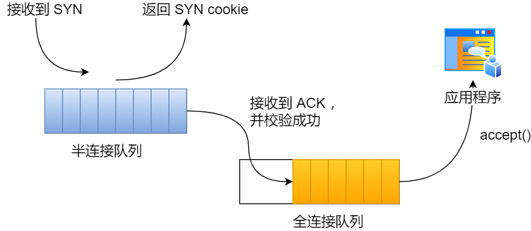

> 本文由 [简悦 SimpRead](http://ksria.com/simpread/) 转码， 原文地址 [blog.csdn.net](https://blog.csdn.net/wzngzaixiaomantou/article/details/126922022)

参考资料：

[《提升 TCP 性能的常用内核参数》](https://edgar615.github.io/tcp-arg.html "《提升TCP性能的常用内核参数》")

[《高性能 Linux：TCP/IP 内核参数调优之 Linux TCP 内核参数解析》](https://blog.csdn.net/jinguangliu/article/details/88256051 "《高性能Linux：TCP/IP内核参数调优之Linux TCP内核参数解析》")

[《从一次 Connection Reset 说起，TCP 半连接队列与全连接队列》](https://cjting.me/2019/08/28/tcp-queue/ "《从一次 Connection Reset 说起，TCP 半连接队列与全连接队列》")

[《TCP 的状态机》](https://pdai.tech/md/develop/protocol/dev-protocol-tcpip.html#tcp%E7%9A%84%E7%8A%B6%E6%80%81%E6%9C%BA "《TCP的状态机》")

[《从 TCP/IP 协议谈 Linux 内核参数优化》](https://www.51cto.com/article/608909.html "《从TCP/IP协议谈Linux内核参数优化》")

[《TCP 连接的建立与关闭》](https://liuyu121.github.io/post/tcp/ "《TCP 连接的建立与关闭》")

相关文章：

[《性能优化：Nginx 配置优化》](https://blog.csdn.net/wzngzaixiaomantou/article/details/124814074 "《性能优化：Nginx配置优化》")

[《性能优化：TCP 连接优化之四次挥手》](https://blog.csdn.net/wzngzaixiaomantou/article/details/126923199 "《性能优化：TCP连接优化之四次挥手》")

        写在开头：本文为学习后的总结，可能有不到位的地方，错误的地方，欢迎各位指正。

 **本文为 Nginx 性能优化的补充，主要针对 TCP 连接建立与释放过程中可调节的参数。**

**目录**

 [一、三次握手](#%C2%A0%20%C2%A0%20%C2%A0%20%C2%A0%201%E3%80%81%E4%B8%89%E6%AC%A1%E6%8F%A1%E6%89%8B)

 [1、三次握手的过程](#t0)

 [2、为什么要三次握手](#t1)

 [3、第 2 次握手传回了 ACK，为什么还要传回 SYN](#t2)

[二、客户端优化](#t3)

[三、服务端优化](#t4)

 [1、半连接队列优化](#t5)

 [1.1、调整 SYN 半连接队列大小](#t6)

 [1.2、SYN_RCV 状态的优化](#t7)

 [Syn Flood 攻击](#t8)

 [1.3、不使用 SYN 半连接队列建立连接](#t9)

 [2、全连接队列优化](#t10)

 [2.1、调整全连接队列的长度](#t11)

 [2.2、全连接队列满后返回 RST 包](#t12)

[总结](#t13)


## 一、三次握手

###         1、三次握手的过程

        TCP 是面向连接的、可靠的、双向传输的传输层通信协议，所以在传输数据之前需要经过三次握手才能建立连接。那么，三次握手的过程在一个 HTTP 请求的平均时间占比 10% 以上，在网络状态不佳、高并发或者遭遇 SYN 攻击等场景中，如果不能有效正确的调节三次握手中的参数，就会对性能产生很多的影响。


         建立一个 TCP 连接需要 “三次握手”，缺一不可 ：

*   **一次握手: 客户端发送带有 SYN（SEQ=x） 标志的数据包 -> 服务端，然后客户端进入 SYN_SEND 状态，等待服务器的确认；**
*   **二次握手: 服务端发送带有 SYN+ACK(SEQ=y,ACK=x+1) 标志的数据包 –> 客户端, 然后服务端进入 SYN_RCVD/SYN_RECV 状态**
*   **三次握手: 客户端发送带有带有 ACK(ACK=y+1) 标志的数据包 –> 服务端，然后客户端和服务器端都进入 ESTABLISHED 状态，完成 TCP 三次握手。**

###         2、为什么要三次握手

        三次握手的目的是建立可靠的通信信道，说到通讯，简单来说就是数据的发送与接收，而三次握手最主要的目的就是双方确认自己与对方的发送与接收是正常的。

*   **第一次握手 ：Client 什么都不能确认；Server 确认了对方发送正常，自己接收正常**
*   **第二次握手 ：Client 确认了：自己发送、接收正常，对方发送、接收正常；Server 确认了：对方发送正常，自己接收正常**
*   **第三次握手 ：Client 确认了：自己发送、接收正常，对方发送、接收正常；Server 确认了：自己发送、接收正常，对方发送、接收正常**

        三次握手就能确认双发收发功能都正常，缺一不可。

###         3、第 2 次握手传回了 ACK，为什么还要传回 SYN

        服务端传回发送端所发送的 ACK 是为了告诉客户端：“我接收到的信息确实就是你所发送的信号了”，这表明从客户端到服务端的通信是正常的。回传 SYN 则是为了建立并确认从服务端到客户端的通信。

二、客户端优化
-------

        三次握手建立连接的首要目的是同步序列号。只有同步了序列号才有可靠传输，TCP 许多特性都依赖于序列号实现，比如流量控制、丢包重传等，这也是三次握手中的报文称为 SYN 的原因，SYN 的全称就叫 Synchronize Sequence Numbers（同步序列号）。

        **客户端作为主动发起连接方，首先它将发送 SYN 包，于是客户端的连接就会处于 SYN_SENT 状态。客户端在等待服务端回复的 ACK 报文，正常情况下，服务器会在几毫秒内返回 SYN+ACK ，但如果客户端长时间没有收到 SYN+ACK 报文，则会重发 SYN 包，重发的次数由 tcp_syn_retries 参数控制，默认是 6 次**（有些文章写的是默认 5 次，这个我查阅了一下相对专业些的手册写的是默认 6 次[《tcp_syn_retries》](https://sysctl-explorer.net/net/ipv4/tcp_syn_retries/ "《tcp_syn_retries》")）：

```
# cat /proc/sys/net/ipv4/tcp_syn_retries
```

*   **第 1 次发送 SYN 报文后等待 1s（2 的 0 次幂），如果超时，则重试**
*   **第 2 次发送后等待 2s（2 的 1 次幂），如果超时，则重试**
*   **第 3 次发送后等待 4s（2 的 2 次幂），如果超时，则重试**
*   **第 4 次发送后等待 8s（2 的 3 次幂），如果超时，则重试**
*   **第 5 次发送后等待 16s（2 的 4 次幂），如果超时，则重试**
*   **第 6 次发送后等待 32s（2 的 5 次幂），如果超时，则重试**
*   **第 7 次发送后等待 64s（2 的 6 次幂），如果超时，则超时失败**

        第 7 次发送后（6 次重试）会继续等待 32 秒，如果仍然服务端没有回应 ACK，客户端就会终止三次握手。所以，总耗时是 127 秒，大约 2 分钟左右。

      **你可以根据网络的稳定性和目标服务器的繁忙程度修改 SYN 的重传次数，调整客户端的三次握手时间上限。比如内网中通讯时，就可以适当调低重试次数，尽快把错误暴露给应用程序。**

三、服务端优化
-------

###         1、半连接队列优化

        当服务端收到 SYN 包后，服务端会立马回复 SYN+ACK 包，表明确认收到了客户端的序列号，同时也把自己的序列号发给对方。

        此时，服务端出现了新连接，状态是 SYN_RCVD/SYN_RECV。在这个状态下，Linux 内核就会建立一个半连接队列来维护未完成的握手信息，当半连接队列溢出后，服务端就无法再建立新的连接。


        可以看出，队列的长度直接影响了能支持的并发量，加入一下子请求太多，就可能出现队列溢出的情况。我们可以通过 netstat -s 命令给出的统计结果中， 可以得到由于半连接队列已满，引发的失败次数：

        

         上面输出的数值是累计值，表示共有多少个 TCP 连接因为半连接队列溢出而被丢弃。隔几秒执行几次，如果有上升的趋势，说明当前存在半连接队列溢出的现象。

        我们首先想到的办法就是扩大队列长度。

####         1.1、调整 SYN 半连接队列大小

        半连接队列的长度由以下过程确定：

```
backlog = min(somaxconn, backlog)
nr_table_entries = backlog
nr_table_entries = min(backlog, sysctl_max_syn_backlog)
nr_table_entries = max(nr_table_entries, 8)
// roundup_pow_of_two: 将参数向上取整到最小的 2^n
// 注意这里存在一个 +1
nr_table_entries = roundup_pow_of_two(nr_table_entries + 1)
max_qlen_log = max(3, log2(nr_table_entries))
max_queue_length = 2^max_qlen_log
```

         有一点绕，不过运算都很简单，半连接队列的长度实际上由三个参数决定：

*   **listen 时传入的 backlog**
*   **/proc/sys/net/ipv4/tcp_max_syn_backlog，默认为 1024**
*   **/proc/sys/net/core/somaxconn，默认为 128**

        我们假设 listen 传入的 backlog = 511，其他配置都是默认值，我们来计算一下半连接队列的具体长度。

```
backlog = min(128, 511) = 128
nr_table_entries = 128
nr_table_entries = min(128, 1024) = 128
nr_table_entries = max(128, 8) = 128
nr_table_entries = roundup_pow_of_two(129) = 256
max_qlen_log = max(3, 8) = 8
max_queue_length = 2^8 = 256
```

        **最后算出，半连接队列的长度为 256。如果理解了半连接队列的长度决定机制，我们就可以理解为什么 Nginx, Redis 都把自己的 listen backlog 参数设置为 511 了，因为内核计算过程中有一个奇怪的 +1 操作**。

         **要想增大半连接队列，我们需要增大 linux 配置 tcp_max_syn_backlog、somaxconn 的值，同时修改 和 backlog。增大 backlog 的方式，每个 Web 服务都不同，比如 Nginx 增大 backlog 的方法如下（Tomcat、Nginx、Apache 常见的 Web 服务的 backlog 默认值都是 511。）**：


####         1.2、SYN_RCV 状态的优化

        如果服务器没有收到客户端返回的 ACK，就会重发 SYN+ACK 报文，同时一直处于 SYN_RCV 状态。

        **重传次数由 cp_synack_retries 控制， 默认是 5 次，与客户端重传 SYN 类似，它的重传会经历 1、2、4、8、16 秒，最后一次重传后会继续等待 32 秒，如果服务端仍然没有收到 ACK，才会关闭连接，故共需要等待 63 秒**。

        当网络繁忙、不稳定时，报文丢失就会变严重，此时应该调大重发次数。反之则可以调小重发次数。修改重发次数的方法是，调整 tcp_synack_retries 参数：

```
# cat /proc/sys/net/ipv4/tcp_synack_retries
```

         通过扩大半连接队列与减小失败重传次数，我们可以优化半连接队列的应对能力，但是面对突然的流量高峰，还是可能出现异常，这里就要介绍下著名的 Syn Flood 攻击。

####         Syn Flood 攻击

        攻击者首先伪造地址对服务器发起 SYN 请求 (我可以建立连接吗?)，服务器就会回应一个 ACK+SYN(可以 + 请确认)。而真实的 IP 会认为，我没有发送请求，不作回应。服务器没有收到回应，会重试 3-5 次并且等待一个 SYN Time(一般 30 秒 - 2 分钟) 后，丢弃这个连接。

        **如果攻击者大量发送这种伪造源地址的 SYN 请求，服务器端将会消耗非常多的资源来处理这种半连接，保存遍历会消耗非常多的 CPU 时间和内存，何况还要不断对这个列表中的 IP 进行 SYN+ACK 的重试。TCP 是可靠协议，这时就会重传报文，默认重试次数为 5 次，5 次共耗时 63s。**

 **一段假的 syn 报文，会占用 TCP 准备队列 63s 之久，在没有任何防护的情况下，每秒发送多个伪造 syn 包，就能撑爆半连接队列，从而使真正的连接无法建立，无法响应正常请求。 最后的结果是服务器无暇理睬正常的连接请求—拒绝服务。**

        为了应对这一问题，TCP 引入了新的功能，不通过半连接队列也能建立连接。

####         1.3、不使用 SYN 半连接队列建立连接

        TCP 第一次握手（收到 SYN 包）的 Linux 内核代码如下，其中缩减了大量的代码，只需要重点关注 TCP 半连接队列溢出的处理逻辑：

        从源码中，我可以得出共有三个条件因队列长度的关系而被丢弃的：


 **（1）如果半连接队列满了，并且没有开启 tcp_syncookies，则会丢弃；  
        （2）若全连接队列满了，且没有重传 SYN+ACK 包的连接请求多于 1 个，则会丢弃；  
        （3）如果没有开启 tcp_syncookies，并且 max_syn_backlog 减去 当前半连接队列长度小于 (max_syn_backlog>> 2)，则会丢弃；**

        **这里提到了一个新的参数 tcp_syncookies，开启 syncookies 功能就可以在不使用 SYN 半连接队列的情况下成功建立连接，在前面我们源码分析也可以看到这点，当开启了  syncookies 功能就不会丢弃连接。**

 **syncookies 是这么做的：服务器根据当前状态计算出一个值，放在己方发出的 SYN+ACK 报文中发出，当客户端返回 ACK 报文时，取出该值验证，如果合法，就认为连接建立成功，如下图所示。**



        将 **tcp_syncookies 修改为 1 可开启该功能：**


###         2、全连接队列优化

        服务器收到 ACK 后连接建立成功，此时，内核会把连接从半连接队列移除，然后创建新的完全的连接，并将其添加到 accept 队列，等待进程调用 accept 函数时把连接取出来。

        如果进程不能及时地调用 accept 函数，就会造成 accept 队列（也称全连接队列）溢出，最终导致建立好的 TCP 连接被丢弃。


查看服务端进程 accept 队列的长度

```
# ss -ltn
State              Recv-Q             Send-Q                           Local Address:Port                          Peer Address:Port             Process
LISTEN             0                  4096                           192.168.159.131:8302                               0.0.0.0:*
LISTEN             0                  4096                             127.0.0.53%lo:53                                 0.0.0.0:*
LISTEN             0                  128                                    0.0.0.0:22                                 0.0.0.0:*
LISTEN             0                  128                                  127.0.0.1:6010                               0.0.0.0:*
LISTEN             0                  4096                           192.168.159.131:8300                               0.0.0.0:*
```

*   **Recv-Q：当前 accept 队列的大小，也就是当前已完成三次握手并等待服务端 accept() 的 TCP 连接；**
*   **Send-Q：accept 队列最大长度，上面的输出结果说明监听 8088 端口的 TCP 服务，accept 队列的最大长度为 128；**

        当超过了 accept 连接队列，服务端则会丢掉后续进来的 TCP 连接，丢掉的 TCP 连接的个数会被统计起来，我们可以使用 netstat -s 命令来查看：


         上面看到的 41150 times ，表示 accept 队列溢出的次数，注意这个是累计值。可以隔几秒钟执行下，如果这个数字一直在增加的话，说明 accept 连接队列偶尔满了。

        如果持续不断地有连接因为 accept 队列溢出被丢弃，就应该调大 backlog 以及 somaxconn 参数。

####         2.1、调整全连接队列的长度

        全连接队列的大小比较简单，为 min(backlog, somaxconn)，backlog 与 somaxconn 的调整方式已经在上文调整半连接队列中介绍过了。

####         2.2、全连接队列满后返回 RST 包

        丢弃连接只是 Linux 的默认行为，我们还可以选择向客户端发送 RST 复位报文，告诉客户端连接已经建立失败。打开这一功能需要将 tcp_abort_on_overflow 参数设置为 1。

```
# cat /proc/sys/net/ipv4/tcp_abort_on_overflow
# echo 1 > /proc/sys/net/ipv4/tcp_abort_on_overflow
```

        tcp_abort_on_overflow 共有两个值分别是 0 和 1，其分别表示：

*   **0 ：如果 accept 队列满了，那么 server 扔掉 client 发过来的 ack ；**
*   **1 ：如果 accept 队列满了，server 发送一个 RST 包给 client，表示废掉这个握手过程和这个连接；**

        如果要想知道客户端连接不上服务端，是不是服务端 TCP 全连接队列满的原因，那么可以把 tcp_abort_on_overflow 设置为 1，这时如果在客户端异常中可以看到很多 connection reset by peer 的错误，那么就可以证明是由于服务端 TCP 全连接队列溢出的问题。

        **通常情况下，应当把 tcp_abort_on_overflow 设置为 0，因为这样更有利于应对突发流量。**

        举个例子，当 accept 队列满导致服务器丢掉了 ACK，与此同时，客户端的连接状态却是 ESTABLISHED，客户端进程就在建立好的连接上发送请求。只要服务器没有为请求回复 ACK，客户端的请求就会被多次重发。如果服务器上的进程只是短暂的繁忙造成 accept 队列满，那么当 accept 队列有空位时，再次接收到的请求报文由于含有 ACK，仍然会触发服务器端成功建立连接。


         **所以，tcp_abort_on_overflow 设为 0 可以提高连接建立的成功率，只有你非常肯定 TCP 全连接队列会长期溢出时，才能设置为 1 以尽快通知客户端。**

总结
--


