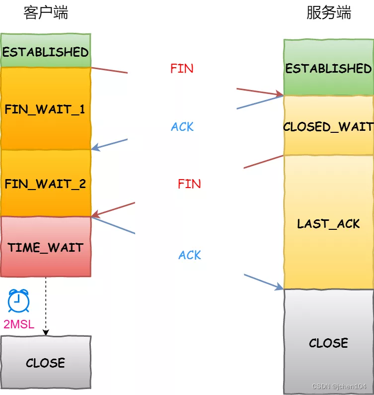
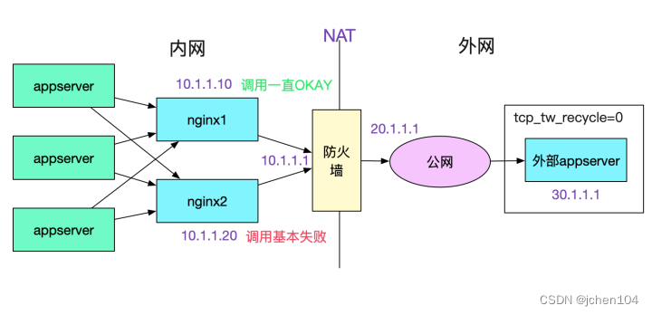
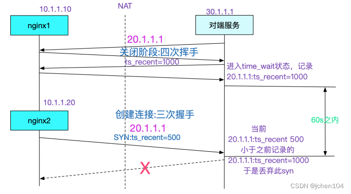
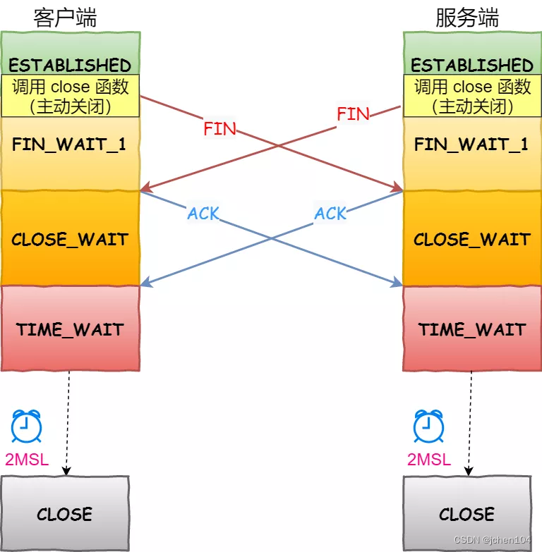
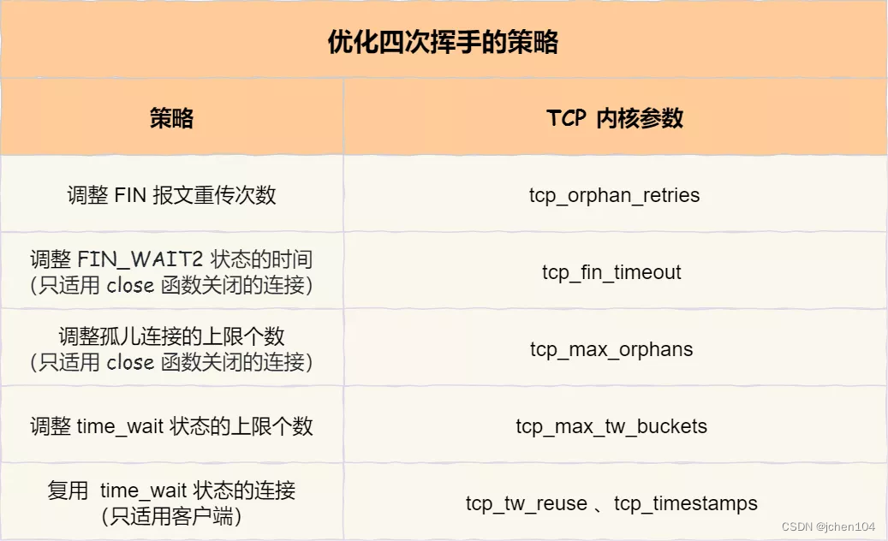

> 本文由 [简悦 SimpRead](http://ksria.com/simpread/) 转码， 原文地址 [blog.csdn.net](https://blog.csdn.net/wzngzaixiaomantou/article/details/126923199)

参考资料：

[《提升 TCP 性能的常用内核参数》](https://edgar615.github.io/tcp-arg.html "《提升TCP性能的常用内核参数》")

[《高性能 Linux：TCP/IP 内核参数调优之 Linux TCP 内核参数解析》](https://blog.csdn.net/jinguangliu/article/details/88256051 "《高性能Linux：TCP/IP内核参数调优之Linux TCP内核参数解析》")

[《从一次 Connection Reset 说起，TCP 半连接队列与全连接队列》](https://cjting.me/2019/08/28/tcp-queue/ "《从一次 Connection Reset 说起，TCP 半连接队列与全连接队列》")

[《TCP 的状态机》](https://pdai.tech/md/develop/protocol/dev-protocol-tcpip.html#tcp%E7%9A%84%E7%8A%B6%E6%80%81%E6%9C%BA "《TCP的状态机》")

[《从 TCP/IP 协议谈 Linux 内核参数优化》](https://www.51cto.com/article/608909.html "《从TCP/IP协议谈Linux内核参数优化》")

[《TCP 连接的建立与关闭》](https://liuyu121.github.io/post/tcp/ "《TCP 连接的建立与关闭》")

相关文章：

[《性能优化：Nginx 配置优化》](https://blog.csdn.net/wzngzaixiaomantou/article/details/124814074 "《性能优化：Nginx配置优化》")

[《性能优化：TCP 连接优化之三次握手》](https://blog.csdn.net/wzngzaixiaomantou/article/details/126922022 "《性能优化：TCP连接优化之三次握手》")

        写在开头：本文为学习后的总结，可能有不到位的地方，错误的地方，欢迎各位指正。

 **本文为 Nginx 性能优化的补充，主要针对 TCP 连接建立与释放过程中可调节的参数。**

**目录**

[一、四次挥手](#t0)

 [1、四次挥手的过程](#t1)

 [2、为什么要四次挥手](#t2)

 [3、能否把服务器发送的 ACK 和 FIN 合并起来，变成三次挥手](#t3)

[二、主动方的优化](#t4)

 [连接关闭的方式](#t5)

 [close 函数 和 shutdown 函数的区别](#t6)

 [FIN_WAIT1 状态的优化](#t7)

 [FIN_WAIT2 状态的优化](#t8)

 [TIME_WAIT 状态的优化](#t9)

 [tcp_max_tw_buckets](#t10)

 [tcp_tw_reuse](#t11)

 [tcp_tw_recycle](#t12)

[三、被动方的优化](#t13)

 [FIN 报文重传](#t14)

 [如果连接双方同时关闭连接，会怎么样](#t15)

[总结](#t16)

一、四次挥手
------

###         1、四次挥手的过程

        客户端和服务端双方都可以主动断开连接，通常先关闭连接的一方称为主动方，后关闭连接的一方称为被动方。



         断开一个 TCP 连接则需要 “四次挥手”，缺一不可 ：

*   **第一次挥手 ：客户端发送一个 FIN（SEQ=X） 标志的数据包 -> 服务端，用来关闭客户端到服务器的数据传送。然后，客户端进入 FIN-WAIT-1 状态。**
*   **第二次挥手 ：服务器收到这个 FIN（SEQ=X） 标志的数据包，它发送一个 ACK （SEQ=X+1）标志的数据包 -> 客户端 。然后，此时服务端进入 CLOSE-WAIT 状态，客户端进入 FIN-WAIT-2 状态。**
*   **第三次挥手 ：服务端关闭与客户端的连接并发送一个 FIN (SEQ=y) 标志的数据包 -> 客户端请求关闭连接，然后，服务端进入 LAST-ACK 状态。**
*   **第四次挥手 ：客户端发送 ACK (SEQ=y+1) 标志的数据包 -> 服务端并且进入 TIME-WAIT 状态，服务端在收到 ACK (SEQ=y+1) 标志的数据包后进入 CLOSE 状态。此时，如果客户端等待 2MSL 后依然没有收到回复，就证明服务端已正常关闭，随后，客户端也可以关闭连接了。**

        可以看到，四次挥手过程只涉及了两种报文，分别是 FIN 和 ACK：

        FIN 就是结束连接的意思，谁发出 FIN 报文，就表示它将不会再发送任何数据，关闭这一方向上的传输通道；  
        ACK 就是确认的意思，用来通知对方：你方的发送通道已经关闭；  
        这里一点需要注意是：主动关闭连接的，才有 TIME_WAIT 状态。

###         2、为什么要四次挥手

        TCP 是全双工通信，可以双向传输数据。任何一方都可以在数据传送结束后发出连接释放的通知，待对方确认后进入半关闭状态。当另一方也没有数据再发送的时候，则发出连接释放通知，对方确认后就完全关闭了 TCP 连接。

        举个例子：A 和 B 打电话，通话即将结束后。

*   **第一次挥手 ： A 说 “我没啥要说的了”**
*   **第二次挥手 ：B 回答 “我知道了”，但是 B 可能还会有要说的话，A 不能要求 B 跟着自己的节奏结束通话**
*   **第三次挥手 ：于是 B 可能又巴拉巴拉说了一通，最后 B 说 “我说完了”**
*   **第四次挥手 ：A 回答 “知道了”，这样通话才算结束。**

###         3、能否把服务器发送的 ACK 和 FIN 合并起来，变成三次挥手

        因为服务器收到客户端断开连接的请求时，可能还有一些数据没有发完，这时先回复 ACK，表示接收到了断开连接的请求。等到数据发完之后再发 FIN，断开服务器到客户端的数据传送。

二、主动方的优化
--------

###         连接关闭的方式

        注意：客户端与服务段都可以是主动方，因为主动方在断开连接期间会将资源持有一段时间，所以一般倾向于由客户端发起。

        关闭的连接的方式通常有两种，分别是 RST 报文关闭和 FIN 报文关闭。

*   **如果进程异常退出了，内核就会发送 RST 报文来关闭，它可以不走四次挥手流程，是一个暴力关闭连接的方式。**
*   **安全关闭连接的方式必须通过四次挥手，它由进程调用 close 和 shutdown 函数发起 FIN 报文。**

####         close 函数 和 shutdown 函数的区别

        **如果是调用 close 函数 主动关闭，处于 FIN_WAIT_1 或 FIN_WAIT_2 状态下的连接，则会成为 孤儿连接**，通过 netstat -anp | grep -i fin 查看，是看不到 进程 相关信息的。这时，即便对方继续传输数据，进程也接收不到了。也即，这个连接已经和之前所属的进程无关了。

        如果是调用 shutdown 函数 主动关闭，TCP 允许在半关闭的连接上长时间传输数据，处于 FIN_WAIT_1 或 FIN_WAIT_2 状态下的连接，不是孤儿连接，进程仍然可以继续接收数据。

###         FIN_WAIT1 状态的优化

        主动方发送 FIN 报文后，连接就处于 FIN_WAIT1 状态，正常情况下，如果能及时收到被动方的 ACK，则会很快变为 FIN_WAIT2 状态

        **但是当迟迟收不到对方返回的 ACK 时，连接就会一直处于 FIN_WAIT1 状态。此时，内核会定时重发 FIN 报文，其中重发次数由 tcp_orphan_retries 参数控制，默认值是 0，实际上当为 0 时，特指 8 次。**

```
# cat /proc/sys/net/ipv4/tcp_orphan_retries
```

        如果 FIN_WAIT1 状态连接很多，我们就需要考虑降低 tcp_orphan_retries 的值，当重传次数超过 tcp_orphan_retries 时，连接就会直接关闭掉。对于普遍正常情况时，调低 tcp_orphan_retries 就已经可以了。如果遇到恶意攻击，FIN 报文根本无法发送出去，这由 TCP 两个特性导致的：

*   **首先，TCP 必须保证报文是有序发送的，FIN 报文也不例外，当发送缓冲区还有数据没有发送时，FIN 报文也不能提前发送。**
*   **其次，TCP 有流量控制功能，当接收方接收窗口为 0 时，发送方就不能再发送数据。所以，当攻击者下载大文件时，就可以通过接收窗口设为 0 ，这就会使得 FIN 报文都无法发送出去，那么连接会一直处于 FIN_WAIT1 状态。**

        解决这种问题的方法，是调整 tcp_max_orphans 参数，它定义了孤儿连接的最大数量：

```
# cat /proc/sys/net/ipv4/tcp_max_orphans
```

       **当进程调用了 close 函数关闭连接，此时连接就会是孤儿连接，因为它无法在发送和接收数据。Linux 系统为了防止孤儿连接过多，导致系统资源长时间被占用，就提供了 tcp_max_orphans 参数。如果孤儿连接数量大于它，新增的孤儿连接将不再走四次挥手，而是直接发送 RST 复位报文强制关闭**。

###         FIN_WAIT2 状态的优化

        当主动方收到 ACK 报文后，会处于 FIN_WAIT2 状态，就表示主动方的发送通道已经关闭，接下来将等待对方发送 FIN 报文，关闭对方的发送通道。

        这时，如果连接是用 shutdown 函数关闭的，连接可以一直处于 FIN_WAIT2 状态，因为它可能还可以发送或接收数据。**但对于 close 函数关闭的孤儿连接，由于无法在发送和接收数据，所以这个状态不可以持续太久，而 tcp_fin_timeout 控制了这个状态下连接的持续时长，默认值是 60 秒：**

```
# cat /proc/sys/net/ipv4/tcp_fin_timeout
```

 **它意味着对于孤儿连接（调用 close 关闭的连接），如果在 60 秒后还没有收到 FIN 报文，连接就会直接关闭。**

###         TIME_WAIT 状态的优化

        TIME_WAIT 是主动方四次挥手的最后一个状态，也是最常遇见的状态。

        **当收到被动方发来的 FIN 报文后，主动方会立刻回复 ACK，表示确认对方的发送通道已经关闭，接着就处于 TIME_WAIT 状态。在 Linux 系统，TIME_WAIT 状态会持续 60 秒后才会进入关闭状态。**

        为什么 TIME_WAIT 状态要保持 60 秒呢？这与孤儿连接 FIN_WAIT2 状态默认保留 60 秒的原理是一样的，因为这两个状态都需要保持 2MSL 时长。MSL 全称是 Maximum Segment Lifetime，它定义了一个报文在网络中的最长生存时间（报文每经过一次路由器的转发，IP 头部的 TTL 字段就会减 1，减到 0 时报文就被丢弃，这就限制了报文的最长存活时间）。

        **为什么是 2 MSL 的时长呢？这其实是相当于至少允许报文丢失一次。比如，若 ACK 在一个 MSL 内丢失，这样被动方重发的 FIN 会在第 2 个 MSL 内到达，TIME_WAIT 状态的连接可以应对。因此，TIME_WAIT 和 FIN_WAIT2 状态的最大时长都是 2 MSL，由于在 Linux 系统中，MSL 的值固定为 30 秒，所以它们都是 60 秒。**

####         tcp_max_tw_buckets

        虽然 TIME_WAIT 状态有存在的必要，但它毕竟会消耗系统资源。如果发起连接一方的 TIME_WAIT 状态过多，占满了所有端口资源，则会导致无法创建新连接。

        因此，Linux 提供了 tcp_max_tw_buckets 参数，当 TIME_WAIT 的连接数量超过该参数时，新关闭的连接就不再经历 TIME_WAIT 而直接关闭：

```
# cat /proc/sys/net/ipv4/tcp_max_tw_buckets
```

        **当服务器的并发连接增多时，相应地，同时处于 TIME_WAIT 状态的连接数量也会变多，此时就应当调大 tcp_max_tw_buckets 参数，减少不同连接间数据错乱的概率。**

####         tcp_tw_reuse

        tcp_max_tw_buckets 也不是越大越好，毕竟内存和端口都是有限的。

        有一种方式可以在建立新连接时，复用处于 TIME_WAIT 状态的连接，那就是打开 tcp_tw_reuse 参数。但是需要注意，该参数是只用于客户端（建立连接的发起方），因为是在调用 connect() 时起作用的，而对于服务端（被动连接方）是没有用的。

```
# cat /proc/sys/net/ipv4/tcp_tw_reuse
```

        使用这个选项，还有一个前提，需要打开对 TCP 时间戳的支持（对方也要打开 ）：

```
# cat /proc/sys/net/ipv4/tcp_timestamps
```

        tcp_tw_reuse 是用在连接发起方的，而我们的服务端基本上是连接被动接收方。tcp_tw_reuse 是发起新连接的时候，可以复用超过限定时长的处于 TIME_WAIT 状态的连接，所以它没有减少我们服务端的压力。

####         tcp_tw_recycle

        **tcp_tw_recycle 表示是否开启 TCP 连接中 TIME-WAIT sockets 的快速回收，默认为 0，表示关闭，但是并不建议使用**。

        这个参数一般是用来抑制 TIME_WAIT 数量的, 但是它有一个副作用。即在 tcp_timestamps 开启 (Linux 默认开启)，tcp_tw_recycle 会经常导致下面这种现象。



        也即，如果你的 Server 开启了 tcp_tw_recycle，那么别人如果通过 NAT 之类的调用你的 Server 的话，NAT 后面的机器只有一台机器能正常工作，其它情况大概率失败。具体原因呢由下图所示:



        **在 tcp_tw_recycle=1 同时 tcp_timestamps(默认开启的情况下), 对同一个 IP 的连接会做这样的限制，也即之前后建立的连接的时间戳必须要大于之前建立连接的最后时间戳，但是经过 NAT 的一个 IP 后面是不同的机器，时间戳相差极大，就会导致内核直接丢弃时间戳较低的连接的现象。由于这个参数导致的问题，高版本内核已经去掉了这个参数。**  
         

三、被动方的优化
--------

###         FIN 报文重传

        处于 CLOSE_WAIT 状态时，调用了 close 函数，内核就会发出 FIN 报文关闭发送通道，同时连接进入 LAST_ACK 状态，等待主动方返回 ACK 来确认连接关闭。

        如果迟迟收不到这个 ACK，内核就会重发 FIN 报文，重发次数仍然由 tcp_orphan_retries 参数控制，这与主动方重发 FIN 报文的优化策略一致。

###         如果连接双方同时关闭连接，会怎么样

        由于 TCP 是双全工的协议，所以是会出现两方同时关闭连接的现象，也就是同时发送了 FIN 报文。此时，上面介绍的优化策略仍然适用。两方发送 FIN 报文时，都认为自己是主动方，所以都进入了 FIN_WAIT1 状态，FIN 报文的重发次数仍由 tcp_orphan_retries 参数控制。



         接下来，双方在等待 ACK 报文的过程中，都等来了 FIN 报文。这是一种新情况，所以连接会进入一种叫做 CLOSING 的新状态，它替代了 FIN_WAIT2 状态。接着，双方内核回复 ACK 确认对方发送通道的关闭后，进入 TIME_WAIT 状态，等待 2MSL 的时间后，连接自动关闭。

总结
--

