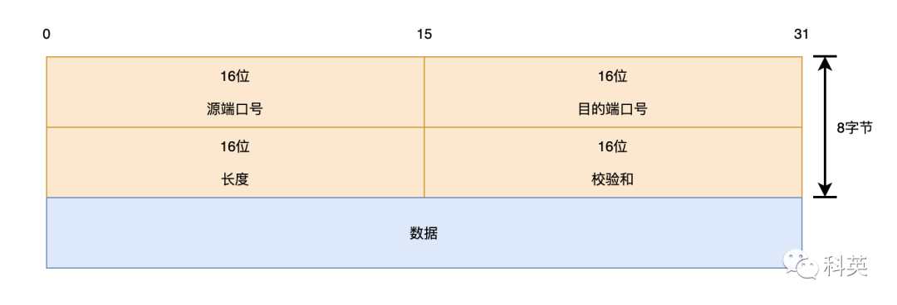
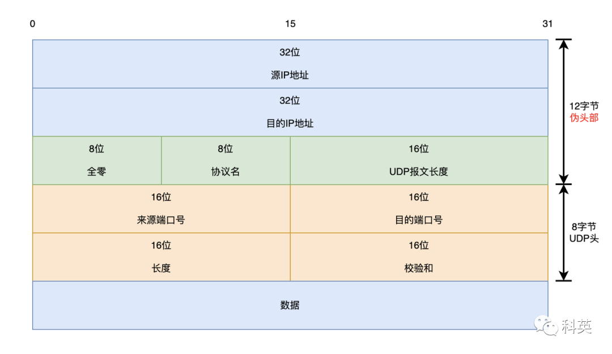
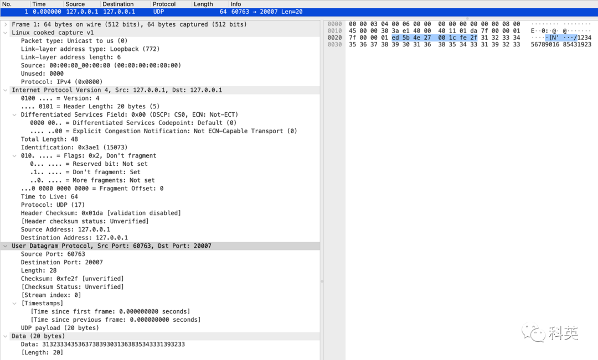
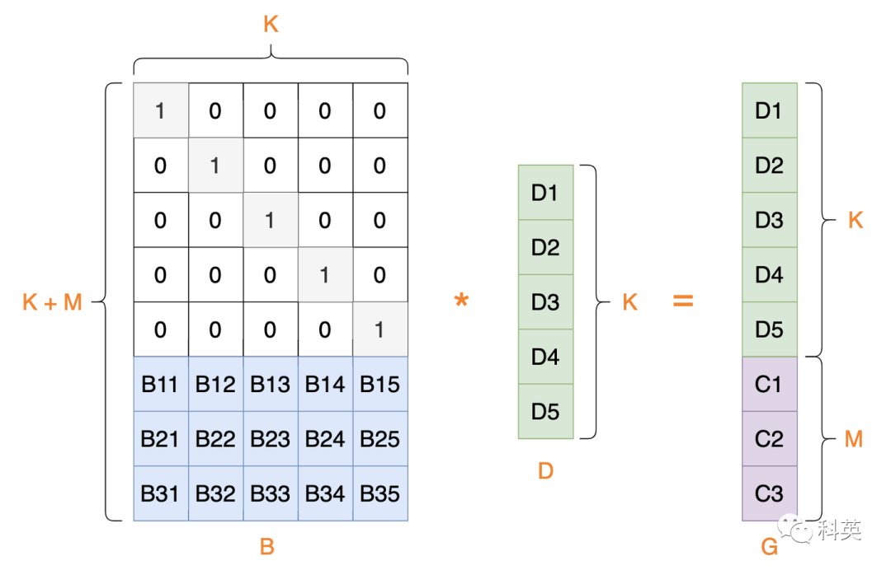
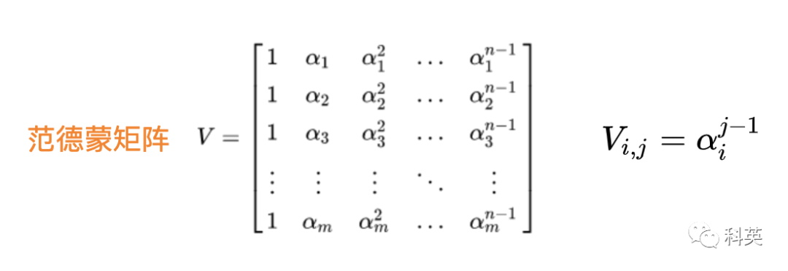
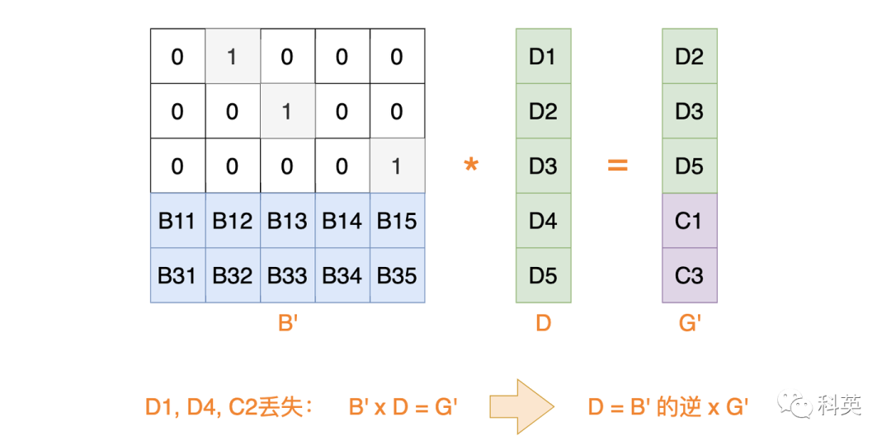

> 本文由 [简悦 SimpRead](http://ksria.com/simpread/) 转码， 原文地址 [mp.weixin.qq.com](https://mp.weixin.qq.com/s/wscSKmuO2CP0o-KEwgAARg)

用户数据报协议（英语：User Datagram Protocol，缩写：UDP；又称用户数据包协议）是一个简单的面向数据包的通信协议，位于 OSI 模型的传输层。该协议由 David P. Reed 在 1980 年设计且在 RFC 768 中被规范。

在 TCP/IP 模型中，UDP 为网络层以上和应用层以下提供了一个简单的接口。UDP 只提供数据的不可靠传递，它一旦把应用程序发给网络层的数据发送出去，就不保留数据备份（所以 UDP 有时候也被认为是不可靠的数据包协议）。UDP 在 IP 数据包的头部仅仅加入了端口、数据长度和数据校验字段。

UDP 适用于不需要或在程序中执行错误检查和纠正的应用，它避免了协议栈中此类处理的开销。对时间有较高要求的应用程序通常使用 UDP，因为丢弃数据包比等待或重传导致延迟更可取。

# 一、协议体


---------



图 1 UDP 协议头

下面详细介绍每个参数的含义：

> 比 TCP 少太多了 ^_^

*   源端口号（16 位）：发送端口；
    
*   目的端口号（16 位）：接收端口；
    
*   长度（16 位）：UDP 头长度 + 数据长度；
    
*   通过 IPv4 协议传输时，由于 IPv4 的头部信息要占用 20 字节，因此数据长度不可能超过 65507 字节（65,535 − 8 字节 UDP 头 − 20 字节 IP 头）。
    
*   在 IPv6 的 jumbogram 中，是有可能传输超过 65535 字节的 UDP 数据包的。依据 RFC 2675，如果这种情况发生，报文长度应被填写为 0。
    
*   校验和（16 位）：对整个 UDP 包，包括 UDP 头部和 UDP 数据的校验，该字段在 IPv4 中是可选的，在 IPv6 中 则是强制的。如果不使用校验和，该字段应被填充为全 0。
    

IPv4 在计算检验和时，临时把「伪头部」和 UDP 用户数据报连接在一起。伪头部包括了 IPv4 头部中的一些信息，但它并不是发送 IP 数据包时使用的 IP 数据包的头部，而只是一个用来计算校验和而已。



图 2 UDP 伪头部

Linux 中 UDP 头结构体定义如下：

```
truct udphdr {
    __be16  source;
    __be16  dest;
    __be16  len;
    __sum16 check;
};
```

抓包现场，如图 3



图 3 UDP 抓包

# 二、特点


--------

*   无连接：时间上，没有建立连接带来的时延；空间上，不维护连接状态，开销小。空间和时间上都具有优势；
    
*   头部开销小：TCP 头部 20 字节，UDP 头部仅 8 字节，常用于一次性传输比较少量数据的网络应用，如 DNS、SNMP 等；
    
*   无拥塞控制：应用层可以自己掌控发送的数据和发送的时间，某些实时应用要求以稳定的速度发送，能容忍一些数据的丢失，但是不能允许有较大的时延，比如视频通话、直播等；
    
*   尽最大努力交付，不保证可靠交付：所有维护传输可靠性的工作都需要应用层自己来完成。没有 TCP 的确认机制、重传机制。如果因为网络原因没有传送到对端，UDP 也不会给应用层返回错误信息；
    
*   面向报文：对应用层交下来的报文，添加首部后直接向下交付给 IP 层，既不合并，也不拆分，保留这些报文的边界，应用层交给 UDP 多长的报文，UDP 就照样发送，即一次发送一个报文。对 IP 层交上来 UDP 包，去除首部后就原封不动地交付给应用层。报文不可分割，是 UDP 处理的最小单位。正因如此，UDP 显得不够灵活，不能控制读写数据的次数和数量。比如我们要发送 100 个字节的报文，我们调用一次 sendto 函数就会发送 100 字节，对端也需要用 recvfrom 函数一次性接收 100 字节，不能使用循环每次获取 10 个字节，获取 10 次这样的做法；
    
*   支持一对一、一对多、多对一和多对多的交互通信。
    

# 三、应用


## 3.1 QUIC

QUIC（全称 Quick UDP Internet Connections，快速 UDP 互联网连接）是 Google 提出的一种基于 UDP 改进的通信协议，其目的是降低网络通信的延迟，提供更好的用户互动体验。QUIC 在应用层上，会自己实现快速连接建立、减少重传时延，自适应拥塞控制。

## 3.2 流媒体

现在直播比较火，直播协议多使用 RTMP，是基于 TCP 的，当网络不好的时候，TCP 协议会主动降低发送速度，这对本来当时就卡的看视频来讲是要命的，应该应用层马上重传，而不是主动让步。因而，很多直播应用，都基于 UDP 实现了自己的视频传输协议。


## 3.3 实时游戏

射击、MOBA 等竞技类游戏，对时延比较苛刻，卡个几百毫秒，技能放不出来就被别人打死了，对实时要求较为严格的情况下，采用自定义的可靠 UDP 协议，自定义重传策略，能够把丢包产生的延迟降到最低，尽量减少网络问题对游戏性造成的影响。

### 

## 3.4 IoT 物联网

一方面，物联网领域终端资源少，很可能只是个内存非常小的嵌入式系统，而维护 TCP 协议代价太大；另一方面，物联网对实时性要求也很高，而 TCP 还是因为上面的那些原因导致时延大。Google 旗下的 Nest 建立 Thread Group，推出了物联网通信协议 Thread，就是基于 UDP 协议的。

# 四、可靠性保障机制


-------------

前面提到 UDP 协议本身不提供数据一定到达的可靠性，那么如何在应用层自己来保障呢？目前主要有两种机制，一个是 ACK（消息确认），另一个是 FEC（前置纠错）。

### 

## 4.1 ACK

这个简单，类似 TCP 的消息确认和超时重传，当对端收到消息时返回对该消息的确认包，如果发送端等待确认包超时，就会重新发送该消息。

## 4.2 FEC

这个相对复杂，要实现 FEC 算法，没有数学功底实现起来还是比较难的，有门槛。简单的讲就是认为网络一定会丢吧的，悲观主义者，为了避免有效数据丢失，那我多发送些数据，本来发送 5 个有效包，我多发 3 个冗余包，这 8 个数据丢了任意 3 个我都可以把 5 个有效数据恢复回来。

如图 4，发送方生成冗余数据，绿色为有效数据，紫色为冗余数据，蓝色数据时范德蒙矩阵，如图 5。



图 4 发送方生成冗余数据



图 5 范德蒙矩阵生成算法

如图 6，接收方收到了 D2、D3 和 D5 以及 C1 和 C3，就可以通过矩阵运算把 D1 和 D4 恢复回来。



图 6 接收方恢复数据

# 五、参考


--------

用户数据报协议 zh.wikipedia.org/wiki/%E7%94%A8%E6%88%B7%E6%95%B0%E6%8D%AE%E6%8A%A5%E5%8D%8F%E8%AE%AE

网络协议 - UDP 协议详解 pdai.tech/md/develop/protocol/dev-protocol-udp.html

趣谈网络协议 - 极客时间 time.geekbang.org/column/intro/100007101?code=7gKtp1Bevx-jozIhDsBbEbYyR8V2P3JgMzL%2FwM47piY%3D&source=app_share


# 六、UDP设备发现


在Java中，UDP设备发现通常涉及到发送广播消息到本地网络中的所有设备，并等待它们的响应。这种方法常用于发现网络中的新设备或与特定设备通信。以下是一个基本的UDP设备发现示例，展示了如何在Java中实现此过程：

首先，创建一个发送广播消息的客户端：

```java
import java.net.DatagramPacket;
import java.net.DatagramSocket;
import java.net.InetAddress;

public class UDPDiscoveryClient {
    private static final String DISCOVERY_MESSAGE = "Device Discovery Request";
    private static final int DISCOVERY_PORT = 9999;

    public static void main(String[] args) {
        DatagramSocket socket = null;
        try {
            socket = new DatagramSocket();
            InetAddress broadcastAddress = InetAddress.getByName("255.255.255.255");
            byte[] buffer = DISCOVERY_MESSAGE.getBytes();
            DatagramPacket packet = new DatagramPacket(buffer, buffer.length, broadcastAddress, DISCOVERY_PORT);
            socket.send(packet);
            System.out.println("Discovery message sent.");
        } catch (Exception e) {
            e.printStackTrace();
        } finally {
            if (socket != null) {
                socket.close();
            }
        }
    }
}
```

接下来，创建一个接收广播消息的服务器：

```java
import java.net.DatagramPacket;
import java.net.DatagramSocket;
import java.net.InetAddress;

public class UDPDiscoveryServer {
    private static final int DISCOVERY_PORT = 9999;
    private static final int BUFFER_SIZE = 1024;

    public static void main(String[] args) {
        DatagramSocket socket = null;
        try {
            socket = new DatagramSocket(DISCOVERY_PORT);
            byte[] buffer = new byte[BUFFER_SIZE];
            DatagramPacket packet = new DatagramPacket(buffer, buffer.length);
            socket.receive(packet);
            String message = new String(packet.getData(), 0, packet.getLength());
            System.out.println("Received discovery message: " + message);
        } catch (Exception e) {
            e.printStackTrace();
        } finally {
            if (socket != null) {
                socket.close();
            }
        }
    }
}
```

运行这两个示例时，首先运行服务器，然后运行客户端。客户端将发送一个广播消息到本地网络的255.255.255.255地址（广播地址），而服务器将在本地网络上监听指定端口，接收并处理接收到的消息。你可以根据需要修改DISCOVERY_MESSAGE、DISCOVERY_PORT等变量来适应你的应用场景。