> 本文由 [简悦 SimpRead](http://ksria.com/simpread/) 转码， 原文地址 [juejin.cn](https://juejin.cn/post/7289748806438027264)

一、前言
----

最近公司准备做 **CA 证书** 相关的项目，借此机会打算重温了一下加密证书相关的基础知识，说不定以后自己当老板有用.....

二、前置知识
------

我们先从加密的历史说起。最早的加密是一种对称方式的加密。

#### 2.1、对称加密

> 对称加密：也就是加密和解密都用同一个密钥。

了解过近代战争的朋友可能知道，在一战和二战期间，敌我双方为了有效的信息传递，就大量采用这种方式进行加密。

具体形式就是情报发送方先编写一个密码本，然后悄悄的交给接收方。

这样下次发送情报的时候，发送方根据密码本上的规则进行加密，将得到密文后发送出去，接收方收到密文电报后再根据密码本进行解密。

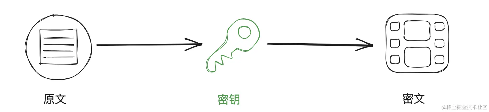

**这个密码本就是保证情报安全的加密手段，关乎战役的胜败，也叫做密钥。**

但是呢，你可能会发现这里面有一个显而易见的问题，就是这种加密算法的关键就在于这个密码本，也就是这个密钥。

不论是加密还是解密，都需要通过这个密钥。

特别是解密的人，如果我方有多人接收这条电报，那就需要人手分发一本密码本，这就大大增加了密码本泄漏的概率。

一旦密码本泄漏，加密的报文也就形同虚设了，谁都可以对密文进行破译。

另外，如何在第一次的时候安全的将密码本送到接收方手里，也是一个棘手的问题。

为了解决这些问题，就出现了一种新的加密方式：**非对称加密**。

#### 2.2、非对称加密

> 非对称加密：也就是加密和解密用的不是同一个密钥

非对称加密算法需要两个密钥：[公开密钥（`publickey`）](https://link.juejin.cn?target=https%3A%2F%2Fzh.wikipedia.org%2Fzh-hans%2F%25E5%2585%25AC%25E5%25BC%2580%25E5%25AF%2586%25E9%2592%25A5%25E5%258A%25A0%25E5%25AF%2586 "https://zh.wikipedia.org/zh-hans/%E5%85%AC%E5%BC%80%E5%AF%86%E9%92%A5%E5%8A%A0%E5%AF%86") 和 [私有密钥（`privatekey`）](https://link.juejin.cn?target=https%3A%2F%2Fzh.wikipedia.org%2Fzh-hans%2F%25E5%2585%25AC%25E5%25BC%2580%25E5%25AF%2586%25E9%2592%25A5%25E5%258A%25A0%25E5%25AF%2586 "https://zh.wikipedia.org/zh-hans/%E5%85%AC%E5%BC%80%E5%AF%86%E9%92%A5%E5%8A%A0%E5%AF%86")。

**公钥与私钥是一对，如果用公钥对数据进行加密，只有用对应的私钥才能解密。**

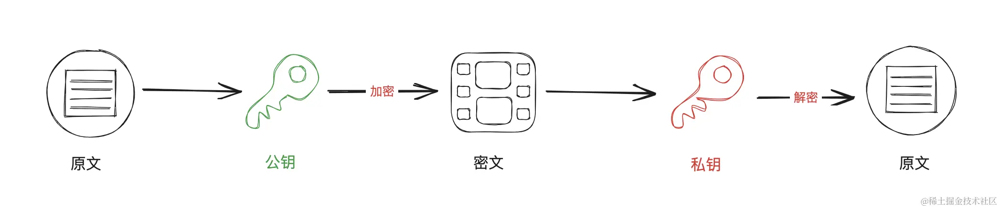

**同时呢，如果用私钥对数据进行加密，也只有用对应的公钥才能解密**（这里为了方便大家理解，其实描述不太严谨，下文会详细解释）。

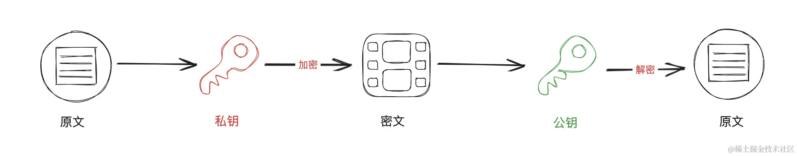

因为加密和解密使用的是两个不同的密钥，所以这种算法叫作**非对称加密算法**。

具体做法：

发送方先生成一对公钥和私钥，然后将公钥公开的发给所有人，而私钥只有自己才有。

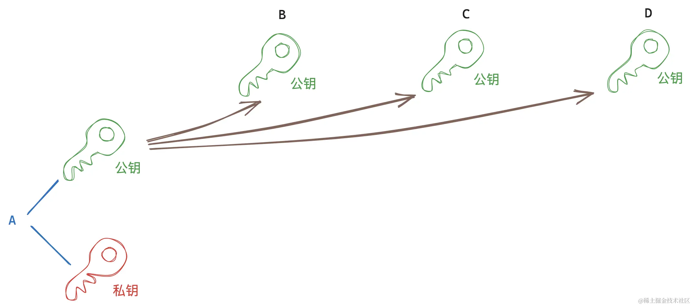

这样私钥始终由自己保管，也不需要做任何的传递。

在这套机制下，如果 `D` 想要给 `A` 发一个文件，那么他要做的就是用 `A` 给他的公钥对文件进行加密，然后将得到的密文发给 `A`，`A` 拿到后用自己的私钥进行解密。

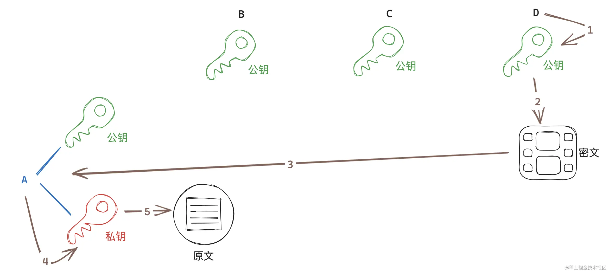

在这个过程中，因为只有 `A` 有对应的私钥，所以密文即使被别人截获也破解不了其中的信息。

由于非对称算法的这种特性，使得密钥泄露的概率也大大降低。

#### 2.3、签名

非对称加密除了在加密这种场景有应用以外，还有一种 **增信或者信任** 的场景，也就是 [签名](https://link.juejin.cn?target=https%3A%2F%2Fsupport.microsoft.com%2Fzh-cn%2Foffice%2F%25E6%2595%25B0%25E5%25AD%2597%25E7%25AD%25BE%25E5%2590%258D%25E5%2592%258C%25E8%25AF%2581%25E4%25B9%25A6-8186cd15-e7ac-4a16-8597-22bd163e8e96 "https://support.microsoft.com/zh-cn/office/%E6%95%B0%E5%AD%97%E7%AD%BE%E5%90%8D%E5%92%8C%E8%AF%81%E4%B9%A6-8186cd15-e7ac-4a16-8597-22bd163e8e96")。

举个例子：如果 `A` 想要发送一个文件给 `D`，`D` 接收到后发现文件有问题，询问是谁发给他的，此时 `A` 说不是他发的。那此时 `D` 要采取什么样的措施去证明这个文件就是 `A` 发的呢？

在这个场景下，就要求 `A` 在发送文件之前**先用 A 自己的私钥给文件进行加密**，然后将得到的密文发给 `D`，`D` 收到后用公钥进行解密，如果能解密成功，就说明是 `A` 发的。

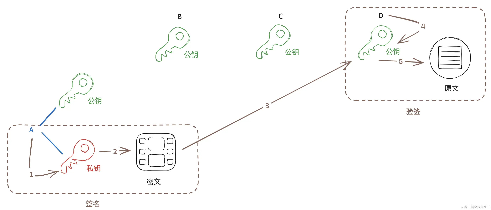

当然，既然大家都有公钥可以解密，所以严格意义上用私钥进行加密这种方式不是一个加密的过程。因此叫做 **`签名`**。

在这个过程中，`A` 实际上用他的私钥给这个文件做了签名，然后 `D` 再用 `A` 的公钥去验签这个文件，最后证明这个文件就是 `A` 发送的，这就是签名的过程。

因此签名也起到了**防抵赖**、**鉴权**这种作用。

简单小结一下：

*   **公钥加密，私钥解密；**
*   **私钥签名，公钥验签。**

三、HTTPS 的加密流程
-------------

介绍完上面的前置知识后，我们回到客户端和服务端的通信问题。

### 3.1、使用 HTTP 协议

如果你在公司内网里做开发，并且写的代码也只对内网提供服务。那么大概率你的服务是用的 [HTTP 协议](https://link.juejin.cn?target=https%3A%2F%2Fdeveloper.mozilla.org%2Fzh-CN%2Fdocs%2FWeb%2FHTTP "https://developer.mozilla.org/zh-CN/docs/Web/HTTP")。

但如果哪天你想让外网的朋友们也体验下你的服务功能，那就需要将服务暴露到外网，而这时候如果还是用的 `HTTP协议`，那信息的收发就会是明文。

只要有心人士在通讯链路中任意一个路由器抓个包，就能看到你 `HTTP` 包里的内容，因此很不安全。 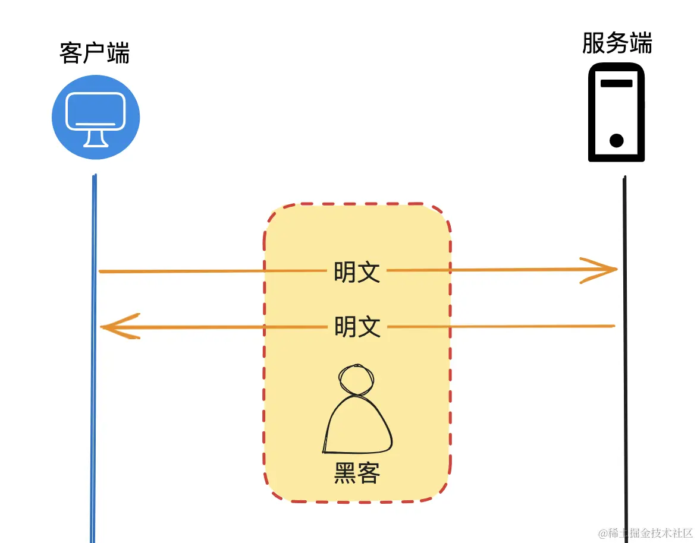

既然明文传输不行，那我们就先尝试自己来设计一下如何进行信息加密。

### 3.2、尝试使用对称加密

先尝试使用对称加密看看可不可行。

在前置知识中我们提到过，`对称加密其实就是加密和解密都用同一个密钥`，那么在双方建立连接时，就需要先将这个密钥传给对方，然后后面的信息都用这个密钥来进行加密传输。 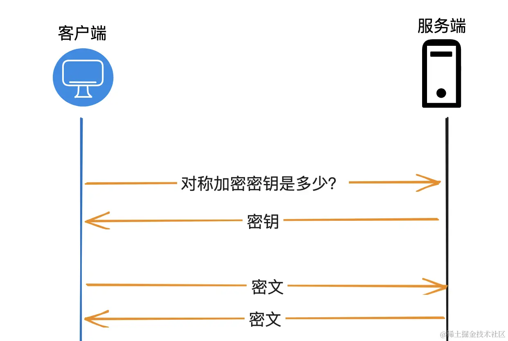

对于黑客来说同样有办法，黑客**只需要找到双方建立连接的第一次通讯记录**就可以轻松找到密钥了，单纯使用对称加密同样不可取。

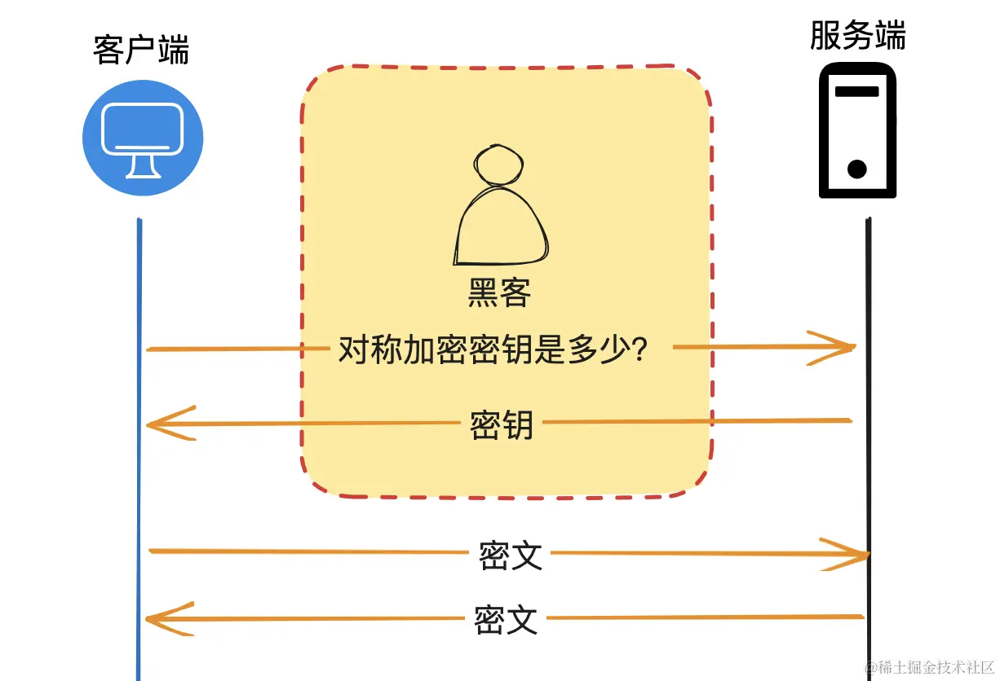

### 3.3、尝试使用非对称加密

接下来我们再来看看用非对称加密会怎么样。

首先，服务端有一对公钥和私钥，客户端会先向服务端获取公钥，后续则用公钥对数据加密后传输给服务端，服务端接收后用自己的私钥进行解密。

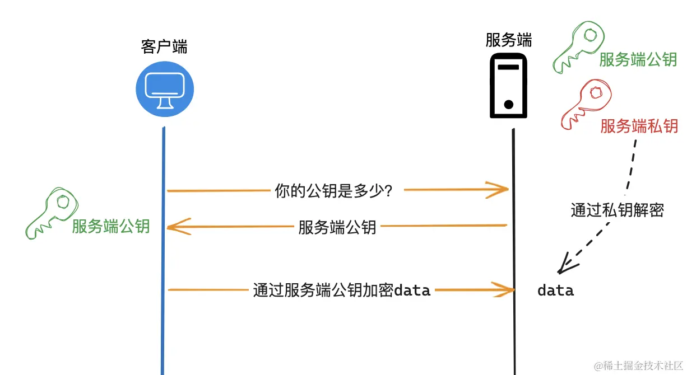

> 但是这里有个问题：服务端怎么样向客户端传输数据呢？

如果服务端采用公钥对数据加密传给客户端，客户端没有对应的私钥根本解不开数据。

如果服务端使用私钥对数据进行加密传给客户端，客户端确实能解开，但是任何人都有公钥都可以解开，信息安全性同样存在问题。

这个时候你可能会想，为什么客户端不也生成一对公钥和私钥，然后服务端和客户端相互交换公钥，后面的数据传输都用对方的公钥进行加密数据，这样不就可以了吗？

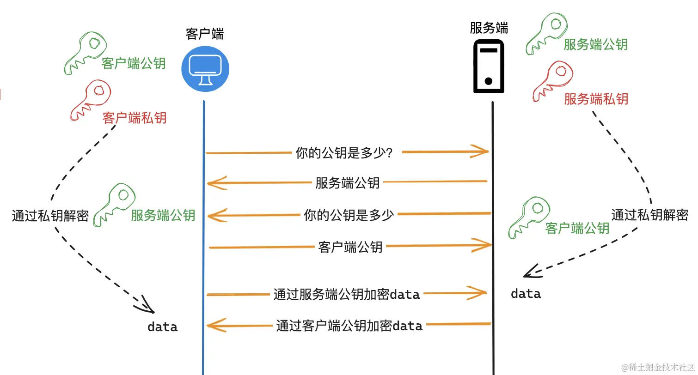

不得不承认，你小子能想到这一招确实是个天才。

但非对称加密解密有很严重的性能问题，跟对称加密相比甚至相差好几个数量级。

那到底该怎么办呢？

### 3.4、对称加密 + 非对称加密

这个时候有一群聪明的数学家从对称加密和非对称加密中获取了一些灵感。

首先我们来看看对称加密，**它的缺点主要是第一次传输过程中容易暴露**。

再来看看非对称加密，**它的缺点主要是解析速度比较慢**，所以说两者其实都有一定的优势。

那我们能不能将他们结合起来呢？

这些数学家告诉我们，可以先用非对称加密的方式建立连接，然后协商出对称加密的密钥，后面都使用这个对称加密的密钥来进行数据传输，大致流程：

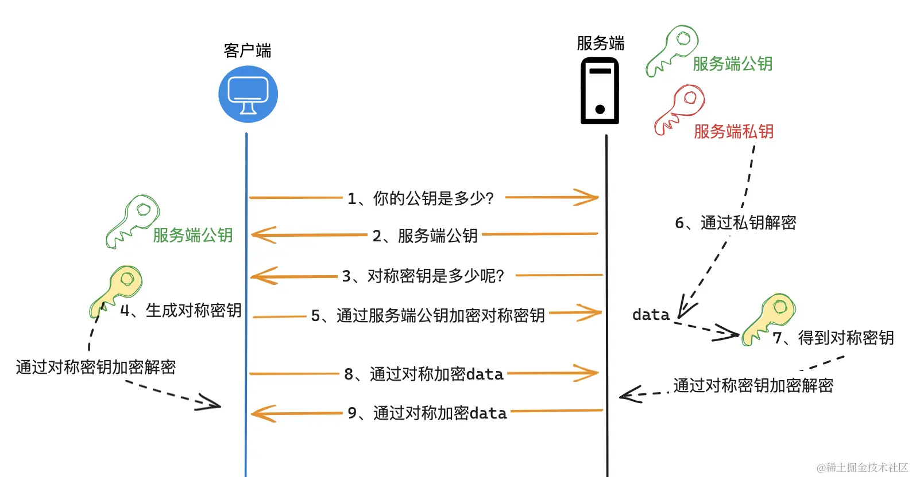

目前这种方式看起来已经是非常安全了，好像是无懈可击了，但真的没问题了吗？

### 3.5、中间人攻击

继续刚才的例子：假如此时有一个很狡猾的黑客，它偷偷的拦截了客户端和服务端之间的通信。

黑客也有自己的公钥和私钥，当客户端向服务端请求公钥时，其实请求的是黑客的公钥，后面客户端向服务端发送数据时，黑客通过自己私钥解密后再转发给真正的服务端，相当于做一次转发。

`也就是跟客户端通信时，黑客伪装成服务端。在和服务端通信时，黑客伪装为客户端。`

妥妥的两头骗，是一名合格的时间管理大师。

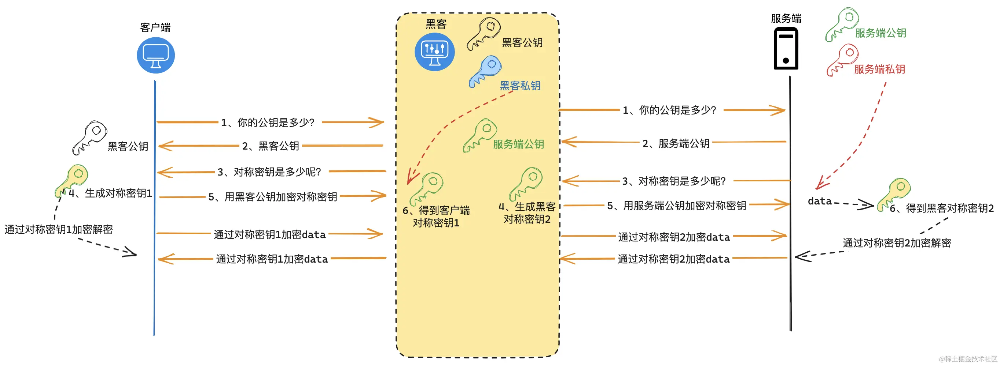

就这样，黑客在其中当着中间人的角色，客户端和服务端之间所有的信息传输都暴露在黑客的监控之下，当有一天黑客收集到你足够多的信息之后，可以随意的修改你的转账信息，将你钱包掏空，想想都恐怖......

**因此，上面这种对称加密结合非对称加密的这种方式，看上去也不是那么无懈可击，它面临最重要的一个问题就是中间人问题**。

那该如何解决呢？

### 3.6、引入 CA 机构

仔细分析一下我们发现，其实客户端在第一次跟服务端进行交流的时候就出现问题了。黑客将服务端的公钥给调包了，`也就是说客户端并不知道从服务端那里获取的公钥到底可不可靠`。

解决方案也不难，只需要引入一个权威的认证中心就好，它就是 [CA 机构](https://link.juejin.cn?target=https%3A%2F%2Fzh.wikipedia.org%2Fzh-hans%2F%25E8%25AF%2581%25E4%25B9%25A6%25E9%25A2%2581%25E5%258F%2591%25E6%259C%25BA%25E6%259E%2584 "https://zh.wikipedia.org/zh-hans/%E8%AF%81%E4%B9%A6%E9%A2%81%E5%8F%91%E6%9C%BA%E6%9E%84")。

因为最核心的原因是客户端不知道公钥可不可信，所以我们只相信经过这个权威机构认证过的公钥，经过认证的我们就相信，没有认证过的就当它是黑客的。

我们再来看看这个过程是如何运作的：

首先服务端将自己的公钥交给 `CA机构` 去认证，`CA机构` 也有自己的公钥和私钥，此时 `CA机构` 对服务端公钥用自己的 `CA机构` 私钥进行签名，以此来证明服务端的公钥是经过自己验证过的。

通过这种方式就确保了这个证书是经过权威机构认证过的。

`CA机构` 会把这种签名过的数据发布到网上，这种数据我们就称它为 [证书](https://link.juejin.cn?target=https%3A%2F%2Fbaike.baidu.com%2Fitem%2FSSL%25E8%25AF%2581%25E4%25B9%25A6%2F5201468 "https://baike.baidu.com/item/SSL%E8%AF%81%E4%B9%A6/5201468")。

然后我们可以通过一些官方的渠道去下载到这些证书，这里面就有已经被授权过的服务器公钥。

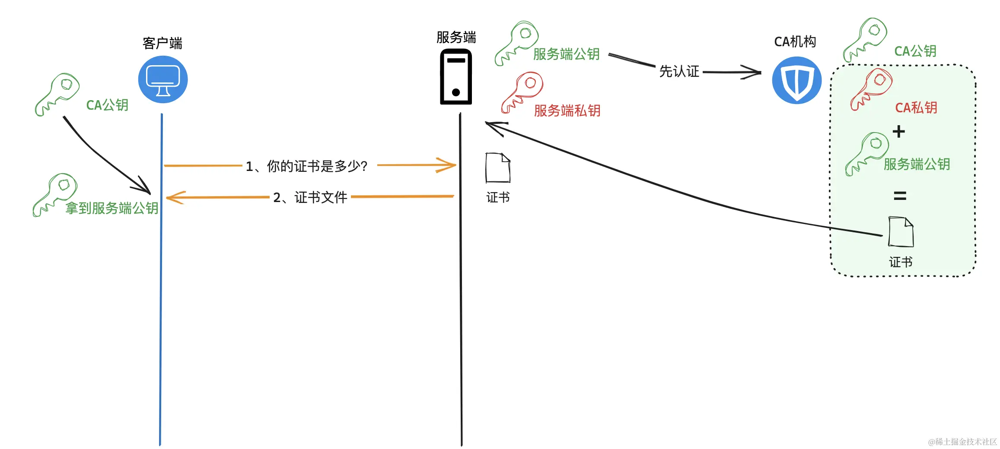

**这样客户端在向服务端通信时，不再直接请求服务端公钥了，而是请求这个证书。**

拿到这个证书之后，我们还需要用 `CA机构` 的公钥进行验签取出服务端公钥。

由于去 `CA机构` 拿这个公钥的过程也有可能会被调包，所以我们直接写死在用户的操作系统里了。

> 如果你仔细思考的话，会发现一个问题：假如操作系统中的 `CA机构` 的公钥被人调包了怎么办？
> 
> 一般这个调包是很难做的，`CA机构` 一般都是经过严格审核和认证的，是很大的第三方独立机构。
> 
> 大部分 `CA机构` 的公钥会作为 **证书** 或者 **根证书** 内置在操作系统中，只有极高权限的系统级或管理员级别的用户才能调整操作系统中的证书。
> 
> 这些被写入操作系统中的证书，处理着我们计算机与加密信任有关的方方面面，如果这里都不能信任的话，那整个加密体系将彻底坍塌。

这样拿到可信的服务端公钥后就可以像之前一样通信了。

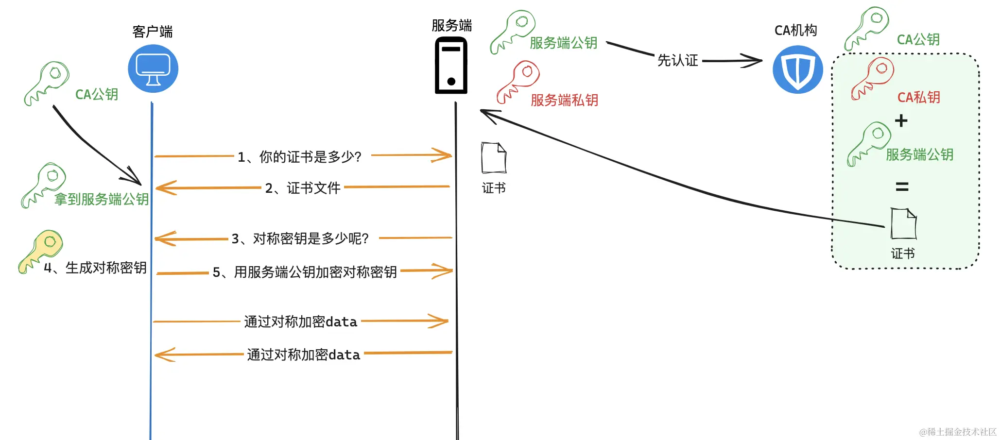

这个时候我们再来看一下，如果此时还有一个中间人会怎么样？

先看看假如黑客从第一步获取证书时入手：在第一次客户端向服务端请求证书时，黑客将自己伪造的证书传给了我们：

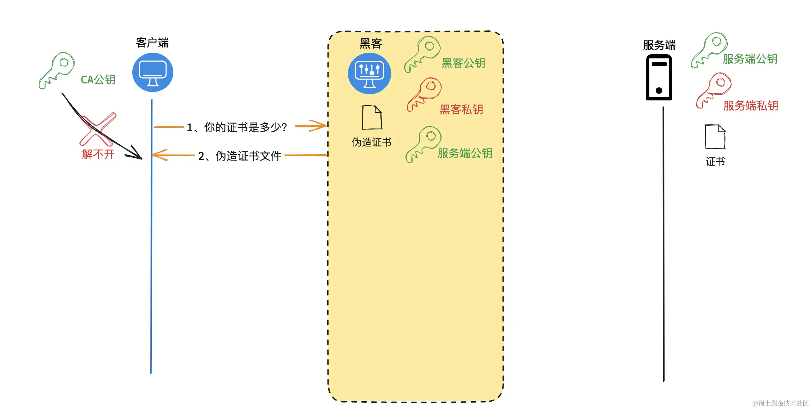

由于我们客户端并没有黑客的公钥，因此证书验证这里都过不了。

再看看假如黑客从后面环节入手会怎么样：

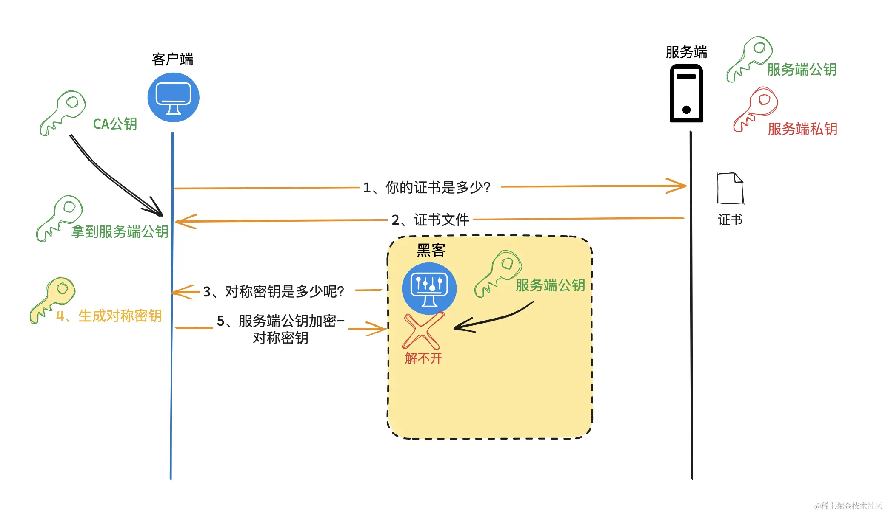

由于黑客并没有服务端私钥，因此也拿不到客户端发送的对称密钥。

> 这里还有个问题：我们通过 CA 公钥 对证书验签得到的服务器公钥，只能证明该公钥是被 `CA机构` 认证过的，但并不能证明该公钥是来自于目标服务器的，因为调包的公钥也可以去 `CA机构` 做认证。

要验证公钥来源，我们还需要证书里面的其他信息辅助验证。

比如域名，客户端会用当前浏览器的域名来匹配证书里的域名。如果相同，则说明证书里的公钥真的来自服务器，没有被调包过。

`CA机构` 在对服务器做认证的时候，除了会核实服务器的域名，还会验证证书的完整性等。只要证书被调了包或被修改，认证是一定通过不了的。

`但这里必须有个前提条件，那就是证书颁发机构必须具有权威性，也就是合法的。`

如果证书颁发机构是假的，那么颁发的证书的也是假的，证书里的域名就可以被伪造，让其等于服务器的域名，那么客户端就会误以为证书来自服务器。

那么证书颁发机构如何自证权威性呢？

### 3.7、CA 机构权威性

因为证书颁发机构也能造假，要验证其权威性，我们先得有一个最权威的颁发机构。

该机构是全球公认的，每个客户端都必须信任它，它的证书是内置在操作系统里面的，不需要到网上下载，否则就会陷入证书循环验证问题，我们叫它`根证书颁发机构`，该机构可以给其他机构授予证书颁发权利。

所谓颁发权利，就是用该证书颁发机构的私钥去加密被授予机构的公钥，`如果一个证书颁发机构是被信任的，那么它授予的其他机构同样也是被信任的，这样就形成了证书颁发机构授予链条`。

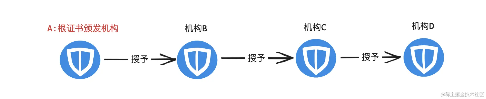

比如 `A` 授予 `B` 权利，`B` 授予 `C` 权利，`C` 授予 `D` 权利，如果 `A` 是根证书颁发机构，那么 `B / C / D` 都是被信任的，或者说是具有权威性的，这样就可以验证证书颁发机构的权威性。

到目前为止，关于客户端和服务端之间的通信问题都解决了，我们来整理一下：

1.  首先客户端向服务端发起请求，目的是为了下载一个文件。
2.  当服务器收到请求后，服务器会先发送证书。该证书由某个证书颁发机构颁发，同时发送证书颁发机构的授予链条。
3.  客户端收到证书和授予链条后，首先通过授予链条验证证书颁发机构的权威性。如果授予链条的顶端的确是根证书颁发机构，那么当前证书颁发机构合法。
4.  接着客户端用该证书颁发机构的公钥去解密证书，获得服务器公钥和域名。然后用浏览器中的域名去匹配证书中的域名，以验证其来源，如果匹配成功，则说明证书真的来自服务器。
5.  接下来客户端生成对称密钥，用服务器的公钥进行加密后传输给服务端。
6.  服务端收到后用自己的私钥解密获取对称密钥。
7.  后续则都使用对称密钥进行通信。

**以上就是 HTTPS 大致的加密流程，利用了对称加密 + 非对称加密 + CA 机构三种技术保证了传输过程中的安全性。**

上面讲的稍微粗糙了些，主要是为了先让大家从宏观上理解这种方式的可行性，接下来我们详细看看协商的细节到底是怎么样的。

四、HTTPS 流程细节
------------

接下来我们看看官方具体是如何解决安全通信问题的。

### 4.1、SSL/TLS 安全层

为了让明文变成密文，我们需要在 `HTTP` 层之上再加一层 `TLS` 层，目的就是为了做个加密。这就成了我们常说的 `HTTPS`。

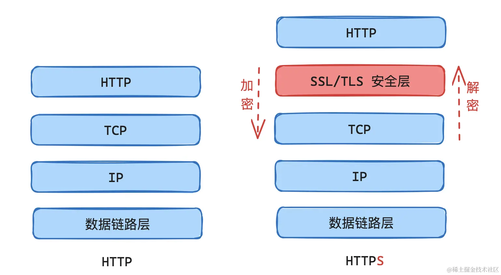

其中 `SSL/TSL` 安全层又大致分为两个阶段：**TSL 四次握手 + 加密通信**。

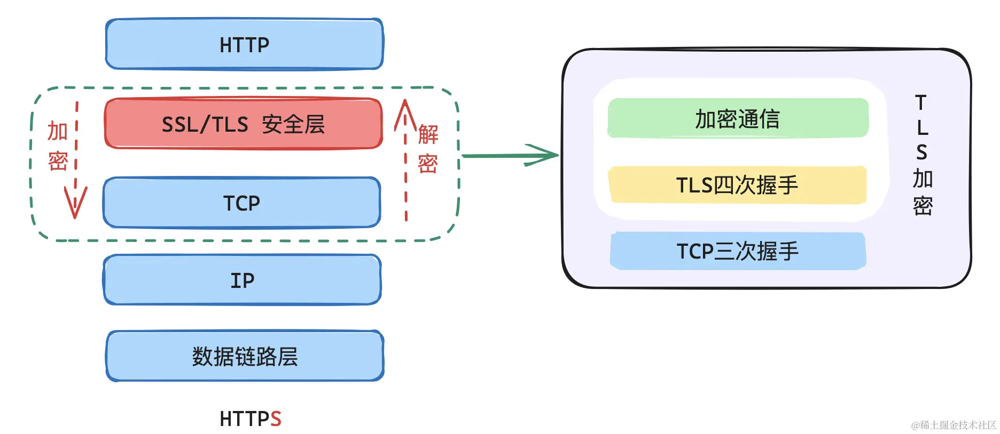

_注：TLS 是 SSL 的升级版本，两者做的是同一个事情，后文均以 TLS 为例。_

[TLS 协议](https://link.juejin.cn?target=https%3A%2F%2Fzh.wikipedia.org%2Fzh-hans%2F%25E5%2582%25B3%25E8%25BC%25B8%25E5%25B1%25A4%25E5%25AE%2589%25E5%2585%25A8%25E6%2580%25A7%25E5%258D%2594%25E5%25AE%259A "https://zh.wikipedia.org/zh-hans/%E5%82%B3%E8%BC%B8%E5%B1%A4%E5%AE%89%E5%85%A8%E6%80%A7%E5%8D%94%E5%AE%9A") 其实分为 1.2 和 1.3 版本，目前主流的还是 1.2 版本，我们以它为例来看下 `HTTPS` 的连接是怎么建立的。

### 4.2、第一次握手

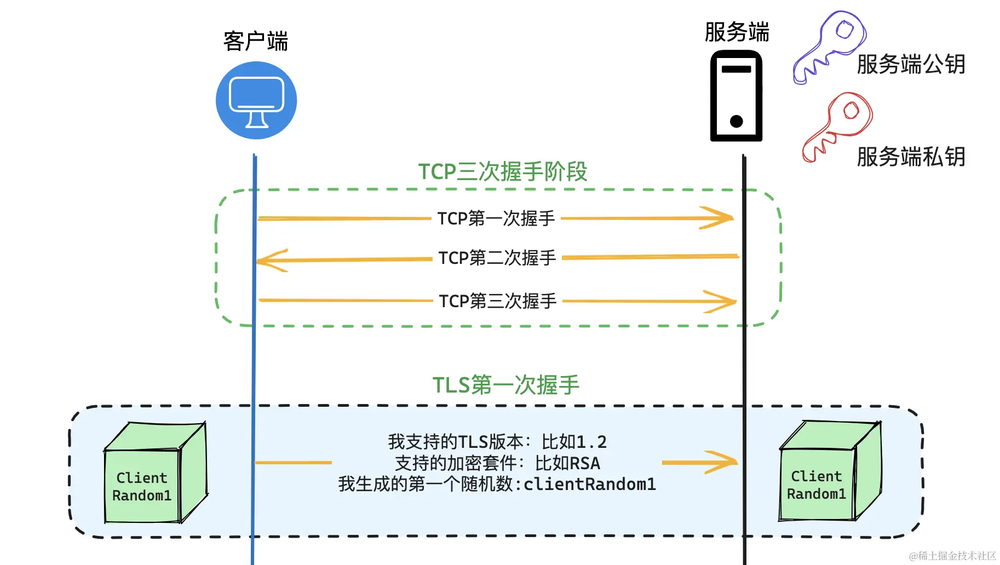

客户端告诉服务端，它支持什么样的加密协议版本，比如 `TLS1.2`，使用什么样的加密套件，比如最常见的`RSA`，同时还会生成给出一个**客户端随机数`ClientRandom1`**。

### 4.3、第二次握手

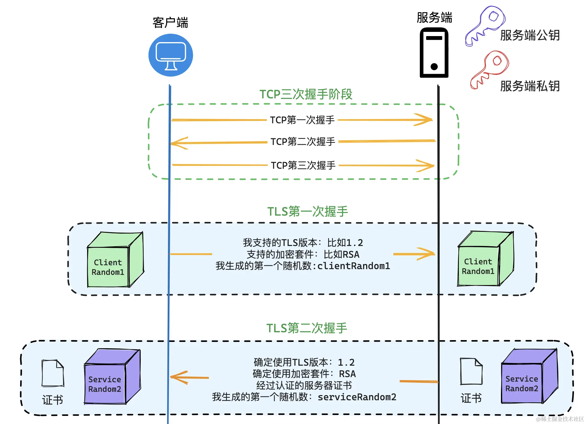

服务端收到客户端发过来的消息后，也会生成一个**服务器随机数`ServiceRandom2`**。

并和客户端确认使用的加密协议版本和加密套件，以及 **服务器随机数`ServiceRandom2`** + 服务器证书。

此时客户端和服务端都有两个随机数 `ClientRandom1` 和 `ServiceRandom2`。

### 4.4、第三次握手

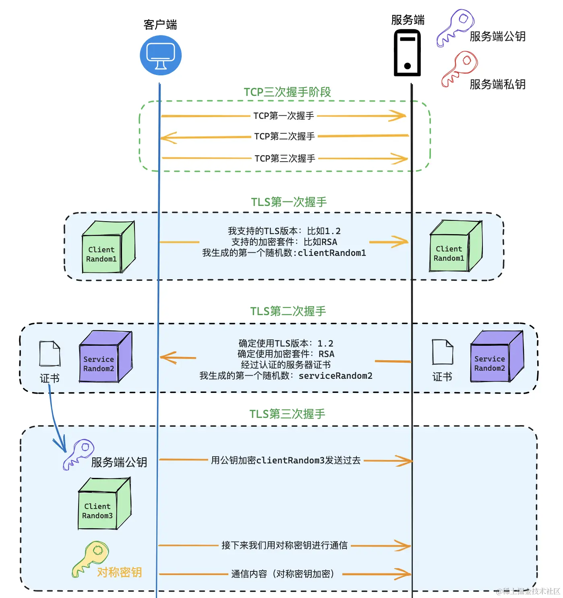

*   此时客户端再生成一个**客户端随机数`ClientRandom3`**。从第二次握手的**服务器证书**里取出服务器公钥，用服务器公钥加密 `ClientRandom3`，发给服务器。
*   此时客户端这边**已经拥有三个随机数**：**客户端随机数`ClientRandom1`**、**服务器随机数`ServiceRandom2`** 和 **客户端随机数`ClientRandom3`**，用这三个随机数进行计算得到一个 “**会话密钥**”。此时客户端通知服务端，后面会用这个会话密钥进行对称加密通信。
*   客户端会把迄今为止的通信数据内容生成一个摘要，用 “**会话密钥**” 加密一下，发给服务器做校验，此时客户端这边的握手流程就结束了，因此这也叫 **Finished 报文**。

### 4.4、第四次握手

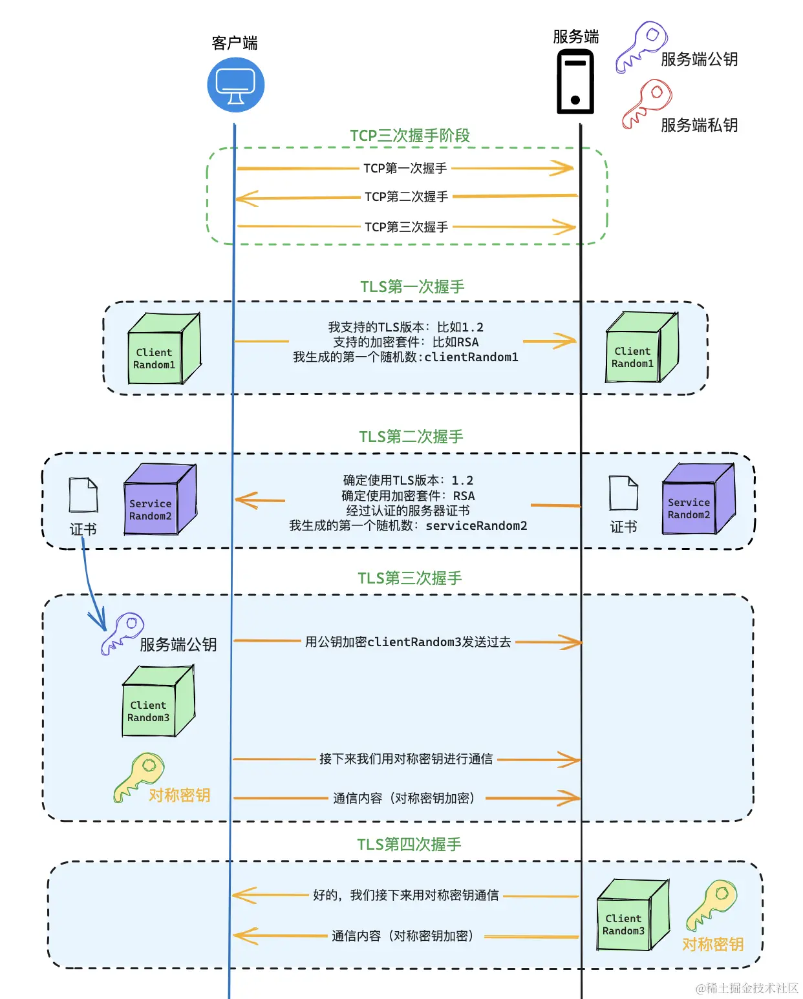

*   服务端此时拿到客户端传来的 **客户端随机数`ClientRandom3`**（虽然被服务器公钥加密过，但服务器有私钥，能解密获得原文），集齐三个随机数，跟客户端一样，用这三个随机数通过同样的算法获得一个 “**会话密钥**”。此时服务器告诉客户端，后面会用这个 “**会话密钥**” 进行加密通信。
*   跟客户端的操作一样，将迄今为止的通信数据内容生成一个摘要，用 “**会话密钥**” 加密一下，发给客户端做校验。到这里，服务端的握手流程也结束了，因此这也叫 **Finished 报文**。

### 4.5、完整流程

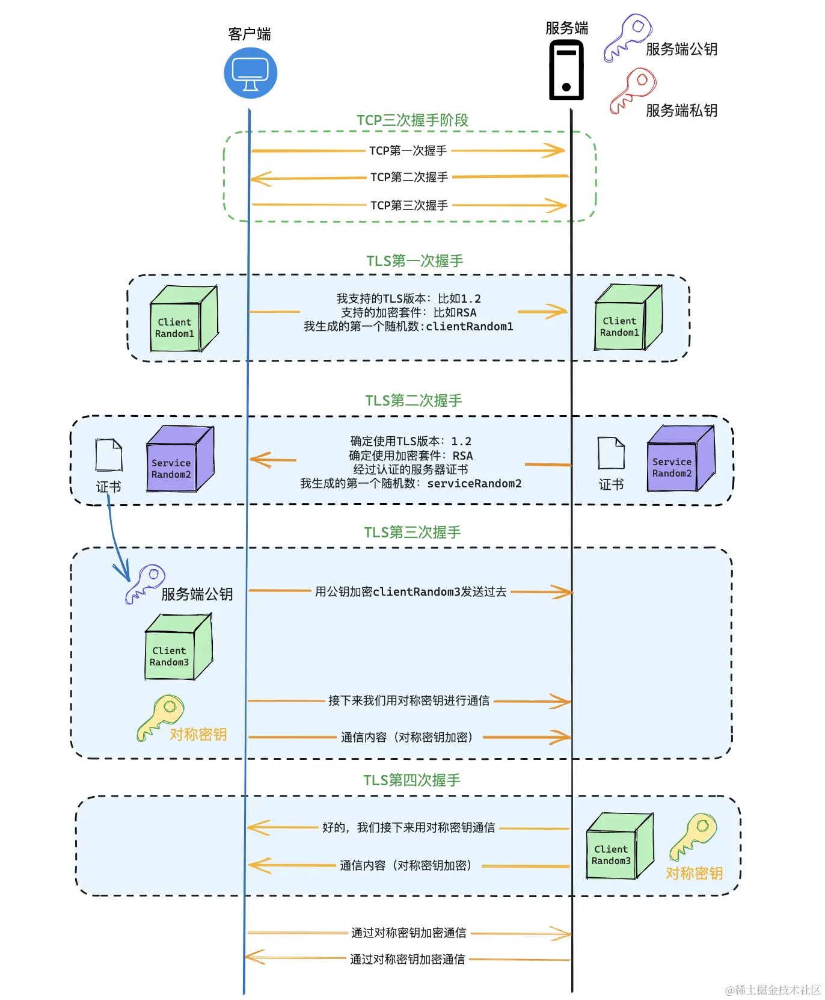

如果想对里面的细节做进一步的了解，这里有个网站做的挺好，分享给大家：[链接](https://link.juejin.cn?target=https%3A%2F%2Ftls12.xargs.org%2F%23client-hello "https://tls12.xargs.org/#client-hello")。

五、回答问题
------

### 5.1、HTTPS 到底是对称加密还是非对称加密？

**都用到了**。前期 4 次握手，本质上就是在利用**非对称加密**的特点，交换三个随机数。

目的就是为了最后用这三个随机数生成**对称加密的会话密钥**。后期就一直用对称加密的方式进行通信。

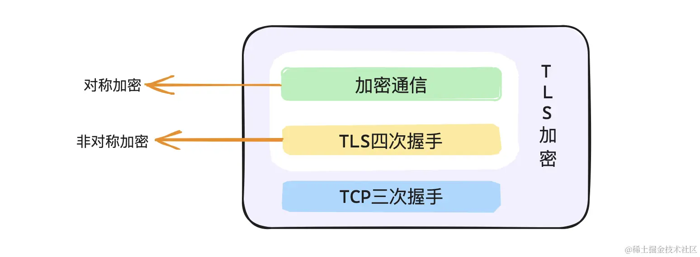

### 5.2、黑客难道拿不到这三个随机数吗？

这三个随机数，两个来自客户端，一个来自服务端。第一次和第二次握手里的客户端随机数和服务端随机数，都是明文的。只要有心，大家都能拿到。

但第三个随机数 `ClientRandom3` 则不行，因为它在客户端生成后，发给服务器之前，**被服务器的公钥加密过**，因此只有服务器本器才能用**私钥**进行解密。就算被别人拿到了，没有服务器的私钥，也无法解密出原文。

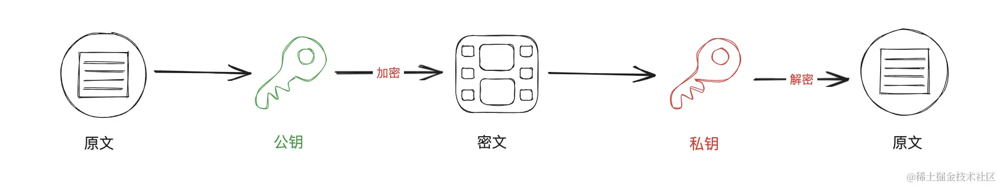

### 5.3、为什么要用三个随机数？而不是一个或两个？

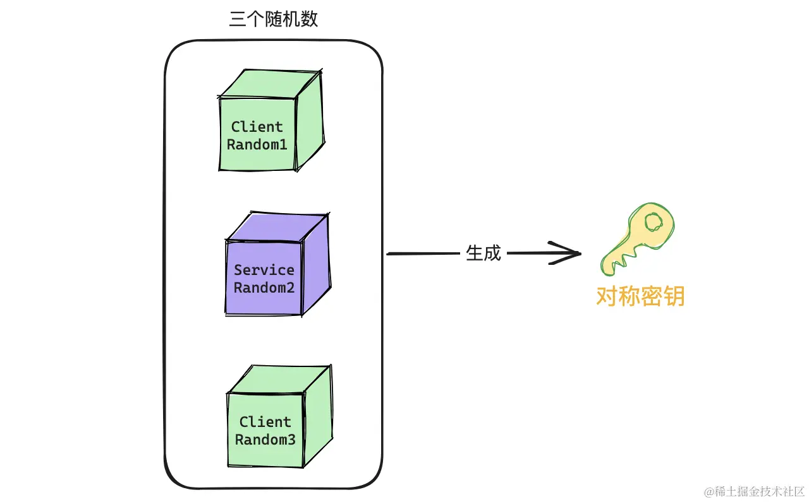

看上去第三个随机数 `ClientRandom3`才是关键，另外两个看起来可有可无？

确实，就算没有另外两个，也并不影响加密功能。

之所以还要两个随机数，是因为只有单个 `ClientRandom3` 随机性不足，多次随机的情况下有可能出来的密钥是一样的。

但如果再引入两个随机数，就能大大增加 " **会话密钥** " 的随机程度，从而保证每次`HTTPS`通信用的会话密钥都是不同的。

### 5.4、为什么第三和第四次握手还要给个摘要？

第三和第四次握手的最后都有个 `Finished`报文，里面是个**摘要**。

**摘要，说白了就是对一大段文本进行一次 hash 运算操作。目的是为了确认通信过程中数据没被篡改过**。

第三次握手，客户端生成摘要，服务端验证，如果验证通过，说明客户端生成的数据没被篡改过，服务端后面才能放心跟客户端通信。

第四次握手，则是反过来，由服务端生成摘要，客户端来验证，验证通过了，说明服务端是可信任的。

那么问题又来了。

**为什么要 hash 一次而不是直接拿原文进行对比？**

这是因为原文内容过长，hash 之后可以让数据变短。更短意味着更小的传输成本。

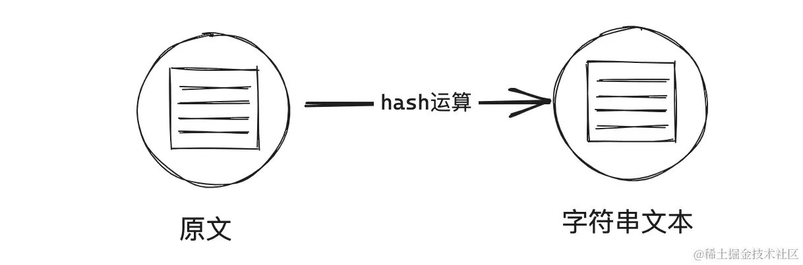

### 5.5、如何确保 CA 是可信的？

这个问题反过来就是，我能不能伪造一个 `CA` 出来，这样我颁发的证书就能信任了？

答案是完全可以！

只要我有能力去生产非对称密钥对，然后把自己的信息写的看起来可信，就可以去骗去偷袭了。

用户拿到我伪造的 `CA` 的证书，选择相信后，我就可以伪造数字证书，然后让用户用伪造的公钥去传递加密信息。

但是，事情也没有那么容易。大部分用户的主机系统中都预设了顶级的可信 `CA`，这些顶级 `CA` 有钱有势，相互认证真实性。伪造的 `CA` 自然无法通过这些大佬的认证，除非想办法把他们全部买通（值得吗？）。

所以，伪造 `CA` 技术上可行，其它都不可行。普通用户基本不用去考虑 `CA` 是否可信，除非是在系统上手动配置信任其它的 `CA`。

六、最后总结
------

到了这里我们发现，其实在传输过程中始终要解决三个关键问题：

1.  传输过程中信息别人有没有篡改？
2.  传输过程中别人能不能拿到里面的信息？
3.  能不能确定到底是谁发给我的？

所有一系列的设计都是围绕这三个问题来展开。整个流程大家如果死记硬背的话会挺难受的，建议多关注设计的动向，以此作为基础去理解，大概就能记下来了。

> 参考：

*   [The Illustrated TLS 1.2 Connection](https://link.juejin.cn?target=https%3A%2F%2Ftls12.xargs.org%2F%23client-hello "https://tls12.xargs.org/#client-hello")
*   [为什么用公钥加密却不能用公钥解密？](https://link.juejin.cn?target=https%3A%2F%2Fmp.weixin.qq.com%2Fs%2FkACa7RQ_tLdgBOgNl5h1XA "https://mp.weixin.qq.com/s/kACa7RQ_tLdgBOgNl5h1XA")

