  Wireshark 是非常流行的网络封包分析软件，可以截取各种网络数据包，并显示数据包详细信息。常用于开发测试过程各种问题定位。本文主要内容包括：

  1、Wireshark 软件下载和安装以及 Wireshark 主界面介绍。

  2、WireShark 简单抓包示例。通过该例子学会怎么抓包以及如何简单查看分析数据包内容。

  3、Wireshark 过滤器使用。过滤器包含两种类型，一种是抓包过滤器，就是抓取前设置过滤规则。另外一种是显示过滤器，就是在数据包分析时进行过滤数据使用。通过过滤器可以筛选出想要分析的内容。包括按照协议过滤、端口和主机名过滤、数据包内容过滤。具体规则和实例可以查看正文。

Wireshark 软件安装
==============

  软件下载路径：[wireshark 官网](https://www.wireshark.org/)。按照系统版本选择下载，下载完成后，按照软件提示一路 Next 安装。

  说明：如果你是 Win10 系统，安装完成后，选择抓包但是不显示网卡，下载 win10pcap 兼容性安装包。下载路径：[win10pcap 兼容性安装包](http://www.win10pcap.org/download/)

**Wireshark 开始抓包示例**
====================

   先介绍一个使用 wireshark 工具抓取 ping 命令操作的示例，让读者可以先上手操作感受一下抓包的具体过程。

  1、打开 wireshark 2.6.5，主界面如下：

**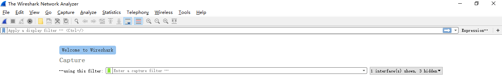**

  2、选择菜单栏上 Capture -> Option，勾选 WLAN 网卡（这里需要根据各自电脑网卡使用情况选择，简单的办法可以看使用的 IP 对应的网卡）。点击 Start。启动抓包。

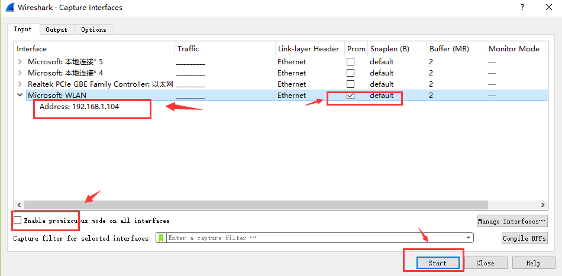

  3、wireshark 启动后，wireshark 处于抓包状态中。

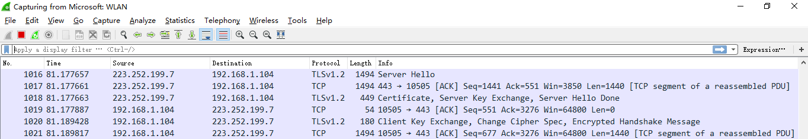

  4、执行需要抓包的操作，如在 cmd 窗口下执行 ping www.baidu.com。

  5、操作完成后相关数据包就抓取到了。为避免其他无用的数据包影响分析，可以通过在过滤栏设置过滤条件进行数据包列表过滤，获取结果如下。说明：`ip.addr == 119.75.217.26 and icmp` 表示只显示 ICPM 协议且源主机 IP 或者目的主机 IP 为 119.75.217.26 的数据包。说明：协议名称 icmp 要小写。

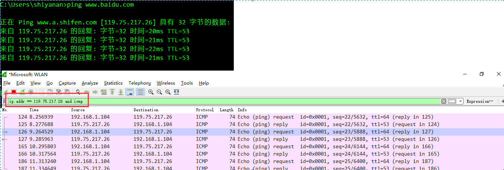

  5、wireshark 抓包完成，就这么简单。关于 wireshark 显示过滤条件、抓包过滤条件、以及如何查看数据包中的详细内容在后面介绍。

Wireshakr 抓包界面介绍
================

## 界面概述

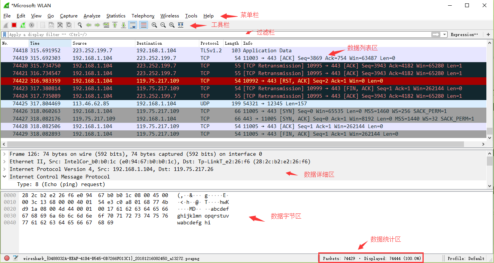

**WireShark 主要分为这几个界面**

    1. Display Filter(显示过滤器)，  用于设置过滤条件进行数据包列表过滤。菜单路径：Analyze --> Display Filters。  

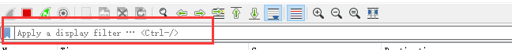

    2. Packet List Pane(数据包列表)， 显示捕获到的数据包，每个数据包包含编号，时间戳，源地址，目标地址，协议，长度，以及数据包信息。 不同协议的数据包使用了不同的颜色区分显示。  

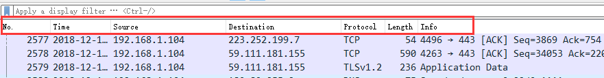

    3. Packet Details Pane(数据包详细信息), 在数据包列表中选择指定数据包，在数据包详细信息中会显示数据包的所有详细信息内容。数据包详细信息面板是最重要的，用来查看协议中的每一个字段。各行信息分别为

  （1）Frame:   物理层的数据帧概况

  （2）Ethernet II: 数据链路层以太网帧头部信息

  （3）Internet Protocol Version 4: 互联网层 IP 包头部信息

  （4）Transmission Control Protocol:  传输层 T 的数据段头部信息，此处是 TCP

  （5）Hypertext Transfer Protocol:  应用层的信息，此处是 HTTP 协议


**TCP 包的具体内容**

 从下图可以看到 wireshark 捕获到的 TCP 包中的每个字段。


    4. Dissector Pane(数据包字节区)。

## 显示设置优化

**（数据列 · 时间显示 · 参考时间 · 名称解析）**

------

### 一、数据列（Columns）设置

1️⃣ 数据列的作用

Wireshark 主界面最上方的列表（No. / Time / Source / Destination / Protocol / Length / Info）就是**数据列**，用于快速扫描数据包关键信息。

合理定制列 = **分析效率 ×2**

------

2️⃣ 打开列设置

路径：

```
Edit → Preferences → Appearance → Columns
```

数据列：隐藏 删除 添加 修改

> 1. 打开列首选项：右键点击数据包列表的列标题（如 No.、Time、Source），选择 Column Preferences；进行添加个修改
>
> 2. 快捷方式：**在数据包详情窗格找到目标字段（如 HTTP Host），右键选择 Apply as Column，一键添加该字段为列**。例如TTL字段
>
>    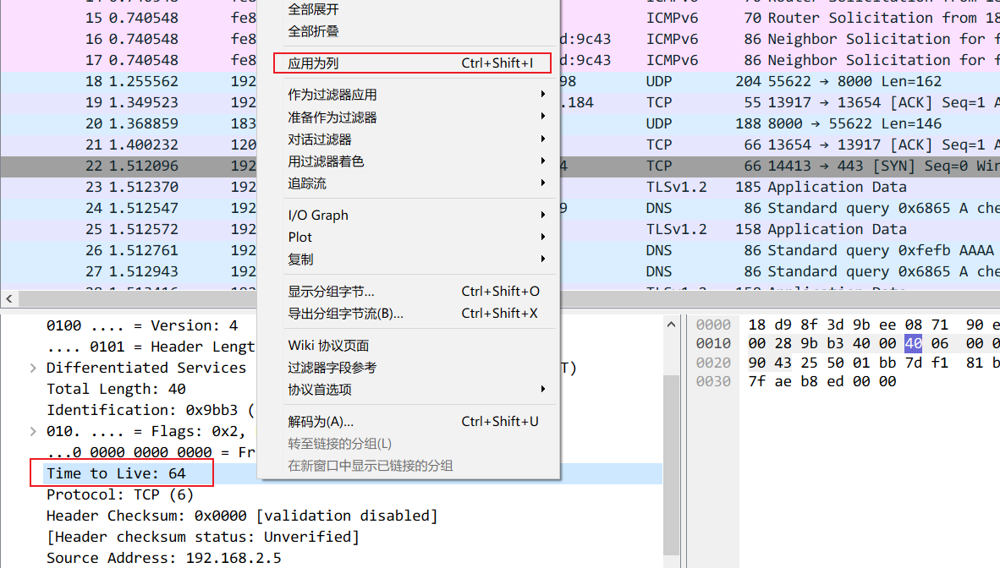


------

3️⃣ 常用列类型说明（重点）

| 列类型      | 含义     | 使用场景       |
| ----------- | -------- | -------------- |
| No.         | 包序号   | 定位包         |
| Time        | 时间戳   | 时序分析       |
| Source      | 源地址   | 网络方向       |
| Destination | 目的地址 | 网络方向       |
| Protocol    | 协议     | 快速分类       |
| Length      | 包长度   | MTU / 分包分析 |
| Info        | 协议摘要 | 快速判断       |

⭐ 强烈推荐新增的列

| 类型                      | 配置方式               | 用途            |
| ------------------------- | ---------------------- | --------------- |
| Delta time                | `Delta time displayed` | 包间延迟        |
| TCP Stream                | `TCP stream index`     | TCP 会话追踪    |
| UDP Stream                | `UDP stream index`     | UDP 会话        |
| Time since previous frame | 相邻包间隔             | 抖动 / 性能分析 |
| Custom Column             | 指定字段               | 精准定位        |

------

4️⃣ 自定义字段列（高级必会）

示例：添加 **TCP Seq**

- Type：`Custom`
- Field name：`tcp.seq`

常见可用字段：

```
tcp.seq
tcp.ack
tcp.window_size
ip.ttl
http.request.method
http.response.code
```

👉 非常适合 **协议调试 / 性能分析 / 问题复现**

------

### 二、时间显示（Time Display）设置

1️⃣ 时间显示入口

```
View → Time Display Format
```

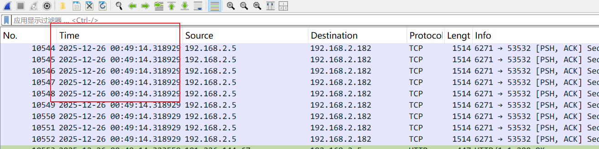

------

2️⃣ 时间显示格式（非常关键）

| 选项                                    | 含义         | 适合场景    |
| --------------------------------------- | ------------ | ----------- |
| Date and Time of Day                    | 真实时间     | 对齐日志    |
| Seconds Since Beginning of Capture      | 相对抓包开始 | 性能分析 ⭐  |
| Seconds Since Previous Displayed Packet | 相邻包间隔   | 延迟 / 抖动 |
| Seconds Since Reference Time            | 相对参考时间 | 故障定位 ⭐  |

------

3️⃣ 时间精度

```
View → Time Display Format → Precision
```

| 精度         | 说明       |
| ------------ | ---------- |
| Seconds      | 粗略       |
| Milliseconds | 常用       |
| Microseconds | 网络分析   |
| Nanoseconds  | 高精度抓包 |

👉 **网络协议分析建议：Microseconds**

------

### 三、参考时间（Set / Unset Reference Time）

1️⃣ 什么是参考时间？

参考时间是 **你人为指定的“时间零点”**。

后续包的 Time 列 → 显示为：

```
当前包时间 - 参考时间包时间
```

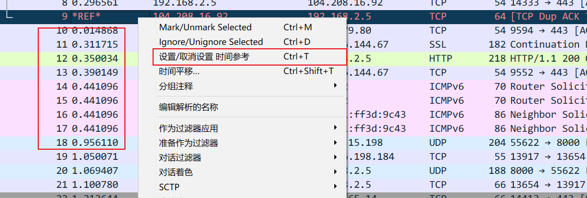

------

2️⃣ 设置参考时间

- 在某个关键数据包上
- 右键 → **Set/Unset Reference Time**

📌 该包时间变为 **0.000000**

------

3️⃣ 参考时间的典型用途（非常实用）

✅ 网络性能分析

- SYN 包设为参考时间
- 看 SYN → SYN-ACK → ACK 耗时

✅ 应用协议分析

- 请求包设参考时间
- 看响应耗时

✅ 故障定位

- 错误包设参考时间
- 看前后因果关系

------

4️⃣ 结合显示格式使用（推荐）

```
View → Time Display Format → Seconds Since Reference Time
```

效果：
 📈 **完整请求耗时一眼可见**

------

### 四、名称解析（Name Resolution）

1️⃣ 名称解析是什么？

Wireshark 会把：

- IP → 主机名
- MAC → 厂商
- Port → 服务名

自动转换成“人类可读形式”。

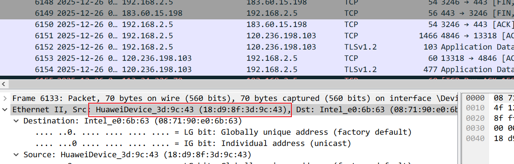

------

2️⃣ 名称解析设置入口

```
Edit → Preferences → Name Resolution
```

------

3️⃣ 常见选项说明（重点）

| 选项                      | 作用          | 建议     |
| ------------------------- | ------------- | -------- |
| Resolve network addresses | IP → 域名     | ❌ 默认关 |
| Resolve transport names   | 端口 → 服务名 | ❌        |
| Resolve MAC addresses     | MAC → 厂商    | ✅        |
| Use DNS Resolver          | 实时 DNS      | ❌        |

------

4️⃣ 为什么 **不建议开启 IP / Port 解析？**

❌ **性能下降**
 ❌ **抓包过程中引入额外 DNS 流量**
 ❌ **影响时间分析准确性**

示例问题：

- 端口 8080 显示成 `http-alt`
- 实际并非 HTTP

👉 **协议分析时，宁愿看“原始值”**

------

5️⃣ 推荐实践配置

✔ 开启：

- MAC 厂商解析（快速识别设备）

✘ 关闭：

- IP 名称解析
- 端口服务名解析
- 实时 DNS 解析

------

### 五、推荐一套「工程师级」显示配置

📌 列配置

```
No | Time | Source | Destination | Protocol | Length | Delta Time | TCP Stream | Info
```

📌 时间显示

```
Seconds Since Beginning of Capture
Precision: Microseconds
```

📌 分析时

- 关键包 → Set Reference Time
- 切换为：Seconds Since Reference Time

📌 名称解析

```
只开启 MAC 解析
```


## 数据包颜色

说明：数据包列表区中不同的协议使用了不同的颜色区分。协议颜色标识定位在菜单栏 View --> Coloring Rules。如下所示

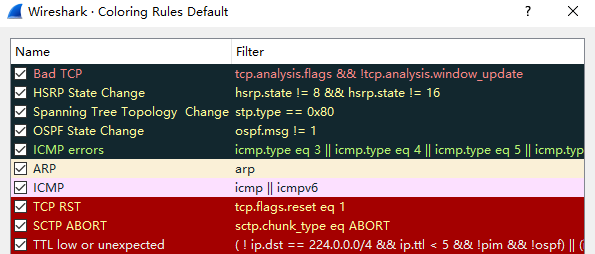

  Wireshark 包列表区颜色含义对照表（默认 Coloring Rules）

| 颜色表现         | 规则名称              | 过滤条件（简化）           | 协议 | 含义说明               | 常见场景 / 问题定位                  |
| ---------------- | --------------------- | -------------------------- | ---- | ---------------------- | ------------------------------------ |
| **红色（深红）** | Bad TCP               | `tcp.analysis.flags`       | TCP  | TCP 分析模块检测到异常 | 重传、乱序、重复 ACK、丢包、窗口异常 |
| **红色（深红）** | TCP RST               | `tcp.flags.reset == 1`     | TCP  | 连接被强制重置         | 端口未监听、防火墙拒绝、应用异常     |
| **红色（深红）** | SCTP ABORT            | `sctp.chunk_type == ABORT` | SCTP | SCTP 会话被异常终止    | 电信/核心网异常                      |
| **红色（深红）** | TTL low or unexpected | `ip.ttl < 5` 等            | IP   | TTL 异常或不合理       | 路由环路、跨网段异常                 |
| **绿色**         | ICMP errors           | `icmp.type == 3/4/5/...`   | ICMP | ICMP 错误报文          | 不可达、路由错误、防火墙拦截         |
| **浅黄色**       | ARP                   | `arp`                      | ARP  | 地址解析协议           | IP 冲突、网关问题                    |
| **粉色 / 浅紫**  | ICMP                  | `icmp                      |      | icmpv6`                | ICMP                                 |
| **深蓝色**       | HSRP State Change     | `hsrp.state != 8 && !=16`  | HSRP | HSRP 状态变化          | 网关主备切换                         |
| **深蓝色**       | STP Topology Change   | `stp.type == 0x80`         | STP  | 交换网络拓扑变化       | 二层网络抖动                         |
| **深蓝色**       | OSPF State Change     | `ospf.msg == 1`            | OSPF | OSPF 邻居状态变化      | 三层路由收敛                         |

------

一眼速记版（工程师常用）

| 看到的颜色          | 第一反应                 |
| ------------------- | ------------------------ |
| **红色 TCP**        | 网络或应用有问题，优先看 |
| **红色 RST**        | 连接被拒绝或异常关闭     |
| **绿色 ICMP Error** | 网络路径或策略问题       |
| **黄色 ARP**        | 二层 / IP 解析问题       |
| **粉色 ICMP**       | 连通性测试               |
| **大量深蓝变化**    | 网络设备状态不稳定       |


## 数据包操作

### 1. 标记数据包

- **作用**：高亮显示关键数据包（默认黄色），方便快速定位。
- **操作**：
  - 右键数据包 → 选择「Mark Packet」，或按快捷键 `Ctrl+M`。
  - 取消标记：再次右键 → 「Unmark Packet」，或按 `Ctrl+M`。
- **进阶**：可通过「文件→导出特定分组」选择 “仅已标记分组” 导出。

### 2. 注释数据包

- **作用**：给数据包添加文字说明（如分析结论），会随文件保存。
- **操作**：
  - 右键数据包 → 「分组注释→Add New Comment」，或按 `Ctrl+Alt+C`。
  - 编辑 / 删除：右键已注释的数据包 → 选择对应选项。

### 3. 合并数据包

- **作用**：将多个抓包文件（如分段抓取的文件）合并为一个。
- **操作**：
  - 打开其中一个文件 → 「文件→Merge」→ 选择要合并的文件 → 选择合并方式（如按时间戳排序、追加到末尾）。

### 4. 打印数据包

- **操作**：
  - 「文件→打印」→ 选择打印范围（全部 / 选中 / 标记）→ 确认打印设置。

### 5. 导出数据包

- **作用**：导出指定范围的数据包（而非保存全部）。
- **操作**：
  - 「文件→导出特定分组」→ 选择导出范围（全部 / 选中 / 标记 / 自定义范围）→ 选择保存格式（如 `.pcap`）。


## 首选项设置

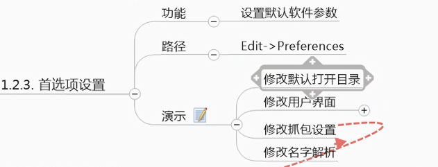

## 抓包首选项


- **功能**：抓包前的关键配置项，包含：

  - 网卡设置：选择需要抓取数据包的目标网卡；

    - > 正常情况下，网络接口（如网卡）仅接收**目的地址匹配自身 MAC 地址**的数据包（即 “发给自己的包”）；开启 “混杂模式” 后，接口会接收**经过所在网络的所有数据包**（无论目的地址是否指向自己）

  - 抓包过滤器：提前设定规则，仅抓取符合条件的数据包（减少无关数据）；

  - 多文件连续保存：自动拆分大文件，避免单个抓包文件体积过大；

  - 停止抓包规则：设置抓包终止条件（如文件大小、抓包时长）；

  - 名字解析：将 IP、端口等信息转换为易读形式（如域名、服务名）。

- **路径**：这些配置的操作入口为 Wireshark 的 “Capture->Options” 菜单。

  

抓包自动拆分文件

按大小 时间

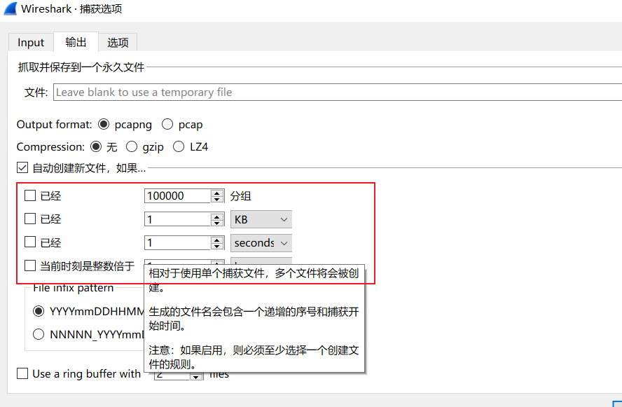


Wireshark 过滤器设置
===============

   初学者使用 wireshark 时，将会得到大量的冗余数据包列表，以至于很难找到自己需要抓取的数据包部分。wireshark 工具中自带了两种类型的过滤器，学会使用这两种过滤器会帮助我们在大量的数据中迅速找到我们需要的信息。

## （1）抓包过滤器


    捕获过滤器的菜单栏路径为 Capture --> Capture Filters。用于**在抓取数据包前设置。**

**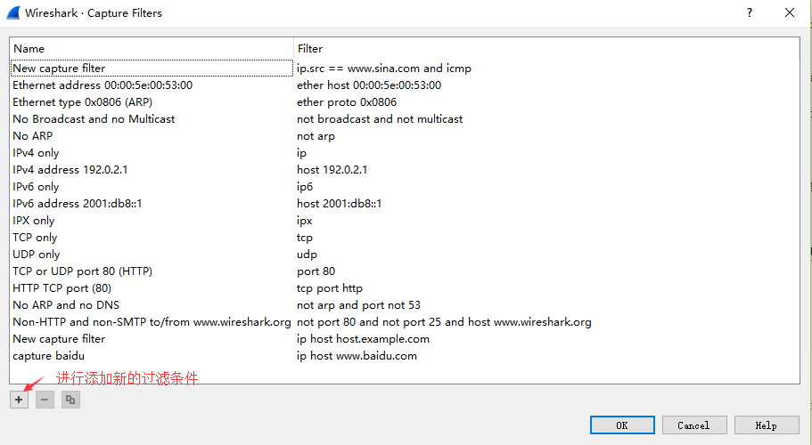**

 如何使用？可以在抓取数据包前设置如下。

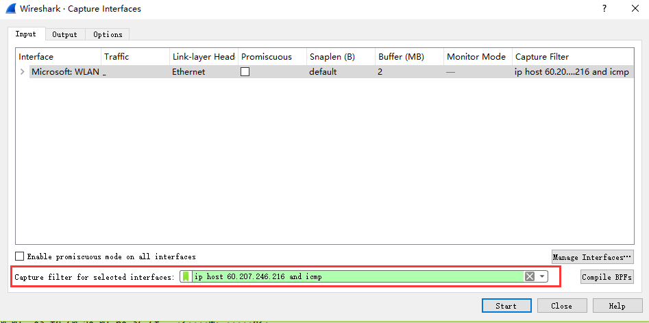

`ip host 60.207.246.216 and icmp` 表示只捕获主机 IP 为 60.207.246.216 的 ICMP 数据包。获取结果如下：

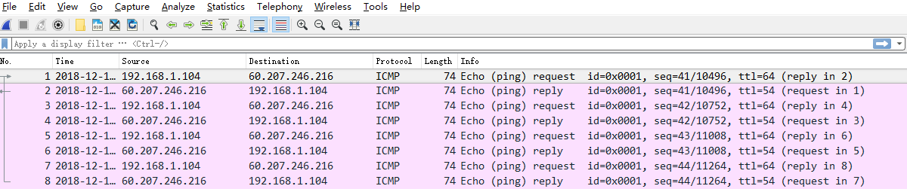

- 


## （2）显示过滤器


**显示过滤器是用于在抓取数据包后设置过滤条件进行过滤数据包**。

通常是在抓取数据包时设置条件相对宽泛或者没有设置导致抓取的数据包内容较多时使用显示过滤器设置条件过滤以方便分析。同样上述场景，在捕获时未设置抓包过滤规则直接通过网卡进行抓取所有数据包，如下

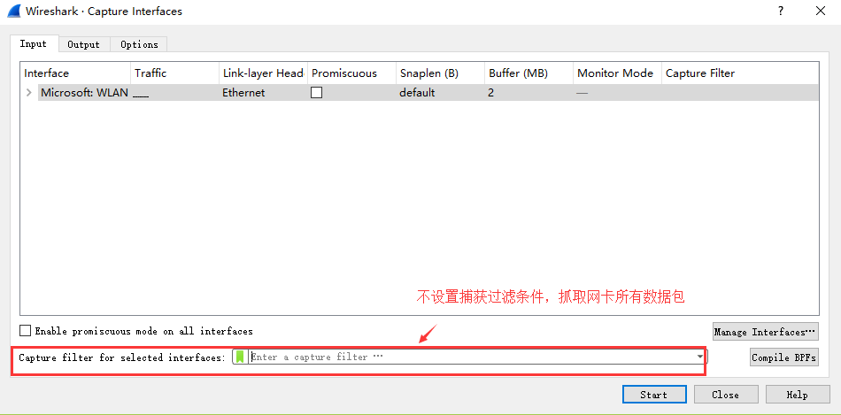

执行 ping www.huawei.com 获取的数据包列表如下

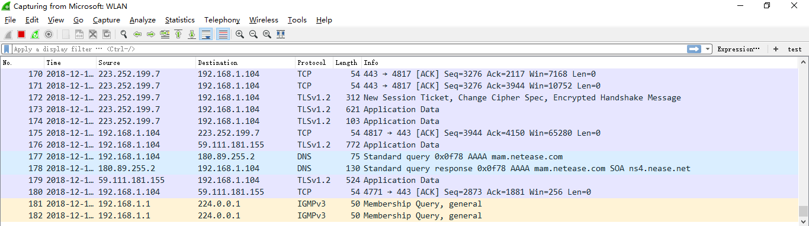

观察上述获取的数据包列表，含有大量的无效数据。这时可以通过设置显示器过滤条件进行提取分析信息。`ip.addr == 211.162.2.183 and icmp`。并进行过滤。

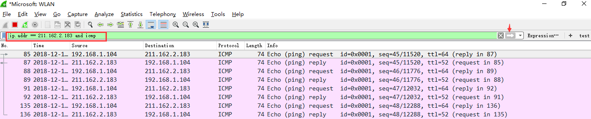

 上述介绍了抓包过滤器和的基本使用方法。**在组网不复杂或者流量不大情况下，使用显示器过滤器进行抓包后处理就可以满足我们使用。**下面介绍一下两者间的语法以及它们的区别。


## 过滤器语法

- **抓包过滤器**：基于**BPF 语法（伯克利包过滤器）**，语法简洁，采用「**类型 + 方向 + 协议 + 值**」的组合逻辑，支持简写：

  - 示例：`host 192.168.1.1`（匹配该 IP 的所有流量）、`tcp src port 80`（匹配源端口 80 的 TCP 流量）
  - 逻辑运算符：支持`and/or/not`或`&&/||/!`（如`host 192.168.1.1 and port 80`）

  

- **显示过滤器**：采用**Wireshark 自定义语法**，以「**协议字段 + 比较操作符 + 值**」为核心，字段更细分：

  - 示例：`ip.addr == 192.168.1.1`（匹配该 IP 的所有流量）、`tcp.srcport == 80`（匹配源端口 80 的 TCP 流量）
  - 逻辑运算符：仅支持`and/or/not`（不支持`&&/||/!`，如`ip.addr == 192.168.1.1 and tcp.port == 80`）


### 抓包过滤器语法

Wireshark抓包过滤器基于**BPF语法（伯克利包过滤器）**，用于在抓包阶段筛选流量（仅捕获符合规则的数据包），其核心语法说明如下：


#### 一、基础语法结构

通常遵循「**协议 + 方向 + 类型 + 值**」的组合逻辑，可灵活省略非必要组件（如默认匹配所有协议时可省略协议字段）。

#### 二、核心组件详解

| 组件              | 可选值/说明                                                  | 示例                                           |
| ----------------- | ------------------------------------------------------------ | ---------------------------------------------- |
| **协议（Proto）** | 指定数据包的网络协议（覆盖链路层/网络层/传输层）：<br>- 链路层：`ether`（以太网）、`arp`（地址解析）<br>- 网络层：`ip`、`ipv6`、`icmp`（网络控制）<br>- 传输层：`tcp`、`udp`、`sctp` | `tcp`（仅抓TCP协议包）                         |
| **方向（Dir）**   | 限定数据包的传输方向：<br>- `src`：源端（数据包发送方）<br>- `dst`：目的端（数据包接收方）<br>（省略则默认匹配「src或dst」） | `src host 192.168.1.100`（抓源IP为该地址的包） |
| **类型（Type）**  | 定义过滤对象的类型：<br>- `host`：单个主机（匹配IP/MAC地址）<br>- `net`：网络段（需配合子网掩码，如`192.168.1.0/24`）<br>- `port`：单个端口<br>- `portrange`：端口范围（如`80-8080`） | `port 80`（抓80端口的包）                      |


#### 三、逻辑运算符（组合条件）

用于拼接多个过滤规则，支持以下符号（大小写不敏感）：

- **与**：`and` / `&&`（同时满足多个条件）
- **或**：`or` / `||`（满足任意一个条件）
- **非**：`not` / `!`（排除符合条件的包）
- **优先级**：用括号`()`调整条件执行顺序


> 示例
>
> 1. `src host 192.168.1.1 && dst port 80`
>
> - **逻辑运算符**：`&&`（“与”），表示需同时满足两个条件
> - **作用**：仅捕获 “源 IP 地址为 192.168.1.1” 且 “目的端口为 80（HTTP 默认端口）” 的数据包，适用于监控特定主机访问 HTTP 服务的流量。
>
> 2. `host 192.168.1.1 || host 192.168.1.2`
>
> - **逻辑运算符**：`||`（“或”），表示满足任意一个条件即可
> - **作用**：捕获与 192.168.1.1 或 192.168.1.2 通信的所有数据包，适用于同时监控两个主机的全量流量。
>
> 3. `! broadcast`
>
> - **逻辑运算符**：`!`（“非”），表示排除符合条件的数据包
> - **作用**：过滤掉广播类型的数据包，减少抓包中的冗余流量（广播包通常是局域网内的通用通知，非特定通信数据）。

#### 四、常见示例

1. 过滤 MAC 地址案例

基于以太网（链路层）地址筛选数据包：

- `ether host 00:88:ca:86:f8:0d`：捕获与该 MAC 地址相关的所有数据包（无论作为源或目的）
- `ether src host 00:88:ca:86:f8:0d`：仅捕获**源 MAC 地址**为该值的数据包
- `ether dst host 00:88:ca:86:f8:0d`：仅捕获**目的 MAC 地址**为该值的数据包

2. 过滤 IP 地址案例

基于网络层 IP 地址筛选数据包：

- `host 192.168.1.1`：捕获与 192.168.1.1 通信的所有数据包（无论作为源或目的）
- `src host 192.168.1.1`：仅捕获**源 IP 地址**为 192.168.1.1 的数据包
- `dst host 192.168.1.1`：仅捕获**目的 IP 地址**为 192.168.1.1 的数据包

3. 过滤端口案例

基于传输层端口筛选数据包：

- `port 80`：捕获与 80 端口（HTTP 默认端口）相关的所有数据包
- `!port 80`：排除与 80 端口相关的所有数据包
- `dst port 80`：仅捕获**目的端口**为 80 的数据包
- `src port 80`：仅捕获**源端口**为 80 的数据包

4. 过滤协议案例

直接筛选特定网络协议的数据包：

- `arp`：仅捕获地址解析协议（ARP，用于 IP 与 MAC 映射）的数据包
- `icmp`：仅捕获互联网控制消息协议（ICMP，用于网络诊断如 Ping）的数据包

5. 综合过滤案例

组合多个条件筛选数据包：

- `host 192.168.1.100 && port 8080`：同时捕获与 192.168.1.100 通信、且涉及 8080 端口的数据包


### 显示过滤器语法

采用**Wireshark 自定义语法**，以「**协议字段 + 比较操作符 + 值**」为核心

`<字段> <运算符> <值>`


#### 1. 比较操作符 - 条件判断

- 等于：`==`
- 不等于：`!=`
- 大于：`>`、小于 <`
- 大于等于：`>=`<=`
- 包含：`contains`（匹配字段中包含指定内容）
- 存在：`exists`（匹配包含指定字段的数据包）


示例：`tcp.port == 80`（筛选 TCP 端口为 80 的数据包）

#### 2. 逻辑操作符

用于组合多个过滤条件，实现复杂筛选：

- `and`：需同时满足所有条件（如`ip.src == 192.168.1.1 and tcp.port == 80`）
- `or`：满足任意一个条件即可（如`ip.src == 192.168.1.1 or ip.src == 192.168.1.2`）
- `xor`：有且仅有一个条件被满足（较少用，如区分两个互斥的流量）
- `not`：排除符合条件的数据包（如`not broadcast`）

#### 3. 常用协议字段（按网络层级）

##### ① 链路层

- `arp`：ARP 协议包
- `ether.src`：源 MAC 地址
- `ether.dst`：目的 MAC 地址

##### ② 网络层

- `ip.addr`：源或目的 IP 地址
- `ip.src`：源 IP 地址
- `ip.dst`：目的 IP 地址
- `icmp`：ICMP 协议包

##### ③ 传输层

- `tcp.port`：TCP 源或目的端口
- `tcp.srcport`：TCP 源端口
- `tcp.dstport`：TCP 目的端口
- `tcp.flag.syn`：TCP SYN 标志位（连接建立）
- `udp.port`：UDP 源或目的端口

##### ④ 应用层

- `http`：HTTP 协议包
- `http.request.method`：HTTP 请求方法（如 GET、POST）
- `dns`：DNS 协议包
- `bootp`：DHCP 协议包（动态地址分配）

##### 常用实战示例

1. 显示指定 IP 双向流量：`ip.addr == 192.168.1.100`
2. 显示 TCP 80 端口流量：`tcp.port == 80`
3. 显示 HTTP GET 请求：`http.request.method == "GET"`
4. 显示 TCP SYN 包（连接建立）：`tcp.flag.syn == 1`
5. 排除 ARP 包和广播包：`not arp and not broadcast`
6. 显示包含指定内容的 HTTP 包：`http contains "baidu.com"`

#####  常见语法错误及修正

- 错误：`ip.src = 192.168.1.1`（比较符错误）→ 修正：`ip.src == 192.168.1.1`
- 错误：`tcp.port == 80 && 443`（逻辑符错误）→ 修正：`tcp.port == 80 or tcp.port == 443`
- 错误：`http.request.method = GET`（缺失引号）→ 修正：`http.request.method == "GET"`


#### 案例

##### 1. 过滤 IP 地址案例

用于精准定位与指定 IP 相关的流量，区分通信方向：

- `ip.addr == 192.168.1.1`：匹配**源或目的 IP 为 192.168.1.1**的所有数据包，覆盖该 IP 的收发流量。
- `ip.src == 192.168.1.1`：仅匹配**192.168.1.1 发送**的流量（源 IP 为该地址）。
- `ip.dst == 192.168.1.1`：仅匹配**发往 192.168.1.1**的流量（目的 IP 为该地址）。
- `ip.src == 192.168.1.100 and ip.dst == 58.250.135.156`：同时匹配两台特定主机间的通信流量，精准聚焦双向交互。


##### 2. 过滤端口案例

针对 TCP 端口及标志位的筛选字段：

- 端口类：`tcp.port`（任意 TCP 端口）、`tcp.srcport`（TCP 源端口）、`tcp.dstport`（TCP 目的端口）
- 标志位类：`tcp.flag.syn`（TCP 同步包，用于连接建立）、`tcp.flag.ack`（TCP 确认包）


针对 TCP 端口及连接阶段的筛选，适用于定位服务或连接问题：

- `tcp.port == 80`：匹配 ** 源或目的 TCP 端口为 80（HTTP 默认端口）** 的数据包，覆盖 HTTP 服务的请求与响应。
- `tcp.srcport == 80`：仅匹配**HTTP 服务器发送**的流量（源端口为 80）。
- `tcp.dstport == 80`：仅匹配**客户端发起**的 HTTP 请求（目的端口为 80）。
- `tcp.flag.syn == 1`：匹配 TCP 连接建立阶段的**同步包（SYN 包）**，可用于排查连接建立失败的故障。


##### 3. 过滤协议案例

直接筛选 / 排除特定协议的流量，减少冗余数据：

- `arp/tcp`：直接匹配 ARP（地址解析）或 TCP 协议的数据包。
- `not http`：排除 HTTP 协议流量，仅保留其他类型数据。
- `not arp`：排除局域网内的 ARP 广播包，聚焦有效通信流量。


直接在 Filter 框输入小写协议名，即可显示对应协议的所有数据包：


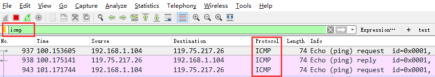


##### 4. 综合过滤案例

组合 IP 与端口条件，实现更精准的流量定位：

- `ip.src == 192.168.1.100 and tcp.dstport == 80`：匹配 192.168.1.100 发起的 HTTP 请求流量。
- `ip.addr == 192.168.1.106 and udp.port == 4000`：匹配与 192.168.1.106 相关的 UDP 4000 端口流量。

##### 5. Http 模式过滤

  `http.request.method=="GET"`,   只显示 HTTP GET 方法的。

##### 6. 逻辑运算符为 and/or/not  

  过滤多个条件组合时，使用 and/or。比如获取 IP 地址为 192.168.1.104 的 ICMP 数据包表达式为 ip.addr == 192.168.1.104 and icmp  


##### 7. 按照数据包内容过滤。假设我要以 IMCP 层中的内容进行过滤，可以单击选中界面中的码流，在下方进行选中数据。如下


右键单击选中后出现如下界面


选中 Select 后在过滤器中显示如下


后面条件表达式就需要自己填写。如下我想过滤出 data 数据包中包含 "abcd" 内容的数据流。**包含的关键词是 contains 后面跟上内容。**


看到这， 基本上对 wireshak 有了初步了解。


## 两大过滤器核心差异总结（速记）

1. 生效时机：抓包前（过滤捕获）vs 抓包后（过滤显示）
2. 语法逻辑：BPF 简洁组合 vs 字段级精准匹配
3. 逻辑符：抓包支持 `&&/||/!`，显示仅支持 `and/or/not`
4. 筛选深度：抓包不支持应用层字段，显示支持全层级字段
5. 数据影响：抓包减少捕获量，显示不改变原始抓包数据

# Wireshark 高级功能

## 数据流追踪

1. 功能定位：对 TCP、UDP、SSL 等类型的网络数据流进行重组，实现通信数据的完整呈现。
2. 操作路径：在 Wireshark 中通过 “Analyze（分析）->Follow TCP stream（跟踪 TCP 流）” 执行该功能。
3. 实际作用：是 Wireshark 分析网络通信的常用功能之一，可帮助用户查看完整的交互数据流，用于排查通信异常、解析数据交互逻辑等场景。


> 以下是 Wireshark 中数据流追踪功能的实操步骤（以主流版本为例）：
>
> 1. **准备数据包**打开 Wireshark 后，通过 “捕获→开始” 捕获目标网络的数据包；或通过 “文件→打开” 加载已保存的.pcap/.pcapng 格式数据包文件。
> 2. **定位目标数据包**在 Wireshark 主界面的 “数据包列表” 面板中，找到需要追踪的数据包（可通过 “协议” 列筛选 TCP、UDP、SSL 等目标协议）。
> 3. **启动数据流追踪**
>    - 方式 1（右键操作）：右键点击目标数据包，选择 “Follow”，再根据数据包协议选择对应选项（如 “Follow TCP Stream”“Follow UDP Stream”）。
>    - 方式 2（顶部菜单）：选中目标数据包后，点击顶部菜单栏 “Analyze”→“Follow”，选择对应协议的流选项。
> 4. **查看与调整数据流**弹出的数据流窗口会展示该流的完整交互数据：
>    - 可通过窗口底部的编码选项（如 “Original”“ASCII”“Hex Dump”）切换数据展示格式；
>    - 窗口会以不同颜色区分通信双方的数据流（如红 / 蓝配色），便于识别交互方向。
> 5. **保存数据流（可选）**在数据流窗口中点击 “Save As”，可将当前追踪的数据流内容保存为文本文件，用于后续分析。

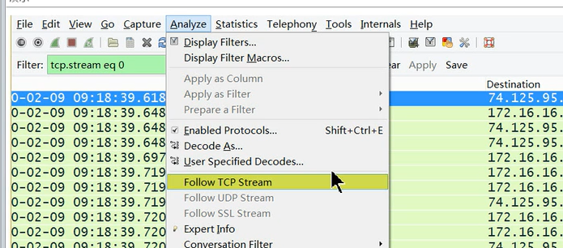

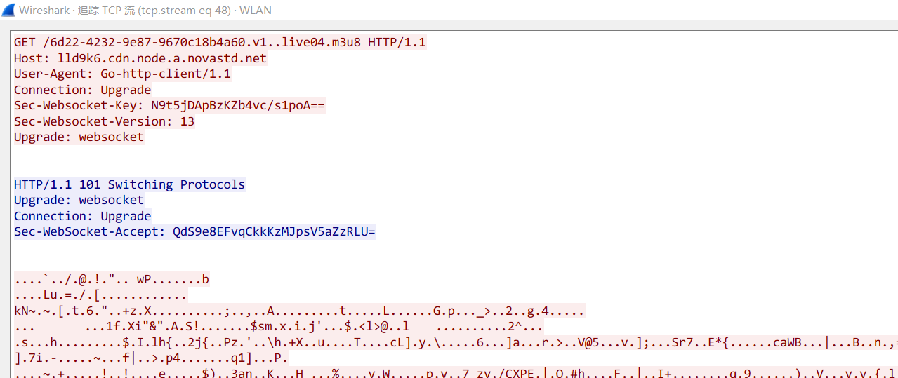

> Wireshark 数据流追踪结果的内容解读指南：
>
> 一、追踪窗口基础结构
>
> 1. **数据流区分**窗口以**不同颜色（通常为红 / 蓝配色）** 区分通信双方的数据流：
>    - 一种颜色对应 “发起方”（如客户端）发送的数据；
>    - 另一种颜色对应 “响应方”（如服务器）返回的数据。
> 2. **编码格式区**窗口底部的编码选项（Original/ASCII/Hex Dump 等）对应不同展示形式：
>    - **ASCII**：以文本形式展示（适用于 HTTP、FTP 等明文协议的内容解读）；
>    - **Hex Dump**：以十六进制 + ASCII 混合形式展示（适用于二进制 / 加密数据的字节级分析）；
>    - **Original**：保留数据原始编码格式（默认选项）。
>
> 二、核心内容解读
>
> 1. **交互方向识别**通过数据流前的**IP + 端口组合**判断通信双方：
>    - 格式示例：`192.168.1.100:54321 → 203.0.113.5:80`（左侧为发起方 IP + 端口，右侧为响应方）；
>    - 可结合 Wireshark 主界面的 “源 / 目的” 列，对应到具体设备 / 服务。
> 2. **数据内容解析**
>    - **明文协议（如 HTTP）**：可直接读取请求行（`GET /index.html HTTP/1.1`）、响应状态码（`200 OK`）、请求头 / 响应头（如`Host: example.com`）及正文内容；
>    - **加密协议（如 SSL/TLS）**：数据流会显示 “加密后的二进制数据”，需加载对应密钥（通过 Wireshark“编辑→首选项→Protocols→SSL” 配置）才能解密为明文；
>    - **二进制协议（如自定义 UDP 协议）**：需结合协议文档，通过 Hex Dump 格式分析字节含义。
> 3. **流元信息**窗口顶部通常会显示流的基础统计：如 “Stream 1（TCP）” 表示当前是第 1 个 TCP 流，部分版本会标注该流包含的数据包数量。
>
> 三、不同协议流的解读特点
>
> - **TCP 流**：内容是**有序、完整的交互序列**（因 TCP 是可靠连接），可直接还原完整的请求 - 响应过程；
> - **UDP 流**：内容是**无连接的数据包集合**（可能存在分片），需自行拼接逻辑（如 DNS 查询的 “请求包 + 响应包”）；
> - **SSL/TLS 流**：未解密时仅能看到握手信息 + 加密数据，解密后与 TCP 明文流的解读逻辑一致。
>
> 四、常见关键信息识别
>
> - **正常交互标识**：HTTP 的`200 OK`、TCP 的 “连续序号无中断”；
> - **异常信息标识**：HTTP 的`404 Not Found`（资源不存在）、TCP 流中出现 “[TCP Retransmission]”（重传，提示网络丢包）；
> - **乱码处理**：若 ASCII 格式下显示乱码，可切换为 “UTF-8” 等编码（部分版本需手动调整），或判断为二进制 / 加密数据。


## 专家信息说明

1. **功能定位**对捕获的数据包中存在的特定状态进行分类告警说明，帮助分析者快速识别数据包中的异常、关键信息，降低逐一排查数据包的工作量。

2. **信息分类（4 类提示）**

   | 分类             | 含义                                                         |
   | ---------------- | ------------------------------------------------------------ |
   | 错误（errors）   | 数据包存在严重问题（如协议格式错误、校验和不匹配等）         |
   | 警告（warnings） | 数据包存在潜在异常（如超时重传、协议字段不规范等）           |
   | 注意（notes）    | 数据包包含需要关注的非异常信息（如非标准协议配置、特殊字段） |
   | 对话（chats）    | 数据包的常规交互信息（如正常的协议握手、基础通信内容）       |

3. **操作路径**在 Wireshark 中，通过 “Analyze（分析）→Expert Infos（专家信息）” 的菜单路径，可打开该功能界面查看分类后的数据包状态提示。

4. **功能价值**:该功能适用于大规模数据包分析、网络故障排查场景，能将分散的数据包状态标准化分类，帮助分析者快速聚焦异常点或关键交互信息。


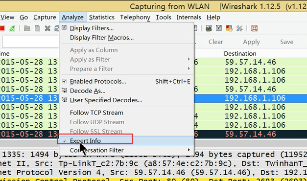


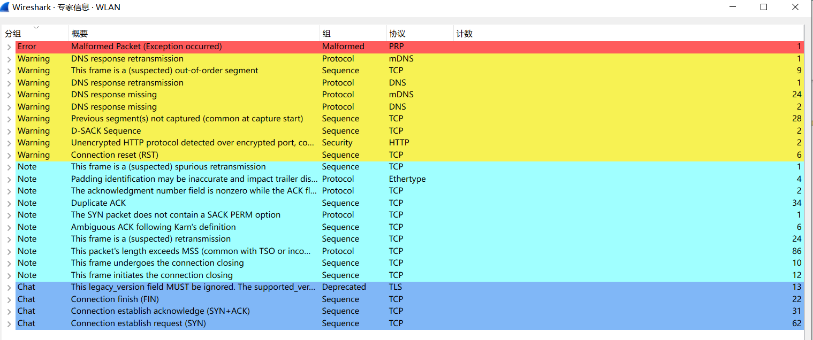

| 专家信息分类     | 典型场景                                                     | 场景说明                                                     |
| ---------------- | ------------------------------------------------------------ | ------------------------------------------------------------ |
| 错误（errors）   | 1. TCP 校验和不匹配2. IP 头部校验和错误                      | 1. 数据包传输过程中出现损坏，不符合 TCP 协议的完整性要求2. IP 数据包头部数据异常，无法正常解析 |
| 警告（warnings） | 1. TCP 重传（Retransmission）2. TCP 零窗口（Zero Window）3. DNS 查询超时 | 1. 网络丢包导致发送方重新传输数据，可能存在链路拥塞2. 接收方缓冲区已满，暂时无法接收新数据3. 域名解析请求未得到响应，可能是 DNS 服务异常 |
| 注意（notes）    | 1. HTTP 非标准端口通信（如 8080）2. SSL/TLS 旧版本协议（如 TLS1.0） | 1. 采用非默认端口进行 HTTP 通信，属于合法但非常规的配置2. 使用安全性较低的旧版本加密协议，存在潜在风险 |
| 对话（chats）    | 1. TCP 三次握手（SYN→SYN-ACK→ACK）2. HTTP 请求 - 响应（GET→200 OK）3. DNS 正常解析（域名→IP） | 1. 网络连接的正常建立流程2. 网页访问的常规交互过程3. 域名到 IP 地址的正常解析流程 |

## 统计摘要说明

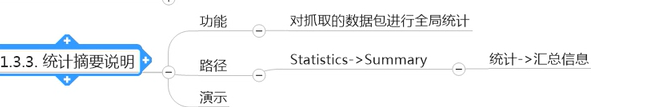


## 协议分层统计

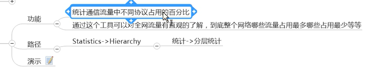


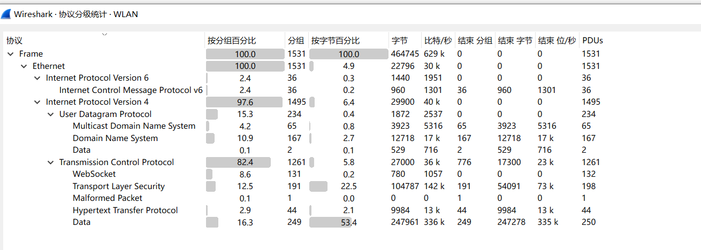

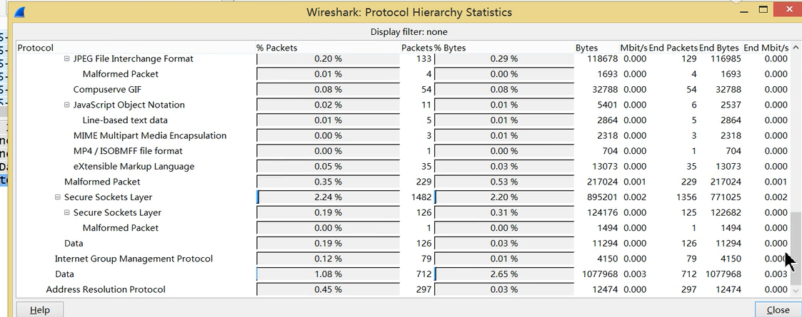


## 网络节点和会话统计

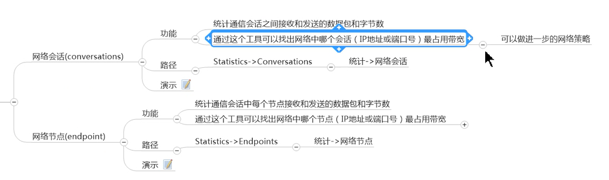

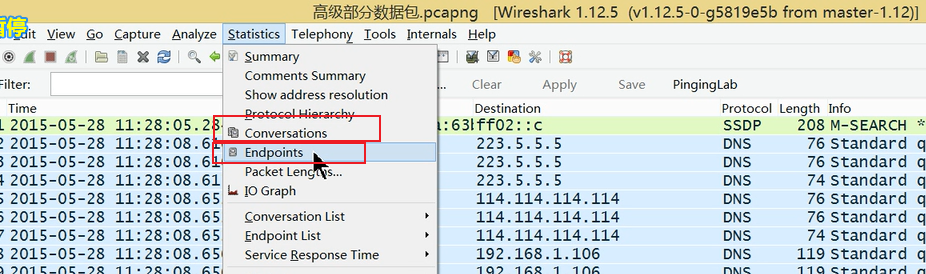


## 数据包长度

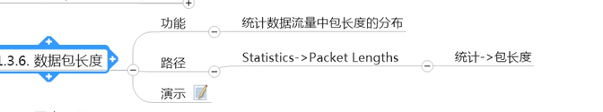


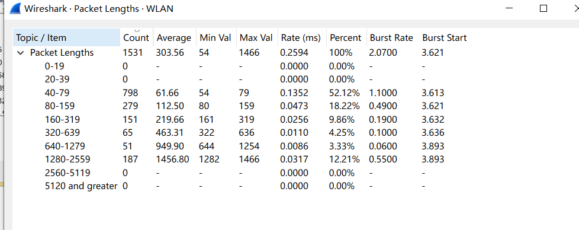


## 图表分析

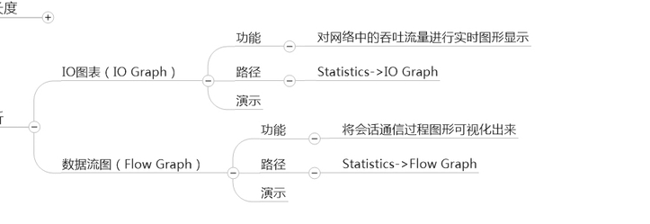

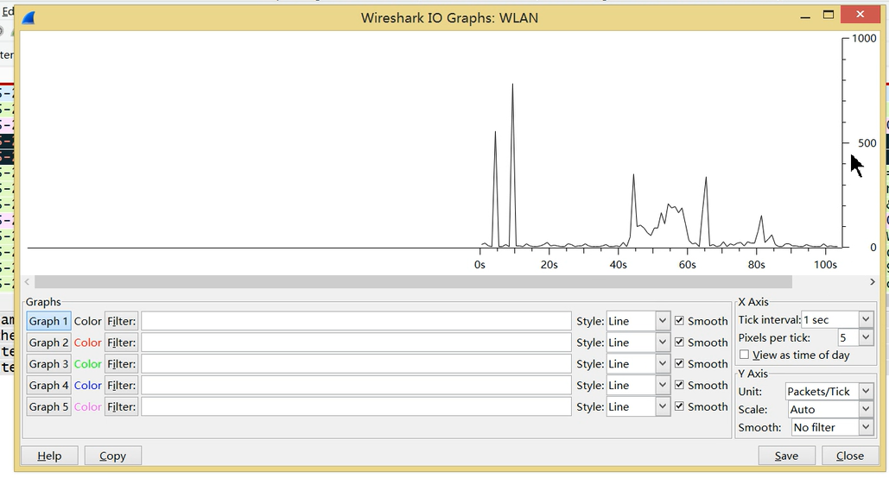


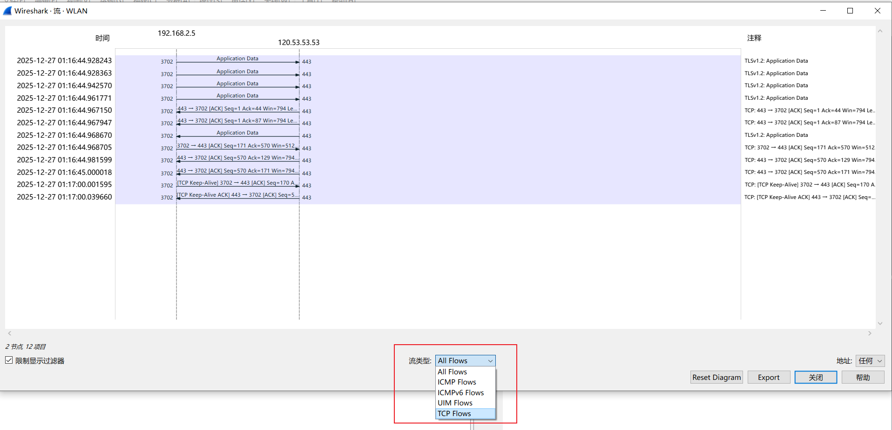

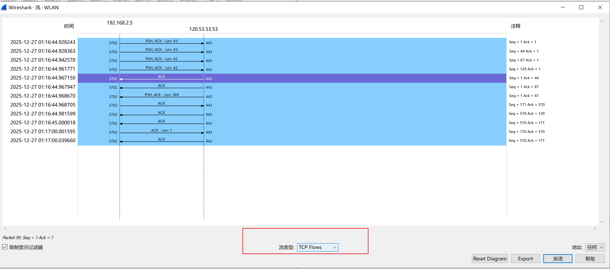


Wireshark 抓包分析 TCP 三次握手
=======================

（1）TCP 三次握手连接建立过程

    Step1：客户端发送一个 SYN=1，ACK=0 标志的数据包给服务端，请求进行连接，这是第一次握手；

    Step2：服务端收到请求并且允许连接的话，就会发送一个 SYN=1，ACK=1 标志的数据包给发送端，告诉它，可以通讯了，并且让客户端发送一个确认数据包，这是第二次握手；

   Step3：服务端发送一个 SYN=0，ACK=1 的数据包给客户端端，告诉它连接已被确认，这就是第三次握手。TCP 连接建立，开始通讯。


（2）wireshark 抓包获取访问指定服务端数据包

    Step1：启动 wireshark 抓包，打开浏览器输入 www.huawei.com。

    Step2：使用 ping www.huawei.com 获取 IP。


    Step3：输入过滤条件获取待分析数据包列表 ip.addr == 211.162.2.183


  图中可以看到 wireshark 截获到了三次握手的三个数据包。第四个包才是 HTTP 的， 这说明 HTTP 的确是使用 TCP 建立连接的。

**第一次握手数据包**

客户端发送一个 TCP，标志位为 SYN，序列号为 0， 代表客户端请求建立连接。 如下图。


数据包的关键属性如下：

  SYN ：标志位，表示请求建立连接

  Seq = 0 ：初始建立连接值为 0，数据包的相对序列号从 0 开始，表示当前还没有发送数据

  Ack =0：初始建立连接值为 0，已经收到包的数量，表示当前没有接收到数据

**第二次握手的数据包**

服务器发回确认包, 标志位为 SYN,ACK. 将确认序号 (Acknowledgement Number) 设置为客户的 I S N 加 1 以. 即 0+1=1, 如下图


 数据包的关键属性如下：

  [SYN + ACK]: 标志位，同意建立连接，并回送 SYN+ACK

  Seq = 0 ：初始建立值为 0，表示当前还没有发送数据

  Ack = 1：表示当前端成功接收的数据位数，虽然客户端没有发送任何有效数据，确认号还是被加 1，因为包含 SYN 或 FIN 标志位。（并不会对有效数据的计数产生影响，因为含有 SYN 或 FIN 标志位的包并不携带有效数据）

**第三次握手的数据包**

  客户端再次发送确认包 (ACK) SYN 标志位为 0,ACK 标志位为 1. 并且把服务器发来 ACK 的序号字段 + 1, 放在确定字段中发送给对方. 并且在数据段放写 ISN 的 + 1, 如下图:


数据包的关键属性如下：

  ACK ：标志位，表示已经收到记录

  Seq = 1 ：表示当前已经发送 1 个数据

  Ack = 1 : 表示当前端成功接收的数据位数，虽然服务端没有发送任何有效数据，确认号还是被加 1，因为包含 SYN 或 FIN 标志位（并不会对有效数据的计数产生影响，因为含有 SYN 或 FIN 标志位的包并不携带有效数据)。  

  就这样通过了 TCP 三次握手，建立了连接。开始进行数据交互


下面针对数据交互过程的数据包进行一些说明：


数据包的关键属性说明

  Seq: 1

  Ack: 1: 说明现在共收到 1 字节数据


  Seq: 1  
  Ack: 951: 说明现在服务端共收到 951 字节数据

  在 TCP 层，有个 FLAGS 字段，这个字段有以下几个标识：SYN, FIN, ACK, PSH, RST, URG。如下


    其中，对于我们日常的分析有用的就是前面的五个字段。它们的含义是：SYN 表示建立连接，FIN 表示关闭连接，ACK 表示响应，PSH 表示有 DATA 数据传输，RST 表示连接重置。

Wireshark 分析常用操作
================

  调整数据包列表中时间戳显示格式。调整方法为 View -->Time Display Format --> Date and Time of Day。调整后格式如下：

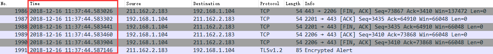

参考文档
====

（1）[wireshark 抓包详细图文教程](https://www.cr173.com/html/20128_all.html)