[传送门]: https://www.bilibili.com/video/BV1j54y1b7qv

# 多用户即时通信系统

# 需求分析

1，用户登录
2，拉取在线用户列表
3，无异常退出（客户端、服务端）
4，私聊5，群聊
6，发文件
7，服务器推送新闻

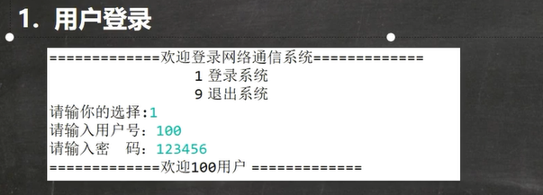

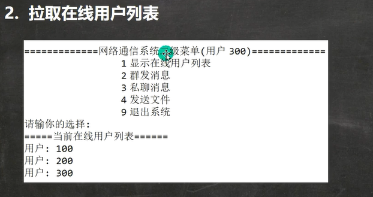

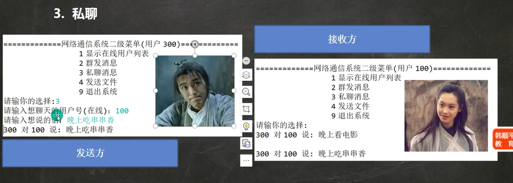

# 需求实现

## 原理图

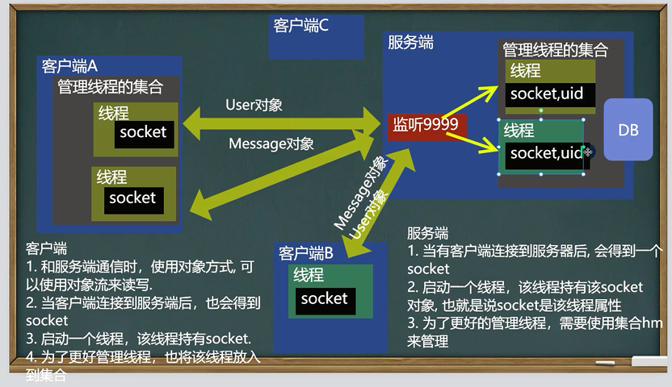

原理分析：

1. 服务器和客户端连接后，都启动一个线程循环读取Message对象【发送者、内容、消息类型等】

2. 客户端/服务器需要进行回复是，通过在相应的管理线程中获取线程，从线程中获取socket，得到输出流，在用对象流包裹一层，将交互的message对象传输，客户端/服务器都有线程在循环的读取，对消息进行处理

## 用户登陆

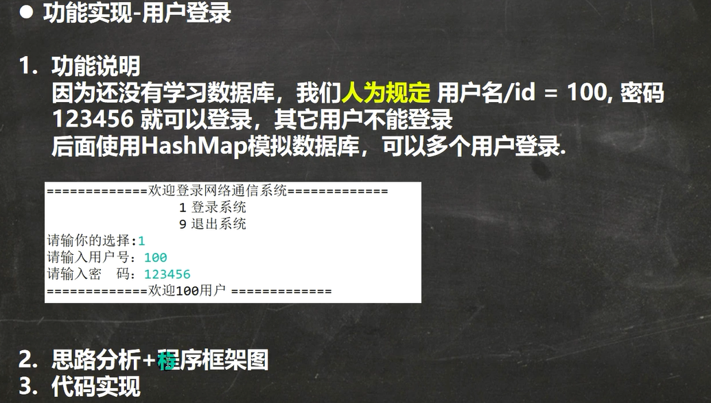

## 拉取用户列表

客户端发送message消息给服务器

通过客户端保持与服务器连接的socket的线程

## 无异常退出

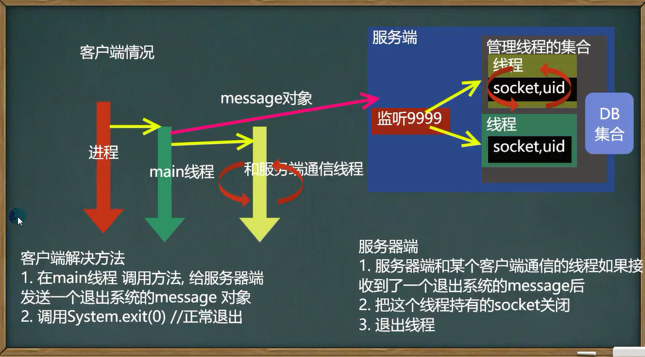

## 私聊实现

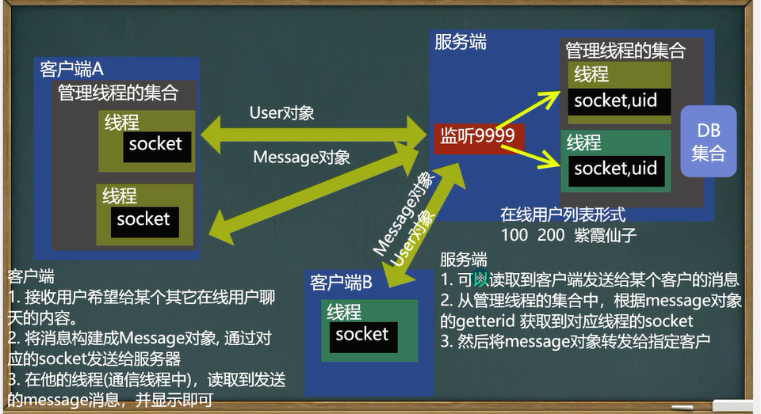

## 群聊

参考私聊，服务器转发到多人

## 发送文件

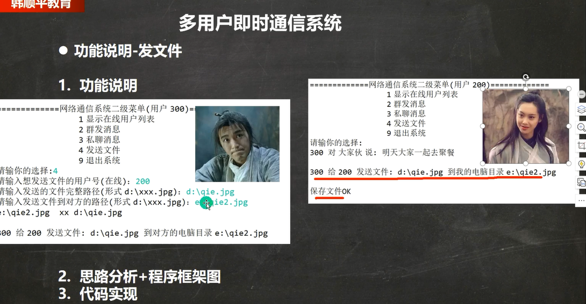

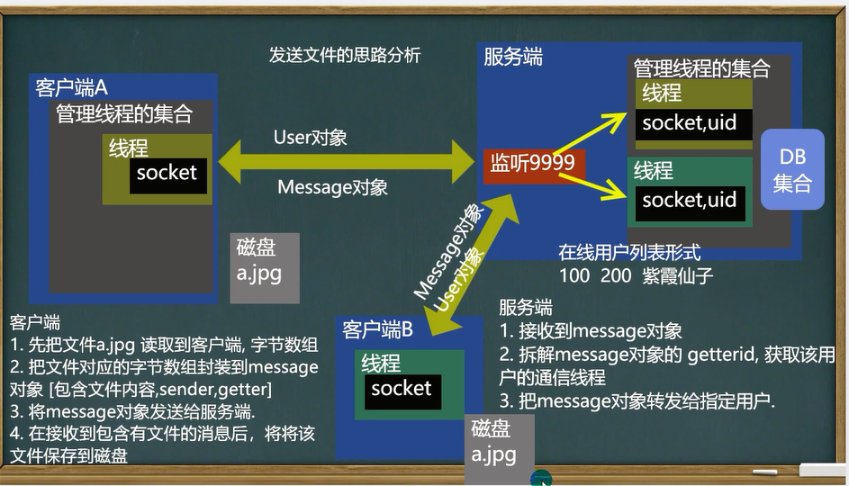

## 推送新闻

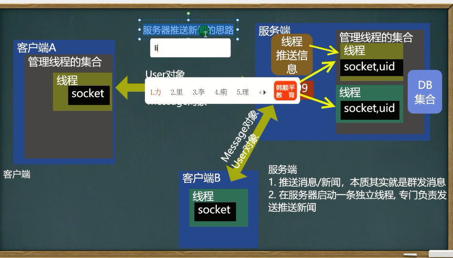

## 离线消息

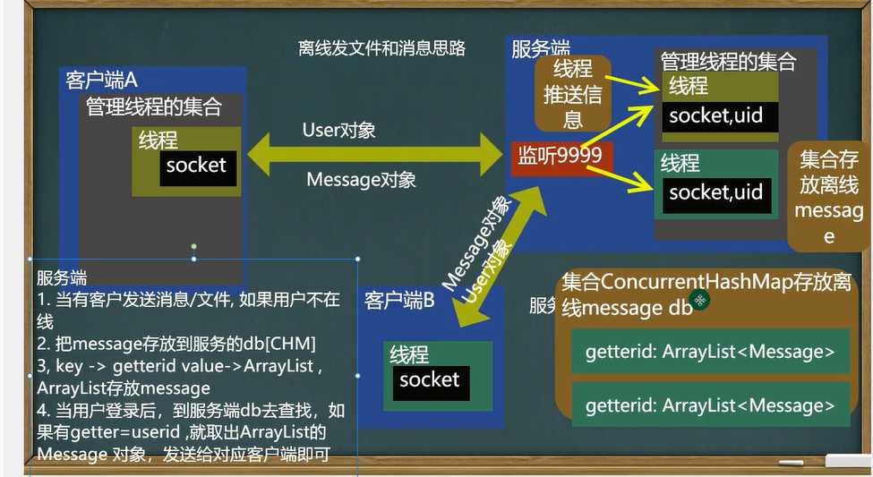