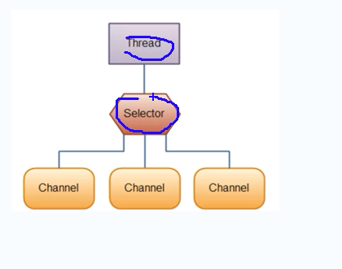
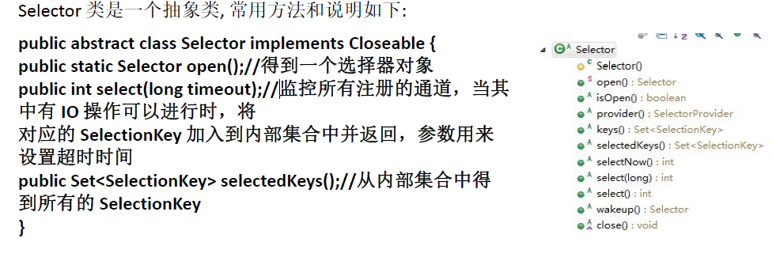
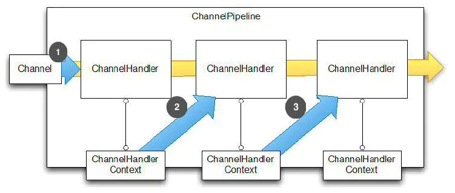
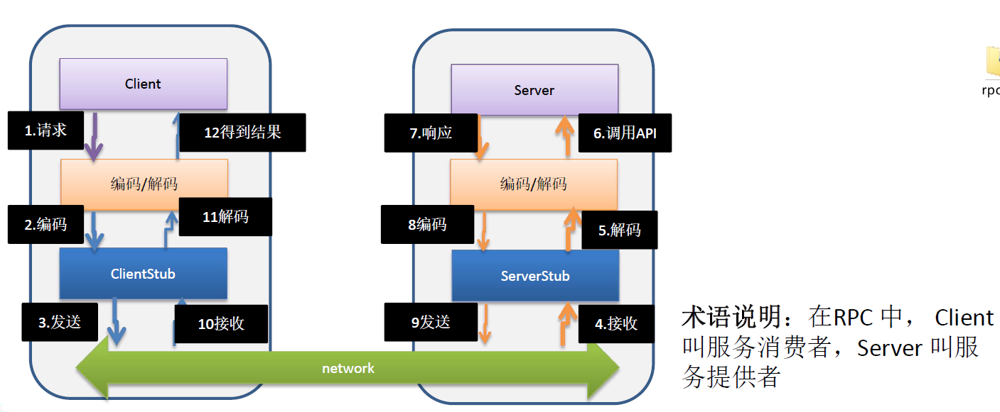

# Netty介绍和应用场景

要求已经掌握了Java编程，主要技术构成：Java OOP编程、Java多线程编程、JavaIO编程、Java网络编程、常用的Java设计模式（比如观察者模式，命令模式，职责链模式）、常用的数据结构（比如链表）

<u>**什么是异步非阻塞**</u>

** 针对对象不一样

- 异步和同步：**异步和同步针对<u>调用者</u>**，调用者发送请求，如果等着对方回应之后才去做其他事情就是同步，如果发送请求之后不等着对方回应就去做其他事情就是异步
- **阻塞和非阻塞针对<u>被调用者</u>**，被调用者收到请求之后，做完请求任务之后才给出反馈就是阻塞，收到请求之后马上给出反馈然后再去做事情就是非阻塞

## 1.2 Netty的介绍

1）Netty是由JBOSS提供的一个Java开源框架，现为Github上的独立项目。
2）Netty是一个异步的、基于事件驱动的网络应用框架，用以快速开发高性能、高可靠性的网络IO程序。


3）Netty主要针对在TCP协议下，面向Clients端的高并发应用，或者Peer-to-Peer场景下的大量数据持续传输的应用。

4）Netty本质是一个NIO框架，适用于服务器通讯相关的多种应用场景


5）要透彻理解Netty，需要先学习NIO，这样我们才能阅读Netty的源码。

## 1.3 Netty的应用场景

### 1.3.1互联网行业

1）互联网行业：在分布式系统中，各个节点之间需要远程服务调用，高性能的RPC框架必不可少，Netty作为异步高性能的通信框架，往往作为基础通信组件被这些RPC框架使用。
2）典型的应用有：阿里分布式服务框架Dubbo的RPC框架使用Dubbo协议进行节点间通信，Dubbo协议默认使用Netty作为基础通信组件，用于实现各进程节点之间的内部通信

### 1.3.2游戏行业

1）无论是手游服务端还是大型的网络游戏，Java语言得到了越来越广泛的应用

2）Netty作为高性能的基础通信组件，提供 TCPUDP和HTTP协议栈，方便定制和开发私有协议栈，账号登录服务器
3）地图服务器之间可以方便的通过Netty进行高性能的通信

### 1.3.3大数据领域

1）经典的Hadoop的高性能通信和序列化组件Avro的RPC框架，默认采用Netty进行跨界点通信

2）它的Netty Service基于Netty框架二次封装实现。


## 1.3.4其它开源项目使用到Netty

https://netty.io/wiki/related-projects.html

## 1.4Netty的学习参考资料


# BIO编程

## I/O模型

### I/O 模型基本说明

1) I/O 模型简单的理解：就是用什么样的通道进行数据的发送和接收，很大程度上决定了程序通信的性能
2) Java共支持3种网络编程模型/IO模式：BIO、NIO、AIO
3) Java `BIO` ： 同步并阻塞(**传统阻塞型**)，服务器实现模式为一个连接一个线程，即客户端有连接请求时服务器端就需要启动一个线程进行处理，如果这个连接不做任何事情会造成不必要的线程开销 【简单示意图】


4) Java `NIO` ： **同步非阻塞**，服务器实现模式为一个线程处理多个请求(连接)，即客户端发送的连接请求都会注册到多路复用器上，多路复用器轮询到连接有I/O请求就进行处理
【简单示意图】


5) Java `AIO`(NIO.2) ： **异步非阻塞**，AIO 引入异步通道的概念，采用了 Proactor 模式，简化了程序编写，对于有效的请求才启动线程，它的特点是先由操作系统完成后才通知服务端程序启动线程去处理，一般适用于连接数较多且连接时间较长的应用

## BIO、NIO、AIO适用场景分析

1) BIO方式适用于**连接数目比较小且固定的架构**，这种方式对服务器资源要求比较高，并发局限于应用中，JDK1.4以前的唯一选择，但程序简单易理解。

2) NIO方式适用于**连接数目多且连接比较短**（轻操作）的架构，比如聊天服务器，弹幕系统，服务器间通讯等。编程比较复杂，JDK1.4开始支持。

3) AIO方式使用于**连接数目多且连接比较长**（重操作）的架构，比如相册服务器，充分调用OS参与并发操作，编程比较复杂，JDK7开始支持。【目前没有得到广泛应用】

## Java BIO 基本介绍

1) Java BIO 就是**传统的java io 编程**，其相关的类和接口在 `java.io`

2) `BIO(blocking I/O)` ： **同步阻塞**，服务器实现模式为一个连接一个线程，即客户端有连
接请求时服务器端就需要启动一个线程进行处理，如果这个连接不做任何事情会造
成不必要的线程开销，可以通过**线程池机制改善**(实现多个客户连接服务器)。 

3) BIO方式适用于连接数目比较小且固定的架构，这种方式对服务器资源要求比较高，
并发局限于应用中，JDK1.4以前的唯一选择，程序简单易理解

### Java BIO 工作机制


###  Java BIO应用实例

实例说明：
1）使用BIO模型编写一个服务器端，监听6666端口，当有客户端连接时，就启动一个线程与之通讯。

2）要求使用线程池机制改善，可以连接多个客户端.

3）服务器端可以接收客户端发送的数据（telnet方式即可）

4）代码演示

```java
import java.io.IOException;
import java.io.InputStream;
import java.net.ServerSocket;
import java.net.Socket;
import java.util.concurrent.ExecutorService;
import java.util.concurrent.Executors;

public class BioServer {

//线程池机制
//思路
//1.创建一个线程池
//2．如果有客户端连接，就创建一个线程，与之通讯（单独写一个方法）

    public static void main(String[] args) throws IOException {
        ExecutorService newCachedThreadPool = Executors.newCachedThreadPool();
        ServerSocket server = new ServerSocket(6666);
        System.out.println("服务器启动...");
        while (true) {
            System.out.println("线程信息" + Thread.currentThread().getName() + "\t" + Thread.currentThread().getId());
            //监听等待客户端连接
            System.out.println("等待连接...");//检测accept是阻塞的
            Socket socket = server.accept();
            System.out.println("连接到一个客户端...");
            //创建一个线程，与之通讯
            newCachedThreadPool.execute(new Runnable() {
                @Override
                public void run() {
                    handle(socket);
                }
            });

        }
    }

    //编写一个handler方法，和客户端通讯
    public static void handle(Socket socket) {
        System.out.println("线程信息" + Thread.currentThread().getName() + "\t" + Thread.currentThread().getId());
        byte[] bytes = new byte[1024];
        //通过socket获取输入流，
        try {
            InputStream inputStream = socket.getInputStream();
            int len = 0;
            //循环的读取客户端发送的数据
            while (true) {
                System.out.println("read...");//检测read是阻塞的
                len = inputStream.read(bytes);
                if (len!= -1) {
                    String s = new String(bytes, 0, len);
                    System.out.println(s);
                }else {
                    break;
                }
            }
        } catch (IOException e) {
            e.printStackTrace();
        } finally {
            try {
                socket.close();
            } catch (IOException e) {
                e.printStackTrace();
            }
            System.out.println("关闭client连接");
        }

    }
}

```

使用`telnet 127.0.0.1 6666`模拟客户端进行测试


### Java BIO 问题分析

1) 每个请求都需要创建独立的线程，与对应的客户端进行数据Read，业务处理，数据 Write 。
2) 当并发数较大时，需要**创建大量线程来处理连接**，系统资源占用较大。
3) 连接建立后，如果当前线程暂时没有数据可读，则线程就阻塞在 Read 操作上，造成线程资源浪费

# Java NIO编程

## Java NIO 基本介绍

1) Java NIO 全称 **java non-blocking IO**，是指 JDK 提供的新API。从 JDK1.4 开始，Java 提供了一系列改进的输入/输出的新特性，被统称为 NIO(即 New IO)，是**同步非阻塞**的

2) NIO 相关类都被放在 `java.nio` 包及子包下，并且对原 java.io包中的很多类进行改写。

3) NIO 有三大核心部分：`Selector(选择器)，Channel(通道)，Buffer(缓冲区)`

4) NIO是 面向**缓冲区** **，或者面向块** 编程的。数据读取到一个它稍后处理的缓冲区，需要时可在缓冲区中前后移动，这就增加了处理过程中的灵活性，使用它可以提供非阻塞式的高伸缩性网络

5) Java NIO的非阻塞模式，使一个线程从某通道发送请求或者读取数据，但是它仅能得到目前可用的数据，如果目前没有数据可用时，就什么都不会获取，**而不是保持线程阻塞**，所以直至数据变的可以读取之前，该线程可以继续做其他的事情。 非阻塞写也是如此，一个线程请求写入一些数据到某通道，但不需要等待它完全写入，这个线程同时可以去做别的事情。

6) 通俗理解：NIO是可以做到用一个线程来处理多个操作的。假设有10000个请求过来,根据实际情况，可以分配50或者100个线程来处理。不像之前的阻塞IO那样，非得分配10000个。

7) HTTP2.0使用了多路复用的技术，做到同一个连接并发处理多个请求，而且并发请求的数量比HTTP1.1大了好几个数量级。


8) 案例说明NIO的Buffer

```java
import java.nio.IntBuffer;

public class BasicBuffer {

    public static void main(String[] args) {
        //举例说明Buffer的使用（简单说明）
        //创建一个Buffer，大小为5，即可以存放5个int
        IntBuffer intBuffer = IntBuffer.allocate(5);

        //循环向buffer存放数据
        for (int i = 0; i < intBuffer.capacity(); i++) {
            intBuffer.put(10+i);
        }

        //如何从buffer读取数据
        intBuffer.flip(); //将buffer转换，读写切换

        while (intBuffer.hasRemaining()){
            System.out.println(intBuffer.get());
        }

    }
}
```

## NIO 和 BIO 的比较

1) BIO 以流的方式处理数据,而 NIO 以块的方式处理数据,块 I/O 的效率比流 I/O 高很多

2) BIO 是阻塞的，NIO 则是非阻塞的

3) BIO基于字节流和字符流进行操作，而 NIO 基于 Channel(通道)和 Buffer(缓冲区)进行操作，数据总是从通道读取到缓冲区中，或者从缓冲区写入到通道中。
Selector(选择器)用于监听多个通道的事件（比如：连接请求，数据到达等），因此使用**单个线程就可以监听多个客户端通**道

## NIO 三大核心原理示意图


Selector 、 Channel 和 Buffer 的关系图(简单版)关系图的说明:
1) 每个channel 都会对应一个Buffer

2) Selector 对应一个线程， 一个线程对应多个channel(连接)

3) 该图反应了有三个channel 注册到 该selector //程序

4) 程序切换到哪个channel ，是由事件决定的, Event 就是一个重要的概念

5) Selector 会根据不同的事件，在各个通道上切换

6) Buffer 就是一个内存块 ， 底层是有一个数组

7) 数据的读取写入是通过Buffer, 这个和BIO , BIO 中要么是输入流，或者是输出流, 不能双向，但是NIO的Buffer 是可以读也可以写, 需要 `flip()` 方法切换

8) channel 是双向的, 可以返回底层操作系统的情况, 比如Linux ， 底层的操作系统通道就是双向的.

## 缓冲区(Buffer)

### 基本介绍

缓冲区（Buffer）：缓冲区本质上是一个可以读写数据的内存块，可以理解成是一个**容器对象(含数组)**，该对象提供了**一组方法**，可以更轻松地使用内存块，，缓冲区对象内置了一些机制，能够跟踪和记录缓冲区的状态变化情况。Channel 提供从文件、网络读取数据的渠道，但是读取或写入的数据都必须经由 Buffer，如图: 


### Buffer 类及其子类

1) 在 NIO 中，Buffer 是一个顶层父类，它是一个抽象类, 类的层级关系图:


2) Buffer类定义了所有的缓冲区都具有的四个属性来提供关于其所包含的数据元素的信息:


3) Buffer类相关方法一览

```java
public abstract class Buffer {
    //JDK1.4时，引入的api
    public final int capacity( )//返回此缓冲区的容量**
    public final int position( )//返回此缓冲区的位置**
    public final Buffer position (int newPositio)//设置此缓冲区的位置**
    public final int limit( )//返回此缓冲区的限制**
    public final Buffer limit (int newLimit)//设置此缓冲区的限制**
    public final Buffer mark( )//在此缓冲区的位置设置标记
    public final Buffer reset( )//将此缓冲区的位置重置为以前标记的位置
    public final Buffer clear( )//清除此缓冲区, 即将各个标记恢复到初始状态，但是数据并没真正擦除**
    public final Buffer flip( )//反转此缓冲区**
    public final Buffer rewind( )//重绕此缓冲区
    public final int remaining( )//返回当前位置与限制之间的元素数
    public final boolean hasRemaining( )//告知在当前位置和限制之间是否有元素**
    public abstract boolean isReadOnly( );//告知此缓冲区是否为只读缓冲区**

    //JDK1.6时引入的api
    public abstract boolean hasArray();//告知此缓冲区是否具有可访问的底层实现数组**
    public abstract Object array();//返回此缓冲区的底层实现数组**
    public abstract int arrayOffset();//返回此缓冲区的底层实现数组中第一个缓冲区元素的偏移量
    public abstract boolean isDirect();//告知此缓冲区是否为直接缓冲区
}
```

### ByteBuffer

从前面可以看出对于 Java 中的基本数据类型(boolean除外)，都有一个 Buffer 类型与之相对应，**最常用**的自然是`ByteBuffer` 类（二进制数据），该类的主要方法如下：

```java
public abstract class ByteBuffer {
    //缓冲区创建相关api
    public static ByteBuffer allocateDirect(int capacity)//创建直接缓冲区**
    public static ByteBuffer allocate(int capacity)//设置缓冲区的初始容量**
    public static ByteBuffer wrap(byte[] array)//把一个数组放到缓冲区中使用
    //构造初始化位置offset和上界length的缓冲区
    public static ByteBuffer wrap(byte[] array,int offset, int length)
    //缓存区存取相关API
    public abstract byte get( );//从当前位置position上get，get之后，position会自动+1 **
    public abstract byte get (int index);//从绝对位置get **
    public abstract ByteBuffer put (byte b);//从当前位置上添加，put之后，position会自动+1 **
    public abstract ByteBuffer put (int index, byte b);//从绝对位置上put **
}
```

## 通道(Channel)

### 基本介绍

1) NIO的通道类似于流，但有些区别如下：
	• 通道可以同时进行读写，而流只能读或者只能写
	• 通道可以实现异步读写数据
	• 通道可以从缓冲读数据，也可以写数据到缓冲:


2) BIO 中的 stream 是单向的，例如 FileInputStream 对象只能进行读取数据的操作，而 NIO 中的通道(Channel)是双向的，可以读操作，也可以写操作。

3) Channel在NIO中是一个接口`public interface Channel extends Closeable{}`

4) 常用的 Channel 类有：FileChannel、DatagramChannel、ServerSocketChannel 和SocketChannel。【ServerSocketChanne 类似ServerSocket , SocketChannel 类似 Socket】

5) FileChannel 用于文件的数据读写，DatagramChannel 用于 UDP 的数据读写，ServerSocketChannel 和 SocketChannel 用于 TCP的数据读写。


### FileChannel 类

FileChannel主要用来对本地文件进行 IO 操作，常见的方法有
1) `public int read(ByteBuffer dst)` ，从通道读取数据并放到缓冲区中
2) `public int write(ByteBuffer src)` ，把缓冲区的数据写到通道中
3) `public long transferFrom(ReadableByteChannel src, long position, long count)`，从目标通道中复制数据到当前通道
4) `public long transferTo(long position, long count, WritableByteChannel target)`，把数据从当前通道复制给目标通道


### 应用实例1-本地文件写数据

实例要求:
1) 使用前面学习后的ByteBuffer(缓冲) 和 FileChannel(通道)， 将 "hello,尚硅谷" 写入到file01.txt 中
2) 文件不存在就创建

```java
public class NIOFileChannel01 {

    public static void main(String[] args) throws IOException {
        String str ="hello,尚硅谷";

        //创建一个输出流 -> channel
        FileOutputStream outputStream = new FileOutputStream("d:\\file01.txt");

        //通过fileoutputstream获取对应的Filechannel
        //这个filechannel真实类型是FilechannelImpl
        FileChannel fileChannel = outputStream.getChannel();

        //创建一个缓冲区ByteBuffer
        ByteBuffer byteBuffer = ByteBuffer.allocate(1024);

        //将str放入byteBuffer
        byteBuffer.put(str.getBytes(StandardCharsets.UTF_8));

        //对byteBuffer进行flip,设置position=0开始读
        byteBuffer.flip();

        //将byteBuffer数据写入到filechannel
        fileChannel.write(byteBuffer);

        outputStream.close();


    }
}
```

### 应用实例2-本地文件读数据

实例要求:
1) 使用前面学习后的ByteBuffer(缓冲) 和 FileChannel(通道)， 将 file01.txt 中的数据读
入到程序，并显示在控制台屏幕
2) 假定文件已经存在

```java
public class NIOFileChannel01 {

    public static void main(String[] args) throws IOException {

        //创建一个输入流 -> channel
        File file = new File("d:\\file01.txt");
        FileInputStream inputStream = new FileInputStream(file);

        //通过fileinputstream获取对应的Filechannel->实际类型FilechannelImpl
        FileChannel channel = inputStream.getChannel();

        //创建缓冲区
        ByteBuffer buffer = ByteBuffer.allocate((int) file.length());

        //将通道的数据读入到Buffer   返回-1表示读取完毕
        channel.read(buffer);

        //将byteBuffer的字节数据转成string    array()返回内部的数组
        System.out.println(new String(buffer.array()));

        inputStream.close();
    }
}
```

### 应用实例3-使用一个Buffer完成文件读取写入

实例要求:
1) 使用 FileChannel(通道) 和 方法 read , write，完成文件的拷贝
2) 拷贝一个文本文件 1.txt , 放在项目下即可


```java
public class NIOFileChannel03 {
    public static void main(String[] args) throws IOException {

        File file = new File("1.txt");

        FileInputStream fileInputStream = new FileInputStream(file);
        FileChannel inputStreamChannel = fileInputStream.getChannel();

        FileOutputStream fileOutputStream = new FileOutputStream("2.txt");
        FileChannel fileOutputStreamChannel = fileOutputStream.getChannel();


        ByteBuffer byteBuffer = ByteBuffer.allocate(5);
        while (true){

            //这里有一个重要的操作，一定不要忘了
            /* 重置标志位，清空buffer，重置position位置，之前写出是position等于limit
                public final Buffer clear() {
                    position = 0;
                    limit = capacity;
                    mark = -1;
                    return this;
                }
             */
            byteBuffer.clear();

            //从通道读取数据到缓冲区
            int len = inputStreamChannel.read(byteBuffer);
            if (len == -1){//表示读取完毕
                break;
            }
            //反转 position
            byteBuffer.flip();

            //将缓冲区数据写入到通道
            fileOutputStreamChannel.write(byteBuffer);
        }

        //关闭相应的流
        fileInputStream.close();
        fileOutputStream.close();
    }
}
```

### 应用实例4-拷贝文件`transferFrom` 方法

实例要求:
1) 使用 FileChannel(通道) 和 方法 transferFrom ，完成文件的拷贝
2) 拷贝一张图片

```java
public class NIOFileChannel04 {
    public static void main(String[] args) throws IOException {
        File file = new File("test.png");

        FileInputStream fileInputStream = new FileInputStream(file);
        FileChannel inputStreamChannel = fileInputStream.getChannel();

        FileOutputStream fileOutputStream = new FileOutputStream("test_bak.png");
        FileChannel fileOutputStreamChannel = fileOutputStream.getChannel();

        ByteBuffer byteBuffer = ByteBuffer.allocate(5);
        long position = 0;
        while (true) {

            long l = fileOutputStreamChannel.transferFrom(inputStreamChannel, position, 512);
            position += l;
            if (l==0){
                break;
            }
        }

        //关闭相应的流
        fileInputStream.close();
        fileOutputStream.close();
    }
}

```

### 关于Buffer 和 Channel的注意事项和细节

1) ByteBuffer 支持类型化的put 和 get, put 放入的是什么数据类型，get就应该使用相应的数据类型来取出，否则可能有 BufferUnderflowException 异常。[举例说明]

```java
public class ByteBUfferPutGet {
    public static void main(String[] args) {
        //创建一个Buffer
        ByteBuffer buffer = ByteBuffer.allocate(64);
        //类型化方式放入数据
        buffer.putInt(100);
        buffer.putLong(9);
        buffer.putChar('尚');
        buffer.putShort((short) 4);

        //反转
        buffer.flip();
        //取出
        System.out.println(buffer.getInt());
        System.out.println(buffer.getLong());
        System.out.println(buffer.getChar());
        System.out.println(buffer.getShort());

    }
}
```

2) 可以将一个普通Buffer 转成只读Buffer [举例说明]

```java
public class ReadOnlyBuffer {

    public static void main(String[] args)  {
        //创建一个buffer
        ByteBuffer buffer = ByteBuffer.allocate(64);
        for (int i = 0; i < 64; i++) {
            buffer.put((byte) i);
        }
        //读取
        buffer.flip();
        //得到一个只读的Buffer
        ByteBuffer asReadOnlyBuffer = buffer.asReadOnlyBuffer();
        System.out.println(asReadOnlyBuffer.getClass());

        while (buffer.hasRemaining()){
            System.out.println(buffer.get());
        }
    }
}
```

3) NIO 还提供了 **MappedByteBuffer**， 可以让文件直接在内存（堆外的内存）中进行修改， 而如何同步到文件由NIO 来完成. [举例说明]

```java
/**
 * 说明
 * 1.MappedByteBuffer可让文件直接在内存(堆外内存)修改,操作系统不需要拷贝一次
 */
public class MappedByteBufferTest {

    public static void main(String[] args)throws IOException {

        RandomAccessFile randomAccessFile = new RandomAccessFile("1.txt","rw");

        //获取对应通道
        FileChannel channel = randomAccessFile.getChannel();

        /*
         * 参数：Filechannel.MapMode.READWRITE使用的读写模式
         * 参数2：0：可以直接修改的起始位置
         * 参数3：5：是映射到内存的大小(不是索引位置),即将文件1.txt的多少个字节映射到内存
         * 可以直接修改的范围就是0-5
         * 实际类型DirectByteBuffer
         */
        MappedByteBuffer mappedByteBuffer = channel.map(FileChannel.MapMode.READ_WRITE, 0, 5);

        mappedByteBuffer.put(0, (byte) 'H');
        mappedByteBuffer.put(3, (byte) '9');

        randomAccessFile.close();
    }
}

```

4) 前面我们讲的读写操作，都是通过一个Buffer 完成的，**NIO 还支持 通过多个Buffer (即 Buffer 数组) 完成读写操作**，即 Scattering 【分散】和 Gathering【聚合】

```java
/**
 * Scattering：将数据写入到buffer时，可以采用buffer数组，依次写入[分散]
 * Gathering：从buffer读取数据时，可以采用buffer数组，依次读
 */
public class ScatteringAndGatheringTest {

    public static void main(String[] args) throws IOException {
        //使用 ServerSocketChannel和SocketChannel网络

        ServerSocketChannel serverSocketChannel = ServerSocketChannel.open();
        InetSocketAddress inetSocketAddress = new InetSocketAddress(7000);

        //绑定端口到socket并启动
        serverSocketChannel.socket().bind(inetSocketAddress);

        //创建buffer数组
        ByteBuffer[] byteBuffers = new ByteBuffer[2];
        byteBuffers[0] =  ByteBuffer.allocate(5);
        byteBuffers[1] =  ByteBuffer.allocate(3);

        //等待客户端连接（telnet测试）
        SocketChannel socketChannel = serverSocketChannel.accept();

        int messageLen = 8;//假定从客户端接收8个字习
        //循环读取
        while (true){
            int byteRead = 0;

            while (byteRead <messageLen){
                long read = socketChannel.read(byteBuffers);
                byteRead += read;//累计读取的字节数
                System.out.println("byteRead = " + byteRead);

                //使用流打印，看看当前的buffer的position和limit   map 映射成新的字符串流，循环打印
                Arrays.asList(byteBuffers).stream().map(it->{
                    return "position = "+ it.position() +"，limit" +it.limit();
                }).forEach(System.out::println);
            }

            //将所有的buffer进行反转
            Arrays.asList(byteBuffers).forEach(it->{ it.flip();  });

            //将数据显示到客户端
            long byteWrite = 0;
            while (byteWrite < messageLen){
                long write = socketChannel.write(byteBuffers);
                byteWrite += write;
            }
            //将所有的buffer进行clear
            Arrays.asList(byteBuffers).forEach(it->{ it.clear();  });

            System.out.print ("byteRead = " + byteRead+" byteWrite = " + byteWrite+" messageLen = " + messageLen);

        }

    }
}
```

## Selector(选择器)

### 基本介绍

1) Java 的 NIO，用非阻塞的 IO 方式。可以用一个线程，处理多个的客户端连接，就会使用到`Selector(选择器)`

2) **Selector 能够检测多个注册的通道上是否有事件发生(注意:多个Channel以事件的方式可以注册到同一个Selector)**，如果有事件发生，便获取事件然后针对每个事件进行相应的处理。这样就可以只用一个单线程去管理多个通道，也就是管理多个连接和请求。【示意图】



3) 只有在 连接/通道 真正有读写事件发生时，才会进行读写，就大大地减少了系统开销，并且不必为每个连接都创建一个线程，不用去维护多个线程

4) 避免了多线程之间的上下文切换导致的开销


### Selector类相关方法



注意事项
1) NIO中的 ServerSocketChannel功能类似ServerSocket，SocketChannel功能类似Socket
2) selector 相关方法说明
`selector.select()`//阻塞
`selector.select(1000);/`/阻塞1000毫秒，在1000毫秒后返回
`selector.wakeup();`//唤醒selector
`selector.selectNow();`//不阻塞，立马返还

### NIO 非阻塞 网络编程原理分析图

NIO 非阻塞 网络编程相关的(Selector、SelectionKey、ServerScoketChannel和SocketChannel) 关系梳理图


1. 当客户端连接时,会通过ServerSocketChannel得到SocketChannel
2. Selector 进行监听 select 方法, 返回有事件发生的通道的个数.
3. 将socketChannel注册到Selector上,register(Selector sel, int ops), 一个selector上可以注册多个SocketChannel
4. 注册后返回一个SelectionKey,会和该Selector关联(集合)
5. 进一步得到各个 SelectionKey (有事件发生的)
6. 在通过 SelectionKey 反向获取SocketChannel , 方法 channel()
7. 可以通过 得到的 channel , 完成业务处理
8. 代码撑腰。。

### NIO 非阻塞 网络编程快速入门

案例要求:
1) 编写一个 NIO 入门案例，实现服务器端和客户端之间的数据简单通讯（非阻塞）
2) 目的：理解NIO非阻塞网络编程机制

NIOServer

```java
package com.g.nio.c2s;

import java.io.IOException;
import java.net.InetSocketAddress;
import java.nio.ByteBuffer;
import java.nio.channels.SelectionKey;
import java.nio.channels.Selector;
import java.nio.channels.ServerSocketChannel;
import java.nio.channels.SocketChannel;
import java.util.Iterator;
import java.util.Set;

public class NIOServer {

    public static void main(String[] args) throws IOException {

        //创建ServerSocketChannel-> ServerSocket
        ServerSocketChannel serverSocketChannel = ServerSocketChannel.open();
        //得到一个Selecor对象
        Selector selector = Selector.open();

        //绑定一个端口6666，在服务器端监听
        serverSocketChannel.socket().bind(new InetSocketAddress(6666));

        //设置为非阻塞
        serverSocketChannel.configureBlocking(false);

        //把serverSocketChannel注册到selector关心事件为OP_ACCEPT
        serverSocketChannel.register(selector, SelectionKey.OP_ACCEPT);

        //循环等待客户端连接
        while (true) {

            //这里我们等待1s，如果没有事件发生，返回
            if (selector.select(1000) == 0) {
                System.out.println("服务器等待了1秒，无连接");
                continue;
            }

            //如果返回的>0，就获取到相关的selectionKey集合
            //1，如果返回的>0，表示已经获取到关注的事件
            //通过selectionKeys反向获取通道
            Set<SelectionKey> selectionKeys = selector.selectedKeys();

            //遍历Set<Selectionkey，使用迭代器遍历
            Iterator<SelectionKey> keyIterator = selectionKeys.iterator();

            while (keyIterator.hasNext()) {
                //获取到SelectionKey,根据key对应的通道发生的事件做相应处理
                SelectionKey key = keyIterator.next();


                if (key.isAcceptable()) {//如果是OP_ACCEPT，有新的客户端连接
                    //该该客户端生成一个SocketChannel
                    SocketChannel socketChannel = serverSocketChannel.accept();//accept属于阻塞，但是select已经检测到监听事件，直接读取运行，不会阻塞
                    //将 SocketChannel设置为非阻塞
                    socketChannel.configureBlocking(false);

                    //将socketChannel注册到selector，关注事件为OP READ，同时给socketChannel
                    //关联一个Buffer
                    socketChannel.register(selector, SelectionKey.OP_READ, ByteBuffer.allocate(1024));
                } else if (key.isReadable()) {//发生OP_READ
                    //通过key反向获取到对应channel
                    SocketChannel socketChannel = (SocketChannel) key.channel();
                    //获取到该chanel关联的buffer
                    ByteBuffer buffer = (ByteBuffer) key.attachment();
                    socketChannel.read(buffer);
                    System.out.println("from 客户端： " + new String(buffer.array(),0,buffer.position()));
                }
                //手动从集合中移动当前的selectionKey，防止重复操作
                keyIterator.remove();

            }

        }

    }
}
```

NIOClient

```java
package com.g.nio.c2s;

import java.io.IOException;
import java.net.InetSocketAddress;
import java.nio.ByteBuffer;
import java.nio.channels.SocketChannel;

public class NewIOClient {
    public static void main(String[] args) throws IOException {
        //得到一个网络通道
        SocketChannel socketChannel = SocketChannel.open();
        //设置非阻塞
        socketChannel.configureBlocking(false);

        //提供服务器端的ip和端口
        InetSocketAddress remote = new InetSocketAddress("127.0.0.1", 6666);
        //连接服务器
        if (!socketChannel.connect(remote)) {
            while (!socketChannel.finishConnect()) {
                System.out.println("因为连接需要时间，客户端不会阻塞，可以做其它工作..");
            }

            //如果连接成功，就发送数据
            String str = "你好，服务器，现在测试NIO...";
            //Wraps a byte array into a buffer
            ByteBuffer wrap = ByteBuffer.wrap(str.getBytes());

            //发送数据，将buffer数据写入channel
            socketChannel.write(wrap);

           System.in.read();//进行阻塞

        }
    }
}
```

## SelectionKey

1) SelectionKey，表示 Selector 和网络通道的注册关系, 共四种:

+ `int OP_ACCEPT`：有新的网络连接可以 accept，值为 16
+ `int OP_CONNECT`：代表连接已经建立，值为 8
+ `int OP_READ`：代表读操作，值为 1
+ `int OP_WRITE`：代表写操作，值为 4


  源码中：

```java
public static final int OP_READ = 1 << 0;
public static final int OP_WRITE = 1 << 2;
public static final int OP_CONNECT = 1 << 3;
public static final int OP_ACCEPT = 1 << 4;
```

2) SelectionKey相关方法

```java
public abstract class SelectionKey {
    public abstract Selector selector();//得到与之关联的Selector 对象
    public abstract SelectableChannel channel();//得到与之关联的通道
    public final Object attachment();//得到与之关联的共享数据
    public abstract SelectionKey interestOps(int ops);//设置或改变监听事件
    public final boolean isAcceptable();//是否可以 accept
    public final boolean isReadable();//是否可以读
    public final boolean isWritable();//是否可以写
}
```

## ServerSocketChannel

1)ServerSocketChannel 在服务器端监听新的客户端 Socket 连接
2) 相关方法如下

```java
public abstract class ServerSocketChannel
extends AbstractSelectableChannel
implements NetworkChannel{
    public static ServerSocketChannel open();//得到一个 ServerSocketChannel 通道
    public final ServerSocketChannel bind(SocketAddress local);//设置服务器端端口号
    public final SelectableChannel configureBlocking(boolean block);//设置阻塞或非阻塞模式，取值 false 表示采用非阻塞模式
    public SocketChannel accept();//接受一个连接，返回代表这个连接的通道对象
    public final SelectionKey register(Selector sel, int ops);//注册一个选择器并设置监听事件
}
```

## SocketChannel

1) SocketChannel，网络 IO 通道，具体负责进行读写操作。NIO 把缓冲区的数据写入通道，或者把通道里的数据读到缓冲区。

2）相关方法如下

```java
public abstract class SocketChannel
extends AbstractSelectableChannel
implements ByteChannel, ScatteringByteChannel, GatheringByteChannel,
NetworkChannel{
    public static SocketChannel open();//得到一个SocketChannel 通道
    public final SelectableChannel configureBlocking(boolean block);//设置阻塞或非阻塞模式，取值 false 表示采用非阻塞模式
    public boolean connect(SocketAddress remote);//连接服务器
    public boolean finishConnect();//如果上面的方法连接失败，接下来就要通过该方法 完成连接操作
    public int write(ByteBuffer src);//往通道里写数据
    public int read(ByteBuffer dst);//从通道里读数据
    public final SelectionKey register(Selector sel, int ops, Object att);//注册一个选择器并设置监听事件，最后一个参数可以设置共享数据
    public final void close();//关闭通道
}
```

## NIO 网络编程应用实例-群聊系统

实例要求:
1) 编写一个 NIO 群聊系统，实现服务器端和客户端之间的数据简单通讯（非阻塞）
2) 实现多人群聊
3) 服务器端：可以监测用户上线，离线，并实现消息转发功能
4) 客户端：通过channel 可以无阻塞发送消息给其它所有用户，同时可以接受其它用户发送的消息(有服务器转发得到)
5) 目的：进一步理解NIO非阻塞网络编程机制


服务端

```java
package com.g.groupchat;

import java.io.IOException;
import java.net.InetSocketAddress;
import java.nio.ByteBuffer;
import java.nio.channels.*;
import java.util.Iterator;

public class GroupChatServer {
    //定义相关属性
    private Selector selector;
    private ServerSocketChannel listenChannel;
    private final static int PORT = 6667;

    //构造器，完成初始化工作
    GroupChatServer() {

        try {
            //得到选择器
            selector = Selector.open();
            //ServerSocketChannel
            listenChannel = ServerSocketChannel.open();
            //绑定端口
            listenChannel.socket().bind(new InetSocketAddress(PORT));
            //设置非阻塞模式
            listenChannel.configureBlocking(false);
            //将该listenchannel注册到selector
            listenChannel.register(selector, SelectionKey.OP_ACCEPT);

        } catch (IOException e) {
            e.printStackTrace();
        }

    }

    //监听代码
    public void listen() {
        try {
            //循环处理
            while (true) {
                int count = selector.select(2000);
                if (count > 0) {//有事件处理
                    //遍历得到selectionkey集合
                    Iterator<SelectionKey> iterator = selector.selectedKeys().iterator();
                    while (iterator.hasNext()) {
                        //取出selectionkey
                        SelectionKey key = iterator.next();
                        //监听到accept
                        if (key.isAcceptable()){
                            SocketChannel socketChannel = listenChannel.accept();
                            //设置非阻塞
                            socketChannel.configureBlocking(false);
                            //将该sc注册到seletor
                            socketChannel.register(selector,SelectionKey.OP_READ);
                            System.out.println(socketChannel.getRemoteAddress()+"上线了");
                        }else if (key.isReadable()){//通道发送read事件，即通道是可读的状态
                            //处理读【专门写方法】
                            readData(key);
                        }

                       //手动从集合中移动当前的selectionkey，防止重复操作
                       iterator.remove();
                    }
                } else {
                    System.out.println("wait........");
                }
            }
        } catch (IOException e) {
            e.printStackTrace();
        }
    }

    //读取客户端消息
    private void  readData(SelectionKey key){
        SocketChannel channel=null;
        try {
            //取到关联的channe
            channel = (SocketChannel) key.channel();
            //创建缓冲
            ByteBuffer buffer = ByteBuffer.allocate(1024);
            int readCount = channel.read(buffer);
            //根据count的值做处理
            if (readCount > 0 ){
                //把缓存区的数据转成字符串
                String msg = new String(buffer.array(), 0, buffer.position());
                //输出消息
                System.out.println("from 客户端： "  +msg);
                //向其他客户端转发消息(去掉自己)【专门写一个方法处理】
                sendInfoToOther(msg,channel);
            }
        } catch (IOException e) {
            try {
                System.out.println(channel.getRemoteAddress()+"离线了");
            } catch (IOException ioException) {
                ioException.printStackTrace();
            }finally {
                //取消注册
                try {
                    channel.close();
                } catch (IOException ioException) {
                    ioException.printStackTrace();
                }
            }

        }

    }

    //转发消息给其它客户（通道）
    private void sendInfoToOther(String msg, SocketChannel self) throws IOException {

        System.out.println("服务器转发消息中");

        //遍历所有注册到selector上的socketChannel，并排除self
        int sendCount = 0;
        for (SelectionKey key : selector.keys()) {
            //通过key取出通道SocketChannel
           Channel targetChannel = key.channel();
           if (targetChannel instanceof SocketChannel && targetChannel != self){
               //转型
               SocketChannel destChannel = (SocketChannel) targetChannel;
               //将msg存储到buff
               ByteBuffer buffer = ByteBuffer.wrap(msg.getBytes());
               //将buffer的数据写入通道
               destChannel.write(buffer);
               sendCount++;
           }
        }
        System.out.println("sendCount = " + sendCount);
    }


    public static void main(String[] args) {
        //创建一个服务器对象
        GroupChatServer groupChatServer = new GroupChatServer();
        groupChatServer.listen();
    }

}
```

客户端

```java
package com.g.groupchat;

import java.io.IOException;
import java.net.InetSocketAddress;
import java.nio.ByteBuffer;
import java.nio.channels.SelectionKey;
import java.nio.channels.Selector;
import java.nio.channels.SocketChannel;
import java.util.Iterator;
import java.util.Scanner;
import java.util.concurrent.TimeUnit;

public class GroupChatClient {

    //定义相关的属性
    private final static String HOST = "127.0.0.1";//服务器的ip
    private final static int PORT = 6667;//服务器的端口
    private Selector selector;
    private SocketChannel socketChannel;
    String username;

    public GroupChatClient() throws IOException {
        selector = Selector.open();
        //连接服务器
        socketChannel = SocketChannel.open(new InetSocketAddress(HOST, PORT));
        //设置非阻塞
        socketChannel.configureBlocking(false);
        //将channel注册到selector
        socketChannel.register(selector, SelectionKey.OP_READ);
        //得到username
        username = socketChannel.getLocalAddress().toString().substring(1);
        System.out.println(username + "is ok..");
    }


    //向服务器发送消息
    public void sendInfo(String info) {
        info = username + " 说 ：" + info;

        try {
            socketChannel.write(ByteBuffer.wrap(info.getBytes()));
        } catch (IOException e) {
            e.printStackTrace();
        }
    }

    //读取服务器消息
    public void readInfo() {
        try {
            int count = selector.select(2000);
            if (count > 0) {//有可用的通道
                Iterator<SelectionKey> iterator = selector.selectedKeys().iterator();

                while (iterator.hasNext()) {
                    SelectionKey key = iterator.next();
                    if (key.isReadable()) {
                        //得到相关的通道
                        SocketChannel channel = (SocketChannel) key.channel();
                        //得到一个Buffer
                        ByteBuffer buffer = ByteBuffer.allocate(1024);
                        channel.read(buffer);

                        //把读到的缓冲区的数据转成字符串
                        String msg = new String(buffer.array());
                        System.out.println(msg.trim());
                    }

                    iterator.remove();//删除当前的selectionkey，防止重复操伸
                }
            } else {
//                System.out.println("没有可用的通道...");
            }
        } catch (IOException e) {
            e.printStackTrace();
        }
    }

    public static void main(String[] args) throws IOException {
        //启动客户端
        GroupChatClient chatClient = new GroupChatClient();

        //启动一个线程,每个3秒，读取服务器端发送的数据
        new Thread(){
            public void run() {
                while (true){
                    chatClient.readInfo();
                    try {
                        TimeUnit.SECONDS.sleep(1);
                    } catch (InterruptedException e) {
                        e.printStackTrace();
                    }
                }
            }
        }.start();

        Scanner scanner = new Scanner(System.in);

        while (scanner.hasNextLine()){
            String msg = scanner.next();
            chatClient.sendInfo(msg);
        }
    }


}
```

## NIO与零拷贝

### 零拷贝基本介绍

1) 零拷贝是网络编程的关键，很多性能优化都离不开。
2) 在 Java 程序中，常用的零拷贝有 mmap(内存映射) 和 sendFile。那么，他们在OS 里，到底是怎么样的一个的设计？我们分析 mmap 和 sendFile 这两个零拷贝
3) 另外我们看下NIO 中如何使用零拷贝

### 传统IO数据读写

1) Java 传统 IO 和 网络编程的一段代码

```java
File file = new File("test.txt");
RandomAccessFile raf = new RandomAccessFile(file, "rw");
byte[] arr = new byte[(int) file.length()];
raf.read(arr);
Socket socket = new ServerSocket(8080).accept();
socket.getOutputStream().write(arr);
```

### 传统IO模型


### mmap优化

1) mmap 通过内存映射，将文件映射到内核缓冲区，同时，用户空间可以共享内核空间的数据。这样，在进行网络传输时，就可以减少内核空间到用户空间的拷贝次数。如下图
2) mmap示意图


### sendFile 优化

1) Linux 2.1 版本 提供了sendFile 函数，其基本原理如下：数据根本不经过用户态，直接从内核缓冲区进入到 SocketBuffer，同时，由于和用
户态完全无关，就减少了一次上下文切换
2) 示意图和小结
提示：零拷贝从操作系统角度，是没有cpu 拷贝


3) Linux 在 2.4 版本中，做了一些修改，避免了从内核缓冲区拷贝到 Socketbuffer 的操作，直接拷贝到协议栈，从而再一次减少了数据拷贝。

具体如下图和小结：
这里其实有 一次cpu 拷贝kernel buffer -> socket buffer但是，拷贝的信息很少，比如length , offset , 消耗低，可以忽略


### 零拷贝的再次理解

1) 我们说零拷贝，是从操作系统的角度来说的。因为内核缓冲区之间，没有数据是重复的（**只有 kernel buffer 有一份数据**）。
2) 零拷贝不仅仅带来更少的数据复制，还能带来其他的性能优势，例如更少的上下文切换，更少的 CPU 缓存伪共享以及无 CPU 校验和计算。

### mmap 和 sendFile 的区别

1) mmap 适合小数据量读写，sendFile 适合大文件传输。

2) mmap 需要 4 次上下文切换，3 次数据拷贝；sendFile 需要 3 次上下文切换，最少 2 次数据拷贝。

3) sendFile 可以利用 DMA 方式，减少 CPU 拷贝，mmap 则不能（必须从内核拷贝到 Socket 缓冲区）。

### NIO 零拷贝案例 

案例要求：
1) 使用传统的IO 方法传递一个大文件
2) 使用NIO 零拷贝方式传递(**transferTo()方法**)一个大文件
3) 看看两种传递方式耗时时间分别是多少

NIO 0拷贝服务端

```java
package com.g.zerocopy;

import java.io.IOException;
import java.net.InetSocketAddress;
import java.net.ServerSocket;
import java.nio.ByteBuffer;
import java.nio.channels.ServerSocketChannel;
import java.nio.channels.SocketChannel;

public class NewIOZeroCopyServer {

    public static void main(String[] args) throws IOException {
        ServerSocketChannel serverSocketChannel = ServerSocketChannel.open();
        ServerSocket serverSocket = serverSocketChannel.socket();
        serverSocket.bind(new InetSocketAddress(7001));

        ByteBuffer byteBuffer = ByteBuffer.allocate(4096);

        while (true){
            SocketChannel socketChannel = serverSocketChannel.accept();
            int readCount = 0;
            while (readCount !=-1){
                readCount = socketChannel.read(byteBuffer);
                byteBuffer.rewind();//倒带
            }

        }
    }
}
```

```java
package com.g.zerocopy;

import java.io.FileInputStream;
import java.io.IOException;
import java.net.InetSocketAddress;
import java.nio.ByteBuffer;
import java.nio.channels.FileChannel;
import java.nio.channels.SocketChannel;

public class NewIOZeroCopyClient {

    public static void main(String[] args) throws IOException {
        SocketChannel socketChannel = SocketChannel.open();
        socketChannel.connect(new InetSocketAddress("127.0.0.1", 7001));

        //得到一个文件channel
        String fileName = "protoc-3.6.1-win32.zip";
        FileInputStream fileInputStream = new FileInputStream(fileName);
        FileChannel fileChannel = fileInputStream.getChannel();


        //准备发送
        long start = System.currentTimeMillis();
        //在linux下一个transferTo 方法就可以完成传输
        //在windows 下一次调用transferTo 只能发送8m，就需要分段传输文件，而且要主要
        //传输时的位置   long position  从哪里开始传, long count,传输多少个
        fileChannel.transferTo(0,fileChannel.size(),socketChannel);

        long end = System.currentTimeMillis();
        System.out.println("发送总字节数：" + fileChannel.size()+" 耗 时 " +( end-start));

        //关闭
        fileChannel.close();
    }
}
```

## Java AIO 基本介绍

1) JDK 7 引入了 Asynchronous I/O，即 AIO。在进行 I/O 编程中，常用到两种模式：Reactor和 Proactor。Java 的 NIO 就是 Reactor，当有事件触发时，服务器端得到通知，进行相应的处理
2) AIO 即 NIO2.0，叫做异步不阻塞的 IO。AIO 引入异步通道的概念，采用了Proactor 模式，简化了程序编写，有效的请求才启动线程，它的特点是先由操作系统完成后才通知服务端程序启动线程去处理，一般适用于连接数较多且连接时间较长的应用
3) 目前 AIO 还没有广泛应用，Netty 也是基于NIO, 而不是AIO， 因此我们就不详解AIO了，有兴趣的同学可以参考 <<Java新一代网络编程模型AIO原理及Linux系统AIO介绍>> http://www.52im.net/thread-306-1-1.html

## BIO、NIO、AIO对比表


举例说明
1) 同步阻塞：到理发店理发，就一直等理发师，直到轮到自己理发。
2) 同步非阻塞：到理发店理发，发现前面有其它人理发，给理发师说下，先干其他事情，一会过来看是否轮到自己.
3) 异步非阻塞：给理发师打电话，让理发师上门服务，自己干其它事情，理发师自己来家给你理发

# Netty 概述

## 原生NIO存在的问题

1) NIO 的类库和 API 繁杂，使用麻烦：需要熟练掌握 Selector、ServerSocketChannel、SocketChannel、ByteBuffer 等。
2) 需要具备其他的额外技能：要熟悉 Java 多线程编程，因为 NIO 编程涉及到 Reactor模式【反应器模式】，你必须对多线程和网络编程非常熟悉，才能编写出高质量的 NIO 程序。
3) 开发工作量和难度都非常大：例如客户端面临断连重连、网络闪断、半包读写、失败缓存、网络拥塞和异常流的处理等等。
4) JDK NIO 的 Bug：例如臭名昭著的 Epoll Bug，它会导致 Selector 空轮询，最终导致 CPU 100%。直到 JDK 1.7 版本该问题仍旧存在，没有被根本解决。

## Netty官网说明

官网：https://netty.io/

Netty is an asynchronous event-driven network application frameworkfor rapid development of maintainable high performance protocol servers & clients


1) Netty 是由 JBOSS 提供的一个 Java 开源框架。Netty 提供异步的、基于事件驱动的网络应用程序框架，用以快速开发高性能、高可靠性的网络 IO 程序

2) Netty 可以帮助你快速、简单的开发出一个网络应用，相当于简化和流程化了 NIO 的开发过程

3) Netty 是目前最流行的 NIO 框架，Netty 在互联网领域、大数据分布式计算领域、游戏行业、通信行业等获得了广泛的应用，知名的 Elasticsearch 、Dubbo 框架内部都采用了 Netty。


## Netty的优点

Netty 对 JDK 自带的 NIO 的 API 进行了封装，解决了上述问题。
1) 设计优雅：适用于各种传输类型的统一 API 阻塞和非阻塞 Socket；基于灵活且可扩展的事件模型，可以清晰地分离关注点；高度可定制的线程模型 - 单线程，一个或多个线程池.

2) 使用方便：详细记录的 Javadoc，用户指南和示例；没有其他依赖项，JDK 5（Netty3.x）或 6（Netty 4.x）就足够了。

3) 高性能、吞吐量更高：延迟更低；减少资源消耗；最小化不必要的内存复制。

4) 安全：完整的 SSL/TLS 和 StartTLS 支持。

5) 社区活跃、不断更新：社区活跃，版本迭代周期短，发现的 Bug 可以被及时修复，同时，更多的新功能会被加入

## Netty版本说明

1) netty版本分为 netty3.x 和 netty4.x、netty5.x
2) 因为Netty5出现重大bug，已经被官网废弃了，目前推荐使用的是Netty4.x的稳定版本
3) 目前在官网可下载的版本 netty3.x netty4.0.x 和 netty4.1.x
4) 在本套课程中，我们讲解 Netty4.1.x 版本
5) netty 下载地址： https://bintray.com/netty/downloads/netty/


# Netty 高性能架构设计

## 线程模型基本介绍

1) 不同的线程模式，对程序的性能有很大影响，为了搞清Netty 线程模式，我们来系统的讲解下 各个线程模式， 最后看看Netty 线程模型有什么优越性.
2) 目前存在的线程模型有：

+ 传统阻塞 I/O 服务模型
+ Reactor 模式

3) 根据 Reactor 的数量和处理资源池线程的数量不同，有 3 种典型的实现
      • 单 Reactor 单线程；
      • 单 Reactor 多线程；
      • 主从 Reactor 多线程
4) Netty 线程模式(Netty 主要基于主从 Reactor 多线程模型做了一定的改进，其中主从Reactor 多线程模型有多个 Reactor)

## 传统阻塞 I/O 服务模型

工作原理图
黄色的框表示对象		蓝色的框表示线程		白色的框表示方法(API)


**模型特点**
1) 采用阻塞IO模式获取输入的数据
2) 每个连接都需要独立的线程完成数据的输入、业务处理、数据返回

**问题分析**
1) 当并发数很大，就会创建大量的线程，占用很大系统资源
2) 连接创建后，如果当前线程暂时没有数据可读，该线程会阻塞在read 操作，造成线程资源浪费

## Reactor 模式

针对传统阻塞 I/O 服务模型的 2 个缺点，解决方案：

1) 基于 I/O 复用模型：多个连接共用一个阻塞对象，应用程序只需要在一个阻塞对象等待，无需阻塞等待所有连接。当某个连接有新的数据可以处理时，操作系统通知应用程序，线程从阻塞状态返回，开始进行业务处理
Reactor 对应的叫法: 1. 反应器模式 2. 分发者模式(Dispatcher) 3. 通知者模式(notifier)
2) 基于线程池复用线程资源：不必再为每个连接创建线程，将连接完成后的业务处理任务分配给线程进行处理，一个线程可以处理多个连接的业务。


### I/O 复用结合线程池，就是Reactor 模式基本设计思想，如图：


说明:
1) Reactor 模式，通过一个或多个输入同时传递给服务处理器的模式(基于事件驱动)
2) 服务器端程序处理传入的多个请求,并将它们同步分派到相应的处理线程， 因此Reactor模式也叫Dispatcher模式
3) Reactor 模式使用IO复用监听事件,收到事件后，分发给某个线程(进程), 这点就是网络服务器高并发处理关键

### Reactor 模式中 核心组成：

1) Reactor：Reactor 在一个单独的线程中运行，负责监听和分发事件，分发给适当的处理程序来对 IO 事件做出反应。 它就像公司的电话接线员，它接听来自客户的电话并将线路转移到适当的联系人；

2) Handlers：处理程序执行 I/O 事件要完成的实际事件，类似于客户想要与之交谈的公司中的实际官员。Reactor 通过调度适当的处理程序来响应 I/O 事件，处理程序执行非阻塞操作。

### Reactor 模式分类：

根据 Reactor 的数量和处理资源池线程的数量不同，有 3 种典型的实现
1) 单 Reactor 单线程
2) 单 Reactor 多线程
3) 主从 Reactor 多线程


## 单 Reactor 单线程

参考NIO的群聊系统


方案说明：
1) Select 是前面 I/O 复用模型介绍的标准网络编程 API，可以实现应用程序通过一个阻塞对象监听多路连接请求
2) Reactor 对象通过 Select 监控客户端请求事件，收到事件后通过 Dispatch 进行分发
3) 如果是建立连接请求事件，则由 Acceptor 通过 Accept 处理连接请求，然后创建一个Handler 对象处理连接完成后的后续业务处理
4) 如果不是建立连接事件，则 Reactor 会分发调用连接对应的 Handler 来响应
5) Handler 会完成 Read→业务处理→Send 的完整业务流程


结合实例：服务器端用一个线程通过多路复用搞定所有的 IO 操作（包括连接，读、写等），编码简单，清晰明了，但是如果客户端连接数量较多，将无法支撑，前面的 NIO群聊系统案例就属于这种模型。


方案优缺点分析：
1) 优点：模型简单，没有多线程、进程通信、竞争的问题，全部都在一个线程中完成
2) 缺点：性能问题，只有一个线程，无法完全发挥多核 CPU 的性能。Handler 在处理某个连接上的业务时，整个进程无法处理其他连接事件，很容易导致性能瓶颈
3) 缺点：可靠性问题，线程意外终止，或者进入死循环，会导致整个系统通信模块不可用，不能接收和处理外部消息，造成节点故障
4) 使用场景：客户端的数量有限，业务处理非常快速，比如 Redis在业务处理的时间复杂度 O(1) 的情况


## 单Reactor多线程

工作原理示意图：

方案说明
1) Reactor 对象通过select 监控客户端请求事件, 收到事件后，通过dispatch进行分发

2) 如果建立连接请求, 则右Acceptor 通过accept 处理连接请求, 然后创建一个Handler对象处理完成连接后的各种事件
3) 如果不是连接请求，则由reactor分发调用连接对应的handler 来处理

4) handler 只负责响应事件，不做具体的业务处理,通过read 读取数据后，会分发给后面的worker线程池的某个线程处理业务

5) worker 线程池会分配独立线程完成真正的业务，并将结果返回给handler

6) handler收到响应后，通过send 将结果返回给client


方案优缺点分析：
1) 优点：可以充分的利用多核cpu 的处理能力
2) 缺点：多线程数据共享和访问比较复杂， reactor 处理所有的事件的监听和响应，在单线程运行， 在高并发场景容易出现性能瓶颈.


## 主从 Reactor 多线程

工作原理示意图：
针对单 Reactor 多线程模型中，Reactor 在单线程中运行，高并发场景下容易成为性能瓶颈，可以让Reactor 在多线程中运行


方案说明
1) Reactor主线程 MainReactor 对象通过select 监听连接事件, 收到事件后，通过Acceptor 处理连接事件
2) 当 Acceptor 处理连接事件后，MainReactor 将连接分配给SubReactor
3) subreactor 将连接加入到连接队列进行监听,并创建handler进行各种事件处理
4) 当有新事件发生时， subreactor 就会调用对应的handler处理
5) handler 通过read 读取数据，分发给后面的worker 线程处理
6) worker 线程池分配独立的worker 线程进行业务处理，并返回结果
7）handler收到响应的结果后，再通过send将结果返回给client
8）Reactor主线程可以对应多个Reactor子线程，即MainRecator可以关联多个SubReactor


Scalable IO in Java 对 Multiple Reactors 的原理图解：


方案优缺点说明：
1) 优点：父线程与子线程的数据交互简单职责明确，父线程只需要接收新连接，子线程完成后续的业务处理。
2) 优点：父线程与子线程的数据交互简单，Reactor 主线程只需要把新连接传给子线程，子线程无需返回数据。
3) 缺点：编程复杂度较高


结合实例：这种模型在许多项目中广泛使用，包括 Nginx 主从 Reactor 多进程模型，Memcached 主从多线程，Netty 主从多线程模型的支持

## Reactor 模式小结

3 种模式用生活案例来理解
1) 单 Reactor 单线程，前台接待员和服务员是同一个人，全程为顾客服
2) 单 Reactor 多线程，1 个前台接待员，多个服务员，接待员只负责接待
3) 主从 Reactor 多线程，多个前台接待员，多个服务生


Reactor 模式具有如下的优点：
1) 响应快，不必为单个同步时间所阻塞，虽然 Reactor 本身依然是同步的
2) 可以最大程度的避免复杂的多线程及同步问题，并且避免了多线程/进程的切换开销
3) 扩展性好，可以方便的通过增加 Reactor 实例个数来充分利用 CPU 资源
4) 复用性好，Reactor 模型本身与具体事件处理逻辑无关，具有很高的复用性

## Netty模型

### 工作原理示意图1-简单版

Netty 主要基于主从 Reactors 多线程模型（如图）做了一定的改进，其中主从 Reactor 多线程模型有多个 Reactor


1) BossGroup 线程维护Selector , 只关注Accecpt
2) 当接收到Accept事件，获取到对应的SocketChannel, 封装成 NIOScoketChannel并注册到Worker 线程(事件循环), 并进行维护
3) 当Worker线程监听到selector 中通道发生自己感兴趣的事件后，就进行处理(就由handler)， 注意handler 已经加入到通道


### 工作原理示意图2-进阶版

Netty 主要基于主从Reactors 多线程模型（如图）做了一定的改进，其中主从 Reactor 多线程模型有多个 Reactor


### 工作原理示意图-详细版


1) Netty抽象出两组线程池 BossGroup 专门负责接收客户端的连接,WorkerGroup 专门负责网络的读写

2) BossGroup 和 WorkerGroup 类型都是 NioEventLoopGroup
3) NioEventLoopGroup 相当于一个事件循环组, 这个组中含有多个事件循环 ，每一个事件循环是 NioEventLoop

4) NioEventLoop 表示一个不断循环的执行处理任务的线程， 每个NioEventLoop 都有一个selector , 用于监听绑定在其上的socket的网络通讯

5) NioEventLoopGroup 可以有多个线程, 即可以含有多个NioEventLoop

6) 每个Boss NioEventLoop 循环执行的步骤有3步

1. 轮询accept 事件

2. 处理accept 事件 , 与client建立连接 , 生成NioScocketChannel , 并将其注册到某个worker NIOEventLoop 上的 selector

3. 处理任务队列的任务 ， 即 runAllTasks

  

7) 每个 Worker NIOEventLoop 循环执行的步骤

1. 轮询read, write 事件

2. 处理i/o事件， 即read , write 事件，在对应NioScocketChannel 处理

3. 处理任务队列的任务 ， 即 runAllTasks

   

8) 每个Worker NIOEventLoop 处理业务时，会使用pipeline（管道），pipeline中包含了channel，即通过pipeline可以获取到对应通道，管道中维护了很多的处理器


一些重要概念

- Channel
  数据传输流，与channel相关的概念有以下四个，上一张图让你了解netty里面的Channel。

  

  Channel一览

  - Channel，表示一个连接，可以理解为每一个请求，就是一个Channel。
  - ChannelHandler，核心处理业务就在这里，用于处理业务请求。
  - ChannelHandlerContext，用于传输业务数据。
  - ChannelPipeline，用于保存处理过程需要用到的ChannelHandler和ChannelHandlerContext。

- ByteBuf
  ByteBuf是一个存储字节的容器，最大特点就是使用方便，它既有自己的读索引和写索引，方便你对整段字节缓存进行读写，也支持get/set，方便你对其中每一个字节进行读写，他的数据结构如下图所示：


ByteBuf数据结构


他有三种使用模式：

1. Heap Buffer 堆缓冲区
   堆缓冲区是ByteBuf最常用的模式，他将数据存储在堆空间。

2. Direct Buffer 直接缓冲区

   直接缓冲区是ByteBuf的另外一种常用模式，他的内存分配都不发生在堆，jdk1.4引入的nio的ByteBuffer类允许jvm通过本地方法调用分配内存，这样做有两个好处

   - 通过免去中间交换的内存拷贝, 提升IO处理速度; 直接缓冲区的内容可以驻留在垃圾回收扫描的堆区以外。
   - DirectBuffer 在 -XX:MaxDirectMemorySize=xxM大小限制下, 使用 Heap 之外的内存, GC对此”无能为力”,也就意味着规避了在高负载下频繁的GC过程对应用线程的中断影响.

3. Composite Buffer 复合缓冲区
   复合缓冲区相当于多个不同ByteBuf的视图，这是netty提供的，jdk不提供这样的功能。

### Netty快速入门实例-TCP服务

1) 实例要求：使用IDEA 创建Netty项目
2) Netty 服务器在 6668 端口监听，客户端能发送消息给服务器 "hello, 服务器~"
3) 服务器可以回复消息给客户端 "hello, 客户端~"
4) 目的：对Netty 线程模型 有一个初步认识, 便于理解Netty 模型理论
5) 看老师代码演示
	5.1 编写服务端 

​	5.2 编写客户端 

​	5.3 对netty 程序进行分析，看看netty模型特点
说明: 创建Maven项目，并引入Netty 包


```java
package com.g.netty.simple;

import io.netty.bootstrap.ServerBootstrap;
import io.netty.channel.ChannelFuture;
import io.netty.channel.ChannelInitializer;
import io.netty.channel.ChannelOption;
import io.netty.channel.EventLoopGroup;
import io.netty.channel.nio.NioEventLoopGroup;
import io.netty.channel.socket.SocketChannel;
import io.netty.channel.socket.nio.NioServerSocketChannel;
import io.netty.channel.socket.nio.NioSocketChannel;

public class NettyServer {

    public static void main(String[] args) throws InterruptedException {

        /*
        创建BossGroup和workerGroup
        说明：
            1．创建两个线程组bossGroup 和workerGroup
            2.bossGroup 只是处理连接请求，真正的和客户端业务处理，会交给workerGroup完成
            3．两个都是无限循环
            4.bossGroup和workerGroup含有的子线程（NioEventLoop）的个数   默认实际cpu核数*2
         */
        EventLoopGroup bossGroup = new NioEventLoopGroup(1);
        EventLoopGroup workGroup = new NioEventLoopGroup();

        try {
            //创建服务器端的启动对象，配置参数
            ServerBootstrap bootstrap = new ServerBootstrap();

            //使用链式编程来进行设置
            bootstrap.group(bossGroup,workGroup)//设置两个线程组
                    .channel(NioServerSocketChannel.class)//使用wiosocketchannel作为服务器的通道实现
                    .option(ChannelOption.SO_BACKLOG,128)//设置线程队列得到连接个数
                    .childOption(ChannelOption.SO_KEEPALIVE,true)//设置保持活动连接状态
                    .childHandler(new ChannelInitializer<SocketChannel>() {//创建一个通道测试对象（匿名对象）
                        //给pipeline设置处理器
                        @Override
                        protected void initChannel(SocketChannel ch) throws Exception {
                            ch.pipeline().addLast(new NettyServerHandler());
                        }
                    });//给我们的workerfroup的EventLoop对应的管道设置处理器

            System.out.println("f服务器 is ready");

            //绑定一个端口并且同步，生成了一个channelFujure对象
            //启动服务器（并绑定端口）
            ChannelFuture cf = bootstrap.bind(6668).sync();

            //对关闭通道进行监听
            ChannelFuture sync = cf.channel().closeFuture().sync();
        } finally {
            bossGroup.shutdownGracefully();
            workGroup.shutdownGracefully();
        }

    }
}
```

```java
package com.g.netty.simple;

import io.netty.buffer.ByteBuf;
import io.netty.buffer.Unpooled;
import io.netty.channel.Channel;
import io.netty.channel.ChannelHandlerContext;
import io.netty.channel.ChannelInboundHandlerAdapter;
import io.netty.channel.ChannelPipeline;

import java.nio.charset.StandardCharsets;

/**
 * 说明：
 * 1.我们自定义一个handler需要继承netty规定好的handlerAdapter
 * 2.这时我们自定义一个Handler，才能称为一个handler
 * @author gouwenyong0000
 */
public class NettyServerHandler extends ChannelInboundHandlerAdapter {

    /**读取数据实际（这里我们可以读取客户端发送的消息）
        1.ChannelHandlercontext ctx：上下文对象，含有管道pipeline，通道channel，地址
        2.object msg：就是客户端发送的数据默认lobject
    */
    @Override
    public void channelRead(ChannelHandlerContext ctx, Object msg) throws Exception {

        System.out.println("服务器读取线程："+Thread.currentThread().getName());
        System.out.println("server ctx = " + ctx);
        Channel channel = ctx.channel();
        ChannelPipeline pipeline = channel.pipeline();//本质是一个双向链接，出站入站


        //将msg转 成一个ByteBuf
        //ByteBuf是Netty提供的，不是NIO的ByteBuffer.
        ByteBuf byteBuf = (ByteBuf) msg;
        System.out.println("客户端消息：" + byteBuf.toString(StandardCharsets.UTF_8));
        System.out.println("客户端地址：" + channel.remoteAddress());

    }
    //读取数据完毕
    @Override
    public void channelReadComplete(ChannelHandlerContext ctx) throws Exception {
        //writeAndFlush 是write*flush
    //将数据写入到缓存，并刷新
    //一般讲，我们对这个发送的数据进行编码
        ctx.writeAndFlush(Unpooled.copiedBuffer("hello ,客户端---",StandardCharsets.UTF_8));
    }
    //处理异常，一般是需要关闭通道
    @Override
    public void exceptionCaught(ChannelHandlerContext ctx, Throwable cause) throws Exception {
        cause.printStackTrace();
        ctx.close();
    }
}
```
```java
package com.g.netty.simple;

import io.netty.bootstrap.Bootstrap;
import io.netty.channel.ChannelFuture;
import io.netty.channel.ChannelInitializer;
import io.netty.channel.nio.NioEventLoopGroup;
import io.netty.channel.socket.SocketChannel;
import io.netty.channel.socket.nio.NioSocketChannel;

public class NettyClient {
    public static void main(String[] args) throws InterruptedException {
        //客户端需要一个事件循环组
        NioEventLoopGroup group = new NioEventLoopGroup();

        try {
            //创建一个客户端启动对象
            //注意客户端使用的不是serverBootstrap而是Bootstrap
            Bootstrap bootstrap = new Bootstrap();

            //设置相关参数
            bootstrap.group(group)//设置线程组
                    .channel(NioSocketChannel.class)//设置客户端通道的实现类
                    .handler(new ChannelInitializer<SocketChannel>() {
                        @Override
                        protected void initChannel(SocketChannel ch) throws Exception {
                            ch.pipeline().addLast(new NettyClientHandler());//加入自己的处理器
                        }
                    })  ;

            System.out.println("客户端OK");
            //启动客户端去连接服务器端
            //关于ChannelFuture要分析，涉及到netty的异步模型
            ChannelFuture channelFuture = bootstrap.connect("127.0.0.1", 6668).sync();

            //给关闭通道进行监听
             channelFuture.channel().closeFuture().sync();

        } finally {
            group.shutdownGracefully();
        }
    }
}
```
```java
package com.g.netty.simple;

import io.netty.buffer.ByteBuf;
import io.netty.buffer.Unpooled;
import io.netty.channel.ChannelHandlerContext;
import io.netty.channel.ChannelInboundHandlerAdapter;

import java.nio.charset.StandardCharsets;

public class NettyClientHandler extends ChannelInboundHandlerAdapter {
    //当通道就绪就会触发该方法
    @Override
    public void channelActive(ChannelHandlerContext ctx) throws Exception {
        //writeAndFlush 是write +flush
        //将数据写入到缓存，并刷新
        //一般讲，我们对这个发送的数据进行编码
        System.out.println("client ctx = " + ctx);

        ctx.writeAndFlush(Unpooled.copiedBuffer("你好服务器", StandardCharsets.UTF_8));
    }
    //当通道有读取事件时，会触发
    @Override
    public void channelRead(ChannelHandlerContext ctx, Object msg) throws Exception {
        System.out.println("client ctx = " + ctx);
        //将msg转 成一个ByteBuf
        //ByteBuf是Netty提供的，不是NIO的ByteBuffer.
        ByteBuf byteBuf = (ByteBuf) msg;
        System.out.println("服务器消息：" + byteBuf.toString(StandardCharsets.UTF_8));
        System.out.println("服务器地址：" + ctx.channel().remoteAddress());
    }

    @Override
    public void exceptionCaught(ChannelHandlerContext ctx, Throwable cause) throws Exception {
        cause.printStackTrace();
        ctx.close();
    }
}
```

### 任务队列中的 Task 有 3 种典型使用场景

1) 用户程序自定义的普通任务 [举例说明]
2) 用户自定义定时任务
3) 非当前 Reactor 线程调用 Channel 的各种方法


例如在**推送系统**的业务线程里面，根据用户的标识，找到**对应的 Channel 引用**，然后调用 Write 类方法向该用户推送消息，就会进入到这种场景。最终的 Write 会提交到任务队列中后被**异步消费**


修改TCP案例的Handler

```java
package com.g.netty.simple;

import io.netty.buffer.ByteBuf;
import io.netty.buffer.Unpooled;
import io.netty.channel.Channel;
import io.netty.channel.ChannelHandlerContext;
import io.netty.channel.ChannelInboundHandlerAdapter;
import io.netty.channel.ChannelPipeline;

import java.nio.charset.StandardCharsets;
import java.util.concurrent.TimeUnit;

/**
 * 说明：
 * 1.我们自定义一个handler需要继承netty规定好的handlerAdapter
 * 2.这时我们自定义一个Handler，才能称为一个handler
 * @author gouwenyong0000
 */
public class NettyServerHandler extends ChannelInboundHandlerAdapter {

    /**读取数据实际（这里我们可以读取客户端发送的消息）
        1.ChannelHandlercontext ctx：上下文对象，含有管道pipeline，通道channel，地址
        2.object msg：就是客户端发送的数据默认lobject
    */
    @Override
    public void channelRead(ChannelHandlerContext ctx, Object msg) throws Exception {

//        System.out.println("服务器读取线程："+Thread.currentThread().getName());
//        System.out.println("server ctx = " + ctx);
//        Channel channel = ctx.channel();
//        ChannelPipeline pipeline = channel.pipeline();//本质是一个双向链接，出站入站
//
//
//        //将msg转 成一个ByteBuf
//        //ByteBuf是Netty提供的，不是NIO的ByteBuffer.
//        ByteBuf byteBuf = (ByteBuf) msg;
//        System.out.println("客户端消息：" + byteBuf.toString(StandardCharsets.UTF_8));
//        System.out.println("客户端地址：" + channel.remoteAddress());


        //比如这里我们有一个非常耗费时间的业务--> 异步执行  提交到该channel的NIOEventLoop的taskQueue
//        Thread.sleep(10000);
        ctx.channel().writeAndFlush(Unpooled.copiedBuffer("hello 客户端 阻塞的消息111",StandardCharsets.UTF_8));

        //解决方案1：用户自定义普通任务
        ctx.channel().eventLoop().execute(new Runnable() {
            @Override
            public void run() {
                try {
                    Thread.sleep(10000);
                } catch (InterruptedException e) {
                    e.printStackTrace();
                }
                ctx.channel().writeAndFlush(Unpooled.copiedBuffer("hello 客户端 自定义task的消息222",StandardCharsets.UTF_8));
            }
        });
        ctx.channel().eventLoop().execute(new Runnable() {
            @Override
            public void run() {
                try {
                    Thread.sleep(20000);//两个任务提交到一个线程的队列中，排队执行，加上上一个任务阻塞的10 +20 =30
                } catch (InterruptedException e) {
                    e.printStackTrace();
                }
                ctx.channel().writeAndFlush(Unpooled.copiedBuffer("hello 客户端 自定义task的消息333",StandardCharsets.UTF_8));
            }
        });

        //解决方案2：用户自定义定时任务  >> 该任务是提交到scheduleTaskQueue中
        ctx.channel().eventLoop().schedule(new Runnable() {
            @Override
            public void run() {
                try {
                    Thread.sleep(20000);//两个任务提交到一个线程的队列中，排队执行，加上上一个任务阻塞的10 +20 =30
                } catch (InterruptedException e) {
                    e.printStackTrace();
                }
                ctx.channel().writeAndFlush(Unpooled.copiedBuffer("hello 客户端 自定义task的消息444",StandardCharsets.UTF_8));
            }
        },5, TimeUnit.SECONDS);//延时5秒执行


        System.out.println("go on...");

    }
    //读取数据完毕
    @Override
    public void channelReadComplete(ChannelHandlerContext ctx) throws Exception {
        //writeAndFlush 是write*flush
    //将数据写入到缓存，并刷新
    //一般讲，我们对这个发送的数据进行编码
        ctx.writeAndFlush(Unpooled.copiedBuffer("hello ,客户端---",StandardCharsets.UTF_8));
    }
    //处理异常，一般是需要关闭通道
    @Override
    public void exceptionCaught(ChannelHandlerContext ctx, Throwable cause) throws Exception {
        cause.printStackTrace();
        ctx.close();
    }
}

```

### 方案再说明

1) Netty 抽象出两组线程池，BossGroup 专门负责接收客户端连接，WorkerGroup 专门负责网络读写操作。
2) NioEventLoop 表示一个不断循环执行处理任务的线程，每个 NioEventLoop 都有一个selector，用于监听绑定在其上的 socket 网络通道。
3) NioEventLoop 内部采用串行化设计，从消息的读取->解码->处理->编码->发送，始终由IO 线程 NioEventLoop 负责
	• NioEventLoopGroup 下包含多个 NioEventLoop
	• 每个 NioEventLoop 中包含有一个 Selector，一个 taskQueue
	• 每个 NioEventLoop 的 Selector 上可以注册监听多个 NioChannel
	• 每个 NioChannel 只会绑定在唯一的 NioEventLoop 上
	• 每个 NioChannel 都绑定有一个自己的 ChannelPipeline


## 异步模型

### 基本介绍

1) 异步的概念和同步相对。当一个异步过程调用发出后，调用者不能立刻得到结果。实际处理这个调用的组件在完成后，通过状态、通知和回调来通知调用者。

2) Netty 中的 I/O 操作是异步的，包括 Bind、Write、Connect 等操作会简单的返回一个ChannelFuture。

3) 调用者并不能立刻获得结果，而是通过 Future-Listener 机制，用户可以方便的主动获取或者通过通知机制获得 IO 操作结果

4) Netty 的异步模型是建立在 future 和 callback 的之上的。callback 就是回调。重点说Future，它的核心思想是：假设一个方法 fun，计算过程可能非常耗时，等待 fun返回显然不合适。那么可以在调用 fun 的时候，立马返回一个 Future，后续可以通过Future去监控方法 fun 的处理过程(即 ： Future-Listener 机制)


### Future 说明

1) 表示异步的执行结果, 可以通过它提供的方法来检测执行是否完成，比如检索计算等等.
2) ChannelFuture 是一个接口 ： `public interface ChannelFuture extends Future<Void>`我们**可以添加监听器，当监听的事件发生时，就会通知到监听器**. 案例说明

### 工作原理示意图


说明:
1) 在使用 Netty 进行编程时，拦截操作和转换出入站数据只需要您提供 callback 或利用future 即可。这使得**链式操作简单**、高效, 并有利于编写可重用的、通用的代码。

2) Netty 框架的目标就是让你的业务逻辑从网络基础应用编码中分离出来、解脱出来

### Future-Listener 机制

1) 当 Future 对象刚刚创建时，处于非完成状态，调用者可以通过返回的 `ChannelFuture`来获取操作执行的状态，注册监听函数来执行完成后的操作。
2) 常见有如下操作
	• 通过 isDone 方法来判断当前操作是否完成；
	• 通过 isSuccess 方法来判断已完成的当前操作是否成功；
	• 通过 getCause 方法来获取已完成的当前操作失败的原因；
	• 通过 isCancelled 方法来判断已完成的当前操作是否被取消；
	• 通过 addListener 方法来注册监听器，当操作已完成(isDone 方法返回完成)，将会通知指定的监听器；如果 Future 对象已完成，则通知指定的监听器

3) 举例说明
演示：绑定端口是异步操作，当绑定操作处理完，将会调用相应的监听器处理逻辑

```java
serverBootstrap.bind(port).addListener(future -> {
    if(future.isSuccess()) {
    	System.out.println(newDate() + ": 端口["+ port + "]绑定成功!");
    } else{
    	System.err.println("端口["+ port + "]绑定失败!");
    }
});
```

小结：相比传统阻塞 I/O，执行 I/O 操作后线程会被阻塞住, 直到操作完成；异步处理的好处是不会造成线程阻塞，线程在 I/O 操作期间可以执行别的程序，在高并发情形下会更稳定和更高的吞吐量

## 快速入门实例-HTTP服务

1) 实例要求：使用IDEA 创建Netty项目
2) Netty 服务器在 9001端口监听，浏览器发出请求"http://localhost:9001/ "
3) 服务器可以回复消息给客户端 "Hello! 我是服务器 5 " , 并对特定请求资源进行过滤.
4) 目的：Netty 可以做Http服务开发，并且理解Handler实例和客户端及其请求的关系.

```java
package com.g.netty.http;

import io.netty.bootstrap.ServerBootstrap;
import io.netty.channel.ChannelFuture;
import io.netty.channel.nio.NioEventLoopGroup;
import io.netty.channel.socket.nio.NioServerSocketChannel;


public class TestServer {

    public static void main(String[] args) throws InterruptedException {
        NioEventLoopGroup bossGroup = new NioEventLoopGroup();
        NioEventLoopGroup workerGroup = new NioEventLoopGroup();

        try {

            ServerBootstrap serverBootstrap = new ServerBootstrap();
            serverBootstrap.group(bossGroup,workerGroup)
                    .channel(NioServerSocketChannel.class)
                    .childHandler(new TestServerInitializer());

            ChannelFuture channelFuture = serverBootstrap.bind(9001).sync();
            channelFuture.channel().closeFuture().sync();

        }finally {
            bossGroup.shutdownGracefully();
            workerGroup.shutdownGracefully();
        }

    }
}
```

```java
package com.g.netty.http;

import io.netty.channel.ChannelInitializer;
import io.netty.channel.ChannelPipeline;
import io.netty.channel.socket.SocketChannel;
import io.netty.handler.codec.http.HttpServerCodec;

public class TestServerInitializer extends ChannelInitializer<SocketChannel> {

    @Override
    protected void initChannel(SocketChannel ch) throws Exception {
        //向管道加入处理器
        //得到管道
        ChannelPipeline pipeline = ch.pipeline();
        /*加入一个netty提供的httpservercodec codec =>[coder-decoder]
        HttpServerCodec说明
        1.Httpservercodec 是netty提供的处理http的编-解码器*/
        pipeline.addLast("MyHttpServerCoded",new HttpServerCodec());
        //2.增加一个自定义的编解码器
        pipeline.addLast("MyTestHttpServerHandler",new TestHttpServerHandler());

    }
}
```
```java
package com.g.netty.http;

import io.netty.buffer.ByteBuf;
import io.netty.buffer.Unpooled;
import io.netty.channel.ChannelHandlerContext;
import io.netty.channel.SimpleChannelInboundHandler;
import io.netty.handler.codec.http.*;

import java.net.URI;
import java.nio.charset.StandardCharsets;

/**
 * 1. SimpleChannelInboundHandler 是ChannelInboundHandlerAdapter 的子类
 * 2. HttpObject 表示客户端和服务器端相互通讯的数据被封装成HttpObject类型
 */
public class TestHttpServerHandler extends SimpleChannelInboundHandler<HttpObject> {
    //读取客户端数据
    @Override
    protected void channelRead0(ChannelHandlerContext ctx, HttpObject msg) throws Exception {

        //判断msg是不是一个httprequest请求
        if (msg instanceof HttpRequest) {
            System.out.println("msg.getClass() = " + msg.getClass());
            System.out.println("客户端地址：" + ctx.channel().remoteAddress());


            //对浏览器请求服务器资源过滤    图标进行拦截
            HttpRequest request = (HttpRequest) msg;
            URI uri = new URI(request.uri());
            if("favicon.ico".equals(uri.getPath())){
                System.out.println("请求了favicon.ico，不做响应" );
                return;
            }

            //回复信息给浏览器  【http协议不是长链接，使用一次即断开】
            ByteBuf content = Unpooled.copiedBuffer("hello 我是服务器".getBytes(StandardCharsets.UTF_8));
            //构造-个http的相应，即httpResponse
            DefaultFullHttpResponse response = new DefaultFullHttpResponse(HttpVersion.HTTP_1_1
                    , HttpResponseStatus.OK, content);

            response.headers().set(HttpHeaderNames.CONTENT_TYPE, "text/plain;charset=utf-8");
            response.headers().set(HttpHeaderNames.CONTENT_LENGTH, content.readableBytes());

            //将构建好的response返回
            ctx.writeAndFlush(response);

        }
    }
}
```

# Netty 核心模块组件

## Bootstrap、ServerBootstrap

1) Bootstrap 意思是引导，一个 Netty 应用通常由一个 Bootstrap 开始，主要作用是配置整个 Netty 程序，串联各个组件，Netty 中 Bootstrap 类是客户端程序的启动引导类，ServerBootstrap 是服务端启动引导类

2) 常见的方法有

```java
public ServerBootstrap group(EventLoopGroup parentGroup, EventLoopGroup childGroup)//该方法用于服务器端，用来设置两个 EventLoop
public B group(EventLoopGroup group) //该方法用于客户端，用来设置一个 EventLoop
public B channel(Class<? extends C> channelClass)//该方法用来设置一个服务器端的通道实现
public <T> B option(ChannelOption<T> option, T value)//用来给 ServerChannel 添加配置
public <T> ServerBootstrap childOption(ChannelOption<T> childOption, T value)//用来给接收到的通道添加配置
public B handler(ChannelHandler handler)//该handler对应bossGroup
public ServerBootstrap childHandler(ChannelHandler childHandler)//该方法用来设置业务处理类（自定义的 handler）
public ChannelFuture bind(int inetPort)//该方法用于服务器端，用来设置占用的端口号
public ChannelFuture connect(String inetHost, int inetPort) //该方法用于客户端，用来连接服务器端
```

## Future、ChannelFuture

1) Netty 中所有的 IO 操作都是异步的，不能立刻得知消息是否被正确处理。但是可以过一会等它执行完成或者直接注册一个监听，具体的实现就是通过 Future 和ChannelFutures，他们可以注册一个监听，当操作执行成功或失败时监听会自动触发注册的监听事件
2) 常见的方法有

```java
Channel channel()//返回当前正在进行 IO 操作的通道
ChannelFuture sync()//等待异步操作执行完毕
```

## Channel

1) Netty 网络通信的组件，能够用于执行网络 I/O 操作。
2) 通过Channel 可获得当前网络连接的通道的状态
3) 通过Channel 可获得 网络连接的配置参数 （例如接收缓冲区大小）
4) Channel 提供异步的网络 I/O 操作(如建立连接，读写，绑定端口)，异步调用意味着任何 I/O 调用都将立即返回，并且不保证在调用结束时所请求的 I/O 操作已完成
5) 调用立即返回一个 ChannelFuture 实例，通过注册监听器到 ChannelFuture 上，可以I/O 操作成功、失败或取消时回调通知调用方

6) 支持关联 I/O 操作与对应的处理程序
7) 不同协议、不同的阻塞类型的连接都有不同的 Channel 类型与之对应，常用的Channel 类型:
	• NioSocketChannel，异步的客户端 TCP Socket 连接。
	• NioServerSocketChannel，异步的服务器端 TCP Socket 连接。
	• NioDatagramChannel，异步的 UDP 连接。
	• NioSctpChannel，异步的客户端 Sctp 连接。
	• NioSctpServerChannel，异步的 Sctp 服务器端连接，这些通道涵盖了 UDP 和 TCP 网络 IO
	以及文件 IO。


## Selector

1) Netty 基于 Selector 对象实现 I/O 多路复用，通过 Selector 一个线程可以监听多个连接的 Channel 事件。
2) 当向一个 Selector 中注册 Channel 后，Selector 内部的机制就可以自动不断地查询(Select) 这些注册的 Channel 是否有已就绪的 I/O 事件（例如可读，可写，网络连接完成等），这样程序就可以很简单地使用一个线程高效地管理多个 Channel

## ChannelHandler 及其实现类

1) ChannelHandler 是一个接口，处理 I/O 事件或拦截 I/O 操作，并将其转发到其ChannelPipeline(业务处理链)中的下一个处理程序。
2) ChannelHandler 本身并没有提供很多方法，因为这个接口有许多的方法需要实现，方r便使用期间，可以继承它的子类
3) ChannelHandler 及其实现类一览图(后)


4) 我们经常需要自定义一个 Handler 类去继承ChannelInboundHandlerAdapter，然后通过重写相应方法实现业务逻辑，我们接下来看看一般都需要重写哪些方法

```java
public class ChannelInboundHandlerAdapter extends ChannelHandlerAdapter
implements ChannelInboundHandler {
	public ChannelInboundHandlerAdapter() { }
	public void channelRegistered(ChannelHandlerContext ctx) throws Exception {
		ctx.fireChannelRegistered();
	}
	public void channelUnregistered(ChannelHandlerContext ctx) throws Exception {
		ctx.fireChannelUnregistered();
	}
	//通道就绪事件
	public void channelActive(ChannelHandlerContext ctx) throws Exception {
		ctx.fireChannelActive();
	}
    public void channelInactive(ChannelHandlerContext ctx) throws Exception {
    	ctx.fireChannelInactive();
    }
    //通道读取数据事件
    public void channelRead(ChannelHandlerContext ctx, Object msg) throws
    Exception {
    	ctx.fireChannelRead(msg);
    }
	//数据读取完毕事件
	public void channelReadComplete(ChannelHandlerContext ctx)throws Exception {
        ctx.fireChannelReadComplete()
    }
    public void userEventTriggered(ChannelHandlerContext ctx，Object evt）throws Exception {
        ctx.fireUserEventTriggered(evt);
    }
    public void channelWritabilityChanged(ChannelHandlerContext ctx)throws Exception {
        ctx.fireChannelWritabilityChanged();
    }
	//通道发生异常事件1三A2-2
	public void exceptionGaught(ChannelHandlerContext ctx，Throwable cause)
	throws Exception{
         ctx.fireExceptionCaught(cause);
    }
 }

```

## Pipeline 和 ChannelPipeline

ChannelPipeline 是一个重点：
1) ChannelPipeline 是一个 Handler 的集合，它负责处理和拦截 inbound 或者outbound 的事件和操作，相当于一个贯穿 Netty 的链。(也可以这样理解：**ChannelPipeline 是 保存 ChannelHandler 的 List，用于处理或拦截 Channel 的入站事件和出站操作**)

2) ChannelPipeline 实现了一种高级形式的拦截过滤器模式，使用户可以完全控制事件的处理方式，以及 Channel 中各个的 ChannelHandler 如何相互交互

3) 在 Netty 中每个 Channel 都有且仅有一个 ChannelPipeline 与之对应，它们的组成关系如下


• 一个 Channel 包含了一个 ChannelPipeline，而 **ChannelPipeline 中又维护了一个由 ChannelHandlerContext组成的双向链表，并且每个 ChannelHandlerContext 中又关联着一个 ChannelHandle**r
• 入站事件和出站事件在一个双向链表中，入站事件会从链表 head 往后传递到最后一个入站的 handler，出站事件会从链表 tail 往前传递到最前一个出站的 handler，两种类型的 handler 互不干扰

4) 常用方法
• `ChannelPipeline addFirst(ChannelHandler... handlers)`，把一个业务处理类（handler）添加到链中的第一个位置
• `ChannelPipeline addLast(ChannelHandler... handlers)`，把一个业务处理类（handler）添加到链中的最后一个位置

## ChannelHandlerContext

1) 保存 Channel 相关的所有上下文信息，同时**关联一个 ChannelHandler 对象**

2) 即ChannelHandlerContext 中 包 含 一 个 具 体 的 事 件 处 理 器 ChannelHandler ，同 时ChannelHandlerContext 中也绑定了对应的 pipeline 和 Channel 的信息，方便对 ChannelHandler进行调用.

3) 常用方法
• `ChannelFuture close()`，关闭通道
• `ChannelOutboundInvoker flush()`，刷新
• `ChannelFuture writeAndFlush(Object msg)` ， 将 数 据 写 到 ChannelPipeline 中 当 前ChannelHandler 的下一个 ChannelHandler 开始处理（出站）

## ChannelOption

1) Netty 在创建 Channel 实例后,一般都需要设置 ChannelOption 参数。
2) ChannelOption 参数如下:
`ChannelOption.SO_BACKLOG`
对应 TCP/IP 协议 listen 函数中的 backlog 参数，用来初始化服务器可连接队列大小。服务端处理客户端连接请求是顺序处理的，所以同一时间只能处理一个客户端连接。多个客户端来的时候，服务端将不能处理的客户端连接请求放在队列中等待处理，backlog 参数指定了队列的大小。
`ChannelOption.SO_KEEPALIVE`
一直保持连接活动状态

## EventLoopGroup 和其实现类 NioEventLoopGroup

1) EventLoopGroup 是一组 EventLoop 的抽象，Netty 为了更好的利用多核 CPU 资源，一般会有多个 EventLoop 同时工作，**每个 EventLoop 维护着一个 Selector 实例**。
2) EventLoopGroup 提供 next 接口，可以从组里面按照一定规则获取其中一个EventLoop来处理任务。在 Netty 服务器端编程中，我们一般都需要提供两个
EventLoopGroup，例如：BossEventLoopGroup 和 WorkerEventLoopGroup。

3) 通常一个服务端口即一个 ServerSocketChannel对应一个Selector 和一个EventLoop线程。BossEventLoop 负责接收客户端的连接并将 SocketChannel 交给
WorkerEventLoopGroup 来进行 IO 处理，如下图所示


4) 常用方法
• `public NioEventLoopGroup()`，构造方法
• `public Future<?> shutdownGracefully()`，断开连接，关闭线程

## Unpooled 类

1) Netty 提供一个专门用来操作缓冲区(即Netty的数据容器)的工具类
2) 常用方法如下所示

```java
//通过给定的数据和字符编码返回一个 ByteBuf 对象（类似于 NIO 中的 ByteBuffer 但有区别）
public static ByteBuf copiedBuffer(CharSequence string, Charset charset)
```

3) 举例说明Unpooled 获取 Netty的数据容器ByteBuf 的基本使用 【案例演示】


```java
package com.g.netty.buf;

import io.netty.buffer.ByteBuf;
import io.netty.buffer.Unpooled;

public class NettyByteBuffer01 {

    public static void main(String[] args) {
        //创建一个ByteBuf
        /*
        说明：
        1.创建对象，该对象包含一个数组arr，是一个byte[10]
        2.netty的buffer中，不需要使用flip进行反转
            底层维护了一个readerIndex和writerIndex
            buffer.getByte(i)不会造成readerIndex变化
            buffer.readByte()会造成readerIndex变化
        3.通过readerIndex和writerIndex和capacity将buffer分成三个区域
            0 - readerIndex             已经读取区域
            readerIndex - writerIndex   可读区域
            writerIndex - capacity      可写区域
         */
        ByteBuf buffer = Unpooled.buffer(10);
        for (int i = 0; i < 10; i++) {
            buffer.writeByte(i);
        }
        //输出
        System.out.println("buffer.capacity() = " + buffer.capacity());//10，初始化的容量
        for (int i = 0; i < buffer.capacity(); i++) {
            //System.out.println("buffer.getByte(i) = " + buffer.getByte(i));
            System.out.println("buffer.readByte() = " + buffer.readByte());
            System.out.println(buffer.readerIndex());
        }
    }
}

```

```java
package com.g.netty.buf;


import io.netty.buffer.ByteBuf;
import io.netty.buffer.Unpooled;

import java.nio.charset.StandardCharsets;

public class NettyByteBuffer02 {

    public static void main(String[] args) {
        //创建byteBuffer
        ByteBuf byteBuf = Unpooled.copiedBuffer("hello world", StandardCharsets.UTF_8);

        //使用相关的方法
        if (byteBuf.hasArray()) {
            byte[] content = byteBuf.array();
            String msg = new String(content);
            System.out.println(msg);//hello world
            System.out.println(byteBuf.arrayOffset());//0
            System.out.println(byteBuf.readerIndex());// 0
            System.out.println(byteBuf.writerIndex());//11
            System.out.println("可读取字节" + byteBuf.readableBytes());// 可读取字节 = 11

            System.out.println(byteBuf.getCharSequence(0, 4, StandardCharsets.UTF_8));// hell
        }


    }
}

```

## Netty应用实例-群聊系统

实例要求:
1) 编写一个 Netty 群聊系统，实现服务器端和客户端之间的数据简单通讯（非阻塞）
2) 实现多人群聊
3) 服务器端：可以监测用户上线，离线，并实现消息转发功能
4) 客户端：通过channel 可以无阻塞发送消息给其它所有用户，同时可以接受其它用
户发送的消息(有服务器转发得到)
5) 目的：进一步理解Netty非阻塞网络编程机制


```java
package com.g.netty.groupchat;

import io.netty.bootstrap.ServerBootstrap;
import io.netty.channel.ChannelFuture;
import io.netty.channel.ChannelInitializer;
import io.netty.channel.ChannelOption;
import io.netty.channel.ChannelPipeline;
import io.netty.channel.nio.NioEventLoopGroup;
import io.netty.channel.socket.SocketChannel;
import io.netty.channel.socket.nio.NioServerSocketChannel;
import io.netty.handler.codec.string.StringDecoder;
import io.netty.handler.codec.string.StringEncoder;

public class GroupChatServer {

    private int port;//监听端口

    GroupChatServer(int port) {
        this.port = port;
    }

    //编写run方法，处理客户端的请求
    public void run() throws InterruptedException {
        //创建两个线程组
        NioEventLoopGroup bossGroup = new NioEventLoopGroup(1);
        NioEventLoopGroup workerGroup = new NioEventLoopGroup();

        try {
            ServerBootstrap serverBootstrap = new ServerBootstrap();
            serverBootstrap.group(bossGroup, workerGroup)
                    .channel(NioServerSocketChannel.class)
                    .option(ChannelOption.SO_BACKLOG, 128)
                    .childOption(ChannelOption.SO_KEEPALIVE, true)
                    .childHandler(new ChannelInitializer<SocketChannel>() {
                        @Override
                        protected void initChannel(SocketChannel ch) throws Exception {
                            //获取pipeline
                            ChannelPipeline pipeline = ch.pipeline();
                            //向pipeline加入解码器
                            pipeline.addLast("decoder", new StringDecoder());
                            //向pipeline加入编码器
                            pipeline.addLast("encoder", new StringEncoder());
                            //加入自己的业务处理handler
                            pipeline.addLast(new GroupChatServerHandler());
                        }
                    });
            System.out.println("netty 服务器启动");
            ChannelFuture sync = serverBootstrap.bind(port).sync();
            //监听关闭事件
            sync.channel().closeFuture().sync();
        } finally {
            bossGroup.shutdownGracefully();
            workerGroup.shutdownGracefully();
        }

    }

    public static void main(String[] args) {
        try {
            new GroupChatServer(9001).run();
        } catch (InterruptedException e) {
            e.printStackTrace();
        }
    }
}

```

```java
package com.g.netty.groupchat;

import io.netty.channel.Channel;
import io.netty.channel.ChannelHandlerContext;
import io.netty.channel.SimpleChannelInboundHandler;
import io.netty.channel.group.ChannelGroup;
import io.netty.channel.group.DefaultChannelGroup;
import io.netty.util.concurrent.GlobalEventExecutor;

import java.text.SimpleDateFormat;

public class GroupChatServerHandler extends SimpleChannelInboundHandler<String> {
  /*  定义一个channle组，管理所有的channel
    GlobalEventExecutor.INSTANCE是一个全局的事件执行器，是一个单例*/
    private static ChannelGroup channelGroup=new DefaultChannelGroup(GlobalEventExecutor.INSTANCE);
    SimpleDateFormat sdf=  new SimpleDateFormat("yyyy-MM-dd HH:mm:ss");

    //handlerAdded 表示链接建立，一旦连接上，第一个被执行
    //将当前channel加入到channelGroup
    @Override
    public void handlerAdded(ChannelHandlerContext ctx) throws Exception {
        Channel channel = ctx.channel();

        /*
        将该客户加入聊天的信息推送给其他的客户端
            该方法会将channelGroup 中所有的channel遍历，并发送消息，
            我们不需要自己遍历
         */
        channelGroup.writeAndFlush("客户端" + channel.remoteAddress() + "加入聊天\n");
        channelGroup.add(channel);
    }

    //表示channel处于活动状态，提示xx上
    @Override
    public void channelActive(ChannelHandlerContext ctx) throws Exception {
        System.out.println(ctx.channel().remoteAddress() + "上线了\n");
    }
    //表示channel处于不活动状态，提示xx下线了
    @Override
    public void channelInactive(ChannelHandlerContext ctx) throws Exception {
        System.out.println(ctx.channel().remoteAddress() + "离线了\n");
    }
    //断开连接 将xx客户离开信息推送给当前在线的客户
    @Override
    public void handlerRemoved(ChannelHandlerContext ctx) throws Exception {
        Channel channel = ctx.channel();
        channelGroup.writeAndFlush("客户端" + channel.remoteAddress() + "离开聊天\n");
       // channelGroup会自动去掉该channel
        System.out.println(channelGroup.size());
    }
    //读取数据
    @Override
    protected void channelRead0(ChannelHandlerContext ctx, String msg) throws Exception {
        //获取到当前channel
        Channel channel = ctx.channel();

        //遍历channelGroup 根据不同的情况会送不同的消息
        channelGroup.forEach(ch -> {
            if (ch != channel){//不是当前的channel，转发消息
                ch.writeAndFlush("[客户 " + channel.remoteAddress()+" ] -->" + msg);
            }else {
                ch.writeAndFlush("[我 " +" ] <--" + msg);
            }
        });
    }
    //发生异常
    @Override
    public void exceptionCaught(ChannelHandlerContext ctx, Throwable cause) throws Exception {
        ctx.close();
    }
}

```

```java
package com.g.netty.groupchat;

import io.netty.bootstrap.Bootstrap;
import io.netty.channel.Channel;
import io.netty.channel.ChannelFuture;
import io.netty.channel.ChannelInitializer;
import io.netty.channel.ChannelPipeline;
import io.netty.channel.nio.NioEventLoopGroup;
import io.netty.channel.socket.SocketChannel;
import io.netty.channel.socket.nio.NioSocketChannel;
import io.netty.handler.codec.string.StringDecoder;
import io.netty.handler.codec.string.StringEncoder;

import java.util.Scanner;

public class GroupChatClient {
    private final String host ;
    private final int port;

    public GroupChatClient(String host, int port) {
        this.host = host;
        this.port = port;
    }

    public void run() throws InterruptedException {
        NioEventLoopGroup group = new NioEventLoopGroup();

        try {
            Bootstrap bootstrap = new Bootstrap();
            bootstrap.group(group)
                    .channel(NioSocketChannel.class)
                    .handler(new ChannelInitializer<SocketChannel>() {
                        @Override
                        protected void initChannel(SocketChannel ch) throws Exception {
                            ChannelPipeline pipeline = ch.pipeline();
                            //加入相关的handler
                            //向pipeline加入解码器
                            pipeline.addLast("decoder", new StringDecoder());
                            //向pipeline加入编码器
                            pipeline.addLast("encoder", new StringEncoder());

                            //加入自定义handler
                            pipeline.addLast(new GroupChatClientHandler());
                        }
                    });

            ChannelFuture channelFuture = bootstrap.connect(host, port).sync();

            //得到channel
            Channel channel = channelFuture.channel();
            System.out.println("-----" + channel.localAddress() + "-----" );

            //客户端需要输入信息，创建一个扫描器
            Scanner scanner = new Scanner(System.in);

            while (scanner.hasNextLine()){
                String msg = scanner.nextLine();
                channel.writeAndFlush(msg +"\r\n");
            }

        } finally {
            group.shutdownGracefully();
        }

    }

    public static void main(String[] args) throws InterruptedException {
        new GroupChatClient("127.0.0.1",9001).run();
    }
}

```

```java
package com.g.netty.groupchat;

import io.netty.channel.ChannelHandlerContext;
import io.netty.channel.SimpleChannelInboundHandler;

public class GroupChatClientHandler extends SimpleChannelInboundHandler<String> {


    //直接显示服务器消息
    @Override
    protected void channelRead0(ChannelHandlerContext ctx, String msg) throws Exception {
        System.out.println(msg.trim());
    }

}
```

### 私聊思路：

使用HashMap替代ChannelGroup进行管理channel


## Netty心跳检测机制案例

实例要求:
1) 编写一个 Netty心跳检测机制案例, 当服务器超过3秒没有读时，就提示读空闲
2) 当服务器超过5秒没有写操作时，就提示写空闲
3) 实现当服务器超过7秒没有读或者写操作时，就提示读写空闲


```java
package com.g.netty.heartbeat;

import io.netty.bootstrap.ServerBootstrap;
import io.netty.channel.ChannelFuture;
import io.netty.channel.ChannelInitializer;
import io.netty.channel.ChannelOption;
import io.netty.channel.ChannelPipeline;
import io.netty.channel.nio.NioEventLoopGroup;
import io.netty.channel.socket.SocketChannel;
import io.netty.channel.socket.nio.NioServerSocketChannel;
import io.netty.handler.logging.LogLevel;
import io.netty.handler.logging.LoggingHandler;
import io.netty.handler.timeout.IdleStateHandler;

import java.util.concurrent.TimeUnit;

public class MyServer {

    public static void main(String[] args) throws InterruptedException {


        //创建两个线程组
        NioEventLoopGroup bossGroup = new NioEventLoopGroup(1);
        NioEventLoopGroup workerGroup = new NioEventLoopGroup();

        try {
            ServerBootstrap serverBootstrap = new ServerBootstrap();
            serverBootstrap.group(bossGroup,workerGroup)
                    .channel(NioServerSocketChannel.class)
                    .handler(new LoggingHandler(LogLevel.INFO))//在bossGroup增加一个日志处理器
                    .childHandler(new ChannelInitializer<SocketChannel>() {
                        @Override
                        protected void initChannel(SocketChannel ch) throws Exception {
                            ChannelPipeline pipeline = ch.pipeline();


                            /*加入一个netty提供的IdleStateHandler
                            1. IdlestateHandler是netty提供的处理空闲状态的处理器
                            2. long readerIdleTime：表示多长时间没有读，就会发送一个心跳检测包检测是否连接
                            3. long writerIdleTime：表示多长时间没有写，就会发送一个心跳检测包检测是否连接
                            4. long allIdleTime：表示多长时间没有读写，就会发送一个心跳检测包检测是否连接
                            5.当Channel有一段时间没有执行读、写或两者操作时触发IdleStateEvent 。
支持的空闲状态
                            6.当 IdleStateEvent触发后，就会传递给管道的下一个Handler去处理
                            通过调用（触发）下一个handler的userEvenTriggered，在该方法中去处理IdlestateEvent（读空闲，写空闲，读写空闲）
                             */
                            pipeline.addLast(new IdleStateHandler(3,5,7,TimeUnit.SECONDS));

                            //加入一个对空闲检测进一步处理的自定义handler
                            pipeline.addLast(new MyServerHandler());
                        }
                    });
            //启动服务器
            ChannelFuture channelFuture = serverBootstrap.bind(7000).sync();
            //关闭服务器
            channelFuture.channel().closeFuture().sync();


        } finally {
            bossGroup.shutdownGracefully();
            workerGroup.shutdownGracefully();
        }

    }
}
```

```java
package com.g.netty.heartbeat;

import io.netty.channel.ChannelHandlerContext;
import io.netty.channel.ChannelInboundHandlerAdapter;
import io.netty.handler.timeout.IdleStateEvent;

public class MyServerHandler extends ChannelInboundHandlerAdapter {
    @Override
    public void userEventTriggered(ChannelHandlerContext ctx, Object evt) throws Exception {
        if (evt instanceof IdleStateEvent) {
            //将evt向下转型IdlestateEvent
            IdleStateEvent stateEvent = (IdleStateEvent) evt;
            String eventType = null;
            switch (stateEvent.state()) {
                case READER_IDLE:
                    eventType = "读空闲";
                    break;
                case WRITER_IDLE:
                    eventType = "写空闲";
                    break;
                case ALL_IDLE:
                    eventType = "读写空闲";
                    break;
            }
            System.out.println(ctx.channel().remoteAddress() + " 超时事件 " + eventType);
            System.out.println("服务器做相应处理");
            //ctx.channel().close();//关闭通道

        }

    }
}
```


## Netty 通过WebSocket编程实现服务器和客户端长连接

实例要求:
1) Http协议是无状态的, 浏览器和服务器间的请求响应一次，下一次会重新创建连接.
2) 要求：实现基于webSocket的长连接的全双工的交互

3) 改变Http协议多次请求的约束，实现长连接了， 服务器可以发送消息给浏览器
4) 客户端浏览器和服务器端会相互感知，比如服务器关闭了，浏览器会感知，同样浏览器关闭了，服务器会感知


```java
package com.g.netty.websocket;

import io.netty.bootstrap.ServerBootstrap;
import io.netty.channel.ChannelFuture;
import io.netty.channel.ChannelInitializer;
import io.netty.channel.ChannelPipeline;
import io.netty.channel.nio.NioEventLoopGroup;
import io.netty.channel.socket.SocketChannel;
import io.netty.channel.socket.nio.NioServerSocketChannel;
import io.netty.handler.codec.http.HttpObjectAggregator;
import io.netty.handler.codec.http.HttpServerCodec;
import io.netty.handler.codec.http.websocketx.WebSocketServerProtocolHandler;
import io.netty.handler.logging.LogLevel;
import io.netty.handler.logging.LoggingHandler;
import io.netty.handler.stream.ChunkedWriteHandler;


public class MyServer {

    public static void main(String[] args) throws InterruptedException {

        //创建两个线程组
        NioEventLoopGroup bossGroup = new NioEventLoopGroup(1);
        NioEventLoopGroup workerGroup = new NioEventLoopGroup();

        try {
            ServerBootstrap serverBootstrap = new ServerBootstrap();
            serverBootstrap.group(bossGroup,workerGroup)
                    .channel(NioServerSocketChannel.class)
                    .handler(new LoggingHandler(LogLevel.INFO))//在bossGroup增加一个日志处理器
                    .childHandler(new ChannelInitializer<SocketChannel>() {
                        @Override
                        protected void initChannel(SocketChannel ch) throws Exception {
                            ChannelPipeline pipeline = ch.pipeline();

                            //因为基于http协议，使用http的编码和解码器
                            pipeline.addLast(new HttpServerCodec());
                            //是以块方式写，添加Chunkedwrite处理器
                            pipeline.addLast(new ChunkedWriteHandler());
                           /*
                            说明:
                             1. 因为http的数据在传输过程中是分段的，HttpObjectAggregator就是可以将多个段聚合起来
                             2.这就就是为什么，当浏览器发送大量数据时，就会发出多次http请求
                           */
                            pipeline.addLast(new HttpObjectAggregator(8192));
                            /*
                            说明：
                            1.对于websocket，它的数据是以帧(frame)形式传递
                            2.可以看到WebSocketFrame下面有六个子类
                            3．浏览器请求时ws://lLocalhost:7000/hello表示请求的uri
                            4.WebSocketServerProtocolHandler核心功能是将http协议升级为ws协议，保持长连接
                             */
                            pipeline.addLast(new WebSocketServerProtocolHandler("/hello"));

                            //自定义的handler  处理业务逻辑
                            pipeline.addLast(new MyWebSocketFrameHandler());


                        }
                    });
            //启动服务器
            ChannelFuture channelFuture = serverBootstrap.bind(7000).sync();
            //关闭服务器
            channelFuture.channel().closeFuture().sync();
        } finally {
            bossGroup.shutdownGracefully();
            workerGroup.shutdownGracefully();
        }

    }
}
```

```java
package com.g.netty.websocket;


import io.netty.channel.ChannelHandlerContext;
import io.netty.channel.SimpleChannelInboundHandler;
import io.netty.handler.codec.http.websocketx.TextWebSocketFrame;

import java.time.LocalDateTime;

// 这里TextWebSocketFrame 表示一个文件帧（frame）
public class MyWebSocketFrameHandler extends SimpleChannelInboundHandler<TextWebSocketFrame> {
    //当web客户端连接后，触发方法
    @Override
    public void handlerAdded(ChannelHandlerContext ctx) throws Exception {
        //id表示唯一的值，LongText是唯一的shortText不是唯一
        System.out.println("" +ctx.channel().id().asLongText());
        System.out.println("" +ctx.channel().id().asShortText());

        System.out.println(ctx.channel().remoteAddress() + "连接了");
    }

    @Override
    public void handlerRemoved(ChannelHandlerContext ctx) throws Exception {
        System.out.println("handlerRemoved 被调用" + ctx.channel().id().asLongText());
    }
    //出现异常处理，打印栈信息，关闭连接
    @Override
    public void exceptionCaught(ChannelHandlerContext ctx, Throwable cause) throws Exception {
        cause.printStackTrace();
        ctx.close();
    }

    @Override
    protected void channelRead0(ChannelHandlerContext ctx, TextWebSocketFrame msg) throws Exception {
        System.out.println("服务器收到消息" + msg.text());

        //回复消息
        ctx.channel().writeAndFlush(new TextWebSocketFrame("服务器时间" + LocalDateTime.now()+ " "+msg.text()));
    }
}
```

```html	
<!DOCTYPE html>
<html lang="en">
<head>
    <meta charset="UTF-8">
    <title>Title</title>
</head>
<body>
<script>
    var socket;

    //判断当前浏览器是否支持websocket
    if (window.WebSocket) {
        socket = new WebSocket("ws://localhost:7000/hello");

        //相当于channelReado，ev收到服务器端回送的消息
        socket.onmessage = function (ev) {
            let rt = document.getElementById("responseText");
            rt.value = rt.value + "\n" + ev.data;
        }

        //相当于连接开启（感知到连接开启）
        socket.onopen = function (ev) {
            let rt = document.getElementById("responseText");
            rt.value = "连接开启了";
        }
        //相当于连接关闭（感知到连接关闭
        socket.onclose = function (ev) {
            let rt = document.getElementById("responseText");
            rt.value = rt.value + "\n " + "连接关闭了";
        }

    } else {
        alert("当前浏览器不支持WebSocket")
    }

    //发送消息到服务器
    function send(message) {
        if (!window.socket) {//先判断socket是否创建好
            return;
        }
        if (socket.readyState == WebSocket.OPEN) {
            socket.send(message);
        } else {
            alert("连接还未开启")
        }
    }

</script>

<form onsubmit="return false">
    <textarea name="message" style="height: 300px;width: 300px"> </textarea>
    <input type="button" value="发送消息" onclick="send(this.form.message.value)">

    <textarea id="responseText" style="height: 300px;width: 300px"></textarea>
    <input type="button" value="清空内容" onclick="document.getElementById('responseText').value=''">

</form>

</body>
</html>
```

# Google Protobuf

## 编码和解码的基本介绍

1) 编写网络应用程序时，因为数据在网络中传输的都是二进制字节码数据，在发送数据时就需要编码，接收数据时就需要解码 [示意图]
2) codec(编解码器) 的组成部分有两个：decoder(解码器)和 encoder(编码器)。encoder 负责把业务数据转换成字节码数据，decoder 负责把字节码数据转换成业务数据


### Netty 本身的编码解码的机制和问题分析

1) Netty 自身提供了一些 codec(编解码器)
2) Netty 提供的编码器
		• StringEncoder，对字符串数据进行编码
		• ObjectEncoder，对 Java 对象进行编码
		• ...
3) Netty 提供的解码器
		• StringDecoder, 对字符串数据进行解码
		• ObjectDecoder，对 Java 对象进行解码
		• ...
4) Netty 本身自带的 ObjectDecoder 和 ObjectEncoder 可以用来实现 POJO 对象或各种业务对象
	的编码和解码，底层使用的仍是 Java 序列化技术 , 而Java 序列化技术本身效率就不高，存
	在如下问题
		• 无法跨语言
		• 序列化后的体积太大，是二进制编码的 5 倍多。
		• 序列化性能太低

5）=>引出新的解决方案[Google的Protobuf]

## Protobuf

### Protobuf基本介绍和使用示意图

1) Protobuf 是 Google 发布的开源项目，全称 Google Protocol Buffers，是一种轻便高
效的结构化数据存储格式，可以用于结构化数据串行化，或者说序列化。它很适合做
数据存储或 **RPC[远程过程调用 remote procedure call ] 数据交换格式** 。
目前很多公司 http+json      tcp+protobuf

2) 参考文档 : https://developers.google.com/protocol-buffers/docs/proto 语言指南

3) Protobuf 是以 message 的方式来管理数据的.

4) 支持跨平台、**跨语言**，即[客户端和服务器端可以是不同的语言编写的] （**支持目前绝**
**大多数语言**，例如 C++、C#、Java、python 等）

5) 高性能，高可靠性
6) 使用 protobuf 编译器能自动生成代码，Protobuf 是将类的定义使用.proto 文件进行描述。说明，在idea 中编写 .proto 文件时，会自动提示是否**下载 .ptotot 编写插件**. 可以让语法高亮。
7) 然后通过 protoc.exe 编译器根据.proto 自动生成.java 文件
8) protobuf 使用示意图


### Protobuf快速入门实例

编写程序，使用Protobuf完成如下功能
1) 客户端可以发送一个Student PoJo 对象到服务器 (通过 Protobuf 编码)
2) 服务端能接收Student PoJo 对象，并显示信息(通过 Protobuf 解码)


引入依赖

```xml
        <dependency>
            <groupId>com.google.protobuf</groupId>
            <artifactId>protobuf-java</artifactId>
            <version>3.6.1</version>
        </dependency>
```

编写proto文件

```protobuf
syntax = "proto3";//版本
option java_outer_classname = "StudentPOJO";//生成的类名，同时也是文件名
//protobuf使用message管理数据
message Student{//会在studentP0J0外部类生成一个内部类student，他是真正发送的P0J0对拿
    int32 id=1;//Student类中有一个属性名字为id类型为int32（protobuf类型）1表示属性序号，不是值
    string name=2;
}
```


复制到protoc.exe编译器位置

编译语句  `protoc.exe --java_out=. Student.proto`


```java
package com.g.netty.codec;

import io.netty.bootstrap.ServerBootstrap;
import io.netty.channel.ChannelFuture;
import io.netty.channel.ChannelInitializer;
import io.netty.channel.ChannelOption;
import io.netty.channel.EventLoopGroup;
import io.netty.channel.nio.NioEventLoopGroup;
import io.netty.channel.socket.SocketChannel;
import io.netty.channel.socket.nio.NioServerSocketChannel;
import io.netty.handler.codec.protobuf.ProtobufDecoder;

public class NettyServer {

    public static void main(String[] args) throws InterruptedException {

        /*
        创建BossGroup和workerGroup
        说明：
            1．创建两个线程组bossGroup 和workerGroup
            2.bossGroup 只是处理连接请求，真正的和客户端业务处理，会交给workerGroup完成
            3．两个都是无限循环
            4.bossGroup和workerGroup含有的子线程（NioEventLoop）的个数   默认实际cpu核数*2
         */
        EventLoopGroup bossGroup = new NioEventLoopGroup(1);
        EventLoopGroup workGroup = new NioEventLoopGroup();

        try {
            //创建服务器端的启动对象，配置参数
            ServerBootstrap bootstrap = new ServerBootstrap();

            //使用链式编程来进行设置
            bootstrap.group(bossGroup,workGroup)//设置两个线程组
                    .channel(NioServerSocketChannel.class)//使用nioSocketChannel作为服务器的通道实现
                    .option(ChannelOption.SO_BACKLOG,128)//设置线程队列得到连接个数
                    .childOption(ChannelOption.SO_KEEPALIVE,true)//设置保持活动连接状态
                    .childHandler(new ChannelInitializer<SocketChannel>() {//创建一个通道测试对象（匿名对象）
                        //给pipeline设置处理器
                        @Override
                        protected void initChannel(SocketChannel ch) throws Exception {

                            //在pipeline加入ProtobufDecoder
                            //指定对哪种对象进行解码
                            ch.pipeline().addLast("decoder",new ProtobufDecoder(StudentPOJO.Student.getDefaultInstance()));
                            ch.pipeline().addLast(new NettyServerHandler());
                        }
                    });//给我们的workerfroup的EventLoop对应的管道设置处理器

            System.out.println("服务器 is ready");

            //绑定一个端口并且同步，生成了一个channelFujure对象
            //启动服务器（并绑定端口）
            ChannelFuture cf = bootstrap.bind(6668).sync();

            //对关闭通道进行监听
            ChannelFuture sync = cf.channel().closeFuture().sync();
        } finally {
            bossGroup.shutdownGracefully();
            workGroup.shutdownGracefully();
        }

    }
}

```
```java
package com.g.netty.codec;

import io.netty.buffer.Unpooled;
import io.netty.channel.ChannelHandlerContext;
import io.netty.channel.ChannelInboundHandlerAdapter;

import java.nio.charset.StandardCharsets;
import java.util.concurrent.TimeUnit;

/**
 * 说明：
 * 1.我们自定义一个handler需要继承netty规定好的handlerAdapter
 * 2.这时我们自定义一个Handler，才能称为一个handler
 */
public class NettyServerHandler extends ChannelInboundHandlerAdapter {

    /**读取数据实际（这里我们可以读取客户端发送的消息）
        1.ChannelHandlercontext ctx：上下文对象，含有管道pipeline，通道channel，地址
        2.object msg：就是客户端发送的数据默认lobject
    */
    @Override
    public void channelRead(ChannelHandlerContext ctx, Object msg) throws Exception {
        //读取从客户端发送的studentPojo.Student
        StudentPOJO.Student student = (StudentPOJO.Student) msg;

        System.out.println("客户端发送的数据 id=" + student.getId() + " name="+student.getName());

    }
    //读取数据完毕
    @Override
    public void channelReadComplete(ChannelHandlerContext ctx) throws Exception {
        //writeAndFlush 是write*flush
    //将数据写入到缓存，并刷新
    //一般讲，我们对这个发送的数据进行编码
        ctx.writeAndFlush(Unpooled.copiedBuffer("hello ,客户端---",StandardCharsets.UTF_8));
    }
    //处理异常，一般是需要关闭通道
    @Override
    public void exceptionCaught(ChannelHandlerContext ctx, Throwable cause) throws Exception {
        cause.printStackTrace();
        ctx.close();
    }
}

```
```java
package com.g.netty.codec;

import io.netty.bootstrap.Bootstrap;
import io.netty.channel.ChannelFuture;
import io.netty.channel.ChannelInitializer;
import io.netty.channel.nio.NioEventLoopGroup;
import io.netty.channel.socket.SocketChannel;
import io.netty.channel.socket.nio.NioSocketChannel;
import io.netty.handler.codec.protobuf.ProtobufEncoder;

public class NettyClient {
    public static void main(String[] args) throws InterruptedException {
        //客户端需要一个事件循环组
        NioEventLoopGroup group = new NioEventLoopGroup();

        try {
            //创建一个客户端启动对象
            //注意客户端使用的不是serverBootstrap而是Bootstrap
            Bootstrap bootstrap = new Bootstrap();

            //设置相关参数
            bootstrap.group(group)//设置线程组
                    .channel(NioSocketChannel.class)//设置客户端通道的实现类
                    .handler(new ChannelInitializer<SocketChannel>() {
                        @Override
                        protected void initChannel(SocketChannel ch) throws Exception {
                            //在pipeline中加入ProtobufEncoder
                            ch.pipeline().addLast("encoder",new ProtobufEncoder());
                            ch.pipeline().addLast(new NettyClientHandler());//加入自己的处理器

                        }
                    })  ;

            System.out.println("客户端OK");
            //启动客户端去连接服务器端
            //关于ChannelFuture要分析，涉及到netty的异步模型
            ChannelFuture channelFuture = bootstrap.connect("127.0.0.1", 6668).sync();

            //给关闭通道进行监听
             channelFuture.channel().closeFuture().sync();

        } finally {
            group.shutdownGracefully();
        }


    }

}

```
```java
package com.g.netty.codec;

import io.netty.buffer.ByteBuf;
import io.netty.buffer.Unpooled;
import io.netty.channel.ChannelHandlerContext;
import io.netty.channel.ChannelInboundHandlerAdapter;

import java.nio.charset.StandardCharsets;
import java.util.Date;

public class NettyClientHandler extends ChannelInboundHandlerAdapter {
    //当通道就绪就会触发该方法
    @Override
    public void channelActive(ChannelHandlerContext ctx) throws Exception {
        //发生一个student对象到服务器
        StudentPOJO.Student student = StudentPOJO.Student.newBuilder().setId(4).setName("张三").build();

        ctx.writeAndFlush(student);
    }
    //当通道有读取事件时，会触发
    @Override
    public void channelRead(ChannelHandlerContext ctx, Object msg) throws Exception {
        System.out.println("client ctx = " + ctx);
        //将msg转 成一个ByteBuf
        //ByteBuf是Netty提供的，不是NIO的ByteBuffer.
        ByteBuf byteBuf = (ByteBuf) msg;
        System.out.println(new Date().toLocaleString()+"服务器消息：" + byteBuf.toString(StandardCharsets.UTF_8));
        System.out.println("服务器地址：" + ctx.channel().remoteAddress());
    }

    @Override
    public void exceptionCaught(ChannelHandlerContext ctx, Throwable cause) throws Exception {
        cause.printStackTrace();
        ctx.close();
    }
}

```

### Protobuf快速入门实例2

编写程序，使用Protobuf完成如下功能
1) 客户端可以随机发送Student PoJo/ Worker PoJo 对象到服务器 (通过 Protobuf 编码)
2) 服务端能接收Student PoJo/ Worker PoJo 对象(需要判断是哪种类型)，并显示信息(通过 Protobuf 解码)

```protobuf
syntax = "proto3";//版本
option optimize_for = SPEED;//加快解析
option java_package = "com.g.netty.codec2";//指定生成到哪个包下
option java_outer_classname = "MyDataInfo";//外部类名

//protobuf可以使用message管理其他的message
message MyMessage{
    //定义一个枚举类型
    enum DataType{
        StudentType =0;//在proto3要求enum的编号从0开始
        WorkerType = 1;
    }
    DataType data_type = 1;//用data_type 来标识传的是哪一个枚举类型

    //表示每次枚举类型最多只能出现其中的一个，节省空间
    oneof dataBody{
        Student student = 2;
        Worker worker = 3;
    }

}

message Student {//会在studentP0J0外部类生成一个内部类student，他是真正发送的P0J0对拿
    int32 id = 1;//Student类中有一个属性名字为id类型为int32（protobuf类型）1表示属性序号，不是值
    string name = 2;

}
message Worker {
    string name = 1;
    int32 age = 2;
}
```

```java
package com.g.netty.codec2;

import com.g.netty.codec.StudentPOJO;
import io.netty.bootstrap.ServerBootstrap;
import io.netty.channel.ChannelFuture;
import io.netty.channel.ChannelInitializer;
import io.netty.channel.ChannelOption;
import io.netty.channel.EventLoopGroup;
import io.netty.channel.nio.NioEventLoopGroup;
import io.netty.channel.socket.SocketChannel;
import io.netty.channel.socket.nio.NioServerSocketChannel;
import io.netty.handler.codec.protobuf.ProtobufDecoder;

public class NettyServer {

    public static void main(String[] args) throws InterruptedException {

        /*
        创建BossGroup和workerGroup
        说明：
            1．创建两个线程组bossGroup 和workerGroup
            2.bossGroup 只是处理连接请求，真正的和客户端业务处理，会交给workerGroup完成
            3．两个都是无限循环
            4.bossGroup和workerGroup含有的子线程（NioEventLoop）的个数   默认实际cpu核数*2
         */
        EventLoopGroup bossGroup = new NioEventLoopGroup(1);
        EventLoopGroup workGroup = new NioEventLoopGroup();

        try {
            //创建服务器端的启动对象，配置参数
            ServerBootstrap bootstrap = new ServerBootstrap();

            //使用链式编程来进行设置
            bootstrap.group(bossGroup,workGroup)//设置两个线程组
                    .channel(NioServerSocketChannel.class)//使用nioSocketChannel作为服务器的通道实现
                    .option(ChannelOption.SO_BACKLOG,128)//设置线程队列得到连接个数
                    .childOption(ChannelOption.SO_KEEPALIVE,true)//设置保持活动连接状态
                    .childHandler(new ChannelInitializer<SocketChannel>() {//创建一个通道测试对象（匿名对象）
                        //给pipeline设置处理器
                        @Override
                        protected void initChannel(SocketChannel ch) throws Exception {

                            //在pipeline加入ProtobufDecoder
                            //指定对哪种对象进行解码
                            ch.pipeline().addLast("decoder",new ProtobufDecoder(MyDataInfo.MyMessage.getDefaultInstance()));
                            ch.pipeline().addLast(new NettyServerHandler());
                        }
                    });//给我们的workerfroup的EventLoop对应的管道设置处理器

            System.out.println("服务器 is ready");

            //绑定一个端口并且同步，生成了一个channelFujure对象
            //启动服务器（并绑定端口）
            ChannelFuture cf = bootstrap.bind(6668).sync();

            //对关闭通道进行监听
            ChannelFuture sync = cf.channel().closeFuture().sync();
        } finally {
            bossGroup.shutdownGracefully();
            workGroup.shutdownGracefully();
        }

    }
}

```

```java
package com.g.netty.codec2;

import io.netty.buffer.Unpooled;
import io.netty.channel.ChannelHandlerContext;
import io.netty.channel.ChannelInboundHandlerAdapter;

import java.nio.charset.StandardCharsets;

/**
 * 说明：
 * 1.我们自定义一个handler需要继承netty规定好的handlerAdapter
 * 2.这时我们自定义一个Handler，才能称为一个handler
 */
public class NettyServerHandler extends ChannelInboundHandlerAdapter {

    /**
     * 读取数据实际（这里我们可以读取客户端发送的消息）
     * 1.ChannelHandlercontext ctx：上下文对象，含有管道pipeline，通道channel，地址
     * 2.object msg：就是客户端发送的数据默认lobject
     */
    @Override
    public void channelRead(ChannelHandlerContext ctx, Object msg) throws Exception {
        //根据dataType来显示不同的信息
        MyDataInfo.MyMessage myMessage = (MyDataInfo.MyMessage) msg;

        MyDataInfo.MyMessage.DataType dataType = myMessage.getDataType();
        if (dataType == MyDataInfo.MyMessage.DataType.StudentType) {
            MyDataInfo.Student student = myMessage.getStudent();
            System.out.println("学生" + student.getId() + student.getName());
        } else if (dataType == MyDataInfo.MyMessage.DataType.WorkerType) {
            MyDataInfo.Worker worker = myMessage.getWorker();
            System.out.println("工人" + worker.getName() + worker.getAge());
        } else {
            System.out.println("传输的类型不正确");
        }


    }

    //读取数据完毕
    @Override
    public void channelReadComplete(ChannelHandlerContext ctx) throws Exception {
        //writeAndFlush 是write*flush
        //将数据写入到缓存，并刷新
        //一般讲，我们对这个发送的数据进行编码
        ctx.writeAndFlush(Unpooled.copiedBuffer("hello ,客户端---", StandardCharsets.UTF_8));
    }

    //处理异常，一般是需要关闭通道
    @Override
    public void exceptionCaught(ChannelHandlerContext ctx, Throwable cause) throws Exception {
        cause.printStackTrace();
        ctx.close();
    }
}

```
```java
package com.g.netty.codec2;

import io.netty.bootstrap.Bootstrap;
import io.netty.channel.ChannelFuture;
import io.netty.channel.ChannelInitializer;
import io.netty.channel.nio.NioEventLoopGroup;
import io.netty.channel.socket.SocketChannel;
import io.netty.channel.socket.nio.NioSocketChannel;
import io.netty.handler.codec.protobuf.ProtobufEncoder;

public class NettyClient {
    public static void main(String[] args) throws InterruptedException {
        //客户端需要一个事件循环组
        NioEventLoopGroup group = new NioEventLoopGroup();

        try {
            //创建一个客户端启动对象
            //注意客户端使用的不是serverBootstrap而是Bootstrap
            Bootstrap bootstrap = new Bootstrap();

            //设置相关参数
            bootstrap.group(group)//设置线程组
                    .channel(NioSocketChannel.class)//设置客户端通道的实现类
                    .handler(new ChannelInitializer<SocketChannel>() {
                        @Override
                        protected void initChannel(SocketChannel ch) throws Exception {
                            //在pipeline中加入ProtobufEncoder
                            ch.pipeline().addLast("encoder",new ProtobufEncoder());
                            ch.pipeline().addLast(new NettyClientHandler());//加入自己的处理器

                        }
                    })  ;

            System.out.println("客户端OK");
            //启动客户端去连接服务器端
            //关于ChannelFuture要分析，涉及到netty的异步模型
            ChannelFuture channelFuture = bootstrap.connect("127.0.0.1", 6668).sync();

            //给关闭通道进行监听
             channelFuture.channel().closeFuture().sync();

        } finally {
            group.shutdownGracefully();
        }


    }

}
```
```java
package com.g.netty.codec2;

import io.netty.buffer.ByteBuf;
import io.netty.channel.ChannelHandlerContext;
import io.netty.channel.ChannelInboundHandlerAdapter;

import java.nio.charset.StandardCharsets;
import java.util.Date;
import java.util.Random;

public class NettyClientHandler extends ChannelInboundHandlerAdapter {
    //当通道就绪就会触发该方法
    @Override
    public void channelActive(ChannelHandlerContext ctx) throws Exception {
        //随机的发送student或者workder对象
        int anInt = new Random().nextInt(3);

        MyDataInfo.MyMessage myMessage = null;

        if (anInt == 0) {
            myMessage = MyDataInfo.MyMessage.newBuilder()
                    .setDataType(MyDataInfo.MyMessage.DataType.StudentType)
                    .setStudent(MyDataInfo.Student.newBuilder().setId(0).setName("我是学生").build())
                    .build();
        } else {
            myMessage = MyDataInfo.MyMessage.newBuilder()
                    .setDataType(MyDataInfo.MyMessage.DataType.WorkerType)
                    .setWorker(MyDataInfo.Worker.newBuilder().setName("工人").setAge(30).build())
                    .build();
        }
        ctx.writeAndFlush(myMessage);

    }

    //当通道有读取事件时，会触发
    @Override
    public void channelRead(ChannelHandlerContext ctx, Object msg) throws Exception {
        System.out.println("client ctx = " + ctx);
        //将msg转 成一个ByteBuf
        //ByteBuf是Netty提供的，不是NIO的ByteBuffer.
        ByteBuf byteBuf = (ByteBuf) msg;
        System.out.println(new Date().toLocaleString() + "服务器消息：" + byteBuf.toString(StandardCharsets.UTF_8));
        System.out.println("服务器地址：" + ctx.channel().remoteAddress());
    }

    @Override
    public void exceptionCaught(ChannelHandlerContext ctx, Throwable cause) throws Exception {
        cause.printStackTrace();
        ctx.close();
    }
}
```

# Netty编解码器和handler的调用机制

## 基本说明

1) netty的组件设计：Netty的主要组件有Channel、EventLoop、ChannelFuture、ChannelHandler、ChannelPipe等

2) ChannelHandler充当了处理入站和出站数据的应用程序逻辑的容器。例如，实现ChannelInboundHandler接口（或ChannelInboundHandlerAdapter），你就可以接收入站事件和数据，这些数据会被业务逻辑处理。当要给客户端发送响应时，也可以从ChannelInboundHandler冲刷数据。业务逻辑通常写在一个或者多个ChannelInboundHandler中。ChannelOutboundHandler原理一样，只不过它是用来处理出站数据的

3) ChannelPipeline提供了ChannelHandler链的容器。以客户端应用程序为例，如果事件的运动方向是从**客户端到服务端**的，那么我们称这些事件为**出站**的，即客户端发送给服务端的数据会通过pipeline中的一系列**ChannelOutboundHandler**，并被这些Handler处理，反之则称为入站的


## 编码解码器

1) 当Netty发送或者接受一个消息的时候，就将会发生一次数据转换。入站消息会被解码：从字节转换为另一种格式（比如java对象）；如果是出站消息，它会被编码成字节。

2) Netty提供一系列实用的编解码器，他们都实现了ChannelInboundHadnler或者ChannelOutboundHandler接口。在这些类中，channelRead方法已经被重写了。
以入站为例，对于每个从入站Channel读取的消息，这个方法会被调用。随后，它将调用由解码器所提供的decode()方法进行解码，并将已经解码的字节转发给ChannelPipeline中的下一个ChannelInboundHandler。


### 解码器-ByteToMessageDecoder


```
具体参考io.netty.channel.ChannelPipeline
                                                 I/O Request
                                              via Channel or
                                          ChannelHandlerContext
                                                        |
    +---------------------------------------------------+---------------+
    |                           ChannelPipeline         |               |
    |                                                  \|/              |
    |    +---------------------+            +-----------+----------+    |
    |    | Inbound Handler  N  |            | Outbound Handler  1  |    |
    |    +----------+----------+            +-----------+----------+    |
    |              /|\                                  |               |
    |               |                                  \|/              |
    |    +----------+----------+            +-----------+----------+    |
    |    | Inbound Handler N-1 |            | Outbound Handler  2  |    |
    |    +----------+----------+            +-----------+----------+    |
    |              /|\                                  .               |
    |               .                                   .               |
    | ChannelHandlerContext.fireIN_EVT() ChannelHandlerContext.OUT_EVT()|
    |        [ method call]                       [method call]         |
    |               .                                   .               |
    |               .                                  \|/              |
    |    +----------+----------+            +-----------+----------+    |
    |    | Inbound Handler  2  |            | Outbound Handler M-1 |    |
    |    +----------+----------+            +-----------+----------+    |
    |              /|\                                  |               |
    |               |                                  \|/              |
    |    +----------+----------+            +-----------+----------+    |
    |    | Inbound Handler  1  |            | Outbound Handler  M  |    |
    |    +----------+----------+            +-----------+----------+    |
    |              /|\                                  |               |
    +---------------+-----------------------------------+---------------+
                    |                                  \|/
    +---------------+-----------------------------------+---------------+
    |               |                                   |               |
    |       [ Socket.read() ]                    [ Socket.write() ]     |
    |                                                                   |
    |  Netty Internal I/O Threads (Transport Implementation)            |
    +-------------------------------------------------------------------+
   
入站事件由入站处理程序按自下而上的方向处理，如图左侧所示。 入站处理程序通常处理由图底部的 I/O 线程生成的入站数据。 入站数据通常通过实际的输入操作（例如SocketChannel.read(ByteBuffer)从远程对等方读取。 如果入站事件超出顶部入站处理程序，它将被静默丢弃，或者在需要您注意时记录。
出站事件由出站处理程序按自上而下的方向处理，如图右侧所示。 出站处理程序通常会生成或转换出站流量，例如写入请求。 如果出站事件超出了底部出站处理程序，则由与Channel关联的 I/O 线程处理。 I/O 线程经常执行实际的输出操作，例如SocketChannel.write(ByteBuffer) 。
```

#### 自定义ByteToMessageDecoder


##### 服务器

```java
package com.g.netty.inboundhandlerandoutbundhandler;

import io.netty.bootstrap.ServerBootstrap;
import io.netty.channel.ChannelFuture;
import io.netty.channel.nio.NioEventLoopGroup;
import io.netty.channel.socket.nio.NioServerSocketChannel;

public class MyServer {

    public static void main(String[] args) throws InterruptedException {
        NioEventLoopGroup bossGroup = new NioEventLoopGroup(1);
        NioEventLoopGroup workerGroup = new NioEventLoopGroup();


        try {
            ServerBootstrap serverBootstrap = new ServerBootstrap();

            serverBootstrap.group(bossGroup,workerGroup)
                    .channel(NioServerSocketChannel.class)
                    .childHandler(new MyServerInitializer());//自定义一个初始化类

            ChannelFuture sync = serverBootstrap.bind(7000).sync();
            sync.channel().closeFuture().sync();

        } finally {
            bossGroup.shutdownGracefully();
            workerGroup.shutdownGracefully();
        }
    }
}
```
```java
package com.g.netty.inboundhandlerandoutbundhandler;

import io.netty.channel.Channel;
import io.netty.channel.ChannelInitializer;
import io.netty.channel.ChannelPipeline;
import io.netty.channel.socket.SocketChannel;

public class MyServerInitializer  extends ChannelInitializer<SocketChannel> {
    @Override
    protected void initChannel(SocketChannel ch) throws Exception {
        ChannelPipeline pipeline = ch.pipeline();
        //入站的handler进行解码MyByteToLongDecoder
        pipeline.addLast(new MyByteToLongDecoder());

        //出站的handler进行编码
        pipeline.addLast(new MyLongToByteEncoder());

        //自定义
        pipeline.addLast(new MyServerHandler());
    }
}

```
```java
package com.g.netty.inboundhandlerandoutbundhandler;

import io.netty.channel.ChannelHandlerContext;
import io.netty.channel.SimpleChannelInboundHandler;

public class MyServerHandler extends SimpleChannelInboundHandler<Long> {
    @Override
    protected void channelRead0(ChannelHandlerContext ctx, Long msg) throws Exception {
        System.out.println("从客户端" + ctx.channel().remoteAddress() + "读取到" + msg);

        //给客户端回送long类型消息
        ctx.writeAndFlush(123L);
    }

    @Override
    public void exceptionCaught(ChannelHandlerContext ctx, Throwable cause) throws Exception {
        ctx.close();
        cause.printStackTrace();
        super.exceptionCaught(ctx, cause);
    }
}
```

##### 客户端

```java
package com.g.netty.inboundhandlerandoutbundhandler;

import io.netty.bootstrap.Bootstrap;
import io.netty.channel.ChannelFuture;
import io.netty.channel.nio.NioEventLoopGroup;
import io.netty.channel.socket.nio.NioSocketChannel;

public class MyClient {

    public static void main(String[] args) throws InterruptedException {
        NioEventLoopGroup eventExecutors = new NioEventLoopGroup();

        try {
            Bootstrap bootstrap = new Bootstrap();
            bootstrap.group(eventExecutors)
                    .channel(NioSocketChannel.class)
                    .handler(new MyClientInitializer());

            ChannelFuture channelFuture = bootstrap.connect("127.0.0.1", 7000).sync();
            channelFuture.channel().closeFuture().sync();
        } finally {
            eventExecutors.shutdownGracefully();
        }
    }
}

```
```java
package com.g.netty.inboundhandlerandoutbundhandler;

import io.netty.channel.ChannelInitializer;
import io.netty.channel.ChannelPipeline;
import io.netty.channel.socket.SocketChannel;

public class MyClientInitializer extends ChannelInitializer<SocketChannel> {
    @Override
    protected void initChannel(SocketChannel ch) throws Exception {

        ChannelPipeline pipeline = ch.pipeline();
        //加入一个出站的handler对数据进行一个编码
        pipeline.addLast(new MyLongToByteEncoder());
        //这时一个入站的解码器（HandLer)
        pipeline.addLast(new MyByteToLongDecoder());

        //加入一个自定义的handler，处理业务
        pipeline.addLast(new MyClientHandler());

    }
}
```
```java
package com.g.netty.inboundhandlerandoutbundhandler;

import io.netty.buffer.ByteBuf;
import io.netty.buffer.Unpooled;
import io.netty.channel.ChannelHandlerContext;
import io.netty.channel.SimpleChannelInboundHandler;
import io.netty.handler.codec.EncoderException;
import io.netty.util.ReferenceCountUtil;

import java.nio.charset.StandardCharsets;

public class MyClientHandler extends SimpleChannelInboundHandler<Long> {
    @Override
    protected void channelRead0(ChannelHandlerContext ctx, Long msg) throws Exception {
        System.out.println("收到" + ctx.channel().remoteAddress());
        System.out.println("msg = " + msg);
    }

    //重写channelActive 发送数据
    @Override
    public void channelActive(ChannelHandlerContext ctx) throws Exception {
        System.out.println("发送数据");
          ctx.channel().writeAndFlush(123456L);//发送的是一个Long

        /**
         分析
         1."abcdabcdabcdabcd"是16个字节2，该处理器的前一个handler是MyLongToByteEncoder
         3.MyLongToByteEncoder 父类MessageToByteEncoder
         4.父类MessageToByteEncoder   @link{io.netty.handler.codec.MessageToByteEncoder.write()}
<pre>
        public void write (ChannelHandlerContext ctx, Object msg, ChannelPromise promise) throws Exception {
            ByteBuf buf = null;
            try {
                if (acceptOutboundMessage(msg)) {//判断当前写出的类型是否有相应的编码器，如果是就处理，不是就跳过encode
                    @SuppressWarnings("unchecked") I cast = (I) msg;
                    buf = allocateBuffer(ctx, cast, preferDirect);
                    try {
                        encode(ctx, cast, buf);
                    } finally {
                        ReferenceCountUtil.release(cast);
                    }

                    if (buf.isReadable()) {
                        ctx.write(buf, promise);
                    } else {
                        buf.release();
                        ctx.write(Unpooled.EMPTY_BUFFER, promise);
                    }
                    buf = null;
                } else {
                    ctx.write(msg, promise);
                }
            } catch (EncoderException e) {
                throw e;
            } catch (Throwable e) {
                throw new EncoderException(e);
            } finally {
                if (buf != null) {
                    buf.release();
                }
            }
        }
</pre>
       4，因此我们编写Encoder是要注意传入的数据类型和处理的数据类型
         写出下面数据，不会进入自定义的long解码器
         */

//        ctx.channel().writeAndFlush(Unpooled.copiedBuffer("abcdabcdabcdabcd", StandardCharsets.UTF_8));
    }
}
```

##### 编码解码器


编码：

```java
package com.g.netty.inboundhandlerandoutbundhandler;

import io.netty.buffer.ByteBuf;
import io.netty.channel.ChannelHandlerContext;
import io.netty.handler.codec.MessageToByteEncoder;

public class MyLongToByteEncoder extends MessageToByteEncoder<Long> {
    /**
     * 编码的方法
     */
    @Override
    protected void encode(ChannelHandlerContext ctx, Long msg, ByteBuf out) throws Exception {
        System.out.println("编码------Long >> Byte----------");
        out.writeLong(msg);
    }
}

```

解码：

```java
package com.g.netty.inboundhandlerandoutbundhandler;

import io.netty.buffer.ByteBuf;
import io.netty.channel.ChannelHandlerContext;
import io.netty.handler.codec.ByteToMessageDecoder;

import java.util.List;

public class MyByteToLongDecoder extends ByteToMessageDecoder {
    /**
     * decode会根据接收的数据，被调用多次，直到确定没有新的元素被添加到list
     * 或者是ByteBuf没有更多的可读字节为止
     * 如果list out不为空，就会将list的内容传递给下一个channelinboundhandler处理，该处理器的方法也会被调用多次
     *
     * @param ctx 上下文对象
     * @param in  入站的ByteBuf
     * @param out List集合，将解码后的数据传给下一个handler
     * @throws Exception
     */
    @Override
    protected void decode(ChannelHandlerContext ctx, ByteBuf in, List<Object> out) throws Exception {

        System.out.println("解码======== Byte  >> Long===============");
        //因为Long 8个字节，需要判断有8个字节，才能读取一个Long
        if (in.readableBytes() >= 8) {
            long l = in.readLong();
            out.add(l);
        }
    }
}
```

#### 结论：

不论解码器handler还是编码器handler即接收的消息类型必须与待处理的消息类型一致，否则该handler不会被执行
在解码器进行数据解码时，需要判断缓存区（ByteBuf）的数据是否足够，否则接收到的结果会期望结果可能不一致


## 解码器-ReplayingDecoder

1) `public abstract class ReplayingDecoder<S> extends ByteToMessageDecoder`

2) ReplayingDecoder扩展了ByteToMessageDecoder类，使用这个类，我们不必调用readableBytes()方法。参数S指定了用户状态管理的类型，其中Void代表不需要状态管理

3) 应用实例：使用ReplayingDecoder 编写解码器，对前面的案例进行简化 [案例演示]

对自定义编码MyByteToLongDecoder进行改写

```java
public class MyByteToLongDecoder2 extends ReplayingDecoder<Void> {
    @Override
    protected void decode(ChannelHandlerContext ctx, ByteBuf in, List<Object> out) throws Exception {
        System.out.println("MyByteToLongDecoder2======== Byte  >> Long===============");
        //在ReplayingDecoder不需要判断数据是否足够读取，内部会进行处理判断
       // if (in.readableBytes() >= 8) {
            long l = in.readLong();
            out.add(l);
     //   }
    }
}
```

4) ReplayingDecoder使用方便，但它也有一些局限性：
• 并不是所有的 ByteBuf 操作都被支持，如果调用了一个不被支持的方法，将会抛出一个UnsupportedOperationException。
• ReplayingDecoder 在某些情况下可能稍慢于 ByteToMessageDecoder，例如网络缓慢并且消息格式复杂时，消息会被拆成了多个碎片，速度变慢


## 其它编解码器

1) LineBasedFrameDecoder：这个类在Netty内部也有使用，它使用行尾控制字符（\n或者\r\n）作为分隔符来解析数据。

2) DelimiterBasedFrameDecoder：使用自定义的特殊字符作为消息的分隔符。

3) HttpObjectDecoder：一个HTTP数据的解码器

4) LengthFieldBasedFrameDecoder：通过指定长度来标识整包消息，这样就可以自动的处理黏包和半包消息。

### 其它编码器


## Log4j 整合到Netty

1) 在Maven 中添加对Log4j的依赖 在 pom.xml

```xml
<dependency>
    <groupId>log4j</groupId>
    <artifactId>log4j</artifactId>
    <version>1.2.17</version>
</dependency>
<dependency>
    <groupId>org.slf4j</groupId>
    <artifactId>slf4j-api</artifactId>
    <version>1.7.25</version>
</dependency>
<dependency>
    <groupId>org.slf4j</groupId>
    <artifactId>slf4j-log4j12</artifactId>
    <version>1.7.25</version>
    <scope>test</scope>
</dependency>
<dependency>
    <groupId>org.slf4j</groupId>
    <artifactId>slf4j-simple</artifactId>
    <version>1.7.25</version>
    <scope>test</scope>
</dependency>
```

2) 配置 Log4j , 在 resources/log4j.properties

```properties
log4j.rootLogger=DEBUG,stdout
log4j.appender.stdout=org.apache.log4j.ConsoleAppender
log4j.appender.stdout.layout=org.apache.log4j.PatternLayout
log4j.appender.stdout.layout.ConversionPattern=[%p] %C{1} - %m%n
```

3) 演示整合


# TCP 粘包和拆包 及解决方案


## TCP 粘包和拆包基本介绍

1) TCP是面向连接的，面向流的，提供高可靠性服务。收发两端（客户端和服务器端）都要有一一成对的socket，因此，发送端为了将多个发给接收端的包，更有效的发给对方，使用了优化方法（Nagle算法），将多次间隔较小且数据量小的数据，合并成一个大的数据块，然后进行封包。这样做虽然提高了效率，但是接收端就难于分辨出完整的数据包了，因为**面向流的通信是无消息保护边界**的

2) 由于**TCP无消息保护边界**, 需要在接收端处理消息边界问题，也就是我们所说的粘包、拆包问题, 看一张图

3) TCP粘包、拆包图解


假设客户端分别发送了两个数据包D1和D2给服务端，由于服务端一次读取到字节数是不定的，故可能存在以下四种情况：
1) 服务端分两次读取到了两个独立的数据分别是D1和D2，没有粘包和拆包
2) 服务端一次接受到了两个数据包，D1和粘合在一起，称之为TCP粘包
3) 服务端分两次读取到了数据包，第一次取到了完整的D1包和D2包的部分内容，二次读取到了D2包的剩余内容，这称之TCP拆包
4) 服务端分两次读取到了数据包，第一次取到了D1包的部分内容D1_1，第二次读到了D1包的剩余部分内容D1_2和完整的包。

## TCP 粘包和拆包现象实例

在编写Netty 程序时，如果没有做处理，就会发生粘包和拆包的问题
看一个具体的实例:


服务端

```java
package com.g.netty.tcp;

import io.netty.bootstrap.ServerBootstrap;
import io.netty.channel.ChannelFuture;
import io.netty.channel.ChannelInitializer;
import io.netty.channel.nio.NioEventLoopGroup;
import io.netty.channel.socket.SocketChannel;
import io.netty.channel.socket.nio.NioServerSocketChannel;

/**
 * 模拟tcp的粘包现象
 */
public class MyServer {

    public static void main(String[] args) throws InterruptedException {
        NioEventLoopGroup bossGroup = new NioEventLoopGroup(1);
        NioEventLoopGroup workerGroup = new NioEventLoopGroup();


        try {
            ServerBootstrap serverBootstrap = new ServerBootstrap();

            serverBootstrap.group(bossGroup,workerGroup)
                    .channel(NioServerSocketChannel.class)
                    .childHandler(new ChannelInitializer<SocketChannel>() {
                        @Override
                        protected void initChannel(SocketChannel ch) throws Exception {
                            ch.pipeline().addLast(new MyServerHandler());
                        }
                    });//自定义一个初始化类

            ChannelFuture sync = serverBootstrap.bind(7000).sync();
            sync.channel().closeFuture().sync();

        } finally {
            bossGroup.shutdownGracefully();
            workerGroup.shutdownGracefully();
        }
    }
}

```

```java
package com.g.netty.tcp;


import io.netty.buffer.ByteBuf;
import io.netty.buffer.Unpooled;
import io.netty.channel.ChannelHandlerContext;
import io.netty.channel.SimpleChannelInboundHandler;

import java.nio.charset.StandardCharsets;
import java.util.UUID;

public class MyServerHandler extends SimpleChannelInboundHandler<ByteBuf> {
    private int count;

    @Override
    protected void channelRead0(ChannelHandlerContext ctx, ByteBuf msg) throws Exception {
        byte[] bytes = new byte[msg.readableBytes()];
        msg.readBytes(bytes);

        String s = new String(bytes, StandardCharsets.UTF_8);
        System.out.println("服务器接收到数据 = " + s);
        System.out.println("服务器接受消息量 = " + (++count));

        //服务器回送数据给客户端，回送一个随机id值

        ByteBuf byteBuf = Unpooled.copiedBuffer(UUID.randomUUID().toString(), StandardCharsets.UTF_8);
        ctx.writeAndFlush(byteBuf);
    }

    @Override
    public void exceptionCaught(ChannelHandlerContext ctx, Throwable cause) throws Exception {
        cause.printStackTrace();
        ctx.close();
    }
}
```

客户端

```java

package com.g.netty.tcp;

import io.netty.bootstrap.Bootstrap;
import io.netty.channel.ChannelFuture;
import io.netty.channel.ChannelInitializer;
import io.netty.channel.ChannelPipeline;
import io.netty.channel.nio.NioEventLoopGroup;
import io.netty.channel.socket.SocketChannel;
import io.netty.channel.socket.nio.NioSocketChannel;

public class MyClient {

    public static void main(String[] args) throws InterruptedException {
        NioEventLoopGroup eventExecutors = new NioEventLoopGroup();

        try {
            Bootstrap bootstrap = new Bootstrap();
            bootstrap.group(eventExecutors)
                    .channel(NioSocketChannel.class)
                    .handler(new ChannelInitializer<SocketChannel>() {
                        @Override
                        protected void initChannel(SocketChannel ch) throws Exception {
                            ChannelPipeline pipeline = ch.pipeline();
                            pipeline.addLast(new MyClientHandler());
                        }
                    });

            ChannelFuture channelFuture = bootstrap.connect("127.0.0.1", 7000).sync();
            channelFuture.channel().closeFuture().sync();
        } finally {
            eventExecutors.shutdownGracefully();
        }
    }
}
```

```java
package com.g.netty.tcp;

import io.netty.buffer.ByteBuf;
import io.netty.buffer.Unpooled;
import io.netty.channel.ChannelHandlerContext;
import io.netty.channel.SimpleChannelInboundHandler;

import java.nio.charset.StandardCharsets;

public class MyClientHandler extends SimpleChannelInboundHandler<ByteBuf> {
    private int count;
    @Override
    public void channelActive(ChannelHandlerContext ctx) throws Exception {
        //使用客户端发送10条数据
        for (int i = 0; i < 10; i++) {

            ByteBuf msg = Unpooled.copiedBuffer("hello server " + i, StandardCharsets.UTF_8);
            ctx.writeAndFlush(msg);

        }
    }

    @Override
    protected void channelRead0(ChannelHandlerContext ctx, ByteBuf msg) throws Exception {
        byte[] bytes = new byte[msg.readableBytes()];
        msg.readBytes(bytes);
        String s = new String(bytes, StandardCharsets.UTF_8);
        System.out.println("客户端接收到数据 = " + s);
        System.out.println("服务器接受消息量 = " + (++count));
    }

    @Override
    public void exceptionCaught(ChannelHandlerContext ctx, Throwable cause) throws Exception {
        cause.printStackTrace();
        ctx.close();
    }
}
```


## TCP 粘包和拆包解决方案

1) 使用自定义协议 + 编解码器 来解决
2) 关键就是要解决 服务器端每次读取数据长度的问题, 这个问题解决，就不会出现服务器多读或少读数据的问题，从而避免的TCP 粘包、拆包 。
看一个具体的实例:
1) 要求客户端发送 5 个 Message 对象, 客户端每次发送一个 Message 对象
2) 服务器端每次接收一个Message, 分5次进行解码， 每读取到 一个Message , 会回复一个Message 对象 给客户端.

服务端
```java
package com.g.netty.tcp_protocol;

import io.netty.bootstrap.ServerBootstrap;
import io.netty.channel.ChannelFuture;
import io.netty.channel.ChannelInitializer;
import io.netty.channel.nio.NioEventLoopGroup;
import io.netty.channel.socket.SocketChannel;
import io.netty.channel.socket.nio.NioServerSocketChannel;

/**
 * 模拟tcp的
 */
public class MyServer {

    public static void main(String[] args) throws InterruptedException {
        NioEventLoopGroup bossGroup = new NioEventLoopGroup(1);
        NioEventLoopGroup workerGroup = new NioEventLoopGroup();

        try {
            ServerBootstrap serverBootstrap = new ServerBootstrap();

            serverBootstrap.group(bossGroup,workerGroup)
                    .channel(NioServerSocketChannel.class)
                    .childHandler(new ChannelInitializer<SocketChannel>() {
                        @Override
                        protected void initChannel(SocketChannel ch) throws Exception {
                            ch.pipeline().addLast(new MyMessageDecoder());//解码器
                            ch.pipeline().addLast(new MyMessageEncoder());//编码器
                            ch.pipeline().addLast(new MyServerHandler());
                        }
                    });//自定义一个初始化类

            ChannelFuture sync = serverBootstrap.bind(7000).sync();
            sync.channel().closeFuture().sync();

        } finally {
            bossGroup.shutdownGracefully();
            workerGroup.shutdownGracefully();
        }
    }
}

```

```java
package com.g.netty.tcp_protocol;


import io.netty.buffer.Unpooled;
import io.netty.channel.ChannelHandlerContext;
import io.netty.channel.SimpleChannelInboundHandler;

import java.nio.charset.StandardCharsets;
import java.util.Date;


public class MyServerHandler extends SimpleChannelInboundHandler<MessageProtocol> {
    private int count;

    @Override
    protected void channelRead0(ChannelHandlerContext ctx, MessageProtocol msg) throws Exception {
        //接收到数据，并处理
        String s = new String(msg.getContent(), StandardCharsets.UTF_8);
        System.out.println("内容 =  " + s);
        System.out.println("长度 =  " + msg.getLen());
        System.out.println(++count);

        //服务器回送数据给客户端，构建一个协议包MessageProtocol  --> 到编码器 OutboundHandler
        MessageProtocol sendMsg = new MessageProtocol();
        byte[] bytes = (new Date().toLocaleString() + "收到消息").getBytes(StandardCharsets.UTF_8);
        sendMsg.setLen(bytes.length);
        sendMsg.setContent(bytes);

        ctx.writeAndFlush(sendMsg);


    }

    @Override
    public void exceptionCaught(ChannelHandlerContext ctx, Throwable cause) throws Exception {
        cause.printStackTrace();
        ctx.close();
    }
}

```
客户端
```java
package com.g.netty.tcp_protocol;

import io.netty.bootstrap.Bootstrap;
import io.netty.channel.ChannelFuture;
import io.netty.channel.ChannelInitializer;
import io.netty.channel.nio.NioEventLoopGroup;
import io.netty.channel.socket.SocketChannel;
import io.netty.channel.socket.nio.NioSocketChannel;

public class MyClient {

    public static void main(String[] args) throws InterruptedException {
        NioEventLoopGroup eventExecutors = new NioEventLoopGroup();

        try {
            Bootstrap bootstrap = new Bootstrap();
            bootstrap.group(eventExecutors)
                    .channel(NioSocketChannel.class)
                    .handler(new ChannelInitializer<SocketChannel>() {
                        @Override
                        protected void initChannel(SocketChannel ch) throws Exception {

                            ch.pipeline().addLast(new MyMessageDecoder());//解码器
                            ch.pipeline().addLast(new MyMessageEncoder());//编码器

                            ch.pipeline().addLast(new MyClientHandler());
                        }
                    });

            ChannelFuture channelFuture = bootstrap.connect("127.0.0.1", 7000).sync();
            channelFuture.channel().closeFuture().sync();
        } finally {
            eventExecutors.shutdownGracefully();
        }
    }
}

```
```java
package com.g.netty.tcp_protocol;

import io.netty.buffer.ByteBuf;
import io.netty.channel.ChannelHandlerContext;
import io.netty.channel.SimpleChannelInboundHandler;

import java.nio.charset.StandardCharsets;

public class MyClientHandler extends SimpleChannelInboundHandler<MessageProtocol> {
    private int count;

    @Override
    public void channelActive(ChannelHandlerContext ctx) throws Exception {
        //使用客户端发送10条数据
        for (int i = 0; i < 5; i++) {
            String msg = "hello 服务器" + i;
            byte[] bytes = msg.getBytes(StandardCharsets.UTF_8);

            MessageProtocol messageProtocol = new MessageProtocol();
            messageProtocol.setLen(bytes.length);
            messageProtocol.setContent(bytes);

            ctx.writeAndFlush(messageProtocol);

        }
    }

    @Override
    protected void channelRead0(ChannelHandlerContext ctx, MessageProtocol msg) throws Exception {
        byte[] bytes = new byte[msg.getLen()];

        String s = new String(msg.getContent(), StandardCharsets.UTF_8);

        System.out.println("客户端接收到数据 = " + s);
        System.out.println("服务器接受消息量 = " + (++count));
    }

    @Override
    public void exceptionCaught(ChannelHandlerContext ctx, Throwable cause) throws Exception {
        cause.printStackTrace();
        ctx.close();
    }
}
```
协议数据结构和编解码器
```java
package com.g.netty.tcp_protocol;

/**
 * 协议包
 */
public class MessageProtocol {
    private int len; //当前包的长度
    private byte[] content;

    public int getLen() {
        return len;
    }

    public void setLen(int len) {
        this.len = len;
    }

    public byte[] getContent() {
        return content;
    }

    public void setContent(byte[] content) {
        this.content = content;
    }
}
```
```java
package com.g.netty.tcp_protocol;

import io.netty.buffer.ByteBuf;
import io.netty.channel.ChannelHandlerContext;
import io.netty.handler.codec.MessageToByteEncoder;

public class MyMessageEncoder extends MessageToByteEncoder<MessageProtocol> {
    @Override
    protected void encode(ChannelHandlerContext ctx, MessageProtocol msg, ByteBuf out) throws Exception {
        System.out.println("MyMessageEncoder.encode");

        //将MessageProtocol对象写出
        out.writeInt(msg.getLen());
        out.writeBytes(msg.getContent());

    }
}
```

```java
package com.g.netty.tcp_protocol;

import io.netty.buffer.ByteBuf;
import io.netty.channel.ChannelHandlerContext;
import io.netty.handler.codec.ByteToMessageDecoder;

import java.util.List;

public class MyMessageDecoder extends ByteToMessageDecoder {
    @Override
    protected void decode(ChannelHandlerContext ctx, ByteBuf in, List<Object> out) throws Exception {
        System.out.println("MyMessageDecoder.decode");

        if (in.readableBytes() > 0) {
            //需要将得到二进制字节码> MessageProtocol 数据包（对象
            int msgLen = in.readInt();
            byte[] bytes = new byte[msgLen];
            in.readBytes(bytes);

            //封装成MessageProtocol对象，放入out，传递下一个handler业务处理
            MessageProtocol messageProtocol = new MessageProtocol();
            messageProtocol.setLen(msgLen);
            messageProtocol.setContent(bytes);

            out.add(messageProtocol);
        }

    }
}
```

# Netty 核心源码剖析

##  基本说明

1. 只有看过 `Netty` 源码，才能说是真的掌握了 `Netty` 框架。
2. 在 `io.netty.example` 包下，有很多 `Netty` 源码案例，可以用来分析。
3. 源码分析章节是针对有 `Java` 项目经验，并且玩过框架源码的人员讲的，否则你听起来会有相当的难度。

## [10.2 Netty 启动过程源码剖析](https://dongzl.github.io/netty-handbook/#/_content/chapter10?id=_102-netty-启动过程源码剖析)

### [10.2.1 源码剖析目的](https://dongzl.github.io/netty-handbook/#/_content/chapter10?id=_1021-源码剖析目的)

用源码分析的方式走一下 `Netty`（服务器）的启动过程，更好的理解 `Netty` 的整体设计和运行机制。

### [10.2.2 源码剖析](https://dongzl.github.io/netty-handbook/#/_content/chapter10?id=_1022-源码剖析)

说明：

1. 源码需要剖析到 `Netty` 调用 `doBind` 方法，追踪到 `NioServerSocketChannel` 的 `doBind`。
2. 并且要 `Debug` 程序到 `NioEventLoop` 类的 `run` 代码，无限循环，在服务器端运行。


### [10.2.3 源码剖析过程](https://dongzl.github.io/netty-handbook/#/_content/chapter10?id=_1023-源码剖析过程)

**1. `demo` 源码的基本理解**

```java
// 服务器启动类源码
/*
 * Copyright 2012 The Netty Project
 *
 * The Netty Project licenses this file to you under the Apache License,
 * version 2.0 (the "License"); you may not use this file except in compliance
 * with the License. You may obtain a copy of the License at:
 *
 *   http://www.apache.org/licenses/LICENSE-2.0
 *
 * Unless required by applicable law or agreed to in writing, software
 * distributed under the License is distributed on an "AS IS" BASIS, WITHOUT
 * WARRANTIES OR CONDITIONS OF ANY KIND, either express or implied. See the
 * License for the specific language governing permissions and limitations
 * under the License.
 */
package atguigu.netty.example.echo2;

import io.netty.bootstrap.ServerBootstrap;
import io.netty.channel.ChannelFuture;
import io.netty.channel.ChannelInitializer;
import io.netty.channel.ChannelOption;
import io.netty.channel.ChannelPipeline;
import io.netty.channel.EventLoopGroup;
import io.netty.channel.nio.NioEventLoopGroup;
import io.netty.channel.socket.SocketChannel;
import io.netty.channel.socket.nio.NioServerSocketChannel;
import io.netty.handler.logging.LogLevel;
import io.netty.handler.logging.LoggingHandler;
import io.netty.handler.ssl.SslContext;
import io.netty.handler.ssl.SslContextBuilder;
import io.netty.handler.ssl.util.SelfSignedCertificate;

/**
 * Echoes back any received data from a client.
 */
public final class EchoServer {

    static final boolean SSL = System.getProperty("ssl") != null;
    static final int PORT = Integer.parseInt(System.getProperty("port", "8007"));

    public static void main(String[] args) throws Exception {
        // Configure SSL.
        final SslContext sslCtx;
        if (SSL) {
            SelfSignedCertificate ssc = new SelfSignedCertificate();
            sslCtx = SslContextBuilder.forServer(ssc.certificate(), ssc.privateKey()).build();
        } else {
            sslCtx = null;
        }

        // Configure the server.
        EventLoopGroup bossGroup = new NioEventLoopGroup(1);
        EventLoopGroup workerGroup = new NioEventLoopGroup();
        try {
            ServerBootstrap b = new ServerBootstrap();
            b.group(bossGroup, workerGroup)
                    .channel(NioServerSocketChannel.class)
                    .option(ChannelOption.SO_BACKLOG, 100)
                    .handler(new LoggingHandler(LogLevel.INFO))
                    .childHandler(new ChannelInitializer<SocketChannel>() {
                        @Override
                        public void initChannel(SocketChannel ch) throws Exception {
                            ChannelPipeline p = ch.pipeline();
                            if (sslCtx != null) {
                                p.addLast(sslCtx.newHandler(ch.alloc()));
                            }
                            //p.addLast(new LoggingHandler(LogLevel.INFO));
                            p.addLast(new EchoServerHandler());
                        }
                    });

            // Start the server.
            ChannelFuture f = b.bind(PORT).sync();

            // Wait until the server socket is closed.
            f.channel().closeFuture().sync();
        } finally {
            // Shut down all event loops to terminate all threads.
            bossGroup.shutdownGracefully();
            workerGroup.shutdownGracefully();
        }
    }
}Copy to clipboardErrorCopied
```

说明：

1. 先看启动类：`main` 方法中，首先创建了关于 SSL 的配置类。
2. 重点分析下创建了两个 `EventLoopGroup` 对象：

```java
EventLoopGroup bossGroup = new NioEventLoopGroup(1);
EventLoopGroup workerGroup = new NioEventLoopGroup();Copy to clipboardErrorCopied
```

(1) 这两个对象是整个 `Netty` 的核心对象，可以说，整个 `Netty` 的运作都依赖于他们。`bossGroup` 用于接受 `TCP` 请求，他会将请求交给 `workerGroup`，`workerGroup` 会获取到真正的连接，然后和连接进行通信，比如读写解码编码等操作。

(2) `EventLoopGroup` 是事件循环组（线程组）含有多个 `EventLoop`，可以注册 `channel`，用于在事件循环中去进行选择（和选择器相关）。【debug看】

(3) `new NioEventLoopGroup(1);` 这个 `1` 表示 `bossGroup` 事件组有 `1` 个线程你可以指定，如果 `new NioEventLoopGroup()` 会含有默认个线程 `cpu核数 * 2`，即可以充分的利用多核的优势，【可以dubug一把】

```java
DEFAULT_EVENT_LOOP_THREADS = Math.max(1, SystemPropertyUtil.getInt("io.netty.eventLoopThreads", NettyRuntime.availableProcessors() * 2));Copy to clipboardErrorCopied
```

会创建 `EventExecutor` 数组 `children = new EventExecutor[nThreads];` // `debug` 一下每个元素的类型就是 `NIOEventLoop`，`NIOEventLoop` 实现了 `EventLoop` 接口和 `Executor` 接口 `try` 块中创建了一个 `ServerBootstrap` 对象，他是一个引导类，用于启动服务器和引导整个程序的初始化（看下源码 `allowseasybootstrapof{@linkServerChannel}`）。它和 `ServerChannel` 关联，而 `ServerChannel` 继承了 `Channel`，有一些方法 `remoteAddress` 等[可以Debug下]随后，变量 `b` 调用了 `group` 方法将两个 `group` 放入了自己的字段中，用于后期引导使用【`debug` 下 `group` 方法

```java
/**
 *Set the {@link EventLoopGroup} for the parent (acceptor) and the child (client) . These
 *{@link EventLoopGroup}'s are used to handle all the events and IO for {@link ServerChannel} and 
 *{@link Channel}'s.
 */Copy to clipboardErrorCopied
```

】。

(4) 然后添加了一个 `channel`，其中参数一个 `Class` 对象，引导类将通过这个 `Class` 对象反射创建 `ChannelFactory`。然后添加了一些 `TCP` 的参数。【说明：`Channel` 的创建在 `bind` 方法，可以 `Debug` 下 `bind`，会找到 `channel = channelFactory.newChannel();` 】

(5) 再添加了一个服务器专属的日志处理器 `handler` 。

(6) 再添加一个 `SocketChannel`（不是 `ServerSocketChannel`）的 `handler`。

(7) 然后绑定端口并阻塞至连接成功。

(8) 最后 `main` 线程阻塞等待关闭。

(9) `finally` 块中的代码将在服务器关闭时优雅关闭所有资源。

```java
/*
 * Copyright 2012 The Netty Project
 *
 * The Netty Project licenses this file to you under the Apache License,
 * version 2.0 (the "License"); you may not use this file except in compliance
 * with the License. You may obtain a copy of the License at:
 *
 *   http://www.apache.org/licenses/LICENSE-2.0
 *
 * Unless required by applicable law or agreed to in writing, software
 * distributed under the License is distributed on an "AS IS" BASIS, WITHOUT
 * WARRANTIES OR CONDITIONS OF ANY KIND, either express or implied. See the
 * License for the specific language governing permissions and limitations
 * under the License.
 */
package atguigu.netty.example.echo2;

import io.netty.channel.ChannelHandler.Sharable;
import io.netty.channel.ChannelHandlerContext;
import io.netty.channel.ChannelInboundHandlerAdapter;

/**
 * Handler implementation for the echo server.
 */
@Sharable
public class EchoServerHandler extends ChannelInboundHandlerAdapter {

    @Override
    public void channelRead(ChannelHandlerContext ctx, Object msg) {
        ctx.write(msg);
    }

    @Override
    public void channelReadComplete(ChannelHandlerContext ctx) {
        ctx.flush();
    }

    @Override
    public void exceptionCaught(ChannelHandlerContext ctx, Throwable cause) {
        // Close the connection when an exception is raised.
        cause.printStackTrace();
        ctx.close();
    }
}
Copy to clipboardErrorCopied
```

说明:

1. 这是一个普通的处理器类，用于处理客户端发送来的消息，在我们这里，我们简单的解析出客户端传过来的内容，然后打印，最后发送字符串给客户端。
2. 大致讲解了我们的 `demo` 源码的作用。后面的 `debug` 的时候会详细。

**2. 分析 EventLoopGroup 的过程**

2.1 构造器方法

```java
public NioEventLoopGroup (int nThreads) { 
    this(nThreads, (Executor) null);
}Copy to clipboardErrorCopied
```

2.2 上面的 `this(nThreads, (Executor) null);` 调用构造器（通过 `alt + d` 看即可）

```java
public NioEventLoopGroup (int nThreads, Executor executor) {
    this(nThreads, executor, SelectorProvider.provider());
}Copy to clipboardErrorCopied
```

2.3 上面的 `this(nThreads, executor, SelectorProvider.provider());` 调用下面构造器

```java
public NioEventLoopGroup (int nThreads, Executor executor, final SelectorProvider selectorProvider) {
    this(nThreads, executor, selectorProvider,DefaultSelectStrategyFactory.INSTANCE);
}Copy to clipboardErrorCopied
```

2.4 上面的 `this()...` 调用构造器（`alt + d`）

```java
public NioEventLoopGroup (int nThreads, Executor executor, final SelectorProvider selectorProvider,final SelectStrategyFactory selectStrategyFactory) {
    super(nThreads, executor, selectorProvider, selectStrategyFactory, RejectedExecutionHandlers.reject());
}Copy to clipboardErrorCopied
```

2.5 上面的 `super()..` 的方法是父类：`MultithreadEventLoopGroup`

```java
protected MultithreadEventLoopGroup (int nThreads, Executor executor, Object...args) {
    super(nThreads == 0 ? DEFAULT_EVENT_LOOP_THREADS : nThreads, executor, args);
}Copy to clipboardErrorCopied
```

2.6 追踪到源码抽象类 `MultithreadEventExecutorGroup` 的构造器方法 `MultithreadEventExecutorGroup` 才是 `NioEventLoopGroup` 真正的构造方法，这里可以看成是一个模板方法，使用了设计模式的模板模式（可看我录制视频），所以，我们就需要好好分析 `MultithreadEventExecutorGroup` 方法了

2.7 分析 `MultithreadEventExecutorGroup`

参数说明：

- `@param nThreads` 使用的线程数，默认为 `core * 2`【可以追踪源码】
- `@param executor` 执行器:如果传入 `null`, 则采用 `Netty` 默认的线程工厂和默认的执行器 `ThreadPerTaskExecutor`
- `@param chooserFactory` 单例 `new DefaultEventExecutorChooserFactory()`
- `@param args args` 在创建执行器的时候传入固定参数

```java
protected MultithreadEventExecutorGroup(int nThreads, Executor executor,
                                        EventExecutorChooserFactory chooserFactory, Object... args) {
    if (nThreads <= 0) {
        throw new IllegalArgumentException(String.format("nThreads: %d (expected: > 0)", nThreads));
    }

    if (executor == null) { // 如果传入的执行器是空的则采用默认的线程工厂和默认的执行器
        executor = new ThreadPerTaskExecutor(newDefaultThreadFactory());
    }

    // 创建指定线程数的执行器数组
    children = new EventExecutor[nThreads];

    // 初始化线程数组
    for (int i = 0; i < nThreads; i ++) {
        boolean success = false;
        try {
            // 创建 new NioEventLoop
            children[i] = newChild(executor, args);
            success = true;
        } catch (Exception e) {
            // TODO: Think about if this is a good exception type
            throw new IllegalStateException("failed to create a child event loop", e);
        } finally {
            // 如果创建失败，优雅关闭
            if (!success) {
                for (int j = 0; j < i; j ++) {
                    children[j].shutdownGracefully();
                }

                for (int j = 0; j < i; j ++) {
                    EventExecutor e = children[j];
                    try {
                        while (!e.isTerminated()) {
                            e.awaitTermination(Integer.MAX_VALUE, TimeUnit.SECONDS);
                        }
                    } catch (InterruptedException interrupted) {
                        // Let the caller handle the interruption.
                        Thread.currentThread().interrupt();
                        break;
                    }
                }
            }
        }
    }

    chooser = chooserFactory.newChooser(children);

    final FutureListener<Object> terminationListener = new FutureListener<Object>() {
        @Override
        public void operationComplete(Future<Object> future) throws Exception {
            if (terminatedChildren.incrementAndGet() == children.length) {
                terminationFuture.setSuccess(null);
            }
        }
    };
    
    // 为每一个单例线程池添加一个关闭监听器
    for (EventExecutor e: children) {
        e.terminationFuture().addListener(terminationListener);
    }

    Set<EventExecutor> childrenSet = new LinkedHashSet<EventExecutor>(children.length);
    //将所有的单例线程池添加到一个 HashSet 中。
    Collections.addAll(childrenSet, children);
    readonlyChildren = Collections.unmodifiableSet(childrenSet);
}Copy to clipboardErrorCopied
```

说明：

1. 如果 `executor` 是 `null`，创建一个默认的 `ThreadPerTaskExecutor`，使用 `Netty` 默认的线程工厂。
2. 根据传入的线程数（`CPU * 2`）创建一个线程池（单例线程池）数组。
3. 循环填充数组中的元素。如果异常，则关闭所有的单例线程池。
4. 根据线程选择工厂创建一个线程选择器。
5. 为每一个单例线程池添加一个关闭监听器。
6. 将所有的单例线程池添加到一个 `HashSet` 中。

**3. ServerBootstrap 创建和构造过程**

3.1 `ServerBootstrap` 是个空构造，但是有默认的成员变量

```java
private final Map<ChannelOption<?>, Object> childOptions = new LinkedHashMap<ChannelOption<?>, Object>();
private final Map<AttributeKey<?>, Object> childAttrs = new ConcurrentHashMap<AttributeKey<?>, Object>();

// config 对象，会在后面起很大作用
private final ServerBootstrapConfig config = new ServerBootstrapConfig(this);
private volatile EventLoopGroup childGroup;
private volatile ChannelHandler childHandler;
Copy to clipboardErrorCopied
```

3.2 分析一下 `ServerBootstrap` 基本使用情况

```java
ServerBootstrap b = new ServerBootstrap();
b.group(bossGroup, workerGroup)
        .channel(NioServerSocketChannel.class)
        .option(ChannelOption.SO_BACKLOG, 100)
        .handler(new LoggingHandler(LogLevel.INFO))
        .childHandler(new ChannelInitializer<SocketChannel>() {
            @Override
            public void initChannel(SocketChannel ch) throws Exception {
                ChannelPipeline p = ch.pipeline();
                if (sslCtx != null) {
                    p.addLast(sslCtx.newHandler(ch.alloc()));
                }
                //p.addLast(new LoggingHandler(LogLevel.INFO));
                p.addLast(new EchoServerHandler());
            }
        });
Copy to clipboardErrorCopied
```

说明:

1. 链式调用：`group` 方法，将 `boss` 和 `worker` 传入，`boss` 赋值给 `parentGroup` 属性, `worker` 赋值给 `childGroup` 属性。
2. `channel` 方法传入 `NioServerSocketChannelclass` 对象。会根据这个 `class` 创建 `channel` 对象。
3. `option` 方法传入 `TCP` 参数，放在一个 `LinkedHashMap` 中。
4. `handler` 方法传入一个 `handler` 中，这个 `hanlder` 只专属于 `ServerSocketChannel` 而不是 `SocketChannel`。
5. `childHandler` 传入一个 `hanlder`，这个 `handler` 将会在每个客户端连接的时候调用。供 `SocketChannel` 使用。

**4. 绑定端口的分析**

4.1 服务器就是在这个 `bind` 方法里启动完成的 4.2 `bind` 方法代码,追踪到创建了一个端口对象，并做了一些空判断，核心代码 `doBind`，我们看看

```java
public ChannelFuture bind(SocketAddress localAddress) {
    validate();
    if (localAddress == null) {
        throw new NullPointerException("localAddress");
    }
    return doBind(localAddress);
}Copy to clipboardErrorCopied
```

4.3 `doBind` 源码剖析，核心是两个方法 `initAndRegister` 和 `doBind0`

```java
private ChannelFuture doBind(final SocketAddress localAddress) {
    final ChannelFuture regFuture = initAndRegister();
    final Channel channel = regFuture.channel();
    if (regFuture.cause() != null) {
        return regFuture;
    }

    if (regFuture.isDone()) {
        // At this point we know that the registration was complete and successful.
        ChannelPromise promise = channel.newPromise();
        //============================================
        //说明:执行doBind0方法，完成对端口的绑定
        //============================================
        doBind0(regFuture, channel, localAddress, promise);
        return promise;
    } else {
        // Registration future is almost always fulfilled already, but just in case it's not.
        final PendingRegistrationPromise promise = new PendingRegistrationPromise(channel);
        regFuture.addListener(new ChannelFutureListener() {
            @Override
            public void operationComplete(ChannelFuture future) throws Exception {
                Throwable cause = future.cause();
                if (cause != null) {
                    // Registration on the EventLoop failed so fail the ChannelPromise directly to not cause an
                    // IllegalStateException once we try to access the EventLoop of the Channel.
                    promise.setFailure(cause);
                } else {
                    // Registration was successful, so set the correct executor to use.
                    // See https://github.com/netty/netty/issues/2586
                    promise.registered();

                    doBind0(regFuture, channel, localAddress, promise);
                }
            }
        });
        return promise;
    }
}Copy to clipboardErrorCopied
```

4.4 分析说明 `initAndRegister`

```java
final ChannelFuture initAndRegister() {
    Channel channel = null;
    try {
        channel = channelFactory.newChannel();

        /**
         * 说明：channelFactory.newChannel() 方法的作用通过 ServerBootstrap 的通道工厂反射创建一个 NioServerSocketChannel,具体追踪源码可以得到下面结论
         * (1)通过 NIO 的 SelectorProvider 的 openServerSocketChannel 方法得到 JDK 的 channel。目的是让 Netty 包装 JDK 的 channel。
         * (2)创建了一个唯一的 ChannelId，创建了一个 NioMessageUnsafe，用于操作消息，创建了一个 DefaultChannelPipeline 管道，是个双向链表结构，用于过滤所有的进出的消息。
         * (3)创建了一个 NioServerSocketChannelConfig 对象，用于对外展示一些配置。 
         
         * channel = channelFactory.newChannel();//NioServerSocketChannel

         * 说明：init 初始化这个 NioServerSocketChannel，具体追踪源码可以得到如下结论
         * (1) init 方法，这是个抽象方法 (AbstractBootstrap类的），由ServerBootstrap实现（可以追一下源码//setChannelOptions(channel,options,logger);）。
         * (2)设置 NioServerSocketChannel 的 TCP 属性。
         * (3)由于 LinkedHashMap 是非线程安全的，使用同步进行处理。
         * (4)对 NioServerSocketChannel 的 ChannelPipeline 添加 ChannelInitializer 处理器。
         * (5)可以看出，init 的方法的核心作用在和 ChannelPipeline 相关。
         * (6)从 NioServerSocketChannel 的初始化过程中，我们知道，pipeline 是一个双向链表，并且，他本身就初始化了 head 和 tail，这里调用了他的 addLast 方法，也就是将整个 handler 插入到 tail 的前面，因为 tail 永远会在后面，需要做一些系统的固定工作。
         */
        init(channel);
    } catch (Throwable t) {
        if (channel != null) {
            channel.unsafe().closeForcibly();
            return new DefaultChannelPromise(channel, GlobalEventExecutor.INSTANCE).setFailure(t);
        }
        return new DefaultChannelPromise(new FailedChannel(), GlobalEventExecutor.INSTANCE).setFailure(t);
    }

    ChannelFuture regFuture = config().group().register(channel);
    if (regFuture.cause() != null) {
        if (channel.isRegistered()) {
            channel.close();
        } else {
            channel.unsafe().closeForcibly();
        }
    }
    return regFuture;
}Copy to clipboardErrorCopied
```

说明：

1. 基本说明：`initAndRegister()` 初始化 `NioServerSocketChannel` 通道并注册各个 `handler`，返回一个 `future`。
2. 通过 `ServerBootstrap` 的通道工厂反射创建一个 `NioServerSocketChannel`。
3. `init` 初始化这个 `NioServerSocketChannel`。
4. `config().group().register(channel)` 通过 `ServerBootstrap` 的 `bossGroup` 注册 `NioServerSocketChannel`。
5. 最后，返回这个异步执行的占位符即 `regFuture`。

4.5 `init` 方法会调用 `addLast`，现在进入到 `addLast` 方法内查看

```java
@Override
public final ChannelPipeline addLast(EventExecutorGroup group, String name, ChannelHandler handler) {
    final AbstractChannelHandlerContext newCtx;
    synchronized (this) {
        checkMultiplicity(handler);
        newCtx = newContext(group, filterName(name, handler), handler);
        addLast0(newCtx);
        if (!registered) {
            newCtx.setAddPending();
            callHandlerCallbackLater(newCtx, true);
            return this;
        }
        EventExecutor executor = newCtx.executor();
        if (!executor.inEventLoop()) {
            callHandlerAddedInEventLoop(newCtx, executor);
            return this;
        }
    }
    callHandlerAdded0(newCtx);
    return this;
}Copy to clipboardErrorCopied
```

说明：

1. `addLast` 方法，在 `DefaultChannelPipeline` 类中
2. `addLast` 方法这就是 `pipeline` 方法的核心
3. 检查该 `handler` 是否符合标准。
4. 创建一个 `AbstractChannelHandlerContext` 对象，这里说一下，`ChannelHandlerContext` 对象是 `ChannelHandler` 和 `ChannelPipeline` 之间的关联，每当有 `ChannelHandler` 添加到 `Pipeline` 中时，都会创建 `Context`。`Context` 的主要功能是管理他所关联的 `Handler` 和同一个 `Pipeline` 中的其他 `Handler` 之间的交互。
5. 将 `Context` 添加到链表中。也就是追加到 `tail` 节点的前面。
6. 最后，同步或者异步或者晚点异步的调用 `callHandlerAdded0` 方法

4.6 前面说了 `dobind` 方法有 `2` 个重要的步骤，`initAndRegister` 说完，接下来看 `doBind0` 方法，代码如下

```java
private static void doBind0(
        final ChannelFuture regFuture, final Channel channel,
        final SocketAddress localAddress, final ChannelPromise promise) {

    // This method is invoked before channelRegistered() is triggered.  Give user handlers a chance to set up
    // the pipeline in its channelRegistered() implementation.
    channel.eventLoop().execute(new Runnable() {
        @Override
        public void run() {
            if (regFuture.isSuccess()) {
                //bind方法这里下断点，这里下断点，来玩!!
                channel.bind(localAddress, promise).addListener(ChannelFutureListener.CLOSE_ON_FAILURE);
            } else {
                promise.setFailure(regFuture.cause());
            }
        }
    });
}Copy to clipboardErrorCopied
```

说明：

1. 该方法的参数为 `initAndRegister` 的 `future`，`NioServerSocketChannel`，端口地址，`NioServerSocketChannel` 的 `promise`
2. 这里就可以根据前面下的断点，一直 `debug`：

```java
// 将调用 LoggingHandler 的 invokeBind 方法,最后会追到
// DefaultChannelPipeline 类的 bind
// 然后进入到 unsafe.bind 方法 debug，注意要追踪到
// unsafe.bind，要 debug 第二圈的时候，才能看到。

@Override
public void bind (ChannelHandlerContext ctx, SocketAddress localAddress, ChannelPromise promise) throws Exception {
    unsafe.bind(localAddress,promise);
}

// 继续追踪 AbstractChannel 的 

public final void bind (final SocketAddress localAddress, final ChannelPromise promise) {
    //....
    try{
        //!!!! 小红旗可以看到，这里最终的方法就是 doBind 方法，执行成功后，执行通道的 fireChannelActive 方法，告诉所有的 handler，已经成功绑定。
        doBind(localAddress);//
    } catch (Throwable t) {
        safeSetFailure(promise, t);
        closeIfClosed();
        return;
    }
}Copy to clipboardErrorCopied
```

1. 最终 `doBind` 就会追踪到 `NioServerSocketChannel` 的 `doBind`，说明 `Netty` 底层使用的是 `NIO`

```java
@Override
protected void doBind (SocketAddress localAddress) throws Exception {
    if (PlatformDependent.javaVersion() >= 7) {
        javaChannel().bind(localAddress, config.getBacklog());
    } else {
        javaChannel().socket().bind(localAddress, config.getBacklog());
    }
}Copy to clipboardErrorCopied
```

1. 回到 `bind` 方法（`alt + v`），最后一步：`safeSetSuccess(promise)`，告诉 `promise` 任务成功了。其可以执行监听器的方法了。到此整个启动过程已经结束了，ok 了
2. 继续 `atl + v` 服务器就回进入到（`NioEventLoop` 类）一个循环代码，进行监听

```java
@Override
protected void run() {
    for(;;) {
        try{

        }
    }
}Copy to clipboardErrorCopied
```

### [10.2.4 Netty 启动过程梳理](https://dongzl.github.io/netty-handbook/#/_content/chapter10?id=_1024-netty-启动过程梳理)

1. 创建 `2` 个 `EventLoopGroup` 线程池数组。数组默认大小 `CPU * 2`，方便 `chooser` 选择线程池时提高性能
2. `BootStrap` 将 `boss` 设置为 `group` 属性，将 `worker` 设置为 `childer` 属性
3. 通过 `bind` 方法启动，内部重要方法为 `initAndRegister` 和 `dobind` 方法
4. `initAndRegister` 方法会反射创建 `NioServerSocketChannel` 及其相关的 `NIO` 的对象，`pipeline`，`unsafe`，同时也为 `pipeline` 初始了 `head` 节点和 `tail` 节点。
5. 在 `register0` 方法成功以后调用在 `dobind` 方法中调用 `doBind0` 方法，该方法会调用 `NioServerSocketChannel` 的 `doBind` 方法对 `JDK` 的 `channel` 和端口进行绑定，完成 `Netty` 服务器的所有启动，并开始监听连接事件。

## [10.3 Netty 接受请求过程源码剖析](https://dongzl.github.io/netty-handbook/#/_content/chapter10?id=_103-netty-接受请求过程源码剖析)

### [10.3.1 源码剖析目的](https://dongzl.github.io/netty-handbook/#/_content/chapter10?id=_1031-源码剖析目的)

1. 服务器启动后肯定是要接受客户端请求并返回客户端想要的信息的，下面源码分析 `Netty` 在启动之后是如何接受客户端请求的
2. 在 `io.netty.example` 包下

### [10.3.2 源码剖析](https://dongzl.github.io/netty-handbook/#/_content/chapter10?id=_1032-源码剖析)

说明：

1. 从之前服务器启动的源码中，我们得知，服务器最终注册了一个 `Accept` 事件等待客户端的连接。我们也知道，`NioServerSocketChannel` 将自己注册到了 `boss` 单例线程池（`reactor` 线程）上，也就是 `EventLoop`。
2. 先简单说下 `EventLoop` 的逻辑(后面我们详细讲解 `EventLoop`)

`EventLoop` 的作用是一个死循环，而这个循环中做 3 件事情：

1. 有条件的等待 `NIO` 事件。

2. 处理 `NIO` 事件。

3. 处理消息队列中的任务。

4. 仍用前面的项目来分析：进入到 `NioEventLoop` 源码中后，在 `private void processSelectedKey(SelectionKey k, AbstractNioChannel ch)` 方法开始调试最终我们要分析到 `AbstractNioChannel` 的 `doBeginRead` 方法，当到这个方法时，针对于这个客户端的连接就完成了，接下来就可以监听读事件了

   源码分析过程

5. 断点位置 `NioEventLoop` 的如下方法 `processSelectedKey`

```java
if((readyOps & (SelectionKey.OP_READ | SelectionKey.OP_ACCEPT)) != 0 || readyOps == 0) {
    unsafe.read();//断点位置
}Copy to clipboardErrorCopied
```

1. 执行浏览器 `http://localhost:8007/` ，客户端发出请求
2. 从的断点我们可以看到，`readyOps` 是 `16`，也就是 `Accept` 事件。说明浏览器的请求已经进来了。
3. 这个 `unsafe` 是 `boss` 线程中 `NioServerSocketChannel` 的 `AbstractNioMessageChannel$NioMessageUnsafe` 对象。我们进入到 `AbstractNioMessageChannel$NioMessageUnsafe` 的 `read` 方法中
4. `read` 方法代码并分析:

```java
@Override
public void read() {
    asserteventLoop().inEventLoop();
    final ChannelConfig config = config();
    final ChannelPipeline pipeline = pipeline();
    final RecvByteBufAllocator.Handle allocHandle = unsafe().recvBufAllocHandle();
    allocHandle.reset(config);
    booleanclosed = false;
    Throwable exception = null;
    try {
        try {
            do {
                int localRead = doReadMessages(readBuf);
                if (localRead == 0) {
                    break;
                }
                if (localRead < 0) {
                    closed = true;
                    break;
                }
                
                allocHandle.incMessagesRead(localRead);
            } while (allocHandle.continueReading());
        } catch (Throwable t) {
            exception = t;
        }
        
        int size = readBuf.size();
        for (int i = 0; i < size; i++) {
            readPending = false;
            pipeline.fireChannelRead(readBuf.get(i));
        }
        readBuf.clear();
        allocHandle.readComplete();
        pipeline.fireChannelReadComplete();
        
        if (exception != null) {
            closed = closeOnReadError(exception);

            pipeline.fireExceptionCaught(exception);
        }
        
        if (closed) {
            inputShutdown = true;
            if(isOpen()) {
                close(voidPromise());
            }
        }
    } finally {
        //Check if there is a readPending which was not processed yet.
        //This could be for two reasons:
        //* The user called Channel.read() or ChannelHandlerContext.read() in channelRead(...) method
        //* The user called Channel.read() or ChannelHandlerContext.read() in channelReadComplete(...) method
        //
        // See https://github.com/netty/netty/issues/2254
        if (!readPending && !config.isAutoRead()) {
            removeReadOp();
        }
    }
}Copy to clipboardErrorCopied
```

说明： 1)检查该 `eventloop` 线程是否是当前线程。`asserteventLoop().inEventLoop()`

2)执行 `doReadMessages` 方法，并传入一个 `readBuf` 变量，这个变量是一个 `List`，也就是容器。

3)循环容器，执行 `pipeline.fireChannelRead(readBuf.get(i));`

4)`doReadMessages` 是读取 `boss` 线程中的 `NioServerSocketChannel` 接受到的请求。并把这些请求放进容器，一会我们 `debug` 下 `doReadMessages` 方法。

5)循环遍历容器中的所有请求，调用 `pipeline` 的 `fireChannelRead` 方法，用于处理这些接受的请求或者其他事件，在 `read` 方法中，循环调用 `ServerSocket` 的 `pipeline` 的 `fireChannelRead` 方法,开始执行管道中的 `handler` 的 `ChannelRead` 方法（`debug` 进入）

1. 追踪一下 `doReadMessages` 方法，就可以看得更清晰

```java
protected int doReadMessages (List<Object> buf) throws Exception {
    SocketChannel ch = SocketUtils.accept(javaChannel());
    buf.add(newNioSocketChannel(this, ch));
    return 1;
}Copy to clipboardErrorCopied
```

说明： 1)通过工具类，调用 `NioServerSocketChannel` 内部封装的 `serverSocketChannel` 的 `accept` 方法，这是 `NIO` 做法。

2)获取到一个 `JDK` 的 `SocketChannel`，然后，使用 `NioSocketChannel` 进行封装。最后添加到容器中

3)这样容器 `buf` 中就有了 `NioSocketChannel` 【如果有兴趣可以追一下 `NioSocketChannel` 是如何创建的，我就不追了】

1. 回到 `read` 方法，继续分析循环执行 `pipeline.fireChannelRead` 方法

1)前面分析 `doReadMessages` 方法的作用是通过 `ServerSocket` 的 `accept` 方法获取到 `TCP` 连接，然后封装成 `Netty` 的 `NioSocketChannel` 对象。最后添加到容器中

2)在 `read` 方法中，循环调用 `ServerSocket` 的 `pipeline` 的 `fireChannelRead` 方法,开始执行管道中的 `handler` 的 `ChannelRead` 方法（`debug` 进入）

3)经过 `dubug`（多次），可以看到会反复执行多个 `handler` 的 `ChannelRead`，我们知道，`pipeline` 里面又 `4` 个 `handler`，分别是 `Head`，`LoggingHandler`，`ServerBootstrapAcceptor`，`Tail`。

4)我们重点看看 `ServerBootstrapAcceptor`。`debug` 之后，断点会进入到 `ServerBootstrapAcceptor` 中来。我们来看看 `ServerBootstrapAcceptor` 的 `channelRead` 方法（要多次 `debug` 才可以）

5)`channelRead` 方法

```java
public void channelRead (ChannelHandlerContext ctx, Object msg) {
    final Channelchild = (Channel)msg;
    child.pipeline().addLast(childHandler);
    setChannelOptions(child, childOptions, logger);
    for (Entry<AttributeKey<?>, Object> e : childAttrs) {
        child.attr((AttributeKey<Object>)e.getKey()).set(e.getValue());
    }
    try {//将客户端连接注册到 worker 线程池
        childGroup.register(child).addListener(new ChannelFutureListener() {
            @Override
            public void operationComplete(ChannelFuturefuture) throws Exception {
                if (!future.isSuccess()) {
                    forceClose(child, future.cause());
                }
            }
        });
    } catch (Throwable t) {
        forceClose(child, t);
    }
}Copy to clipboardErrorCopied
```

说明： 1)`msg` 强转成 `Channel`，实际上就是 `NioSocketChannel`。

2)添加 `NioSocketChannel` 的 `pipeline` 的 `handler`，就是我们 `main` 方法里面设置的 `childHandler` 方法里的。

3)设置 `NioSocketChannel` 的各种属性。

4)将该 `NioSocketChannel` 注册到 `childGroup` 中的一个 `EventLoop` 上，并添加一个监听器。

5)这个 `childGroup` 就是我们 `main` 方法创建的数组 `workerGroup`。

1. 进入 `register` 方法查看(步步追踪会到)

```java
@Override
public final void register (EventLoop eventLoop, final ChannelPromise promise) {
    AbstractChannel.this.eventLoop = eventLoop;
    if (eventLoop.inEventLoop()) {
        register0(promise);
    } else {
        eventLoop.execute(new Runnable(){
            @Override
            public void run() {
                register0(promise);//进入到这里
            }
        });
    }
}

// 继续进入到下面方法，执行管道中可能存在的任务,这里我们就不追了Copy to clipboardErrorCopied
```

1. 最终会调用 `doBeginRead` 方法，也就是 `AbstractNioChannel` 类的方法

```java
@Override
protected void doBeginRead() throws Exception {
    //Channel.read() or ChannelHandlerContext.read() was called
    final SelectionKey selectionKey = this.selectionKey;//断点
    if (!selectionKey.isValid()) {
        return;
    }
    readPending = true;
    final int interestOps = selectionKey.interestOps();
    if ((interestOps&readInterestOp) == 0) {
        selectionKey.interestOps(interestOps | readInterestOp);
    }
}Copy to clipboardErrorCopied
```

1. 这个地方调试时，请把前面的断点都去掉，然后启动服务器就会停止在 `doBeginRead`（需要先放过该断点，然后浏览器请求，才能看到效果）
2. 执行到这里时，针对于这个客户端的连接就完成了，接下来就可以监听读事件了

### [10.3.3 Netty 接受请求过程梳理](https://dongzl.github.io/netty-handbook/#/_content/chapter10?id=_1033-netty-接受请求过程梳理)

总体流程：接受连接 --> 创建一个新的 `NioSocketChannel` --> 注册到一个 `workerEventLoop` 上 --> 注册 `selecotRead` 事件。

1. 服务器轮询 `Accept` 事件，获取事件后调用 `unsafe` 的 `read` 方法，这个 `unsafe` 是 `ServerSocket` 的内部类，该方法内部由 `2` 部分组成
2. `doReadMessages` 用于创建 `NioSocketChannel` 对象，该对象包装 `JDK` 的 `NioChannel` 客户端。该方法会像创建 `ServerSocketChanel` 类似创建相关的 `pipeline`，`unsafe`，`config`
3. 随后执行执行 `pipeline.fireChannelRead` 方法，并将自己绑定到一个 `chooser` 选择器选择的 `workerGroup` 中的一个 `EventLoop`。并且注册一个 `0`，表示注册成功，但并没有注册读（1）事件

## [10.4 Pipeline Handler HandlerContext 创建源码剖析](https://dongzl.github.io/netty-handbook/#/_content/chapter10?id=_104-pipeline-handler-handlercontext-创建源码剖析)

### [10.4.1 源码剖析目的](https://dongzl.github.io/netty-handbook/#/_content/chapter10?id=_1041-源码剖析目的)

`Netty` 中的 `ChannelPipeline`、`ChannelHandler` 和 `ChannelHandlerContext` 是非常核心的组件，我们从源码来分析 `Netty` 是如何设计这三个核心组件的，并分析是如何创建和协调工作的.

### [10.4.2 源码剖析说明](https://dongzl.github.io/netty-handbook/#/_content/chapter10?id=_1042-源码剖析说明)

说明 分析过程中，有很多的图形，所以我们准备了一个文档，在文档的基础上来做源码剖析

### [10.4.3 源码剖析](https://dongzl.github.io/netty-handbook/#/_content/chapter10?id=_1043-源码剖析)

1. ChannelPipeline | ChannelHandler | ChannelHandlerContext介绍
2. 1 三者关系

1)每当 `ServerSocket` 创建一个新的连接，就会创建一个 `Socket`，对应的就是目标客户端。

2)每一个新创建的 `Socket` 都将会分配一个全新的 `ChannelPipeline`（以下简称 `pipeline`）

3)每一个 `ChannelPipeline` 内部都含有多个 `ChannelHandlerContext`（以下简称 `Context`）

4)他们一起组成了双向链表，这些 `Context` 用于包装我们调用 `addLast` 方法时添加的 `ChannelHandler`（以下简称 `handler`）


1)上图中：`ChannelSocket` 和 `ChannelPipeline` 是一对一的关联关系，而 `pipeline` 内部的多个 `Context` 形成了链表，`Context` 只是对 `Handler` 的封装。 2)当一个请求进来的时候，会进入 `Socket` 对应的 `pipeline`，并经过 `pipeline` 所有的 `handler`，对，就是设计模式中的过滤器模式。

1.2 ChannelPipeline 作用及设计

1)`pipeline` 的接口设计


部分源码


可以看到该接口继承了 `inBound`，`outBound`，`Iterable` 接口，表示他可以调用数据出站的方法和入站的方法，同时也能遍历内部的链表，看看他的几个代表性的方法，基本上都是针对 `handler` 链表的插入，追加，删除，替换操作，类似是一个 `LinkedList`。同时，也能返回 `channel`（也就是 `socket`）

1)在 `pipeline` 的接口文档上，提供了一幅图


对上图的解释说明： *这是一个 `handler` 的 `list`，`handler` 用于处理或拦截入站事件和出站事件，`pipeline` 实现了过滤器的高级形式，以便用户控制事件如何处理以及 `handler` 在 `pipeline` 中如何交互。

*上图描述了一个典型的 `handler` 在 `pipeline` 中处理 `I/O` 事件的方式，`IO` 事件由 `inboundHandler` 或者 `outBoundHandler` 处理，并通过调用 `ChannelHandlerContext.fireChannelRead` 方法转发给其最近的处理程序。

*入站事件由入站处理程序以自下而上的方向处理，如图所示。入站处理程序通常处理由图底部的 `I/O` 线程生成入站数据。入站数据通常从如 `SocketChannel.read(ByteBuffer)` 获取。

*通常一个 `pipeline` 有多个 `handler`，例如，一个典型的服务器在每个通道的管道中都会有以下处理程序协议解码器-将二进制数据转换为 `Java` 对象。协议编码器-将 `Java` 对象转换为二进制数据。业务逻辑处理程序-执行实际业务逻辑（例如数据库访问）

*你的业务程序不能将线程阻塞，会影响 `IO` 的速度，进而影响整个 `Netty` 程序的性能。如果你的业务程序很快，就可以放在 `IO` 线程中，反之，你需要异步执行。或者在添加 `handler` 的时候添加一个线程池，例如：

// 下面这个任务执行的时候，将不会阻塞 `IO` 线程，执行的线程来自 `group` 线程池

```
pipeline.addLast(group, "handler", new MyBusinessLogicHandler());
```

1.3 `ChannelHandler` 作用及设计

1)源码

```java
public interface ChannelHandler {
    //当把 ChannelHandler 添加到 pipeline 时被调用
    void handlerAdded(ChannelHandlerContext ctx) throws Exception;
    //当从 pipeline 中移除时调用
    void handlerRemoved(ChannelHandlerContext ctx) throws Exception;
    //当处理过程中在 pipeline 发生异常时调用
    @Deprecated
    void exceptionCaught(ChannelHandlerContext ctx, Throwable cause) throws Exception;
}Copy to clipboardErrorCopied
```

2)`ChannelHandler` 的作用就是处理 `IO` 事件或拦截 `IO` 事件，并将其转发给下一个处理程序 `ChannelHandler`。`Handler` 处理事件时分入站和出站的，两个方向的操作都是不同的，因此，`Netty` 定义了两个子接口继承 `ChannelHandler`

2)`ChannelInboundHandler` 入站事件接口


*`channelActive` 用于当 `Channel` 处于活动状态时被调用；

*`channelRead` 当从 `Channel` 读取数据时被调用等等方法。

*程序员需要重写一些方法，当发生关注的事件，需要在方法中实现我们的业务逻辑，因为当事件发生时，`Netty` 会回调对应的方法。

3)`ChannelOutboundHandler 出站事件接口


*`bind` 方法，当请求将 `Channel` 绑定到本地地址时调用

*`close` 方法，当请求关闭 `Channel` 时调用等等

*出站操作都是一些连接和写出数据类似的方法。

4)`ChannelDuplexHandler` 处理出站和入站事件


*`ChannelDuplexHandler` 间接实现了入站接口并直接实现了出站接口。

*是一个通用的能够同时处理入站事件和出站事件的类。

1.4 `ChannelHandlerContext` 作用及设计

1)`ChannelHandlerContext` `UML` 图


`ChannelHandlerContext` 继承了出站方法调用接口和入站方法调用接口

1)`ChannelOutboundInvoker` 和 `ChannelInboundInvoker` 部分源码


*这两个 `invoker` 就是针对入站或出站方法来的，就是在入站或出站 `handler` 的外层再包装一层，达到在方法前后拦截并做一些特定操作的目的

2)`ChannelHandlerContext` 部分源码


*`ChannelHandlerContext` 不仅仅时继承了他们两个的方法，同时也定义了一些自己的方法

*这些方法能够获取 `Context` 上下文环境中对应的比如 `channel`，`executor`，`handler`，`pipeline`，内存分配器，关联的 `handler` 是否被删除。

*`Context` 就是包装了 `handler` 相关的一切，以方便 `Context` 可以在 `pipeline` 方便的操作 `handler`

2.ChannelPipeline | ChannelHandler | ChannelHandlerContext

创建过程分为 `3` 个步骤来看创建的过程：

*任何一个 `ChannelSocket` 创建的同时都会创建一个 `pipeline`。

*当用户或系统内部调用 `pipeline` 的 `add`

*** 方法添加 `handler` 时，都会创建一个包装这 `handler` 的 `Context`。

*这些 `Context` 在 `pipeline` 中组成了双向链表。

2.1 `Socket` 创建的时候创建 `pipeline` 在 `SocketChannel` 的抽象父类 `AbstractChannel` 的构造方法中

```java
protected AbstractChannel(Channel parent) {
    this.parent=parent;//断点测试
    id = newId();
    unsafe = new Unsafe();
    pipeline = new ChannelPipeline();
}Copy to clipboardErrorCopied
```

`Debug` 一下，可以看到代码会执行到这里，然后继续追踪到

```java
protected DefaultChannelPipeline(Channel channel) {
    this.channel = ObjectUtil.checkNotNull(channel, "channel");
    succeededFuture = new SucceededChannelFuture(channel, null);
    voidPromise = new VoidChannelPromise(channel, true);
    tail = new TailContext(this);
    head = new HeadContext(this);
    head.next = tail;
    tail.prev = head;
}Copy to clipboardErrorCopied
```

说明：

1）将 `channel` 赋值给 `channel` 字段，用于 `pipeline` 操作 `channel`。

2）创建一个 `future` 和 `promise`，用于异步回调使用。

3）创建一个 `inbound` 的 `tailContext`，创建一个既是 `inbound` 类型又是 `outbound` 类型的 `headContext`。

4）最后，将两个 `Context` 互相连接，形成双向链表。

5）`tailContext` 和 `HeadContext` 非常的重要，所有 `pipeline` 中的事件都会流经他们，

2.2 在 add**添加处理器的时候创建Context**看下 `DefaultChannelPipeline` 的 `addLast` 方法如何创建的 `Context`，代码如下

```java
@Override
public final ChannelPipeline addLast(EventExecutorGroup executor, ChannelHandler... handlers) {
    if (handlers == null) {//断点
        throw new NullPointerException("handlers");
    }
    for (ChannelHandler h : handlers) {
        if (h == null) {
            break;
        }
        addLast(executor, null, h);
    }
    return this;
}Copy to clipboardErrorCopied
```

继续 Debug

```java
public final ChannelPipeline addLast(EventExecutorGroup group, String name, ChannelHandler handler) {
    final AbstractChannelHandlerContext newCtx;
    synchronized(this) {
        checkMultiplicity(handler);

        newCtx = newContext(group, filterName(name, handler), handler);
        addLast0(newCtx);
        //If the registered is false it means that the channel was not registered on an eventloop yet.
        //In this case we add the context to the pipeline and add a task that will call
        //ChannelHandler.handlerAdded(...) once the channel is registered.
        if (!registered) {
            newCtx.setAddPending();
            callHandlerCallbackLater(newCtx, true);
            return this;
        }

        EventExecutor executor = newCtx.executor();
        if (!executor.inEventLoop()) {
            newCtx.setAddPending();
            executor.execute(new Runnable() {
                @Override
                public void run () {
                    callHandlerAdded0(newCtx);
                }
            });
            return this;
        }
    }
    callHandlerAdded0(newCtx);
    return this;
}Copy to clipboardErrorCopied
```

说明 1)`pipeline` 添加 `handler`，参数是线程池，`name` 是 `null`，`handler` 是我们或者系统传入的 `handler`。`Netty` 为了防止多个线程导致安全问题，同步了这段代码，步骤如下：

2)检查这个 `handler` 实例是否是共享的，如果不是，并且已经被别的 `pipeline` 使用了，则抛出异常。

3)调用 `new Context(group, filterName(name, handler), handler)` 方法，创建一个 `Context`。从这里可以看出来了，每次添加一个 `handler` 都会创建一个关联 `Context`。

4)调用 `addLast` 方法，将 `Context` 追加到链表中。

5)如果这个通道还没有注册到 `selecor` 上，就将这个 `Context` 添加到这个 `pipeline` 的待办任务中。当注册好了以后，就会调用 `callHandlerAdded0` 方法（默认是什么都不做，用户可以实现这个方法）。

6)到这里，针对三对象创建过程，了解的差不多了，和最初说的一样，每当创建 `ChannelSocket` 的时候都会创建一个绑定的 `pipeline`，一对一的关系，创建 `pipeline` 的时候也会创建 `tail` 节点和 `head` 节点，形成最初的链表。`tail` 是入站 `inbound` 类型的 `handler`，`head` 既是 `inbound` 也是 `outbound` 类型的 `handler`。在调用 `pipeline` 的 `addLast` 方法的时候，会根据给定的 `handler` 创建一个 `Context`，然后，将这个 `Context` 插入到链表的尾端（`tail` 前面）。到此就 `OK` 了。

### [10.4.4 Pipeline Handler HandlerContext 创建过程梳理](https://dongzl.github.io/netty-handbook/#/_content/chapter10?id=_1044-pipeline-handler-handlercontext-创建过程梳理)

1. 每当创建 `ChannelSocket` 的时候都会创建一个绑定的 `pipeline`，一对一的关系，创建 `pipeline` 的时候也会创建 `tail` 节点和 `head` 节点，形成最初的链表。
2. 在调用 `pipeline` 的 `addLast` 方法的时候，会根据给定的 `handler` 创建一个 `Context`，然后，将这个 `Context` 插入到链表的尾端（`tail` 前面）。
3. `Context` 包装 `handler`，多个 `Context` 在 `pipeline` 中形成了双向链表
4. 入站方向叫 `inbound`，由 `head` 节点开始，出站方法叫 `outbound`，由 `tail` 节点开始

## [10.5 ChannelPipeline 调度 handler 的源码剖析](https://dongzl.github.io/netty-handbook/#/_content/chapter10?id=_105-channelpipeline-调度-handler-的源码剖析)

### [10.5.1 源码剖析目的](https://dongzl.github.io/netty-handbook/#/_content/chapter10?id=_1051-源码剖析目的)

1. 当一个请求进来的时候，`ChannelPipeline` 是如何调用内部的这些 `handler` 的呢？我们一起来分析下。

2. 首先，当一个请求进来的时候，会第一个调用 `pipeline` 的相关方法，如果是入站事件，这些方法由 `fire` 开头，表示开始管道的流动。让后面的 `handler` 继续处理

   ### [10.5.2 源码剖析](https://dongzl.github.io/netty-handbook/#/_content/chapter10?id=_1052-源码剖析)

说明

当浏览器输入 `http://localhost:8007` 。可以看到会执行 `handler` 在 `Debug` 时，可以将断点下在 `DefaultChannelPipeline` 类的

```java
public final ChannelPipeline fireChannelActive() {
    AbstractChannelHandlerContext.invokeChannelActive(head);//断点
    return this;
}Copy to clipboardErrorCopied
```

源码分析

1. `DefaultChannelPipeline` 是如何实现这些 `fire` 方法的 3.1 `DefaultChannelPipeline` 源码

```java
public class DefaultChannelPipeline implements ChannelPipeline {
    @Override
    public final ChannelPipeline fireChannelActive() {
        AbstractChannelHandlerContext.invokeChannelActive(head);
        return this;
    }
    
    @Override
    public final ChannelPipelinefireChannelInactive() {
        AbstractChannelHandlerContext.invokeChannelInactive(head);
        return this;
    }
    
    @Override
    public final ChannelPipeline fireExceptionCaught(Throwable cause) {
        AbstractChannelHandlerContext.invokeExceptionCaught(head, cause);
        return this;
    }
    
    @Override
    public final ChannelPipeline fireUserEventTriggered(Object event) {
        AbstractChannelHandlerContext.invokeUserEventTriggered(head, event);
        return this;
    }
    
    @Override
    public final ChannelPipeline fireChannelRead(Objectmsg) {
        AbstractChannelHandlerContext.invokeChannelRead(head, msg);
        return this;
    }
    
    @Override
    public final ChannelPipeline fireChannelReadComplete() {
        AbstractChannelHandlerContext.invokeChannelReadComplete(head);
        return this;
    }
    
    @Override
    public final ChannelPipeline fireChannelWritabilityChanged() {
        AbstractChannelHandlerContext.invokeChannelWritabilityChanged(head);
        return this;
    }
}Copy to clipboardErrorCopied
```

说明： 可以看出来，这些方法都是 `inbound` 的方法，也就是入站事件，调用静态方法传入的也是 `inbound` 的类型 `head` `handler`。这些静态方法则会调用 `head` 的 `ChannelInboundInvoker` 接口的方法，再然后调用 `handler` 的真正方法

3.2再看下 `piepline` 的 `outbound` 的 `fire` 方法实现源码

```java
public class DefaultChannelPipeline implements ChannelPipeline {
    @Override
    public final ChannelFuture bind(SocketAddress localAddress) {
        return tail.bind(localAddress);
    }
    
    @Override
    public final ChannelFuture connect(SocketAddress remoteAddress) {
        return tail.connect(remoteAddress);
    }
    
    @Override
    public final ChannelFuture connect(SocketAddress remoteAddress, SocketAddress localAddress) {
        return tail.connect(remoteAddress, localAddress);
    }
    
    @Override
    public final ChannelFuture disconnect(){
        return tail.disconnect();
    }
    
    @Override
    public final ChannelFuture close() {
        return tail.close();
    }
    
    @Override
    public final ChannelFuture deregister() {
        return tail.deregister();
    }
    
    @Override
    public final ChannelPipeline flush() {
        tail.flush();
        return this;
    }
    
    @Override
    public final ChannelFuture bind(SocketAddress localAddress, ChannelPromise promise) {
        return tail.bind(localAddress, promise);
    }
    
    @Override
    public final ChannelFuture connect(SocketAddress remoteAddress, ChannelPromise promise) {
        return tail.connect(remoteAddress, promise);
    }
    
    @Override
    public final ChannelFuture connect(SocketAddress remoteAddress, SocketAddress localAddress, ChannelPromise promise) {
        return tail.connect(remoteAddress, localAddress, promise);
    }
    
    @Override
    public final ChannelFuture disconnect(ChannelPromise promise) {
        return tail.disconnect(promise);
    }
}Copy to clipboardErrorCopied
```

说明：

1)这些都是出站的实现，但是调用的是 `outbound` 类型的 `tailhandler` 来进行处理，因为这些都是 `outbound` 事件。

2)出站是 `tail` 开始，入站从 `head` 开始。因为出站是从内部向外面写，从 `tail` 开始，能够让前面的 `handler` 进行处理，防止 `handler` 被遗漏，比如编码。反之，入站当然是从 `head` 往内部输入，让后面的 `handler` 能够处理这些输入的数据。比如解码。因此虽然 `head` 也实现了 `outbound` 接口，但不是从 head 开始执行出站任务

4.关于如何调度，用一张图来表示:


说明： 1)`pipeline` 首先会调用 `Context` 的静态方法 `fireXXX`，并传入 `Context`

2)然后，静态方法调用 `Context` 的 `invoker` 方法，而 `invoker` 方法内部会调用该 `Context` 所包含的 `Handler` 的真正的 `XXX` 方法，调用结束后，如果还需要继续向后传递，就调用 `Context` 的 `fireXXX2` 方法，循环往复。

### [10.5.3 ChannelPipeline 调度 handler 梳理](https://dongzl.github.io/netty-handbook/#/_content/chapter10?id=_1053-channelpipeline-调度-handler-梳理)

1. `Context` 包装 `handler`，多个 `Context` 在 `pipeline` 中形成了双向链表，入站方向叫 `inbound`，由 `head` 节点开始，出站方法叫 `outbound`，由 `tail` 节点开始。
2. 而节点中间的传递通过 `Abstract ChannelHandlerContext` 类内部的 `fire` 系列方法，找到当前节点的下一个节点不断的循环传播。是一个过滤器形式完成对 `handler` 的调度

## [10.6 Netty 心跳(heartbeat)服务源码剖析](https://dongzl.github.io/netty-handbook/#/_content/chapter10?id=_106-netty-心跳heartbeat服务源码剖析)

### [10.6.1 源码剖析目的](https://dongzl.github.io/netty-handbook/#/_content/chapter10?id=_1061-源码剖析目的)

`Netty` 作为一个网络框架，提供了诸多功能，比如编码解码等，`Netty` 还提供了非常重要的一个服务 -- 心跳机制 `heartbeat`。通过心跳检查对方是否有效，这是 `RPC` 框架中是必不可少的功能。下面我们分析一下 `Netty` 内部心跳服务源码实现。

### [10.6.2 源码剖析](https://dongzl.github.io/netty-handbook/#/_content/chapter10?id=_1062-源码剖析)

说明

`Netty` 提供了 `IdleStateHandler`，`ReadTimeoutHandler`，`WriteTimeoutHandler` 三个 `Handler` 检测连接的有效性，重点分析 `IdleStateHandler`。

如图


源码剖析：

5.`Netty` 提供的心跳介绍

1)`Netty` 提供了 `IdleStateHandler`，`ReadTimeoutHandler`，`WriteTimeoutHandler` 三个 `Handler` 检测连接的有效性。

2)如图


3)`ReadTimeout` 事件和 `WriteTimeout` 事件都会自动关闭连接，而且，属于异常处理，所以，这里只是介绍以下，我们重点看 `IdleStateHandler`。

6.`IdleStateHandler` 分析

6.1 `4` 个属性

```java
private final boolean observeOutput; //是否考虑出站时较慢的情况。默认值是 false

private final long readerIdleTimeNanos; //读事件空闲时间，0 则禁用事件

private final long writerIdleTimeNanos;//写事件空闲时间，0 则禁用事件

private final long allIdleTimeNanos;//读或写空闲时间，0 则禁用事件Copy to clipboardErrorCopied
```

6.2`handlerAdded` 方法

当该 `handler` 被添加到 `pipeline` 中时，则调用 `initialize` 方法

```java
private void initialize(ChannelHandlerContext ctx) {
    //Avoid the case where destroy() is called before scheduling timeouts.
    //See:https://github.com/netty/netty/issues/143
    switch(state) {
        case1:
        case2:
            return;
    }
    
    state=1;
    initOutputChanged(ctx);
    
    lastReadTime = lastWriteTime = ticksInNanos();
    
    if(readerIdleTimeNanos > 0) {
        //这里的 schedule 方法会调用 eventLoop 的 schedule 方法，将定时任务添加进队列中
        readerIdleTimeout = schedule(ctx, new ReaderIdleTimeoutTask(ctx), readerIdleTimeNanos, TimeUnit.NANOSECONDS);
    }
    
    if(writerIdleTimeNanos > 0) {
        writerIdleTimeout = schedule(ctx, new WriterIdleTimeoutTask(ctx), writerIdleTimeNanos, TimeUnit.NANOSECONDS);
    }
    
    if(allIdleTimeNanos > 0) {
        allIdleTimeout = schedule(ctx, new AllIdleTimeoutTask(ctx), allIdleTimeNanos, TimeUnit.NANOSECONDS);
    }
}Copy to clipboardErrorCopied
```

只要给定的参数大于 `0`，就创建一个定时任务，每个事件都创建。同时，将 `state` 状态设置为 `1`，防止重复初始化。调用 `initOutputChanged` 方法，初始化“监控出站数据属性”。

6.3该类内部的 `3` 个定时任务类


1)这 `3` 个定时任务分别对应读，写，读或者写事件。共有一个父类（`AbstractIdleTask`）。这个父类提供了一个模板方法

```java
private abstract static class AbstractIdleTask implements Runnable {
    
    private final ChannelHandlerContext ctx;
    
    AbstractIdleTask(ChannelHandlerContext ctx) {
        this.ctx = ctx;
    }
    
    @Override
    public void run() {
        if(!ctx.channel().isOpen()) {
            return;
        }
        run(ctx);
    }
    
    protected abstract void run(ChannelHandlerContext ctx);
}Copy to clipboardErrorCopied
```

说明：当通道关闭了，就不执行任务了。反之，执行子类的 `run` 方法

7.读事件的 `run` 方法（即 `ReaderIdleTimeoutTask` 的 `run` 方法）分析

1)代码及其说明

```java
@Override
protected void run(ChannelHandlerContext ctx) {
    long nextDelay = readerIdleTimeNanos;
    if(!reading) {
        nextDelay -= ticksInNanos() - lastReadTime;
    }
    
    if(nextDelay <= 0) {
        //Reader is idle-set a new timeout and notify the callback.
        //用于取消任务 promise
        readerIdleTimeout = schedule(ctx, this, readerIdleTimeNanos, TimeUnit.NANOSECONDS);
        boolean first = firstReaderIdleEvent;
        firstReaderIdleEvent = false;
        try {
            //再次提交任务
            IdleStateEvent event = new IdleStateEvent(IdleState.READER_IDLE, first);
            //触发用户 handler use
            channelIdle(ctx, event);
        } catch (Throwable t) {
            ctx.fireExceptionCaught(t);
        }
    } else {
        //Read occurred before the timeout - set a new timeout with shorter delay.
        readerIdleTimeout = schedule(ctx, this, nextDelay, TimeUnit.NANOSECONDS);
    }
}Copy to clipboardErrorCopied
```

说明：

1)得到用户设置的超时时间。

2)如果读取操作结束了（执行了 `channelReadComplete` 方法设置），就用当前时间减去给定时间和最后一次读（执操作的时间行了 `channelReadComplete` 方法设置），如果小于 `0`，就触发事件。反之，继续放入队列。间隔时间是新的计算时间。

3)触发的逻辑是：首先将任务再次放到队列，时间是刚开始设置的时间，返回一个 `promise` 对象，用于做取消操作。然后，设置 `first` 属性为`false`，表示，下一次读取不再是第一次了，这个属性在 `channelRead` 方法会被改成 `true`。

4)创建一个 `IdleStateEvent` 类型的写事件对象，将此对象传递给用户的 `UserEventTriggered` 方法。完成触发事件的操作。

5)总的来说，每次读取操作都会记录一个时间，定时任务时间到了，会计算当前时间和最后一次读的时间的间隔，如果间隔超过了设置的时间，就触发 `UserEventTriggered` 方法。//前面介绍 `IdleStateHandler` 说过,可以看一下

8.写事件的 `run` 方法（即 `WriterIdleTimeoutTask` 的 `run` 方法）分析

1)`run` 代码和分析

```java
@Override
protected void run(ChannelHandlerContext ctx) {
    long lastWriteTime = IdleStateHandler.this.lastWriteTime;
    long nextDelay = writerIdleTimeNanos - (ticksInNanos()-lastWriteTime);
    if (nextDelay <=0 ) {
        //Writer is idle - set a new timeout and notify the callback.
        writerIdleTimeout = schedule(ctx, this, writerIdleTimeNanos, TimeUnit.NANOSECONDS);
        boolean first = firstWriterIdleEvent;
        firstWriterIdleEvent = false;
        try {
            if(hasOutputChanged(ctx, first)) {
                return;
            }
            
            IdleStateEvent event = new IdleStateEvent(IdleState.WRITER_IDLE, first);
            channelIdle(ctx, event);
        } catch (Throwable t) {
            ctx.fireExceptionCaught(t);
        }
    } else {
        //Write occurred before the timeout - set a new timeout with shorter delay.
        writerIdleTimeout = schedule(ctx, this, nextDelay, TimeUnit.NANOSECONDS);
    }
}Copy to clipboardErrorCopied
```

说明：写任务的 `run` 代码逻辑基本和读任务的逻辑一样，唯一不同的就是有一个针对出站较慢数据的判断 `hasOutputChanged`

9.所有事件的 `run` 方法（即 `AllIdleTimeoutTask` 的 `run` 方法）分析

代码分析

```java
@Override
protected void run(ChannelHandlerContext ctx) {
    long nextDelay = allIdleTimeNanos;
    if(!reading) {
        nextDelay -= ticksInNanos() - Math.max(lastReadTime, lastWriteTime);
    }
    
    if(nextDelay <= 0) {
        //Both reader and writer are idle - set a new timeout and
        //notify the callback.
        allIdleTimeout = schedule(ctx, this, allIdleTimeNanos, TimeUnit.NANOSECONDS);
        boolean first = firstAllIdleEvent;
        firstAllIdleEvent = false;
        try {
            if(hasOutputChanged(ctx, first)) {
                return;
            }
            
            IdleStateEvent event = new IdleStateEvent(IdleState.ALL_IDLE, first);
            channelIdle(ctx, event);
        } catch(Throwable t) {
            ctx.fireExceptionCaught(t);
        }
    } else {
        //Either read or write occurred before the timeout - set a new
        //timeout with shorter delay.
        allIdleTimeout = schedule(ctx, this, nextDelay, TimeUnit.NANOSECONDS);
    }
}Copy to clipboardErrorCopied
```

说明：

1)表示这个监控着所有的事件。当读写事件发生时，都会记录。代码逻辑和写事件的的基本一致：

2)需要大家注意的地方是

```java
long nextDelay = allIdleTimeNanos;
if(!reading) {
    //当前时间减去最后一次写或读的时间，若大于 0，说明超时了
    nextDelay -= ticksInNanos() - Math.max(lastReadTime, lastWriteTime);
}Copy to clipboardErrorCopied
```

3)这里的时间计算是取读写事件中的最大值来的。然后像写事件一样，判断是否发生了写的慢的情况。

10.小结 `Netty` 的心跳机制

1)`IdleStateHandler` 可以实现心跳功能，当服务器和客户端没有任何读写交互时，并超过了给定的时间，则会触发用户 `handler` 的 `userEventTriggered` 方法。用户可以在这个方法中尝试向对方发送信息，如果发送失败，则关闭连接。

2)`IdleStateHandler` 的实现基于 `EventLoop` 的定时任务，每次读写都会记录一个值，在定时任务运行的时候，通过计算当前时间和设置时间和上次事件发生时间的结果，来判断是否空闲。

3)内部有 `3` 个定时任务，分别对应读事件，写事件，读写事件。通常用户监听读写事件就足够了。

4)同时，`IdleStateHandler` 内部也考虑了一些极端情况：客户端接收缓慢，一次接收数据的速度超过了设置的空闲时间。`Netty` 通过构造方法中的 `observeOutput` 属性来决定是否对出站缓冲区的情况进行判断。

5)如果出站缓慢，`Netty` 不认为这是空闲，也就不触发空闲事件。但第一次无论如何也是要触发的。因为第一次无法判断是出站缓慢还是空闲。当然，出站缓慢的话，可能造成 `OOM`，`OOM` 比空闲的问题更大。

6)所以，当你的应用出现了内存溢出，`OOM` 之类，并且写空闲极少发生（使用了 `observeOutput` 为 `true`），那么就需要注意是不是数据出站速度过慢。

7)还有一个注意的地方：就是 `ReadTimeoutHandler`，它继承自 `IdleStateHandler`，当触发读空闲事件的时候，就触发 `ctx`. `fireExceptionCaught` 方法，并传入一个 `ReadTimeoutException`，然后关闭 `Socket`。

8)而 `WriteTimeoutHandler` 的实现不是基于 `IdleStateHandler` 的，他的原理是，当调用 `write` 方法的时候，会创建一个定时任务，任务内容是根据传入的 `promise` 的完成情况来判断是否超出了写的时间。当定时任务根据指定时间开始运行，发现 `promise` 的 `isDone` 方法返回 `false`，表明还没有写完，说明超时了，则抛出异常。当 `write` 方法完成后，会打断定时任务。

## [10.7 Netty 核心组件 EventLoop 源码剖析](https://dongzl.github.io/netty-handbook/#/_content/chapter10?id=_107-netty-核心组件-eventloop-源码剖析)

### [10.7.1 源码剖析目的](https://dongzl.github.io/netty-handbook/#/_content/chapter10?id=_1071-源码剖析目的)

`Echo` 第一行代码就是：`EventLoopGroup bossGroup = new NioEventLoopGroup(1)`; 下面分析其最核心的组件 `EventLoop`。

### [10.7.2 源码剖析](https://dongzl.github.io/netty-handbook/#/_content/chapter10?id=_1072-源码剖析)

源码剖析

1.`EventLoop`介绍 1.1首先看看 `NioEventLoop` 的继承图


说明重点： 1)`ScheduledExecutorService` 接口表示是一个定时任务接口，`EventLoop` 可以接受定时任务。

2)`EventLoop` 接口：`Netty` 接口文档说明该接口作用：一旦 `Channel` 注册了，就处理该 `Channel` 对应的所有 `I/O` 操作。

3)`SingleThreadEventExecutor` 表示这是一个单个线程的线程池

4)`EventLoop` 是一个单例的线程池，里面含有一个死循环的线程不断的做着 `3` 件事情：监听端口，处理端口事件，处理队列事件。每个 `EventLoop` 都可以绑定多个 `Channel`，而每个 `Channel` 始终只能由一个 `EventLoop` 来处理

1. `NioEventLoop` 的使用 - `execute` 方法

2.1 `execute` 源码剖析


在 `EventLoop` 的使用，一般就是 `eventloop.execute(task);` 看下 `execute` 方法的实现(在 `SingleThreadEventExecutor` 类中)

```java
@Override
public void execute(Runnable task) {
    if(task == null) {
        throw new NullPointerException("task");
    }
    boolean inEventLoop = inEventLoop();
    if(inEventLoop) {
        addTask(task);
    } else {
        startThread();
        addTask(task);
        if(isShutdown() && removeTask(task)) {
            reject();
        }
    }
    
    if(!addTaskWakesUp&&wakesUpForTask(task)) {
        wakeup(inEventLoop);
    }
}Copy to clipboardErrorCopied
```

说明: 1)首先判断该 `EventLoop` 的线程是否是当前线程，如果是，直接添加到任务队列中去，如果不是，则尝试启动线程（但由于线程是单个的，因此只能启动一次），随后再将任务添加到队列中去。

2)如果线程已经停止，并且删除任务失败，则执行拒绝策略，默认是抛出异常。

3)如果 `addTaskWakesUp` 是 `false`，并且任务不是 `NonWakeupRunnable` 类型的，就尝试唤醒 `selector`。这个时候，阻塞在 `selecor`的线程就会立即返回

4)可以下断点来追踪

2.2我们 `debugaddTask` 和 `offerTask` 方法源码

```java
protected void addTask(Runnable task) {
    if(task == null) {
        throw new NullPointerException("task");
    }
    
    if(!offerTask(task)) {
        reject(task);
    }
}

final boolean offerTask(Runnable task) {
    if(isShutdown()) {
        reject();
    }
    return taskQueue.offer(task);
}Copy to clipboardErrorCopied
```

3.`NioEventLoop` 的父类 `SingleThreadEventExecutor` 的 `startThread` 方法 3.1当执行 `execute` 方法的时候，如果当前线程不是 `EventLoop` 所属线程，则尝试启动线程，也就是 `startThread` 方法，dubug 代码如下：

```java
private void startThread() {
    if(state == ST_NOT_STARTED) {
        if(STATE_UPDATER.compareAndSet(this, ST_NOT_STARTED, ST_STARTED)) {
            try{
                doStartThread();
            } catch(Throwable cause) {
                STATE_UPDATER.set(this, ST_NOT_STARTED);
                PlatformDependent.throwException(cause);
            }
        }
    }
}Copy to clipboardErrorCopied
```

说明:该方法首先判断是否启动过了，保证 `EventLoop` 只有一个线程，如果没有启动过，则尝试使用 `Cas` 将 `state` 状态改为 `ST_STARTED`，也就是已启动。然后调用 `doStartThread` 方法。如果失败，则进行回滚

看下 `doStartThread` 方法

```java
private void doStartThread() {
    executor.execute(new Runnable() {
        @Override
        public void run() {
            boolean success = false;
            updateLastExecutionTime();
            try{
                SingleThreadEventExecutor.this.run();
                success=true;
            } finally {
                for( ; ; ) {
                    intoldState = state;
                    if(oldState >= ST_SHUTTING_DOWN || STATE_UPDATER.compareAndSet(SingleThreadEventExecutor.this, oldState, ST_SHUTTING_DOWN)) {
                        break;
                    }
                }
                try {
                    for( ; ; ) {
                        if(confirmShutdown()) {
                            break;
                        }
                    }
                } finally {
                    try {
                        cleanup();
                    } finally {
                        STATE_UPDATER.set(SingleThreadEventExecutor.this,ST_TERMINATED);
                        threadLock.release();
                        terminationFuture.setSuccess(null);
                    }
                }
            }
        }
    });
}Copy to clipboardErrorCopied
```

说明： 1)首先调用 `executor` 的 `execute` 方法，这个 `executor` 就是在创建 `EventLoopGroup` 的时候创建的 `ThreadPerTaskExecutor` 类。该 `execute` 方法会将 `Runnable` 包装成 `Netty` 的 `FastThreadLocalThread`。

2)任务中，首先判断线程中断状态，然后设置最后一次的执行时间。

3)执行当前 `NioEventLoop` 的 `run` 方法，注意：这个方法是个死循环，是整个 `EventLoop` 的核心

4)在 `finally` 块中，使用 `CAS` 不断修改 `state` 状态，改成 `ST_SHUTTING_DOWN`。也就是当线程 `Loop` 结束的时候。关闭线程。最后还要死循环确认是否关闭，否则不会 `break`。然后，执行 `cleanup` 操作，更新状态为

5)`ST_TERMINATED`，并释放当前线程锁。如果任务队列不是空，则打印队列中还有多少个未完成的任务。并回调 `terminationFuture` 方法。

6)其实最核心的就是 `EventLoop` 自身的 `run` 方法。再继续深入 `run` 方法

4.`EventLoop` 中的 `Loop` 是靠 `run` 实现的，我们分析下 `run` 方法(该方法在 `NioEventLoop`)

```java
@Override
protected void run() {
    for( ; ; ) {
        try {
            switch(selectStrategy.calculateStrategy(selectNowSupplier,hasTasks())) {
                case SelectStrategy.CONTINUE:
                    continue;
                case SelectStrategy.SELECT:
                    select(wakenUp.getAndSet(false));
                    if(wakenUp.get()) {
                        selector.wakeup();
                    }    
                default:
            }
            
            cancelledKeys = 0;
            needsToSelectAgain = false;
            final int ioRatio = this.ioRatio;
            if(ioRatio == 100) {
                try {
                    processSelectedKeys();
                } finally {
                    //Ensure we always run tasks.
                    runAllTasks();
                }
            } else {
                final long ioStartTime = System.nanoTime();
                try {
                    processSelectedKeys();
                } finally {
                    //Ensure we always runtasks.
                    final long ioTime = System.nanoTime() - ioStartTime;
                    runAllTasks(ioTime * (100 - ioRatio) / ioRatio);
                }
            }
        } catch(Throwable t) {
            handleLoopException(t);
        }
        //Always handle shutdown even if the loop processing threw an exception.
        try {
            if(isShuttingDown()) {
                closeAll();
                if(confirmShutdown()) {
                    return;
                }
            }
        } catch (Throwable t) {
            handleLoopException(t);
        }
    }
}Copy to clipboardErrorCopied
```

说明: 1)从上面的步骤可以看出，整个 `run` 方法做了 `3` 件事情： `select` 获取感兴趣的事件。 `processSelectedKeys` 处理事件。 `runAllTasks` 执行队列中的任务。

2)上面的三个方法，我们就追一下 `select` 方法(体现非阻塞)核心 `select` 方法解析

```java
private void select(boolean oldWakenUp) throws IOException {
    Selector selector = this.selector;
    try {
        int selectCnt = 0;
        long currentTimeNanos = System.nanoTime();
        long selectDeadLineNanos = currentTimeNanos + delayNanos(currentTimeNanos);
        for( ; ; ) {
            long timeoutMillis = (selectDeadLineNanos - currentTimeNanos + 500000L)/1000000L;
            if(timeoutMillis <= 0) {
                if(selectCnt == 0) {
                    selector.selectNow();
                    selectCnt=1;
                }
                break;
            }
            //If a task was submitted when wakenUp value was true, the task didn't get a chance to call
            //Selector#wakeup. So we need to check task queue again before executing select operation.
            //If wedon't, the task might be pended until select operation was timedout.
            //It might be pended until idle timeout if IdleStateHandler existed inpipeline.
            if(hasTasks() && wakenUp.compareAndSet(false, true)) {
                selector.selectNow();
                selectCnt = 1;
                break;
            }
            
            int selectedKeys = selector.select(timeoutMillis);//否则阻塞给定时间，默认一秒
            selectCnt++;
            //如果 1 秒后返回，有返回值||select被用户唤醒||任务队列有任务||有定时任务即将被执行；则跳出循环
            if(selectedKeys != 0 || oldWakenUp || wakenUp.get() || hasTasks() || hasScheduledTasks()) {
                //-Selected something,
                //-waken up by user,or
                //-the task queue has apending task.
                //-a scheduled task is ready for processing
                break;
            }
            
            if(Thread.interrupted()) {
                //Thread was interrupted so reset selected keys and break so we not run into a busy loop.
                //As this is most likely a bug in the handler of the user or it's client library we will
                //also log it.
                //
                //See https://github.com/netty/netty/issues/2426
                if(logger.isDebugEnabled()) {
                    logger.debug("Selector.select() returned prematurely because " + " Thread.currentThread().interrupt() was called. Use " + " NioEventLoop.shutdownGracefully() to shutdowntheNioEventLoop.");
                }
                selectCnt = 1;
                break;
            }
            long time = System.nanoTime();
            if(time - TimeUnit.MILLISECONDS.toNanos(timeoutMillis) >= currentTimeNanos) {
                //timeoutMillis elapsed without any thing selected.
                selectCnt =1;
            } else if(SELECTOR_AUTO_REBUILD_THRESHOLD > 0 && selectCnt >= SELECTOR_AUTO_REBUILD_THRESHOLD) {
                //The selector returned prematurely many times in a row.
                //Rebuild the selector to work around the problem.
                logger.warn("Selector.select() returned prematurely {} times in a row; rebuilding Selector {}.", selectCnt, selector);
                rebuildSelector();
                selector = this.selector;
                //Select again to populate selectedKeys.
                selector.selectNow();
                selectCnt = 1;
                break;
            }
            
            currentTimeNanos = time;
        }
        
        if(selectCnt > MIN_PREMATURE_SELECTOR_RETURNS) {
            if(logger.isDebugEnabled()) {
                logger.debug("Selector.select()returned prematurely {} times in a row for Selector{}.", selectCnt - 1, selector);
            }
        }
    } catch (CancelledKeyException e) {
        if(logger.isDebugEnabled()) {
            logger.debug(CancelledKeyException.class.getSimpleName() + "raisedbyaSelector {} - JDKbug?", selector, e);
        }
        //Harmless exception - log anyway
    }
}Copy to clipboardErrorCopied
```

说明：调用 `selector` 的 `select` 方法，默认阻塞一秒钟，如果有定时任务，则在定时任务剩余时间的基础上在加上 `0.5` 秒进行阻塞。当执行 `execute` 方法的时候，也就是添加任务的时候，唤醒 `selector`，防止 `selector` 阻塞时间过长

5.`EventLoop` 作为 `Netty` 的核心的运行机制小结

1)每次执行 `execute` 方法都是向队列中添加任务。当第一次添加时就启动线程，执行 `run` 方法，而 `run` 方法是整个 `EventLoop` 的核心，就像 `EventLoop` 的名字一样，`LoopLoop`，不停的 `Loop`，`Loop` 做什么呢？做 `3` 件事情。

调用 `selector` 的 `select` 方法，默认阻塞一秒钟，如果有定时任务，则在定时任务剩余时间的基础上在加上 `0.5` 秒进行阻塞。当执行 `execute` 方法的时候，也就是添加任务的时候，唤醒 `selecor`，防止 `selector` 阻塞时间过长。

当 `selector` 返回的时候，回调用 `processSelectedKeys` 方法对 `selectKey` 进行处理。

当 `processSelectedKeys` 方法执行结束后，则按照 `ioRatio` 的比例执行 `runAllTasks` 方法，默认是 `IO` 任务时间和非 `IO` 任务时间是相同的，你也可以根据你的应用特点进行调优。比如非 `IO` 任务比较多，那么你就将

`ioRatio` 调小一点，这样非 `IO` 任务就能执行的长一点。防止队列积攒过多的任务。

## [10.8 handler 中加入线程池和 Context 中添加线程池的源码剖析](https://dongzl.github.io/netty-handbook/#/_content/chapter10?id=_108-handler-中加入线程池和-context-中添加线程池的源码剖析)

### [10.8.1 源码剖析目的](https://dongzl.github.io/netty-handbook/#/_content/chapter10?id=_1081-源码剖析目的)

1. 在 `Netty` 中做耗时的，不可预料的操作，比如数据库，网络请求，会严重影响 `Netty` 对 `Socket` 的处理速度。
2. 而解决方法就是将耗时任务添加到异步线程池中。但就添加线程池这步操作来讲，可以有 `2` 种方式，而且这 `2` 种方式实现的区别也蛮大的。
3. 处理耗时业务的第一种方式 -- `handler` 中加入线程池
4. 处理耗时业务的第二种方式 -- `Context` 中添加线程池
5. 我们就来分析下两种方式

### [10.8.2 源码剖析](https://dongzl.github.io/netty-handbook/#/_content/chapter10?id=_1082-源码剖析)

说明 演示两种方式的实现，以及从源码来追踪两种方式执行流程

#### 处理耗时业务的第一种方式 -- handler种加入线程池

对前面的 `Netty` `demo`源码进行修改，在 `EchoServerHandler` 的 `channelRead` 方法进行异步

```java
@Sharable
public class EchoServerHandler extends ChannelInboundHandlerAdapter {
	//group 就是充当业务线程池，可以将任务提交到该线程池   这里我们创建了16个线程
    static final EventExecutorGroup group = new DefaultEventExecutorGroup(16);

    @Override
    public void channelRead(ChannelHandlerContext ctx, Object msg) throws UnsupportedEncodingException, InterruptedException {
        final Object msgCop = msg;
        final ChannelHandlerContext cxtCop = ctx;
        
        /*解决方案1：用户自定义普通任务   提交到当前线程的任务队列中
        ctx.channel().eventLoop().execute(new Runnable() {
            @Override
            public void run() {
                try {
                    Thread.sleep(10000);
                } catch (InterruptedException e) {
                    e.printStackTrace();
                }
                ctx.channel().writeAndFlush(Unpooled.copiedBuffer("hello 客户端 自定义task的消息222",StandardCharsets.UTF_8));
            }
        });*/
        
        //将任务提交到group线程池
        group.submit(new Callable<Object>() {
            @Override
            public Object call() throws Exception {
                ByteBuf buf = (ByteBuf)msgCop;
                byte[] req = new byte[buf.readableBytes()];
                buf.readBytes(req);
                String body = new String(req, "UTF-8");
                Thread.sleep(10 * 1000);
                System.err.println(body + " " + Thread.currentThread().getName());
                String reqString = "Helloiamserver~~~";
                ByteBuf resp = Unpooled.copiedBuffer(reqString.getBytes());
                cxtCop.writeAndFlush(resp);
                return null;
            }
        });
        System.out.println("goon..");
    }
    
    @Override
    public void channelReadComplete(ChannelHandlerContext ctx) {
        ctx.flush();
    }
    
    @Override
    public void exceptionCaught(ChannelHandlerContext ctx, Throwable cause) {
        // Close the connection when an exception is raised.
        cause.printStackTrace();
        ctx.close();
    }
}
```

说明： 1)在 `channelRead` 方法，模拟了一个耗时 `10` 秒的操作，这里，我们将这个任务提交到了一个自定义的业务线程池中，这样，就不会阻塞 `Netty` 的 `IO` 线程。

11.2这样处理之后，整个程序的逻辑如图


说明：

1)解释一下上图，当 `IO` 线程轮询到一个 `socket` 事件，然后，`IO` 线程开始处理，当走到耗时 `handler` 的时候，将耗时任务交给业务线程池。

2)当耗时任务执行完毕再执行 `pipeline write` 方法的时候，(代码中使用的是 `context` 的 `write` 方法，上图画的是执行 `pipeline` 方法，是一个意思)会将任务这个任务交给 `IO` 线程


`write` 方法的源码(在 `AbstractChannelHandlerContext` 类)

```java
private void write(Object msg, boolean flush, ChannelPromise promise) {
    AbstractChannelHandlerContext next = findContextOutbound();
    final Object m = pipeline.touch(msg, next);
    EventExecutor executor = next.executor();
    if(executor.inEventLoop()) {
        if(flush) {
            next.invokeWriteAndFlush(m, promise);
        } else {
            next.invokeWrite(m, promise);
        }
    } else {
        AbstractWriteTask task;
        if(flush) {
            task = WriteAndFlushTask.newInstance(next, m, promise);
        } else {
            task = WriteTask.newInstance(next, m, promise);
        }
        safeExecute(executor, task, promise, m);
    }
}Copy to clipboardErrorCopied
```

说明:

1)当判定下个 `outbound` 的 `executor` 线程不是当前线程的时候，会将当前的工作封装成 `task`，然后放入 `mpsc` 队列中，等待 `IO` 任务执行完毕后执行队列中的任务。

2)这里可以 Debug 来验证(提醒：Debug 时，服务器端 Debug, 客户端 `Run` 的方式)，当我们使用了 `group.submit(new Callable<Object> (){}` 在 `handler` 中加入线程池，就会进入到 `safeExecute(executor, task, promise, m);` 如果去掉这段代码，而使用普通方式来执行耗时的业务，那么就不会进入到 `safeExecute(executor, task, promise, m);`（说明：普通方式执行耗时代码，看我准备好的案例即可）


#### 处理耗时业务的第二种方式 -`Context` 中添加线程池 

在添加 `pipeline` 中的 `handler` 时候，添加一个线程池

```java
//属性
static final EventExecutorGroup group = new DefaultEventExecutorGroup(16);
ServerBootstrap b = new ServerBootstrap();
                b.group(bossGroup, workerGroup)
                 .channel(NioServerSocketChannel.class)
                 .option(ChannelOption.SO_BACKLOG, 100)
                 .handler(newLoggingHandler(LogLevel.INFO))
                 .childHandler(new ChannelInitializer<SocketChannel>() {
                     @Override
                     public void initChannel(SocketChannel ch) throws Exception {
                         ChannelPipeline p = ch.pipeline();
                         if(sslCtx != null) {
                             p.addLast(sslCtx.newHandler(ch.alloc()));
                         }
                         //p.addLast(new LoggingHandler(LogLevel.INFO));
                         //p.addLast(new EchoServerHandler());
                         p.addLast(group, new EchoServerHandler());
                    }
                });Copy to clipboardErrorCopied
```

说明：

1)`handler` 中的代码就使用普通的方式来处理耗时业务。

2)当我们在调用 `addLast` 方法添加线程池后，`handler` 将优先使用这个线程池，如果不添加，将使用 `IO` 线程

3)当走到 `AbstractChannelHandlerContext` 的 `invokeChannelRead` 方法的时候，`executor.inEventLoop()` 是不会通过的，因为当前线程是 `IO` 线程 `Context`（也就是 `Handler`）的 `executor` 是业务线程，所以会异步执行，debug 下源码

```java
static void invokeChannelRead(final AbstractChannelHandlerContext next, Object msg) {
    final Object m = next.pipeline.touch(ObjectUtil.checkNotNull(msg, "msg"), next);
    EventExecutor executor = next.executor();
    if(executor.inEventLoop()) {
        next.invokeChannelRead(m);
    } else {
        executor.execute(new Runnable() {//执行run
            @Override
            public void run() {
                next.invokeChannelRead(m);
            }
        });
    }
}Copy to clipboardErrorCopied
```

4)验证时，我们如果去掉 `p.addLast(group,newEchoServerHandler());` 改成 `p.addLastnewEchoServerHandler());` 你会发现代码不会进行异步执行。

5)后面的整个流程就变成和第一个方式一样了

13.两种方式的比较

1)第一种方式在 `handler` 中添加异步，可能更加的自由，比如如果需要访问数据库，那我就异步，如果不需要，就不异步，异步会拖长接口响应时间。因为需要将任务放进 `mpscTask` 中。如果 `IO` 时间很短，`task` 很多，可能一个循环下来，都没时间执行整个 `task`，导致响应时间达不到指标。

2)第二种方式是 `Netty` 标准方式(即加入到队列)，但是，这么做会将整个 `handler` 都交给业务线程池。不论耗时不耗时，都加入到队列里，不够灵活。

3)各有优劣，从灵活性考虑，第一种较好。


# RPC实现

## RPC基本介绍

1) RPC（RemoteProcedure Call）— 远程过程调用，是一个计算机通信协议。该协议允许运行于一台计算机的程序调用另一台计算机的子程序，而程序员无需额外地为这个交互作用编程
2) 两个或多个应用程序都分布在不同的服务器上，它们之间的调用都像是本地方法调用一样(如图)

3) 常见的 RPC 框架有: 比较知名的如阿里的Dubbo、google的gRPC、Go语言的rpcx、Apache的thrift， Spring 旗下的 Spring Cloud。


## RPC调用流程



1) **服务消费方(client)**以本地调用方式调用服务
2) client stub 接收到调用后负责将方法、参数等封装成能够进行网络传输的消息体
3) client stub 将消息进行编码并发送到服务端
4) server stub 收到消息后进行解码
5) server stub 根据解码结果调用本地的服务
6) 本地服务执行并将结果返回给 server stub
7) server stub 将返回导入结果进行编码并发送至消费方
8) client stub 接收到消息并进行解码
9) **服务消费方(client)得到结果**

小结：RPC 的目标就是将 2-8 这些步骤都封装起来，用户无需关心这些细节，可以像调用本地方法一样即可完成远程服务调用。

## 自己实现 dubbo RPC(基于Netty)

需求说明
1) dubbo 底层使用了 Netty 作为网络通讯框架，要求用 Netty 实现一个简单的 RPC 框架
2) 模仿 dubbo，消费者和提供者约定接口和协议，消费者远程调用提供者的服务，提供者返回一个字符串，消费者打印提供者返回的数据。底层网络通信使用 Netty 4.1.20

设计说明
1) 创建一个接口，定义抽象方法。用于消费者和提供者之间的约定。
2) 创建一个提供者，该类需要监听消费者的请求，并按照约定返回数据。
3) 创建一个消费者，该类需要透明的调用自己不存在的方法，内部需要使用 Netty 请求
提供者返回数据


公共接口：

```java
package com.g.netty.dubborpc.publicinterface;

//这个是接口，是服务提供方和 服务消费方都需要
public interface HelloService {

    String hello(String mes);
}
```

服务端：

```java
package com.g.netty.dubborpc.provider;


import com.g.netty.dubborpc.publicinterface.HelloService;

public class HelloServiceImpl implements HelloService {

    private static int count = 0;
    //当有消费方调用该方法时， 就返回一个结果
    @Override
    public String hello(String mes) {
        System.out.println("收到客户端消息=" + mes);
        //根据mes 返回不同的结果
        if(mes != null) {
            return "你好客户端, 我已经收到你的消息 [" + mes + "] 第" + (++count) + " 次";
        } else {
            return "你好客户端, 我已经收到你的消息 ";
        }
    }
}

```

```java
package com.g.netty.dubborpc.netty;


import io.netty.bootstrap.ServerBootstrap;
import io.netty.channel.ChannelFuture;
import io.netty.channel.ChannelInitializer;
import io.netty.channel.ChannelPipeline;
import io.netty.channel.EventLoopGroup;
import io.netty.channel.nio.NioEventLoopGroup;
import io.netty.channel.socket.SocketChannel;
import io.netty.channel.socket.nio.NioServerSocketChannel;
import io.netty.handler.codec.string.StringDecoder;
import io.netty.handler.codec.string.StringEncoder;

public class NettyServer {


    public static void startServer(String hostName, int port) {
        startServer0(hostName,port);
    }

    //编写一个方法，完成对NettyServer的初始化和启动

    private static void startServer0(String hostname, int port) {

        EventLoopGroup bossGroup = new NioEventLoopGroup(1);
        EventLoopGroup workerGroup = new NioEventLoopGroup();

        try {

            ServerBootstrap serverBootstrap = new ServerBootstrap();

            serverBootstrap.group(bossGroup,workerGroup)
                    .channel(NioServerSocketChannel.class)
                    .childHandler(new ChannelInitializer<SocketChannel>() {
                                      @Override
                                      protected void initChannel(SocketChannel ch) throws Exception {
                                          ChannelPipeline pipeline = ch.pipeline();
                                          pipeline.addLast(new StringDecoder());
                                          pipeline.addLast(new StringEncoder());
                                          pipeline.addLast(new NettyServerHandler()); //业务处理器

                                      }
                                  }

                    );

            ChannelFuture channelFuture = serverBootstrap.bind(hostname, port).sync();
            System.out.println("服务提供方开始提供服务~~");
            channelFuture.channel().closeFuture().sync();

        }catch (Exception e) {
            e.printStackTrace();
        }
        finally {
            bossGroup.shutdownGracefully();
            workerGroup.shutdownGracefully();
        }

    }
}

```

```java
package com.g.netty.dubborpc.netty;


import com.g.netty.dubborpc.customer.ClientBootstrap;
import com.g.netty.dubborpc.provider.HelloServiceImpl;
import io.netty.channel.ChannelHandlerContext;
import io.netty.channel.ChannelInboundHandlerAdapter;

//服务器这边handler比较简单
public class NettyServerHandler extends ChannelInboundHandlerAdapter {

    @Override
    public void channelRead(ChannelHandlerContext ctx, Object msg) throws Exception {
        //获取客户端发送的消息，并调用服务
        System.out.println("msg=" + msg);
        //客户端在调用服务器的api 时，我们需要定义一个协议
        //比如我们要求 每次发消息是都必须以某个字符串开头 "HelloService#hello#你好"
        if(msg.toString().startsWith(ClientBootstrap.providerName)) {

            String result = new HelloServiceImpl().hello(msg.toString().substring(msg.toString().lastIndexOf("#") + 1));
            ctx.writeAndFlush(result);
        }
    }

    @Override
    public void exceptionCaught(ChannelHandlerContext ctx, Throwable cause) throws Exception {
        ctx.close();
    }
}

```

```java
package com.g.netty.dubborpc.provider;


import com.g.netty.dubborpc.netty.NettyServer;

//ServerBootstrap 会启动一个服务提供者，就是 NettyServer
public class ServerBootstrap {
    public static void main(String[] args) {

        //代码代填..
        NettyServer.startServer("127.0.0.1", 7000);
    }
}
```

客户端：

```java
package com.g.netty.dubborpc.netty;


import io.netty.bootstrap.Bootstrap;
import io.netty.channel.ChannelInitializer;
import io.netty.channel.ChannelOption;
import io.netty.channel.ChannelPipeline;
import io.netty.channel.nio.NioEventLoopGroup;
import io.netty.channel.socket.SocketChannel;
import io.netty.channel.socket.nio.NioSocketChannel;
import io.netty.handler.codec.string.StringDecoder;
import io.netty.handler.codec.string.StringEncoder;

import java.lang.reflect.Proxy;
import java.util.concurrent.Executor;
import java.util.concurrent.ExecutorService;
import java.util.concurrent.Executors;

public class NettyClient {

    //创建线程池
    private static ExecutorService executor = Executors.newFixedThreadPool(Runtime.getRuntime().availableProcessors());

    private static NettyClientHandler client;
    private int count = 0;

    //编写方法使用代理模式，获取一个代理对象

    public Object getBean(final Class<?> serivceClass, final String providerName) {

        return Proxy.newProxyInstance(Thread.currentThread().getContextClassLoader(),
                new Class<?>[]{serivceClass}, (proxy, method, args) -> {

                    System.out.println("(proxy, method, args) 进入...." + (++count) + " 次");
                    //{}  部分的代码，客户端每调用一次 hello, 就会进入到该代码
                    if (client == null) {
                        initClient();
                    }

                    //设置要发给服务器端的信息
                    //providerName 协议头 args[0] 就是客户端调用api hello(???), 参数
                    client.setPara(providerName + args[0]);

                    //
                    return executor.submit(client).get();

                });
    }

    //初始化客户端
    private static void initClient() {
        client = new NettyClientHandler();
        //创建EventLoopGroup
        NioEventLoopGroup group = new NioEventLoopGroup();
        Bootstrap bootstrap = new Bootstrap();
        bootstrap.group(group)
                .channel(NioSocketChannel.class)
                .option(ChannelOption.TCP_NODELAY, true)
                .handler(
                        new ChannelInitializer<SocketChannel>() {
                            @Override
                            protected void initChannel(SocketChannel ch) throws Exception {
                                ChannelPipeline pipeline = ch.pipeline();
                                pipeline.addLast(new StringDecoder());
                                pipeline.addLast(new StringEncoder());
                                pipeline.addLast(client);
                            }
                        }
                );

        try {
            bootstrap.connect("127.0.0.1", 7000).sync();
        } catch (Exception e) {
            e.printStackTrace();
        }
    }
}

```

```java
package com.g.netty.dubborpc.netty;

import io.netty.channel.ChannelHandlerContext;
import io.netty.channel.ChannelInboundHandlerAdapter;

import java.util.concurrent.Callable;

public class NettyClientHandler extends ChannelInboundHandlerAdapter implements Callable {

    private ChannelHandlerContext context;//上下文
    private String result; //返回的结果
    private String para; //客户端调用方法时，传入的参数


    //与服务器的连接创建后，就会被调用, 这个方法是第一个被调用(1)
    @Override
    public void channelActive(ChannelHandlerContext ctx) throws Exception {
        System.out.println(" channelActive 被调用  ");
        context = ctx; //因为我们在其它方法会使用到 ctx
    }

    //收到服务器的数据后，调用方法 (4)
    //
    @Override
    public synchronized void channelRead(ChannelHandlerContext ctx, Object msg) throws Exception {
        System.out.println(" channelRead 被调用  ");
        result = msg.toString();
        notify(); //唤醒等待的线程
    }

    @Override
    public void exceptionCaught(ChannelHandlerContext ctx, Throwable cause) throws Exception {
        ctx.close();
    }

    //被代理对象调用, 发送数据给服务器，-> wait -> 等待被唤醒(channelRead) -> 返回结果 (3)-》5
    @Override
    public synchronized Object call() throws Exception {
        System.out.println(" call1 被调用  ");
        context.writeAndFlush(para);
        //进行wait
        wait(); //等待channelRead 方法获取到服务器的结果后，唤醒
        System.out.println(" call2 被调用  ");
        return  result; //服务方返回的结果

    }
    //(2)
    void setPara(String para) {
        System.out.println(" setPara  ");
        this.para = para;
    }
}

```

```java
package com.g.netty.dubborpc.customer;


import com.g.netty.dubborpc.netty.NettyClient;
import com.g.netty.dubborpc.publicinterface.HelloService;

public class ClientBootstrap {


    //这里定义协议头
    public static final String providerName = "HelloService#hello#";

    public static void main(String[] args) throws  Exception{

        //创建一个消费者
        NettyClient customer = new NettyClient();

        //创建代理对象
        HelloService service = (HelloService) customer.getBean(HelloService.class, providerName);

        for (;; ) {
            Thread.sleep(2 * 1000);
            //通过代理对象调用服务提供者的方法(服务)
            String res = service.hello("你好 dubbo~");
            System.out.println("调用的结果 res= " + res);
        }
    }
}

```


# 浅析I/O模型

## 一.什么是同步？什么是异步？

　　同步和异步的概念出来已经很久了，网上有关同步和异步的说法也有很多。以下是我个人的理解：

　　**同步**就是：如果有多个任务或者事件要发生，这些任务或者事件必须逐个地进行，**一个事件或者任务的执行会导致整个流程的暂时等待**，这些事件没有办法并发地执行；

　　**异步**就是：如果有多个任务或者事件发生，这些事件可以并发地执行，**一个事件或者任务的执行不会导致整个流程的暂时等待**。

　　这就是同步和异步。

举个简单的例子，假如有一个任务包括两个子任务A和B，对于同步来说，当A在执行的过程中，B只有等待，直至A执行完毕，B才能执行；而对于异步就是A和B可以并发地执行，B不必等待A执行完毕之后再执行，这样就不会由于A的执行导致整个任务的暂时等待。

　　如果还不理解，可以先看下面这2段代码：

```java
  void fun1() {
       
  }
   
  void fun2() {
       
  }
   
  void function(){
      fun1();
      fun2()
      .....
      .....
  }
```

 　这段代码就是典型的同步，在方法function中，fun1在执行的过程中会导致后续的fun2无法执行，fun2必须等待fun1执行完毕才可以执行。

　　接着看下面这段代码：

```java
void fun1() {
     
}
 
void fun2() {
     
}
 
void function(){
    new Thread(){
        public void run() {
            fun1();
        }
    }.start();
     
    new Thread(){
        public void run() {
            fun2();
        }
    }.start();
 
    .....
    .....
}
```

 　这段代码是一种典型的异步，fun1的执行不会影响到fun2的执行，并且fun1和fun2的执行不会导致其后续的执行过程处于暂时的等待。

　　事实上，**同步和异步是一个非常广的概念，它们的重点在于多个任务和事件发生时，一个事件的发生或执行是否会导致整个流程的暂时等待**。我觉得可以将同步和异步与Java中的synchronized关键字联系起来进行类比。当多个线程同时访问一个变量时，每个线程访问该变量就是一个事件，对于同步来说，就是这些线程必须逐个地来访问该变量，一个线程在访问该变量的过程中，其他线程必须等待；而对于异步来说，就是多个线程不必逐个地访问该变量，可以同时进行访问。

　　因此，个人觉得同步和异步可以表现在很多方面，但是记住其关键在于多个任务和事件发生时，一个事件的发生或执行是否会导致整个流程的暂时等待。一般来说，可以通过多线程的方式来实现异步，但是千万记住不要将多线程和异步画上等号，异步只是宏观上的一个模式，采用多线程来实现异步只是一种手段，并且通过多进程的方式也可以实现异步。

## 二.什么是阻塞？什么是非阻塞？

　　在前面介绍了同步和异步的区别，这一节来看一下阻塞和非阻塞的区别。

　　阻塞就是：当某个事件或者任务在执行过程中，它发出一个请求操作，但是由于该请求操作需要的条件不满足，那么就会一直在那等待，直至条件满足；

　　非阻塞就是：当某个事件或者任务在执行过程中，它发出一个请求操作，如果该请求操作需要的条件不满足，会立即返回一个标志信息告知条件不满足，不会一直在那等待。

　　这就是阻塞和非阻塞的区别。也就是说阻塞和非阻塞的区别关键在于当发出请求一个操作时，如果条件不满足，是会一直等待还是返回一个标志信息。

　　举个简单的例子：

　　假如我要读取一个文件中的内容，如果此时文件中没有内容可读，对于同步来说就是会一直在那等待，直至文件中有内容可读；而对于非阻塞来说，就会直接返回一个标志信息告知文件中暂时无内容可读。

　　在网上有一些朋友将同步和异步分别与阻塞和非阻塞画上等号，事实上，它们是两组完全不同的概念。注意，理解这两组概念的区别对于后面IO模型的理解非常重要。

　　同步和异步着重点在于多个任务的执行过程中，一个任务的执行是否会导致整个流程的暂时等待；

　　而阻塞和非阻塞着重点在于发出一个请求操作时，如果进行操作的条件不满足是否会返会一个标志信息告知条件不满足。

　　理解阻塞和非阻塞可以同线程阻塞类比地理解，当一个线程进行一个请求操作时，如果条件不满足，则会被阻塞，即在那等待条件满足。

## 三.什么是阻塞IO？什么是非阻塞IO？

　　在了解阻塞IO和非阻塞IO之前，先看下一个具体的IO操作过程是怎么进行的。

　　通常来说，IO操作包括：对硬盘的读写、对socket的读写以及外设的读写。

　　当用户线程发起一个IO请求操作（本文以读请求操作为例），内核会去查看要读取的数据是否就绪，对于阻塞IO来说，如果数据没有就绪，则会一直在那等待，直到数据就绪；对于非阻塞IO来说，如果数据没有就绪，则会返回一个标志信息告知用户线程当前要读的数据没有就绪。当数据就绪之后，便将数据拷贝到用户线程，这样才完成了一个完整的IO读请求操作，也就是说一个完整的IO读请求操作包括两个阶段：

　　1）查看数据是否就绪；

　　2）进行数据拷贝（内核将数据拷贝到用户线程）。

　　那么阻塞（blocking IO）和非阻塞（non-blocking IO）的区别就在于第一个阶段，如果数据没有就绪，在查看数据是否就绪的过程中是一直等待，还是直接返回一个标志信息。

　　Java中传统的IO都是阻塞IO，比如通过socket来读数据，调用read()方法之后，如果数据没有就绪，当前线程就会一直阻塞在read方法调用那里，直到有数据才返回；而如果是非阻塞IO的话，当数据没有就绪，read()方法应该返回一个标志信息，告知当前线程数据没有就绪，而不是一直在那里等待。

## 四.什么是同步IO？什么是异步IO？

　　我们先来看一下同步IO和异步IO的定义，在《Unix网络编程》一书中对同步IO和异步IO的定义是这样的：

　　**A synchronous I/O operation causes the requesting process to be blocked until that I/O operation completes.**
　　**An asynchronous I/O operation does not cause the requesting process to be blocked.**

　　从字面的意思可以看出：同步IO即 如果一个线程请求进行IO操作，在IO操作完成之前，该线程会被阻塞；

　　而异步IO为 如果一个线程请求进行IO操作，IO操作不会导致请求线程被阻塞。

　　事实上，同步IO和异步IO模型是针对用户线程和内核的交互来说的：

　　对于同步IO：当用户发出IO请求操作之后，如果数据没有就绪，需要通过用户线程或者内核不断地去轮询数据是否就绪，当数据就绪时，再将数据从内核拷贝到用户线程；

　　而异步IO：只有IO请求操作的发出是由用户线程来进行的，IO操作的两个阶段都是由内核自动完成，然后发送通知告知用户线程IO操作已经完成。也就是说在异步IO中，不会对用户线程产生任何阻塞。

　　这是同步IO和异步IO关键区别所在，同步IO和异步IO的关键区别反映在数据拷贝阶段是由用户线程完成还是内核完成。所以说异步IO必须要有操作系统的底层支持。

　　注意同步IO和异步IO与阻塞IO和非阻塞IO是不同的两组概念。

　　阻塞IO和非阻塞IO是反映在当用户请求IO操作时，如果数据没有就绪，是用户线程一直等待数据就绪，还是会收到一个标志信息这一点上面的。也就是说，阻塞IO和非阻塞IO是反映在IO操作的第一个阶段，在查看数据是否就绪时是如何处理的。

## 五.五种IO模型

　　在《Unix网络编程》一书中提到了五种IO模型，分别是：阻塞IO、非阻塞IO、多路复用IO、信号驱动IO以及异步IO。

　　下面就分别来介绍一下这5种IO模型的异同。

### 1.阻塞IO模型

　　最传统的一种IO模型，即在读写数据过程中会发生阻塞现象。

　　当用户线程发出IO请求之后，内核会去查看数据是否就绪，如果没有就绪就会等待数据就绪，而用户线程就会处于阻塞状态，用户线程交出CPU。当数据就绪之后，内核会将数据拷贝到用户线程，并返回结果给用户线程，用户线程才解除block状态。

　　典型的阻塞IO模型的例子为：

```java
data = socket.read();
```

 　如果数据没有就绪，就会一直阻塞在read方法。

### 2.非阻塞IO模型

　　当用户线程发起一个read操作后，并不需要等待，而是马上就得到了一个结果。如果结果是一个error时，它就知道数据还没有准备好，于是它可以再次发送read操作。一旦内核中的数据准备好了，并且又再次收到了用户线程的请求，那么它马上就将数据拷贝到了用户线程，然后返回。

　　所以事实上，在非阻塞IO模型中，用户线程需要不断地询问内核数据是否就绪，也就说非阻塞IO不会交出CPU，而会一直占用CPU。

　　典型的非阻塞IO模型一般如下：

```java
while(true){
    data = socket.read();
    if(data!= error){
        处理数据
        break;
    }
}
```

 　但是对于非阻塞IO就有一个非常严重的问题，在while循环中需要不断地去询问内核数据是否就绪，这样会导致CPU占用率非常高，因此一般情况下很少使用while循环这种方式来读取数据。

### 3.多路复用IO模型

　　多路复用IO模型是目前使用得比较多的模型。Java NIO实际上就是多路复用IO。

　　在多路复用IO模型中，会有一个线程不断去轮询多个socket的状态，只有当socket真正有读写事件时，才真正调用实际的IO读写操作。因为在多路复用IO模型中，只需要使用一个线程就可以管理多个socket，系统不需要建立新的进程或者线程，也不必维护这些线程和进程，并且只有在真正有socket读写事件进行时，才会使用IO资源，所以它大大减少了资源占用。

　　在Java NIO中，是通过selector.select()去查询每个通道是否有到达事件，如果没有事件，则一直阻塞在那里，因此这种方式会导致用户线程的阻塞。

　　也许有朋友会说，我可以采用 多线程+ 阻塞IO 达到类似的效果，但是由于在多线程 + 阻塞IO 中，每个socket对应一个线程，这样会造成很大的资源占用，并且尤其是对于长连接来说，线程的资源一直不会释放，如果后面陆续有很多连接的话，就会造成性能上的瓶颈。

　　而多路复用IO模式，通过一个线程就可以管理多个socket，只有当socket真正有读写事件发生才会占用资源来进行实际的读写操作。因此，多路复用IO比较适合连接数比较多的情况。

　　另外多路复用IO为何比非阻塞IO模型的效率高是因为在非阻塞IO中，不断地询问socket状态时通过用户线程去进行的，而在多路复用IO中，轮询每个socket状态是内核在进行的，这个效率要比用户线程要高的多。

　　不过要注意的是，多路复用IO模型是通过轮询的方式来检测是否有事件到达，并且对到达的事件逐一进行响应。因此对于多路复用IO模型来说，一旦事件响应体很大，那么就会导致后续的事件迟迟得不到处理，并且会影响新的事件轮询。

### 4.信号驱动IO模型

　　在信号驱动IO模型中，当用户线程发起一个IO请求操作，会给对应的socket注册一个信号函数，然后用户线程会继续执行，当内核数据就绪时会发送一个信号给用户线程，用户线程接收到信号之后，便在信号函数中调用IO读写操作来进行实际的IO请求操作。

### 5.异步IO模型

　　异步IO模型才是最理想的IO模型，在异步IO模型中，当用户线程发起read操作之后，立刻就可以开始去做其它的事。而另一方面，从内核的角度，当它受到一个asynchronous read之后，它会立刻返回，说明read请求已经成功发起了，因此不会对用户线程产生任何block。然后，内核会等待数据准备完成，然后将数据拷贝到用户线程，当这一切都完成之后，内核会给用户线程发送一个信号，告诉它read操作完成了。也就说用户线程完全不需要实际的整个IO操作是如何进行的，只需要先发起一个请求，当接收内核返回的成功信号时表示IO操作已经完成，可以直接去使用数据了。

　　也就说在异步IO模型中，IO操作的两个阶段都不会阻塞用户线程，这两个阶段都是由内核自动完成，然后发送一个信号告知用户线程操作已完成。用户线程中不需要再次调用IO函数进行具体的读写。这点是和信号驱动模型有所不同的，在信号驱动模型中，当用户线程接收到信号表示数据已经就绪，然后需要用户线程调用IO函数进行实际的读写操作；而在异步IO模型中，收到信号表示IO操作已经完成，不需要再在用户线程中调用iO函数进行实际的读写操作。

　　注意，异步IO是需要操作系统的底层支持，在Java 7中，提供了Asynchronous IO。

　　前面四种IO模型实际上都属于同步IO，只有最后一种是真正的异步IO，因为无论是多路复用IO还是信号驱动模型，IO操作的第2个阶段都会引起用户线程阻塞，也就是内核进行数据拷贝的过程都会让用户线程阻塞。

## 六.两种高性能IO设计模式

　　在传统的网络服务设计模式中，有两种比较经典的模式：

　　一种是 多线程，一种是线程池。

　　对于多线程模式，也就说来了client，服务器就会新建一个线程来处理该client的读写事件，如下图所示：


　　这种模式虽然处理起来简单方便，但是由于服务器为每个client的连接都采用一个线程去处理，使得资源占用非常大。因此，当连接数量达到上限时，再有用户请求连接，直接会导致资源瓶颈，严重的可能会直接导致服务器崩溃。

　　因此，为了解决这种一个线程对应一个客户端模式带来的问题，提出了采用线程池的方式，也就说创建一个固定大小的线程池，来一个客户端，就从线程池取一个空闲线程来处理，当客户端处理完读写操作之后，就交出对线程的占用。因此这样就避免为每一个客户端都要创建线程带来的资源浪费，使得线程可以重用。

　　但是线程池也有它的弊端，如果连接大多是长连接，因此可能会导致在一段时间内，线程池中的线程都被占用，那么当再有用户请求连接时，由于没有可用的空闲线程来处理，就会导致客户端连接失败，从而影响用户体验。因此，线程池比较适合大量的短连接应用。

　　因此便出现了下面的两种高性能IO设计模式：Reactor和Proactor。

　　在Reactor模式中，会先对每个client注册感兴趣的事件，然后有一个线程专门去轮询每个client是否有事件发生，当有事件发生时，便顺序处理每个事件，当所有事件处理完之后，便再转去继续轮询，如下图所示：


　　从这里可以看出，上面的五种IO模型中的多路复用IO就是采用Reactor模式。注意，上面的图中展示的 是顺序处理每个事件，当然为了提高事件处理速度，可以通过多线程或者线程池的方式来处理事件。

　　在Proactor模式中，当检测到有事件发生时，会新起一个异步操作，然后交由内核线程去处理，当内核线程完成IO操作之后，发送一个通知告知操作已完成，可以得知，异步IO模型采用的就是Proactor模式。
