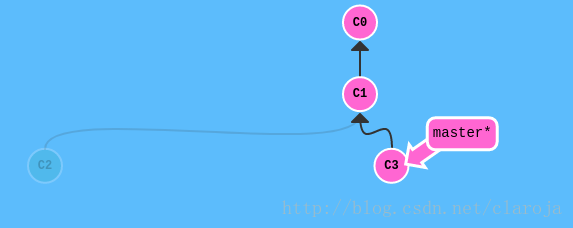

# git常用
最常用的 git 命令有：
   add        添加文件内容至索引
   bisect     通过二分查找定位引入 bug 的变更
   branch     列出、创建或删除分支
   checkout   检出一个分支或路径到工作区
   clone      克隆一个版本库到一个新目录
   commit     记录变更到版本库
   diff       显示提交之间、提交和工作区之间等的差异
   fetch      从另外一个版本库下载对象和引用
   grep       输出和模式匹配的行
   init       创建一个空的 Git 版本库或重新初始化一个已存在的版本库
   log        显示提交日志
   merge      合并两个或更多开发历史
   mv         移动或重命名一个文件、目录或符号链接
   pull       获取并合并另外的版本库或一个本地分支
   push       更新远程引用和相关的对象
   rebase     本地提交转移至更新后的上游分支中
   reset      重置当前HEAD到指定状态
   rm         从工作区和索引中删除文件
   show       显示各种类型的对象
   status     显示工作区状态
   tag        创建、列出、删除或校验一个GPG签名的 tag 对象


# 创建版本控制
+ `git init`				通过git init命令把这个目录变成Git可以管理的仓库

+ `git add <file>`			用命令git add告诉Git，把文件添加到仓库

+ `git commit -m <message>`	git commit命令，-m后面输入的是本次提交的说明，可以输入任意内容，当然最好是有意义的
+ `git commit -a`

# 时光穿梭机
+ `git status` 要随时掌握工作区的状态。
+ `git diff <file>`  如果git status告诉你有文件被修改过，用`git diff <file>`可以查看修改内容。

```shell
$ git status
On branch master
Changes not staged for commit:
  (use "git add <file>..." to update what will be committed)
  (use "git checkout -- <file>..." to discard changes in working directory)
```


## 版本回退
+ HEAD指向的版本就是当前版本，因此，Git允许我们在版本的历史之间穿梭，使用命令`git reset --hard commit_id`。

+ 穿梭前，用`git log`可以查看提交历史，以便确定要回退到哪个版本。

+ 要重返未来，用`git reflog`查看命令历史，以便确定要回到未来的哪个版本。

## 工作区和暂存区

+ 工作区（Working Directory）
  
    >就是你在电脑里能看到的目录，比如我的learngit文件夹就是一个工作区：
    
+ 版本库（Repository）
>工作区有一个隐藏目录.git，这个不算工作区，而是Git的版本库。Git的版本库里存了很多东西，其中最重要的就是称为stage（或者叫index）的暂存区，还有Git为我们自动创建的第一个分支master，以及指向master的一个指针叫HEAD。


> 前面讲了我们把文件往Git版本库里添加的时候，是分两步执行的：
>+ 第一步是用git add把文件添加进去，实际上就是把文件修改添加到暂存区；
>+ 第二步是用git commit提交更改，实际上就是把暂存区的所有内容提交到当前分支。


>因为我们创建Git版本库时，Git自动为我们创建了唯一一个master分支，所以，现在，git commit就是往master分支上提交更改。
>你可以简单理解为，需要提交的文件修改通通放到暂存区，然后，一次性提交暂存区的所有修改。

`git diff HEAD -- <file>`   命令可以查看工作区和版本库里面最新版本的区别

## 撤销修改

`git checkout -- <file>`  git checkout其实是用版本库里的版本替换工作区的版本，无论工作区是修改还是删除，都可以“一键还原”

+ 场景1：当你改乱了工作区某个文件的内容，想直接丢弃工作区的修改时，用命令git checkout -- file。
+ 场景2：当你不但改乱了工作区某个文件的内容，还添加到了暂存区时，想丢弃修改，分两步，第一步用命令`git reset HEAD <file>`，就回到了场景1，第二步按场景1操作。
+ 场景3：已经提交了不合适的修改到版本库时，想要撤销本次提交，参考版本回退一节，不过前提是没有推送到远程库。
## 删除文件
`git rm <file>`  用于删除一个文件。如果一个文件已经被提交到版本库，那么你永远不用担心误删，但是要小心，你只能恢复文件到最新版本，你会丢失最近一次提交后你修改的内容

>小提示：先手动删除文件，然后使用`git rm <file>`和`git add<file>`效果是一样的。

>另一种情况是删错了，因为版本库里还有呢，所以可以很轻松地把误删的文件恢复到最新版本：

 `git checkout -- <file>`
git checkout其实是用版本库里的版本替换工作区的版本，无论工作区是修改还是删除，都可以“一键还原”。

 注意：从来没有被添加到版本库就被删除的文件，是无法恢复的！

# 远程仓库
[git授权_廖雪峰](https://www.liaoxuefeng.com/wiki/896043488029600/896954117292416)

+ 第1步：创建SSH Key。在用户主目录下，看看有没有.ssh目录，如果有，再看看这个目录下有没有id_rsa和id_rsa.pub这两个文件，如果已经有了，可直接跳到下一步。如果没有，打开Shell（Windows下打开Git Bash），创建SSH Key：
 `ssh-keygen -t rsa -C "youremail@example.com"`
  你需要把邮件地址换成你自己的邮件地址，然后一路回车，使用默认值即可，由于这个Key也不是用于军事目的，所以也无需设置密码。
  如果一切顺利的话，可以在用户主目录里找到.ssh目录，里面有id_rsa和id_rsa.pub两个文件，这两个就是SSH Key的秘钥对，id_rsa是私钥，不能泄露出去，id_rsa.pub是公钥，可以放心地告诉任何人。

+第2步：登陆GitHub，打开“Account settings”，“SSH Keys”页面：
然后，点“Add SSH Key”，填上任意Title，在Key文本框里粘贴id_rsa.pub文件的内容：

> 注意: 设置仓库的邮箱地址跟创建秘钥的一致,(可以配置全局和本仓库)  git Here GUI  -> edit -> opinion进行设置


## 添加远程仓库
+ 要关联一个远程库，使用命令`git remote add origin git@github.com:gouwenyong0000/stidy_git_lxf.git`  
> git@server-name:path/repo-name.git; 是github的SSH连接地址
+ 关联后，使用命令`git push -u origin master`第一次推送master分支的所有内容；(可能需要输入密码)
+ 此后，每次本地提交后，只要有必要，就可以使用命令`git push origin master`推送最新修改；

## 删除关联仓库
`git remote rm origin`

## 克隆
要克隆一个仓库，首先必须知道仓库的地址，然后使用`git clone`命令克隆。
Git支持多种协议，包括https，但ssh协议速度最快。

# 分支管理
## 创建与合并分支

+ 查看分支：`git branch -v`
+ 创建分支：`git branch <name>`
+ 切换分支：`git checkout <name>`或者`git switch <name>`
+ 创建+切换分支：`git checkout -b <name>`或者`git switch -c <name>`
+ 合并某分支到当前分支：`git merge <name>`
+ 删除分支：`git branch -d <name>`


## 解决冲突


+ `git merge <branch_dev>`  将branch_dev 分支合并到当前分支【先切换到目标分支】
+ `git log --graph`命令可以看到分支合并图。


git merge执行了两个操作:
第一个是merge,将两个分支的代码合并，是对`commit`和`commit`的操作，既把目标的`commit`合并到当前的`commit`
第二个是commit,将合并之后的代码提交

如果merge步骤有冲突,则不会执行commit,需要手动将冲突解决,然后再手动提交.

1.冲突解决
1）`merge`合并之后，中会提示有冲突的文件（既同一文件，同一行做了不同的修改），

```shell
<<<<< HEAD
1
======
2
>>>>>> branch
```

`HEAD`下到`======`是当前的分支，该文件的内容，`branch`上到`=====`是合并目标分支的内容，`merge`不知道用哪个，所以需要我们自己决定。加入我们想要branch中的内容，则只需要将`<<<<< HEAD` `1` `=====`和`>>>> branch`删除即可。


2).解决完冲突后，需要重新`add`和`commit`

+ 运行`git add `将把它们标记为已解决（resolved）。

+ 然后使用`git commit`命令进行提交，merge就算完成了


3).取消merge
如果发现冲突不想解决，则可以使用下面的命令取消。

```shell
git merge --abort


git merge [-n] [--stat] [--no-commit] [--squash] [--[no-]edit]
	[-s <strategy>] [-X <strategy-option>] [-S[<keyid>]]
	[--[no-]allow-unrelated-histories]
	[--[no-]rerere-autoupdate] [-m <msg>] [<commit>…]
	
git merge --abort
git merge --continue
```

`git merge branchname` # 合并分支

## 分支管理策略

在实际开发中，我们应该按照几个基本原则进行分支管理：

首先，`master`分支应该是非常稳定的，也就是仅用来发布新版本，平时不能在上面干活；

那在哪干活呢？干活都在`dev`分支上，也就是说，`dev`分支是不稳定的，到某个时候，比如1.0版本发布时，再把`dev`分支合并到`master`上，在`master`分支发布1.0版本；

你和你的小伙伴们每个人都在`dev`分支上干活，每个人都有自己的分支，时不时地往`dev`分支上合并就可以了。

所以，团队合作的分支看起来就像这样：


+ 合并分支时，加上`--no-ff`参数就可以用普通模式合并，合并后的历史有分支，能看出来曾经做过合并，而`fast forward`合并就看不出来曾经做过合并。


---

修复bug时，我们会通过创建新的bug分支进行修复，然后合并，最后删除；

当手头工作没有完成时，先把工作现场`git stash`一下，

一是用`git stash apply`恢复，但是恢复后，stash内容并不删除，

另一种方式是用`git stash pop`，恢复的同时把stash内容也删了回到工作现场；

```sh
#保存现场
git stash

# 查看保存的列表
git stash list

#恢复上一次现场
git stash apply
# 删除上一次现场
git stash drop

#可以合并为
git stash pop


# 恢复指定现场使用现场索引进行
git stash apply stash@{0}
git stash pop stash@{0}

```

---

+ 在master分支上修复的bug，想要合并到当前dev分支，可以用`git cherry-pick <commit>`命令，把bug提交的修改“复制”到当前分支，避免重复劳动。

---

+ 如果要丢弃一个没有被合并过的分支，可以通过`git branch -D <name>`强行删除。

# 标签管理

## 创建标签

- 命令`git tag <tagname>`用于新建一个标签，默认为`HEAD`，也可以指定一个commit id；
- 命令`git tag -a <tagname> -m "blablabla..."`可以指定标签信息；
- 命令`git tag`可以查看所有标签。

## 操作标签

- 命令`git push origin <tagname>`可以推送一个本地标签；
- 命令`git push origin --tags`可以推送全部未推送过的本地标签；
- 命令`git tag -d <tagname>`可以删除一个本地标签；
- 命令`git push origin :refs/tags/<tagname>`可以删除一个远程标签。

# Rebase

- rebase操作可以把本地未push的分叉提交历史整理成直线；
- rebase的目的是使得我们在查看历史提交的变化时更容易，因为分叉的提交需要三方对比。

## 操作

1.新建仓库`git init`并提交一次`git commit`

2.新建bugFix分支并切换到该分支上`git checkout -b bugFix`

3.在bugFix分支上提交一次`git commit`

4.切换到master分支`git checkout master`

5.在master分支上提交一次`git commit`

6.切换到bugFix分支`git checkout bugFix`

7.在bugFix分支上将bugFix放在master分支上`git rebase master`


## git rebase 两个交叉branch换基

### 1 向下游移动base

下游移动base,根节点是两个分支的交叉点

1.初始化数据

```shell
* c54f8b7 (HEAD -> b) version3 b
| * f9fc6be (a) version4 a
| * 730cb6a version3 a
|/
* 604ad92 version2 //a和b的交点,既base
* 648ef5e version1
```


2.[rebase](https://so.csdn.net/so/search?q=rebase&spm=1001.2101.3001.7020) 换基
此时HEAD在b分支上,我们可以现在base是version2,我们可以将b分支的base改为version1~4的任意位置,假设rebase到version3 a上
`git rebase 730cb6a`

这里使用等价的图形操作
1)


2)处理冲突


3).填写提交信息

3.结果
b分支的base已经改变


### 2 向上游移动base

向上游移动base,base是指定的上游commit点

假设要移动到version2

此时version2为base,这样计算的话b分支就有两个commit,verson3 a 和 version 3 b.
如果想恢复到最初的状态,可以吧version3 a 的`Action`改成`skip`即可


# git 理解 HEAD^与HEAD~


`HEAD`是指当前的快照,这个命令主要配合`reset`的`--hard`,`--mixed`和`--solf`三个参数对对本次的修改进行处理
`HEAD~1`指回退一个快照，可以简写为`HEAD~`
`HEAD~2`指回退两个快照，

**HEAD^主要是控制merge之后回退的方向**
**HEAD~才是回退的步数**

例子：

| 命令                    | 描述                                                    |
| ----------------------- | ------------------------------------------------------- |
| `git checkout HEAD^1~1` | 在主分支上回退一个快照，可以简写为`git checkout HEAD^~` |
| `git checkout HEAD^1~1` | 在merge的分支上回退一个快照                             |

1.建立如图所示分支

2.将HEAD指针向后移动一位到原分支`git checkout HEAD^`

3.将HEAD指针向后移动一位到merge分支`git checkout HEAD^2`

4.将HEAD指针向后移动两位到原分支`git checkout HEAD^~`

5.将HEAD指针向后移动一位到merge分支`git checkout HEAD^2~`


# git指针

## Head指针

Head指针可以指向[快照](https://so.csdn.net/so/search?q=快照&spm=1001.2101.3001.7020)节点也可以指向branch。当指向branch时提交后会和branch指针一起向后移动，当不指向branch提交时时则会在一个detached状态。

## 分支(Branch)指针

使用`git branch -f` 来移动分支指针，移动的对象只能是快照。当且仅当HEAD指针指向分支指针的时候，提交才会有效。

## [reset](https://so.csdn.net/so/search?q=reset&spm=1001.2101.3001.7020)

reset是HEAD指针带着分支指针两个一起跑，可以是其Branch指针也可以是快照节点，当指向Branch指针时，最终是执行该Branch指针指向的快照

## checkout

使用`git checkout` 只移动HEAD指针，移动的对象可以是分支指针也可以是快照。

## 实例

### 1、HEAD指针默认指向当前的分支指针，用星号表示，如master*


### 2、移动HEAD指针，`git checkout C1`

这个时候HEAD指针指向的是快照，这个时候指针的状态称之为**游离状态，detached**。


### 3、HEAD指针在游离状态下提交，`git commit`

游离状态下提交的commit，没有分支指针指向。可以在游离状态下的快照新建分支或强制移动已存在的分支


### 4、移动HEAD指针，让他指向master分支指针`git checkout master`


### 5、在master分支指针上提交`git commit`

这个是正常的提交，和游离状态下的提交是不一样的


### 6、给detached状态下的快照添加分支。在3中我们提到给detached状态下的快照增加分支的两种方法。

#### 6.1 给detached状态下的快照新建一个分支

6.1.1 将HEAD指针移动到detached状态的快照`git checkout C2`

6.1.2添加分支`git branch new`

6.1.3 将HEAD指针移动到new分支指针上就可以在new分支上提交了`git checkout new`


#### 6.2 移动已存在的分支到detached状态的分支`git branch -f master C2`

这个时候master分支以前的快照C3就变成了detached状态了


## 综合案例

1.新建如图仓库

2.使用相对位置移动bugFix指针到C0`git branch -f bugFix HEAD~2`

3.使用绝对位置移动master指针到C6`git branch -f master C6`

4.使用相对位置移动HEAD指针`git checkout HEAD^`


重点是分支的移动是相对于HEAD指针的，而HEAD指针不一定和分支指针在一起

# git 应用 reset&revert

1.初始化如下图的仓库

2.在local分支上reset到上一次提交`git reset HEAD^`

3.切换到pushed分支上`git checkout pushed`

4.在pushed分支上revert当前提交`git revert HEAD`
注意这里和reset的区别，revert是当前的HEAD指针，就是取消了C2分支，然后新建了C2’分支，C2’分支和C1是一样的。也就是说revert哪个提交，就提交了那个提交的前面一个提交。

5.在pushed分支上撤销当前提交并从新提交`git commit --amend`


# git 应用 cherry-pick

1.新建如下图仓库

2.在master分支上天上[快照](https://so.csdn.net/so/search?q=快照&spm=1001.2101.3001.7020)C3 C4 C7`git cherry-pick C3 C4 C7`


# git revert

git-revert - Revert some existing commits

git revert本质是对某次提交进行逆提交。你提交就是删除了某次提交的信息,工作树就都编程了之前一次提交的状态.

例子：
我们首先进行三次提交，每次新建一个文件，分别是’a.txt b.txt c.txt`

```
1405c83  (HEAD -> master) c.txt c
5138f97 b.txt b
de92f35 a.txt a
```

然后执行`git revert 5138f97`对b.txt那次`commit`进行你提交

```
0d59536 (HEAD -> master) Revert "b.txt b"
1405c83 c.txt c
5138f97 b.txt b
de92f35 a.txt a
```

现在文件夹只剩下了`a.txt c.txt`，也就是说，我们进行了逆提交`b.txt`那次操作。

**冲突例子**
`revert`与`checkout`都是仓库区,暂存区以及工作区同时更新的,所以如果当前的工作区,`revert`之后的工作区有冲突时就要先解决冲突.

`revert`会先处理冲突，然后进行`commit`
新建文件`a.txt`，每次提交向里面增加一个字母a，第一次是a，第二次是aa，第三次是aaa

```
53c4d08 (HEAD -> master) aaa
69d6b2a aa
4b68781 a

```

对进行第二次提交"aa"的逆操作`git revert 69d6b2a`

```
error: could not revert 69d6b2a... aa
hint: after resolving the conflicts, mark the corrected paths
hint: with 'git add <paths>' or 'git rm <paths>'
hint: and commit the result with 'git commit'
```

不能进行逆操作，因为当我们进行逆操作的时候，文件a.txt有两种情况一个是第一次提交的只有一个“a”的情况，另一个是第三次提交的有“aaa”的情况，所以需要我们进行手动处理，我们是要保存第一次的“a”还是保存第三次的“aaa”。
查看目前的状态：

```
On branch master
You are currently reverting commit 69d6b2a.
  (fix conflicts and run "git revert --continue")
  (use "git revert --abort" to cancel the revert operation)

Unmerged paths:
  (use "git reset HEAD <file>..." to unstage)
  (use "git add <file>..." to mark resolution)

        both modified:   a.txt
```

`vi a.txt`进入有冲突的文件进行操作。可以看到以下内容`<<<<<<<HEAD`是指当前快照该行的内容，`>>>>>>> parent of 69d6b2a... aa`上是指之前`revert` 节点的父节点的内容。中间用`=======`来分隔。我们只需保留`aaa`或者`a`。

```
<<<<<<< HEAD
aaa
=======
a
>>>>>>> parent of 69d6b2a... aa
```

修改之后我们就可以`add`和`commit`了，最后输出`log`

```
774f807 (HEAD -> master) Revert "aa"
53c4d08 aaa
69d6b2a aa
4b68781 a
1234
git revert [--[no-]edit] [-n] [-m parent-number] [-s] [-S[<keyid>]] <commit>…
git revert --continue
git revert --quit
git revert --abort

```

git revert 会将现在的工作区和回退commit的之前的文件进行合并

## 关于revert和reset的区别

大部分帖子说reset回滚到某个快照后，中间的所有的快照就都丢失了，这是不准确的。因为这reset之后只是git log看不到中间的快照,但是中间的快照并没有被删除,使用`git reset id`仍然可以恢复原样.

git revert是用一次新的commit来回滚之前的commit，git reset是直接删除指定的commit看似达到的效果是一样的,其实完全不同.
上面我们说的如果你已经push到线上代码库, reset 删除指定commit以后,你git push可能导致一大堆冲突（或git push -f强制推送）.但是revert 并不会.

# Git core.autocrlf [lf/crlf]配置说明

JUN 19TH, 2015 4:03 PM

### CRLF and LF

CRLF 是 Carriage-Return Line-Feed 回车换行

LF 是 line feed 的缩写，中文意思是换行。

### 三种方式处理的不同

CRLF->Windows-style

LF->Unix Style

CR->Mac Style

CRLF 表示句尾使用回车换行两个字符(即我们常在Windows编程时使用"\r\n"换行)

LF 表示表示句尾，只使用换行.

CR 表示只使用回车.

### 在 Git 中转换

在 Git 通过下面的命令配置

```
$git config --global core.autocrlf true
# Configure Git on Windows to properly handle line endings
```

解释：core.autocrlf 是 git 中负责处理 line endings 的变量，可以设置三个值 –true,inout,false.

设置成三个值会有什么效果呢？

If `core.autocrlf` is set to true, that means that any time you add a file to the git repo that git thinks is a text file, it will turn all CRLF line endings to just LF before it stores it in the commit.

设置为 true，添加文件到 git 仓库时，git 将其视为文本文件。他将把 crlf 变成 lf。

If `core.autocrlf` is set to false, no line-ending conversion is ever performed, so text files are checked in as-is. This usually works ok.

设置为 fals e时，line-endings 将不做转换操作。文本文件保持原来的样子。

设置为 input 时，添加文件git仓库时，git 把 crlf 编程 lf。当有人 Check 代码时还 是lf 方式。因此在 window操 作系统下，不要使用这个设置。

Yet another way to show how autocrlf works

```
1) true:             x -> LF -> CRLF
2) input:            x -> LF -> LF
3) false:            x -> x -> x
```

### On OS X, you simply pass input to the configuration. For example:

```
git config --global core.autocrlf input
# Configure Git on OS X to properly handle line endings
```
