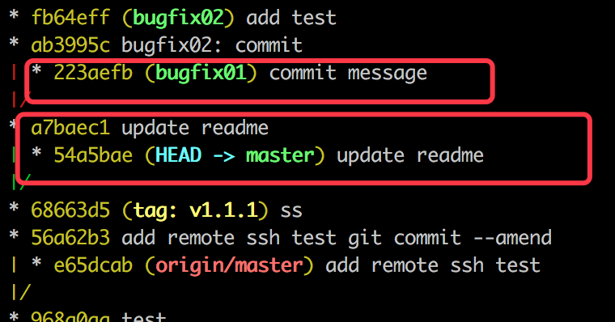
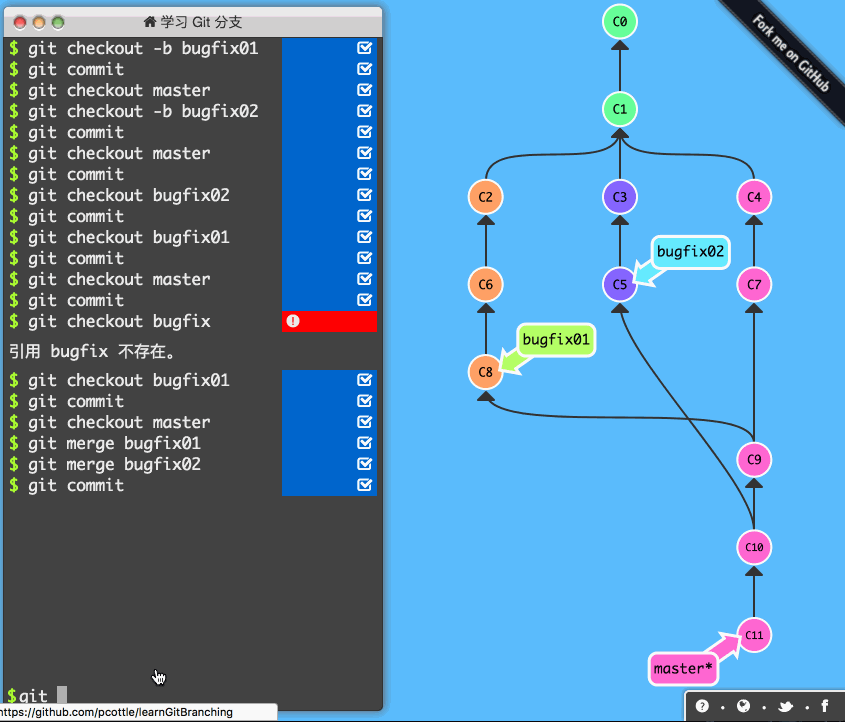
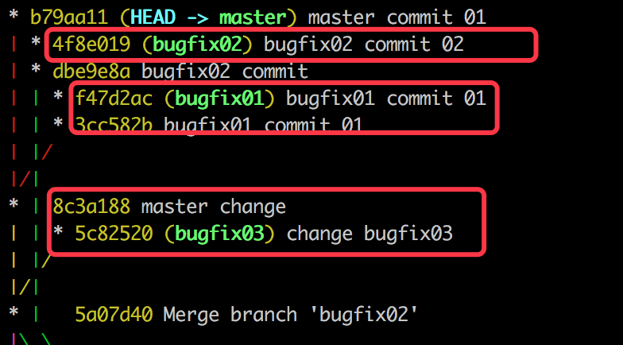
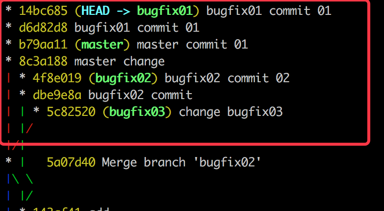
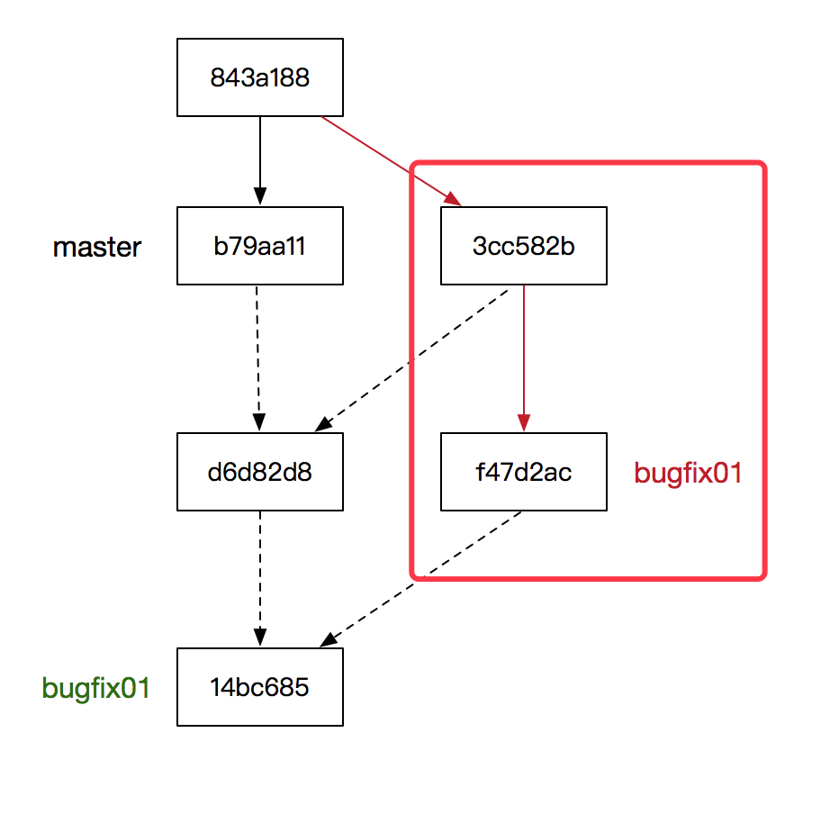
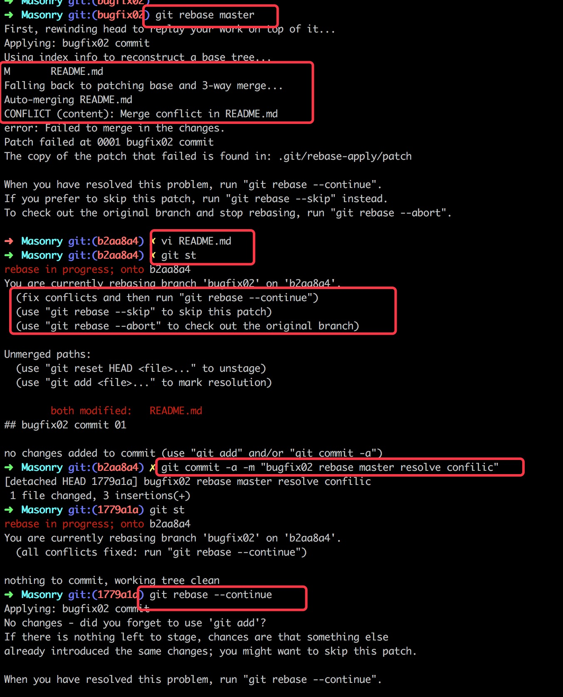
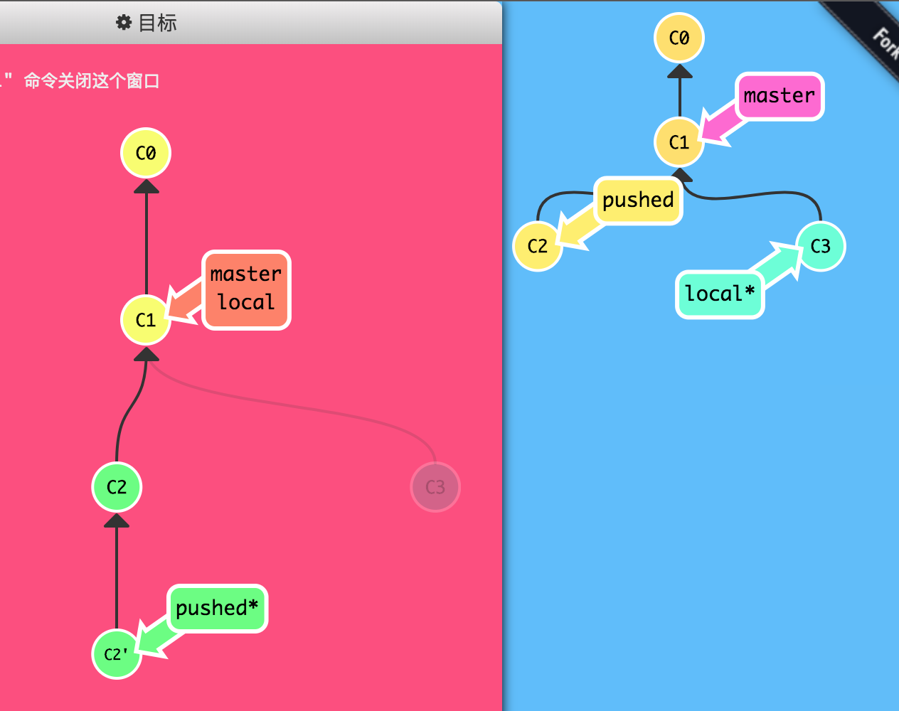
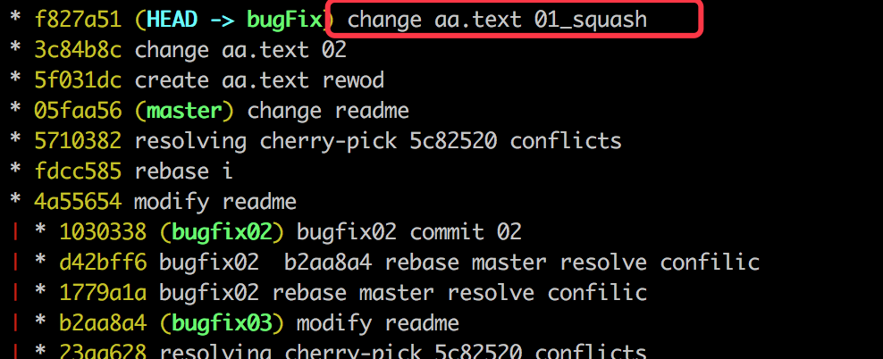

# 从 git clone 和 git status 谈起

 ProGit(链接：[https://git-scm.com/book/zh/v1](https://git-scm.com/book/zh/v1))。本篇博客以及后边的将要发的几篇博客是对之前看 ProGit 时的笔记的整理。当然在整理时，根据具体示例来梳理了一下知识点，和 ProGit 上的讲解顺序有些区别。

本篇博客聊了 Git 基础操作的一部分，主要是基于 Github 上 Fork 的 Masonry 仓库来做的，首先 Clone 相关仓库，然后根据 git status 命令的提示引出了一系列的命令操作。

Git 的原理就不做过多赘述了，ProGit 上聊得挺好。不过还是要聊一下集中版本控制系统和分布式版本控制的区别。在版本管理中主要包含**集中化的版本控制系统** (**Centralized Version Control Systems，简称 CVCS**) 例如 CVS、Subversion 以及 Perforce 等 ，和**分布式版本控制系统 (Distributed Version Control System，简称 DVCS)**, 例如 Git、Mercurial、Bazaar 以及 Darcs  。DVCS 的特点为每一次的克隆操作，实际上都是一次对代码仓库的完整备份。 其中文件的状态主要包括已提交 (committed)、已修改(modified) 和已暂存(staged) 的。这些东西就不细说了，先看一下 git 的命令的一些操作。

备注：接下来的几篇博客的终端操作都是在 Mac 上使用的 ITerm 完成的，终端上装的是 oh-my-zsh ([https://github.com/robbyrussell/oh-my-zsh](https://github.com/robbyrussell/oh-my-zsh))。

## 一、获取远程仓库

为了方便做一些 git 相关的基础操作，就是使用在 github 上 Fork 的 Masonry 的仓库做实验吧，然后基于此 Fork 的仓库来展开接下来的相关内容。

　　

第一步要做的就是将远程仓库中的代码克隆到本地，**git clone** 命令做的就是这件事情。其后边跟的参数就是上述截图中的地址，其具体操作如下所示：

　　

在第一部分我们就先简单的看一下 git clone 的演示操作。首先使用了 git clone 命令将远端的代码以及相关分支信息 clone 到本地，然后在本地进行了一次提交（git commit）, 最后将提交 push 到远端。在接下来的几篇博客中会陆陆续续的介绍到，在此就先不多说了。

　　

## 二. 由 git status 命令引起的其他命令

我们可以使用 `git status` 命令来查看相关文件的状态，在下方的操作中首先我们对 **README.md** 文件使用 vim 编译器进行修改并保存, 然后创建了一个名为 **NewCreateFile** 的文件。并使用 git status 命令来查看其相关的状态。

从下方输出的结果中不难看出 README.md 的文件状态为 modified， 也就是被修改了，更详细的提示为 **“Changes not stagged for commit”**, 也就是说文件被修改了，但是还没有在提交（commit）前进行存储（staged）。并且给了相关的提示，可以使用 **_git add <文件名>_** 命令进行存储，或者使用`git checkout -- < 文件名>` 命令放弃在工作目录中的修改。

而我们刚创建的 NewCreateFile 文件处于 Untracked (未被跟踪的状态)，并且可以使用 `git add < 文件名 >` 来将该创建的 NewCreateFile 添加到可以被提交（commit）的内容当中去。并且还给出了一条建议，可以对 NewCreateFile 文件使用 **_git commit -a_** 来直接进行提交。

如果你对 git 的各种状态比较熟悉了，也可以使用 git status -s 来查看简写的状态，这种简写的状态和 SVN 上的差不多 _**M - 被修改，A - 被添加，D - 被删除，R - 重命名**_，?? - 未被跟踪 等等，下方遇到其他的状态符号时在一一解释。

　　

根据上面 git status 命令的提示内容，我们至少可以得到三种命令的使用方式：

```bash
暂存文件的命令：git add <文件名>
放弃未暂存文件的修改命令：git checkout -- <文件名>
将被修改的文件暂存并提交的命令：git commit -a 
```

### 1、git add

接下来我们可以看一下 git add 的命令，下方分别将上述两个文件进行了 add, 也就是将文件进行暂存。暂存后，使用了 **git status** 命令查看状态，提示这些修改可以被提交了，并且还可以使用 **git reset HEAD <文件名>** 来取消相关文件的暂存。使用 **git status -s** 命令来查看 状态标记由原来的红色改成了绿色，并且 NewCreateFile 的状态标记由?? 变成了 A  (新添加文件)。

　　

### 2、git reset HEAD

接下来我们根据提示，看一下 `git reset HEAD <文件名>`命令的操作，下方分别对已经暂存的两个文件执行了 `git reset HEAD <文件名>`操作，如下所示。从操作后的结果可以看出，两个文件的状态是一夜回到了解放前，又回到了之前暂存的状态。

　　

### 3、git checkout -- <文件名>

接下来我们在看一下对未暂存的修改文件进行回滚的操作命令： `git checkout -- <文件名>`，根据上面的提示我们可以知道该操作可以放弃对某个为暂存的文件的修改。接下来我们就来看一下这个命令的操作。不过有一点需要注意，该操作如果生效了，再想找回被丢弃的内容就找不回了。也就是说 _**git checkout -- <文件名>**_ 是不可逆的，因为其回滚的内容并没有在 git 中进行暂存和记录。从下方的操作我们可以看出被修改的 README.md 回到了未被修改的状态之前。

　　

### 4、git commit -a

接下来我们来看一下上面提到的命令 _**git commit -a**_ 的操作，首先我们再次对 README.md 进行修改，然后查看一下状态。接着使用 _**git commit -a -m "提交说明"**_ 来进行添加和提交。从该命令执行后的状态中我们可以看到，git commit -a 只对 状态为 M 的文件有用，而对新增而为添加的问题是不起作用的，因为我们新添加的文件 NewCreateFile 仍然处于 Untracked 状态中。

　　

我们可以使用 git add 命令对 NewCreateFile 文件进行暂存，使用 git commit 命令对暂存的内容进行提交。提交后，我们查看状态时看到一个提示, 大概是说你的分支已经领先远端的主分支 2 个提交，可以使用 git push 操作来发布你本地的提交。

　　

### 5、git push

下方是 git push 操作的相关内容，我本地是配了 github 的 ssh-key 的，不过之前 clone 的时候使用的是 https 的方式，需要在第一次 PUSH 的时候都要求输入用户名和密码。每次都输入用户名和密码挺麻烦的稍后我们将使用 git 的其他命令将其解决掉。

　　

push 完毕后，我们可以动 github 上相应的仓库中可以看到其相关的修改内容了，具体如下：

　　

### 命令总结

由上面的内容，不难发现，从一开始的 git status 命令，根据相关提示，引出了其他相关命令。下方是对其相关命令的总结：

+ `git status` : 查看当前仓库中文件的状态。
+ `git status -s` : 文件状态的简写（M - 修改， A - 添加， D - 删除， R - 重命名，?? - 未追踪）。
+ `git add <文件名>` ：将后方紧跟的文件进行暂存，以便 commit 使用。
+ `git reset HEAD <文件名>` : 将已经暂存的文件进行撤销，回到未暂存的状态。
+ `git checkout -- <文件名>` ：撤销对尚未暂存文件的修改，该操作不可逆，慎用。
+ `git commit -a` : 对那些被修改的文件单尚未暂存和提交的文件进行暂存和提交。注意：对未暂存的新增文件无效。
+ `git commit` : 对暂存区的文件进行提交到本地仓库。
+ `git push` : 将本地仓库已经提交的内容发布到远端。

## 三、查看和修改远端地址

### 1、添加远端仓库地址

根据上面的操作可以看到，上面的远端链接是 https 的。因为我本地是赔了 github 的 ssh-key 的，所以也是支持 ssh 的链接的。下方我们将根据 git remote 远程仓库操作来添加上 ssh 的仓库地址。下方是一系列的操作：

*   > 首先通过 **git remote -v** 命令来查看当前仓库的远端地址，从下方看到是 https 格式的。
    
*   > 然后在通过 **git remote add** 远端仓库地址别名 <url> 来添加一个新的仓库地址，下方添加的是一个 ssh 的仓库链接。
    
*   > 接着我们再次对远端仓库的链接查看时，就会看到相应的新添加的仓库地址。
    
*   > 然后我们队 README 文件做了点修改，并 push 远端。在 push 时我们选择了后来添加的新的远端仓库，可以看出使用的是别名。
    

　　

下方是 push 后从 github 上对应的仓库看到的相关内容，也是可以看到的修改的相关内容的。

　　

### 2、远端仓库地址删除和重命名

从上面的内容不难看出，两个仓库地址其实是重复的。现在我们没必要都将其进行存储了。我们要删掉那个 https 的仓库，下方是具体的操作步骤。

*   > 首先通过 **git remote -v** 来查看目前现有的远端仓库。
    
*   > 然后通过 **git remote rm origin** 命令来删除别名为 origin 的远端地址，删除后，再次查看时，origin 的仓库地址就木有了。
    
*   > 紧接着使用 **git remote rename origin_ssh origin** 命令，将 origin_ssh 重命名为 origin 即可。
    
*   > 最后我们还可以使用 **git remote show origin** 命令来查看 push 到远端的那个分支上，具体操作步骤如下所示。
    

　　


# 常用命令

### 一、.gitignore

接下来来看一下 git 仓库中的 .gitignore 文件，在该文件中记录了那些不被 git 管理的被忽略的文件。.gitignore 中根据 glob 模式匹配规则来忽略一些文件，glob 模式匹配是 shell 所使用的简化了的正则表达式。可以说 glob 的匹配规则和正则匹配差不多。

首先我们先看一个. gitignore 的示例，上篇博客我们 Clone 了 Masonry 仓库，现在我们就来看一下 Masonry 中的. gitignore 的内容。接下来我们就根据该示例来解读一下下方的忽略规则。

```
 # ：井号（#）用来添加注释用的，比如 "# 注释"。

 build/* : 星号（*）是通配符，build/* 则是要说明要忽略 build 文件夹下的所有内容。

 *.pbxuser : 表示要忽略后缀名为. pbxuser 的文件。

!default.pbxuser : 感叹号（!）是取反的意思，*.pbxuser 表示忽略所有后缀名为. pbxuser 的文件，如果加上! default.pbxuser 则表示，除了 default.pbxuse 忽略其它后缀名为 pbxuse 的文件。
```


　　

关于. gitignore 文件就不做过多赘述了，忽略文件的规则并不是特别复杂，其中 [https://github.com/github/gitignore](https://github.com/github/gitignore) 记录好多种类的. gitignore 文件。如下所示：

　　

### 二、git diff

可以使用 git diff 来查看未暂存文件的修改情况。下方是使用 **git diff** 对修改但未暂存的文件的查看。如果你的文件使用了 git add 命令将其添加到了暂存区存储起来了，那么 git diff 就看不到已经被暂存起来的文件的修改内容了。

　　

查看位于暂存区的文件的修改内容可以使用 `git diff --cached` 或者 使用`git diff --staged`来查看暂存区的修改内容。

　　

### 三、文件的移除与恢复

当需要删除暂存区或分支上的文件，**同时工作区不需要这个文件**

```bash
git rm fileName1
```

当需要删除暂存区或分支上的文件，**同时工作区需要这个文件，但是不需要被版本控制**

```bash
git rm --cache fileName
# 后面添加进.gitignore文件中的文件可以使用这条命令解除版本控制的追踪，然后在commit忽略这个文件。
```

接下来来看一下如何从 git 中移除相关的问题，有时我们会直接从磁盘上将文件移除掉，然后此刻需要在 git 中也将该文件移除掉。下方我们就对之前创建的 NewCreateFile 文件在磁盘上进行删除，然后查看一下文件的状态。可以从下方的截图中看到，其中是未暂存的 Delete 状态。可以使用 git rm 或者 git add 来将删除的文件添加到缓存区，或者使用 **git checkout -- NewCreateFile** 来对删除的文件进行恢复。

　　

下方是一系列的撤销操作，将删除的文件进行恢复：

*   > 首先通过 **git reset HEAD** 文件名 操作从暂存区将已暂存删除的文件进行撤销。
    
*   > 然后通过 **git checkout -- 文件名** 操作将删除的文件进行恢复
    

　　

### 四、通过 git mv 进行重命名

下方就是通过 git mv 操作将 NewCreateFile 重名为 ARenameFile，通过 git status 查看的状态是 rename，具体如下所示。

git mv NewCreateFile ARenameFile 命令等同于下方的三个命令：

*   > **mv NewCreateFile ARenameFile**
    
*   > **git rm NewCreateFile**
    
*   > **git add ARenameFile**
    

　　

### 五、git log 相关内容

#### **1、git log**

我们可以使用 **git log** 命令来查看历史提交。git log 命令因为其后边参数的多样性，使用起来是比较灵活而强大的，并且比较实用。接下来，就来看一下 git log 的具体表现。下方就是在 Masonry 仓库下使用的 git log 来查看的 log 日志。默认是由 提交号（commit: 每个提交的哈希值、作者（Author）、修改时间（Date）以及提交时的 message 组成，如下所示：

　　

#### **2、git log -p**

使用 git log -p -1 来查看最近一次提交的差异，当然也可以使用 git log -p 来查看所有的差异。下方是查看了最近一次提交的差异。

　　

#### **3、git log --stat**

使用 git log --stat 命令来查看简化版的 diff 日志信息，如下所示。下方只会给出某个文件增加减少的某个代码量，而不会给出详细的修改内容。

　　

#### **4、git log --graph**

git log --graph 命令可以让 log 以更直观的方式来展示。下方是 XMPPFramework 仓库使用 git log --graph 来查看的日志信息，左边的内容是相关提交的分支合并信息，如下所示：

　　

#### **5、git log --pretty**

git log --pretty=oneline 可以让每次的 commit 在一行上显示，如下所示。每一行就是一个 commit，前方是 commit 所对应的 hash 值，后方是 commit 所对应的 message。

　　

我们还可以使用 git log --pretty 来定义显示格式，下方内容是 “ **git log --graph --pretty=format:"%h - %an, %ar : %s"** ” 命令的输出内容， --pretty=format: 后边跟着的是格式化的字符串。其中 %h 表示简化版的 Hash 值， %an 表示作者名字（Author Name）, %ar 表示多久以前提交的，%s 则是提交信息。

　　

下方是格式的常用选项：

　　

下方是 git log 常用选项：

　　

### **六、git commit --amend**

首先我们来看一下该命令的演示图，从下图中不难看出，使用 --amend 选项的提交会与最后一次提交进行合并生成一个新的提交，之前的提交会被废弃掉。

　　

如果你的文件已经 commit 了，如下所示。下方是查看的最新一条的 **commit** 信息。但是，如果你仍然有文件没有提交，想追加到最后这个 commit 上的话，那么就可以使用 **git commit --amend** 命令来追加你的提交到最近的一次提交上面（本质上是合并，生成了一个新的 commit）。

　　

下方就是使用 **git commit --amend** 操作后的日志，从提交的 message 中可以看出，确实追加到了上一次提交上。不过通过 commit 号来看，是一次新的提交，只不过是对上次提交进行和合并，然后覆盖上次提交。

　　

### **七、打标签 - Tag**

打标签其实就是给特定的 commit 做个标记，类似于里程碑的东西。在版本管理中，我们可以为每个版本打个标签，或者在每次发版时打个标签，便于后期的查找。下方会列举一些关于 Tag 的内容。

#### **1、展示所有标签**

可以使用 git tag 来查看所有的标签。下方是查看了 Masonry 仓库中所打的标签，具体输出如下所示。可以使用 **git tag -l 'v0.6.*'** 来查看 0.6 相关的 tag。

　　

#### **2、创建标签**

创建的标签包括 “轻量标签”（**lightweight**）和 “辅助标签”（**annotated**）。轻量标签之所以轻量是因为它只是一个特定 commit 的引用。而 “附注标签” 是存储在 git 数据库中的一个完整对象。可以使用 **git tag -a** 版本号 -m 'tag 信息'来创建 “轻量标签”。下方命令就创建了一个轻量标签，并且使用 git tag 进行展示。

　　

我们可以使用 git show v1.1.1 来查看 v1.1.1 处的相关信息。下方就是 tag v1.1.1 出的相关信息，其中包括 tag 的创建人和创建信息以及打 tag 时的 message，并且还会有该 tag 所对应的 commit 的相关信息。具体如下所示：

　　

#### **3、给之前的 commit 创建 tag**

如果你想给之前的某个 commit 打一个 tag, 那么只需要将 commit 号追加到打标签的命令后方即可，如：**git tag -a vx.x.x -m 'message' commit-hash。**

在下方截图中我们使用了 **git log --pretty=oneline** 命令查看的所有提交。在下方信息中，我们可以看到之前的所有的 tag 号以及所对应的 commit 号。现在我们要在画红框的 commit 上创建一个 tag, 并命名相关的 tag 号为 v1.0.1。

　　

通过下方的 git tag 命令就可以给相应的 commit 补一个 tag, 然后我们可以再次使用 git log 相关命令来查看一下这个后补的 tag。

　　

下方是后补的 tag 信息，

　　

#### **4、将标签 push 到远端**

上面创建的标签都是在本地所做的，可以通过 push 命令来将创建好的某些 tag 或者所有的 tag 使用 push 命令进行共享。下方是关于 push 相关 tag 的一系列操作：

*   > 首先我们使用 **git remote show** 来查看所有的远端，如下所示为 origin。
    
*   > 然后我们可通过 **git push origin v1.0.1** 的命令格式将 tag 号为 v1.0.1 的标签 push 到远端 origin。push 成功后，会提示在相应的远端创建了一个新的标签。
    
*   > 最后可以使用 **git push origin --tags** 命令将本地创建的所有 tag 推送到远端 origin。
    

　　

作为上述标签的 push 操作后，接下来我们可以去 github 上相应的仓库中去查看新增的标签。下方的 v1.1.1 和 v1.0.1 正是我们之前所创建的 tag。

　　

#### **5、checkout tag** 

在我们检出分支时，在分支的名字后方添加上相应的版本号，即可在该 tag 号所对应的分支上进行 checkout。下方的操作就是在 tag: v1.1.1 所对应的分支上 checkout 了一个名为 MyTagTestBrach 的新分支出来。我们可以使用 git show 来查看一下当前分支的最近一次提交信息。从信息中不难看出，其 tag 号就是所对应的 v1.1.1。

关于 Git 的分支的关联，下篇博客将会详细的聊一下 Git 分支管理的东西。

　　

　　

### **八、配置 Git 别名**

**1、别名的设置**

在使用 git 命令时，如果你觉的 **commit、checkout** 等命令太长，每次输入全称太繁琐。在 git 中可以给一些命令添加一些别名，然后同这些别名来更为简洁的去操作 git。下方就通过一个小示例来看一下 git 的别名。

*   > 使用 **git config --global aliase.zhuangtai** 给 status 命令创建了一个 zhuangtai 的别名。
    
*   > 在使用使用 **git zhuangtai** 命令时，就等同于 gitstatus 命令。（此处尝试了一下用我大中华的汉字来做别名，可惜不支持，就用拼音来 test 了）
    
*   > 当然一般不推荐用拼音呢，还是用其英文命令的的缩写比较好，比如 status 可以定义为 st， checkout 为 co，等等。下方又给 status 设置了其他的一个别名 st。
    
*   > 同一个命令的别名是可以同时存在的，可以使用 git zhuangtai、也可以使用 git st。
    

　　

**2、查看所设置的别名**

可以使用 **git config -l** 命令来查看你设置过的所有别名。因为之前清理了一波别名，下方就剩这么几个了。

　　

**3、使用 oh-my-zsh 插件使用提供的别名插件**

oh-my-zsh 提供了特别全的 Git 别名的使用方式，安装完以后即拥有了好多好用的快捷使用方式。

　　

地址（[https://github.com/robbyrussell/oh-my-zsh/blob/master/plugins/git/git.plugin.zsh](https://github.com/robbyrussell/oh-my-zsh/blob/master/plugins/git/git.plugin.zsh)） 

# branch 基础

## **一、分支创建与切换**

### **1、创建新的分支并切换到该分支上进行提交**

首先我们先从最简单的来，下方演示了 git 分支的创建和切换的最基本的操作，具体步骤如下：

1.  > **git branch <分支名>** ： 首先使用 git branch bugfix01，在当前分支也就是 master 分支上创建了一个名为 bugfix01 的新分支。
    
2.  > **git checkout <分支名>** : 然后使用 git checkout bugfix01 命令来切换到我们新创建的 bugfix01 的新分支上。
    
3.  > **git commit** : 最后使用 git commit 命令在新的分支上进行代码提交。
    

> 　　

从上面的操作上我们不难看出，其中的星号 * 表示 git 的 **HEAD** 指针，指向当前所在分支。开始时 HEAD 指针指向的是 master 分支，也就是用户当前所操作的分支是 master。使用 git branch 创建一个新的分支后，HEAD 的指向并没有改变，仍然指向的是 master 分支。当使用 **git checkout** 命令后，**HEAD 指针就由 master 分支转向了 bugfix01 分支了**，这样我们就可以对 bugfix01 进行操作了。

上面还需要注意的时，在创建好分支后，如果在新的分支上没有提交的话，那么 bugfix01 分支和 master 分支所指向的提交号是一致的，上面都是 C1。 这个 C1 表示的就是每次提交的哈希值，也就是提交号。当使用 git commit 时，说明在分支上有新的提交了，就会在之前的提交的基础上往下延伸一个提交，也就是 C2。后提交的 C2 会有一个指针指向上一个提交 C1。

### **2、上述操作在终端的表现**

接下来我们来看一下终端的具体操作。下方是最初的状态，目前所在的分支为 master 分支。从下方可以看出该分支上的 Tag 号，以及 HEAD 指针指向的 master。

　　

然后我们使用 **git branch bugfix01** 创建一个新的分支。从下方可以看出 **bugfix01 分支的指针指向的 commit 号和 master 的 commit 号一致**，原因是我们从 master 中开出来的分支。不过当前所操作的分支仍然是 master (**HEAD -> master**)。

　　

因为我们从 master 分支上切换到了 bugfix01 分支上，所以**此刻的 HEAD 指针指向的是 bugfix01**。 

　　

然后我们在 bugfix01 上提了一些代码，此刻我们看到 bugfix01 指向最新的 commit，但是 HEAD 一直是指向当前分支 bugfix 的。

　　

上面这些操作所使用的命令如下所示：

　　

### **3、创建并切换分支**

我们可以使用一个简写的命令来创建并切换到该分支上，下方就演示了这一操作：

1.  > **git checkout -b <分支名>** ： 首先使用 **git checkout -b bugfix02** 命令在当前所在分支 bugfix01 上创建一个新的分支并且切换到新创建的 bugfix02 上。
    
2.  > **git commit** : 然后就可以使用 **git commit** 在新的分支 bugfix02 上进行提交了。
    

　　

上述命令在终端上的执行结果就不做过多赘述了，请参见第二部分。

### **4、切换到之前的分支并提交**

下方的使用场景是切换到之前已经创建好的分支上，并在切换后的分支上进行提交。下方操作后就会形成分叉。

1.  > **git checkout <分支名>** ：目前所在分支是 bugfix02, 然后使用 git checkout bugfix01 命令将分支切换到 bugfix01 上。
    
2.  > **git commit** : 切换后就可以在 bugfix01 上进行提交操作了。
    

　　

上篇博客中也聊到了，在终端中，我们可以使用 **git log --oneline --graph --all** 来查看所有分支情况。具体如下所示：

　　

## **二、分支的合并与删除以及冲突解决**

上一部分是如何创建分支和在各个分支间进行切换，接下来我们就来看一下分支的合并与删除。

### **1、分支的合并 - merge**

我们还以上面那个示例来看一下分支的合并。下方的操作主要是分支的合并、当在两个分支 bugfix01 和 bugfix02 上修改了相关 bug, 并且需要将修改后的代码合入到 master 分支上。下方就是这一系列的操作：

*   > 首先使用 **git checkout master** 命令切换到 master 分支上。
    
*   > 然后使用 **git merge bugfix01** 命令将 bugfix01 分支的修改合入到 master 分支上，在合入成功后会将合入后的新文件进行提交，此刻会有一个新的 commit 号，也就对应着下方的 C9。
    
*   > 然后使用 **git merge bugfix02**，在将 bugfix02 上的修改合入到 master 分支上，merge 对应的 commit 号为 C10。
    
*   > 最后还是可以在 master 分支上进行正常提交的。
    

　　

下方就是我们在真正的分支中进行的分支合并的操作，我们将 bugfix01 分支 merge 到了 master 分支上。从下方可以看到 bugfix02 还尚未合入 Master 分支。稍后我们会在处理冲突的示例中将 bugfix02 分支合入到 master 分支中。

　　

### **2、分支的删除**

上面可以看到，虽然 bugfix01 和 bugfix02 的分支已经被合入到 master 分支上了，但是这两个分支还是存在的。如果我们不需要这两个分支指针了，可以将两个分支指针进行删除：

*   > 首先使用 **git branch -d bugfix01** 对分支 bugfix01 进行删除。
    
*   > 然后使用 **git branch -d bugfix02** 对分支 bugfix02 进行删除。
    

从下方的操作上来看对分支的删除只是删除的指向该 commit 号的指针，并不会删除其相关的提交号, 在日志中仍然可以找到之前的 commit 记录，也仍然可以在该 commit 上创建新的分支。如果你想删除远端的分支的话，那么得使用 **$ git push origin --delete** <分支名> 了。

　　

还是要依附于实例，下方对上一部分已经合入 master 分支的 bugfix01 分支执行了删除操作，删除成功后会提示 “Delete branch bugfix01 ( was 223aefb)”, 后边这个就是删除分支所对应的 commit 号的前 7 位。

　　

从下方截图中可以看到，其中 bugfix01 这个分支被删除了，不过删除的只是指向该 commit 号的一个指针或者别名，其他的都没改变。

　　

### **3、冲突解决**

上面是不冲突时的正常流程，如果在分支合并时，两个分支同时修改了同一个文件的同一个地方。此刻分支合并时就会冲突，就需要人工介入来解决冲突的代码了。上面我们说留着 bugfix02 这个分支是有用的，现在就来看一下 bugfix02 这个分支的用处。从下方的 log 中不难发现，bugfix02 分支和 master 分支都修改该了 README.md 文件的第二行数据。接下来我们就将 bugfix02 合入 master 分支上。

　　

下方截图的内容就是我们将 bugfix02 分支合入到 master 分支时所报的冲突。冲突的大概意思就是在合并 README.md 文件时产生了冲突，自动合并失败了，需要修复这个冲突，在修复之后再对结果进行提交。我们可以使用 git status 来查看一下当前的状态（配置的别名 git st）。从 git status 的提示中也可以看到，你可以修复该冲突，然后使用 git commit 进行提交，或者 使用 **git merge --abort** 命令放弃本次合并。如果放弃本次合并就会回到合并之前的状态，当然，这并不是我们想要的，下方会对冲突进行解决，并提交，

　　

接下来我们就来看一下冲突的具体内容，**从 <<<<<<<<开始到>>>>>>>>> 结尾是冲突的部分，两个分支的内容由 ======== 进行分割**。上方是当前分支所修改的内容, 我们需要将冲突的内容进行合并，根据具体情况具体分析，看那些需要保留那些不需要保留。还是都需要保留。

　　

下方就是我们修改冲突后的内容，修复策略是保留了 master 的修改，删除了 bugfix02 分支的修改。然后将修改的文件进行提交即可，在此就不做过多赘述了。

　　

### **4、使用工具进行冲突解决**

输入 **git mergetool** 然后根据提示输入 opendiff, 在 Mac 下会打开 Xcode 自带的 FileMerge 工具。

　　

下方就是启动的 FileMerge 工具, 在使用该工具进行文件 merge 时，可以选择几种文件合并策略。比如以左边为准，以右边为准等。

　　

上述工具位于 Xcode 的开发工具中，如下所示：

　　

## **三、分支的查看以及强制删除**

首先我们使用 git log --oneline --graph --all 命令来可视化的看一下目前的分支状态。从下方的截图中我们可以看到，目前共有三个分支 master、bugfix02、bugfix03。并且我们可以看出 bugfix02 已经合入 master 分支，bugfix03 尚未合入。

　　

下方是一系列查看分支的一些方法：

*   > **git branch** : 查看所有分支，其中前面有星号的是当前所在分支，下方即为 master 分支。
    
*   > **git branch -v** : 查看所有分支和该分支上最后的一次提交。
    
*   > **git branch --merged** : 查看已经合入当前分支的所有分支。
    
*   > **git branch --no-merged** : 查看未被合入分支。
    

　　

今天博客关于 git 分支管理的内容就先到这吧，下篇博客会详细介绍 **rebase** 以及 **cherry-pick** 等相关内容。

#  branch  高级篇


本篇博客我们主要来看一下 rebase 变基相关的操作。rebase 操作和 merge 操作最终都可以达到合并代码的效果，不过其对分支的影响不同。上篇博客中我们聊到了 merge 操作。简单的说 merge 操作就是将两个 commit 进行合并，然后在这两个分支合并的基础上创建一个新的 commit。而变基操作简单的说是改变提交的父类，在改变父类时进行合并操作。合并就可能产生冲突，所以 rebase 时也会产生冲突，下方会介绍到。

聊完 rebase，下方还聊如何进行 cherry-pick。**cherry-pick** 的本质其实也是合并，只不过是可以将任意分支，任意提交合并到相关分支。当然只要是合并操作，都有可能产生冲突，下方会给出 cherry-pick 操作的基本使用以及如何解决 cherry-pick 时产生的冲突。

## **一、merge 与 rebase 的简单对比**

下方是我们做操作之前的分支状态，共有 bugFix、side 、another 三个分支。现在我们要做的是分别使用 merge 和 rebase 将分支 side 中的内容合并到 master 分支。

　　

首先我们先来看一下 merge 操作。上篇博客中已经详细的聊了 merge 的相关操作，再次就不做过多的展示了，下方只做了简单的展示。

*   > 首先切换到 master 分支
    
*   > 然后在 master 分支上执行 git merge side 操作，将 side 分支上的内容合并到 master 分支上。
    
*   > 最后如果需要的话，在将 side 分支的指针指向 master 分支即可。
    

　　


**然后我们再看一下 rebase 下的相关操作。**

*   > 首先切换到 side 分支。
    
*   > 然后在 side 分支上执行 git rebase master 操作，将其变基到 master 分支上。
    

　　

## **二、rebase 的基本操作**

首先我们来看一下在 git 分支管理中如何使用 rebase, 以及 rebase 的后会起什么作用。下方会根据一系列的示例来看一下 rebase 操作的实际效果。首先我们先来看一下做 rebase 操作之前的分支状态，如下所示。目前除了 master 主分支外，还有其他三个分支，分别为 bugfix01、bugfix02、bugfix03。

现在要做的事情是在 bugfix01 的分支上执行 rebase 操作，将其变基到 master 分支上。

　　

下方是在 bugfix01 分支上执行的 **git rebase master** 将 bugfix01 分支变基到 master 分支上，下方是变基后的分支状态。从下方的分支中不难看出，之前在 master 分支后方的 bugfix01 现在跑到了 master 分支的后方，并且 bigfix01 分支上的两个提交（3cc582b、f47d2ac）不见了。取而代之的是基于 master 分支的两个新的提交（d6d82d8、14bc685）。这两个新的提交不但包含了 3cc582b、f47d2ac 这两个旧的提交的内容，而且还包含了 master 分支当前指向的分支 (b79aa11) 提交上的内容。

　　

上面的表达也许有点抽象，下面我们可以话一张图来表示上述的关系。根据上面的分支关系，简单的画了一下上面的 rebase 操作所对应的关系图。rebase 操作完后，下方画红框的分支就被废弃掉了。然后 bugfix01 会指向 rebase 后的 commit 上。

　　

接着上面的操作，可以切换到 master 分支，然后执行 git merge bugfix01 命令，将 master 分支快速移动到 bugfix01 分支上所指向的内容上。下方就是快速移动后的结果。经过这步后，就完成了一次 rebase 操作。从 rebase 操作的结果来看，其对 git 的分支进行了整理，换句话说，rebase 操作可以将其他分支上的内容合并到主分支上，合并后之前的分支的指针的指向也会随之变化，变化后之前的提交就会被抛弃掉。

　　

变基是存在一定风险的，在 ProGit 上有一句话：**Do not rebase commits that exist outside your repository**. 大概意思就是说：不要在你的仓库在其他地方存在副本的情况下，对分支执行变基。也就是说，你从远程 Clone 下来代码，然后对之前的操作进行了 rebase, 并且强推到远端。如果别人也 clone 的相关仓库，在其分支上做了相关操作。在 push 之前执行 pull 时，因为之前的分支被你 rebase 了，也就是有了新的提交，在 pull 时，就会进行 merge 操作。这样一来，分支就会更加复杂。如果出现上述问题 就使用 rebase 来解决问题，即使用 git pull --rebase 来执行。

这一块具体的东西还是参考 ProGit 上的内容来的比较直观，在此就不做过多赘述了。

## **三、rebase 的冲突解决**

为了看 rebase 冲突的解决方式，我们故意的制造了下方的冲突，然后去执行 rebase 操作。从下方的操作中不难看出，在 rebase 的过程中产生了冲突，需要我们去解决。解决冲突后将相关问题件进行 commit, 然后使用 git rebase --continue 操作来继续 rebase。

因为 rebase 时会合并多个提交，在多个提交合并时会产生多个冲突，所有在一个冲突解决并提交后，进行 **git rebase --continue** 继续合并接下来的点。继续后仍然有可能产生冲突，产生冲突即解决冲突，直到 rebase 结束为止。

 

## **四、cherry-pick 的基本操作**

接下来我们来看一下 git 中比较实用的一个命令：cherry-pick。这个命令的名字是比较形象的，cherry-pick 即 “摘樱桃”，使用该命令可以将任意的 commit 通过其 commit 号将其合并到你想要的分支上。接下来我们就来看一个例子。

下方就演示了 cherry-pick 命令的使用方法。在 master 分支上，执行 git cherry-pick <一些 commit 的哈希值> 然后将这些提交合并到 master 分支上。这些分支会根据 cherry-pick 的顺序进行 merge，每次 merge 都会形成一个新的提交。与 rebase 命令不同，虽然会产生一个新的提交，而之前的提交是不变的。具体如下所示: 

　　

接下来我们来看一下具体在终端上 cherry-pick 的操作命令。下方是目前分支的状态，并且处于 master 分支上。现在我们要做的事情是将 d98ff43  这个 commit 拿到 master 上。

　　

下方就是我们执行 cherry-pick 的命令，如下所示。下方执行 cherry-pick 时是非常顺利的，没有产生冲突。当提交进行合并时会产生冲突，就不是这个样子了，稍后会演示到。

　　

下方就是顺利的 cherry-pick 后的样子。

　　

## **五、cherry-pick 的冲突解决**

在 cherry-pick 时遇到冲突是避免的，下方特地搞了一个 cherry-pick 冲突的例子。为了更进一步的了解冲突的解决方式，下方 cherry-pick 了多个提交，而且这多个提交在 merge 时都会有冲突。下方我们会对这些冲突进行解决。

*   > 首先我们在 master 分支上通过 git cherry-pick <一系列提交的哈希值> 来将 4f8e019、dbe9e8a、5c52520 这三个提交摘到 master 分支上。
    
*   > 然后我们会先看到在 cherry-pick 4f8e019 这个提交时产生了冲突，报了一个 Error：提升不能将 cherry-pick 命令应用于 4f8e019。并且下方给了一系列的提示（解决此错误可以通过正确的方式解决冲突，然后通过 git add 或者 git rm 将更改的文件进行追踪，最后可以使用 git commit 进行提交）
    
*   > 解决一个冲突并 commit 后，使用 git cherry-pick --continue 可以进一步的进行下一个提交的 cherry-pick。下方再次执行 git cherry-pick --continue 时，又出现了冲突，此刻我们还是按照上述的步骤对冲突进行解决，解决完毕后接着 git cherry-pick --continue。直到所有的 commit 被合并完毕即可。具体操作步骤如下所示：
    

　　

下方是上述操作的最终结果，cherry-pick 了三个 commit，冲突了三次，解决了三次。如下所示：

　　


#  Learning Git 关卡

上篇博客聊了《[git 分支管理之 rebase 以及 cherry-pick 相关操作](http://www.cnblogs.com/ludashi/p/8116434.html)》本篇博客我们就以 Learning Git 中的关卡进行展开。下方列举了 LearningGit 中的 merge、rebase、reset、revert、cherry-pick 以及交互式 rebase 相关关卡的操作以及对应的解析。后边在聊交互式 rebase 操作是，不单单给出了 LearningGit 中的内容，而且给出了真正的 Git 分支在交互式 rebase 操作时的具体案例。

learngitbranching 的地址为：[https://learngitbranching.js.org/](https://learngitbranching.js.org/)

## **一、代码合并**

在下方示例中所有目标的初始化状态是下方这样的，然后我们要按照目最终目标，使用相关的 git 命令来达到相关的目标。


###  **1、git merge**

下方就是我们要达到的目标，下方是我们达到下方目标所要做的事情：

*   > 首先需要做的就是创建一个新的分支 bugFix, 并切换到该分支上，然后进行一次 C2 的提交。
    
*   > 然后再切回到 master 分支上，进行一次新的提交（C3）。
    
*   > 最后要做的就是在 master 分支上执行一次合并操作，将 bugFix 分支上的提交合并到 master 分支上，C4 就是合并后的节点。
    

　　

下方对应的就是我们实现上述目标所对应的命令操作，具体如下所示：

*   > 首先使用 **git checkout -b bugFix**, 新建并切换到 bugFix 分支上，并且使用 **git commit** 命令进行一次提交生成 C2 节点。
    
*   > 然后使用 **git checkout master** 命令切换到 master 分支上，并且使用 git commit 命令进行一次提交生成 C3 节点。
    
*   > 最后的话，就是在 master 分支上执行 **git merge bugFix** 命令，将 bugFix 分支合并到 master 分支上，合并后会生成一个新的 C4 节点。具体如下所示：
    

　　

###  **2、git rebase** 

闯完 git merge 的关，我们来看一下 git rebase 的关。下方就是我们最终要实现的目标。实现下方目标和上面的 merge 操作差不多，只不过最后一步不是使用合并操作，而是在 bugFix 上执行变基操作，具体分析如下：

*   > 首先需要做的就是创建一个新的分支 bugFix, 并切换到该分支上，然后进行一次 C2 的提交。
    
*   > 然后再切回到 master 分支上，进行一次新的提交（C3）。
    
*   > 然后在切换到 bugFix 分支上，执行变基操作，将 bugFix 的父节点变成 master 分支，之前的 C2 节点就被新的提交 C2` 所替代了。
    

　　

下方是我们的具体命令操作：

*   > 首先使用 **git checkout -b bugFix**, 新建并切换到 bugFix 分支上，并且使用 git commit 命令进行一次提交生成 C2 节点。
    
*   > 然后使用 **git checkout master** 命令切换到 master 分支上，并且使用 git commit 命令进行一次提交生成 C3 节点。
    
*   > 然后再使用 **git checkout bugFix** 命令切回到 bugFix 分支上。
    
*   > 最后在 bugFix 分支上执行 **git rebase master** 命令，经其父类变成 master。执行变基后，C2 会和 C3 节点的内容进行合并生成新的节点 C2`，而 bugFix 分支的指针也会从 C2 节点移动到 C2` 上，移动后 bugFix 之前的分支就会被废弃掉，取而代之的是从 master 延续下来的新分支。
    

　　 

## **二、分离 HEAD**

### **1、移动 HEAD 指针**

HEAD 指针是指向当前所在的操作分支，比如我们现在是在 master 分支，那么 HEAD 就指向 master 分支，然后 master 分支指向的是我们的 commit 号。分离的 HEAD 就是让其指向了某个具体的提交记录而不是分支名。下方左边的图就是我们要完成的目标，右边是我们分支的初始化状态。

　　

实现上述目标一行命令足矣，可以使用 `git checkout C3` 命令就可以将 HEAD 命令指向 C3 提交上。`git checkout HEAD^` 命令可以将 HEAD 指针向上移动一个距离，`git checkout HEAD~3` 则可以将 HEAD 向上移动三个距离。具体操作如下所示：

　　

### **2、在提交树上移动分支**

下方要完成的不单单是 HEAD 指针的移动，而是分支指针的移动，在 Git 上可以移动你所创建分支的指向，使其指向任意提交过的分支上。下方就来看一下如何在 git 上移动分支指针，下方左边是我们要完成的目标，右边是分支的初始化状态。需要做的事情如下：

*   > 将 bugFix 分支移动到 C0 上。
    
*   > 然后将 master 分支移动到 C6 上。
    
*   > 最后将 HEAD 分支上移。
    

　　

需要操作的命令如下所示:

*   > 首先使用 **git branch -f bugFix C0** 命令将 bugFix 指向 C0 节点。（C0 表示的是相关提交的哈希值）。
    
*   > 然后使用 **git branch -f master C6** 命令将 master 分支指向 C6 节点。
    
*   > 最后使用 **git checkout HEAD^** 命令将分离的 HEAD 指针进行上移。
    

　　

### **3、撤销操作**

在 Git 里撤销变更的方法很多。和提交一样，撤销变更由底层部分（暂存区的独立文件或者片段）和上层部分（变更到底是通过哪种方式被撤销的）组成。我们这个应用主要关注的是后者。

主要有两种方法用来撤销变更 —— 一是 `git reset`，还有就是 `git revert`。接下来咱们逐个进行讲解

#### git Reset

`git reset` 通过把分支记录回退几个提交记录来实现撤销改动。你可以将这想象成 “改写历史”。`git reset` 向上移动分支，原来指向的提交记录就跟从来没有提交过一样。

让我们来看看演示：


**执行命令：git reset HEAD~1**


漂亮! Git 把 master 分支移回到 `C1`；现在我们的本地代码库根本就不知道有 `C2` 这个提交了。

#### **git revert**

为了撤销更改并**分享**给别人，我们需要使用 `git revert`。来看演示：


**执行命令: git revert HEAD**

****

奇怪！在我们要撤销的提交记录后面居然多了一个新提交！这是因为新提交记录 `C2'` 引入了**更改** —— 这些更改刚好是用来撤销 `C2` 这个提交的。也就是说 `C2'` 的状态与 `C1` 是相同的。

revert 之后就可以把你的更改推送到远程仓库与别人分享啦。


#### 关卡

接下来我们来看一下撤销操作，同样左边是我们要完成的目标，右边是初始状态。从下方的目标中我们可以看出 local 分支的撤销操作是使用的 git reset 操作的, 因为是在本地来向上移动的，进行 reset 后是不可以 push 到远端的。而 push 分支使用的是 revert 操作，撤销了 C2 的提交后，再 C2 的基础上又生成了一个新的提交。reset 操作是不可以被 push 到远端的，而 revert 则可以，稍后会进行实验。下方会有具体的操作。

　　

下方就是我们为了完成目标而又的具体的操作：

*   > 首先在 local 分支上执行 **git reset HEAD^1** 或者 **git reset HEAD C1** 操作来撤销本地的 C3 操作。
    
*   > 然后我们再通过 **git checkout pushed** 操作切换到 pushed 分支上，然后执行 **git revert HEAD^1** 操作，撤销 C2 的提交。
    

　　

如果你 reset 某个提交，想在将分支号移动到之前的提交上，可以使用上面的 git branch -f 操作，将相应的分支移到相应的提交上。下方是将 local 分支又移动回了 C3, 如下所示。

　　

接下来我来看一下对 reset 后的分支进行 push, 以及对 revert 分支后进行 push。

*   > 首先在 local 分支上执行 reset 操作，然后进行 push 会提示本地仓库和远程仓库产生了分歧，先 git pull 或者 **git pull --rebase**。
    
*   > 而在 pushed 分支上的 revert 操作就不会有这样的提示，因为 revert 是在原来的分支下方产生了一个新的提交，和正常提交一样对待，所以是可以 push 的。
    

　　

下方我们再做个尝试，在一个分支上进行了 reset , 然后在 reset 后的分支上做了一些提交。最后我们将这些提交进行 push，然后看一下具体的效果。

*   > 首先我们对 clone 到本地的 local 分支进行了 reset 操作，操作后在新的分支上进行两次 commit。
    
*   > 然后我们进行 push , 会提示先 pull 或者 **pull --rebase** , 然后在进行 push.
    
*   > 下方先执行了 git pull 操作，执行 pull 操作后，就是将 o/local 分支和 local 分支进行合并，合并后就可以进行 push 了。这样一来，我们之前 reset 操作就不起什么作用了。因为 pull 操作后进行了 merge, 就等效于在 C3 上直接进行 commit。
    
*   > 然后我们进行回退，又试了一下 **git pull --rebase** 操作，其实该操作就是将 merge 操作改成了变基操作。将我们后来的 C4, C5 两个提交变基到 C3 上，从效果上看，就和没有执行 reset 操作一样。具体如下所示：
    

　　

## **三、cherry-pick 和交互式 rebase**

之所以将这两个放在一块，是因为使用两者都可以达到相同的目标，只是操作不同。下方会分别介绍。

### **1. cherry-pick**

下方我们来看一下 cherry-pick 这一关，下方我们需要将 bugFix 分支上的 **C3 、side** 分支上的 C4 以及 another 分支上的 C7 通过 cherry-pick 的形式拿到 master 分支上。

　　

下方主要还是使用了 cherry-pick 来达到我们的目标的，主要还是一个命令的使用 , 在 master 分支上执行 git cherry-pick C3 C4 C7, 可以将 C3 C4 C7 这三个提交摘到 master 分支上了。具体如下所示：

　　

### **2、交互式 rebase**

解析我们来使用交互式 rebase 来做节点的迁移，当然下方的操作也是可以使用 cherry-pick 来完成的。左边是我们要完成的目标，右边则是初始化状态。我们需要将 C2 C3 C4 C5 的提交顺序转换成 C3, C5, C4 的顺序。

 　　

下方就是我们交互式 rebase 操作的具体步骤，本质上就一个命令 git rebase -i HEAD~4, 然后操作相关的节点即可。

　　

### **3、交互式 rebase 实践**

接下来我们来看一下在真正的 git 分支上是如何使用交互式 rebase 操作的。下方是做交互式 rebase 操作之前的分支关系。目前所在的分支是 bugFix, 其中有 4 个提交。

　　

现在要做的是在 bugFix 上进行交互式 rebase, 在终端中输入 git rebase -i master, 目的是将 bugFix 分支上的提交通过交互式 rebase 的方式将其变基到 master 分支上。下方是输入 git rebase -i maste 命令后所出现的界面，我们可以通过 vim 编辑器编辑将要执行的变基操作。下方是对应的几种交互式命令

*   > pick 应用相关提交。
    
*   > reword 修改 commit 信息。
    
*   > edit 对提交进行编辑，然后使用 **git commit -amend** 进行提交。
    
*   > squash 是把多个提交合并成一个提交
    
*   > fixup 与 squash 差不多，不过会抛弃掉本次提交的 log 信息
    
*   > exec 执行 shell 命令
    
*   > drop 删除提交
    

　　

 下方我们对相关操作执行的交互式的操作：

*   > 首先使用 reword 来操作下方截图中的第一条操作，用来修改 message。
    
*   > 然后交换了第二行和第三行的 pick 的位置
    
*   > 然后对第四行的提交执行 edit 命令对其进行修改
    
*   > 然后删除 编号为 04 的提交
    

　　

点击回车键的话会弹出下方的 vim 编辑器来让你修改 f53560c 这个操作的 commit message，修改完毕后进行保存即可。 

　　

下方是在 rebase 合并时产生了冲突，我们需要对冲突进行解决。解决完毕后，执行 git add 将冲突文件进行存储，并且执行 git rebase --continue 来继续我们的 rebase 操作。

　　 

经过一系列解决冲突的操作，最终我们的 rebase 操作是成功的，会提示下方的 Successfully。

　　

交互式 rebase 操作成功后，接下来我们来看一下当前分支的情况，，从结果中我们不难看出：

*   > bugFix 分支上的提交已经变基到了 master 分支上。
    
*   > “change aa.text 04” 的提交已经被移除了。
    
*   > “change aa.text 01” 和 “change aa.text 02” 的提交顺序进行了交换。
    
*   > 并且 "create aa.text" 的 log 变成了 "create aa.text reword"
    

　　

### **4、交互式 rebase 的 squash 操作**

接下来我们来看一下 squash 的操作，下方我们会在当前所在分支和上次提交上执行 squash 操作，其对应的命令的为：git rebase -i HEAD~1，如下所示：

　　

我们对该操作执行 squash 命令，如下所示，编辑完进行保存即可。

　　

保存后会出现下方的操作，目的是用来编辑两次提交合并后的 commit message 的。

　　

编辑完保存即可，下方就是我们进行上述操作后所对应的相关信息。

　　

### **5、交互式 rebase 的另一个示例**

接下来我们来看一下另一个交互式 rebase 的示例，完成下方的目标，我们需要做下方几步：

*   > 首先我们通过交互式 rebase 将 caption 变基到 master 分支上，在变基操作时交换 C2 和 C3 的位置。
    
*   > 然后通过 **git commit --amend** 往 C2 上追加提交内容。
    
*   > 最后再通过 git rebase -i 操作将 C2 和 C3 进行交换。
    

　　　　

下方就是对应的具体命令操作：

*   > 首先在 caption 分支上执行 **git rebase -i master**, 将 caption 分支通过交互式 rebase 的方式变基到 master 分支。
    
*   > 在交互式变基时，修改了 C2 和 C3 的提交顺序。
    
*   > 然后在通过 git commit -amend 操作往 C2 上追加了一些修改。
    
*   > 然后再通过 git rebase -i master , 将 C2 和 C3 进行交换回来。
    
*   > 最后将 master 使用 git rebase 操作进行快速移动到 caption 上。
    

　　

