> 原文链接：https://marklodato.github.io/visual-git-guide/index-zh-cn.html

## Git架构简化

1. **Working Tree**: 这表示您正在处理的当前目录和文件.
	`git add/mv/rm`: 这些命令允许您暂存更改。git add stages新更改、git mv stages文件重命名和git rm stages文件删除.
	`git diff`: 这显示了工作树和暂存区之间的差异.
	`git diff HEAD`: 这显示了工作树和本地存储库中最后一次提交之间的差异.

2. Staging Area: 在工作树中进行更改后，可以将其暂存（即，为提交做好准备）.
暂存区是一个中间区域，在将这些更改永久存储到本地存储库之前，这些更改将存储在该区域中.
	`git commit`: 此命令将更改从暂存区域移动到本地存储库，创建新的提交.

3. **Local Repository**: 这是您的提交存储在本地计算机上的位置.
	`git reset <file>`: 此命令取消暂存更改，将它们从暂存区域移回工作树.
	`git reset <commit>`: T这可以用于撤消提交或将当前分支的头更改为特定提交.

4. **Remote Repository:** 这表示在线（或网络）存储位置，用于存储项目版本.
	它有助于与他人合作并支持您的工作.
	`git push`: 此命令将更改从本地存储库推送到远程存储库.
	`git fetch`: 这样可以从远程存储库中获取更改，而无需集成它们.
	`git clone/pull`: git clone将远程存储库复制到本地机器。git pull从远程存储库获取更改，并将它们合并到当前分支中.

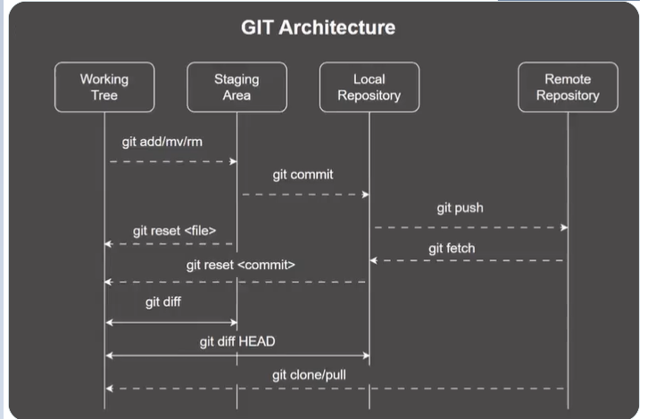

基本用法
----

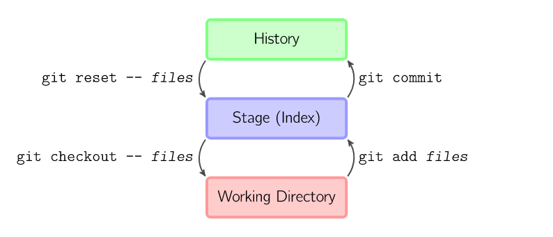

上面的四条命令在工作目录、暂存目录 (也叫做索引) 和仓库之间复制文件。

*   git add files 把当前文件放入暂存区域。
    
*   git commit 给暂存区域生成快照并提交。
    
*   git reset -- files 用来撤销最后一次 git add files，你也可以用 git reset 撤销所有暂存区域文件。
    
*   git checkout -- files 把文件从暂存区域复制到工作目录，用来丢弃本地修改。
    

你可以用 git reset -p, git checkout -p, or git add -p 进入交互模式。

也可以跳过暂存区域直接从仓库取出文件或者直接提交代码。

*   git commit -a 相当于运行 git add 把所有当前目录下的文件加入暂存区域再运行。git commit.
    
*   git commit files 进行一次包含最后一次提交加上工作目录中文件快照的提交。并且文件被添加到暂存区域。
    
*   git checkout HEAD -- files 回滚到复制最后一次提交。
    

约定
--

后文中以下面的形式使用图片。

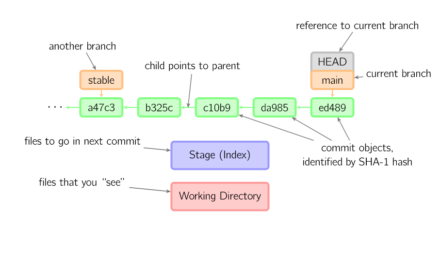

绿色的 5 位字符表示提交的 ID，分别指向父节点。分支用橘色显示，分别指向特定的提交。当前分支由附在其上的 HEAD 标识。这张图片里显示最后 5 次提交，ed489 是最新提交。main 分支指向此次提交，另一个 stable 分支指向祖父提交节点。

命令详解
----

### Diff

有许多种方法查看两次提交之间的变动。下面是一些示例。

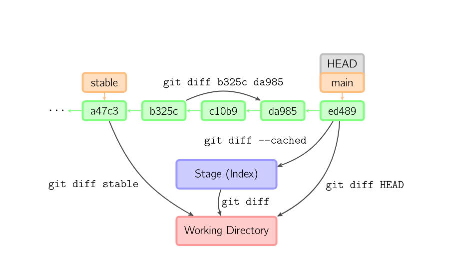

### Commit

提交时，git 用暂存区域的文件创建一个新的提交，并把此时的节点设为父节点。然后把当前分支指向新的提交节点。下图中，当前分支是 main。在运行命令之前，main 指向 ed489，提交后，main 指向新的节点 f0cec 并以 ed489 作为父节点。

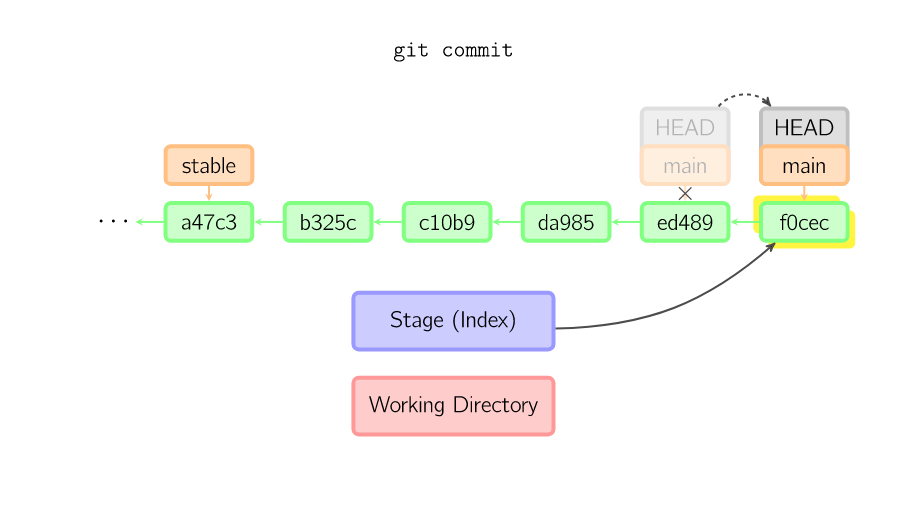

即便当前分支是某次提交的祖父节点，git 会同样操作。下图中，在 main 分支的祖父节点 stable 分支进行一次提交，生成了 1800b。这样，stable 分支就不再是 main 分支的祖父节点。此时，**合并** (或者 **衍合**) 是必须的。

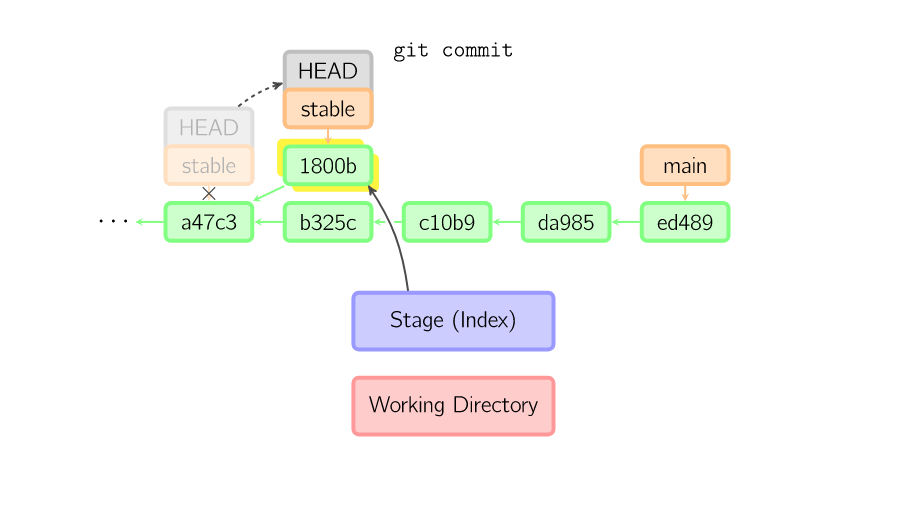

如果想更改一次提交，使用 git commit --amend。git 会使用与当前提交相同的父节点进行一次新提交，旧的提交会被取消。

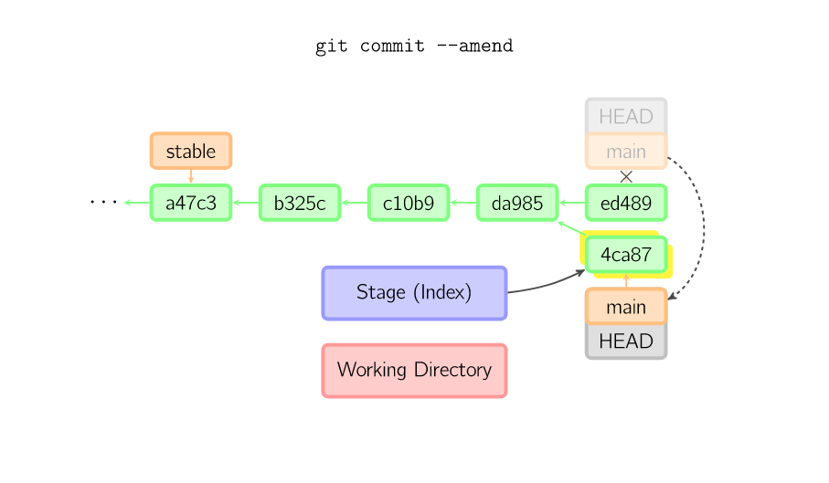

另一个例子是分离 HEAD 提交, 后文讲。

### Checkout

checkout 命令用于从历史提交（或者暂存区域）中拷贝文件到工作目录，也可用于切换分支。

当给定某个文件名（或者打开 - p 选项，或者文件名和 - p 选项同时打开）时，git 会从指定的提交中拷贝文件到暂存区域和工作目录。比如，git checkout HEAD~ foo.c 会将提交节点 HEAD~(即当前提交节点的父节点) 中的 foo.c 复制到工作目录并且加到暂存区域中。（如果命令中没有指定提交节点，则会从暂存区域中拷贝内容。）注意当前分支不会发生变化。

当不指定文件名，而是给出一个（本地）分支时，那么 HEAD 标识会移动到那个分支（也就是说，我们 “切换” 到那个分支了），然后暂存区域和工作目录中的内容会和 HEAD 对应的提交节点一致。新提交节点（下图中的 a47c3）中的所有文件都会被复制（到暂存区域和工作目录中）；只存在于老的提交节点（ed489）中的文件会被删除；不属于上述两者的文件会被忽略，不受影响。

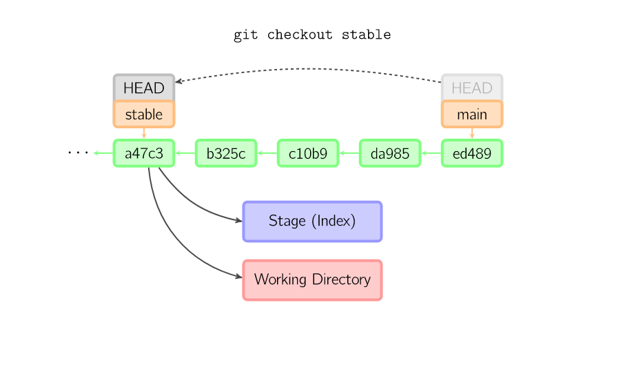

如果既没有指定文件名，也没有指定分支名，而是一个标签、远程分支、SHA-1 值或者是像 main~3 类似的东西，就得到一个匿名分支，称作 detached HEAD（被分离的 HEAD 标识）。这样可以很方便地在历史版本之间互相切换。比如说你想要编译 1.6.6.1 版本的 git，你可以运行 git checkout v1.6.6.1（这是一个标签，而非分支名），编译，安装，然后切换回另一个分支，比如说 git checkout main。然而，当提交操作涉及到 “分离的 HEAD” 时，其行为会略有不同，详情见在下面。

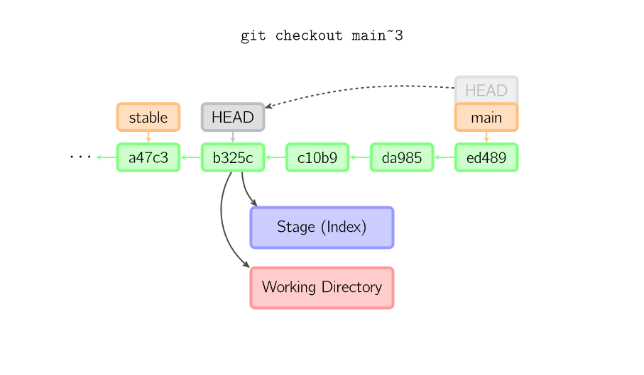

### HEAD 标识处于分离状态时的提交操作

当 HEAD 处于分离状态（不依附于任一分支）时，提交操作可以正常进行，但是不会更新任何已命名的分支。(你可以认为这是在更新一个匿名分支。)

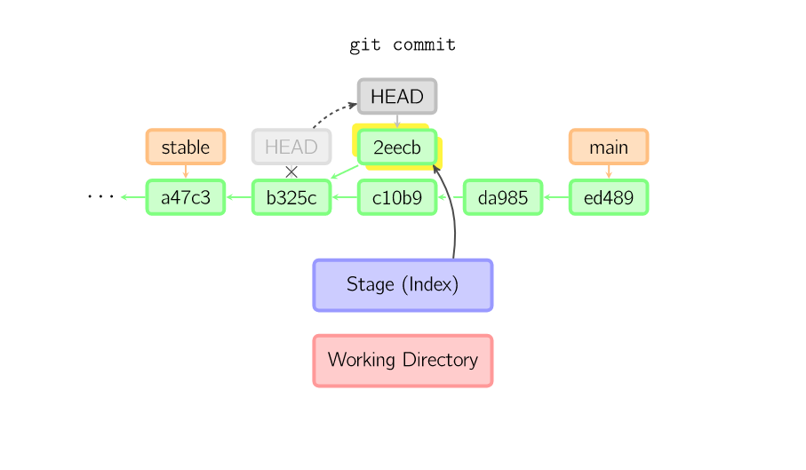

一旦此后你切换到别的分支，比如说 main，那么这个提交节点（可能）再也不会被引用到，然后就会被丢弃掉了。注意这个命令之后就不会有东西引用 2eecb。

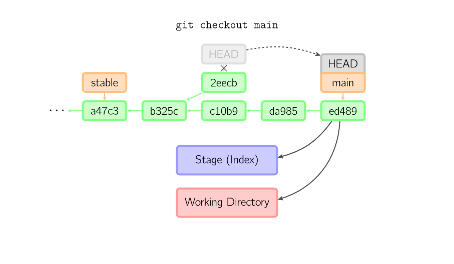

但是，如果你想保存这个状态，可以用命令 git checkout -b name 来创建一个新的分支。

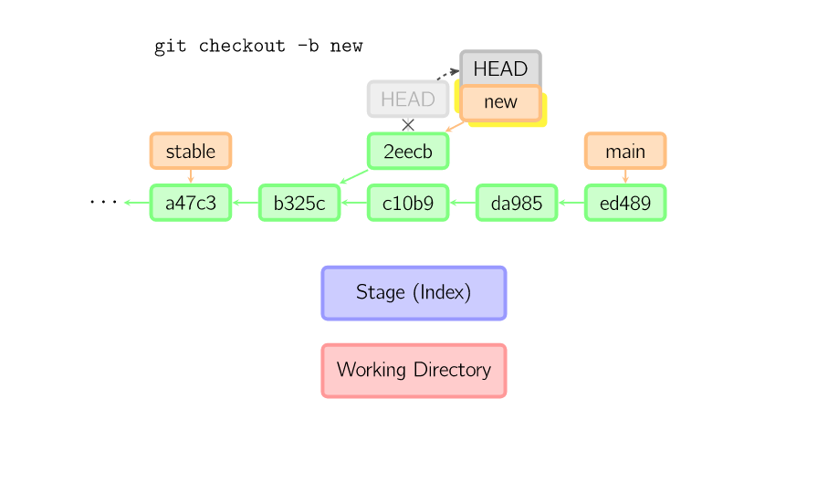

### Reset

reset 命令把当前分支指向另一个位置，并且有选择的变动工作目录和索引。也用来在从历史仓库中复制文件到索引，而不动工作目录。

如果不给选项，那么当前分支指向到那个提交。如果用 --hard 选项，那么工作目录也更新，如果用 --soft 选项，那么都不变。

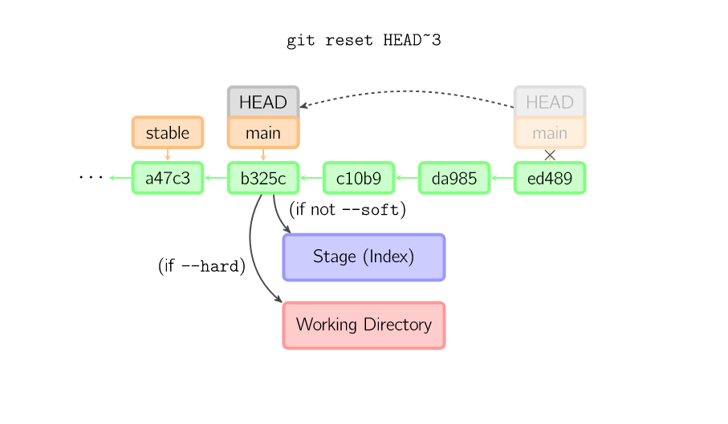

如果没有给出提交点的版本号，那么默认用 HEAD。这样，分支指向不变，但是索引会回滚到最后一次提交，如果用 --hard 选项，工作目录也同样。

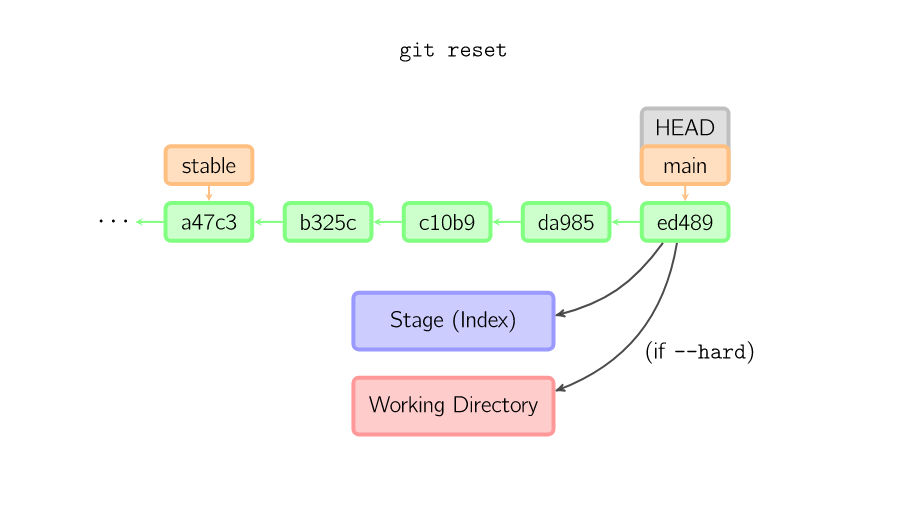

如果给了文件名 (或者 -p 选项), 那么工作效果和带文件名的 checkout 差不多，除了索引被更新。

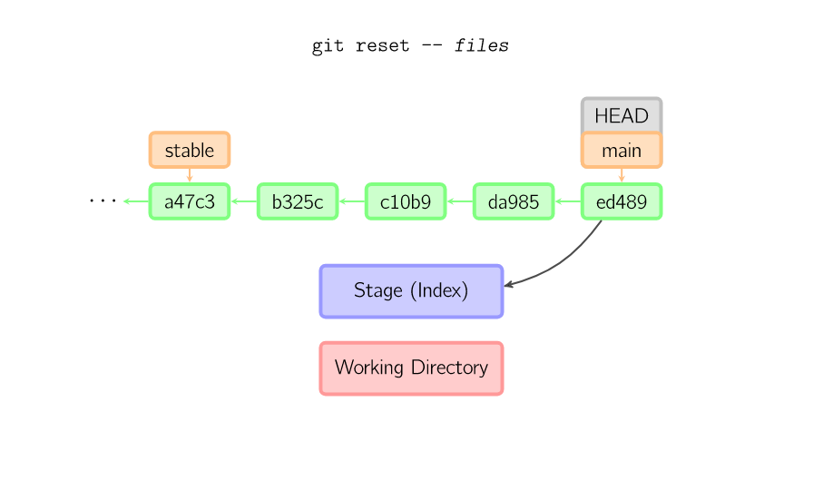

### Merge

merge 命令把不同分支合并起来。合并前，索引必须和当前提交相同。如果另一个分支是当前提交的祖父节点，那么合并命令将什么也不做。另一种情况是如果当前提交是另一个分支的祖父节点，就导致 fast-forward 合并。指向只是简单的移动，并生成一个新的提交。

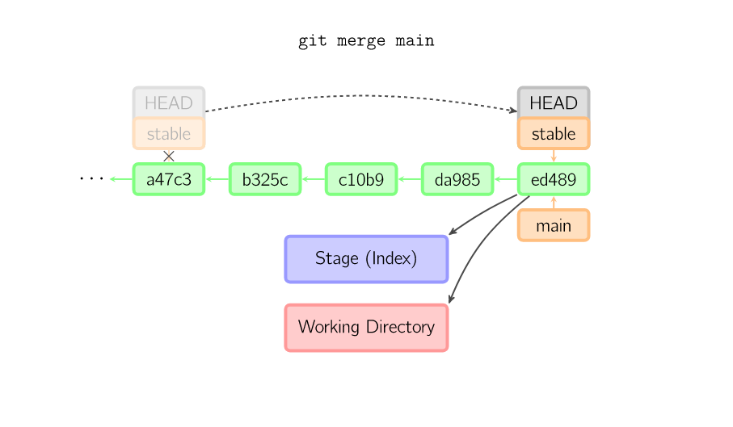

否则就是一次真正的合并。默认把当前提交 (ed489 如下所示) 和另一个提交 (33104) 以及他们的共同祖父节点 (b325c) 进行一次三方合并。结果是先保存当前目录和索引，然后和父节点 33104 一起做一次新提交。

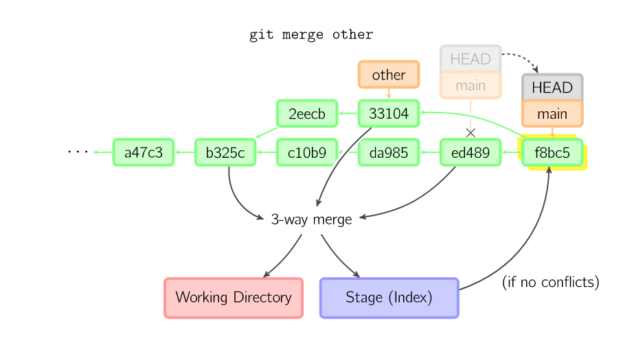

### Cherry Pick

cherry-pick 命令 "复制" 一个提交节点并在当前分支做一次完全一样的新提交。

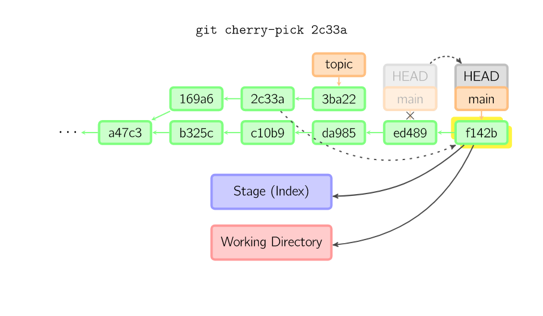

### Rebase

衍合是合并命令的另一种选择。合并把两个父分支合并进行一次提交，提交历史不是线性的。衍合在当前分支上重演另一个分支的历史，提交历史是线性的。本质上，这是线性化的自动的 cherry-pick

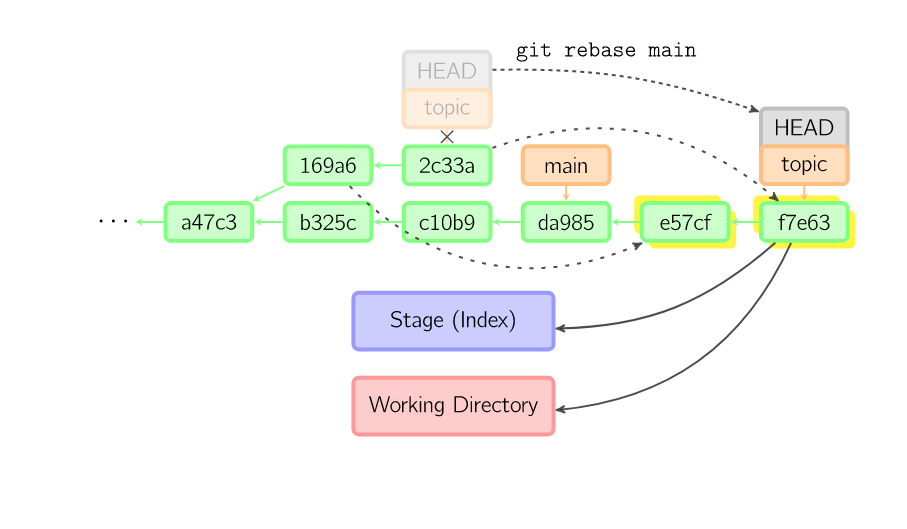

上面的命令都在 topic 分支中进行，而不是 main 分支，在 main 分支上重演，并且把分支指向新的节点。注意旧提交没有被引用，将被回收。

要限制回滚范围，使用 --onto 选项。下面的命令在 main 分支上重演当前分支从 169a6 以来的最近几个提交，即 2c33a。

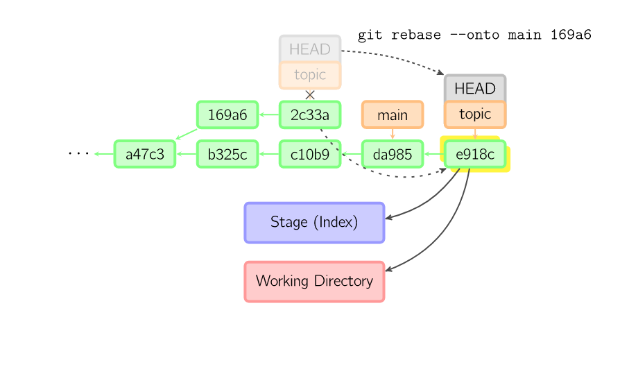

同样有 git rebase --interactive 让你更方便的完成一些复杂操作，比如丢弃、重排、修改、合并提交。

