第 01 章_数据库概述
============

## 1. 为什么要使用数据库[#](#1-为什么要使用数据库)

-----------------------------

*   持久化 (persistence)：**把数据保存到可掉电式存储设备中以供之后使用**。大多数情况下，特别是企业级应用，**数据持久化意味着将内存中的数据保存到硬盘上加以” 固化”**，而持久化的实现过程大多通过各种关系数据库来完成。
*   持久化的主要作用是**将内存中的数据存储在关系型数据库中**，当然也可以存储在磁盘文件、XML 数据文件中。

[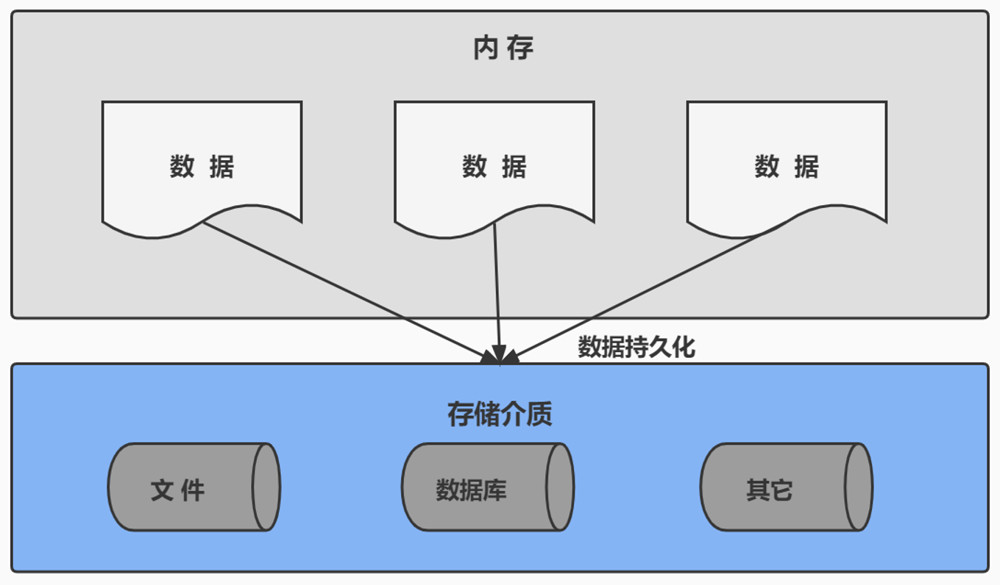](https://imag.fun-ny.cn/image-20211020202152071.png)

生活中的例子：

[](https://imag.fun-ny.cn/image_20211020132711.jpg)

## 2. 数据库与数据库管理系统[#](#2-数据库与数据库管理系统)

---------------------------------

### 2.1 数据库的相关概念[#](#21-数据库的相关概念)

<table><thead><tr><th><strong>DB：数据库（Database）</strong></th></tr></thead><tbody><tr><td>即存储数据的 “仓库”，其本质是一个文件系统。它保存了一系列有组织的数据。</td></tr><tr><td><strong>DBMS：数据库管理系统（Database Management System）</strong></td></tr><tr><td>是一种操纵和管理数据库的大型软件，用于建立、使用和维护数据库，对数据库进行统一管理和控制。用户通过数据库管理系统访问数据库中表内的数据。</td></tr><tr><td><strong>SQL：结构化查询语言（Structured Query Language）</strong></td></tr><tr><td>专门用来与数据库通信的语言。</td></tr></tbody></table>

### 2.2 数据库与数据库管理系统的关系[#](#22-数据库与数据库管理系统的关系)

数据库管理系统 (DBMS) 可以管理多个数据库，一般开发人员会针对每一个应用创建一个数据库。为保存应用中实体的数据，一般会在数据库创建多个表，以保存程序中实体用户的数据。

数据库管理系统、数据库和表的关系如图所示：

[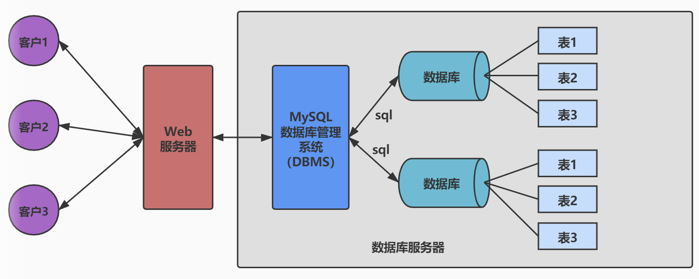](https://imag.fun-ny.cn/image-20211013202511233.png)

[](https://imag.fun-ny.cn/image-20210915112546261.png)

### 2.3 常见的数据库管理系统排名 (DBMS)[#](#23-常见的数据库管理系统排名dbms)

目前互联网上常见的数据库管理软件有 Oracle、MySQL、MS SQL Server、DB2、PostgreSQL、Access、Sybase、Informix 这几种。以下是 2021 年 **DB-Engines Ranking** 对各数据库受欢迎程度进行调查后的统计结果：（查看数据库最新排名:[https://db-engines.com/en/ranking）](https://db-engines.com/en/ranking%EF%BC%89)

[](https://imag.fun-ny.cn/image-20211013202815851.png)

。。。

[](https://imag.fun-ny.cn/image-20211013202940798.png)

对应的走势图：（[https://db-engines.com/en/ranking_trend）](https://db-engines.com/en/ranking_trend%EF%BC%89)

[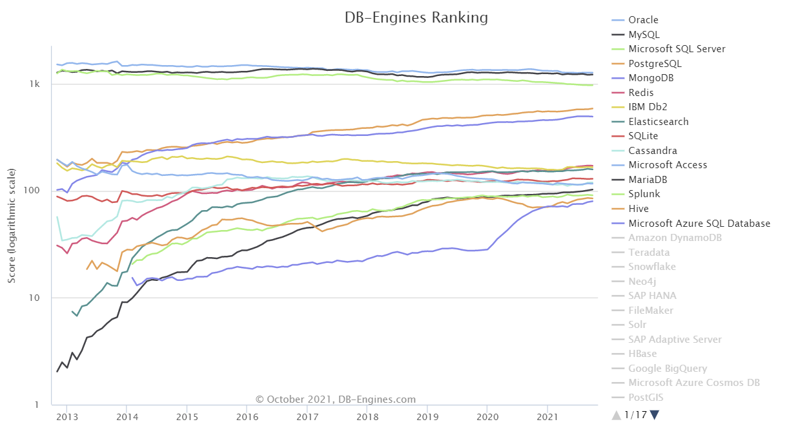](https://imag.fun-ny.cn/image-20211013203029492.png)

### 2.4 常见的数据库介绍[#](#24-常见的数据库介绍)

**Oracle**

1979 年，Oracle 2 诞生，它是第一个商用的 RDBMS（关系型数据库管理系统）。随着 Oracle 软件的名气越来越大，公司也改名叫 Oracle 公司。

2007 年，总计 85 亿美金收购 BEA Systems。

2009 年，总计 74 亿美金收购 SUN。此前的 2008 年，SUN 以 10 亿美金收购 MySQL。意味着 Oracle 同时拥有了 MySQL 的管理权，至此 Oracle 在数据库领域中成为绝对的领导者。

2013 年，甲骨文超越 IBM，成为继 Microsoft 后全球第二大软件公司。

如今 Oracle 的年收入达到了 400 亿美金，足以证明商用（收费）数据库软件的价值。

**SQL Server**

SQL Server 是微软开发的大型商业数据库，诞生于 1989 年。C#、.net 等语言常使用，与 WinNT 完全集成，也可以很好地与 Microsoft BackOffice 产品集成。

**DB2**

IBM 公司的数据库产品, 收费的。常应用在银行系统中。

**PostgreSQL**

PostgreSQL 的稳定性极强，最符合 SQL 标准，开放源码，具备商业级 DBMS 质量。PG 对数据量大的文本以及 SQL 处理较快。

**SyBase**

已经淡出历史舞台。提供了一个非常专业数据建模的工具 PowerDesigner。

**SQLite**

嵌入式的小型数据库，应用在手机端。 零配置，SQlite3 不用安装，不用配置，不用启动，关闭或者配置数据库实例。当系统崩溃后不用做任何恢复操作，再下次使用数据库的时候自动恢复。

**informix**

IBM 公司出品，取自 Information 和 Unix 的结合，它是第一个被移植到 Linux 上的商业数据库产品。仅运行于 unix/linux 平台，命令行操作。 性能较高，支持集群，适应于安全性要求极高的系统，尤其是银行，证券系统的应用。

## 3. MySQL 介绍[#](#3-mysql介绍)

--------------------------

[](https://imag.fun-ny.cn/image-20210829230656830.png)

### 3.1 概述[#](#31-概述)

*   MySQL 是一个`开放源代码的关系型数据库管理系统`，由瑞典 MySQL AB（创始人 Michael Widenius）公司 1995 年开发，迅速成为开源数据库的 No.1。
*   2008 被`Sun`收购（10 亿美金），2009 年 Sun 被`Oracle`收购。`MariaDB`应运而生。（MySQL 的创造者担心 MySQL 有闭源的风险，因此创建了 MySQL 的分支项目 MariaDB）
*   MySQL6.x 版本之后分为`社区版`和`商业版`。
*   MySQL 是一种关联数据库管理系统，将数据保存在不同的表中，而不是将所有数据放在一个大仓库内，这样就增加了速度并提高了灵活性。
*   MySQL 是开源的，所以你不需要支付额外的费用。
*   MySQL 是可以定制的，采用了`GPL（GNU General Public License）`协议，你可以修改源码来开发自己的 MySQL 系统。
*   MySQL 支持大型的数据库。可以处理拥有上千万条记录的大型数据库。
*   MySQL 支持大型数据库，支持 5000 万条记录的数据仓库，32 位系统表文件最大可支持`4GB`，64 位系统支持最大的表文件为`8TB`。
*   MySQL 使用`标准的SQL数据语言`形式。
*   MySQL 可以允许运行于多个系统上，并且支持多种语言。这些编程语言包括 C、C++、Python、Java、Perl、PHP 和 Ruby 等。

### 3.2 MySQL 发展史重大事件[#](#32-mysql发展史重大事件)

MySQL 的历史就是整个互联网的发展史。互联网业务从社交领域、电商领域到金融领域的发展，推动着应用对数据库的需求提升，对传统的数据库服务能力提出了挑战。高并发、高性能、高可用、轻资源、易维护、易扩展的需求，促进了 MySQL 的长足发展。

[](https://imag.fun-ny.cn/image-20210730161043856.png)

### 3.3 关于 MySQL 8.0[#](#14-关于mysql-80)

`MySQL从5.7版本直接跳跃发布了8.0版本`，可见这是一个令人兴奋的里程碑版本。MySQL 8 版本在功能上做了显著的改进与增强，开发者对 MySQL 的源代码进行了重构，最突出的一点是多 MySQL Optimizer 优化器进行了改进。不仅在速度上得到了改善，还为用户带来了更好的性能和更棒的体验。

### 3.4 Why choose MySQL?[#](#15-why-choose-mysql)

[](https://imag.fun-ny.cn/image-20211013210429011.png)

为什么如此多的厂商要选用 MySQL？大概总结的原因主要有以下几点：

1.  开放源代码，使用成本低。

2.  性能卓越，服务稳定。

3.  软件体积小，使用简单，并且易于维护。

4.  历史悠久，社区用户非常活跃，遇到问题可以寻求帮助。

5.  许多互联网公司在用，经过了时间的验证。

### 3.5 Oracle vs MySQL[#](#16-oracle-vs-mysql)

Oracle 更适合大型跨国企业的使用，因为他们对费用不敏感，但是对性能要求以及安全性有更高的要求。

MySQL 由于其**体积小、速度快、总体拥有成本低，可处理上千万条记录的大型数据库，尤其是开放源码这一特点，使得很多互联网公司、中小型网站选择了 MySQL 作为网站数据库**（Facebook，Twitter，YouTube，阿里巴巴 / 蚂蚁金服，去哪儿，美团外卖，腾讯）。

## 4. RDBMS 与 非 RDBMS[#](#4-rdbms-与-非rdbms)

----------------------------------------

从排名中我们能看出来，关系型数据库绝对是 DBMS 的主流，其中使用最多的 DBMS 分别是 Oracle、MySQL 和 SQL Server。这些都是关系型数据库（RDBMS）。

### 4.1 关系型数据库 (RDBMS)[#](#41-关系型数据库rdbms)

#### 4.1.1 实质[#](#411-实质)

* 这种类型的数据库是`最古老`的数据库类型，关系型数据库模型是把复杂的数据结构归结为简单的`二元关系`（即二维表格形式）。

  [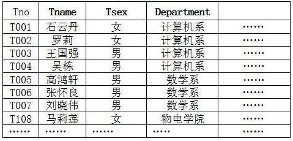](https://imag.fun-ny.cn/image-20211020145811031.png)

* 关系型数据库以`行(row)`和`列(column)`的形式存储数据，以便于用户理解。这一系列的行和列被称为`表(table)`，一组表组成了一个库 (database)。

* 表与表之间的数据记录有关系 (relationship)。现实世界中的各种实体以及实体之间的各种联系均用`关系模型`来表示。关系型数据库，就是建立在`关系模型`基础上的数据库。

* SQL 就是关系型数据库的查询语言。

[](https://imag.fun-ny.cn/image-20210914235413708.png)

#### 4.1.2 优势[#](#412-优势)

* **复杂查询**  

  可以用 SQL 语句方便的在一个表以及多个表之间做非常复杂的数据查询。

* **事务支持**  

  使得对于安全性能很高的数据访问要求得以实现。

### 4.2 非关系型数据库 (非 RDBMS)[#](#42-非关系型数据库非rdbms)

#### 4.2.1 介绍[#](#421-介绍)

**非关系型数据库**，可看成传统关系型数据库的功能`阉割版本`，基于键值对存储数据，不需要经过 SQL 层的解析，`性能非常高`。同时，通过减少不常用的功能，进一步提高性能。

目前基本上大部分主流的非关系型数据库都是免费的。

#### 4.2.2 有哪些非关系型数据库[#](#422-有哪些非关系型数据库)

相比于 SQL，NoSQL 泛指非关系型数据库，包括了榜单上的键值型数据库、文档型数据库、搜索引擎和列存储等，除此以外还包括图形数据库。也只有用 NoSQL 一词才能将这些技术囊括进来。

**键值型数据库**

键值型数据库通过 Key-Value 键值的方式来存储数据，其中 Key 和 Value 可以是简单的对象，也可以是复杂的对象。Key 作为唯一的标识符，优点是查找速度快，在这方面明显优于关系型数据库，缺点是无法像关系型数据库一样使用条件过滤（比如 WHERE），如果你不知道去哪里找数据，就要遍历所有的键，这就会消耗大量的计算。

键值型数据库典型的使用场景是作为`内存缓存`。`Redis` 是最流行的键值型数据库。

[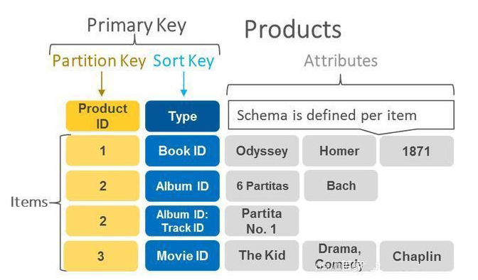](https://imag.fun-ny.cn/image-20211020172958427.png)

**文档型数据库**

此类数据库可存放并获取文档，可以是 XML、JSON 等格式。在数据库中文档作为处理信息的基本单位，一个文档就相当于一条记录。文档数据库所存放的文档，就相当于键值数据库所存放的 “值”。MongoDB 是最流行的文档型数据库。此外，还有 CouchDB 等。

**搜索引擎数据库**

虽然关系型数据库采用了索引提升检索效率，但是针对全文索引效率却较低。搜索引擎数据库是应用在搜索引擎领域的数据存储形式，由于搜索引擎会爬取大量的数据，并以特定的格式进行存储，这样在检索的时候才能保证性能最优。核心原理是 “倒排索引”。

典型产品：Solr、Elasticsearch、Splunk 等。

**列式数据库**

列式数据库是相对于行式存储的数据库，Oracle、MySQL、SQL Server 等数据库都是采用的行式存储（Row-based），而列式数据库是将数据按照列存储到数据库中，这样做的好处是可以大量降低系统的 I/O，适合于分布式文件系统，不足在于功能相对有限。典型产品：HBase 等。

[](https://imag.fun-ny.cn/image-20211020173921726.png)

**图形数据库**

图形数据库，利用了图这种数据结构存储了实体（对象）之间的关系。图形数据库最典型的例子就是社交网络中人与人的关系，数据模型主要是以节点和边（关系）来实现，特点在于能高效地解决复杂的关系问题。

图形数据库顾名思义，就是一种存储图形关系的数据库。它利用了图这种数据结构存储了实体（对象）之间的关系。关系型数据用于存储明确关系的数据，但对于复杂关系的数据存储却有些力不从心。如社交网络中人物之间的关系，如果用关系型数据库则非常复杂，用图形数据库将非常简单。典型产品：Neo4J、InfoGrid 等。

[](https://imag.fun-ny.cn/image-20211020180934455.png)

#### 4.2.3 NoSQL 的演变[#](#423-nosql的演变)

由于 SQL 一直称霸 DBMS，因此许多人在思考是否有一种数据库技术能远离 SQL，于是 NoSQL 诞生了，但是随着发展却发现越来越离不开 SQL。到目前为止 NoSQL 阵营中的 DBMS 都会有实现类似 SQL 的功能。下面是 “NoSQL” 这个名词在不同时期的诠释，从这些释义的变化中可以看出 `NoSQL 功能的演变`：

1970：NoSQL = We have no SQL

1980：NoSQL = Know SQL

2000：NoSQL = No SQL!

2005：NoSQL = Not only SQL

2013：NoSQL = No, SQL!

NoSQL 对 SQL 做出了很好的补充，比如实际开发中，有很多业务需求，其实并不需要完整的关系型数据库功能，非关系型数据库的功能就足够使用了。这种情况下，使用`性能更高`、`成本更低`的非关系型数据库当然是更明智的选择。比如：日志收集、排行榜、定时器等。

### 4.3 小结[#](#43-小结)

NoSQL 的分类很多，即便如此，在 DBMS 排名中，还是 SQL 阵营的比重更大，影响力前 5 的 DBMS 中有 4 个是关系型数据库，而排名前 20 的 DBMS 中也有 12 个是关系型数据库。所以说，掌握 SQL 是非常有必要的。整套课程将围绕 SQL 展开。

## 5. 关系型数据库设计规则[#](#5-关系型数据库设计规则)

-------------------------------

*   关系型数据库的典型数据结构就是`数据表`，这些数据表的组成都是结构化的（Structured）。

*   将数据放到表中，表再放到库中。

*   一个数据库中可以有多个表，每个表都有一个名字，用来标识自己。表名具有唯一性。

*   表具有一些特性，这些特性定义了数据在表中如何存储，类似 Java 和 Python 中 “类” 的设计。

### 5.1 表、记录、字段[#](#51-表记录字段)

*   E-R（entity-relationship，实体 - 联系）模型中有三个主要概念是：`实体集`、`属性`、`联系集`。

*   一个实体集（class）对应于数据库中的一个表（table），一个实体（instance）则对应于数据库表中的一行（row），也称为一条记录（record）。一个属性（attribute）对应于数据库表中的一列（column），也称为一个字段（field）。

[](https://imag.fun-ny.cn/image-20210914235450032-1634141235163.png)

```
ORM思想 (Object Relational Mapping)体现：
数据库中的一个表  <---> Java或Python中的一个类
表中的一条数据  <---> 类中的一个对象（或实体）
表中的一个列  <----> 类中的一个字段、属性(field)
```

### 5.2 表的关联关系[#](#52-表的关联关系)

*   表与表之间的数据记录有关系 (relationship)。现实世界中的各种实体以及实体之间的各种联系均用关系模型来表示。

*   四种：一对一关联、一对多关联、多对多关联、自我引用

#### 5.2.1 一对一关联（one-to-one）[#](#521-一对一关联one-to-one)

*   在实际的开发中应用不多，因为一对一可以创建成一张表。
*   举例：设计`学生表`：学号、姓名、手机号码、班级、系别、身份证号码、家庭住址、籍贯、紧急联系人、...
    *   拆为两个表：两个表的记录是一一对应关系。

    *   `基础信息表`（常用信息）：学号、姓名、手机号码、班级、系别

    *   `档案信息表`（不常用信息）：学号、身份证号码、家庭住址、籍贯、紧急联系人、...

*   两种建表原则：
    *   外键唯一：主表的主键和从表的外键（唯一），形成主外键关系，外键唯一。
    *   外键是主键：主表的主键和从表的主键，形成主外键关系。

[](https://imag.fun-ny.cn/image-20210914235534452.png)

#### 5.2.2 一对多关系（one-to-many）[#](#522-一对多关系one-to-many)

*   常见实例场景：`客户表和订单表`，`分类表和商品表`，`部门表和员工表`。
*   举例：
    *   员工表：编号、姓名、...、所属部门

    *   部门表：编号、名称、简介

*   一对多建表原则：在从表 (多方) 创建一个字段，字段作为外键指向主表 (一方) 的主键

[](https://imag.fun-ny.cn/image-20210915001013524.png)

[](https://imag.fun-ny.cn/image-20210914235610597.png)

[](https://imag.fun-ny.cn/image-20210915084623432.png)

#### 5.2.3 多对多（many-to-many）[#](#523-多对多many-to-many)

要表示多对多关系，必须创建第三个表，该表通常称为`联接表`，它将多对多关系划分为两个一对多关系。将这两个表的主键都插入到第三个表中。

[](https://imag.fun-ny.cn/image-20210915001048215.png)

* **举例 1：学生 - 课程**

  * `学生信息表`：一行代表一个学生的信息（学号、姓名、手机号码、班级、系别...）

  * `课程信息表`：一行代表一个课程的信息（课程编号、授课老师、简介...）

  * `选课信息表`：一个学生可以选多门课，一门课可以被多个学生选择

    ```
    学号     课程编号  
    1        1001
    2        1001
    1        1002
    ```

* **举例 2：产品 - 订单**

  “订单”表和 “产品” 表有一种多对多的关系，这种关系是通过与 “订单明细” 表建立两个一对多关系来定义的。一个订单可以有多个产品，每个产品可以出现在多个订单中。

  *   `产品表`：“产品” 表中的每条记录表示一个产品。
  *   `订单表`：“订单” 表中的每条记录表示一个订单。
  *   `订单明细表`：每个产品可以与 “订单” 表中的多条记录对应，即出现在多个订单中。一个订单可以与 “产品” 表中的多条记录对应，即包含多个产品。

[](https://imag.fun-ny.cn/image-20210914235637068.png)

*   **举例 3：用户 - 角色**
*   多对多关系建表原则：需要创建第三张表，中间表中至少两个字段，这两个字段分别作为外键指向各自一方的主键。

[](https://imag.fun-ny.cn/image-20210915084707586.png)

#### 5.3.4 自我引用 (Self reference)[#](#534-自我引用self-reference)

[](https://imag.fun-ny.cn/image-20210914235651997.png)

第 02 章_MySQL 环境搭建
=================

## 1. MySQL 的卸载[#](#1-mysql的卸载)

----------------------------

### 步骤 1：停止 MySQL 服务[#](#步骤1停止mysql服务)

在卸载之前，先停止 MySQL8.0 的服务。按键盘上的 “Ctrl + Alt + Delete” 组合键，打开 “任务管理器” 对话框，可以在 “服务” 列表找到 “MySQL8.0” 的服务，如果现在 “正在运行” 状态，可以右键单击服务，选择 “停止” 选项停止 MySQL8.0 的服务，如图所示。

[](https://imag.fun-ny.cn/image-20211014153604802.png)

### 步骤 2：软件的卸载[#](#步骤2软件的卸载)

**方式 1：通过控制面板方式**

卸载 MySQL8.0 的程序可以和其他桌面应用程序一样直接在 “控制面板” 选择“卸载程序”，并在程序列表中找到 MySQL8.0 服务器程序，直接双击卸载即可，如图所示。这种方式删除，数据目录下的数据不会跟着删除。

[](https://imag.fun-ny.cn/image-20211014153657668.png)

**方式 2：通过 360 或电脑管家等软件卸载**

略

**方式 3：通过安装包提供的卸载功能卸载**

你也可以通过安装向导程序进行 MySQL8.0 服务器程序的卸载。

① 再次双击下载的 mysql-installer-community-8.0.26.0.msi 文件，打开安装向导。安装向导会自动检测已安装的 MySQL 服务器程序。

② 选择要卸载的 MySQL 服务器程序，单击 “Remove”（移除），即可进行卸载。

[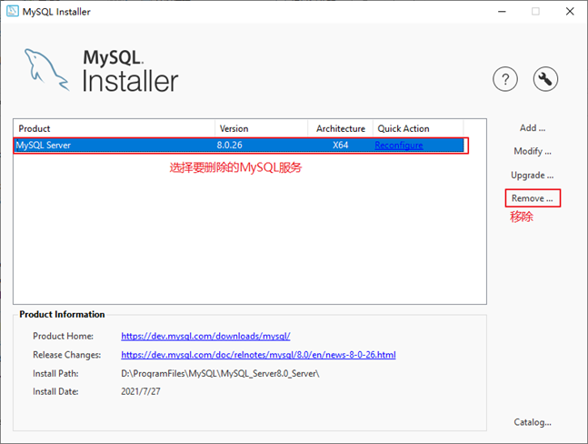](https://imag.fun-ny.cn/image-20211014153722683.png)

③ 单击 “Next”（下一步）按钮，确认卸载。

[](https://imag.fun-ny.cn/image-20211014153747283.png)

④ 弹出是否同时移除数据目录选择窗口。如果想要同时删除 MySQL 服务器中的数据，则勾选 “Remove the data directory”，如图所示。

[](https://imag.fun-ny.cn/image-20211014154112574.png)

⑤ 执行卸载。单击 “Execute”（执行）按钮进行卸载。

[](https://imag.fun-ny.cn/image-20211014154006530.png)

⑥ 完成卸载。单击 “Finish”（完成）按钮即可。如果想要同时卸载 MySQL8.0 的安装向导程序，勾选“Yes，Uninstall MySQL Installer” 即可，如图所示。

[](https://imag.fun-ny.cn/image-20211014154046268.png)

### 步骤 3：残余文件的清理[#](#步骤3残余文件的清理)

如果再次安装不成功，可以卸载后对残余文件进行清理后再安装。

（1）服务目录：mysql 服务的安装目录

（2）数据目录：默认在 C:\ProgramData\MySQL

如果自己单独指定过数据目录，就找到自己的数据目录进行删除即可。

> 注意：请在卸载前做好数据备份
>
> 在操作完以后，需要重启计算机，然后进行安装即可。**如果仍然安装失败，需要继续操作如下步骤 4。**

### 步骤 4：清理注册表（选做）[#](#步骤4清理注册表选做)

如果前几步做了，再次安装还是失败，那么可以清理注册表。

如何打开注册表编辑器：在系统的搜索框中输入`regedit`

```
HKEY_LOCAL_MACHINE\SYSTEM\ControlSet001\Services\Eventlog\Application\MySQL服务 目录删除
HKEY_LOCAL_MACHINE\SYSTEM\ControlSet001\Services\MySQL服务 目录删除
HKEY_LOCAL_MACHINE\SYSTEM\ControlSet002\Services\Eventlog\Application\MySQL服务 目录删除
HKEY_LOCAL_MACHINE\SYSTEM\ControlSet002\Services\MySQL服务 目录删除
HKEY_LOCAL_MACHINE\SYSTEM\CurrentControlSet\Services\Eventlog\Application\MySQL服务目录删除
HKEY_LOCAL_MACHINE\SYSTEM\CurrentControlSet\Services\MySQL服务删除
```

> 注册表中的 ControlSet001,ControlSet002, 不一定是 001 和 002, 可能是 ControlSet005、006 之类

### 步骤 5：删除环境变量配置[#](#步骤5删除环境变量配置)

找到 path 环境变量，将其中关于 mysql 的环境变量删除，**切记不要全部删除。**

例如：删除 D:\develop_tools\mysql\MySQLServer8.0.26\bin; 这个部分

[](https://imag.fun-ny.cn/1575694476072.png)

## 2. MySQL 的下载、安装、配置[#](#2-mysql的下载安装配置)

--------------------------------------

### 2.1 MySQL 的 4 大版本[#](#21-mysql的4大版本)

> *   **MySQL Community Server 社区版本**，开源免费，自由下载，但不提供官方技术支持，适用于大多数普通用户。
>
> *   **MySQL Enterprise Edition 企业版本**，需付费，不能在线下载，可以试用 30 天。提供了更多的功能和更完备的技术支持，更适合于对数据库的功能和可靠性要求较高的企业客户。
>
> *   **MySQL Cluster 集群版**，开源免费。用于架设集群服务器，可将几个 MySQL Server 封装成一个 Server。需要在社区版或企业版的基础上使用。
>
> *   **MySQL Cluster CGE 高级集群版**，需付费。

*   目前最新版本为`8.0.27`，发布时间`2021年10月`。此前，8.0.0 在 2016.9.12 日就发布了。

*   本课程中使用`8.0.26版本`。

此外，官方还提供了`MySQL Workbench`（GUITOOL）一款专为 MySQL 设计的`图形界面管理工具`。MySQLWorkbench 又分为两个版本，分别是`社区版`（MySQL Workbench OSS）、`商用版`（MySQL WorkbenchSE）。

### 2.2 软件的下载[#](#22-软件的下载)

**1. 下载地址**

官网：[https://www.mysql.com](https://www.mysql.com/)

**2. 打开官网，点击 DOWNLOADS**

然后，点击`MySQL Community(GPL) Downloads`

[](https://imag.fun-ny.cn/image-20210817185920150.png)

**3. 点击 MySQL Community Server**

[](https://imag.fun-ny.cn/image-20210817185955123.png)

**4. 在 General Availability(GA) Releases 中选择适合的版本**

Windows 平台下提供两种安装文件：MySQL 二进制分发版（.msi 安装文件）和免安装版（.zip 压缩文件）。一般来讲，应当使用二进制分发版，因为该版本提供了图形化的安装向导过程，比其他的分发版使用起来要简单，不再需要其他工具启动就可以运行 MySQL。

*   这里在 Windows 系统下推荐下载`MSI安装程序`；点击`Go to Download Page`进行下载即可

[](https://imag.fun-ny.cn/image-20210727192819147.png)

[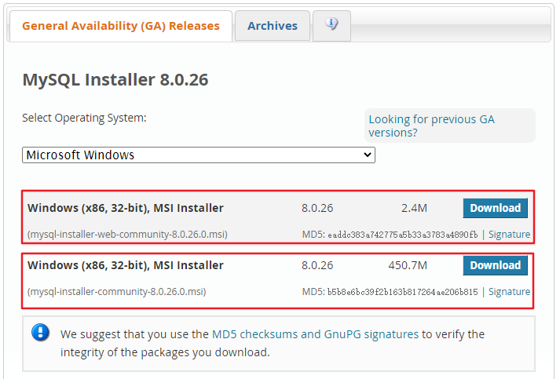](https://imag.fun-ny.cn/image-20211014163001964.png)

*   Windows 下的 MySQL8.0 安装有两种安装程序
    *   `mysql-installer-web-community-8.0.26.0.msi` 下载程序大小：2.4M；安装时需要联网安装组件。
    *   `mysql-installer-community-8.0.26.0.msi` 下载程序大小：450.7M；安装时离线安装即可。**推荐。**
*   如果安装 MySQL5.7 版本的话，选择`Archives`，接着选择 MySQL5.7 的相应版本即可。这里下载最近期的 MySQL5.7.34 版本。

[](https://imag.fun-ny.cn/image-20211014163228051.png)

[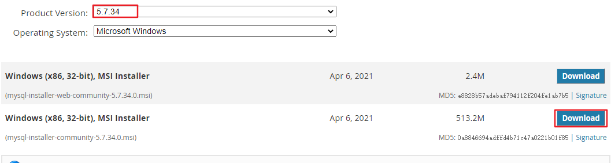](https://imag.fun-ny.cn/image-20211014163353156.png)

### 2.3 MySQL8.0 版本的安装[#](#23-mysql80-版本的安装)

MySQL 下载完成后，找到下载文件，双击进行安装，具体操作步骤如下。

步骤 1：双击下载的 mysql-installer-community-8.0.26.0.msi 文件，打开安装向导。

步骤 2：打开 “Choosing a Setup Type”（选择安装类型）窗口，在其中列出了 5 种安装类型，分别是 Developer Default（默认安装类型）、Server only（仅作为服务器）、Client only（仅作为客户端）、Full（完全安装）、Custom（自定义安装）。这里选择“Custom（自定义安装）” 类型按钮，单击 “Next(下一步)” 按钮。

[](https://imag.fun-ny.cn/image-20211014170553535.png)

步骤 3：打开 “Select Products” （选择产品）窗口，可以定制需要安装的产品清单。例如，选择“MySQL Server 8.0.26-X64” 后，单击 “→” 添加按钮，即可选择安装 MySQL 服务器，如图所示。采用通用的方法，可以添加其他你需要安装的产品。

[](https://imag.fun-ny.cn/image-20211014170638699.png)

此时如果直接 “Next”（下一步），则产品的安装路径是默认的。如果想要自定义安装目录，则可以选中对应的产品，然后在下面会出现 “Advanced Options”（高级选项）的超链接。

[](https://imag.fun-ny.cn/image-20211014170814386.png)

单击 “Advanced Options”（高级选项）则会弹出安装目录的选择窗口，如图所示，此时你可以分别设置 MySQL 的服务程序安装目录和数据存储目录。如果不设置，默认分别在 C 盘的 Program Files 目录和 ProgramData 目录（这是一个隐藏目录）。如果自定义安装目录，请避免“中文” 目录。另外，建议服务目录和数据目录分开存放。

[](https://imag.fun-ny.cn/image-20211014170857263.png)

步骤 4：在上一步选择好要安装的产品之后，单击 “Next”（下一步）进入确认窗口，如图所示。单击 “Execute”（执行）按钮开始安装。

[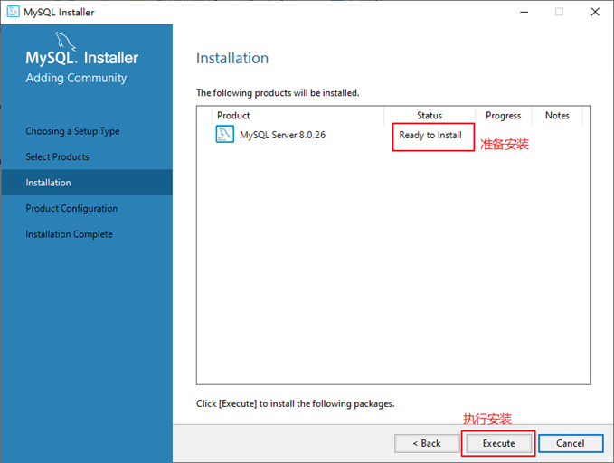](https://imag.fun-ny.cn/image-20211014170934889.png)

步骤 5：安装完成后在 “Status”（状态）列表下将显示 “Complete”（安装完成），如图所示。

[](https://imag.fun-ny.cn/image-20211014171002259.png)

### 2.4 配置 MySQL8.0[#](#24-配置mysql80)

MySQL 安装之后，需要对服务器进行配置。具体的配置步骤如下。

步骤 1：在上一个小节的最后一步，单击 “Next”（下一步）按钮，就可以进入产品配置窗口。

[](https://imag.fun-ny.cn/clip_image002-1634203188594.jpg)

步骤 2：单击 “Next”（下一步）按钮，进入 MySQL 服务器类型配置窗口，如图所示。端口号一般选择默认端口号 3306。

[](https://imag.fun-ny.cn/clip_image004-1634203188595.jpg)

其中，“Config Type” 选项用于设置服务器的类型。单击该选项右侧的下三角按钮，即可查看 3 个选项，如图所示。

[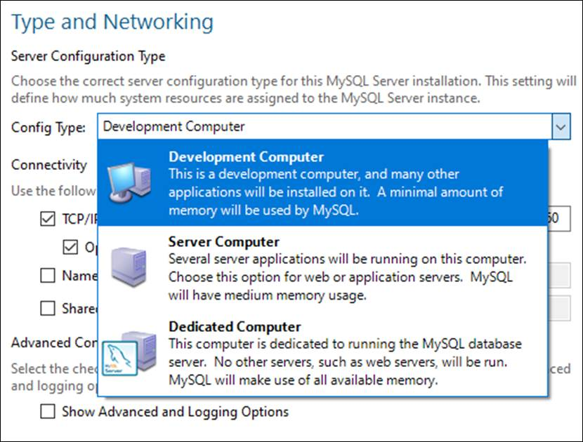](https://imag.fun-ny.cn/clip_image006-1634203188595.jpg)

*   `Development Machine（开发机器）`：该选项代表典型个人用桌面工作站。此时机器上需要运行多个应用程序，那么 MySQL 服务器将占用最少的系统资源。

*   `Server Machine（服务器）`：该选项代表服务器，MySQL 服务器可以同其他服务器应用程序一起运行，例如 Web 服务器等。MySQL 服务器配置成适当比例的系统资源。

*   `Dedicated Machine（专用服务器）`：该选项代表只运行 MySQL 服务的服务器。MySQL 服务器配置成使用所有可用系统资源。

步骤 3：单击 “Next”（下一步）按钮，打开设置授权方式窗口。其中，上面的选项是 MySQL8.0 提供的新的授权方式，采用 SHA256 基础的密码加密方法；下面的选项是传统授权方法（保留 5.x 版本兼容性）。

[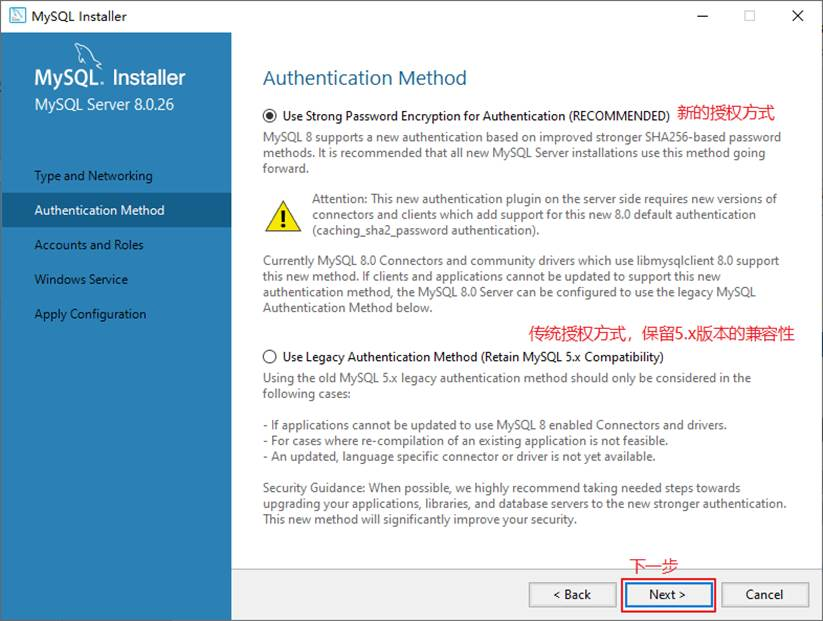](https://imag.fun-ny.cn/clip_image008-1634203188595.jpg)

步骤 4：单击 “Next”（下一步）按钮，打开设置服务器 root 超级管理员的密码窗口，如图所示，需要输入两次同样的登录密码。也可以通过“Add User” 添加其他用户，添加其他用户时，需要指定用户名、允许该用户名在哪台 / 哪些主机上登录，还可以指定用户角色等。此处暂不添加用户，用户管理在 MySQL 高级特性篇中讲解。

[](https://imag.fun-ny.cn/clip_image010-1634203188595.jpg)

步骤 5：单击 “Next”（下一步）按钮，打开设置服务器名称窗口，如图所示。该服务名会出现在 Windows 服务列表中，也可以在命令行窗口中使用该服务名进行启动和停止服务。本书将服务名设置为“MySQL80”。如果希望开机自启动服务，也可以勾选“Start the MySQL Server at System Startup” 选项（推荐）。

下面是选择以什么方式运行服务？可以选择 “Standard System Account”(标准系统用户) 或者 “Custom User”(自定义用户) 中的一个。这里推荐前者。

[](https://imag.fun-ny.cn/clip_image012-1634203188596.jpg)

步骤 6：单击 “Next”（下一步）按钮，打开确认设置服务器窗口，单击 “Execute”（执行）按钮。

[](https://imag.fun-ny.cn/clip_image014-1634203188596.jpg)

步骤 7：完成配置，如图所示。单击 “Finish”（完成）按钮，即可完成服务器的配置。

[](https://imag.fun-ny.cn/clip_image016.jpg)

步骤 8：如果还有其他产品需要配置，可以选择其他产品，然后继续配置。如果没有，直接选择 “Next”（下一步），直接完成整个安装和配置过程。

[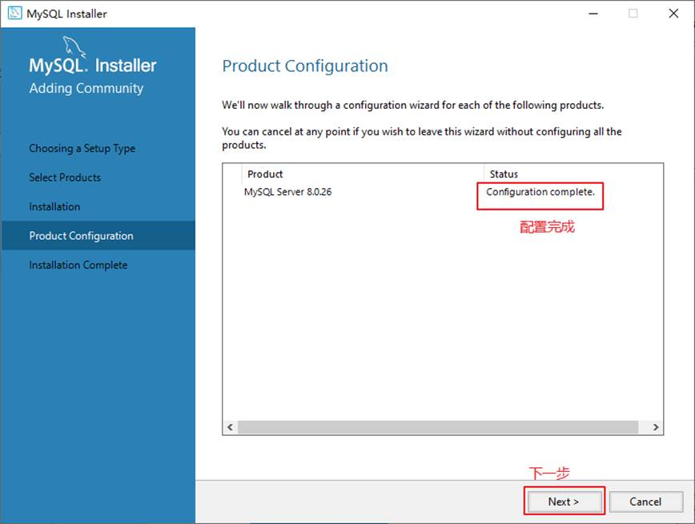](https://imag.fun-ny.cn/clip_image018.jpg)

步骤 9：结束安装和配置。

[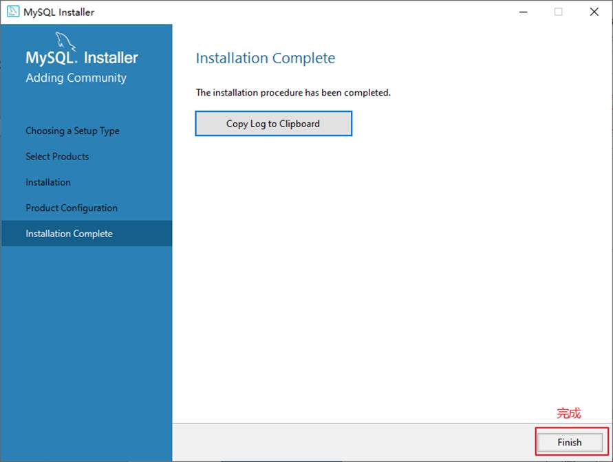](https://imag.fun-ny.cn/clip_image020.jpg)

### 2.5 配置 MySQL8.0 环境变量[#](#25-配置mysql80-环境变量)

如果不配置 MySQL 环境变量，就不能在命令行直接输入 MySQL 登录命令。下面说如何配置 MySQL 的环境变量：

步骤 1：在桌面上右击【此电脑】图标，在弹出的快捷菜单中选择【属性】菜单命令。  
步骤 2：打开【系统】窗口，单击【高级系统设置】链接。  
步骤 3：打开【系统属性】对话框，选择【高级】选项卡，然后单击【环境变量】按钮。  
步骤 4：打开【环境变量】对话框，在系统变量列表中选择 path 变量。  
步骤 5：单击【编辑】按钮，在【编辑环境变量】对话框中，将 MySQL 应用程序的 bin 目录（C:\Program Files\MySQL\MySQL Server 8.0\bin）添加到变量值中，用分号将其与其他路径分隔开。  
步骤 6：添加完成之后，单击【确定】按钮，这样就完成了配置 path 变量的操作，然后就可以直接输入 MySQL 命令来登录数据库了。

### 2.6 MySQL5.7 版本的安装、配置[#](#26-mysql57-版本的安装配置)

*   **安装**

此版本的安装过程与上述过程除了版本号不同之外，其它环节都是相同的。所以这里省略了 MySQL5.7.34 版本的安装截图。

*   **配置**

配置环节与 MySQL8.0 版本确有细微不同。大部分情况下直接选择 “Next” 即可，不影响整理使用。

这里配置 MySQL5.7 时，重点强调：**与前面安装好的 MySQL8.0 不能使用相同的端口号。**

### 2.7 安装失败问题[#](#27-安装失败问题)

MySQL 的安装和配置是一件非常简单的事，但是在操作过程中也可能出现问题，特别是初学者。

**问题 1：无法打开 MySQL8.0 软件安装包或者安装过程中失败，如何解决？**

在运行 MySQL8.0 软件安装包之前，用户需要确保系统中已经安装了. Net Framework 相关软件，如果缺少此软件，将不能正常地安装 MySQL8.0 软件。

[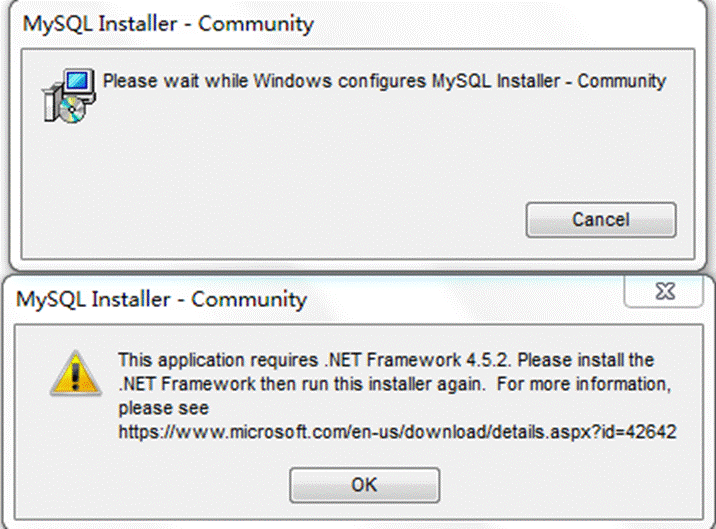](https://imag.fun-ny.cn/clip_image002.gif)

解决方案：到这个地址 https://www.microsoft.com/en-us/download/details.aspx?id=42642 下载 Microsoft .NET Framework 4.5 并安装后，再去安装 MySQL。

另外，还要确保 Windows Installer 正常安装。windows 上安装 mysql8.0 需要操作系统提前已安装好 Microsoft Visual C++ 2015-2019。

[](https://imag.fun-ny.cn/clip_image004.gif)

[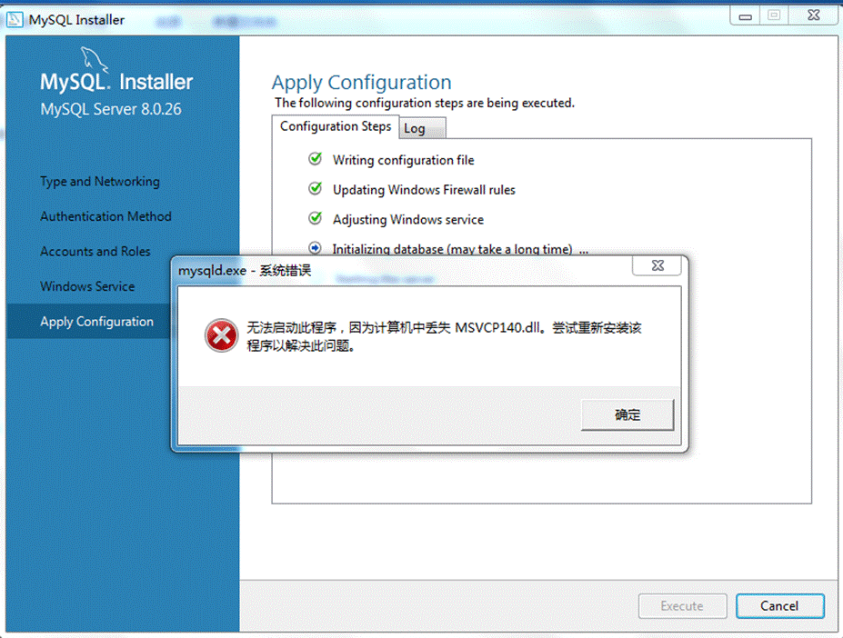](https://imag.fun-ny.cn/clip_image006.gif)

解决方案同样是，提前到微软官网 https://support.microsoft.com/en-us/topic/the-latest-supported-visual-c-downloads-2647da03-1eea-4433-9aff-95f26a218cc0，下载相应的环境。

**问题 2：卸载重装 MySQL 失败？**

该问题通常是因为 MySQL 卸载时，没有完全清除相关信息导致的。

解决办法是，把以前的安装目录删除。如果之前安装并未单独指定过服务安装目录，则默认安装目录是 “C:\Program Files\MySQL”，彻底删除该目录。同时删除 MySQL 的 Data 目录，如果之前安装并未单独指定过数据目录，则默认安装目录是 “C:\ProgramData\MySQL”，该目录一般为隐藏目录。删除后，重新安装即可。

**问题 3：如何在 Windows 系统删除之前的未卸载干净的 MySQL 服务列表？**

操作方法如下，在系统 “搜索框” 中输入“cmd”，按“Enter”（回车）键确认，弹出命令提示符界面。然后输入“sc delete MySQL 服务名”, 按“Enter”（回车）键，就能彻底删除残余的 MySQL 服务了。

## 3. MySQL 的登录[#](#3-mysql的登录)

----------------------------

### 3.1 服务的启动与停止[#](#31-服务的启动与停止)

MySQL 安装完毕之后，需要启动服务器进程，不然客户端无法连接数据库。

在前面的配置过程中，已经将 MySQL 安装为 Windows 服务，并且勾选当 Windows 启动、停止时，MySQL 也自动启动、停止。

#### 方式 1：使用图形界面工具[#](#方式1使用图形界面工具)

*   步骤 1：打开 windows 服务

    *   方式 1：计算机（点击鼠标右键）→ 管理（点击）→ 服务和应用程序（点击）→ 服务（点击）
    *   方式 2：控制面板（点击）→ 系统和安全（点击）→ 管理工具（点击）→ 服务（点击）
    *   方式 3：任务栏（点击鼠标右键）→ 启动任务管理器（点击）→ 服务（点击）
    *   方式 4：单击【开始】菜单，在搜索框中输入 “services.msc”，按 Enter 键确认
*   步骤 2：找到 MySQL80（点击鼠标右键）→ 启动或停止（点击）

[](https://imag.fun-ny.cn/image-20211014183908375.png)

#### 方式 2：使用命令行工具[#](#方式2使用命令行工具)

```bash
# 启动 MySQL 服务命令：
net start MySQL服务名

# 停止 MySQL 服务命令：
net stop MySQL服务名
```

[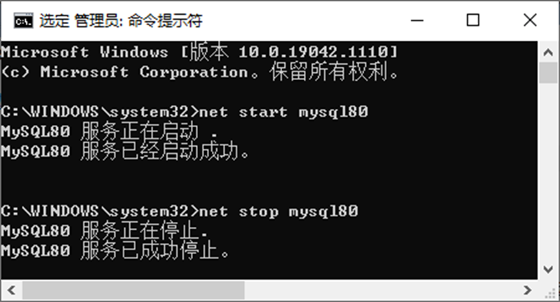](https://imag.fun-ny.cn/image-20211014184037414.png)

说明：

1.  start 和 stop 后面的服务名应与之前配置时指定的服务名一致。

2.  如果当你输入命令后，提示 “拒绝服务”，请以`系统管理员身份`打开命令提示符界面重新尝试。

### 3.2 自带客户端的登录与退出[#](#32-自带客户端的登录与退出)

当 MySQL 服务启动完成后，便可以通过客户端来登录 MySQL 数据库。注意：确认服务是开启的。

#### 登录方式 1：MySQL 自带客户端[#](#登录方式1mysql自带客户端)

开始菜单 → 所有程序 → MySQL → MySQL 8.0 Command Line Client

[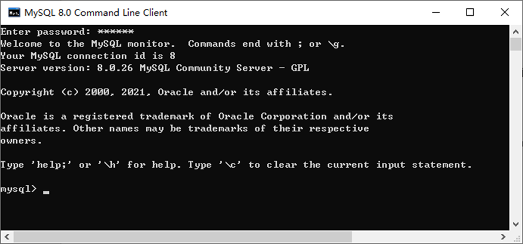](https://imag.fun-ny.cn/image-20211014184425147.png)

> 说明：仅限于 root 用户

#### 登录方式 2：windows 命令行[#](#登录方式2windows命令行)

*   格式：

```bash
mysql -h 主机名 -P 端口号 -u 用户名 -p密码
```

*   举例：

```bash
mysql -h localhost -P 3306 -u root -pabc123  # 这里我设置的root用户的密码是abc123
```

[](https://imag.fun-ny.cn/image-20211014185035137.png)

注意：

（1）-p 与密码之间不能有空格，其他参数名与参数值之间可以有空格也可以没有空格。如：

```bash
mysql -hlocalhost -P3306 -uroot -pabc123
```

（2）密码建议在下一行输入，保证安全

```bash
mysql -h localhost -P 3306 -u root -p
Enter password:****
```

（3）客户端和服务器在同一台机器上，所以输入 localhost 或者 IP 地址 127.0.0.1。同时，因为是连接本机：  -hlocalhost 就可以省略，如果端口号没有修改：-P3306 也可以省略

简写成：

```bash
mysql -u root -p
Enter password:****
```

连接成功后，有关于 MySQL Server 服务版本的信息，还有第几次连接的 id 标识。

也可以在命令行通过以下方式获取 MySQL Server 服务版本的信息：

```bash
c:\> mysql -V
```

```bash
c:\> mysql --version
```

或**登录**后，通过以下方式查看当前版本信息：

```bash
mysql> select version();
```

#### 退出登录[#](#退出登录)

```bash
exit
或
quit
```

## 4. MySQL 演示使用[#](#4-mysql演示使用)

------------------------------

### 4.1 MySQL 的使用演示[#](#41-mysql的使用演示)

1、查看所有的数据库

```mysql
show databases;
```

> “information_schema” 是 MySQL 系统自带的数据库，主要保存 MySQL 数据库服务器的系统信息，比如数据库的名称、数据表的名称、字段名称、存取权限、数据文件 所在的文件夹和系统使用的文件夹，等等
>
> “performance_schema” 是 MySQL 系统自带的数据库，可以用来监控 MySQL 的各类性能指标。
>
> “sys” 数据库是 MySQL 系统自带的数据库，主要作用是以一种更容易被理解的方式展示 MySQL 数据库服务器的各类性能指标，帮助系统管理员和开发人员监控 MySQL 的技术性能。
>
> “mysql” 数据库保存了 MySQL 数据库服务器运行时需要的系统信息，比如数据文件夹、当前使用的字符集、约束检查信息，等等

为什么 Workbench 里面我们只能看到 “demo” 和“sys”这 2 个数据库呢？

这是因为，Workbench 是图形化的管理工具，主要面向开发人 员，“demo”和 “sys” 这 2 个数据库已经够用了。如果有特殊需求，比如，需要监控 MySQL 数据库各项性能指标、直接操作 MySQL 数据库系统文件等，可以由 DBA 通过 SQL 语句，查看其它的系统数据库。

2、创建自己的数据库

```mysql
create database 数据库名;

#创建atguigudb数据库，该名称不能与已经存在的数据库重名。
create database atguigudb;
```

3、使用自己的数据库

```mysql
use 数据库名;

#使用atguigudb数据库
use atguigudb;
```

说明：如果没有使用 use 语句，后面针对数据库的操作也没有加 “数据名” 的限定，那么会报“ERROR 1046 (3D000): No database selected”（没有选择数据库）

使用完 use 语句之后，如果接下来的 SQL 都是针对一个数据库操作的，那就不用重复 use 了，如果要针对另一个数据库操作，那么要重新 use。

4、查看某个库的所有表格

```mysql
show tables;  #要求前面有use语句

show tables from 数据库名;
```

5、创建新的表格

```mysql
create table 表名称(
	字段名  数据类型,
	字段名 数据类型
);
```

说明：如果是最后一个字段，后面就用加逗号，因为逗号的作用是分割每个字段。

```mysql
#创建学生表
create table student(
	id int,
    name varchar(20)  #说名字最长不超过20个字符
);
```

6、查看一个表的数据

```mysql
select * from 数据库表名称;
```

```mysql
#查看学生表的数据
select * from student;
```

7、添加一条记录

```mysql
insert into 表名称 values(值列表);

#添加两条记录到student表中
insert into student values(1,'张三');
insert into student values(2,'李四');
```

报错：

```mysql
mysql> insert into student values(1,'张三');
ERROR 1366 (HY000): Incorrect string value: '\xD5\xC5\xC8\xFD' for column 'name' at row 1
mysql> insert into student values(2,'李四');
ERROR 1366 (HY000): Incorrect string value: '\xC0\xEE\xCB\xC4' for column 'name' at row 1
mysql> show create table student;
```

字符集的问题。

8、查看表的创建信息

```mysql
show create table 表名称\G


#查看student表的详细创建信息
show create table student\G
```

```mysql
#结果如下
*************************** 1. row ***************************
       Table: student
Create Table: CREATE TABLE `student` (
  `id` int(11) DEFAULT NULL,
  `name` varchar(20) DEFAULT NULL
) ENGINE=InnoDB DEFAULT CHARSET=latin1
1 row in set (0.00 sec)
```

上面的结果显示 student 的表格的默认字符集是 “latin1” 不支持中文。

9、查看数据库的创建信息

```mysql
show create database 数据库名\G

#查看atguigudb数据库的详细创建信息
show create database atguigudb\G
```

```mysql
#结果如下
*************************** 1. row ***************************
       Database: atguigudb
Create Database: CREATE DATABASE `atguigudb` /*!40100 DEFAULT CHARACTER SET latin1 */
1 row in set (0.00 sec)
```

上面的结果显示 atguigudb 数据库也不支持中文，字符集默认是 latin1。

10、删除表格

```mysql
drop table 表名称;
```

```mysql
#删除学生表
drop table student;
```

11、删除数据库

```mysql
drop database 数据库名;
```

```mysql
#删除atguigudb数据库
drop database atguigudb;
```

### 4.2 MySQL 的编码设置[#](#42-mysql的编码设置)

#### MySQL5.7 中[#](#mysql57中)

**问题再现：命令行操作 sql 乱码问题**

```mysql
mysql> INSERT INTO t_stu VALUES(1,'张三','男');
ERROR 1366 (HY000): Incorrect string value: '\xD5\xC5\xC8\xFD' for column 'sname' at row 1
```

**问题解决**

步骤 1：查看编码命令

```mysql
show variables like 'character_%';
show variables like 'collation_%';
```

步骤 2：修改 mysql 的数据目录下的 my.ini 配置文件

```mysql
[mysql]  #大概在63行左右，在其下添加
... 
default-character-set=utf8  #默认字符集

[mysqld]  # 大概在76行左右，在其下添加
...
character-set-server=utf8
collation-server=utf8_general_ci
```

> 注意：建议修改配置文件使用 notepad++ 等高级文本编辑器，使用记事本等软件打开修改后可能会导致文件编码修改为 “含 BOM 头” 的编码，从而服务重启失败。

步骤 3：重启服务

步骤 4：查看编码命令

```mysql
show variables like 'character_%';
show variables like 'collation_%';
```

[](https://imag.fun-ny.cn/MySQL编码1.jpg)

[](https://imag.fun-ny.cn/MySQL编码2.jpg)

*   如果是以上配置就说明对了。接着我们就可以新创建数据库、新创建数据表，接着添加包含中文的数据了。

#### MySQL8.0 中[#](#mysql80中)

在 MySQL 8.0 版本之前，默认字符集为 latin1，utf8 字符集指向的是 utf8mb3。网站开发人员在数据库设计的时候往往会将编码修改为 utf8 字符集。如果遗忘修改默认的编码，就会出现乱码的问题。从 MySQL 8.0 开始，数据库的默认编码改为`utf8mb4`，从而避免了上述的乱码问题。

## 5. MySQL 图形化管理工具[#](#5-mysql图形化管理工具)

------------------------------------

MySQL 图形化管理工具极大地方便了数据库的操作与管理，常用的图形化管理工具有：MySQL Workbench、phpMyAdmin、Navicat Preminum、MySQLDumper、SQLyog、dbeaver、MySQL ODBC Connector。

### 工具 1. MySQL Workbench[#](#工具1-mysql-workbench)

MySQL 官方提供的图形化管理工具 MySQL Workbench 完全支持 MySQL 5.0 以上的版本。MySQL Workbench 分为社区版和商业版，社区版完全免费，而商业版则是按年收费。

MySQL Workbench 为数据库管理员、程序开发者和系统规划师提供可视化设计、模型建立、以及数据库管理功能。它包含了用于创建复杂的数据建模 ER 模型，正向和逆向数据库工程，也可以用于执行通常需要花费大量时间的、难以变更和管理的文档任务。

下载地址：[http://dev.mysql.com/downloads/workbench/。](http://dev.mysql.com/downloads/workbench/%E3%80%82)

使用：

首先，我们点击 Windows 左下角的 “开始” 按钮，如果你是 Win10 系统，可以直接看到所有程序。接着，找到“MySQL”，点开，找到“MySQL Workbench 8.0 CE”。点击打开 Workbench，如下图所示：

[](https://imag.fun-ny.cn/image-20211007153522427.png)

左下角有个本地连接，点击，录入 Root 的密码，登录本地 MySQL 数据库服务器，如下图所示：

[](https://imag.fun-ny.cn/image-20211014195108502.png)

[](https://imag.fun-ny.cn/image-20211014195129219.png)

[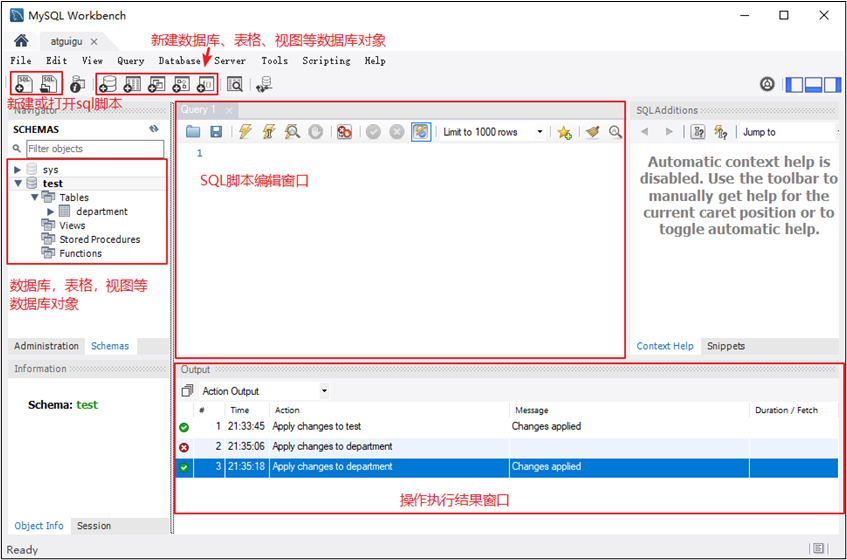](https://imag.fun-ny.cn/image-20211014195142849.png)

这是一个图形化的界面，我来给你介绍下这个界面。

*   上方是菜单。左上方是导航栏，这里我们可以看到 MySQL 数据库服务器里面的数据 库，包括数据表、视图、存储过程和函数；左下方是信息栏，可以显示上方选中的数据 库、数据表等对象的信息。

*   中间上方是工作区，你可以在这里写 SQL 语句，点击上方菜单栏左边的第三个运行按 钮，就可以执行工作区的 SQL 语句了。

*   中间下方是输出区，用来显示 SQL 语句的运行情况，包括什么时间开始运行的、运行的 内容、运行的输出，以及所花费的时长等信息。

好了，下面我们就用 Workbench 实际创建一个数据库，并且导入一个 Excel 数据文件， 来生成一个数据表。数据表是存储数据的载体，有了数据表以后，我们就能对数据进行操作了。

### 工具 2. Navicat[#](#工具2-navicat)

Navicat MySQL 是一个强大的 MySQL 数据库服务器管理和开发工具。它可以与任何 3.21 或以上版本的 MySQL 一起工作，支持触发器、存储过程、函数、事件、视图、管理用户等，对于新手来说易学易用。其精心设计的图形用户界面（GUI）可以让用户用一种安全简便的方式来快速方便地创建、组织、访问和共享信息。Navicat 支持中文，有免费版本提供。  
下载地址：[http://www.navicat.com/。](http://www.navicat.com/%E3%80%82)

[](https://imag.fun-ny.cn/1557378069584.png)

[](https://imag.fun-ny.cn/image-20210913180359685.png)

### 工具 3. SQLyog[#](#工具3-sqlyog)

SQLyog 是业界著名的 Webyog 公司出品的一款简洁高效、功能强大的图形化 MySQL 数据库管理工具。这款工具是使用 C++ 语言开发的。该工具可以方便地创建数据库、表、视图和索引等，还可以方便地进行插入、更新和删除等操作，同时可以方便地进行数据库、数据表的备份和还原。该工具不仅可以通过 SQL 文件进行大量文件的导入和导出，还可以导入和导出 XML、HTML 和 CSV 等多种格式的数据。  
下载地址：[http://www.webyog.com/，读者也可以搜索中文版的下载地址。](http://www.webyog.com/%EF%BC%8C%E8%AF%BB%E8%80%85%E4%B9%9F%E5%8F%AF%E4%BB%A5%E6%90%9C%E7%B4%A2%E4%B8%AD%E6%96%87%E7%89%88%E7%9A%84%E4%B8%8B%E8%BD%BD%E5%9C%B0%E5%9D%80%E3%80%82)

[](https://imag.fun-ny.cn/image-20211014213018979.png)

[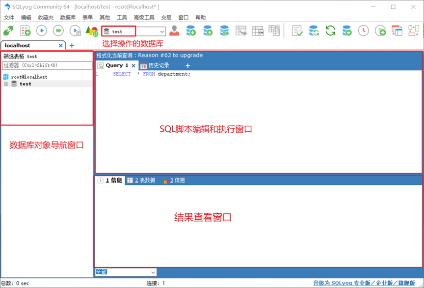](https://imag.fun-ny.cn/image-20211014213036470.png)

### 工具 4：dbeaver[#](#工具4dbeaver)

DBeaver 是一个通用的数据库管理工具和 SQL 客户端，支持所有流行的数据库：MySQL、PostgreSQL、SQLite、Oracle、DB2、SQL Server、 Sybase、MS Access、Teradata、 Firebird、Apache Hive、Phoenix、Presto 等。DBeaver 比大多数的 SQL 管理工具要轻量，而且支持中文界面。DBeaver 社区版作为一个免费开源的产品，和其他类似的软件相比，在功能和易用性上都毫不逊色。

唯一需要注意是 DBeaver 是用 Java 编程语言开发的，所以需要拥有 JDK（Java Development ToolKit）环境。如果电脑上没有 JDK，在选择安装 DBeaver 组件时，勾选 “Include Java” 即可。

下载地址：[https://dbeaver.io/download/](https://dbeaver.io/download/)

[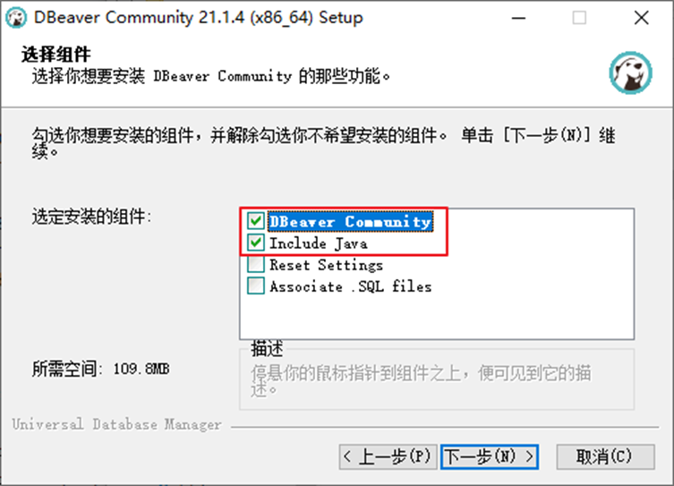](https://imag.fun-ny.cn/image-20211014195237457.png)

[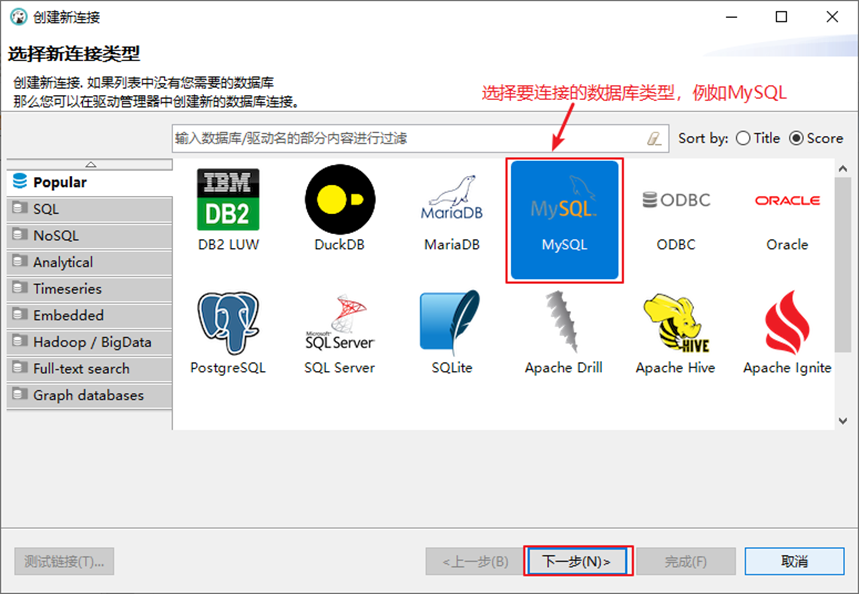](https://imag.fun-ny.cn/image-20211014195251371.png)

[](https://imag.fun-ny.cn/image-20211014195300510.png)

[](https://imag.fun-ny.cn/image-20211014195309805.png)

### 可能出现连接问题：[#](#可能出现连接问题)

有些图形界面工具，特别是旧版本的图形界面工具，在连接 MySQL8 时出现 “Authentication plugin 'caching_sha2_password' cannot be loaded” 错误。

[](https://imag.fun-ny.cn/image-20211019215249254.png)

出现这个原因是 MySQL8 之前的版本中加密规则是 mysql_native_password，而在 MySQL8 之后，加密规则是 caching_sha2_password。解决问题方法有两种，第一种是升级图形界面工具版本，第二种是把 MySQL8 用户登录密码加密规则还原成 mysql_native_password。

第二种解决方案如下，用命令行登录 MySQL 数据库之后，执行如下命令修改用户密码加密规则并更新用户密码，这里修改用户名为 “root@localhost” 的用户密码规则为“mysql_native_password”，密码值为“123456”，如图所示。

```mysql
#使用mysql数据库
USE mysql; 

#修改'root'@'localhost'用户的密码规则和密码
ALTER USER 'root'@'localhost' IDENTIFIED WITH mysql_native_password BY 'abc123'; 

#刷新权限
FLUSH PRIVILEGES;
```

[](https://imag.fun-ny.cn/image-20211019215408965.png)

## 6. MySQL 目录结构与源码[#](#6-mysql目录结构与源码)

------------------------------------

### 6.1 主要目录结构[#](#61-主要目录结构)

<table><thead><tr><th>MySQL 的目录结构</th><th>说明</th></tr></thead><tbody><tr><td>bin 目录</td><td>所有 MySQL 的可执行文件。如：mysql.exe</td></tr><tr><td>MySQLInstanceConfig.exe</td><td>数据库的配置向导，在安装时出现的内容</td></tr><tr><td>data 目录</td><td>系统数据库所在的目录</td></tr><tr><td>my.ini 文件</td><td>MySQL 的主要配置文件</td></tr><tr><td>c:\ProgramData\MySQL\MySQL Server 8.0\data\</td><td>用户创建的数据库所在的目录</td></tr></tbody></table>

### 6.2 MySQL 源代码获取[#](#62-mysql-源代码获取)

首先，你要进入 MySQL 下载界面。 这里你不要选择用默认的 “Microsoft Windows”，而是要通过下拉栏，找到 “Source Code”，在下面的操作系统版本里面， 选择 Windows（Architecture Independent），然后点击下载。

接下来，把下载下来的压缩文件解压，我们就得到了 MySQL 的源代码。

MySQL 是用 C++ 开发而成的，我简单介绍一下源代码的组成。

mysql-8.0.22 目录下的各个子目录，包含了 MySQL 各部分组件的源代码：

[](https://imag.fun-ny.cn/image-20211007154113052.png)

*   sql 子目录是 MySQL 核心代码；

*   libmysql 子目录是客户端程序 API；

*   mysql-test 子目录是测试工具；

*   mysys 子目录是操作系统相关函数和辅助函数；

源代码可以用记事本打开查看，如果你有 C++ 的开发环境，也可以在开发环境中打开查看。

[](https://imag.fun-ny.cn/image-20211007154213156.png)

如上图所示，源代码并不神秘，就是普通的 C++ 代码，跟你熟悉的一样，而且有很多注释，可以帮助你理解。阅读源代码就像在跟 MySQL 的开发人员对话一样，十分有趣。

## 7. 常见问题的解决 (课外内容)[#](#7-常见问题的解决课外内容)

------------------------------------

### 问题 1：root 用户密码忘记，重置的操作[#](#问题1root用户密码忘记重置的操作)

1: 通过任务管理器或者服务管理，关掉 mysqld(服务进程)  
2: 通过命令行 + 特殊参数开启 mysqld  
mysqld --defaults-file="D:\ProgramFiles\mysql\MySQLServer5.7Data\my.ini" --skip-grant-tables

3: 此时，mysqld 服务进程已经打开。并且不需要权限检查  
4: mysql -uroot 无密码登陆服务器。另启动一个客户端进行  
5: 修改权限表  
（1） use mysql;  
（2）update user set authentication_string=password('新密码') where user='root' and Host='localhost';  
（3）flush privileges;  
6: 通过任务管理器，关掉 mysqld 服务进程。  
7: 再次通过服务管理，打开 mysql 服务。  
8: 即可用修改后的新密码登陆。

### 问题 2：mysql 命令报 “不是内部或外部命令”[#](#问题2mysql命令报不是内部或外部命令)

如果输入 mysql 命令报 “不是内部或外部命令”，把 mysql 安装目录的 bin 目录配置到环境变量 path 中。如下：

[](https://imag.fun-ny.cn/image-20210914093150145.png)

### 问题 3：错误 ERROR ：没有选择数据库就操作表格和数据[#](#问题3错误error-没有选择数据库就操作表格和数据)

<table><thead><tr><th>ERROR 1046 (3D000): No database selected</th></tr></thead><tbody><tr><td>解决方案一：就是使用 “USE 数据库名;” 语句，这样接下来的语句就默认针对这个数据库进行操作</td></tr><tr><td>解决方案二：就是所有的表对象前面都加上 “数据库.”</td></tr></tbody></table>

### 问题 4：命令行客户端的字符集问题[#](#问题4命令行客户端的字符集问题)

```mysql
mysql> INSERT INTO t_stu VALUES(1,'张三','男');
ERROR 1366 (HY000): Incorrect string value: '\xD5\xC5\xC8\xFD' for column 'sname' at row 1
```

原因：服务器端认为你的客户端的字符集是 utf-8，而实际上你的客户端的字符集是 GBK。

[](https://imag.fun-ny.cn/1554912924219.png)

查看所有字符集：**SHOW VARIABLES LIKE 'character_set_%';**

[](https://imag.fun-ny.cn/1554912943186.png)

解决方案，设置当前连接的客户端字符集 **“SET NAMES GBK;”**

[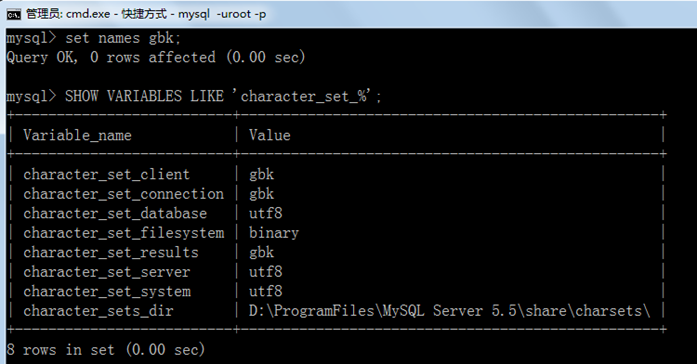](https://imag.fun-ny.cn/1554912957353.png)

### 问题 5：修改数据库和表的字符编码[#](#问题5修改数据库和表的字符编码)

修改编码：

（1) 先停止服务，（2）修改 my.ini 文件（3）重新启动服务

说明：

如果是在修改 my.ini 之前建的库和表，那么库和表的编码还是原来的 Latin1，要么删了重建，要么使用 alter 语句修改编码。

```mysql
mysql> create database 0728db charset Latin1;
Query OK, 1 row affected (0.00 sec)
```

```mysql
mysql> use 0728db;
Database changed
```

```mysql
mysql> create table student (id int , name varchar(20)) charset Latin1;
Query OK, 0 rows affected (0.02 sec)


mysql> show create table student\G
*************************** 1. row ***************************
       Table: student
Create Table: CREATE TABLE `student` (
  `id` int(11) NOT NULL,
  `name` varchar(20) DEFAULT NULL,
  PRIMARY KEY (`id`)
) ENGINE=InnoDB DEFAULT CHARSET=latin1
1 row in set (0.00 sec)
```

```mysql
mysql> alter table student charset utf8; #修改表字符编码为UTF8
Query OK, 0 rows affected (0.01 sec)
Records: 0  Duplicates: 0  Warnings: 0


mysql> show create table student\G
*************************** 1. row ***************************
       Table: student
Create Table: CREATE TABLE `student` (
  `id` int(11) NOT NULL,
  `name` varchar(20) CHARACTER SET latin1 DEFAULT NULL,  #字段仍然是latin1编码
  PRIMARY KEY (`id`)
) ENGINE=InnoDB DEFAULT CHARSET=utf8
1 row in set (0.00 sec)


mysql> alter table student modify name varchar(20) charset utf8; #修改字段字符编码为UTF8
Query OK, 0 rows affected (0.05 sec)
Records: 0  Duplicates: 0  Warnings: 0


mysql> show create table student\G
*************************** 1. row ***************************
       Table: student
Create Table: CREATE TABLE `student` (
  `id` int(11) NOT NULL,
  `name` varchar(20) DEFAULT NULL,
  PRIMARY KEY (`id`)
) ENGINE=InnoDB DEFAULT CHARSET=utf8
1 row in set (0.00 sec)
```

```mysql
mysql> show create database 0728db;;
+--------+-----------------------------------------------------------------+
|Database| Create Database                                                 |
+------+-------------------------------------------------------------------+
|0728db| CREATE DATABASE `0728db` /*!40100 DEFAULT CHARACTER SET latin1 */ |
+------+-------------------------------------------------------------------+
1 row in set (0.00 sec)


mysql> alter database 0728db charset utf8; #修改数据库的字符编码为utf8
Query OK, 1 row affected (0.00 sec)


mysql> show create database 0728db;
+--------+-----------------------------------------------------------------+
|Database| Create Database                                                 |
+--------+-----------------------------------------------------------------+
| 0728db | CREATE DATABASE `0728db` /*!40100 DEFAULT CHARACTER SET utf8 */ |
+--------+-----------------------------------------------------------------+
1 row in set (0.00 sec)
```

第 03 章_基本的 SELECT 语句
====================

## 1.SQL 概述[#](#1-sql概述)

----------------------

### 1.1 SQL 背景知识[#](#11-sql背景知识)

*   1946 年，世界上第一台电脑诞生，如今，借由这台电脑发展起来的互联网已经自成江湖。在这几十年里，无数的技术、产业在这片江湖里沉浮，有的方兴未艾，有的已经几幕兴衰。但在这片浩荡的波动里，有一门技术从未消失，甚至 “老当益壮”，那就是 SQL。

    *   45 年前，也就是 1974 年，IBM 研究员发布了一篇揭开数据库技术的论文《SEQUEL：一门结构化的英语查询语言》，直到今天这门结构化的查询语言并没有太大的变化，相比于其他语言，`SQL 的半衰期可以说是非常长`了。
*   不论是前端工程师，还是后端算法工程师，都一定会和数据打交道，都需要了解如何又快又准确地提取自己想要的数据。更别提数据分析师了，他们的工作就是和数据打交道，整理不同的报告，以便指导业务决策。

*   SQL（Structured Query Language，结构化查询语言）是使用关系模型的数据库应用语言，`与数据直接打交道`，由`IBM`上世纪 70 年代开发出来。后由美国国家标准局（ANSI）开始着手制定 SQL 标准，先后有`SQL-86`，`SQL-89`，`SQL-92`，`SQL-99`等标准。

    *   SQL 有两个重要的标准，分别是 SQL92 和 SQL99，它们分别代表了 92 年和 99 年颁布的 SQL 标准，我们今天使用的 SQL 语言依然遵循这些标准。
*   不同的数据库生产厂商都支持 SQL 语句，但都有特有内容。

[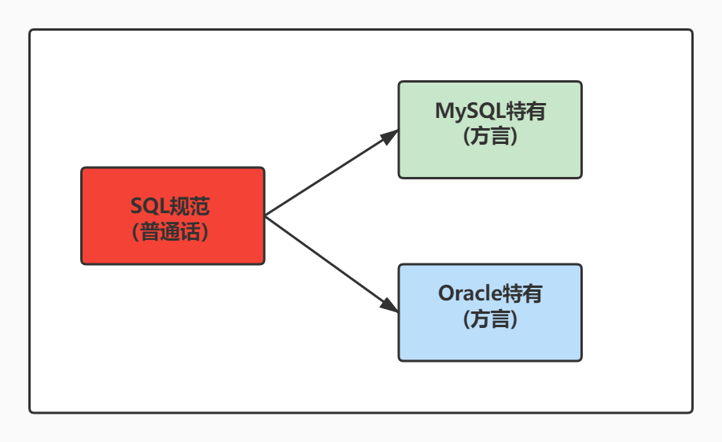](https://imag.fun-ny.cn/SQLisputonghua.jpg)

### 1.2 SQL 语言排行榜[#](#12-sql语言排行榜)

自从 SQL 加入了 TIOBE 编程语言排行榜，就一直保持在 Top 10。

[](https://imag.fun-ny.cn/image-20211014230114639.png)

### 1.3 SQL 分类[#](#13-sql-分类)

SQL 语言在功能上主要分为如下 3 大类：

*   **DDL（Data Definition Languages、数据定义语言）**，这些语句定义了不同的数据库、表、视图、索引等数据库对象，还可以用来创建、删除、修改数据库和数据表的结构。
    *   主要的语句关键字包括`CREATE`、`DROP`、`ALTER`等。
*   **DML（Data Manipulation Language、数据操作语言）**，用于添加、删除、更新和查询数据库记录，并检查数据完整性。

    *   主要的语句关键字包括`INSERT`、`DELETE`、`UPDATE`、`SELECT`等。
    *   **SELECT 是 SQL 语言的基础，最为重要。**
*   **DCL（Data Control Language、数据控制语言）**，用于定义数据库、表、字段、用户的访问权限和安全级别。

    *   主要的语句关键字包括`GRANT`、`REVOKE`、`COMMIT`、`ROLLBACK`、`SAVEPOINT`等。

> 因为查询语句使用的非常的频繁，所以很多人把查询语句单拎出来一类：DQL（数据查询语言）。
>
> 还有单独将`COMMIT`、`ROLLBACK` 取出来称为 TCL （Transaction Control Language，事务控制语言）。

## 2. SQL 语言的规则与规范[#](#2-sql语言的规则与规范)

----------------------------------

### 2.1 基本规则[#](#21-基本规则)

*   SQL 可以写在一行或者多行。为了提高可读性，各子句分行写，必要时使用缩进
*   每条命令以 `;` 或 `\g` 或 `\G` 结束
*   关键字不能被缩写也不能分行
*   关于标点符号
    *   必须保证所有的 ()、单引号、双引号是成对结束的
    *   必须使用英文状态下的半角输入方式
    *   **字符串型和日期时间类型的数据可以使用单引号（' '）表示**
    *   **列的别名，尽量使用双引号（`""`），而且不建议省略 as**

### 2.2 SQL 大小写规范 （建议遵守）[#](#22-sql大小写规范-建议遵守)

* **MySQL 在 Windows 环境下是大小写不敏感的**

* **MySQL 在 Linux 环境下是大小写敏感的**

  *   数据库名、表名、表的别名、变量名是严格区分大小写的
  *   关键字、函数名、列名 (或字段名)、列的别名 (字段的别名) 是忽略大小写的。

* **推荐采用统一的书写规范：**

  *   数据库名、表名、表别名、字段名、字段别名等都小写
  *   SQL 关键字、函数名、绑定变量等都大写

  > where后字符串的大小写
  >
  > * mysql大小写不敏感    	        支持双引号和单引号字符串
  >
  > * Oracle 区别字符串的大小写     只支持单引号字符串
  >
  >   
  >
  > SQL规范中：字符串  日期使用单引号
  >
  > ​			         别名使用双引号

### 2.3 注 释[#](#23-注-释)

可以使用如下格式的注释结构

```sql
单行注释：#注释文字(MySQL特有的方式)
单行注释：-- 注释文字(--后面必须包含一个空格。)
多行注释：/* 注释文字  */
```

### 2.4 命名规则（暂时了解）[#](#24-命名规则暂时了解)

*   数据库、表名不得超过 30 个字符，变量名限制为 29 个
*   必须只能包含 A–Z, a–z, 0–9, _共 63 个字符
*   数据库名、表名、字段名等对象名中间不要包含空格
*   同一个 MySQL 软件中，数据库不能同名；同一个库中，表不能重名；同一个表中，字段不能重名
*   必须保证你的字段没有和保留字、数据库系统或常用方法冲突。如果坚持使用，请在 SQL 语句中使用 `（着重号）引起来
*   保持字段名和类型的一致性，在命名字段并为其指定数据类型的时候一定要保证一致性。假如数据类型在一个表里是整数，那在另一个表里可就别变成字符型了

举例：

```mysql
#以下两句是一样的，不区分大小写
show databases;
SHOW DATABASES;

#创建表格
#create table student info(...); #表名错误，因为表名有空格
create table student_info(...); 

#其中order使用``飘号【着重号】，因为order和系统关键字或系统函数名等预定义标识符重名了
CREATE TABLE `order`(
    id INT,
    lname VARCHAR(20)
);

select id as "编号", `name` as "姓名" from t_stu; #起别名时，as都可以省略
select id as 编号, `name` as 姓名 from t_stu; #如果字段别名中没有空格，那么可以省略""
select id as 编 号, `name` as 姓 名 from t_stu; #错误，如果字段别名中有空格，那么不能省略""
```

### 2.5 数据导入指令[#](#25-数据导入指令)

在命令行客户端登录 mysql，使用 source 指令导入

```bash
mysql> source d:\mysqldb.sql
```

```mysql
mysql> desc employees;
+----------------+-------------+------+-----+---------+-------+
| Field          | Type        | Null | Key | Default | Extra |
+----------------+-------------+------+-----+---------+-------+
| employee_id    | int(6)      | NO   | PRI | 0       |       |
| first_name     | varchar(20) | YES  |     | NULL    |       |
| last_name      | varchar(25) | NO   |     | NULL    |       |
| email          | varchar(25) | NO   | UNI | NULL    |       |
| phone_number   | varchar(20) | YES  |     | NULL    |       |
| hire_date      | date        | NO   |     | NULL    |       |
| job_id         | varchar(10) | NO   | MUL | NULL    |       |
| salary         | double(8,2) | YES  |     | NULL    |       |
| commission_pct | double(2,2) | YES  |     | NULL    |       |
| manager_id     | int(6)      | YES  | MUL | NULL    |       |
| department_id  | int(4)      | YES  | MUL | NULL    |       |
+----------------+-------------+------+-----+---------+-------+
11 rows in set (0.00 sec)
```

## 3. 基本的 SELECT 语句[#](#3-基本的select语句)

-----------------------------------

### 3.0 SELECT...[#](#30-select)

```mysql
SELECT 1; #没有任何子句
SELECT 9/2; #没有任何子句
```

### 3.1 SELECT ... FROM[#](#31-select--from)

*   语法：

```mysql
SELECT   标识选择哪些列
FROM     标识从哪个表中选择
```

*   选择全部列：

```mysql
SELECT *
FROM   departments;
```

[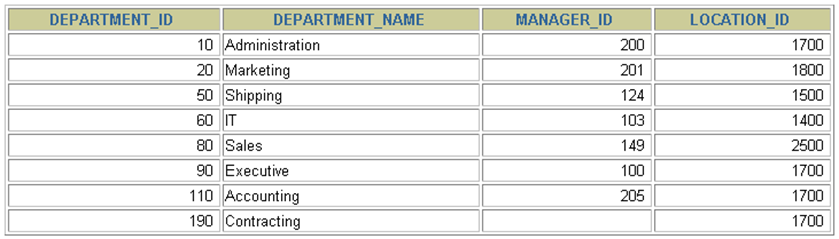](https://imag.fun-ny.cn/1554950890895.png)

> 一般情况下，除非需要使用表中所有的字段数据，最好不要使用通配符‘*’。使用通配符虽然可以节省输入查询语句的时间，但是获取不需要的列数据通常会降低查询和所使用的应用程序的效率。通配符的优势是，当不知道所需要的列的名称时，可以通过它获取它们。
>
> 在生产环境下，不推荐你直接使用`SELECT *`进行查询。

*   选择特定的列：

```mysql
SELECT department_id, location_id
FROM   departments;
```

[](https://imag.fun-ny.cn/1554950947969.png)

> MySQL 中的 SQL 语句是不区分大小写的，因此 SELECT 和 select 的作用是相同的，但是，许多开发人员习惯将关键字大写、数据列和表名小写，读者也应该养成一个良好的编程习惯，这样写出来的代码更容易阅读和维护。

### 3.2 列的别名[#](#32-列的别名)

* 重命名一个列

* 便于计算

* 紧跟列名，也可以**在列名和别名之间加入关键字 AS，别名使用" "双引号**，以便在别名中包含空格或特殊的字符并区分大小写。

* AS 可以省略

* 建议别名简短，见名知意

* 举例

  ```mysql
  SELECT last_name AS name, commission_pct comm
  FROM   employees;
  ```

  [](https://imag.fun-ny.cn/1554951616598.png)

  [](https://imag.fun-ny.cn/1554951622467.png)

  ```mysql
  SELECT last_name "Name", salary*12 "Annual Salary"
  FROM   employees;
  ```

​	[](https://imag.fun-ny.cn/1554951648377.png)

[](https://imag.fun-ny.cn/1554951655368.png)

### 3.3 去除重复行[#](#33-去除重复行)

默认情况下，查询会返回全部行，包括重复行。

```mysql
SELECT department_id
FROM   employees;
```

[](https://imag.fun-ny.cn/1554951711115.png)

[](https://imag.fun-ny.cn/1554951715923.png)

**在 SELECT 语句中使用关键字 DISTINCT 去除重复行**

```mysql
SELECT DISTINCT department_id
FROM   employees;
```

[](https://imag.fun-ny.cn/1554951796570.png)

[](https://imag.fun-ny.cn/1554951801044.png)

针对于：

```mysql
SELECT DISTINCT department_id,salary 
FROM employees;
```

这里有两点需要注意：

1.  DISTINCT 需要放到所有列名的前面，如果写成`SELECT salary, DISTINCT department_id FROM employees`会报错。
2.  DISTINCT 其实是对后面**所有列名的组合进行去重**，你能看到最后的结果是 74 条，因为这 74 个部门 id 不同，都有 salary 这个属性值。如果你想要看都有哪些不同的部门（department_id），只需要写`DISTINCT department_id`即可，后面不需要再加其他的列名了。

### 3.4 空值参与运算[#](#34-空值参与运算)

*   **所有运算符或列值遇到 null 值，运算的结果都为 null**
*   可以使用`IFNULL（列名，"NULL时的值"）`对null值进行处理

```mysql
SELECT employee_id,salary,commission_pct,
12 * salary * (1 + commission_pct) "annual_sal"
FROM employees;
```

这里你一定要注意，在 MySQL 里面， 空值不等于空字符串。一个空字符串的长度是 0，而一个空值的长度是空。而且，在 MySQL 里面，空值是占用空间的。


### 3.5 着重号[#](#35-着重号)

*   错误的

```mysql
mysql> SELECT * FROM ORDER; -- ORDER是关键字
ERROR 1064 (42000): You have an error in your SQL syntax; check the manual that corresponds to your MySQL server version for the right syntax to use near 'ORDER' at line 1
```

*   正确的

```mysql
mysql> SELECT * FROM `ORDER`;
+----------+------------+
| order_id | order_name |
+----------+------------+
|        1 | shkstart   |
|        2 | tomcat     |
|        3 | dubbo      |
+----------+------------+
3 rows in set (0.00 sec)

mysql> SELECT * FROM `order`;
+----------+------------+
| order_id | order_name |
+----------+------------+
|        1 | shkstart   |
|        2 | tomcat     |
|        3 | dubbo      |
+----------+------------+
3 rows in set (0.00 sec)
```

*   结论

我们需要保证表中的字段、表名等没有和保留字、数据库系统或常用方法冲突。如果真的相同，请在 SQL 语句中使用一对 ``（着重号）引起来。

### 3.6 查询常数[#](#36-5查询常数)

SELECT 查询还可以对常数进行查询。对的，就是在 SELECT 查询结果中增加一列固定的常数列。这列的取值是我们指定的，而不是从数据表中动态取出的。

你可能会问为什么我们还要对常数进行查询呢？

SQL 中的 SELECT 语法的确提供了这个功能，一般来说我们只从一个表中查询数据，通常不需要增加一个固定的常数列，但如果我们想整合不同的数据源，用常数列作为这个表的标记，就需要查询常数。

比如说，我们想对 employees 数据表中的员工姓名进行查询，同时增加一列字段`corporation`，这个字段固定值为 “尚硅谷”，可以这样写：

```mysql
SELECT '尚硅谷' as corporation, last_name FROM employees;
```

## 4. 显示表结构[#](#4-显示表结构)

---------------------

使用 DESCRIBE 或 DESC 命令，表示表结构。

```mysql
DESCRIBE employees;
或
DESC employees;
```

```mysql
mysql> desc employees;
+----------------+-------------+------+-----+---------+-------+
| Field          | Type        | Null | Key | Default | Extra |
+----------------+-------------+------+-----+---------+-------+
| employee_id    | int(6)      | NO   | PRI | 0       |       |
| first_name     | varchar(20) | YES  |     | NULL    |       |
| last_name      | varchar(25) | NO   |     | NULL    |       |
| email          | varchar(25) | NO   | UNI | NULL    |       |
| phone_number   | varchar(20) | YES  |     | NULL    |       |
| hire_date      | date        | NO   |     | NULL    |       |
| job_id         | varchar(10) | NO   | MUL | NULL    |       |
| salary         | double(8,2) | YES  |     | NULL    |       |
| commission_pct | double(2,2) | YES  |     | NULL    |       |
| manager_id     | int(6)      | YES  | MUL | NULL    |       |
| department_id  | int(4)      | YES  | MUL | NULL    |       |
+----------------+-------------+------+-----+---------+-------+
11 rows in set (0.00 sec)
```

其中，各个字段的含义分别解释如下：

*   Field：表示字段名称。
*   Type：表示字段类型，这里 barcode、goodsname 是文本型的，price 是整数类型的。
*   Null：表示该列是否可以存储 NULL 值。
*   Key：表示该列是否已编制索引。PRI 表示该列是表主键的一部分；UNI 表示该列是 UNIQUE 索引的一部分；MUL 表示在列中某个给定值允许出现多次。
*   Default：表示该列是否有默认值，如果有，那么值是多少。
*   Extra：表示可以获取的与给定列有关的附加信息，例如 AUTO_INCREMENT 等。

## 5. 过滤数据[#](#5-过滤数据)

-------------------

*   背景：

[](https://imag.fun-ny.cn/1554952199742.png)

* 语法：

  ```mysql
  SELECT 字段1,字段2
  FROM 表名
  WHERE 过滤条件
  ```

  * 使用 WHERE 子句，将不满足条件的行过滤掉

  * **WHERE 子句紧随 FROM 子句**

  * where后字符串的大小写

    * mysql大小写不敏感    	        支持双引号和单引号字符串

    * Oracle 区别字符串的大小写     只支持单引号字符串

      

    SQL规范中：字符串  日期使用单引号

    ​			         别名使用双引号

* 举例

```mysql
SELECT employee_id, last_name, job_id, department_id
FROM   employees
WHERE  department_id = 90 ;
```

[](https://imag.fun-ny.cn/1554952277028.png)

第 04 章_运算符
==========

## 1. 算术运算符[#](#1-算术运算符)

---------------------

算术运算符主要用于数学运算，其可以连接运算符前后的两个数值或表达式，对数值或表达式进行加（+）、减（-）、乘（*）、除（/）和取模（%）运算。

[](https://imag.fun-ny.cn/image-20211012100749193.png)

**1．加法与减法运算符**

```mysql
SELECT
	100, -- 100
	100 + 0, -- 100
	100 - 0, -- 100
	100 + 50, -- 150
	100 + 50 - 30, -- 120
	100 + 35.5, -- 135.5
	100 - 35.5, -- 64.5
	100 + '1', -- 101
	100 + 'a', -- 100
	100 + NULL  --NULL
FROM
	DUAL;
```

由运算结果可以得出如下结论：

> *   一个整数类型的值对整数进行加法和减法操作，结果还是一个整数；
> *   一个整数类型的值对浮点数进行加法和减法操作，结果是一个浮点数；
> *   加法和减法的优先级相同，进行先加后减操作与进行先减后加操作的结果是一样的；
> *   在 Java 中，+ 的左右两边如果有字符串，那么表示字符串的拼接。但是在 **MySQL 中 + 只表示数值相加。如果遇到非数值类型，先尝试转成数值，如果转失败，就按 0 计算**。（补充：**MySQL 中字符串拼接要使用字符串函数 CONCAT() 实现**）

**2．乘法与除法运算符**

```mysql
mysql> SELECT 100, 100 * 1, 100 * 1.0, 100 / 1.0, 100 / 2,100 + 2 * 5 / 2,100 /3, 100 DIV 0 FROM dual;
+-----+---------+-----------+-----------+---------+-----------------+---------+-----------+
| 100 | 100 * 1 | 100 * 1.0 | 100 / 1.0 | 100 / 2 | 100 + 2 * 5 / 2 | 100 /3  | 100 DIV 0 |
+-----+---------+-----------+-----------+---------+-----------------+---------+-----------+
| 100 |     100 |     100.0 |  100.0000 | 50.0000 |        105.0000 | 33.3333 |      NULL |
+-----+---------+-----------+-----------+---------+-----------------+---------+-----------+
1 row in set (0.00 sec)
```

```mysql
#计算出员工的年基本工资
SELECT employee_id,salary,salary * 12 annual_sal 
FROM employees;
```

由运算结果可以得出如下结论：

> *   一个数乘以整数 1 和除以整数 1 后仍得原数；
> *   一个数乘以浮点数 1 和除以浮点数 1 后变成浮点数，数值与原数相等；
> *   一个数除以整数后，不管是否能除尽，结果都为一个浮点数；
> *   一个数除以另一个数，除不尽时，结果为一个浮点数，并保留到小数点后 4 位；
> *   乘法和除法的优先级相同，进行先乘后除操作与先除后乘操作，得出的结果相同。
> *   在数学运算中，0 不能用作除数，在 MySQL 中，一个数除以 0 为 NULL。

**3．求模（求余）运算符** 

将 t22 表中的字段 i 对 3 和 5 进行求模（求余）运算。

```mysql
mysql> SELECT 12 % 3,12 % 5, 12 MOD -5,-12 % 5,-12 % -5 FROM DUAL;
+--------+--------+-----------+---------+----------+
| 12 % 3 | 12 % 5 | 12 MOD -5 | -12 % 5 | -12 % -5 |
+--------+--------+-----------+---------+----------+
|      0 |      2 |         2 |      -2 |       -2 |
+--------+--------+-----------+---------+----------+
1 row in set (0.00 sec)
```

```mysql
#筛选出employee_id是偶数的员工
SELECT * FROM employees
WHERE employee_id MOD 2 = 0;
```

可以看到，100 对 3 求模后的结果为 3，对 5 求模后的结果为 0。

> 取模结果只与被除数有关

## 2.比较运算符[#](#2-比较运算符)

---------------------

比较运算符用来对表达式左边的操作数和右边的操作数进行比较，比较的结果为真则返回 1，比较的结果为假则返回 0，其他情况则返回 NULL。

比较运算符经常被用来作为 SELECT 查询语句的条件来使用，返回符合条件的结果记录。

[](https://imag.fun-ny.cn/image-20211012101110021.png)

[](https://imag.fun-ny.cn/image-20211012104955094.png)

**1．等号运算符**

*   等号运算符（=）判断等号两边的值、字符串或表达式是否相等，如果相等则返回 1，不相等则返回 0。

*   在使用等号运算符时，遵循如下规则：

    *   如果等号两边的值、字符串或表达式都为字符串，则 MySQL 会按照字符串进行比较，其比较的是每个字符串中字符的 ANSI 编码是否相等。
    *   如果等号两边的值都是整数，则 MySQL 会按照整数来比较两个值的大小。
    *   如果等号两边的值一个是整数，另一个是字符串，则 MySQL 会*将字符串转化为数字*进行比较。
    *   如果等号两边的值、字符串或表达式中有一个为 NULL，则比较结果为 NULL。
*   对比：SQL 中赋值符号使用 `:=`

```mysql
mysql> SELECT 1 = 1, 1 = '1', 1 = 0, 'a' = 'a', (5 + 3) = (2 + 6), '' = NULL , NULL = NULL; 
+-------+---------+-------+-----------+-------------------+-----------+-------------+
| 1 = 1 | 1 = '1' | 1 = 0 | 'a' = 'a' | (5 + 3) = (2 + 6) | '' = NULL | NULL = NULL |
+-------+---------+-------+-----------+-------------------+-----------+-------------+
|    1  |     1   |   0   |      1    |             1     |    NULL   |        NULL  |
+-------+---------+-------+-----------+-------------------+-----------+-------------+
1 row in set (0.00 sec)
```

```mysql
mysql> SELECT 1 = 2, 0 = 'abc', 1 = 'abc' FROM dual;
+-------+-----------+-----------+
| 1 = 2 | 0 = 'abc' | 1 = 'abc' |
+-------+-----------+-----------+
|     0 |         1 |         0 |
+-------+-----------+-----------+
1 row in set, 2 warnings (0.00 sec)
```

```mysql
#查询salary=10000，注意在Java中比较是==
SELECT employee_id,salary FROM employees WHERE salary = 10000;
```

**2．安全等于运算符**  

安全等于运算符（<=>）与等于运算符（=）的作用是相似的，`唯一的区别`是‘<=>’可以用来对 NULL 进行判断。在两个操作数均为 NULL 时，其返回值为 1，而不为 NULL；当一个操作数为 NULL 时，其返回值为 0，而不为 NULL。

```mysql
mysql> SELECT 1 <=> '1', 1 <=> 0, 'a' <=> 'a', (5 + 3) <=> (2 + 6), '' <=> NULL,NULL <=> NULL FROM dual;
+-----------+---------+-------------+---------------------+-------------+---------------+
| 1 <=> '1' | 1 <=> 0 | 'a' <=> 'a' | (5 + 3) <=> (2 + 6) | '' <=> NULL | NULL <=> NULL |
+-----------+---------+-------------+---------------------+-------------+---------------+
|         1 |       0 |           1 |                   1 |           0 |             1 |
+-----------+---------+-------------+---------------------+-------------+---------------+
1 row in set (0.00 sec)
```

```mysql
#查询commission_pct等于0.40
SELECT employee_id,commission_pct FROM employees WHERE commission_pct = 0.40;

SELECT employee_id,commission_pct FROM employees WHERE commission_pct <=> 0.40;

#如果把0.40改成 NULL 呢？
```

可以看到，使用安全等于运算符时，两边的操作数的值都为 NULL 时，返回的结果为 1 而不是 NULL，其他返回结果与等于运算符相同。

**3．不等于运算符** 

不等于运算符（<> 和!=）用于判断两边的数字、字符串或者表达式的值是否不相等，如果不相等则返回 1，相等则返回 0。不等于运算符不能判断 NULL 值。如果两边的值有任意一个为 NULL，或两边都为 NULL，则结果为 NULL。  
SQL 语句示例如下：

```mysql
mysql> SELECT 1 <> 1, 1 != 2, 'a' != 'b', (3+4) <> (2+6), 'a' != NULL, NULL <> NULL; 
+--------+--------+------------+----------------+-------------+--------------+
| 1 <> 1 | 1 != 2 | 'a' != 'b' | (3+4) <> (2+6) | 'a' != NULL | NULL <> NULL |
+--------+--------+------------+----------------+-------------+--------------+
|      0 |   1    |       1    |            1   |     NULL    |         NULL |
+--------+--------+------------+----------------+-------------+--------------+
1 row in set (0.00 sec)
```

此外，还有非符号类型的运算符：

[](https://imag.fun-ny.cn/image-20211012105303219.png)

[](https://imag.fun-ny.cn/image-20211012105030527.png)

[](https://imag.fun-ny.cn/image-20211012105052456.png)

**4. 空运算符**  

空运算符（IS NULL 或者 ISNULL）判断一个值是否为 NULL，如果为 NULL 则返回 1，否则返回 0。  
SQL 语句示例如下：

```mysql
mysql> SELECT NULL IS NULL, ISNULL(NULL), ISNULL('a'), 1 IS NULL;
+--------------+--------------+-------------+-----------+
| NULL IS NULL | ISNULL(NULL) | ISNULL('a') | 1 IS NULL |
+--------------+--------------+-------------+-----------+
|            1 |            1 |           0 |         0 |
+--------------+--------------+-------------+-----------+
1 row in set (0.00 sec)
```

```mysql
#查询commission_pct等于NULL。比较如下的四种写法
SELECT employee_id,commission_pct FROM employees WHERE commission_pct IS NULL;
SELECT employee_id,commission_pct FROM employees WHERE commission_pct <=> NULL;
SELECT employee_id,commission_pct FROM employees WHERE ISNULL(commission_pct);
SELECT employee_id,commission_pct FROM employees WHERE commission_pct = NULL;
```

```mysql
SELECT last_name, manager_id
FROM   employees
WHERE  manager_id IS NULL;
```

**5. 非空运算符**  
非空运算符（IS NOT NULL）判断一个值是否不为 NULL，如果不为 NULL 则返回 1，否则返回 0。  
SQL 语句示例如下：

```mysql
mysql> SELECT NULL IS NOT NULL, 'a' IS NOT NULL,  1 IS NOT NULL; 
+------------------+-----------------+---------------+
| NULL IS NOT NULL | 'a' IS NOT NULL | 1 IS NOT NULL |
+------------------+-----------------+---------------+
|                0 |               1 |             1 |
+------------------+-----------------+---------------+
1 row in set (0.01 sec)
```

```mysql
#查询commission_pct不等于NULL
SELECT employee_id,commission_pct FROM employees WHERE commission_pct IS NOT NULL;
SELECT employee_id,commission_pct FROM employees WHERE NOT commission_pct <=> NULL;
SELECT employee_id,commission_pct FROM employees WHERE NOT ISNULL(commission_pct);
```

**6. 最小值运算符**  
语法格式为：`LEAST(值 1，值 2，...，值 n)`。其中，“值 n” 表示参数列表中有 n 个值。在有两个或多个参数的情况下，返回最小值。

```mysql
mysql> SELECT LEAST (1,0,2), LEAST('b','a','c'), LEAST(1,NULL,2);
+---------------+--------------------+-----------------+
| LEAST (1,0,2) | LEAST('b','a','c') | LEAST(1,NULL,2) |
+---------------+--------------------+-----------------+
|       0       |        a           |      NULL       |
+---------------+--------------------+-----------------+
1 row in set (0.00 sec)
```

由结果可以看到，当参数是整数或者浮点数时，LEAST 将返回其中最小的值；当参数为字符串时，返回字母表中顺序最靠前的字符；当比较值列表中有 NULL 时，不能判断大小，返回值为 NULL。

**7. 最大值运算符**  
语法格式为：`GREATEST(值 1，值 2，...，值 n)`。其中，n 表示参数列表中有 n 个值。当有两个或多个参数时，返回值为最大值。假如任意一个自变量为 NULL，则 GREATEST() 的返回值为 NULL。

```mysql
mysql> SELECT GREATEST(1,0,2), GREATEST('b','a','c'), GREATEST(1,NULL,2);
+-----------------+-----------------------+--------------------+
| GREATEST(1,0,2) | GREATEST('b','a','c') | GREATEST(1,NULL,2) |
+-----------------+-----------------------+--------------------+
|               2 | c                     |               NULL |
+-----------------+-----------------------+--------------------+
1 row in set (0.00 sec)
```

由结果可以看到，当参数中是整数或者浮点数时，GREATEST 将返回其中最大的值；当参数为字符串时，返回字母表中顺序最靠后的字符；当比较值列表中有 NULL 时，不能判断大小，返回值为 NULL。

**8. BETWEEN AND 运算符**  
BETWEEN 运算符使用的格式通常为 SELECT D FROM TABLE WHERE C BETWEEN A AND B，此时，当 C 大于或等于 A，并且 C 小于或等于 B 时，结果为 1，否则结果为 0。

```mysql
mysql> SELECT 1 BETWEEN 0 AND 1, 10 BETWEEN 11 AND 12, 'b' BETWEEN 'a' AND 'c';
+-------------------+----------------------+-------------------------+
| 1 BETWEEN 0 AND 1 | 10 BETWEEN 11 AND 12 | 'b' BETWEEN 'a' AND 'c' |
+-------------------+----------------------+-------------------------+
|                 1 |                    0 |                       1 |
+-------------------+----------------------+-------------------------+
1 row in set (0.00 sec)
```

```mysql
SELECT last_name, salary
FROM   employees
WHERE  salary BETWEEN 2500 AND 3500;
```

**9. IN 运算符**  
IN 运算符用于判断给定的值是否是 IN 列表中的一个值，如果是则返回 1，否则返回 0。如果给定的值为 NULL，或者 IN 列表中存在 NULL，则结果为 NULL。

```mysql
mysql> SELECT 'a' IN ('a','b','c'), 1 IN (2,3), NULL IN ('a','b'), 'a' IN ('a', NULL);
+----------------------+------------+-------------------+--------------------+
| 'a' IN ('a','b','c') | 1 IN (2,3) | NULL IN ('a','b') | 'a' IN ('a', NULL) |
+----------------------+------------+-------------------+--------------------+
|            1         |        0   |         NULL      |         1          |
+----------------------+------------+-------------------+--------------------+
1 row in set (0.00 sec)
```

```mysql
SELECT employee_id, last_name, salary, manager_id
FROM   employees
WHERE  manager_id IN (100, 101, 201);
```

**10. NOT IN 运算符**  
NOT IN 运算符用于判断给定的值是否不是 IN 列表中的一个值，如果不是 IN 列表中的一个值，则返回 1，否则返回 0。

```mysql
mysql> SELECT 'a' NOT IN ('a','b','c'), 1 NOT IN (2,3);
+--------------------------+----------------+
| 'a' NOT IN ('a','b','c') | 1 NOT IN (2,3) |
+--------------------------+----------------+
|                 0        |            1   |
+--------------------------+----------------+
1 row in set (0.00 sec)
```

**11. LIKE 运算符**  
LIKE 运算符主要用来匹配字符串，通常用于模糊匹配，如果满足条件则返回 1，否则返回 0。如果给定的值或者匹配条件为 NULL，则返回结果为 NULL。

LIKE 运算符通常使用如下通配符：

```mysql
“%”：匹配0个或多个字符。
“_”：只能匹配一个字符。
```

SQL 语句示例如下：

```mysql
mysql> SELECT NULL LIKE 'abc', 'abc' LIKE NULL;  
+-----------------+-----------------+
| NULL LIKE 'abc' | 'abc' LIKE NULL |
+-----------------+-----------------+
|          NULL   |          NULL   |
+-----------------+-----------------+
1 row in set (0.00 sec)
```

```mysql
SELECT	first_name
FROM 	employees
WHERE	first_name LIKE 'S%';
```

```mysql
SELECT last_name
FROM   employees
WHERE  last_name LIKE '_o%';
```

**ESCAPE**

*   回避特殊符号的：**使用转义符**。例如：将 [%] 转为[$%]、[]转为[$]，然后再加上 [ESCAPE‘$’] 即可。

```mysql
SELECT job_id
FROM   jobs
WHERE  job_id LIKE ‘IT\_%‘;
```

*   如果使用 `\` 表示转义，要省略 `ESCAPE`。如果不是 \，则要加上 ESCAPE。

```mysql
SELECT job_id
FROM   jobs
WHERE  job_id LIKE ‘IT$_%‘ escape ‘$‘;   -- 用$ 定义为转义符
```

**12. REGEXP 运算符**

REGEXP 运算符用来匹配字符串，语法格式为：`expr REGEXP 匹配条件`。如果 expr 满足匹配条件，返回 1；如果不满足，则返回 0。若 expr 或匹配条件任意一个为 NULL，则结果为 NULL。

REGEXP 运算符在进行匹配时，常用的有下面几种通配符：

```mysql
-- （1）‘^’匹配以该字符后面的字符开头的字符串。
-- （2）‘$’匹配以该字符前面的字符结尾的字符串。
-- （3）‘.’匹配任何一个单字符。
-- （4）“[...]”匹配在方括号内的任何字符。例如，“[abc]”匹配“a”或“b”或“c”。为了命名字符的范围，使用一个‘-’。“[a-z]”匹配任何字母，而“[0-9]”匹配任何数字。
-- （5）‘*’匹配零个或多个在它前面的字符。例如，“x*”匹配任何数量的‘x’字符，“[0-9]*”匹配任何数量的数字，而“*”匹配任何数量的任何字符。
```

SQL 语句示例如下：

```mysql
mysql> SELECT 'shkstart' REGEXP '^s', 'shkstart' REGEXP 't$', 'shkstart' REGEXP 'hk';
+------------------------+------------------------+-------------------------+
| 'shkstart' REGEXP '^s' | 'shkstart' REGEXP 't$' | 'shkstart' REGEXP 'hk'  |
+------------------------+------------------------+-------------------------+
|                      1 |                      1 |                       1 |
+------------------------+------------------------+-------------------------+
1 row in set (0.01 sec)
```

```mysql
mysql> SELECT 'atguigu' REGEXP 'gu.gu', 'atguigu' REGEXP '[ab]';
+--------------------------+-------------------------+
| 'atguigu' REGEXP 'gu.gu' | 'atguigu' REGEXP '[ab]' |
+--------------------------+-------------------------+
|                        1 |                       1 |
+--------------------------+-------------------------+
1 row in set (0.00 sec)
```

## 3. 逻辑运算符[#](#3-逻辑运算符)

---------------------

逻辑运算符主要用来判断表达式的真假，在 MySQL 中，逻辑运算符的返回结果为 1、0 或者 NULL。

MySQL 中支持 4 种逻辑运算符如下：

[](https://imag.fun-ny.cn/image-20211012110241418.png)

**1．逻辑非运算符**  
逻辑非（NOT 或!）运算符表示当给定的值为 0 时返回 1；当给定的值为非 0 值时返回 0；当给定的值为 NULL 时，返回 NULL。

```mysql
mysql> SELECT NOT 1, NOT 0, NOT(1+1), NOT !1, NOT NULL;    
+-------+-------+----------+--------+----------+
| NOT 1 | NOT 0 | NOT(1+1) | NOT !1 | NOT NULL |
+-------+-------+----------+--------+----------+
|     0 |     1 |        0 |      1 |     NULL |
+-------+-------+----------+--------+----------+
1 row in set, 1 warning (0.00 sec)
```

```mysql
SELECT last_name, job_id
FROM   employees
WHERE  job_id NOT IN ('IT_PROG', 'ST_CLERK', 'SA_REP');
```

**2．逻辑与运算符**  
逻辑与（AND 或 &&）运算符是当给定的所有值均为非 0 值，并且都不为 NULL 时，返回 1；当给定的一个值或者多个值为 0 时则返回 0；否则返回 NULL。

```mysql
mysql> SELECT 1 AND -1, 0 AND 1, 0 AND NULL, 1 AND NULL;
+----------+---------+------------+------------+
| 1 AND -1 | 0 AND 1 | 0 AND NULL | 1 AND NULL |
+----------+---------+------------+------------+
|        1 |       0 |          0 |       NULL |
+----------+---------+------------+------------+
1 row in set (0.00 sec)
```

```mysql
SELECT employee_id, last_name, job_id, salary
FROM   employees
WHERE  salary >=10000
AND    job_id LIKE '%MAN%';
```

**3．逻辑或运算符**  
逻辑或（OR 或 ||）运算符是当给定的值都不为 NULL，并且任何一个值为非 0 值时，则返回 1，否则返回 0；当一个值为 NULL，并且另一个值为非 0 值时，返回 1，否则返回 NULL；当两个值都为 NULL 时，返回 NULL。

```mysql
mysql> SELECT 1 OR -1, 1 OR 0, 1 OR NULL, 0 || NULL, NULL || NULL;     
+---------+--------+-----------+-----------+--------------+
| 1 OR -1 | 1 OR 0 | 1 OR NULL | 0 || NULL | NULL || NULL |
+---------+--------+-----------+-----------+--------------+
|       1 |      1 |         1 |    NULL   |       NULL   |
+---------+--------+-----------+-----------+--------------+
1 row in set, 2 warnings (0.00 sec)
```

```mysql
#查询基本薪资不在9000-12000之间的员工编号和基本薪资
SELECT employee_id,salary FROM employees 
WHERE NOT (salary >= 9000 AND salary <= 12000);

SELECT employee_id,salary FROM employees 
WHERE salary <9000 OR salary > 12000;

SELECT employee_id,salary FROM employees 
WHERE salary NOT BETWEEN 9000 AND 12000;
```

```mysql
SELECT employee_id, last_name, job_id, salary
FROM   employees
WHERE  salary >= 10000
OR     job_id LIKE '%MAN%';
```

> 注意：
>
> OR 可以和 AND 一起使用，但是在使用时要注意两者的优先级，由于 AND 的优先级高于 OR，因此先对 AND 两边的操作数进行操作，再与 OR 中的操作数结合。

**4．逻辑异或运算符**  
逻辑异或（XOR）运算符是当给定的值中任意一个值为 NULL 时，则返回 NULL；如果两个非 NULL 的值都是 0 或者都不等于 0 时，则返回 0；如果一个值为 0，另一个值不为 0 时，则返回 1。

```mysql
mysql> SELECT 1 XOR -1, 1 XOR 0, 0 XOR 0, 1 XOR NULL, 1 XOR 1 XOR 1, 0 XOR 0 XOR 0;
+----------+---------+---------+------------+---------------+---------------+
| 1 XOR -1 | 1 XOR 0 | 0 XOR 0 | 1 XOR NULL | 1 XOR 1 XOR 1 | 0 XOR 0 XOR 0 |
+----------+---------+---------+------------+---------------+---------------+
|        0 |       1 |       0 |       NULL |             1 |             0 |
+----------+---------+---------+------------+---------------+---------------+
1 row in set (0.00 sec)
```

```mysql
select last_name,department_id,salary 
from employees
where department_id in (10,20) XOR salary > 8000;
```

## 4. 位运算符[#](#4-位运算符)

-------------------

位运算符是在二进制数上进行计算的运算符。位运算符会先将操作数变成二进制数，然后进行位运算，最后将计算结果从二进制变回十进制数。

MySQL 支持的位运算符如下：

[](https://imag.fun-ny.cn/image-20211012110511223.png)

**1．按位与运算符**  
按位与（&）运算符将给定值对应的二进制数逐位进行逻辑与运算。当给定值对应的二进制位的数值都为 1 时，则该位返回 1，否则返回 0。

```mysql
mysql> SELECT 1 & 10, 20 & 30;
+--------+---------+
| 1 & 10 | 20 & 30 |
+--------+---------+
|      0 |      20 |
+--------+---------+
1 row in set (0.00 sec)
```

1 的二进制数为 0001，10 的二进制数为 1010，所以 1 & 10 的结果为 0000，对应的十进制数为 0。20 的二进制数为 10100，30 的二进制数为 11110，所以 20 & 30 的结果为 10100，对应的十进制数为 20。

**2. 按位或运算符**  
按位或（|）运算符将给定的值对应的二进制数逐位进行逻辑或运算。当给定值对应的二进制位的数值有一个或两个为 1 时，则该位返回 1，否则返回 0。

```mysql
mysql> SELECT 1 | 10, 20 | 30; 
+--------+---------+
| 1 | 10 | 20 | 30 |
+--------+---------+
|     11 |      30 |
+--------+---------+
1 row in set (0.00 sec)
```

1 的二进制数为 0001，10 的二进制数为 1010，所以 1 | 10 的结果为 1011，对应的十进制数为 11。20 的二进制数为 10100，30 的二进制数为 11110，所以 20 | 30 的结果为 11110，对应的十进制数为 30。

**3. 按位异或运算符**  
按位异或（^）运算符将给定的值对应的二进制数逐位进行逻辑异或运算。当给定值对应的二进制位的数值不同时，则该位返回 1，否则返回 0。

```mysql
mysql> SELECT 1 ^ 10, 20 ^ 30; 
+--------+---------+
| 1 ^ 10 | 20 ^ 30 |
+--------+---------+
|     11 |      10 |
+--------+---------+
1 row in set (0.00 sec)
```

1 的二进制数为 0001，10 的二进制数为 1010，所以 1 ^ 10 的结果为 1011，对应的十进制数为 11。20 的二进制数为 10100，30 的二进制数为 11110，所以 20 ^ 30 的结果为 01010，对应的十进制数为 10。

再举例：

```mysql
mysql> SELECT 12 & 5, 12 | 5,12 ^ 5 FROM DUAL;
+--------+--------+--------+
| 12 & 5 | 12 | 5 | 12 ^ 5 |
+--------+--------+--------+
|      4 |     13 |      9 |
+--------+--------+--------+
1 row in set (0.00 sec)
```

[](https://imag.fun-ny.cn/image-20211023115738415.png)

**4. 按位取反运算符**  
按位取反（~）运算符将给定的值的二进制数逐位进行取反操作，即将 1 变为 0，将 0 变为 1。

```mysql
mysql> SELECT 10 & ~1;
+---------+
| 10 & ~1 |
+---------+
|      10 |
+---------+
1 row in set (0.00 sec)
```

由于按位取反（~）运算符的优先级高于按位与（&）运算符的优先级，所以 10 & ~1，首先，对数字 1 进行按位取反操作，结果除了最低位为 0，其他位都为 1，然后与 10 进行按位与操作，结果为 10。

**5. 按位右移运算符**  
按位右移（>>）运算符将给定的值的二进制数的所有位右移指定的位数。右移指定的位数后，右边低位的数值被移出并丢弃，左边高位空出的位置用 0 补齐。

```mysql
mysql> SELECT 1 >> 2, 4 >> 2;
+--------+--------+
| 1 >> 2 | 4 >> 2 |
+--------+--------+
|      0 |      1 |
+--------+--------+
1 row in set (0.00 sec)
```

1 的二进制数为 0000 0001，右移 2 位为 0000 0000，对应的十进制数为 0。4 的二进制数为 0000 0100，右移 2 位为 0000 0001，对应的十进制数为 1。

**6. 按位左移运算符**  
按位左移（<<）运算符将给定的值的二进制数的所有位左移指定的位数。左移指定的位数后，左边高位的数值被移出并丢弃，右边低位空出的位置用 0 补齐。

```mysql
mysql> SELECT 1 << 2, 4 << 2;  
+--------+--------+
| 1 << 2 | 4 << 2 |
+--------+--------+
|      4 |     16 |
+--------+--------+
1 row in set (0.00 sec)
```

1 的二进制数为 0000 0001，左移两位为 0000 0100，对应的十进制数为 4。4 的二进制数为 0000 0100，左移两位为 0001 0000，对应的十进制数为 16。

## 5. 运算符的优先级[#](#5-运算符的优先级)

-------------------------

[](https://imag.fun-ny.cn/image-20211012111042395.png)

[](https://imag.fun-ny.cn/image-20211012110731059.png)

数字编号越大，优先级越高，优先级高的运算符先进行计算。可以看到，赋值运算符的优先级最低，使用 “()” 括起来的表达式的优先级最高。

拓展：使用正则表达式查询[#](#拓展使用正则表达式查询)
-----------------------------

正则表达式通常被用来检索或替换那些符合某个模式的文本内容，根据指定的匹配模式匹配文本中符合要求的特殊字符串。例如，从一个文本文件中提取电话号码，查找一篇文章中重复的单词或者替换用户输入的某些敏感词语等，这些地方都可以使用正则表达式。正则表达式强大而且灵活，可以应用于非常复杂的查询。

MySQL 中使用 `REGEXP` 关键字指定正则表达式的字符匹配模式。下表列出了 REGEXP 操作符中常用字符匹配列表。

[](https://imag.fun-ny.cn/image-20210926151249943.png)

**1. 查询以特定字符或字符串开头的记录**  
字符‘^’匹配以特定字符或者字符串开头的文本。

在 fruits 表中，查询 f_name 字段以字母‘b’开头的记录，SQL 语句如下：

```mysql
mysql> SELECT * FROM fruits WHERE f_name REGEXP '^b';
```

**2. 查询以特定字符或字符串结尾的记录**  
字符‘$’匹配以特定字符或者字符串结尾的文本。

在 fruits 表中，查询 f_name 字段以字母‘y’结尾的记录，SQL 语句如下：

```mysql
mysql> SELECT * FROM fruits WHERE f_name REGEXP 'y$';
```

**3. 用符号 "." 来替代字符串中的任意一个字符**  
字符‘.’匹配任意一个字符。  
在 fruits 表中，查询 f_name 字段值包含字母‘a’与‘g’且两个字母之间只有一个字母的记录，SQL 语句如下：

```mysql
mysql> SELECT * FROM fruits WHERE f_name REGEXP 'a.g';
```

**4. 使用 "*" 和 "+" 来匹配多个字符**  
星号‘*’匹配前面的字符任意多次，包括 0 次。加号‘+’匹配前面的字符至少一次。

在 fruits 表中，查询 f_name 字段值以字母‘b’开头且‘b’后面出现字母‘a’的记录，SQL 语句如下：

```mysql
mysql> SELECT * FROM fruits WHERE f_name REGEXP '^ba*';
```

在 fruits 表中，查询 f_name 字段值以字母‘b’开头且‘b’后面出现字母‘a’至少一次的记录，SQL 语句如下：

```mysql
mysql> SELECT * FROM fruits WHERE f_name REGEXP '^ba+';
```

**5. 匹配指定字符串**  
正则表达式可以匹配指定字符串，只要这个字符串在查询文本中即可，如要匹配多个字符串，多个字符串之间使用分隔符‘|’隔开。

在 fruits 表中，查询 f_name 字段值包含字符串 “on” 的记录，SQL 语句如下：

```mysql
mysql> SELECT * FROM fruits WHERE f_name REGEXP 'on';
```

在 fruits 表中，查询 f_name 字段值包含字符串 “on” 或者 “ap” 的记录，SQL 语句如下：

```mysql
mysql> SELECT * FROM fruits WHERE f_name REGEXP 'on|ap';
```

之前介绍过，LIKE 运算符也可以匹配指定的字符串，但与 REGEXP 不同，LIKE 匹配的字符串如果在文本中间出现，则找不到它，相应的行也不会返回。REGEXP 在文本内进行匹配，如果被匹配的字符串在文本中出现，REGEXP 将会找到它，相应的行也会被返回。对比结果如下所示。

在 fruits 表中，使用 LIKE 运算符查询 f_name 字段值为 “on” 的记录，SQL 语句如下：

```mysql
mysql> SELECT * FROM fruits WHERE f_name like 'on';
Empty set(0.00 sec)
```

**6. 匹配指定字符中的任意一个**  
方括号 “[]” 指定一个字符集合，只匹配其中任何一个字符，即为所查找的文本。

在 fruits 表中，查找 f_name 字段中包含字母‘o’或者‘t’的记录，SQL 语句如下：

```mysql
mysql> SELECT * FROM fruits WHERE f_name REGEXP '[ot]';
```

在 fruits 表中，查询 s_id 字段中包含 4、5 或者 6 的记录，SQL 语句如下：

```mysql
mysql> SELECT * FROM fruits WHERE s_id REGEXP '[456]';
```

**7. 匹配指定字符以外的字符**  
`“[^字符集合]”`匹配不在指定集合中的任何字符。

在 fruits 表中，查询 f_id 字段中包含字母 ae 和数字 12 以外字符的记录，SQL 语句如下：

```mysql
mysql> SELECT * FROM fruits WHERE f_id REGEXP '[^a-e1-2]';
```

**8. 使用 {n,} 或者 {n,m} 来指定字符串连续出现的次数**  
“字符串 {n,}” 表示至少匹配 n 次前面的字符；“字符串 {n,m}” 表示匹配前面的字符串不少于 n 次，不多于 m 次。例如，a{2,}表示字母 a 连续出现至少 2 次，也可以大于 2 次；a{2,4}表示字母 a 连续出现最少 2 次，最多不能超过 4 次。

在 fruits 表中，查询 f_name 字段值出现字母‘x’至少 2 次的记录，SQL 语句如下：

```mysql
mysql> SELECT * FROM fruits WHERE f_name REGEXP 'x{2,}';
```

在 fruits 表中，查询 f_name 字段值出现字符串 “ba” 最少 1 次、最多 3 次的记录，SQL 语句如下：

```mysql
mysql> SELECT * FROM fruits WHERE f_name REGEXP 'ba{1,3}';
```

# 第 05 章_排序与分页

## 1.排序数据[#](#1-排序数据)

-------------------

### 1.1 排序规则[#](#11-排序规则)

*   使用 ORDER BY 子句排序
    *   **ASC（ascend）: 升序**
    *   **DESC（descend）: 降序**
*   **ORDER BY 子句在 SELECT 语句的结尾。**

> 字符的排序规则：指定数据库编码`UTF-8`   指定对应的排序规则：`utf8_general_ci`，按字母的access码排序

### 1.2 单列排序[#](#12-单列排序)

```mysql
SELECT   last_name, job_id, department_id, hire_date
FROM     employees
ORDER BY hire_date ;
```

[](https://imag.fun-ny.cn/1554974255957.png)

[](https://imag.fun-ny.cn/1554974260133.png)

```mysql
SELECT   last_name, job_id, department_id, hire_date
FROM     employees
ORDER BY hire_date DESC ;
```

[](https://imag.fun-ny.cn/1554974822229.png)

[](https://imag.fun-ny.cn/1554974827522.png)

```mysql
SELECT employee_id, last_name, salary*12 annsal
FROM   employees
ORDER BY annsal;
```

[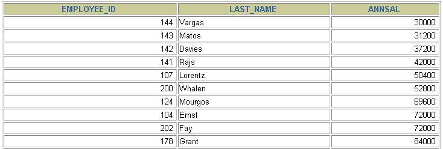](https://imag.fun-ny.cn/1554974853194.png)

[](https://imag.fun-ny.cn/1554974858252.png)

### 1.3 **多列**排序[#](#13-多列排序)

```mysql
SELECT last_name, department_id, salary
FROM   employees
ORDER BY department_id, salary DESC;  -- 先按照department_id升序排列，如果department_id相同再按照salary降序排列
```

[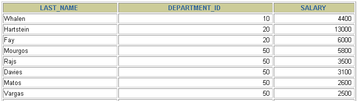](https://imag.fun-ny.cn/1554974901572.png)

[](https://imag.fun-ny.cn/1554974907498.png)

---

>  总结：
*   可以使用不在 SELECT 列表中的列排序。
*   **在对多列进行排序的时候，首先排序的第一列必须有相同的列值，才会对第二列进行排序。如果第一列数据中所有值都是唯一的，将不再对第二列进行排序。**

## 2. 分页[#](#2-分页)

---------------

### 2.1 背景[#](#21-背景)

背景 1：查询返回的记录太多了，查看起来很不方便，怎么样能够实现分页查询呢？

背景 2：表里有 4 条数据，我们只想要显示第 2、3 条数据怎么办呢？

### 2.2 实现规则[#](#22-实现规则)

* 分页原理

  所谓分页显示，就是将数据库中的结果集，一段一段显示出来需要的条件。

* **MySQL 中使用 LIMIT 实现分页**

* 格式：

  ```mysql
  LIMIT [位置偏移量,] 行数
  ```

  第一个 “位置偏移量” 参数指示 MySQL 从哪一行开始显示，是一个可选参数，如果不指定 “位置偏移量”，将会从表中的第一条记录开始（第一条记录的位置偏移量是 0，第二条记录的位置偏移量是 1，以此类推）；第二个参数“行数” 指示返回的记录条数。

* 举例

```mysql
--前10条记录：
SELECT * FROM 表名 LIMIT 0,10;
或者
SELECT * FROM 表名 LIMIT 10;

--第11至20条记录：
SELECT * FROM 表名 LIMIT 10,10;

--第21至30条记录： 
SELECT * FROM 表名 LIMIT 20,10;
```

> MySQL 8.0 中可以使用 “LIMIT 3 OFFSET 4”，意思是获取从第 5 条记录开始后面的 3 条记录，和“LIMIT 4,3;” 返回的结果相同。

*   分页显式公式**：（当前页数 - 1）* 每页条数，每页条数**

```mysql
SELECT * FROM table 
LIMIT(PageNo - 1)*PageSize,PageSize;
```

*   **注意：LIMIT 子句必须放在整个 SELECT 语句的最后！**
*   使用 LIMIT 的好处

约束返回结果的数量可以`减少数据表的网络传输量`，也可以`提升查询效率`。如果我们知道返回结果只有 1 条，就可以使用`LIMIT 1`，告诉 SELECT 语句只需要返回一条记录即可。这样的好处就是 SELECT 不需要扫描完整的表，只需要检索到一条符合条件的记录即可返回。

### 2.3 拓展[#](#23-拓展)

在不同的 DBMS 中使用的关键字可能不同。在 MySQL、PostgreSQL、MariaDB 和 SQLite 中使用 LIMIT 关键字，而且需要放到 SELECT 语句的最后面。

*   如果是 SQL Server 和 Access，需要使用 `TOP` 关键字，比如：

```sql
SELECT TOP 5 name, hp_max FROM heros ORDER BY hp_max DESC
```

*   如果是 DB2，使用`FETCH FIRST 5 ROWS ONLY`这样的关键字：

```sql
SELECT name, hp_max FROM heros ORDER BY hp_max DESC FETCH FIRST 5 ROWS ONLY
```

*   如果是 Oracle，你需要基于 `ROWNUM + 子查询`  来统计行数：

```sql
SELECT rownum,last_name,salary FROM employees WHERE rownum < 5 ORDER BY salary DESC;
```

需要说明的是，这条语句是先取出来前 5 条数据行，然后再按照 hp_max 从高到低的顺序进行排序。但这样产生的结果和上述方法的并不一样。我会在后面讲到子查询，你可以使用

```sql
SELECT rownum, last_name,salary
FROM (
    SELECT last_name,salary
    FROM employees
    ORDER BY salary DESC)
WHERE rownum < 10;
```

得到与上述方法一致的结果。

第 06 章_多表查询
===========

多表查询，也称为关联查询，指两个或更多个表一起完成查询操作。

前提条件：这些一起查询的表之间是有关系的（一对一、一对多），它们之间一定是有关联字段，这个关联字段可能建立了外键，也可能没有建立外键。比如：员工表和部门表，这两个表依靠 “部门编号” 进行关联。

## 1. 一个案例引发的多表连接[#](#1-一个案例引发的多表连接)

---------------------------------

### 1.1 案例说明[#](#11-案例说明)

[](https://imag.fun-ny.cn/1554974984600.png)

从多个表中获取数据：

[](https://imag.fun-ny.cn/1554975020388.png)

```mysql
#案例：查询员工的姓名及其部门名称
SELECT last_name, department_name
FROM employees, departments;     -- 等价于 内连接   即连接条件都不为null
```

[](https://imag.fun-ny.cn/1554975097631.png)

查询结果：

```
+-----------+----------------------+
| last_name | department_name      |
+-----------+----------------------+
| King      | Administration       |
| King      | Marketing            |
| King      | Purchasing           |
| King      | Human Resources      |
| King      | Shipping             |
| King      | IT                   |
| King      | Public Relations     |
| King      | Sales                |
| King      | Executive            |
| King      | Finance              |
| King      | Accounting           |
| King      | Treasury             |
...
| Gietz     | IT Support           |
| Gietz     | NOC                  |
| Gietz     | IT Helpdesk          |
| Gietz     | Government Sales     |
| Gietz     | Retail Sales         |
| Gietz     | Recruiting           |
| Gietz     | Payroll              |
+-----------+----------------------+
2889 rows in set (0.01 sec)
```

**分析错误情况：**

```mysql
SELECT COUNT(employee_id) FROM employees;
#输出107行

SELECT COUNT(department_id)FROM departments;
#输出27行

SELECT 107*27 FROM dual;
```

我们把上述多表查询中出现的问题称为：笛卡尔积的错误。

### 1.2 笛卡尔积（或交叉连接）的理解[#](#12-笛卡尔积或交叉连接的理解)

笛卡尔乘积是一个数学运算。假设我有两个集合 X 和 Y，那么 X 和 Y 的笛卡尔积就是 X 和 Y 的所有可能组合，也就是第一个对象来自于 X，第二个对象来自于 Y 的所有可能。组合的个数即为两个集合中元素个数的乘积数。

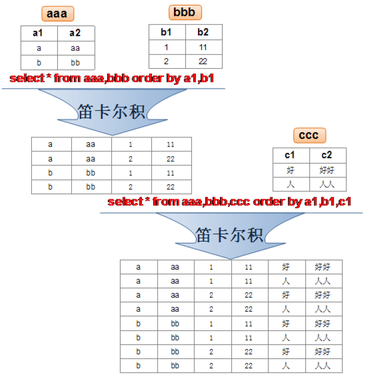


SQL92 中，笛卡尔积也称为`交叉连接`，英文是 `CROSS JOIN`。在 SQL99 中也是使用 CROSS JOIN 表示交叉连接。它的作用就是可以把任意表进行连接，即使这两张表不相关。在 MySQL 中如下情况会出现笛卡尔积：

```mysql
#查询员工姓名和所在部门名称
SELECT last_name,department_name FROM employees,departments;
SELECT last_name,department_name FROM employees CROSS JOIN departments;
SELECT last_name,department_name FROM employees INNER JOIN departments;
SELECT last_name,department_name FROM employees JOIN departments;
```

### 1.3 案例分析与问题解决[#](#13-案例分析与问题解决)

* **笛卡尔积的错误会在下面条件下产生**：

  *   省略多个表的连接条件（或关联条件）
  *   连接条件（或关联条件）无效
  *   所有表中的所有行互相连接

* 为了避免笛卡尔积， 可以**在 WHERE 加入有效的连接条件。**

* 加入连接条件后，查询语法：

  ```mysql
  SELECT	table1.column, table2.column
  FROM	table1, table2
  WHERE	table1.column1 = table2.column2;  #连接条件
  ```

  *   **在 WHERE 子句中写入连接条件。**

* 正确写法：

  ```mysql
  #案例：查询员工的姓名及其部门名称
  SELECT last_name, department_name
  FROM employees, departments
  WHERE employees.department_id = departments.department_id;
  ```

* **在表中有相同列时，在列名之前加上表名前缀。**

## 2. 多表查询分类讲解[#](#2-多表查询分类讲解)

---------------------------

### 分类 1：等值连接 vs 非等值连接[#](#分类1等值连接-vs-非等值连接)

#### 等值连接[#](#等值连接)

[](https://imag.fun-ny.cn/1554975496900.png)

```mysql
SELECT employees.employee_id, employees.last_name, 
       employees.department_id, departments.department_id,
       departments.location_id
FROM   employees, departments
WHERE  employees.department_id = departments.department_id;
```

[](https://imag.fun-ny.cn/1554975522600.png)

[](https://imag.fun-ny.cn/1554975526339.png)

**拓展 1：多个连接条件与 AND 操作符**

[](https://imag.fun-ny.cn/1554975606231.png)

**拓展 2：区分重复的列名**

*   **多个表中有相同列时，必须在列名之前加上表名前缀。**
*   在不同表中具有相同列名的列可以用`表名`加以区分。

```mysql
SELECT employees.last_name, departments.department_name,employees.department_id
FROM employees, departments
WHERE employees.department_id = departments.department_id;
```

**拓展 3：表的别名**

*   使用别名可以简化查询。

*   列名前使用表名前缀可以提高查询效率。

```mysql
SELECT e.employee_id, e.last_name, e.department_id,
       d.department_id, d.location_id
FROM   employees e , departments d
WHERE  e.department_id = d.department_id;
```

> 需要注意的是，如果我们**使用了表的别名**，在查询字段中、过滤条件中就只能使用别名进行代替，**不能使用原有的表名，否则就会报错**。

> `阿里开发规范`：
>
> 【`强制`】对于数据库中表记录的查询和变更，只要涉及多个表，都需要在列名前加表的别名（或 表名）进行限定。
>
> `说明`：对多表进行查询记录、更新记录、删除记录时，如果对操作列没有限定表的别名（或表名），并且操作列在多个表中存在时，就会抛异常。
>
> `正例`：select t1.name from table_first as t1 , table_second as t2 where t1.id=t2.id;
>
> `反例`：在某业务中，由于多表关联查询语句没有加表的别名（或表名）的限制，正常运行两年后，最近在 某个表中增加一个同名字段，在预发布环境做数据库变更后，线上查询语句出现出 1052 异常：Column 'name' in field list is ambiguous。

**拓展 4：连接多个表**

[](https://imag.fun-ny.cn/1554978354431.png)

**总结：连接 n 个表, 至少需要 n-1 个连接条件。**比如，连接三个表，至少需要两个连接条件。

练习：查询出公司员工的 last_name,department_name, city

#### 非等值连接[#](#非等值连接)

[](https://imag.fun-ny.cn/1554978442447.png)

```mysql
SELECT e.last_name, e.salary, j.grade_level
FROM   employees e, job_grades j
WHERE  e.salary BETWEEN j.lowest_sal AND j.highest_sal;  -- 连接查询工资的等级
```

[](https://imag.fun-ny.cn/1554978477013.png)

[](https://imag.fun-ny.cn/1554978482652.png)

### 分类 2：自连接 vs 非自连接[#](#分类2自连接-vs-非自连接)

[](https://imag.fun-ny.cn/1554978514321.png)

*   当 table1 和 table2 本质上是同一张表，只是用取别名的方式虚拟成两张表以代表不同的意义。然后两个表再进行内连接，外连接等查询。

**题目：查询 employees 表，返回 “Xxx works for Xxx”**

```mysql
SELECT CONCAT(worker.last_name ,' works for ' 
       , manager.last_name)
FROM   employees worker, employees manager
WHERE  worker.manager_id = manager.employee_id ;
```

[](https://imag.fun-ny.cn/1554978684947.png)

[](https://imag.fun-ny.cn/1554978690764.png)

练习：查询出 last_name 为 ‘Chen’ 的员工的 manager 的信息。

### 分类 3：内连接 vs 外连接[#](#分类3内连接-vs-外连接)

除了查询满足条件的记录以外，外连接还可以查询某一方不满足条件的记录。

[](https://imag.fun-ny.cn/1554978955659.png)

* 内连接: 合并具有同一列的两个以上的表的行, **结果集中不包含一个表与另一个表不匹配的行**

* 外连接: 两个表在连接过程中除了返回满足连接条件的行以外**还返回左（或右）表中不满足条件的行** **，这种连接称为左（或右） 外连接**。没有匹配的行时, 结果表中相应的列为空 (NULL)。

* 如果是左外连接，则连接条件中左边的表也称为`主表`，右边的表称为`从表`。

  如果是右外连接，则连接条件中右边的表也称为`主表`，左边的表称为`从表`。

#### SQL92：使用 `(+)` 创建连接[#](#sql92使用创建连接)

* 在 SQL92 中采用（+）代表从表所在的位置。即左或右外连接中，(+) 表示哪个是从表。

* Oracle 对 SQL92 支持较好，而 MySQL 则不支持 SQL92 的外连接。

  ```mysql
  #左外连接
  SELECT last_name,department_name
  FROM employees ,departments
  WHERE employees.department_id = departments.department_id(+);
  
  #右外连接
  SELECT last_name,department_name
  FROM employees ,departments
  WHERE employees.department_id(+) = departments.department_id;
  ```

* 而且在 SQL92 中，只有左外连接和右外连接，没有满（或全）外连接。

## 3. SQL99 语法实现多表查询[#](#3-sql99语法实现多表查询)

--------------------------------------

### 3.1 基本语法[#](#31-基本语法)

* 使用 JOIN...ON 子句创建连接的语法结构：

  ```mysql
  SELECT table1.column, table2.column,table3.column
  FROM table1
      JOIN table2 ON table1 和 table2 的连接条件
          JOIN table3 ON table2 和 table3 的连接条件
  ```

  它的嵌套逻辑类似我们使用的 FOR 循环：

  ```mysql
  for t1 in table1:
      for t2 in table2:
         if condition1:
             for t3 in table3:
                if condition2:
                    output t1 + t2 + t3
  ```

  SQL99 采用的这种嵌套结构非常清爽、层次性更强、可读性更强，即使再多的表进行连接也都清晰可见。如果你采用 SQL92，可读性就会大打折扣。

* 语法说明：

  *   **可以使用** **ON** **子句指定额外的连接条件**。
  *   这个连接条件是与其它条件分开的。
  *   **ON** **子句使语句具有更高的易读性**。
  *   关键字 `JOIN`、`INNER JOIN`、`CROSS JOIN` 的含义是一样的，都表示内连接

### 3.2 内连接 (`INNER JOIN`) 的实现[#](#32-内连接inner-join的实现)

*   语法：

```mysql
SELECT 字段列表
FROM A表 INNER JOIN B表
ON 关联条件
WHERE 等其他子句;
```

题目 1：

```mysql
SELECT e.employee_id, e.last_name, e.department_id, 
       d.department_id, d.location_id
FROM   employees e JOIN departments d
ON     (e.department_id = d.department_id);
```

[](https://imag.fun-ny.cn/1554979073996.png)

[](https://imag.fun-ny.cn/1554979079395.png)

题目 2：

```mysql
SELECT employee_id, city, department_name
FROM   employees e 
JOIN   departments d ON     d.department_id = e.department_id 
JOIN   locations l ON     d.location_id = l.location_id;
```

[](https://imag.fun-ny.cn/1554979110008.png)

[](https://imag.fun-ny.cn/1554979115642.png)

### 3.3 外连接 (`OUTER JOIN`) 的实现[#](#33-外连接outer-join的实现)

#### 3.3.1 左外连接 (`LEFT OUTER JOIN`)[#](#331-左外连接left-outer-join)

*   语法：

```mysql
#实现查询结果是A
SELECT 字段列表
FROM A表 LEFT JOIN B表
ON 关联条件
WHERE 等其他子句;
```

*   举例：

```mysql
SELECT e.last_name, e.department_id, d.department_name
FROM   employees e
LEFT OUTER JOIN departments d
ON   (e.department_id = d.department_id) ;
```

[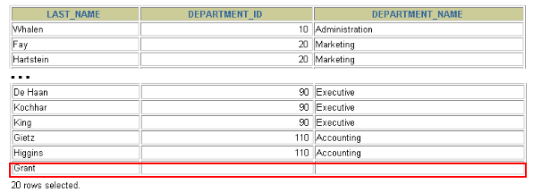](https://imag.fun-ny.cn/1554979200961.png)

#### 3.3.2 右外连接 (`RIGHT OUTER JOIN`)[#](#332-右外连接right-outer-join)

*   语法：

```mysql
#实现查询结果是B
SELECT 字段列表
FROM A表 RIGHT JOIN B表
ON 关联条件
WHERE 等其他子句;
```

*   举例：

```mysql
SELECT e.last_name, e.department_id, d.department_name
FROM   employees e
RIGHT OUTER JOIN departments d
ON    (e.department_id = d.department_id) ;
```

[](https://imag.fun-ny.cn/1554979243194.png)

> 需要注意的是，LEFT JOIN 和 RIGHT JOIN 只存在于 SQL99 及以后的标准中，在 SQL92 中不存在，只能用 (+) 表示。

#### 3.3.3 满外连接 (`FULL OUTER JOIN`)[#](#333-满外连接full-outer-join)

*   **满外连接的结果 = 左右表匹配的数据 + 左表没有匹配到的数据 + 右表没有匹配到的数据。**
*   SQL99 是支持满外连接的。使用 `FULL JOIN` 或 `FULL OUTER JOIN` 来实现。
*   需要注意的是，MySQL 不支持 FULL JOIN，但是可以用 `LEFT JOIN UNION RIGHT join` 代替。【Oracle支持FULL JOIN】

## 4. `UNION` 的使用[#](#4-union的使用)

----------------------------

**合并查询结果**  
利用 UNION 关键字，可以给出多条 SELECT 语句，并将它们的结果组合成单个结果集。合并时，两个表对应的列数和数据类型必须相同，并且相互对应。各个 SELECT 语句之间使用 UNION 或 UNION ALL 关键字分隔。

语法格式：

```mysql
SELECT column,... FROM table1
UNION [ALL]
SELECT column,... FROM table2
```

**UNION 操作符**

[](https://imag.fun-ny.cn/1554979317187.png)

UNION 操作符返回两个查询的结果集的并集，**去除重复记录。**

**UNION ALL 操作符**

[](https://imag.fun-ny.cn/1554979343634.png)

UNION ALL 操作符返回两个查询的结果集的并集。对于两个结果集的重复部分，**不去重**。

> 注意：执行 UNION ALL 语句时所需要的资源比 UNION 语句少。如果明确知道合并数据后的结果数据不存在重复数据，或者不需要去除重复的数据，则尽量使用 UNION ALL 语句，以提高数据查询的效率。

举例：查询部门编号 > 90 或邮箱包含 a 的员工信息

```mysql
#方式1
SELECT * FROM employees WHERE email LIKE '%a%' OR department_id>90;
```

```mysql
#方式2
SELECT * FROM employees  WHERE email LIKE '%a%'
UNION
SELECT * FROM employees  WHERE department_id>90;
```

举例：查询中国用户中男性的信息以及美国用户中年男性的用户信息

```mysql
SELECT id,cname FROM t_chinamale WHERE csex='男'
UNION ALL
SELECT id,tname FROM t_usmale WHERE tGender='male';
```

## 5. 7 种 SQL JOINS 的实现[#](#5-7种sql-joins的实现)

------------------------------------------

[](https://imag.fun-ny.cn/1554979255233.png)

### 5.7.1 代码实现[#](#571-代码实现)

```mysql
#中图：内连接 A∩B  交集
SELECT employee_id,last_name,department_name
FROM employees e JOIN departments d
ON e.`department_id` = d.`department_id`;
```

```mysql
#左上图：左外连接
SELECT employee_id,last_name,department_name
FROM employees e LEFT JOIN departments d
ON e.`department_id` = d.`department_id`;
```

```mysql
#右上图：右外连接
SELECT employee_id,last_name,department_name
FROM employees e RIGHT JOIN departments d
ON e.`department_id` = d.`department_id`;
```

```mysql
#左中图：A - A∩B
SELECT employee_id,last_name,department_name
FROM employees e LEFT JOIN departments d
ON e.`department_id` = d.`department_id`
WHERE d.`department_id` IS NULL
```

```mysql
#右中图：B-A∩B
SELECT employee_id,last_name,department_name
FROM employees e RIGHT JOIN departments d
ON e.`department_id` = d.`department_id`
WHERE e.`department_id` IS NULL
```

```mysql
#左下图：满外连接
# 左中图 + 右上图  A∪B
SELECT employee_id,last_name,department_name
FROM employees e LEFT JOIN departments d
ON e.`department_id` = d.`department_id`
WHERE d.`department_id` IS NULL
UNION ALL  #没有去重操作，效率高
SELECT employee_id,last_name,department_name
FROM employees e RIGHT JOIN departments d
ON e.`department_id` = d.`department_id`;
```

```mysql
#右下图
#左中图 + 右中图  A ∪B- A∩B 或者 (A -  A∩B) ∪ （B - A∩B）
SELECT employee_id,last_name,department_name
FROM employees e LEFT JOIN departments d
ON e.`department_id` = d.`department_id`
WHERE d.`department_id` IS NULL
UNION ALL
SELECT employee_id,last_name,department_name
FROM employees e RIGHT JOIN departments d
ON e.`department_id` = d.`department_id`
WHERE e.`department_id` IS NULL
```

### 5.7.2 语法格式小结[#](#572-语法格式小结)

*   左中图

```mysql
#实现A -  A∩B
select 字段列表
from A表 left join B表
on 关联条件
where 从表关联字段 is null and 等其他子句;
```

*   右中图

```mysql
#实现B -  A∩B
select 字段列表
from A表 right join B表
on 关联条件
where 从表关联字段 is null and 等其他子句;
```

*   左下图

```mysql
#实现查询结果是A∪B
#用左外的A，union 右外的B
select 字段列表
from A表 left join B表
on 关联条件
where 等其他子句

union 

select 字段列表
from A表 right join B表
on 关联条件
where 等其他子句;
```

*   右下图

```mysql
#实现A∪B -  A∩B  或   (A -  A∩B) ∪ （B - A∩B）
#使用左外的 (A -  A∩B)  union 右外的（B - A∩B）
select 字段列表
from A表 left join B表
on 关联条件
where 从表关联字段 is null and 等其他子句

union

select 字段列表
from A表 right join B表
on 关联条件
where 从表关联字段 is null and 等其他子句
```

## 6. SQL99 语法新特性[#](#6-sql99语法新特性)

--------------------------------

### 6.1 自然连接[#](#61-自然连接)

SQL99 在 SQL92 的基础上提供了一些特殊语法，比如 `NATURAL JOIN` 用来表示自然连接。我们可以把自然连接理解为 SQL92 中的等值连接。它会帮你自动查询两张连接表中`所有相同的字段`，然后进行`等值连接`。

在 SQL92 标准中：

```mysql
SELECT employee_id,last_name,department_name
FROM employees e JOIN departments d
ON e.`department_id` = d.`department_id`
AND e.`manager_id` = d.`manager_id`;
```

在 SQL99 中你可以写成：

```mysql
SELECT employee_id,last_name,department_name
FROM employees e NATURAL JOIN departments d;
```

### 6.2 USING 连接[#](#62-using连接)

当我们进行连接的时候，SQL99 还支持使用 USING 指定数据表里的`同名字段`进行等值连接。但是只能配合 JOIN 一起使用。比如：

```mysql
SELECT employee_id,last_name,department_name
FROM employees e JOIN departments d
USING (department_id);
```

你能看出与自然连接 NATURAL JOIN 不同的是，USING 指定了具体的相同的字段名称，你需要在 USING 的括号 () 中填入要指定的同名字段。同时使用 `JOIN...USING` 可以简化 JOIN ON 的等值连接。它与下面的 SQL 查询结果是相同的：

```mysql
SELECT employee_id,last_name,department_name
FROM employees e ,departments d
WHERE e.department_id = d.department_id;
```

## 7. 章节小结[#](#7-章节小结)

-------------------

表连接的约束条件可以有三种方式：`WHERE`, `ON`, `USING`

*   `WHERE`：适用于所有关联查询

*   `ON`：只能和 JOIN 一起使用，只能写关联条件。虽然关联条件可以并到 WHERE 中和其他条件一起写，但分开写可读性更好。

*   `USING`：只能和 JOIN 一起使用，而且要求**两个**关联字段在关联表中名称一致，而且只能表示关联字段值相等

```mysql
#关联条件
#把关联条件写在where后面
SELECT last_name,department_name 
FROM employees,departments 
WHERE employees.department_id = departments.department_id;

#把关联条件写在on后面，只能和JOIN一起使用
SELECT last_name,department_name 
FROM employees INNER JOIN departments 
ON employees.department_id = departments.department_id;

SELECT last_name,department_name 
FROM employees CROSS JOIN departments 
ON employees.department_id = departments.department_id;

SELECT last_name,department_name  
FROM employees JOIN departments 
ON employees.department_id = departments.department_id;

#把关联字段写在using()中，只能和JOIN一起使用
#而且两个表中的关联字段必须名称相同，而且只能表示=
#查询员工姓名与基本工资
SELECT last_name,job_title
FROM employees INNER JOIN jobs USING(job_id);

#n张表关联，需要n-1个关联条件
#查询员工姓名，基本工资，部门名称
SELECT last_name,job_title,department_name FROM employees,departments,jobs 
WHERE employees.department_id = departments.department_id 
AND employees.job_id = jobs.job_id;

SELECT last_name,job_title,department_name 
FROM employees INNER JOIN departments INNER JOIN jobs 
ON employees.department_id = departments.department_id 
AND employees.job_id = jobs.job_id;
```

**注意：**

我们要`控制连接表的数量`。多表连接就相当于嵌套 for 循环一样，非常消耗资源，会让 SQL 查询性能下降得很严重，因此不要连接不必要的表。在许多 DBMS 中，也都会有最大连接表的限制。

> 【强制】超过三个表禁止 join。需要 join 的字段，数据类型保持绝对一致；多表关联查询时， 保证被关联的字段需要有索引。
>
> 说明：即使双表 join 也要注意表索引、SQL 性能。
>
> 来源：阿里巴巴《Java 开发手册》

附录：常用的 SQL 标准有哪些[#](#附录常用的-sql-标准有哪些)
-------------------------------------

在正式开始讲连接表的种类时，我们首先需要知道 SQL 存在不同版本的标准规范，因为不同规范下的表连接操作是有区别的。

SQL 有两个主要的标准，分别是 `SQL92` 和 `SQL99`。92 和 99 代表了标准提出的时间，SQL92 就是 92 年提出的标准规范。当然除了 SQL92 和 SQL99 以外，还存在 SQL-86、SQL-89、SQL:2003、SQL:2008、SQL:2011 和 SQL:2016 等其他的标准。

这么多标准，到底该学习哪个呢？**实际上最重要的 SQL 标准就是 SQL92 和 SQL99**。一般来说 SQL92 的形式更简单，但是写的 SQL 语句会比较长，可读性较差。而 SQL99 相比于 SQL92 来说，语法更加复杂，但可读性更强。我们从这两个标准发布的页数也能看出，SQL92 的标准有 500 页，而 SQL99 标准超过了 1000 页。实际上从 SQL99 之后，很少有人能掌握所有内容，因为确实太多了。就好比我们使用 Windows、Linux 和 Office 的时候，很少有人能掌握全部内容一样。我们只需要掌握一些核心的功能，满足日常工作的需求即可。

**SQL92 和 SQL99 是经典的 SQL 标准，也分别叫做 SQL-2 和 SQL-3 标准。**也正是在这两个标准发布之后，SQL 影响力越来越大，甚至超越了数据库领域。现如今 SQL 已经不仅仅是数据库领域的主流语言，还是信息领域中信息处理的主流语言。在图形检索、图像检索以及语音检索中都能看到 SQL 语言的使用。

第 07 章_单行函数
===========

## 1. 函数的理解[#](#1-函数的理解)

---------------------

### 1.1 什么是函数[#](#11-什么是函数)

函数在计算机语言的使用中贯穿始终，函数的作用是什么呢？它可以把我们经常使用的代码封装起来，需要的时候直接调用即可。这样既`提高了代码效率`，又`提高了可维护性`。在 SQL 中我们也可以使用函数对检索出来的数据进行函数操作。使用这些函数，可以极大地`提高用户对数据库的管理效率`。

[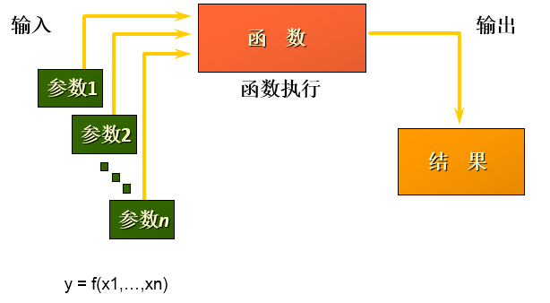](https://imag.fun-ny.cn/1554979529525.png)

从函数定义的角度出发，我们可以将函数分成`内置函数`和`自定义函数`。在 SQL 语言中，同样也包括了内置函数和自定义函数。内置函数是系统内置的通用函数，而自定义函数是我们根据自己的需要编写的，本章及下一章讲解的是 SQL 的内置函数。

### 1.2 不同 DBMS 函数的差异[#](#12-不同dbms函数的差异)

我们在使用 SQL 语言的时候，不是直接和这门语言打交道，而是通过它使用不同的数据库软件，即 DBMS。**DBMS 之间的差异性很大，远大于同一个语言不同版本之间的差异。**实际上，只有很少的函数是被 DBMS 同时支持的。比如，大多数 DBMS 使用（||）或者（+）来做拼接符，而在 MySQL 中的字符串拼接函数为 concat()。大部分 DBMS 会有自己特定的函数，这就意味着**采用 SQL 函数的代码可移植性是很差的**，因此在使用函数的时候需要特别注意。

### 1.3 MySQL 的内置函数及分类[#](#13-mysql的内置函数及分类)

MySQL 提供了丰富的内置函数，这些函数使得数据的维护与管理更加方便，能够更好地提供数据的分析与统计功能，在一定程度上提高了开发人员进行数据分析与统计的效率。

MySQL 提供的内置函数从`实现的功能角度`可以分为数值函数、字符串函数、日期和时间函数、流程控制函数、加密与解密函数、获取 MySQL 信息函数、聚合函数等。这里，我将这些丰富的内置函数再分为两类：`单行函数`、`聚合函数（或分组函数）`。

**两种 SQL 函数**

[](https://imag.fun-ny.cn/1555433204337.png)

**单行函数**

*   操作数据对象
*   接受参数返回一个结果
*   **只对一行进行变换**
*   **每行返回一个结果**
*   可以嵌套
*   参数可以是一列或一个值

## 2. 数值函数[#](#2-数值函数)

-------------------

### 2.1 基本函数[#](#21-基本函数)

<table><thead><tr><th>函数</th><th>用法</th></tr></thead><tbody><tr><td>ABS(x)</td><td>返回 x 的绝对值</td></tr><tr><td>SIGN(X)</td><td>返回 X 的符号。正数返回 1，负数返回 - 1，0 返回 0</td></tr><tr><td>PI()</td><td>返回圆周率的值</td></tr><tr><td>CEIL(x)，CEILING(x)</td><td>返回大于或等于某个值的最小整数</td></tr><tr><td>FLOOR(x)</td><td>返回小于或等于某个值的最大整数</td></tr><tr><td>LEAST(e1,e2,e3…)</td><td>返回列表中的最小值</td></tr><tr><td>GREATEST(e1,e2,e3…)</td><td>返回列表中的最大值</td></tr><tr><td>MOD(x,y)</td><td>返回 X 除以 Y 后的余数</td></tr><tr><td>RAND()</td><td>返回 0~1 的随机值</td></tr><tr><td>RAND(x)</td><td>返回 0~1 的随机值，其中 x 的值用作种子值，相同的 X 值会产生相同的随机数</td></tr><tr><td>ROUND(x)</td><td>返回一个对 x 的值进行四舍五入后，最接近于 X 的整数</td></tr><tr><td>ROUND(x,y)</td><td>返回一个对 x 的值进行四舍五入后最接近 X 的值，并保留到小数点后面 Y 位</td></tr><tr><td>TRUNCATE(x,y)</td><td>返回数字 x 截断为 y 位小数的结果</td></tr><tr><td>SQRT(x)</td><td>返回 x 的平方根。当 X 的值为负数时，返回 NULL</td></tr></tbody></table>

举例：

```mysql
SELECT ABS(-123),ABS(32),SIGN(-23),SIGN(43),PI(),CEIL(32.32),CEILING(-43.23),FLOOR(32.32),
FLOOR(-43.23),MOD(12,5)
FROM DUAL;
```

[](https://imag.fun-ny.cn/image-20211025162304844.png)

```mysql
SELECT RAND(),RAND(),RAND(10),RAND(10),RAND(-1),RAND(-1)
FROM DUAL;
```

[](https://imag.fun-ny.cn/image-20211025162538958.png)

```mysql
SELECT ROUND(12.33),ROUND(12.343,2),ROUND(12.324,-1),TRUNCATE(12.66,1),TRUNCATE(12.66,-1)
FROM DUAL;
```

[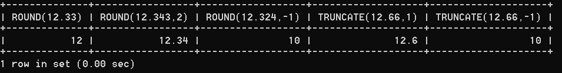](https://imag.fun-ny.cn/image-20211025162730421.png)

### 2.2 角度与弧度互换函数[#](#22-角度与弧度互换函数)

<table><thead><tr><th>函数</th><th>用法</th></tr></thead><tbody><tr><td>RADIANS(x)</td><td>将角度转化为弧度，其中，参数 x 为角度值</td></tr><tr><td>DEGREES(x)</td><td>将弧度转化为角度，其中，参数 x 为弧度值</td></tr></tbody></table>

```mysql
SELECT RADIANS(30),RADIANS(60),RADIANS(90),DEGREES(2*PI()),DEGREES(RADIANS(90))
FROM DUAL;
```

### 2.3 三角函数[#](#23-三角函数)

<table><thead><tr><th>函数</th><th>用法</th></tr></thead><tbody><tr><td>SIN(x)</td><td>返回 x 的正弦值，其中，参数 x 为弧度值</td></tr><tr><td>ASIN(x)</td><td>返回 x 的反正弦值，即获取正弦为 x 的值。如果 x 的值不在 - 1 到 1 之间，则返回 NULL</td></tr><tr><td>COS(x)</td><td>返回 x 的余弦值，其中，参数 x 为弧度值</td></tr><tr><td>ACOS(x)</td><td>返回 x 的反余弦值，即获取余弦为 x 的值。如果 x 的值不在 - 1 到 1 之间，则返回 NULL</td></tr><tr><td>TAN(x)</td><td>返回 x 的正切值，其中，参数 x 为弧度值</td></tr><tr><td>ATAN(x)</td><td>返回 x 的反正切值，即返回正切值为 x 的值</td></tr><tr><td>ATAN2(m,n)</td><td>返回两个参数的反正切值</td></tr><tr><td>COT(x)</td><td>返回 x 的余切值，其中，X 为弧度值</td></tr></tbody></table>

举例：

ATAN2(M,N) 函数返回两个参数的反正切值。  
与 ATAN(X) 函数相比，ATAN2(M,N) 需要两个参数，例如有两个点 point(x1,y1) 和 point(x2,y2)，使用 ATAN(X) 函数计算反正切值为 ATAN((y2-y1)/(x2-x1))，使用 ATAN2(M,N) 计算反正切值则为 ATAN2(y2-y1,x2-x1)。由使用方式可以看出，当 x2-x1 等于 0 时，ATAN(X) 函数会报错，而 ATAN2(M,N) 函数则仍然可以计算。

ATAN2(M,N) 函数的使用示例如下：

```mysql
SELECT SIN(RADIANS(30)),DEGREES(ASIN(1)),TAN(RADIANS(45)),DEGREES(ATAN(1)),DEGREES(ATAN2(1,1))
FROM DUAL;
```

[](https://imag.fun-ny.cn/image-20211025163846974.png)

### 2.4 指数与对数[#](#24-指数与对数)

<table><thead><tr><th>函数</th><th>用法</th></tr></thead><tbody><tr><td>POW(x,y)，POWER(X,Y)</td><td>返回 x 的 y 次方</td></tr><tr><td>EXP(X)</td><td>返回 e 的 X 次方，其中 e 是一个常数，2.718281828459045</td></tr><tr><td>LN(X)，LOG(X)</td><td>返回以 e 为底的 X 的对数，当 X &lt;= 0 时，返回的结果为 NULL</td></tr><tr><td>LOG10(X)</td><td>返回以 10 为底的 X 的对数，当 X &lt;= 0 时，返回的结果为 NULL</td></tr><tr><td>LOG2(X)</td><td>返回以 2 为底的 X 的对数，当 X &lt;= 0 时，返回 NULL</td></tr></tbody></table>

```mysql
mysql> SELECT POW(2,5),POWER(2,4),EXP(2),LN(10),LOG10(10),LOG2(4)
    -> FROM DUAL;
+----------+------------+------------------+-------------------+-----------+---------+
| POW(2,5) | POWER(2,4) | EXP(2)           | LN(10)            | LOG10(10) | LOG2(4) |
+----------+------------+------------------+-------------------+-----------+---------+
|       32 |         16 | 7.38905609893065 | 2.302585092994046 |         1 |       2 |
+----------+------------+------------------+-------------------+-----------+---------+
1 row in set (0.00 sec)
```

### 2.5 进制间的转换[#](#25-进制间的转换)

<table><thead><tr><th>函数</th><th>用法</th></tr></thead><tbody><tr><td>BIN(x)</td><td>返回 x 的二进制编码</td></tr><tr><td>HEX(x)</td><td>返回 x 的十六进制编码</td></tr><tr><td>OCT(x)</td><td>返回 x 的八进制编码</td></tr><tr><td>CONV(x,f1,f2)</td><td>返回 f1 进制数变成 f2 进制数</td></tr></tbody></table>

```mysql
mysql> SELECT BIN(10),HEX(10),OCT(10),CONV(10,2,8)
    -> FROM DUAL;
+---------+---------+---------+--------------+
| BIN(10) | HEX(10) | OCT(10) | CONV(10,2,8) |
+---------+---------+---------+--------------+
| 1010    | A       | 12      | 2            |
+---------+---------+---------+--------------+
1 row in set (0.00 sec)
```

## 3. 字符串函数[#](#3-字符串函数)

---------------------

<table><thead><tr><th>函数</th><th>用法</th></tr></thead><tbody><tr><td>ASCII(S)</td><td>返回字符串 S 中的第一个字符的 ASCII 码值</td></tr><tr><td>CHAR_LENGTH(s)</td><td>返回字符串 s 的字符数。作用与 CHARACTER_LENGTH(s) 相同</td></tr><tr><td>LENGTH(s)</td><td>返回字符串 s 的字节数，和字符集有关</td></tr><tr><td>CONCAT(s1,s2,......,sn)</td><td>连接 s1,s2,......,sn 为一个字符串</td></tr><tr><td>CONCAT_WS(x, s1,s2,......,sn)</td><td>同 CONCAT(s1,s2,...) 函数，但是每个字符串之间要加上 x</td></tr><tr><td>INSERT(str, idx, len, replacestr)</td><td>将字符串 str 从第 idx 位置开始，len 个字符长的子串替换为字符串 replacestr</td></tr><tr><td>REPLACE(str, a, b)</td><td>用字符串 b 替换字符串 str 中所有出现的字符串 a</td></tr><tr><td>UPPER(s) 或 UCASE(s)</td><td>将字符串 s 的所有字母转成大写字母</td></tr><tr><td>LOWER(s) 或 LCASE(s)</td><td>将字符串 s 的所有字母转成小写字母</td></tr><tr><td>LEFT(str,n)</td><td>返回字符串 str 最左边的 n 个字符</td></tr><tr><td>RIGHT(str,n)</td><td>返回字符串 str 最右边的 n 个字符</td></tr><tr><td>LPAD(str, len, pad)</td><td>用字符串 pad 对 str 最左边进行填充，直到 str 的长度为 len 个字符</td></tr><tr><td>RPAD(str ,len, pad)</td><td>用字符串 pad 对 str 最右边进行填充，直到 str 的长度为 len 个字符</td></tr><tr><td>LTRIM(s)</td><td>去掉字符串 s 左侧的空格</td></tr><tr><td>RTRIM(s)</td><td>去掉字符串 s 右侧的空格</td></tr><tr><td>TRIM(s)</td><td>去掉字符串 s 开始与结尾的空格</td></tr><tr><td>TRIM(s1 FROM s)</td><td>去掉字符串 s 开始与结尾的 s1</td></tr><tr><td>TRIM(LEADING s1 FROM s)</td><td>去掉字符串 s 开始处的 s1</td></tr><tr><td>TRIM(TRAILING s1 FROM s)</td><td>去掉字符串 s 结尾处的 s1</td></tr><tr><td>REPEAT(str, n)</td><td>返回 str 重复 n 次的结果</td></tr><tr><td>SPACE(n)</td><td>返回 n 个空格</td></tr><tr><td>STRCMP(s1,s2)</td><td>比较字符串 s1,s2 的 ASCII 码值的大小</td></tr><tr><td>SUBSTR(s,index,len)</td><td>返回从字符串 s 的 index 位置其 len 个字符，作用与 SUBSTRING(s,n,len)、MID(s,n,len) 相同</td></tr><tr><td>LOCATE(substr,str)</td><td>返回字符串 substr 在字符串 str 中首次出现的位置，作用于 POSITION(substr IN str)、INSTR(str,substr) 相同。未找到，返回 0</td></tr><tr><td>ELT(m,s1,s2,…,sn)</td><td>返回指定位置的字符串，如果 m=1，则返回 s1，如果 m=2，则返回 s2，如果 m=n，则返回 sn</td></tr><tr><td>FIELD(s,s1,s2,…,sn)</td><td>返回字符串 s 在字符串列表中第一次出现的位置</td></tr><tr><td>FIND_IN_SET(s1,s2)</td><td>返回字符串 s1 在字符串 s2 中出现的位置。其中，字符串 s2 是一个以逗号分隔的字符串</td></tr><tr><td>REVERSE(s)</td><td>返回 s 反转后的字符串</td></tr><tr><td>NULLIF(value1,value2)</td><td>比较两个字符串，如果 value1 与 value2 相等，则返回 NULL，否则返回 value1</td></tr></tbody></table>

> 注意：MySQL 中，字符串的位置是从 1 开始的。

举例：

```mysql
mysql> SELECT FIELD('mm','hello','msm','amma'),FIND_IN_SET('mm','hello,mm,amma')
    -> FROM DUAL;
+----------------------------------+-----------------------------------+
| FIELD('mm','hello','msm','amma') | FIND_IN_SET('mm','hello,mm,amma') |
+----------------------------------+-----------------------------------+
|                                0 |                                 2 |
+----------------------------------+-----------------------------------+
1 row in set (0.00 sec)
```

```mysql
mysql> SELECT NULLIF('mysql','mysql'),NULLIF('mysql', '');
+-------------------------+---------------------+
| NULLIF('mysql','mysql') | NULLIF('mysql', '') |
+-------------------------+---------------------+
| NULL                    | mysql               |
+-------------------------+---------------------+
1 row in set (0.00 sec)
```

## 4. 日期和时间函数[#](#4-日期和时间函数)

-------------------------

### 4.1 获取日期、时间[#](#41-获取日期时间)

<table><thead><tr><th>函数</th><th>用法</th></tr></thead><tbody><tr><td><strong>CURDATE()</strong> ，CURRENT_DATE()</td><td>返回当前日期，只包含年、月、日</td></tr><tr><td><strong>CURTIME()</strong> ， CURRENT_TIME()</td><td>返回当前时间，只包含时、分、秒</td></tr><tr><td><strong>NOW()</strong> / SYSDATE() / CURRENT_TIMESTAMP() / LOCALTIME() / LOCALTIMESTAMP()</td><td>返回当前系统日期和时间</td></tr><tr><td>UTC_DATE()</td><td>返回 UTC（世界标准时间）日期</td></tr><tr><td>UTC_TIME()</td><td>返回 UTC（世界标准时间）时间</td></tr></tbody></table>

举例：

```mysql
SELECT CURDATE(),CURTIME(),NOW(),SYSDATE()+0,UTC_DATE(),UTC_DATE()+0,UTC_TIME(),UTC_TIME()+0
FROM DUAL;
```

[](https://imag.fun-ny.cn/image-20211025193742633.png)

### 4.2 日期与时间戳的转换[#](#42-日期与时间戳的转换)

<table><thead><tr><th>函数</th><th>用法</th></tr></thead><tbody><tr><td>UNIX_TIMESTAMP()</td><td>以 UNIX 时间戳的形式返回当前时间。SELECT UNIX_TIMESTAMP() -&gt;1634348884</td></tr><tr><td>UNIX_TIMESTAMP(date)</td><td>将时间 date 以 UNIX 时间戳的形式返回。</td></tr><tr><td>FROM_UNIXTIME(timestamp)</td><td>将 UNIX 时间戳的时间转换为普通格式的时间</td></tr></tbody></table>

举例：

```mysql
mysql> SELECT UNIX_TIMESTAMP(now());
+-----------------------+
| UNIX_TIMESTAMP(now()) |
+-----------------------+
|            1576380910 |
+-----------------------+
1 row in set (0.01 sec)

mysql> SELECT UNIX_TIMESTAMP(CURDATE());
+---------------------------+
| UNIX_TIMESTAMP(CURDATE()) |
+---------------------------+
|                1576339200 |
+---------------------------+
1 row in set (0.00 sec)

mysql> SELECT UNIX_TIMESTAMP(CURTIME());
+---------------------------+
| UNIX_TIMESTAMP(CURTIME()) |
+---------------------------+
|                1576380969 |
+---------------------------+
1 row in set (0.00 sec)

mysql> SELECT UNIX_TIMESTAMP('2011-11-11 11:11:11')
+---------------------------------------+
| UNIX_TIMESTAMP('2011-11-11 11:11:11') |
+---------------------------------------+
|                            1320981071 |
+---------------------------------------+
1 row in set (0.00 sec)
```

```mysql
mysql> SELECT FROM_UNIXTIME(1576380910);
+---------------------------+
| FROM_UNIXTIME(1576380910) |
+---------------------------+
| 2019-12-15 11:35:10       |
+---------------------------+
1 row in set (0.00 sec)
```

### 4.3 获取月份、星期、星期数、天数等函数[#](#43-获取月份星期星期数天数等函数)

<table><thead><tr><th>函数</th><th>用法</th></tr></thead><tbody><tr><td>YEAR(date) / MONTH(date) / DAY(date)</td><td>返回具体的日期值</td></tr><tr><td>HOUR(time) / MINUTE(time) / SECOND(time)</td><td>返回具体的时间值</td></tr><tr><td>MONTHNAME(date)</td><td>返回月份：January，...</td></tr><tr><td>DAYNAME(date)</td><td>返回星期几：MONDAY，TUESDAY.....SUNDAY</td></tr><tr><td>WEEKDAY(date)</td><td>返回周几，注意，周 1 是 0，周 2 是 1，。。。周日是 6</td></tr><tr><td>QUARTER(date)</td><td>返回日期对应的季度，范围为 1～4</td></tr><tr><td>WEEK(date) ， WEEKOFYEAR(date)</td><td>返回一年中的第几周</td></tr><tr><td>DAYOFYEAR(date)</td><td>返回日期是一年中的第几天</td></tr><tr><td>DAYOFMONTH(date)</td><td>返回日期位于所在月份的第几天</td></tr><tr><td>DAYOFWEEK(date)</td><td>返回周几，注意：周日是 1，周一是 2，。。。周六是 7</td></tr></tbody></table>

举例：

```mysql
SELECT YEAR(CURDATE()),MONTH(CURDATE()),DAY(CURDATE()),
HOUR(CURTIME()),MINUTE(NOW()),SECOND(SYSDATE())
FROM DUAL;
```

[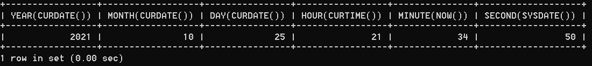](https://imag.fun-ny.cn/image-20211025213504115.png)

```mysql
SELECT MONTHNAME('2021-10-26'),DAYNAME('2021-10-26'),WEEKDAY('2021-10-26'),
QUARTER(CURDATE()),WEEK(CURDATE()),DAYOFYEAR(NOW()),
DAYOFMONTH(NOW()),DAYOFWEEK(NOW())
FROM DUAL;
```

[](https://imag.fun-ny.cn/image-20211025214818623.png)

### 4.4 日期的操作函数[#](#44-日期的操作函数)

<table><thead><tr><th>函数</th><th>用法</th></tr></thead><tbody><tr><td>EXTRACT(type FROM date)</td><td>返回指定日期中特定的部分，type 指定返回的值</td></tr></tbody></table>

EXTRACT(type FROM date) 函数中 type 的取值与含义：

[](https://imag.fun-ny.cn/image-20211012142639469.png)

[](https://imag.fun-ny.cn/image-20211012142746444.png)

```mysql
-- 2021-12-27 01:08:18 
 SELECT EXTRACT(MINUTE FROM NOW()),EXTRACT( WEEK FROM NOW()),
 EXTRACT( QUARTER FROM NOW()),EXTRACT( MINUTE_SECOND FROM NOW())
 FROM DUAL;
+----------------------------+---------------------------+------------------------------+------------------------------------+
| EXTRACT(MINUTE FROM NOW()) | EXTRACT( WEEK FROM NOW()) | EXTRACT( QUARTER FROM NOW()) | EXTRACT( MINUTE_SECOND FROM NOW()) |
+----------------------------+---------------------------+------------------------------+------------------------------------+
|                          8 |                        52 |                            4 |
 828 |
+----------------------------+---------------------------+------------------------------+------------------------------------+
1 row in set (0.00 sec)
```

### 4.5 时间和秒钟转换的函数[#](#45-时间和秒钟转换的函数)

<table><thead><tr><th>函数</th><th>用法</th></tr></thead><tbody><tr><td>TIME_TO_SEC(time)</td><td>将 time 转化为秒并返回结果值。转化的公式为：<code>小时*3600+分钟*60+秒</code></td></tr><tr><td>SEC_TO_TIME(seconds)</td><td>将 seconds 描述转化为包含小时、分钟和秒的时间</td></tr></tbody></table>

举例：

```mysql
mysql> SELECT TIME_TO_SEC(NOW());
+--------------------+
| TIME_TO_SEC(NOW()) |
+--------------------+
|               78774 |
+--------------------+
1 row in set (0.00 sec)
```

```mysql
mysql> SELECT SEC_TO_TIME(78774);
+--------------------+
| SEC_TO_TIME(78774) |
+--------------------+
| 21:52:54            |
+--------------------+
1 row in set (0.12 sec)
```

### 4.6 计算日期和时间的函数[#](#46-计算日期和时间的函数)

**第 1 组：**

<table><thead><tr><th>函数</th><th>用法</th></tr></thead><tbody><tr><td>DATE_ADD(datetime, INTERVAL expr type)，ADDDATE(date,INTERVAL expr type)</td><td>返回与给定日期时间相差 INTERVAL 时间段的日期时间</td></tr><tr><td>DATE_SUB(date,INTERVAL expr type)，SUBDATE(date,INTERVAL expr type)</td><td>返回与 date 相差 INTERVAL 时间间隔的日期</td></tr></tbody></table>

上述函数中 type 的取值：

[](https://imag.fun-ny.cn/image-20211012143203355.png)

```
MICROSECOND、SECOND、MINUTE、HOUR、DAY、WEEK、MONTH、QUARTER、YEAR、SECOND_MICROSECOND、MINUTE_MICROSECOND、MINUTE_SECOND、HOUR_MICROSECOND、HOUR_SECOND、HOUR_MINUTE、DAY_MICROSECOND、DAY_SECOND、DAY_MINUTE、DAY_HOUR、YEAR_MONTH               
```

举例：

```mysql
SELECT DATE_ADD(NOW(), INTERVAL 1 DAY) AS col1,DATE_ADD('2021-10-21 23:32:12',INTERVAL 1 SECOND) AS col2,
ADDDATE('2021-10-21 23:32:12',INTERVAL 1 SECOND) AS col3,
DATE_ADD('2021-10-21 23:32:12',INTERVAL '1_1' MINUTE_SECOND) AS col4,
DATE_ADD(NOW(), INTERVAL -1 YEAR) AS col5, #可以是负数
DATE_ADD(NOW(), INTERVAL '1_1' YEAR_MONTH) AS col6 #需要单引号
FROM DUAL;

+---------------------+---------------------+---------------------+---------------------+---------------------+---------------------+
| col1                | col2                | col3                | col4                | col5                | col6                |
+---------------------+---------------------+---------------------+---------------------+---------------------+---------------------+
| 2021-12-28 01:10:43 | 2021-10-21 23:32:13 | 2021-10-21 23:32:13 | 2021-10-21 23:33:13 | 2020-12-27 01:10:43 | 2023-01-27 01:10:43 |
+---------------------+---------------------+---------------------+---------------------+---------------------+---------------------+
1 row in set (0.00 sec)
```

```mysql
SELECT DATE_SUB('2021-01-21',INTERVAL 31 DAY) AS col1,
SUBDATE('2021-01-21',INTERVAL 31 DAY) AS col2,
DATE_SUB('2021-01-21 02:01:01',INTERVAL '1 1' DAY_HOUR) AS col3
FROM DUAL;

+------------+------------+---------------------+
| col1       | col2       | col3                |
+------------+------------+---------------------+
| 2020-12-21 | 2020-12-21 | 2021-01-20 01:01:01 |
+------------+------------+---------------------+
1 row in set (0.00 sec)
```

**第 2 组：**

<table><thead><tr><th>函数</th><th>用法</th></tr></thead><tbody><tr><td>ADDTIME(time1,time2)</td><td>返回 time1 加上 time2 的时间。当 time2 为一个数字时，代表的是<code>秒</code>，可以为负数</td></tr><tr><td>SUBTIME(time1,time2)</td><td>返回 time1 减去 time2 后的时间。当 time2 为一个数字时，代表的是<code>秒</code>，可以为负数</td></tr><tr><td>DATEDIFF(date1,date2)</td><td>返回 date1 - date2 的日期间隔天数</td></tr><tr><td>TIMEDIFF(time1, time2)</td><td>返回 time1 - time2 的时间间隔</td></tr><tr><td>FROM_DAYS(N)</td><td>返回从 0000 年 1 月 1 日起，N 天以后的日期</td></tr><tr><td>TO_DAYS(date)</td><td>返回日期 date 距离 0000 年 1 月 1 日的天数</td></tr><tr><td>LAST_DAY(date)</td><td>返回 date 所在月份的最后一天的日期</td></tr><tr><td>MAKEDATE(year,n)</td><td>针对给定年份与所在年份中的天数返回一个日期</td></tr><tr><td>MAKETIME(hour,minute,second)</td><td>将给定的小时、分钟和秒组合成时间并返回</td></tr><tr><td>PERIOD_ADD(time,n)</td><td>返回 time 加上 n 后的时间</td></tr></tbody></table>

举例：

```mysql
SELECT ADDTIME(NOW(),20),SUBTIME(NOW(),30),SUBTIME(NOW(),'1:1:3'),DATEDIFF(NOW(),'2021-10-01'),
TIMEDIFF(NOW(),'2021-10-25 22:10:10'),FROM_DAYS(366),TO_DAYS('0000-12-25'),
LAST_DAY(NOW()),MAKEDATE(YEAR(NOW()),12),MAKETIME(10,21,23),PERIOD_ADD(20200101010101,10)
FROM DUAL;
```

```mysql
mysql> SELECT ADDTIME(NOW(), 50);
+---------------------+
| ADDTIME(NOW(), 50)  |
+---------------------+
| 2019-12-15 22:17:47 |
+---------------------+
1 row in set (0.00 sec)

mysql> SELECT ADDTIME(NOW(), '1:1:1');
+-------------------------+
| ADDTIME(NOW(), '1:1:1') |
+-------------------------+
| 2019-12-15 23:18:46     |
+-------------------------+
1 row in set (0.00 sec)
```

```mysql
mysql> SELECT SUBTIME(NOW(), '1:1:1');
+-------------------------+
| SUBTIME(NOW(), '1:1:1') |
+-------------------------+
| 2019-12-15 21:23:50     |
+-------------------------+
1 row in set (0.00 sec)

mysql> SELECT SUBTIME(NOW(), '-1:-1:-1'); 
+----------------------------+
| SUBTIME(NOW(), '-1:-1:-1') |
+----------------------------+
| 2019-12-15 22:25:11        |
+----------------------------+
1 row in set, 1 warning (0.00 sec)
```

```mysql
mysql> SELECT FROM_DAYS(366);
+----------------+
| FROM_DAYS(366) |
+----------------+
| 0001-01-01     |
+----------------+
1 row in set (0.00 sec)
```

```mysql
mysql> SELECT MAKEDATE(2020,1);
+------------------+
| MAKEDATE(2020,1) |
+------------------+
| 2020-01-01       |
+------------------+
1 row in set (0.00 sec)

mysql> SELECT MAKEDATE(2020,32);
+-------------------+
| MAKEDATE(2020,32) |
+-------------------+
| 2020-02-01        |
+-------------------+
1 row in set (0.00 sec)
```

```mysql
mysql> SELECT MAKETIME(1,1,1);
+-----------------+
| MAKETIME(1,1,1) |
+-----------------+
| 01:01:01        |
+-----------------+
1 row in set (0.00 sec)
```

```mysql
mysql> SELECT PERIOD_ADD(20200101010101,1);
+------------------------------+
| PERIOD_ADD(20200101010101,1) |
+------------------------------+
|               20200101010102 |
+------------------------------+
1 row in set (0.00 sec)
```

```mysql
mysql> SELECT TO_DAYS(NOW());
+----------------+
| TO_DAYS(NOW()) |
+----------------+
|          737773 |
+----------------+
1 row in set (0.00 sec)
```

举例：查询 7 天内的新增用户数有多少？

```mysql
SELECT COUNT(*) as num FROM new_user WHERE TO_DAYS(NOW())-TO_DAYS(regist_time)<=7
```

### 4.7 日期的格式化与解析[#](#47-日期的格式化与解析)

<table><thead><tr><th>函数</th><th>用法</th></tr></thead><tbody><tr><td>DATE_FORMAT(date,fmt)</td><td>按照字符串 fmt 格式化日期 date 值</td></tr><tr><td>TIME_FORMAT(time,fmt)</td><td>按照字符串 fmt 格式化时间 time 值</td></tr><tr><td>GET_FORMAT(date_type,format_type)</td><td>返回日期字符串的显示格式</td></tr><tr><td>STR_TO_DATE(str, fmt)</td><td>按照字符串 fmt 对 str 进行解析，解析为一个日期</td></tr></tbody></table>

上述`非GET_FORMAT`函数中 fmt 参数常用的格式符：

<table><thead><tr><th>格式符</th><th>说明</th><th>格式符</th><th>说明</th></tr></thead><tbody><tr><td>%Y</td><td>4 位数字表示年份</td><td>%y</td><td>表示两位数字表示年份</td></tr><tr><td>%M</td><td>月名表示月份（January,....）</td><td>%m</td><td>两位数字表示月份（01,02,03。。。）</td></tr><tr><td>%b</td><td>缩写的月名（Jan.，Feb.，....）</td><td>%c</td><td>数字表示月份（1,2,3,...）</td></tr><tr><td>%D</td><td>英文后缀表示月中的天数（1st,2nd,3rd,...）</td><td>%d</td><td>两位数字表示月中的天数 (01,02...)</td></tr><tr><td>%e</td><td>数字形式表示月中的天数（1,2,3,4,5.....）</td><td></td><td></td></tr><tr><td>%H</td><td>两位数字表示小数，24 小时制（01,02..）</td><td>%h 和 %I</td><td>两位数字表示小时，12 小时制（01,02..）</td></tr><tr><td>%k</td><td>数字形式的小时，24 小时制 (1,2,3)</td><td>%l</td><td>数字形式表示小时，12 小时制（1,2,3,4....）</td></tr><tr><td>%i</td><td>两位数字表示分钟（00,01,02）</td><td>%S 和 %s</td><td>两位数字表示秒 (00,01,02...)</td></tr><tr><td>%W</td><td>一周中的星期名称（Sunday...）</td><td>%a</td><td>一周中的星期缩写（Sun.，Mon.,Tues.，..）</td></tr><tr><td>%w</td><td>以数字表示周中的天数 (0=Sunday,1=Monday....)</td><td></td><td></td></tr><tr><td>%j</td><td>以 3 位数字表示年中的天数 (001,002...)</td><td>%U</td><td>以数字表示年中的第几周，（1,2,3。。）其中 Sunday 为周中第一天</td></tr><tr><td>%u</td><td>以数字表示年中的第几周，（1,2,3。。）其中 Monday 为周中第一天</td><td></td><td></td></tr><tr><td>%T</td><td>24 小时制</td><td>%r</td><td>12 小时制</td></tr><tr><td>%p</td><td>AM 或 PM</td><td>%%</td><td>表示 %</td></tr></tbody></table>

GET_FORMAT 函数中 date_type 和 format_type 参数取值如下：

[](https://imag.fun-ny.cn/image-20211012145231321.png)

举例：

```mysql
mysql> SELECT DATE_FORMAT(NOW(), '%H:%i:%s');
+--------------------------------+
| DATE_FORMAT(NOW(), '%H:%i:%s') |
+--------------------------------+
| 22:57:34                        |
+--------------------------------+
1 row in set (0.00 sec)
```

```mysql
SELECT STR_TO_DATE('09/01/2009','%m/%d/%Y')
FROM DUAL;

SELECT STR_TO_DATE('20140422154706','%Y%m%d%H%i%s')
FROM DUAL;

SELECT STR_TO_DATE('2014-04-22 15:47:06','%Y-%m-%d %H:%i:%s')
FROM DUAL;
```

```mysql
mysql> SELECT GET_FORMAT(DATE, 'USA');
+-------------------------+
| GET_FORMAT(DATE, 'USA') |
+-------------------------+
| %m.%d.%Y                |
+-------------------------+
1 row in set (0.00 sec)

SELECT DATE_FORMAT(NOW(),GET_FORMAT(DATE,'USA')),
FROM DUAL;
```

```mysql
mysql> SELECT STR_TO_DATE('2020-01-01 00:00:00','%Y-%m-%d'); 
+-----------------------------------------------+
| STR_TO_DATE('2020-01-01 00:00:00','%Y-%m-%d') |
+-----------------------------------------------+
| 2020-01-01                                    |
+-----------------------------------------------+
1 row in set, 1 warning (0.00 sec)
```

## 5.流程控制函数if case[#](#5-流程控制函数)

-----------------------

流程处理函数可以根据不同的条件，执行不同的处理流程，可以在 SQL 语句中实现不同的条件选择。MySQL 中的流程处理函数主要包括 IF()、IFNULL() 和 CASE() 函数。

<table><thead><tr><th>函数</th><th>用法</th></tr></thead><tbody><tr><td>IF(value,value1,value2)</td><td>如果 value 的值为 TRUE，返回 value1，否则返回 value2</td></tr><tr><td>IFNULL(value1, value2)</td><td>如果 value1 不为 NULL，返回 value1，否则返回 value2</td></tr><tr><td>CASE WHEN 条件 1 THEN 结果 1 WHEN 条件 2 THEN 结果 2 .... [ELSE resultn] END</td><td>相当于 Java 的 if...else if...else...</td></tr><tr><td>CASE expr WHEN 常量值 1 THEN 值 1 WHEN 常量值 1 THEN 值 1 .... [ELSE 值 n] END</td><td>相当于 Java 的 switch...case...</td></tr></tbody></table>

```mysql
SELECT IF(1 > 0,'正确','错误')    
->正确

SELECT last_name,commission_pct,IF(commission_pct IS NOT NULL,commission_pct,0) "details",
salary * 12 * (1 + IF(commission_pct IS NOT NULL,commission_pct,0)) "annual_sal"
FROM employees;
```

```mysql
SELECT IFNULL(null,'Hello Word')
->Hello Word
```

```mysql
SELECT CASE
           WHEN 1 > 0 THEN '1 > 0'
           WHEN 2 > 0 THEN '2 > 0'
           ELSE '3 > 0'
           END  AS "col"
->1 > 0
```

```mysql
SELECT CASE 1
           WHEN 1 THEN '我是1'
           WHEN 2 THEN '我是2'
           ELSE '你是谁' END 
```

```mysql
SELECT employee_id,salary, CASE WHEN salary>=15000 THEN '高薪' 
				  WHEN salary>=10000 THEN '潜力股'  
				  WHEN salary>=8000 THEN '屌丝' 
				  ELSE '草根' END AS "描述"
FROM employees;
```

```mysql
SELECT oid,`status`, CASE `status` WHEN 1 THEN '未付款' 
								   WHEN 2 THEN '已付款' 
								   WHEN 3 THEN '已发货'  
								   WHEN 4 THEN '确认收货'  
								   ELSE '无效订单' END 
FROM t_order;
```

```mysql
mysql> SELECT CASE WHEN 1 > 0 THEN 'yes' WHEN 1 <= 0 THEN 'no' ELSE 'unknown' END;
+---------------------------------------------------------------------+
| CASE WHEN 1 > 0 THEN 'yes' WHEN 1 <= 0 THEN 'no' ELSE 'unknown' END |
+---------------------------------------------------------------------+
| yes                                                                  |
+---------------------------------------------------------------------+
1 row in set (0.00 sec)

mysql> SELECT CASE WHEN 1 < 0 THEN 'yes' WHEN 1 = 0 THEN 'no' ELSE 'unknown' END;  
+--------------------------------------------------------------------+
| CASE WHEN 1 < 0 THEN 'yes' WHEN 1 = 0 THEN 'no' ELSE 'unknown' END |
+--------------------------------------------------------------------+
| unknown                                                             |
+--------------------------------------------------------------------+
1 row in set (0.00 sec)
```

```mysql
mysql> SELECT CASE 1 WHEN 0 THEN 0 WHEN 1 THEN 1 ELSE -1 END;
+------------------------------------------------+
| CASE 1 WHEN 0 THEN 0 WHEN 1 THEN 1 ELSE -1 END |
+------------------------------------------------+
|                                               1 |
+------------------------------------------------+
1 row in set (0.00 sec)

mysql> SELECT CASE -1 WHEN 0 THEN 0 WHEN 1 THEN 1 ELSE -1 END;
+-------------------------------------------------+
| CASE -1 WHEN 0 THEN 0 WHEN 1 THEN 1 ELSE -1 END |
+-------------------------------------------------+
|                                               -1 |
+-------------------------------------------------+
1 row in set (0.00 sec)
```

```mysql
SELECT employee_id,12 * salary * (1 + IFNULL(commission_pct,0))
FROM employees;
```

```mysql
SELECT last_name,
       job_id,
       salary,
       CASE job_id
           WHEN 'IT_PROG' THEN 1.10 * salary
           WHEN 'ST_CLERK' THEN 1.15 * salary
           WHEN 'SA_REP' THEN 1.20 * salary
           ELSE salary END AS "REVISED_SALARY"
FROM employees;
```

[](https://imag.fun-ny.cn/1554980865631.png)

**练习：查询部门号为 10,20, 30 的员工信息, 若部门号为 10, 则打印其工资的 1.1 倍, 20 号部门, 则打印其工资的 1.2 倍, 30 号部门打印其工资的 1.3 倍数。其余正常输出**

```mysql	
SELECT department_id,
       salary,
       CASE department_id
           WHEN 10 THEN salary * 1.1
           WHEN 20 THEN salary * 1.2
           WHEN 30 THEN salary * 1.3
           ELSE salary  END "all_salr"
FROM employees
```


## 6. 加密与解密函数[#](#6-加密与解密函数)

-------------------------

加密与解密函数主要用于对数据库中的数据进行加密和解密处理，以防止数据被他人窃取。这些函数在保证数据库安全时非常有用。

<table><thead><tr><th>函数</th><th>用法</th></tr></thead><tbody><tr><td>PASSWORD(str)</td><td>返回字符串 str 的加密版本，41 位长的字符串。加密结果<code>不可逆</code>，常用于用户的密码加密</td></tr><tr><td>MD5(str)</td><td>返回字符串 str 的 md5 加密后的值，也是一种加密方式。若参数为 NULL，则会返回 NULL</td></tr><tr><td>SHA(str)</td><td>从原明文密码 str 计算并返回加密后的密码字符串，当参数为 NULL 时，返回 NULL。<code>SHA加密算法比MD5更加安全</code>。</td></tr><tr><td>ENCODE(value,password_seed)</td><td>返回使用 password_seed 作为加密密码加密 value</td></tr><tr><td>DECODE(value,password_seed)</td><td>返回使用 password_seed 作为加密密码解密 value</td></tr></tbody></table>  

可以看到，ENCODE(value,password_seed) 函数与 DECODE(value,password_seed) 函数互为反函数。

举例：

```mysql
mysql> SELECT PASSWORD('mysql'), PASSWORD(NULL);  -- 8.0弃用
+-------------------------------------------+----------------+
| PASSWORD('mysql')                         | PASSWORD(NULL) |
+-------------------------------------------+----------------+
| *E74858DB86EBA20BC33D0AECAE8A8108C56B17FA |                |
+-------------------------------------------+----------------+
1 row in set, 1 warning (0.00 sec)
```

```mysql
SELECT md5('123')
->202cb962ac59075b964b07152d234b70
```

```mysql
SELECT SHA('Tom123')
->c7c506980abc31cc390a2438c90861d0f1216d50
```

```mysql
mysql> SELECT ENCODE('mysql', 'mysql');
+--------------------------+
| ENCODE('mysql', 'mysql') |
+--------------------------+
| íg　¼　ìÉ                  |
+--------------------------+
1 row in set, 1 warning (0.01 sec)
```

```mysql
mysql> SELECT DECODE(ENCODE('mysql','mysql'),'mysql');
+-----------------------------------------+
| DECODE(ENCODE('mysql','mysql'),'mysql') |
+-----------------------------------------+
| mysql                                   |
+-----------------------------------------+
1 row in set, 2 warnings (0.00 sec)
```

## 7. MySQL 信息函数[#](#7-mysql信息函数)

------------------------------

MySQL 中内置了一些可以查询 MySQL 信息的函数，这些函数主要用于帮助数据库开发或运维人员更好地对数据库进行维护工作。

<table><thead><tr><th>函数</th><th>用法</th></tr></thead><tbody><tr><td>VERSION()</td><td>返回当前 MySQL 的版本号</td></tr><tr><td>CONNECTION_ID()</td><td>返回当前 MySQL 服务器的连接数</td></tr><tr><td>DATABASE()，SCHEMA()</td><td>返回 MySQL 命令行当前所在的数据库</td></tr><tr><td>USER()，CURRENT_USER()、SYSTEM_USER()，SESSION_USER()</td><td>返回当前连接 MySQL 的用户名，返回结果格式为 “主机名 @用户名”</td></tr><tr><td>CHARSET(value)</td><td>返回字符串 value 自变量的字符集</td></tr><tr><td>COLLATION(value)</td><td>返回字符串 value 的比较规则</td></tr></tbody></table>

举例：

```mysql
mysql> SELECT DATABASE();
+------------+
| DATABASE() |
+------------+
| test       |
+------------+
1 row in set (0.00 sec)

mysql> SELECT DATABASE();
+------------+
| DATABASE() |
+------------+
| test       |
+------------+
1 row in set (0.00 sec)
```

```mysql
mysql> SELECT USER(), CURRENT_USER(), SYSTEM_USER(),SESSION_USER();
+----------------+----------------+----------------+----------------+
| USER()         | CURRENT_USER() | SYSTEM_USER()  | SESSION_USER() |
+----------------+----------------+----------------+----------------+
| root@localhost | root@localhost | root@localhost | root@localhost |
+----------------+----------------+----------------+----------------+
```

```mysql
mysql> SELECT CHARSET('ABC');
+----------------+
| CHARSET('ABC') |
+----------------+
| utf8mb4        |
+----------------+
1 row in set (0.00 sec)
```

```mysql
mysql> SELECT COLLATION('ABC');
+--------------------+
| COLLATION('ABC')   |
+--------------------+
| utf8mb4_general_ci |
+--------------------+
1 row in set (0.00 sec)
```

## 8. 其他函数[#](#8-其他函数)

-------------------

MySQL 中有些函数无法对其进行具体的分类，但是这些函数在 MySQL 的开发和运维过程中也是不容忽视的。

<table><thead><tr><th>函数</th><th>用法</th></tr></thead><tbody><tr><td>FORMAT(value,n)</td><td>返回对数字 value 进行格式化后的结果数据。n 表示<code>四舍五入</code>后保留到小数点后 n 位</td></tr><tr><td>CONV(value,from,to)</td><td>将 value 的值进行不同进制之间的转换</td></tr><tr><td>INET_ATON(ipvalue)</td><td>将以点分隔的 IP 地址转化为一个数字</td></tr><tr><td>INET_NTOA(value)</td><td>将数字形式的 IP 地址转化为以点分隔的 IP 地址</td></tr><tr><td>BENCHMARK(n,expr)</td><td>将表达式 expr 重复执行 n 次。用于测试 MySQL 处理 expr 表达式所耗费的时间</td></tr><tr><td>CONVERT(value USING char_code)</td><td>将 value 所使用的字符编码修改为 char_code</td></tr></tbody></table>

举例：

```mysql
# 如果n的值小于或者等于0，则只保留整数部分
mysql> SELECT FORMAT(123.123, 2), FORMAT(123.523, 0), FORMAT(123.123, -2); 
+--------------------+--------------------+---------------------+
| FORMAT(123.123, 2) | FORMAT(123.523, 0) | FORMAT(123.123, -2) |
+--------------------+--------------------+---------------------+
| 123.12             | 124                | 123                 |
+--------------------+--------------------+---------------------+
1 row in set (0.00 sec)
```

```mysql
mysql> SELECT CONV(16, 10, 2), CONV(8888,10,16), CONV(NULL, 10, 2);
+-----------------+------------------+-------------------+
| CONV(16, 10, 2) | CONV(8888,10,16) | CONV(NULL, 10, 2) |
+-----------------+------------------+-------------------+
| 10000           | 22B8             | NULL              |
+-----------------+------------------+-------------------+
1 row in set (0.00 sec)
```

```mysql
mysql> SELECT INET_ATON('192.168.1.100');
+----------------------------+
| INET_ATON('192.168.1.100') |
+----------------------------+
|                 3232235876 |
+----------------------------+
1 row in set (0.00 sec)

# 以“192.168.1.100”为例，计算方式为192乘以256的3次方，加上168乘以256的2次方，加上1乘以256，再加上100。
```

```mysql
mysql> SELECT INET_NTOA(3232235876);
+-----------------------+
| INET_NTOA(3232235876) |
+-----------------------+
| 192.168.1.100         |
+-----------------------+
1 row in set (0.00 sec)
```

```mysql
mysql> SELECT BENCHMARK(1, MD5('mysql'));
+----------------------------+
| BENCHMARK(1, MD5('mysql')) |
+----------------------------+
|                          0 |
+----------------------------+
1 row in set (0.00 sec)

mysql> SELECT BENCHMARK(1000000, MD5('mysql')); 
+----------------------------------+
| BENCHMARK(1000000, MD5('mysql')) |
+----------------------------------+
|                                0 |
+----------------------------------+
1 row in set (0.20 sec)
```

```mysql
mysql> SELECT CHARSET('mysql'), CHARSET(CONVERT('mysql' USING 'utf8'));
+------------------+----------------------------------------+
| CHARSET('mysql') | CHARSET(CONVERT('mysql' USING 'utf8')) |
+------------------+----------------------------------------+
| utf8mb4          | utf8                                   |
+------------------+----------------------------------------+
1 row in set, 1 warning (0.00 sec)
```

第 08 章_聚合函数
===========

我们上一章讲到了 SQL 单行函数。实际上 SQL 函数还有一类，叫做聚合（或聚集、分组）函数，它是对一组数据进行汇总的函数，输入的是一组数据的集合，输出的是单个值。

## 1. 聚合函数介绍[#](#1-聚合函数介绍)

-----------------------

*   **什么是聚合函数**

聚合函数作用于一组数据，并对一组数据返回一个值。

[](https://imag.fun-ny.cn/1554980924940.png)

*   **聚合函数类型**

    *   **AVG()**
    *   **SUM()**
    *   **MAX()**
    *   **MIN()**
    *   **COUNT() **
*   聚合函数语法

[](https://imag.fun-ny.cn/1554981029920.png)

*   聚合函数不能嵌套调用。比如不能出现类似 “AVG(SUM(字段名称))” 形式的调用。

### 1.1 AVG 和 SUM 函数[#](#11-avg和sum函数)

>  **SUM、COUNT函数都会忽略值为NULL的值的行，AVG根据公式也会忽略**
>
> `AVG() = SUM() / COUNT()` 

可以对**数值型数据**使用 AVG 和 SUM 函数。

```mysql
SELECT AVG(salary), MAX(salary),MIN(salary), SUM(salary)  -- 只适用于数值类型的字段（或变量）
FROM   employees
WHERE  job_id LIKE '%REP%';
```

[](https://imag.fun-ny.cn/1554981279723.png)

### 1.2 MIN 和 MAX 函数[#](#12-min和max函数)

可以对**任意数据类型**的数据使用 MIN 和 MAX 函数。

```mysql
SELECT MIN(hire_date), MAX(hire_date)
FROM	  employees;
```

[](https://imag.fun-ny.cn/1554981253194.png)

### 1.3 COUNT 函数[#](#13-count函数)

*   COUNT(*) 返回表中记录总数，适用于**任意数据类型**。

```mysql
SELECT COUNT(*)
FROM	  employees
WHERE  department_id = 50;
```

[](https://imag.fun-ny.cn/1554981241299.png)

*   COUNT(expr) 返回 **expr 不为空**的记录总数。

```mysql
SELECT COUNT(commission_pct)
FROM   employees
WHERE  department_id = 50;
```

[](https://imag.fun-ny.cn/1554981328678.png)

* **问题：用 count(*)，count(1)，count(列名) 谁好呢?**

  其实，对于 MyISAM 引擎的表是没有区别的。这种引擎内部有一计数器在维护着行数。

  Innodb 引擎的表用 count(*),count(1) 直接读行数，复杂度是 O(n)，因为 innodb 真的要去数一遍。但好于具体的 count(列名)。

  > count(1)[相当于创建一个常数为1的列]进行统计`select * ，1 from table`

* **问题：能不能使用 count(列名) 替换 count(*)?**

  不要使用 count(列名) 来替代 `count(*)`，`count(*)`是 SQL92 定义的标准统计行数的语法，跟数据库无关，跟 NULL 和非 NULL 无关。

  说明：count(*) 会统计值为 NULL 的行，而 count(列名) 不会统计此列为 NULL 值的行。

## 2. GROUP BY[#](#2-group-by)

---------------------------

### 2.1 基本使用[#](#21-基本使用)

[](https://imag.fun-ny.cn/1554981374920.png)

**可以使用 GROUP BY 子句将表中的数据分成若干组**

```mysql
SELECT column, group_function(column)
FROM table
[WHERE	condition]
[GROUP BY	group_by_expression]
[ORDER BY	column];
```

> **明确：WHERE 一定放在 FROM 后面**

**在 SELECT 列表中所有未包含在组函数中的列都应该包含在 GROUP BY 子句中**

```mysql
SELECT   department_id, AVG(salary)
FROM     employees
GROUP BY department_id ;
```

[](https://imag.fun-ny.cn/1554981539408.png)

[](https://imag.fun-ny.cn/1554981544191.png)

包含在 GROUP BY 子句中的列不必包含在 SELECT 列表中

```mysql
SELECT   AVG(salary)
FROM     employees
GROUP BY department_id ;
```

[](https://imag.fun-ny.cn/1554981574152.png)

### 2.2 使用多个列分组[#](#22-使用多个列分组)

[](https://imag.fun-ny.cn/1554981607442.png)

```mysql
SELECT   department_id dept_id, job_id, SUM(salary)
FROM     employees
GROUP BY department_id, job_id ;
```

[](https://imag.fun-ny.cn/1554981624864.png)

[](https://imag.fun-ny.cn/1554981629733.png)

### 2.3 GROUP BY 中使用 `WITH ROLLUP`[#](#23-group-by中使用with-rollup)

使用`WITH ROLLUP`关键字之后，在所有查询出的分组记录之后增加一条记录，该记录计算查询出的所有记录的总和，即统计记录数量。

```mysql
SELECT department_id,AVG(salary)
FROM employees
WHERE department_id > 80
GROUP BY department_id WITH ROLLUP;

# 18、统计每一种note的库存量，并合计总量  合并显示为总计  技巧
SELECT IFNULL(note, '总计'), SUM(num)
FROM books
GROUP BY note
WITH ROLLUP;
```

> 注意：
>
> 当使用 ROLLUP 时，不能同时使用 ORDER BY 子句进行结果排序，即 ROLLUP 和 ORDER BY 是互相排斥的。

### 2.4 `any_value()`

总结：

1.MySQL5.7之后，sql_mode中ONLY_FULL_GROUP_BY模式默认设置为打开状态。

2.ONLY_FULL_GROUP_BY的语义就是**确定select target list中的所有列的值都是明确语义**，简单的说来，在此模式下，target list中的值要么是来自于**聚合函数（sum、avg、max等）的结果**，要么是来自于**group by list中的表达式的值**

3.MySQL提供了**any_value()**函数来抑制ONLY_FULL_GROUP_BY值被拒绝

4.**`any_value()`会选择被分到同一组的数据里第一条数据的指定列值作为返回数据**


## 3. HAVING[#](#3-having)

-----------------------

### 3.1 基本使用[#](#31-基本使用)

[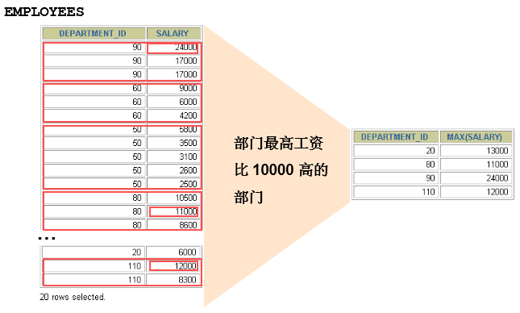](https://imag.fun-ny.cn/1554981656798.png)

**过滤分组：HAVING 子句**

1.  行已经被分组。
2.  使用了聚合函数。
3.  满足 HAVING 子句中条件的分组将被显示。
4.  HAVING 不能单独使用，必须要跟 GROUP BY 一起使用。

[](https://imag.fun-ny.cn/1554981808091.png)

```mysql
SELECT   department_id, MAX(salary)
FROM     employees
GROUP BY department_id
HAVING   MAX(salary)>10000 ;
```

[](https://imag.fun-ny.cn/1554981824564.png)

*   **非法使用聚合函数 ： 不能在 WHERE 子句中使用聚合函数。**如下：

```mysql
SELECT   department_id, AVG(salary)
FROM     employees
WHERE    AVG(salary) > 8000
GROUP BY department_id;
```

[](https://imag.fun-ny.cn/1554981724375.png)

### 3.2 WHERE 和 HAVING 的对比[#](#32-where和having的对比)

**区别 1：WHERE 可以直接使用表中的字段作为筛选条件，但不能使用分组中的计算函数作为筛选条件；HAVING 必须要与 GROUP BY 配合使用，可以把分组计算的函数和分组字段作为筛选条件。**

这决定了，在需要对数据进行分组统计的时候，HAVING 可以完成 WHERE 不能完成的任务。这是因为，在查询语法结构中，WHERE 在 GROUP BY 之前，所以无法对分组结果进行筛选。HAVING 在 GROUP BY 之后，可以使用分组字段和分组中的计算函数，对分组的结果集进行筛选，这个功能是 WHERE 无法完成的。另外，WHERE 排除的记录不再包括在分组中。

**区别 2：如果需要通过连接从关联表中获取需要的数据，WHERE 是先筛选后连接，而 HAVING 是先连接后筛选。** 这一点，就决定了在关联查询中，WHERE 比 HAVING 更高效。因为 WHERE 可以先筛选，用一个筛选后的较小数据集和关联表进行连接，这样占用的资源比较少，执行效率也比较高。HAVING 则需要先把结果集准备好，也就是用未被筛选的数据集进行关联，然后对这个大的数据集进行筛选，这样占用的资源就比较多，执行效率也较低。

小结如下：

<table><thead><tr><th></th><th>优点</th><th>缺点</th></tr></thead><tbody><tr><td>WHERE</td><td>先筛选数据再关联，执行效率高</td><td>不能使用分组中的计算函数进行筛选</td></tr><tr><td>HAVING</td><td>可以使用分组中的计算函数</td><td>在最后的结果集中进行筛选，执行效率较低</td></tr></tbody></table>

**开发中的选择：**

WHERE 和 HAVING 也不是互相排斥的，我们可以在一个查询里面同时使用 WHERE 和 HAVING。包含分组统计函数的条件用 HAVING，普通条件用 WHERE。这样，我们就既利用了 WHERE 条件的高效快速，又发挥了 HAVING 可以使用包含分组统计函数的查询条件的优点。当数据量特别大的时候，运行效率会有很大的差别。

## 4. SELECT 的执行过程[#](#4-select的执行过程)

----------------------------------

### 4.1 查询的结构[#](#41-查询的结构)

```sql
#方式1：
SELECT ...,....,...
FROM ...,...,....
WHERE 多表的连接条件
AND 不包含组函数的过滤条件
GROUP BY ...,...
HAVING 包含组函数的过滤条件
ORDER BY ... ASC/DESC
LIMIT ...,...

#方式2：
SELECT ...,....,...
FROM ... JOIN ... ON 多表的连接条件
JOIN ...ON ...
WHERE 不包含组函数的过滤条件
AND/OR 不包含组函数的过滤条件
GROUP BY ...,...
HAVING 包含组函数的过滤条件
ORDER BY ... ASC/DESC
LIMIT ...,...

#其中：
#（1）from：从哪些表中筛选
#（2）on：关联多表查询时，去除笛卡尔积
#（3）where：从表中筛选的条件
#（4）group by：分组依据
#（5）having：在统计结果中再次筛选
#（6）order by：排序
#（7）limit：分页
```

### 4.2 SELECT 执行顺序[#](#42-select执行顺序)

你需要记住 SELECT 查询时的两个顺序：

**1. 关键字的顺序是不能颠倒的：**

```sql
SELECT ... FROM ... WHERE ... GROUP BY ... HAVING ... ORDER BY ... LIMIT...
```

**2.SELECT 语句的执行顺序**（在 MySQL 和 Oracle 中，SELECT 执行顺序基本相同）：

```sql
FROM -> WHERE -> GROUP BY -> HAVING -> SELECT 的字段 -> DISTINCT -> ORDER BY -> LIMIT
```

[](https://imag.fun-ny.cn/1566872301088.png)

比如你写了一个 SQL 语句，那么它的关键字顺序和执行顺序是下面这样的：

```sql
SELECT DISTINCT player_id, player_name, count(*) as num # 顺序 5
FROM player JOIN team ON player.team_id = team.team_id # 顺序 1
WHERE height > 1.80 # 顺序 2
GROUP BY player.team_id # 顺序 3
HAVING num > 2 # 顺序 4
ORDER BY num DESC # 顺序 6
LIMIT 2 # 顺序 7
```

在 SELECT 语句执行这些步骤的时候，每个步骤都会产生一个`虚拟表`，然后将这个虚拟表传入下一个步骤中作为输入。需要注意的是，这些步骤隐含在 SQL 的执行过程中，对于我们来说是不可见的。

### 4.3 SQL 的执行原理[#](#43-sql-的执行原理)

SELECT 是先执行 FROM 这一步的。在这个阶段，如果是多张表联查，还会经历下面的几个步骤：

1.  首先先通过 CROSS JOIN 求笛卡尔积，相当于得到虚拟表 vt（virtual table）1-1；
2.  通过 ON 进行筛选，在虚拟表 vt1-1 的基础上进行筛选，得到虚拟表 vt1-2；
3.  添加外部行。如果我们使用的是左连接、右链接或者全连接，就会涉及到外部行，也就是在虚拟表 vt1-2 的基础上增加外部行，得到虚拟表 vt1-3。

当然如果我们操作的是两张以上的表，还会重复上面的步骤，直到所有表都被处理完为止。这个过程得到是我们的原始数据。

当我们拿到了查询数据表的原始数据，也就是最终的虚拟表 `vt1`，就可以在此基础上再进行 `WHERE 阶段`。在这个阶段中，会根据 vt1 表的结果进行筛选过滤，得到虚拟表 `vt2`。

然后进入第三步和第四步，也就是 `GROUP 和 HAVING 阶段`。在这个阶段中，实际上是在虚拟表 vt2 的基础上进行分组和分组过滤，得到中间的虚拟表 `vt3` 和 `vt4`。

当我们完成了条件筛选部分之后，就可以筛选表中提取的字段，也就是进入到 `SELECT 和 DISTINCT 阶段`。

首先在 SELECT 阶段会提取想要的字段，然后在 DISTINCT 阶段过滤掉重复的行，分别得到中间的虚拟表 `vt5-1` 和 `vt5-2`。

当我们提取了想要的字段数据之后，就可以按照指定的字段进行排序，也就是 `ORDER BY 阶段`，得到虚拟表 `vt6`。

最后在 vt6 的基础上，取出指定行的记录，也就是 `LIMIT 阶段`，得到最终的结果，对应的是虚拟表 `vt7`。

当然我们在写 SELECT 语句的时候，不一定存在所有的关键字，相应的阶段就会省略。

同时因为 SQL 是一门类似英语的结构化查询语言，所以我们在写 SELECT 语句的时候，还要注意相应的关键字顺序，**所谓底层运行的原理，就是我们刚才讲到的执行顺序。**

第 09 章_子查询
==========

子查询指一个查询语句嵌套在另一个查询语句内部的查询，这个特性从 MySQL 4.1 开始引入。

SQL 中子查询的使用大大增强了 SELECT 查询的能力，因为很多时候查询需要从结果集中获取数据，或者需要从同一个表中先计算得出一个数据结果，然后与这个数据结果（可能是某个标量，也可能是某个集合）进行比较。

## 1. 需求分析与问题解决[#](#1-需求分析与问题解决)

-----------------------------

### 1.1 实际问题[#](#11-实际问题)

[](https://imag.fun-ny.cn/1554991034688.png)

现有解决方式：

```mysql
#方式一：
SELECT salary
FROM employees
WHERE last_name = 'Abel';

SELECT last_name,salary
FROM employees
WHERE salary > 11000;

#方式二：自连接
SELECT e2.last_name,e2.salary
FROM employees e1,employees e2
WHERE e1.last_name = 'Abel'
AND e1.`salary` < e2.`salary`

#方式三：子查询
SELECT last_name,salary
FROM employees
WHERE salary > (
		SELECT salary
		FROM employees
		WHERE last_name = 'Abel'
		);
```

[](https://imag.fun-ny.cn/1554991316599.png)

### 1.2 子查询的基本使用[#](#12-子查询的基本使用)

*   子查询的基本语法结构：

[](https://imag.fun-ny.cn/1554991054388.png)

*   子查询（内查询）在主查询之前一次执行完成。
*   子查询的结果被主查询（外查询）使用 。
*   **注意事项**
    *   子查询要包含在括号内
    *   将子查询放在比较条件的右侧
    *   单行操作符对应单行子查询，多行操作符对应多行子查询

### 1.3 子查询的分类[#](#13-子查询的分类)

**分类方式 1：**

我们按内查询的结果返回一条还是多条记录，将子查询分为`单行子查询`、`多行子查询`。

* 单行子查询

  [](https://imag.fun-ny.cn/1554991538719.png)

* 多行子查询

[](https://imag.fun-ny.cn/1554991555669.png)

**分类方式 2：**

我们按内查询是否被执行多次，将子查询划分为`相关(或关联)子查询`和`不相关(或非关联)子查询`。

子查询从数据表中查询了数据结果，如果这个数据结果只执行一次，然后这个数据结果作为主查询的条件进行执行，那么这样的子查询叫做不相关子查询。

同样，如果子查询需要执行多次，即采用循环的方式，先从外部查询开始，每次都传入子查询进行查询，然后再将结果反馈给外部，这种嵌套的执行方式就称为相关子查询。

## 2. 单行子查询[#](#2-单行子查询)

---------------------

### 2.1 单行比较操作符[#](#21-单行比较操作符)

<table><thead><tr><th>操作符</th><th>含义</th></tr></thead><tbody><tr><td>=</td><td>equal to</td></tr><tr><td>&gt;</td><td>greater than</td></tr><tr><td>&gt;=</td><td>greater than or equal to</td></tr><tr><td>&lt;</td><td>less than</td></tr><tr><td>&lt;=</td><td>less than or equal to</td></tr><tr><td>&lt;&gt;</td><td>not equal to</td></tr></tbody></table>

### 2.2 代码示例[#](#22-代码示例)

**题目：查询工资大于 149 号员工工资的员工的信息**

[](https://imag.fun-ny.cn/image-20210914232952626.png)

[](https://imag.fun-ny.cn/image-20210914232935062.png)

**题目：返回 job_id 与 141 号员工相同，salary 比 143 号员工多的员工姓名，job_id 和工资**

```mysql
SELECT last_name, job_id, salary
FROM   employees
WHERE  job_id =  
                (SELECT job_id
                 FROM   employees
                 WHERE  employee_id = 141)
AND    salary >
                (SELECT salary
                 FROM   employees
                 WHERE  employee_id = 143);
```

[](https://imag.fun-ny.cn/1554991892770.png)

**题目：返回公司工资最少的员工的 last_name,job_id 和 salary**

```mysql
SELECT last_name, job_id, salary
FROM   employees
WHERE  salary = 
                (SELECT MIN(salary)
                 FROM   employees);
```

[](https://imag.fun-ny.cn/1554991935186.png)

**题目：查询与 141 号或 174 号员工的 manager_id 和 department_id 相同的其他员工的 employee_id，manager_id，department_id**

实现方式 1：不成对比较

```mysql
SELECT  employee_id, manager_id, department_id
FROM    employees
WHERE   manager_id IN
		  (SELECT  manager_id
                   FROM    employees
                   WHERE   employee_id IN (174,141))
AND     department_id IN 
		  (SELECT  department_id
                   FROM    employees
                   WHERE   employee_id IN (174,141))
AND	employee_id NOT IN(174,141);
```

实现方式 2：成对比较

```mysql
SELECT	employee_id, manager_id, department_id
FROM	employees
WHERE  (manager_id, department_id) IN
                      (SELECT manager_id, department_id
                       FROM   employees
                       WHERE  employee_id IN (141,174))
AND	employee_id NOT IN (141,174);
```

### 2.3 HAVING 中的子查询[#](#23-having-中的子查询)

*   首先执行子查询。
*   向主查询中的 HAVING 子句返回结果。

**题目：查询最低工资大于 50 号部门最低工资的部门 id 和其最低工资**

```mysql
SELECT   department_id, MIN(salary)
FROM     employees
GROUP BY department_id
HAVING   MIN(salary) >
                       (SELECT MIN(salary)
                        FROM   employees
                        WHERE  department_id = 50);
```

### 2.4 CASE 中的子查询[#](#24-case中的子查询)

在 CASE 表达式中使用单列子查询：

**题目：显式员工的 employee_id,last_name 和 location。其中，若员工 department_id 与 location_id 为 1800 的 department_id 相同，则 location 为’Canada’，其余则为’USA’。**

```mysql
SELECT employee_id, last_name,
       (CASE department_id
        WHEN
             (SELECT department_id FROM departments
	      WHERE location_id = 1800)           
        THEN 'Canada' ELSE 'USA' END) location
FROM   employees;
```

### 2.5 子查询中的空值问题[#](#25-子查询中的空值问题)

```mysql
SELECT last_name, job_id
FROM   employees
WHERE  job_id =
                (SELECT job_id
                 FROM   employees
                 WHERE  last_name = 'Haas');
```

[](https://imag.fun-ny.cn/1554992067381.png)

> **子查询不返回任何行**

### 2.5 非法使用子查询[#](#25-非法使用子查询)

```mysql
SELECT employee_id, last_name
FROM   employees
WHERE  salary =
                (SELECT   MIN(salary)
                 FROM     employees
                 GROUP BY department_id);
```

[](https://imag.fun-ny.cn/1554992135819.png)

> **多行子查询使用单行比较符**

## 3. 多行子查询[#](#3-多行子查询)

---------------------

*   也称为集合比较子查询
*   内查询返回多行
*   使用多行比较操作符

### 3.1 多行比较操作符[#](#31-多行比较操作符)

<table><thead><tr><th>操作符</th><th>含义</th></tr></thead><tbody><tr><td>IN</td><td>等于列表中的<strong>任意一个</strong></td></tr><tr><td>ANY</td><td>需要和单行比较操作符一起使用，和子查询返回的<strong>某一个</strong>值比较</td></tr><tr><td>ALL</td><td>需要和单行比较操作符一起使用，和子查询返回的<strong>所有</strong>值比较</td></tr><tr><td>SOME</td><td>实际上是 ANY 的别名，作用相同，一般常使用 ANY</td></tr></tbody></table>

> 体会 ANY 和 ALL 的区别

### 3.2 代码示例[#](#32-代码示例)

**题目：返回其它 job_id 中比 job_id 为‘IT_PROG’部门任一工资低的员工的员工号、姓名、job_id 以及 salary**

[](https://imag.fun-ny.cn/1554992658876.png)

[](https://imag.fun-ny.cn/1554992664594.png)

[](https://imag.fun-ny.cn/1554992668429.png)

**题目：返回其它 job_id 中比 job_id 为‘IT_PROG’部门所有工资都低的员工的员工号、姓名、job_id 以及 salary**

[](https://imag.fun-ny.cn/1554992753654.png)

[](https://imag.fun-ny.cn/1554992759467.png)

**题目：查询平均工资最低的部门 id**

```mysql
#方式1：
SELECT department_id
FROM employees
GROUP BY department_id
HAVING AVG(salary) = (
			SELECT MIN(avg_sal)
			FROM (
				SELECT AVG(salary) avg_sal
				FROM employees
				GROUP BY department_id
				) dept_avg_sal
			)
```

```mysql
#方式2：
SELECT department_id
FROM employees
GROUP BY department_id
HAVING AVG(salary) <= ALL (
				SELECT AVG(salary) avg_sal
				FROM employees
				GROUP BY department_id
)
```

### 3.3 空值问题[#](#33-空值问题)

```mysql
SELECT last_name
FROM employees
WHERE employee_id NOT IN (
			SELECT manager_id
			FROM employees
			);
```

[](https://imag.fun-ny.cn/image-20211027195906773.png)

## 4. 相关子查询[#](#4-相关子查询)

---------------------

### 4.1 相关子查询执行流程[#](#41-相关子查询执行流程)

如果子查询的执行依赖于外部查询，通常情况下都是因为子查询中的表用到了外部的表，并进行了条件关联，因此每执行一次外部查询，子查询都要重新计算一次，这样的子查询就称之为`关联子查询`。

相关子查询按照一行接一行的顺序执行，主查询的每一行都执行一次子查询。

[](https://imag.fun-ny.cn/1554992898234.png)

[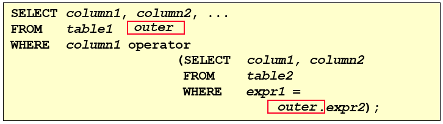](https://imag.fun-ny.cn/1554992925281.png)

说明：**子查询中使用主查询中的列**

### 4.2 代码示例[#](#42-代码示例)

**题目：查询员工中工资大于本部门平均工资的员工的 last_name,salary 和其 department_id**

**方式一：相关子查询**

[](https://imag.fun-ny.cn/1554992986225.png)

**方式二：在 FROM 中使用子查询**

```mysql
SELECT last_name,salary,e1.department_id
FROM employees e1,(SELECT department_id,AVG(salary) dept_avg_sal FROM employees GROUP BY department_id) e2
WHERE e1.`department_id` = e2.department_id
AND e2.dept_avg_sal < e1.`salary`;
```

> from 型的子查询：子查询是作为 from 的一部分，子查询要用 () 引起来，并且要给这个子查询取别名，  
> 把它当成一张 “临时的虚拟的表” 来使用。

在 ORDER BY 中使用子查询：

**题目：查询员工的 id,salary, 按照 department_name 排序**

```mysql
SELECT employee_id,salary
FROM employees e
ORDER BY (
	  SELECT department_name
	  FROM departments d
	  WHERE e.`department_id` = d.`department_id`
	);
```

**题目：若 employees 表中 employee_id 与 job_history 表中 employee_id 相同的数目不小于 2，输出这些相同 id 的员工的 employee_id,last_name 和其 job_id**

```mysql
SELECT e.employee_id, last_name,e.job_id
FROM   employees e 
WHERE  2 <= (SELECT COUNT(*)
             FROM   job_history 
             WHERE  employee_id = e.employee_id);
```

### 4.3 `EXISTS` 与 `NOT EXISTS` 关键字[#](#43-exists-与-not-exists关键字)

*   关联子查询通常也会和 EXISTS 操作符一起来使用，用来检查在子查询中是否存在满足条件的行。
*   **如果在子查询中不存在满足条件的行：**
    *   条件返回 FALSE
    *   继续在子查询中查找
*   **如果在子查询中存在满足条件的行：**
    *   不在子查询中继续查找
    *   条件返回 TRUE
*   NOT EXISTS 关键字表示如果不存在某种条件，则返回 TRUE，否则返回 FALSE。

**题目：查询公司管理者的 employee_id，last_name，job_id，department_id 信息**

方式一：

```mysql
SELECT employee_id, last_name, job_id, department_id
FROM   employees e1
WHERE  EXISTS ( SELECT *
                 FROM   employees e2
                 WHERE  e2.manager_id = 
                        e1.employee_id);
```

方式二：自连接

```mysql
SELECT DISTINCT e1.employee_id, e1.last_name, e1.job_id, e1.department_id
FROM   employees e1 JOIN employees e2
WHERE e1.employee_id = e2.manager_id;
```

方式三：

```mysql
SELECT employee_id,last_name,job_id,department_id
FROM employees
WHERE employee_id IN (
		     SELECT DISTINCT manager_id
		     FROM employees
		     );
```

**题目：查询 departments 表中，不存在于 employees 表中的部门的 department_id 和 department_name**

```mysql
SELECT department_id, department_name
FROM departments d
WHERE NOT EXISTS (SELECT 'X'
                  FROM   employees
                  WHERE  department_id = d.department_id);
```

[](https://imag.fun-ny.cn/1554993169269.png)

### 4.4 相关更新[#](#44-相关更新)

```mysql
UPDATE table1 alias1
SET    column = (SELECT expression
                 FROM   table2 alias2
                 WHERE  alias1.column = alias2.column);
```

使用相关子查询依据一个表中的数据更新另一个表的数据。

**题目：在 employees 中增加一个 department_name 字段，数据为员工对应的部门名称**

```mysql
# 1）
ALTER TABLE employees
ADD(department_name VARCHAR2(14));

# 2）
UPDATE employees e
SET department_name =  (SELECT department_name 
	                       FROM   departments d
	                       WHERE  e.department_id = d.department_id);
```

### 4.4 相关删除[#](#44-相关删除)

```mysql
DELETE FROM table1 alias1
 WHERE column operator (SELECT expression
                        FROM   table2 alias2
                        WHERE  alias1.column = alias2.column);
```

使用相关子查询依据一个表中的数据删除另一个表的数据。

**题目：删除表 employees 中，其与 emp_history 表皆有的数据**

```mysql
DELETE FROM employees e
WHERE employee_id in  
           (SELECT employee_id
            FROM   emp_history 
            WHERE  employee_id = e.employee_id);
```

## 5. 抛一个思考题[#](#5-抛一个思考题)

-----------------------

**问题：**谁的工资比 Abel 的高？

**解答：**

```mysql
#方式1：自连接
SELECT e2.last_name,e2.salary
FROM employees e1,employees e2
WHERE e1.last_name = 'Abel'
AND e1.`salary` < e2.`salary`
```

```mysql
#方式2：子查询
SELECT last_name,salary
FROM employees
WHERE salary > (
		SELECT salary
		FROM employees
		WHERE last_name = 'Abel'
		);
```

**问题：**以上两种方式有好坏之分吗？

**解答：**自连接方式好！

题目中可以使用子查询，也可以使用自连接。一般情况建议你使用自连接，因为在许多 DBMS 的处理过程中，对于自连接的处理速度要比子查询快得多。

可以这样理解：子查询实际上是通过未知表进行查询后的条件判断，而自连接是通过已知的自身数据表进行条件判断，因此在大部分 DBMS 中都对自连接处理进行了优化。

第 10 章_创建和管理表
=============

## 1. 基础知识[#](#1-基础知识)

-------------------

### 1.1 一条数据存储的过程[#](#11-一条数据存储的过程)

`存储数据是处理数据的第一步`。只有正确地把数据存储起来，我们才能进行有效的处理和分析。否则，只能是一团乱麻，无从下手。

那么，怎样才能把用户各种经营相关的、纷繁复杂的数据，有序、高效地存储起来呢？ 在 MySQL 中，一个完整的数据存储过程总共有 4 步，分别是创建数据库、确认字段、创建数据表、插入数据。

[](https://imag.fun-ny.cn/image-20211007155810920.png)

我们要先创建一个数据库，而不是直接创建数据表呢？

因为从系统架构的层次上看，MySQL 数据库系统从大到小依次是`数据库服务器`、`数据库`、`数据表`、数据表的`行与列`。

MySQL 数据库服务器之前已经安装。所以，我们就从创建数据库开始。

### 1.2 标识符命名规则[#](#12-标识符命名规则)

*   数据库名、表名不得超过 30 个字符，变量名限制为 29 个
*   必须只能包含 A–Z, a–z, 0–9, _共 63 个字符
*   数据库名、表名、字段名等对象名中间不要包含空格
*   同一个 MySQL 软件中，数据库不能同名；同一个库中，表不能重名；同一个表中，字段不能重名
*   必须保证你的字段没有和保留字、数据库系统或常用方法冲突。如果坚持使用，请在 SQL 语句中使用 `（着重号）引起来
*   保持字段名和类型的一致性：在命名字段并为其指定数据类型的时候一定要保证一致性，假如数据类型在一个表里是整数，那在另一个表里可就别变成字符型了

### 1.3 MySQL 中的数据类型[#](#13-mysql中的数据类型)

<table><thead><tr><th>类型</th><th>类型举例</th></tr></thead><tbody><tr><td>整数类型</td><td>TINYINT、SMALLINT、MEDIUMINT、<strong>INT(或 INTEGER)</strong>、BIGINT</td></tr><tr><td>浮点类型</td><td>FLOAT、DOUBLE</td></tr><tr><td>定点数类型</td><td><strong>DECIMAL</strong></td></tr><tr><td>位类型</td><td>BIT</td></tr><tr><td>日期时间类型</td><td>YEAR、TIME、<strong>DATE</strong>、DATETIME、TIMESTAMP</td></tr><tr><td>文本字符串类型</td><td>CHAR、<strong>VARCHAR</strong>、TINYTEXT、TEXT、MEDIUMTEXT、LONGTEXT</td></tr><tr><td>枚举类型</td><td>ENUM</td></tr><tr><td>集合类型</td><td>SET</td></tr><tr><td>二进制字符串类型</td><td>BINARY、VARBINARY、TINYBLOB、BLOB、MEDIUMBLOB、LONGBLOB</td></tr><tr><td>JSON 类型</td><td>JSON 对象、JSON 数组</td></tr><tr><td>空间数据类型</td><td>单值：GEOMETRY、POINT、LINESTRING、POLYGON；<br>集合：MULTIPOINT、MULTILINESTRING、MULTIPOLYGON、GEOMETRYCOLLECTION</td></tr></tbody></table>

其中，常用的几类类型介绍如下：

<table><thead><tr><th>数据类型</th><th>描述</th></tr></thead><tbody><tr><td>INT</td><td>从 - 2<sup>31 到 2</sup>31-1 的整型数据。存储大小为 4 个字节</td></tr><tr><td>CHAR(size)</td><td>定长字符数据。若未指定，默认为 1 个字符，最大长度 255</td></tr><tr><td>VARCHAR(size)</td><td>可变长字符数据，根据字符串实际长度保存，<strong>必须指定长度</strong></td></tr><tr><td>FLOAT(M,D)</td><td>单精度，占用 4 个字节，M = 整数位 + 小数位，D = 小数位。 D&lt;=M&lt;=255,0&lt;=D&lt;=30，默认 M+D&lt;=6</td></tr><tr><td>DOUBLE(M,D)</td><td>双精度，占用 8 个字节，D&lt;=M&lt;=255,0&lt;=D&lt;=30，默认 M+D&lt;=15</td></tr><tr><td>DECIMAL(M,D)</td><td>高精度小数，占用 M+2 个字节，D&lt;=M&lt;=65，0&lt;=D&lt;=30，最大取值范围与 DOUBLE 相同。</td></tr><tr><td>DATE</td><td>日期型数据，格式'YYYY-MM-DD'</td></tr><tr><td>BLOB</td><td>二进制形式的长文本数据，最大可达 4G</td></tr><tr><td>TEXT</td><td>长文本数据，最大可达 4G</td></tr></tbody></table>

## 2. 创建和管理数据库[#](#2-创建和管理数据库)

---------------------------

### 2.1 创建数据库[#](#21-创建数据库)

*   方式 1：创建数据库

```mysql
CREATE DATABASE 数据库名;
```

*   方式 2：创建数据库并指定字符集

```mysql
CREATE DATABASE 数据库名 CHARACTER SET 字符集; -- utf8md4  四个字节的utf-8的字符集
```

*   方式 3：判断数据库是否已经存在，不存在则创建数据库（`推荐`）

```mysql
CREATE DATABASE IF NOT EXISTS 数据库名;
```

如果 MySQL 中已经存在相关的数据库，则忽略创建语句，不再创建数据库。

> 注意：DATABASE 不能改名。一些可视化工具可以改名，它是建新库，把所有表复制到新库，再删旧库完成的。

### 2.2 使用数据库[#](#22-使用数据库)

*   查看当前所有的数据库

```mysql
SHOW DATABASES; #有一个S，代表多个数据库
```

*   查看当前正在使用的数据库

```mysql
SELECT DATABASE();  #使用的一个 mysql 中的全局函数
```

*   查看指定库下所有的表

```mysql
SHOW TABLES FROM 数据库名;
```

*   查看数据库的创建信息

```mysql
SHOW CREATE DATABASE 数据库名;
或者：
SHOW CREATE DATABASE 数据库名\G
```

*   使用 / 切换数据库

```mysql
USE 数据库名;
```

> 注意：要操作表格和数据之前必须先说明是对哪个数据库进行操作，否则就要对所有对象加上 “数据库名.”。

### 2.3 修改数据库[#](#23-修改数据库)

*   更改数据库字符集

```mysql
ALTER DATABASE 数据库名 CHARACTER SET 字符集;  #比如：gbk、utf8等
```

### 2.4 删除数据库[#](#24-删除数据库)

*   方式 1：删除指定的数据库

```mysql
DROP DATABASE 数据库名;
```

*   方式 2：删除指定的数据库（`推荐`）

```mysql
DROP DATABASE IF EXISTS 数据库名;
```

## 3. 创建表[#](#3-创建表)

-----------------

### 3.1 创建方式 1 - 手动创建[#](#31-创建方式1)

*   **必须具备：**
    *   CREATE TABLE 权限
    *   存储空间
*   **语法格式：**

```mysql
CREATE TABLE [IF NOT EXISTS] 表名(
	字段1, 数据类型 [约束条件] [默认值],
	字段2, 数据类型 [约束条件] [默认值],
	字段3, 数据类型 [约束条件] [默认值],
	……
	[表约束条件]
);
```

> 加上了 `IF NOT EXISTS` 关键字，则表示：如果当前数据库中不存在要创建的数据表，则创建数据表；如果当前数据库中已经存在要创建的数据表，则忽略建表语句，不再创建数据表。

*   **必须指定：**
    *   表名
    *   列名 (或字段名)，数据类型，**长度**
*   **可选指定：**
    *   约束条件
    *   默认值
*   创建表举例 1：

```mysql
-- 创建表
CREATE TABLE emp (
  -- int类型
  emp_id INT,
  -- 最多保存20个中英文字符
  emp_name VARCHAR(20),
  -- 总位数不超过15位
  salary DOUBLE,
  -- 日期类型
  birthday DATE
);
```

```mysql
DESC emp;  -- 查看表结构
```

[](https://imag.fun-ny.cn/image-20211016160557995.png)

MySQL 在执行建表语句时，将 id 字段的类型设置为 int(11)，这里的 11 实际上是 int 类型指定的显示宽度，默认的显示宽度为 11。也可以在创建数据表的时候指定数据的显示宽度。

*   创建表举例 2：

```mysql
CREATE TABLE dept(
	deptno INT(2) AUTO_INCREMENT,-- int类型，自增
	dname VARCHAR(14),
	loc VARCHAR(13),
    
    PRIMARY KEY (deptno) -- 主键
);
```

```mysql
DESCRIBE dept;
```

[](https://imag.fun-ny.cn/image-20211016160643445.png)

> 在 MySQL 8.x 版本中，不再推荐为 INT 类型指定显示长度，并在未来的版本中可能去掉这样的语法。

### 3.2 创建方式 2 - 复制其他表字段和数据[#](#32-创建方式2)

* 使用 `AS subquery` 选项，**将创建表和插入数据结合起来**

  [](https://imag.fun-ny.cn/1554997882872.png)

* 指定的列和子查询中的列要一一对应

* 通过列名和默认值定义列

```mysql
CREATE TABLE emp1 AS SELECT * FROM employees;  -- 复制全部字段和数据

CREATE TABLE emp2 AS SELECT * FROM employees WHERE 1=2; -- 创建的emp2是空表
```

```mysql
CREATE TABLE dept80
AS 
SELECT  employee_id, last_name, salary*12 as ANNSAL, hire_date
FROM    employees
WHERE   department_id = 80;  -- 根据选择复制字段和根据条件插入数据
```

```mysql
DESCRIBE dept80;
```

[](http://imag.fun-ny.cn/img/1554997998148.png)

[](https://imag.fun-ny.cn/1554998004494.png)

### 3.3 查看数据表结构[#](#33-查看数据表结构)

在 MySQL 中创建好数据表之后，可以查看数据表的结构。MySQL 支持使用`DESCRIBE/DESC`语句查看数据表结构，也支持使用`SHOW CREATE TABLE`语句查看数据表结构。

语法格式如下：

```mysql
SHOW CREATE TABLE 表名\G
```

使用 SHOW CREATE TABLE 语句不仅可以查看表创建时的详细语句，还可以查看存储引擎和字符编码。

## 4. 修改表[#](#4-修改表)

-----------------

修改表指的是修改数据库中已经存在的数据表的结构。

**使用 ALTER TABLE 语句可以实现：**

*   向已有的表中添加列

*   修改现有表中的列

*   删除现有表中的列

*   重命名现有表中的列

### 4.1 追加一个列[#](#41-追加一个列)

语法格式如下：

```mysql
ALTER TABLE 表名 ADD 【COLUMN】 字段名 字段类型 【FIRST|AFTER 字段名】;
```

举例：

```mysql
ALTER TABLE dept80 
ADD job_id varchar(15);
```

[](https://imag.fun-ny.cn/1554998139815.png)

### 4.2 修改一个列[#](#42-修改一个列)

*   可以修改列的数据类型，长度、默认值和位置

*   修改字段数据类型、长度、默认值、位置的语法格式如下：

```mysql
ALTER TABLE 表名 MODIFY 【COLUMN】 字段名1 字段类型 【DEFAULT 默认值】【FIRST|AFTER 字段名2】;
```

*   举例：

```mysql
ALTER TABLE	dept80
MODIFY last_name VARCHAR(30);
```

```mysql
ALTER TABLE	dept80
MODIFY salary double(9,2) default 1000;
```

*   对默认值的修改只影响今后对表的修改
*   此外，还可以通过此种方式修改列的约束。这里暂先不讲。

### 4.3 重命名一个列[#](#43-重命名一个列)

使用 CHANGE old_column new_column dataType 子句重命名列。语法格式如下：

```mysql
ALTER TABLE 表名 CHANGE 【column】 列名 新列名 新数据类型;
```

举例：

```mysql
ALTER TABLE  dept80
CHANGE department_name dept_name varchar(15);
```

### 4.4 删除一个列[#](#44-删除一个列)

删除表中某个字段的语法格式如下：

```mysql
ALTER TABLE 表名 DROP 【COLUMN】字段名
```

举例：

```mysql
ALTER TABLE  dept80
DROP COLUMN  job_id;
```

## 5.重命名表[#](#5-重命名表)

-------------------

*   方式一：使用 `RENAME`

```mysql
RENAME TABLE emp
TO myemp;
```

*   方式二：

```mysql
ALTER table dept
RENAME [TO] detail_dept;  -- [TO]可以省略
```

*   必须是对象的拥有者

## 6. 删除表[#](#6-删除表)

-----------------

*   在 MySQL 中，当一张数据表`没有与其他任何数据表形成关联关系`时，可以将当前数据表直接删除。

*   **数据和结构都被删除**，释放空间

*   所有正在运行的相关事务被提交

*   所有相关索引被删除

*   语法格式：

```mysql
DROP TABLE [IF EXISTS] 数据表1 [, 数据表2, …, 数据表n];
```

`IF EXISTS`的含义为：如果当前数据库中存在相应的数据表，则删除数据表；如果当前数据库中不存在相应的数据表，则忽略删除语句，不再执行删除数据表的操作。

*   举例：

```mysql
DROP TABLE dept80;
```

*   `DROP TABLE` 语句不能回滚

## 7.清空表[#](#7-清空表)

-----------------

*   `TRUNCATE TABLE` 【截断】语句：
    *   删除表中所有的数据，保留表结构
    *   释放表的存储空间
*   举例：

```mysql
TRUNCATE TABLE detail_dept;
```

*   TRUNCATE 语句**不能回滚**，而使用 DELETE 语句删除数据，可以回滚

*   对比：

```mysql
SET autocommit = FALSE;
  
DELETE FROM emp2; 
#TRUNCATE TABLE emp2;
  
SELECT * FROM emp2;
  
ROLLBACK;
  
SELECT * FROM emp2;

# DCL 中 COMMIT 和 ROLLBACK
# COMMIT:提交数据。一旦执行COMMIT，则数据就被永久的保存在了数据库中，意味着数据不可以回滚。
# ROLLBACK:回滚数据。一旦执行ROLLBACK,则可以实现数据的回滚。回滚到最近的一次COMMIT之后。

#对比 TRUNCATE TABLE 和 DELETE FROM 
# 相同点：都可以实现对表中所有数据的删除，同时保留表结构。
# 不同点：
#	TRUNCATE TABLE：一旦执行此操作，表数据全部清除。同时，数据是不可以回滚的。
#	DELETE FROM：一旦执行此操作，表数据可以全部清除（不带WHERE）。同时，数据是可以实现回滚的。

#DDL 和 DML 的说明
#  ① DDL（`CREATE`、`DROP`、`ALTER`）的操作一旦执行，就不可回滚。指令SET autocommit = FALSE对DDL操作失效。(因为在执行完DDL操作之后，一定会执行一次COMMIT。而此COMMIT操作不受SET autocommit = FALSE影响的。)
  
#  ② DML（insert、update、delete）的操作默认情况，一旦执行，也是不可回滚的。但是，如果在执行DML之前，执行了 
#    SET autocommit = FALSE，则执行的DML操作就可以实现回滚。
```

> 阿里开发规范：
>
> 【参考】`TRUNCATE TABLE` 比 `DELETE` 速度快，且使用的系统和事务日志资源少，但 `TRUNCATE` 无事务且不触发 TRIGGER，有可能造成事故，故不建议在开发代码中使用此语句。
>
> 说明：TRUNCATE TABLE 在功能上与不带 WHERE 子句的 DELETE 语句相同。

## 8. 内容拓展[#](#8-内容拓展)

-------------------

### 拓展 1：阿里巴巴《Java 开发手册》之 MySQL 字段命名[#](#拓展1阿里巴巴java开发手册之mysql字段命名)

* 【`强制`】表名、字段名必须使用小写字母或数字，禁止出现数字开头，禁止两个下划线中间只出现数字。数据库字段名的修改代价很大，因为无法进行预发布，所以字段名称需要慎重考虑。

  *   正例：aliyun_admin，rdc_config，level3_name
  *   反例：AliyunAdmin，rdcConfig，level_3_name

* 【`强制`】禁用保留字，如 desc、range、match、delayed 等，请参考 MySQL 官方保留字。

* 【`强制`】表必备三字段：id, gmt_create, gmt_modified。

  *   说明：其中 id 必为主键，类型为 BIGINT UNSIGNED、单表时自增、步长为 1。gmt_create, gmt_modified 的类型均为 DATETIME 类型，前者现在时表示主动式创建，后者过去分词表示被动式更新

* 【`推荐`】表的命名最好是遵循 “业务名称_表的作用”。

  *   正例：alipay_task 、 force_project、 trade_config

* 【`推荐`】库名与应用名称尽量一致。

* 【参考】合适的字符存储长度，不但节约数据库表空间、节约索引存储，更重要的是提升检索速度。

  *   正例：无符号值可以避免误存负数，且扩大了表示范围。

  [](https://imag.fun-ny.cn/image-20211024012735469.png)

### 拓展 2：如何理解清空表、删除表等操作需谨慎？！[#](#拓展2如何理解清空表删除表等操作需谨慎)

`表删除`操作将把表的定义和表中的数据一起删除，并且 MySQL 在执行删除操作时，不会有任何的确认信息提示，因此执行删除操时应当慎重。在删除表前，最好对表中的数据进行`备份`，这样当操作失误时可以对数据进行恢复，以免造成无法挽回的后果。

同样的，在使用 `ALTER TABLE` 进行表的基本修改操作时，在执行操作过程之前，也应该确保对数据进行完整的`备份`，因为数据库的改变是`无法撤销`的，如果添加了一个不需要的字段，可以将其删除；相同的，如果删除了一个需要的列，该列下面的所有数据都将会丢失。

### 拓展 3：MySQL8 新特性—DDL 的原子化[#](#拓展3mysql8新特性ddl的原子化)

在 MySQL 8.0 版本中，InnoDB 表的 DDL 支持事务完整性，即`DDL操作要么成功要么回滚`。DDL 操作回滚日志写入到 data dictionary 数据字典表 mysql.innodb_ddl_log（该表是隐藏的表，通过 show tables 无法看到）中，用于回滚操作。通过设置参数，可将 DDL 操作日志打印输出到 MySQL 错误日志中。

分别在 MySQL 5.7 版本和 MySQL 8.0 版本中创建数据库和数据表，结果如下：

```mysql
CREATE DATABASE mytest;

USE mytest;

CREATE TABLE book1(
book_id INT ,
book_name VARCHAR(255)
);

SHOW TABLES;
```

（1）在 MySQL 5.7 版本中，测试步骤如下：  
删除数据表 book1 和数据表 book2，结果如下：

```mysql
mysql> DROP TABLE book1,book2;
ERROR 1051 (42S02): Unknown table 'mytest.book2'
```

再次查询数据库中的数据表名称，结果如下：

```mysql
mysql> SHOW TABLES;
Empty set (0.00 sec)
```

从结果可以看出，虽然删除操作时报错了，但是仍然删除了数据表 book1。

（2）在 MySQL 8.0 版本中，测试步骤如下：  
删除数据表 book1 和数据表 book2，结果如下：

```mysql
mysql> DROP TABLE book1,book2;
ERROR 1051 (42S02): Unknown table 'mytest.book2'
```

再次查询数据库中的数据表名称，结果如下：

```mysql
mysql> show tables;
+------------------+
| Tables_in_mytest |
+------------------+
| book1            |
+------------------+
1 row in set (0.00 sec)
```

从结果可以看出，数据表 book1 并没有被删除。

第 11 章_数据处理之增删改
===============

## 1.插入数据[#](#1-插入数据)

-------------------

### 1.1 实际问题[#](#11-实际问题-1)

[](https://imag.fun-ny.cn/1555425366064.png)

解决方式：使用 INSERT 语句向表中插入数据。

### 1.2 方式 1：VALUES 的方式添加[#](#12-方式1values的方式添加)

使用这种语法一次只能向表中插入**一条**数据。

##### **情况 1：为表的所有字段按默认顺序插入数据**

```mysql
INSERT INTO 表名
VALUES (value1,value2,....);
```

值列表中需要为表的每一个字段指定值，并且值的顺序必须和数据表中字段定义时的顺序相同。

举例：

```mysql
INSERT INTO departments
VALUES (70, 'Pub', 100, 1700);
```

```mysql
INSERT INTO	departments
VALUES		(100, 'Finance', NULL, NULL);
```

##### **情况 2：为表的指定字段插入数据**

```mysql
INSERT INTO 表名(column1 [, column2, …, columnn]) 
VALUES (value1 [,value2, …, valuen]);
```

为表的指定字段插入数据，就是在 INSERT 语句中只向部分字段中插入值，而其他字段的值为表定义时的默认值。

在 INSERT 子句中随意列出列名，但是一旦列出，VALUES 中要插入的 value1,....valuen 需要与 column1,...columnn 列一一对应。如果类型不同，将无法插入，并且 MySQL 会产生错误。

举例：

```mysql
INSERT INTO departments(department_id, department_name)
VALUES (80, 'IT');
```

##### **情况 3：同时插入多条记录**

INSERT 语句可以同时向数据表中插入多条记录，插入时指定多个值列表，每个值列表之间用逗号分隔开，基本语法格式如下：

```mysql
INSERT INTO table_name 
VALUES 
(value1 [,value2, …, valuen]),
(value1 [,value2, …, valuen]),
……
(value1 [,value2, …, valuen]);
```

或者

```mysql
INSERT INTO table_name(column1 [, column2, …, columnn]) 
VALUES 
(value1 [,value2, …, valuen]),
(value1 [,value2, …, valuen]),
……
(value1 [,value2, …, valuen]);
```

举例：

```mysql
mysql> INSERT INTO emp(emp_id,emp_name)
    -> VALUES (1001,'shkstart'),
    -> (1002,'atguigu'),
    -> (1003,'Tom');
Query OK, 3 rows affected (0.00 sec)
Records: 3  Duplicates: 0  Warnings: 0
```

使用 INSERT 同时插入多条记录时，MySQL 会返回一些在执行单行插入时没有的额外信息，这些信息的含义如下：  
●　Records：表明插入的记录条数。  
●　Duplicates：表明插入时被忽略的记录，原因可能是这些记录包含了重复的主键值。  
●　Warnings：表明有问题的数据值，例如发生数据类型转换。

> 一个同时插入多行记录的 INSERT 语句等同于多个单行插入的 INSERT 语句，但是多行的 INSERT 语句在处理过程中`效率更高`。因为 MySQL 执行单条 INSERT 语句插入多行数据比使用多条 INSERT 语句快，所以在插入多条记录时最好选择使用单条 INSERT 语句的方式插入。

**小结：**

*   `VALUES`也可以写成`VALUE`，但是 VALUES 是标准写法。

*   字符和日期型数据应包含在单引号中。

### 1.3 方式 2：将查询结果插入到表中[#](#13-方式2将查询结果插入到表中)

INSERT 还可以将 SELECT 语句查询的结果插入到表中，此时不需要把每一条记录的值一个一个输入，只需要使用一条 INSERT 语句和一条 SELECT 语句组成的组合语句即可快速地从一个或多个表中向一个表中插入多行。

基本语法格式如下：

```mysql
INSERT INTO 目标表名
(tar_column1 [, tar_column2, …, tar_columnn])
SELECT
(src_column1 [, src_column2, …, src_columnn])
FROM 源表名
[WHERE condition]
```

*   在 INSERT 语句中加入子查询。
*   **不必书写** **VALUES** **子句。**
*   子查询中的值列表应与 INSERT 子句中的列名对应。

举例：

```mysql
INSERT INTO emp2 
SELECT * 
FROM employees
WHERE department_id = 90;
```

```mysql
INSERT INTO sales_reps(id, name, salary, commission_pct)
SELECT employee_id, last_name, salary, commission_pct
FROM   employees
WHERE  job_id LIKE '%REP%';
```

## 2.更新数据[#](#2-更新数据)

-------------------

[](https://imag.fun-ny.cn/1555425824246.png)

*   使用 UPDATE 语句更新数据。语法如下：

```mysql
UPDATE table_name
SET column1=value1, column2=value2, … , column=valuen
[WHERE condition]
```

*   可以一次更新**多条**数据。

*   如果需要回滚数据，需要保证在 DML 前，进行设置：**SET AUTOCOMMIT = FALSE;**

*   使用 **WHERE** 子句指定需要更新的数据。

```mysql
UPDATE employees
SET    department_id = 70
WHERE  employee_id = 113;
```

*   如果省略 WHERE 子句，则表中的所有数据都将被更新。

```mysql
UPDATE 	copy_emp
SET    	department_id = 110;
```

*   **更新中的数据完整性错误**

```mysql
UPDATE employees
SET    department_id = 55
WHERE  department_id = 110;
```

[](https://imag.fun-ny.cn/1555426069578.png)

> 说明：不存在 55 号部门

## 3. 删除数据[#](#3-删除数据)

-------------------

[](https://imag.fun-ny.cn/1555426124751.png)

*   使用 DELETE 语句从表中删除数据

[](https://imag.fun-ny.cn/1555426162264.png)

```mysql
DELETE FROM table_name [WHERE <condition>];
```

table_name 指定要执行删除操作的表；“[WHERE ]” 为可选参数，指定删除条件，如果没有 WHERE 子句，DELETE 语句将删除表中的所有记录。

*   使用 WHERE 子句删除指定的记录。

```mysql
DELETE FROM departments
WHERE  department_name = 'Finance';
```

*   如果省略 WHERE 子句，则表中的全部数据将被删除

```mysql
DELETE FROM  copy_emp;
```

*   **删除中的数据完整性错误**

```mysql
DELETE FROM departments
WHERE       department_id = 60;
```

[](https://imag.fun-ny.cn/1555426258516.png)

> 说明：You cannot delete a row that contains a primary key that is used as a foreign key in another table.

## 4. MySQL8 新特性：计算列[#](#4-mysql8新特性计算列)

-------------------------------------

什么叫计算列呢？简单来说就是某一列的值是通过别的列计算得来的。例如，a 列值为 1、b 列值为 2，c 列不需要手动插入，定义 a+b 的结果为 c 的值，那么 c 就是计算列，是通过别的列计算得来的。

在 MySQL 8.0 中，CREATE TABLE 和 ALTER TABLE 中都支持增加计算列。下面以 CREATE TABLE 为例进行讲解。

举例：定义数据表 tb1，然后定义字段 id、字段 a、字段 b 和字段 c，其中字段 c 为计算列，用于计算 a+b 的值。  
首先创建测试表 tb1，语句如下：

```mysql
CREATE TABLE tb1(
id INT,
a INT,
b INT,
c INT GENERATED ALWAYS AS (a + b) VIRTUAL
);
```

插入演示数据，语句如下：

```mysql
INSERT INTO tb1(a,b) VALUES (100,200);
```

查询数据表 tb1 中的数据，结果如下：

```mysql
mysql> SELECT * FROM tb1;
+------+------+------+------+
| id   | a    | b    | c    |
+------+------+------+------+
| NULL |  100 |  200 |  300 |
+------+------+------+------+
1 row in set (0.00 sec)
```

更新数据中的数据，语句如下：

```mysql
mysql> UPDATE tb1 SET a = 500;
Query OK, 0 rows affected (0.00 sec)
Rows matched: 1  Changed: 0  Warnings: 0
```

## 5. 综合案例[#](#5-综合案例)

-------------------

```mysql
# 1、创建数据库test01_library

# 2、创建表 books，表结构如下：
```

<table><thead><tr><th>字段名</th><th>字段说明</th><th>数据类型</th></tr></thead><tbody><tr><td>id</td><td>书编号</td><td>INT</td></tr><tr><td>name</td><td>书名</td><td>VARCHAR(50)</td></tr><tr><td>authors</td><td>作者</td><td>VARCHAR(100)</td></tr><tr><td>price</td><td>价格</td><td>FLOAT</td></tr><tr><td>pubdate</td><td>出版日期</td><td>YEAR</td></tr><tr><td>note</td><td>说明</td><td>VARCHAR(100)</td></tr><tr><td>num</td><td>库存</td><td>INT</td></tr></tbody></table>

```
# 3、向books表中插入记录

# 1）不指定字段名称，插入第一条记录
# 2）指定所有字段名称，插入第二记录
# 3）同时插入多条记录（剩下的所有记录）
```

<table><thead><tr><th>id</th><th>name</th><th>authors</th><th>price</th><th>pubdate</th><th>note</th><th>num</th></tr></thead><tbody><tr><td>1</td><td>Tal of AAA</td><td>Dickes</td><td>23</td><td>1995</td><td>novel</td><td>11</td></tr><tr><td>2</td><td>EmmaT</td><td>Jane lura</td><td>35</td><td>1993</td><td>joke</td><td>22</td></tr><tr><td>3</td><td>Story of Jane</td><td>Jane Tim</td><td>40</td><td>2001</td><td>novel</td><td>0</td></tr><tr><td>4</td><td>Lovey Day</td><td>George Byron</td><td>20</td><td>2005</td><td>novel</td><td>30</td></tr><tr><td>5</td><td>Old land</td><td>Honore Blade</td><td>30</td><td>2010</td><td>law</td><td>0</td></tr><tr><td>6</td><td>The Battle</td><td>Upton Sara</td><td>30</td><td>1999</td><td>medicine</td><td>40</td></tr><tr><td>7</td><td>Rose Hood</td><td>Richard haggard</td><td>28</td><td>2008</td><td>cartoon</td><td>28</td></tr></tbody></table>


```
# 4、将小说类型(novel)的书的价格都增加5。

# 5、将名称为EmmaT的书的价格改为40，并将说明改为drama。

# 6、删除库存为0的记录。

# 7、统计书名中包含a字母的书

# 8、统计书名中包含a字母的书的数量和库存总量

# 9、找出“novel”类型的书，按照价格降序排列

# 10、查询图书信息，按照库存量降序排列，如果库存量相同的按照note升序排列

# 11、按照note分类统计书的数量

# 12、按照note分类统计书的库存量，显示库存量超过30本的

# 13、查询所有图书，每页显示5本，显示第二页

# 14、按照note分类统计书的库存量，显示库存量最多的

# 15、查询书名达到10个字符的书，不包括里面的空格

# 16、查询书名和类型，其中note值为novel显示小说，law显示法律，medicine显示医药，cartoon显示卡通，joke显示笑话

# 17、查询书名、库存，其中num值超过30本的，显示滞销，大于0并低于10的，显示畅销，为0的显示需要无货

# 18、统计每一种note的库存量，并合计总量

# 19、统计每一种note的数量，并合计总量

# 20、统计库存量前三名的图书

# 21、找出最早出版的一本书

# 22、找出novel中价格最高的一本书

# 23、找出书名中字数最多的一本书，不含空格
```

答案：

```mysql
#1、创建数据库test01_library
CREATE DATABASE IF NOT EXISTS test01_library CHARACTER SET 'utf8';

#指定使用哪个数据库
USE test01_library;

#2、创建表 books
CREATE TABLE books(
	id INT,
	name VARCHAR(50),
	`authors` VARCHAR(100) ,
	price FLOAT,
	pubdate YEAR ,
	note VARCHAR(100),
	num INT
);

#3、向books表中插入记录
# 1）不指定字段名称，插入第一条记录
INSERT INTO books 
VALUES(1,'Tal of AAA','Dickes',23,1995,'novel',11);
# 2）指定所有字段名称，插入第二记录
INSERT INTO books (id,name,`authors`,price,pubdate,note,num)
VALUES(2,'EmmaT','Jane lura',35,1993,'Joke',22);
# 3）同时插入多条记录（剩下的所有记录）
INSERT INTO books (id,name,`authors`,price,pubdate,note,num) VALUES
(3,'Story of Jane','Jane Tim',40,2001,'novel',0),
(4,'Lovey Day','George Byron',20,2005,'novel',30),
(5,'Old land','Honore Blade',30,2010,'Law',0),
(6,'The Battle','Upton Sara',30,1999,'medicine',40),
(7,'Rose Hood','Richard haggard',28,2008,'cartoon',28);

# 4、将小说类型(novel)的书的价格都增加5。
UPDATE books SET price=price+5 WHERE note = 'novel';

# 5、将名称为EmmaT的书的价格改为40，并将说明改为drama。
UPDATE books SET price=40,note='drama' WHERE name='EmmaT';

# 6、删除库存为0的记录。
DELETE FROM books WHERE num=0;

# 7、统计书名中包含a字母的书
SELECT * FROM books WHERE name LIKE '%a%';

# 8、统计书名中包含a字母的书的数量和库存总量
SELECT COUNT(*),SUM(num) FROM books WHERE name LIKE '%a%';

# 9、找出“novel”类型的书，按照价格降序排列
SELECT * FROM books WHERE note = 'novel' ORDER BY price DESC;

# 10、查询图书信息，按照库存量降序排列，如果库存量相同的按照note升序排列
SELECT * FROM books ORDER BY num DESC,note ASC;

# 11、按照note分类统计书的数量
SELECT note,COUNT(*) FROM books GROUP BY note;

# 12、按照note分类统计书的库存量，显示库存量超过30本的
SELECT note,SUM(num) FROM books GROUP BY note HAVING SUM(num)>30;

# 13、查询所有图书，每页显示5本，显示第二页
SELECT * FROM books LIMIT 5,5;

# 14、按照note分类统计书的库存量，显示库存量最多的
SELECT note,SUM(num) sum_num FROM books GROUP BY note ORDER BY sum_num DESC LIMIT 0,1;

# 15、查询书名达到10个字符的书，不包括里面的空格
SELECT * FROM books WHERE CHAR_LENGTH(REPLACE(name,' ',''))>=10;

/*
16、查询书名和类型，
 其中note值为 novel显示小说，law显示法律，medicine显示医药，cartoon显示卡通，joke显示笑话
*/
SELECT name AS "书名" ,note, CASE note 
 WHEN 'novel' THEN '小说'
 WHEN 'law' THEN '法律'
 WHEN 'medicine' THEN '医药'
 WHEN 'cartoon' THEN '卡通'
 WHEN 'joke' THEN '笑话'
 END AS "类型"
FROM books;


# 17、查询书名、库存，其中num值超过30本的，显示滞销，大于0并低于10的，显示畅销，为0的显示需要无货
SELECT name,num,CASE 
  WHEN num>30 THEN '滞销'
  WHEN num>0 AND num<10 THEN '畅销'
  WHEN num=0 THEN '无货'
  ELSE '正常'
  END AS "库存状态"
FROM books;

# 18、统计每一种note的库存量，并合计总量
SELECT IFNULL(note,'合计总库存量') AS note,SUM(num) FROM books GROUP BY note WITH ROLLUP;

# 19、统计每一种note的数量，并合计总量
SELECT IFNULL(note,'合计总数') AS note,COUNT(*) FROM books GROUP BY note WITH ROLLUP;

# 20、统计库存量前三名的图书
SELECT * FROM books ORDER BY num DESC LIMIT 0,3;

# 21、找出最早出版的一本书
SELECT * FROM books ORDER BY pubdate ASC LIMIT 0,1;

# 22、找出novel中价格最高的一本书
SELECT * FROM books WHERE note = 'novel' ORDER BY price DESC LIMIT 0,1;

# 23、找出书名中字数最多的一本书，不含空格
SELECT * FROM books ORDER BY CHAR_LENGTH(REPLACE(name,' ','')) DESC LIMIT 0,1;
```

第 12 章_MySQL 数据类型精讲
===================

## 1. MySQL 中的数据类型[#](#1-mysql中的数据类型)

----------------------------------

<table><thead><tr><th>类型</th><th>类型举例</th></tr></thead><tbody><tr><td>整数类型</td><td>TINYINT、SMALLINT、MEDIUMINT、INT(或 INTEGER)、BIGINT</td></tr><tr><td>浮点类型</td><td>FLOAT、DOUBLE</td></tr><tr><td>定点数类型</td><td>DECIMAL</td></tr><tr><td>位类型</td><td>BIT</td></tr><tr><td>日期时间类型</td><td>YEAR、TIME、DATE、DATETIME、TIMESTAMP</td></tr><tr><td>文本字符串类型</td><td>CHAR、VARCHAR、TINYTEXT、TEXT、MEDIUMTEXT、LONGTEXT</td></tr><tr><td>枚举类型</td><td>ENUM</td></tr><tr><td>集合类型</td><td>SET</td></tr><tr><td>二进制字符串类型</td><td>BINARY、VARBINARY、TINYBLOB、BLOB、MEDIUMBLOB、LONGBLOB</td></tr><tr><td>JSON 类型</td><td>JSON 对象、JSON 数组</td></tr><tr><td>空间数据类型</td><td>单值类型：GEOMETRY、POINT、LINESTRING、POLYGON；<br>集合类型：MULTIPOINT、MULTILINESTRING、MULTIPOLYGON、GEOMETRYCOLLECTION</td></tr></tbody></table>

常见数据类型的属性，如下：

<table><thead><tr><th>MySQL 关键字</th><th>含义</th></tr></thead><tbody><tr><td>NULL</td><td>数据列可包含 NULL 值</td></tr><tr><td>NOT NULL</td><td>数据列不允许包含 NULL 值</td></tr><tr><td>DEFAULT</td><td>默认值</td></tr><tr><td>PRIMARY KEY</td><td>主键</td></tr><tr><td>AUTO_INCREMENT</td><td>自动递增，适用于整数类型</td></tr><tr><td>UNSIGNED</td><td>无符号</td></tr><tr><td>CHARACTER SET name</td><td>指定一个字符集</td></tr></tbody></table>

### 1.关于字符集：`character set name`

```mysql
#1.关于属性：character set name

SHOW VARIABLES LIKE 'character_%';

#创建数据库时指名字符集
CREATE DATABASE IF NOT EXISTS dbtest12 CHARACTER SET 'utf8';

SHOW CREATE DATABASE dbtest12;

#创建表的时候，指名表的字符集
CREATE TABLE temp(
id INT
) CHARACTER SET 'utf8';

SHOW CREATE TABLE temp;

#创建表，指名表中的字段时，可以指定字段的字符集
CREATE TABLE temp1(
id INT,
NAME VARCHAR(15) CHARACTER SET 'gbk'

);
SHOW CREATE TABLE temp1;
```

## 2. 整数类型[#](#2-整数类型)

-------------------

### 2.1 类型介绍[#](#21-类型介绍)

整数类型一共有 5 种，包括 `TINYINT`、`SMALLINT`、`MEDIUMINT`、`INT（INTEGER）`和 `BIGINT`。

它们的区别如下表所示：

<table><thead><tr><th><strong>整数类型</strong></th><th><strong>字节</strong></th><th>有符号数取值范围</th><th>无符号数取值范围UNSIGNED</th></tr></thead><tbody><tr><td>TINYINT</td><td>1</td><td>-128~127</td><td>0~255</td></tr><tr><td>SMALLINT</td><td>2</td><td>-32768~32767</td><td>0~65535</td></tr><tr><td>MEDIUMINT</td><td>3</td><td>-8388608~8388607</td><td>0~16777215</td></tr><tr><td>INT、INTEGER</td><td>4</td><td>-2147483648~2147483647</td><td>0~4294967295</td></tr><tr><td>BIGINT</td><td>8</td><td>-9223372036854775808~9223372036854775807</td><td>0~18446744073709551615</td></tr></tbody></table>

### 2.2 可选属性[#](#22-可选属性)

**整数类型的可选属性有三个：**

#### 2.2.1 M[#](#221-m)

`M`: 表示显示宽度，M 的取值范围是 (0, 255)。例如，int(5)：当数据宽度小于 5 位的时候在数字前面需要用字符填满宽度。该项功能需要配合 “`ZEROFILL`”使用，表示用 “0” 填满宽度，否则指定显示宽度无效。

如果设置了显示宽度，那么插入的数据宽度超过显示宽度限制，会不会截断或插入失败？

答案：不会对插入的数据有任何影响，还是按照类型的实际宽度进行保存，即`显示宽度与类型可以存储的值范围无关`。**从 MySQL 8.0.17 开始，整数数据类型不推荐使用显示宽度属性。**

整型数据类型可以在定义表结构时指定所需要的显示宽度，如果不指定，则系统为每一种类型指定默认的宽度值。

举例：

```mysql
CREATE TABLE test_int1 ( x TINYINT,　y SMALLINT,　z MEDIUMINT,　m INT,　n BIGINT );
```

查看表结构 （MySQL5.7 中显式如下，MySQL8 中不再显式范围）

```mysql
mysql> desc test_int1;
+-------+--------------+------+-----+---------+-------+
| Field | Type         | Null | Key | Default | Extra |
+-------+--------------+------+-----+---------+-------+
|   x   | tinyint(4)   | YES  |     | NULL    |       |
| 　y   | smallint(6)  | YES  |     | NULL    |       |
| 　z   | mediumint(9) | YES  |     | NULL    |       |
| 　m   | int(11)      | YES  |     | NULL    |       |
| 　n   | bigint(20)   | YES  |     | NULL    |       |
+-------+--------------+------+-----+---------+-------+
5 rows in set (0.00 sec)
```

>  **TINYINT 有符号数和无符号数的取值范围分别为 - 128~ 127 和 0 ~255**，由于**负号占了一个数字位，因此 TINYINT 默认的显示宽度为 4**。同理，其他整数类型的默认显示宽度与其有符号数的最小值的宽度相同。

举例：

```mysql
CREATE TABLE test_int2(
f1 INT,
f2 INT(5),
f3 INT(5) ZEROFILL
)

DESC test_int2;

INSERT INTO test_int2(f1,f2,f3)
VALUES(1,123,123);

INSERT INTO test_int2(f1,f2)
VALUES(123456,123456); -- 超过显示宽度，并不会影响插入int本身的范围，如果不足显示宽度，用0填充；超过正常显示【见2.2.3 ZEROFILL】

INSERT INTO test_int2(f1,f2,f3)
VALUES(123456,123456,123456);

mysql> SELECT * FROM test_int2;
+--------+--------+--------+
| f1     | f2     | f3     |
+--------+--------+--------+
|      1 |    123 |  00123 |
| 123456 | 123456 |   NULL |
| 123456 | 123456 | 123456 |
+--------+--------+--------+
3 rows in set (0.00 sec)
```

#### 2.2.2 UNSIGNED[#](#222-unsigned)

`UNSIGNED`: 无符号类型（非负），所有的整数类型都有一个可选的属性 `UNSIGNED`（无符号属性），无符号整数类型的最小取值为 0。所以，如果需要在 MySQL 数据库中保存非负整数值时，可以将整数类型设置为无符号类型。

int 类型默认显示宽度为 int(11)，无符号 int 类型默认显示宽度为 int(10) 【0~4,294,967,295】。

```mysql
CREATE TABLE test_int3(
f1 INT UNSIGNED
);

mysql> desc test_int3;
+-------+------------------+------+-----+---------+-------+
| Field | Type             | Null | Key | Default | Extra |
+-------+------------------+------+-----+---------+-------+
| f1    | int(10) unsigned | YES  |     | NULL    |       |
+-------+------------------+------+-----+---------+-------+
1 row in set (0.00 sec)
```

#### 2.2.3 ZEROFILL[#](#223-zerofill)

`ZEROFILL`: 0 填充,（如果某列是 ZEROFILL，那么 MySQL 会自动为当前列添加 UNSIGNED 属性），**如果指定了 ZEROFILL 只是表示不够 M 位时，用 0 在左边填充，如果超过 M 位，只要不超过数据存储范围即可。**

原来，在 int(M) 中，M 的值跟 int(M) 所占多少存储空间并无任何关系。 int(3)、int(4)、int(8) 在磁盘上都是占用 4 bytes 的存储空间。也就是说，**int(M)，必须和 UNSIGNED ZEROFILL 一起使用才有意义。**如果整数值超过 M 位，就按照实际位数存储。只是无须再用字符 0 进行填充。

### 2.3 适用场景[#](#23-适用场景)

`TINYINT`：一般用于枚举数据，比如系统设定取值范围很小且固定的场景。

`SMALLINT`：可以用于较小范围的统计数据，比如统计工厂的固定资产库存数量等。

`MEDIUMINT`：用于较大整数的计算，比如车站每日的客流量等。

`INT、INTEGER`：取值范围足够大，一般情况下不用考虑超限问题，用得最多。比如商品编号。

`BIGINT`：只有当你处理特别巨大的整数时才会用到。比如双十一的交易量、大型门户网站点击量、证券公司衍生产品持仓等。

### 2.4 如何选择？[#](#24-如何选择)

在评估用哪种整数类型的时候，你需要考虑`存储空间`和`可靠性`的平衡问题：一方 面，用占用字节数少的整数类型可以节省存储空间；另一方面，要是为了节省存储空间， 使用的整数类型取值范围太小，一旦遇到超出取值范围的情况，就可能引起`系统错误`，影响可靠性。

举个例子，商品编号采用的数据类型是 INT。原因就在于，客户门店中流通的商品种类较多，而且，每天都有旧商品下架，新商品上架，这样不断迭代，日积月累。

如果使用 SMALLINT 类型，虽然占用字节数比 INT 类型的整数少，但是却不能保证数据不会超出范围 65535。相反，使用 INT，就能确保有足够大的取值范围，不用担心数据超出范围影响可靠性的问题。

你要注意的是，在实际工作中，**系统故障产生的成本远远超过增加几个字段存储空间所产生的成本**。因此，我建议你首先确保数据不会超过取值范围，在这个前提之下，再去考虑如何节省存储空间。

## 3. 浮点类型[#](#3-浮点类型)

-------------------

### 3.1 类型介绍[#](#31-类型介绍)

浮点数和定点数类型的特点是可以`处理小数`，你可以把整数看成小数的一个特例。因此，浮点数和定点数的使用场景，比整数大多了。 MySQL 支持的浮点数类型，分别是 `FLOAT`、`DOUBLE`、`REAL`。

*   FLOAT 表示单精度浮点数；
*   DOUBLE 表示双精度浮点数；

[](https://imag.fun-ny.cn/image-20211007173312237.png)

* `REAL` 默认就是 `DOUBLE`。如果你把 SQL 模式设定为启用 “`REAL_AS_FLOAT`”，那 么，MySQL 就认为 REAL 是 FLOAT。如果要启用 “REAL_AS_FLOAT”，可以通过以下 SQL 语句实现：

  ```mysql
  SET sql_mode = “REAL_AS_FLOAT”;
  ```

**问题 1：**FLOAT 和 DOUBLE 这两种数据类型的区别是啥呢？

FLOAT 占用字节数少，取值范围小；DOUBLE 占用字节数多，取值范围也大。

**问题 2：**为什么浮点数类型的无符号数取值范围，只相当于有符号数取值范围的一半，也就是只相当于有符号数取值范围大于等于零的部分呢？

MySQL 存储浮点数的格式为：`符号(S)`、`尾数(M)`和 `阶码(E)`。因此，无论有没有符号，MySQL 的浮点数都会存储表示符号的部分。因此， 所谓的无符号数取值范围，其实就是有符号数取值范围大于等于零的部分。

### 3.2 数据精度说明[#](#32-数据精度说明)

对于浮点类型，在 MySQL 中单精度值使用`4`个字节，双精度值使用`8`个字节。

* MySQL 允许使用`非标准语法`（其他数据库未必支持，因此如果涉及到数据迁移，则最好不要这么用）：`FLOAT(M,D)`或`DOUBLE(M,D)`。这里，M 称为`精度`，D 称为`标度`。**(M,D) 中 M = 整数位 + 小数位，D = 小数位**。 D<=M<=255，0<=D<=30。

  >  例如，定义为 FLOAT(5,2) 的一个列可以显示为 - 999.99-999.99。如果**超过这个范围会报错**。

* FLOAT 和 DOUBLE 类型在不指定 (M,D) 时，默认会按照实际的精度（由实际的硬件和操作系统决定）来显示。

* 说明：浮点类型，也可以加`UNSIGNED`，但是不会改变数据范围，例如：FLOAT(3,2) UNSIGNED 仍然只能表示 0-9.99 的范围。

* 不管是否显式设置了精度 (M,D)，这里 MySQL 的处理方案如下：

  *   如果存储时，整数部分超出了范围，MySQL 就会报错，不允许存这样的值

  *   如果存储时，小数点部分若超出范围，就分以下情况：

      *   若四舍五入后，整数部分没有超出范围，则只警告，但能成功操作并四舍五入删除多余的小数位后保存。例如在 FLOAT(5,2) 列内插入 999.009，近似结果是 999.01。
      *   若四舍五入后，整数部分超出范围，则 MySQL 报错，并拒绝处理。如 FLOAT(5,2) 列内插入 999.995 和 - 999.995 都会报错。

* **从 MySQL 8.0.17 开始，FLOAT(M,D) 和 DOUBLE(M,D) 用法在官方文档中已经明确不推荐使用**，将来可能被移除。另外，关于浮点型 FLOAT 和 DOUBLE 的 UNSIGNED 也不推荐使用了，将来也可能被移除。

* 举例

  ```mysql
  CREATE TABLE test_double1(
  f1 FLOAT,
  f2 FLOAT(5,2),
  f3 DOUBLE,
  f4 DOUBLE(5,2)
  );
  
  DESC test_double1;
  
  INSERT INTO test_double1
  VALUES(123.456,123.456,123.4567,123.45);
  
  #Out of range value for column 'f2' at row 1
  INSERT INTO test_double1
  VALUES(123.456,1234.456,123.4567,123.45); 
  
  SELECT * FROM test_double1;
  ```

### 3.3 精度误差说明[#](#33-精度误差说明)

浮点数类型有个缺陷，就是不精准。下面我来重点解释一下为什么 MySQL 的浮点数不够精准。比如，我们设计一个表，有 f1 这个字段，插入值分别为 0.47,0.44,0.19，我们期待的运行结果是：0.47 + 0.44 + 0.19 = 1.1。而使用 sum 之后查询：

```mysql
CREATE TABLE test_double2(
f1 DOUBLE
);

INSERT INTO test_double2
VALUES(0.47),(0.44),(0.19);

mysql> SELECT SUM(f1)
    -> FROM test_double2;
+--------------------+
| SUM(f1)            |
+--------------------+
| 1.0999999999999999 |
+--------------------+
1 row in set (0.00 sec)

mysql> SELECT SUM(f1) = 1.1,1.1 = 1.1  -- mysql 中1表示true  0表示false
    -> FROM test_double2;
+---------------+-----------+
| SUM(f1) = 1.1 | 1.1 = 1.1 |
+---------------+-----------+
|             0 |         1 |
+---------------+-----------+
1 row in set (0.00 sec)
```

查询结果是 1.0999999999999999。看到了吗？虽然误差很小，但确实有误差。 你也可以尝试把数据类型改成 FLOAT，然后运行求和查询，得到的是， 1.0999999940395355。显然，误差更大了。

那么，为什么会存在这样的误差呢？问题还是出在 MySQL 对浮点类型数据的存储方式上。

MySQL 用 4 个字节存储 FLOAT 类型数据，用 8 个字节来存储 DOUBLE 类型数据。无论哪个，都是采用二进制的方式来进行存储的。比如 9.625，用二进制来表达，就是 1001.101，或者表达成 1.001101×2^3。如果尾数不是 0 或 5（比如 9.624），你就无法用一个二进制数来精确表达。进而，就只好在取值允许的范围内进行四舍五入。

在编程中，如果用到浮点数，要特别注意误差问题，**因为浮点数是不准确的，所以我们要避免使用 “=” 来判断两个数是否相等。**同时，在一些对精确度要求较高的项目中，千万不要使用浮点数，不然会导致结果错误，甚至是造成不可挽回的损失。那么，MySQL 有没有精准的数据类型呢？当然有，这就是定点数类型：`DECIMAL`。

## 4. 定点数类型[#](#4-定点数类型)

---------------------

### 4.1 类型介绍[#](#41-类型介绍)

* MySQL 中的定点数类型只有 DECIMAL 一种类型。

  <table><thead><tr><th>数据类型</th><th>字节数</th><th>含义</th></tr></thead><tbody><tr><td>DECIMAL(M,D),DEC,NUMERIC</td><td>M+2 字节</td><td>有效范围由 M 和 D 决定</td></tr></tbody></table>

  使用 `DECIMAL(M,D)` 的方式表示高精度小数。其中，M 被称为精度，D 被称为标度**(M,D) 中 `M = 整数位 + 小数位`，`D = 小数位`**。0<=M<=65，0<=D<=30，D<M。例如，定义 DECIMAL（5,2）的类型，表示该列取值范围是 - 999.99~999.99,小数位数超过2会四舍五入，整体值超过取值范围会报错。

* **DECIMAL(M,D) 的最大取值范围与 DOUBLE 类型一样**，但是有效的数据范围是由 M 和 D 决定的。DECIMAL 的存储空间并不是固定的，由精度值 M 决定，总共占用的存储空间为 M+2 个字节。也就是说，在一些对精度要求不高的场景下，比起占用同样字节长度的定点数，浮点数表达的数值范围可以更大一些。

* 定点数在 MySQL 内部是以`字符串`的形式进行存储，这就决定了它一定是精准的。

* 当 DECIMAL 类型不指定精度和标度时，其默认为 DECIMAL(10,0)。当数据的精度超出了定点数类型的精度范围时，则 MySQL 同样会进行四舍五入处理。

* **浮点数 vs 定点数**

  *   浮点数相对于定点数的优点是在长度一定的情况下，浮点类型取值范围大，但是不精准，适用于需要取值范围大，又可以容忍微小误差的科学计算场景（比如计算化学、分子建模、流体动力学等）
  *   定点数类型取值范围相对小，但是精准，没有误差，适合于对精度要求极高的场景 （比如涉及金额计算的场景）

* 举例

  ```mysql
  CREATE TABLE test_decimal1(
  f1 DECIMAL,  -- 默认(10,0)
  f2 DECIMAL(5,2)
  );
  
  DESC test_decimal1;
  
  INSERT INTO test_decimal1(f1,f2)
  VALUES(123.123,123.456); -- 超过小数点位数时，存在四舍五入
  
  mysql> SELECT * FROM test_decimal1;
  +------+--------+
  | f1   | f2     |
  +------+--------+
  |  123 | 123.46 |
  +------+--------+
  1 row in set (0.00 sec)
  
  
  
  #Out of range value for column 'f2' at row 1  
  INSERT INTO test_decimal1(f2)
  VALUES(1234.34);  -- 超过- 999.99~999.99范围
  
  ```

* 举例

  我们运行下面的语句，把 test_double2 表中字段 “f1” 的数据类型修改为 DECIMAL(5,2)：

  ```mysql
  ALTER TABLE test_double2
  MODIFY f1 DECIMAL(5,2);
  ```

  然后，我们再一次运行求和语句：

  ```mysql
  mysql> SELECT SUM(f1)
      -> FROM test_double2;
  +---------+
  | SUM(f1) |
  +---------+
  |    1.10 |
  +---------+
  1 row in set (0.00 sec)
  ```

  ```mysql
  mysql> SELECT SUM(f1) = 1.1
      -> FROM test_double2;
  +---------------+
  | SUM(f1) = 1.1 |
  +---------------+
  |             1 |
  +---------------+
  1 row in set (0.00 sec)
  ```

### 4.2 开发中经验[#](#42-开发中经验)

> “由于 DECIMAL 数据类型的精准性，在我们的项目中，除了极少数（比如商品编号）用到整数类型外，其他的数值都用的是 DECIMAL，原因就是这个项目所处的零售行业，要求精准，一分钱也不能差。” ——来自某项目经理

## 5. 位类型：BIT[#](#5-位类型bit)

------------------------

BIT 类型中存储的是二进制值，类似 010110。

<table><thead><tr><th>二进制字符串类型</th><th>长度</th><th>长度范围</th><th>占用空间</th></tr></thead><tbody><tr><td>BIT(M)</td><td>M</td><td>1 &lt;= M &lt;= 64</td><td>约为 (M + 7)/8 个字节</td></tr></tbody></table>

BIT 类型，如果没有指定 (M)，默认是 1 位。这个 1 位，表示只能存 1 位的二进制值。这里(M) 是表示二进制的位数，位数最小值为 1，最大值为 64。

```mysql
CREATE TABLE test_bit1(
f1 BIT,  -- 默认1位
f2 BIT(5),
f3 BIT(64)
);

INSERT INTO test_bit1(f1)
VALUES(1);

#Data too long for column 'f1' at row 1
INSERT INTO test_bit1(f1)
VALUES(2); -- 0b10

INSERT INTO test_bit1(f2)
VALUES(23);
```

注意：在向 BIT 类型的字段中插入数据时，一定要确保插入的数据在 BIT 类型支持的范围内。

使用 SELECT 命令查询位字段时，可以用`BIN()`或`HEX()`函数进行读取。

```mysql
mysql> SELECT * FROM test_bit1;
+------------+------------+------------+
| f1         | f2         | f3         |
+------------+------------+------------+
| 0x01       | NULL       | NULL       |
| NULL       | 0x17       | NULL       |
+------------+------------+------------+
2 rows in set (0.00 sec)
```

```mysql
mysql> SELECT BIN(f2),HEX(f2)  --  二进制  十六进制
    -> FROM test_bit1;
+---------+---------+
| BIN(f2) | HEX(f2) |
+---------+---------+
| NULL    | NULL    |
| 10111   | 17      |
+---------+---------+
2 rows in set (0.00 sec)
```

```mysql
mysql> SELECT f2 + 0   -- 显示10进制技巧
    -> FROM test_bit1; 
+--------+
| f2 + 0 |
+--------+
|   NULL |
|     23 |
+--------+
2 rows in set (0.00 sec)
```

可以看到，使用 b+0 查询数据时，可以直接查询出存储的十进制数据的值。

## 6. 日期与时间类型[#](#6-日期与时间类型)

-------------------------

日期与时间是重要的信息，在我们的系统中，几乎所有的数据表都用得到。原因是客户需要知道数据的时间标签，从而进行数据查询、统计和处理。

MySQL 有多种表示日期和时间的数据类型，不同的版本可能有所差异，MySQL8.0 版本支持的日期和时间类型主要有：YEAR 类型、TIME 类型、DATE 类型、DATETIME 类型和 TIMESTAMP 类型。

*   `YEAR`类型通常用来表示年
*   `DATE`类型通常用来表示年、月、日
*   `TIME`类型通常用来表示时、分、秒
*   `DATETIME`类型通常用来表示年、月、日、时、分、秒
*   `TIMESTAMP`类型通常用来表示带时区的年、月、日、时、分、秒

<table><thead><tr><th>类型</th><th>名称</th><th>字节</th><th>日期格式</th><th>最小值</th><th>最大值</th></tr></thead><tbody><tr><td>YEAR</td><td>年</td><td>1</td><td>YYYY 或 YY</td><td>1901</td><td>2155</td></tr><tr><td>TIME</td><td>时间</td><td>3</td><td>HH:MM:SS</td><td>-838:59:59</td><td>838:59:59</td></tr><tr><td>DATE</td><td>日期</td><td>3</td><td>YYYY-MM-DD</td><td>1000-01-01</td><td>9999-12-03</td></tr><tr><td>DATETIME</td><td>日期时间</td><td>8</td><td>YYYY-MM-DD HH:MM:SS</td><td>1000-01-01 00:00:00</td><td>9999-12-31 23:59:59</td></tr><tr><td>TIMESTAMP</td><td>日期时间</td><td>4</td><td>YYYY-MM-DD HH:MM:SS</td><td>1970-01-01 00:00:00 UTC</td><td>2038-01-19 03:14:07UTC</td></tr></tbody></table>

可以看到，不同数据类型表示的时间内容不同、取值范围不同，而且占用的字节数也不一样，你要根据实际需要灵活选取。

为什么时间类型 TIME 的取值范围不是 -23:59:59～23:59:59 呢？原因是 MySQL 设计的 TIME 类型，不光表示一天之内的时间，而且可以用来表示一个时间间隔，这个时间间隔可以超过 24 小时。

### 6.1 YEAR 类型[#](#61-year类型)

YEAR 类型用来表示年份，在所有的日期时间类型中所占用的存储空间最小，只需要`1个字节`的存储空间。

在 MySQL 中，YEAR 有以下几种存储格式：

*   以 4 位字符串或数字格式表示 YEAR 类型，其格式为 YYYY，最小值为 1901，最大值为 2155。
*   以 2 位字符串格式表示 YEAR 类型，最小值为 00，最大值为 99。
    *   当取值为 01 到 69 时，表示 2001 到 2069；
    *   当取值为 70 到 99 时，表示 1970 到 1999；
    *   当取值整数的 0 或 00 添加的话，那么是 0000 年；
    *   当取值是日期 / 字符串的'0'添加的话，是 2000 年。

**从 MySQL5.5.27 开始，2 位格式的 YEAR 已经不推荐使用**。YEAR 默认格式就是 “YYYY”，没必要写成 YEAR(4)，从 MySQL 8.0.19 开始，不推荐使用指定显示宽度的 YEAR(4) 数据类型。

```mysql
CREATE TABLE test_year(
f1 YEAR,
f2 YEAR(4)
);
```

```mysql
mysql> DESC test_year;
+-------+---------+------+-----+---------+-------+
| Field | Type    | Null | Key | Default | Extra |
+-------+---------+------+-----+---------+-------+
| f1    | year(4) | YES  |     | NULL    |       |
| f2    | year(4) | YES  |     | NULL    |       |
+-------+---------+------+-----+---------+-------+
2 rows in set (0.00 sec)
```

```mysql
INSERT INTO test_year
VALUES('2020','2021');

mysql> SELECT * FROM test_year;
+------+------+
| f1   | f2   |
+------+------+
| 2020 | 2021 |
+------+------+
1 rows in set (0.00 sec)
```

```mysql
INSERT INTO test_year
VALUES('45','71');

INSERT INTO test_year
VALUES(0,'0');

mysql> SELECT * FROM test_year;
+------+------+
| f1   | f2   |
+------+------+
| 2020 | 2021 |
| 2045 | 1971 |
| 0000 | 2000 |
+------+------+
3 rows in set (0.00 sec)
```

### 6.2 DATE 类型[#](#62-date类型)

DATE 类型表示日期，没有时间部分，格式为`YYYY-MM-DD`，其中，YYYY 表示年份，MM 表示月份，DD 表示日期。需要`3个字节`的存储空间。在向 DATE 类型的字段插入数据时，同样需要满足一定的格式条件。

*   以`YYYY-MM-DD`格式或者`YYYYMMDD`格式表示的字符串日期，其最小取值为 1000-01-01，最大取值为 9999-12-03。YYYYMMDD 格式会被转化为 YYYY-MM-DD 格式。
*   以`YY-MM-DD`格式或者`YYMMDD`格式表示的字符串日期，此格式中，年份为两位数值或字符串满足 YEAR 类型的格式条件为：当年份取值为 00 到 69 时，会被转化为 2000 到 2069；当年份取值为 70 到 99 时，会被转化为 1970 到 1999。
*   使用`CURRENT_DATE()`或者`NOW()`函数，会插入当前系统的日期。

**举例：**

创建数据表，表中只包含一个 DATE 类型的字段 f1。

```mysql
CREATE TABLE test_date1(
f1 DATE
);
Query OK, 0 rows affected (0.13 sec)
```

插入数据：

```mysql
INSERT INTO test_date1
VALUES ('2020-10-01'), ('20201001'),(20201001);

INSERT INTO test_date1
VALUES ('00-01-01'), ('000101'), ('69-10-01'), ('691001'), ('70-01-01'), ('700101'), ('99-01-01'), ('990101');

INSERT INTO test_date1
VALUES (000301), (690301), (700301), (990301); 

INSERT INTO test_date1
VALUES (CURRENT_DATE()), (NOW());

SELECT *
FROM test_date1;
```

### 6.3 TIME 类型[#](#63-time类型)

TIME 类型用来表示时间，不包含日期部分。在 MySQL 中，需要`3个字节`的存储空间来存储 TIME 类型的数据，可以使用 “HH:MM:SS” 格式来表示 TIME 类型，其中，HH 表示小时，MM 表示分钟，SS 表示秒。

在 MySQL 中，向 TIME 类型的字段插入数据时，也可以使用几种不同的格式。  
（1）可以使用带有冒号的字符串，比如'`D HH:MM:SS'`、'`HH:MM:SS`'、'`HH:MM`'、'`D HH:MM`'、'`D HH`'或'`SS`'格式，都能被正确地插入 TIME 类型的字段中。其中 D 表示天，其最小值为 0，最大值为 34。如果使用带有 D 格式的字符串插入 TIME 类型的字段时，D 会被转化为小时，计算格式为 D*24+HH。当使用带有冒号并且不带 D 的字符串表示时间时，表示当天的时间，比如 12:10 表示 12:10:00，而不是 00:12:10。  
（2）可以使用不带有冒号的字符串或者数字，格式为'`HHMMSS`'或者`HHMMSS`。如果插入一个不合法的字符串或者数字，MySQL 在存储数据时，会将其自动转化为 00:00:00 进行存储。比如 1210，MySQL 会将最右边的两位解析成秒，表示 00:12:10，而不是 12:10:00。  
（3）使用`CURRENT_TIME()`或者`NOW()`，会插入当前系统的时间。

**举例：**

创建数据表，表中包含一个 TIME 类型的字段 f1。

```mysql
CREATE TABLE test_time1(
f1 TIME
);
Query OK, 0 rows affected (0.02 sec)
```

```mysql
INSERT INTO test_time1
VALUES('2 12:30:29'), ('12:35:29'), ('12:40'), ('2 12:40'),('1 05'), ('45');

SELECT * FROM test_time1;
+----------+
| f1       |
+----------+
| 60:30:29 |  -- 2 * 24 + 12 = 60
| 12:35:29 |
| 12:40:00 |
| 60:40:00 |
| 29:00:00 |
| 00:00:45 |
+----------+
6 rows in set (0.00 sec)

INSERT INTO test_time1
VALUES ('123520'), (124011),(1210);

INSERT INTO test_time1
VALUES (NOW()), (CURRENT_TIME());

SELECT * FROM test_time1;
```

### 6.4 DATETIME 类型[#](#64-datetime类型)

DATETIME 类型在所有的日期时间类型中占用的存储空间最大，总共需要`8`个字节的存储空间。在格式上为 DATE 类型和 TIME 类型的组合，可以表示为`YYYY-MM-DD HH:MM:SS`，其中 YYYY 表示年份，MM 表示月份，DD 表示日期，HH 表示小时，MM 表示分钟，SS 表示秒。

在向 DATETIME 类型的字段插入数据时，同样需要满足一定的格式条件。

*   以`YYYY-MM-DD HH:MM:SS`格式或者`YYYYMMDDHHMMSS`格式的字符串插入 DATETIME 类型的字段时，最小值为 1000-01-01 00:00:00，最大值为 9999-12-03 23:59:59。
    *   以 YYYYMMDDHHMMSS 格式的数字插入 DATETIME 类型的字段时，会被转化为 YYYY-MM-DD HH:MM:SS 格式。
*   以`YY-MM-DD HH:MM:SS`格式或者`YYMMDDHHMMSS`格式的字符串插入 DATETIME 类型的字段时，两位数的年份规则符合 YEAR 类型的规则，00 到 69 表示 2000 到 2069；70 到 99 表示 1970 到 1999。
*   使用函数`CURRENT_TIMESTAMP()`和`NOW()`，可以向 DATETIME 类型的字段插入系统的当前日期和时间。

**举例：**

创建数据表，表中包含一个 DATETIME 类型的字段 dt。

```mysql
CREATE TABLE test_datetime1(
dt DATETIME
);
Query OK, 0 rows affected (0.02 sec)
```

插入数据：

```mysql
INSERT INTO test_datetime1
VALUES ('2021-01-01 06:50:30'), ('20210101065030');

INSERT INTO test_datetime1
VALUES ('99-01-01 00:00:00'), ('990101000000'), ('20-01-01 00:00:00'), ('200101000000');

INSERT INTO test_datetime1
VALUES (20200101000000), (200101000000), (19990101000000), (990101000000);
 
INSERT INTO test_datetime1
VALUES (CURRENT_TIMESTAMP()), (NOW());
```

### 6.5 TIMESTAMP 类型[#](#65-timestamp类型)

TIMESTAMP 类型也可以表示日期时间，其显示格式与 DATETIME 类型相同，都是`YYYY-MM-DD HH:MM:SS`，需要 4 个字节的存储空间。但是 TIMESTAMP 存储的时间范围比 DATETIME 要小很多，只能存储 “1970-01-01 00:00:01 UTC” 到“2038-01-19 03:14:07 UTC”之间的时间。其中，UTC 表示世界统一时间，也叫作世界标准时间。

*   **存储数据的时候需要对当前时间所在的时区进行转换，查询数据的时候再将时间转换回当前的时区。因此，使用 TIMESTAMP 存储的同一个时间值，在不同的时区查询时会显示不同的时间。**

向 TIMESTAMP 类型的字段插入数据时，当插入的数据格式满足 YY-MM-DD HH:MM:SS 和 YYMMDDHHMMSS 时，两位数值的年份同样符合 YEAR 类型的规则条件，只不过表示的时间范围要小很多。

如果向 TIMESTAMP 类型的字段插入的时间超出了 TIMESTAMP 类型的范围，则 MySQL 会抛出错误信息。

**举例：**

创建数据表，表中包含一个 TIMESTAMP 类型的字段 ts。

```mysql
CREATE TABLE test_timestamp1(
ts TIMESTAMP
);
```

插入数据：

```mysql
INSERT INTO test_timestamp1
VALUES ('1999-01-01 03:04:50'), ('19990101030405'), ('99-01-01 03:04:05'), ('990101030405');

INSERT INTO test_timestamp1
VALUES ('2020@01@01@00@00@00'), ('20@01@01@00@00@00');

INSERT INTO test_timestamp1
VALUES (CURRENT_TIMESTAMP()), (NOW());

#Incorrect datetime value
INSERT INTO test_timestamp1
VALUES ('2038-01-20 03:14:07');
```

**TIMESTAMP 和 DATETIME 的区别：**

* TIMESTAMP 存储空间比较小，表示的日期时间范围也比较小

* 底层存储方式不同，TIMESTAMP 底层存储的是毫秒值，距离 1970-1-1 0:0:0 0 毫秒的毫秒值。

* 两个日期比较大小或日期计算时，TIMESTAMP 更方便、更快。

* TIMESTAMP 和时区有关。TIMESTAMP 会根据用户的时区不同，显示不同的结果。而 DATETIME 则只能反映出插入时当地的时区，其他时区的人查看数据必然会有误差的。

  ```mysql
  CREATE TABLE temp_time(
  d1 DATETIME,
  d2 TIMESTAMP
  );
  ```

  ```mysql
  INSERT INTO temp_time VALUES('2021-9-2 14:45:52','2021-9-2 14:45:52');
  
  INSERT INTO temp_time VALUES(NOW(),NOW());
  ```

  ```mysql
  mysql> SELECT * FROM temp_time;
  +---------------------+---------------------+
  | d1                  | d2                  |
  +---------------------+---------------------+
  | 2021-09-02 14:45:52 | 2021-09-02 14:45:52 |
  | 2021-11-03 17:38:17 | 2021-11-03 17:38:17 |
  +---------------------+---------------------+
  2 rows in set (0.00 sec)
  ```

  ```mysql
  #修改当前的时区
  SET time_zone = '+9:00';
  ```

  ```mysql
  mysql> SELECT * FROM temp_time;
  +---------------------+---------------------+
  | d1                  | d2                  |
  +---------------------+---------------------+
  | 2021-09-02 14:45:52 | 2021-09-02 15:45:52 |
  | 2021-11-03 17:38:17 | 2021-11-03 18:38:17 |
  +---------------------+---------------------+
  2 rows in set (0.00 sec)
  ```

### 6.6 开发中经验[#](#66-开发中经验)

用得最多的日期时间类型，就是 `DATETIME`。虽然 MySQL 也支持 YEAR（年）、 TIME（时间）、DATE（日期），以及 TIMESTAMP 类型，但是在实际项目中，尽量用 DATETIME 类型。因为这个数据类型包括了完整的日期和时间信息，取值范围也最大，使用起来比较方便。毕竟，如果日期时间信息分散在好几个字段，很不容易记，而且查询的时候，SQL 语句也会更加复杂。

此外，一般存注册时间、商品发布时间等，不建议使用 DATETIME 存储，而是使用`时间戳`，因为 DATETIME 虽然直观，但不便于计算。

```mysql
mysql> SELECT UNIX_TIMESTAMP();
+------------------+
| UNIX_TIMESTAMP() |
+------------------+
|       1635932762 |
+------------------+
1 row in set (0.00 sec)
```

## 7. 文本字符串类型[#](#7-文本字符串类型)

-------------------------

在实际的项目中，我们还经常遇到一种数据，就是字符串数据。

MySQL 中，文本字符串总体上分为`CHAR`、`VARCHAR`、`TINYTEXT`、`TEXT`、`MEDIUMTEXT`、`LONGTEXT`、`ENUM`、`SET`等类型。

[](https://imag.fun-ny.cn/image-20211012003508730.png)

### 7.1 CHAR 与 VARCHAR 类型[#](#71-char与varchar类型)

CHAR 和 VARCHAR 类型都可以存储比较短的字符串。

<table><thead><tr><th>字符串 (文本) 类型</th><th>特点</th><th>长度</th><th>长度范围</th><th>占用的存储空间</th></tr></thead><tbody><tr><td>CHAR(M)</td><td>固定长度</td><td>M</td><td>0 &lt;= M &lt;= 255</td><td>M 个字节</td></tr><tr><td>VARCHAR(M)</td><td>可变长度</td><td>M</td><td>0 &lt;= M &lt;= 65535</td><td>(实际长度 + 1) 个字节</td></tr></tbody></table>

**CHAR 类型：**

*   CHAR(M) 类型一般需要预先定义字符串长度。如果不指定 (M)，则表示长度默认是 1 个字符。
*   如果保存时，数据的实际长度比 CHAR 类型声明的长度小，则会在`右侧填充`空格以达到指定的长度。当 MySQL 检索 CHAR 类型的数据时，**CHAR 类型的字段会去除尾部的空格**。
*   定义 CHAR 类型字段时，声明的字段长度即为 CHAR 类型字段所占的存储空间的字节数。

```mysql
CREATE TABLE test_char1(
c1 CHAR,
c2 CHAR(5)
);

DESC test_char1;
```

```mysql
INSERT INTO test_char1
VALUES('a','Tom');

SELECT c1,CONCAT(c2,'***') FROM test_char1;
```

```mysql
INSERT INTO test_char1(c2)
VALUES('a  ');

SELECT CHAR_LENGTH(c2)
FROM test_char1;
```

**VARCHAR 类型：**

*   VARCHAR(M) 定义时，`必须指定`长度 M，否则报错。
*   MySQL4.0 版本以下，varchar(20)：指的是 20 字节，如果存放 UTF8 汉字时，只能存 6 个（每个汉字 3 字节） ；MySQL5.0 版本以上，varchar(20)：指的是 20 字符。
*   检索 VARCHAR 类型的字段数据时，会保留数据尾部的空格。VARCHAR 类型的字段所占用的存储空间为字符串实际长度加 1 个字节。

```mysql
CREATE TABLE test_varchar1(
NAME VARCHAR  #错误
);
```

```mysql
#Column length too big for column 'NAME' (max = 21845);  每个汉字 3 字节  21845*3 = 65535
CREATE TABLE test_varchar2(
NAME VARCHAR(65535)  #错误
);
```

```mysql
CREATE TABLE test_varchar3(
NAME VARCHAR(5)
);

INSERT INTO test_varchar3
VALUES('尚硅谷'),('尚硅谷教育');

#Data too long for column 'NAME' at row 1
INSERT INTO test_varchar3
VALUES('尚硅谷IT教育');
```

**哪些情况使用 CHAR 或 VARCHAR 更好**

<table><thead><tr><th>类型</th><th>特点</th><th>空间上</th><th>时间上</th><th>适用场景</th></tr></thead><tbody><tr><td>CHAR(M)</td><td>固定长度</td><td>浪费存储空间</td><td>效率高</td><td>存储不大，速度要求高</td></tr><tr><td>VARCHAR(M)</td><td>可变长度</td><td>节省存储空间</td><td>效率低</td><td>非 CHAR 的情况</td></tr></tbody></table>

情况 1：存储很短的信息。比如门牌号码 101，201…… 这样很短的信息应该用 char，因为 varchar 还要占个 byte 用于存储信息长度，本来打算节约存储的，结果得不偿失。

情况 2：固定长度的。比如使用 uuid 作为主键，那用 char 应该更合适。因为他固定长度，varchar 动态根据长度的特性就消失了，而且还要占个长度信息。

情况 3：十分频繁改变的 column。因为 varchar 每次存储都要有额外的计算，得到长度等工作，如果一个非常频繁改变的，那就要有很多的精力用于计算，而这些对于 char 来说是不需要的。

情况 4：具体存储引擎中的情况：

*   `MyISAM` 数据存储引擎和数据列：MyISAM 数据表，最好使用固定长度 (CHAR) 的数据列代替可变长度 (VARCHAR) 的数据列。这样使得整个表静态化，从而使`数据检索更快`，用空间换时间。

*   `MEMORY` 存储引擎和数据列：MEMORY 数据表目前都使用固定长度的数据行存储，因此无论使用 CHAR 或 VARCHAR 列都没有关系，两者都是作为 CHAR 类型处理的。

*   `InnoDB`存储引擎，建议使用 VARCHAR 类型。因为对于 InnoDB 数据表，内部的行存储格式并没有区分固定长度和可变长度列（所有数据行都使用指向数据列值的头指针），而且**主要影响性能的因素是数据行使用的存储总量**，由于 char 平均占用的空间多于 varchar，所以除了简短并且固定长度的，其他考虑 varchar。这样节省空间，对磁盘 I/O 和数据存储总量比较好。

### 7.2 TEXT 类型[#](#72-text类型)

在 MySQL 中，TEXT 用来保存文本类型的字符串，总共包含 4 种类型，分别为 TINYTEXT、TEXT、MEDIUMTEXT 和 LONGTEXT 类型。

在向 TEXT 类型的字段保存和查询数据时，系统自动按照实际长度存储，不需要预先定义长度。这一点和 VARCHAR 类型相同。

每种 TEXT 类型保存的数据长度和所占用的存储空间不同，如下：

<table><thead><tr><th>文本字符串类型</th><th>特点</th><th>长度</th><th>长度范围</th><th>占用的存储空间</th></tr></thead><tbody><tr><td>TINYTEXT</td><td>小文本、可变长度</td><td>L</td><td>0 &lt;= L &lt;= 255</td><td>L + 2 个字节</td></tr><tr><td>TEXT</td><td>文本、可变长度</td><td>L</td><td>0 &lt;= L &lt;= 65535</td><td>L + 2 个字节</td></tr><tr><td>MEDIUMTEXT</td><td>中等文本、可变长度</td><td>L</td><td>0 &lt;= L &lt;= 16777215</td><td>L + 3 个字节</td></tr><tr><td>LONGTEXT</td><td>大文本、可变长度</td><td>L</td><td>0 &lt;= L&lt;= 4294967295（相当于 4GB）</td><td>L + 4 个字节</td></tr></tbody></table>

**由于实际存储的长度不确定，MySQL 不允许 TEXT 类型的字段做主键**。遇到这种情况，你只能采用 CHAR(M)，或者 VARCHAR(M)。

**举例：**

创建数据表：

```mysql
CREATE TABLE test_text(
tx TEXT
);
```

```mysql
INSERT INTO test_text
VALUES('atguigu   ');

SELECT CHAR_LENGTH(tx)
FROM test_text; #10
```

说明在保存和查询数据时，并没有删除 TEXT 类型的数据尾部的空格。

**开发中经验：**

TEXT 文本类型，可以存比较大的文本段，搜索速度稍慢，因此如果不是特别大的内容，建议使用 CHAR，VARCHAR 来代替。还有 TEXT 类型不用加默认值，加了也没用。而且 text 和 blob 类型的数据删除后容易导致 “空洞”，使得文件碎片比较多，所以频繁使用的表不建议包含 TEXT 类型字段，建议单独分出去，单独用一个表。

## 8. ENUM 类型[#](#8-enum类型)

------------------------

ENUM 类型也叫作枚举类型，ENUM 类型的取值范围需要在定义字段时进行指定。设置字段值时，ENUM 类型只允许从成员中选取单个值，不能一次选取多个值。

其所需要的存储空间由定义 ENUM 类型时指定的成员个数决定。

<table><thead><tr><th>文本字符串类型</th><th>长度</th><th>长度范围</th><th>占用的存储空间</th></tr></thead><tbody><tr><td>ENUM</td><td>L</td><td>1 &lt;= L &lt;= 65535</td><td>1 或 2 个字节</td></tr></tbody></table>

*   当 ENUM 类型包含 1～255 个成员时，需要 1 个字节的存储空间；

*   当 ENUM 类型包含 256～65535 个成员时，需要 2 个字节的存储空间。

*   ENUM 类型的成员个数的上限为 65535 个。

举例：

创建表如下：

```mysql
CREATE TABLE test_enum(
season ENUM('春','夏','秋','冬','unknow')
);
```

添加数据：

```mysql
INSERT INTO test_enum
VALUES('春'),('秋');

# 忽略大小写
INSERT INTO test_enum
VALUES('UNKNOW');

# 允许按照角标的方式获取指定索引位置的枚举值
INSERT INTO test_enum
VALUES('1'),(3);  -- 春  秋  索引从1 开始

# Data truncated for column 'season' at row 1
INSERT INTO test_enum
VALUES('ab');

# 当ENUM类型的字段没有声明为NOT NULL时，插入NULL也是有效的
INSERT INTO test_enum
VALUES(NULL);
```

## 9. SET 类型[#](#9-set类型)

----------------------

SET 表示一个字符串对象，可以包含 0 个或多个成员，但成员个数的上限为`64`。设置字段值时，可以取取值范围内的 0 个或多个值。

当 SET 类型包含的成员个数不同时，其所占用的存储空间也是不同的，具体如下：

<table><thead><tr><th>成员个数范围（L 表示实际成员个数）</th><th>占用的存储空间</th></tr></thead><tbody><tr><td>1 &lt;= L &lt;= 8</td><td>1 个字节</td></tr><tr><td>9 &lt;= L &lt;= 16</td><td>2 个字节</td></tr><tr><td>17 &lt;= L &lt;= 24</td><td>3 个字节</td></tr><tr><td>25 &lt;= L &lt;= 32</td><td>4 个字节</td></tr><tr><td>33 &lt;= L &lt;= 64</td><td>8 个字节</td></tr></tbody></table>

SET 类型在存储数据时成员个数越多，其占用的存储空间越大。注意：SET 类型在选取成员时，可以一次选择多个成员，这一点与 ENUM 类型不同。

举例：

创建表：

```mysql
CREATE TABLE test_set(
s SET ('A', 'B', 'C')
);
```

向表中插入数据：

```mysql
INSERT INTO test_set (s) VALUES ('A'), ('A,B');

#插入重复的SET类型成员时，MySQL会自动删除重复的成员
INSERT INTO test_set (s) VALUES ('A,B,C,A');

#向SET类型的字段插入SET成员中不存在的值时，MySQL会抛出错误。
INSERT INTO test_set (s) VALUES ('A,B,C,D');

SELECT *
FROM test_set;
```

举例：

```mysql
CREATE TABLE temp_mul(
gender ENUM('男','女'),
hobby SET('吃饭','睡觉','打豆豆','写代码')
);
```

```mysql
INSERT INTO temp_mul VALUES('男','睡觉,打豆豆'); #成功

# Data truncated for column 'gender' at row 1
INSERT INTO temp_mul VALUES('男,女','睡觉,写代码'); #失败

# Data truncated for column 'gender' at row 1
INSERT INTO temp_mul VALUES('妖','睡觉,写代码');#失败


INSERT INTO temp_mul VALUES('男','睡觉,写代码,吃饭'); #成功
```

## 10. 二进制字符串类型[#](#10-二进制字符串类型)

-----------------------------

MySQL 中的二进制字符串类型主要存储一些二进制数据，比如可以存储图片、音频和视频等二进制数据。

MySQL 中支持的二进制字符串类型主要包括 BINARY、VARBINARY、TINYBLOB、BLOB、MEDIUMBLOB 和 LONGBLOB 类型。

#### BINARY 与 VARBINARY 类型[#](#binary与varbinary类型)

BINARY 和 VARBINARY 类似于 CHAR 和 VARCHAR，只是它们存储的是二进制字符串。

BINARY (M) 为固定长度的二进制字符串，M 表示最多能存储的字节数，取值范围是 0~255 个字符。如果未指定 (M)，表示只能存储`1个字节`。例如 BINARY (8)，表示最多能存储 8 个字节，如果字段值不足 (M) 个字节，将在右边填充'\0'以补齐指定长度。

VARBINARY (M) 为可变长度的二进制字符串，M 表示最多能存储的字节数，总字节数不能超过行的字节长度限制 65535，另外还要考虑额外字节开销，VARBINARY 类型的数据除了存储数据本身外，还需要 1 或 2 个字节来存储数据的字节数。VARBINARY 类型`必须指定(M)`，否则报错。

<table><thead><tr><th>二进制字符串类型</th><th>特点</th><th>值的长度</th><th>占用空间</th></tr></thead><tbody><tr><td>BINARY(M)</td><td>固定长度</td><td>M （0 &lt;= M &lt;= 255）</td><td>M 个字节</td></tr><tr><td>VARBINARY(M)</td><td>可变长度</td><td>M（0 &lt;= M &lt;= 65535）</td><td>M+1 个字节</td></tr></tbody></table>

举例：

创建表：

```mysql
CREATE TABLE test_binary1(
f1 BINARY,
f2 BINARY(3),
# f3 VARBINARY,
f4 VARBINARY(10)
);
```

添加数据：

```mysql
INSERT INTO test_binary1(f1,f2)
VALUES('a','a');

INSERT INTO test_binary1(f1,f2)
VALUES('尚','尚');#失败
```

```mysql
INSERT INTO test_binary1(f2,f4)
VALUES('ab','ab');

mysql> SELECT LENGTH(f2),LENGTH(f4)
    -> FROM test_binary1;
+------------+------------+
| LENGTH(f2) | LENGTH(f4) |
+------------+------------+
|          3 |       NULL |
|          3 |          2 |
+------------+------------+
2 rows in set (0.00 sec)
```

#### BLOB 类型[#](#blob类型)

BLOB 是一个`二进制大对象`，可以容纳可变数量的数据。

MySQL 中的 BLOB 类型包括 TINYBLOB、BLOB、MEDIUMBLOB 和 LONGBLOB 4 种类型，它们可容纳值的最大长度不同。可以存储一个二进制的大对象，比如`图片`、`音频`和`视频`等。

需要注意的是，在实际工作中，往往不会在 MySQL 数据库中使用 BLOB 类型存储大对象数据，通常会将图片、音频和视频文件存储到`服务器的磁盘上`，并将图片、音频和视频的访问路径存储到 MySQL 中。

<table><thead><tr><th>二进制字符串类型</th><th>值的长度</th><th>长度范围</th><th>占用空间</th></tr></thead><tbody><tr><td>TINYBLOB</td><td>L</td><td>0 &lt;= L &lt;= 255</td><td>L + 1 个字节</td></tr><tr><td>BLOB</td><td>L</td><td>0 &lt;= L &lt;= 65535（相当于 64KB）</td><td>L + 2 个字节</td></tr><tr><td>MEDIUMBLOB</td><td>L</td><td>0 &lt;= L &lt;= 16777215 （相当于 16MB）</td><td>L + 3 个字节</td></tr><tr><td>LONGBLOB</td><td>L</td><td>0 &lt;= L &lt;= 4294967295（相当于 4GB）</td><td>L + 4 个字节</td></tr></tbody></table>

举例：

```mysql
CREATE TABLE test_blob1(
id INT,
img MEDIUMBLOB
);
```

**TEXT 和 BLOB 的使用注意事项：**

在使用 text 和 blob 字段类型时要注意以下几点，以便更好的发挥数据库的性能。

① BLOB 和 TEXT 值也会引起自己的一些问题，特别是执行了大量的删除或更新操作的时候。删除这种值会在数据表中留下很大的 "`空洞`"，以后填入这些" 空洞 " 的记录可能长度不同。为了提高性能，建议定期使用 OPTIMIZE TABLE 功能对这类表进行`碎片整理`。

② 如果需要对大文本字段进行模糊查询，MySQL 提供了`前缀索引`。但是仍然要在不必要的时候避免检索大型的 BLOB 或 TEXT 值。例如，SELECT * 查询就不是很好的想法，除非你能够确定作为约束条件的 WHERE 子句只会找到所需要的数据行。否则，你可能毫无目的地在网络上传输大量的值。

③ 把 BLOB 或 TEXT 列`分离到单独的表`中。在某些环境中，如果把这些数据列移动到第二张数据表中，可以让你把原数据表中的数据列转换为固定长度的数据行格式，那么它就是有意义的。这会`减少主表中的碎片`，使你得到固定长度数据行的性能优势。它还使你在主数据表上运行 SELECT * 查询的时候不会通过网络传输大量的 BLOB 或 TEXT 值。

## 11. JSON 类型[#](#11-json-类型)

---------------------------

JSON（JavaScript Object Notation）是一种轻量级的`数据交换格式`。简洁和清晰的层次结构使得 JSON 成为理想的数据交换语言。它易于人阅读和编写，同时也易于机器解析和生成，并有效地提升网络传输效率。**JSON 可以将 JavaScript 对象中表示的一组数据转换为字符串，然后就可以在网络或者程序之间轻松地传递这个字符串，并在需要的时候将它还原为各编程语言所支持的数据格式。**

在 MySQL 5.7 中，就已经支持 JSON 数据类型。在 MySQL 8.x 版本中，JSON 类型提供了可以进行自动验证的 JSON 文档和优化的存储结构，使得在 MySQL 中存储和读取 JSON 类型的数据更加方便和高效。  
创建数据表，表中包含一个 JSON 类型的字段 js 。

```mysql
CREATE TABLE test_json(
js json

);
```

向表中插入 JSON 数据。

```mysql
INSERT INTO test_json (js) 
VALUES ('{"name":"songhk", "age":18, "address":{"province":"beijing", "city":"beijing"}}');
```

查询 t19 表中的数据。

```mysql
mysql> SELECT *
    -> FROM test_json;
```

[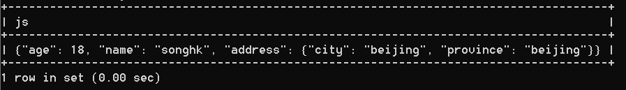](https://imag.fun-ny.cn/image-20211104192516324.png)

当需要检索 JSON 类型的字段中数据的某个具体值时，可以使用 “->” 和“->>”符号。

```mysql
mysql> SELECT js -> '$.name' AS NAME,js -> '$.age' AS age ,js -> '$.address.province' AS province, js -> '$.address.city' AS city
    -> FROM test_json;
+----------+------+-----------+-----------+
| NAME     | age  | province  | city      |
+----------+------+-----------+-----------+
| "songhk" | 18   | "beijing" | "beijing" |
+----------+------+-----------+-----------+
1 row in set (0.00 sec)

# json数组：'$.arry[0]'
```

通过 “->” 和“->>”符号，从 JSON 字段中正确查询出了指定的 JSON 数据的值。

> 更多内容参考https://segmentfault.com/a/1190000024445924

## 12. 空间类型[#](#12-空间类型)

---------------------

MySQL 空间类型扩展支持地理特征的生成、存储和分析。这里的地理特征表示世界上具有位置的任何东西，可以是一个实体，例如一座山；可以是空间，例如一座办公楼；也可以是一个可定义的位置，例如一个十字路口等等。MySQL 中使用`Geometry（几何）`来表示所有地理特征。Geometry 指一个点或点的集合，代表世界上任何具有位置的事物。

MySQL 的空间数据类型（Spatial Data Type）对应于 OpenGIS 类，包括单值类型：GEOMETRY、POINT、LINESTRING、POLYGON 以及集合类型：MULTIPOINT、MULTILINESTRING、MULTIPOLYGON、GEOMETRYCOLLECTION 。

*   Geometry 是所有空间集合类型的基类，其他类型如 POINT、LINESTRING、POLYGON 都是 Geometry 的子类。
    *   Point，顾名思义就是点，有一个坐标值。例如 POINT(121.213342 31.234532)，POINT(30 10)，坐标值支持 DECIMAL 类型，经度（longitude）在前，维度（latitude）在后，用空格分隔。
    *   LineString，线，由一系列点连接而成。如果线从头至尾没有交叉，那就是简单的（simple）；如果起点和终点重叠，那就是封闭的（closed）。例如 LINESTRING(30 10,10 30,40 40)，点与点之间用逗号分隔，一个点中的经纬度用空格分隔，与 POINT 格式一致。
    *   Polygon，多边形。可以是一个实心平面形，即没有内部边界，也可以有空洞，类似纽扣。最简单的就是只有一个外边界的情况，例如 POLYGON((0 0,10 0,10 10, 0 10))。

下面展示几种常见的几何图形元素：

[](https://imag.fun-ny.cn/image-20211104192912988.png)

*   MultiPoint、MultiLineString、MultiPolygon、GeometryCollection 这 4 种类型都是集合类，是多个 Point、LineString 或 Polygon 组合而成。

下面展示的是多个同类或异类几何图形元素的组合：

[](https://imag.fun-ny.cn/image-20211104193330204.png)

## 13. 小结及选择建议[#](#13-小结及选择建议)

---------------------------

在定义数据类型时，如果确定是`整数`，就用 `INT`； 如果是`小数`，一定用定点数类型 `DECIMAL(M,D)`； 如果是日期与时间，就用 `DATETIME`。

这样做的好处是，首先确保你的系统不会因为数据类型定义出错。不过，凡事都是有两面的，可靠性好，并不意味着高效。比如，TEXT 虽然使用方便，但是效率不如 CHAR(M) 和 VARCHAR(M)。

关于字符串的选择，建议参考如下阿里巴巴的《Java 开发手册》规范：

**阿里巴巴《Java 开发手册》之 MySQL 数据库：**

*   任何字段如果为非负数，必须是 UNSIGNED
*   【`强制`】小数类型为 DECIMAL，禁止使用 FLOAT 和 DOUBLE。
    *   说明：在存储的时候，FLOAT 和 DOUBLE 都存在精度损失的问题，很可能在比较值的时候，得到不正确的结果。如果存储的数据范围超过 DECIMAL 的范围，建议将数据拆成整数和小数并分开存储。
*   【`强制`】如果存储的字符串长度几乎相等，使用 CHAR 定长字符串类型。
*   【`强制`】VARCHAR 是可变长字符串，不预先分配存储空间，长度不要超过 5000。如果存储长度大于此值，定义字段类型为 TEXT，独立出来一张表，用主键来对应，避免影响其它字段索引效率。

第 13 章_约束
=========

## 1. 约束 (constraint) 概述[#](#1-约束constraint概述)

-------------------------------------------

### 1.1 为什么需要约束[#](#11-为什么需要约束)

数据完整性（Data Integrity）是指数据的精确性（Accuracy）和可靠性（Reliability）。它是防止数据库中存在不符合语义规定的数据和防止因错误信息的输入输出造成无效操作或错误信息而提出的。

为了保证数据的完整性，SQL 规范以约束的方式对**表数据进行额外的条件限制**。从以下四个方面考虑：

*   `实体完整性（Entity Integrity）`：例如，同一个表中，不能存在两条完全相同无法区分的记录
*   `域完整性（Domain Integrity）`：例如：年龄范围 0-120，性别范围 “男 / 女”
*   `引用完整性（Referential Integrity）`：例如：员工所在部门，在部门表中要能找到这个部门
*   `用户自定义完整性（User-defined Integrity）`：例如：用户名唯一、密码不能为空等，本部门经理的工资不得高于本部门职工的平均工资的 5 倍。

### 1.2 什么是约束[#](#12-什么是约束)

约束是表级的强制规定。

可以在**创建表时规定约束（通过 CREATE TABLE 语句）**，或者在**表创建之后通过 ALTER TABLE 语句规定约束**。

### 1.3 约束的分类[#](#13-约束的分类)

*   **根据约束数据列的限制，**约束可分为：
    *   **单列约束**：每个约束只约束一列
    *   **多列约束**：每个约束可约束多列数据
*   **根据约束的作用范围**，约束可分为：
    *   **列级约束**：只能作用在一个列上，跟在列的定义后面
    *   **表级约束**：可以作用在多个列上，不与列一起，而是单独定义

```
位置			支持的约束类型					是否可以起约束名
列级约束：	列的后面		语法都支持，但外键没有效果		不可以
表级约束：	所有列的下面	   默认和非空不支持，其他支持	   可以（主键没有效果）
```

*   **根据约束起的作用**，约束可分为：
    *   **NOT NULL** **非空约束，规定某个字段不能为空**
    *   **UNIQUE** **唯一约束**，**规定某个字段在整个表中是唯一的**
    *   **PRIMARY KEY 主键 (非空且唯一) 约束**
    *   **FOREIGN KEY** **外键约束**
    *   **CHECK** **检查约束**
    *   **DEFAULT** **默认值约束**

> 注意： MySQL 不支持 check 约束，但可以使用 check 约束，而没有任何效果

### 1.4 查看某个表已有的约束

```mysql
#information_schema数据库名（系统库）
#table_constraints表名称（专门存储各个表的约束）
SELECT * FROM information_schema.table_constraints 
WHERE table_name = '表名称';
```

## 2. 非空约束[#](#2-非空约束)

-------------------

### 2.1 作用[#](#21-作用)

限定某个字段 / 某列的值不允许为空

[](https://imag.fun-ny.cn/1555426972098.png)

### 2.2 关键字`NOT NULL`[#](#22-关键字)

`NOT NULL`

### 2.3 特点[#](#23-特点)

*   默认，所有的类型的值都可以是 NULL，包括 INT、FLOAT 等数据类型

*   非空约束只能出现在表对象的列上，只能某个列单独限定非空，不能组合非空

*   一个表可以有很多列都分别限定了非空

*   空字符串''不等于 NULL，0 也不等于 NULL

### 2.4 添加非空约束[#](#24-添加非空约束)

（1）建表时

```mysql
CREATE TABLE 表名称(
	字段名  数据类型,
    字段名  数据类型 NOT NULL,  
    字段名  数据类型 NOT NULL
);
```

举例：

```mysql
CREATE TABLE emp(
id INT(10) NOT NULL,
NAME VARCHAR(20) NOT NULL,
sex CHAR NULL
);
```

```mysql
CREATE TABLE student(
	sid int,
    sname varchar(20) not null,
    tel char(11) ,
    cardid char(18) not null
);
```

```mysql
insert into student values(1,'张三','13710011002','110222198912032545'); #成功

insert into student values(2,'李四','13710011002',null);#身份证号为空
ERROR 1048 (23000): Column 'cardid' cannot be null

insert into student values(2,'李四',null,'110222198912032546');#成功，tel允许为空

insert into student values(3,null,null,'110222198912032547');#失败
ERROR 1048 (23000): Column 'sname' cannot be null
```

（2）建表后

```mysql
alter table 表名称 modify 字段名 数据类型 not null;
```

举例：

```mysql
ALTER TABLE emp
MODIFY sex VARCHAR(30) NOT NULL;
```

```mysql
alter table student modify sname varchar(20) not null;
```

### 2.5 删除非空约束[#](#25-删除非空约束)

```mysql
alter table 表名称 modify 字段名 数据类型 NULL;#去掉not null，相当于修改某个非注解字段，该字段允许为空

或 

alter table 表名称 modify 字段名 数据类型;#去掉not null，相当于修改某个非注解字段，该字段允许为空
```

举例：

```mysql
ALTER TABLE emp
MODIFY sex VARCHAR(30) NULL;
```

```mysql
ALTER TABLE emp
MODIFY NAME VARCHAR(15) DEFAULT 'abc' NULL;
```

## 3. 唯一性约束[#](#3-唯一性约束)

---------------------

### 3.1 作用[#](#31-作用)

用来限制某个字段 / 某列的值不能重复。

[](https://imag.fun-ny.cn/1555427198811.png)

### 3.2 关键字`UNIQUE`[#](#32-关键字)

UNIQUE

### 3.3 特点[#](#33-特点)

*   同一个表可以有多个唯一约束。
*   唯一约束可以是某一个列的值唯一，也可以多个列组合的值唯一。
*   **唯一性约束允许列值为空，而且可以多次添加NULL**。
*   在创建唯一约束的时候，如果不给唯一约束命名，就默认和列名相同。
*   **MySQL 会给唯一约束的列上默认创建一个唯一索引。**

### 3.4 添加唯一约束[#](#34-添加唯一约束)

（1）建表时

```mysql
create table 表名称(
	字段名  数据类型,
    字段名  数据类型  unique,  
    字段名  数据类型  unique key,
    字段名  数据类型
);
create table 表名称(
	字段名  数据类型,
    字段名  数据类型,  
    字段名  数据类型,
    [constraint 约束名] unique key(字段名)
);
```

举例：

```mysql
create table student(
	sid int,
    sname varchar(20),
    tel char(11) unique,
    cardid char(18) unique key
);
```

```mysql
CREATE TABLE t_course(
	cid INT UNIQUE,
	cname VARCHAR(100) UNIQUE,
	description VARCHAR(200)
);
```

```mysql
CREATE TABLE USER(
 id INT NOT NULL,
 NAME VARCHAR(25),
 PASSWORD VARCHAR(16),
 -- 使用表级约束语法
 CONSTRAINT uk_name_pwd UNIQUE(NAME,PASSWORD)  -- 复合约束
);
```

> 表示用户名和密码组合不能重复

```mysql
insert into student values(1,'张三','13710011002','101223199012015623');
insert into student values(2,'李四','13710011003','101223199012015624');
```

```mysql
mysql> select * from student;
+-----+-------+-------------+--------------------+
| sid | sname | tel         | cardid             |
+-----+-------+-------------+--------------------+
|   1 | 张三  | 13710011002 | 101223199012015623 |
|   2 | 李四  | 13710011003 | 101223199012015624 |
+-----+-------+-------------+--------------------+
2 rows in set (0.00 sec)
```

```mysql
insert into student values(3,'王五','13710011004','101223199012015624'); #身份证号重复
ERROR 1062 (23000): Duplicate entry '101223199012015624' for key 'cardid'

insert into student values(3,'王五','13710011003','101223199012015625'); 
ERROR 1062 (23000): Duplicate entry '13710011003' for key 'tel'
```

（2）建表后指定唯一键约束

```mysql
#字段列表中如果是一个字段，表示该列的值唯一。如果是两个或更多个字段，那么复合唯一，即多个字段的组合是唯一的
#方式1：
alter table 表名称 add unique key(字段列表);
```

```mysql
#方式2：
alter table 表名称 modify 字段名 字段类型 unique;
```

举例：

```mysql
ALTER TABLE USER 
ADD UNIQUE(NAME,PASSWORD);
```

```mysql
ALTER TABLE USER 
ADD CONSTRAINT uk_name_pwd UNIQUE(NAME,PASSWORD);
```

```mysql
ALTER TABLE USER 
MODIFY NAME VARCHAR(20) UNIQUE;
```

举例：

```mysql
create table student(
	sid int primary key,
    sname varchar(20),
    tel char(11) ,
    cardid char(18) 
);
```

```mysql
alter table student add unique key(tel);
alter table student add unique key(cardid);
```

### 3.5 关于复合唯一约束[#](#35-关于复合唯一约束)

```mysql
create table 表名称(
	字段名  数据类型,
    字段名  数据类型,  
    字段名  数据类型,
    unique key(字段列表) #字段列表中写的是多个字段名，多个字段名用逗号分隔，表示那么是复合唯一，即多个字段的组合是唯一的
);
```

```mysql
#学生表
create table student(
	sid int,	#学号
    sname varchar(20),			#姓名
    tel char(11) unique key,  #电话
    cardid char(18) unique key #身份证号
);

#课程表
create table course(
	cid int,  #课程编号
    cname varchar(20)     #课程名称
);

#选课表
create table student_course(
    id int,
	sid int,
    cid int,
    score int,
    unique key(sid,cid)  #复合唯一
);
```

```mysql
insert into student values(1,'张三','13710011002','101223199012015623');#成功
insert into student values(2,'李四','13710011003','101223199012015624');#成功
insert into course values(1001,'Java'),(1002,'MySQL');#成功
```

```mysql
mysql> select * from student;
+-----+-------+-------------+--------------------+
| sid | sname | tel         | cardid             |
+-----+-------+-------------+--------------------+
|   1 | 张三  | 13710011002 | 101223199012015623 |
|   2 | 李四  | 13710011003 | 101223199012015624 |
+-----+-------+-------------+--------------------+
2 rows in set (0.00 sec)

mysql> select * from course;
+------+-------+
| cid  | cname |
+------+-------+
| 1001 | Java  |
| 1002 | MySQL |
+------+-------+
2 rows in set (0.00 sec)
```

```mysql
insert into student_course values
(1, 1, 1001, 89),
(2, 1, 1002, 90),
(3, 2, 1001, 88),
(4, 2, 1002, 56);#成功
```

```mysql
mysql> select * from student_course;
+----+------+------+-------+
| id | sid  | cid  | score |
+----+------+------+-------+
|  1 |    1 | 1001 |    89 |
|  2 |    1 | 1002 |    90 |
|  3 |    2 | 1001 |    88 |
|  4 |    2 | 1002 |    56 |
+----+------+------+-------+
4 rows in set (0.00 sec)
```

```mysql
insert into student_course values (5, 1, 1001, 88);#失败

#ERROR 1062 (23000): Duplicate entry '1-1001' for key 'sid'   违反sid-cid的复合唯一
```

### 3.5 删除唯一约束[#](#35-删除唯一约束)

*   **添加唯一性约束的列上也会自动创建唯一索引**。
*   删除唯一约束只能通过删除唯一索引的方式删除。
*   删除时需要指定唯一索引名，唯一索引名就和唯一约束名一样。
*   如果创建唯一约束时未指定名称，如果是单列，就默认和列名相同；如果是组合列，那么默认和 () 中排在第一个的列名相同。也可以自定义唯一性约束名。

```mysql
SELECT * FROM information_schema.table_constraints WHERE table_name = '表名'; #查看都有哪些约束
```

```mysql
ALTER TABLE USER 
DROP INDEX uk_name_pwd;
```

> 注意：可以通过 `show index from 表名称;` 查看表的索引

## 4. PRIMARY KEY 约束[#](#4-primary-key-约束)

---------------------------------------

### 4.1 作用[#](#41-作用)

用来唯一标识表中的一行记录。

### 4.2 关键字`primary key`[#](#42-关键字)

`primary key`

### 4.3 特点[#](#43-特点)

*   主键约束相当于**唯一约束 + 非空约束的组合**，主键约束列**不允许重复**，也不**允许出现空值**。

[](https://imag.fun-ny.cn/1555427492244.png)

*   一个表**最多只能有一个主键约束**，建立主键约束可以在列级别创建，也可以在表级别上创建。

*   主键约束对应着表中的一列或者多列（复合主键）

*   如果是多列组合的**复合主键约束**，那么**这些列都不允许为空值**，并且组合的值不允许重复。

*   **MySQL 的主键名总是 PRIMARY**，就算自己命名了主键约束名也没用。

*   当创建主键约束时，系统默认会在所在的列或列组合上建立对应的**主键索引**（能够根据主键查询的，就根据主键查询，效率更高）。如果删除主键约束了，主键约束对应的索引就自动删除了。

*   需要注意的一点是，不要修改主键字段的值。因为主键是数据记录的唯一标识，如果修改了主键的值，就有可能会破坏数据的完整性。

### 4.4 添加主键约束[#](#44-添加主键约束)

（1）建表时指定主键约束

```mysql
create table 表名称(
	字段名  数据类型  primary key, #列级模式
    字段名  数据类型,  
    字段名  数据类型  
);
create table 表名称(
	字段名  数据类型,
    字段名  数据类型,  
    字段名  数据类型,
    [constraint 约束名] primary key(字段名) #表级模式
);
```

举例：

```mysql
create table temp(
	id int primary key,
    name varchar(20)
);
```

```mysql
mysql> desc temp;
+-------+-------------+------+-----+---------+-------+
| Field | Type        | Null | Key | Default | Extra |
+-------+-------------+------+-----+---------+-------+
| id    | int(11)     | NO   | PRI | NULL    |       |
| name  | varchar(20) | YES  |     | NULL    |       |
+-------+-------------+------+-----+---------+-------+
2 rows in set (0.00 sec)
```

```mysql
insert into temp values(1,'张三');#成功
insert into temp values(2,'李四');#成功
```

```mysql
mysql> select * from temp;
+----+------+
| id | name |
+----+------+
|  1 | 张三 |
|  2 | 李四 |
+----+------+
2 rows in set (0.00 sec)
```

```mysql
insert into temp values(1,'张三');#失败
ERROR 1062 (23000): Duplicate（重复） entry（键入，输入） '1' for key 'PRIMARY'


insert into temp values(1,'王五');#失败
ERROR 1062 (23000): Duplicate entry '1' for key 'PRIMARY'

insert into temp values(3,'张三');#成功
```

```mysql
mysql> select * from temp;
+----+------+
| id | name |
+----+------+
|  1 | 张三 |
|  2 | 李四 |
|  3 | 张三 |
+----+------+
3 rows in set (0.00 sec)
```

```mysql
insert into temp values(4,null);#成功


insert into temp values(null,'李琦');#失败
ERROR 1048 (23000): Column 'id' cannot be null
```

```mysql
mysql> select * from temp;
+----+------+
| id | name |
+----+------+
|  1 | 张三 |
|  2 | 李四 |
|  3 | 张三 |
|  4 | NULL |
+----+------+
4 rows in set (0.00 sec)
```

```mysql
#演示一个表建立两个主键约束
create table temp(
	id int primary key,
    name varchar(20) primary key
);
ERROR 1068 (42000): Multiple（多重的） primary key defined（定义）
```

再举例：

*   列级约束

```mysql
CREATE TABLE emp4(
id INT PRIMARY KEY AUTO_INCREMENT ,
NAME VARCHAR(20)
);
```

*   表级约束

```mysql
CREATE TABLE emp5(
id INT NOT NULL AUTO_INCREMENT,
NAME VARCHAR(20),
pwd VARCHAR(15),
CONSTRAINT emp5_id_pk PRIMARY KEY(id)
);
```

（2）建表后增加主键约束

```mysql
ALTER TABLE 表名称 ADD PRIMARY KEY(字段列表); #字段列表可以是一个字段，也可以是多个字段，如果是多个字段的话，是复合主键
```

```mysql
ALTER TABLE student ADD PRIMARY KEY (sid);
```

```mysql
ALTER TABLE emp5 ADD PRIMARY KEY(NAME,pwd);
```

### 4.5 关于复合主键[#](#45-关于复合主键)

```mysql
create table 表名称(
	字段名  数据类型,
    字段名  数据类型,  
    字段名  数据类型,
    primary key(字段名1,字段名2)  #表示字段1和字段2的组合是唯一的，也可以有更多个字段
);
```

```mysql
#学生表
create table student(
	sid int primary key,  #学号
    sname varchar(20)     #学生姓名
);

#课程表
create table course(
	cid int primary key,  #课程编号
    cname varchar(20)     #课程名称
);

#选课表
create table student_course(
	sid int,
    cid int,
    score int,
    primary key(sid,cid)  #复合主键
);
```

```mysql
insert into student values(1,'张三'),(2,'李四');
insert into course values(1001,'Java'),(1002,'MySQL');
```

```mysql
mysql> select * from student;
+-----+-------+
| sid | sname |
+-----+-------+
|   1 | 张三  |
|   2 | 李四  |
+-----+-------+
2 rows in set (0.00 sec)

mysql> select * from course;
+------+-------+
| cid  | cname |
+------+-------+
| 1001 | Java  |
| 1002 | MySQL |
+------+-------+
2 rows in set (0.00 sec)
```

```mysql
insert into student_course values(1, 1001, 89),(1,1002,90),(2,1001,88),(2,1002,56);
```

```mysql
mysql> select * from student_course;
+-----+------+-------+
| sid | cid  | score |
+-----+------+-------+
|   1 | 1001 |    89 |
|   1 | 1002 |    90 |
|   2 | 1001 |    88 |
|   2 | 1002 |    56 |
+-----+------+-------+
4 rows in set (0.00 sec)
```

```mysql
insert into student_course values(1, 1001, 100);
ERROR 1062 (23000): Duplicate entry '1-1001' for key 'PRIMARY'
```

```mysql
mysql> desc student_course;
+-------+---------+------+-----+---------+-------+
| Field | Type    | Null | Key | Default | Extra |
+-------+---------+------+-----+---------+-------+
| sid   | int(11) | NO   | PRI | NULL    |       |
| cid   | int(11) | NO   | PRI | NULL    |       |
| score | int(11) | YES  |     | NULL    |       |
+-------+---------+------+-----+---------+-------+
3 rows in set (0.00 sec)
```

*   再举例

```mysql
CREATE TABLE emp6(
id INT NOT NULL,
NAME VARCHAR(20),
pwd VARCHAR(15),
CONSTRAINT emp7_pk PRIMARY KEY(NAME,pwd)
);
```

### 4.6 删除主键约束[#](#46-删除主键约束)

```mysql
alter table 表名称 drop primary key;
```

举例：

```mysql
ALTER TABLE student DROP PRIMARY KEY;
```

```mysql
ALTER TABLE emp5 DROP PRIMARY KEY;
```

> 说明：删除主键约束，不需要指定主键名，因为一个表只有一个主键，删除主键约束后，非空还存在。

## 5. 自增列：AUTO_INCREMENT[#](#5-自增列auto_increment)

----------------------------------------------

### 5.1 作用[#](#51-作用)

某个字段的值自增

### 5.2 关键字`auto_increment`[#](#52-关键字)

`auto_increment`

### 5.3 特点和要求[#](#53-特点和要求)

（1）**一个表最多只能有一个自增长列**

（2）当需要产生唯一标识符或顺序值时，可设置自增长

（3）**自增长列约束的列必须是键列（主键列，唯一键列）**

（4）自增约束的列的数据类型必须是整数类型

（5）**如果自增列指定了 0 和 null，会在当前最大值的基础上自增**；如果自增列手动指定了具体值，直接赋值为具体值。

错误演示：

```mysql
create table employee(
	eid int auto_increment,   -- 不是主键/唯一约束
    ename varchar(20)
);
# ERROR 1075 (42000): Incorrect table definition; there can be only one auto column and it must be defined as a key
```

```mysql
create table employee(
	eid int primary key,
    ename varchar(20) unique key auto_increment
);
# ERROR 1063 (42000): Incorrect column specifier for column 'ename'  因为ename不是整数类型
```

### 5.4 如何指定自增约束[#](#54-如何指定自增约束)

> 查看当前表**AUTO_INCREMENT** 的值
> ```mysql
>  SELECT auto_increment FROM information_schema.tables where table_schema="dbName" and table_name="tableName";
> ```


**（1）建表时**

```mysql
create table 表名称(
	字段名  数据类型  primary key auto_increment,
    字段名  数据类型  unique key not null,  
    字段名  数据类型  unique key,
    字段名  数据类型  not null default 默认值, 
);
create table 表名称(
	字段名  数据类型 default 默认值 ,
    字段名  数据类型 unique key auto_increment,  
    字段名  数据类型 not null default 默认值,,
    primary key(字段名)
);
```

```mysql
create table employee(
	eid int primary key auto_increment,
    ename varchar(20)
);
```

```mysql
mysql> desc employee;
+-------+-------------+------+-----+---------+----------------+
| Field | Type        | Null | Key | Default | Extra          |
+-------+-------------+------+-----+---------+----------------+
| eid   | int(11)     | NO   | PRI | NULL    | auto_increment |
| ename | varchar(20) | YES  |     | NULL    |                |
+-------+-------------+------+-----+---------+----------------+
2 rows in set (0.00 sec)
```

**（2）建表后**

```mysql
alter table 表名称 modify 字段名 数据类型 auto_increment;
```

例如：

```mysql
create table employee(
	eid int primary key ,
    ename varchar(20)
);
```

```mysql
alter table employee modify eid int auto_increment;
```

```mysql
mysql> desc employee;
+-------+-------------+------+-----+---------+----------------+
| Field | Type        | Null | Key | Default | Extra          |
+-------+-------------+------+-----+---------+----------------+
| eid   | int(11)     | NO   | PRI | NULL    | auto_increment |
| ename | varchar(20) | YES  |     | NULL    |                |
+-------+-------------+------+-----+---------+----------------+
2 rows in set (0.00 sec)
```

### 5.5 如何删除自增约束[#](#55-如何删除自增约束)

```mysql
#alter table 表名称 modify 字段名 数据类型 auto_increment;#给这个字段增加自增约束

alter table 表名称 modify 字段名 数据类型; #去掉auto_increment相当于删除
```

```mysql
alter table employee modify eid int;
```

```mysql
mysql> desc employee;
+-------+-------------+------+-----+---------+-------+
| Field | Type        | Null | Key | Default | Extra |
+-------+-------------+------+-----+---------+-------+
| eid   | int(11)     | NO   | PRI | NULL    |       |
| ename | varchar(20) | YES  |     | NULL    |       |
+-------+-------------+------+-----+---------+-------+
2 rows in set (0.00 sec)
```

### 5.6 MySQL 8.0 新特性—自增变量的持久化[#](#56-mysql-80新特性自增变量的持久化)

在 MySQL 8.0 之前，自增主键 AUTO_INCREMENT 的值如果大于 max(primary key)+1，在 MySQL 重启后，会重置 AUTO_INCREMENT=max(primary key)+1，这种现象在某些情况下会导致业务主键冲突或者其他难以发现的问题。  
下面通过案例来对比不同的版本中自增变量是否持久化。  
在 MySQL 5.7 版本中，测试步骤如下：  
创建的数据表中包含自增主键的 id 字段，语句如下：

```mysql
CREATE TABLE test1(
id INT PRIMARY KEY AUTO_INCREMENT
);
```

插入 4 个空值，执行如下：

```mysql
INSERT INTO test1
VALUES(0),(0),(0),(0);
```

查询数据表 test1 中的数据，结果如下：

```mysql
mysql> SELECT * FROM test1;
+----+
| id |
+----+
|  1 |
|  2 |
|  3 |
|  4 |
+----+
4 rows in set (0.00 sec)
```

删除 id 为 4 的记录，语句如下：

```mysql
DELETE FROM test1 WHERE id = 4;
```

再次插入一个空值，语句如下：

```mysql
INSERT INTO test1 VALUES(0);
```

查询此时数据表 test1 中的数据，结果如下：

```mysql
mysql> SELECT * FROM test1;
+----+
| id |
+----+
|  1 |
|  2 |
|  3 |
|  5 |
+----+
4 rows in set (0.00 sec)
```

从结果可以看出，虽然删除了 id 为 4 的记录，但是再次插入空值时，并没有重用被删除的 4，而是分配了 5。  
删除 id 为 5 的记录，结果如下：

```mysql
DELETE FROM test1 where id=5;
```

**重启数据库**，重新插入一个空值。

```mysql
INSERT INTO test1 values(0);
```

再次查询数据表 test1 中的数据，结果如下：

```mysql
mysql> SELECT * FROM test1;
+----+
| id |
+----+
|  1 |
|  2 |
|  3 |
|  4 |
+----+
4 rows in set (0.00 sec)
```

从结果可以看出，新插入的 0 值分配的是 4，按照重启前的操作逻辑，此处应该分配 6。出现上述结果的主要原因是自增主键没有持久化。  
在 MySQL 5.7 系统中，对于自增主键的分配规则，是由 InnoDB 数据字典内部一个`计数器`来决定的，而该计数器只在`内存中维护`，并不会持久化到磁盘中。当数据库重启时，该计数器会被初始化。

在 MySQL 8.0 版本中，上述测试步骤最后一步的结果如下：

```mysql
mysql> SELECT * FROM test1;
+----+
| id |
+----+
|  1 |
|  2 |
|  3 |
|  6 |
+----+
4 rows in set (0.00 sec)
```

从结果可以看出，自增变量已经持久化了。

MySQL 8.0 将自增主键的计数器持久化到`重做日志`中。每次计数器发生改变，都会将其写入重做日志中。如果数据库重启，InnoDB 会根据重做日志中的信息来初始化计数器的内存值。


## 6. FOREIGN KEY 约束[#](#6-foreign-key-约束)

---------------------------------------

### 6.1 作用[#](#61-作用)

限定某个表的某个字段的引用完整性。

比如：员工表的员工所在部门的选择，必须在部门表能找到对应的部分。

[](https://imag.fun-ny.cn/1555428214706.png)

### 6.2 关键字`FOREIGN KEY`[#](#62-关键字)

`FOREIGN KEY`

### 6.3 主表和从表 / 父表和子表[#](#63-主表和从表父表和子表)

主表（父表）：被引用的表，被参考的表

从表（子表）：引用别人的表，参考别人的表

例如：员工表的员工所在部门这个字段的值要参考部门表：部门表是主表，员工表是从表。

例如：学生表、课程表、选课表：选课表的学生和课程要分别参考学生表和课程表，学生表和课程表是主表，选课表是从表。

### 6.4 特点[#](#64-特点)

（1）**从表的外键列，必须引用 / 参考主表的主键或唯一约束的列**

 为什么？因为被依赖 / 被参考的值必须是唯一的

（2）在创建外键约束时，如果不给外键约束命名，**默认名不是列名，而是自动产生一个外键名**（例如 student_ibfk_1;），也可以指定外键约束名。

（3）创建 (CREATE) 表时就指定外键约束的话，先创建主表，再创建从表

（4）**删表时，先删从表（或先删除外键约束），再删除主表**

（5）当主表的记录被从表参照时，主表的记录将不允许删除，如果要删除数据，需要先删除从表中依赖该记录的数据，然后才可以删除主表的数据

（6）在 “从表” 中指定外键约束，并且一个表可以建立多个外键约束

（7）从表的外键列与主表被参照的列名字可以不相同，但是数据类型必须一样，逻辑意义一致。如果类型不一样，创建子表时，就会出现错误 “ERROR 1005 (HY000): Can't create table'database.tablename'(errno: 150)”。

 例如：都是表示部门编号，都是 int 类型。

（8）**当创建外键约束时，系统默认会在所在的列上建立对应的普通索引**。但是索引名是外键的约束名。（根据外键查询效率很高）

（9）删除外键约束后，必须`手动`删除对应的索引

### 6.5 添加外键约束[#](#65-添加外键约束)

（1）建表时

```mysql
create table 主表名称(
	字段1  数据类型  primary key,
    字段2  数据类型
);

create table 从表名称(
	字段1  数据类型  primary key,
    字段2  数据类型,
    [CONSTRAINT <外键约束名称>] FOREIGN KEY（从表的某个字段) references 主表名(被参考字段)  -- 关联的主表字段必须包含唯一约束【主键默认唯一】
);
#(从表的某个字段)的数据类型必须与主表名(被参考字段)的数据类型一致，逻辑意义也一样
#(从表的某个字段)的字段名可以与主表名(被参考字段)的字段名一样，也可以不一样

-- FOREIGN KEY: 在表级指定子表中的列
-- REFERENCES: 标示在父表中的列
```

```mysql
create table dept( #主表
	did int primary key,		#部门编号
    dname varchar(50)			#部门名称
);

create table emp(#从表
	eid int primary key,  #员工编号
    ename varchar(5),     #员工姓名
    deptid int,				#员工所在的部门
    foreign key (deptid) references dept(did)   #在从表中指定外键约束
    #emp表的deptid和和dept表的did的数据类型一致，意义都是表示部门的编号
);

说明：
（1）主表dept必须先创建成功，然后才能创建emp表，指定外键成功。
（2）删除表时，先删除从表emp，再删除主表dept
```

（2）建表后

一般情况下，表与表的关联都是提前设计好了的，因此，会在创建表的时候就把外键约束定义好。不过，如果需要修改表的设计（比如添加新的字段，增加新的关联关系），但没有预先定义外键约束，那么，就要用修改表的方式来补充定义。

格式：

```mysql
ALTER TABLE 从表名 ADD [CONSTRAINT 约束名] FOREIGN KEY (从表的字段) REFERENCES 主表名(被引用字段) [on update xx][on delete xx];
```

举例：

```mysql
ALTER TABLE emp1
ADD [CONSTRAINT emp_dept_id_fk] FOREIGN KEY(dept_id) REFERENCES dept(dept_id);
```

举例：

```mysql
create table dept(
	did int primary key,		#部门编号
    dname varchar(50)			#部门名称
);

create table emp(
	eid int primary key,  #员工编号
    ename varchar(5),     #员工姓名
    deptid int				#员工所在的部门
);
#这两个表创建时，没有指定外键的话，那么创建顺序是随意
```

```mysql
alter table emp add foreign key (deptid) references dept(did);
```

### 6.6 演示问题[#](#66-演示问题)

（1）失败：不是键列

```mysql
create table dept(
	did int ,		#部门编号
    dname varchar(50)			#部门名称
);

create table emp(
	eid int primary key,  #员工编号
    ename varchar(5),     #员工姓名
    deptid int,				#员工所在的部门
    foreign key (deptid) references dept(did)
);
#ERROR 1215 (HY000): Cannot add foreign key constraint  原因是dept的did不是键列【唯一约束/主键约束】
```

（2）失败：数据类型不一致

```mysql
create table dept(
	did int primary key,		#部门编号
    dname varchar(50)			#部门名称
);

create table emp(
	eid int primary key,  #员工编号
    ename varchar(5),     #员工姓名
    deptid char,				#员工所在的部门
    foreign key (deptid) references dept(did)
);
#ERROR 1215 (HY000): Cannot add foreign key constraint  原因是从表的deptid字段和主表的did字段的数据类型不一致，并且要它俩的逻辑意义一致
```

（3）成功，两个表字段名一样

```mysql
create table dept(
	did int primary key,		#部门编号
    dname varchar(50)			#部门名称
);

create table emp(
	eid int primary key,  #员工编号
    ename varchar(5),     #员工姓名
    did int,				#员工所在的部门
    foreign key (did) references dept(did)  
    #emp表的deptid和和dept表的did的数据类型一致，意义都是表示部门的编号
    #是否重名没问题，因为两个did在不同的表中
);
```

（4）添加、删除、修改问题

```mysql
create table dept(
	did int primary key,		#部门编号
    dname varchar(50)			#部门名称
);

create table emp(
	eid int primary key,  #员工编号
    ename varchar(5),     #员工姓名
    deptid int,				#员工所在的部门
    foreign key (deptid) references dept(did)  
    #emp表的deptid和和dept表的did的数据类型一致，意义都是表示部门的编号
);
```

```mysql
insert into dept values(1001,'教学部');
insert into dept values(1003, '财务部');

insert into emp values(1,'张三',1001); #添加从表记录成功，在添加这条记录时，要求部门表有1001部门

insert into emp values(2,'李四',1005);#添加从表记录失败
ERROR 1452 (23000): Cannot add（添加） or update（修改） a child row: a foreign key constraint fails (`atguigudb`.`emp`, CONSTRAINT `emp_ibfk_1` FOREIGN KEY (`deptid`) REFERENCES `dept` (`did`)) 从表emp添加记录失败，因为主表dept没有1005部门
```

```mysql
mysql> select * from dept;
+------+--------+
| did  | dname  |
+------+--------+
| 1001 | 教学部  |
| 1003 | 财务部  |
+------+--------+
2 rows in set (0.00 sec)

mysql> select * from emp;
+-----+-------+--------+
| eid | ename | deptid |
+-----+-------+--------+
|   1 | 张三   |   1001 |
+-----+-------+--------+
1 row in set (0.00 sec)
```

```mysql
update emp set deptid = 1002 where eid = 1;#修改从表失败 
ERROR 1452 (23000): Cannot add（添加） or update（修改） a child row（子表的记录）: a foreign key constraint fails（外键约束失败） (`atguigudb`.`emp`, CONSTRAINT `emp_ibfk_1` FOREIGN KEY (`deptid`) REFERENCES `dept` (`did`))  #部门表did字段现在没有1002的值，所以员工表中不能修改员工所在部门deptid为1002

update dept set did = 1002 where did = 1001;#修改主表失败
ERROR 1451 (23000): Cannot delete（删除） or update（修改） a parent row（父表的记录）: a foreign key constraint fails (`atguigudb`.`emp`, CONSTRAINT `emp_ibfk_1` FOREIGN KEY (`deptid`) REFERENCES `dept` (`did`)) #部门表did的1001字段已经被emp引用了，所以部门表的1001字段就不能修改了。

update dept set did = 1002 where did = 1003;#修改主表成功  因为部门表的1003部门没有被emp表引用，所以可以修改
```

```mysql
delete from dept where did=1001; #删除主表失败
ERROR 1451 (23000): Cannot delete（删除） or update（修改） a parent row（父表记录）: a foreign key constraint fails (`atguigudb`.`emp`, CONSTRAINT `emp_ibfk_1` FOREIGN KEY (`deptid`) REFERENCES `dept` (`did`))  #因为部门表did的1001字段已经被emp引用了，所以部门表的1001字段对应的记录就不能被删除
```

总结：约束关系是针对双方的

*   添加了外键约束后，主表的修改和删除数据受约束

*   添加了外键约束后，从表的添加和修改数据受约束

*   在从表上建立外键，要求主表必须存在

*   删除主表时，要求从表从表先删除，或将从表中外键引用该主表的关系先删除

### 6.7 约束等级[#](#67-约束等级)

*   `Cascade方式`：在父表上 update/delete 记录时，同步 update/delete 掉子表的匹配记录

*   `Set null方式`：在父表上 update/delete 记录时，将子表上匹配记录的列设为 null，但是要注意子表的外键列不能为 not null

*   `No action方式`：如果子表中有匹配的记录，则不允许对父表对应候选键进行 update/delete 操作

*   `Restrict方式`：同 no action， 都是立即检查外键约束

*   `Set default方式`（在可视化工具 SQLyog 中可能显示空白）：父表有变更时，子表将外键列设置成一个默认的值，但 Innodb 不能识别

如果没有指定等级，就相当于 Restrict 方式。

对于外键约束，最好是采用: `ON UPDATE CASCADE ON DELETE RESTRICT` 的方式。

（1）演示 1：`on update cascade on delete set null`

```mysql
create table dept(
	did int primary key,		#部门编号
    dname varchar(50)			#部门名称
);

create table emp(
	eid int primary key,  #员工编号
    ename varchar(5),     #员工姓名
    deptid int,				#员工所在的部门
    foreign key (deptid) references dept(did)  on update cascade on delete set null
    #把修改操作设置为级联修改等级，把删除操作设置为set null等级
);
```

```mysql
insert into dept values(1001,'教学部');
insert into dept values(1002, '财务部');
insert into dept values(1003, '咨询部');


insert into emp values(1,'张三',1001); #在添加这条记录时，要求部门表有1001部门
insert into emp values(2,'李四',1001);
insert into emp values(3,'王五',1002);
```

```mysql
mysql> select * from dept;

mysql> select * from emp;
```

```mysql
#修改主表成功，从表也跟着修改，修改了主表被引用的字段1002为1004，从表的引用字段就跟着修改为1004了
mysql> update dept set did = 1004 where did = 1002;
Query OK, 1 row affected (0.00 sec)
Rows matched: 1  Changed: 1  Warnings: 0

mysql> select * from dept;
+------+--------+
| did  | dname  |
+------+--------+
| 1001 | 教学部 |
| 1003 | 咨询部 |
| 1004 | 财务部 | #原来是1002，修改为1004
+------+--------+
3 rows in set (0.00 sec)

mysql> select * from emp;
+-----+-------+--------+
| eid | ename | deptid |
+-----+-------+--------+
|   1 | 张三  |   1001 |
|   2 | 李四  |   1001 |
|   3 | 王五  |   1004 | #原来是1002，跟着修改为1004
+-----+-------+--------+
3 rows in set (0.00 sec)
```

```mysql
#删除主表的记录成功，从表对应的字段的值被修改为null
mysql> delete from dept where did = 1001;
Query OK, 1 row affected (0.01 sec)

mysql> select * from dept;
+------+--------+
| did  | dname  | #记录1001部门被删除了
+------+--------+
| 1003 | 咨询部  |
| 1004 | 财务部  |
+------+--------+
2 rows in set (0.00 sec)

mysql> select * from emp;
+-----+-------+--------+
| eid | ename | deptid |
+-----+-------+--------+
|   1 | 张三  |   NULL | #原来引用1001部门的员工，deptid字段变为null
|   2 | 李四  |   NULL |
|   3 | 王五  |   1004 |
+-----+-------+--------+
3 rows in set (0.00 sec)
```

（2）演示 2：`on update set null on delete cascade`

```mysql
create table dept(
	did int primary key,		#部门编号
    dname varchar(50)			#部门名称
);

create table emp(
	eid int primary key,  #员工编号
    ename varchar(5),     #员工姓名
    deptid int,				#员工所在的部门
    foreign key (deptid) references dept(did)  on update set null on delete cascade
    #把修改操作设置为set null等级，把删除操作设置为级联删除等级
);
```

```mysql
insert into dept values(1001,'教学部');
insert into dept values(1002, '财务部');
insert into dept values(1003, '咨询部');

insert into emp values(1,'张三',1001); #在添加这条记录时，要求部门表有1001部门
insert into emp values(2,'李四',1001);
insert into emp values(3,'王五',1002);
```

```mysql
mysql> select * from dept;
+------+--------+
| did  | dname  |
+------+--------+
| 1001 | 教学部 |
| 1002 | 财务部 |
| 1003 | 咨询部 |
+------+--------+
3 rows in set (0.00 sec)

mysql> select * from emp;
+-----+-------+--------+
| eid | ename | deptid |
+-----+-------+--------+
|   1 | 张三  |   1001 |
|   2 | 李四  |   1001 |
|   3 | 王五  |   1002 |
+-----+-------+--------+
3 rows in set (0.00 sec)
```

```mysql
#修改主表，从表对应的字段设置为null
mysql> update dept set did = 1004 where did = 1002;
Query OK, 1 row affected (0.00 sec)
Rows matched: 1  Changed: 1  Warnings: 0

mysql> select * from dept;
+------+--------+
| did  | dname  |
+------+--------+
| 1001 | 教学部 |
| 1003 | 咨询部 |
| 1004 | 财务部 | #原来did是1002
+------+--------+
3 rows in set (0.00 sec)

mysql> select * from emp;
+-----+-------+--------+
| eid | ename | deptid |
+-----+-------+--------+
|   1 | 张三  |   1001 |
|   2 | 李四  |   1001 |
|   3 | 王五  |   NULL | #原来deptid是1002，因为部门表1002被修改了，1002没有对应的了，就设置为null
+-----+-------+--------+
3 rows in set (0.00 sec)
```

```mysql
#删除主表的记录成功，主表的1001行被删除了，从表相应的记录也被删除了
mysql> delete from dept where did=1001;
Query OK, 1 row affected (0.00 sec)

mysql> select * from dept;
+------+--------+
| did  | dname  | #部门表中1001部门被删除
+------+--------+
| 1003 | 咨询部 |
| 1004 | 财务部 |
+------+--------+
2 rows in set (0.00 sec)

mysql> select * from emp;
+-----+-------+--------+
| eid | ename | deptid |#原来1001部门的员工也被删除了
+-----+-------+--------+
|   3 | 王五  |   NULL |
+-----+-------+--------+
1 row in set (0.00 sec)
```

（3）演示：`on update cascade on delete cascade`

```mysql
create table dept(
	did int primary key,		#部门编号
    dname varchar(50)			#部门名称
);

create table emp(
	eid int primary key,  #员工编号
    ename varchar(5),     #员工姓名
    deptid int,				#员工所在的部门
    foreign key (deptid) references dept(did)  on update cascade on delete cascade
    #把修改操作设置为级联修改等级，把删除操作也设置为级联删除等级
);
```

```mysql
insert into dept values(1001,'教学部');
insert into dept values(1002, '财务部');
insert into dept values(1003, '咨询部');

insert into emp values(1,'张三',1001); #在添加这条记录时，要求部门表有1001部门
insert into emp values(2,'李四',1001);
insert into emp values(3,'王五',1002);
```

```mysql
mysql> select * from dept;
+------+--------+
| did  | dname  |
+------+--------+
| 1001 | 教学部 |
| 1002 | 财务部 |
| 1003 | 咨询部 |
+------+--------+
3 rows in set (0.00 sec)

mysql> select * from emp;
+-----+-------+--------+
| eid | ename | deptid |
+-----+-------+--------+
|   1 | 张三  |   1001 |
|   2 | 李四  |   1001 |
|   3 | 王五  |   1002 |
+-----+-------+--------+
3 rows in set (0.00 sec)
```

```mysql
#修改主表，从表对应的字段自动修改
mysql> update dept set did = 1004 where did = 1002;
Query OK, 1 row affected (0.00 sec)
Rows matched: 1  Changed: 1  Warnings: 0

mysql> select * from dept;
+------+--------+
| did  | dname  |
+------+--------+
| 1001 | 教学部 |
| 1003 | 咨询部 |
| 1004 | 财务部 | #部门1002修改为1004
+------+--------+
3 rows in set (0.00 sec)

mysql> select * from emp;
+-----+-------+--------+
| eid | ename | deptid |
+-----+-------+--------+
|   1 | 张三  |   1001 |
|   2 | 李四  |   1001 |
|   3 | 王五  |   1004 | #级联修改
+-----+-------+--------+
3 rows in set (0.00 sec)
```

```mysql
#删除主表的记录成功，主表的1001行被删除了，从表相应的记录也被删除了
mysql> delete from dept where did=1001;
Query OK, 1 row affected (0.00 sec)

mysql> select * from dept;
+------+--------+
| did  | dname  | #1001部门被删除了
+------+--------+
| 1003 | 咨询部 |
| 1004 | 财务部 | 
+------+--------+
2 rows in set (0.00 sec)

mysql> select * from emp;
+-----+-------+--------+
| eid | ename | deptid |  #1001部门的员工也被删除了
+-----+-------+--------+
|   3 | 王五  |   1004 |
+-----+-------+--------+
1 row in set (0.00 sec)
```

### 6.8 删除外键约束[#](#68-删除外键约束)

流程如下：

```mysql
-- (1)第一步先查看约束名和删除外键约束
SELECT * FROM information_schema.table_constraints WHERE table_name = '表名称';#查看某个表的约束名

ALTER TABLE 从表名 DROP FOREIGN KEY 外键约束名;

-- （2）第二步查看索引名和删除索引。（注意，只能手动删除）
SHOW INDEX FROM 表名称; #查看某个表的索引名

ALTER TABLE 从表名 DROP INDEX 索引名;
```

举例：

```mysql
mysql> SELECT * FROM information_schema.table_constraints WHERE table_name = 'emp';

mysql> alter table emp drop foreign key emp_ibfk_1;
Query OK, 0 rows affected (0.02 sec)
Records: 0  Duplicates: 0  Warnings: 0
```

```mysql
mysql> show index from emp;

mysql> alter table emp drop index deptid;
Query OK, 0 rows affected (0.01 sec)
Records: 0  Duplicates: 0  Warnings: 0

mysql>  show index from emp;
```

### 6.9 开发场景[#](#69-开发场景)

**问题 1：如果两个表之间有关系（一对一、一对多），比如：员工表和部门表（一对多），它们之间是否一定要建外键约束？**

答：不是的

**问题 2：建和不建外键约束有什么区别？**

答：建外键约束，你的操作（创建表、删除表、添加、修改、删除）会受到限制，从语法层面受到限制。例如：在员工表中不可能添加一个员工信息，它的部门的值在部门表中找不到。

不建外键约束，你的操作（创建表、删除表、添加、修改、删除）不受限制，要保证数据的`引用完整性`，只能依`靠程序员的自觉`，或者是`在Java程序中进行限定`。例如：在员工表中，可以添加一个员工的信息，它的部门指定为一个完全不存在的部门。

**问题 3：那么建和不建外键约束和查询有没有关系？**

答：没有

> 在 MySQL 里，外键约束是有成本的，需要消耗系统资源。对于大并发的 SQL 操作，有可能会不适合。比如大型网站的中央数据库，可能会`因为外键约束的系统开销而变得非常慢`。所以， MySQL 允许你不使用系统自带的外键约束，在`应用层面`完成检查数据一致性的逻辑。也就是说，即使你不用外键约束，也要想办法通过应用层面的附加逻辑，来实现外键约束的功能，确保数据的一致性。

### 6.10 阿里开发规范[#](#610-阿里开发规范)

【`强制`】不得使用外键与级联，一切外键概念必须在应用层解决。

说明：（概念解释）学生表中的 student_id 是主键，那么成绩表中的 student_id 则为外键。如果更新学生表中的 student_id，同时触发成绩表中的 student_id 更新，即为级联更新。外键与级联更新适用于`单机低并发`，不适合`分布式`、`高并发集群`；级联更新是强阻塞，存在数据库`更新风暴`的风险；外键影响数据库的`插入速度`。

## 7. CHECK 约束[#](#7-check-约束)

---------------------------

### 7.1 作用[#](#71-作用)

检查某个字段的值是否符号 xx 要求，一般指的是值的范围

### 2、关键字`CHECK`[#](#2关键字)

`CHECK`

### 3、说明：MySQL 5.7 不支持[#](#3说明mysql-57-不支持)

MySQL5.7 可以使用 check 约束，但 check 约束对数据验证没有任何作用。添加数据时，没有任何错误或警告

但是 **MySQL 8.0 中可以使用 check 约束了**。

```mysql
create table employee(
	eid int primary key,
    ename varchar(5),
    gender char check ('男' or '女')
    -- gender char check ( gender ='男' or gender ='女')
);
```

```mysql
insert into employee values(1,'张三','妖');
```

```mysql
mysql> select * from employee;
+-----+-------+--------+
| eid | ename | gender |
+-----+-------+--------+
|   1 | 张三   | 妖     |
+-----+-------+--------+
1 row in set (0.00 sec)
```

*   再举例

```mysql
CREATE TABLE temp(
id INT AUTO_INCREMENT,
NAME VARCHAR(20),
age INT CHECK(age > 20),
PRIMARY KEY(id)
);
```

*   再举例

```mysql
age tinyint check(age >20) 或 sex char(2) check(sex in(‘男’,’女’))
```

*   再举例

```mysql
CHECK(height>=0 AND height<3)
```

## 8. DEFAULT 约束[#](#8-default约束)

------------------------------

### 8.1 作用[#](#81-作用)

给某个字段 / 某列指定默认值，一旦设置默认值，在插入数据时，如果此字段没有显式赋值，则赋值为默认值。

### 8.2 关键字[#](#82-关键字)

DEFAULT

### 8.3 如何给字段加默认值[#](#83-如何给字段加默认值)

（1）建表时

```mysql
create table 表名称(
	字段名  数据类型  primary key,
    字段名  数据类型  unique key not null,  
    字段名  数据类型  unique key,
    字段名  数据类型  not null default 默认值, 
);
create table 表名称(
	字段名  数据类型 default 默认值 ,
    字段名  数据类型 not null default 默认值,  
    字段名  数据类型 not null default 默认值,
    primary key(字段名),
    unique key(字段名)
);

说明：默认值约束一般不在唯一键和主键列上加
```

```mysql
create table employee(
	eid int primary key,
    ename varchar(20) not null,
    gender char default '男',
    tel char(11) not null default '' #默认是空字符串
);
```

```mysql
mysql> desc employee;
+--------+-------------+------+-----+---------+-------+
| Field  | Type        | Null | Key | Default | Extra |
+--------+-------------+------+-----+---------+-------+
| eid    | int(11)     | NO   | PRI | NULL    |       |
| ename  | varchar(20) | NO   |     | NULL    |       |
| gender | char(1)     | YES  |     | 男      |       |
| tel    | char(11)    | NO   |     |         |       |
+--------+-------------+------+-----+---------+-------+
4 rows in set (0.00 sec)
```

```mysql
insert into employee values(1,'汪飞','男','13700102535'); #成功
```

```mysql
mysql> select * from employee;
+-----+-------+--------+-------------+
| eid | ename | gender | tel         |
+-----+-------+--------+-------------+
|   1 | 汪飞  | 男     | 13700102535 |
+-----+-------+--------+-------------+
1 row in set (0.00 sec)
```

```mysql
insert into employee(eid,ename) values(2,'天琪'); #成功
```

```mysql
mysql> select * from employee;
+-----+-------+--------+-------------+
| eid | ename | gender | tel         |
+-----+-------+--------+-------------+
|   1 | 汪飞  | 男     | 13700102535 |
|   2 | 天琪  | 男     |             |
+-----+-------+--------+-------------+
2 rows in set (0.00 sec)
```

```mysql
insert into employee(eid,ename) values(3,'二虎');
#ERROR 1062 (23000): Duplicate entry '' for key 'tel'  
#如果tel有唯一性约束的话会报错，如果tel没有唯一性约束，可以添加成功
```

再举例：

```mysql
CREATE TABLE myemp(
id INT AUTO_INCREMENT PRIMARY KEY,
NAME VARCHAR(15),
salary DOUBLE(10,2) DEFAULT 2000
);
```

（2）建表后

```mysql
alter table 表名称 modify 字段名 数据类型 default 默认值;

#如果这个字段原来有非空约束，你还保留非空约束，那么在加默认值约束时，还得保留非空约束，否则非空约束就被删除了
#同理，在给某个字段加非空约束也一样，如果这个字段原来有默认值约束，你想保留，也要在modify语句中保留默认值约束，否则就删除了
alter table 表名称 modify 字段名 数据类型 default 默认值 not null;
```

```mysql
create table employee(
	eid int primary key,
    ename varchar(20),
    gender char,
    tel char(11) not null
);
```

```mysql
mysql> desc employee;
+--------+-------------+------+-----+---------+-------+
| Field  | Type        | Null | Key | Default | Extra |
+--------+-------------+------+-----+---------+-------+
| eid    | int(11)     | NO   | PRI | NULL    |       |
| ename  | varchar(20) | YES  |     | NULL    |       |
| gender | char(1)     | YES  |     | NULL    |       |
| tel    | char(11)    | NO   |     | NULL    |       |
+--------+-------------+------+-----+---------+-------+
4 rows in set (0.00 sec)
```

```mysql
alter table employee modify gender char default '男';  #给gender字段增加默认值约束
alter table employee modify tel char(11) default ''; #给tel字段增加默认值约束
```

```mysql
mysql> desc employee;
+--------+-------------+------+-----+---------+-------+
| Field  | Type        | Null | Key | Default | Extra |
+--------+-------------+------+-----+---------+-------+
| eid    | int(11)     | NO   | PRI | NULL    |       |
| ename  | varchar(20) | YES  |     | NULL    |       |
| gender | char(1)     | YES  |     | 男      |       |
| tel    | char(11)    | YES  |     |         |       |
+--------+-------------+------+-----+---------+-------+
4 rows in set (0.00 sec)
```

```mysql
alter table employee modify tel char(11) default ''  not null;#给tel字段增加默认值约束，并保留非空约束
```

```mysql
mysql> desc employee;
+--------+-------------+------+-----+---------+-------+
| Field  | Type        | Null | Key | Default | Extra |
+--------+-------------+------+-----+---------+-------+
| eid    | int(11)     | NO   | PRI | NULL    |       |
| ename  | varchar(20) | YES  |     | NULL    |       |
| gender | char(1)     | YES  |     | 男      |       |
| tel    | char(11)    | NO   |     |         |       |
+--------+-------------+------+-----+---------+-------+
4 rows in set (0.00 sec)
```

### 8.4 如何删除默认值约束[#](#84-如何删除默认值约束)

```mysql
alter table 表名称 modify 字段名 数据类型 ;#删除默认值约束，也不保留非空约束

alter table 表名称 modify 字段名 数据类型  not null; #删除默认值约束，保留非空约束
```

```mysql
alter table employee modify gender char; #删除gender字段默认值约束，如果有非空约束，也一并删除
alter table employee modify tel char(11)  not null;#删除tel字段默认值约束，保留非空约束
```

```mysql
mysql> desc employee;
+--------+-------------+------+-----+---------+-------+
| Field  | Type        | Null | Key | Default | Extra |
+--------+-------------+------+-----+---------+-------+
| eid    | int(11)     | NO   | PRI | NULL    |       |
| ename  | varchar(20) | YES  |     | NULL    |       |
| gender | char(1)     | YES  |     | NULL    |       |
| tel    | char(11)    | NO   |     | NULL    |       |
+--------+-------------+------+-----+---------+-------+
4 rows in set (0.00 sec)
```

## 9. 面试[#](#9-面试)

---------------

**面试 1、为什么建表时，加 not null default '' 或 default 0**

答：不想让表中出现 null 值。

**面试 2、为什么不想要 null 的值**

答:（1）不好比较。null 是一种特殊值，比较时只能用专门的 is null 和 is not null 来比较。碰到运算符，通常返回 null。

 （2）效率不高。影响提高索引效果。因此，我们往往在建表时 not null default '' 或 default 0

**面试 3、带 AUTO_INCREMENT 约束的字段值是从 1 开始的吗？**  
在 MySQL 中，默认 AUTO_INCREMENT 的初始值是 1，每新增一条记录，字段值自动加 1。设置自增属性（AUTO_INCREMENT）的时候，还可以指定第一条插入记录的自增字段的值，这样新插入的记录的自增字段值从初始值开始递增，如在表中插入第一条记录，同时指定 id 值为 5，则以后插入的记录的 id 值就会从 6 开始往上增加。添加主键约束时，往往需要设置字段自动增加属性。

**面试 4、并不是每个表都可以任意选择存储引擎？**  
外键约束（FOREIGN KEY）不能跨引擎使用。

MySQL 支持多种存储引擎，每一个表都可以指定一个不同的存储引擎，需要注意的是：外键约束是用来保证数据的参照完整性的，如果表之间需要关联外键，却指定了不同的存储引擎，那么这些表之间是不能创建外键约束的。所以说，存储引擎的选择也不完全是随意的。

第 14 章_视图
=========

## 1. 常见的数据库对象[#](#1-常见的数据库对象)

---------------------------

<table><thead><tr><th>对象</th><th>描述</th></tr></thead><tbody><tr><td>表 (TABLE)</td><td>表是存储数据的逻辑单元，以行和列的形式存在，列就是字段，行就是记录</td></tr><tr><td>数据字典</td><td>就是系统表，存放数据库相关信息的表。系统表的数据通常由数据库系统维护，程序员通常不应该修改，只可查看</td></tr><tr><td>约束 (CONSTRAINT)</td><td>执行数据校验的规则，用于保证数据完整性的规则</td></tr><tr><td>视图 (VIEW)</td><td>一个或者多个数据表里的数据的逻辑显示，视图并不存储数据</td></tr><tr><td>索引 (INDEX)</td><td>用于提高查询性能，相当于书的目录</td></tr><tr><td>存储过程 (PROCEDURE)</td><td>用于完成一次完整的业务处理，没有返回值，但可通过传出参数将多个值传给调用环境</td></tr><tr><td>存储函数 (FUNCTION)</td><td>用于完成一次特定的计算，具有一个返回值</td></tr><tr><td>触发器 (TRIGGER)</td><td>相当于一个事件监听器，当数据库发生特定事件后，触发器被触发，完成相应的处理</td></tr></tbody></table>

## 2. 视图概述[#](#2-视图概述)

-------------------

[](https://imag.fun-ny.cn/1555430281798.png)

### 2.1 为什么使用视图？[#](#21-为什么使用视图)

视图一方面可以帮我们使用表的一部分而不是所有的表，另一方面也可以针对不同的用户制定不同的查询视图。比如，针对一个公司的销售人员，我们只想给他看部分数据，而某些特殊的数据，比如采购的价格，则不会提供给他。再比如，人员薪酬是个敏感的字段，那么只给某个级别以上的人员开放，其他人的查询视图中则不提供这个字段。

刚才讲的只是视图的一个使用场景，实际上视图还有很多作用。最后，我们总结视图的优点。

### 2.2 视图的理解[#](#22-视图的理解)

* 视图是一种`虚拟表`，本身是`不具有数据`的，占用很少的内存空间，它是 SQL 中的一个重要概念。

* **视图建立在已有表的基础上**, 视图赖以建立的这些表称为**基表**。

  [](https://imag.fun-ny.cn/image-20211006211206990.png)

* **视图的创建和删除只影响视图本身，不影响对应的基表**。但是当**对视图中的数据进行增加、删除和修改操作时，数据表中的数据会相应地发生变化**，反之亦然。

* 向视图提供数据内容的语句为 SELECT 语句, 可以将视图理解为**存储起来的** **SELECT** **语句**

  *   在数据库中，视图不会保存数据，数据真正保存在数据表中。当对视图中的数据进行增加、删除和修改操作时，数据表中的数据会相应地发生变化；反之亦然。

* 视图，是向用户提供基表数据的另一种表现形式。通常情况下，小型项目的数据库可以不使用视图，但是在大型项目中，以及数据表比较复杂的情况下，视图的价值就凸显出来了，它可以帮助我们把经常查询的结果集放到虚拟表中，提升使用效率。理解和使用起来都非常方便。

## 3. 创建视图[#](#3-创建视图)

-------------------

*   **在** **CREATE VIEW** **语句中嵌入子查询**

```mysql
CREATE [OR REPLACE] 
[ALGORITHM = {UNDEFINED | MERGE | TEMPTABLE}] 
VIEW 视图名称 [(字段列表)]
AS 查询语句
[WITH [CASCADED|LOCAL] CHECK OPTION]
```

*   精简版

```mysql
CREATE VIEW 视图名称 
AS 查询语句
```

### 3.1 创建单表视图[#](#31-创建单表视图)

举例：

```mysql
CREATE VIEW empvu80
AS 
SELECT  employee_id, last_name, salary
FROM    employees
WHERE   department_id = 80;
```

查询视图：

```mysql
SELECT *
FROM	salvu80;
```

[](https://imag.fun-ny.cn/1555430882363.png)

举例一：

```mysql
CREATE VIEW emp_year_salary (ename,year_salary) -- 指定视图字段的名称  和复制表类似
AS 
SELECT ename,salary*12*(1+IFNULL(commission_pct,0))
FROM t_employee;
```

举例二：

```mysql
CREATE VIEW salvu50
AS 
SELECT  employee_id ID_NUMBER, last_name NAME,salary*12 ANN_SALARY
FROM    employees
WHERE   department_id = 50;
```

说明 1：实际上就是我们在 SQL 查询语句的基础上封装了视图 VIEW，这样就会基于 SQL 语句的结果集形成一张虚拟表。

说明 2：**在创建视图时，没有在视图名后面指定字段列表【举例一】，则视图中字段列表默认和 SELECT 语句中的字段列表一致。如果 SELECT 语句中给字段取了别名【举例二】，那么视图中的字段名和别名相同**。

### 3.2 创建多表联合视图[#](#32-创建多表联合视图)

举例：

```mysql
CREATE VIEW empview 
AS 
SELECT employee_id emp_id,last_name NAME,department_name
FROM employees e,departments d
WHERE e.department_id = d.department_id;
```

```mysql
CREATE VIEW emp_dept
AS 
SELECT ename,dname
FROM t_employee LEFT JOIN t_department
ON t_employee.did = t_department.did;
```

```mysql
CREATE VIEW	dept_sum_vu
(name, minsal, maxsal, avgsal)
AS 
SELECT d.department_name, MIN(e.salary), MAX(e.salary),AVG(e.salary)
FROM employees e, departments d
WHERE e.department_id = d.department_id 
GROUP BY  d.department_name;
```

*   **利用视图对数据进行格式化**

我们经常需要输出某个格式的内容，比如我们想输出员工姓名和对应的部门名，对应格式为 emp_name(department_name)，就可以使用视图来完成数据格式化的操作：

```mysql
CREATE VIEW emp_depart
AS
SELECT CONCAT(last_name,'(',department_name,')') AS emp_dept
FROM employees e JOIN departments d
WHERE e.department_id = d.department_id
```

### 3.3 基于视图创建视图[#](#33-基于视图创建视图)

当我们创建好一张视图之后，还可以在它的基础上继续创建视图。

举例：联合 “emp_dept” 视图和 “emp_year_salary” 视图查询员工姓名、部门名称、年薪信息创建 “emp_dept_ysalary”视图。

```mysql
CREATE VIEW emp_dept_ysalary
AS 
SELECT emp_dept.ename,dname,year_salary
FROM emp_dept INNER JOIN emp_year_salary
ON emp_dept.ename = emp_year_salary.ename;
```

## 4. 查看视图[#](#4-查看视图)

-------------------

语法 1：查看数据库的表对象、视图对象

```mysql
SHOW TABLES;
```

语法 2：查看视图的结构

```mysql
DESC  视图名称;
-- 或
DESCRIBE 视图名称;
```

语法 3：查看视图的属性信息

```mysql
# 查看视图信息（显示数据表的存储引擎、版本、数据行数和数据大小等）
SHOW TABLE STATUS LIKE '视图名称'\G   -- 在sqlyog里面不显示
```

执行结果显示，注释 Comment 为 VIEW，说明该表为视图，其他的信息为 NULL，说明这是一个虚表。

语法 4：查看视图的详细定义信息

```mysql
SHOW CREATE VIEW 视图名称;
```

## 5. 更新视图的数据[#](#5-更新视图的数据)

-------------------------

### 5.1 一般情况[#](#51-一般情况)

MySQL 支持使用 INSERT、UPDATE 和 DELETE 语句对视图中的数据进行插入、更新和删除操作。当视图中的数据发生变化时，数据表中的数据也会发生变化，反之亦然。

举例：UPDATE 操作

```mysql
mysql> SELECT ename,tel FROM emp_tel WHERE ename = '孙洪亮';
+---------+-------------+
| ename   | tel         |
+---------+-------------+
| 孙洪亮 	| 13789098765 |
+---------+-------------+
1 row in set (0.01 sec)

mysql> UPDATE emp_tel SET tel = '13789091234' WHERE ename = '孙洪亮';
Query OK, 1 row affected (0.01 sec)
Rows matched: 1  Changed: 1  Warnings: 0

mysql> SELECT ename,tel FROM emp_tel WHERE ename = '孙洪亮';
+---------+-------------+
| ename	  | tel         |
+---------+-------------+
| 	孙洪亮 | 13789091234 |
+---------+-------------+
1 row in set (0.00 sec)

mysql> SELECT ename,tel FROM t_employee WHERE ename = '孙洪亮';
+---------+-------------+
| ename   | tel         |
+---------+-------------+
| 孙洪亮 	| 13789091234 |
+---------+-------------+
1 row in set (0.00 sec)
```

举例：DELETE 操作

```mysql
mysql> SELECT ename,tel FROM emp_tel WHERE ename = '孙洪亮';
+---------+-------------+
| ename  	| tel           |
+---------+-------------+
| 孙洪亮 	| 13789091234 |
+---------+-------------+
1 row in set (0.00 sec)

mysql> DELETE FROM emp_tel  WHERE ename = '孙洪亮';
Query OK, 1 row affected (0.01 sec)

mysql> SELECT ename,tel FROM emp_tel WHERE ename = '孙洪亮';
Empty set (0.00 sec)

mysql> SELECT ename,tel FROM t_employee WHERE ename = '孙洪亮';
Empty set (0.00 sec)
```

### 5.2 不可更新的视图[#](#52-不可更新的视图)

要使视图可更新，视图中的行和底层基本表中的行之间必须存在`一对一`的关系。另外当视图定义出现如下情况时，视图不支持更新操作：

*   在定义视图的时候指定了 “ALGORITHM = TEMPTABLE”，视图将不支持 INSERT 和 DELETE 操作；
*   视图中不包含基表中所有被定义为非空又未指定默认值的列，视图将不支持 INSERT 操作；
*   在定义视图的 SELECT 语句中使用了`JOIN联合查询`，视图将不支持 INSERT 和 DELETE 操作；
*   在定义视图的 SELECT 语句后的字段列表中使用了`数学表达式`或`子查询`，视图将不支持 INSERT，也不支持 UPDATE 使用了数学表达式、子查询的字段值；
*   在定义视图的 SELECT 语句后的字段列表中使用`DISTINCT`、`聚合函数`、`GROUP BY`、`HAVING`、`UNION`等，视图将不支持 INSERT、UPDATE、DELETE；
*   在定义视图的 SELECT 语句中包含了子查询，而子查询中引用了 FROM 后面的表，视图将不支持 INSERT、UPDATE、DELETE；
*   视图定义基于一个`不可更新视图`；
*   常量视图。

举例：

```mysql
mysql> CREATE OR REPLACE VIEW emp_dept
    -> (ename,salary,birthday,tel,email,hiredate,dname)
    -> AS SELECT ename,salary,birthday,tel,email,hiredate,dname
    -> FROM t_employee INNER JOIN t_department
    -> ON t_employee.did = t_department.did ;
Query OK, 0 rows affected (0.01 sec)
```

```mysql
mysql> INSERT INTO emp_dept(ename,salary,birthday,tel,email,hiredate,dname)
    -> VALUES('张三',15000,'1995-01-08','18201587896',
    -> 'zs@atguigu.com','2022-02-14','新部门');
    
#ERROR 1393 (HY000): Can not modify more than one base table through a join view 'atguigu_chapter9.emp_dept'
```

从上面的 SQL 执行结果可以看出，在定义视图的 SELECT 语句中使用了 JOIN 联合查询，视图将不支持更新操作。

> 虽然可以更新视图数据，但总的来说，视图作为`虚拟表`，主要用于`方便查询`，不建议更新视图的数据。**对视图数据的更改，都是通过对实际数据表里数据的操作来完成的。**

## 6. 修改、删除视图[#](#6-修改删除视图)

------------------------

### 6.1 修改视图[#](#61-修改视图)

方式 1：使用 CREATE **OR REPLACE** VIEW 子句**修改视图**

```mysql
CREATE OR REPLACE VIEW empvu80
(id_number, name, sal, department_id)
AS 
SELECT  employee_id, first_name || ' ' || last_name, salary, department_id
FROM employees
WHERE department_id = 80;
```

> 说明：CREATE VIEW 子句中各列的别名应和子查询中各列相对应。

方式 2：ALTER VIEW

修改视图的语法是：

```mysql
ALTER VIEW 视图名称 
AS
查询语句
```

### 6.2 删除视图[#](#62-删除视图)

* 删除视图只是删除视图的定义，并不会删除基表的数据。

* 删除视图的语法是：

  ```mysql
  DROP VIEW IF EXISTS 视图名称;
  ```

  ```mysql
  DROP VIEW IF EXISTS 视图名称1,视图名称2,视图名称3,...;
  ```

* 举例：

  ```mysql
  DROP VIEW empvu80;
  ```

* 说明：基于视图 a、b 创建了新的视图 c，如果将视图 a 或者视图 b 删除，会导致视图 c 的查询失败。这样的视图 c 需要手动删除或修改，否则影响使用。

## 7. 总结[#](#7-总结)

---------------

### 7.1 视图优点[#](#71-视图优点)

**1. 操作简单**

将经常使用的查询操作定义为视图，可以使开发人员不需要关心视图对应的数据表的结构、表与表之间的关联关系，也不需要关心数据表之间的业务逻辑和查询条件，而只需要简单地操作视图即可，极大简化了开发人员对数据库的操作。

**2. 减少数据冗余**

视图跟实际数据表不一样，它存储的是查询语句。所以，在使用的时候，我们要通过定义视图的查询语句来获取结果集。而视图本身不存储数据，不占用数据存储的资源，减少了数据冗余。

**3. 数据安全**

MySQL 将用户对数据的`访问限制`在某些数据的结果集上，而这些数据的结果集可以使用视图来实现。用户不必直接查询或操作数据表。这也可以理解为视图具有`隔离性`。视图相当于在用户和实际的数据表之间加了一层虚拟表。

[](https://imag.fun-ny.cn/image-20211010211744459.png)

同时，MySQL 可以根据权限将用户对数据的访问限制在某些视图上，**用户不需要查询数据表，可以直接通过视图获取数据表中的信息**。这在一定程度上保障了数据表中数据的安全性。

**4. 适应灵活多变的需求**  
当业务系统的需求发生变化后，如果需要改动数据表的结构，则工作量相对较大，可以使用视图来减少改动的工作量。这种方式在实际工作中使用得比较多。

**5. 能够分解复杂的查询逻辑**  
数据库中如果存在复杂的查询逻辑，则可以将问题进行分解，创建多个视图获取数据，再将创建的多个视图结合起来，完成复杂的查询逻辑。

### 7.2 视图不足[#](#72-视图不足)

如果我们在实际数据表的基础上创建了视图，那么，**如果实际数据表的结构变更了，我们就需要及时对相关的视图进行相应的维护**。特别是嵌套的视图（就是在视图的基础上创建视图），维护会变得比较复杂，`可读性不好`，容易变成系统的潜在隐患。因为创建视图的 SQL 查询可能会对字段重命名，也可能包含复杂的逻辑，这些都会增加维护的成本。

实际项目中，如果视图过多，会导致数据库维护成本的问题。

所以，在创建视图的时候，你要结合实际项目需求，综合考虑视图的优点和不足，这样才能正确使用视图，使系统整体达到最优。

第 15 章_存储过程与函数
==============

MySQL 从 5.0 版本开始支持存储过程和函数。存储过程和函数能够将复杂的 SQL 逻辑封装在一起，应用程序无须关注存储过程和函数内部复杂的 SQL 逻辑，而只需要简单地调用存储过程和函数即可。

## 1. 存储过程概述[#](#1-存储过程概述)

-----------------------

### 1.1 理解[#](#11-理解)

**含义**：存储过程的英文是 `Stored Procedure`。它的思想很简单，就是一组经过`预先编译`的 SQL 语句的封装。

执行过程：存储过程预先存储在 MySQL 服务器上，需要执行的时候，客户端只需要向服务器端发出调用存储过程的命令，服务器端就可以把预先存储好的这一系列 SQL 语句全部执行。

**好处**：

1、简化操作，提高了 sql 语句的重用性，减少了开发程序员的压力  
2、减少操作过程中的失误，提高效率  
3、减少网络传输量（客户端不需要把所有的 SQL 语句通过网络发给服务器）  
4、减少了 SQL 语句暴露在网上的风险，也提高了数据查询的安全性

**和视图、函数的对比**：

它和视图有着同样的优点，清晰、安全，还可以减少网络传输量。不过它和视图不同，视图是`虚拟表`，通常不对底层数据表直接操作，而存储过程是程序化的 SQL，可以`直接操作底层数据表`，相比于面向集合的操作方式，能够实现一些更复杂的数据处理。

一旦存储过程被创建出来，使用它就像使用函数一样简单，我们直接通过调用存储过程名即可。相较于函数，存储过程是`没有返回值`的。

### 1.2 分类[#](#12-分类)

存储过程的参数类型可以是 IN、OUT 和 INOUT。根据这点分类如下：

1、没有参数（无参数无返回）  
2、仅仅带 IN 类型（有参数无返回）  
3、仅仅带 OUT 类型（无参数有返回）  
4、既带 IN 又带 OUT（有参数有返回）  
5、带 INOUT（有参数有返回）

注意：IN、OUT、INOUT 都可以在一个存储过程中带多个。

## 2. 创建存储过程[#](#2-创建存储过程)

-----------------------

### 2.1 语法分析[#](#21-语法分析)

语法：

```mysql
CREATE PROCEDURE 存储过程名(IN|OUT|INOUT 参数名 参数类型,...)
[characteristics ...]
BEGIN
	存储过程体

END
```

类似于 Java 中的方法：

```mysql
修饰符 返回类型 方法名(参数类型 参数名,...){

	方法体;
}
```

说明：

1、参数前面的符号的意思

* `IN`：当前参数为输入参数，也就是表示入参；

  存储过程只是读取这个参数的值。如果没有定义参数种类，`默认就是 IN`，表示输入参数。

* `OUT`：当前参数为输出参数，也就是表示出参；

  执行完成之后，调用这个存储过程的客户端或者应用程序就可以读取这个参数返回的值了。

* `INOUT`：当前参数既可以为输入参数，也可以为输出参数。

2、形参类型可以是 MySQL 数据库中的任意类型。

3、`characteristics` 表示创建存储过程时指定的对存储过程的约束条件，其取值信息如下：

```mysql
LANGUAGE SQL
| [NOT] DETERMINISTIC
| { CONTAINS SQL | NO SQL | READS SQL DATA | MODIFIES SQL DATA }
| SQL SECURITY { DEFINER | INVOKER }
| COMMENT 'string'
```

*   `LANGUAGE SQL`：说明存储过程执行体是由 SQL 语句组成的，当前系统支持的语言为 SQL。
*   `[NOT] DETERMINISTIC`：指明存储过程执行的结果是否确定。DETERMINISTIC 表示结果是确定的。每次执行存储过程时，相同的输入会得到相同的输出。NOT DETERMINISTIC 表示结果是不确定的，相同的输入可能得到不同的输出。如果没有指定任意一个值，默认为 NOT DETERMINISTIC。
*   `{ CONTAINS SQL | NO SQL | READS SQL DATA | MODIFIES SQL DATA }`：指明子程序使用 SQL 语句的限制。
    *   CONTAINS SQL 表示当前存储过程的子程序包含 SQL 语句，但是并不包含读写数据的 SQL 语句；
    *   NO SQL 表示当前存储过程的子程序中不包含任何 SQL 语句；
    *   READS SQL DATA 表示当前存储过程的子程序中包含读数据的 SQL 语句；
    *   MODIFIES SQL DATA 表示当前存储过程的子程序中包含写数据的 SQL 语句。
    *   默认情况下，系统会指定为 CONTAINS SQL。
*   `SQL SECURITY { DEFINER | INVOKER }`：执行当前存储过程的权限，即指明哪些用户能够执行当前存储过程。
    *   `DEFINER`表示只有当前存储过程的创建者或者定义者才能执行当前存储过程；
    *   `INVOKER`表示拥有当前存储过程的访问权限的用户能够执行当前存储过程。
    *   如果没有设置相关的值，则 MySQL 默认指定值为 DEFINER。
*   `COMMENT 'string'`：注释信息，可以用来描述存储过程。

4、存储过程体中可以有多条 SQL 语句，如果仅仅一条 SQL 语句，则可以省略 BEGIN 和 END

编写存储过程并不是一件简单的事情，可能存储过程中需要复杂的 SQL 语句。

```mysql
1. BEGIN…END：BEGIN…END 中间包含了多个语句，每个语句都以（;）号为结束符。
2. DECLARE：DECLARE 用来声明变量，使用的位置在于 BEGIN…END 语句中间，而且需要在其他语句使用之前进行变量的声明。
3. SET：赋值语句，用于对变量进行赋值。
4. SELECT… INTO：把从数据表中查询的结果存放到变量中，也就是为变量赋值。
```

5、需要设置新的结束标记

```mysql
DELIMITER 新的结束标记
```

因为 MySQL 默认的语句结束符号为分号`‘;’`。为了避免与存储过程中 SQL 语句结束符相冲突，需要使用 DELIMITER 改变存储过程的结束符。

比如：“DELIMITER //”语句的作用是将 MySQL 的结束符设置为 //，并以 “END //” 结束存储过程。存储过程定义完毕之后再使用 “DELIMITER ;” 恢复默认结束符。DELIMITER 也可以指定其他符号作为结束符。

当使用 DELIMITER 命令时，应该避免使用反斜杠（‘\’）字符，因为反斜线是 MySQL 的转义字符。

示例：

```mysql
DELIMITER $

CREATE PROCEDURE 存储过程名(IN|OUT|INOUT 参数名  参数类型,...)
[characteristics ...]
BEGIN
	sql语句1;
	sql语句2;

END $
```

### 2.2 代码举例[#](#22-代码举例)

举例 1：创建存储过程 select_all_data()，查看 emps 表的所有数据

```mysql
DELIMITER $   -- 设置$为新的结束符

CREATE PROCEDURE select_all_data()
BEGIN
	SELECT * FROM emps;
	
END $

DELIMITER ;  -- 还原;结束符


-- 调用
CALL select_all_data() ; 
```

举例 2：创建存储过程 avg_employee_salary()，返回所有员工的平均工资

```mysql
DELIMITER //

CREATE PROCEDURE avg_employee_salary ()
BEGIN
	SELECT AVG(salary) AS avg_salary FROM emps;
END //

DELIMITER ;


-- 调用
CALL avg_employee_salary() ; 
```

举例 3：创建存储过程 show_max_salary()，用来查看 “emps” 表的最高薪资值。

```mysql
DELIMITER //

CREATE PROCEDURE show_max_salary()
	LANGUAGE SQL
	NOT DETERMINISTIC
	CONTAINS SQL
	SQL SECURITY DEFINER
	COMMENT '查看最高薪资'
	BEGIN
		SELECT MAX(salary) FROM emps;
	END //

DELIMITER ;

-- 调用
CALL show_max_salary() ; 
```

举例 4：创建存储过程 show_min_salary()，查看 “emps” 表的最低薪资值。并将最低薪资通过 OUT 参数 “ms” 输出

```mysql
DELIMITER //

CREATE PROCEDURE show_min_salary(OUT ms DOUBLE)
	BEGIN
		SELECT MIN(salary) INTO ms  -- 将查询结果存入给ms变量
		FROM emps;
	END //

DELIMITER ;

-- 调用

CALL show_min_salary(@var);
SELECT @var;

-- 调用
SET @ver=NULL;
CALL show_min_salary(@var);
SELECT @var;
```

举例 5：创建存储过程 show_someone_salary()，查看 “emps” 表的某个员工的薪资，并用 IN 参数 empname 输入员工姓名。

```mysql
DELIMITER //

CREATE PROCEDURE show_someone_salary(IN empname VARCHAR(20))
	BEGIN
		SELECT salary FROM emps WHERE ename = empname;
	END //

DELIMITER ;

-- 调用
CALL show_someone_salary('Abel');
```

举例 6：创建存储过程 show_someone_salary2()，查看 “emps” 表的某个员工的薪资，并用 IN 参数 empname 输入员工姓名，用 OUT 参数 empsalary 输出员工薪资。

```mysql
DELIMITER //

CREATE PROCEDURE show_someone_salary2(IN empname VARCHAR(20),OUT empsalary DOUBLE)
	BEGIN
		SELECT salary INTO empsalary FROM emps WHERE ename = empname;
	END //

DELIMITER ;

-- 调用方式一
CALL show_someone_salary2('Abel', @empsalary);

-- 调用方式二
SET @empname := 'Abel'; -- 对变量赋值 还可以SET @empname = 'Abel';
CALL show_someone_salary2(@empname, @empsalary);
SELECT @empsalary;


-- ----------------------多个out值  和字段与参入参数同名---------------------------------
DELIMITER //

CREATE PROCEDURE get_phone(IN id INT, OUT NAME VARCHAR(15), OUT phone VARCHAR(15))
BEGIN
    SELECT b.name, b.phone
    INTO NAME,phone
    FROM beauty b
    WHERE b.id = id;
END //

DELIMITER ;

#调用

CALL get_phone(3, @name, @phone);
SELECT @name, @phone;
```

举例 7：创建存储过程 show_mgr_name()，查询某个员工领导的姓名，并用 INOUT 参数 “empname” 输入员工姓名，输出领导的姓名。

```mysql
DELIMITER //

CREATE PROCEDURE show_mgr_name(INOUT empname VARCHAR(20))
	BEGIN
		SELECT ename INTO empname FROM emps
		WHERE eid = (SELECT MID FROM emps WHERE ename=empname);
	END //

DELIMITER ;

-- 调用
SET @empname = 'abel';
CALL show_mgr_name(@empname);
SELECT @empname;
```

## 3. 调用存储过程[#](#3-调用存储过程)

-----------------------

### 3.1 调用格式[#](#31-调用格式)

存储过程有多种调用方法。存储过程必须使用 CALL 语句调用，并且存储过程和数据库相关，如果要执行其他数据库中的存储过程，需要指定数据库名称，例如 CALL dbname.procname。

```mysql
CALL 存储过程名(实参列表)
```

**格式：**

1、调用 in 模式的参数：

```mysql
CALL sp1('值');
```

2、调用 out 模式的参数：

```mysql
SET @name;
CALL sp1(@name);
SELECT @name;
```

3、调用 inout 模式的参数：

```mysql
SET @name=值;
CALL sp1(@name);
SELECT @name;
```

### 3.2 代码举例[#](#32-代码举例)

**举例 1：**

```mysql
DELIMITER //

CREATE PROCEDURE CountProc(IN sid INT,OUT num INT)
BEGIN
	SELECT COUNT(*) INTO num FROM fruits 
	WHERE s_id = sid;
END //

DELIMITER ;
```

调用存储过程：

```mysql
mysql> CALL CountProc (101, @num);
Query OK, 1 row affected (0.00 sec)
```

查看返回结果：

```mysql
mysql> SELECT @num;
```

该存储过程返回了指定 s_id=101 的水果商提供的水果种类，返回值存储在 num 变量中，使用 SELECT 查看，返回结果为 3。

**举例 2：**创建存储过程，实现累加运算，计算 1+2+…+n 等于多少。具体的代码如下：

```mysql
DELIMITER //
CREATE PROCEDURE `add_num`(IN n INT)
BEGIN
       DECLARE i INT; -- 定义变量
       DECLARE sum INT;
       
       SET i = 1; -- 设置初始值
       SET sum = 0;
       WHILE i <= n DO   -- 循环求和
              SET sum = sum + i;
              SET i = i +1;
       END WHILE;
       SELECT sum;  -- 显示
END //
DELIMITER ;


-- 调用
CALL add_num(50);
```

如果你用的是 Navicat 工具，那么在编写存储过程的时候，Navicat 会自动设置 DELIMITER 为其他符号，我们不需要再进行 DELIMITER 的操作。

直接使用 `CALL add_num(50);`即可。这里我传入的参数为 50，也就是统计 1+2+…+50 的积累之和。

### 3.3 如何调试[#](#33-如何调试)

在 MySQL 中，存储过程不像普通的编程语言（比如 VC++、Java 等）那样有专门的集成开发环境。因此，你可以通过 SELECT 语句，把程序执行的中间结果查询出来，来调试一个 SQL 语句的正确性。调试成功之后，把 SELECT 语句后移到下一个 SQL 语句之后，再调试下一个 SQL 语句。这样`逐步推进`，就可以完成对存储过程中所有操作的调试了。当然，你也可以把存储过程中的 SQL 语句复制出来，逐段单独调试。

## 4. 存储函数的使用[#](#4-存储函数的使用)

-------------------------

前面学习了很多函数，使用这些函数可以对数据进行的各种处理操作，极大地提高用户对数据库的管理效率。MySQL 支持自定义函数，定义好之后，调用方式与调用 MySQL 预定义的系统函数一样。

### 4.1 语法分析[#](#41-语法分析)

学过的函数：LENGTH、SUBSTR、CONCAT 等

语法格式：

```mysql
CREATE FUNCTION 函数名(参数名 参数类型,...) 
RETURNS 返回值类型
[characteristics ...]
BEGIN
	函数体   #函数体中肯定有 RETURN 语句

END
```

说明：

1、参数列表：指定参数为 IN、OUT 或 INOUT 只对 PROCEDURE 是合法的，FUNCTION 中总是默认为 IN 参数。

2、RETURNS type 语句表示函数返回数据的类型；

RETURNS 子句只能对 FUNCTION 做指定，对函数而言这是`强制`的。它用来指定函数的返回类型，而且函数体必须包含一个`RETURN value`语句。

3、characteristic 创建函数时指定的对函数的约束。取值与创建存储过程时相同，这里不再赘述。

4、函数体也可以用 BEGIN…END 来表示 SQL 代码的开始和结束。如果函数体只有一条语句，也可以省略 BEGIN…END。

### 4.2 调用存储函数[#](#42-调用存储函数)

在 MySQL 中，存储函数的使用方法与 MySQL 内部函数的使用方法是一样的。换言之，用户自己定义的存储函数与 MySQL 内部函数是一个性质的。区别在于，存储函数是`用户自己定义`的，而内部函数是 MySQL 的`开发者定义`的。

```mysql
SELECT 函数名(实参列表)
```

### 4.3 代码举例[#](#43-代码举例)

**举例 1：**

创建存储函数，名称为 email_by_name()，参数定义为空，该函数查询 Abel 的 email，并返回，数据类型为字符串型。

```mysql
DELIMITER //

CREATE FUNCTION email_by_name()
RETURNS VARCHAR(25)
DETERMINISTIC
CONTAINS SQL
BEGIN
	RETURN (SELECT email FROM employees WHERE last_name = 'Abel');
END //

DELIMITER ;
```

调用：

```mysql
SELECT email_by_name();
```

**举例 2：**

创建存储函数，名称为 email_by_id()，参数传入 emp_id，该函数查询 emp_id 的 email，并返回，数据类型为字符串型。

```mysql
DELIMITER //

CREATE FUNCTION email_by_id(emp_id INT)
RETURNS VARCHAR(25)
DETERMINISTIC
CONTAINS SQL
BEGIN
	RETURN (SELECT email FROM employees WHERE employee_id = emp_id);
END //

DELIMITER ;
```

调用：

```mysql
SET @emp_id = 102;
SELECT email_by_id(102);
```

**举例 3：**

创建存储函数 count_by_id()，参数传入 dept_id，该函数查询 dept_id 部门的员工人数，并返回，数据类型为整型。

```mysql
DELIMITER //

CREATE FUNCTION count_by_id(dept_id INT)
RETURNS INT
	LANGUAGE SQL
	NOT DETERMINISTIC
	READS SQL DATA
	SQL SECURITY DEFINER
	COMMENT '查询部门平均工资'
BEGIN
	RETURN (SELECT COUNT(*) FROM employees WHERE department_id = dept_id);
	
END //

DELIMITER ;
```

调用：

```mysql
SET @dept_id = 50;
SELECT count_by_id(@dept_id);
```

**注意：**

若在创建存储函数中报错 “`you might want to use the less safe log_bin_trust_function_creators variable`”，有两种处理方法：

*   方式 1：加上必要的函数特性 “[NOT] DETERMINISTIC” 和“{CONTAINS SQL | NO SQL | READS SQL DATA | MODIFIES SQL DATA}”

*   方式 2：

```mysql
mysql> SET GLOBAL log_bin_trust_function_creators = 1;
```

### 4.4 对比存储函数和存储过程[#](#44-对比存储函数和存储过程)

<table><thead><tr><th></th><th>关键字</th><th>调用语法</th><th>返回值</th><th>应用场景</th></tr></thead><tbody><tr><td>存储过程</td><td>PROCEDURE</td><td>CALL 存储过程 ()</td><td>理解为有 0 个或多个</td><td>一般用于更新</td></tr><tr><td>存储函数</td><td>FUNCTION</td><td>SELECT 函数 ()</td><td>只能是一个</td><td>一般用于查询结果为一个值并返回时</td></tr></tbody></table>

此外，**存储函数可以放在查询语句中使用，存储过程不行**。反之，存储过程的功能更加强大，包括能够执行对表的操作（比如创建表，删除表等）和事务操作，这些功能是存储函数不具备的。

## 5. 存储过程和函数的查看、修改、删除[#](#5-存储过程和函数的查看修改删除)

-----------------------------------------

### 5.1 查看[#](#51-查看)

创建完之后，怎么知道我们创建的存储过程、存储函数是否成功了呢？

MySQL 存储了存储过程和函数的状态信息，用户可以使用 SHOW STATUS 语句或 SHOW CREATE 语句来查看，也可直接从系统的 information_schema 数据库中查询。这里介绍 3 种方法。

**1. 使用 SHOW CREATE 语句查看存储过程和函数的创建信息**

基本语法结构如下：

```mysql
SHOW CREATE {PROCEDURE | FUNCTION} 存储过程名或函数名
```

举例：

```mysql
SHOW CREATE FUNCTION test_db.CountProc \G
```

**2. 使用 SHOW STATUS 语句查看存储过程和函数的状态信息**

基本语法结构如下：

```mysql
SHOW {PROCEDURE | FUNCTION} STATUS [LIKE 'pattern']
```

这个语句返回子程序的特征，如数据库、名字、类型、创建者及创建和修改日期。

[LIKE 'pattern']：匹配存储过程或函数的名称，可以省略。当省略不写时，会列出 MySQL 数据库中存在的所有存储过程或函数的信息。  
举例：SHOW STATUS 语句示例，代码如下：

```mysql
mysql> SHOW PROCEDURE STATUS LIKE 'SELECT%' \G 
*************************** 1. row ***************************
                  Db: test_db
                Name: SelectAllData
                Type: PROCEDURE
             Definer: root@localhost
            Modified: 2021-10-16 15:55:07
             Created: 2021-10-16 15:55:07
       Security_type: DEFINER
             Comment: 
character_set_client: utf8mb4
collation_connection: utf8mb4_general_ci
  Database Collation: utf8mb4_general_ci
1 row in set (0.00 sec)
```

**3. 从 information_schema.Routines 表中查看存储过程和函数的信息**

MySQL 中存储过程和函数的信息存储在 information_schema 数据库下的 Routines 表中。可以通过查询该表的记录来查询存储过程和函数的信息。其基本语法形式如下：

```mysql
SELECT * FROM information_schema.Routines
WHERE ROUTINE_NAME='存储过程或函数的名' [AND ROUTINE_TYPE = {'PROCEDURE|FUNCTION'}];
```

说明：如果在 MySQL 数据库中存在存储过程和函数名称相同的情况，最好指定 ROUTINE_TYPE 查询条件来指明查询的是存储过程还是函数。

举例：从 Routines 表中查询名称为 CountProc 的存储函数的信息，代码如下：

```mysql
SELECT * FROM information_schema.Routines
WHERE ROUTINE_NAME='count_by_id'　AND　ROUTINE_TYPE = 'FUNCTION' \G
```

### 5.2 修改[#](#52-修改)

修改存储过程或函数，不影响存储过程或函数功能，只是修改相关特性。使用 ALTER 语句实现。

```mysql
ALTER {PROCEDURE | FUNCTION} 存储过程或函数的名 [characteristic ...]
```

其中，characteristic 指定存储过程或函数的特性，其取值信息与创建存储过程、函数时的取值信息略有不同。

```mysql
{ CONTAINS SQL | NO SQL | READS SQL DATA | MODIFIES SQL DATA }
| SQL SECURITY { DEFINER | INVOKER }
| COMMENT 'string'
```

*   `CONTAINS SQL`，表示子程序包含 SQL 语句，但不包含读或写数据的语句。
*   `NO SQL`，表示子程序中不包含 SQL 语句。
*   `READS SQL DATA`，表示子程序中包含读数据的语句。
*   `MODIFIES SQL DATA`，表示子程序中包含写数据的语句。
*   `SQL SECURITY { DEFINER | INVOKER }`，指明谁有权限来执行。
    *   `DEFINER`，表示只有定义者自己才能够执行。
    *   `INVOKER`，表示调用者可以执行。
*   `COMMENT 'string'`，表示注释信息。

> 修改存储过程使用 ALTER PROCEDURE 语句，修改存储函数使用 ALTER FUNCTION 语句。但是，这两个语句的结构是一样的，语句中的所有参数也是一样的。

**举例 1：**

修改存储过程 CountProc 的定义。将读写权限改为 MODIFIES SQL DATA，并指明调用者可以执行，代码如下：

```mysql
ALTER　PROCEDURE　CountProc
MODIFIES SQL DATA
SQL SECURITY INVOKER ;
```

查询修改后的信息：

```mysql
SELECT specific_name,sql_data_access,security_type
FROM information_schema.`ROUTINES`
WHERE routine_name = 'CountProc' AND routine_type = 'PROCEDURE';
```

结果显示，存储过程修改成功。从查询的结果可以看出，访问数据的权限（SQL_DATA_ ACCESS）已经变成 MODIFIES SQL DATA，安全类型（SECURITY_TYPE）已经变成 INVOKER。

**举例 2：**

修改存储函数 CountProc 的定义。将读写权限改为 READS SQL DATA，并加上注释信息 “FIND NAME”，代码如下：

```mysql
ALTER　FUNCTION　CountProc
READS SQL DATA
COMMENT 'FIND NAME' ;
```

存储函数修改成功。从查询的结果可以看出，访问数据的权限（SQL_DATA_ACCESS）已经变成 READS SQL DATA，函数注释（ROUTINE_COMMENT）已经变成 FIND NAME。

### 5.3 删除[#](#53-删除)

删除存储过程和函数，可以使用 DROP 语句，其语法结构如下：

```mysql
DROP {PROCEDURE | FUNCTION} [IF EXISTS] 存储过程或函数的名
```

IF EXISTS：如果程序或函数不存储，它可以防止发生错误，产生一个用 SHOW WARNINGS 查看的警告。

举例：

```mysql
DROP PROCEDURE CountProc;
```

```mysql
DROP FUNCTION CountProc;
```

## 6. 关于存储过程使用的争议[#](#6-关于存储过程使用的争议)

---------------------------------

尽管存储过程有诸多优点，但是对于存储过程的使用，**一直都存在着很多争议**，比如有些公司对于大型项目要求使用存储过程，而有些公司在手册中明确禁止使用存储过程，为什么这些公司对存储过程的使用需求差别这么大呢？

### 6.1 优点[#](#61-优点)

**1、存储过程可以一次编译多次使用。**存储过程只在创建时进行编译，之后的使用都不需要重新编译，这就提升了 SQL 的执行效率。

**2、可以减少开发工作量。**将代码`封装`成模块，实际上是编程的核心思想之一，这样可以把复杂的问题拆解成不同的模块，然后模块之间可以`重复使用`，在减少开发工作量的同时，还能保证代码的结构清晰。

**3、存储过程的安全性强。**我们在设定存储过程的时候可以`设置对用户的使用权限`，这样就和视图一样具有较强的安全性。

**4、可以减少网络传输量。**因为代码封装到存储过程中，每次使用只需要调用存储过程即可，这样就减少了网络传输量。

**5、良好的封装性。**在进行相对复杂的数据库操作时，原本需要使用一条一条的 SQL 语句，可能要连接多次数据库才能完成的操作，现在变成了一次存储过程，只需要`连接一次即可`。

### 6.2 缺点[#](#62-缺点)

基于上面这些优点，不少大公司都要求大型项目使用存储过程，比如微软、IBM 等公司。但是国内的阿里并不推荐开发人员使用存储过程，这是为什么呢？

> #### 阿里开发规范[#](#阿里开发规范)
>
> 【强制】禁止使用存储过程，存储过程难以调试和扩展，更没有移植性。

存储过程虽然有诸如上面的好处，但缺点也是很明显的。

**1、可移植性差。**存储过程不能跨数据库移植，比如在 MySQL、Oracle 和 SQL Server 里编写的存储过程，在换成其他数据库时都需要重新编写。

**2、调试困难。**只有少数 DBMS 支持存储过程的调试。对于复杂的存储过程来说，开发和维护都不容易。虽然也有一些第三方工具可以对存储过程进行调试，但要收费。

**3、存储过程的版本管理很困难。**比如数据表索引发生变化了，可能会导致存储过程失效。我们在开发软件的时候往往需要进行版本管理，但是存储过程本身没有版本控制，版本迭代更新的时候很麻烦。

**4、它不适合高并发的场景。**高并发的场景需要减少数据库的压力，有时数据库会采用分库分表的方式，而且对可扩展性要求很高，在这种情况下，存储过程会变得难以维护，`增加数据库的压力`，显然就不适用了。

小结：

存储过程既方便，又有局限性。尽管不同的公司对存储过程的态度不一，但是对于我们开发人员来说，不论怎样，掌握存储过程都是必备的技能之一。

第 16 章_变量、流程控制与游标
=================

## 1. 变量[#](#1-变量)

---------------

在 MySQL 数据库的存储过程和函数中，可以使用变量来存储查询或计算的中间结果数据，或者输出最终的结果数据。

在 MySQL 数据库中，变量分为`系统变量`以及`用户自定义变量`。

### 1.1 系统变量[#](#11-系统变量)

#### 1.1.1 系统变量分类[#](#111-系统变量分类)

变量由系统定义，不是用户定义，属于`服务器`层面。启动 MySQL 服务，生成 MySQL 服务实例期间，MySQL 将为 MySQL 服务器内存中的系统变量赋值，这些系统变量定义了当前 MySQL 服务实例的属性、特征。这些系统变量的值要么是`编译MySQL时参数`的默认值，要么是`配置文件`（例如 my.ini 等）中的参数值。大家可以通过网址 `https://dev.mysql.com/doc/refman/8.0/en/server-system-variables.html` 查看 MySQL 文档的系统变量。

系统变量分为全局系统变量（需要添加`global` 关键字）以及会话系统变量（需要添加 `session` 关键字），有时也把全局系统变量简称为全局变量，有时也把会话系统变量称为 local 变量。**如果不写，默认会话级别。**静态变量（在 MySQL 服务实例运行期间它们的值不能使用 set 动态修改）属于特殊的全局系统变量。

每一个 MySQL 客户机成功连接 MySQL 服务器后，都会产生与之对应的会话。会话期间，MySQL 服务实例会在 MySQL 服务器内存中生成与该会话对应的会话系统变量，这些会话系统变量的初始值是全局系统变量值的复制。如下图：

[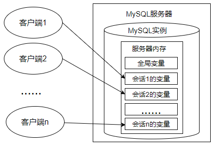](http://imag.fun-ny.cn/img/image-20211108114846634.png)

*   全局系统变量针对于所有会话（连接）有效，但`不能跨重启`
*   会话系统变量仅针对于当前会话（连接）有效。会话期间，当前会话对某个会话系统变量值的修改，不会影响其他会话同一个会话系统变量的值。
*   会话 1 对某个全局系统变量值的修改会导致会话 2 中同一个全局系统变量值的修改。

在 MySQL 中有些系统变量只能是全局的，例如 max_connections 用于限制服务器的最大连接数；有些系统变量作用域既可以是全局又可以是会话，例如 character_set_client 用于设置客户端的字符集；有些系统变量的作用域只能是当前会话，例如 pseudo_thread_id 用于标记当前会话的 MySQL 连接 ID。

#### 1.1.2 查看系统变量[#](#112-查看系统变量)

*   **查看所有或部分系统变量**

```mysql
#查看所有全局变量
SHOW GLOBAL VARIABLES;

#查看所有会话变量
SHOW SESSION VARIABLES;
或
SHOW VARIABLES;
```

```mysql
#查看满足条件的部分系统变量。
SHOW GLOBAL VARIABLES LIKE '%标识符%';

#查看满足条件的部分会话变量
SHOW SESSION VARIABLES LIKE '%标识符%';
```

举例：

```mysql
SHOW GLOBAL VARIABLES LIKE 'admin_%';
```

*   **查看指定系统变量**

作为 MySQL 编码规范，MySQL 中的系统变量以`两个“@”`开头，其中 “@@global” 仅用于标记全局系统变量，“@@session”仅用于标记会话系统变量。“@@”首先标记会话系统变量，如果会话系统变量不存在，则标记全局系统变量。

```mysql
#查看指定的系统变量的值
SELECT @@global.变量名;

#查看指定的会话变量的值
SELECT @@session.变量名;
#或者
SELECT @@变量名;
```

*   **修改系统变量的值**

有些时候，数据库管理员需要修改系统变量的默认值，以便修改当前会话或者 MySQL 服务实例的属性、特征。具体方法：

方式 1：修改 MySQL`配置文件`，继而修改 MySQL 系统变量的值（该方法需要重启 MySQL 服务）

方式 2：在 MySQL 服务运行期间，使用 “set” 命令重新设置系统变量的值

```mysql
#为某个系统变量赋值
#方式1：
SET @@global.变量名=变量值;
#方式2：
SET GLOBAL 变量名=变量值;


#为某个会话变量赋值
#方式1：
SET @@session.变量名=变量值;
#方式2：
SET SESSION 变量名=变量值;
```

举例：

```mysql
SELECT @@global.autocommit;
SET GLOBAL autocommit=0;
```

```mysql
SELECT @@session.tx_isolation;
SET @@session.tx_isolation='read-uncommitted';
```

```mysql
SET GLOBAL max_connections = 1000;
SELECT @@global.max_connections;
```

### 1.2 用户变量[#](#12-用户变量)

#### 1.2.1 用户变量分类[#](#121-用户变量分类)

用户变量是用户自己定义的，作为 MySQL 编码规范，MySQL 中的用户变量以`一个“@”`开头。根据作用范围不同，又分为`会话用户变量`和`局部变量`。

*   会话用户变量：作用域和会话变量一样，只对`当前连接`会话有效。

*   局部变量：只在 BEGIN 和 END 语句块中有效。局部变量只能在`存储过程和函数`中使用。

#### 1.2.2 会话用户变量[#](#122-会话用户变量)

*   变量的定义

```mysql
#方式1：“=”或“:=”
SET @用户变量 = 值;
SET @用户变量 := 值;

#方式2：“:=” 或 INTO关键字
SELECT @用户变量 := 表达式 [FROM 等子句];
SELECT 表达式 INTO @用户变量  [FROM 等子句];
```

*   查看用户变量的值 （查看、比较、运算等）

```mysql
SELECT @用户变量
```

*   举例

```mysql
SET @a = 1;

SELECT @a;
```

```mysql
SELECT @num := COUNT(*) FROM employees;

SELECT @num;
```

```mysql
SELECT AVG(salary) INTO @avgsalary FROM employees;

SELECT @avgsalary;
```

```mysql
SELECT @big;  #查看某个未声明的变量时，将得到NULL值
```

#### 1.2.3 局部变量[#](#123-局部变量)

+ 定义：可以使用`DECLARE`语句定义一个局部变量

+ 作用域：**仅仅在定义它的 BEGIN ... END 中有效**

+ 位置：只能放在 BEGIN ... END 中，而且**只能放在第一句**

```mysql
BEGIN
	#声明局部变量
	DECLARE 变量名1 变量数据类型 [DEFAULT 变量默认值];
	DECLARE 变量名2,变量名3,... 变量数据类型 [DEFAULT 变量默认值];

	#为局部变量赋值
	SET 变量名1 = 值;
	SELECT 值 INTO 变量名2 [FROM 子句];

	#查看局部变量的值
	SELECT 变量1,变量2,变量3;
END
```

**1. 定义变量**

```mysql
DECLARE 变量名 类型 [default 值];  # 如果没有DEFAULT子句，初始值为NULL
```

举例：

```mysql
DECLARE　myparam　INT　DEFAULT 100;
```

**2. 变量赋值**

方式 1：一般用于赋简单的值

```mysql
SET 变量名=值;
SET 变量名:=值;
```

方式 2：一般用于赋表中的字段值

```mysql
SELECT 字段名或表达式 INTO 变量名 FROM 表;
```

**3. 使用变量**（查看、比较、运算等）

```mysql
SELECT 局部变量名;
```

举例 1：声明局部变量，并分别赋值为 employees 表中 employee_id 为 102 的 last_name 和 salary

```mysql
DELIMITER //

CREATE PROCEDURE set_value()
BEGIN
	DECLARE emp_name VARCHAR(25);
	DECLARE sal DOUBLE(10,2);
	
	SELECT last_name,salary INTO emp_name,sal
	FROM employees 
	WHERE employee_id = 102;
	
	SELECT emp_name,sal;
END //

DELIMITER ;
```

举例 2：声明两个变量，求和并打印 （分别使用会话用户变量、局部变量的方式实现）

```mysql
#方式1：使用用户变量
SET @m=1;
SET @n=1;
SET @sum=@m+@n;

SELECT @sum;
```

```mysql
#方式2：使用局部变量
DELIMITER //

CREATE PROCEDURE add_value()
BEGIN
	#局部变量
	DECLARE m INT DEFAULT 1;
	DECLARE n INT DEFAULT 3;
	DECLARE SUM INT;
	
	SET SUM = m+n;
	SELECT SUM;
END //

DELIMITER ;
```

举例 3：创建存储过程 “different_salary” 查询某员工和他领导的薪资差距，并用 IN 参数 emp_id 接收员工 id，用 OUT 参数 dif_salary 输出薪资差距结果。

```mysql
#声明
DELIMITER //

CREATE PROCEDURE different_salary(IN emp_id INT,OUT dif_salary DOUBLE)
BEGIN
	#声明局部变量
	DECLARE emp_sal,mgr_sal DOUBLE DEFAULT 0.0;
	DECLARE mgr_id INT;
	
	SELECT salary INTO emp_sal FROM employees WHERE employee_id = emp_id;
	SELECT manager_id INTO mgr_id FROM employees WHERE employee_id = emp_id;
	SELECT salary INTO mgr_sal FROM employees WHERE employee_id = mgr_id;
	SET dif_salary = mgr_sal - emp_sal;

END //

DELIMITER ;

#调用
SET @emp_id = 102;
CALL different_salary(@emp_id,@diff_sal);


#查看
SELECT @diff_sal;
```

#### 1.2.4 对比会话用户变量与局部变量[#](#124-对比会话用户变量与局部变量)

```mysql
作用域					定义位置				  语法
会话用户变量	  当前会话				   会话的任何地方				加@符号，不用指定类型
局部变量	   定义它的BEGIN END中 		BEGIN END的第一句话		  一般不用加@,需要指定类型
```

## 2.定义条件与处理程序【异常处理】[#](#2-定义条件与处理程序)

-----------------------------

`定义条件`是事先定义程序执行过程中可能遇到的问题，`处理程序`定义了在遇到问题时应当采取的处理方式，并且保证存储过程或函数在遇到警告或错误时能继续执行。这样可以增强存储程序处理问题的能力，避免程序异常停止运行。

说明：定义条件和处理程序在存储过程、存储函数中都是支持的。

### 2.1 案例分析[#](#21-案例分析)

**案例分析：**创建一个名称为 “UpdateDataNoCondition” 的存储过程。代码如下：

```mysql
DELIMITER //

CREATE PROCEDURE UpdateDataNoCondition()
	BEGIN
		SET @x = 1;
		UPDATE employees SET email = NULL WHERE last_name = 'Abel';
		SET @x = 2;
		UPDATE employees SET email = 'aabbel' WHERE last_name = 'Abel';
		SET @x = 3;
	END //

DELIMITER ;
```

调用存储过程：

```mysql
mysql> CALL UpdateDataNoCondition();
ERROR 1048 (23000): Column 'email' cannot be null

mysql> SELECT @x;
+------+
| @x   |
+------+
|   1  |
+------+
1 row in set (0.00 sec)
```

可以看到，此时 @x 变量的值为 1。结合创建存储过程的 SQL 语句代码可以得出：在存储过程中未定义条件和处理程序，且当存储过程中执行的 SQL 语句报错时，MySQL 数据库会抛出错误，并退出当前 SQL 逻辑，不再向下继续执行。

### 2.2 定义条件[#](#22-定义条件)

定义条件就是给 MySQL 中的错误码命名，这有助于存储的程序代码更清晰。它将一个`错误名字`和`指定的错误条件`关联起来。这个名字可以随后被用在定义处理程序的`DECLARE HANDLER`语句中。

定义条件使用 DECLARE 语句，语法格式如下：

```mysql
DECLARE 错误名称 CONDITION FOR 错误码（或错误条件）
```

错误码的说明：

*   `MySQL_error_code`和`sqlstate_value`都可以表示 MySQL 的错误。
    *   MySQL_error_code 是数值类型错误代码。
    *   sqlstate_value 是长度为 5 的字符串类型错误代码。
    
    > 例如，在 ERROR 1418 (HY000) 中，1418 是 MySQL_error_code，'HY000'是 sqlstate_value。
    >
    >  例如，在 ERROR 1142（42000）中，1142 是 MySQL_error_code，'42000'是 sqlstate_value。

**举例 1：**定义 “Field_Not_Be_NULL” 错误名与 MySQL 中违反非空约束的错误类型是 “ERROR 1048 (23000)” 对应。

```mysql
#使用MySQL_error_code
DECLARE Field_Not_Be_NULL CONDITION FOR 1048;

#使用sqlstate_value
DECLARE Field_Not_Be_NULL CONDITION FOR SQLSTATE '23000';
```

**举例 2：**定义 "ERROR 1148(42000)" 错误，名称为 command_not_allowed。

```mysql
#使用MySQL_error_code
DECLARE command_not_allowed CONDITION FOR 1148;

#使用sqlstate_value
DECLARE command_not_allowed CONDITION FOR SQLSTATE '42000';
```

### 2.3 定义处理程序[#](#23-定义处理程序)

可以为 SQL 执行过程中发生的某种类型的错误定义特殊的处理程序。定义处理程序时，使用 DECLARE 语句的语法如下：

```mysql
DECLARE 处理方式 HANDLER FOR 错误类型 处理语句
```

*   **处理方式**：处理方式有 3 个取值：`CONTINUE`、`EXIT`、`UNDO`。
    *   `CONTINUE`：表示遇到错误不处理，继续执行。
    *   `EXIT`：表示遇到错误马上退出。
    *   `UNDO`：表示遇到错误后撤回之前的操作。MySQL 中暂时不支持这样的操作。
*   **错误类型**（即条件）可以有如下取值：
    *   `SQLSTATE '字符串错误码'`：表示长度为 5 的 sqlstate_value 类型的错误代码；
    *   `MySQL_error_code`：匹配数值类型错误代码；
    *   `错误名称`：表示 DECLARE ... CONDITION 定义的错误条件名称。
    *   `SQLWARNING`：匹配所有以 01 开头的 SQLSTATE 错误代码；
    *   `NOT FOUND`：匹配所有以 02 开头的 SQLSTATE 错误代码；
    *   `SQLEXCEPTION`：匹配所有没有被 SQLWARNING 或 NOT FOUND 捕获的 SQLSTATE 错误代码；
*   **处理语句**：如果出现上述条件之一，则采用对应的处理方式，并执行指定的处理语句。语句可以是像 “`SET 变量 = 值`” 这样的简单语句，也可以是使用`BEGIN ... END`编写的复合语句。

定义处理程序的几种方式，代码如下：

```mysql
#方法1：捕获sqlstate_value
DECLARE CONTINUE HANDLER FOR SQLSTATE '42S02' SET @info = 'NO_SUCH_TABLE';

#方法2：捕获mysql_error_value
DECLARE CONTINUE HANDLER FOR 1146 SET @info = 'NO_SUCH_TABLE';

#方法3：先定义条件，再调用
DECLARE no_such_table CONDITION FOR 1146;
DECLARE CONTINUE HANDLER FOR NO_SUCH_TABLE SET @info = 'NO_SUCH_TABLE';

#方法4：使用SQLWARNING
DECLARE EXIT HANDLER FOR SQLWARNING SET @info = 'ERROR';

#方法5：使用NOT FOUND
DECLARE EXIT HANDLER FOR NOT FOUND SET @info = 'NO_SUCH_TABLE';

#方法6：使用SQLEXCEPTION
DECLARE EXIT HANDLER FOR SQLEXCEPTION SET @info = 'ERROR';
```

### 2.4 案例解决[#](#24-案例解决)

在存储过程中，定义处理程序，捕获 sqlstate_value 值，当遇到 MySQL_error_code 值为 1048 时，执行 CONTINUE 操作，并且将 @proc_value 的值设置为 - 1。

```mysql
DELIMITER //

CREATE PROCEDURE UpdateDataNoCondition()
	BEGIN
		#定义处理程序
		DECLARE CONTINUE HANDLER FOR 1048 SET @proc_value = -1; -- 插入数据报错 后继续执行 到@x=3
		
		SET @x = 1;
		UPDATE employees SET email = NULL WHERE last_name = 'Abel';
		SET @x = 2;
		UPDATE employees SET email = 'aabbel' WHERE last_name = 'Abel';
		SET @x = 3;
	END //

DELIMITER ;
```

调用过程：

```mysql
mysql> CALL UpdateDataWithCondition();
Query OK, 0 rows affected (0.01 sec)

mysql> SELECT @x,@proc_value;
+------+-------------+
| @x   | @proc_value |
+------+-------------+
|    3 |       	 -1  |
+------+-------------+
1 row in set (0.00 sec)
```

**举例：**

创建一个名称为 “InsertDataWithCondition” 的存储过程，代码如下。

在存储过程中，定义处理程序，捕获 sqlstate_value 值，当遇到 sqlstate_value 值为 23000 时，执行 EXIT 操作，并且将 @proc_value 的值设置为 - 1。

```mysql
#准备工作
CREATE TABLE departments
AS
SELECT * FROM atguigudb.`departments`;

ALTER TABLE departments
ADD CONSTRAINT uk_dept_name UNIQUE(department_id);
```

```mysql
DELIMITER //

CREATE PROCEDURE InsertDataWithCondition()
	BEGIN
		DECLARE duplicate_entry CONDITION FOR SQLSTATE '23000' ;
		DECLARE EXIT HANDLER FOR duplicate_entry SET @proc_value = -1; -- 遇到错误退出 执行到x=2
		
		SET @x = 1;
		INSERT INTO departments(department_name) VALUES('测试');
		SET @x = 2;
		INSERT INTO departments(department_name) VALUES('测试');
		SET @x = 3;
	END //

DELIMITER ;
```

调用存储过程：

```mysql
mysql> CALL InsertDataWithCondition();
Query OK, 0 rows affected (0.01 sec)

mysql> SELECT @x,@proc_value;
+------+-------------+
| @x   | @proc_value |
+------+-------------+
|    2 |       	 -1  |
+------+-------------+
1 row in set (0.00 sec)
```

## 3. 流程控制[#](#3-流程控制)

-------------------

解决复杂问题不可能通过一个 SQL 语句完成，我们需要执行多个 SQL 操作。流程控制语句的作用就是控制存储过程中 SQL 语句的执行顺序，是我们完成复杂操作必不可少的一部分。只要是执行的程序，流程就分为三大类：

*   `顺序结构`：程序从上往下依次执行
*   `分支结构`：程序按条件进行选择执行，从两条或多条路径中选择一条执行
*   `循环结构`：程序满足一定条件下，重复执行一组语句

针对于 MySQL 的流程控制语句主要有 3 类。注意：只能用于存储程序。

*   `条件判断语句`：IF 语句和 CASE 语句
*   `循环语句`：LOOP、WHILE 和 REPEAT 语句
*   `跳转语句`：ITERATE 和 LEAVE 语句

### 3.1 分支结构之 `IF`[#](#31-分支结构之-if)

*   IF 语句的语法结构是：

```mysql
IF 表达式1 THEN 操作1
[ELSEIF 表达式2 THEN 操作2]……
[ELSE 操作N]
END IF
```

根据表达式的结果为 TRUE 或 FALSE 执行相应的语句。这里 “[]” 中的内容是可选的。

* 特点：① 不同的表达式对应不同的操作 ② 使用在 begin end 中

* **举例 1：**

  ```mysql
  DELIMITER //
  
  CREATE PROCEDURE test_if()
  
  BEGIN	
  	#情况1：
  	#声明局部变量
  	#declare stu_name varchar(15);
  	
  	#if stu_name is null 
  	#	then select 'stu_name is null';
  	#end if;
  	
  	#情况2：二选一
  	#declare email varchar(25) default 'aaa';
  	
  	#if email is null
  	#	then select 'email is null';
  	#else
  	#	select 'email is not null';
  	#end if;
  	
  	#情况3：多选一
  	DECLARE age INT DEFAULT 20;
  	
  	IF age > 40
  		THEN SELECT '中老年';
  	ELSEIF age > 18
  		THEN SELECT '青壮年';
  	ELSEIF age > 8
  		THEN SELECT '青少年';
  	ELSE
  		SELECT '婴幼儿';
  	END IF;
  	
  
  END //
  
  DELIMITER ;
  
  #调用
  CALL test_if();
  
  DROP PROCEDURE test_if;
  ```

* **举例 2：**声明存储过程 “update_salary_by_eid1”，定义 IN 参数 emp_id，输入员工编号。判断该员工薪资如果低于 8000 元并且入职时间超过 5 年，就涨薪 500 元；否则就不变。

  ```mysql
  DELIMITER //
  
  CREATE PROCEDURE update_salary_by_eid1(IN emp_id INT)
  BEGIN
  	DECLARE emp_salary DOUBLE;
  	DECLARE hire_year DOUBLE;
  
  	SELECT salary INTO emp_salary FROM employees WHERE employee_id = emp_id;
  
  	SELECT DATEDIFF(CURDATE(),hire_date)/365 INTO hire_year
  	FROM employees WHERE employee_id = emp_id;
  
  	IF emp_salary < 8000 AND hire_year > 5
  	THEN UPDATE employees SET salary = salary + 500 WHERE employee_id = emp_id;
  	END IF;
  END //
  
  
  DELIMITER ;
  ```

* **举例 3：**声明存储过程 “update_salary_by_eid2”，定义 IN 参数 emp_id，输入员工编号。判断该员工薪资如果低于 9000 元并且入职时间超过 5 年，就涨薪 500 元；否则就涨薪 100 元。

  ```mysql
  DELIMITER //
  
  CREATE PROCEDURE update_salary_by_eid2(IN emp_id INT)
  BEGIN
  	DECLARE emp_salary DOUBLE;
  	DECLARE hire_year DOUBLE;
  
  	SELECT salary INTO emp_salary FROM employees WHERE employee_id = emp_id;
  
  	SELECT DATEDIFF(CURDATE(),hire_date)/365 INTO hire_year
  	FROM employees WHERE employee_id = emp_id;
  
  	IF emp_salary < 8000 AND hire_year > 5
  		THEN UPDATE employees SET salary = salary + 500 WHERE employee_id = emp_id;
  	ELSE 
  		UPDATE employees SET salary = salary + 100 WHERE employee_id = emp_id;
  	END IF;
  END //
  
  
  DELIMITER ;
  ```

* **举例 4：**声明存储过程 “update_salary_by_eid3”，定义 IN 参数 emp_id，输入员工编号。判断该员工薪资如果低于 9000 元，就更新薪资为 9000 元；薪资如果大于等于 9000 元且低于 10000 的，但是奖金比例为 NULL 的，就更新奖金比例为 0.01；其他的涨薪 100 元。

  ```mysql
  DELIMITER //
  
  CREATE PROCEDURE update_salary_by_eid3(IN emp_id INT)
  BEGIN
  	DECLARE emp_salary DOUBLE;
  	DECLARE bonus DECIMAL(3,2);
  
  	SELECT commission_pct INTO bonus FROM employees WHERE employee_id = emp_id;
  
  	IF emp_salary < 9000
  		THEN UPDATE employees SET salary = 9000 WHERE employee_id = emp_id;
  	ELSEIF emp_salary < 10000 AND bonus IS NULL
  		THEN UPDATE employees SET commission_pct = 0.01 WHERE employee_id = emp_id;
  	ELSE
  		UPDATE employees SET salary = salary + 100 WHERE employee_id = emp_id;
  	END IF;
  END //
  
  DELIMITER ;
  ```

### 3.2 分支结构之 `CASE`[#](#32-分支结构之-case)

CASE 语句的语法结构 1：

```mysql
#情况一：类似于switch
CASE 表达式
WHEN 值1 THEN 结果1或语句1(如果是语句，需要加分号) 
WHEN 值2 THEN 结果2或语句2(如果是语句，需要加分号)
...
ELSE 结果n或语句n(如果是语句，需要加分号)
END [case]（如果是放在begin end中需要加上case，如果放在select后面不需要）
```

CASE 语句的语法结构 2：

```mysql
#情况二：类似于多重if
CASE 
WHEN 条件1 THEN 结果1或语句1(如果是语句，需要加分号) 
WHEN 条件2 THEN 结果2或语句2(如果是语句，需要加分号)
...
ELSE 结果n或语句n(如果是语句，需要加分号)
END [case]（如果是放在begin end中需要加上case，如果放在select后面不需要）
```

*   **举例 1：**

使用 CASE 流程控制语句的第 1 种格式，判断 val 值等于 1、等于 2，或者两者都不等。

```mysql
CASE val
　　　WHEN 1 THEN SELECT 'val is 1';
　　　WHEN 2 THEN SELECT 'val is 2';
　　　ELSE SELECT 'val is not 1 or 2';
END CASE;
```

*   **举例 2：**

使用 CASE 流程控制语句的第 2 种格式，判断 val 是否为空、小于 0、大于 0 或者等于 0。

```mysql
CASE
	WHEN val IS NULL THEN SELECT 'val is null';
	WHEN val < 0 THEN SELECT 'val is less than 0';
	WHEN val > 0 THEN SELECT 'val is greater than 0';
	ELSE SELECT 'val is 0';
END CASE;
```

*   **举例 3：**声明存储过程 “update_salary_by_eid4”，定义 IN 参数 emp_id，输入员工编号。判断该员工薪资如果低于 9000 元，就更新薪资为 9000 元；薪资大于等于 9000 元且低于 10000 的，但是奖金比例为 NULL 的，就更新奖金比例为 0.01；其他的涨薪 100 元。

```mysql
DELIMITER //

CREATE PROCEDURE update_salary_by_eid4(IN emp_id INT)
BEGIN
	DECLARE emp_sal DOUBLE;
	DECLARE bonus DECIMAL(3,2);

	SELECT salary INTO emp_sal FROM employees WHERE employee_id = emp_id;
	SELECT commission_pct INTO bonus FROM employees WHERE employee_id = emp_id;

	CASE
	WHEN emp_sal<9000
		THEN UPDATE employees SET salary=9000 WHERE employee_id = emp_id;
	WHEN emp_sal<10000 AND bonus IS NULL
		THEN UPDATE employees SET commission_pct=0.01 WHERE employee_id = emp_id;
	ELSE
		UPDATE employees SET salary=salary+100 WHERE employee_id = emp_id;
	END CASE;
END //

DELIMITER ;
```

*   举例 4：声明存储过程 update_salary_by_eid5，定义 IN 参数 emp_id，输入员工编号。判断该员工的入职年限，如果是 0 年，薪资涨 50；如果是 1 年，薪资涨 100；如果是 2 年，薪资涨 200；如果是 3 年，薪资涨 300；如果是 4 年，薪资涨 400；其他的涨薪 500。

```mysql
DELIMITER //

CREATE PROCEDURE update_salary_by_eid5(IN emp_id INT)
BEGIN
	DECLARE emp_sal DOUBLE;
	DECLARE hire_year DOUBLE;

	SELECT salary INTO emp_sal FROM employees WHERE employee_id = emp_id;
	
	SELECT ROUND(DATEDIFF(CURDATE(),hire_date)/365) INTO hire_year FROM employees WHERE employee_id = emp_id;

	CASE hire_year
		WHEN 0 THEN UPDATE employees SET salary=salary+50 WHERE employee_id = emp_id;
		WHEN 1 THEN UPDATE employees SET salary=salary+100 WHERE employee_id = emp_id;
		WHEN 2 THEN UPDATE employees SET salary=salary+200 WHERE employee_id = emp_id;
		WHEN 3 THEN UPDATE employees SET salary=salary+300 WHERE employee_id = emp_id;
		WHEN 4 THEN UPDATE employees SET salary=salary+400 WHERE employee_id = emp_id;
		ELSE UPDATE employees SET salary=salary+500 WHERE employee_id = emp_id;
	END CASE;
END //

DELIMITER ;
```

### 3.3 循环结构之 `LOOP`[#](#33-循环结构之loop)

LOOP 循环语句用来重复执行某些语句。LOOP 内的语句一直重复执行直到循环被退出（使用 `LEAVE` 子句），跳出循环过程。

LOOP 语句的基本格式如下：

```mysql
[loop_label:] LOOP
	循环执行的语句
END LOOP [loop_label]
```

其中，loop_label 表示 LOOP 语句的标注名称，该参数可以省略。

**举例 1：**

使用 LOOP 语句进行循环操作，id 值小于 10 时将重复执行循环过程。

```mysql
DECLARE id INT DEFAULT 0;
add_loop:LOOP
	SET id = id +1;
	IF id >= 10 THEN LEAVE add_loop;
	END IF;

END LOOP add_loop;
```

**举例 2：**当市场环境变好时，公司为了奖励大家，决定给大家涨工资。声明存储过程 “update_salary_loop()”，声明 OUT 参数 num，输出循环次数。存储过程中实现循环给大家涨薪，薪资涨为原来的 1.1 倍。直到全公司的平均薪资达到 12000 结束。并统计循环次数。

```mysql
DELIMITER //

CREATE PROCEDURE update_salary_loop(OUT num INT)
BEGIN
	DECLARE avg_salary DOUBLE;
	DECLARE loop_count INT DEFAULT 0;
	
	SELECT AVG(salary) INTO avg_salary FROM employees;
	
	label_loop:LOOP
		IF avg_salary >= 12000 THEN LEAVE label_loop;
		END IF;
		
		UPDATE employees SET salary = salary * 1.1;
		SET loop_count = loop_count + 1;
		SELECT AVG(salary) INTO avg_salary FROM employees;
	END LOOP label_loop;
	
	SET num = loop_count;

END //

DELIMITER ;
```

### 3.4 循环结构之 `WHILE`[#](#34-循环结构之while)

WHILE 语句创建一个带条件判断的循环过程。WHILE 在执行语句执行时，先对指定的表达式进行判断，如果为真，就执行循环内的语句，否则退出循环。WHILE 语句的基本格式如下：

```mysql
[while_label:] WHILE 循环条件  DO
	循环体
END WHILE [while_label];
```

while_label 为 WHILE 语句的标注名称；如果循环条件结果为真，WHILE 语句内的语句或语句群被执行，直至循环条件为假，退出循环。

**举例 1：**

WHILE 语句示例，i 值小于 10 时，将重复执行循环过程，代码如下：

```mysql
DELIMITER //

CREATE PROCEDURE test_while()
BEGIN	
	DECLARE i INT DEFAULT 0;
	
	WHILE i < 10 DO
		SET i = i + 1;
	END WHILE;
	
	SELECT i;
END //

DELIMITER ;
#调用
CALL test_while();
```

**举例 2：**市场环境不好时，公司为了渡过难关，决定暂时降低大家的薪资。声明存储过程 “update_salary_while()”，声明 OUT 参数 num，输出循环次数。存储过程中实现循环给大家降薪，薪资降为原来的 90%。直到全公司的平均薪资达到 5000 结束。并统计循环次数。

```mysql
DELIMITER //

CREATE PROCEDURE update_salary_while(OUT num INT)
BEGIN
	DECLARE avg_sal DOUBLE ;
	DECLARE while_count INT DEFAULT 0;
	
	SELECT AVG(salary) INTO avg_sal FROM employees;
	
	WHILE avg_sal > 5000 DO
		UPDATE employees SET salary = salary * 0.9;
		
		SET while_count = while_count + 1;
		
		SELECT AVG(salary) INTO avg_sal FROM employees;
	END WHILE;
	
	SET num = while_count;

END //

DELIMITER ;
```

### 3.5 循环结构之 `REPEAT`[#](#35-循环结构之repeat)

REPEAT 语句创建一个带条件判断的循环过程。与 WHILE 循环不同的是，REPEAT 循环首先会执行一次循环，然后在 UNTIL 中进行表达式的判断，如果满足条件就退出，即 END REPEAT；如果条件不满足，则会就继续执行循环，直到满足退出条件为止。

REPEAT 语句的基本格式如下：

```mysql
[repeat_label:] REPEAT
　　　　循环体的语句
UNTIL 结束循环的条件表达式
END REPEAT [repeat_label]
```

repeat_label 为 REPEAT 语句的标注名称，该参数可以省略；REPEAT 语句内的语句或语句群被重复，直至 expr_condition 为真。

**举例 1：**

```mysql
DELIMITER //

CREATE PROCEDURE test_repeat()
BEGIN	
	DECLARE i INT DEFAULT 0;
	
	REPEAT 
		SET i = i + 1;
	UNTIL i >= 10
	END REPEAT;
	
	SELECT i;
END //

DELIMITER ;
```

**举例 2：**当市场环境变好时，公司为了奖励大家，决定给大家涨工资。声明存储过程 “update_salary_repeat()”，声明 OUT 参数 num，输出循环次数。存储过程中实现循环给大家涨薪，薪资涨为原来的 1.15 倍。直到全公司的平均薪资达到 13000 结束。并统计循环次数。

```mysql
DELIMITER //

CREATE PROCEDURE update_salary_repeat(OUT num INT)
BEGIN
	DECLARE avg_sal DOUBLE ;
	DECLARE repeat_count INT DEFAULT 0;
	
	SELECT AVG(salary) INTO avg_sal FROM employees;
	
	REPEAT
		UPDATE employees SET salary = salary * 1.15;
		SET repeat_count = repeat_count + 1;
		SELECT AVG(salary) INTO avg_sal FROM employees;
	UNTIL avg_sal >= 13000
	END REPEAT;
	
	SET num = repeat_count;
		
END //

DELIMITER ;
```

**对比三种循环结构：**

1、这三种循环都可以省略名称，但如果循环中添加了循环控制语句（`LEAVE` 或 `ITERATE`）则必须添加label 名称。  
2、  
LOOP：一般用于实现简单的 "死" 循环  
WHILE：先判断后执行  
REPEAT：先执行后判断，无条件至少执行一次

### 3.6 跳转语句之 `LEAVE` 语句[#](#36-跳转语句之leave语句)

LEAVE 语句：可以用在**循环语句内，或者以 `BEGIN` 和 `END`** 包裹起来的程序体内，表示跳出循环或者跳出程序体的操作。如果你有面向过程的编程语言的使用经验，你可以把 **LEAVE 理解为 break**。

基本格式如下：

```mysql
LEAVE 标记名
```

> 其中，label 参数表示循环的标志。LEAVE 和 BEGIN ... END 或循环一起被使用。

**举例 1：**创建存储过程 “leave_begin()”，声明 INT 类型的 IN 参数 num。给 BEGIN...END 加标记名，并在 BEGIN...END 中使用 IF 语句判断 num 参数的值。

*   如果 num<=0，则使用 LEAVE 语句退出 BEGIN...END；
*   如果 num=1，则查询 “employees” 表的平均薪资；
*   如果 num=2，则查询 “employees” 表的最低薪资；
*   如果 num>2，则查询 “employees” 表的最高薪资。

IF 语句结束后查询 “employees” 表的总人数。

```mysql
DELIMITER //

CREATE PROCEDURE leave_begin(IN num INT)

	begin_label: BEGIN
		IF num<=0 
			THEN LEAVE begin_label;
		ELSEIF num=1 
			THEN SELECT AVG(salary) FROM employees;
		ELSEIF num=2 
			THEN SELECT MIN(salary) FROM employees;
		ELSE 
			SELECT MAX(salary) FROM employees;
		END IF;
		
		SELECT COUNT(*) FROM employees;
	END //


DELIMITER ;
```

**举例 2：**

当市场环境不好时，公司为了渡过难关，决定暂时降低大家的薪资。声明存储过程 “leave_while()”，声明 OUT 参数 num，输出循环次数，存储过程中使用 WHILE 循环给大家降低薪资为原来薪资的 90%，直到全公司的平均薪资小于等于 10000，并统计循环次数。

```mysql
DELIMITER //
CREATE PROCEDURE leave_while(OUT num INT)

BEGIN 
	#
	DECLARE avg_sal DOUBLE;#记录平均工资
	DECLARE while_count INT DEFAULT 0; #记录循环次数
	
	SELECT AVG(salary) INTO avg_sal FROM employees; #① 初始化条件
	
	while_label:WHILE TRUE DO  #② 循环条件
		
		#③ 循环体
		IF avg_sal <= 10000 THEN
			LEAVE while_label;
		END IF;
		
		UPDATE employees SET salary  = salary * 0.9;
		SET while_count = while_count + 1;
		
		#④ 迭代条件
		SELECT AVG(salary) INTO avg_sal FROM employees;
	
	END WHILE;
	
	#赋值
	SET num = while_count;

END //

DELIMITER ;
```

### 3.7 跳转语句之 `ITERATE` 语句[#](#37-跳转语句之iterate语句)

ITERATE 语句：只能用在循环语句（LOOP、REPEAT 和 WHILE 语句）内，表示重新开始循环，将执行顺序转到语句段开头处。如果你有面向过程的编程语言的使用经验，你可以把 **ITERATE 理解为 continue**，意思为 “再次循环”。

语句基本格式如下：

```mysql
ITERATE label
```

label 参数表示循环的标志。ITERATE 语句必须跟在循环标志前面。

**举例：** 定义局部变量 num，初始值为 0。循环结构中执行 num + 1 操作。

*   如果 num < 10，则继续执行循环；
*   如果 num > 15，则退出循环结构；

```mysql
DELIMITER //

CREATE PROCEDURE test_iterate()

BEGIN
	DECLARE num INT DEFAULT 0;
	
	my_loop:LOOP
		SET num = num + 1;
	
		IF num < 10 
			THEN ITERATE my_loop;
		ELSEIF num > 15 
			THEN LEAVE my_loop;
		END IF;
	
		SELECT '尚硅谷：让天下没有难学的技术';
	
	END LOOP my_loop;

END //

DELIMITER ;
```

## 4. 游标[#](#4-游标)

---------------

### 4.1 什么是游标（或光标）[#](#41-什么是游标或光标)

虽然我们也可以通过筛选条件 WHERE 和 HAVING，或者是限定返回记录的关键字 LIMIT 返回一条记录，但是，却无法在结果集中像指针一样，向前定位一条记录、向后定位一条记录，或者是`随意定位到某一条记录`，并对记录的数据进行处理。

这个时候，就可以用到游标。游标，提供了一种灵活的操作方式，让我们能够对结果集中的每一条记录进行定位，并对指向的记录中的数据进行操作的数据结构。**游标让 SQL 这种面向集合的语言有了面向过程开发的能力。**

在 SQL 中，游标是一种临时的数据库对象，可以指向存储在数据库表中的数据行指针。这里游标`充当了指针的作用`，我们可以通过操作游标来对数据行进行操作。

MySQL 中游标可以在存储过程和函数中使用。

比如，我们查询了 employees 数据表中工资高于 15000 的员工都有哪些：

```mysql
SELECT employee_id,last_name,salary FROM employees
WHERE salary > 15000;
```

[](http://imag.fun-ny.cn/img/image-20211111182656990.png)

这里我们就可以通过游标来操作数据行，如图所示此时游标所在的行是 “108” 的记录，我们也可以在结果集上滚动游标，指向结果集中的任意一行。

### 4.2 使用游标步骤[#](#42-使用游标步骤)

游标必须在声明处理程序之前被声明，并且变量和条件还必须在声明游标或处理程序之前被声明。

如果我们想要使用游标，一般需要经历四个步骤。不同的 DBMS 中，使用游标的语法可能略有不同。

**第一步，声明游标**

在 MySQL 中，使用 DECLARE 关键字来声明游标，其语法的基本形式如下：

```mysql
DECLARE cursor_name CURSOR FOR select_statement;
```

这个语法适用于 MySQL，SQL Server，DB2 和 MariaDB。如果是用 Oracle 或者 PostgreSQL，需要写成：

```mysql
DECLARE cursor_name CURSOR IS select_statement;
```

要使用 SELECT 语句来获取数据结果集，而此时还没有开始遍历数据，这里 select_statement 代表的是 SELECT 语句，返回一个用于创建游标的结果集。

比如：

```mysql
DECLARE cur_emp CURSOR FOR 
SELECT employee_id,salary FROM employees;
```

```mysql
DECLARE cursor_fruit CURSOR FOR 
SELECT f_name, f_price FROM fruits ;
```

**第二步，打开游标**

打开游标的语法如下：

```mysql
OPEN cursor_name
```

当我们定义好游标之后，如果想要使用游标，必须先打开游标。打开游标的时候 SELECT 语句的查询结果集就会送到游标工作区，为后面游标的`逐条读取`结果集中的记录做准备。

```mysql
OPEN　cur_emp ;
```

**第三步，使用游标（从游标中取得数据）**

语法如下：

```mysql
FETCH cursor_name INTO var_name [, var_name] ...
```

这句的作用是使用 cursor_name 这个游标来读取当前行，并且将数据保存到 var_name 这个变量中，游标指针指到下一行。如果游标读取的数据行有多个列名，则在 INTO 关键字后面赋值给多个变量名即可。

注意：var_name 必须在声明游标之前就定义好。

```mysql
FETCH　cur_emp INTO emp_id, emp_sal ;
```

注意：**游标的查询结果集中的字段数，必须跟 INTO 后面的变量数一致**，否则，在存储过程执行的时候，MySQL 会提示错误。

**第四步，关闭游标**

```mysql
CLOSE cursor_name
```

有 OPEN 就会有 CLOSE，也就是打开和关闭游标。当我们使用完游标后需要关闭掉该游标。因为游标会`占用系统资源`，如果不及时关闭，**游标会一直保持到存储过程结束**，影响系统运行的效率。而关闭游标的操作，会释放游标占用的系统资源。

关闭游标之后，我们就不能再检索查询结果中的数据行，如果需要检索只能再次打开游标。

```mysql
CLOSE　cur_emp;
```

### 4.3 举例[#](#43-举例)

创建存储过程 “get_count_by_limit_total_salary()”，声明 IN 参数 limit_total_salary，DOUBLE 类型；声明 OUT 参数 total_count，INT 类型。函数的功能可以实现累加薪资最高的几个员工的薪资值，直到薪资总和达到 limit_total_salary 参数的值，返回累加的人数给 total_count。

```mysql
DELIMITER //

CREATE PROCEDURE get_count_by_limit_total_salary(IN limit_total_salary DOUBLE,OUT total_count INT)

BEGIN
	DECLARE sum_salary DOUBLE DEFAULT 0;  #记录累加的总工资
	DECLARE cursor_salary DOUBLE DEFAULT 0; #记录某一个工资值
	DECLARE emp_count INT DEFAULT 0; #记录循环个数
	#定义游标
	DECLARE emp_cursor CURSOR FOR SELECT salary FROM employees ORDER BY salary DESC;
	#打开游标
	OPEN emp_cursor;
	
	REPEAT
		#使用游标（从游标中获取数据）
		FETCH emp_cursor INTO cursor_salary;
		
		SET sum_salary = sum_salary + cursor_salary;
		SET emp_count = emp_count + 1;
		
		UNTIL sum_salary >= limit_total_salary
	END REPEAT;
	
	SET total_count = emp_count;
	#关闭游标
	CLOSE emp_cursor;
	
END //

DELIMITER ;
```

### 4.5 小结[#](#45-小结)

游标是 MySQL 的一个重要的功能，为`逐条读取`结果集中的数据，提供了完美的解决方案。跟在应用层面实现相同的功能相比，游标可以在存储程序中使用，效率高，程序也更加简洁。

但同时也会带来一些性能问题，比如在使用游标的过程中，会对数据行进行`加锁`，这样在业务并发量大的时候，不仅会影响业务之间的效率，还会`消耗系统资源`，造成内存不足，这是因为游标是在内存中进行的处理。

建议：养成用完之后就关闭的习惯，这样才能提高系统的整体效率。

补充：MySQL 8.0 的新特性—全局变量的持久化[#](#补充mysql-80的新特性全局变量的持久化)
------------------------------------------------------

在 MySQL 数据库中，全局变量可以通过 `SET GLOBAL` 语句来设置。例如，设置服务器语句超时的限制，可以通过设置系统变量 max_execution_time 来实现：

```mysql
SET GLOBAL MAX_EXECUTION_TIME=2000;
```

使用 SET GLOBAL 语句设置的变量值只会`临时生效`。`数据库重启`后，服务器又会从 MySQL 配置文件中读取变量的默认值。  
MySQL 8.0 版本新增了`SET PERSIST`命令。例如，设置服务器的最大连接数为 1000：

```mysql
SET PERSIST global max_connections = 1000;
```

MySQL 会将该命令的配置保存到数据目录下的`mysqld-auto.cnf`文件中，下次启动时会读取该文件，用其中的配置来覆盖默认的配置文件。

举例：

查看全局变量 max_connections 的值，结果如下：

```mysql
mysql> show variables like '%max_connections%';
+------------------------+-------+
| Variable_name          | Value |
+------------------------+-------+
| max_connections        | 151   |
| mysqlx_max_connections | 100   |
+------------------------+-------+
2 rows in set, 1 warning (0.00 sec)
```

设置全局变量 max_connections 的值：

```mysql
mysql> set persist max_connections=1000;
Query OK, 0 rows affected (0.00 sec)
```

`重启MySQL服务器`，再次查询 max_connections 的值：

```mysql
mysql> show variables like '%max_connections%';
+------------------------+-------+
| Variable_name          | Value |
+------------------------+-------+
| max_connections        | 1000  |
| mysqlx_max_connections | 100   |
+------------------------+-------+
2 rows in set, 1 warning (0.00 sec)
```

第 17 章_触发器
==========

在实际开发中，我们经常会遇到这样的情况：有 2 个或者多个相互关联的表，如`商品信息`和`库存信息`分别存放在 2 个不同的数据表中，我们在添加一条新商品记录的时候，为了保证数据的完整性，必须同时在库存表中添加一条库存记录。

这样一来，我们就必须把这两个关联的操作步骤写到程序里面，而且要用`事务`包裹起来，确保这两个操作成为一个`原子操作`，要么全部执行，要么全部不执行。要是遇到特殊情况，可能还需要对数据进行手动维护，这样就很`容易忘记其中的一步`，导致数据缺失。

这个时候，咱们可以使用触发器。**你可以创建一个触发器，让商品信息数据的插入操作自动触发库存数据的插入操作。**这样一来，就不用担心因为忘记添加库存数据而导致的数据缺失了。

## 1. 触发器概述[#](#1-触发器概述)

---------------------

MySQL 从`5.0.2`版本开始支持触发器。MySQL 的触发器和存储过程一样，都是嵌入到 MySQL 服务器的一段程序。

触发器是由`事件来触发`某个操作，这些事件包括`INSERT`、`UPDATE`、`DELETE`事件。所谓事件就是指用户的动作或者触发某项行为。如果定义了触发程序，当数据库执行这些语句时候，就相当于事件发生了，就会`自动`激发触发器执行相应的操作。

当对数据表中的数据执行插入、更新和删除操作，需要自动执行一些数据库逻辑时，可以使用触发器来实现。

## 2. 触发器的创建[#](#2-触发器的创建)

-----------------------

### 2.1 创建触发器语法[#](#21-创建触发器语法)

创建触发器的语法结构是：

```mysql
CREATE TRIGGER 触发器名称 
{BEFORE|AFTER} {INSERT|UPDATE|DELETE} ON 表名 
FOR EACH ROW 
触发器执行的语句块;
```

说明：

*   `表名`：表示触发器监控的对象。
*   `BEFORE|AFTER`：表示触发的时间。BEFORE 表示在事件之前触发；AFTER 表示在事件之后触发。
*   `INSERT|UPDATE|DELETE`：表示触发的事件。
    *   INSERT 表示插入记录时触发；
    *   UPDATE 表示更新记录时触发；
    *   DELETE 表示删除记录时触发。
*   `触发器执行的语句块`：可以是单条 SQL 语句，也可以是由 BEGIN…END 结构组成的复合语句块。 

>在 INSERT 型触发器中，`NEW` 用来表示将要（BEFORE）或已经（AFTER）插入的新数据；
>在 UPDATE 型触发器中，`OLD` 用来表示将要或已经被修改的原数据，`NEW` 用来表示将要或已经修改为的新数据；
>在 DELETE 型触发器中，OLD 用来表示将要或已经被删除的原数据；
>使用方法： NEW.columnName （columnName 为相应数据表某一列名）
>另外，OLD 是只读的，而 NEW 则可以在触发器中使用 SET 赋值，这样不会再次触发触发器，造成循环调用。

### 2.2 代码举例[#](#22-代码举例-1)

**举例 1：**

1、创建数据表：

```mysql
CREATE TABLE test_trigger (
id INT PRIMARY KEY AUTO_INCREMENT,
t_note VARCHAR(30)
);


CREATE TABLE test_trigger_log (
id INT PRIMARY KEY AUTO_INCREMENT,
t_log VARCHAR(30)
);
```

2、创建触发器：创建名称为 before_insert 的触发器，向 test_trigger 数据表插入数据之前，向 test_trigger_log 数据表中插入 before_insert 的日志信息。

```mysql
DELIMITER //

CREATE TRIGGER before_insert
BEFORE INSERT ON test_trigger 
FOR EACH ROW
BEGIN
	INSERT INTO test_trigger_log (t_log)
	VALUES('before_insert');

END //

DELIMITER ;
```

3、向 test_trigger 数据表中插入数据

```mysql
INSERT INTO test_trigger (t_note) VALUES ('测试 BEFORE INSERT 触发器');
```

4、查看 test_trigger_log 数据表中的数据

```mysql
mysql> SELECT * FROM test_trigger_log;
+----+---------------+
| id | t_log         |
+----+---------------+
|  1 | before_insert |
+----+---------------+
1 row in set (0.00 sec)
```

**举例 2：**

1、创建名称为 after_insert 的触发器，向 test_trigger 数据表插入数据之后，向 test_trigger_log 数据表中插入 after_insert 的日志信息。

```mysql
DELIMITER //

CREATE TRIGGER after_insert
AFTER INSERT ON test_trigger
FOR EACH ROW
BEGIN
	INSERT INTO test_trigger_log (t_log)
	VALUES('after_insert');
END //

DELIMITER ;
```

2、向 test_trigger 数据表中插入数据。

```mysql
INSERT INTO test_trigger (t_note) VALUES ('测试 AFTER INSERT 触发器');
```

3、查看 test_trigger_log 数据表中的数据

```mysql
mysql> SELECT * FROM test_trigger_log;
+----+---------------+
| id | t_log         |
+----+---------------+
|  1 | before_insert |
|  2 | before_insert |
|  3 | after_insert  |
+----+---------------+
3 rows in set (0.00 sec)
```

**举例 3：**定义触发器 “salary_check_trigger”，基于员工表“employees” 的 INSERT 事件，在 INSERT 之前检查将要添加的新员工薪资是否大于他领导的薪资，如果大于领导薪资，则报 sqlstate_value 为'HY000'的错误，从而使得添加失败。

```mysql
DELIMITER //

CREATE TRIGGER salary_check_trigger
BEFORE INSERT ON employees FOR EACH ROW
BEGIN
	DECLARE mgrsalary DOUBLE;
	SELECT salary INTO mgrsalary FROM employees WHERE employee_id = NEW.manager_id; # new代表准备插入放入数据

	IF NEW.salary > mgrsalary THEN
		SIGNAL SQLSTATE 'HY000' SET MESSAGE_TEXT = '薪资高于领导薪资错误';
	END IF;
END //

DELIMITER ;
```

> 上面触发器声明过程中的 `NEW` 关键字代表 INSERT 添加语句的新记录。


**举例 4：**创建触发器emps_del_trigger，每当向emps表中删除一条记录时，同步将删除的这条记录添加到emps_back1表中

```sql
DELIMITER //

CREATE TRIGGER emps_del_trigger
BEFORE DELETE ON emps
FOR EACH ROW
BEGIN
	#将emps表中删除的记录，添加到emps_back1表中。
	INSERT INTO emps_back1(employee_id,last_name,salary)
	VALUES(OLD.employee_id,OLD.last_name,OLD.salary);  
END //

DELIMITER ;
```


## 3. 查看、删除触发器[#](#3-查看删除触发器)

--------------------------

### 3.1 查看触发器[#](#31-查看触发器)

查看触发器是查看数据库中已经存在的触发器的定义、状态和语法信息等。

方式 1：查看当前数据库的所有触发器的定义

```mysql
SHOW TRIGGERS\G
```

方式 2：查看当前数据库中某个触发器的定义

```mysql
SHOW CREATE TRIGGER 触发器名
```

方式 3：从系统库 information_schema 的 TRIGGERS 表中查询 “salary_check_trigger” 触发器的信息。

```mysql
SELECT * FROM information_schema.TRIGGERS;
```

### 3.2 删除触发器[#](#32-删除触发器)

触发器也是数据库对象，删除触发器也用 DROP 语句，语法格式如下：

```mysql
DROP TRIGGER  IF EXISTS 触发器名称;
```

## 4. 触发器的优缺点[#](#4-触发器的优缺点)

-------------------------

### 4.1 优点[#](#41-优点)

**1、触发器可以确保数据的完整性**。

假设我们用`进货单头表`（demo.importhead）来保存进货单的总体信息，包括进货单编号、供货商编号、仓库编号、总计进货数量、总计进货金额和验收日期。

[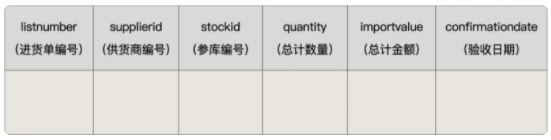](https://imag.fun-ny.cn/image-20211010233336012.png)

用`进货单明细表`（demo.importdetails）来保存进货商品的明细，包括进货单编号、商品编号、进货数量、进货价格和进货金额。

[](https://imag.fun-ny.cn/image-20211010233344125.png)

每当我们录入、删除和修改一条进货单明细数据的时候，进货单明细表里的数据就会发生变动。这个时候，在进货单头表中的总计数量和总计金额就必须重新计算，否则，进货单头表中的总计数量和总计金额就不等于进货单明细表中数量合计和金额合计了，这就是数据不一致。

为了解决这个问题，我们就可以使用触发器，**规定每当进货单明细表有数据插入、修改和删除的操作时，自动触发 2 步操作：**

1）重新计算进货单明细表中的数量合计和金额合计；

2）用第一步中计算出来的值更新进货单头表中的合计数量与合计金额。

这样一来，进货单头表中的合计数量与合计金额的值，就始终与进货单明细表中计算出来的合计数量与合计金额的值相同，数据就是一致的，不会互相矛盾。

**2、触发器可以帮助我们记录操作日志。**

利用触发器，可以具体记录什么时间发生了什么。比如，记录修改会员储值金额的触发器，就是一个很好的例子。这对我们还原操作执行时的具体场景，更好地定位问题原因很有帮助。

**3、触发器还可以用在操作数据前，对数据进行合法性检查。**

比如，超市进货的时候，需要库管录入进货价格。但是，人为操作很容易犯错误，比如说在录入数量的时候，把条形码扫进去了；录入金额的时候，看串了行，录入的价格远超售价，导致账面上的巨亏…… 这些都可以通过触发器，在实际插入或者更新操作之前，对相应的数据进行检查，及时提示错误，防止错误数据进入系统。

### 4.2 缺点[#](#42-缺点)

**1、触发器最大的一个问题就是可读性差。**

因为触发器存储在数据库中，并且由事件驱动，这就意味着触发器有可能`不受应用层的控制`。这对系统维护是非常有挑战的。

比如，创建触发器用于修改会员储值操作。如果触发器中的操作出了问题，会导致会员储值金额更新失败。我用下面的代码演示一下：

```mysql
mysql> update demo.membermaster set memberdeposit=20 where memberid = 2;
ERROR 1054 (42S22): Unknown column 'aa' in 'field list'
```

结果显示，系统提示错误，字段 “aa” 不存在。

这是因为，触发器中的数据插入操作多了一个字段，系统提示错误。可是，如果你不了解这个触发器，很可能会认为是更新语句本身的问题，或者是会员信息表的结构出了问题。说不定你还会给会员信息表添加一个叫 “aa” 的字段，试图解决这个问题，结果只能是白费力。

**2、相关数据的变更，可能会导致触发器出错。**

特别是数据表结构的变更，都可能会导致触发器出错，进而影响数据操作的正常运行。这些都会由于触发器本身的隐蔽性，影响到应用中错误原因排查的效率。

### 4.3 注意点[#](#43-注意点)

注意，如果在子表中定义了外键约束，并且外键指定了 `ON UPDATE/DELETE CASCADE/SET NULL` 子句，此时修改父表被引用的键值或删除父表被引用的记录行时，也会引起子表的修改和删除操作，此时基于子表的 UPDATE 和 DELETE 语句定义的触发器并不会被激活。

例如：基于子表员工表（t_employee）的 DELETE 语句定义了触发器 t1，而子表的部门编号（did）字段定义了外键约束引用了父表部门表（t_department）的主键列部门编号（did），并且该外键加了 “ON DELETE SET NULL” 子句，那么如果此时删除父表部门表（t_department）在子表员工表（t_employee）有匹配记录的部门记录时，会引起子表员工表（t_employee）匹配记录的部门编号（did）修改为 NULL，但是此时不会激活触发器 t1。只有直接对子表员工表（t_employee）执行 DELETE 语句时才会激活触发器 t1。

第 18 章_MySQL8 其它新特性
===================

## 1. MySQL8 新特性概述[#](#1-mysql8新特性概述)

----------------------------------

`MySQL从5.7版本直接跳跃发布了8.0版本`，可见这是一个令人兴奋的里程碑版本。MySQL 8 版本在功能上做了显著的改进与增强，开发者对 MySQL 的源代码进行了重构，最突出的一点是多 MySQL Optimizer 优化器进行了改进。不仅在速度上得到了改善，还为用户带来了更好的性能和更棒的体验。

### 1.1 MySQL8.0 新增特性[#](#11-mysql80-新增特性)

**1. 更简便的 NoSQL 支持**  
NoSQL 泛指非关系型数据库和数据存储。随着互联网平台的规模飞速发展，传统的关系型数据库已经越来越不能满足需求。从 5.6 版本开始，MySQL 就开始支持简单的 NoSQL 存储功能。MySQL 8 对这一功能做了优化，以更灵活的方式实现 NoSQL 功能，不再依赖模式（schema）。

**2. 更好的索引**  
在查询中，正确地使用索引可以提高查询的效率。MySQL 8 中新增了`隐藏索引`和`降序索引`。隐藏索引可以用来测试去掉索引对查询性能的影响。在查询中混合存在多列索引时，使用降序索引可以提高查询的性能。

**3. 更完善的 JSON 支持**  
MySQL 从 5.7 开始支持原生 JSON 数据的存储，MySQL 8 对这一功能做了优化，增加了聚合函数`JSON_ARRAYAGG()`和`JSON_OBJECTAGG()`，将参数聚合为 JSON 数组或对象，新增了行内操作符 ->>，是列路径运算符 -> 的增强，对 JSON 排序做了提升，并优化了 JSON 的更新操作。

**4. 安全和账户管理**  
MySQL 8 中新增了`caching_sha2_password` 授权插件、角色、密码历史记录和 FIPS 模式支持，这些特性提高了数据库的安全性和性能，使数据库管理员能够更灵活地进行账户管理工作。

**5.InnoDB 的变化**  
`InnoDB是MySQL默认的存储引擎`，是事务型数据库的首选引擎，支持事务安全表（ACID），支持行锁定和外键。在 MySQL 8 版本中，InnoDB 在自增、索引、加密、死锁、共享锁等方面做了大量的`改进和优化`，并且支持原子数据定义语言（DDL），提高了数据安全性，对事务提供更好的支持。

**6. 数据字典**  
在之前的 MySQL 版本中，字典数据都存储在元数据文件和非事务表中。从 MySQL 8 开始新增了事务数据字典，在这个字典里存储着数据库对象信息，这些数据字典存储在内部事务表中。

**7. 原子数据定义语句**  
MySQL 8 开始支持原子数据定义语句（Automic DDL），即`原子DDL`。目前，只有 InnoDB 存储引擎支持原子 DDL。原子数据定义语句（DDL）将与 DDL 操作相关的数据字典更新、存储引擎操作、二进制日志写入结合到一个单独的原子事务中，这使得即使服务器崩溃，事务也会提交或回滚。  
使用支持原子操作的存储引擎所创建的表，在执行 DROP TABLE、CREATE TABLE、ALTER TABLE、 RENAME TABLE、TRUNCATE TABLE、CREATE TABLESPACE、DROP TABLESPACE 等操作时，都支持原子操作，即事务要么完全操作成功，要么失败后回滚，不再进行部分提交。  
对于从 MySQL 5.7 复制到 MySQL 8 版本中的语句，可以添加`IF EXISTS`或`IF NOT EXISTS`语句来避免发生错误。

**8. 资源管理**  
MySQL 8 开始支持创建和管理资源组，允许将服务器内运行的线程分配给特定的分组，以便线程根据组内可用资源执行。组属性能够控制组内资源，启用或限制组内资源消耗。数据库管理员能够根据不同的工作负载适当地更改这些属性。  
目前，CPU 时间是可控资源，由 “虚拟 CPU” 这个概念来表示，此术语包含 CPU 的核心数，超线程，硬件线程等等。服务器在启动时确定可用的虚拟 CPU 数量。拥有对应权限的数据库管理员可以将这些 CPU 与资源组关联，并为资源组分配线程。  
资源组组件为 MySQL 中的资源组管理提供了 SQL 接口。资源组的属性用于定义资源组。MySQL 中存在两个默认组，系统组和用户组，默认的组不能被删除，其属性也不能被更改。对于用户自定义的组，资源组创建时可初始化所有的属性，除去名字和类型，其他属性都可在创建之后进行更改。  
在一些平台下，或进行了某些 MySQL 的配置时，资源管理的功能将受到限制，甚至不可用。例如，如果安装了线程池插件，或者使用的是 macOS 系统，资源管理将处于不可用状态。在 FreeBSD 和 Solaris 系统中，资源线程优先级将失效。在 Linux 系统中，只有配置了 CAP_SYS_NICE 属性，资源管理优先级才能发挥作用。

**9. 字符集支持**  
MySQL 8 中默认的字符集由`latin1`更改为`utf8mb4`，并首次增加了日语所特定使用的集合，utf8mb4_ja_0900_as_cs。

**10. 优化器增强**  
MySQL 优化器开始支持隐藏索引和降序索引。隐藏索引不会被优化器使用，验证索引的必要性时不需要删除索引，先将索引隐藏，如果优化器性能无影响就可以真正地删除索引。降序索引允许优化器对多个列进行排序，并且允许排序顺序不一致。

**11. 公用表表达式**  
公用表表达式（Common Table Expressions）简称为 CTE，MySQL 现在支持递归和非递归两种形式的 CTE。CTE 通过在 SELECT 语句或其他特定语句前`使用WITH语句对临时结果集`进行命名。

基础语法如下：

```
WITH cte_name (col_name1,col_name2 ...) AS (Subquery)
SELECT * FROM cte_name;
```

Subquery 代表子查询，子查询前使用 WITH 语句将结果集命名为 cte_name，在后续的查询中即可使用 cte_name 进行查询。

**12. 窗口函数**  
MySQL 8 开始支持窗口函数。在之前的版本中已存在的大部分`聚合函数`在 MySQL 8 中也可以作为窗口函数来使用。

[](https://imag.fun-ny.cn/image-20210730165317542.png)

**13. 正则表达式支持**  
MySQL 在 8.0.4 以后的版本中采用支持 Unicode 的国际化组件库实现正则表达式操作，这种方式不仅能提供完全的 Unicode 支持，而且是多字节安全编码。MySQL 增加了 REGEXP_LIKE()、EGEXP_INSTR()、REGEXP_REPLACE() 和 REGEXP_SUBSTR() 等函数来提升性能。另外，regexp_stack_limit 和 regexp_time_limit 系统变量能够通过匹配引擎来控制资源消耗。

**14. 内部临时表**  
`TempTable存储引擎取代MEMORY存储引擎成为内部临时表的默认存储引擎`。TempTable 存储引擎为 VARCHAR 和 VARBINARY 列提供高效存储。internal_tmp_mem_storage_engine 会话变量定义了内部临时表的存储引擎，可选的值有两个，TempTable 和 MEMORY，其中 TempTable 为默认的存储引擎。temptable_max_ram 系统配置项定义了 TempTable 存储引擎可使用的最大内存数量。

**15. 日志记录**  
在 MySQL 8 中错误日志子系统由一系列 MySQL 组件构成。这些组件的构成由系统变量 log_error_services 来配置，能够实现日志事件的过滤和写入。

**16. 备份锁**  
新的备份锁允许在线备份期间执行数据操作语句，同时阻止可能造成快照不一致的操作。新备份锁由 LOCK INSTANCE FOR BACKUP 和 UNLOCK INSTANCE 语法提供支持，执行这些操作需要备份管理员特权。

**17. 增强的 MySQL 复制**  
MySQL 8 复制支持对`JSON文档`进行部分更新的`二进制日志记录`，该记录`使用紧凑的二进制格式`，从而节省记录完整 JSON 文档的空间。当使用基于语句的日志记录时，这种紧凑的日志记录会自动完成，并且可以通过将新的 binlog_row_value_options 系统变量值设置为 PARTIAL_JSON 来启用。

### 1.2 MySQL8.0 移除的旧特性[#](#12-mysql80移除的旧特性)

在 MySQL 5.7 版本上开发的应用程序如果使用了 MySQL8.0 移除的特性，语句可能会失败，或者产生不同的执行结果。为了避免这些问题，对于使用了移除特性的应用，应当尽力修正避免使用这些特性，并尽可能使用替代方法。

**1. 查询缓存**  
`查询缓存已被移除`，删除的项有：  
**（1）语句：**FLUSH QUERY CACHE 和 RESET QUERY CACHE。  
**（2）系统变量：**query_cache_limit、query_cache_min_res_unit、query_cache_size、query_cache_type、query_cache_wlock_invalidate。  
**（3）状态变量：**Qcache_free_blocks、Qcache_free_memory、Qcache_hits、Qcache_inserts、Qcache_lowmem_prunes、Qcache_not_cached、Qcache_queries_in_cache、Qcache_total_blocks。  
**（4）线程状态：**checking privileges on cached query、checking query cache for query、invalidating query cache entries、sending cached result to client、storing result in query cache、waiting for query cache lock。

**2. 加密相关**  
删除的加密相关的内容有：ENCODE()、DECODE()、ENCRYPT()、DES_ENCRYPT() 和 DES_DECRYPT() 函数，配置项 des-key-file，系统变量 have_crypt，FLUSH 语句的 DES_KEY_FILE 选项，HAVE_CRYPT CMake 选项。  
对于移除的 ENCRYPT() 函数，考虑使用 SHA2() 替代，对于其他移除的函数，使用 AES_ENCRYPT() 和 AES_DECRYPT() 替代。

**3. 空间函数相关**  
在 MySQL 5.7 版本中，多个空间函数已被标记为过时。这些过时函数在 MySQL 8 中都已被移除，只保留了对应的 ST_和 MBR 函数。

**4.\N 和 NULL**  
在 SQL 语句中，解析器不再将 \ N 视为 NULL，所以在 SQL 语句中应使用 NULL 代替 \ N。这项变化不会影响使用 LOAD DATA INFILE 或者 SELECT...INTO OUTFILE 操作文件的导入和导出。在这类操作中，NULL 仍等同于 \ N。

**5. mysql_install_db**  
在 MySQL 分布中，已移除了 mysql_install_db 程序，数据字典初始化需要调用带着 --initialize 或者 --initialize-insecure 选项的 mysqld 来代替实现。另外，--bootstrap 和 INSTALL_SCRIPTDIR CMake 也已被删除。

**6. 通用分区处理程序**  
通用分区处理程序已从 MySQL 服务中被移除。为了实现给定表分区，表所使用的存储引擎需要自有的分区处理程序。  
提供本地分区支持的 MySQL 存储引擎有两个，即 InnoDB 和 NDB，而在 MySQL 8 中只支持 InnoDB。

**7. 系统和状态变量信息**  
在 INFORMATION_SCHEMA 数据库中，对系统和状态变量信息不再进行维护。GLOBAL_VARIABLES、SESSION_VARIABLES、GLOBAL_STATUS、SESSION_STATUS 表都已被删除。另外，系统变量 show_compatibility_56 也已被删除。被删除的状态变量有 Slave_heartbeat_period、Slave_last_heartbeat,Slave_received_heartbeats、Slave_retried_transactions、Slave_running。以上被删除的内容都可使用性能模式中对应的内容进行替代。

**8.mysql_plugin 工具**  
mysql_plugin 工具用来配置 MySQL 服务器插件，现已被删除，可使用 --plugin-load 或 --plugin-load-add 选项在服务器启动时加载插件或者在运行时使用 INSTALL PLUGIN 语句加载插件来替代该工具。

## 2. 新特性 1：窗口函数[#](#2-新特性1窗口函数)

-----------------------------

### 2.1 使用窗口函数前后对比[#](#21-使用窗口函数前后对比)

假设我现在有这样一个数据表，它显示了某购物网站在每个城市每个区的销售额：

```mysql
CREATE TABLE sales(
id INT PRIMARY KEY AUTO_INCREMENT,
city VARCHAR(15),
county VARCHAR(15),
sales_value DECIMAL

);

INSERT INTO sales(city,county,sales_value)
VALUES
('北京','海淀',10.00),
('北京','朝阳',20.00),
('上海','黄埔',30.00),
('上海','长宁',10.00);
```

查询：

```mysql
mysql> SELECT * FROM sales;
+----+------+--------+-------------+
| id | city | county | sales_value |
+----+------+--------+-------------+
|  1 | 北京 | 海淀    |          10 |
|  2 | 北京 | 朝阳    |          20 |
|  3 | 上海 | 黄埔    |          30 |
|  4 | 上海 | 长宁    |          10 |
+----+------+--------+-------------+
4 rows in set (0.00 sec)
```

**需求：**现在计算这个网站在每个城市的销售总额、在全国的销售总额、每个区的销售额占所在城市销售额中的比率，以及占总销售额中的比率。

如果用分组和聚合函数，就需要分好几步来计算。

第一步，计算总销售金额，并存入临时表 a：

```mysql
CREATE TEMPORARY TABLE a       -- 创建临时表
SELECT SUM(sales_value) AS sales_value -- 计算总计金额
FROM sales;
```

查看一下临时表 a ：

```mysql
mysql> SELECT * FROM a;
+-------------+
| sales_value |
+-------------+
|          70 |
+-------------+
1 row in set (0.00 sec)
```

第二步，计算每个城市的销售总额并存入临时表 b：

```mysql
CREATE TEMPORARY TABLE b    -- 创建临时表
SELECT city,SUM(sales_value) AS sales_value  -- 计算城市销售合计
FROM sales
GROUP BY city;
```

查看临时表 b ：

```mysql
mysql> SELECT * FROM b;
+------+-------------+
| city | sales_value |
+------+-------------+
| 北京 |          30 |
| 上海 |          40 |
+------+-------------+
2 rows in set (0.00 sec)
```

第三步，计算各区的销售占所在城市的总计金额的比例，和占全部销售总计金额的比例。我们可以通过下面的连接查询获得需要的结果：

```mysql
 SELECT s.city AS 城市,s.county AS 区,s.sales_value AS 区销售额,
     b.sales_value AS 市销售额,s.sales_value/b.sales_value AS 市比率,
     a.sales_value AS 总销售额,s.sales_value/a.sales_value AS 总比率
     FROM sales s
     JOIN b ON (s.city=b.city) -- 连接市统计结果临时表
     JOIN a                   -- 连接总计金额临时表
     ORDER BY s.city,s.county;
+------+------+----------+----------+--------+----------+--------+
| 城市  | 区   | 区销售额  | 市销售额   | 市比率  | 总销售额  | 总比率  |
+------+------+----------+----------+--------+----------+--------+
| 上海  | 长宁 |       10 |       40 | 0.2500 |       70 | 0.1429 |
| 上海  | 黄埔 |       30 |       40 | 0.7500 |       70 | 0.4286 |
| 北京  | 朝阳 |       20 |       30 | 0.6667 |       70 | 0.2857 |
| 北京  | 海淀 |       10 |       30 | 0.3333 |       70 | 0.1429 |
+------+------+----------+----------+--------+----------+--------+
4 rows in set (0.00 sec)
```

结果显示：市销售金额、市销售占比、总销售金额、总销售占比都计算出来了。

同样的查询，如果用窗口函数，就简单多了。我们可以用下面的代码来实现：

```mysql
mysql> SELECT city AS 城市,county AS 区,sales_value AS 区销售额,
    -> SUM(sales_value) OVER(PARTITION BY city) AS 市销售额,  -- 计算市销售额
    -> sales_value/SUM(sales_value) OVER(PARTITION BY city) AS 市比率,
    -> SUM(sales_value) OVER() AS 总销售额,   -- 计算总销售额
    -> sales_value/SUM(sales_value) OVER() AS 总比率
    -> FROM sales
    -> ORDER BY city,county;
+------+------+----------+----------+--------+----------+--------+
| 城市  | 区   | 区销售额  | 市销售额   | 市比率  | 总销售额  | 总比率  |
+------+------+----------+----------+--------+----------+--------+
| 上海  | 长宁 |       10 |       40  | 0.2500 |       70 | 0.1429 |
| 上海  | 黄埔 |       30 |       40  | 0.7500 |       70 | 0.4286 |
| 北京  | 朝阳 |       20 |       30  | 0.6667 |       70 | 0.2857 |
| 北京  | 海淀 |       10 |       30  | 0.3333 |       70 | 0.1429 |
+------+------+----------+-----------+--------+----------+--------+
4 rows in set (0.00 sec)
```

结果显示，我们得到了与上面那种查询同样的结果。

使用窗口函数，只用了一步就完成了查询。而且，由于没有用到临时表，执行的效率也更高了。很显然，**在这种需要用到分组统计的结果对每一条记录进行计算的场景下，使用窗口函数更好**。

### 2.2 窗口函数分类[#](#22-窗口函数分类)

MySQL 从 8.0 版本开始支持窗口函数。窗口函数的作用类似于在查询中对数据进行分组，不同的是，分组操作会把分组的结果聚合成一条记录，而窗口函数是将结果置于每一条数据记录中。

窗口函数可以分为`静态窗口函数`和`动态窗口函数`。

*   静态窗口函数的窗口大小是固定的，不会因为记录的不同而不同；
*   动态窗口函数的窗口大小会随着记录的不同而变化。

MySQL 官方网站窗口函数的网址为 https://dev.mysql.com/doc/refman/8.0/en/window-function-descriptions.html#function_row-number。

窗口函数总体上可以分为序号函数、分布函数、前后函数、首尾函数和其他函数，如下表：

[](https://imag.fun-ny.cn/image-20211012162944536.png)

### 2.3 语法结构[#](#23-语法结构)

窗口函数的语法结构是：

```mysql
函数 OVER（[PARTITION BY 字段名 ORDER BY 字段名 ASC|DESC]）
```

或者是：

```mysql
函数 OVER 窗口名 … WINDOW 窗口名 AS （[PARTITION BY 字段名 ORDER BY 字段名 ASC|DESC]）
```

*   `OVER` 关键字指定函数窗口的范围。
    *   如果省略后面括号中的内容，则窗口会包含满足 WHERE 条件的所有记录，窗口函数会基于所有满足 WHERE 条件的记录进行计算。
    *   如果 OVER 关键字后面的括号不为空，则可以使用如下语法设置窗口。
*   窗口名：为窗口设置一个别名，用来标识窗口。
*   `PARTITION BY` 子句：指定窗口函数按照哪些字段进行分组。分组后，窗口函数可以在每个分组中分别执行。
*   `ORDER BY` 子句：指定窗口函数按照哪些字段进行排序。执行排序操作使窗口函数按照排序后的数据记录的顺序进行编号。
*   FRAME 子句：为分区中的某个子集定义规则，可以用来作为滑动窗口使用。

### 2.4 分类讲解[#](#24-分类讲解)

创建表：

```mysql
CREATE TABLE goods(
id INT PRIMARY KEY AUTO_INCREMENT,
category_id INT,
category VARCHAR(15),
NAME VARCHAR(30),
price DECIMAL(10,2),
stock INT,
upper_time DATETIME

);
```

添加数据：

```mysql
INSERT INTO goods(category_id,category,NAME,price,stock,upper_time)
VALUES
(1, '女装/女士精品', 'T恤', 39.90, 1000, '2020-11-10 00:00:00'),
(1, '女装/女士精品', '连衣裙', 79.90, 2500, '2020-11-10 00:00:00'),
(1, '女装/女士精品', '卫衣', 89.90, 1500, '2020-11-10 00:00:00'),
(1, '女装/女士精品', '牛仔裤', 89.90, 3500, '2020-11-10 00:00:00'),
(1, '女装/女士精品', '百褶裙', 29.90, 500, '2020-11-10 00:00:00'),
(1, '女装/女士精品', '呢绒外套', 399.90, 1200, '2020-11-10 00:00:00'),
(2, '户外运动', '自行车', 399.90, 1000, '2020-11-10 00:00:00'),
(2, '户外运动', '山地自行车', 1399.90, 2500, '2020-11-10 00:00:00'),
(2, '户外运动', '登山杖', 59.90, 1500, '2020-11-10 00:00:00'),
(2, '户外运动', '骑行装备', 399.90, 3500, '2020-11-10 00:00:00'),
(2, '户外运动', '运动外套', 799.90, 500, '2020-11-10 00:00:00'),
(2, '户外运动', '滑板', 499.90, 1200, '2020-11-10 00:00:00');
```

下面针对 goods 表中的数据来验证每个窗口函数的功能。

#### 1. 序号函数[#](#1-序号函数)

##### **1．ROW_NUMBER() 函数**

ROW_NUMBER() 函数能够对数据中的序号进行顺序显示。

举例：查询 goods 数据表中每个商品分类下价格降序排列的各个商品信息。

```mysql
SELECT ROW_NUMBER() OVER(PARTITION BY category_id ORDER BY price DESC) AS row_num,
  id, category_id, category, NAME, price, stock
  FROM goods;
+---------+----+-------------+---------------+------------+---------+-------+
| row_num | id | category_id | category      | NAME       | price   | stock |
+---------+----+-------------+---------------+------------+---------+-------+
|       1 |  6 |           1 | 女装/女士精品   | 呢绒外套    |  399.90 |  1200 |
|       2 |  3 |           1 | 女装/女士精品   | 卫衣        |   89.90 |  1500 |
|       3 |  4 |           1 | 女装/女士精品   | 牛仔裤      |   89.90 |  3500 |
|       4 |  2 |           1 | 女装/女士精品   | 连衣裙      |   79.90 |  2500 |
|       5 |  1 |           1 | 女装/女士精品   | T恤        |   39.90 |  1000 |
|       6 |  5 |           1 | 女装/女士精品   | 百褶裙      |   29.90 |   500 |
|       1 |  8 |           2 | 户外运动       | 山地自行车   | 1399.90 |  2500 |
|       2 | 11 |           2 | 户外运动       | 运动外套     |  799.90 |   500 |
|       3 | 12 |           2 | 户外运动       | 滑板        |  499.90 |  1200 |
|       4 |  7 |           2 | 户外运动       | 自行车      |  399.90 |  1000 |
|       5 | 10 |           2 | 户外运动       | 骑行装备    |  399.90 |  3500 |
|       6 |  9 |           2 | 户外运动       | 登山杖      |   59.90 |  1500 |
+---------+----+-------------+---------------+------------+---------+-------+
12 rows in set (0.00 sec)
```

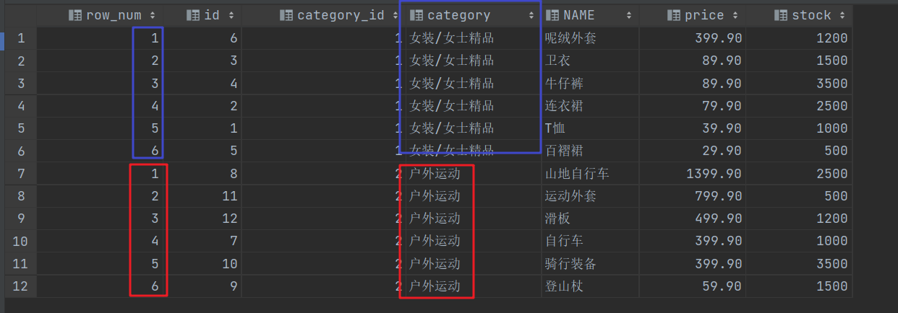

举例：查询 goods 数据表中每个商品分类下价格最高的 3 种商品信息。

```mysql
SELECT *
FROM (
	SELECT ROW_NUMBER() OVER(PARTITION BY category_id ORDER BY price DESC) AS row_num,id, category_id, category, NAME, price, tock FROM goods) t
WHERE row_num <= 3;
+---------+----+-------------+---------------+------------+---------+-------+
| row_num | id | category_id | category      | NAME       | price   | stock |
+---------+----+-------------+---------------+------------+---------+-------+
|       1 |  6 |           1 | 女装/女士精品   | 呢绒外套    |  399.90  |  1200 |
|       2 |  3 |           1 | 女装/女士精品   | 卫衣        |   89.90 |  1500 |
|       3 |  4 |           1 | 女装/女士精品   | 牛仔裤      |   89.90  |  3500 |
|       1 |  8 |           2 | 户外运动       | 山地自行车   | 1399.90  |  2500 |
|       2 | 11 |           2 | 户外运动       | 运动外套     |  799.90  |   500 |
|       3 | 12 |           2 | 户外运动       | 滑板        |  499.90  |  1200 |
+---------+----+-------------+---------------+------------+----------+-------+
6 rows in set (0.00 sec)
```

在名称为 “女装 / 女士精品” 的商品类别中，有两款商品的价格为 89.90 元，分别是卫衣和牛仔裤。两款商品的序号都应该为 2，而不是一个为 2，另一个为 3。此时，可以使用 RANK()函数和 DENSE_RANK()函数解决。

##### **2．RANK() 函数**

使用 RANK() 函数能够对序号进行并列排序，并且会跳过重复的序号，比如序号为 1、1、3。

举例：使用 RANK() 函数获取 goods 数据表中各类别的价格从高到低排序的各商品信息。

```mysql
 SELECT RANK() OVER(PARTITION BY category_id ORDER BY price DESC) AS row_num,
   id, category_id, category, NAME, price, stock
   FROM goods;
```

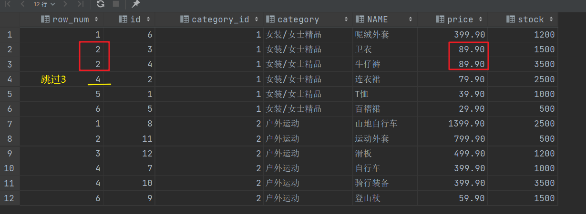

举例：使用 RANK()函数获取 goods 数据表中类别为 “女装 / 女士精品” 的价格最高的 4 款商品信息。

```mysql
mysql> SELECT *
    -> FROM(
    ->  SELECT RANK() OVER(PARTITION BY category_id ORDER BY price DESC) AS row_num,
    ->  id, category_id, category, NAME, price, stock
    ->  FROM goods) t
    -> WHERE category_id = 1 AND row_num <= 4;
+---------+----+-------------+---------------+----------+--------+-------+
| row_num | id | category_id | category      | NAME     | price  | stock |
+---------+----+-------------+---------------+----------+--------+-------+
|       1 |  6 |           1 | 女装/女士精品   | 呢绒外套  | 399.90 |  1200 |
|       2 |  3 |           1 | 女装/女士精品   | 卫衣      |  89.90 |  1500 |
|       2 |  4 |           1 | 女装/女士精品   | 牛仔裤    |  89.90 |  3500 |
|       4 |  2 |           1 | 女装/女士精品   | 连衣裙    |  79.90 |  2500 |
+---------+----+-------------+---------------+----------+--------+-------+
4 rows in set (0.00 sec)
```

可以看到，使用 RANK() 函数得出的序号为 1、2、2、4，相同价格的商品序号相同，后面的商品序号是不连续的，跳过了重复的序号。

##### **3．DENSE_RANK() 函数**

DENSE_RANK() 函数对序号进行并列排序，并且不会跳过重复的序号，比如序号为 1、1、2。

举例：使用 DENSE_RANK() 函数获取 goods 数据表中各类别的价格从高到低排序的各商品信息。

```mysql
 SELECT DENSE_RANK() OVER(PARTITION BY category_id ORDER BY price DESC) AS row_num,
     id, category_id, category, NAME, price, stock
    FROM goods;
```

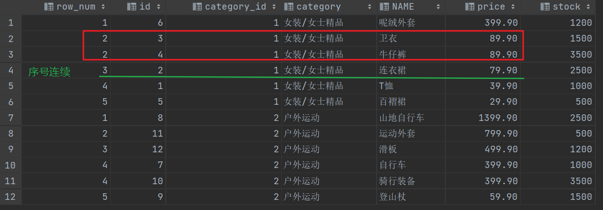

举例：使用 DENSE_RANK()函数获取 goods 数据表中类别为 “女装 / 女士精品” 的价格最高的 4 款商品信息。

```mysql
mysql> SELECT *
    -> FROM(
    ->  SELECT DENSE_RANK() OVER(PARTITION BY category_id ORDER BY price DESC) AS row_num,
    ->  id, category_id, category, NAME, price, stock
    ->  FROM goods) t
    -> WHERE category_id = 1 AND row_num <= 3;
+---------+----+-------------+---------------+----------+--------+-------+
| row_num | id | category_id | category      | NAME     | price  | stock |
+---------+----+-------------+---------------+----------+--------+-------+
|       1 |  6 |           1 | 女装/女士精品   | 呢绒外套  | 399.90 |  1200 |
|       2 |  3 |           1 | 女装/女士精品   | 卫衣     |  89.90  |  1500 |
|       2 |  4 |           1 | 女装/女士精品   | 牛仔裤    |  89.90 |  3500 |
|       3 |  2 |           1 | 女装/女士精品   | 连衣裙    |  79.90 |  2500 |
+---------+----+-------------+---------------+----------+--------+-------+
4 rows in set (0.00 sec)
```

可以看到，使用 DENSE_RANK() 函数得出的行号为 1、2、2、3，相同价格的商品序号相同，后面的商品序号是连续的，并且没有跳过重复的序号。

#### 2. 分布函数[#](#2-分布函数)

##### **1．PERCENT_RANK() 函数**

PERCENT_RANK() 函数是等级值百分比函数。按照如下方式进行计算。

```mysql
(rank - 1) / (rows - 1)  
```

其中，rank 的值为使用 RANK() 函数产生的序号，rows 的值为当前窗口的总记录数。

举例：计算 goods 数据表中名称为 “女装 / 女士精品” 的类别下的商品的 PERCENT_RANK 值。

```mysql
#写法一：
SELECT RANK() OVER (PARTITION BY category_id ORDER BY price DESC) AS r,
PERCENT_RANK() OVER (PARTITION BY category_id ORDER BY price DESC) AS pr,
id, category_id, category, NAME, price, stock
FROM goods
WHERE category_id = 1;

#写法二：
mysql> SELECT RANK() OVER w AS r,
    -> PERCENT_RANK() OVER w AS pr,
    -> id, category_id, category, NAME, price, stock
    -> FROM goods
    -> WHERE category_id = 1 WINDOW w AS (PARTITION BY category_id ORDER BY price DESC);
+---+-----+----+-------------+---------------+----------+--------+-------+
| r | pr  | id | category_id | category      | NAME     | price  | stock | -- category_id 6行记录，(rank - 1) / (rows - 1)  
+---+-----+----+-------------+---------------+----------+--------+-------+ 
| 1 |   0 |  6 |           1 | 女装/女士精品   | 呢绒外套  | 399.90 |  1200 |  -- (1-1)/(6-1) = 0
| 2 | 0.2 |  3 |           1 | 女装/女士精品   | 卫衣     |  89.90 |  1500 |  -- (2-1)/(6-1) = 0
| 2 | 0.2 |  4 |           1 | 女装/女士精品   | 牛仔裤   |  89.90 |  3500  |
| 4 | 0.6 |  2 |           1 | 女装/女士精品   | 连衣裙   |  79.90 |  2500  |
| 5 | 0.8 |  1 |           1 | 女装/女士精品   | T恤      |  39.90 |  1000 |
| 6 |   1 |  5 |           1 | 女装/女士精品   | 百褶裙   |  29.90  |   500 |
+---+-----+----+-------------+---------------+----------+--------+-------+
6 rows in set (0.00 sec)
```

##### **2．CUME_DIST() 函数**

CUME_DIST() 函数主要用于查询小于或等于某个值的比例。

举例：查询 goods 数据表中小于或等于当前价格的比例。

```mysql
mysql> SELECT CUME_DIST() OVER(PARTITION BY category_id ORDER BY price ASC) AS cd,
    -> id, category, NAME, price
    -> FROM goods;
+---------------------+----+---------------+------------+---------+
| cd                  | id | category      | NAME       | price   |
+---------------------+----+---------------+------------+---------+
| 0.16666666666666666 |  5 | 女装/女士精品   | 百褶裙      |   29.90 |
|  0.3333333333333333 |  1 | 女装/女士精品   | T恤        |   39.90 |
|                 0.5 |  2 | 女装/女士精品   | 连衣裙      |   79.90 |
|  0.8333333333333334 |  3 | 女装/女士精品   | 卫衣        |   89.90 |
|  0.8333333333333334 |  4 | 女装/女士精品   | 牛仔裤      |   89.90 |
|                   1 |  6 | 女装/女士精品   | 呢绒外套    |  399.90 |
| 0.16666666666666666 |  9 | 户外运动       | 登山杖      |   59.90 |
|                 0.5 |  7 | 户外运动       | 自行车      |  399.90 |
|                 0.5 | 10 | 户外运动       | 骑行装备     |  399.90 |
|  0.6666666666666666 | 12 | 户外运动       | 滑板        |  499.90 |
|  0.8333333333333334 | 11 | 户外运动       | 运动外套    |  799.90 |
|                   1 |  8 | 户外运动       | 山地自行车   | 1399.90 |
+---------------------+----+---------------+------------+---------+
12 rows in set (0.00 sec)
```

#### 3. 前后函数[#](#3-前后函数)

##### **1．LAG(expr,n) 函数**

`LAG(expr,n)` 函数返回当前行的前 n 行的 expr 的值。

举例：查询 goods 数据表中前一个商品价格与当前商品价格的差值。

```mysql
SELECT id, category, NAME, price, pre_price, price - pre_price AS diff_price
FROM (
         SELECT id, category, NAME, price, LAG(price, 1) OVER w AS pre_price
         FROM goods
             WINDOW w AS (PARTITION BY category_id ORDER BY price)) t;
```

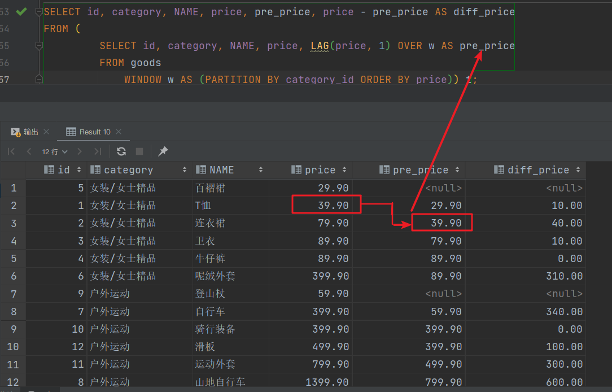

##### **2．LEAD(expr,n) 函数**

LEAD(expr,n) 函数返回当前行的后 n 行的 expr 的值。

举例：查询 goods 数据表中后一个商品价格与当前商品价格的差值。

```mysql
mysql> SELECT id, category, NAME, behind_price, price,behind_price - price AS diff_price
    -> FROM(
    ->  SELECT id, category, NAME, price,LEAD(price, 1) OVER w AS behind_price
    ->  FROM goods WINDOW w AS (PARTITION BY category_id ORDER BY price)) t;
+----+---------------+------------+--------------+---------+------------+
| id | category      | NAME       | behind_price | price   | diff_price |
+----+---------------+------------+--------------+---------+------------+
|  5 | 女装/女士精品   | 百褶裙      |        39.90 |   29.90 |      10.00 |
|  1 | 女装/女士精品   | T恤        |        79.90 |   39.90 |      40.00 |
|  2 | 女装/女士精品   | 连衣裙      |        89.90 |   79.90 |      10.00 |
|  3 | 女装/女士精品   | 卫衣        |        89.90 |   89.90 |       0.00 |
|  4 | 女装/女士精品   | 牛仔裤      |       399.90 |   89.90 |     310.00 |
|  6 | 女装/女士精品   | 呢绒外套     |         NULL |  399.90 |       NULL |
|  9 | 户外运动       | 登山杖       |       399.90 |   59.90 |     340.00 |
|  7 | 户外运动       | 自行车       |       399.90 |  399.90 |       0.00 |
| 10 | 户外运动       | 骑行装备     |       499.90 |  399.90 |     100.00 |
| 12 | 户外运动       | 滑板        |       799.90 |  499.90 |     300.00 |
| 11 | 户外运动       | 运动外套     |      1399.90 |  799.90 |     600.00 |
|  8 | 户外运动       | 山地自行车   |         NULL | 1399.90 |       NULL |
+----+---------------+------------+--------------+---------+------------+
12 rows in set (0.00 sec)
```

#### 4. 首尾函数[#](#4-首尾函数)

##### **1．FIRST_VALUE(expr) 函数**

FIRST_VALUE(expr) 函数返回第一个 expr 的值。

举例：按照价格排序，查询第 1 个商品的价格信息。

```mysql
 SELECT id, category, NAME, price, stock,FIRST_VALUE(price) OVER w AS first_price
     FROM goods WINDOW w AS (PARTITION BY category_id ORDER BY price);
```

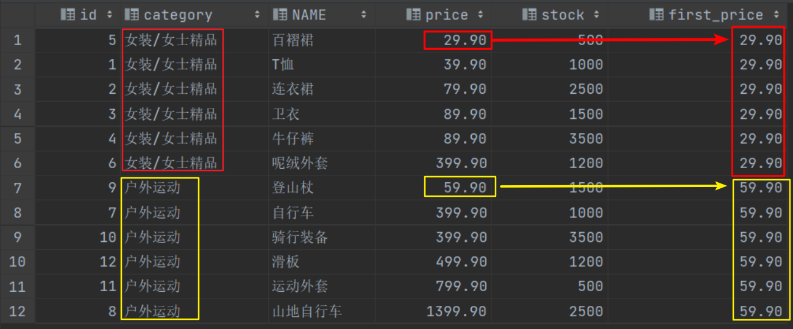

##### **2．LAST_VALUE(expr) 函数**

LAST_VALUE(expr) 函数返回最后一个 expr 的值。

举例：按照价格排序，查询最后一个商品的价格信息。

```mysql
mysql> SELECT id, category, NAME, price, stock,LAST_VALUE(price) OVER w AS last_price
    -> FROM goods WINDOW w AS (PARTITION BY category_id ORDER BY price);
+----+---------------+------------+---------+-------+------------+
| id | category      | NAME       | price   | stock | last_price |
+----+---------------+------------+---------+-------+------------+
|  5 | 女装/女士精品   | 百褶裙     |   29.90 |   500 |      29.90 |
|  1 | 女装/女士精品   | T恤        |   39.90 |  1000 |      39.90 |
|  2 | 女装/女士精品   | 连衣裙     |   79.90 |  2500 |      79.90 |
|  3 | 女装/女士精品   | 卫衣       |   89.90 |  1500 |      89.90 |
|  4 | 女装/女士精品   | 牛仔裤     |   89.90 |  3500 |      89.90 |
|  6 | 女装/女士精品   | 呢绒外套   |  399.90 |  1200 |     399.90 |
|  9 | 户外运动       | 登山杖     |   59.90 |  1500 |      59.90 |
|  7 | 户外运动       | 自行车     |  399.90 |  1000 |     399.90 |
| 10 | 户外运动       | 骑行装备   |  399.90 |  3500 |     399.90 |
| 12 | 户外运动       | 滑板       |  499.90 |  1200 |     499.90 |
| 11 | 户外运动       | 运动外套   |  799.90 |   500 |     799.90 |
|  8 | 户外运动       | 山地自行车 | 1399.90 |  2500 |    1399.90 |
+----+---------------+------------+---------+-------+------------+
12 rows in set (0.00 sec)
```

#### 5. 其他函数[#](#5-其他函数)

##### **1．NTH_VALUE(expr,n) 函数**

NTH_VALUE(expr,n) 函数返回第 n 个 expr 的值。

举例：查询 goods 数据表中排名第 2 和第 3 的价格信息。

```mysql
mysql> SELECT id, category, NAME, price,NTH_VALUE(price,2) OVER w AS second_price,
    -> NTH_VALUE(price,3) OVER w AS third_price
    -> FROM goods WINDOW w AS (PARTITION BY category_id ORDER BY price);
```

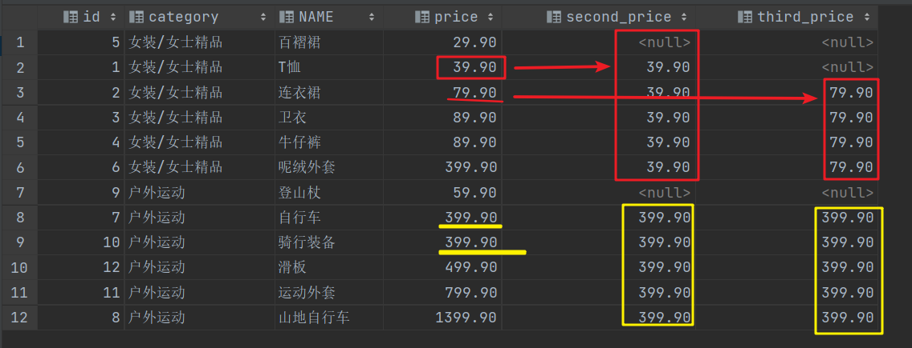

##### **2．NTILE(n) 函数**

NTILE(n) 函数将分区中的有序数据分为 n 个桶，记录桶编号。

举例：将 goods 表中的商品按照价格分为 3 组。

```mysql
mysql> SELECT NTILE(3) OVER w AS nt,id, category, NAME, price
    -> FROM goods WINDOW w AS (PARTITION BY category_id ORDER BY price);
+----+----+---------------+------------+---------+
| nt | id | category      | NAME       | price   |
+----+----+---------------+------------+---------+
|  1 |  5 | 女装/女士精品 | 百褶裙     |   29.90 |
|  1 |  1 | 女装/女士精品 | T恤        |   39.90 |
|  2 |  2 | 女装/女士精品 | 连衣裙     |   79.90 |
|  2 |  3 | 女装/女士精品 | 卫衣       |   89.90 |
|  3 |  4 | 女装/女士精品 | 牛仔裤     |   89.90 |
|  3 |  6 | 女装/女士精品 | 呢绒外套   |  399.90 |
|  1 |  9 | 户外运动      | 登山杖     |   59.90 |
|  1 |  7 | 户外运动      | 自行车     |  399.90 |
|  2 | 10 | 户外运动      | 骑行装备   |  399.90 |
|  2 | 12 | 户外运动      | 滑板       |  499.90 |
|  3 | 11 | 户外运动      | 运动外套   |  799.90 |
|  3 |  8 | 户外运动      | 山地自行车 | 1399.90 |
+----+----+---------------+------------+---------+
12 rows in set (0.00 sec)
```

### 2.5 小 结[#](#25-小-结)

窗口函数的特点是可以分组，而且可以在分组内排序。另外，窗口函数不会因为分组而减少原表中的行数，这对我们在原表数据的基础上进行统计和排序非常有用。

## 3. 新特性 2：公用表表达式[#](#3-新特性2公用表表达式)

---------------------------------

公用表表达式（或通用表表达式）简称为 CTE（Common Table Expressions）。CTE 是一个命名的临时结果集，作用范围是当前语句。CTE 可以理解成一个可以复用的子查询，当然跟子查询还是有点区别的，CTE 可以引用其他 CTE，但子查询不能引用其他子查询。所以，可以考虑代替子查询。

依据语法结构和执行方式的不同，公用表表达式分为`普通公用表表达式`和`递归公用表表达式` 2 种。

### 3.1 普通公用表表达式[#](#31-普通公用表表达式)

普通公用表表达式的语法结构是：

```mysql
WITH CTE名称 
AS （子查询）
SELECT|DELETE|UPDATE 语句;
```

普通公用表表达式类似于子查询，不过，跟子查询不同的是，它可以被多次引用，而且可以被其他的普通公用表表达式所引用。

举例：查询员工所在的部门的详细信息。

```mysql
mysql> SELECT * FROM departments
    -> WHERE department_id IN (
    ->                  SELECT DISTINCT department_id
    ->                  FROM employees
    ->                  );
+---------------+------------------+------------+-------------+
| department_id | department_name  | manager_id | location_id |
+---------------+------------------+------------+-------------+
|            10 | Administration   |        200 |        1700 |
|            20 | Marketing        |        201 |        1800 |
|            30 | Purchasing       |        114 |        1700 |
|            40 | Human Resources  |        203 |        2400 |
|            50 | Shipping         |        121 |        1500 |
|            60 | IT               |        103 |        1400 |
|            70 | Public Relations |        204 |        2700 |
|            80 | Sales            |        145 |        2500 |
|            90 | Executive        |        100 |        1700 |
|           100 | Finance          |        108 |        1700 |
|           110 | Accounting       |        205 |        1700 |
+---------------+------------------+------------+-------------+
11 rows in set (0.00 sec)
```

这个查询也可以用普通公用表表达式的方式完成：

```mysql
mysql> WITH emp_dept_id
    -> AS (SELECT DISTINCT department_id FROM employees)
    -> SELECT *
    -> FROM departments d JOIN emp_dept_id e
    -> ON d.department_id = e.department_id;
+---------------+------------------+------------+-------------+---------------+
| department_id | department_name  | manager_id | location_id | department_id |
+---------------+------------------+------------+-------------+---------------+
|            90 | Executive        |        100 |        1700 |            90 |
|            60 | IT               |        103 |        1400 |            60 |
|           100 | Finance          |        108 |        1700 |           100 |
|            30 | Purchasing       |        114 |        1700 |            30 |
|            50 | Shipping         |        121 |        1500 |            50 |
|            80 | Sales            |        145 |        2500 |            80 |
|            10 | Administration   |        200 |        1700 |            10 |
|            20 | Marketing        |        201 |        1800 |            20 |
|            40 | Human Resources  |        203 |        2400 |            40 |
|            70 | Public Relations |        204 |        2700 |            70 |
|           110 | Accounting       |        205 |        1700 |           110 |
+---------------+------------------+------------+-------------+---------------+
11 rows in set (0.00 sec)
```

例子说明，公用表表达式可以起到子查询的作用。以后如果遇到需要使用子查询的场景，你可以在查询之前，先定义公用表表达式，然后在查询中用它来代替子查询。而且，跟子查询相比，公用表表达式有一个优点，就是定义过公用表表达式之后的查询，可以像一个表一样多次引用公用表表达式，而子查询则不能。

### 3.2 递归公用表表达式[#](#32-递归公用表表达式)

递归公用表表达式也是一种公用表表达式，只不过，除了普通公用表表达式的特点以外，它还有自己的特点，就是**可以调用自己**。它的语法结构是：

```mysql
WITH RECURSIVE
CTE名称 AS （子查询）
SELECT|DELETE|UPDATE 语句;
```

递归公用表表达式由 2 部分组成，分别是种子查询和递归查询，中间通过关键字 UNION [ALL] 进行连接。这里的**种子查询，意思就是获得递归的初始值**。这个查询只会运行一次，以创建初始数据集，之后递归查询会一直执行，直到没有任何新的查询数据产生，递归返回。

**案例：**针对于我们常用的 employees 表，包含 employee_id，last_name 和 manager_id 三个字段。如果 a 是 b 的管理者，那么，我们可以把 b 叫做 a 的下属，如果同时 b 又是 c 的管理者，那么 c 就是 b 的下属，是 a 的下下属。

下面我们尝试用查询语句列出所有具有下下属身份的人员信息。

如果用我们之前学过的知识来解决，会比较复杂，至少要进行 4 次查询才能搞定：

*   第一步，先找出初代管理者，就是不以任何别人为管理者的人，把结果存入临时表；

*   第二步，找出所有以初代管理者为管理者的人，得到一个下属集，把结果存入临时表；

*   第三步，找出所有以下属为管理者的人，得到一个下下属集，把结果存入临时表。

*   第四步，找出所有以下下属为管理者的人，得到一个结果集。

如果第四步的结果集为空，则计算结束，第三步的结果集就是我们需要的下下属集了，否则就必须继续进行第四步，一直到结果集为空为止。比如上面的这个数据表，就需要到第五步，才能得到空结果集。而且，最后还要进行第六步：把第三步和第四步的结果集合并，这样才能最终获得我们需要的结果集。

如果用递归公用表表达式，就非常简单了。我介绍下具体的思路。

*   用递归公用表表达式中的种子查询，找出初代管理者。字段 n 表示代次，初始值为 1，表示是第一代管理者。

*   用递归公用表表达式中的递归查询，查出以这个递归公用表表达式中的人为管理者的人，并且代次的值加 1。直到没有人以这个递归公用表表达式中的人为管理者了，递归返回。

*   在最后的查询中，选出所有代次大于等于 3 的人，他们肯定是第三代及以上代次的下属了，也就是下下属了。这样就得到了我们需要的结果集。

这里看似也是 3 步，实际上是一个查询的 3 个部分，只需要执行一次就可以了。而且也不需要用临时表保存中间结果，比刚刚的方法简单多了。

**代码实现：**

```mysql
WITH RECURSIVE cte 
AS 
(
SELECT employee_id,last_name,manager_id,1 AS n FROM employees WHERE employee_id = 100 -- 种子查询，找到第一代领导
UNION ALL
SELECT a.employee_id,a.last_name,a.manager_id,n+1 FROM employees AS a JOIN cte
ON (a.manager_id = cte.employee_id) -- 递归查询，找出以递归公用表表达式的人为领导的人
)
SELECT employee_id,last_name FROM cte WHERE n >= 3;
```

总之，递归公用表表达式对于查询一个有共同的根节点的树形结构数据，非常有用。它可以不受层级的限制，轻松查出所有节点的数据。如果用其他的查询方式，就比较复杂了。

### 3.3 小 结[#](#33-小-结)

公用表表达式的作用是可以替代子查询，而且可以被多次引用。递归公用表表达式对查询有一个共同根节点的树形结构数据非常高效，可以轻松搞定其他查询方式难以处理的查询。