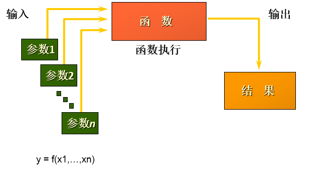
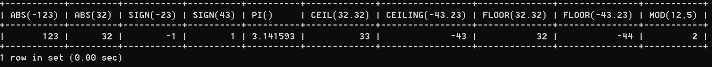

第 07 章_单行函数
===========

## 1. 函数的理解[#](#1-函数的理解)

---------------------

### 1.1 什么是函数[#](#11-什么是函数)

函数在计算机语言的使用中贯穿始终，函数的作用是什么呢？它可以把我们经常使用的代码封装起来，需要的时候直接调用即可。这样既`提高了代码效率`，又`提高了可维护性`。在 SQL 中我们也可以使用函数对检索出来的数据进行函数操作。使用这些函数，可以极大地`提高用户对数据库的管理效率`。

[](https://imag.fun-ny.cn/1554979529525.png)

从函数定义的角度出发，我们可以将函数分成`内置函数`和`自定义函数`。在 SQL 语言中，同样也包括了内置函数和自定义函数。内置函数是系统内置的通用函数，而自定义函数是我们根据自己的需要编写的，本章及下一章讲解的是 SQL 的内置函数。

### 1.2 不同 DBMS 函数的差异[#](#12-不同dbms函数的差异)

我们在使用 SQL 语言的时候，不是直接和这门语言打交道，而是通过它使用不同的数据库软件，即 DBMS。**DBMS 之间的差异性很大，远大于同一个语言不同版本之间的差异。**实际上，只有很少的函数是被 DBMS 同时支持的。比如，大多数 DBMS 使用（||）或者（+）来做拼接符，而在 MySQL 中的字符串拼接函数为 concat()。大部分 DBMS 会有自己特定的函数，这就意味着**采用 SQL 函数的代码可移植性是很差的**，因此在使用函数的时候需要特别注意。

### 1.3 MySQL 的内置函数及分类[#](#13-mysql的内置函数及分类)

MySQL 提供了丰富的内置函数，这些函数使得数据的维护与管理更加方便，能够更好地提供数据的分析与统计功能，在一定程度上提高了开发人员进行数据分析与统计的效率。

MySQL 提供的内置函数从`实现的功能角度`可以分为数值函数、字符串函数、日期和时间函数、流程控制函数、加密与解密函数、获取 MySQL 信息函数、聚合函数等。这里，我将这些丰富的内置函数再分为两类：`单行函数`、`聚合函数（或分组函数）`。

**两种 SQL 函数**

[](https://imag.fun-ny.cn/1555433204337.png)

**单行函数**

*   操作数据对象
*   接受参数返回一个结果
*   **只对一行进行变换**
*   **每行返回一个结果**
*   可以嵌套
*   参数可以是一列或一个值

## 2. 数值函数[#](#2-数值函数)

-------------------

### 2.1 基本函数[#](#21-基本函数)

<table><thead><tr><th>函数</th><th>用法</th></tr></thead><tbody><tr><td>ABS(x)</td><td>返回 x 的绝对值</td></tr><tr><td>SIGN(X)</td><td>返回 X 的符号。正数返回 1，负数返回 - 1，0 返回 0</td></tr><tr><td>PI()</td><td>返回圆周率的值</td></tr><tr><td>CEIL(x)，CEILING(x)</td><td>返回大于或等于某个值的最小整数</td></tr><tr><td>FLOOR(x)</td><td>返回小于或等于某个值的最大整数</td></tr><tr><td>LEAST(e1,e2,e3…)</td><td>返回列表中的最小值</td></tr><tr><td>GREATEST(e1,e2,e3…)</td><td>返回列表中的最大值</td></tr><tr><td>MOD(x,y)</td><td>返回 X 除以 Y 后的余数</td></tr><tr><td>RAND()</td><td>返回 0~1 的随机值</td></tr><tr><td>RAND(x)</td><td>返回 0~1 的随机值，其中 x 的值用作种子值，相同的 X 值会产生相同的随机数</td></tr><tr><td>ROUND(x)</td><td>返回一个对 x 的值进行四舍五入后，最接近于 X 的整数</td></tr><tr><td>ROUND(x,y)</td><td>返回一个对 x 的值进行四舍五入后最接近 X 的值，并保留到小数点后面 Y 位</td></tr><tr><td>TRUNCATE(x,y)</td><td>返回数字 x 截断为 y 位小数的结果</td></tr><tr><td>SQRT(x)</td><td>返回 x 的平方根。当 X 的值为负数时，返回 NULL</td></tr></tbody></table>

举例：

```mysql
SELECT ABS(-123),ABS(32),SIGN(-23),SIGN(43),PI(),CEIL(32.32),CEILING(-43.23),FLOOR(32.32),
FLOOR(-43.23),MOD(12,5)
FROM DUAL;
```

[](https://imag.fun-ny.cn/image-20211025162304844.png)

```mysql
SELECT RAND(),RAND(),RAND(10),RAND(10),RAND(-1),RAND(-1)
FROM DUAL;
```

[](https://imag.fun-ny.cn/image-20211025162538958.png)

```mysql
SELECT ROUND(12.33),ROUND(12.343,2),ROUND(12.324,-1),TRUNCATE(12.66,1),TRUNCATE(12.66,-1)
FROM DUAL;
```

[](https://imag.fun-ny.cn/image-20211025162730421.png)

### 2.2 角度与弧度互换函数[#](#22-角度与弧度互换函数)

<table><thead><tr><th>函数</th><th>用法</th></tr></thead><tbody><tr><td>RADIANS(x)</td><td>将角度转化为弧度，其中，参数 x 为角度值</td></tr><tr><td>DEGREES(x)</td><td>将弧度转化为角度，其中，参数 x 为弧度值</td></tr></tbody></table>

```mysql
SELECT RADIANS(30),RADIANS(60),RADIANS(90),DEGREES(2*PI()),DEGREES(RADIANS(90))
FROM DUAL;
```

### 2.3 三角函数[#](#23-三角函数)

<table><thead><tr><th>函数</th><th>用法</th></tr></thead><tbody><tr><td>SIN(x)</td><td>返回 x 的正弦值，其中，参数 x 为弧度值</td></tr><tr><td>ASIN(x)</td><td>返回 x 的反正弦值，即获取正弦为 x 的值。如果 x 的值不在 - 1 到 1 之间，则返回 NULL</td></tr><tr><td>COS(x)</td><td>返回 x 的余弦值，其中，参数 x 为弧度值</td></tr><tr><td>ACOS(x)</td><td>返回 x 的反余弦值，即获取余弦为 x 的值。如果 x 的值不在 - 1 到 1 之间，则返回 NULL</td></tr><tr><td>TAN(x)</td><td>返回 x 的正切值，其中，参数 x 为弧度值</td></tr><tr><td>ATAN(x)</td><td>返回 x 的反正切值，即返回正切值为 x 的值</td></tr><tr><td>ATAN2(m,n)</td><td>返回两个参数的反正切值</td></tr><tr><td>COT(x)</td><td>返回 x 的余切值，其中，X 为弧度值</td></tr></tbody></table>

举例：

ATAN2(M,N) 函数返回两个参数的反正切值。  
与 ATAN(X) 函数相比，ATAN2(M,N) 需要两个参数，例如有两个点 point(x1,y1) 和 point(x2,y2)，使用 ATAN(X) 函数计算反正切值为 ATAN((y2-y1)/(x2-x1))，使用 ATAN2(M,N) 计算反正切值则为 ATAN2(y2-y1,x2-x1)。由使用方式可以看出，当 x2-x1 等于 0 时，ATAN(X) 函数会报错，而 ATAN2(M,N) 函数则仍然可以计算。

ATAN2(M,N) 函数的使用示例如下：

```mysql
SELECT SIN(RADIANS(30)),DEGREES(ASIN(1)),TAN(RADIANS(45)),DEGREES(ATAN(1)),DEGREES(ATAN2(1,1))
FROM DUAL;
```

[](https://imag.fun-ny.cn/image-20211025163846974.png)

### 2.4 指数与对数[#](#24-指数与对数)

<table><thead><tr><th>函数</th><th>用法</th></tr></thead><tbody><tr><td>POW(x,y)，POWER(X,Y)</td><td>返回 x 的 y 次方</td></tr><tr><td>EXP(X)</td><td>返回 e 的 X 次方，其中 e 是一个常数，2.718281828459045</td></tr><tr><td>LN(X)，LOG(X)</td><td>返回以 e 为底的 X 的对数，当 X &lt;= 0 时，返回的结果为 NULL</td></tr><tr><td>LOG10(X)</td><td>返回以 10 为底的 X 的对数，当 X &lt;= 0 时，返回的结果为 NULL</td></tr><tr><td>LOG2(X)</td><td>返回以 2 为底的 X 的对数，当 X &lt;= 0 时，返回 NULL</td></tr></tbody></table>

```mysql
mysql> SELECT POW(2,5),POWER(2,4),EXP(2),LN(10),LOG10(10),LOG2(4)
    -> FROM DUAL;
+----------+------------+------------------+-------------------+-----------+---------+
| POW(2,5) | POWER(2,4) | EXP(2)           | LN(10)            | LOG10(10) | LOG2(4) |
+----------+------------+------------------+-------------------+-----------+---------+
|       32 |         16 | 7.38905609893065 | 2.302585092994046 |         1 |       2 |
+----------+------------+------------------+-------------------+-----------+---------+
1 row in set (0.00 sec)
```

### 2.5 进制间的转换[#](#25-进制间的转换)

<table><thead><tr><th>函数</th><th>用法</th></tr></thead><tbody><tr><td>BIN(x)</td><td>返回 x 的二进制编码</td></tr><tr><td>HEX(x)</td><td>返回 x 的十六进制编码</td></tr><tr><td>OCT(x)</td><td>返回 x 的八进制编码</td></tr><tr><td>CONV(x,f1,f2)</td><td>返回 f1 进制数变成 f2 进制数</td></tr></tbody></table>

```mysql
mysql> SELECT BIN(10),HEX(10),OCT(10),CONV(10,2,8)
    -> FROM DUAL;
+---------+---------+---------+--------------+
| BIN(10) | HEX(10) | OCT(10) | CONV(10,2,8) |
+---------+---------+---------+--------------+
| 1010    | A       | 12      | 2            |
+---------+---------+---------+--------------+
1 row in set (0.00 sec)
```

## 3. 字符串函数[#](#3-字符串函数)

---------------------

<table><thead><tr><th>函数</th><th>用法</th></tr></thead><tbody><tr><td>ASCII(S)</td><td>返回字符串 S 中的第一个字符的 ASCII 码值</td></tr><tr><td>CHAR_LENGTH(s)</td><td>返回字符串 s 的字符数。作用与 CHARACTER_LENGTH(s) 相同</td></tr><tr><td>LENGTH(s)</td><td>返回字符串 s 的字节数，和字符集有关</td></tr><tr><td>CONCAT(s1,s2,......,sn)</td><td>连接 s1,s2,......,sn 为一个字符串</td></tr><tr><td>CONCAT_WS(x, s1,s2,......,sn)</td><td>同 CONCAT(s1,s2,...) 函数，但是每个字符串之间要加上 x</td></tr><tr><td>INSERT(str, idx, len, replacestr)</td><td>将字符串 str 从第 idx 位置开始，len 个字符长的子串替换为字符串 replacestr</td></tr><tr><td>REPLACE(str, a, b)</td><td>用字符串 b 替换字符串 str 中所有出现的字符串 a</td></tr><tr><td>UPPER(s) 或 UCASE(s)</td><td>将字符串 s 的所有字母转成大写字母</td></tr><tr><td>LOWER(s) 或 LCASE(s)</td><td>将字符串 s 的所有字母转成小写字母</td></tr><tr><td>LEFT(str,n)</td><td>返回字符串 str 最左边的 n 个字符</td></tr><tr><td>RIGHT(str,n)</td><td>返回字符串 str 最右边的 n 个字符</td></tr><tr><td>LPAD(str, len, pad)</td><td>用字符串 pad 对 str 最左边进行填充，直到 str 的长度为 len 个字符</td></tr><tr><td>RPAD(str ,len, pad)</td><td>用字符串 pad 对 str 最右边进行填充，直到 str 的长度为 len 个字符</td></tr><tr><td>LTRIM(s)</td><td>去掉字符串 s 左侧的空格</td></tr><tr><td>RTRIM(s)</td><td>去掉字符串 s 右侧的空格</td></tr><tr><td>TRIM(s)</td><td>去掉字符串 s 开始与结尾的空格</td></tr><tr><td>TRIM(s1 FROM s)</td><td>去掉字符串 s 开始与结尾的 s1</td></tr><tr><td>TRIM(LEADING s1 FROM s)</td><td>去掉字符串 s 开始处的 s1</td></tr><tr><td>TRIM(TRAILING s1 FROM s)</td><td>去掉字符串 s 结尾处的 s1</td></tr><tr><td>REPEAT(str, n)</td><td>返回 str 重复 n 次的结果</td></tr><tr><td>SPACE(n)</td><td>返回 n 个空格</td></tr><tr><td>STRCMP(s1,s2)</td><td>比较字符串 s1,s2 的 ASCII 码值的大小</td></tr><tr><td>SUBSTR(s,index,len)</td><td>返回从字符串 s 的 index 位置其 len 个字符，作用与 SUBSTRING(s,n,len)、MID(s,n,len) 相同</td></tr><tr><td>LOCATE(substr,str)</td><td>返回字符串 substr 在字符串 str 中首次出现的位置，作用于 POSITION(substr IN str)、INSTR(str,substr) 相同。未找到，返回 0</td></tr><tr><td>ELT(m,s1,s2,…,sn)</td><td>返回指定位置的字符串，如果 m=1，则返回 s1，如果 m=2，则返回 s2，如果 m=n，则返回 sn</td></tr><tr><td>FIELD(s,s1,s2,…,sn)</td><td>返回字符串 s 在字符串列表中第一次出现的位置</td></tr><tr><td>FIND_IN_SET(s1,s2)</td><td>返回字符串 s1 在字符串 s2 中出现的位置。其中，字符串 s2 是一个以逗号分隔的字符串</td></tr><tr><td>REVERSE(s)</td><td>返回 s 反转后的字符串</td></tr><tr><td>NULLIF(value1,value2)</td><td>比较两个字符串，如果 value1 与 value2 相等，则返回 NULL，否则返回 value1</td></tr></tbody></table>

> 注意：MySQL 中，字符串的位置是从 1 开始的。

举例：

```mysql
mysql> SELECT FIELD('mm','hello','msm','amma'),FIND_IN_SET('mm','hello,mm,amma')
    -> FROM DUAL;
+----------------------------------+-----------------------------------+
| FIELD('mm','hello','msm','amma') | FIND_IN_SET('mm','hello,mm,amma') |
+----------------------------------+-----------------------------------+
|                                0 |                                 2 |
+----------------------------------+-----------------------------------+
1 row in set (0.00 sec)
```

```mysql
mysql> SELECT NULLIF('mysql','mysql'),NULLIF('mysql', '');
+-------------------------+---------------------+
| NULLIF('mysql','mysql') | NULLIF('mysql', '') |
+-------------------------+---------------------+
| NULL                    | mysql               |
+-------------------------+---------------------+
1 row in set (0.00 sec)
```

## 4. 日期和时间函数[#](#4-日期和时间函数)

-------------------------

### 4.1 获取日期、时间[#](#41-获取日期时间)

<table><thead><tr><th>函数</th><th>用法</th></tr></thead><tbody><tr><td><strong>CURDATE()</strong> ，CURRENT_DATE()</td><td>返回当前日期，只包含年、月、日</td></tr><tr><td><strong>CURTIME()</strong> ， CURRENT_TIME()</td><td>返回当前时间，只包含时、分、秒</td></tr><tr><td><strong>NOW()</strong> / SYSDATE() / CURRENT_TIMESTAMP() / LOCALTIME() / LOCALTIMESTAMP()</td><td>返回当前系统日期和时间</td></tr><tr><td>UTC_DATE()</td><td>返回 UTC（世界标准时间）日期</td></tr><tr><td>UTC_TIME()</td><td>返回 UTC（世界标准时间）时间</td></tr></tbody></table>

举例：

```mysql
SELECT CURDATE(),CURTIME(),NOW(),SYSDATE()+0,UTC_DATE(),UTC_DATE()+0,UTC_TIME(),UTC_TIME()+0
FROM DUAL;
```

[](https://imag.fun-ny.cn/image-20211025193742633.png)

### 4.2 日期与时间戳的转换[#](#42-日期与时间戳的转换)

<table><thead><tr><th>函数</th><th>用法</th></tr></thead><tbody><tr><td>UNIX_TIMESTAMP()</td><td>以 UNIX 时间戳的形式返回当前时间。SELECT UNIX_TIMESTAMP() -&gt;1634348884</td></tr><tr><td>UNIX_TIMESTAMP(date)</td><td>将时间 date 以 UNIX 时间戳的形式返回。</td></tr><tr><td>FROM_UNIXTIME(timestamp)</td><td>将 UNIX 时间戳的时间转换为普通格式的时间</td></tr></tbody></table>

举例：

```mysql
mysql> SELECT UNIX_TIMESTAMP(now());
+-----------------------+
| UNIX_TIMESTAMP(now()) |
+-----------------------+
|            1576380910 |
+-----------------------+
1 row in set (0.01 sec)

mysql> SELECT UNIX_TIMESTAMP(CURDATE());
+---------------------------+
| UNIX_TIMESTAMP(CURDATE()) |
+---------------------------+
|                1576339200 |
+---------------------------+
1 row in set (0.00 sec)

mysql> SELECT UNIX_TIMESTAMP(CURTIME());
+---------------------------+
| UNIX_TIMESTAMP(CURTIME()) |
+---------------------------+
|                1576380969 |
+---------------------------+
1 row in set (0.00 sec)

mysql> SELECT UNIX_TIMESTAMP('2011-11-11 11:11:11')
+---------------------------------------+
| UNIX_TIMESTAMP('2011-11-11 11:11:11') |
+---------------------------------------+
|                            1320981071 |
+---------------------------------------+
1 row in set (0.00 sec)
```

```mysql
mysql> SELECT FROM_UNIXTIME(1576380910);
+---------------------------+
| FROM_UNIXTIME(1576380910) |
+---------------------------+
| 2019-12-15 11:35:10       |
+---------------------------+
1 row in set (0.00 sec)
```

### 4.3 获取月份、星期、星期数、天数等函数[#](#43-获取月份星期星期数天数等函数)

<table><thead><tr><th>函数</th><th>用法</th></tr></thead><tbody><tr><td>YEAR(date) / MONTH(date) / DAY(date)</td><td>返回具体的日期值</td></tr><tr><td>HOUR(time) / MINUTE(time) / SECOND(time)</td><td>返回具体的时间值</td></tr><tr><td>MONTHNAME(date)</td><td>返回月份：January，...</td></tr><tr><td>DAYNAME(date)</td><td>返回星期几：MONDAY，TUESDAY.....SUNDAY</td></tr><tr><td>WEEKDAY(date)</td><td>返回周几，注意，周 1 是 0，周 2 是 1，。。。周日是 6</td></tr><tr><td>QUARTER(date)</td><td>返回日期对应的季度，范围为 1～4</td></tr><tr><td>WEEK(date) ， WEEKOFYEAR(date)</td><td>返回一年中的第几周</td></tr><tr><td>DAYOFYEAR(date)</td><td>返回日期是一年中的第几天</td></tr><tr><td>DAYOFMONTH(date)</td><td>返回日期位于所在月份的第几天</td></tr><tr><td>DAYOFWEEK(date)</td><td>返回周几，注意：周日是 1，周一是 2，。。。周六是 7</td></tr></tbody></table>

举例：

```mysql
SELECT YEAR(CURDATE()),MONTH(CURDATE()),DAY(CURDATE()),
HOUR(CURTIME()),MINUTE(NOW()),SECOND(SYSDATE())
FROM DUAL;
```

[](https://imag.fun-ny.cn/image-20211025213504115.png)

```mysql
SELECT MONTHNAME('2021-10-26'),DAYNAME('2021-10-26'),WEEKDAY('2021-10-26'),
QUARTER(CURDATE()),WEEK(CURDATE()),DAYOFYEAR(NOW()),
DAYOFMONTH(NOW()),DAYOFWEEK(NOW())
FROM DUAL;
```

[](https://imag.fun-ny.cn/image-20211025214818623.png)

### 4.4 日期的操作函数[#](#44-日期的操作函数)

<table><thead><tr><th>函数</th><th>用法</th></tr></thead><tbody><tr><td>EXTRACT(type FROM date)</td><td>返回指定日期中特定的部分，type 指定返回的值</td></tr></tbody></table>

EXTRACT(type FROM date) 函数中 type 的取值与含义：

[](https://imag.fun-ny.cn/image-20211012142639469.png)

[](https://imag.fun-ny.cn/image-20211012142746444.png)

```mysql
-- 2021-12-27 01:08:18 
 SELECT EXTRACT(MINUTE FROM NOW()),EXTRACT( WEEK FROM NOW()),
 EXTRACT( QUARTER FROM NOW()),EXTRACT( MINUTE_SECOND FROM NOW())
 FROM DUAL;
+----------------------------+---------------------------+------------------------------+------------------------------------+
| EXTRACT(MINUTE FROM NOW()) | EXTRACT( WEEK FROM NOW()) | EXTRACT( QUARTER FROM NOW()) | EXTRACT( MINUTE_SECOND FROM NOW()) |
+----------------------------+---------------------------+------------------------------+------------------------------------+
|                          8 |                        52 |                            4 |
 828 |
+----------------------------+---------------------------+------------------------------+------------------------------------+
1 row in set (0.00 sec)
```

### 4.5 时间和秒钟转换的函数[#](#45-时间和秒钟转换的函数)

<table><thead><tr><th>函数</th><th>用法</th></tr></thead><tbody><tr><td>TIME_TO_SEC(time)</td><td>将 time 转化为秒并返回结果值。转化的公式为：<code>小时*3600+分钟*60+秒</code></td></tr><tr><td>SEC_TO_TIME(seconds)</td><td>将 seconds 描述转化为包含小时、分钟和秒的时间</td></tr></tbody></table>

举例：

```mysql
mysql> SELECT TIME_TO_SEC(NOW());
+--------------------+
| TIME_TO_SEC(NOW()) |
+--------------------+
|               78774 |
+--------------------+
1 row in set (0.00 sec)
```

```mysql
mysql> SELECT SEC_TO_TIME(78774);
+--------------------+
| SEC_TO_TIME(78774) |
+--------------------+
| 21:52:54            |
+--------------------+
1 row in set (0.12 sec)
```

### 4.6 计算日期和时间的函数[#](#46-计算日期和时间的函数)

**第 1 组：**

<table><thead><tr><th>函数</th><th>用法</th></tr></thead><tbody><tr><td>DATE_ADD(datetime, INTERVAL expr type)，ADDDATE(date,INTERVAL expr type)</td><td>返回与给定日期时间相差 INTERVAL 时间段的日期时间</td></tr><tr><td>DATE_SUB(date,INTERVAL expr type)，SUBDATE(date,INTERVAL expr type)</td><td>返回与 date 相差 INTERVAL 时间间隔的日期</td></tr></tbody></table>

上述函数中 type 的取值：

[](https://imag.fun-ny.cn/image-20211012143203355.png)

```
MICROSECOND、SECOND、MINUTE、HOUR、DAY、WEEK、MONTH、QUARTER、YEAR、SECOND_MICROSECOND、MINUTE_MICROSECOND、MINUTE_SECOND、HOUR_MICROSECOND、HOUR_SECOND、HOUR_MINUTE、DAY_MICROSECOND、DAY_SECOND、DAY_MINUTE、DAY_HOUR、YEAR_MONTH               
```

举例：

```mysql
SELECT DATE_ADD(NOW(), INTERVAL 1 DAY) AS col1,DATE_ADD('2021-10-21 23:32:12',INTERVAL 1 SECOND) AS col2,
ADDDATE('2021-10-21 23:32:12',INTERVAL 1 SECOND) AS col3,
DATE_ADD('2021-10-21 23:32:12',INTERVAL '1_1' MINUTE_SECOND) AS col4,
DATE_ADD(NOW(), INTERVAL -1 YEAR) AS col5, #可以是负数
DATE_ADD(NOW(), INTERVAL '1_1' YEAR_MONTH) AS col6 #需要单引号
FROM DUAL;

+---------------------+---------------------+---------------------+---------------------+---------------------+---------------------+
| col1                | col2                | col3                | col4                | col5                | col6                |
+---------------------+---------------------+---------------------+---------------------+---------------------+---------------------+
| 2021-12-28 01:10:43 | 2021-10-21 23:32:13 | 2021-10-21 23:32:13 | 2021-10-21 23:33:13 | 2020-12-27 01:10:43 | 2023-01-27 01:10:43 |
+---------------------+---------------------+---------------------+---------------------+---------------------+---------------------+
1 row in set (0.00 sec)
```

```mysql
SELECT DATE_SUB('2021-01-21',INTERVAL 31 DAY) AS col1,
SUBDATE('2021-01-21',INTERVAL 31 DAY) AS col2,
DATE_SUB('2021-01-21 02:01:01',INTERVAL '1 1' DAY_HOUR) AS col3
FROM DUAL;

+------------+------------+---------------------+
| col1       | col2       | col3                |
+------------+------------+---------------------+
| 2020-12-21 | 2020-12-21 | 2021-01-20 01:01:01 |
+------------+------------+---------------------+
1 row in set (0.00 sec)
```

**第 2 组：**

<table><thead><tr><th>函数</th><th>用法</th></tr></thead><tbody><tr><td>ADDTIME(time1,time2)</td><td>返回 time1 加上 time2 的时间。当 time2 为一个数字时，代表的是<code>秒</code>，可以为负数</td></tr><tr><td>SUBTIME(time1,time2)</td><td>返回 time1 减去 time2 后的时间。当 time2 为一个数字时，代表的是<code>秒</code>，可以为负数</td></tr><tr><td>DATEDIFF(date1,date2)</td><td>返回 date1 - date2 的日期间隔天数</td></tr><tr><td>TIMEDIFF(time1, time2)</td><td>返回 time1 - time2 的时间间隔</td></tr><tr><td>FROM_DAYS(N)</td><td>返回从 0000 年 1 月 1 日起，N 天以后的日期</td></tr><tr><td>TO_DAYS(date)</td><td>返回日期 date 距离 0000 年 1 月 1 日的天数</td></tr><tr><td>LAST_DAY(date)</td><td>返回 date 所在月份的最后一天的日期</td></tr><tr><td>MAKEDATE(year,n)</td><td>针对给定年份与所在年份中的天数返回一个日期</td></tr><tr><td>MAKETIME(hour,minute,second)</td><td>将给定的小时、分钟和秒组合成时间并返回</td></tr><tr><td>PERIOD_ADD(time,n)</td><td>返回 time 加上 n 后的时间</td></tr></tbody></table>

举例：

```mysql
SELECT ADDTIME(NOW(),20),SUBTIME(NOW(),30),SUBTIME(NOW(),'1:1:3'),DATEDIFF(NOW(),'2021-10-01'),
TIMEDIFF(NOW(),'2021-10-25 22:10:10'),FROM_DAYS(366),TO_DAYS('0000-12-25'),
LAST_DAY(NOW()),MAKEDATE(YEAR(NOW()),12),MAKETIME(10,21,23),PERIOD_ADD(20200101010101,10)
FROM DUAL;
```

```mysql
mysql> SELECT ADDTIME(NOW(), 50);
+---------------------+
| ADDTIME(NOW(), 50)  |
+---------------------+
| 2019-12-15 22:17:47 |
+---------------------+
1 row in set (0.00 sec)

mysql> SELECT ADDTIME(NOW(), '1:1:1');
+-------------------------+
| ADDTIME(NOW(), '1:1:1') |
+-------------------------+
| 2019-12-15 23:18:46     |
+-------------------------+
1 row in set (0.00 sec)
```

```mysql
mysql> SELECT SUBTIME(NOW(), '1:1:1');
+-------------------------+
| SUBTIME(NOW(), '1:1:1') |
+-------------------------+
| 2019-12-15 21:23:50     |
+-------------------------+
1 row in set (0.00 sec)

mysql> SELECT SUBTIME(NOW(), '-1:-1:-1'); 
+----------------------------+
| SUBTIME(NOW(), '-1:-1:-1') |
+----------------------------+
| 2019-12-15 22:25:11        |
+----------------------------+
1 row in set, 1 warning (0.00 sec)
```

```mysql
mysql> SELECT FROM_DAYS(366);
+----------------+
| FROM_DAYS(366) |
+----------------+
| 0001-01-01     |
+----------------+
1 row in set (0.00 sec)
```

```mysql
mysql> SELECT MAKEDATE(2020,1);
+------------------+
| MAKEDATE(2020,1) |
+------------------+
| 2020-01-01       |
+------------------+
1 row in set (0.00 sec)

mysql> SELECT MAKEDATE(2020,32);
+-------------------+
| MAKEDATE(2020,32) |
+-------------------+
| 2020-02-01        |
+-------------------+
1 row in set (0.00 sec)
```

```mysql
mysql> SELECT MAKETIME(1,1,1);
+-----------------+
| MAKETIME(1,1,1) |
+-----------------+
| 01:01:01        |
+-----------------+
1 row in set (0.00 sec)
```

```mysql
mysql> SELECT PERIOD_ADD(20200101010101,1);
+------------------------------+
| PERIOD_ADD(20200101010101,1) |
+------------------------------+
|               20200101010102 |
+------------------------------+
1 row in set (0.00 sec)
```

```mysql
mysql> SELECT TO_DAYS(NOW());
+----------------+
| TO_DAYS(NOW()) |
+----------------+
|          737773 |
+----------------+
1 row in set (0.00 sec)
```

举例：查询 7 天内的新增用户数有多少？

```mysql
SELECT COUNT(*) as num FROM new_user WHERE TO_DAYS(NOW())-TO_DAYS(regist_time)<=7
```

### 4.7 日期的格式化与解析[#](#47-日期的格式化与解析)

<table><thead><tr><th>函数</th><th>用法</th></tr></thead><tbody><tr><td>DATE_FORMAT(date,fmt)</td><td>按照字符串 fmt 格式化日期 date 值</td></tr><tr><td>TIME_FORMAT(time,fmt)</td><td>按照字符串 fmt 格式化时间 time 值</td></tr><tr><td>GET_FORMAT(date_type,format_type)</td><td>返回日期字符串的显示格式</td></tr><tr><td>STR_TO_DATE(str, fmt)</td><td>按照字符串 fmt 对 str 进行解析，解析为一个日期</td></tr></tbody></table>

上述`非GET_FORMAT`函数中 fmt 参数常用的格式符：

<table><thead><tr><th>格式符</th><th>说明</th><th>格式符</th><th>说明</th></tr></thead><tbody><tr><td>%Y</td><td>4 位数字表示年份</td><td>%y</td><td>表示两位数字表示年份</td></tr><tr><td>%M</td><td>月名表示月份（January,....）</td><td>%m</td><td>两位数字表示月份（01,02,03。。。）</td></tr><tr><td>%b</td><td>缩写的月名（Jan.，Feb.，....）</td><td>%c</td><td>数字表示月份（1,2,3,...）</td></tr><tr><td>%D</td><td>英文后缀表示月中的天数（1st,2nd,3rd,...）</td><td>%d</td><td>两位数字表示月中的天数 (01,02...)</td></tr><tr><td>%e</td><td>数字形式表示月中的天数（1,2,3,4,5.....）</td><td></td><td></td></tr><tr><td>%H</td><td>两位数字表示小数，24 小时制（01,02..）</td><td>%h 和 %I</td><td>两位数字表示小时，12 小时制（01,02..）</td></tr><tr><td>%k</td><td>数字形式的小时，24 小时制 (1,2,3)</td><td>%l</td><td>数字形式表示小时，12 小时制（1,2,3,4....）</td></tr><tr><td>%i</td><td>两位数字表示分钟（00,01,02）</td><td>%S 和 %s</td><td>两位数字表示秒 (00,01,02...)</td></tr><tr><td>%W</td><td>一周中的星期名称（Sunday...）</td><td>%a</td><td>一周中的星期缩写（Sun.，Mon.,Tues.，..）</td></tr><tr><td>%w</td><td>以数字表示周中的天数 (0=Sunday,1=Monday....)</td><td></td><td></td></tr><tr><td>%j</td><td>以 3 位数字表示年中的天数 (001,002...)</td><td>%U</td><td>以数字表示年中的第几周，（1,2,3。。）其中 Sunday 为周中第一天</td></tr><tr><td>%u</td><td>以数字表示年中的第几周，（1,2,3。。）其中 Monday 为周中第一天</td><td></td><td></td></tr><tr><td>%T</td><td>24 小时制</td><td>%r</td><td>12 小时制</td></tr><tr><td>%p</td><td>AM 或 PM</td><td>%%</td><td>表示 %</td></tr></tbody></table>

GET_FORMAT 函数中 date_type 和 format_type 参数取值如下：

[](https://imag.fun-ny.cn/image-20211012145231321.png)

举例：

```mysql
mysql> SELECT DATE_FORMAT(NOW(), '%H:%i:%s');
+--------------------------------+
| DATE_FORMAT(NOW(), '%H:%i:%s') |
+--------------------------------+
| 22:57:34                        |
+--------------------------------+
1 row in set (0.00 sec)
```

```mysql
SELECT STR_TO_DATE('09/01/2009','%m/%d/%Y')
FROM DUAL;

SELECT STR_TO_DATE('20140422154706','%Y%m%d%H%i%s')
FROM DUAL;

SELECT STR_TO_DATE('2014-04-22 15:47:06','%Y-%m-%d %H:%i:%s')
FROM DUAL;
```

```mysql
mysql> SELECT GET_FORMAT(DATE, 'USA');
+-------------------------+
| GET_FORMAT(DATE, 'USA') |
+-------------------------+
| %m.%d.%Y                |
+-------------------------+
1 row in set (0.00 sec)

SELECT DATE_FORMAT(NOW(),GET_FORMAT(DATE,'USA')),
FROM DUAL;
```

```mysql
mysql> SELECT STR_TO_DATE('2020-01-01 00:00:00','%Y-%m-%d'); 
+-----------------------------------------------+
| STR_TO_DATE('2020-01-01 00:00:00','%Y-%m-%d') |
+-----------------------------------------------+
| 2020-01-01                                    |
+-----------------------------------------------+
1 row in set, 1 warning (0.00 sec)
```

## 5.流程控制函数if case[#](#5-流程控制函数)

-----------------------

流程处理函数可以根据不同的条件，执行不同的处理流程，可以在 SQL 语句中实现不同的条件选择。MySQL 中的流程处理函数主要包括 IF()、IFNULL() 和 CASE() 函数。

<table><thead><tr><th>函数</th><th>用法</th></tr></thead><tbody><tr><td>IF(value,value1,value2)</td><td>如果 value 的值为 TRUE，返回 value1，否则返回 value2</td></tr><tr><td>IFNULL(value1, value2)</td><td>如果 value1 不为 NULL，返回 value1，否则返回 value2</td></tr><tr><td>CASE WHEN 条件 1 THEN 结果 1 WHEN 条件 2 THEN 结果 2 .... [ELSE resultn] END</td><td>相当于 Java 的 if...else if...else...</td></tr><tr><td>CASE expr WHEN 常量值 1 THEN 值 1 WHEN 常量值 1 THEN 值 1 .... [ELSE 值 n] END</td><td>相当于 Java 的 switch...case...</td></tr></tbody></table>

```mysql
SELECT IF(1 > 0,'正确','错误')    
->正确

SELECT last_name,commission_pct,IF(commission_pct IS NOT NULL,commission_pct,0) "details",
salary * 12 * (1 + IF(commission_pct IS NOT NULL,commission_pct,0)) "annual_sal"
FROM employees;
```

```mysql
SELECT IFNULL(null,'Hello Word')
->Hello Word
```

```mysql
SELECT CASE
           WHEN 1 > 0 THEN '1 > 0'
           WHEN 2 > 0 THEN '2 > 0'
           ELSE '3 > 0'
           END  AS "col"
->1 > 0
```

```mysql
SELECT CASE 1
           WHEN 1 THEN '我是1'
           WHEN 2 THEN '我是2'
           ELSE '你是谁' END 
```

```mysql
SELECT employee_id,salary, CASE WHEN salary>=15000 THEN '高薪' 
				  WHEN salary>=10000 THEN '潜力股'  
				  WHEN salary>=8000 THEN '屌丝' 
				  ELSE '草根' END AS "描述"
FROM employees;
```

```mysql
SELECT oid,`status`, CASE `status` WHEN 1 THEN '未付款' 
								   WHEN 2 THEN '已付款' 
								   WHEN 3 THEN '已发货'  
								   WHEN 4 THEN '确认收货'  
								   ELSE '无效订单' END 
FROM t_order;
```

```mysql
mysql> SELECT CASE WHEN 1 > 0 THEN 'yes' WHEN 1 <= 0 THEN 'no' ELSE 'unknown' END;
+---------------------------------------------------------------------+
| CASE WHEN 1 > 0 THEN 'yes' WHEN 1 <= 0 THEN 'no' ELSE 'unknown' END |
+---------------------------------------------------------------------+
| yes                                                                  |
+---------------------------------------------------------------------+
1 row in set (0.00 sec)

mysql> SELECT CASE WHEN 1 < 0 THEN 'yes' WHEN 1 = 0 THEN 'no' ELSE 'unknown' END;  
+--------------------------------------------------------------------+
| CASE WHEN 1 < 0 THEN 'yes' WHEN 1 = 0 THEN 'no' ELSE 'unknown' END |
+--------------------------------------------------------------------+
| unknown                                                             |
+--------------------------------------------------------------------+
1 row in set (0.00 sec)
```

```mysql
mysql> SELECT CASE 1 WHEN 0 THEN 0 WHEN 1 THEN 1 ELSE -1 END;
+------------------------------------------------+
| CASE 1 WHEN 0 THEN 0 WHEN 1 THEN 1 ELSE -1 END |
+------------------------------------------------+
|                                               1 |
+------------------------------------------------+
1 row in set (0.00 sec)

mysql> SELECT CASE -1 WHEN 0 THEN 0 WHEN 1 THEN 1 ELSE -1 END;
+-------------------------------------------------+
| CASE -1 WHEN 0 THEN 0 WHEN 1 THEN 1 ELSE -1 END |
+-------------------------------------------------+
|                                               -1 |
+-------------------------------------------------+
1 row in set (0.00 sec)
```

```mysql
SELECT employee_id,12 * salary * (1 + IFNULL(commission_pct,0))
FROM employees;
```

```mysql
SELECT last_name,
       job_id,
       salary,
       CASE job_id
           WHEN 'IT_PROG' THEN 1.10 * salary
           WHEN 'ST_CLERK' THEN 1.15 * salary
           WHEN 'SA_REP' THEN 1.20 * salary
           ELSE salary END AS "REVISED_SALARY"
FROM employees;
```

[](https://imag.fun-ny.cn/1554980865631.png)

**练习：查询部门号为 10,20, 30 的员工信息, 若部门号为 10, 则打印其工资的 1.1 倍, 20 号部门, 则打印其工资的 1.2 倍, 30 号部门打印其工资的 1.3 倍数。其余正常输出**

```mysql	
SELECT department_id,
       salary,
       CASE department_id
           WHEN 10 THEN salary * 1.1
           WHEN 20 THEN salary * 1.2
           WHEN 30 THEN salary * 1.3
           ELSE salary  END "all_salr"
FROM employees
```


## 6. 加密与解密函数[#](#6-加密与解密函数)

-------------------------

加密与解密函数主要用于对数据库中的数据进行加密和解密处理，以防止数据被他人窃取。这些函数在保证数据库安全时非常有用。

<table><thead><tr><th>函数</th><th>用法</th></tr></thead><tbody><tr><td>PASSWORD(str)</td><td>返回字符串 str 的加密版本，41 位长的字符串。加密结果<code>不可逆</code>，常用于用户的密码加密</td></tr><tr><td>MD5(str)</td><td>返回字符串 str 的 md5 加密后的值，也是一种加密方式。若参数为 NULL，则会返回 NULL</td></tr><tr><td>SHA(str)</td><td>从原明文密码 str 计算并返回加密后的密码字符串，当参数为 NULL 时，返回 NULL。<code>SHA加密算法比MD5更加安全</code>。</td></tr><tr><td>ENCODE(value,password_seed)</td><td>返回使用 password_seed 作为加密密码加密 value</td></tr><tr><td>DECODE(value,password_seed)</td><td>返回使用 password_seed 作为加密密码解密 value</td></tr></tbody></table>  

可以看到，ENCODE(value,password_seed) 函数与 DECODE(value,password_seed) 函数互为反函数。

举例：

```mysql
mysql> SELECT PASSWORD('mysql'), PASSWORD(NULL);  -- 8.0弃用
+-------------------------------------------+----------------+
| PASSWORD('mysql')                         | PASSWORD(NULL) |
+-------------------------------------------+----------------+
| *E74858DB86EBA20BC33D0AECAE8A8108C56B17FA |                |
+-------------------------------------------+----------------+
1 row in set, 1 warning (0.00 sec)
```

```mysql
SELECT md5('123')
->202cb962ac59075b964b07152d234b70
```

```mysql
SELECT SHA('Tom123')
->c7c506980abc31cc390a2438c90861d0f1216d50
```

```mysql
mysql> SELECT ENCODE('mysql', 'mysql');
+--------------------------+
| ENCODE('mysql', 'mysql') |
+--------------------------+
| íg　¼　ìÉ                  |
+--------------------------+
1 row in set, 1 warning (0.01 sec)
```

```mysql
mysql> SELECT DECODE(ENCODE('mysql','mysql'),'mysql');
+-----------------------------------------+
| DECODE(ENCODE('mysql','mysql'),'mysql') |
+-----------------------------------------+
| mysql                                   |
+-----------------------------------------+
1 row in set, 2 warnings (0.00 sec)
```

## 7. MySQL 信息函数[#](#7-mysql信息函数)

------------------------------

MySQL 中内置了一些可以查询 MySQL 信息的函数，这些函数主要用于帮助数据库开发或运维人员更好地对数据库进行维护工作。

<table><thead><tr><th>函数</th><th>用法</th></tr></thead><tbody><tr><td>VERSION()</td><td>返回当前 MySQL 的版本号</td></tr><tr><td>CONNECTION_ID()</td><td>返回当前 MySQL 服务器的连接数</td></tr><tr><td>DATABASE()，SCHEMA()</td><td>返回 MySQL 命令行当前所在的数据库</td></tr><tr><td>USER()，CURRENT_USER()、SYSTEM_USER()，SESSION_USER()</td><td>返回当前连接 MySQL 的用户名，返回结果格式为 “主机名 @用户名”</td></tr><tr><td>CHARSET(value)</td><td>返回字符串 value 自变量的字符集</td></tr><tr><td>COLLATION(value)</td><td>返回字符串 value 的比较规则</td></tr></tbody></table>

举例：

```mysql
mysql> SELECT DATABASE();
+------------+
| DATABASE() |
+------------+
| test       |
+------------+
1 row in set (0.00 sec)

mysql> SELECT DATABASE();
+------------+
| DATABASE() |
+------------+
| test       |
+------------+
1 row in set (0.00 sec)
```

```mysql
mysql> SELECT USER(), CURRENT_USER(), SYSTEM_USER(),SESSION_USER();
+----------------+----------------+----------------+----------------+
| USER()         | CURRENT_USER() | SYSTEM_USER()  | SESSION_USER() |
+----------------+----------------+----------------+----------------+
| root@localhost | root@localhost | root@localhost | root@localhost |
+----------------+----------------+----------------+----------------+
```

```mysql
mysql> SELECT CHARSET('ABC');
+----------------+
| CHARSET('ABC') |
+----------------+
| utf8mb4        |
+----------------+
1 row in set (0.00 sec)
```

```mysql
mysql> SELECT COLLATION('ABC');
+--------------------+
| COLLATION('ABC')   |
+--------------------+
| utf8mb4_general_ci |
+--------------------+
1 row in set (0.00 sec)
```

## 8. 其他函数[#](#8-其他函数)

-------------------

MySQL 中有些函数无法对其进行具体的分类，但是这些函数在 MySQL 的开发和运维过程中也是不容忽视的。

<table><thead><tr><th>函数</th><th>用法</th></tr></thead><tbody><tr><td>FORMAT(value,n)</td><td>返回对数字 value 进行格式化后的结果数据。n 表示<code>四舍五入</code>后保留到小数点后 n 位</td></tr><tr><td>CONV(value,from,to)</td><td>将 value 的值进行不同进制之间的转换</td></tr><tr><td>INET_ATON(ipvalue)</td><td>将以点分隔的 IP 地址转化为一个数字</td></tr><tr><td>INET_NTOA(value)</td><td>将数字形式的 IP 地址转化为以点分隔的 IP 地址</td></tr><tr><td>BENCHMARK(n,expr)</td><td>将表达式 expr 重复执行 n 次。用于测试 MySQL 处理 expr 表达式所耗费的时间</td></tr><tr><td>CONVERT(value USING char_code)</td><td>将 value 所使用的字符编码修改为 char_code</td></tr></tbody></table>

举例：

```mysql
# 如果n的值小于或者等于0，则只保留整数部分
mysql> SELECT FORMAT(123.123, 2), FORMAT(123.523, 0), FORMAT(123.123, -2); 
+--------------------+--------------------+---------------------+
| FORMAT(123.123, 2) | FORMAT(123.523, 0) | FORMAT(123.123, -2) |
+--------------------+--------------------+---------------------+
| 123.12             | 124                | 123                 |
+--------------------+--------------------+---------------------+
1 row in set (0.00 sec)
```

```mysql
mysql> SELECT CONV(16, 10, 2), CONV(8888,10,16), CONV(NULL, 10, 2);
+-----------------+------------------+-------------------+
| CONV(16, 10, 2) | CONV(8888,10,16) | CONV(NULL, 10, 2) |
+-----------------+------------------+-------------------+
| 10000           | 22B8             | NULL              |
+-----------------+------------------+-------------------+
1 row in set (0.00 sec)
```

```mysql
mysql> SELECT INET_ATON('192.168.1.100');
+----------------------------+
| INET_ATON('192.168.1.100') |
+----------------------------+
|                 3232235876 |
+----------------------------+
1 row in set (0.00 sec)

# 以“192.168.1.100”为例，计算方式为192乘以256的3次方，加上168乘以256的2次方，加上1乘以256，再加上100。
```

```mysql
mysql> SELECT INET_NTOA(3232235876);
+-----------------------+
| INET_NTOA(3232235876) |
+-----------------------+
| 192.168.1.100         |
+-----------------------+
1 row in set (0.00 sec)
```

```mysql
mysql> SELECT BENCHMARK(1, MD5('mysql'));
+----------------------------+
| BENCHMARK(1, MD5('mysql')) |
+----------------------------+
|                          0 |
+----------------------------+
1 row in set (0.00 sec)

mysql> SELECT BENCHMARK(1000000, MD5('mysql')); 
+----------------------------------+
| BENCHMARK(1000000, MD5('mysql')) |
+----------------------------------+
|                                0 |
+----------------------------------+
1 row in set (0.20 sec)
```

```mysql
mysql> SELECT CHARSET('mysql'), CHARSET(CONVERT('mysql' USING 'utf8'));
+------------------+----------------------------------------+
| CHARSET('mysql') | CHARSET(CONVERT('mysql' USING 'utf8')) |
+------------------+----------------------------------------+
| utf8mb4          | utf8                                   |
+------------------+----------------------------------------+
1 row in set, 1 warning (0.00 sec)
```
