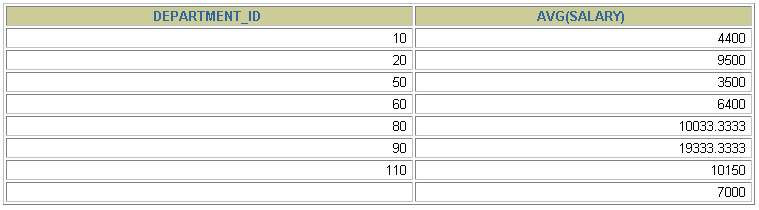

第 08 章_聚合函数
===========

我们上一章讲到了 SQL 单行函数。实际上 SQL 函数还有一类，叫做聚合（或聚集、分组）函数，它是对一组数据进行汇总的函数，输入的是一组数据的集合，输出的是单个值。

## 1. 聚合函数介绍[#](#1-聚合函数介绍)

-----------------------

*   **什么是聚合函数**

聚合函数作用于一组数据，并对一组数据返回一个值。

[](https://imag.fun-ny.cn/1554980924940.png)

*   **聚合函数类型**

    *   **AVG()**
    *   **SUM()**
    *   **MAX()**
    *   **MIN()**
    *   **COUNT() **
*   聚合函数语法

[](https://imag.fun-ny.cn/1554981029920.png)

*   聚合函数不能嵌套调用。比如不能出现类似 “AVG(SUM(字段名称))” 形式的调用。

### 1.1 AVG 和 SUM 函数[#](#11-avg和sum函数)

>  **SUM、COUNT函数都会忽略值为NULL的值的行，AVG根据公式也会忽略**
>
> `AVG() = SUM() / COUNT()` 

可以对**数值型数据**使用 AVG 和 SUM 函数。

```mysql
SELECT AVG(salary), MAX(salary),MIN(salary), SUM(salary)  -- 只适用于数值类型的字段（或变量）
FROM   employees
WHERE  job_id LIKE '%REP%';
```

[](https://imag.fun-ny.cn/1554981279723.png)

### 1.2 MIN 和 MAX 函数[#](#12-min和max函数)

可以对**任意数据类型**的数据使用 MIN 和 MAX 函数。

```mysql
SELECT MIN(hire_date), MAX(hire_date)
FROM	  employees;
```

[](https://imag.fun-ny.cn/1554981253194.png)

### 1.3 COUNT 函数[#](#13-count函数)

*   COUNT(*) 返回表中记录总数，适用于**任意数据类型**。

```mysql
SELECT COUNT(*)
FROM	  employees
WHERE  department_id = 50;
```

[](https://imag.fun-ny.cn/1554981241299.png)

*   COUNT(expr) 返回 **expr 不为空**的记录总数。

```mysql
SELECT COUNT(commission_pct)
FROM   employees
WHERE  department_id = 50;
```

[](https://imag.fun-ny.cn/1554981328678.png)

* **问题：用 count(*)，count(1)，count(列名) 谁好呢?**

  其实，对于 MyISAM 引擎的表是没有区别的。这种引擎内部有一计数器在维护着行数。

  Innodb 引擎的表用 count(*),count(1) 直接读行数，复杂度是 O(n)，因为 innodb 真的要去数一遍。但好于具体的 count(列名)。

  > count(1)[相当于创建一个常数为1的列]进行统计`select * ，1 from table`

* **问题：能不能使用 count(列名) 替换 count(*)?**

  不要使用 count(列名) 来替代 `count(*)`，`count(*)`是 SQL92 定义的标准统计行数的语法，跟数据库无关，跟 NULL 和非 NULL 无关。

  说明：count(*) 会统计值为 NULL 的行，而 count(列名) 不会统计此列为 NULL 值的行。

## 2. GROUP BY[#](#2-group-by)

---------------------------

### 2.1 基本使用[#](#21-基本使用)

[](https://imag.fun-ny.cn/1554981374920.png)

**可以使用 GROUP BY 子句将表中的数据分成若干组**

```mysql
SELECT column, group_function(column)
FROM table
[WHERE	condition]
[GROUP BY	group_by_expression]
[ORDER BY	column];
```

> **明确：WHERE 一定放在 FROM 后面**

**在 SELECT 列表中所有未包含在组函数中的列都应该包含在 GROUP BY 子句中**

```mysql
SELECT   department_id, AVG(salary)
FROM     employees
GROUP BY department_id ;
```

[](https://imag.fun-ny.cn/1554981539408.png)

[](https://imag.fun-ny.cn/1554981544191.png)

包含在 GROUP BY 子句中的列不必包含在 SELECT 列表中

```mysql
SELECT   AVG(salary)
FROM     employees
GROUP BY department_id ;
```

[](https://imag.fun-ny.cn/1554981574152.png)

### 2.2 使用多个列分组[#](#22-使用多个列分组)

[](https://imag.fun-ny.cn/1554981607442.png)

```mysql
SELECT   department_id dept_id, job_id, SUM(salary)
FROM     employees
GROUP BY department_id, job_id ;
```

[](https://imag.fun-ny.cn/1554981624864.png)

[](https://imag.fun-ny.cn/1554981629733.png)

### 2.3 GROUP BY 中使用 `WITH ROLLUP`[#](#23-group-by中使用with-rollup)

使用`WITH ROLLUP`关键字之后，在所有查询出的分组记录之后增加一条记录，该记录计算查询出的所有记录的总和，即统计记录数量。

```mysql
SELECT department_id,AVG(salary)
FROM employees
WHERE department_id > 80
GROUP BY department_id WITH ROLLUP;

# 18、统计每一种note的库存量，并合计总量  合并显示为总计  技巧
SELECT IFNULL(note, '总计'), SUM(num)
FROM books
GROUP BY note
WITH ROLLUP;
```

> 注意：
>
> 当使用 ROLLUP 时，不能同时使用 ORDER BY 子句进行结果排序，即 ROLLUP 和 ORDER BY 是互相排斥的。

### 2.4 `any_value()`

总结：

1.MySQL5.7之后，sql_mode中ONLY_FULL_GROUP_BY模式默认设置为打开状态。

2.ONLY_FULL_GROUP_BY的语义就是**确定select target list中的所有列的值都是明确语义**，简单的说来，在此模式下，target list中的值要么是来自于**聚合函数（sum、avg、max等）的结果**，要么是来自于**group by list中的表达式的值**

3.MySQL提供了**any_value()**函数来抑制ONLY_FULL_GROUP_BY值被拒绝

4.**`any_value()`会选择被分到同一组的数据里第一条数据的指定列值作为返回数据**


## 3. HAVING[#](#3-having)

-----------------------

### 3.1 基本使用[#](#31-基本使用)

[](https://imag.fun-ny.cn/1554981656798.png)

**过滤分组：HAVING 子句**

1.  行已经被分组。
2.  使用了聚合函数。
3.  满足 HAVING 子句中条件的分组将被显示。
4.  HAVING 不能单独使用，必须要跟 GROUP BY 一起使用。

[](https://imag.fun-ny.cn/1554981808091.png)

```mysql
SELECT   department_id, MAX(salary)
FROM     employees
GROUP BY department_id
HAVING   MAX(salary)>10000 ;
```

[](https://imag.fun-ny.cn/1554981824564.png)

*   **非法使用聚合函数 ： 不能在 WHERE 子句中使用聚合函数。**如下：

```mysql
SELECT   department_id, AVG(salary)
FROM     employees
WHERE    AVG(salary) > 8000
GROUP BY department_id;
```

[](https://imag.fun-ny.cn/1554981724375.png)

### 3.2 WHERE 和 HAVING 的对比[#](#32-where和having的对比)

**区别 1：WHERE 可以直接使用表中的字段作为筛选条件，但不能使用分组中的计算函数作为筛选条件；HAVING 必须要与 GROUP BY 配合使用，可以把分组计算的函数和分组字段作为筛选条件。**

这决定了，在需要对数据进行分组统计的时候，HAVING 可以完成 WHERE 不能完成的任务。这是因为，在查询语法结构中，WHERE 在 GROUP BY 之前，所以无法对分组结果进行筛选。HAVING 在 GROUP BY 之后，可以使用分组字段和分组中的计算函数，对分组的结果集进行筛选，这个功能是 WHERE 无法完成的。另外，WHERE 排除的记录不再包括在分组中。

**区别 2：如果需要通过连接从关联表中获取需要的数据，WHERE 是先筛选后连接，而 HAVING 是先连接后筛选。** 这一点，就决定了在关联查询中，WHERE 比 HAVING 更高效。因为 WHERE 可以先筛选，用一个筛选后的较小数据集和关联表进行连接，这样占用的资源比较少，执行效率也比较高。HAVING 则需要先把结果集准备好，也就是用未被筛选的数据集进行关联，然后对这个大的数据集进行筛选，这样占用的资源就比较多，执行效率也较低。

小结如下：

<table><thead><tr><th></th><th>优点</th><th>缺点</th></tr></thead><tbody><tr><td>WHERE</td><td>先筛选数据再关联，执行效率高</td><td>不能使用分组中的计算函数进行筛选</td></tr><tr><td>HAVING</td><td>可以使用分组中的计算函数</td><td>在最后的结果集中进行筛选，执行效率较低</td></tr></tbody></table>

**开发中的选择：**

WHERE 和 HAVING 也不是互相排斥的，我们可以在一个查询里面同时使用 WHERE 和 HAVING。包含分组统计函数的条件用 HAVING，普通条件用 WHERE。这样，我们就既利用了 WHERE 条件的高效快速，又发挥了 HAVING 可以使用包含分组统计函数的查询条件的优点。当数据量特别大的时候，运行效率会有很大的差别。

## 4. SELECT 的执行过程[#](#4-select的执行过程)

----------------------------------

### 4.1 查询的结构[#](#41-查询的结构)

```sql
#方式1：
SELECT ...,....,...
FROM ...,...,....
WHERE 多表的连接条件
AND 不包含组函数的过滤条件
GROUP BY ...,...
HAVING 包含组函数的过滤条件
ORDER BY ... ASC/DESC
LIMIT ...,...

#方式2：
SELECT ...,....,...
FROM ... JOIN ... ON 多表的连接条件
JOIN ...ON ...
WHERE 不包含组函数的过滤条件
AND/OR 不包含组函数的过滤条件
GROUP BY ...,...
HAVING 包含组函数的过滤条件
ORDER BY ... ASC/DESC
LIMIT ...,...

#其中：
#（1）from：从哪些表中筛选
#（2）on：关联多表查询时，去除笛卡尔积
#（3）where：从表中筛选的条件
#（4）group by：分组依据
#（5）having：在统计结果中再次筛选
#（6）order by：排序
#（7）limit：分页
```

### 4.2 SELECT 执行顺序[#](#42-select执行顺序)

你需要记住 SELECT 查询时的两个顺序：

**1. 关键字的顺序是不能颠倒的：**

```sql
SELECT ... FROM ... WHERE ... GROUP BY ... HAVING ... ORDER BY ... LIMIT...
```

**2.SELECT 语句的执行顺序**（在 MySQL 和 Oracle 中，SELECT 执行顺序基本相同）：

```sql
FROM -> WHERE -> GROUP BY -> HAVING -> SELECT 的字段 -> DISTINCT -> ORDER BY -> LIMIT
```

[](https://imag.fun-ny.cn/1566872301088.png)

比如你写了一个 SQL 语句，那么它的关键字顺序和执行顺序是下面这样的：

```sql
SELECT DISTINCT player_id, player_name, count(*) as num # 顺序 5
FROM player JOIN team ON player.team_id = team.team_id # 顺序 1
WHERE height > 1.80 # 顺序 2
GROUP BY player.team_id # 顺序 3
HAVING num > 2 # 顺序 4
ORDER BY num DESC # 顺序 6
LIMIT 2 # 顺序 7
```

在 SELECT 语句执行这些步骤的时候，每个步骤都会产生一个`虚拟表`，然后将这个虚拟表传入下一个步骤中作为输入。需要注意的是，这些步骤隐含在 SQL 的执行过程中，对于我们来说是不可见的。

### 4.3 SQL 的执行原理[#](#43-sql-的执行原理)

SELECT 是先执行 FROM 这一步的。在这个阶段，如果是多张表联查，还会经历下面的几个步骤：

1.  首先先通过 CROSS JOIN 求笛卡尔积，相当于得到虚拟表 vt（virtual table）1-1；
2.  通过 ON 进行筛选，在虚拟表 vt1-1 的基础上进行筛选，得到虚拟表 vt1-2；
3.  添加外部行。如果我们使用的是左连接、右链接或者全连接，就会涉及到外部行，也就是在虚拟表 vt1-2 的基础上增加外部行，得到虚拟表 vt1-3。

当然如果我们操作的是两张以上的表，还会重复上面的步骤，直到所有表都被处理完为止。这个过程得到是我们的原始数据。

当我们拿到了查询数据表的原始数据，也就是最终的虚拟表 `vt1`，就可以在此基础上再进行 `WHERE 阶段`。在这个阶段中，会根据 vt1 表的结果进行筛选过滤，得到虚拟表 `vt2`。

然后进入第三步和第四步，也就是 `GROUP 和 HAVING 阶段`。在这个阶段中，实际上是在虚拟表 vt2 的基础上进行分组和分组过滤，得到中间的虚拟表 `vt3` 和 `vt4`。

当我们完成了条件筛选部分之后，就可以筛选表中提取的字段，也就是进入到 `SELECT 和 DISTINCT 阶段`。

首先在 SELECT 阶段会提取想要的字段，然后在 DISTINCT 阶段过滤掉重复的行，分别得到中间的虚拟表 `vt5-1` 和 `vt5-2`。

当我们提取了想要的字段数据之后，就可以按照指定的字段进行排序，也就是 `ORDER BY 阶段`，得到虚拟表 `vt6`。

最后在 vt6 的基础上，取出指定行的记录，也就是 `LIMIT 阶段`，得到最终的结果，对应的是虚拟表 `vt7`。

当然我们在写 SELECT 语句的时候，不一定存在所有的关键字，相应的阶段就会省略。

同时因为 SQL 是一门类似英语的结构化查询语言，所以我们在写 SELECT 语句的时候，还要注意相应的关键字顺序，**所谓底层运行的原理，就是我们刚才讲到的执行顺序。**
