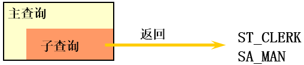
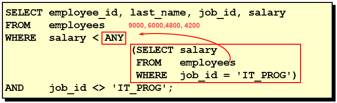
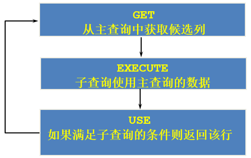

第 09 章_子查询
==========

子查询指一个查询语句嵌套在另一个查询语句内部的查询，这个特性从 MySQL 4.1 开始引入。

SQL 中子查询的使用大大增强了 SELECT 查询的能力，因为很多时候查询需要从结果集中获取数据，或者需要从同一个表中先计算得出一个数据结果，然后与这个数据结果（可能是某个标量，也可能是某个集合）进行比较。

## 1. 需求分析与问题解决[#](#1-需求分析与问题解决)

-----------------------------

### 1.1 实际问题[#](#11-实际问题)

[](https://imag.fun-ny.cn/1554991034688.png)

现有解决方式：

```mysql
#方式一：
SELECT salary
FROM employees
WHERE last_name = 'Abel';

SELECT last_name,salary
FROM employees
WHERE salary > 11000;

#方式二：自连接
SELECT e2.last_name,e2.salary
FROM employees e1,employees e2
WHERE e1.last_name = 'Abel'
AND e1.`salary` < e2.`salary`

#方式三：子查询
SELECT last_name,salary
FROM employees
WHERE salary > (
		SELECT salary
		FROM employees
		WHERE last_name = 'Abel'
		);
```

[](https://imag.fun-ny.cn/1554991316599.png)

### 1.2 子查询的基本使用[#](#12-子查询的基本使用)

*   子查询的基本语法结构：

[](https://imag.fun-ny.cn/1554991054388.png)

*   子查询（内查询）在主查询之前一次执行完成。
*   子查询的结果被主查询（外查询）使用 。
*   **注意事项**
    *   子查询要包含在括号内
    *   将子查询放在比较条件的右侧
    *   单行操作符对应单行子查询，多行操作符对应多行子查询

### 1.3 子查询的分类[#](#13-子查询的分类)

**分类方式 1：**

我们按内查询的结果返回一条还是多条记录，将子查询分为`单行子查询`、`多行子查询`。

* 单行子查询

  [](https://imag.fun-ny.cn/1554991538719.png)

* 多行子查询

[](https://imag.fun-ny.cn/1554991555669.png)

**分类方式 2：**

我们按内查询是否被执行多次，将子查询划分为`相关(或关联)子查询`和`不相关(或非关联)子查询`。

子查询从数据表中查询了数据结果，如果这个数据结果只执行一次，然后这个数据结果作为主查询的条件进行执行，那么这样的子查询叫做不相关子查询。

同样，如果子查询需要执行多次，即采用循环的方式，先从外部查询开始，每次都传入子查询进行查询，然后再将结果反馈给外部，这种嵌套的执行方式就称为相关子查询。

## 2. 单行子查询[#](#2-单行子查询)

---------------------

### 2.1 单行比较操作符[#](#21-单行比较操作符)

<table><thead><tr><th>操作符</th><th>含义</th></tr></thead><tbody><tr><td>=</td><td>equal to</td></tr><tr><td>&gt;</td><td>greater than</td></tr><tr><td>&gt;=</td><td>greater than or equal to</td></tr><tr><td>&lt;</td><td>less than</td></tr><tr><td>&lt;=</td><td>less than or equal to</td></tr><tr><td>&lt;&gt;</td><td>not equal to</td></tr></tbody></table>

### 2.2 代码示例[#](#22-代码示例)

**题目：查询工资大于 149 号员工工资的员工的信息**

[](https://imag.fun-ny.cn/image-20210914232952626.png)

[](https://imag.fun-ny.cn/image-20210914232935062.png)

**题目：返回 job_id 与 141 号员工相同，salary 比 143 号员工多的员工姓名，job_id 和工资**

```mysql
SELECT last_name, job_id, salary
FROM   employees
WHERE  job_id =  
                (SELECT job_id
                 FROM   employees
                 WHERE  employee_id = 141)
AND    salary >
                (SELECT salary
                 FROM   employees
                 WHERE  employee_id = 143);
```

[](https://imag.fun-ny.cn/1554991892770.png)

**题目：返回公司工资最少的员工的 last_name,job_id 和 salary**

```mysql
SELECT last_name, job_id, salary
FROM   employees
WHERE  salary = 
                (SELECT MIN(salary)
                 FROM   employees);
```

[](https://imag.fun-ny.cn/1554991935186.png)

**题目：查询与 141 号或 174 号员工的 manager_id 和 department_id 相同的其他员工的 employee_id，manager_id，department_id**

实现方式 1：不成对比较

```mysql
SELECT  employee_id, manager_id, department_id
FROM    employees
WHERE   manager_id IN
		  (SELECT  manager_id
                   FROM    employees
                   WHERE   employee_id IN (174,141))
AND     department_id IN 
		  (SELECT  department_id
                   FROM    employees
                   WHERE   employee_id IN (174,141))
AND	employee_id NOT IN(174,141);
```

实现方式 2：成对比较

```mysql
SELECT	employee_id, manager_id, department_id
FROM	employees
WHERE  (manager_id, department_id) IN
                      (SELECT manager_id, department_id
                       FROM   employees
                       WHERE  employee_id IN (141,174))
AND	employee_id NOT IN (141,174);
```

### 2.3 HAVING 中的子查询[#](#23-having-中的子查询)

*   首先执行子查询。
*   向主查询中的 HAVING 子句返回结果。

**题目：查询最低工资大于 50 号部门最低工资的部门 id 和其最低工资**

```mysql
SELECT   department_id, MIN(salary)
FROM     employees
GROUP BY department_id
HAVING   MIN(salary) >
                       (SELECT MIN(salary)
                        FROM   employees
                        WHERE  department_id = 50);
```

### 2.4 CASE 中的子查询[#](#24-case中的子查询)

在 CASE 表达式中使用单列子查询：

**题目：显式员工的 employee_id,last_name 和 location。其中，若员工 department_id 与 location_id 为 1800 的 department_id 相同，则 location 为’Canada’，其余则为’USA’。**

```mysql
SELECT employee_id, last_name,
       (CASE department_id
        WHEN
             (SELECT department_id FROM departments
	      WHERE location_id = 1800)           
        THEN 'Canada' ELSE 'USA' END) location
FROM   employees;
```

### 2.5 子查询中的空值问题[#](#25-子查询中的空值问题)

```mysql
SELECT last_name, job_id
FROM   employees
WHERE  job_id =
                (SELECT job_id
                 FROM   employees
                 WHERE  last_name = 'Haas');
```

[](https://imag.fun-ny.cn/1554992067381.png)

> **子查询不返回任何行**

### 2.5 非法使用子查询[#](#25-非法使用子查询)

```mysql
SELECT employee_id, last_name
FROM   employees
WHERE  salary =
                (SELECT   MIN(salary)
                 FROM     employees
                 GROUP BY department_id);
```

[](https://imag.fun-ny.cn/1554992135819.png)

> **多行子查询使用单行比较符**

## 3. 多行子查询[#](#3-多行子查询)

---------------------

*   也称为集合比较子查询
*   内查询返回多行
*   使用多行比较操作符

### 3.1 多行比较操作符[#](#31-多行比较操作符)

<table><thead><tr><th>操作符</th><th>含义</th></tr></thead><tbody><tr><td>IN</td><td>等于列表中的<strong>任意一个</strong></td></tr><tr><td>ANY</td><td>需要和单行比较操作符一起使用，和子查询返回的<strong>某一个</strong>值比较</td></tr><tr><td>ALL</td><td>需要和单行比较操作符一起使用，和子查询返回的<strong>所有</strong>值比较</td></tr><tr><td>SOME</td><td>实际上是 ANY 的别名，作用相同，一般常使用 ANY</td></tr></tbody></table>

> 体会 ANY 和 ALL 的区别

### 3.2 代码示例[#](#32-代码示例)

**题目：返回其它 job_id 中比 job_id 为‘IT_PROG’部门任一工资低的员工的员工号、姓名、job_id 以及 salary**

[](https://imag.fun-ny.cn/1554992658876.png)

[](https://imag.fun-ny.cn/1554992664594.png)

[](https://imag.fun-ny.cn/1554992668429.png)

**题目：返回其它 job_id 中比 job_id 为‘IT_PROG’部门所有工资都低的员工的员工号、姓名、job_id 以及 salary**

[](https://imag.fun-ny.cn/1554992753654.png)

[](https://imag.fun-ny.cn/1554992759467.png)

**题目：查询平均工资最低的部门 id**

```mysql
#方式1：
SELECT department_id
FROM employees
GROUP BY department_id
HAVING AVG(salary) = (
			SELECT MIN(avg_sal)
			FROM (
				SELECT AVG(salary) avg_sal
				FROM employees
				GROUP BY department_id
				) dept_avg_sal
			)
```

```mysql
#方式2：
SELECT department_id
FROM employees
GROUP BY department_id
HAVING AVG(salary) <= ALL (
				SELECT AVG(salary) avg_sal
				FROM employees
				GROUP BY department_id
)
```

### 3.3 空值问题[#](#33-空值问题)

```mysql
SELECT last_name
FROM employees
WHERE employee_id NOT IN (
			SELECT manager_id
			FROM employees
			);
```

[](https://imag.fun-ny.cn/image-20211027195906773.png)

## 4. 相关子查询[#](#4-相关子查询)

---------------------

### 4.1 相关子查询执行流程[#](#41-相关子查询执行流程)

如果子查询的执行依赖于外部查询，通常情况下都是因为子查询中的表用到了外部的表，并进行了条件关联，因此每执行一次外部查询，子查询都要重新计算一次，这样的子查询就称之为`关联子查询`。

相关子查询按照一行接一行的顺序执行，主查询的每一行都执行一次子查询。

[](https://imag.fun-ny.cn/1554992898234.png)

[](https://imag.fun-ny.cn/1554992925281.png)

说明：**子查询中使用主查询中的列**

### 4.2 代码示例[#](#42-代码示例)

**题目：查询员工中工资大于本部门平均工资的员工的 last_name,salary 和其 department_id**

**方式一：相关子查询**

[](https://imag.fun-ny.cn/1554992986225.png)

**方式二：在 FROM 中使用子查询**

```mysql
SELECT last_name,salary,e1.department_id
FROM employees e1,(SELECT department_id,AVG(salary) dept_avg_sal FROM employees GROUP BY department_id) e2
WHERE e1.`department_id` = e2.department_id
AND e2.dept_avg_sal < e1.`salary`;
```

> from 型的子查询：子查询是作为 from 的一部分，子查询要用 () 引起来，并且要给这个子查询取别名，  
> 把它当成一张 “临时的虚拟的表” 来使用。

在 ORDER BY 中使用子查询：

**题目：查询员工的 id,salary, 按照 department_name 排序**

```mysql
SELECT employee_id,salary
FROM employees e
ORDER BY (
	  SELECT department_name
	  FROM departments d
	  WHERE e.`department_id` = d.`department_id`
	);
```

**题目：若 employees 表中 employee_id 与 job_history 表中 employee_id 相同的数目不小于 2，输出这些相同 id 的员工的 employee_id,last_name 和其 job_id**

```mysql
SELECT e.employee_id, last_name,e.job_id
FROM   employees e 
WHERE  2 <= (SELECT COUNT(*)
             FROM   job_history 
             WHERE  employee_id = e.employee_id);
```

### 4.3 `EXISTS` 与 `NOT EXISTS` 关键字[#](#43-exists-与-not-exists关键字)

*   关联子查询通常也会和 EXISTS 操作符一起来使用，用来检查在子查询中是否存在满足条件的行。
*   **如果在子查询中不存在满足条件的行：**
    *   条件返回 FALSE
    *   继续在子查询中查找
*   **如果在子查询中存在满足条件的行：**
    *   不在子查询中继续查找
    *   条件返回 TRUE
*   NOT EXISTS 关键字表示如果不存在某种条件，则返回 TRUE，否则返回 FALSE。

**题目：查询公司管理者的 employee_id，last_name，job_id，department_id 信息**

方式一：

```mysql
SELECT employee_id, last_name, job_id, department_id
FROM   employees e1
WHERE  EXISTS ( SELECT *
                 FROM   employees e2
                 WHERE  e2.manager_id = 
                        e1.employee_id);
```

方式二：自连接

```mysql
SELECT DISTINCT e1.employee_id, e1.last_name, e1.job_id, e1.department_id
FROM   employees e1 JOIN employees e2
WHERE e1.employee_id = e2.manager_id;
```

方式三：

```mysql
SELECT employee_id,last_name,job_id,department_id
FROM employees
WHERE employee_id IN (
		     SELECT DISTINCT manager_id
		     FROM employees
		     );
```

**题目：查询 departments 表中，不存在于 employees 表中的部门的 department_id 和 department_name**

```mysql
SELECT department_id, department_name
FROM departments d
WHERE NOT EXISTS (SELECT 'X'
                  FROM   employees
                  WHERE  department_id = d.department_id);
```

[](https://imag.fun-ny.cn/1554993169269.png)

### 4.4 相关更新[#](#44-相关更新)

```mysql
UPDATE table1 alias1
SET    column = (SELECT expression
                 FROM   table2 alias2
                 WHERE  alias1.column = alias2.column);
```

使用相关子查询依据一个表中的数据更新另一个表的数据。

**题目：在 employees 中增加一个 department_name 字段，数据为员工对应的部门名称**

```mysql
# 1）
ALTER TABLE employees
ADD(department_name VARCHAR2(14));

# 2）
UPDATE employees e
SET department_name =  (SELECT department_name 
	                       FROM   departments d
	                       WHERE  e.department_id = d.department_id);
```

### 4.4 相关删除[#](#44-相关删除)

```mysql
DELETE FROM table1 alias1
 WHERE column operator (SELECT expression
                        FROM   table2 alias2
                        WHERE  alias1.column = alias2.column);
```

使用相关子查询依据一个表中的数据删除另一个表的数据。

**题目：删除表 employees 中，其与 emp_history 表皆有的数据**

```mysql
DELETE FROM employees e
WHERE employee_id in  
           (SELECT employee_id
            FROM   emp_history 
            WHERE  employee_id = e.employee_id);
```

## 5. 抛一个思考题[#](#5-抛一个思考题)

-----------------------

**问题：**谁的工资比 Abel 的高？

**解答：**

```mysql
#方式1：自连接
SELECT e2.last_name,e2.salary
FROM employees e1,employees e2
WHERE e1.last_name = 'Abel'
AND e1.`salary` < e2.`salary`
```

```mysql
#方式2：子查询
SELECT last_name,salary
FROM employees
WHERE salary > (
		SELECT salary
		FROM employees
		WHERE last_name = 'Abel'
		);
```

**问题：**以上两种方式有好坏之分吗？

**解答：**自连接方式好！

题目中可以使用子查询，也可以使用自连接。一般情况建议你使用自连接，因为在许多 DBMS 的处理过程中，对于自连接的处理速度要比子查询快得多。

可以这样理解：子查询实际上是通过未知表进行查询后的条件判断，而自连接是通过已知的自身数据表进行条件判断，因此在大部分 DBMS 中都对自连接处理进行了优化。
