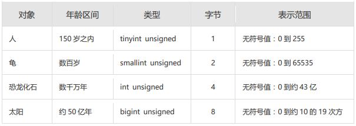

第 10 章_创建和管理表
=============

## 1. 基础知识[#](#1-基础知识)

-------------------

### 1.1 一条数据存储的过程[#](#11-一条数据存储的过程)

`存储数据是处理数据的第一步`。只有正确地把数据存储起来，我们才能进行有效的处理和分析。否则，只能是一团乱麻，无从下手。

那么，怎样才能把用户各种经营相关的、纷繁复杂的数据，有序、高效地存储起来呢？ 在 MySQL 中，一个完整的数据存储过程总共有 4 步，分别是创建数据库、确认字段、创建数据表、插入数据。

[](https://imag.fun-ny.cn/image-20211007155810920.png)

我们要先创建一个数据库，而不是直接创建数据表呢？

因为从系统架构的层次上看，MySQL 数据库系统从大到小依次是`数据库服务器`、`数据库`、`数据表`、数据表的`行与列`。

MySQL 数据库服务器之前已经安装。所以，我们就从创建数据库开始。

### 1.2 标识符命名规则[#](#12-标识符命名规则)

*   数据库名、表名不得超过 30 个字符，变量名限制为 29 个
*   必须只能包含 A–Z, a–z, 0–9, _共 63 个字符
*   数据库名、表名、字段名等对象名中间不要包含空格
*   同一个 MySQL 软件中，数据库不能同名；同一个库中，表不能重名；同一个表中，字段不能重名
*   必须保证你的字段没有和保留字、数据库系统或常用方法冲突。如果坚持使用，请在 SQL 语句中使用 `（着重号）引起来
*   保持字段名和类型的一致性：在命名字段并为其指定数据类型的时候一定要保证一致性，假如数据类型在一个表里是整数，那在另一个表里可就别变成字符型了

### 1.3 MySQL 中的数据类型[#](#13-mysql中的数据类型)

<table><thead><tr><th>类型</th><th>类型举例</th></tr></thead><tbody><tr><td>整数类型</td><td>TINYINT、SMALLINT、MEDIUMINT、<strong>INT(或 INTEGER)</strong>、BIGINT</td></tr><tr><td>浮点类型</td><td>FLOAT、DOUBLE</td></tr><tr><td>定点数类型</td><td><strong>DECIMAL</strong></td></tr><tr><td>位类型</td><td>BIT</td></tr><tr><td>日期时间类型</td><td>YEAR、TIME、<strong>DATE</strong>、DATETIME、TIMESTAMP</td></tr><tr><td>文本字符串类型</td><td>CHAR、<strong>VARCHAR</strong>、TINYTEXT、TEXT、MEDIUMTEXT、LONGTEXT</td></tr><tr><td>枚举类型</td><td>ENUM</td></tr><tr><td>集合类型</td><td>SET</td></tr><tr><td>二进制字符串类型</td><td>BINARY、VARBINARY、TINYBLOB、BLOB、MEDIUMBLOB、LONGBLOB</td></tr><tr><td>JSON 类型</td><td>JSON 对象、JSON 数组</td></tr><tr><td>空间数据类型</td><td>单值：GEOMETRY、POINT、LINESTRING、POLYGON；<br>集合：MULTIPOINT、MULTILINESTRING、MULTIPOLYGON、GEOMETRYCOLLECTION</td></tr></tbody></table>

其中，常用的几类类型介绍如下：

<table><thead><tr><th>数据类型</th><th>描述</th></tr></thead><tbody><tr><td>INT</td><td>从 - 2<sup>31 到 2</sup>31-1 的整型数据。存储大小为 4 个字节</td></tr><tr><td>CHAR(size)</td><td>定长字符数据。若未指定，默认为 1 个字符，最大长度 255</td></tr><tr><td>VARCHAR(size)</td><td>可变长字符数据，根据字符串实际长度保存，<strong>必须指定长度</strong></td></tr><tr><td>FLOAT(M,D)</td><td>单精度，占用 4 个字节，M = 整数位 + 小数位，D = 小数位。 D&lt;=M&lt;=255,0&lt;=D&lt;=30，默认 M+D&lt;=6</td></tr><tr><td>DOUBLE(M,D)</td><td>双精度，占用 8 个字节，D&lt;=M&lt;=255,0&lt;=D&lt;=30，默认 M+D&lt;=15</td></tr><tr><td>DECIMAL(M,D)</td><td>高精度小数，占用 M+2 个字节，D&lt;=M&lt;=65，0&lt;=D&lt;=30，最大取值范围与 DOUBLE 相同。</td></tr><tr><td>DATE</td><td>日期型数据，格式'YYYY-MM-DD'</td></tr><tr><td>BLOB</td><td>二进制形式的长文本数据，最大可达 4G</td></tr><tr><td>TEXT</td><td>长文本数据，最大可达 4G</td></tr></tbody></table>

## 2. 创建和管理数据库[#](#2-创建和管理数据库)

---------------------------

### 2.1 创建数据库[#](#21-创建数据库)

*   方式 1：创建数据库

```mysql
CREATE DATABASE 数据库名;
```

*   方式 2：创建数据库并指定字符集

```mysql
CREATE DATABASE 数据库名 CHARACTER SET 字符集; -- utf8md4  四个字节的utf-8的字符集
```

*   方式 3：判断数据库是否已经存在，不存在则创建数据库（`推荐`）

```mysql
CREATE DATABASE IF NOT EXISTS 数据库名;
```

如果 MySQL 中已经存在相关的数据库，则忽略创建语句，不再创建数据库。

> 注意：DATABASE 不能改名。一些可视化工具可以改名，它是建新库，把所有表复制到新库，再删旧库完成的。

### 2.2 使用数据库[#](#22-使用数据库)

*   查看当前所有的数据库

```mysql
SHOW DATABASES; #有一个S，代表多个数据库
```

*   查看当前正在使用的数据库

```mysql
SELECT DATABASE();  #使用的一个 mysql 中的全局函数
```

*   查看指定库下所有的表

```mysql
SHOW TABLES FROM 数据库名;
```

*   查看数据库的创建信息

```mysql
SHOW CREATE DATABASE 数据库名;
或者：
SHOW CREATE DATABASE 数据库名\G
```

*   使用 / 切换数据库

```mysql
USE 数据库名;
```

> 注意：要操作表格和数据之前必须先说明是对哪个数据库进行操作，否则就要对所有对象加上 “数据库名.”。

### 2.3 修改数据库[#](#23-修改数据库)

*   更改数据库字符集

```mysql
ALTER DATABASE 数据库名 CHARACTER SET 字符集;  #比如：gbk、utf8等
```

### 2.4 删除数据库[#](#24-删除数据库)

*   方式 1：删除指定的数据库

```mysql
DROP DATABASE 数据库名;
```

*   方式 2：删除指定的数据库（`推荐`）

```mysql
DROP DATABASE IF EXISTS 数据库名;
```

## 3. 创建表[#](#3-创建表)

-----------------

### 3.1 创建方式 1 - 手动创建[#](#31-创建方式1)

*   **必须具备：**
    *   CREATE TABLE 权限
    *   存储空间
*   **语法格式：**

```mysql
CREATE TABLE [IF NOT EXISTS] 表名(
	字段1, 数据类型 [约束条件] [默认值],
	字段2, 数据类型 [约束条件] [默认值],
	字段3, 数据类型 [约束条件] [默认值],
	……
	[表约束条件]
);
```

> 加上了 `IF NOT EXISTS` 关键字，则表示：如果当前数据库中不存在要创建的数据表，则创建数据表；如果当前数据库中已经存在要创建的数据表，则忽略建表语句，不再创建数据表。

*   **必须指定：**
    *   表名
    *   列名 (或字段名)，数据类型，**长度**
*   **可选指定：**
    *   约束条件
    *   默认值
*   创建表举例 1：

```mysql
-- 创建表
CREATE TABLE emp (
  -- int类型
  emp_id INT,
  -- 最多保存20个中英文字符
  emp_name VARCHAR(20),
  -- 总位数不超过15位
  salary DOUBLE,
  -- 日期类型
  birthday DATE
);
```

```mysql
DESC emp;  -- 查看表结构
```

[](https://imag.fun-ny.cn/image-20211016160557995.png)

MySQL 在执行建表语句时，将 id 字段的类型设置为 int(11)，这里的 11 实际上是 int 类型指定的显示宽度，默认的显示宽度为 11。也可以在创建数据表的时候指定数据的显示宽度。

*   创建表举例 2：

```mysql
CREATE TABLE dept(
	deptno INT(2) AUTO_INCREMENT,-- int类型，自增
	dname VARCHAR(14),
	loc VARCHAR(13),
    
    PRIMARY KEY (deptno) -- 主键
);
```

```mysql
DESCRIBE dept;
```

[](https://imag.fun-ny.cn/image-20211016160643445.png)

> 在 MySQL 8.x 版本中，不再推荐为 INT 类型指定显示长度，并在未来的版本中可能去掉这样的语法。

### 3.2 创建方式 2 - 复制其他表字段和数据[#](#32-创建方式2)

* 使用 `AS subquery` 选项，**将创建表和插入数据结合起来**

  [](https://imag.fun-ny.cn/1554997882872.png)

* 指定的列和子查询中的列要一一对应

* 通过列名和默认值定义列

```mysql
CREATE TABLE emp1 AS SELECT * FROM employees;  -- 复制全部字段和数据

CREATE TABLE emp2 AS SELECT * FROM employees WHERE 1=2; -- 创建的emp2是空表
```

```mysql
CREATE TABLE dept80
AS 
SELECT  employee_id, last_name, salary*12 as ANNSAL, hire_date
FROM    employees
WHERE   department_id = 80;  -- 根据选择复制字段和根据条件插入数据
```

```mysql
DESCRIBE dept80;
```

[](http://imag.fun-ny.cn/img/1554997998148.png)

[](https://imag.fun-ny.cn/1554998004494.png)

### 3.3 查看数据表结构[#](#33-查看数据表结构)

在 MySQL 中创建好数据表之后，可以查看数据表的结构。MySQL 支持使用`DESCRIBE/DESC`语句查看数据表结构，也支持使用`SHOW CREATE TABLE`语句查看数据表结构。

语法格式如下：

```mysql
SHOW CREATE TABLE 表名\G
```

使用 SHOW CREATE TABLE 语句不仅可以查看表创建时的详细语句，还可以查看存储引擎和字符编码。

## 4. 修改表[#](#4-修改表)

-----------------

修改表指的是修改数据库中已经存在的数据表的结构。

**使用 ALTER TABLE 语句可以实现：**

*   向已有的表中添加列

*   修改现有表中的列

*   删除现有表中的列

*   重命名现有表中的列

### 4.1 追加一个列[#](#41-追加一个列)

语法格式如下：

```mysql
ALTER TABLE 表名 ADD 【COLUMN】 字段名 字段类型 【FIRST|AFTER 字段名】;
```

举例：

```mysql
ALTER TABLE dept80 
ADD job_id varchar(15);
```

[](https://imag.fun-ny.cn/1554998139815.png)

### 4.2 修改一个列[#](#42-修改一个列)

*   可以修改列的数据类型，长度、默认值和位置

*   修改字段数据类型、长度、默认值、位置的语法格式如下：

```mysql
ALTER TABLE 表名 MODIFY 【COLUMN】 字段名1 字段类型 【DEFAULT 默认值】【FIRST|AFTER 字段名2】;
```

*   举例：

```mysql
ALTER TABLE	dept80
MODIFY last_name VARCHAR(30);
```

```mysql
ALTER TABLE	dept80
MODIFY salary double(9,2) default 1000;
```

*   对默认值的修改只影响今后对表的修改
*   此外，还可以通过此种方式修改列的约束。这里暂先不讲。

### 4.3 重命名一个列[#](#43-重命名一个列)

使用 CHANGE old_column new_column dataType 子句重命名列。语法格式如下：

```mysql
ALTER TABLE 表名 CHANGE 【column】 列名 新列名 新数据类型;
```

举例：

```mysql
ALTER TABLE  dept80
CHANGE department_name dept_name varchar(15);
```

### 4.4 删除一个列[#](#44-删除一个列)

删除表中某个字段的语法格式如下：

```mysql
ALTER TABLE 表名 DROP 【COLUMN】字段名
```

举例：

```mysql
ALTER TABLE  dept80
DROP COLUMN  job_id;
```

## 5.重命名表[#](#5-重命名表)

-------------------

*   方式一：使用 `RENAME`

```mysql
RENAME TABLE emp
TO myemp;
```

*   方式二：

```mysql
ALTER table dept
RENAME [TO] detail_dept;  -- [TO]可以省略
```

*   必须是对象的拥有者

## 6. 删除表[#](#6-删除表)

-----------------

*   在 MySQL 中，当一张数据表`没有与其他任何数据表形成关联关系`时，可以将当前数据表直接删除。

*   **数据和结构都被删除**，释放空间

*   所有正在运行的相关事务被提交

*   所有相关索引被删除

*   语法格式：

```mysql
DROP TABLE [IF EXISTS] 数据表1 [, 数据表2, …, 数据表n];
```

`IF EXISTS`的含义为：如果当前数据库中存在相应的数据表，则删除数据表；如果当前数据库中不存在相应的数据表，则忽略删除语句，不再执行删除数据表的操作。

*   举例：

```mysql
DROP TABLE dept80;
```

*   `DROP TABLE` 语句不能回滚

## 7.清空表[#](#7-清空表)

-----------------

*   `TRUNCATE TABLE` 【截断】语句：
    *   删除表中所有的数据，保留表结构
    *   释放表的存储空间
*   举例：

```mysql
TRUNCATE TABLE detail_dept;
```

*   TRUNCATE 语句**不能回滚**，而使用 DELETE 语句删除数据，可以回滚

*   对比：

```mysql
SET autocommit = FALSE;
  
DELETE FROM emp2; 
#TRUNCATE TABLE emp2;
  
SELECT * FROM emp2;
  
ROLLBACK;
  
SELECT * FROM emp2;

# DCL 中 COMMIT 和 ROLLBACK
# COMMIT:提交数据。一旦执行COMMIT，则数据就被永久的保存在了数据库中，意味着数据不可以回滚。
# ROLLBACK:回滚数据。一旦执行ROLLBACK,则可以实现数据的回滚。回滚到最近的一次COMMIT之后。

#对比 TRUNCATE TABLE 和 DELETE FROM 
# 相同点：都可以实现对表中所有数据的删除，同时保留表结构。
# 不同点：
#	TRUNCATE TABLE：一旦执行此操作，表数据全部清除。同时，数据是不可以回滚的。
#	DELETE FROM：一旦执行此操作，表数据可以全部清除（不带WHERE）。同时，数据是可以实现回滚的。

#DDL 和 DML 的说明
#  ① DDL（`CREATE`、`DROP`、`ALTER`）的操作一旦执行，就不可回滚。指令SET autocommit = FALSE对DDL操作失效。(因为在执行完DDL操作之后，一定会执行一次COMMIT。而此COMMIT操作不受SET autocommit = FALSE影响的。)
  
#  ② DML（insert、update、delete）的操作默认情况，一旦执行，也是不可回滚的。但是，如果在执行DML之前，执行了 
#    SET autocommit = FALSE，则执行的DML操作就可以实现回滚。
```

> 阿里开发规范：
>
> 【参考】`TRUNCATE TABLE` 比 `DELETE` 速度快，且使用的系统和事务日志资源少，但 `TRUNCATE` 无事务且不触发 TRIGGER，有可能造成事故，故不建议在开发代码中使用此语句。
>
> 说明：TRUNCATE TABLE 在功能上与不带 WHERE 子句的 DELETE 语句相同。

## 8. 内容拓展[#](#8-内容拓展)

-------------------

### 拓展 1：阿里巴巴《Java 开发手册》之 MySQL 字段命名[#](#拓展1阿里巴巴java开发手册之mysql字段命名)

* 【`强制`】表名、字段名必须使用小写字母或数字，禁止出现数字开头，禁止两个下划线中间只出现数字。数据库字段名的修改代价很大，因为无法进行预发布，所以字段名称需要慎重考虑。

  *   正例：aliyun_admin，rdc_config，level3_name
  *   反例：AliyunAdmin，rdcConfig，level_3_name

* 【`强制`】禁用保留字，如 desc、range、match、delayed 等，请参考 MySQL 官方保留字。

* 【`强制`】表必备三字段：id, gmt_create, gmt_modified。

  *   说明：其中 id 必为主键，类型为 BIGINT UNSIGNED、单表时自增、步长为 1。gmt_create, gmt_modified 的类型均为 DATETIME 类型，前者现在时表示主动式创建，后者过去分词表示被动式更新

* 【`推荐`】表的命名最好是遵循 “业务名称_表的作用”。

  *   正例：alipay_task 、 force_project、 trade_config

* 【`推荐`】库名与应用名称尽量一致。

* 【参考】合适的字符存储长度，不但节约数据库表空间、节约索引存储，更重要的是提升检索速度。

  *   正例：无符号值可以避免误存负数，且扩大了表示范围。

  [](https://imag.fun-ny.cn/image-20211024012735469.png)

### 拓展 2：如何理解清空表、删除表等操作需谨慎？！[#](#拓展2如何理解清空表删除表等操作需谨慎)

`表删除`操作将把表的定义和表中的数据一起删除，并且 MySQL 在执行删除操作时，不会有任何的确认信息提示，因此执行删除操时应当慎重。在删除表前，最好对表中的数据进行`备份`，这样当操作失误时可以对数据进行恢复，以免造成无法挽回的后果。

同样的，在使用 `ALTER TABLE` 进行表的基本修改操作时，在执行操作过程之前，也应该确保对数据进行完整的`备份`，因为数据库的改变是`无法撤销`的，如果添加了一个不需要的字段，可以将其删除；相同的，如果删除了一个需要的列，该列下面的所有数据都将会丢失。

### 拓展 3：MySQL8 新特性—DDL 的原子化[#](#拓展3mysql8新特性ddl的原子化)

在 MySQL 8.0 版本中，InnoDB 表的 DDL 支持事务完整性，即`DDL操作要么成功要么回滚`。DDL 操作回滚日志写入到 data dictionary 数据字典表 mysql.innodb_ddl_log（该表是隐藏的表，通过 show tables 无法看到）中，用于回滚操作。通过设置参数，可将 DDL 操作日志打印输出到 MySQL 错误日志中。

分别在 MySQL 5.7 版本和 MySQL 8.0 版本中创建数据库和数据表，结果如下：

```mysql
CREATE DATABASE mytest;

USE mytest;

CREATE TABLE book1(
book_id INT ,
book_name VARCHAR(255)
);

SHOW TABLES;
```

（1）在 MySQL 5.7 版本中，测试步骤如下：  
删除数据表 book1 和数据表 book2，结果如下：

```mysql
mysql> DROP TABLE book1,book2;
ERROR 1051 (42S02): Unknown table 'mytest.book2'
```

再次查询数据库中的数据表名称，结果如下：

```mysql
mysql> SHOW TABLES;
Empty set (0.00 sec)
```

从结果可以看出，虽然删除操作时报错了，但是仍然删除了数据表 book1。

（2）在 MySQL 8.0 版本中，测试步骤如下：  
删除数据表 book1 和数据表 book2，结果如下：

```mysql
mysql> DROP TABLE book1,book2;
ERROR 1051 (42S02): Unknown table 'mytest.book2'
```

再次查询数据库中的数据表名称，结果如下：

```mysql
mysql> show tables;
+------------------+
| Tables_in_mytest |
+------------------+
| book1            |
+------------------+
1 row in set (0.00 sec)
```

从结果可以看出，数据表 book1 并没有被删除。
