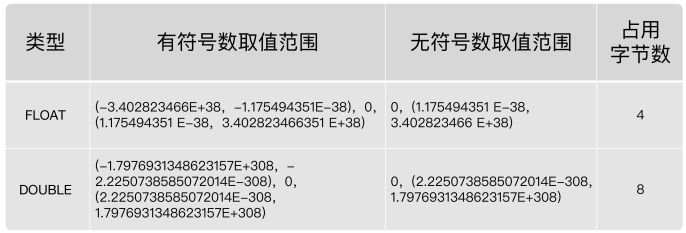
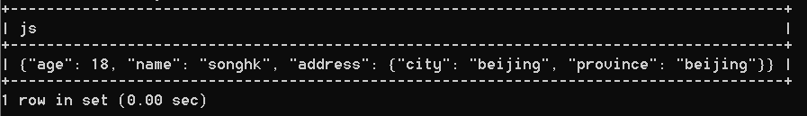

第 12 章_MySQL 数据类型精讲
===================

## 1. MySQL 中的数据类型[#](#1-mysql中的数据类型)

----------------------------------

<table><thead><tr><th>类型</th><th>类型举例</th></tr></thead><tbody><tr><td>整数类型</td><td>TINYINT、SMALLINT、MEDIUMINT、INT(或 INTEGER)、BIGINT</td></tr><tr><td>浮点类型</td><td>FLOAT、DOUBLE</td></tr><tr><td>定点数类型</td><td>DECIMAL</td></tr><tr><td>位类型</td><td>BIT</td></tr><tr><td>日期时间类型</td><td>YEAR、TIME、DATE、DATETIME、TIMESTAMP</td></tr><tr><td>文本字符串类型</td><td>CHAR、VARCHAR、TINYTEXT、TEXT、MEDIUMTEXT、LONGTEXT</td></tr><tr><td>枚举类型</td><td>ENUM</td></tr><tr><td>集合类型</td><td>SET</td></tr><tr><td>二进制字符串类型</td><td>BINARY、VARBINARY、TINYBLOB、BLOB、MEDIUMBLOB、LONGBLOB</td></tr><tr><td>JSON 类型</td><td>JSON 对象、JSON 数组</td></tr><tr><td>空间数据类型</td><td>单值类型：GEOMETRY、POINT、LINESTRING、POLYGON；<br>集合类型：MULTIPOINT、MULTILINESTRING、MULTIPOLYGON、GEOMETRYCOLLECTION</td></tr></tbody></table>

常见数据类型的属性，如下：

<table><thead><tr><th>MySQL 关键字</th><th>含义</th></tr></thead><tbody><tr><td>NULL</td><td>数据列可包含 NULL 值</td></tr><tr><td>NOT NULL</td><td>数据列不允许包含 NULL 值</td></tr><tr><td>DEFAULT</td><td>默认值</td></tr><tr><td>PRIMARY KEY</td><td>主键</td></tr><tr><td>AUTO_INCREMENT</td><td>自动递增，适用于整数类型</td></tr><tr><td>UNSIGNED</td><td>无符号</td></tr><tr><td>CHARACTER SET name</td><td>指定一个字符集</td></tr></tbody></table>

### 1.关于字符集：`character set name`

```mysql
#1.关于属性：character set name

SHOW VARIABLES LIKE 'character_%';

#创建数据库时指名字符集
CREATE DATABASE IF NOT EXISTS dbtest12 CHARACTER SET 'utf8';

SHOW CREATE DATABASE dbtest12;

#创建表的时候，指名表的字符集
CREATE TABLE temp(
id INT
) CHARACTER SET 'utf8';

SHOW CREATE TABLE temp;

#创建表，指名表中的字段时，可以指定字段的字符集
CREATE TABLE temp1(
id INT,
NAME VARCHAR(15) CHARACTER SET 'gbk'

);
SHOW CREATE TABLE temp1;
```

## 2. 整数类型[#](#2-整数类型)

-------------------

### 2.1 类型介绍[#](#21-类型介绍)

整数类型一共有 5 种，包括 `TINYINT`、`SMALLINT`、`MEDIUMINT`、`INT（INTEGER）`和 `BIGINT`。

它们的区别如下表所示：

<table><thead><tr><th><strong>整数类型</strong></th><th><strong>字节</strong></th><th>有符号数取值范围</th><th>无符号数取值范围UNSIGNED</th></tr></thead><tbody><tr><td>TINYINT</td><td>1</td><td>-128~127</td><td>0~255</td></tr><tr><td>SMALLINT</td><td>2</td><td>-32768~32767</td><td>0~65535</td></tr><tr><td>MEDIUMINT</td><td>3</td><td>-8388608~8388607</td><td>0~16777215</td></tr><tr><td>INT、INTEGER</td><td>4</td><td>-2147483648~2147483647</td><td>0~4294967295</td></tr><tr><td>BIGINT</td><td>8</td><td>-9223372036854775808~9223372036854775807</td><td>0~18446744073709551615</td></tr></tbody></table>

### 2.2 可选属性[#](#22-可选属性)

**整数类型的可选属性有三个：**

#### 2.2.1 M[#](#221-m)

`M`: 表示显示宽度，M 的取值范围是 (0, 255)。例如，int(5)：当数据宽度小于 5 位的时候在数字前面需要用字符填满宽度。该项功能需要配合 “`ZEROFILL`”使用，表示用 “0” 填满宽度，否则指定显示宽度无效。

如果设置了显示宽度，那么插入的数据宽度超过显示宽度限制，会不会截断或插入失败？

答案：不会对插入的数据有任何影响，还是按照类型的实际宽度进行保存，即`显示宽度与类型可以存储的值范围无关`。**从 MySQL 8.0.17 开始，整数数据类型不推荐使用显示宽度属性。**

整型数据类型可以在定义表结构时指定所需要的显示宽度，如果不指定，则系统为每一种类型指定默认的宽度值。

举例：

```mysql
CREATE TABLE test_int1 ( x TINYINT,　y SMALLINT,　z MEDIUMINT,　m INT,　n BIGINT );
```

查看表结构 （MySQL5.7 中显式如下，MySQL8 中不再显式范围）

```mysql
mysql> desc test_int1;
+-------+--------------+------+-----+---------+-------+
| Field | Type         | Null | Key | Default | Extra |
+-------+--------------+------+-----+---------+-------+
|   x   | tinyint(4)   | YES  |     | NULL    |       |
| 　y   | smallint(6)  | YES  |     | NULL    |       |
| 　z   | mediumint(9) | YES  |     | NULL    |       |
| 　m   | int(11)      | YES  |     | NULL    |       |
| 　n   | bigint(20)   | YES  |     | NULL    |       |
+-------+--------------+------+-----+---------+-------+
5 rows in set (0.00 sec)
```

>  **TINYINT 有符号数和无符号数的取值范围分别为 - 128~ 127 和 0 ~255**，由于**负号占了一个数字位，因此 TINYINT 默认的显示宽度为 4**。同理，其他整数类型的默认显示宽度与其有符号数的最小值的宽度相同。

举例：

```mysql
CREATE TABLE test_int2(
f1 INT,
f2 INT(5),
f3 INT(5) ZEROFILL
)

DESC test_int2;

INSERT INTO test_int2(f1,f2,f3)
VALUES(1,123,123);

INSERT INTO test_int2(f1,f2)
VALUES(123456,123456); -- 超过显示宽度，并不会影响插入int本身的范围，如果不足显示宽度，用0填充；超过正常显示【见2.2.3 ZEROFILL】

INSERT INTO test_int2(f1,f2,f3)
VALUES(123456,123456,123456);

mysql> SELECT * FROM test_int2;
+--------+--------+--------+
| f1     | f2     | f3     |
+--------+--------+--------+
|      1 |    123 |  00123 |
| 123456 | 123456 |   NULL |
| 123456 | 123456 | 123456 |
+--------+--------+--------+
3 rows in set (0.00 sec)
```

#### 2.2.2 UNSIGNED[#](#222-unsigned)

`UNSIGNED`: 无符号类型（非负），所有的整数类型都有一个可选的属性 `UNSIGNED`（无符号属性），无符号整数类型的最小取值为 0。所以，如果需要在 MySQL 数据库中保存非负整数值时，可以将整数类型设置为无符号类型。

int 类型默认显示宽度为 int(11)，无符号 int 类型默认显示宽度为 int(10) 【0~4,294,967,295】。

```mysql
CREATE TABLE test_int3(
f1 INT UNSIGNED
);

mysql> desc test_int3;
+-------+------------------+------+-----+---------+-------+
| Field | Type             | Null | Key | Default | Extra |
+-------+------------------+------+-----+---------+-------+
| f1    | int(10) unsigned | YES  |     | NULL    |       |
+-------+------------------+------+-----+---------+-------+
1 row in set (0.00 sec)
```

#### 2.2.3 ZEROFILL[#](#223-zerofill)

`ZEROFILL`: 0 填充,（如果某列是 ZEROFILL，那么 MySQL 会自动为当前列添加 UNSIGNED 属性），**如果指定了 ZEROFILL 只是表示不够 M 位时，用 0 在左边填充，如果超过 M 位，只要不超过数据存储范围即可。**

原来，在 int(M) 中，M 的值跟 int(M) 所占多少存储空间并无任何关系。 int(3)、int(4)、int(8) 在磁盘上都是占用 4 bytes 的存储空间。也就是说，**int(M)，必须和 UNSIGNED ZEROFILL 一起使用才有意义。**如果整数值超过 M 位，就按照实际位数存储。只是无须再用字符 0 进行填充。

### 2.3 适用场景[#](#23-适用场景)

`TINYINT`：一般用于枚举数据，比如系统设定取值范围很小且固定的场景。

`SMALLINT`：可以用于较小范围的统计数据，比如统计工厂的固定资产库存数量等。

`MEDIUMINT`：用于较大整数的计算，比如车站每日的客流量等。

`INT、INTEGER`：取值范围足够大，一般情况下不用考虑超限问题，用得最多。比如商品编号。

`BIGINT`：只有当你处理特别巨大的整数时才会用到。比如双十一的交易量、大型门户网站点击量、证券公司衍生产品持仓等。

### 2.4 如何选择？[#](#24-如何选择)

在评估用哪种整数类型的时候，你需要考虑`存储空间`和`可靠性`的平衡问题：一方 面，用占用字节数少的整数类型可以节省存储空间；另一方面，要是为了节省存储空间， 使用的整数类型取值范围太小，一旦遇到超出取值范围的情况，就可能引起`系统错误`，影响可靠性。

举个例子，商品编号采用的数据类型是 INT。原因就在于，客户门店中流通的商品种类较多，而且，每天都有旧商品下架，新商品上架，这样不断迭代，日积月累。

如果使用 SMALLINT 类型，虽然占用字节数比 INT 类型的整数少，但是却不能保证数据不会超出范围 65535。相反，使用 INT，就能确保有足够大的取值范围，不用担心数据超出范围影响可靠性的问题。

你要注意的是，在实际工作中，**系统故障产生的成本远远超过增加几个字段存储空间所产生的成本**。因此，我建议你首先确保数据不会超过取值范围，在这个前提之下，再去考虑如何节省存储空间。

## 3. 浮点类型[#](#3-浮点类型)

-------------------

### 3.1 类型介绍[#](#31-类型介绍)

浮点数和定点数类型的特点是可以`处理小数`，你可以把整数看成小数的一个特例。因此，浮点数和定点数的使用场景，比整数大多了。 MySQL 支持的浮点数类型，分别是 `FLOAT`、`DOUBLE`、`REAL`。

*   FLOAT 表示单精度浮点数；
*   DOUBLE 表示双精度浮点数；

[](https://imag.fun-ny.cn/image-20211007173312237.png)

* `REAL` 默认就是 `DOUBLE`。如果你把 SQL 模式设定为启用 “`REAL_AS_FLOAT`”，那 么，MySQL 就认为 REAL 是 FLOAT。如果要启用 “REAL_AS_FLOAT”，可以通过以下 SQL 语句实现：

  ```mysql
  SET sql_mode = “REAL_AS_FLOAT”;
  ```

**问题 1：**FLOAT 和 DOUBLE 这两种数据类型的区别是啥呢？

FLOAT 占用字节数少，取值范围小；DOUBLE 占用字节数多，取值范围也大。

**问题 2：**为什么浮点数类型的无符号数取值范围，只相当于有符号数取值范围的一半，也就是只相当于有符号数取值范围大于等于零的部分呢？

MySQL 存储浮点数的格式为：`符号(S)`、`尾数(M)`和 `阶码(E)`。因此，无论有没有符号，MySQL 的浮点数都会存储表示符号的部分。因此， 所谓的无符号数取值范围，其实就是有符号数取值范围大于等于零的部分。

### 3.2 数据精度说明[#](#32-数据精度说明)

对于浮点类型，在 MySQL 中单精度值使用`4`个字节，双精度值使用`8`个字节。

* MySQL 允许使用`非标准语法`（其他数据库未必支持，因此如果涉及到数据迁移，则最好不要这么用）：`FLOAT(M,D)`或`DOUBLE(M,D)`。这里，M 称为`精度`，D 称为`标度`。**(M,D) 中 M = 整数位 + 小数位，D = 小数位**。 D<=M<=255，0<=D<=30。

  >  例如，定义为 FLOAT(5,2) 的一个列可以显示为 - 999.99-999.99。如果**超过这个范围会报错**。

* FLOAT 和 DOUBLE 类型在不指定 (M,D) 时，默认会按照实际的精度（由实际的硬件和操作系统决定）来显示。

* 说明：浮点类型，也可以加`UNSIGNED`，但是不会改变数据范围，例如：FLOAT(3,2) UNSIGNED 仍然只能表示 0-9.99 的范围。

* 不管是否显式设置了精度 (M,D)，这里 MySQL 的处理方案如下：

  *   如果存储时，整数部分超出了范围，MySQL 就会报错，不允许存这样的值

  *   如果存储时，小数点部分若超出范围，就分以下情况：

      *   若四舍五入后，整数部分没有超出范围，则只警告，但能成功操作并四舍五入删除多余的小数位后保存。例如在 FLOAT(5,2) 列内插入 999.009，近似结果是 999.01。
      *   若四舍五入后，整数部分超出范围，则 MySQL 报错，并拒绝处理。如 FLOAT(5,2) 列内插入 999.995 和 - 999.995 都会报错。

* **从 MySQL 8.0.17 开始，FLOAT(M,D) 和 DOUBLE(M,D) 用法在官方文档中已经明确不推荐使用**，将来可能被移除。另外，关于浮点型 FLOAT 和 DOUBLE 的 UNSIGNED 也不推荐使用了，将来也可能被移除。

* 举例

  ```mysql
  CREATE TABLE test_double1(
  f1 FLOAT,
  f2 FLOAT(5,2),
  f3 DOUBLE,
  f4 DOUBLE(5,2)
  );
  
  DESC test_double1;
  
  INSERT INTO test_double1
  VALUES(123.456,123.456,123.4567,123.45);
  
  #Out of range value for column 'f2' at row 1
  INSERT INTO test_double1
  VALUES(123.456,1234.456,123.4567,123.45); 
  
  SELECT * FROM test_double1;
  ```

### 3.3 精度误差说明[#](#33-精度误差说明)

浮点数类型有个缺陷，就是不精准。下面我来重点解释一下为什么 MySQL 的浮点数不够精准。比如，我们设计一个表，有 f1 这个字段，插入值分别为 0.47,0.44,0.19，我们期待的运行结果是：0.47 + 0.44 + 0.19 = 1.1。而使用 sum 之后查询：

```mysql
CREATE TABLE test_double2(
f1 DOUBLE
);

INSERT INTO test_double2
VALUES(0.47),(0.44),(0.19);

mysql> SELECT SUM(f1)
    -> FROM test_double2;
+--------------------+
| SUM(f1)            |
+--------------------+
| 1.0999999999999999 |
+--------------------+
1 row in set (0.00 sec)

mysql> SELECT SUM(f1) = 1.1,1.1 = 1.1  -- mysql 中1表示true  0表示false
    -> FROM test_double2;
+---------------+-----------+
| SUM(f1) = 1.1 | 1.1 = 1.1 |
+---------------+-----------+
|             0 |         1 |
+---------------+-----------+
1 row in set (0.00 sec)
```

查询结果是 1.0999999999999999。看到了吗？虽然误差很小，但确实有误差。 你也可以尝试把数据类型改成 FLOAT，然后运行求和查询，得到的是， 1.0999999940395355。显然，误差更大了。

那么，为什么会存在这样的误差呢？问题还是出在 MySQL 对浮点类型数据的存储方式上。

MySQL 用 4 个字节存储 FLOAT 类型数据，用 8 个字节来存储 DOUBLE 类型数据。无论哪个，都是采用二进制的方式来进行存储的。比如 9.625，用二进制来表达，就是 1001.101，或者表达成 1.001101×2^3。如果尾数不是 0 或 5（比如 9.624），你就无法用一个二进制数来精确表达。进而，就只好在取值允许的范围内进行四舍五入。

在编程中，如果用到浮点数，要特别注意误差问题，**因为浮点数是不准确的，所以我们要避免使用 “=” 来判断两个数是否相等。**同时，在一些对精确度要求较高的项目中，千万不要使用浮点数，不然会导致结果错误，甚至是造成不可挽回的损失。那么，MySQL 有没有精准的数据类型呢？当然有，这就是定点数类型：`DECIMAL`。

## 4. 定点数类型[#](#4-定点数类型)

---------------------

### 4.1 类型介绍[#](#41-类型介绍)

* MySQL 中的定点数类型只有 DECIMAL 一种类型。

  <table><thead><tr><th>数据类型</th><th>字节数</th><th>含义</th></tr></thead><tbody><tr><td>DECIMAL(M,D),DEC,NUMERIC</td><td>M+2 字节</td><td>有效范围由 M 和 D 决定</td></tr></tbody></table>

  使用 `DECIMAL(M,D)` 的方式表示高精度小数。其中，M 被称为精度，D 被称为标度**(M,D) 中 `M = 整数位 + 小数位`，`D = 小数位`**。0<=M<=65，0<=D<=30，D<M。例如，定义 DECIMAL（5,2）的类型，表示该列取值范围是 - 999.99~999.99,小数位数超过2会四舍五入，整体值超过取值范围会报错。

* **DECIMAL(M,D) 的最大取值范围与 DOUBLE 类型一样**，但是有效的数据范围是由 M 和 D 决定的。DECIMAL 的存储空间并不是固定的，由精度值 M 决定，总共占用的存储空间为 M+2 个字节。也就是说，在一些对精度要求不高的场景下，比起占用同样字节长度的定点数，浮点数表达的数值范围可以更大一些。

* 定点数在 MySQL 内部是以`字符串`的形式进行存储，这就决定了它一定是精准的。

* 当 DECIMAL 类型不指定精度和标度时，其默认为 DECIMAL(10,0)。当数据的精度超出了定点数类型的精度范围时，则 MySQL 同样会进行四舍五入处理。

* **浮点数 vs 定点数**

  *   浮点数相对于定点数的优点是在长度一定的情况下，浮点类型取值范围大，但是不精准，适用于需要取值范围大，又可以容忍微小误差的科学计算场景（比如计算化学、分子建模、流体动力学等）
  *   定点数类型取值范围相对小，但是精准，没有误差，适合于对精度要求极高的场景 （比如涉及金额计算的场景）

* 举例

  ```mysql
  CREATE TABLE test_decimal1(
  f1 DECIMAL,  -- 默认(10,0)
  f2 DECIMAL(5,2)
  );
  
  DESC test_decimal1;
  
  INSERT INTO test_decimal1(f1,f2)
  VALUES(123.123,123.456); -- 超过小数点位数时，存在四舍五入
  
  mysql> SELECT * FROM test_decimal1;
  +------+--------+
  | f1   | f2     |
  +------+--------+
  |  123 | 123.46 |
  +------+--------+
  1 row in set (0.00 sec)
  
  
  
  #Out of range value for column 'f2' at row 1  
  INSERT INTO test_decimal1(f2)
  VALUES(1234.34);  -- 超过- 999.99~999.99范围
  
  ```

* 举例

  我们运行下面的语句，把 test_double2 表中字段 “f1” 的数据类型修改为 DECIMAL(5,2)：

  ```mysql
  ALTER TABLE test_double2
  MODIFY f1 DECIMAL(5,2);
  ```

  然后，我们再一次运行求和语句：

  ```mysql
  mysql> SELECT SUM(f1)
      -> FROM test_double2;
  +---------+
  | SUM(f1) |
  +---------+
  |    1.10 |
  +---------+
  1 row in set (0.00 sec)
  ```

  ```mysql
  mysql> SELECT SUM(f1) = 1.1
      -> FROM test_double2;
  +---------------+
  | SUM(f1) = 1.1 |
  +---------------+
  |             1 |
  +---------------+
  1 row in set (0.00 sec)
  ```

### 4.2 开发中经验[#](#42-开发中经验)

> “由于 DECIMAL 数据类型的精准性，在我们的项目中，除了极少数（比如商品编号）用到整数类型外，其他的数值都用的是 DECIMAL，原因就是这个项目所处的零售行业，要求精准，一分钱也不能差。” ——来自某项目经理

## 5. 位类型：BIT[#](#5-位类型bit)

------------------------

BIT 类型中存储的是二进制值，类似 010110。

<table><thead><tr><th>二进制字符串类型</th><th>长度</th><th>长度范围</th><th>占用空间</th></tr></thead><tbody><tr><td>BIT(M)</td><td>M</td><td>1 &lt;= M &lt;= 64</td><td>约为 (M + 7)/8 个字节</td></tr></tbody></table>

BIT 类型，如果没有指定 (M)，默认是 1 位。这个 1 位，表示只能存 1 位的二进制值。这里(M) 是表示二进制的位数，位数最小值为 1，最大值为 64。

```mysql
CREATE TABLE test_bit1(
f1 BIT,  -- 默认1位
f2 BIT(5),
f3 BIT(64)
);

INSERT INTO test_bit1(f1)
VALUES(1);

#Data too long for column 'f1' at row 1
INSERT INTO test_bit1(f1)
VALUES(2); -- 0b10

INSERT INTO test_bit1(f2)
VALUES(23);
```

注意：在向 BIT 类型的字段中插入数据时，一定要确保插入的数据在 BIT 类型支持的范围内。

使用 SELECT 命令查询位字段时，可以用`BIN()`或`HEX()`函数进行读取。

```mysql
mysql> SELECT * FROM test_bit1;
+------------+------------+------------+
| f1         | f2         | f3         |
+------------+------------+------------+
| 0x01       | NULL       | NULL       |
| NULL       | 0x17       | NULL       |
+------------+------------+------------+
2 rows in set (0.00 sec)
```

```mysql
mysql> SELECT BIN(f2),HEX(f2)  --  二进制  十六进制
    -> FROM test_bit1;
+---------+---------+
| BIN(f2) | HEX(f2) |
+---------+---------+
| NULL    | NULL    |
| 10111   | 17      |
+---------+---------+
2 rows in set (0.00 sec)
```

```mysql
mysql> SELECT f2 + 0   -- 显示10进制技巧
    -> FROM test_bit1; 
+--------+
| f2 + 0 |
+--------+
|   NULL |
|     23 |
+--------+
2 rows in set (0.00 sec)
```

可以看到，使用 b+0 查询数据时，可以直接查询出存储的十进制数据的值。

## 6. 日期与时间类型[#](#6-日期与时间类型)

-------------------------

日期与时间是重要的信息，在我们的系统中，几乎所有的数据表都用得到。原因是客户需要知道数据的时间标签，从而进行数据查询、统计和处理。

MySQL 有多种表示日期和时间的数据类型，不同的版本可能有所差异，MySQL8.0 版本支持的日期和时间类型主要有：YEAR 类型、TIME 类型、DATE 类型、DATETIME 类型和 TIMESTAMP 类型。

*   `YEAR`类型通常用来表示年
*   `DATE`类型通常用来表示年、月、日
*   `TIME`类型通常用来表示时、分、秒
*   `DATETIME`类型通常用来表示年、月、日、时、分、秒
*   `TIMESTAMP`类型通常用来表示带时区的年、月、日、时、分、秒

<table><thead><tr><th>类型</th><th>名称</th><th>字节</th><th>日期格式</th><th>最小值</th><th>最大值</th></tr></thead><tbody><tr><td>YEAR</td><td>年</td><td>1</td><td>YYYY 或 YY</td><td>1901</td><td>2155</td></tr><tr><td>TIME</td><td>时间</td><td>3</td><td>HH:MM:SS</td><td>-838:59:59</td><td>838:59:59</td></tr><tr><td>DATE</td><td>日期</td><td>3</td><td>YYYY-MM-DD</td><td>1000-01-01</td><td>9999-12-03</td></tr><tr><td>DATETIME</td><td>日期时间</td><td>8</td><td>YYYY-MM-DD HH:MM:SS</td><td>1000-01-01 00:00:00</td><td>9999-12-31 23:59:59</td></tr><tr><td>TIMESTAMP</td><td>日期时间</td><td>4</td><td>YYYY-MM-DD HH:MM:SS</td><td>1970-01-01 00:00:00 UTC</td><td>2038-01-19 03:14:07UTC</td></tr></tbody></table>

可以看到，不同数据类型表示的时间内容不同、取值范围不同，而且占用的字节数也不一样，你要根据实际需要灵活选取。

为什么时间类型 TIME 的取值范围不是 -23:59:59～23:59:59 呢？原因是 MySQL 设计的 TIME 类型，不光表示一天之内的时间，而且可以用来表示一个时间间隔，这个时间间隔可以超过 24 小时。

### 6.1 YEAR 类型[#](#61-year类型)

YEAR 类型用来表示年份，在所有的日期时间类型中所占用的存储空间最小，只需要`1个字节`的存储空间。

在 MySQL 中，YEAR 有以下几种存储格式：

*   以 4 位字符串或数字格式表示 YEAR 类型，其格式为 YYYY，最小值为 1901，最大值为 2155。
*   以 2 位字符串格式表示 YEAR 类型，最小值为 00，最大值为 99。
    *   当取值为 01 到 69 时，表示 2001 到 2069；
    *   当取值为 70 到 99 时，表示 1970 到 1999；
    *   当取值整数的 0 或 00 添加的话，那么是 0000 年；
    *   当取值是日期 / 字符串的'0'添加的话，是 2000 年。

**从 MySQL5.5.27 开始，2 位格式的 YEAR 已经不推荐使用**。YEAR 默认格式就是 “YYYY”，没必要写成 YEAR(4)，从 MySQL 8.0.19 开始，不推荐使用指定显示宽度的 YEAR(4) 数据类型。

```mysql
CREATE TABLE test_year(
f1 YEAR,
f2 YEAR(4)
);
```

```mysql
mysql> DESC test_year;
+-------+---------+------+-----+---------+-------+
| Field | Type    | Null | Key | Default | Extra |
+-------+---------+------+-----+---------+-------+
| f1    | year(4) | YES  |     | NULL    |       |
| f2    | year(4) | YES  |     | NULL    |       |
+-------+---------+------+-----+---------+-------+
2 rows in set (0.00 sec)
```

```mysql
INSERT INTO test_year
VALUES('2020','2021');

mysql> SELECT * FROM test_year;
+------+------+
| f1   | f2   |
+------+------+
| 2020 | 2021 |
+------+------+
1 rows in set (0.00 sec)
```

```mysql
INSERT INTO test_year
VALUES('45','71');

INSERT INTO test_year
VALUES(0,'0');

mysql> SELECT * FROM test_year;
+------+------+
| f1   | f2   |
+------+------+
| 2020 | 2021 |
| 2045 | 1971 |
| 0000 | 2000 |
+------+------+
3 rows in set (0.00 sec)
```

### 6.2 DATE 类型[#](#62-date类型)

DATE 类型表示日期，没有时间部分，格式为`YYYY-MM-DD`，其中，YYYY 表示年份，MM 表示月份，DD 表示日期。需要`3个字节`的存储空间。在向 DATE 类型的字段插入数据时，同样需要满足一定的格式条件。

*   以`YYYY-MM-DD`格式或者`YYYYMMDD`格式表示的字符串日期，其最小取值为 1000-01-01，最大取值为 9999-12-03。YYYYMMDD 格式会被转化为 YYYY-MM-DD 格式。
*   以`YY-MM-DD`格式或者`YYMMDD`格式表示的字符串日期，此格式中，年份为两位数值或字符串满足 YEAR 类型的格式条件为：当年份取值为 00 到 69 时，会被转化为 2000 到 2069；当年份取值为 70 到 99 时，会被转化为 1970 到 1999。
*   使用`CURRENT_DATE()`或者`NOW()`函数，会插入当前系统的日期。

**举例：**

创建数据表，表中只包含一个 DATE 类型的字段 f1。

```mysql
CREATE TABLE test_date1(
f1 DATE
);
Query OK, 0 rows affected (0.13 sec)
```

插入数据：

```mysql
INSERT INTO test_date1
VALUES ('2020-10-01'), ('20201001'),(20201001);

INSERT INTO test_date1
VALUES ('00-01-01'), ('000101'), ('69-10-01'), ('691001'), ('70-01-01'), ('700101'), ('99-01-01'), ('990101');

INSERT INTO test_date1
VALUES (000301), (690301), (700301), (990301); 

INSERT INTO test_date1
VALUES (CURRENT_DATE()), (NOW());

SELECT *
FROM test_date1;
```

### 6.3 TIME 类型[#](#63-time类型)

TIME 类型用来表示时间，不包含日期部分。在 MySQL 中，需要`3个字节`的存储空间来存储 TIME 类型的数据，可以使用 “HH:MM:SS” 格式来表示 TIME 类型，其中，HH 表示小时，MM 表示分钟，SS 表示秒。

在 MySQL 中，向 TIME 类型的字段插入数据时，也可以使用几种不同的格式。  
（1）可以使用带有冒号的字符串，比如'`D HH:MM:SS'`、'`HH:MM:SS`'、'`HH:MM`'、'`D HH:MM`'、'`D HH`'或'`SS`'格式，都能被正确地插入 TIME 类型的字段中。其中 D 表示天，其最小值为 0，最大值为 34。如果使用带有 D 格式的字符串插入 TIME 类型的字段时，D 会被转化为小时，计算格式为 D*24+HH。当使用带有冒号并且不带 D 的字符串表示时间时，表示当天的时间，比如 12:10 表示 12:10:00，而不是 00:12:10。  
（2）可以使用不带有冒号的字符串或者数字，格式为'`HHMMSS`'或者`HHMMSS`。如果插入一个不合法的字符串或者数字，MySQL 在存储数据时，会将其自动转化为 00:00:00 进行存储。比如 1210，MySQL 会将最右边的两位解析成秒，表示 00:12:10，而不是 12:10:00。  
（3）使用`CURRENT_TIME()`或者`NOW()`，会插入当前系统的时间。

**举例：**

创建数据表，表中包含一个 TIME 类型的字段 f1。

```mysql
CREATE TABLE test_time1(
f1 TIME
);
Query OK, 0 rows affected (0.02 sec)
```

```mysql
INSERT INTO test_time1
VALUES('2 12:30:29'), ('12:35:29'), ('12:40'), ('2 12:40'),('1 05'), ('45');

SELECT * FROM test_time1;
+----------+
| f1       |
+----------+
| 60:30:29 |  -- 2 * 24 + 12 = 60
| 12:35:29 |
| 12:40:00 |
| 60:40:00 |
| 29:00:00 |
| 00:00:45 |
+----------+
6 rows in set (0.00 sec)

INSERT INTO test_time1
VALUES ('123520'), (124011),(1210);

INSERT INTO test_time1
VALUES (NOW()), (CURRENT_TIME());

SELECT * FROM test_time1;
```

### 6.4 DATETIME 类型[#](#64-datetime类型)

DATETIME 类型在所有的日期时间类型中占用的存储空间最大，总共需要`8`个字节的存储空间。在格式上为 DATE 类型和 TIME 类型的组合，可以表示为`YYYY-MM-DD HH:MM:SS`，其中 YYYY 表示年份，MM 表示月份，DD 表示日期，HH 表示小时，MM 表示分钟，SS 表示秒。

在向 DATETIME 类型的字段插入数据时，同样需要满足一定的格式条件。

*   以`YYYY-MM-DD HH:MM:SS`格式或者`YYYYMMDDHHMMSS`格式的字符串插入 DATETIME 类型的字段时，最小值为 1000-01-01 00:00:00，最大值为 9999-12-03 23:59:59。
    *   以 YYYYMMDDHHMMSS 格式的数字插入 DATETIME 类型的字段时，会被转化为 YYYY-MM-DD HH:MM:SS 格式。
*   以`YY-MM-DD HH:MM:SS`格式或者`YYMMDDHHMMSS`格式的字符串插入 DATETIME 类型的字段时，两位数的年份规则符合 YEAR 类型的规则，00 到 69 表示 2000 到 2069；70 到 99 表示 1970 到 1999。
*   使用函数`CURRENT_TIMESTAMP()`和`NOW()`，可以向 DATETIME 类型的字段插入系统的当前日期和时间。

**举例：**

创建数据表，表中包含一个 DATETIME 类型的字段 dt。

```mysql
CREATE TABLE test_datetime1(
dt DATETIME
);
Query OK, 0 rows affected (0.02 sec)
```

插入数据：

```mysql
INSERT INTO test_datetime1
VALUES ('2021-01-01 06:50:30'), ('20210101065030');

INSERT INTO test_datetime1
VALUES ('99-01-01 00:00:00'), ('990101000000'), ('20-01-01 00:00:00'), ('200101000000');

INSERT INTO test_datetime1
VALUES (20200101000000), (200101000000), (19990101000000), (990101000000);
 
INSERT INTO test_datetime1
VALUES (CURRENT_TIMESTAMP()), (NOW());
```

### 6.5 TIMESTAMP 类型[#](#65-timestamp类型)

TIMESTAMP 类型也可以表示日期时间，其显示格式与 DATETIME 类型相同，都是`YYYY-MM-DD HH:MM:SS`，需要 4 个字节的存储空间。但是 TIMESTAMP 存储的时间范围比 DATETIME 要小很多，只能存储 “1970-01-01 00:00:01 UTC” 到“2038-01-19 03:14:07 UTC”之间的时间。其中，UTC 表示世界统一时间，也叫作世界标准时间。

*   **存储数据的时候需要对当前时间所在的时区进行转换，查询数据的时候再将时间转换回当前的时区。因此，使用 TIMESTAMP 存储的同一个时间值，在不同的时区查询时会显示不同的时间。**

向 TIMESTAMP 类型的字段插入数据时，当插入的数据格式满足 YY-MM-DD HH:MM:SS 和 YYMMDDHHMMSS 时，两位数值的年份同样符合 YEAR 类型的规则条件，只不过表示的时间范围要小很多。

如果向 TIMESTAMP 类型的字段插入的时间超出了 TIMESTAMP 类型的范围，则 MySQL 会抛出错误信息。

**举例：**

创建数据表，表中包含一个 TIMESTAMP 类型的字段 ts。

```mysql
CREATE TABLE test_timestamp1(
ts TIMESTAMP
);
```

插入数据：

```mysql
INSERT INTO test_timestamp1
VALUES ('1999-01-01 03:04:50'), ('19990101030405'), ('99-01-01 03:04:05'), ('990101030405');

INSERT INTO test_timestamp1
VALUES ('2020@01@01@00@00@00'), ('20@01@01@00@00@00');

INSERT INTO test_timestamp1
VALUES (CURRENT_TIMESTAMP()), (NOW());

#Incorrect datetime value
INSERT INTO test_timestamp1
VALUES ('2038-01-20 03:14:07');
```

**TIMESTAMP 和 DATETIME 的区别：**

* TIMESTAMP 存储空间比较小，表示的日期时间范围也比较小

* 底层存储方式不同，TIMESTAMP 底层存储的是毫秒值，距离 1970-1-1 0:0:0 0 毫秒的毫秒值。

* 两个日期比较大小或日期计算时，TIMESTAMP 更方便、更快。

* TIMESTAMP 和时区有关。TIMESTAMP 会根据用户的时区不同，显示不同的结果。而 DATETIME 则只能反映出插入时当地的时区，其他时区的人查看数据必然会有误差的。

  ```mysql
  CREATE TABLE temp_time(
  d1 DATETIME,
  d2 TIMESTAMP
  );
  ```

  ```mysql
  INSERT INTO temp_time VALUES('2021-9-2 14:45:52','2021-9-2 14:45:52');
  
  INSERT INTO temp_time VALUES(NOW(),NOW());
  ```

  ```mysql
  mysql> SELECT * FROM temp_time;
  +---------------------+---------------------+
  | d1                  | d2                  |
  +---------------------+---------------------+
  | 2021-09-02 14:45:52 | 2021-09-02 14:45:52 |
  | 2021-11-03 17:38:17 | 2021-11-03 17:38:17 |
  +---------------------+---------------------+
  2 rows in set (0.00 sec)
  ```

  ```mysql
  #修改当前的时区
  SET time_zone = '+9:00';
  ```

  ```mysql
  mysql> SELECT * FROM temp_time;
  +---------------------+---------------------+
  | d1                  | d2                  |
  +---------------------+---------------------+
  | 2021-09-02 14:45:52 | 2021-09-02 15:45:52 |
  | 2021-11-03 17:38:17 | 2021-11-03 18:38:17 |
  +---------------------+---------------------+
  2 rows in set (0.00 sec)
  ```

### 6.6 开发中经验[#](#66-开发中经验)

用得最多的日期时间类型，就是 `DATETIME`。虽然 MySQL 也支持 YEAR（年）、 TIME（时间）、DATE（日期），以及 TIMESTAMP 类型，但是在实际项目中，尽量用 DATETIME 类型。因为这个数据类型包括了完整的日期和时间信息，取值范围也最大，使用起来比较方便。毕竟，如果日期时间信息分散在好几个字段，很不容易记，而且查询的时候，SQL 语句也会更加复杂。

此外，一般存注册时间、商品发布时间等，不建议使用 DATETIME 存储，而是使用`时间戳`，因为 DATETIME 虽然直观，但不便于计算。

```mysql
mysql> SELECT UNIX_TIMESTAMP();
+------------------+
| UNIX_TIMESTAMP() |
+------------------+
|       1635932762 |
+------------------+
1 row in set (0.00 sec)
```

## 7. 文本字符串类型[#](#7-文本字符串类型)

-------------------------

在实际的项目中，我们还经常遇到一种数据，就是字符串数据。

MySQL 中，文本字符串总体上分为`CHAR`、`VARCHAR`、`TINYTEXT`、`TEXT`、`MEDIUMTEXT`、`LONGTEXT`、`ENUM`、`SET`等类型。

[](https://imag.fun-ny.cn/image-20211012003508730.png)

### 7.1 CHAR 与 VARCHAR 类型[#](#71-char与varchar类型)

CHAR 和 VARCHAR 类型都可以存储比较短的字符串。

<table><thead><tr><th>字符串 (文本) 类型</th><th>特点</th><th>长度</th><th>长度范围</th><th>占用的存储空间</th></tr></thead><tbody><tr><td>CHAR(M)</td><td>固定长度</td><td>M</td><td>0 &lt;= M &lt;= 255</td><td>M 个字节</td></tr><tr><td>VARCHAR(M)</td><td>可变长度</td><td>M</td><td>0 &lt;= M &lt;= 65535</td><td>(实际长度 + 1) 个字节</td></tr></tbody></table>

**CHAR 类型：**

*   CHAR(M) 类型一般需要预先定义字符串长度。如果不指定 (M)，则表示长度默认是 1 个字符。
*   如果保存时，数据的实际长度比 CHAR 类型声明的长度小，则会在`右侧填充`空格以达到指定的长度。当 MySQL 检索 CHAR 类型的数据时，**CHAR 类型的字段会去除尾部的空格**。
*   定义 CHAR 类型字段时，声明的字段长度即为 CHAR 类型字段所占的存储空间的字节数。

```mysql
CREATE TABLE test_char1(
c1 CHAR,
c2 CHAR(5)
);

DESC test_char1;
```

```mysql
INSERT INTO test_char1
VALUES('a','Tom');

SELECT c1,CONCAT(c2,'***') FROM test_char1;
```

```mysql
INSERT INTO test_char1(c2)
VALUES('a  ');

SELECT CHAR_LENGTH(c2)
FROM test_char1;
```

**VARCHAR 类型：**

*   VARCHAR(M) 定义时，`必须指定`长度 M，否则报错。
*   MySQL4.0 版本以下，varchar(20)：指的是 20 字节，如果存放 UTF8 汉字时，只能存 6 个（每个汉字 3 字节） ；MySQL5.0 版本以上，varchar(20)：指的是 20 字符。
*   检索 VARCHAR 类型的字段数据时，会保留数据尾部的空格。VARCHAR 类型的字段所占用的存储空间为字符串实际长度加 1 个字节。

```mysql
CREATE TABLE test_varchar1(
NAME VARCHAR  #错误
);
```

```mysql
#Column length too big for column 'NAME' (max = 21845);  每个汉字 3 字节  21845*3 = 65535
CREATE TABLE test_varchar2(
NAME VARCHAR(65535)  #错误
);
```

```mysql
CREATE TABLE test_varchar3(
NAME VARCHAR(5)
);

INSERT INTO test_varchar3
VALUES('尚硅谷'),('尚硅谷教育');

#Data too long for column 'NAME' at row 1
INSERT INTO test_varchar3
VALUES('尚硅谷IT教育');
```

**哪些情况使用 CHAR 或 VARCHAR 更好**

<table><thead><tr><th>类型</th><th>特点</th><th>空间上</th><th>时间上</th><th>适用场景</th></tr></thead><tbody><tr><td>CHAR(M)</td><td>固定长度</td><td>浪费存储空间</td><td>效率高</td><td>存储不大，速度要求高</td></tr><tr><td>VARCHAR(M)</td><td>可变长度</td><td>节省存储空间</td><td>效率低</td><td>非 CHAR 的情况</td></tr></tbody></table>

情况 1：存储很短的信息。比如门牌号码 101，201…… 这样很短的信息应该用 char，因为 varchar 还要占个 byte 用于存储信息长度，本来打算节约存储的，结果得不偿失。

情况 2：固定长度的。比如使用 uuid 作为主键，那用 char 应该更合适。因为他固定长度，varchar 动态根据长度的特性就消失了，而且还要占个长度信息。

情况 3：十分频繁改变的 column。因为 varchar 每次存储都要有额外的计算，得到长度等工作，如果一个非常频繁改变的，那就要有很多的精力用于计算，而这些对于 char 来说是不需要的。

情况 4：具体存储引擎中的情况：

*   `MyISAM` 数据存储引擎和数据列：MyISAM 数据表，最好使用固定长度 (CHAR) 的数据列代替可变长度 (VARCHAR) 的数据列。这样使得整个表静态化，从而使`数据检索更快`，用空间换时间。

*   `MEMORY` 存储引擎和数据列：MEMORY 数据表目前都使用固定长度的数据行存储，因此无论使用 CHAR 或 VARCHAR 列都没有关系，两者都是作为 CHAR 类型处理的。

*   `InnoDB`存储引擎，建议使用 VARCHAR 类型。因为对于 InnoDB 数据表，内部的行存储格式并没有区分固定长度和可变长度列（所有数据行都使用指向数据列值的头指针），而且**主要影响性能的因素是数据行使用的存储总量**，由于 char 平均占用的空间多于 varchar，所以除了简短并且固定长度的，其他考虑 varchar。这样节省空间，对磁盘 I/O 和数据存储总量比较好。

### 7.2 TEXT 类型[#](#72-text类型)

在 MySQL 中，TEXT 用来保存文本类型的字符串，总共包含 4 种类型，分别为 TINYTEXT、TEXT、MEDIUMTEXT 和 LONGTEXT 类型。

在向 TEXT 类型的字段保存和查询数据时，系统自动按照实际长度存储，不需要预先定义长度。这一点和 VARCHAR 类型相同。

每种 TEXT 类型保存的数据长度和所占用的存储空间不同，如下：

<table><thead><tr><th>文本字符串类型</th><th>特点</th><th>长度</th><th>长度范围</th><th>占用的存储空间</th></tr></thead><tbody><tr><td>TINYTEXT</td><td>小文本、可变长度</td><td>L</td><td>0 &lt;= L &lt;= 255</td><td>L + 2 个字节</td></tr><tr><td>TEXT</td><td>文本、可变长度</td><td>L</td><td>0 &lt;= L &lt;= 65535</td><td>L + 2 个字节</td></tr><tr><td>MEDIUMTEXT</td><td>中等文本、可变长度</td><td>L</td><td>0 &lt;= L &lt;= 16777215</td><td>L + 3 个字节</td></tr><tr><td>LONGTEXT</td><td>大文本、可变长度</td><td>L</td><td>0 &lt;= L&lt;= 4294967295（相当于 4GB）</td><td>L + 4 个字节</td></tr></tbody></table>

**由于实际存储的长度不确定，MySQL 不允许 TEXT 类型的字段做主键**。遇到这种情况，你只能采用 CHAR(M)，或者 VARCHAR(M)。

**举例：**

创建数据表：

```mysql
CREATE TABLE test_text(
tx TEXT
);
```

```mysql
INSERT INTO test_text
VALUES('atguigu   ');

SELECT CHAR_LENGTH(tx)
FROM test_text; #10
```

说明在保存和查询数据时，并没有删除 TEXT 类型的数据尾部的空格。

**开发中经验：**

TEXT 文本类型，可以存比较大的文本段，搜索速度稍慢，因此如果不是特别大的内容，建议使用 CHAR，VARCHAR 来代替。还有 TEXT 类型不用加默认值，加了也没用。而且 text 和 blob 类型的数据删除后容易导致 “空洞”，使得文件碎片比较多，所以频繁使用的表不建议包含 TEXT 类型字段，建议单独分出去，单独用一个表。

## 8. ENUM 类型[#](#8-enum类型)

------------------------

ENUM 类型也叫作枚举类型，ENUM 类型的取值范围需要在定义字段时进行指定。设置字段值时，ENUM 类型只允许从成员中选取单个值，不能一次选取多个值。

其所需要的存储空间由定义 ENUM 类型时指定的成员个数决定。

<table><thead><tr><th>文本字符串类型</th><th>长度</th><th>长度范围</th><th>占用的存储空间</th></tr></thead><tbody><tr><td>ENUM</td><td>L</td><td>1 &lt;= L &lt;= 65535</td><td>1 或 2 个字节</td></tr></tbody></table>

*   当 ENUM 类型包含 1～255 个成员时，需要 1 个字节的存储空间；

*   当 ENUM 类型包含 256～65535 个成员时，需要 2 个字节的存储空间。

*   ENUM 类型的成员个数的上限为 65535 个。

举例：

创建表如下：

```mysql
CREATE TABLE test_enum(
season ENUM('春','夏','秋','冬','unknow')
);
```

添加数据：

```mysql
INSERT INTO test_enum
VALUES('春'),('秋');

# 忽略大小写
INSERT INTO test_enum
VALUES('UNKNOW');

# 允许按照角标的方式获取指定索引位置的枚举值
INSERT INTO test_enum
VALUES('1'),(3);  -- 春  秋  索引从1 开始

# Data truncated for column 'season' at row 1
INSERT INTO test_enum
VALUES('ab');

# 当ENUM类型的字段没有声明为NOT NULL时，插入NULL也是有效的
INSERT INTO test_enum
VALUES(NULL);
```

## 9. SET 类型[#](#9-set类型)

----------------------

SET 表示一个字符串对象，可以包含 0 个或多个成员，但成员个数的上限为`64`。设置字段值时，可以取取值范围内的 0 个或多个值。

当 SET 类型包含的成员个数不同时，其所占用的存储空间也是不同的，具体如下：

<table><thead><tr><th>成员个数范围（L 表示实际成员个数）</th><th>占用的存储空间</th></tr></thead><tbody><tr><td>1 &lt;= L &lt;= 8</td><td>1 个字节</td></tr><tr><td>9 &lt;= L &lt;= 16</td><td>2 个字节</td></tr><tr><td>17 &lt;= L &lt;= 24</td><td>3 个字节</td></tr><tr><td>25 &lt;= L &lt;= 32</td><td>4 个字节</td></tr><tr><td>33 &lt;= L &lt;= 64</td><td>8 个字节</td></tr></tbody></table>

SET 类型在存储数据时成员个数越多，其占用的存储空间越大。注意：SET 类型在选取成员时，可以一次选择多个成员，这一点与 ENUM 类型不同。

举例：

创建表：

```mysql
CREATE TABLE test_set(
s SET ('A', 'B', 'C')
);
```

向表中插入数据：

```mysql
INSERT INTO test_set (s) VALUES ('A'), ('A,B');

#插入重复的SET类型成员时，MySQL会自动删除重复的成员
INSERT INTO test_set (s) VALUES ('A,B,C,A');

#向SET类型的字段插入SET成员中不存在的值时，MySQL会抛出错误。
INSERT INTO test_set (s) VALUES ('A,B,C,D');

SELECT *
FROM test_set;
```

举例：

```mysql
CREATE TABLE temp_mul(
gender ENUM('男','女'),
hobby SET('吃饭','睡觉','打豆豆','写代码')
);
```

```mysql
INSERT INTO temp_mul VALUES('男','睡觉,打豆豆'); #成功

# Data truncated for column 'gender' at row 1
INSERT INTO temp_mul VALUES('男,女','睡觉,写代码'); #失败

# Data truncated for column 'gender' at row 1
INSERT INTO temp_mul VALUES('妖','睡觉,写代码');#失败


INSERT INTO temp_mul VALUES('男','睡觉,写代码,吃饭'); #成功
```

## 10. 二进制字符串类型[#](#10-二进制字符串类型)

-----------------------------

MySQL 中的二进制字符串类型主要存储一些二进制数据，比如可以存储图片、音频和视频等二进制数据。

MySQL 中支持的二进制字符串类型主要包括 BINARY、VARBINARY、TINYBLOB、BLOB、MEDIUMBLOB 和 LONGBLOB 类型。

#### BINARY 与 VARBINARY 类型[#](#binary与varbinary类型)

BINARY 和 VARBINARY 类似于 CHAR 和 VARCHAR，只是它们存储的是二进制字符串。

BINARY (M) 为固定长度的二进制字符串，M 表示最多能存储的字节数，取值范围是 0~255 个字符。如果未指定 (M)，表示只能存储`1个字节`。例如 BINARY (8)，表示最多能存储 8 个字节，如果字段值不足 (M) 个字节，将在右边填充'\0'以补齐指定长度。

VARBINARY (M) 为可变长度的二进制字符串，M 表示最多能存储的字节数，总字节数不能超过行的字节长度限制 65535，另外还要考虑额外字节开销，VARBINARY 类型的数据除了存储数据本身外，还需要 1 或 2 个字节来存储数据的字节数。VARBINARY 类型`必须指定(M)`，否则报错。

<table><thead><tr><th>二进制字符串类型</th><th>特点</th><th>值的长度</th><th>占用空间</th></tr></thead><tbody><tr><td>BINARY(M)</td><td>固定长度</td><td>M （0 &lt;= M &lt;= 255）</td><td>M 个字节</td></tr><tr><td>VARBINARY(M)</td><td>可变长度</td><td>M（0 &lt;= M &lt;= 65535）</td><td>M+1 个字节</td></tr></tbody></table>

举例：

创建表：

```mysql
CREATE TABLE test_binary1(
f1 BINARY,
f2 BINARY(3),
# f3 VARBINARY,
f4 VARBINARY(10)
);
```

添加数据：

```mysql
INSERT INTO test_binary1(f1,f2)
VALUES('a','a');

INSERT INTO test_binary1(f1,f2)
VALUES('尚','尚');#失败
```

```mysql
INSERT INTO test_binary1(f2,f4)
VALUES('ab','ab');

mysql> SELECT LENGTH(f2),LENGTH(f4)
    -> FROM test_binary1;
+------------+------------+
| LENGTH(f2) | LENGTH(f4) |
+------------+------------+
|          3 |       NULL |
|          3 |          2 |
+------------+------------+
2 rows in set (0.00 sec)
```

#### BLOB 类型[#](#blob类型)

BLOB 是一个`二进制大对象`，可以容纳可变数量的数据。

MySQL 中的 BLOB 类型包括 TINYBLOB、BLOB、MEDIUMBLOB 和 LONGBLOB 4 种类型，它们可容纳值的最大长度不同。可以存储一个二进制的大对象，比如`图片`、`音频`和`视频`等。

需要注意的是，在实际工作中，往往不会在 MySQL 数据库中使用 BLOB 类型存储大对象数据，通常会将图片、音频和视频文件存储到`服务器的磁盘上`，并将图片、音频和视频的访问路径存储到 MySQL 中。

<table><thead><tr><th>二进制字符串类型</th><th>值的长度</th><th>长度范围</th><th>占用空间</th></tr></thead><tbody><tr><td>TINYBLOB</td><td>L</td><td>0 &lt;= L &lt;= 255</td><td>L + 1 个字节</td></tr><tr><td>BLOB</td><td>L</td><td>0 &lt;= L &lt;= 65535（相当于 64KB）</td><td>L + 2 个字节</td></tr><tr><td>MEDIUMBLOB</td><td>L</td><td>0 &lt;= L &lt;= 16777215 （相当于 16MB）</td><td>L + 3 个字节</td></tr><tr><td>LONGBLOB</td><td>L</td><td>0 &lt;= L &lt;= 4294967295（相当于 4GB）</td><td>L + 4 个字节</td></tr></tbody></table>

举例：

```mysql
CREATE TABLE test_blob1(
id INT,
img MEDIUMBLOB
);
```

**TEXT 和 BLOB 的使用注意事项：**

在使用 text 和 blob 字段类型时要注意以下几点，以便更好的发挥数据库的性能。

① BLOB 和 TEXT 值也会引起自己的一些问题，特别是执行了大量的删除或更新操作的时候。删除这种值会在数据表中留下很大的 "`空洞`"，以后填入这些" 空洞 " 的记录可能长度不同。为了提高性能，建议定期使用 OPTIMIZE TABLE 功能对这类表进行`碎片整理`。

② 如果需要对大文本字段进行模糊查询，MySQL 提供了`前缀索引`。但是仍然要在不必要的时候避免检索大型的 BLOB 或 TEXT 值。例如，SELECT * 查询就不是很好的想法，除非你能够确定作为约束条件的 WHERE 子句只会找到所需要的数据行。否则，你可能毫无目的地在网络上传输大量的值。

③ 把 BLOB 或 TEXT 列`分离到单独的表`中。在某些环境中，如果把这些数据列移动到第二张数据表中，可以让你把原数据表中的数据列转换为固定长度的数据行格式，那么它就是有意义的。这会`减少主表中的碎片`，使你得到固定长度数据行的性能优势。它还使你在主数据表上运行 SELECT * 查询的时候不会通过网络传输大量的 BLOB 或 TEXT 值。

## 11. JSON 类型[#](#11-json-类型)

---------------------------

JSON（JavaScript Object Notation）是一种轻量级的`数据交换格式`。简洁和清晰的层次结构使得 JSON 成为理想的数据交换语言。它易于人阅读和编写，同时也易于机器解析和生成，并有效地提升网络传输效率。**JSON 可以将 JavaScript 对象中表示的一组数据转换为字符串，然后就可以在网络或者程序之间轻松地传递这个字符串，并在需要的时候将它还原为各编程语言所支持的数据格式。**

在 MySQL 5.7 中，就已经支持 JSON 数据类型。在 MySQL 8.x 版本中，JSON 类型提供了可以进行自动验证的 JSON 文档和优化的存储结构，使得在 MySQL 中存储和读取 JSON 类型的数据更加方便和高效。  
创建数据表，表中包含一个 JSON 类型的字段 js 。

```mysql
CREATE TABLE test_json(
js json

);
```

向表中插入 JSON 数据。

```mysql
INSERT INTO test_json (js) 
VALUES ('{"name":"songhk", "age":18, "address":{"province":"beijing", "city":"beijing"}}');
```

查询 t19 表中的数据。

```mysql
mysql> SELECT *
    -> FROM test_json;
```

[](https://imag.fun-ny.cn/image-20211104192516324.png)

当需要检索 JSON 类型的字段中数据的某个具体值时，可以使用 “->” 和“->>”符号。

```mysql
mysql> SELECT js -> '$.name' AS NAME,js -> '$.age' AS age ,js -> '$.address.province' AS province, js -> '$.address.city' AS city
    -> FROM test_json;
+----------+------+-----------+-----------+
| NAME     | age  | province  | city      |
+----------+------+-----------+-----------+
| "songhk" | 18   | "beijing" | "beijing" |
+----------+------+-----------+-----------+
1 row in set (0.00 sec)

# json数组：'$.arry[0]'
```

通过 “->” 和“->>”符号，从 JSON 字段中正确查询出了指定的 JSON 数据的值。

> 更多内容参考https://segmentfault.com/a/1190000024445924

## 12. 空间类型[#](#12-空间类型)

---------------------

MySQL 空间类型扩展支持地理特征的生成、存储和分析。这里的地理特征表示世界上具有位置的任何东西，可以是一个实体，例如一座山；可以是空间，例如一座办公楼；也可以是一个可定义的位置，例如一个十字路口等等。MySQL 中使用`Geometry（几何）`来表示所有地理特征。Geometry 指一个点或点的集合，代表世界上任何具有位置的事物。

MySQL 的空间数据类型（Spatial Data Type）对应于 OpenGIS 类，包括单值类型：GEOMETRY、POINT、LINESTRING、POLYGON 以及集合类型：MULTIPOINT、MULTILINESTRING、MULTIPOLYGON、GEOMETRYCOLLECTION 。

*   Geometry 是所有空间集合类型的基类，其他类型如 POINT、LINESTRING、POLYGON 都是 Geometry 的子类。
    *   Point，顾名思义就是点，有一个坐标值。例如 POINT(121.213342 31.234532)，POINT(30 10)，坐标值支持 DECIMAL 类型，经度（longitude）在前，维度（latitude）在后，用空格分隔。
    *   LineString，线，由一系列点连接而成。如果线从头至尾没有交叉，那就是简单的（simple）；如果起点和终点重叠，那就是封闭的（closed）。例如 LINESTRING(30 10,10 30,40 40)，点与点之间用逗号分隔，一个点中的经纬度用空格分隔，与 POINT 格式一致。
    *   Polygon，多边形。可以是一个实心平面形，即没有内部边界，也可以有空洞，类似纽扣。最简单的就是只有一个外边界的情况，例如 POLYGON((0 0,10 0,10 10, 0 10))。

下面展示几种常见的几何图形元素：

[](https://imag.fun-ny.cn/image-20211104192912988.png)

*   MultiPoint、MultiLineString、MultiPolygon、GeometryCollection 这 4 种类型都是集合类，是多个 Point、LineString 或 Polygon 组合而成。

下面展示的是多个同类或异类几何图形元素的组合：

[](https://imag.fun-ny.cn/image-20211104193330204.png)

## 13. 小结及选择建议[#](#13-小结及选择建议)

---------------------------

在定义数据类型时，如果确定是`整数`，就用 `INT`； 如果是`小数`，一定用定点数类型 `DECIMAL(M,D)`； 如果是日期与时间，就用 `DATETIME`。

这样做的好处是，首先确保你的系统不会因为数据类型定义出错。不过，凡事都是有两面的，可靠性好，并不意味着高效。比如，TEXT 虽然使用方便，但是效率不如 CHAR(M) 和 VARCHAR(M)。

关于字符串的选择，建议参考如下阿里巴巴的《Java 开发手册》规范：

**阿里巴巴《Java 开发手册》之 MySQL 数据库：**

*   任何字段如果为非负数，必须是 UNSIGNED
*   【`强制`】小数类型为 DECIMAL，禁止使用 FLOAT 和 DOUBLE。
    *   说明：在存储的时候，FLOAT 和 DOUBLE 都存在精度损失的问题，很可能在比较值的时候，得到不正确的结果。如果存储的数据范围超过 DECIMAL 的范围，建议将数据拆成整数和小数并分开存储。
*   【`强制`】如果存储的字符串长度几乎相等，使用 CHAR 定长字符串类型。
*   【`强制`】VARCHAR 是可变长字符串，不预先分配存储空间，长度不要超过 5000。如果存储长度大于此值，定义字段类型为 TEXT，独立出来一张表，用主键来对应，避免影响其它字段索引效率。
