前言
--

**当你在遇到了一条慢 `SQL` 需要进行优化时，你第一时间能想到的优化手段是什么？**

大部分人第一反应可能都是添加索引，在大多数情况下面，索引能够将一条 `SQL` 语句的查询效率提高几个数量级。

索引的本质：用于快速查找记录的一种数据结构。

索引的常用数据结构：

1.  二叉树
    
2.  红黑树
    
3.  Hash 表
    
4.  `B-tree` （B 树，并不叫什么 B 减树😁）
    
5.  `B+tree`
    

数据结构图形化网址：https://www.cs.usfca.edu/~galles/visualization/Algorithms.html

索引查询
----

大家知道 `select * from t where col = 88` 这么一条 `SQL` 语句如果不走索引进行查找的话，正常地查就是全表扫描：从表的第一行记录开始逐行找，把每一行的 `col` 字段的值和 88 进行对比，这明显效率是很低的。

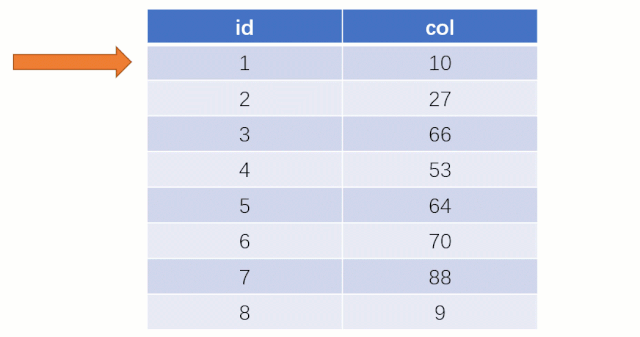

而如果走索引的话，查询的流程就完全不一样了（假设现在用一棵平衡二叉树数据结构存储我们的索引列）

此时该二叉树的存储结构（Key - Value）：Key 就是索引字段的数据，Value 就是索引所在行的磁盘文件地址。

当最后找到了 88 的时候，就可以把它的 Value 对应的磁盘文件地址拿出来，然后就直接去磁盘上去找这一行的数据，这时候的速度就会比全表扫描要快很多。

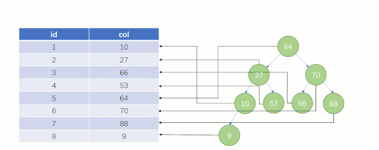

但实际上 `MySQL` 底层并没有用二叉树来存储索引数据，是用的 B+tree（B + 树）。

为什么不采用二叉树
---------

假设此时用普通二叉树记录 `id` 索引列，我们在每插入一行记录的同时还要维护二叉树索引字段。

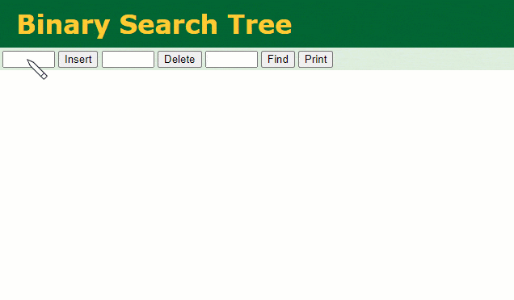

此时当我要找 `id = 7` 的那条数据时，它的查找过程如下：

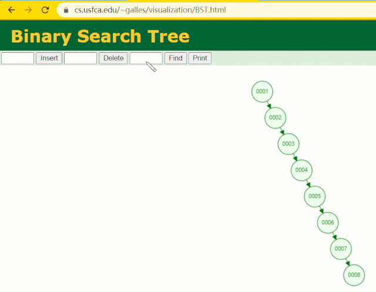

此时找 `id = 7` 这一行记录时找了 7 次，和我们全表扫描也没什么很大区别。显而易见，二叉树对于这种依次递增的数据列其实是不适合作为索引的数据结构。

为什么不采用 Hash 表
-------------

> Hash 表：一个快速搜索的数据结构，搜索的时间复杂度 O(1)
> 
> Hash 函数：将一个任意类型的 key，可以转换成一个 int 类型的下标
> 

假设此时用 Hash 表记录 `id` 索引列，我们在每插入一行记录的同时还要维护 Hash 表索引字段。

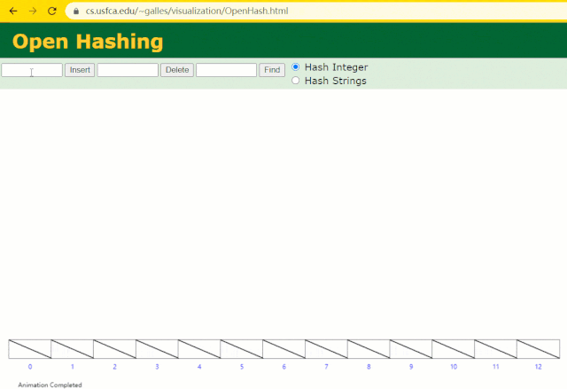

这时候开始查找 `id = 7` 的树节点仅找了 1 次，效率非常高了。

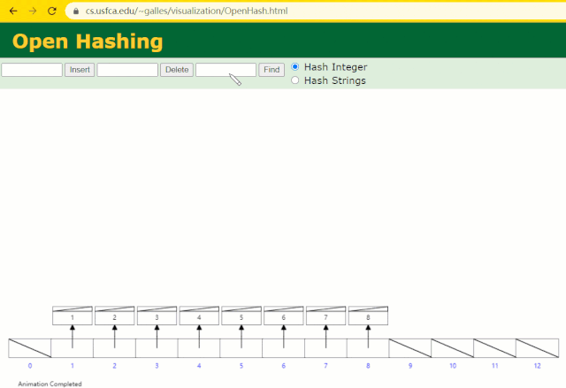

但 `MySQL` 的索引依然不采用能够精准定位的 Hash 表。**因为它不适用于范围查询。**

为什么不采用红黑树
---------

> 红黑树是一种特化的 AVL 树（平衡二叉树），都是在进行插入和删除操作时通过特定操作保持二叉查找树的平衡；
> 
> 若一棵二叉查找树是红黑树，则它的任一子树必为红黑树。
> 

假设此时用红黑树记录 `id` 索引列，我们在每插入一行记录的同时还要维护红黑树索引字段。

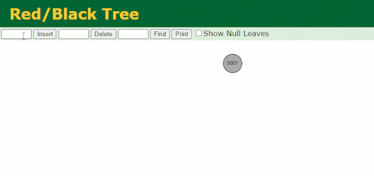

插入过程中会发现它与普通二叉树不同的是当一棵树的左右子树高度差 > 1 时，它会进行自旋操作，保持树的平衡。

这时候开始查找 `id = 7` 的树节点只找了 3 次，比所谓的普通二叉树还是要更快的。

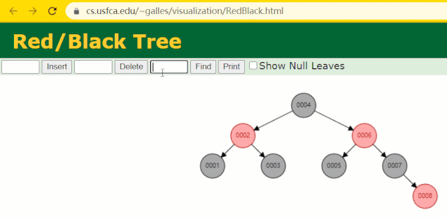

但 `MySQL` 的索引依然不采用能够精确定位和范围查询都优秀的红黑树。

因为当 `MySQL` 数据量很大的时候，索引的体积也会很大，可能内存放不下，所以需要从磁盘上进行相关读写，**如果树的层级太高，则读写磁盘的次数（I/O 交互）就会越多，性能就会越差**。

B-tree
------

> 红黑树目前的唯一不足点就是树的高度不可控，所以现在我们的切入点就是树的高度。
> 
> 目前一个节点是只分配了一个存储 1 个元素，如果要控制高度，我们就可以把一个节点分配的空间更大一点，让它横向存储多个元素，这个时候高度就可控了。这么个改造过程，就变成了 `B-tree`。
> 

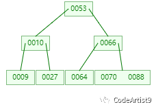

`B-tree` 是一颗绝对平衡的多路树。它的结构中还有两个概念

> 度（Degree）：一个节点拥有的子节点（子树）的数量。（有的地方是以度来说明 `B-tree` 的，这里解释一下）
> 
> 阶（order）：一个节点的子节点的最大个数。（通常用 m 表示）
> 
> 关键字：数据索引。
> 

一棵 m 阶 `B-tree` 是一棵平衡的 m 路搜索树。它可能是空树，或者满足以下特点：

1.  除根节点和叶子节点外，其它每个节点至少有  个子节点；
    
     为 m / 2 然后向上取整
    
2.  每个非根节点所包含的关键字个数 j 满足： - 1 ≤ j ≤ m - 1；
    
3.  节点的关键字从左到右递增排列，有 k 个关键字的非叶子节点正好有 (k + 1) 个子节点；
    
4.  所有的叶子结点都位于同一层。
    

### 名字取义（题外话，放松一下）

以下摘自维基百科

鲁道夫 · 拜尔（Rudolf Bayer）和 艾华 ·M· 麦克雷（Ed M. McCreight）于 1972 年在波音研究实验室（Boeing Research Labs）工作时发明了 `B-tree`，但是他们没有解释 B 代表什么意义（如果有的话）。

道格拉斯 · 科默尔（Douglas Comer）解释说：两位作者从来都没解释过 `B-tree` 的原始意义。我们可能觉得 balanced, broad 或 bushy 可能适合。其他人建议字母 B 代表 Boeing。源自于他的赞助，不过，看起来把 `B-tree` 当作 Bayer 树更合适些。

高德纳（Donald Knuth）在他 1980 年 5 月发表的题为 "CS144C classroom lecture about disk storage and B-trees" 的论文中推测了 `B-tree` 的名字取义，提出 B 可能意味 Boeing 或者 Bayer 的名字。

### 查找

`B-tree` 的查找其实和二叉树很相似：

二叉树是每个节点上有一个关键字和两个分支，`B-tree` 上每个节点有 k 个关键字和 (k + 1) 个分支。

二叉树的查找只考虑向左还是向右走，而 `B-tree` 中需要由多个分支决定。

`B-tree` 的查找分两步：

1.  首先查找节点，由于 `B-tree` 通常是在磁盘上存储的所以这步需要进行磁盘 IO 操作；
    
2.  查找关键字，当找到某个节点后将该节点读入内存中然后通过顺序或者折半查找来查找关键字。若没有找到关键字，则需要判断大小来找到合适的分支继续查找。
    

#### 操作流程

现在需要查找元素：88

第一次：磁盘 IO

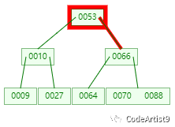

第二次：磁盘 IO

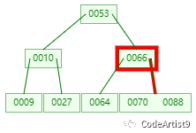

第三次：磁盘 IO

然后这有一次内存比对，分别跟 70 与 88 比对，最后找到 88。

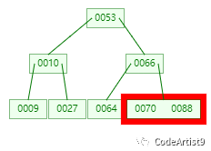

从查找过程中发现，`B-tree` 比对次数和磁盘 IO 的次数其实和二叉树相差不了多少，这么看来并没有什么优势。

但是仔细一看会发现，比对是在内存中完成中，不涉及到磁盘 IO，耗时可以忽略不计。

另外 `B-tree` 中一个节点中可以存放很多的关键字（个数由阶决定），相同数量的关键字在 `B-tree` 中生成的节点要远远少于二叉树中的节点，相差的节点数量就等同于磁盘 IO 的次数。这样到达一定数量后，性能的差异就显现出来了。

### 插入

当 `B-tree` 要进行插入关键字时，都是直接找到叶子节点进行操作。

1.  根据要插入的关键字查找到待插入的叶子节点；
    
2.  因为一个节点的子节点的最大个数（阶）为 m，所以需要判断当前节点关键字的个数是否小于 (m - 1)。
    

*   是：直接插入
    
*   否：发生节点分裂，以节点的中间的关键字将该节点分为左右两部分，中间的关键字放到父节点中即可。
    

#### 操作流程

比如我们现在需要在 Max Degree（阶）为 3 的 `B-tree`插入元素：72

1.  查找待插入的叶子节点
    
    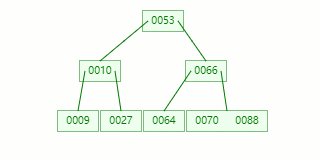
    
2.  节点分裂：本来应该和 [70,88] 在同一个磁盘块上，但是当一个节点有 3 个关键字的时候，它就有可能有 4 个子节点，就超过了我们所定义限制的最大度数 3，所以此时必须进行分裂：以中间关键字为界将节点一分为二，产生一个新节点，并把中间关键字上移到父节点中。
    

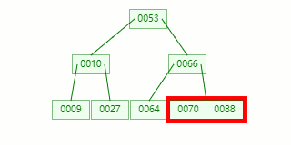

_**Tip**_ : 当中间关键字有两个时，通常将左关键字进行上移分裂。

### 删除

删除操作就会比查找和插入要麻烦一些，因为要被删除的关键字可能在叶子节点上，也可能不在，而且删除后还可能导致 `B-tree` 的不平衡，又要进行合并、旋转等操作去保持整棵树的平衡。

随便拿棵树（5 阶）举例子👇

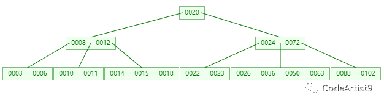

#### 情况一：直接删除叶子节点的元素

删除目标：50

1.  查找元素 50 位置
    
    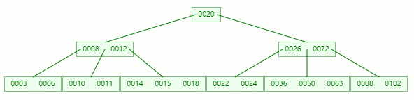
    
2.  在 [36, 50, 63] 节点移除 50 后，依然符合 `B-tree` 对节点内关键字的要求：
    
    ```
    ┌m/2┐ - 1 ≤ 关键字个数 ≤ m - 1<br style="max-width: 100%;box-sizing: border-box !important;overflow-wrap: break-word !important;"><br style="max-width: 100%;box-sizing: border-box !important;overflow-wrap: break-word !important;">┌5/2┐ - 1 ≤ 3 - 1 ≤ 5 - 1<br style="max-width: 100%;box-sizing: border-box !important;overflow-wrap: break-word !important;"><br style="max-width: 100%;box-sizing: border-box !important;overflow-wrap: break-word !important;">2 ≤ 2 ≤ 4 ✔<br style="max-width: 100%;box-sizing: border-box !important;overflow-wrap: break-word !important;">
    ```
    
    
    
    删除完成
    

#### 情况二：删除叶子节点的元素后合并 + 旋转

删除目标：11

1.  查找元素 11 位置
    
    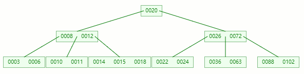
    
2.  在 [10, 11] 节点移除 11 后，违背 `B-tree` 对节点内关键字的要求：
    
    ```
    ┌m/2┐ - 1 ≤ 关键字个数 ≤ m - 1<br style="max-width: 100%;box-sizing: border-box !important;overflow-wrap: break-word !important;"><br style="max-width: 100%;box-sizing: border-box !important;overflow-wrap: break-word !important;">┌5/2┐ - 1 ≤ 2 - 1 ≤ 5 - 1<br style="max-width: 100%;box-sizing: border-box !important;overflow-wrap: break-word !important;"><br style="max-width: 100%;box-sizing: border-box !important;overflow-wrap: break-word !important;">2 ≤ 1 ≤ 4 ❌<br style="max-width: 100%;box-sizing: border-box !important;overflow-wrap: break-word !important;">
    ```
    
3.  在它只剩 1 个关键字后，需要向兄弟节点借元素，这时候右兄弟有多的，它说：我愿意把 14 借给你😁
    
    但不可能让 11 和 14 放一起，因为 `14 > 12` ，这时候就要进行旋转~
    
    首先，将父节点的元素 12 移到该节点，然后 12 就让位给 14
    
    
    
    这整个过程就是删除叶子节点元素后的合并、旋转操作
    
    下面再来道菜🍽
    

接着删除 10

1.  在 [10, 12] 节点移除 10 后，违背 `B-tree` 对节点内关键字的要求
    
2.  在它只剩 1 个关键字后，需要向兄弟节点借元素，这时候没有兄弟有多的该怎么办呢🤔
    
    首先，将父节点的元素 8 移到该节点，这时候 3、6、8、12 都小于 14，就先把它们放一起
    
    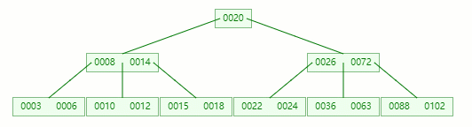
    
    结果又发现父节点只剩个 14 了，它又违背了 `B-tree` 对节点内关键字的要求，接着造！！！
    
    首先，还是将父节点的元素 20 移到该节点，这时候根节点都直接没了，直接合并 14、20、26、72 关键字
    
    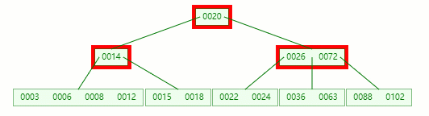
    
    在这整个过程包括删除叶子节点和非叶子节点的合并、旋转操作
    

#### 情况三：删除非叶子节点的元素后合并 + 旋转

删除目标：12

1.  查找元素 12 位置
    
    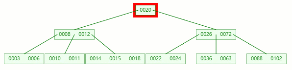
    
2.  移除 12 后，违背 `B-tree` 对节点内关键字的要求
    
    对于非叶子节点元素的删除，我们需要用后继元素覆盖要被删除的元素，然后在后继元素所在的叶子中删除该后继元素。
    
    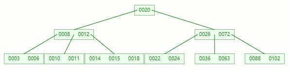
    

### 小总结

> “
> 
> 1.  B-tree 主要用于文件系统以及部分数据库索引，例如：MongoDB。
>     
> 2.  从查找效率考虑一般要求 B-tree 的阶数 m ≥ 3
>     
> 3.  B-tree 上算法的执行时间主要由读、写磁盘的次数来决定，故一次 I/O 操作应读写尽可能多的信息。
>     
>     因此 B-tree 的节点规模一般以一个磁盘页为单位。一个结点包含的关键字及其孩子个数取决于磁盘页的大小。
>     
> 
> ”

B+tree
------

上面这些例子相信大家对 `B-tree` 已经有一定了解了，而 `MySQL` 底层用的索引数据结构正是在 `B-tree` 上面做了一些改造，变成了 `B+tree`。

`B+tree` 和 `B-tree` 区别：

1.  所有的子节点，一定会出现在叶子节点上
    
2.  相邻的叶子节点之间，会用一个双向链表连接起来（关键）
    
3.  非叶子节点只存储索引，不存储数据，就为放更多索引
    

*   相比 `B-tree` 来说，进行范围查找时只需要查找两个节点，进行遍历就行。而 `B-tree` 需要获取所有节点，相比之下 `B+tree` 效率更高。
    

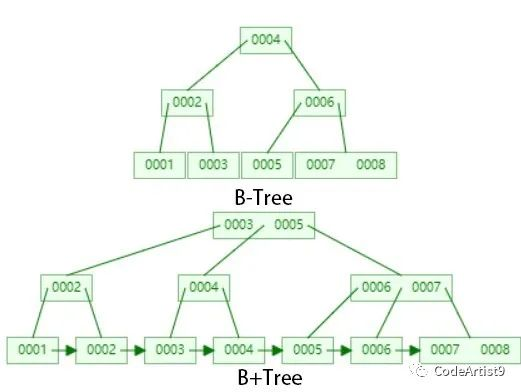

这里其实这个数据结构可视化网页画的 `B+tree` 还是不够清晰，只是画了个大概，下面我们就来看看它底层实际具体的数据结构👇👇👇

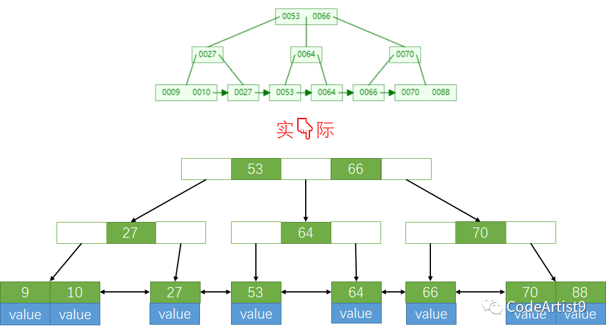

每个节点都被称作一个磁盘页


B+tree 的叶子节点包含所有索引数据，在非叶子节点会存储不存储数据，只存储索引，从而来组成一颗 B+tree。

### 查找

`B+tree` 最大的优势就在查找上，主要是范围查询更加明显。

> “
> 
> 1.  B-tree 节点中的每个关键字都有数据，而 B+tree 中间节点没有数据，只有索引；这就意味着相同大小的磁盘页可以放更多的节点元素，也就是在相同的数据量下，I/O 操作更少
>     
> 2.  在范围查询上，B-tree 需要先找到指定范围内的下限，再找到上限，有了这两个过程后再取出它们之间的元素。
>     
>     B+tree 因为叶子节点通过双向链表进行连接，找到指定范围内的下限后，直接通过链表顺序遍历就行，这样就方便很多了。
>     
> 
> ”

在查询单个关键字上，和 `B-tree` 差不多：先把通过磁盘 I/O 找到节点，再把节点加载到内存中进行内部关键字比对，然后通过大小关系再决定接下来走哪个分支。

但是差别就在于 `B+tree` 的高度更加可控一些。`MySQL` 默认给一个磁盘页数据分配的大小是 16KB，也就是 16 × 1024 = 16384 字节

官网说明：https://dev.mysql.com/doc/refman/5.7/en/innodb-physical-structure.html

证明：直接在数据库中通过 `SQL` 语句 `show GLOBAL STATUS LIKE 'INNODB_page_size'`进行验证


当我们的叶子节点全部撑满之后，可以来算一算它树的高度。

我们拿阿里的《Java 开发手册》嵩山版中对表主键的要求进行举例


`bigint` 大概占 8Byte，索引旁边放指向下一节点的磁盘文件地址那块是 6Byte，是 `MySQL` 底层写死了的。

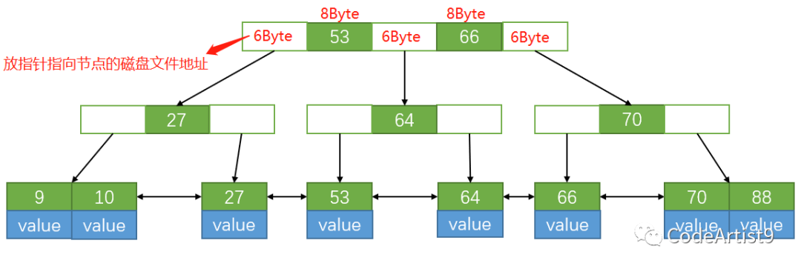

通过计算：16384 Byte / (8+6) Byte ≈ 1170，也就是说一个节点设置 16KB 大小的话可以放 1170 个索引。

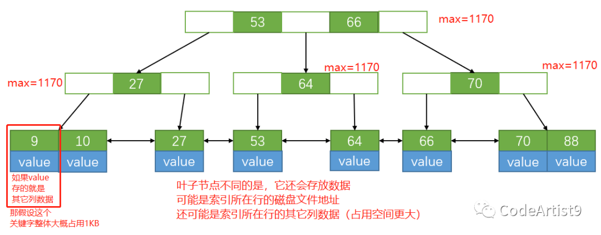

叶子节点一个关键字占用 1KB 时，那一个节点就可以放 16 个元素，当整棵树叶子节点全部都被撑满时，通过计算 `1170 × 1170 × 16 = 21902400`

最后结果为 2 千多万，树的高度才为 3，也就是我们要的高度可控。这也就是为什么 `MySQL` 的表有上千万数据的情况下，查询效率依然快的原因。

### 插入

插入还是挺简单的：当节点内元素数量大于 (m-1) 时，按中间元素分裂成左右两部分，中间元素分裂到父节点当做索引存储，本身中间元素也还会分裂右边这一部分的。

下面以 5 阶 (m) 举🌰

#### 操作流程

1.  第一次在空树中插入 1
    
    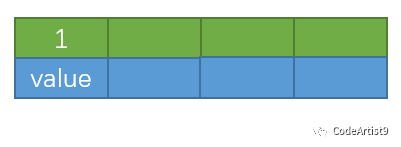
    
    再依次插入 2,3,4
    

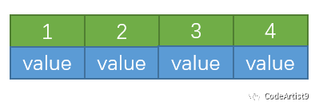

3.  插入 5
    
    当插入关键字 5 时，此时节点内元素数量大于 (5-1) ，即超过了 4 个，这时候就要进行分裂；
    
    以中间元素分裂，中间元素分裂到父节点当做索引存储，由于叶子节点包含所有索引数据，所以本身它还会分裂至右边部分。
    
    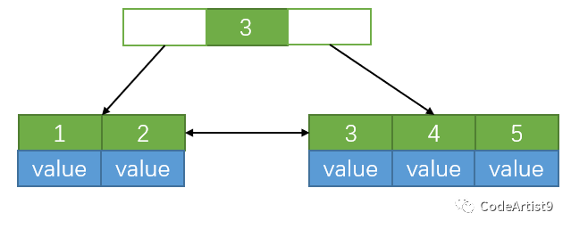
    
    这个过程是在叶子节点上进行分裂操作
    
    下面再来个插入后的非叶子节点分裂操作（大差不差）
    
    在以下的基础上插入关键字：13
    
    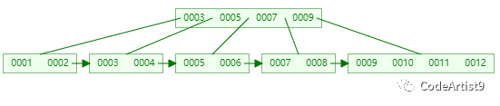
    
4.  关键字 13 插入到 [9, 10, 11, 12, 13] 后节点内元素数量超过了 4 个，准备进行分裂；
    
    以中间元素 (11) 分裂，中间元素分裂到父节点当做索引存储，本身它也还会分裂右边部分。
    
    
    
5.  关键字 11 被挪到父节点去之后，节点内元素数量超过了 4 个，又要准备进行分裂
    
    以中间元素 (7) 分裂，中间元素分裂到父节点当做（冗余）索引存储。
    
    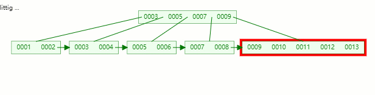
    
    插入完毕
    

### 删除

在对应节点删除目标关键字后，一样需要看看节点内剩余关键字是否符合： - 1 ≤ 关键字个数 ≤ m - 1

符合直接删除就行，不符合就和 `B-tree` 一样需要向兄弟节点借元素，不过会比 `B-tree` 稍简单一点点

因为叶子节点（双向链表）之间有指针关联着，可以不需要再找它们的父节点了，直接通过兄弟节点进行移动，然后再更新父节点；

如果兄弟节点内元素没有多余的关键字，那就直接将当前节点和兄弟节点合并，再删除父节点中的关键字。

#### 操作流程

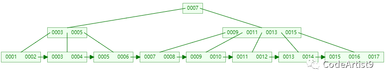

目标删除元素：14

1.  删除 14 关键字后，它所在的节点只剩 13 一个关键字了
    
    ```
    ┌m/2┐ - 1 ≤ 关键字个数 ≤ m - 1<br style="max-width: 100%;box-sizing: border-box !important;overflow-wrap: break-word !important;"><br style="max-width: 100%;box-sizing: border-box !important;overflow-wrap: break-word !important;">┌5/2┐ - 1 ≤ 2 - 1 ≤ 5 - 1<br style="max-width: 100%;box-sizing: border-box !important;overflow-wrap: break-word !important;"><br style="max-width: 100%;box-sizing: border-box !important;overflow-wrap: break-word !important;">2 ≤ 1 ≤ 4 ❌<br style="max-width: 100%;box-sizing: border-box !important;overflow-wrap: break-word !important;">
    ```
    
    准备借元素！
    
2.  直接通过右兄弟节点（只有它有富余）进行移动，然后再更新父节点的索引
    
    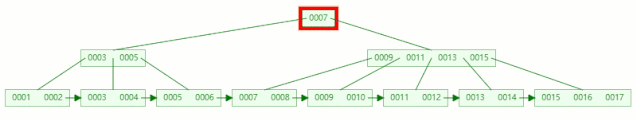
    
    删除成功后
    
    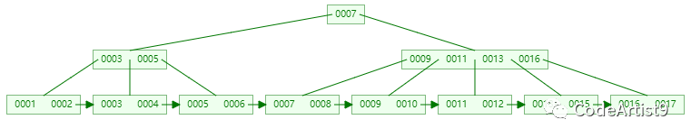
    

接着删除元素：16

1.  删除 16 关键字后，它所在的节点只剩 17 一个关键字了，又要准备借元素；
    
2.  这时候兄弟节点都没有多的，就直接把它和兄弟节点合并，再删除父节点中的关键字
    
    合并关键字 [13, 15, 17] ，在删除父节点中的关键字 16
    
    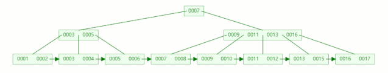
    
    删除成功后
    
    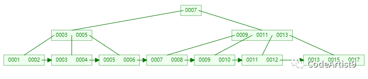
    

### 总结

> 1.  单个节点存储越多的元素，自然在整个过程中的磁盘I/O 交互就越少；
> 
> 2.  相对 B-tree 来说，所有的查询最终都会找到叶子节点，这也是 B+tree 性能稳定的一个体现；
>     
> 3.  所有叶子节点通过双向链表相连，范围查询非常方便，这也是 B+tree 最明显的优势。
>     

