## 一、逻辑架构剖析

### 1、服务器处理客户端请求

那服务器进程对客户端进程发送的请求做了什么处理，才能产生最后的处理结果呢？这里以查询请求为例展示：

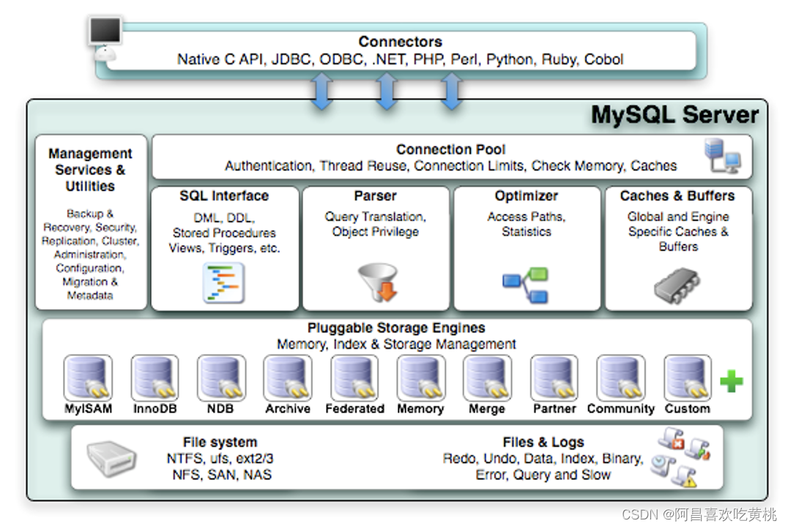

### 2、Connectors

### 3、第1层：连接层

系统（客户端）访问 `MySQL` 服务器前，做的第一件事就是建立 `TCP` 连接。
经过三次握手建立连接成功后， `MySQL` 服务器对 `TCP` 传输过来的账号密码做身份认证、权限获取。

- **用户名或密码不对，会收到一个Access denied for user错误，客户端程序结束执行**
- **用户名密码认证通过，会从权限表查出账号拥有的权限与连接关联，之后的权限判断逻辑，都将依赖于此时读到的权限**

`TCP` 连接收到请求后，必须要分配给一个线程专门与这个客户端的交互。所以还会有个线程池，去走后
面的流程。每一个连接从线程池中获取线程，省去了创建和销毁线程的开销。

### 4、 第2层：服务层

- **SQL Interface: SQL接口**

  - 接收用户的SQL命令，并且返回用户需要查询的结果。比如SELECT … FROM就是调用SQLInterface
  - MySQL支持DML（数据操作语言）、DDL（数据定义语言）、存储过程、视图、触发器、自定义函数等多种SQL语言接口

- **Parser: 解析器**

  - 在解析器中对 SQL 语句进行`语法分析`、`语义分析`。将SQL语句分解成数据结构，并将这个结构传递到后续步骤，以后SQL语句的传递和处理就是基于这个结构的。如果在分解构成中遇到错误，那么就说明这个SQL语句是不合理的。
  - 在SQL命令传递到解析器的时候会被解析器验证和解析，并为其创建`语法树` ，并根据数据字典丰富查询语法树，会 `验证`该客户端是否具有执行该查询的`权限` 。创建好语法树后，MySQL还会对SQl查询进行语法上的优化，进行查询重写。

- **Optimizer: 查询优化器**

  - SQL语句在语法解析之后、查询之前会使用查询优化器确定 SQL 语句的执行路径，生成一个`执行计划` 。
  - 这个执行计划表明应该 `使用哪些索引` 进行查询（全表检索还是使用索引检索），表之间的连接顺序如何，最后会按照执行计划中的步骤调用存储引擎提供的方法来真正的执行查询，并将查询结果返回给用户。
  - 它使用“`选取-投影-连接` ”策略进行查询。例如：

  ```sql
  SELECT id,name FROM student WHERE gender = '女';
  1
  ```

  这个SELECT查询先根据WHERE语句进行`选取` ，而不是将表全部查询出来以后再进行gender过滤。 这个SELECT查询先根据id和name进行属性 `投影` ，而不是将属性全部取出以后再进行过滤，将这两个查询条件 `连接`起来生成最终查询结果。

- **Caches & Buffers： 查询缓存组件**

  - MySQL内部维持着一些Cache和Buffer，比如Query Cache用来缓存一条SELECT语句的执行结果，如果能够在其中找到对应的查询结果，那么就不必再进行查询解析、优化和执行的整个过程了，直接将结果反馈给客户端。
  - 这个缓存机制是由一系列小缓存组成的。比如表缓存，记录缓存，key缓存，权限缓存等 。
  - 这个查询缓存可以在 `不同客户端之间共享` 。
  - 从MySQL 5.7.20开始，不推荐使用查询缓存，并在 `MySQL 8.0中删除` 。

> 小故事：
> 如果我问你9+8×16-3×2×17的值是多少，你可能会用计算器去算一下，最终结果35。如果再问你一遍9+8×16-3×2×17的值是多少，你还用再傻呵呵的再算一遍吗？我们刚刚已经算过了，直接说答案就好了。

### 5、第3层：引擎层

插件式存储引擎层（ Storage Engines），真正的负责了MySQL中数据的存储和提取，对物理服务器级别维护的底层数据执行操作，服务器通过API与存储引擎进行通信。不同的存储引擎具有的功能不同，这样我们可以根据自己的实际需要进行选取。

MySQL 8.0.25默认支持的存储引擎如下：

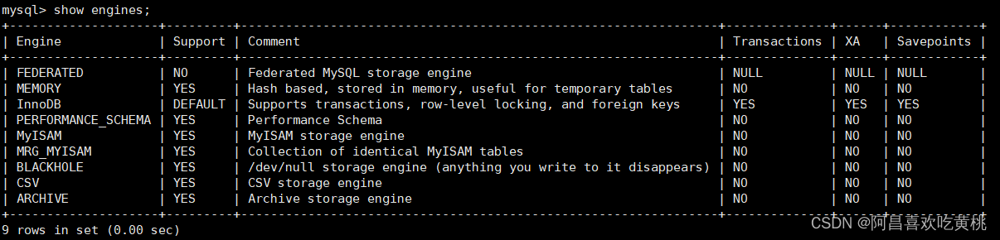

### 6、存储层

所有的数据，数据库、表的定义，表的每一行的内容，索引，都是存在 `文件系统` 上，以`文件` 的方式存在的，并完成与存储引擎的交互。当然有些存储引擎比如InnoDB，也支持不使用文件系统直接管理裸设备，但现代文件系统的实现使得这样做没有必要了。在文件系统之下，可以使用本地磁盘，可以使用DAS、NAS、SAN等各种存储系统。

### 7、小结

以上简化如下：


简化为三层结构：

1. 连接层：客户端和服务器端建立连接，客户端发送 SQL 至服务器端；
2. SQL 层（服务层）：对 SQL 语句进行查询处理；与数据库文件的存储方式无关；
3. 存储引擎层：与数据库文件打交道，负责数据的存储和读取。

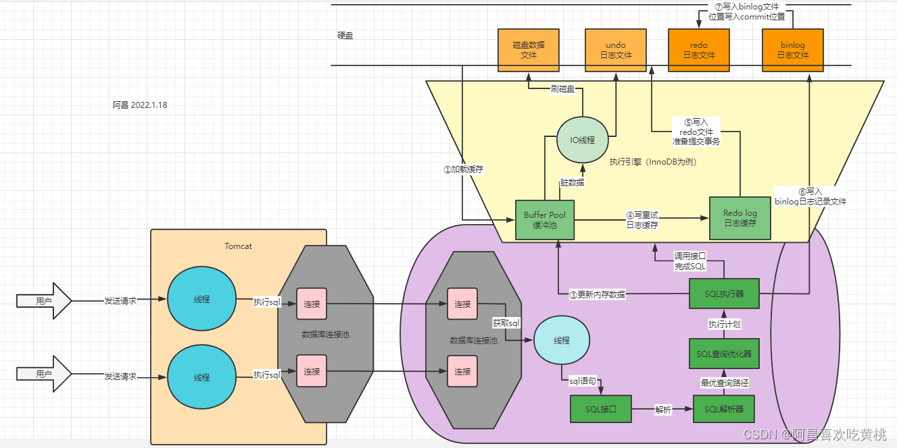

------

## 二、SQL执行流程

### 1、MySQL 中的 SQL执行流程


**MySQL的查询流程**：

1. **查询缓存**：Server 如果在查询缓存中发现了这条 SQL 语句，就会直接将结果返回给客户端；如果没有，就进入到解析器阶段。需要说明的是，因为查询缓存往往效率不高，所以在 MySQL8.0 之后就抛弃了这个功能。

大多数情况查询缓存就是个鸡肋，为什么呢？

```sql
SELECT employee_id,last_name FROM employees WHERE employee_id = 101;
1
```

查询缓存是提前把查询结果缓存起来，这样下次不需要执行就可以直接拿到结果。需要说明的是，在MySQL 中的查询缓存，不是缓存查询计划，而是查询对应的结果。这就意味着查询匹配的 `鲁棒性大大降低` ，只有 `相同的查询操作才会命中查询缓存` 。两个查询请求在任何字符上的不同（例如：空格、注释、大小写），都会导致缓存不会命中。因此 MySQL 的 查询缓存命中率不高 。

同时，如果查询请求中包含某些系统函数、用户自定义变量和函数、一些系统表，如 mysql 、information_schema、 performance_schema 数据库中的表，那这个请求就不会被缓存。以某些系统函数举例，可能同样的函数的两次调用会产生不一样的结果，比如函数 `NOW`，每次调用都会产生最新的当前时间，如果在一个查询请求中调用了这个函数，那即使查询请求的文本信息都一样，那不同时间的两次查询也应该得到不同的结果，如果在第一次查询时就缓存了，那第二次查询的时候直接使用第一次查询的结果就是错误的！

此外，既然是缓存，那就有它 `缓存失效的时候` 。MySQL的缓存系统会监测涉及到的每张表，只要该表的结构或者数据被修改，如对该表使用了`INSERT 、 UPDATE 、 DELETE 、 TRUNCATE TABLE 、 ALTER TABLE 、 DROP TABLE 或 DROP DATABASE 语句`，那使用该表的所有高速缓存查询都将变为无效并从高速缓存中删除！对于 `更新压力大的数据库` 来说，查询缓存的`命中率会非常低`。

1. **解析器**：在解析器中对 SQL 语句进行`语法分析`、`语义分析`。
   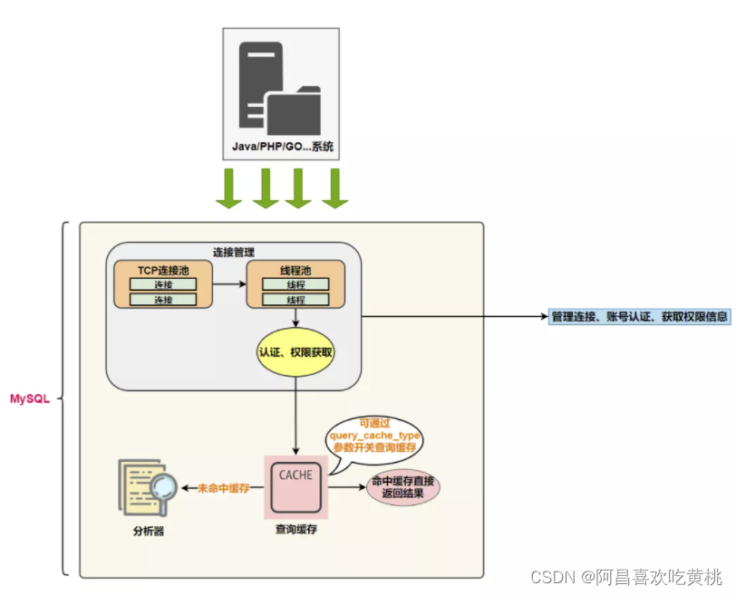
   分析器先做“ `词法分析` ”。
   你输入的是由多个字符串和空格组成的一条 SQL 语句，MySQL 需要识别出里面的字符串分别是什么，代表什么。 MySQL 从你输入的"select"这个关键字识别出来，这是一个查询语
   句。它也要把字符串“T”识别成“表名 T”，把字符串“ID”识别成“列 ID”。
   接着，要做“ `语法分析` ”。根据词法分析的结果，语法分析器（比如：Bison）会根据语法规则，判断你输入的这个 SQL 语句是否 `满足 MySQL 语法` 。
   select department_id,job_id,avg(salary) from employees group by department_id;
   如果SQL语句正确，则会生成一个这样的`语法树`：
   
2. **优化器**：在优化器中会确定 SQL 语句的执行路径，比如是根据 `全表检索` ，还是根据 `索引检索`等。
   举例：如下语句是执行两个表的 join：

```sql
select * from test1 join test2 using(ID)
where test1.name='zhangwei' and test2.name='mysql高级课程';
12
```

> - 方案1：可以先从表 test1 里面取出 name='zhangwei’的记录的 ID 值，再根据 ID 值关联到表 test2
>   再判断 test2 里面 name的值是否等于 ‘mysql高级课程’。
> - 方案2：可以先从表 test2 里面取出 name=‘mysql高级课程’ 的记录的 ID 值，再根据 ID 值关联到 test1，再判断 test1 里面 name的值是否等于 zhangwei。这两种执行方法的逻辑结果是一样的，但是执行的效率会有不同，而优化器的作用就是决定选择使用哪一个方案。优化器阶段完成后，这个语句的执行方案就确定下来了，然后进入执行器阶段。

在查询优化器中，可以分为 `逻辑查询` 优化阶段和 `物理查询` 优化阶段

1. **执行器**：
   截止到现在，还没有真正去读写真实的表，仅仅只是产出了一个执行计划。于是就进入了 `执行器阶段` 。
   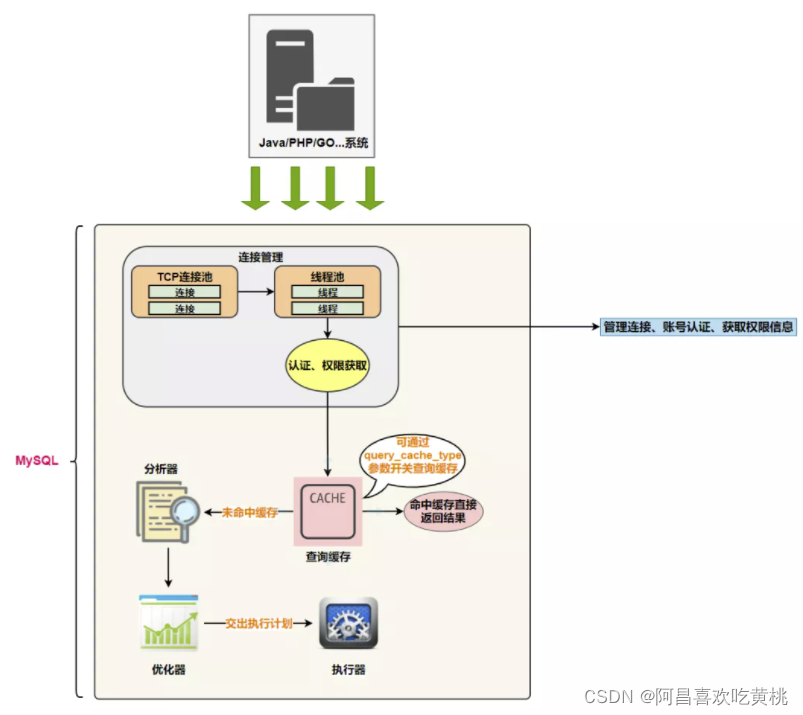
   在执行之前需要判断该用户是否 `具备权限` 。如果没有，就会返回权限错误。如果具备权限，就执行 SQL查询并返回结果。在 MySQL8.0 以下的版本，如果设置了查询缓存，这时会将查询结果进行缓存。

```sql
select * from test where id=1;
1
```

比如：表 test 中，ID 字段没有索引，那么执行器的执行流程是这样的：

> 调用 InnoDB 引擎接口取这个表的第一行，判断 ID 值是不是1，如果不是则跳过，如果是则将这行存在结果集中；调用引擎接口取“下一行”，重复相同的判断逻辑，直到取到这个表的最后一行。
> 执行器将上述遍历过程中所有满足条件的行组成的记录集作为结果集返回给客户端。

至此，这个语句就执行完成了。对于有索引的表，执行的逻辑也差不多。

SQL 语句在 MySQL 中的流程是：SQL语句→查询缓存→解析器→优化器→执行器。


### 2、MySQL8中SQL执行原理

*profiling 为记录你执行sql的记录*

**①确认profiling 是否开启**

```shell
mysql> select @@profiling;
mysql> show variables like 'profiling';
12
```

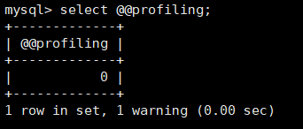
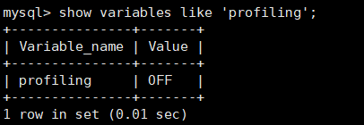
profiling=0 代表关闭，我们需要把 profiling 打开，即设置为 1：

```shell
mysql> set profiling=1;
1
```

**②多次执行相同SQL查询**

然后我们执行一个 SQL 查询（你可以执行任何一个 SQL 查询）：

```shell
mysql> select * from employees;
1
```

**③查看profiles**

查看当前会话所产生的所有 profiles：

```shell
mysql> show profiles;  # 显示最近的几次查询
1
```

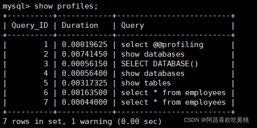

**④查看profile**
显示执行计划，查看程序的执行步骤：

```shell
mysql> show profile;
1
```

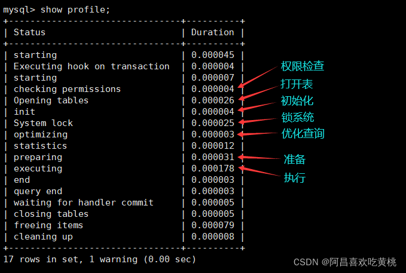
当然你也可以查询指定的 Query ID，比如：

```shell
mysql> show profile for query 7;
1
```

查询 SQL 的执行时间结果和上面是一样的。
此外，还可以查询更丰富的内容：

```shell
mysql> show profile cpu,block io for query 6;
1
```

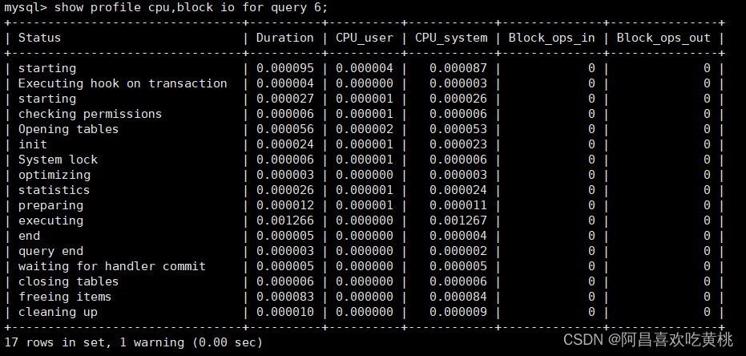

```shell
mysql> show profile cpu,block io for query 7;
1
```

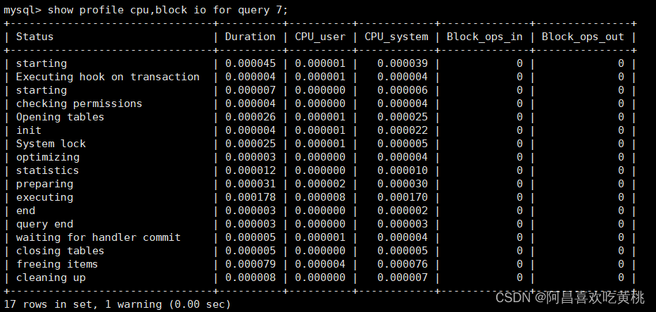

### 3、MySQL5.7中SQL执行原理

上述操作在MySQL5.7中测试，发现前后两次相同的sql语句，执行的查询过程仍然是相同的。

不是会使用缓存吗？这里我们需要 `显式开启查询缓存模式` 。在MySQL5.7中如下设置：

**① 配置文件中开启查询缓存**
在 /etc/my.cnf 中新增一行：

```shell
query_cache_type=1
1
```

**②重启mysql服务**

```shell
systemctl restart mysqld
1
```

**③开启查询执行计划**

由于重启过服务，需要重新执行如下指令，开启profiling。

```shell
mysql> set profiling=1;
1
```

**④执行语句两次**

```shell
mysql> select * from locations;
mysql> select * from locations;
12
```

**⑤查看profiles**


**⑥查看profile**

显示执行计划，查看程序的执行步骤：

```shell
mysql> show profile for query 1;
1
```


```shell
mysql> show profile for query 2;
1
```

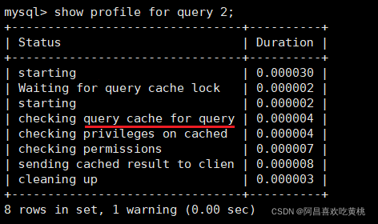
结论不言而喻。执行编号2时，比执行编号1时少了很多信息，从截图中可以看出查询语句直接从缓存中获取数据。

### 4、SQL语法顺序

随着Mysql版本的更新换代，其优化器也在不断的升级，优化器会分析不同执行顺序产生的性能消耗不同而动态调整执行顺序。
需求：查询每个部门年龄高于20岁的人数且高于20岁人数不能少于2人，显示人数最多的第一名部门信息
下面是经常出现的查询顺序：

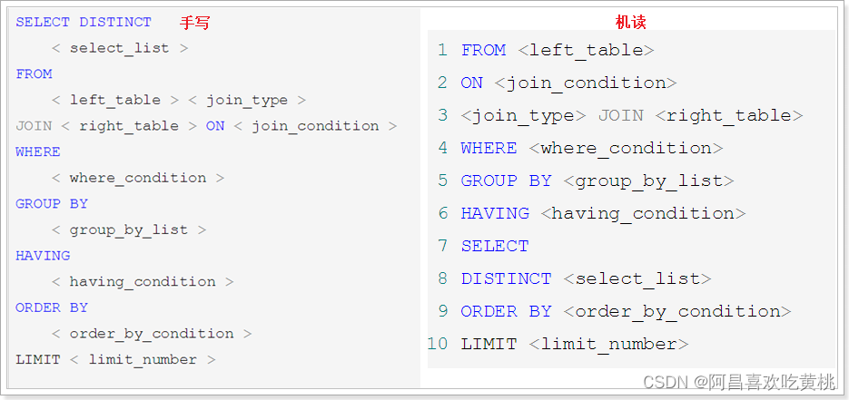

### 5、Oracle中的SQL执行流程(了解)

Oracle 中采用了`共享池` 来判断 SQL 语句是否存在缓存和执行计划，通过这一步骤我们可以知道应该采用硬解析还是软解析。

我们先来看下 SQL 在 Oracle 中的执行过程：

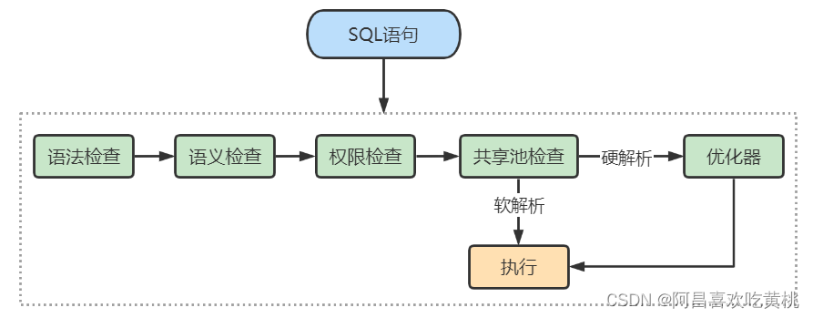

从上面这张图中可以看出，SQL 语句在 Oracle 中经历了以下的几个步骤。
1.**语法检查**：检查 SQL 拼写是否正确，如果不正确，Oracle 会报语法错误。
2.**语义检查**：检查 SQL 中的访问对象是否存在。比如我们在写 SELECT 语句的时候，列名写错了，系统就会提示错误。语法检查和语义检查的作用是保证 SQL 语句没有错误。
3.**权限检查**：看用户是否具备访问该数据的权限。
4.**共享池检查**：共享池（Shared Pool）是一块内存池，`最主要的作用是缓存 SQL 语句和该语句的执行计划`。Oracle 通过检查共享池是否存在 SQL 语句的执行计划，来判断进行软解析，还是硬解析。那软解析和硬解析又该怎么理解呢？

在共享池中，Oracle 首先对 SQL 语句进行 `Hash 运算` ，然后根据 Hash 值在库缓存（Library Cache）中查找，如果 `存在 SQL 语句的执行计划`，就直接拿来执行，直接进入“执行器”的环节，这就是 `软解析` 。
如果没有找到 SQL 语句和执行计划，Oracle 就需要创建解析树进行解析，生成执行计划，进入“优化器”这个步骤，这就是 `硬解析` 。
\5. **优化器**：优化器中就是要进行硬解析，也就是决定怎么做，比如创建解析树，生成执行计划。
\6. **执行器**：当有了解析树和执行计划之后，就知道了 SQL 该怎么被执行，这样就可以在执行器中执
行语句了。

`共享池`是 Oracle 中的术语，包括了库缓存，数据字典缓冲区等。我们上面已经讲到了库缓存区，它主要
缓存 SQL 语句和执行计划。而 `数据字典缓冲区` 存储的是 Oracle 中的对象定义，比如表、视图、索引等对象。当对 SQL 语句进行解析的时候，如果需要相关的数据，会从数据字典缓冲区中提取。
库缓存 这一个步骤，决定了 SQL 语句是否需要进行硬解析。为了提升 SQL 的执行效率，我们应该尽量避免硬解析，因为在 SQL 的执行过程中，创建解析树，生成执行计划是很消耗资源的。
你可能会问，如何避免硬解析，尽量使用软解析呢？在 Oracle 中， `绑定变量` 是它的一大特色。绑定变量就是在 SQL 语句中使用变量，通过不同的变量取值来改变 SQL 的执行结果。这样做的好处是能 `提升软解析的可能性` ，不足之处在于可能会导致生成的执行计划不够优化，因此是否需要绑定变量还需要视情况而定。
举个例子，我们可以使用下面的查询语句：

```shell
SQL> select * from player where player_id = 10001;
1
```

你也可以使用绑定变量，如：

```shell
SQL> select * from player where player_id = :player_id;
1
```

这两个查询语句的效率在 Oracle 中是完全不同的。
如果你在查询 player_id = 10001 之后，还会查询10002、10003 之类的数据，那么每一次查询都会创建一个新的查询解析。而第二种方式使用了绑定变量，那么在第一次查询之后，在共享池中就会存在这类查询的执行计划，也就是软解析。
因此，`我们可以通过使用绑定变量来减少硬解析，减少 Oracle 的解析工作量`。但是这种方式也有缺点，使用动态 SQL 的方式，因为参数不同，会导致 SQL 的执行效率不同，同时 SQL 优化也会比较困难。

**Oracle的架构图**：
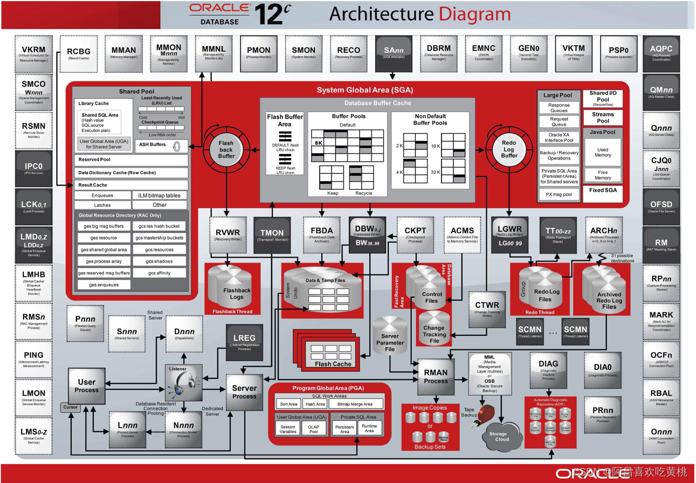
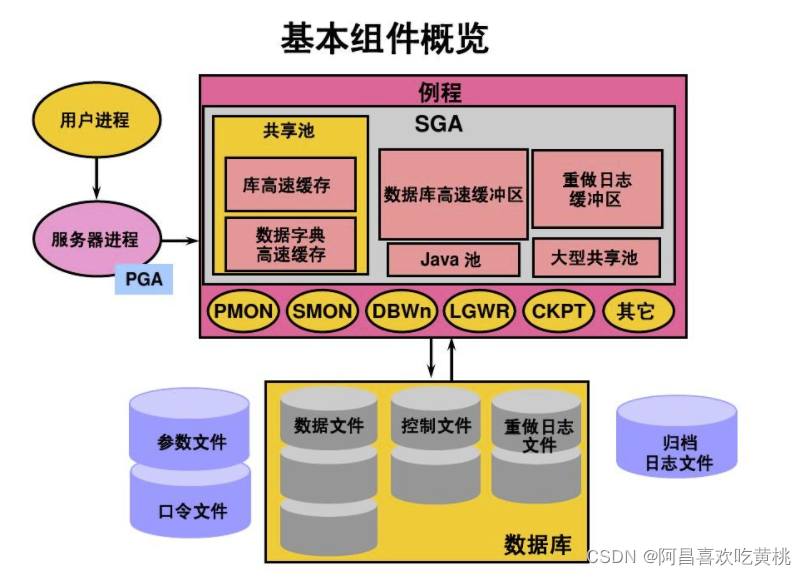

**小结**：
Oracle 和 MySQL 在进行 SQL 的查询上面有软件实现层面的差异。Oracle 提出了共享池的概念，通共享池来判断是进行软解析，还是硬解析。

------

## 三、数据库缓冲池(buffer pool)

`InnoDB` 存储引擎是以页为单位来管理存储空间的，我们进行的增删改查操作其实本质上都是在访问页
面（包括读页面、写页面、创建新页面等操作）。而磁盘 I/O 需要消耗的时间很多，而在内存中进行操
作，效率则会高很多，为了能让数据表或者索引中的数据随时被我们所用，DBMS 会申请 `占用内存来作为数据缓冲池` ，在真正访问页面之前，需要把在磁盘上的页缓存到内存中的 `Buffer Pool`之后才可以访问。
这样做的好处是可以让磁盘活动最小化，从而 `减少与磁盘直接进行 I/O 的时间` 。
要知道，这种策略对提升 SQL 语句的查询性能来说至关重要。如果索引的数据在缓冲池里，那么访问的成本就会降低很多。

### 1、缓冲池 vs 查询缓存

*缓冲池和查询缓存是一个东西吗？不是。*

**①缓冲池（Buffer Pool）**
首先我们需要了解在 InnoDB 存储引擎中，缓冲池都包括了哪些。

在 InnoDB 存储引擎中有一部分数据会放到内存中，缓冲池则占了这部分内存的大部分，它用来存储各种数据的缓存，如下图所示：

从图中，你能看到 InnoDB 缓冲池包括了数据页、索引页、插入缓冲、锁信息、自适应 Hash 和数据字典信息等。

**缓存池的重要性**：

**缓存原则**：

`“ 位置 * 频次 ”`这个原则，可以帮我们对 I/O 访问效率进行优化。
首先，位置决定效率，提供缓冲池就是为了在内存中可以直接访问数据。
其次，频次决定优先级顺序。因为缓冲池的大小是有限的，比如磁盘有 200G，但是内存只有 16G，缓冲池大小只有 1G，就无法将所有数据都加载到缓冲池里，这时就涉及到优先级顺序，会 `优先对使用频次高的热数据进行加载` 。

**缓冲池的预读特性**：

**②查询缓存**
那么什么是查询缓存呢？
查询缓存是提前把 `查询结果缓存` 起来，这样下次不需要执行就可以直接拿到结果。需要说明的是，在MySQL 中的查询缓存，不是缓存查询计划，而是查询对应的结果。
因为命中条件苛刻，而且只要数据表发生变化，查询缓存就会失效，因此命中率低。

### 2、缓冲池如何读取数据

缓冲池管理器会尽量将经常使用的数据保存起来，在数据库进行页面读操作的时候，首先会判断该页面是否在缓冲池中，如果存在就直接读取，如果不存在，就会通过内存或磁盘将页面存放到缓冲池中再进行读取。缓存在数据库中的结构和作用如下图所示：
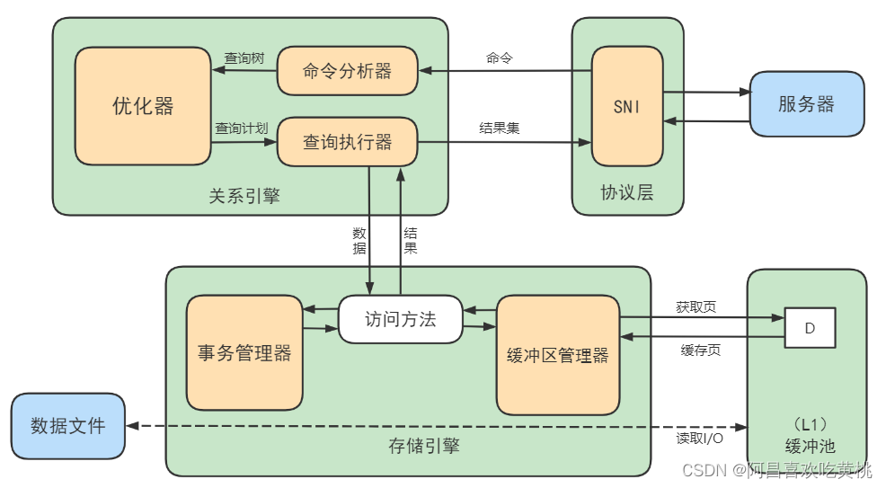
*如果我们执行 SQL 语句的时候更新了缓存池中的数据，那么这些数据会马上同步到磁盘上吗？*

### 3、 查看/设置缓冲池的大小

如果你使用的是 InnoDB 存储引擎，可以通过查看 innodb_buffer_pool_size 变量来查看缓冲池的大小。命令如下：

```sql
show variables like 'innodb_buffer_pool_size';
1
```


你能看到此时 InnoDB 的缓冲池大小只有 134217728/1024/1024=128MB。我们可以修改缓冲池大小，比如改为256MB，方法如下：

```sql
set global innodb_buffer_pool_size = 268435456;
1
```

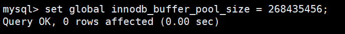
或者`配置文件`：

```sql
[server]
innodb_buffer_pool_size = 268435456
12
```

然后再来看下修改后的缓冲池大小，此时已成功修改成了 256 MB：
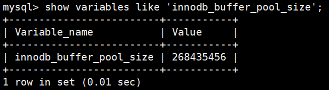

### 4、多个Buffer Pool实例（缓冲池）

```sql
[server]
innodb_buffer_pool_instances = 2
12
```

这样就表明我们要创建2个 `Buffer Pool`实例。

我们看下如何查看缓冲池的个数，使用命令：

```sql
show variables like 'innodb_buffer_pool_instances';
1
```

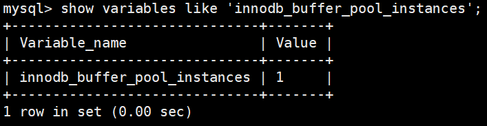

那每个 `Buffer Pool` 实例实际占多少内存空间呢？其实使用这个公式算出来的：

```sql
innodb_buffer_pool_size/innodb_buffer_pool_instances
1
```

也就是总共的大小除以实例的个数，结果就是每个`Buffer Pool`实例占用的大小。

### 5、引申问题

Buffer Pool是MySQL内存结构中十分核心的一个组成，你可以先把它想象成一个黑盒子。

**黑盒下的更新数据流程**

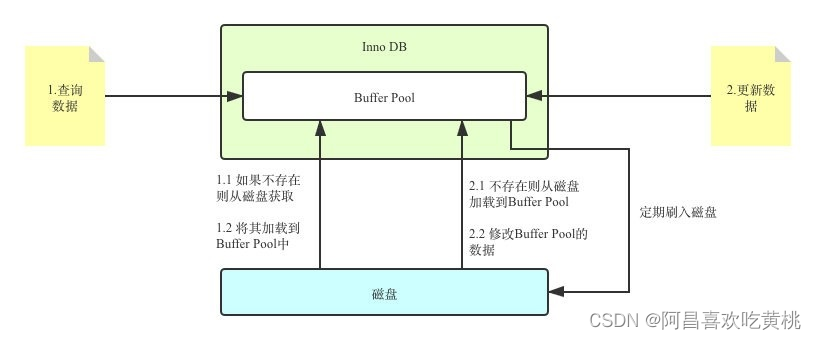
我更新到一半突然发生错误了，想要回滚到更新之前的版本，该怎么办？
连数据持久化的保证、事务回滚都做不到还谈什么崩溃恢复？
答案：`Redo Log & Undo Log`