# 第**06**章**_**索引的数据结构


## 1. 为什么使用索引

索引是存储引擎用于快速找到数据记录的一种数据结构，就好比一本教课书的目录部分，通过目录中找到对应文章的页码，便可快速定位到需要的文章。MysQL中也是一样的道理，进行数据查找时，首先查看查询条件是否命中某条索引，符合则`通过索引查找`相关数据，如果不符合则需要`全表扫描`，即需要一条一条地查找记录，直到找到与条件符合的记录。

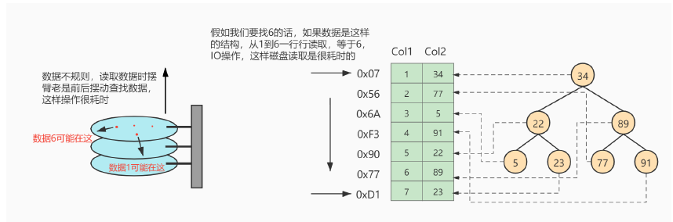

如上图所示，数据库没有索引的情况下，数据`分布在硬盘不同的位置上面`，读取数据时，摆臂需要前后摆动查找数据，这样操作非常消耗时间。如果`数据顺序摆放`，那么也需要从1到6行按顺序读取，这样就相当于进行了6次IO操作，依旧非常耗时。如果我们不借助任何索引结构帮助我们快速定位数据的话，我们查找Col 2=89这条记录，就要逐行去查找、去比较。从Col 2=34开始，进行比较，发现不是，继续下一行。我们当前的表只有不到10行数据，但如果表很大的话，有`上千万条数据`，就意味着要做`很多很多次磁盘I/O`才能找到。现在要查找Col 2=89这条记录。CPU必须先去磁盘查找这条记录，找到之后加载到内存，再对数据进行处理。这个过程最耗时间的就是磁盘/0（涉及到磁盘的旋转时间（速度较快）、磁头的寻道时间速度慢、费时））


假如给数据使用二叉树这样的数据结构进行存储，如下图所示

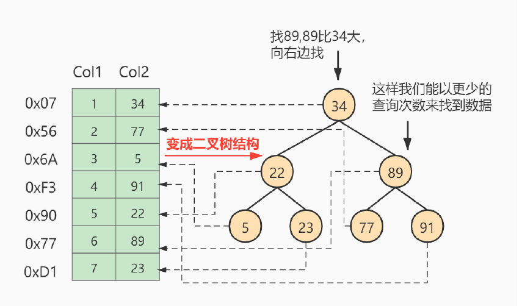


这就是我们为什么要建索引，目的就是为了`减少磁盘I/O的次数`，加快查询速率。

## 2. 索引及其优缺点

### 2.1 索引概述

MySQL官方对索引的定义为：**索引（Index）是帮助MySQL高效获取数据的数据结构**。

**索引的本质**：索引是数据结构。你可以简单理解为“排好序的快速查找数据结构”，满足特定查找算法。
这些数据结构以某种方式指向数据， 这样就可以在这些数据结构的基础上实现高级查找算法。


`索引是在存储引擎中实现的`，因此每种存储引擎的索引不一定完全相同，并且每种存储引擎不一定支持所有索引类型。同时，存储引擎可以定义每个表的`最大索引数`和`最大索引长度`。所有存储引擎支持每个表至少16个索引，总索引长度至少为256字节。有些存储引擎支持更多的索引数和更大的索引长度。

### 2.2 优点

（1）类似大学图书馆建书目索引，提高数据检索的效率，降低`数据库的IO成本`，这也是创建索引最主
要的原因。 

（2）通过创建唯一索引，可以保证数据库表中每一行`数据的唯一性`。 

（3）在实现数据的参考完整性方面，可以`加速表和表之间的连接`。换句话说，对于有依赖关系的子表和父表联合查询时，可以提高查询速度。 

（4）在使用分组和排序子句进行数据查询时，可以显著`减少查询中分组和排序的时间`，降低了CPU的消耗。

### 2.3 缺点

增加索引也有许多不利的方面，主要表现在如下几个方面： 

（1）`创建索引和维护索引要耗费时间`，并且随着数据量的增加，所耗费的时间也会增加。 

（2）索引需要占`磁盘空间`，除了数据表占数据空间之
外，每一个索引还要占一定的物理空间， `存储在磁盘上`，如果有大量的索引，索引文件就可能比数据文
件更快达到最大文件尺寸。

（3）虽然索引大大提高了查询速度，同时却`会降低更新表的速度`。当对表中的数据进行增加、删除和修改的时候，索引也要动态地维护，这样就降低了数据的维护速度。


因此，选择使用索引时，需要综合考虑索引的优点和缺点。

> 提示：
>
> 索引可以提高查询的速度，但是会影响插入记录的速度。这种情况下，最好的办法是先删除表中的索引，然后插入数据，插入完成后再创建索引。
>
>  
>
> **插入数据主键不自增回涉及到  表记录记录移动【根数据页固定不变】  页分裂**


## 3. InnoDB**中索引的推演**

### 3.1 索引之前的查找

先来看一个精确匹配的例子：

```mysql
SELECT [列名列表] FROM 表名 WHERE 列名 = xxx;
```

1. #### 在一个页中的查找

2. #### 在很多页中查找

在没有索引的情况下，不论是根据主键列或者其他列的值进行查找，由于我们并不能快速的定位到记录所在的页，所以只能 `从第一个页` 沿着 `双向链表` 一直往下找，在每一个页中根据我们上面的查找方式去查找指定的记录。因为要遍历所有的数据页，所以这种方式显然是 `超级耗时` 的。如果一个表有一亿条记录呢？此时 `索引` 应运而生。


### 3.2 设计索引

建一个表：

```mysql
mysql> CREATE TABLE index_demo(
-> c1 INT,
-> c2 INT,
-> c3 CHAR(1),
-> PRIMARY KEY(c1)
-> ) ROW_FORMAT = Compact;
```

这个新建的 `index_demo` 表中有2个INT类型的列，1个CHAR(1)类型的列，而且我们规定了c1列为主键，这个表使用 `Compact 行格式`来实际存储记录的。这里我们简化了index_demo表的行格式示意图：

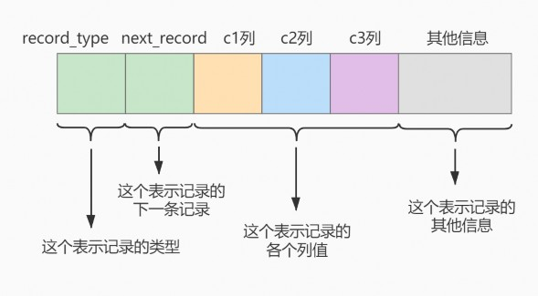

我们只在示意图里展示记录的这几个部分：

+ `record_type` ：记录头信息的一项属性，表示记录的类型， 0 表示普通记录、 2 表示最小记

录、 3 表示最大记录、 1 暂时还没用过，下面讲。

+ `next_record` ：记录头信息的一项属性，表示下一条地址相对于本条记录的地址偏移量，我们用箭头来表明下一条记录是谁。

+ `各个列的值` ：这里只记录在 index_demo 表中的三个列，分别是 c1 、 c2 和 c3 。

+ `其他信息` ：除了上述3种信息以外的所有信息，包括其他隐藏列的值以及记录的额外信息。

将记录格式示意图的其他信息项暂时去掉并把它竖起来的效果就是这样：


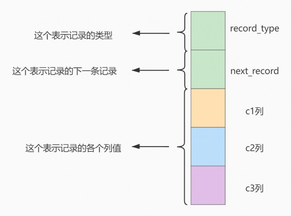

把一些记录放到页里的示意图就是：


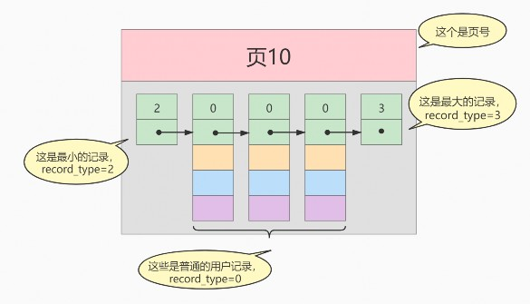

#### 1. 一个简单的索引设计方案

我们在根据某个搜索条件查找一些记录时为什么要遍历所有的数据页呢？因为各个页中的记录并没有规律，我们并不知道我们的搜索条件匹配哪些页中的记录，所以不得不依次遍历所有的数据页。所以如果我们 `想快速的定位到需要查找的记录在哪些数据页` 中该咋办？我们可以为快速定位记录所在的数据页而 `建立一个目录` ，建这个目录必须完成下边这些事：

+ `下一个数据页`中用户记录的`主键值必须大于上一个页`中用户记录的`主键值`。
+ `给所有的页建立一个目录项`。

所以我们为上边几个页做好的目录就像这样子：

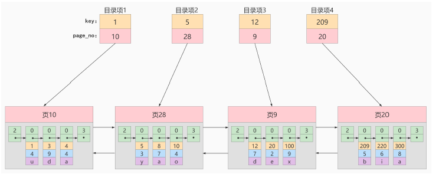

以 `页28` 为例，它对应 `目录项2` ，这个目录项中`包含`着该页的`页号` `28` 以及该页中用户记录的`最小主键值 5` 。我们只需要把几个目录项在物理存储器上连续存储（比如：数组），就可以实现根据主键值快速查找某条记录的功能了。比如：查找主键值为 20 的记录，具体查找过程分两步：

1. 先从目录项中根据 `二分法` 快速确定出`主键值为 20` 的记录在 目录项3 中（因为 `12 < 20 < 209` ），它对应的页是 `页9` 。

2. 再根据前边说的在页中查找记录的方式去 `页9` 中定位具体的记录。只需要`两次磁盘IO`

   

至此，针对数据页做的简易目录就搞定了。这个目录有一个别名，称为 `索引 。`

#### 2. InnoDB**中的索引方案**

##### ① 迭代**1**次：目录项纪录的页

我们把前边使用到的目录项放到数据页中的样子就是这样：

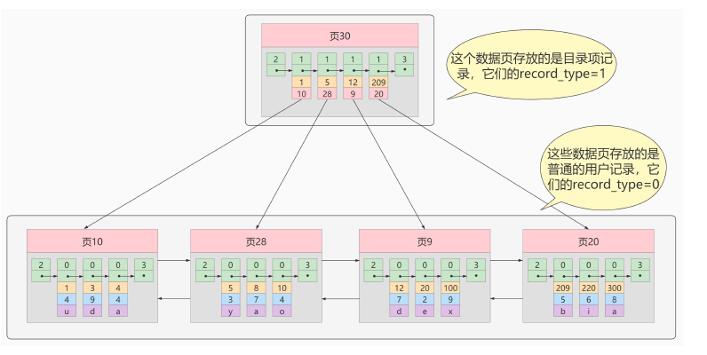


从图中可以看出来，我们新分配了一个编号为30的页来专门存储目录项记录。这里再次强调 `目录项记录`和普通的 用户记录 的**不同点**：


+ `目录项记录` 的 `record_type` 值是`1`，而 `普通用户记录` 的 record_type 值是`0`。

+ 目录项记录只有 `主键值和页的编号` `两个列`，而普通的用户记录的列是用户自己定义的，可能包含 很多列 ，另外还有InnoDB自己添加的隐藏列。

+ 了解：记录头信息里还有一个叫 `min_rec_mask` 的属性，**只有在存储 目录项记录 的页中的主键值最小的 目录项记录 的 min_rec_mask 值为 1** ，其他别的记录的 min_rec_mask 值都是 0 。


**相同点：**两者用的是一样的数据页，都会为主键值生成 `Page Directory （页目录）`，从而在按照主键值进行查找时可以使用 二分法 来加快查询速度。


现在以查找主键为 20 的记录为例，根据某个主键值去查找记录的步骤就可以大致拆分成下边两步：

1. 先到存储 `目录项记录` 的页，也就是页30中通过 `二分法` 快速定位到对应目录项，因为 12 < 20 < 209 ，所以定位到对应的记录所在的页就是`页9`。

2. 再到存储用户记录的`页9中根据` `二分法` **快速定位到主键值为 20 的用户记录**。

##### ② 迭代**2**次：多个目录项纪录的页

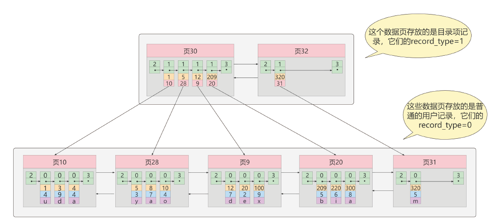

从图中可以看出，我们插入了一条主键值为320的用户记录之后需要两个新的数据页：

+ 为存储该用户记录而`新生成了 页31` 。

+ 因为原先存储目录项记录的 `页30的容量已满` （我们前边假设只能存储4条目录项记录），所以不得不需要一个新的 页32 来存放 页31 对应的目录项。


现在因为存储目录项记录的页不止一个，所以如果我们想根据主键值查找一条用户记录大致需要3个步骤，以查找主键值为 20 的记录为例：

1. 确定 `目录项记录页`

   我们现在的`存储目录项记录的页有两个，即 页30 和 页32` ，又因为页30表示的目录项的主键值的范围是 [1, 320) ，页32表示的目录项的主键值不小于 320 ，所以`主键值为 20 的记录对应的目录项记录在 页30 中`。

2. 通过目录项记录页 `确定用户记录真实所在的页` 。

   在一个存储 `目录项记录` 的页中通过主键值定位一条目录项记录的方式说过了。

3. 在真实存储用户记录的页中定位到具体的记录。

##### ③ 迭代**3**次：目录项记录页的目录页

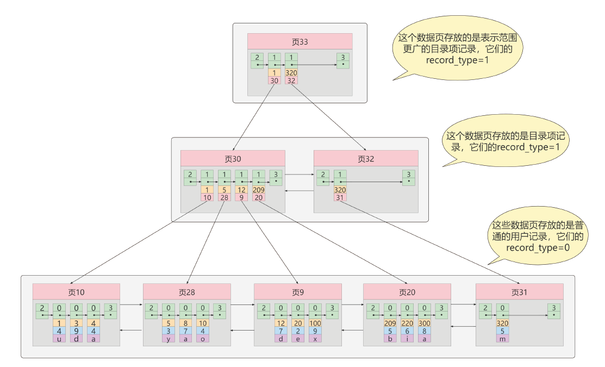


如图，我们生成了一个存储更高级目录项的 `页33` ，这个页中的两条记录分别代表页30和页32，如果用户记录的主键值在 [1, 320) 之间，则到页30中查找更详细的目录项记录，如果主键值 不小于320 的话，就到页32中查找更详细的目录项记录。

我们可以用下边这个图来描述它：

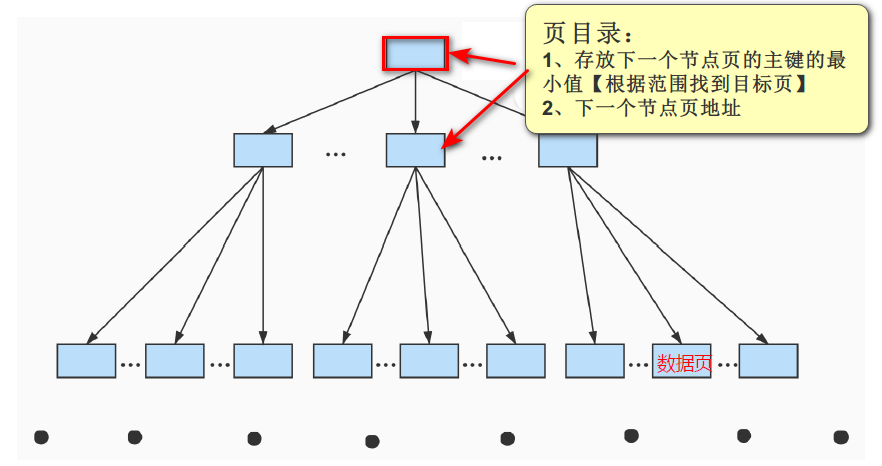

这个数据结构，它的名称是 B+树 。

##### ④ **B+Tree**

一个B+树的节点其实可以分成好多层，规定最下边的那层，也就是存放我们用户记录的那层为`第 0 层`，之后依次往上加。之前我们做了一个非常极端的假设：存放用户记录的页 `最多存放3条记录` ，存放目录项记录的页 `最多存放4条记录` 。其实真实环境中一个页存放的记录数量是非常大的，假设所有存放用户记录的`叶子节点代表的数据页`可以存放 `100条用户记录` ，所有`存放目录项记录的内节点代表的数据页可以存放 1000条目录项记录` ，那么：

+ 如果B+树只有`1层`，也就是只有1个用于存放用户记录的节点，最多能存放 `100` 条记录。

+ 如果B+树有`2层`，最多能存放 1000×100=`10,0000` 条记录。

+ 如果B+树有`3层`，最多能存放 1000×1000×100=`1,0000,0000` 条记录。

+ 如果B+树有`4层`，最多能存放 1000×1000×1000×100=`1000,0000,0000` 条记录。**相当多的记录！！！**


你的表里能存放 100000000000 条记录吗？所以一般情况下，我们 `用到的B+树都不会超过4层 【层数过多，磁盘IO次数多，耗时长】`，那我们通过主键值去查找某条记录最多只需要做4个页面内的查找（查找3个目录项页和一个用户记录页），又因为在每个页面内有所谓的 `Page Directory （页目录）`，所以在页面内也可以通过 `二分法` 实现快速定位记录。


### 3.3 常见索引概念

索引按照物理实现方式，索引可以分为 2 种：聚簇（聚集）和非聚簇（非聚集）索引。我们也把非聚集索引称为二级索引或者辅助索引。

#### 1. 聚簇索引

聚簇索引并不是一种单独的索引类型，而是`一种数据存储方式`（所有的用户记录都存储在了叶子节点），也就是所谓的`索引即数据，数据即索引`。

> 术语"聚簇"表示数据行和相邻的键值聚簇的存储在一起。 

**特点：**

1. 使用**记录主键值的大小进行记录和页的排序**，这包括三个方面的含义：

   + `页内` 的记录是**按照主键的大小顺序**排成一个 **单向链表** 。

   + 各个存放 `用户记录的页` 也是根据页中用户记录`的主键大小顺序排成一个 双向链表` 。

   + 存放 `目录项记录的页` 分为不同的层次，在同一层次中的页也是根据页中目录项记录的主键大小顺序排成一个 `双向链表` 。

2. B+树的 `叶子节点` 存储的是完整的用户记录。

   + 所谓完整的用户记录，就是指这个记录中存储了所有列的值（包括隐藏列）。

我们把具有这**两种特性的B+树称为聚簇索引**，**所有完整的用户记录都存放在这个聚族索引的叶子节点处**。这种聚簇索引并不需要我们在MySQL语句中显式的使用`INDEX`语句去创建，`InnoDB`存储引擎会`自动`的为我们创建聚簇索引。


**优点：**

+ `数据访问更快` ，因为聚簇索引将索引和数据保存在同一个B+树中，因此从聚簇索引中获取数据比非聚簇索引更快

+ 聚簇索引对于主键的 `排序查找` 和 `范围查找` 速度非常快

+ 按照聚簇索引排列顺序，查询显示一定范围数据的时候，由于数据都是紧密相连，数据库不用从多个数据块中提取数据，所以 `节省了大量的io操作` 。

**缺点：**

+ `插入速度严重依赖于插入顺序` ，按照主键的顺序插入是最快的方式，否则将会出现`页分裂`，严重影响性能。因此，对于InnoDB表，我们一般都会定义一个**自增的ID列为主键**

+ `更新主键的代价很高` ，因为将会导致`被更新的行移动`。因此，对于InnoDB表，我们一般定义**主键为不可更新**

+ `二级索引访问需要两次索引查找` ，第一次找到主键值，第二次根据主键值找到行数据


**限制：**

+ 对于MysqL数据库目前只有InnoDB数据引擎支持聚簇索引，而MyISAM并不支持聚簇索引。
+ 由于数据物理存储排序方式只能有一种，所以每个MysQL的`表只能有一个聚簇索引`。一般情况下就是该表的主键。
+ 如果没有定义主键，Innodb会选择`非空的唯一索引代替`。如果`没有这样的索引，Innodb会隐式的定义一个主键来作为聚簇索引`。
+ 为了充分利用聚簇索引的聚簇的特性，所以innodb表的主键列尽量`选用有序的顺序id`，而不建议用无序的id，比如UUID、MD5，HASH、字符串列作为主键无法保证数据的顺序增长。

#### 2. 二级索引（辅助索引、非聚簇索引）

上边介绍的`聚簇索引`只能在搜索条件是主键值时才能发挥作用，因为B+树中的数据都是按照主键进行排序的。那如果我们想以别的列作为搜索条件该怎么办呢？肯定不能是从头到尾沿着链表依次遍历记录一遍。
答案：我们可以`多建几棵B+树`，不同的B+树中的数据采用不同的排序规则。比方说我们用c2列的大小作为数据页、页中记录的排序规则，再建一棵B+树，效果如下图所示：

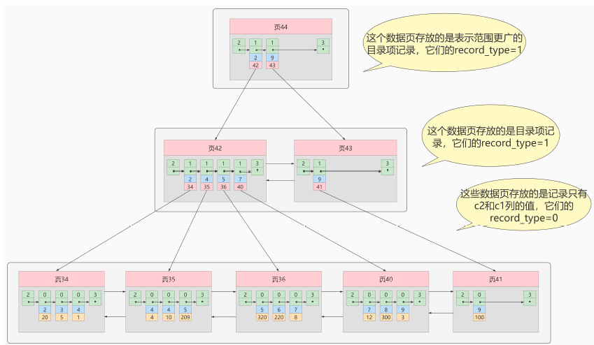

**概念：回表** 我们根据这个以c2列大小排序的B+树只能确定我们要`查找记录的主键值`，所以如果我们想根据c2列的值查找到完整的用户记录的话，仍然需要到 `聚簇索引` 中再查一遍，这个过程称为 `回表` 。也就是根据c2列的值查询一条完整的用户记录需要使用到 `2 棵B+树`！


**问题：**为什么我们还需要一次 回表 操作呢？直接把完整的用户记录放到叶子节点不OK吗？

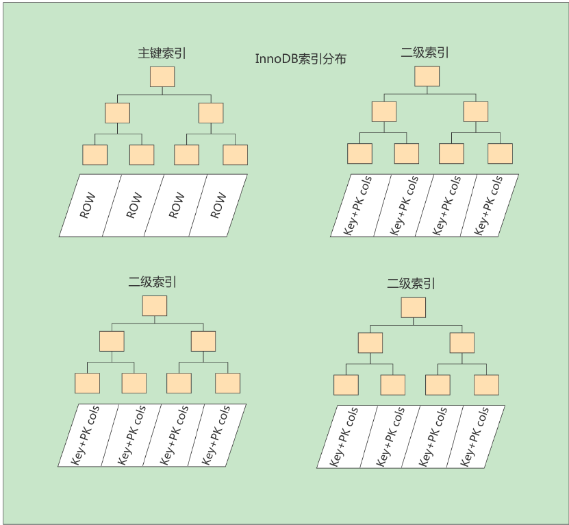


小结：聚簇索引与非聚簇索引的原理不同，在使用上也有一些区别：

1. 聚簇索引的`叶子节点`存储的就是我们的`数据记录`，非聚簇索引的叶子节点存储的是`数据位置`。非聚簇索引不会影响数据表的物理存储顺序。
2. 一个表`只能有一个聚簇索引`，因为只能有一种排序存储的方式，但可以有`多个非聚旗索引`，也就是多个索引目录提供数据检索。
3. 使用聚簇索引的时候，数据的`查询效率高`，但如果对数据进行插入，删除，更新等操作，效率会比非聚簇索引低。

#### 3. 联合索引

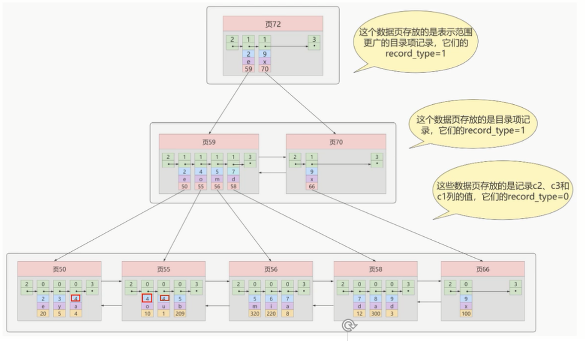


#### 4. InnoDB**的**B+**树索引的注意事项**

+ 根页面位置万年不动


+ 内节点中目录项记录的唯一性

+ 一个页面最少存储**2**条记录


## 4. MyISAM**中的索引方案**


B树索引适用存储引擎如表所示：

| 索引 **/** 存储引擎 | MyISAM | InnoDB | Memory |
| ------------------- | ------ | ------ | ------ |
| B-Tree索引          | 支持   | 支持   | 支持   |


即使多个存储引擎支持同一种类型的索引，但是他们的实现原理也是不同的。`Innodb和MyISAM默认的索引是Btree索引`；而`Memory默认的索引是Hash索引`。


MyISAM引擎数据和索引是分开存放的，具体行数据在存储中顺序存放；索引使用 `B+Tree` 作为索引结构，叶子节点的data域存放的是 `数据记录的地址【指向行数据的内存地址指针】` 。


### 4.1 MyISAM**索引的原理**

下图是MyISAM索引的原理图。


如果我们在Col2上建立一个二级索引，则此索引的结构如下图所示：


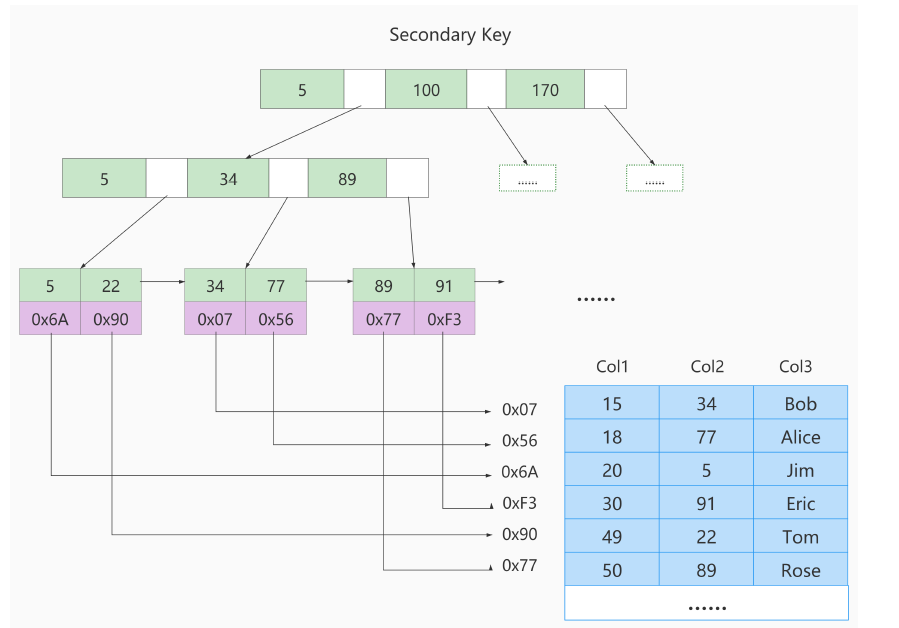

### 4.3 MyISAM 与 InnoDB对比

MyISAM**的索引方式都是**“**非聚簇**”**的，与**InnoDB**包含**1**个聚簇索引是不同的。小结两种引擎中索引的区别：**


① 在InnoDB存储引擎中，我们只需要根据主键值对 `聚簇索引` 进行一次查找就能找到对应的记录，而`在MyISAM 中却需要进行一次 回表 操作`，意味着MyISAM中建立的索引相当于`全部都是 二级索引` 。


② InnoDB的数据文件本身就是索引文件，而`MyISAM索引文件和数据文件是 分离的` ，`索引文件仅保存数据记录的地址`。


③ InnoDB的非聚簇索引data域存储相应记录 `主键的值` ，而MyISAM索引记录的是 `地址` 。换句话说，InnoDB的所有非聚簇索引都引用主键作为data域。


④ `MyISAM的回表操作是十分 快速 的`，因为是`拿着地址偏移量`直接到文件中取数据的，反观InnoDB是通过获取主键之后再去聚簇索引里找记录，虽然说也不慢，但还是`比不上直接用地址去访问`。


⑤ InnoDB要求表 `必须有主键 （ MyISAM可以没有 ）`。如果没有显式指定，则MySQL系统会自动选择一个可以非空且唯一标识数据记录的列作为主键。如果不存在这种列，则MySQL自动为InnoDB表生成一个隐含字段作为主键，这个字段长度为6个字节，类型为长整型。

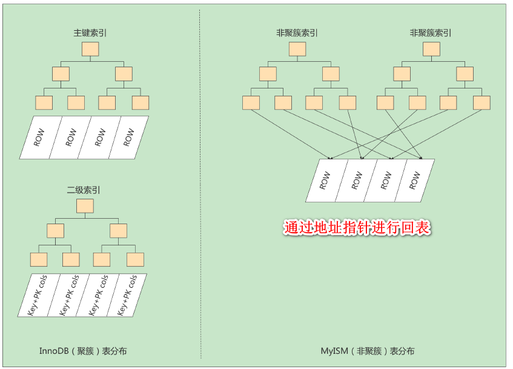


**小结：**
了解不同存储引擎的索引实现方式对于正确使用和优化索引都非常有帮助。比如：

+ 举例1：知道了InnoDB的索引实现后，就很容易明白`为什么不建议使用过长的字段作为主键`，因为所有二级索引都引用主键索引，过长的主键索引会令二级索引变得过大。
+ 举例2：用非单调的字段作为主键在InnoDB中不是个好主意，因为InnoDB数据文件本身是一棵B+Tree，非单调的主键会造成在插入新记录时，数据文件为了维持B+Tree的特性而频繁的分裂调整，十分低效，而`使用自增字段作为主键则是一个很好的选择`

## 5. 索引的代价


索引是个好东西，可不能乱建，它在空间和时间上都会有消耗：


+ 空间上的代价

  每建立一个索引都要为它建立一棵B+树，每一棵B+树的每一个节点都是一个数据页，一个页默认会占用 `16KB` 的存储空间，一棵很大的B+树由许多数据页组成，那就是很大的一片存储空间。


+ 时间上的代价

  每次对表中的数据进行 `增、删、改` 操作时，都需要去修改各个B+树索引。而且我们讲过，B+树每层节点都是按照索引列的值 `从小到大的顺序排序` 而组成了 `双向链表` 。不论是叶子节点中的记录，还是内节点中的记录（也就是不论是用户记录还是目录项记录）都是按照索引列的值从小到大的顺序而形成了一个单向链表。而增、删、改操作可能会对节点和记录的排序造成破坏，所以`存储引擎需要额外`的时间进行一些 `记录移位` ， `页面分裂` 、 `页面回收` 等操作来维护好节点和记录的排序。如果我们建了许多索引，每个索引对应的B+树都要进行相关的维护操作，会给性能拖后腿。


## 6. MySQL数据结构选择的合理性

从MySQL的角度讲，不得不考虑一个现实问题就是磁盘IO。如果我们能让索引的数据结构尽量减少硬盘的I/O操作，所消耗的时间也就越小。可以说，`磁盘的I/O操作次数对索引的使用效率至关重要`。

查找都是索引操作，一般来说索引非常大，尤其是关系型数据库，当数据量比较大的时候，索引的大小有可能几个G甚至更多，为了减少索引在内存的占用，`数据库索引是存储在外部磁盘上的`。当我们利用索引查询的时候，不可能把整个索引全部加载到内存，只能逐一加载，那么MysQL衡量查询效率的标准就是磁盘IO次数。

### 6.1 全表遍历 

这里都懒得说了。

### 6.2 Hash结构


Hash本身是一个函数，又被称为散列函数，它可以帮助我们大幅提升检索数据的效率。

Hash算法是通过某种确定性的算法（比如MD5，SHA1，SHA2、SHA3）将输入转变为输出。`相同的输入永远可以得到相同的输出`，假设输入内容有微小偏差，在输出中通常会有不同的结果。


举例：如果你想要验证两个文件是否相同，那么你不需要把两份文件直接拿来比对，只需要让对方把Hash函数计算得到的结果告诉你即可町，然后在本地同样对文件进行Hash函数的运算，最后通过比较这两个Hash函数的结果是否相同，就可以知道这两个文件是否相同。


**加速查找速度的数据结构，常见的有两类：**

（1）树，例如平衡二叉搜索树，查询插入修改删除的平均时间复杂度都是`O(log2N)`；
（2）哈希，例如HashMap，查询/插入/修改/删除的平均时间复杂度都是`O(1)`；

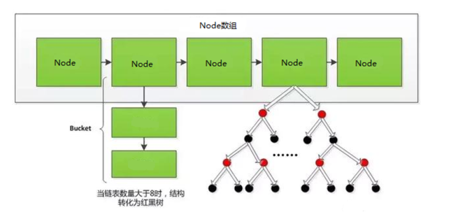


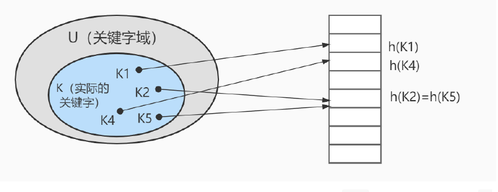

上图中哈希函数h有可能将两个不同的关键字映射到相同的位置，这叫做 `碰撞` ，在数据库中一般采用 `链接法` 来解决。在链接法中，将散列到同一槽位的元素放在一个链表中，如下图所示：

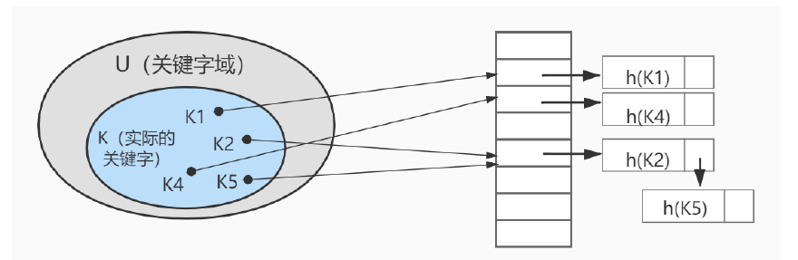


实验：体会数组和hash表的查找方面的效率区别


```java
// 算法复杂度为 O(n) 
@Test
public void test1(){

	int[] arr = new int[100000]; 
    for(int i = 0;i < arr.length;i++){
        arr[i] = i + 1;	
	}

	long start = System.currentTimeMillis(); 
    for(int j = 1; j<=100000;j++){
		int temp = j;
        for(int i = 0;i < arr.length;i++){
            if(temp == arr[i]){
       	 		break;
        	}
		}
	}

	long end = System.currentTimeMillis(); 
    System.out.println("time： " + (end - start)); //time： 823

}
```

```java
//算法复杂度为 O(1) 
@Test
public void test2(){

	HashSet<Integer> set = new HashSet<>(100000); 
    for(int i = 0;i < 100000;i++){
		set.add(i + 1);
	}

	long start = System.currentTimeMillis(); 
    for(int j = 1; j<=100000;j++) {
		int temp = j;
		boolean contains = set.contains(temp);
	}

	long end = System.currentTimeMillis(); 
    System.out.println("time： " + (end - start)); //time： 5
}
```

Hash**结构效率高，那为什么索引结构要设计成树型呢？**

原因1：Hash索引仅能满足（=）（<>）和IN查询。如果进行`范围查询`，哈希型的索引，时间复杂度会退化为O（n）；而树型的“有序”特性，依然能够保持0（log2N）的高效率。

原因2：Hash索引还有一个缺陷，数据的存储是`没有顺序的`，在`ORDER BY`的情况下，使用Hash索引还需要对数据重新排序。

原因3：`对于联合索引`的情况，Hash值是将联合索引键合并后一起来计算的，`无法对单独的一个键或者几个索引键进行查询。`

原因4：对于等值查询来说，通常Hash索引的效率更高，不过也存在一种情况，就是`索引列的重复值如果很多，效率就会降低`。这是因为遇到Hash冲突时，需要遍历桶中的行指针来进行比较，找到查询的关键字，非常耗时。所以，Hash索引通常不会用到重复值多的列上，比如列为性别、年龄的情况等。


**Hash索引适用存储引擎如表所示：**

| 索引 **/** 存储引擎 | MyISAM | InnoDB | Memory |
| ------------------- | ------ | ------ | ------ |
| HASH索引            | 不支持 | 不支持 | 支持   |


Hash**索引的适用性：**


Hash索引存在着很多限制，相比之下在数据库中B+树索引的使用面会更广，不过也有一些场景采用Hash索引效率更高，比如在键值型（Key-Value）数据库中，`Redis存储的核心就是Hash表`。

MySQL中的Memory存储引擎支持Hash存储，如果我们需要用到查询的临时表时，就可以选择Memory存储引擎，把某个字段设置为Hash索引，比如字符串类型的字段，进行Hash计算之后长度可以缩短到几个字节。当字段的重复度低，而且经常需要进行`等值查询`的时候，采用Hash索引是个不错的选择。


另外，`InnoDB本身不支持Hash索引，但是提供自适应Hash索引（Adaptive Hash Index）`。什么情况下才会使用自适应Hash索引呢？如果某个数据经常被访问，当满足一定条件的时候，就会将这个数据页的地址存放到Hash表中。这样下次查询的时候，就可以直接找到这个页面的所在位置。这样让B+树也具备了Hash索引的优点。

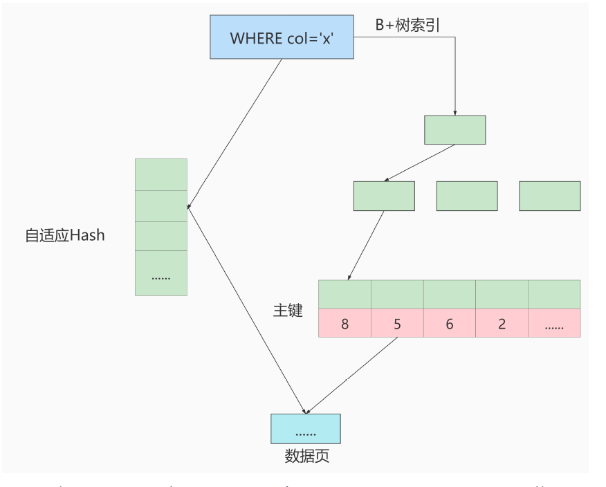

采用自适应 Hash 索引目的是方便根据 SQL 的查询条件加速定位到叶子节点，特别是当 B+ 树比较深的时候，通过自适应 Hash 索引可以明显提高数据的检索效率。


我们可以通过 `innodb_adaptive_hash_index` 变量来查看是否开启了自适应 Hash，比如：

```mysql
mysql> show variables like '%adaptive_hash_index';
```

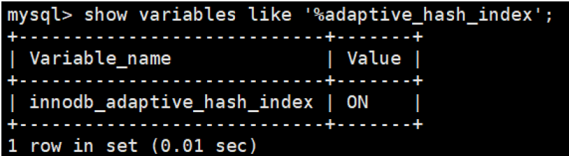

### 6.3 二叉搜索树

如果我们利用二叉树作为索引结构，那么磁盘的IO次数和索引树的高度是相关的。

1. 二叉搜索树的特点
2. 查找规则

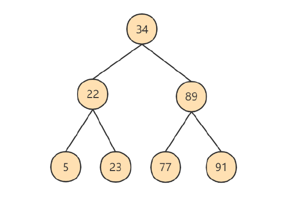


创造出来的二分搜索树如下图所示：[计算情况下回退化成链表结构]


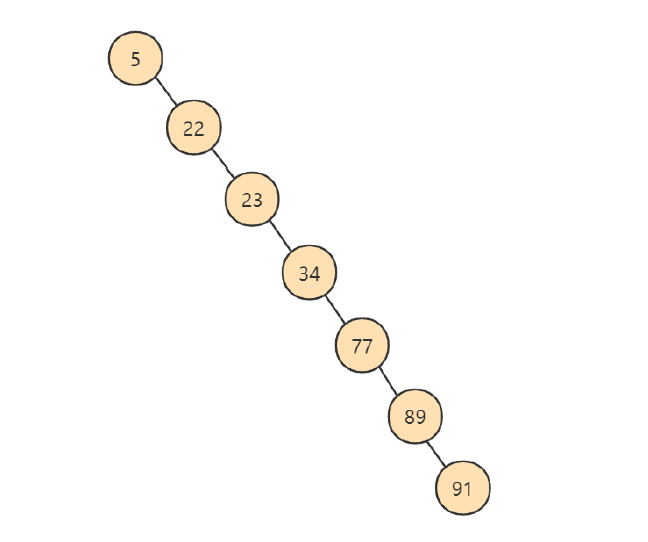


为了提高查询效率，就需要 `减少磁盘IO数` 。为了减少磁盘IO的次数，就需要尽量 `降低树的高度` ，需要把原来“瘦高”的树结构变的“矮胖”，树的每层的分叉越多越好。

### 6.4 AVL树

为了解决上面二叉查找树退化成链表的问题，人们提出了`平衡二叉搜索树（Balanced Binary Tree）`，又称为`AVL树`（有别于AVL算法），它在二叉搜索树的基础上增加了约束，具有以下性质：

**它是一棵空树或它的左右两个子树的高度差的绝对值不超过1，并且左右两个子树都是一棵平衡二叉树。**

这里说一下，常见的平衡二叉树有很多种，包括了`平衡二叉搜索树`、`红黑树`、`数堆`、`伸展树`。平衡二叉搜索树是最早提出来的自平衡二叉搜索树，当我们提到平衡二叉树时一般指的就是平衡二叉搜索树。事实上，第一棵树就属于平衡二叉搜索树，搜索时间复杂度就是`O(log2n)`

数据查询的时间主要依赖于磁盘1/0的次数，如果我们采用二叉树的形式，即使通过平衡二叉搜索树进行了改进，树的深度也是O(log2n)，当n比较大时，深度也是比较高的，比如下图的情况：


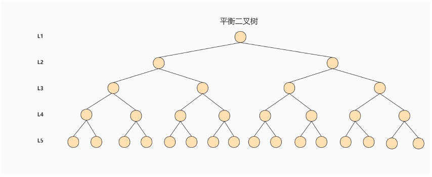

`每访问一次节点就需要进行一次磁盘I/O操作，`对于上面的树来说，我们需要进行5次I/O操作。虽然平衡二叉树的效率高，但是树的深度也同样高，这就意味着磁盘I/O操作次数多，会影响整体数据查询的效率。


针对同样的数据，如果我们把二叉树改成 `M 叉树` （M>2）呢？当 M=3 时，同样的 31 个节点可以由下面的三叉树来进行存储：

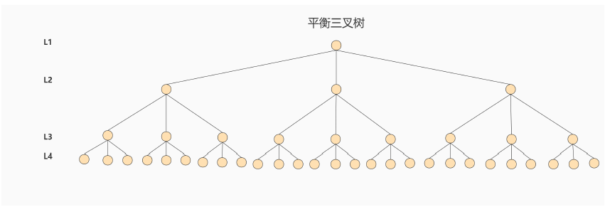


### 6.5 B-Tree

B树的英文是Balance Tree，也就是`多路平衡查找树`。简写为B-Tree（注意横杠表示这两个单词连起来的意思，不是减号）。它的高度远小于平衡二叉树的高度。

B 树的结构如下图所示：

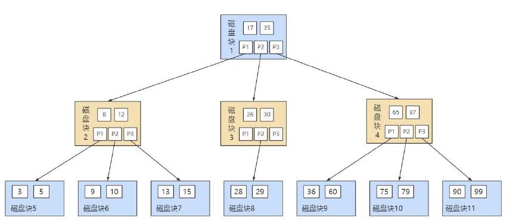

一个 M 阶的 B 树（M>2）有以下的特性：

1. 根节点的儿子数的范围是[2,M]。

2. 每个中间节点包含k-1 个关键字和k 个孩子，孩子的数量= 关键字的数量+1，k 的取值范围为

   [ceil(M/2), M]。

3. 叶子节点包括k-1 个关键字（叶子节点没有孩子），k 的取值范围为[ceil(M/2), M]。

4. 假设中间节点节点的关键字为：Key[1], Key[2], …, Key[k-1]，且关键字按照升序排序，即Key[i]

   <Key[i+1]。此时k-1 个关键字相当于划分了k 个范围，也就是对应着k 个指针，即为：P[1], P[2], …,

   P[k]，其中P[1] 指向关键字小于Key[1] 的子树，P[i] 指向关键字属于(Key[i-1], Key[i]) 的子树，P[k]指向关键字大于Key[k-1] 的子树。

5. 所有叶子节点位于同一层。

上面那张图所表示的 B 树就是一棵 3 阶的 B 树。我们可以看下`磁盘块 2，里面的关键字为（8，12）`，它有 3 个孩子 (3，5)，(9，10) 和 (13，15)，你能看到 `(3，5) 小于 8`，`(9，10) 在 8 和 12 之间`，而 `(13，15)大于 12，`刚好符合刚才我们给出的特征。


然后我们来看下如何用 B 树进行查找。假设我们想要 查找的关键字是 9 ，那么步骤可以分为以下几步：

1. 我们与根节点的关键字(17，35）进行比较，9 小于 17 那么得到指针P1；
2. 按照指针P1 找到磁盘块 2，关键字为（8，12），因为 9 在 8 和 12 之间，所以我们得到指针P2；
3. 按照指针P2 找到磁盘块 6，关键字为（9，10），然后我们找到了关键字 9。


你能看出来在 B 树的搜索过程中，我们比较的次数并不少，但如果把数据读取出来然后在内存中进行比较，这个时间就是可以忽略不计的。而读取磁盘块本身需要进行 I/O 操作，消耗的时间比在内存中进行比较所需要的时间要多，是数据查找用时的重要因素。 `B 树相比于平衡二叉树来说磁盘 I/O 操作要少` ，在数据查询中比平衡二叉树效率要高。所以 `只要树的高度足够低，IO次数足够少，就可以提高查询性能` 。

再举例**1**：

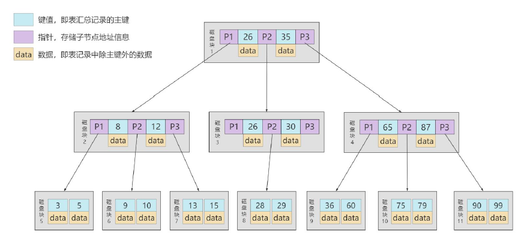

**小结：**

1. B树在插入和删除节点的时候如果导致树不平衡，就通过自动调整节点的位置来保持树的自平衡。
2. 关键字集合分布在整棵树中，即`叶子节点和非叶子节点都存放数据`。搜索有可能在非叶子节点结束
3. 其搜索性能等价于在关键字全集内做一次二分查找。


### 6.6 B+Tree

B+树也是一种多路搜索树，`基于B树做出了改进`，主流的DBMS都支持B+树的索引方式，比如MysQL，相比于B-Tree，`B+Tree适合文件索引系统`

MySQL官网说明：

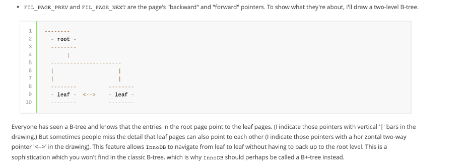

**B+ 树和 B 树的差异：**

1. 有k 个孩子的节点就有k 个关键字。也就是孩子数量= 关键字数，而B 树中，孩子数量= 关键字数+1。

2. 非叶子节点的关键字也会同时存在在子节点中，并且是在子节点中所有关键字的最大（或最小）。

3. `非叶子节点仅用于索引`，不保存数据记录，跟记录有关的信息都放在叶子节点中。而`B 树中， 非叶子节点既保存索引，也保存数据记录 。`

4. 所有关键字都在叶子节点出现，叶子节点构成一个有序链表，而且叶子节点本身按照关键字的大小从小到大顺序链接。

#### 思考题

> B 树和 B+ 树都可以作为索引的数据结构，在 MySQL 中采用的是 B+ 树。
>
> 但B树和B+树各有自己的应用场景，不能说B+树完全比B树好，反之亦然。


思考题：为了减少**IO**，索引树会一次性加载吗？

>1、数据库索引是存储在磁盘上的，如果`数据量很大，必然导致索引的大小也会很大，超过几个G`
>2、当我们利用索引查询时候，是不可能将全部几个G的索引都加载进内存的，我们能做的只能是：
>
>根据根目录页`逐一加载每一个磁盘页`，因为磁盘页对应着索引树的节点。

思考题：**B+**树的存储能力如何？为何说一般查找行记录，最多只需**1~3**次磁盘**IO**

>InnoDB存储引擎中页的`大小为16KB`，一般表的`主键类型`为INT（占用4个字节）或BIGINT（占用8个字节），指针类型也`一般为4或8个字节`，也就是说一个页（B+Tree中的一个节点）中大概存储16KB/（B+8B）=1K个键值（因为是估值，为方便计算，这里的K取值为10^3，也就是说一个深度为3的B+Tree索引可以维护`10^3*10^3*10^3=10`亿条记录。（这里假定一个数据页也存储10^3条行记录数据了）
>
>实际情况中每个节点可能不能填充满，因此在数据库中，`B+Tree的高度一般都在2-4层`。
>
>MySQL的`InnoDB存储引擎在设计时是将根节点常驻内存的`，也就是说`查找某一键值的行记录时最多只需要1-3次磁盘I/O操作`。

思考题：为什么说**B+**树比**B-**树更适合实际应用中操作系统的文件索引和数据库索引？

> 1、B+树的磁盘读写代价更低
> B+树的内部结点并没有指向关键字具体信息的指针。因此其内部结点相对B树更小。如果把所有同一内部结点的关键字存放在同一盘块中，那么`盘块所能容纳的关键字[索引节点]数量也越多`。`一次性读入内存中的需要查找的关键字也就越多。相对来说IO读写次数也就降低了。`
>
> 2、B+树的查询效率更加稳定
> 由于非终结点并不是最终指向文件内容的结点，而只是叶子结点中关键字的索引。所以任何关键字的查找必须走一条从根结点到叶子结点的路。所有关键字查询的路径长度相同，导致每一个数据的查询效率相当。

思考题：**Hash** 索引与 **B+** 树索引的区别

> 我们之前讲到过B+树索引的结构，Hash索引结构和B+树的不同，因此在索引使用上也会有差别。
>
> 1，Hash索引`不能进行范围查询`，而B+树可以。这是因为Hash索引指向的数据是无序的，而`B+树的叶子节点是个有序的链表`。
> 2，Hash索引`不支持联合索引的最左侧原则（`即联合索引的部分索引无法使用），而B+树可以。对于联合索引来说，Hash索引在计算Hash值的时候是将索引键合并后再一起计算Hash值，所以不会针对每个索引单独计算Hash值。因此如果用到联合索引的一个或者几个索引时，联合索引无法被利用。
>
> 3，Hash索引`不支持ORDER BY排序`，因为Hash索引指向的数据是无序的，因此无法起到排序优化的作用，而B+树索引数据是有序的，可以起到对该字段ORDER BV排序优化的作用。同理，我们也`无法用Hash索引进行模糊查询`，而B+树使用LIKE进行模糊查询的时候，LIKE后面后模糊查询（比如%结尾）的话就可以起到优化作用。
> 4、`InnoDB不支持哈希索引`


思考题：**Hash** 索引与 **B+** 树索引是在建索引的时候手动指定的吗？

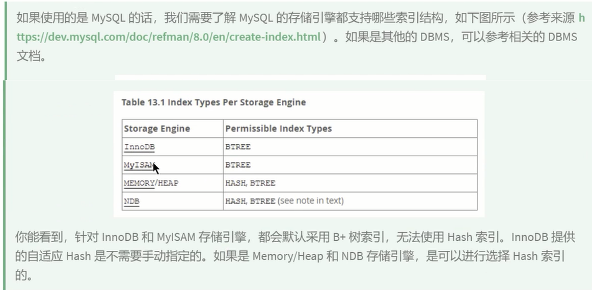


### 6.7 R树


R-Tree在MySQL很少使用，仅支持 `geometry`数据类型 ，支持该类型的存储引擎只有myisam、bdb、innodb、ndb、archive几种。举个R树在现实领域中能够解决的例子：查找20英里以内所有的餐厅。如果没有R树你会怎么解决？一般情况下我们会把餐厅的坐标(x,y)分为两个字段存放在数据库中，一个字段记录经度，另一个字段记录纬度。这样的话我们就需要遍历所有的餐厅获取其位置信息，然后计算是否满足要求。如果一个地区有100家餐厅的话，我们就要进行100次位置计算操作了，如果应用到谷歌、百度地图这种超大数据库中，这种方法便必定不可行了。R树就很好的 解决了`这种高维空间搜索问题` 。它把B树的思想很好的扩展到了多维空间，采用了B树分割空间的思想，并在添加、删除操作时采用合并、分解结点的方法，保证树的平衡性。因此，R树就是一棵用来 `存储高维数据的平衡树` 。相对于B-Tree，R-Tree 的优势在于范围查找。

| 索引 **/** 存储引擎 | MyISAM | InnoDB | Memory |
| ------------------- | ------ | ------ | ------ |
| R-Tree索引          | 支持   | 支持   | 不支持 |


### 6.8小结

使用索引可以帮助我们从海量的数据中快速定位想要查找的数据，不过索引也存在一些不足，比如占用存储空间、降低数据库写操作的性能等，如果有多个索引还会增加索引选择的时间。当我们使用索引时，需要平衡索引的利（提升查询效率）和弊（维护索引所需的代价）。
在实际工作中，我们还需要基于需求和数据本身的分布情况来确定是否使用紊引，尽管索引不是万能的，但数据量大的时候不使用索引是不可想象的，毕竟索引的本质，是帮助我们提升数据检索的效率。


### 附录：算法的时间复杂度

同一问题可用不同算法解决，而一个算法的质量优劣将影响到算法乃至程序的效率。算法分析的目的在于选择合适算法和改进算法。

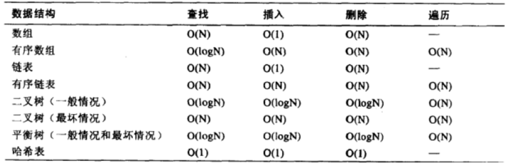

