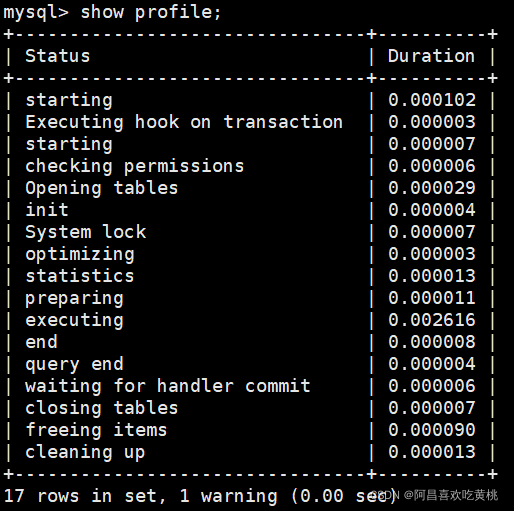
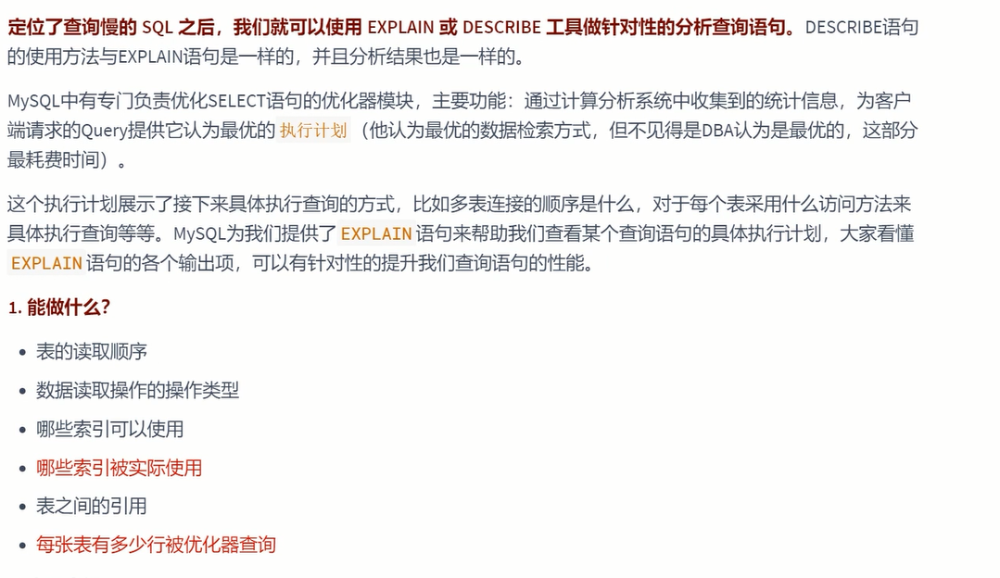
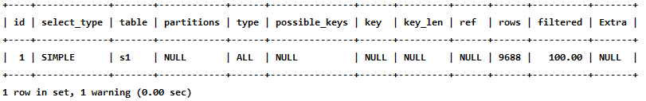
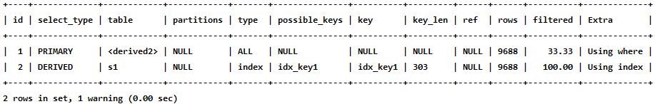

在数据库调优中，我们的目标就是`响应时间更快`，`吞吐量更大`。利用宏观的监控工具和微观的日志分析可以帮我1快速找到调优的思路和方式。

一、数据库服务器的优化步骤
-------------

当我们遇到数据库调优问题的时候，该如何思考呢？ 
这里把思考的流程整理成下面这张图。  


整个流程划分成了 `观察（Show status）` 和 `行动`（Action） 两个部分。 

字母 S 的部分代表观察（会使用相应的分析工具），字母 A 代表的部分是行动（对应分析可以采取的行动）。  


**小结**：  


二、查看系统性能参数
----------

在 MySQL 中，可以使用 `SHOW STATUS` 语句查询一些 MySQL 数据库服务器的 `性能参数` 、 `执行频率` 。

SHOW STATUS 语句语法如下：

```mysql
SHOW [GLOBAL|SESSION] STATUS LIKE '参数';
```

**一些常用的性能参数如下**：

> • Connections：连接 MySQL 服务器的次数。  
>
> • Uptime：MySQL 服务器的上线时间。 
>
> 
>
> **• Slow_queries：慢查询的次数。**  
>
> • Innodb_rows_read：Select 查询返回的行数  
>
> • Innodb_rows_inserted：执行 INSERT 操作插入的行数  
>
> • Innodb_rows_updated：执行 UPDATE 操作更新的行数  
>
> • Innodb_rows_deleted：执行 DELETE 操作删除的行数  
>
> 
>
> • Com_select：查询操作的次数。  
>
> • Com_insert：插入操作的次数。对于批量插入的 INSERT 操作，只累加一次。  
>
> • Com_update：更新操作的次数。  
>
> • Com_delete：删除操作的次数。

三、统计 SQL 的查询成本`last_query_cost`[加载数据页数]
------------------------------


**student_info 表**：

```mysql
CREATE TABLE `student_info` (
	`id` INT(11) NOT NULL AUTO_INCREMENT,
	`student_id` INT NOT NULL ,
	`name` VARCHAR(20) DEFAULT NULL,
	`course_id` INT NOT NULL ,
	`class_id` INT(11) DEFAULT NULL,
	`create_time` DATETIME DEFAULT CURRENT_TIMESTAMP ON UPDATE CURRENT_TIMESTAMP,
	PRIMARY KEY (`id`)
) ENGINE=INNODB AUTO_INCREMENT=1 DEFAULT CHARSET=utf8;
```

如果我们想要查询 id=900001 的记录，然后看下查询成本，我们可以直接在聚簇索引上进行查找：

```mysql
SELECT student_id, class_id, NAME, create_time FROM student_info
WHERE id = 900001;
```

运行结果（1 条记录，运行时间为 `0.042s` ）

然后再看下`查询上次执行sql的优化器的成本`，实际上我们只需要检索一个页即可：

```mysql
mysql> SHOW STATUS LIKE 'last_query_cost';  -- 1表示需要加载一个数据页
+-----------------+----------+
| Variable_name  | Value  |
+-----------------+----------+
| Last_query_cost | 1.000000 |
+-----------------+----------+
```

如果我们想要查询 id 在 900001 到 9000100 之间的学生记录呢？

```mysql
SELECT student_id, class_id, NAME, create_time FROM student_info
WHERE id BETWEEN 900001 AND 900100;
```

运行结果（100 条记录，运行时间为 `0.046s` ）：  
然后再看下`查询上次执行sql的优化器的成本`，这时我们大概需要进行 `20 个页`的查询。

```mysql
mysql> SHOW STATUS LIKE 'last_query_cost';
+-----------------+-----------+
| Variable_name  | Value   |
+-----------------+-----------+
| Last_query_cost | 21.134453 |
+-----------------+-----------+
```

你能看到页的数量是刚才的 20 倍，但是查询的效率并没有明显的变化，实际上这两个 SQL 查询的时间基本上一样，就是因为采用了`顺序读取的方式`将页面一次性加载到缓冲池中，然后再进行查找。  

虽然 `页数量（last_query_cost）增加了不少` ，但是通过缓冲池的机制，并 `没有增加多少查询时间` 。  


**使用场景**：它对于比较开销是非常有用的，特别是我们有好几种查询方式可选的时候。


四、定位执行慢的 SQL：慢查询日志
------------------


### 1、开启慢查询日志参数

#### ①开启 slow_query_log

```mysql
show VARIABLES like '%slow_query_log%'; -- 查看当前值

set global slow_query_log='ON';
```

然后我们再来查看下慢查询日志`是否开启`，以及`慢查询日志文件的位置`：

  
你能看到这时慢查询分析已经开启，同时文件保存在 `/var/lib/mysql/atguigu02-slow.log`文件中。

#### ②修改 long_query_time 阈值

接下来我们来看下慢查询的`时间阈值设置`(_就是超过多少的执行时间算是慢查询_)，使用如下命令：

```mysql
show variables like '%long_query_time%';
```


这里如果我们想把时间缩短，比如设置为 `1` 秒，可以这样设置：

```mysql
#测试发现：设置global的方式对当前session的long_query_time失效。对新连接的客户端有效。所以可以一并执行下述语句
mysql> set global long_query_time = 1;
mysql> show global variables like '%long_query_time%';
mysql> set  long_query_time=1; -- 默认session
mysql> show variables like '%long_query_time%';
```


```properties
[mysqld]
slow-query_log=ON #开启慢查询日志的开关
slow_query_log_file=/var/1ib/mysql/atguigu-slow.1og #慢查询日志的目录和文件名信息
long_query_time=3 #设置慢查询的阅值为3秒，超出此设定值的SQL即被记录到慢查询日志
1og_output=FILE
```

### 2、查看慢查询数目

查询当前系统中有多少条慢查询记录

```mysql
SHOW GLOBAL STATUS LIKE '%Slow_queries%';
```

### 3、案例演示

**步骤 1. 建表**:

```mysql
CREATE TABLE `student` (
	`id` INT(11) NOT NULL AUTO_INCREMENT,
	`stuno` INT NOT NULL ,
	`name` VARCHAR(20) DEFAULT NULL,
	`age` INT(3) DEFAULT NULL,
	`classId` INT(11) DEFAULT NULL,
	PRIMARY KEY (`id`)
) ENGINE=INNODB AUTO_INCREMENT=1 DEFAULT CHARSET=utf8;
```

**步骤 2：设置参数 log_bin_trust_function_creators**

创建函数，假如报错

```mysql
This function has none of DETERMINISTIC......
```

*   命令开启：允许创建函数设置：

```mysql
set global log_bin_trust_function_creators=1;   # 不加global只是当前窗口有效。
```

**步骤 3：创建函数**  
随机产生字符串：

```mysql
DELIMITER //
CREATE FUNCTION rand_string(n INT)
    RETURNS VARCHAR(255) #该函数会返回一个字符串
BEGIN
    DECLARE chars_str VARCHAR(100) DEFAULT
        'abcdefghijklmnopqrstuvwxyzABCDEFJHIJKLMNOPQRSTUVWXYZ';
    DECLARE return_str VARCHAR(255) DEFAULT '';
    DECLARE i INT DEFAULT 0;
    WHILE i < n DO
            SET return_str =CONCAT(return_str,SUBSTRING(chars_str,FLOOR(1+RAND()*52),1));
            SET i = i + 1;
        END WHILE;
    RETURN return_str;
END //
DELIMITER ;
#测试
SELECT rand_string(10);
```

产生随机数值：

```mysql
DELIMITER //
CREATE FUNCTION rand_num (from_num INT ,to_num INT) RETURNS INT(11)
BEGIN
    DECLARE i INT DEFAULT 0;
    SET i = FLOOR(from_num +RAND()*(to_num - from_num+1))  ;
    RETURN i;
END //
DELIMITER ;
#测试：
SELECT rand_num(10,100);
```

**步骤 4：创建存储过程**

```mysql
DELIMITER //
CREATE PROCEDURE insert_stu1(  START INT , max_num INT )
BEGIN
    DECLARE i INT DEFAULT 0;
    SET autocommit = 0;   #设置手动提交事务
    REPEAT  #循环
    SET i = i + 1;  #赋值
    INSERT INTO student (stuno, NAME ,age ,classId ) VALUES
        ((START+i),rand_string(6),rand_num(10,100),rand_num(10,1000));
    UNTIL i = max_num
        END REPEAT;
    COMMIT;  #提交事务
END //
DELIMITER ;
```

**步骤 5：调用存储过程**

```mysql
#调用刚刚写好的函数, 4000000条记录,从100001号开始
CALL insert_stu1(100001,4000000);
```

### 4、测试及分析

#### ①测试

```mysql
mysql> SELECT * FROM student WHERE stuno = 3455655;
+---------+---------+--------+------+---------+
| id   | stuno  | name  | age | classId |
+---------+---------+--------+------+---------+
| 3523633 | 3455655 | oQmLUr |  19 |    39 |
+---------+---------+--------+------+---------+
1 row in set (2.09 sec)

mysql> SELECT * FROM student WHERE name = 'oQmLUr';
+---------+---------+--------+------+---------+
| id   | stuno  | name  | age | classId |
+---------+---------+--------+------+---------+
| 1154002 | 1243200 | OQMlUR |  266 |    28 |
| 1405708 | 1437740 | OQMlUR |  245 |   439 |
| 1748070 | 1680092 | OQMlUR |  240 |   414 |
| 2119892 | 2051914 | oQmLUr |  17 |    32 |
| 2893154 | 2825176 | OQMlUR |  245 |   435 |
| 3523633 | 3455655 | oQmLUr |  19 |    39 |
+---------+---------+--------+------+---------+
6 rows in set (2.39 sec)
```

从上面的结果可以看出来，查询学生编号为 “3455655” 的学生信息花费时间为 2.09 秒。查询学生姓名为 “oQmLUr” 的学生信息花费时间为 2.39 秒。  

已经达到了秒的数量级，说明目前查询效率是比较低的，下面的小节我们分析一下原因。

#### ②分析

```mysql
show status like 'slow_queries';
```


### 5、慢查询日志分析工具：mysqldumpslow

在生产环境中，如果要手工分析日志，查找、分析 SQL，显然是个体力活，MySQL 提供了日志分析工具`mysqldumpslow`。  
_通过 mysqldumpslow 可以查看慢查询日志_

**查看 mysqldumpslow 的帮助信息**

```bash
[root@localhost ~]$ mysqldumpslow --help
Usage: mysqldumpslow [ OPTS... ] [ LOGS... ]

Parse and summarize the MySQL slow query log. Options are

  --verbose    verbose
  --debug      debug
  --help       write this text to standard output

  -v           verbose
  -d           debug
  -s ORDER     what to sort by (al, at, ar, c, l, r, t), 'at' is default
                al: average lock time
                ar: average rows sent
                at: average query time
                 c: count
                 l: lock time
                 r: rows sent
                 t: query time  
  -r           reverse the sort order (largest last instead of first)
  -t NUM       just show the top n queries
  -a           don't abstract all numbers to N and strings to 'S'
  -n NUM       abstract numbers with at least n digits within names
  -g PATTERN   grep: only consider stmts that include this string
  -h HOSTNAME  hostname of db server for *-slow.log filename (can be wildcard),
               default is '*', i.e. match all
  -i NAME      name of server instance (if using mysql.server startup script)
  -l           don't subtract lock time from total time

```


**mysqldumpslow 命令的具体参数如下**：

> *   -a: 不将数字抽象成 N，字符串抽象成 S
> *   `-s: 是表示按照何种方式排序`：  
>     c: 访问次数  
>     l: 锁定时间  
>     r: 返回记录  
>     `t: 查询时间`  
>     al: 平均锁定时间  
>     ar: 平均返回记录数  
>     at: 平均查询时间 （默认方式）  
>     ac: 平均查询次数
> *   `-t: 即为返回前面多少条的数据`；  
>     `-g: 后边搭配一个正则匹配模式，大小写不敏感的`；

举例：我们想要按照查询时间排序，查看前五条 SQL 语句，这样写即可：

```bash
mysqldumpslow -s t -t 5 /var/lib/mysql/atguigu01-slow.log
mysqldumpslow -a -s t -t 5 /var/lib/mysql/atguigu01-slow.log
```

```bash
[root@bogon ~]# mysqldumpslow -s t -t 5 /var/lib/mysql/atguigu01-slow.log

Reading mysql slow query log from /var/lib/mysql/atguigu01-slow.log
Count: 1  Time=2.39s (2s)  Lock=0.00s (0s) Rows=13.0 (13), root[root]@localhost
 SELECT * FROM student WHERE name = 'S'
 
Count: 1  Time=2.09s (2s)  Lock=0.00s (0s) Rows=2.0 (2), root[root]@localhost
 SELECT * FROM student WHERE stuno = N
 
Died at /usr/bin/mysqldumpslow line 162, <> chunk 2.
```

`工作常用参考`：

```bash
#得到返回记录集最多的10个SQL
mysqldumpslow -s r -t 10 /var/lib/mysql/atguigu-slow.log

#得到访问次数最多的10个SQL
mysqldumpslow -s c -t 10 /var/lib/mysql/atguigu-slow.log

#得到按照时间排序的前10条里面含有左连接的查询语句
mysqldumpslow -s t -t 10 -g "left join" /var/lib/mysql/atguigu-slow.log

#另外建议在使用这些命令时结合 | 和more 使用 ，否则有可能出现爆屏情况
mysqldumpslow -s r -t 10 /var/lib/mysql/atguigu-slow.log | more
```

### 6、关闭慢查询日志

**MySQL 服务器停止慢查询日志功能有两种方法**：

#### ①方式 1：永久性方式

```properties
#配置文件
[mysqld]
slow_query_log=OFF
```

或者，把 `slow_query_log` 一项注释掉 或 删除

```properties
[mysqld]
#slow_query_log =OFF
```

重启 MySQL 服务，执行如下语句查询慢日志功能。

```mysql
SHOW VARIABLES LIKE '%slow%';  #查询慢查询日志所在目录
SHOW VARIABLES LIKE '%long_query_time%';  #查询超时时长
```

#### ②方式 2：临时性方式

使用 SET 语句来设置。  
（1）停止 MySQL 慢查询日志功能，具体 SQL 语句如下。

```mysql
SET GLOBAL slow_query_log=off;
```

`（2）重启MySQL服务`，使用 SHOW 语句查询慢查询日志功能信息，具体 SQL 语句如下

```mysql
SHOW VARIABLES LIKE '%slow%';
#以及
SHOW VARIABLES LIKE '%long_query_time%';
```

### 7、删除慢查询日志


五、查看 SQL 执行成本：`SHOW PROFILE`
--------------------------

PROFILE 可查看上条 sql 的执行成本

查看是否开启配置

```mysql
show variables like 'profiling';
```

  
通过设置 `profiling='ON’` 来开启 show profile：

```mysql
mysql> set profiling = 'ON';
Query OK, 0 rows affected, 1 warning (0.00 sec)

mysql> show variables like 'profiling';
+---------------+-------+
| Variable_name | Value |
+---------------+-------+
| profiling     | ON    |
+---------------+-------+
1 row in set (0.01 sec)
```

  然后执行相关的查询语句。接着看下当前会话都有哪些 profiles，使用下面这条命令：

```mysql
show profiles;
```

  
你能看到当前会话一共有 2 个查询。如果我们想要查看`最近一次查询的开销`，可以使用：

```mysql
show profile;
```



```mysql
show profile cpu,block io for query 2;  -- 查询第二条记录的执行成本
```

  
**show profile 的常用查询参数**：

> ① ALL：显示所有的开销信息。  
>
> ② BLOCK IO：显示块 IO 开销。  
>
> ③ CONTEXT SWITCHES：上下文切换开销。  
>
> ④ CPU：显示 CPU 开销信息。  
>
> ⑤ IPC：显示发送和接收开销信息。  
>
> ⑥ MEMORY：显示内存开销信息。  
>
> ⑦ PAGE FAULTS：显示页面错误开销信息。  
>
> ⑧ SOURCE：显示和 Source_function，Source_file，Source_line 相关的开销信息。  
>
> ⑨ SWAPS：显示交换次数开销信息。


六、分析查询语句：`EXPLAIN`
----------------

### 1、概述



**官网介绍**：  
[5.7 版本](https://dev.mysql.com/doc/refman/5.7/en/explain-output.html)  
[8.0 版本](https://dev.mysql.com/doc/refman/8.0/en/explain-output.html)


**版本情况**：

*   MySQL 5.6.3 以前只能 `EXPLAIN SELECT`；MYSQL 5.6.3 以后就可以 `EXPLAIN SELECT，UPDATE，DELETE`
*   在 5.7 以前的版本中，想要显示 `partitions` 需要使用 `explain partitions` 命令；想要显示  `filtered` 需要使用 `explain extended` 命令。在 5.7 版本后，默认 explain 直接显示 partitions 和 filtered 中的信息。  
    

### 2、基本语法

`EXPLAIN` 或 `DESCRIBE` 语句的语法形式如下：

```mysql
EXPLAIN SELECT select_options
或者
DESCRIBE SELECT select_options
```

如果我们想看看某个查询的执行计划的话，可以在具体的查询语句前边加一个 `EXPLAIN`，就像这样：

```mysql
EXPLAIN SELECT 1;
```

`EXPLAIN` 语句输出的各个列的作用如下：


### 3、数据准备

**建表**:

```mysql
CREATE TABLE s1 (
	 id INT AUTO_INCREMENT,
	 key1 VARCHAR(100),
	 key2 INT,
	 key3 VARCHAR(100),
	 key_part1 VARCHAR(100),
	 key_part2 VARCHAR(100),
	 key_part3 VARCHAR(100),
	 common_field VARCHAR(100),
	  PRIMARY KEY (id),
	  INDEX idx_key1 (key1),
	  UNIQUE INDEX idx_key2 (key2),
	  INDEX idx_key3 (key3),
	  INDEX idx_key_part(key_part1, key_part2, key_part3)
) ENGINE=INNODB CHARSET=utf8;

CREATE TABLE s2 (
	 id INT AUTO_INCREMENT,
	 key1 VARCHAR(100),
	 key2 INT,
	 key3 VARCHAR(100),
	 key_part1 VARCHAR(100),
	 key_part2 VARCHAR(100),
	 key_part3 VARCHAR(100),
	 common_field VARCHAR(100),
	  PRIMARY KEY (id),
	  INDEX idx_key1 (key1),
	  UNIQUE INDEX idx_key2 (key2),
	  INDEX idx_key3 (key3),
	  INDEX idx_key_part(key_part1, key_part2, key_part3)
) ENGINE=INNODB CHARSET=utf8;
```

**设置参数 log_bin_trust_function_creators**:

创建函数，假如报错，需开启如下命令：允许创建函数设置：

```mysql
set global log_bin_trust_function_creators=1;   # 不加global只是当前窗口有效。
```

**创建函数**:

```mysql
DELIMITER //
CREATE FUNCTION rand_string1(n INT)
	RETURNS VARCHAR(255) #该函数会返回一个字符串
BEGIN
DECLARE chars_str VARCHAR(100) DEFAULT 'abcdefghijklmnopqrstuvwxyzABCDEFJHIJKLMNOPQRSTUVWXYZ';
	DECLARE return_str VARCHAR(255) DEFAULT '';
	DECLARE i INT DEFAULT 0;
	WHILE i < n DO
		SET return_str =CONCAT(return_str,SUBSTRING(chars_str,FLOOR(1+RAND()*52),1));
		SET i = i + 1;
	END WHILE;
	RETURN return_str;
END //
DELIMITER ;
```

**创建存储过程**:  
创建往`s1`表中插入数据的存储过程：

```mysql
DELIMITER //
CREATE PROCEDURE insert_s1 (IN min_num INT (10),IN max_num INT (10))
BEGIN
	DECLARE i INT DEFAULT 0;
	SET autocommit = 0;
	REPEAT
	SET i = i + 1;
	INSERT INTO s1 VALUES(
	 (min_num + i),
	 rand_string1(6),
	 (min_num + 30 * i + 5),
	 rand_string1(6),
	 rand_string1(10),
	 rand_string1(5),
	 rand_string1(10),
	 rand_string1(10));
	UNTIL i = max_num
	END REPEAT;
	COMMIT;
END //
DELIMITER ;
```

创建往`s2`表中插入数据的存储过程：

```mysql
DELIMITER //
CREATE PROCEDURE insert_s2 (IN min_num INT (10),IN max_num INT (10))
BEGIN
	DECLARE i INT DEFAULT 0;
	SET autocommit = 0;
	REPEAT
	SET i = i + 1;
	INSERT INTO s2 VALUES((min_num + i),
		rand_string1(6),
		(min_num + 30 * i + 5),
		rand_string1(6),
		rand_string1(10),
		rand_string1(5),
		rand_string1(10),
		rand_string1(10));
	UNTIL i = max_num
	END REPEAT;
	COMMIT;
END //
DELIMITER ;
```

**调用存储过程**：  
s1 表数据的添加：加入 1 万条记录：

```mysql
CALL insert_s1(10001,10000);
```

s2 表数据的添加：加入 1 万条记录：

```mysql
CALL insert_s2(10001,10000);
```

### 4、EXPLAIN 各列作用

#### ①table

不论我们的查询语句有多复杂，里边儿 `包含了多少个表` ，到最后也是需要对每个表进行 `单表访问` 的，所以 MySQL 规定`EXPLAIN语句输出的每条记录都对应着某个单表的访问方法`，该条记录的 table 列代表着该表的表名（有时不是真实的表名字，可能是简称）。

```mysql
#s1:驱动表  s2:被驱动表   执行计划表id在前的是驱动表
EXPLAIN SELECT * FROM s1 INNER JOIN s2;
```


#### ②id

在写的查询语句一般都以 `SELECT` 关键字开头，比较简单的查询语句里只有一个 SELECT 关键字，比如下边这个查询语句：

```mysql
SELECT * FROM s1 WHERE key1 = 'a';
```

稍微复杂一点的连接查询中也只有一个 SELECT 关键字，比如：

```mysql
SELECT * FROM s1 INNER JOIN s2
ON s1.key1 = s2.key1
WHERE s1.common_field = 'a';
```

**具体案例**

```mysql
mysql> EXPLAIN SELECT * FROM s1 WHERE key1 = 'a';
```


```mysql
mysql> EXPLAIN SELECT * FROM s1 INNER JOIN s2;  
```


```mysql
mysql> EXPLAIN SELECT * FROM s1 WHERE key1 IN (SELECT key1 FROM s2) OR key3 = 'a';
```


```mysql
 ######查询优化器可能对涉及子查询的查询语句进行重写,转变为多表查询的操作########
 EXPLAIN SELECT * FROM s1 WHERE key1 IN (SELECT key2 FROM s2 WHERE common_field = 'a');   -- 会将子查询转换成exist
 --  SELECT * FROM s1 WHERE EXISTS (SELECT key2 FROM s2 WHERE common_field = 'a' and key2 = s1.key1)
```


```mysql
 #Union去重
mysql> EXPLAIN SELECT * FROM s1 UNION SELECT * FROM s2; -- 去重导致  使用了临时表
```


```mysql
mysql> EXPLAIN SELECT * FROM s1  UNION ALL SELECT * FROM s2; -- 不去重 没有使用临时表
```

  

**小结**:

> *   **id 如果相同，可以认为是一组，从上往下顺序执行**
> *   **在所有组中，id 值越大，优先级越高，越先执行**
> *   **关注点：id 号每个号码，表示一趟独立的查询, 一个 sql 的查询趟数越少越好**

#### ③select_type


  


>- SIMPLE, 表示此查询不包含 UNION 查询或子查询
>- PRIMARY, 表示此查询是最外层的查询
>- UNION, 表示此查询是 UNION 的第二或随后的查询
>- DEPENDENT UNION, UNION 中的第二个或后面的查询语句, 取决于外面的查询
>- UNION RESULT, UNION 的结果
>- SUBQUERY, 子查询中的第一个 SELECT
>- DEPENDENT SUBQUERY: 子查询中的第一个 SELECT, 取决于外面的查询. 即子查询依赖于外层

**具体分析如下**：

+ **SIMPLE**

  查询语句中`不包含UNION或者子查询的查询都算作是SIMPLE类型`，比方说下边这个单表查询的select_type的值就是SIMPLE：

```mysql
mysql> EXPLAIN SELECT * FROM s1;
```

  
当然，连接查询也算是 `SIMPLE` 类型，比如：

```mysql
mysql> EXPLAIN SELECT * FROM s1 INNER JOIN s2;
```


* **PRIMARY**

  对于包含`UNION`或者`UNION ALL`或者子查询的大查询来说，它是由几个小查询组成的，其中最左边的那个查询的`select_type`值就是`PRIMARY`

```mysql
mysql> EXPLAIN SELECT * FROM s1 UNION SELECT * FROM s2;
```


* **UNION**

  对于包含`UNION`或者`UNION ALL`的大查询来说，它是由几个小查询组成的，其中除了最左边的那个小查询以外，其余的小查询的`select_type`值就是`UNION`

* **UNION RESULT**

  `MySQL`选择使用临时表来完成`UNION`查询的去重工作，针对该临时表的查询的`select_type`就是`UNION RESULT`

  ```mysql
   EXPLAIN SELECT * FROM s1 UNION SELECT * FROM s2;
  ```


*   **SUBQUERY**

子查询：
 如果包含子查询的查询语句不能够转为对应的`semi-join`的形式，并且该子查询是不相关子查询。
 该子查询的第一个`SELECT`关键字代表的那个查询的`select_type`就是`SUBQUERY`

```mysql
mysql> EXPLAIN SELECT * FROM s1 WHERE key1 IN (SELECT key1 FROM s2) OR key3 = 'a';
```


*   **DEPENDENT SUBQUERY**

 如果包含子查询的查询语句不能够转为对应的`semi-join`的形式，并且该子查询是相关子查询，
 则该子查询的第一个`SELECT`关键字代表的那个查询的`select_type`就是`DEPENDENT SUBQUERY`

> 注意的是，select_type为`DEPENDENT SUBQUERY`的查询可能会被执行多次。

```mysql
mysql> EXPLAIN SELECT * FROM s1 WHERE key1 IN (SELECT key1 FROM s2 WHERE s1.key2 = s2.key2) OR key3 = 'a';
```


*   **DEPENDENT UNION**

 在包含`UNION`或者`UNION ALL`的大查询中，如果各个小查询都依赖于外层查询的话，那除了 最左边的那个小查询之外，其余的小查询的`select_type`的值就是`DEPENDENT UNION`。

```mysql
mysql> EXPLAIN SELECT * FROM s1 WHERE key1 IN (SELECT key1 FROM s2 WHERE key1 = 'a' UNION SELECT key1 FROM s1 WHERE key1 = 'b');
```


*   **DERIVED**

对于包含`派生表`的查询，该派生表对应的子查询的`select_type`就是`DERIVED`

```mysql
mysql> EXPLAIN SELECT * FROM (SELECT key1, count(*) as c FROM s1 GROUP BY key1) AS derived_s1 where c > 1;

-- SELECT key1, count(*) as c FROM s1 GROUP BY key1作为临时结果集 ，即派生表
```



*   **MATERIALIZED**

当查询优化器在执行包含子查询的语句时，选择将子查询物化之后与外层查询进行连接查询时，
 该子查询对应的`select_type`属性就是`MATERIALIZED`

```mysql
mysql> EXPLAIN SELECT * FROM s1 WHERE key1 IN (SELECT key1 FROM s2);
/*
SELECT key1 FROM s2  转换成一个临时结果集
IN (SELECT key1 FROM s2);  转换为exits，转换成相关子查询

*/
```


*   **UNCACHEABLE SUBQUERY**
*   **UNCACHEABLE UNION**

#### ④partitions (可略)

如果想详细了解，可以如下方式测试。创建分区表：

```mysql
-- 创建分区表，
-- 按照id分区，id<100 p0分区，其他p1分区
CREATE TABLE user_partitions (id INT auto_increment,
	NAME VARCHAR(12),PRIMARY KEY(id))
  	PARTITION BY RANGE(id)(
    PARTITION p0 VALUES less than(100),
    PARTITION p1 VALUES less than MAXVALUE
 );
```


```mysql
DESC SELECT * FROM user_partitions WHERE id>200;
```

查询 id 大于 200（200>100，p1 分区）的记录，查看执行计划，partitions 是 p1，符合我们的分区规则  


#### ⑤type ☆

**针对单表的访问方法**


完整的访问方法如下： `system ， const ， eq_ref ， ref ， fulltext ， ref_or_null ，index_merge ， unique_subquery ， index_subquery ， range ， index ， ALL`。

* **system**

  当表中`只有一条记录`并且该表使用的存储引擎的统计数据是精确的，比如MyISAM、Memory， 那么对该表的访问方法就是`system`。

```mysql
mysql> CREATE TABLE t(i int) Engine=MyISAM;
Query OK, 0 rows affected (0.05 sec)
mysql> INSERT INTO t VALUES(1);
Query OK, 1 row affected (0.01 sec)
```

查询这个表的执行计划：

```mysql
mysql> EXPLAIN SELECT * FROM t;
```


*   **const**

当我们根据主键或者唯一二级索引列与常数进行等值匹配时，对单表的访问方法就是`const`

```mysql
mysql> EXPLAIN SELECT * FROM s1 WHERE id = 10005;
```


*   **eq_ref**

在连接查询时，如果被驱动表是通过主键或者唯一二级索引列`等值匹配`的方式进行访问的 （如果该主键或者唯一二级索引是联合索引的话，所有的索引列都必须进行等值比较），则 对该被驱动表的访问方法就是`eq_ref`

```mysql
mysql> EXPLAIN SELECT * FROM s1 INNER JOIN s2 ON s1.id = s2.id;
```

  
从执行计划的结果中可以看出，MySQL 打算将 s2 作为驱动表，s1 作为被驱动表，重点关注 s1 的访问方法是 `eq_ref` ，表明在访问 s1 表的时候可以 `通过主键的等值匹配`来进行访问。

*   **ref**

当通过普通的二级索引列与常量进行等值匹配时来查询某个表，那么对该表的访问方法就可能是`ref`

```mysql
mysql> EXPLAIN SELECT * FROM s1 WHERE key1 = 'a';
```


*   **fulltext**  
    全文索引
*   **ref_or_null**

当对普通二级索引进行等值匹配查询，该索引列的值也可以是`NULL`值时，那么对该表的访问方法就可能是`ref_or_null`

```mysql
mysql> EXPLAIN SELECT * FROM s1 WHERE key1 = 'a' OR key1 IS NULL;
```


*   **index_merge**

单表访问方法时在某些场景下可以使用`Intersection`、`Union`、`Sort-Union`这三种索引合并的方式来执行查询

```mysql
mysql> EXPLAIN SELECT * FROM s1 WHERE key1 = 'a' OR key3 = 'a';
```

  
从执行计划的 `type` 列的值是 `index_merge` 就可以看出，MySQL 打算使用索引合并的方式来执行对 `s1` 表的查询。

*   **unique_subquery**

`unique_subquery`是针对在一些包含`IN`子查询的查询语句中，如果查询优化器决定将`IN`子查询转换为`EXISTS`子查询，而且子查询可以使用到主键进行等值匹配的话，那么该子查询执行计划的`type`列的值就是`unique_subquery`

```mysql
mysql> EXPLAIN SELECT * FROM s1 WHERE key2 IN (SELECT id FROM s2 where s1.key1 = s2.key1) OR key3 = 'a';
```


*   **index_subquery**

用于in形式子查询使用到了辅助索引或者in常数列表，子查询可能返回重复值，可以使用索引将子查询去重

```mysql
mysql> EXPLAIN SELECT * FROM s1 WHERE common_field IN (SELECT key3 FROM s2 where s1.key1 = s2.key1) OR key3 = 'a';
```


*   **range**

如果使用索引获取某些`范围区间`的记录，那么就可能使用到`range`访问方法

```mysql
mysql> EXPLAIN SELECT * FROM s1 WHERE key1 IN ('a', 'b', 'c');
```

  

或者：

```mysql
mysql> EXPLAIN SELECT * FROM s1 WHERE key1 > 'a' AND key1 < 'b';
```


*   **index**

当我们可以使用索引覆盖，但需要扫描全部的索引记录时，该表的访问方法就是`index`[直接利用索引树的值作为结果，不需要回表]

```mysql
mysql> EXPLAIN SELECT key_part2 FROM s1 WHERE key_part3 = 'a';
```


*   **ALL**

全表扫描

```mysql
mysql> EXPLAIN SELECT * FROM s1;
```

  
**小结**：

> 结果值从最好到最坏依次是： `system > const > eq_ref > ref` > fulltext > ref_or_null > index_merge > unique_subquery > index_subquery > `range > index > ALL`其中比较重要的几个提取出来（见上图中的蓝色）。  
> SQL 性能优化的目标：至少要达到 range 级别，要求是 ref 级别，最好是 consts 级别。（`阿里巴巴开发手册要求`）

#### ⑥possible_keys 和 key


```mysql
mysql> EXPLAIN SELECT * FROM s1 WHERE key1 > 'z' AND key3 = 'a';
```


#### ⑦key_len ☆

key_len：实际使用到的索引长度(即：字节数)

```mysql
mysql> EXPLAIN SELECT * FROM s1 WHERE id = 10005;
```


```mysql
mysql> EXPLAIN SELECT * FROM s1 WHERE key2 = 10126;
```


```mysql
mysql> EXPLAIN SELECT * FROM s1 WHERE key1 = 'a';
```


```mysql
mysql> EXPLAIN SELECT * FROM s1 WHERE key_part1 = 'a';
```


```
mysql> EXPLAIN SELECT * FROM s1 WHERE key_part1 = 'a' AND key_part2 = 'b';
```


**练习**：  
_key_len 的长度计算公式_：

> *   varchar(10) 变长字段且允许 NULL = 10 * ( character set：utf8=3,gbk=2,latin1=1)+1(NULL)+2(变长字段)
> *   varchar(10) 变长字段且不允许 NULL = 10 * ( character set：utf8=3,gbk=2,latin1=1)+2(变长字段)
> *   char(10) 固定字段且允许 NULL = 10 * ( character set：utf8=3,gbk=2,latin1=1)+1(NULL)
> *   char(10) 固定字段且不允许 NULL = 10 * ( character set：utf8=3,gbk=2,latin1=1)

#### ⑧ref

 **ref：当使用索引列等值查询时，与索引列进行等值匹配的对象信息。**
 比如只是一个常数或者是某个列。

```mysql
mysql> EXPLAIN SELECT * FROM s1 WHERE key1 = 'a';
```


```mysql
mysql> EXPLAIN SELECT * FROM s1 INNER JOIN s2 ON s1.id = s2.id;
```


```mysql
mysql> EXPLAIN SELECT * FROM s1 INNER JOIN s2 ON s2.key1 = UPPER(s1.key1);
```


#### ⑨rows ☆

预估的需要读取的记录条数， `值越小越好`

```mysql
mysql> EXPLAIN SELECT * FROM s1 WHERE key1 > 'z';
```


#### ⑩filtered

`filtered: 某个表经过搜索条件过滤后剩余记录条数的百分比`

如果使用的是索引执行的单表扫描，那么计算时需要估计出满足除使用到对应索引的搜索条件外的其他搜索条件的记录有多少条。

```mysql
mysql> EXPLAIN SELECT * FROM s1 WHERE key1 > 'z' AND common_field = 'a';
```


对于单表查询来说，这个filtered列的值没什么意义，我们`更关注在连接查询中驱动表对应的执行计划记录的filtered值`，它决定了被驱动表要执行的次数(即：`rows * filtered`)

```mysql
mysql> EXPLAIN SELECT * FROM s1 INNER JOIN s2 ON s1.key1 = s2.key1 WHERE
s1.common_field = 'a';
-- 排在前面的是驱动表 S1
```


#### ⑪Extra ☆

Extra:一些额外的信息
 更准确的理解MySQL到底将如何执行给定的查询语句

+ **No tables used**

  当查询语句的没有`FROM`子句时将会提示该额外信息

```mysql
mysql> EXPLAIN SELECT 1;
```


* **Impossible WHERE**【不可能的】

  查询语句的`WHERE`子句永远为`FALSE`时将会提示该额外信息

```mysql
mysql> EXPLAIN SELECT * FROM s1 WHERE 1 != 1;
```


* **Using where**

  当我们使用全表扫描来执行对某个表的查询，并且该语句的`WHERE`子句中有针对该表的搜索条件时，在`Extra`列中会提示上述额外信息。

```mysql
mysql> EXPLAIN SELECT * FROM s1 WHERE common_field = 'a';
```


当使用索引访问来执行对某个表的查询，并且该语句的`WHERE`子句中有除了该索引包含的列之外的其他搜索条件时，在`Extra`列中也会提示上述额外信息。

```mysql
mysql> EXPLAIN SELECT * FROM s1 WHERE key1 = 'a' AND common_field = 'a';
```


* **No matching min/max row**

  当查询列表处有`MIN`或者`MAX`聚合函数，但是并没有符合`WHERE`子句中的搜索条件的记录时，将会提示该额外信息

```mysql
mysql> EXPLAIN SELECT MIN(key1) FROM s1 WHERE key1 = 'abcdefg';
-- s1中不存在key1 = 'abcdefg'的记录，也就不会存在min和max比较
```


* **Using index**

  当我们的查询列表以及搜索条件中只包含属于某个索引的列，也就是在可以使用覆盖索引的情况下，在`Extra`列将会提示该额外信息。比方说下边这个查询中只需要用到`idx_key1`而不需要回表操作：

  > 【覆盖索引】就是select的数据列只用从索引中就能够取得，不必从数据表中读取，换句话说查询列要被所使用的索引覆盖。

```mysql
mysql> EXPLAIN SELECT key1 FROM s1 WHERE key1 = 'a';
mysql> EXPLAIN SELECT key1,id FROM s1 WHERE key1 = 'a';
```


*   **Using index condition**

 有些搜索条件中虽然出现了索引列，但却不能使用到索引
 看课件理解索引条件下推

```mysql
SELECT * FROM s1 WHERE key1 > 'z' AND key1 LIKE '%a';
```

```mysql
mysql> EXPLAIN SELECT * FROM s1 WHERE key1 > 'z' AND key1 LIKE '%b';
```


*   **Using join buffer (Block Nested Loop)**

在连接查询执行过程中，当被驱动表不能有效的利用索引加快访问速度，MySQL一般会为其分配一块名叫`join buffer`的内存块来加快查询速度，也就是我们所讲的`基于块的嵌套循环算法`

```mysql
mysql> EXPLAIN SELECT * FROM s1 INNER JOIN s2 ON s1.common_field = s2.common_field;
```


*   **Not exists**

当我们使用左（外）连接时，如果`WHERE`子句中包含要求被驱动表的某个列等于`NULL`值的搜索条件，而且那个列又是不允许存储`NULL`值的，那么在该表的执行计划的Extra列就会提示`Not exists`额外信息

```mysql
mysql> EXPLAIN SELECT * FROM s1 LEFT JOIN s2 ON s1.key1 = s2.key1 WHERE s2.id IS NULL;
```


*   **Using intersect(…) 、 Using union(…) 和 Using sort_union(…)**

如果执行计划的`Extra`列出现了`Using intersect(...)`提示，说明准备使用`Intersect`索引合并的方式执行查询，括号中的`...`表示需要进行索引合并的索引名称；如果出现了`Using union(...)`提示，说明准备使用`Union`索引合并的方式执行查询；出现了`Using sort_union(...)`提示，说明准备使用`Sort-Union`索引合并的方式执行查询。

```mysql
mysql> EXPLAIN SELECT * FROM s1 WHERE key1 = 'a' OR key3 = 'a';
```


*   **Zero limit**

当我们的`LIMIT`子句的参数为`0`时，表示压根儿不打算从表中读出任何记录，将会提示该额外信息

```mysql
mysql> EXPLAIN SELECT * FROM s1 LIMIT 0;
```


* **Using filesort**

  有一些情况下对结果集中的记录进行排序是可以使用到索引的。

  索引树本身就是有序的

```mysql
mysql> EXPLAIN SELECT * FROM s1 ORDER BY key1 LIMIT 10;
```


 很多情况下排序操作无法使用到索引，只能在内存中（记录较少的时候）或者磁盘中（记录较多的时候）进行排序，MySQL把这种在内存中或者磁盘上进行排序的方式统称为文件排序（英文名：`filesort`）。

 如果某个查询需要使用文件排序的方式执行查询，就会在执行计划的`Extra`列中显示`Using filesort`提示

```mysql
mysql> EXPLAIN SELECT * FROM s1 ORDER BY common_field LIMIT 10;
```


* **Using temporary**

   在许多查询的执行过程中，MySQL可能会借助临时表来完成一些功能，比如去重、排序之类的，比如我们在执行许多包含`DISTINCT`、`GROUP BY`、`UNION`等子句的查询过程中，如果不能有效利用索引来完成查询，MySQL很有可能寻求通过建立内部的临时表来执行查询。如果查询中使用到了内部的临时表，在执行计划的`Extra`列将会显示`Using temporary`提示

```mysql
mysql> EXPLAIN SELECT DISTINCT common_field FROM s1;
```

  
再比如：

```mysql
mysql> EXPLAIN SELECT common_field, COUNT(*) AS amount FROM s1 GROUP BY common_field;
```


```mysql
mysql> EXPLAIN SELECT key1, COUNT(*) AS amount FROM s1 GROUP BY key1;
```

执行计划中出现`Using temporary`并不是一个好的征兆，因为建立与维护临时表要付出很大成本的，所以我们`最好能使用索引来替代掉使用临时表`。比如：扫描指定的索引idx_key1即可

  
从 `Extra`的 `Using index` 的提示里我们可以看出，上述查询只需要扫描 `idx_key1`索引就可以搞定了，不再需要临时表了。

**小结**:

> EXPLAIN 不考虑各种 Cache  
> EXPLAIN 不能显示 MySQL 在执行查询时所作的优化工作  
> EXPLAIN 不会告诉你关于触发器、存储过程的信息或用户自定义函数对查询的影响情况部分统计信息是估算的，并非精确值

七、EXPLAIN 的进一步使用
----------------

### 1、EXPLAIN 四种输出格式

这里谈谈 EXPLAIN 的输出格式。EXPLAIN 可以输出四种格式： `传统格式 ， JSON格式 ， TREE格式` 以及 `可视化输出` 。用户可以根据需要选择适用于自己的格式。

#### ①传统格式

传统格式简单明了，输出是一个表格形式，概要说明查询计划。

```mysql
mysql> EXPLAIN SELECT s1.key1, s2.key1 FROM s1 LEFT JOIN s2 ON s1.key1 = s2.key1 WHERE s2.common_field IS NOT NULL;
```


#### ②JSON 格式

*   JSON 格式：在 EXPLAIN 单词和真正的查询语句中间加上 `FORMAT=JSON` 。

```mysql
EXPLAIN FORMAT=JSON SELECT ....
```

我们使用`#`后边跟随注释的形式为大家解释了 `EXPLAIN FORMAT=JSON` 语句的输出内容，但是大家可能有疑问 “cost_info” 里边的成本看着怪怪的，它们是怎么计算出来的？  
先看`s1`表的 `"cost_info"`部分：

```mysql
"cost_info": {
  "read_cost": "1840.84",
  "eval_cost": "193.76",
  "prefix_cost": "2034.60",
  "data_read_per_join": "1M"
}
```

*   `read_cost` 是由下边这两部分组成的：
    *   `IO`成本
    *   检测 `rows × (1 - filter)` 条记录的 `CPU 成本`

> rows 和 filter 都是我们前边介绍执行计划的输出列，在 JSON 格式的执行计划中，rows 相当于 rows_examined_per_scan，filtered 名称不变

*   `eval_cost` 是这样计算的：  
    检测 `rows × filter` 条记录的成本。
*   `prefix_cost`就是单独查询 `s1` 表的成本，也就是：`read_cost + eval_cost`
*   `data_read_per_join` 表示在此次查询中需要读取的数据量。

对于 `s2` 表的 `"cost_info"` 部分是这样的：

```json
"cost_info": {
  "read_cost": "968.80",
  "eval_cost": "193.76",
  "prefix_cost": "3197.16",
  "data_read_per_join": "1M"
}
```

由于 `s2` 表是被驱动表，所以可能被读取多次，这里的 `read_cost` 和 `eval_cost` 是访问多次 s2 表后累加起来的值，大家主要关注里边儿的 `prefix_cost` 的值代表的是整个连接查询预计的成本，也就是单次查询 `s1` 表和多次查询 `s2` 表后的成本的和，也就是：

> 968.80 + 193.76 + 2034.60 = 3197.16

#### ③TREE 格式

TREE 格式是 8.0.16 版本之后引入的新格式，主要根据查询的 `各个部分之间的关系` 和 `各部分的执行顺序` 来描述如何查询。

```mysql
mysql> EXPLAIN FORMAT=tree SELECT * FROM s1 INNER JOIN s2 ON s1.key1 = s2.key2 WHERE
s1.common_field = 'a'\G
*************************** 1. row ***************************
EXPLAIN: -> Nested loop inner join (cost=1360.08 rows=990)
 -> Filter: ((s1.common_field = 'a') and (s1.key1 is not null)) (cost=1013.75
rows=990)
   -> Table scan on s1 (cost=1013.75 rows=9895)
 -> Single-row index lookup on s2 using idx_key2 (key2=s1.key1), with index
condition: (cast(s1.key1 as double) = cast(s2.key2 as double)) (cost=0.25 rows=1)
1 row in set, 1 warning (0.00 sec)
```

#### ④可视化输出

可视化输出，可以通过 MySQL Workbench 可视化查看 MySQL 的执行计划。通过点击 Workbench 的放大镜图标，即可生成可视化的查询计划。

上图按从左到右的连接顺序显示表。红色框表示 `全表扫描` ，而绿色框表示使用 `索引查找`  
对于每个表，显示使用的索引。还要注意的是，每个表格的框上方是每个表访问所发现的行数的估计值以及访问该表的成本。

### 2、SHOW WARNINGS 的使用

第一步： 先执行语句

```mysql
mysql> EXPLAIN SELECT s1.key1, s2.key1 FROM s1 LEFT JOIN s2 ON s1.key1 = s2.key1 WHERE s2.common_field IS NOT NULL;
```


第二步：执行 `SHOW WARNINGS\G`，查看

```mysql
mysql> SHOW WARNINGS\G
*************************** 1. row ***************************
 Level: Note
 Code: 1003
Message: /* select#1 */ select `atguigu`.`s1`.`key1` AS `key1`,`atguigu`.`s2`.`key1`
AS `key1` from `atguigu`.`s1` join `atguigu`.`s2` where ((`atguigu`.`s1`.`key1` =
`atguigu`.`s2`.`key1`) and (`atguigu`.`s2`.`common_field` is not null))
1 row in set (0.00 sec)

-- Message表示：查询优化器优化后的结构
```


八、分析优化器执行计划：trace
-----------------


```mysql
SET optimizer_trace="enabled=on",end_markers_in_json=on;

set optimizer_trace_max_mem_size=1000000;
```

开启后，可分析如下语句：

*   SELECT
*   INSERT
*   REPLACE
*   UPDATE
*   DELETE
*   EXPLAIN
*   SET
*   DECLARE
*   CASE
*   IF
*   RETURN
*   CALL

测试：_执行如下 SQL 语句_

```mysql
select * from student where id < 10;
```

最后， 查询 `information_schema.optimizer_trace` 就可以知道 MySQL 是如何执行 SQL 的 ：

```mysql
select * from information_schema.optimizer_trace\G
```

```mysql
*************************** 1. row ***************************
 //第1部分：查询语句
 QUERY: select * from student where id < 10
 //第2部分：QUERY字段对应语句的跟踪信息
 TRACE: {
 "steps": [
 {
   "join_preparation": {  //预备工作
    "select#": 1,
    "steps": [
    {
      "expanded_query": "/* select#1 */ select `student`.`id` AS
`id`,`student`.`stuno` AS `stuno`,`student`.`name` AS `name`,`student`.`age` AS
`age`,`student`.`classId` AS `classId` from `student` where (`student`.`id` < 10)"
    }
   ] /* steps */
  } /* join_preparation */
 },
 {
   "join_optimization": {  //进行优化
    "select#": 1,
    "steps": [
    {
      "condition_processing": {  //条件处理
       "condition": "WHERE",
       "original_condition": "(`student`.`id` < 10)",
       "steps": [
       {
         "transformation": "equality_propagation",
         "resulting_condition": "(`student`.`id` < 10)"
       },
       {
         "transformation": "constant_propagation",
         "resulting_condition": "(`student`.`id` < 10)"
       },
       {
         "transformation": "trivial_condition_removal",
         "resulting_condition": "(`student`.`id` < 10)"
       }
] /* steps */
     } /* condition_processing */
    },
    {
      "substitute_generated_columns": {  //替换生成的列
     } /* substitute_generated_columns */
    },
    {
      "table_dependencies": [   //表的依赖关系
      {
        "table": "`student`",
        "row_may_be_null": false,
        "map_bit": 0,
        "depends_on_map_bits": [
       ] /* depends_on_map_bits */
      }
     ] /* table_dependencies */
    },
    {
      "ref_optimizer_key_uses": [   //使用键
     ] /* ref_optimizer_key_uses */
    },
    {
      "rows_estimation": [   //行判断
      {
        "table": "`student`",
        "range_analysis": {
         "table_scan": {
          "rows": 3973767,
          "cost": 408558
        } /* table_scan */,   //扫描表
         "potential_range_indexes": [   //潜在的范围索引
         {
           "index": "PRIMARY",
           "usable": true,
           "key_parts": [
            "id"
          ] /* key_parts */
         }
        ] /* potential_range_indexes */,
         "setup_range_conditions": [   //设置范围条件
        ] /* setup_range_conditions */,
         "group_index_range": {
          "chosen": false,
          "cause": "not_group_by_or_distinct"
        } /* group_index_range */,
         "skip_scan_range": {
          "potential_skip_scan_indexes": [
          {
            "index": "PRIMARY",
            "usable": false,
            "cause": "query_references_nonkey_column"
          }
         ] /* potential_skip_scan_indexes */
        } /* skip_scan_range */,
         "analyzing_range_alternatives": {  //分析范围选项
          "range_scan_alternatives": [
          {
"index": "PRIMARY",
            "ranges": [
             "id < 10"
           ] /* ranges */,
            "index_dives_for_eq_ranges": true,
            "rowid_ordered": true,
            "using_mrr": false,
            "index_only": false,
            "rows": 9,
            "cost": 1.91986,
            "chosen": true
          }
         ] /* range_scan_alternatives */,
          "analyzing_roworder_intersect": {
           "usable": false,
           "cause": "too_few_roworder_scans"
         } /* analyzing_roworder_intersect */
        } /* analyzing_range_alternatives */,
         "chosen_range_access_summary": {   //选择范围访问摘要
          "range_access_plan": {
           "type": "range_scan",
           "index": "PRIMARY",
           "rows": 9,
           "ranges": [
            "id < 10"
          ] /* ranges */
         } /* range_access_plan */,
          "rows_for_plan": 9,
          "cost_for_plan": 1.91986,
          "chosen": true
        } /* chosen_range_access_summary */
       } /* range_analysis */
      }
     ] /* rows_estimation */
    },
    {
      "considered_execution_plans": [  //考虑执行计划
      {
        "plan_prefix": [
       ] /* plan_prefix */,
        "table": "`student`",
        "best_access_path": {  //最佳访问路径
         "considered_access_paths": [
         {
           "rows_to_scan": 9,
           "access_type": "range",
           "range_details": {
            "used_index": "PRIMARY"
          } /* range_details */,
           "resulting_rows": 9,
           "cost": 2.81986,
           "chosen": true
         }
        ] /* considered_access_paths */
       } /* best_access_path */,
        "condition_filtering_pct": 100,  //行过滤百分比
        "rows_for_plan": 9,
        "cost_for_plan": 2.81986,
        "chosen": true
      }
     ] /* considered_execution_plans */
    },
    {
      "attaching_conditions_to_tables": {  //将条件附加到表上
       "original_condition": "(`student`.`id` < 10)",
       "attached_conditions_computation": [
      ] /* attached_conditions_computation */,
       "attached_conditions_summary": [  //附加条件概要
       {
         "table": "`student`",
         "attached": "(`student`.`id` < 10)"
       }
      ] /* attached_conditions_summary */
     } /* attaching_conditions_to_tables */
    },
    {
      "finalizing_table_conditions": [
      {
        "table": "`student`",
        "original_table_condition": "(`student`.`id` < 10)",
        "final_table_condition  ": "(`student`.`id` < 10)"
      }
     ] /* finalizing_table_conditions */
    },
    {
      "refine_plan": [  //精简计划
      {
        "table": "`student`"
      }
     ] /* refine_plan */
    }
   ] /* steps */
  } /* join_optimization */
 },
 {
   "join_execution": {   //执行
    "select#": 1,
    "steps": [
   ] /* steps */
  } /* join_execution */
 }
] /* steps */
}
//第3部分：跟踪信息过长时，被截断的跟踪信息的字节数。
MISSING_BYTES_BEYOND_MAX_MEM_SIZE: 0  //丢失的超出最大容量的字节
//第4部分：执行跟踪语句的用户是否有查看对象的权限。当不具有权限时，该列信息为1且TRACE字段为空，一般在
调用带有SQL SECURITY DEFINER的视图或者是存储过程的情况下，会出现此问题。
INSUFFICIENT_PRIVILEGES: 0  //缺失权限
1 row in set (0.00 sec)
```

九、MySQL 监控分析视图 - sys schema
---------------------------

### 1、Sys schema 视图摘要


### 2、Sys schema 视图使用场景

**索引情况**

```mysql
#1. 查询冗余索引
select * from sys.schema_redundant_indexes;

#2. 查询未使用过的索引
select * from sys.schema_unused_indexes;

#3. 查询索引的使用情况
select index_name,rows_selected,rows_inserted,rows_updated,rows_deleted
from sys.schema_index_statistics where table_schema='dbname' ;
```

**表相关**

```mysql
# 1. 查询表的访问量
select table_schema,table_name,sum(io_read_requests+io_write_requests) as io from sys.schema_table_statistics group by table_schema,table_name order by io desc;

# 2. 查询占用bufferpool较多的表
select object_schema,object_name,allocated,data
from sys.innodb_buffer_stats_by_table order by allocated limit 10;

# 3. 查看表的全表扫描情况
select * from sys.statements_with_full_table_scans where db='dbname';
```

**语句相关**

```mysql
#1. 监控SQL执行的频率
select db,exec_count,query from sys.statement_analysis
order by exec_count desc;

#2. 监控使用了排序的SQL
select db,exec_count,first_seen,last_seen,query
from sys.statements_with_sorting limit 1;

#3. 监控使用了临时表或者磁盘临时表的SQL
select db,exec_count,tmp_tables,tmp_disk_tables,query
from sys.statement_analysis where tmp_tables>0 or tmp_disk_tables >0
order by (tmp_tables+tmp_disk_tables) desc;
```

**IO 相关**

```mysql
#查看消耗磁盘IO的文件
select file,avg_read,avg_write,avg_read+avg_write as avg_io
from sys.io_global_by_file_by_bytes order by avg_read  limit 10;
```

**Innodb 相关**

```mysql
#行锁阻塞情况
select * from sys.innodb_lock_waits;
```

