# 索引优化与查询优化

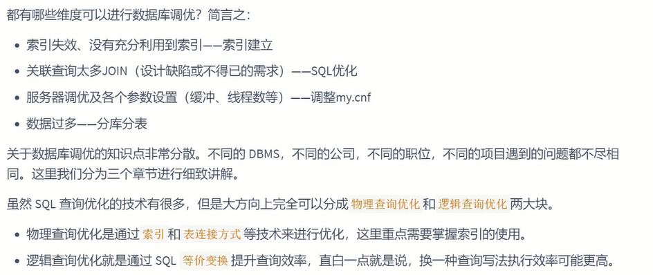


## 一、数据准备

`学员表` 插 `50万` 条， `班级表` 插 `1万` 条。

**步骤1：建表**

```sql
#班级表
CREATE TABLE `class` (
`id` INT(11) NOT NULL AUTO_INCREMENT,
`className` VARCHAR(30) DEFAULT NULL,
`address` VARCHAR(40) DEFAULT NULL,
`monitor` INT NULL ,
PRIMARY KEY (`id`)
) ENGINE=INNODB AUTO_INCREMENT=1 DEFAULT CHARSET=utf8;

#学员表
CREATE TABLE `student` (
`id` INT(11) NOT NULL AUTO_INCREMENT,
`stuno` INT NOT NULL ,
`name` VARCHAR(20) DEFAULT NULL,
`age` INT(3) DEFAULT NULL,
`classId` INT(11) DEFAULT NULL,
PRIMARY KEY (`id`)
#CONSTRAINT `fk_class_id` FOREIGN KEY (`classId`) REFERENCES `t_class` (`id`)
) ENGINE=INNODB AUTO_INCREMENT=1 DEFAULT CHARSET=utf8;

```

**步骤2：设置参数**

命令开启：允许创建函数设置：

```sql
set global log_bin_trust_function_creators=1;  # 不加global只是当前窗口有效。
```

**步骤3：创建函数**

*保证每条数据都不同。*

```sql
#随机产生字符串
DELIMITER //
CREATE FUNCTION rand_string(n INT) RETURNS VARCHAR(255)
BEGIN  
DECLARE chars_str VARCHAR(100) DEFAULT
'abcdefghijklmnopqrstuvwxyzABCDEFJHIJKLMNOPQRSTUVWXYZ';
DECLARE return_str VARCHAR(255) DEFAULT '';
DECLARE i INT DEFAULT 0;
WHILE i < n DO 
SET return_str =CONCAT(return_str,SUBSTRING(chars_str,FLOOR(1+RAND()*52),1)); 
SET i = i + 1;
END WHILE;
RETURN return_str;
END //
DELIMITER ;

#假如要删除
#drop function rand_string;
```

*随机产生班级编号*

```sql
#用于随机产生多少到多少的编号
DELIMITER //
CREATE FUNCTION rand_num (from_num INT ,to_num INT) RETURNS INT(11)
BEGIN 
DECLARE i INT DEFAULT 0; 
SET i = FLOOR(from_num +RAND()*(to_num - from_num+1))  ;
RETURN i; 
END //
DELIMITER ;

#假如要删除
#drop function rand_num;
```

**步骤4：创建存储过程**

```sql
#创建往stu表中插入数据的存储过程
DELIMITER //
CREATE PROCEDURE insert_stu(  START INT , max_num INT )
BEGIN 
	DECLARE i INT DEFAULT 0; 
	SET autocommit = 0;   #设置手动提交事务
	REPEAT  #循环
	SET i = i + 1;  #赋值
	INSERT INTO student (stuno, name ,age ,classId ) VALUES
	((START+i),rand_string(6),rand_num(1,50),rand_num(1,1000)); 
	UNTIL i = max_num 
	END REPEAT; 
	COMMIT;  #提交事务
END //
DELIMITER ;

#假如要删除
#drop PROCEDURE insert_stu;
```

创建往class表中插入数据的存储过程

```sql
#执行存储过程，往class表添加随机数据
DELIMITER //
CREATE PROCEDURE `insert_class`( max_num INT )
BEGIN 
	DECLARE i INT DEFAULT 0; 
	SET autocommit = 0;  
	REPEAT 
	SET i = i + 1; 
	INSERT INTO class ( classname,address,monitor ) VALUES
	(rand_string(8),rand_string(10),rand_num(1,100000)); 
	UNTIL i = max_num 
	END REPEAT; 
	COMMIT;
END //
DELIMITER ;

#假如要删除
#drop PROCEDURE insert_class;
```

**步骤5：调用存储过程**
class

```sql
#执行存储过程，往class表添加1万条数据 
CALL insert_class(10000);
```

stu

```sql
#执行存储过程，往stu表添加50万条数据 
CALL insert_stu(100000,500000);
12
```

**步骤6：删除某表上的索引**
创建存储过程

```sql
DELIMITER //
CREATE  PROCEDURE `proc_drop_index`(dbname VARCHAR(200),tablename VARCHAR(200))
BEGIN
   DECLARE done INT DEFAULT 0;
   DECLARE ct INT DEFAULT 0;
   DECLARE _index VARCHAR(200) DEFAULT '';
   DECLARE _cur CURSOR FOR  SELECT  index_name  FROM
information_schema.STATISTICS  WHERE table_schema=dbname AND table_name=tablename AND
seq_in_index=1 AND  index_name <>'PRIMARY' ;
#每个游标必须使用不同的declare continue handler for not found set done=1来控制游标的结束
   DECLARE  CONTINUE HANDLER FOR NOT FOUND set done=2 ;   
#若没有数据返回,程序继续,并将变量done设为2
    OPEN _cur;
    FETCH _cur INTO _index;
    WHILE _index<>'' DO
       SET @str = CONCAT("drop index " , _index , " on " , tablename );
       PREPARE sql_str FROM @str ;
       EXECUTE sql_str;
       DEALLOCATE PREPARE sql_str;
       SET _index='';
       FETCH _cur INTO _index;
    END WHILE;
 CLOSE _cur;
END //
DELIMITER ;
```

执行存储过程

```sql
CALL proc_drop_index("dbname","tablename");
```

------

## 二、索引失效案例

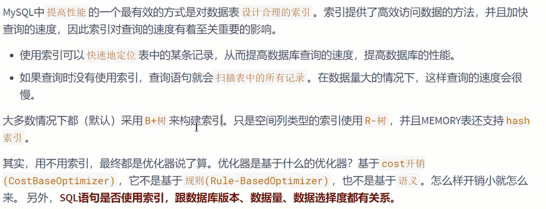


### 1、全值匹配我最爱

*全值的等值匹配*

```mysql
EXPLAIN SELECT SQL_NO_CACHE * FROM student WHERE age=30;
EXPLAIN SELECT SQL_NO_CACHE * FROM student WHERE age=30 AND classId=4;
EXPLAIN SELECT SQL_NO_CACHE * FROM student WHERE age=30 AND classId=4 AND NAME = 'abcd';

SELECT SQL_NO_CACHE * FROM student WHERE age=30 AND classId=4 AND NAME = 'abcd';

-- 建立索引，进行优化
CREATE INDEX idx_age ON student(age);

CREATE INDEX idx_age_classid ON student(age,classId);

CREATE INDEX idx_age_classid_name ON student(age,classId,NAME);
```


### 2、最佳左前缀法则


> **拓展：Alibaba《Java开发手册》**
> 索引文件具有 B-Tree 的最左前缀匹配特性，如果左边的值未确定，那么无法使用此索引。

### 3、主键插入顺序


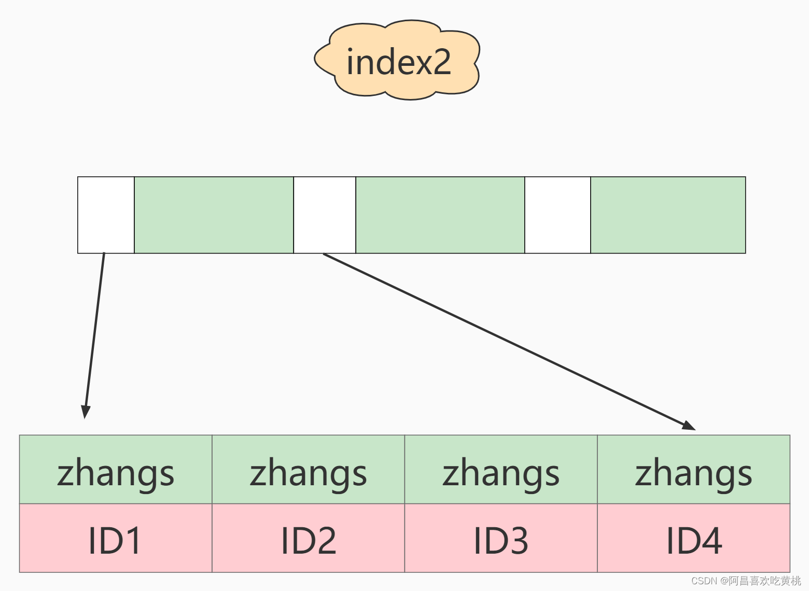
如果此时再插入一条主键值为 `9`的记录，那它插入的位置就如下图：

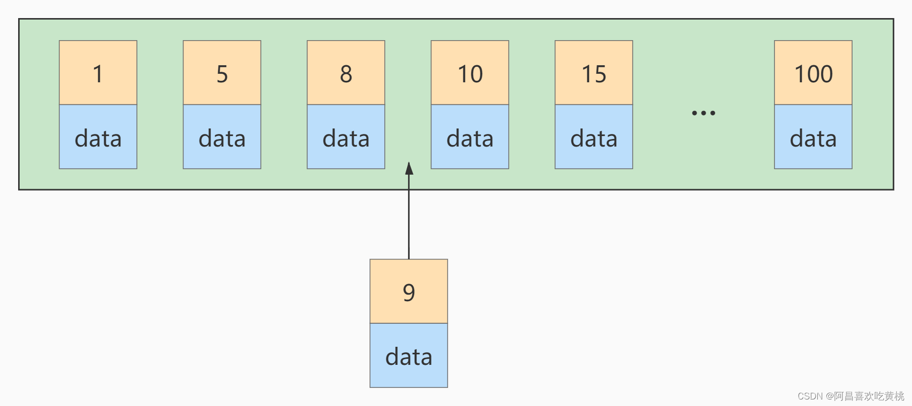
可这个数据页已经满了，再插进来咋办呢？我们需要把当前 `页面分裂` 成两个页面，把本页中的一些记录移动到新创建的这个页中。页面分裂和记录移位意味着什么？意味着： `性能损耗` ！所以如果我们想尽量避免这样无谓的性能损耗，最好让插入的记录的 `主键值依次递增` ，这样就不会发生这样的性能损耗了。
所以我们建议：让主键具有 `AUTO_INCREMENT` ，让存储引擎自己为表生成主键，而不是我们手动插入 ，比如： `person_info` 表：

```sql
CREATE TABLE person_info(
	 id INT UNSIGNED NOT NULL AUTO_INCREMENT,
	 name VARCHAR(100) NOT NULL,
	 birthday DATE NOT NULL,
	 phone_number CHAR(11) NOT NULL,
	 country varchar(100) NOT NULL,
	  PRIMARY KEY (id),
	  KEY idx_name_birthday_phone_number (name(10), birthday, phone_number)
);  
```

我们自定义的主键列 `id` 拥有 `AUTO_INCREMENT` 属性，在插入记录时存储引擎会自动为我们填入自增的主键值。这样的主键占用空间小，顺序写入，减少页分裂。

### 4、计算、函数、类型转换(自动或手动)导致索引失效

函数导致索引失效：

```sql
EXPLAIN SELECT SQL_NO_CACHE * FROM student WHERE student.name LIKE 'abc%';
EXPLAIN SELECT SQL_NO_CACHE * FROM student WHERE LEFT(student.name,3) = 'abc'; 函数导致索引失效
```

创建索引

```sql
CREATE INDEX idx_name ON student(NAME);
```

**第一种：索引优化生效**

```sql
mysql> EXPLAIN SELECT SQL_NO_CACHE * FROM student WHERE student.name LIKE 'abc%';

mysql>  SELECT SQL_NO_CACHE * FROM student WHERE student.name LIKE 'abc%';
+---------+---------+--------+------+---------+
| id   | stuno  | name  | age | classId |
+---------+---------+--------+------+---------+
| 5301379 | 1233401 | AbCHEa |  164 |   259 |
| 7170042 | 3102064 | ABcHeB |  199 |   161 |
| 1901614 | 1833636 | ABcHeC |  226 |   275 |
| 5195021 | 1127043 | abchEC |  486 |    72 |
| 4047089 | 3810031 | AbCHFd |  268 |   210 |
| 4917074 |  849096 | ABcHfD |  264 |   442 |
| 1540859 |  141979 | abchFF |  119 |   140 |
| 5121801 | 1053823 | AbCHFg |  412 |   327 |
| 2441254 | 2373276 | abchFJ |  170 |   362 |
| 7039146 | 2971168 | ABcHgI |  502 |   465 |
| 1636826 | 1580286 | ABcHgK |  71 |   262 |
|  374344 |  474345 | abchHL |  367 |   212 |
| 1596534 |  169191 | AbCHHl |  102 |   146 |
         ...
| 5266837 | 1198859 | abclXe |  292 |   298 |
| 8126968 | 4058990 | aBClxE |  316 |   150 |
| 4298305 |  399962 | AbCLXF |  72 |   423 |
| 5813628 | 1745650 | aBClxF |  356 |   323 |
| 6980448 | 2912470 | AbCLXF |  107 |    78 |
| 7881979 | 3814001 | AbCLXF |  89 |   497 |
| 4955576 |  887598 | ABcLxg |  121 |   385 |
| 3653460 | 3585482 | AbCLXJ |  130 |   174 |
| 1231990 | 1283439 | AbCLYH |  189 |   429 |
| 6110615 | 2042637 | ABcLyh |  157 |    40 |
+---------+---------+--------+------+---------+
401 rows in set, 1 warning (0.01 sec)
```

**第二种：索引优化失效**

```sql
mysql> EXPLAIN SELECT SQL_NO_CACHE * FROM student WHERE LEFT(student.name,3) = 'abc'; -- 【函数导致索引失效】
```

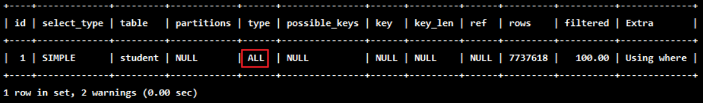

```sql
mysql>  SELECT SQL_NO_CACHE * FROM student WHERE LEFT(student.name,3) = 'abc';
+---------+---------+--------+------+---------+
| id   | stuno  | name  | age | classId |
+---------+---------+--------+------+---------+
| 5301379 | 1233401 | AbCHEa |  164 |   259 |
| 7170042 | 3102064 | ABcHeB |  199 |   161 |
| 1901614 | 1833636 | ABcHeC |  226 |   275 |
| 5195021 | 1127043 | abchEC |  486 |    72 |
| 4047089 | 3810031 | AbCHFd |  268 |   210 |
| 4917074 |  849096 | ABcHfD |  264 |   442 |
| 1540859 |  141979 | abchFF |  119 |   140 |
| 5121801 | 1053823 | AbCHFg |  412 |   327 |
| 2441254 | 2373276 | abchFJ |  170 |   362 |
| 7039146 | 2971168 | ABcHgI |  502 |   465 |
| 1636826 | 1580286 | ABcHgK |  71 |   262 |
|  374344 |  474345 | abchHL |  367 |   212 |
| 1596534 |  169191 | AbCHHl |  102 |   146 |
         ...
| 5266837 | 1198859 | abclXe |  292 |   298 |
| 8126968 | 4058990 | aBClxE |  316 |   150 |
| 4298305 |  399962 | AbCLXF |  72 |   423 |
| 5813628 | 1745650 | aBClxF |  356 |   323 |
| 6980448 | 2912470 | AbCLXF |  107 |    78 |
| 7881979 | 3814001 | AbCLXF |  89 |   497 |
| 4955576 |  887598 | ABcLxg |  121 |   385 |
| 3653460 | 3585482 | AbCLXJ |  130 |   174 |
| 1231990 | 1283439 | AbCLYH |  189 |   429 |
| 6110615 | 2042637 | ABcLyh |  157 |    40 |
+---------+---------+--------+------+---------+
401 rows in set, 1 warning (3.62 sec)
```

type为“ALL”，表示没有使用到索引，查询时间为 `3.62`秒，查询效率较之前低很多。


**再举例：**  计算导致索引失效

- student表的字段stuno上设置有索引

```sql
CREATE INDEX idx_sno ON student(stuno);
EXPLAIN SELECT SQL_NO_CACHE id, stuno, NAME FROM student WHERE stuno+1 = 900001;
```


- 索引优化生效：

```sql
EXPLAIN SELECT SQL_NO_CACHE id, stuno, NAME FROM student WHERE stuno = 900000;
```

**再举例：**函数导致索引失效

- student表的字段name上设置有索引

```sql
CREATE INDEX idx_name ON student(NAME);
EXPLAIN SELECT id, stuno, name FROM student WHERE SUBSTRING(name, 1,3)='abc';
```

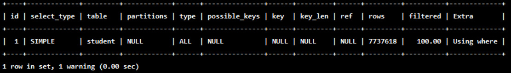

```sql
EXPLAIN SELECT id, stuno, NAME FROM student WHERE NAME LIKE 'abc%';
```


### 5、类型转换导致索引失效

下列哪个sql语句可以用到索引。（假设name字段上设置有索引）

```sql
# 未使用到索引
EXPLAIN SELECT SQL_NO_CACHE * FROM student WHERE name=123;  -- name 是varchar，字段隐式转换
```

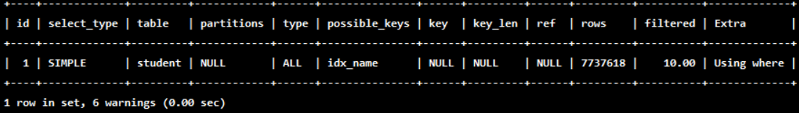

```sql
# 使用到索引
EXPLAIN SELECT SQL_NO_CACHE * FROM student WHERE name='123';
```

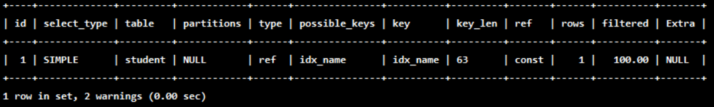
name=123发生隐式类型转换，索引失效。(`隐式的类型转换`)

------

### 6、范围条件右边的列索引失效

```sql
ALTER TABLE student DROP INDEX idx_name;
ALTER TABLE student DROP INDEX idx_age;
ALTER TABLE student DROP INDEX idx_age_classid;

EXPLAIN SELECT SQL_NO_CACHE * FROM student
WHERE student.age=30 AND student.classId>20 AND student.name = 'abc' ;
# student.classId>20的右侧的student.name = 'abc'的索引就会失效
```

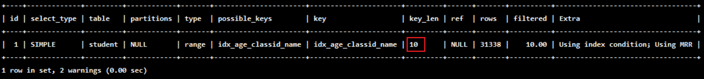

```sql
-- 优化 将等值 的列在创建联合索引时位置提前
create index idx_age_name_classid on student(age,name,classid);
```

- 将范围查询条件放置语句最后：

```sql
EXPLAIN SELECT SQL_NO_CACHE * FROM student WHERE student.age=30 AND student.name = 'abc' AND student.classId>20 ;
#直接交换sql语句的位置是没有用的，需要改变联合索引的位置

EXPLAIN SELECT SQL_NO_CACHE * FROM student
WHERE student.age=30 AND student.classId>20 AND student.name = 'abc' ;

-- 以上两个查询优化器都会优化成使用student(age,name,classid)索引，AND条件的位置调整不应结果
```

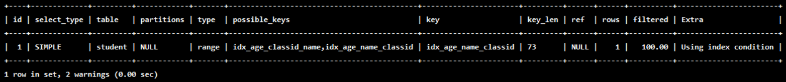

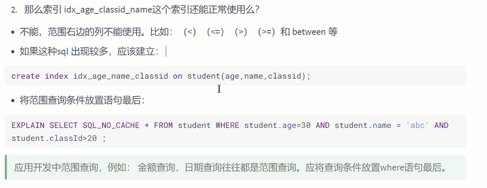

> 应用开发中范围查询，例如：金额查询，日期查询往往都是范围查询。应将查询条件放置where语句最后
> （`创建的联合索引中，务必把范围涉及到的字段写在最后`）

### 7、 不等于(!= 或者<>)索引失效

当sql语句中有!=或者<>会出现索引失效的问题，尝试改写为`等于`，或采用`覆盖索引`

```mysql
CREATE INDEX idx_name ON student(NAME);

EXPLAIN SELECT SQL_NO_CACHE * FROM student WHERE student.name <> 'abc' ;

EXPLAIN SELECT SQL_NO_CACHE * FROM student WHERE student.name != 'abc' ;
```

### 8、is null可以使用索引，is not null无法使用索引

```sql
EXPLAIN SELECT SQL_NO_CACHE * FROM student WHERE age IS NULL;
EXPLAIN SELECT SQL_NO_CACHE * FROM student WHERE age IS NOT NULL; -- 与不等于类似
```

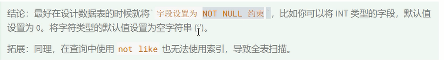

### 9、 like以通配符%开头索引失效

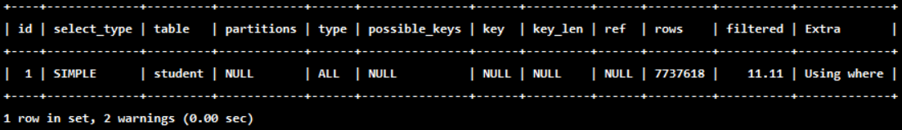

> 拓展：Alibaba《Java开发手册》
> 【强制】页面搜索严禁`左模糊`或者`全模糊`，如果需要请走搜索引擎来解决。

### 10、OR 前后存在非索引的列，索引失效

*让`OR的前后条件`都具备索引，如果缺少一个就会出现索引失效*

```sql
# 未使用到索引
-- 解释 classid = 100会进行全表扫描，age = 10走不走索引都会得到结果，就全表all
EXPLAIN SELECT SQL_NO_CACHE * FROM student WHERE age = 10 OR classid = 100;
```

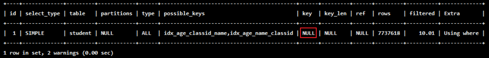

```sql
CREATE INDEX idx_age ON student(age);
CREATE INDEX idx_cid ON student(classid);

#使用到索引  age和name都分别创建索引
EXPLAIN SELECT SQL_NO_CACHE * FROM student WHERE age = 10 OR name = 'Abel';
```

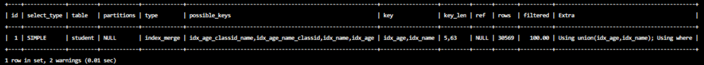

### 11、数据库和表的字符集统一使用utf8mb4

统一使用utf8mb4( 5.5.3版本以上支持)兼容性更好，统一字符集可以避免由于字符集转换产生的乱码。不同的 `字符集` 进行比较前需要进行 `转换` 会造成索引失效。

------

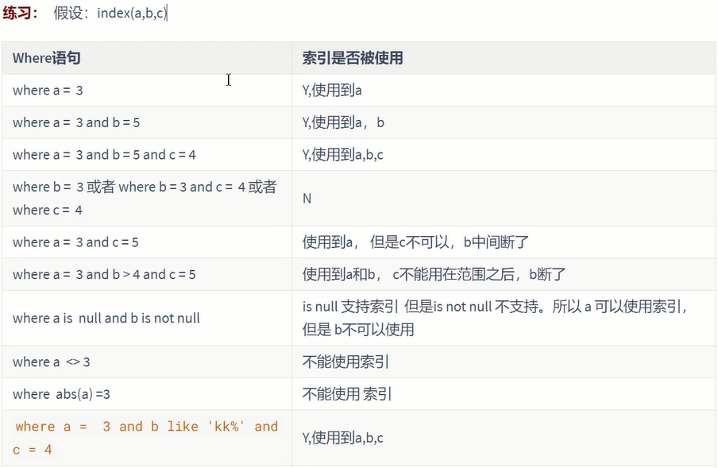

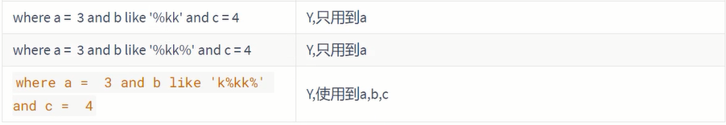

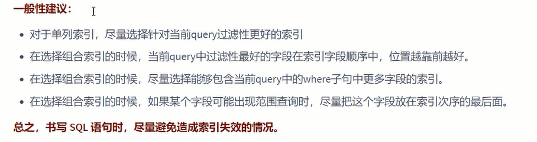

## 三、关联查询优化

### 1、数据准备

```mysql
#分类
CREATE TABLE IF NOT EXISTS `type` (
`id` INT(10) UNSIGNED NOT NULL AUTO_INCREMENT,
`card` INT(10) UNSIGNED NOT NULL,
PRIMARY KEY (`id`)
);
#图书
CREATE TABLE IF NOT EXISTS `book` (
`bookid` INT(10) UNSIGNED NOT NULL AUTO_INCREMENT,
`card` INT(10) UNSIGNED NOT NULL,
PRIMARY KEY (`bookid`)
);

#向分类表中添加20条记录
INSERT INTO TYPE(card) VALUES(FLOOR(1 + (RAND() * 20)));
INSERT INTO TYPE(card) VALUES(FLOOR(1 + (RAND() * 20)));
INSERT INTO TYPE(card) VALUES(FLOOR(1 + (RAND() * 20)));
INSERT INTO TYPE(card) VALUES(FLOOR(1 + (RAND() * 20)));
INSERT INTO TYPE(card) VALUES(FLOOR(1 + (RAND() * 20)));
INSERT INTO TYPE(card) VALUES(FLOOR(1 + (RAND() * 20)));
INSERT INTO TYPE(card) VALUES(FLOOR(1 + (RAND() * 20)));
INSERT INTO TYPE(card) VALUES(FLOOR(1 + (RAND() * 20)));
INSERT INTO TYPE(card) VALUES(FLOOR(1 + (RAND() * 20)));
INSERT INTO TYPE(card) VALUES(FLOOR(1 + (RAND() * 20)));
INSERT INTO TYPE(card) VALUES(FLOOR(1 + (RAND() * 20)));
INSERT INTO TYPE(card) VALUES(FLOOR(1 + (RAND() * 20)));
INSERT INTO TYPE(card) VALUES(FLOOR(1 + (RAND() * 20)));
INSERT INTO TYPE(card) VALUES(FLOOR(1 + (RAND() * 20)));
INSERT INTO TYPE(card) VALUES(FLOOR(1 + (RAND() * 20)));
INSERT INTO TYPE(card) VALUES(FLOOR(1 + (RAND() * 20)));
INSERT INTO TYPE(card) VALUES(FLOOR(1 + (RAND() * 20)));
INSERT INTO TYPE(card) VALUES(FLOOR(1 + (RAND() * 20)));
INSERT INTO TYPE(card) VALUES(FLOOR(1 + (RAND() * 20)));
INSERT INTO TYPE(card) VALUES(FLOOR(1 + (RAND() * 20)));

#向图书表中添加20条记录
INSERT INTO book(card) VALUES(FLOOR(1 + (RAND() * 20)));
INSERT INTO book(card) VALUES(FLOOR(1 + (RAND() * 20)));
INSERT INTO book(card) VALUES(FLOOR(1 + (RAND() * 20)));
INSERT INTO book(card) VALUES(FLOOR(1 + (RAND() * 20)));
INSERT INTO book(card) VALUES(FLOOR(1 + (RAND() * 20)));
INSERT INTO book(card) VALUES(FLOOR(1 + (RAND() * 20)));
INSERT INTO book(card) VALUES(FLOOR(1 + (RAND() * 20)));
INSERT INTO book(card) VALUES(FLOOR(1 + (RAND() * 20)));
INSERT INTO book(card) VALUES(FLOOR(1 + (RAND() * 20)));
INSERT INTO book(card) VALUES(FLOOR(1 + (RAND() * 20)));
INSERT INTO book(card) VALUES(FLOOR(1 + (RAND() * 20)));
INSERT INTO book(card) VALUES(FLOOR(1 + (RAND() * 20)));
INSERT INTO book(card) VALUES(FLOOR(1 + (RAND() * 20)));
INSERT INTO book(card) VALUES(FLOOR(1 + (RAND() * 20)));
INSERT INTO book(card) VALUES(FLOOR(1 + (RAND() * 20)));
INSERT INTO book(card) VALUES(FLOOR(1 + (RAND() * 20)));
INSERT INTO book(card) VALUES(FLOOR(1 + (RAND() * 20)));
INSERT INTO book(card) VALUES(FLOOR(1 + (RAND() * 20)));
INSERT INTO book(card) VALUES(FLOOR(1 + (RAND() * 20)));
INSERT INTO book(card) VALUES(FLOOR(1 + (RAND() * 20)));
```

### 2、采用左外连接

```sql
EXPLAIN SELECT SQL_NO_CACHE * FROM `type` LEFT JOIN book ON type.card = book.card;
```

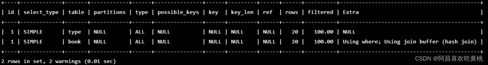

> type是驱动表【执行计划位置在前】
>
> Using join buffer (hash join)    因为被驱动表book 每次都需要全表扫描，`优化器使用join buffer将数据进行缓存`。

*结论：type 有All*

**【优化】**`被驱动表` 添加索引优化

```sql
ALTER TABLE book ADD INDEX Y ( card);  #【被驱动表】，可以避免全表扫描
EXPLAIN SELECT SQL_NO_CACHE * FROM `type` LEFT JOIN book ON type.card = book.card;
```

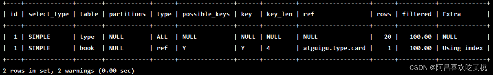
可以看到第二行的 type 变为了 ref，rows 也变成了优化比较明显。这是由左连接特性决定的。
`左外连接LEFT JOIN条件`用于确定如何从右表搜索行，左边一定都有，所以 `右边是我们的关键点,一定需要建立索引`。

```sql
ALTER TABLE `type` ADD INDEX X (card); #【驱动表】，无法避免全表扫描
EXPLAIN SELECT SQL_NO_CACHE * FROM `type` LEFT JOIN book ON type.card = book.card;
```

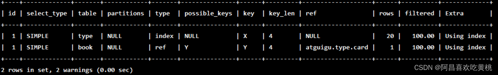
然后删除被驱动表索引

```sql
DROP INDEX Y ON book;
EXPLAIN SELECT SQL_NO_CACHE * FROM `type` LEFT JOIN book ON type.card = book.card;
```

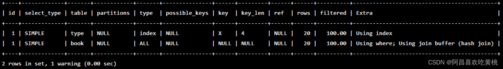


### 3、采用内连接

```sql
drop index X on type;
drop index Y on book;（如果已经删除了可以不用再执行该操作）
```

换成 inner join（`MySQL自动选择驱动表`）

```sql
EXPLAIN  SELECT SQL_NO_CACHE * FROM type INNER JOIN book ON type.card=book.card; 
```

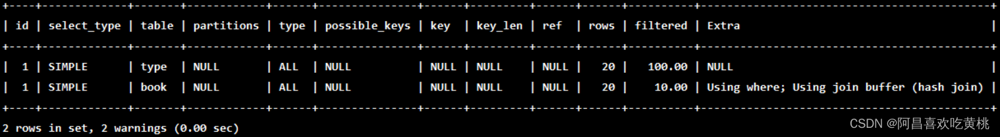
*添加索引优化*

```sql
ALTER  TABLE book ADD INDEX Y ( card);

EXPLAIN  SELECT SQL_NO_CACHE * FROM type INNER JOIN book ON type.card=book.card;
--  book存在索引【作为被驱动表即内层循环，效率高】，优化器选择type为驱动表，book为被驱动表
```

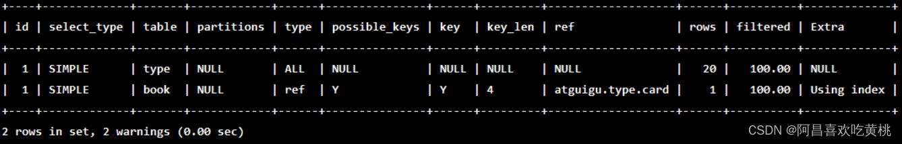

```sql
ALTER  TABLE type ADD INDEX X (card);
 
EXPLAIN  SELECT SQL_NO_CACHE * FROM type INNER JOIN book ON type.card=book.card;
```

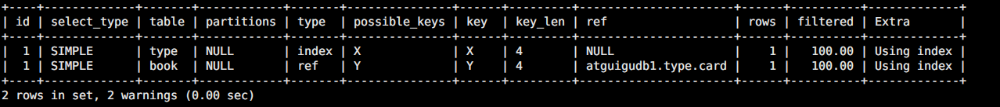


接着：

```sql
DROP INDEX X ON `type`;

EXPLAIN  SELECT SQL_NO_CACHE * FROM TYPE INNER JOIN book ON type.card=book.card;
```


接着：

```sql
ALTER  TABLE `type` ADD INDEX X (card); 

EXPLAIN  SELECT SQL_NO_CACHE * FROM  `type` INNER JOIN book ON type.card=book.card;
```

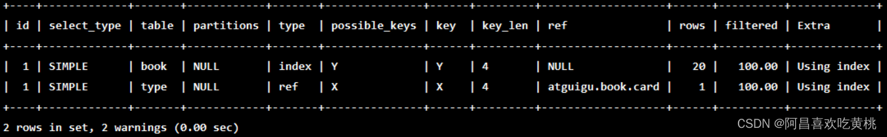


>结论：对于内连接来说，查询优化器可以决定谁作为驱动表，谁作为被驱动表出现的
>
>
>
>优化原则：减少循环次数；  减少连接的内层循环次数，即保证内层优先使用索引
>
>+ 对于内连接来讲，如果表的连接条件中只能有一个字段有索引，则`有索引的字段所在的表会被作为被驱动表`出现。
>+ 对于内连接来说，`在两个表的连接条件都存在索引的情况下，会选择小表作为驱动表`。“小表驱动大表”  【内层循环次数一定，选择外层循环次数少的情况】

### 4、join语句原理

- **Index Nested-Loop Join**

```sql
EXPLAIN SELECT * FROM t1 STRAIGHT_JOIN t2 ON (t1.a=t2.a);
-- STRAIGHT_JOIN 固定t1为驱动表  避免优化器优化内连接的驱动表
```

如果直接使用join语句，MySQL优化器可能会选择表t1或t2作为驱动表，这样会影响我们分析SQL语句的执行过程。

所以，为了便于分析执行过程中的性能问题，我改用 `straight_join`让MySQL使用固定的连接方式执行查询，这样优化器只会按照我们指定的方式去join。在这个语句里，t1 是驱动表，t2是被驱动表。

可以看到，在这条语句里，被驱动表t2的字段a上有索引，join过程用上了这个索引，因此这个语句的执行流程是这样的：

1. 从表t1中读入一行数据 R；
2. 从数据行R中，取出a字段到表t2里去查找；
3. 取出表t2中满足条件的行，跟R组成一行，作为结果集的一部分；
4. 重复执行步骤1到3，直到表t1的末尾循环结束。

这个过程是先遍历表t1，然后根据从表t1中取出的每行数据中的a值，去表t2中查找满足条件的记录。在形式上，这个过程就跟我们写程序时的嵌套查询类似，并且可以用上被驱动表的索引，所以我们称之为“`Index Nested-Loop Join`”，简称NLJ。

它对应的流程图如下所示：

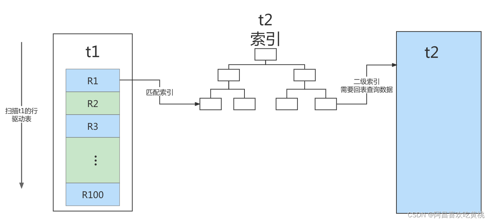

在这个流程里：

1. 对驱动表t1做了全表扫描，这个过程需要扫描100行；
2. 而对于每一行R，根据a字段去表t2查找，走的是树搜索过程。由于我们构造的数据都是一一对应的，因此每次的搜索过程都只扫描一行，也是总共扫描100行；
3. 所以，整个执行流程，总扫描行数是200。

**引申问题1：能不能使用join?**

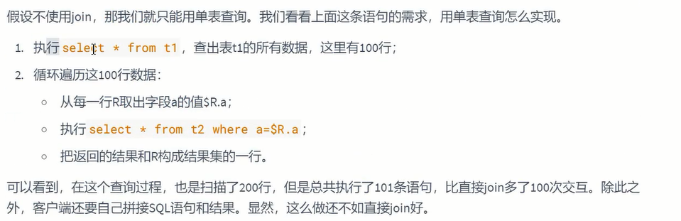

**引申问题2：怎么选择驱动表？**


假设驱动表是走`全表扫描`，而被驱动表是`走树搜索`。
假设被驱动表的行数是M。每次在被驱动表查一行数据，要先搜索`索引a`，`再搜索主键索引【普通索引需要回表】`。每次搜索一棵树近似复杂度是以2为底的M的对数，记为log2M，所以在被驱动表上查一行的时间复杂度是`2*log2M`【`回表  *2`】。

假设驱动表的行数是N，执行过程就要扫描驱动表N行，然后对于每一行，到被驱动表上匹配一次。

因此整个执行过程，近似复杂度是`N+ N*2*log2M`.

显然，N对扫描行数的影响更大，因此应该让`小表来做驱动表`。

比如：
N扩大1000倍的话，扫描行数就会扩大1000倍；而M扩大1000倍，扫描行数扩大不到10倍。


> **两个结论**：
> 
>1. 使用join语句，性能比强行拆成多个单表执行SQL语句的性能要好；
> 2. 如果使用join语句的话，需要让小表做驱动表。

- **Simple Nested-Loop Join**

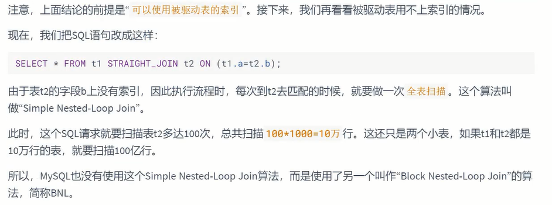

- **Block Nested-Loop Join**

驱动表和被驱动表连接字段都没有索引

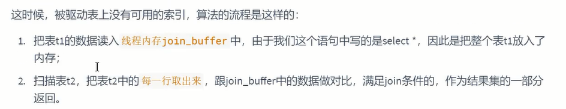


*这个过程的流程图如下*：
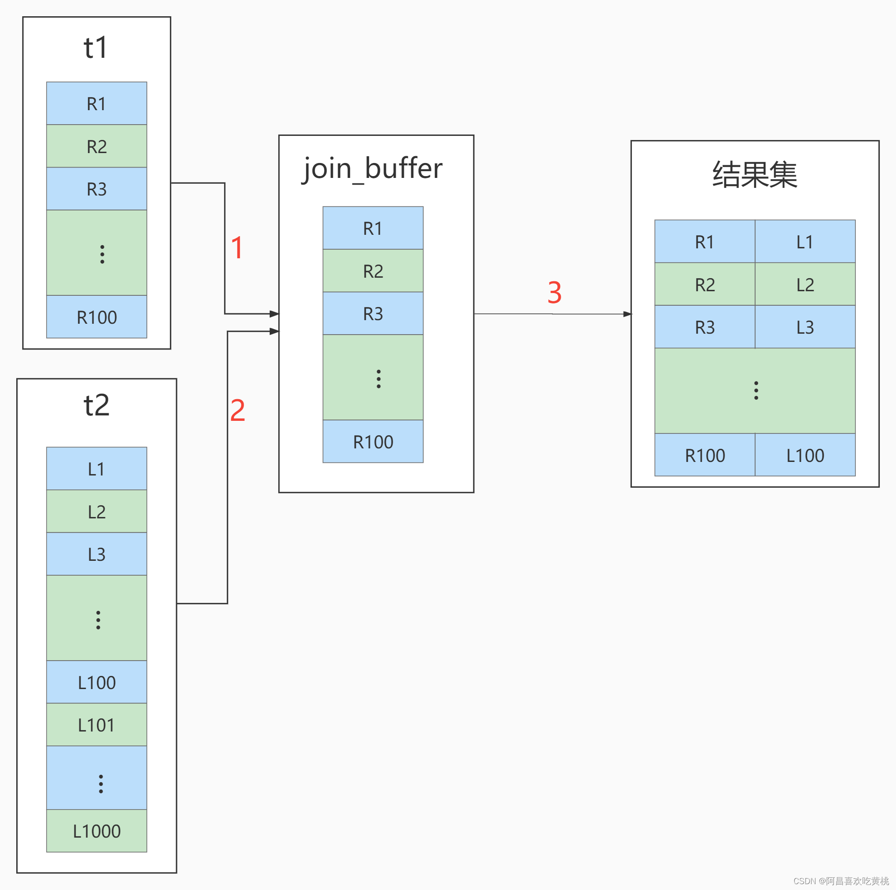

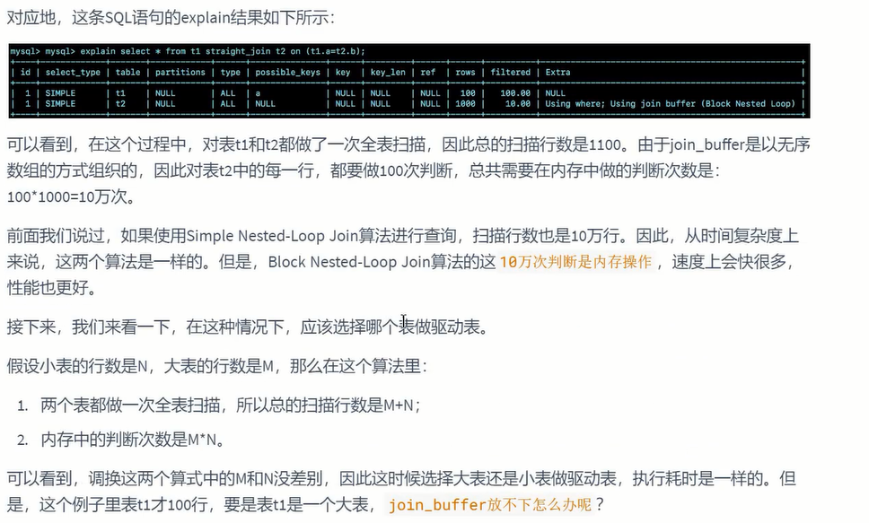

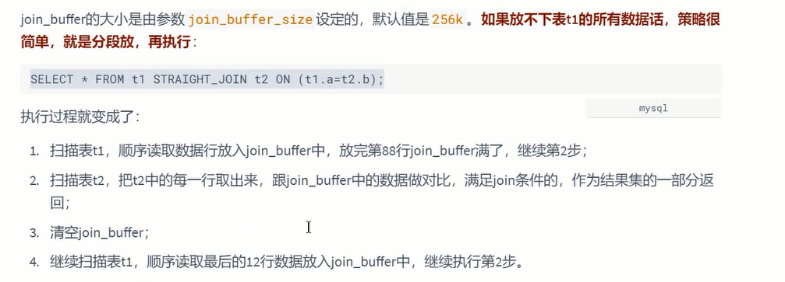


*执行流程图也就变成这样*：

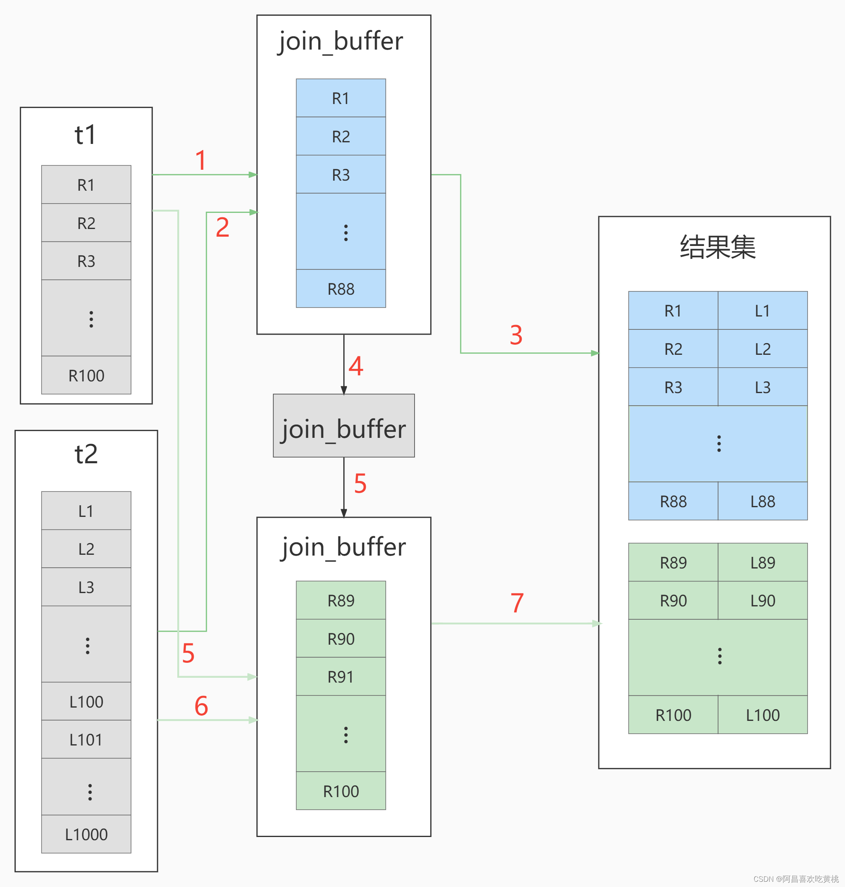

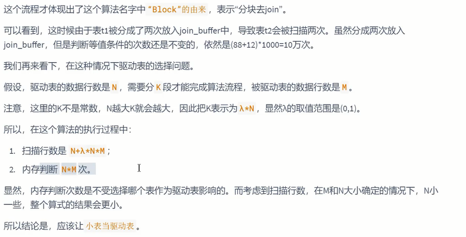

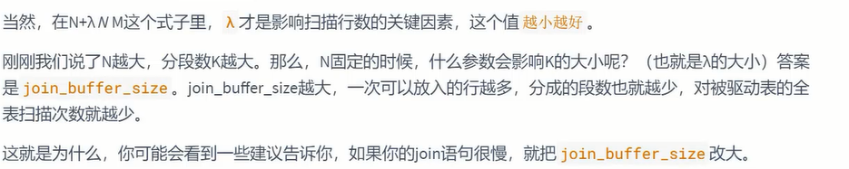


**总结1：能不能使用xxx join语句？**

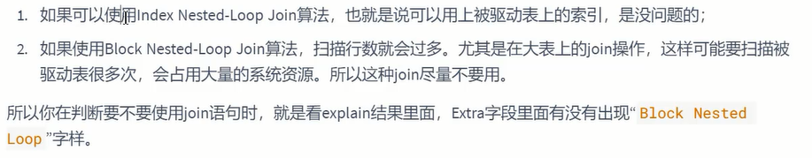

**总结2：如果要使用join，应该选择大表做驱动表还是选择小表做驱动表？**

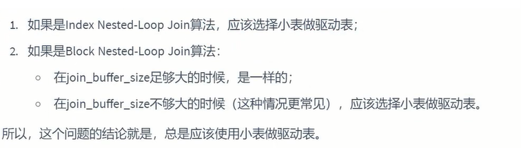


**总结3：什么叫作“小表”？**

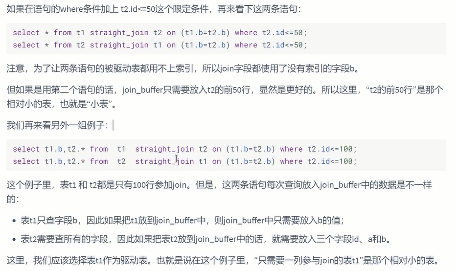

**在决定哪个表做驱动表的时候，应该是两个表按照各自的条件过滤，过滤完成之后，计算参与join的各个字段的总数据量，数据量小的那个表，就是“小表”，应该作为驱动表。**

### 5、小结

- 保证被驱动表的JOIN字段已经创建了索引，会使用Index Nested-Loop Join算法
- 需要JOIN 的字段，数据类型保持绝对一致【防止隐式类型转换】。
- LEFT JOIN 时，选择小表作为驱动表， `大表作为被驱动表` 。减少外层循环的次数。
- INNER JOIN 时，MySQL会自动将 `小结果集的表选为驱动表` 。选择相信MySQL优化策略。
- 能够直接多表关联的尽量直接关联，不用子查询。(减少查询的趟数)
- 不建议使用子查询，建议将子查询SQL拆开结合程序多次查询，或使用 JOIN 来代替子查询。
- 衍生表建不了索引

------

## 四、子查询优化

看看能不能将子查询优化成内外连接查询
MySQL从4.1版本开始支持子查询，使用子查询可以进行SELECT语句的嵌套查询，即一个SELECT查询的结果作为另一个SELECT语句的条件。 `子查询可以一次性完成很多逻辑上需要多个步骤才能完成的SQL操作`。

子查询是 MySQL 的一项重要的功能，可以帮助我们通过一个 SQL 语句实现比较复杂的查询。但是，**子查询的执行效率不高。**

**原因**：

① 执行子查询时，MySQL需要为内层查询语句的查询结果`建立一个临时表` ，然后外层查询语句从临时表中查询记录。查询完毕后，再 `撤销这些临时表` 。这样会消耗过多的CPU和IO资源，产生大量的慢查询。

② 子查询的结果集存储的临时表，不论是内存临时表还是磁盘临时表都 `不会存在索引` ，所以查询性能会受到一定的影响。

③ 对于返回结果集比较大的子查询，其对查询性能的影响也就越大。

在MySQL中，可以使用连接（JOIN）查询来替代子查询。连接查询 `不需要建立临时表`，其 `速度比子查询要快` ，如果查询中使用索引的话，性能就会更好。


```mysql
#创建班级表中班长的索引
CREATE INDEX idx_monitor ON class(monitor);

#查询班长的信息
EXPLAIN SELECT * FROM student stu1
WHERE stu1.`stuno` IN (
SELECT monitor
FROM class c
WHERE monitor IS NOT NULL
);

EXPLAIN SELECT stu1.* FROM student stu1 JOIN class c 
ON stu1.`stuno` = c.`monitor`
WHERE c.`monitor` IS NOT NULL;

#查询不为班长的学生信息
EXPLAIN SELECT SQL_NO_CACHE a.* 
FROM student a 
WHERE  a.stuno  NOT  IN (
			SELECT monitor FROM class b 
			WHERE monitor IS NOT NULL) 


EXPLAIN SELECT SQL_NO_CACHE a.*
FROM  student a LEFT OUTER JOIN class b 
ON a.stuno =b.monitor
WHERE b.monitor IS NULL;
```

> **结论**：
> 尽量不要使用NOT IN 或者 NOT EXISTS，用LEFT JOIN xxx ON xx WHERE xx IS NULL替代

------

## 五、排序优化

### 1、排序优化

**问题**：
在 WHERE 条件字段上加索引，但是为什么在 ORDER BY 字段上还要加索引呢？

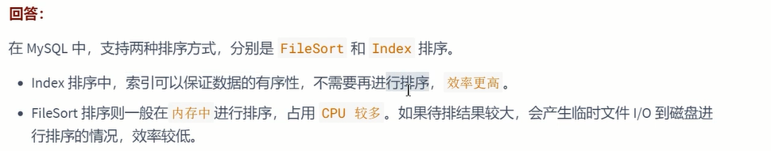

**优化建议**：

1. SQL 中，可以在 WHERE 子句和 ORDER BY 子句中使用索引，目的是在 WHERE 子句中 `避免全表扫描` ，在 ORDER BY 子句 `避免使用 FileSort 排序` 。当然，某些情况下全表扫描，或者 FileSort 排序不一定比索引慢。但总的来说，我们还是要避免，以提高查询效率。
2. 尽量使用 Index 完成 ORDER BY 排序。如果 WHERE 和 ORDER BY 后面是相同的列就使用单索引列；如果不同就使用联合索引。
3. 无法使用 Index 时，需要对 FileSort 方式进行调优。

```sql
-- 小结:  还需要考虑数据规模
INDEX a_b_c(a,b,c)
order by 能使用索引最左前缀
- ORDER BY a
- ORDER BY a,b
- ORDER BY a,b,c
- ORDER BY a DESC,b DESC,c DESC

如果WHERE使用索引的最左前缀定义为常量，则order by 能使用索引
- WHERE a = const ORDER BY b,c
- WHERE a = const AND b = const ORDER BY c
- WHERE a = const ORDER BY b,c
- WHERE a = const AND b > const ORDER BY b,c

不能使用索引进行排序
- ORDER BY a ASC,b DESC,c DESC  	/* 排序不一致 */
- WHERE g = const ORDER BY b,c  	/*丢失a索引*/
- WHERE a = const ORDER BY c  		/*丢失b索引*/
- WHERE a = const ORDER BY a,d  	/*d不是索引的一部分*/
- WHERE a in (...) ORDER BY b,c 	/*对于排序来说，多个相等条件也是范围查询*/
```

```mysql
#过程一：
EXPLAIN SELECT SQL_NO_CACHE * FROM student ORDER BY age,classid; 

EXPLAIN SELECT SQL_NO_CACHE * FROM student ORDER BY age,classid LIMIT 10; 

#过程二：order by时不limit，索引失效
#创建索引  
CREATE  INDEX idx_age_classid_name ON student (age,classid,NAME);


#不限制,索引失效  -- 优化器认为数据量大回表耗时，直接filesort
EXPLAIN  SELECT SQL_NO_CACHE * FROM student ORDER BY age,classid; 

EXPLAIN  SELECT SQL_NO_CACHE age,classid,name,id FROM student ORDER BY age,classid;  -- 使用覆盖索引

#增加limit过滤条件，使用上索引了。  -- limit限制的数量，回表开销小，直接filesort
EXPLAIN  SELECT SQL_NO_CACHE * FROM student ORDER BY age,classid LIMIT 10; 


#过程三：order by时顺序错误，索引失效

#创建索引age,classid,stuno
CREATE  INDEX idx_age_classid_stuno ON student (age,classid,stuno); 

#以下哪些索引失效?
EXPLAIN  SELECT * FROM student ORDER BY classid LIMIT 10;

EXPLAIN  SELECT * FROM student ORDER BY classid,NAME LIMIT 10;  

EXPLAIN  SELECT * FROM student ORDER BY age,classid,stuno LIMIT 10; -- 使用索引

EXPLAIN  SELECT * FROM student ORDER BY age,classid LIMIT 10;-- 使用索引

EXPLAIN  SELECT * FROM student ORDER BY age LIMIT 10;-- 使用索引

#过程四：order by时规则不一致, 索引失效 （顺序错，不索引；方向反，不索引）

EXPLAIN  SELECT * FROM student ORDER BY age DESC, classid ASC LIMIT 10;

EXPLAIN  SELECT * FROM student ORDER BY classid DESC, NAME DESC LIMIT 10;

EXPLAIN  SELECT * FROM student ORDER BY age ASC,classid DESC LIMIT 10; 

EXPLAIN  SELECT * FROM student ORDER BY age DESC, classid DESC LIMIT 10;

#过程五：无过滤，不索引

EXPLAIN  SELECT * FROM student WHERE age=45 ORDER BY classid;

EXPLAIN  SELECT * FROM student WHERE  age=45 ORDER BY classid,NAME; 

EXPLAIN  SELECT * FROM student WHERE  classid=45 ORDER BY age;

EXPLAIN  SELECT * FROM student WHERE  classid=45 ORDER BY age LIMIT 10; -- 优化器  先根据age走联合索引 查询到classid = 45，取10条数据即结束查找，再回表

CREATE INDEX idx_cid ON student(classid);
EXPLAIN  SELECT * FROM student WHERE  classid=45 ORDER BY age;
```

### 2、案例实战

ORDER BY子句，尽量使用Index方式排序，避免使用FileSort方式排序。

执行案例前先清除student上的索引，只留主键：

```sql
DROP INDEX idx_age ON student;
DROP INDEX idx_age_classid_stuno ON student;
DROP INDEX idx_age_classid_name ON student;
#或者
call proc_drop_index('atguigudb2','student');
```


实战：测试filesort和index排序

场景:查询年龄为30岁的，且学生编号小于101000的学生，按用户名称排序

```sql
EXPLAIN SELECT SQL_NO_CACHE * FROM student WHERE age = 30 AND stuno <101000 ORDER BY NAME ;
```


查询结果如下：

```sql
mysql>  SELECT SQL_NO_CACHE * FROM student WHERE age = 30 AND stuno <101000 ORDER BY NAME;
+---------+--------+--------+------+---------+
| id   | stuno | name  | age | classId |
+---------+--------+--------+------+---------+
|   922 | 100923 | elTLXD |  30 |   249 |
| 3723263 | 100412 | hKcjLb |  30 |    59 |
| 3724152 | 100827 | iHLJmh |  30 |   387 |
| 3724030 | 100776 | LgxWoD |  30 |   253 |
|    30 | 100031 | LZMOIa |  30 |    97 |
| 3722887 | 100237 | QzbJdx |  30 |   440 |
|   609 | 100610 | vbRimN |  30 |   481 |
|   139 | 100140 | ZqFbuR |  30 |   351 |
+---------+--------+--------+------+---------+
8 rows in set, 1 warning (3.16 sec)
```

> **结论**：
> type 是 ALL，即最坏的情况。Extra 里还出现了 Using filesort,也是最坏的情况。优化是必须的。

优化思路：

**方案一: 为了去掉filesort我们可以把索引建成**

```sql
#创建新索引   where中age使用了等值连接，order by中使用了name
CREATE INDEX idx_age_name ON student(age,NAME);
```

**方案二: 尽量让where的过滤条件和排序使用上索引**
建一个三个字段的组合索引：

```sql
DROP INDEX idx_age_name ON student;
CREATE INDEX idx_age_stuno_name ON student (age,stuno,NAME);
EXPLAIN SELECT SQL_NO_CACHE * FROM student WHERE age = 30 AND stuno <101000 ORDER BY NAME ;
```


```
key_len = 9  原因

age int+允许null    4 + 1  = 5 
+
stuno  int 4               = 4 
						 = 9 

优化器没有继续使用name进行索引排序，数据量小  ，直接filesort排序速度更快
```


```mysql
mysql> SELECT SQL_NO_CACHE * FROM student
 -> WHERE age = 30 AND stuno <101000 ORDER BY NAME ;
+-----+--------+--------+------+---------+
| id | stuno | name  | age | classId |
+-----+--------+--------+------+---------+
| 167 | 100168 | AClxEF |  30 |   319 |
| 323 | 100324 | bwbTpQ |  30 |   654 |
| 651 | 100652 | DRwIac |  30 |   997 |
| 517 | 100518 | HNSYqJ |  30 |   256 |
| 344 | 100345 | JuepiX |  30 |   329 |
| 905 | 100906 | JuWALd |  30 |   892 |
| 574 | 100575 | kbyqjX |  30 |   260 |
| 703 | 100704 | KJbprS |  30 |   594 |
| 723 | 100724 | OTdJkY |  30 |   236 |
| 656 | 100657 | Pfgqmj |  30 |   600 |
| 982 | 100983 | qywLqw |  30 |   837 |
| 468 | 100469 | sLEKQW |  30 |   346 |
| 988 | 100989 | UBYqJl |  30 |   457 |
| 173 | 100174 | UltkTN |  30 |   830 |
| 332 | 100333 | YjWiZw |  30 |   824 |
+-----+--------+--------+------+---------+
15 rows in set, 1 warning (0.00 sec)
```

结果竟然有 filesort的 sql 运行速度，`超过了已经优化掉 filesort的 sql`，而且快了很多，几乎一瞬间就出现了结果。

> **结论**：
>
> 1. 两个索引同时存在，mysql自动选择最优的方案。（对于这个例子，mysql选择
>    idx_age_stuno_name）。但是， `随着数据量的变化，选择的索引也会随之变化的` 。
> 2. **当【范围条件】和【group by 或者 order by】的字段出现二选一时，优先观察条件字段的过滤数量，如果过滤的数据足够多，而需要排序的数据并不多时，优先把索引放在范围字段上。反之，亦然**。

思考：这里我们使用如下索引，是否可行？

```sql
DROP INDEX idx_age_stuno_name ON student;
CREATE INDEX idx_age_stuno ON student(age,stuno);
```

### 4、filesort算法：双路排序和单路排序

排序的字段若如果不在索引列上，则filesort会有两种算法：`双路排序`和`单路排序`

**双路排序 （慢）**

- `MySQL 4.1`之前是使用`双路排序` ，字面意思就是两次扫描磁盘，最终得到数据， 读取行指针和`order by`列 ，对他们进行排序，然后扫描已经排序好的列表，按照列表中的值重新从列表中读取对应的数据输出
- 从磁盘取排序字段，在buffer进行排序，再从 `磁盘取其他字段` 。

取一批数据，要对磁盘进行两次扫描，众所周知，IO是很耗时的，所以在mysql4.1之后，出现了第二种改进的算法，就是单路排序。

**单路排序 （快）**
从磁盘读取查询需要的 `所有列` ，按照order by列在buffer对它们进行排序，然后扫描排序后的列表进行输出， 它的效率更快一些，避免了第二次读取数据。并且把随机IO变成了顺序IO，但是它会使用更多的空
间， 因为它把每一行都保存在内存中了。

**结论及引申出的问题**

- 由于单路是后出的，总体而言好过双路

- 但是用单路有问题

  

**优化策略**：

1、尝试提高 `sort_buffer_size`


2、尝试提高 `max_length_for_sort_data`


3、Order by 时`select *` 是一个`大忌`。最好只Query`需要的字段`。


------

## 六、GROUP BY优化

- group by 使用索引的原则几乎跟order by一致 ，group by 即使没有过滤条件用到索引，也可以直接使用索引。
- group by 先排序再分组，遵照索引建的`最佳左前缀法则`
- 当无法使用索引列，增大 `max_length_for_sort_data` 和 `sort_buffer_size` 参数的设置
- where效率高于having，`能写在where限定的条件就不要写在having中`
- `减少使用order by`，和业务沟通能不排序就不排序，或将排序放到程序端去做。Order by、group by、distinct这些语句较为耗费CPU，数据库的CPU资源是极其宝贵的。
- 包含了order by、group by、distinct这些查询的语句，where条件过滤出来的结果集请保持在1000行以内，否则SQL会很慢。

------

## 七、优化分页查询

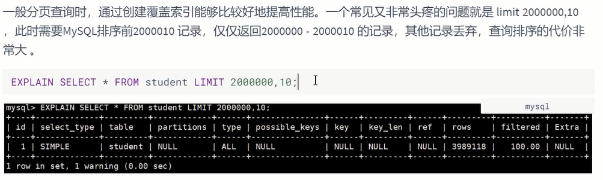

**优化思路一**：

在索引上完成排序分页操作，最后根据主键关联回原表查询所需要的其他列内容。

```sql
EXPLAIN SELECT * FROM student t,(SELECT id FROM student ORDER BY id LIMIT 2000000,10) a 
WHERE t.id = a.id;
```

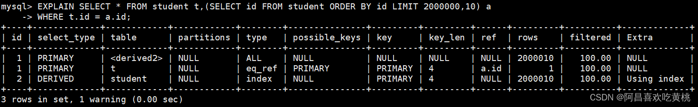
**优化思路二**:

该方案适用于主键自增的表，可以把Limit 查询转换成某个位置的查询 。

```sql
EXPLAIN SELECT * FROM student WHERE id > 2000000 LIMIT 10;
```


## 八、优先考虑覆盖索引

### 1、什么是覆盖索引？

- **理解方式一**：索引是高效找到行的一个方法，但是一般数据库也能使用索引找到一个列的数据，因此它不必读取整个行。毕竟索引叶子节点存储了它们索引的数据；当能通过读取索引就可以得到想要的数据，那就不需要读取行了。`一个索引包含了满足查询结果的数据就叫做覆盖索引`。
- **理解方式二**：非聚簇复合索引的一种形式，它包括在查询里的SELECT、JOIN和WHERE子句用到的所有列（即建索引的字段正好是覆盖查询条件中所涉及的字段）。

直接通过二级索引对应的数据列或者主键值找到了查询结果，无需回表；简单说就是， `索引列+主键` 包含 `SELECT 到 FROM之间查询的列` 。


```mysql
#删除之前的索引
#举例1：
DROP INDEX idx_age_stuno ON student;

CREATE INDEX idx_age_name ON student (age,NAME);

EXPLAIN SELECT * FROM student WHERE age <> 20;-- 不走索引
EXPLAIN SELECT age,NAME FROM student WHERE age <> 20; -- 虽然是不等于可能会造成索引失效，但是基于成本考虑走覆盖索引，取消回表的成本开销

#举例2：
EXPLAIN SELECT * FROM student WHERE NAME LIKE '%abc'; -- 模糊查询 % 在前，使用不上索引
EXPLAIN SELECT id,age FROM student WHERE NAME LIKE '%abc'; -- 走覆盖索引 age，name  减少成本开销不需要回表
```


### 2、覆盖索引的利弊

**好处**：

1. **避免Innodb表进行索引的二次查询（回表）**

   

2. **可以把随机IO变成顺序IO加快查询效率**

   

**弊端**：
索引字段的维护 总是有代价的。因此，在建立冗余索引来支持覆盖索引时就需要权衡考虑了。这是业务DBA，或者称为业务数据架构师的工作。

------

## 九、如何给字符串添加索引

有一张教师表，表定义如下：

```sql
create table teacher(
	ID bigint unsigned primary key,
	email varchar(64),
	...
)engine=innodb;
```

讲师要使用邮箱登录，所以业务代码中一定会出现类似于这样的语句：

```sql
mysql> select col1, col2 from teacher where email='xxx';
```

如果email这个字段上没有索引，那么这个语句就只能做 `全表扫描`。

### 1、前缀索引

MySQL是支持前缀索引的。默认地，如果你创建索引的语句不指定前缀长度，那么索引就会包含整个字符串。

```sql
mysql> alter table teacher add index index1(email);
#或
mysql> alter table teacher add index index2(email(6));
```

这两种不同的定义在数据结构和存储上有什么区别呢？下图就是这两个索引的示意图。

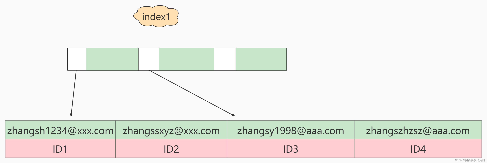
以及


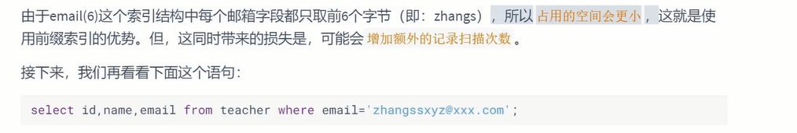

`如果使用的是index1`（即email整个字符串的索引结构），执行顺序是这样的：

1. 从index1索引树找到满足索引值是’zhangssxyz@xxx.com’的这条记录，取得ID2的值；
2. 到主键上查到主键值是ID2的行，判断email的值是正确的，将这行记录加入结果集；
3. 取index1索引树上刚刚查到的位置的下一条记录，发现已经不满足email='zhangssxyz@xxx.com’的条件了，循环结束。

这个过程中，只需要回主键索引取一次数据，所以系统认为只扫描了一行。

`如果使用的是index2`（即email(6)索引结构），执行顺序是这样的：

1. 从index2索引树找到满足索引值是’zhangs’的记录，找到的第一个是ID1；
2. 到主键上查到主键值是ID1的行，判断出email的值不是’zhangssxyz@xxx.com’，这行记录丢弃；
3. 取index2上刚刚查到的位置的下一条记录，发现仍然是’zhangs’，取出ID2，再到ID索引上取整行然后判断，这次值对了，将这行记录加入结果集；
4. 重复上一步，直到在idxe2上取到的值不是’zhangs’时，循环结束。


也就是说`使用前缀索引，定义好长度，就可以做到既节省空间，又不用额外增加太多的查询成本`。前面已经讲过区分度，区分度越高越好。因为区分度越高，意味着重复的键值越少。

> `COUNT(DISTINCT LEFT (列名，索引长度))/ COUNT(*)`

### 2、前缀索引对覆盖索引的影响

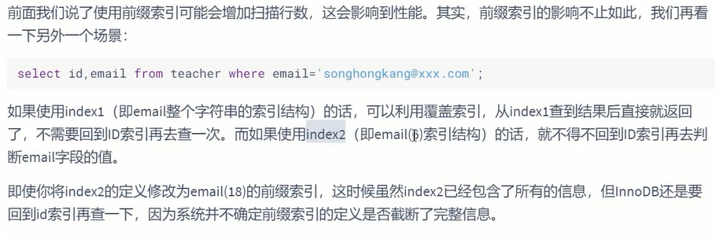

**结论**：

*使用前缀索引就用不上覆盖索引对查询性能的优化了，这也是你在选择是否使用前缀索引时需要考虑的一个因素*。

> 原因：前缀索引不包含该列的全部数据，需要回表得到完整列的数据

### 3、 拓展内容：

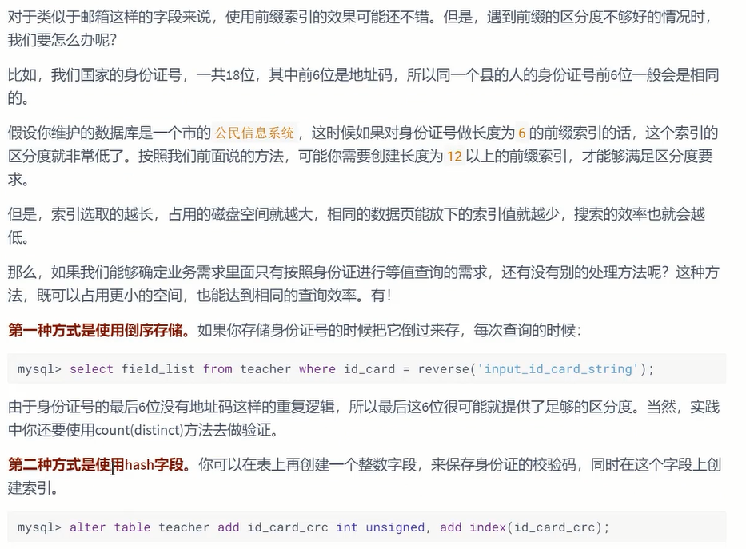

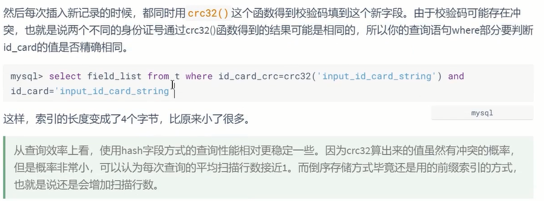

------

## 十、索引下推

Index Condition Pushdown(ICP)是MySQL 5.6中新特性，是一种在存储引擎层使用索引过滤数据的一种优化方式。
ICP可以减少存储引擎访问基表的次数以及MySQL服务器访问存储引擎的次数。


> 通过二级索引找到一定范围的数据结果集，对数据结果集再利用二级索引的的字段信息，使用where后面的条件进行过滤，尽可能的`减少通过二级索引结果集的回表的数据量`，减少回表的IO操作。

### 1、使用前后的扫描过程

**在不使用ICP索引扫描的过程**：

storage层：只将满足index key条件的索引记录对应的整行记录取出，返回给server层

server 层：对返回的数据，使用后面的where条件过滤，直至返回最后一行。
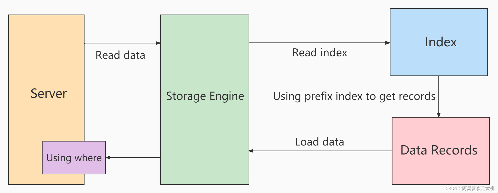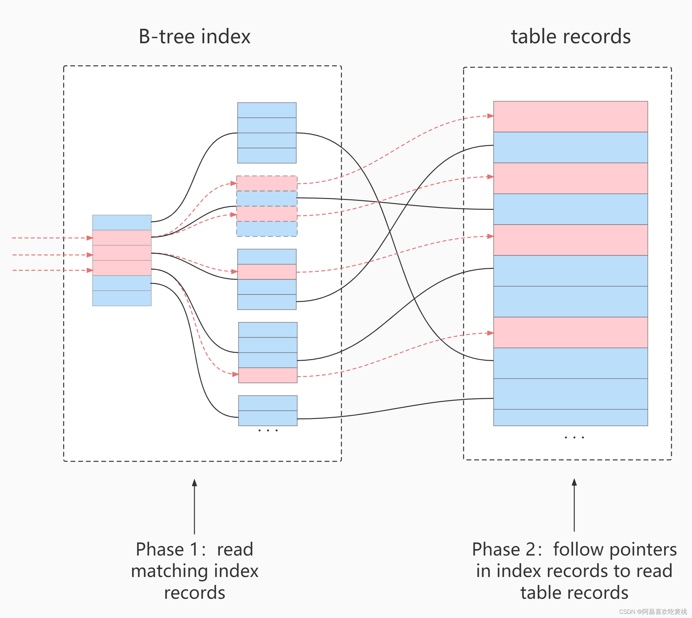

**使用ICP扫描的过程**：

- storage层：
  首先将index key条件满足的索引记录区间确定，然后在索引上使用index filter进行过滤。将满足的indexfilter条件的索引记录才去回表取出整行记录返回server层。不满足index filter条件的索引记录丢弃，不回表、也不会返回server层。
- server 层：
  对返回的数据，使用table filter条件做最后的过滤。

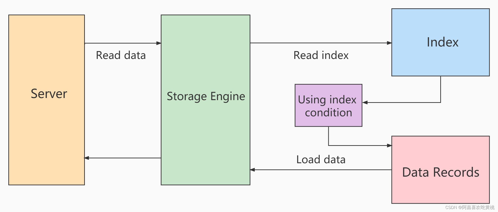
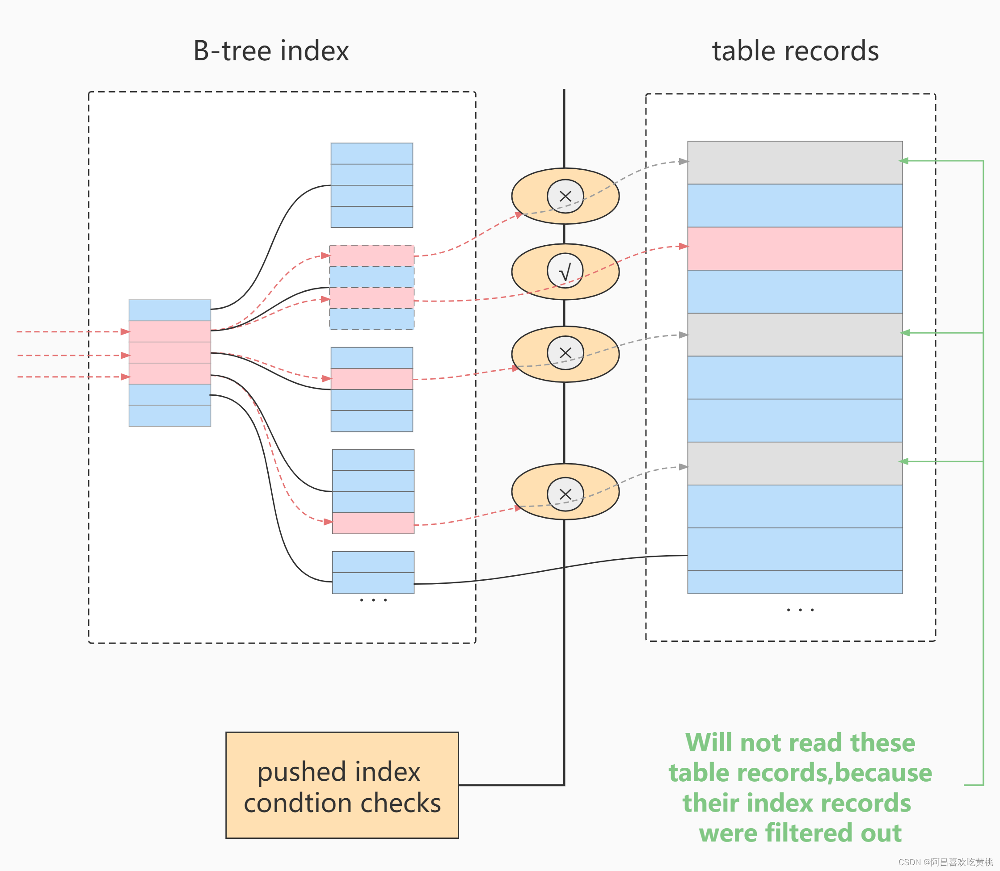

**使用前后的成本差别**：

使用前，存储层多返回了需要被index filter过滤掉的整行记录

使用ICP后，直接就去掉了不满足index filter条件的记录，省去了他们回表和传递server层的成本。

ICP的 `加速效果` 取决于在存储引擎内通过 `ICP筛选` 掉的数据的比例。

### 2、ICP的使用条件

**ICP的使用条件**：

① **只能用于二级索引(secondary index)**
②explain显示的执行计划中type值（join 类型）为 `range 、 ref 、 eq_ref 或者ref_or_null`。
③ **并非全部where条件都可以用ICP筛选，如果where条件的字段不在索引列中，还是要读取整表的记录到server端做where过滤。**
④ ICP可以用于MyISAM和InnnoDB存储引擎
⑤ MySQL 5.6版本的不支持分区表的ICP功能，5.7版本的开始支持。
⑥ 当SQL使用覆盖索引时，不支持ICP优化方法。

### 3、ICP使用案例

**案例1**：

```sql
SELECT * FROM tuser
WHERE NAME LIKE '张%'
AND age = 10
AND ismale = 1;
```

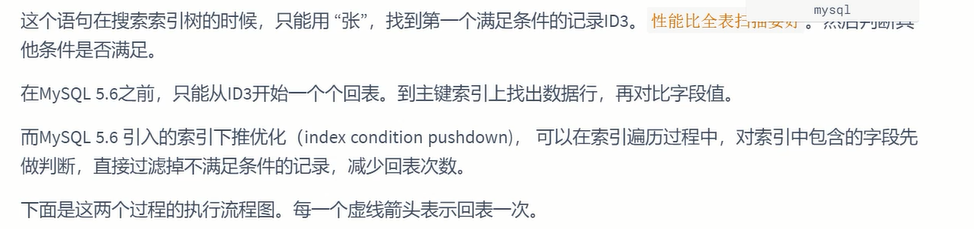

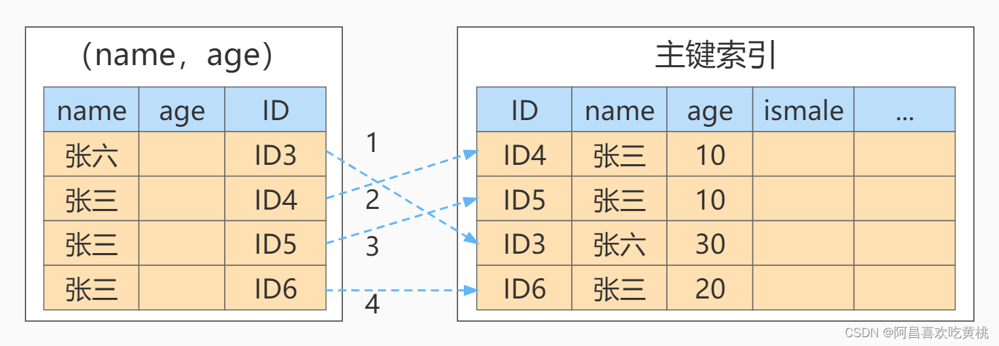

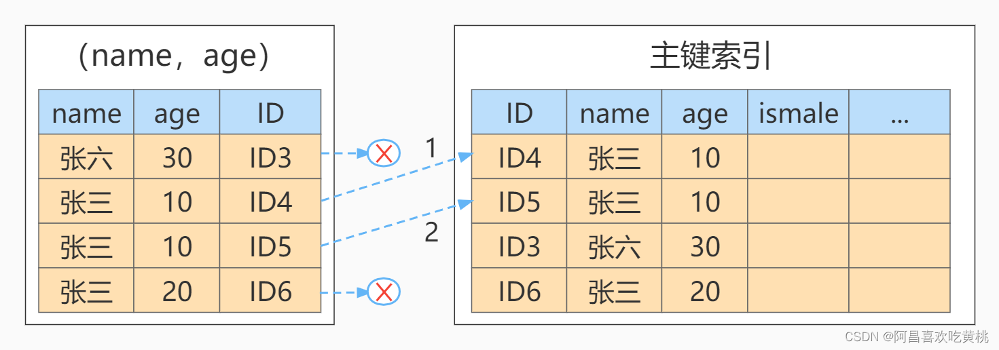


**案例2**:

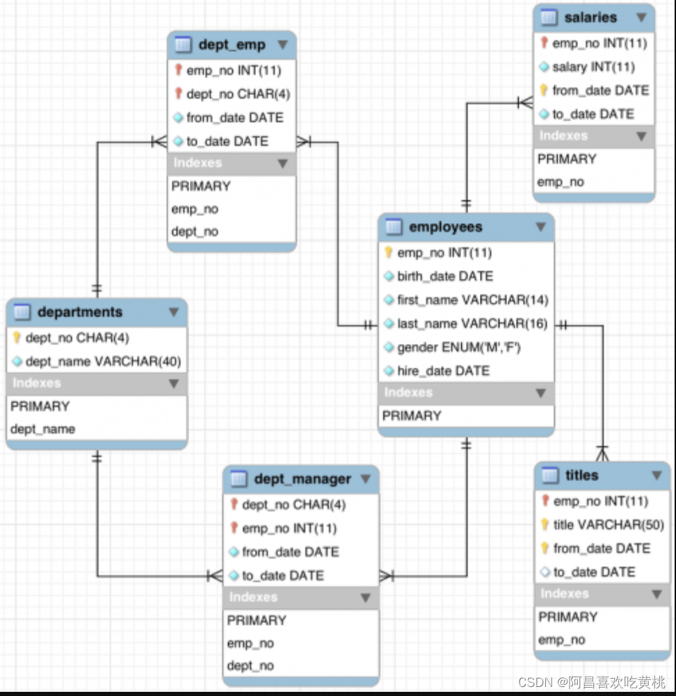


## 十一、普通索引 vs 唯一索引

从性能的角度考虑，你选择唯一索引还是普通索引呢？选择的依据是什么呢？

假设，我们有一个主键列为ID的表，表中有字段k，并且在k上有索引，假设字段 k 上的值都不重复。这个表的建表语句是：

这个表的建表语句是：

```sql
mysql> create table test(
		id int primary key,
		k int not null,
		name varchar(16),
		index (k)
	)engine=InnoDB;
```

表中R1~R5的(ID,k)值分别为(100,1)、(200,2)、(300,3)、(500,5)和(600,6)。

### 1、查询过程

假设，执行查询的语句是 `select id from test where k=5`。

- 对于普通索引来说，查找到满足条件的第一个记录(5,500)后，需要查找下一个记录，直到碰到第一个不满足k=5条件的记录。
- 对于唯一索引来说，由于索引定义了唯一性，查找到第一个满足条件的记录后，就会停止继续检索。

那么，这个不同带来的性能差距会有多少呢？答案是，`微乎其微` 。

### 2、更新过程

为了说明普通索引和唯一索引对更新语句性能的影响这个问题，介绍一下changebuffer。

当需要更新一个数据页时，如果数据页在内存中就直接更新，而如果这个数据页还没有在内存中的话，在不影响数据一致性的前提下， `InooDB会将这些更新操作缓存在change buffer中` ，这样就不需要从磁盘中读入这个数据页了。在下次查询需要访问这个数据页的时候，将数据页读入内存，然后执行changebuffer中与这个页有关的操作。通过这种方式就能保证这个数据逻辑的正确性。

将change buffer中的操作应用到原数据页，得到最新结果的过程称为 `merge` 。除了 `访问这个数据页` 会触发merge外，系统有 `后台线程会定期` merge。在`数据库正常关闭（shutdown）` 的过程中，也会执行merge操作。

如果能够将更新操作先记录在change buffer， `减少读磁盘` ，语句的执行速度会得到明显的提升。而且，数据读入内存是需要占用 buffer pool 的，所以这种方式还能够 `避免占用内存`，提高内存利用率。

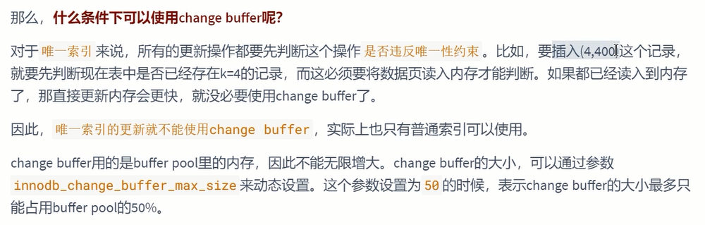

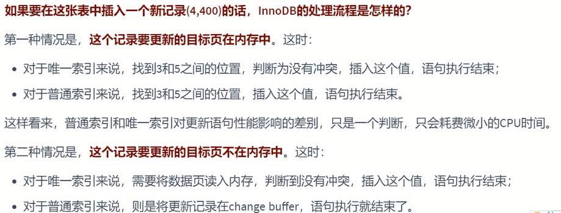


### 3、change buffer的使用场景

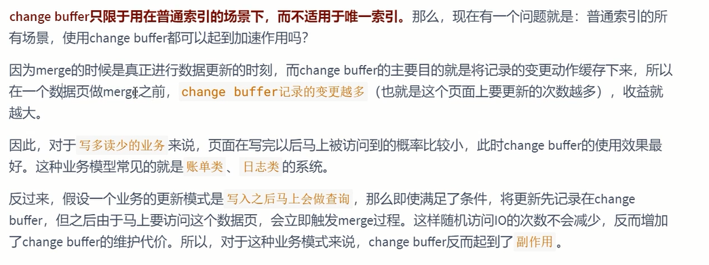

**结论：**

1. 普通索引和唯一索引应该怎么选择？其实，这两类索引在查询能力上是没差别的，主要考虑的是对 `更新性能` 的影响。所以，建议你 `尽量选择普通索引` 。
2. 在实际使用中会发现， `普通索引` 和`change buffer` 的配合使用，对于 `数据量大` 的表的更新优化还是很明显的。
3. 如果所有的更新后面，都马上 `伴随着对这个记录的查询` ，那么你应该 `关闭change buffer`。而在其他情况下，change buffer都能提升更新性能。
4. 由于唯一索引用不上change buffer的优化机制，因此如果 `业务可以接受` ，从性能角度出发建议优先考虑非唯一索引。但是如果"业务可能无法确保"的情况下，怎么处理呢？

- 首先， `业务正确性优先` 。我们的前提是“业务代码已经保证不会写入重复数据”的情况下，讨论性能问题。如果业务不能保证，或者业务就是要求数据库来做约束，那么没得选，必须创建唯一索引。这种情况下，本节的意义在于，如果碰上了大量插入数据慢、内存命中率低的时候，给你多提供一个排查思路。
- 然后，在一些“ `归档库` ”的场景，你是可以考虑使用唯一索引的。比如，线上数据只需要保留半年，然后历史数据保存在归档库。这时候，归档数据已经是确保没有唯一键冲突了。要提高归档效率，可以考虑把表里面的唯一索引改成普通索引。

------

## 十二、其它查询优化策略

### 1、`EXISTS` 和 `IN` 的区分

**问题**：
不太理解哪种情况下应该使用 EXISTS，哪种情况应该用 IN。选择的标准是看能否使用表的索引吗？

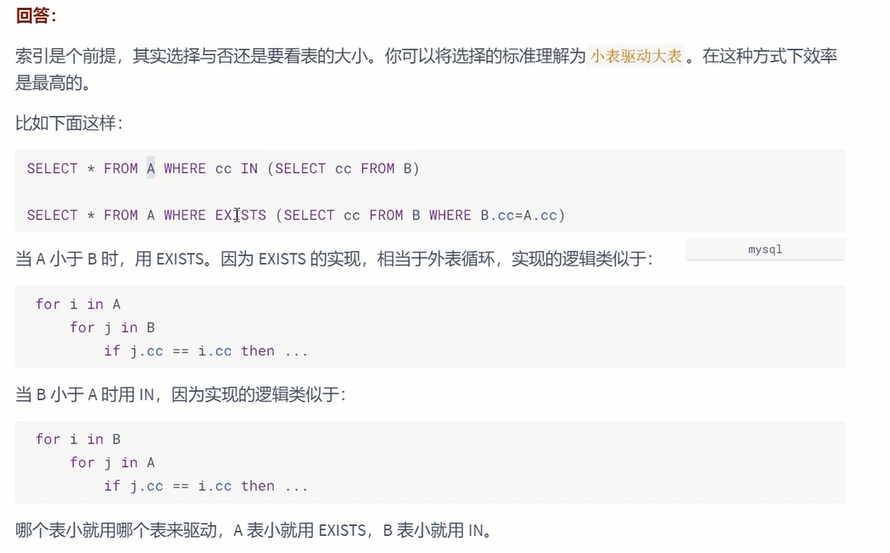


### 2、`COUNT(*)`与`COUNT(具体字段)`效率

问：在 MySQL 中统计数据表的行数，可以使用三种方式： `SELECT COUNT(*) 、 SELECT COUNT(1) 和 SELECT COUNT(具体字段)` ，使用这三者之间的查询效率是怎样的？

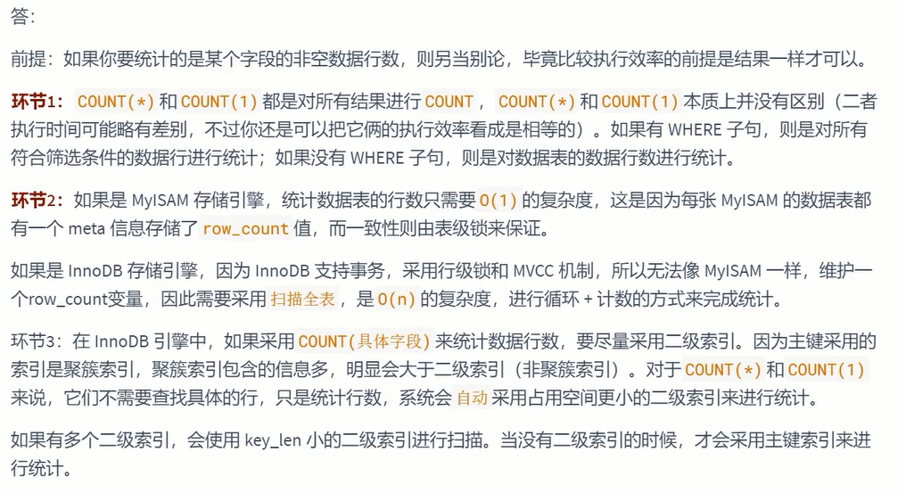

### 3、关于`SELECT(*)`

在表查询中，建议明确字段，不要使用 * 作为查询的字段列表，推荐使用SELECT <字段列表> 查询。原因：

① MySQL 在解析的过程中，会通过 `查询数据字典` 将"*"按序转换成所有列名，这会大大的耗费资源和时间。

② 无法使用 `覆盖索引`

### 4、`LIMIT 1` 对优化的影响

+ 针对的是会扫描全表的 SQL 语句，如果你可以确定结果集只有一条，那么加上 `LIMIT 1`的时候，当找到一条结果的时候就不会继续扫描了，这样会加快查询速度。

+ 如果数据表已经对字段建立了唯一索引，那么可以通过索引进行查询，不会全表扫描的话，就不需要加上 `LIMIT 1` 了。

### 5、多使用`COMMIT`

只要有可能，在程序中尽量多使用 COMMIT，这样程序的性能得到提高，需求也会因为 COMMIT 所释放的资源而减少。

COMMIT 会有所`释放的资源`：

- 回滚段上用于恢复数据的信息
- 被程序语句获得的锁
- redo / undo log buffer 中的空间
- 管理上述 3 种资源中的内部花费

------

## 十三、淘宝数据库，主键如何设计的？

聊一个实际问题：淘宝的数据库，主键是如何设计的？

某些错的离谱的答案还在网上年复一年的流传着，甚至还成为了所谓的MySQL军规。
其中，一个最明显的错误就是关于MySQL的主键设计。

大部分人的回答如此自信：用8字节的 BIGINT 做主键，而不要用INT。 `错`！

这样的回答，只站在了数据库这一层，而没有 `从业务的角度` 思考主键。主键就是一个自增ID吗？站在 2022年的新年档口，用自增做主键，架构设计上可能 `连及格都拿不到` 。

### 1、自增ID的问题

自增ID做主键，简单易懂，几乎所有数据库都支持自增类型，只是实现上各自有所不同而已。自增ID除了简单，其他都是缺点，总体来看存在以下几方面的问题：

1. `可靠性不高`
   存在自增ID回溯的问题，这个问题直到最新版本的MySQL 8.0才修复。
2. `安全性不高`
   对外暴露的接口可以非常容易猜测对应的信息。比如：/User/1/这样的接口，可以非常容易猜测用户ID的值为多少，总用户数量有多少，也可以非常容易地通过接口进行数据的爬取。
3. `性能差`
   自增ID的性能较差，需要在数据库服务器端生成。
4. `交互多`
   业务还需要额外执行一次类似 `last_insert_id()` 的函数才能知道刚才插入的自增值，这需要多一次的网络交互。在海量并发的系统中，多1条SQL，就多一次性能上的开销。
5. `局部唯一性`
   最重要的一点，自增ID是局部唯一，只在当前数据库实例中唯一，而不是全局唯一，在任意服务器间都是唯一的。对于目前分布式系统来说，这简直就是噩梦。

### 2、业务字段做主键

为了能够唯一地标识一个会员的信息，需要为 `会员信息表` 设置一个主键。那么，怎么为这个表设置主键，才能达到我们理想的目标呢？ 这里我们考虑业务字段做主键。

表数据如下：


在这个表里，哪个字段比较合适呢？

- **选择卡号（cardno）**
  会员卡号（cardno）看起来比较合适，因为会员卡号不能为空，而且有唯一性，可以用来 标识一条会员记录。

```sql
mysql> CREATE TABLE demo.membermaster
-> (
-> cardno CHAR(8) PRIMARY KEY, -- 会员卡号为主键
-> membername TEXT,
-> memberphone TEXT,
-> memberpid TEXT,
-> memberaddress TEXT,
-> sex TEXT,
-> birthday DATETIME
-> );
Query OK, 0 rows affected (0.06 sec)
```

不同的会员卡号对应不同的会员，字段“cardno”唯一地标识某一个会员。如果都是这样，会员卡号与会员一一对应，系统是可以正常运行的。

但实际情况是， `会员卡号可能存在重复使用` 的情况。比如，张三因为工作变动搬离了原来的地址，不再到商家的门店消费了 （退还了会员卡），于是张三就不再是这个商家门店的会员了。但是，商家不想让这个会 员卡空着，就把卡号是“10000001”的会员卡发给了王五。

从系统设计的角度看，这个变化只是修改了会员信息表中的卡号是“10000001”这个会员 信息，并不会影响到数据一致性。也就是说，修改会员卡号是“10000001”的会员信息， 系统的各个模块，都会获取到修改后的会员信息，不会出现“有的模块获取到修改之前的会员信息，有的模块获取到修改后的会员信息，而导致系统内部数据不一致”的情况。因此，从 `信息系统层面` 上看是没问题的。

但是从使用 `系统的业务层面` 来看，就有很大的问题 了，会对商家造成影响。
比如，我们有一个销售流水表（trans），记录了所有的销售流水明细。2020 年 12 月 01 日，张三在门店购买了一本书，消费了 89 元。那么，系统中就有了张三买书的流水记录，如下所示：

接着，我们查询一下 2020 年 12 月 01 日的会员销售记录：

```sql
mysql> SELECT b.membername,c.goodsname,a.quantity,a.salesvalue,a.transdate
-> FROM demo.trans AS a
-> JOIN demo.membermaster AS b
-> JOIN demo.goodsmaster AS c
-> ON (a.cardno = b.cardno AND a.itemnumber=c.itemnumber);
+------------+-----------+----------+------------+---------------------+
| membername | goodsname | quantity | salesvalue | transdate      |
+------------+-----------+----------+------------+---------------------+
| 张三    | 书    | 1.000  | 89.00   | 2020-12-01 00:00:00 |
+------------+-----------+----------+------------+---------------------+
1 row in set (0.00 sec)
1234567891011
```

如果会员卡“10000001”又发给了王五，我们会更改会员信息表。导致查询时：

```sql
mysql> SELECT b.membername,c.goodsname,a.quantity,a.salesvalue,a.transdate
-> FROM demo.trans AS a
-> JOIN demo.membermaster AS b
-> JOIN demo.goodsmaster AS c
-> ON (a.cardno = b.cardno AND a.itemnumber=c.itemnumber);
+------------+-----------+----------+------------+---------------------+
| membername | goodsname | quantity | salesvalue | transdate      |
+------------+-----------+----------+------------+---------------------+
| 王五    | 书    | 1.000  | 89.00   | 2020-12-01 00:00:00 |
+------------+-----------+----------+------------+---------------------+
1 row in set (0.01 sec)
```

这次得到的结果是：王五在 2020 年 12 月 01 日，买了一本书，消费 89 元。显然是错误的！
结论：千万不能把会员卡号当做主键。

- **选择会员电话 或 身份证号**

会员电话可以做主键吗？不行的。在实际操作中，手机号也存在 `被运营商收回` ，重新发给别人用的情况。

那身份证号行不行呢？好像可以。因为身份证决不会重复，身份证号与一个人存在一一对 应的关系。可问题是，身份证号属于 `个人隐私` ，顾客不一定愿意给你。要是强制要求会员必须登记身份证号，会把很多客人赶跑的。其实，客户电话也有这个问题，这也是我们在设计会员信息表的时候，允许身份证号和电话都为空的原因。

`所以，建议尽量不要用跟业务有关的字段做主键。毕竟，作为项目设计的技术人员，我们谁也无法预测在项目的整个生命周期中，哪个业务字段会因为项目的业务需求而有重复，或者重用之类的情况出现`。

> **经验**：
> 刚开始使用 MySQL 时，很多人都很容易犯的错误是喜欢用业务字段做主键，想当然地认为了解业务需求，但实际情况往往出乎意料，而`更改主键设置的成本非常高`。

### 3、淘宝的主键设计

在淘宝的电商业务中，订单服务是一个核心业务。请问， `订单表的主键` 淘宝是如何设计的呢？是自增ID吗？

打开淘宝，看一下订单信息：


从上图可以发现，订单号不是自增ID！我们详细看下上述4个`订单号`：

```
1550672064762308113
1481195847180308113
1431156171142308113
1431146631521308113
```

订单号是19位的长度，且订单的最后5位都是一样的，都是08113。且订单号的前面14位部分是单调递增的。

大胆猜测，淘宝的订单ID设计应该是：

```
订单ID = 时间 + 去重字段 + 用户ID后6位尾号
```

这样的设计能做到`全局唯一`，且对`分布式系统查询及其友好`。

### 4、推荐的主键设计

可通过改变UUID的时间排序，将时分秒放在前面，而不是默认的秒分时，就可做到有序
**非核心业务** ：对应表的主键自增ID，如告警、日志、监控等信息。

**核心业务** ：`主键设计至少应该是全局唯一且是单调递增`。全局唯一保证在各系统之间都是唯一的，单调递增是希望插入时不影响数据库性能。
这里推荐最简单的一种主键设计：UUID。

**UUID的特点**：
全局唯一，占用36字节，数据无序，插入性能差。

**认识UUID**：

- 为什么UUID是全局唯一的？
- 为什么UUID占用36个字节？
- 为什么UUID是无序的？

MySQL数据库的UUID组成如下所示：

```
UUID = 时间+UUID版本（16字节）- 时钟序列（4字节） - MAC地址（12字节）
```

以UUID值`e0ea12d4-6473-11eb-943c-00155dbaa39d`举例：

`为什么UUID是全局唯一的？`
在UUID中时间部分占用60位，存储的类似TIMESTAMP的时间戳，但表示的是从1582-10-15 00：00：00.00到现在的100ns的计数。可以看到UUID存储的时间精度比TIMESTAMPE更高，时间维度发生重复的概率降低到1/100ns。
时钟序列是为了避免时钟被回拨导致产生时间重复的可能性。MAC地址用于全局唯一。

`为什么UUID占用36个字节？`
UUID根据字符串进行存储，设计时还带有无用"-"字符串，因此总共需要36个字节。

`为什么UUID是随机无序的呢？`
因为UUID的设计中，将时间低位放在最前面，而这部分的数据是一直在变化的，并且是无序。


**改造UUID**
若将时间高低位互换，则时间就是单调递增的了，也就变得单调递增了。MySQL 8.0可以更换时间低位和时间高位的存储方式，这样UUID就是有序的UUID了。
MySQL 8.0还解决了UUID存在的空间占用的问题，除去了UUID字符串中无意义的"-"字符串，并且将字符串用二进制类型保存，这样存储空间降低为了16字节。
可以通过MySQL8.0提供的uuid_to_bin函数实现上述功能，同样的，MySQL也提供了bin_to_uuid函数进行

转化：

```sql
SET @uuid = UUID();
SELECT @uuid,uuid_to_bin(@uuid),uuid_to_bin(@uuid,TRUE);
```

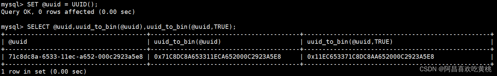

**通过函数uuid_to_bin(@uuid,true)将UUID转化为有序UUID了。全局唯一 + 单调递增，这不就是我们想要的主键！**

`有序UUID性能测试`
16字节的有序UUID，相比之前8字节的自增ID，性能和存储空间对比究竟如何呢？
我们来做一个测试，插入1亿条数据，每条数据占用500字节，含有3个二级索引，最终的结果如下所示：
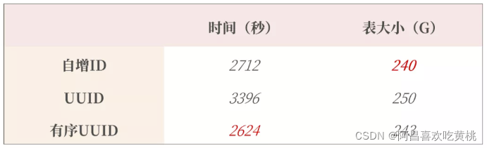从上图可以看到插入1亿条数据有序UUID是最快的，而且在实际业务使用中有序UUID在 业务端就可以生成 。
还可以进一步减少SQL的交互次数。另外，虽然有序UUID相比自增ID多了8个字节，但实际只增大了3G的存储空间，还可以接受

> 在当今的互联网环境中，非常不推荐自增ID作为主键的数据库设计。更推荐类似有序UUID的全局唯一的实现。
> 另外在真实的业务系统中，主键还可以加入业务和系统属性，如用户的尾号，机房的信息等。这样的主键设计就更为考验架构师的水平了。


**如果不是MySQL8.0 肿么办？**

手动赋值字段做主键！

比如，设计各个分店的会员表的主键，因为如果每台机器各自产生的数据需要合并，就可能会出现主键重复的问题。

可以在总部 MySQL 数据库中，有一个管理信息表，在这个表中添加一个字段，专门用来记录当前会员编号的最大值。

门店在添加会员的时候，先到总部 MySQL 数据库中获取这个最大值，在这个基础上加 1，然后用这个值作为新会员的“id”，同时，更新总部 MySQL 数据库管理信息表中的当 前会员编号的最大值。

这样一来，各个门店添加会员的时候，都对同一个总部 MySQL 数据库中的数据表字段进 行操作，就解决了各门店添加会员时会员编号冲突的问题。