# 数据库的设计规范

## 一、为什么需要数据库设计


------

## 二、范式

### 1、范式简介

在`关系型数据库`中，关于数据表设计的`基本原则、规则`就称为`范式`。可以理解为，一张数据表的设计结构需要满足的某种设计标准的`级别` 。要想设计一个结构合理的关系型数据库，必须满足一定的范式。

### 2、范式都包括哪些


目前关系型数据库有六种常见范式，按照范式级别，从低到高分别是：

- `第一范式（1NF）`
- `第二范式（2NF）`
- `第三范式（3NF）`
- `巴斯-科德范式（BCNF）`
- `第四范式(4NF）`
- `第五范式（5NF，又称完美范式）`
  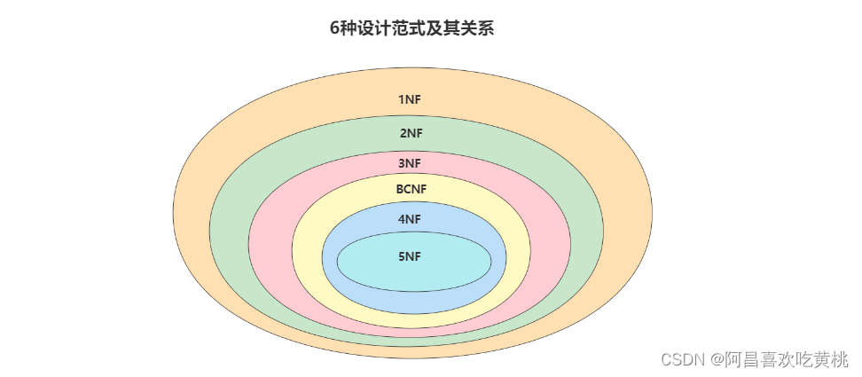

### 3、键和相关属性的概念


**举例**：*这里有两个表*

`球员表(player)` ：球员编号 | 姓名 | 身份证号 | 年龄 | 球队编号
`球队表(team)` ：球队编号 | 主教练 | 球队所在地

- `超键` ：对于球员表来说，超键就是包括球员编号或者身份证号的任意组合，比如（球员编号）（球员编号，姓名）（身份证号，年龄）等。
- `候选键` ：就是最小的超键，对于球员表来说，候选键就是（球员编号）或者（身份证号）。
- `主键` ：我们自己选定，也就是从候选键中选择一个，比如（球员编号）。
- `外键` ：球员表中的球队编号。
- `主属性 、 非主属性` ：在球员表中，主属性是（球员编号）（身份证号），其他的属性（姓名）（年龄）（球队编号）都是非主属性。

### 4、第一范式(1st NF)

**第一范式**主要是确保数据表中每个字段的值必须具有`原子性`，也就是说数据表中每个字段的值为`不可再次拆分`的最小数据单元。
我们在设计某个字段的时候，对于字段X来说，不能把字段x拆分成字段X-1和字段X-2。事实上，任何的DBMS都会满足第一范式的要求，不会将字段进行拆分。

**举例1**：

*假设一家公司要存储员工的姓名和联系方式。它创建一个如下表*：
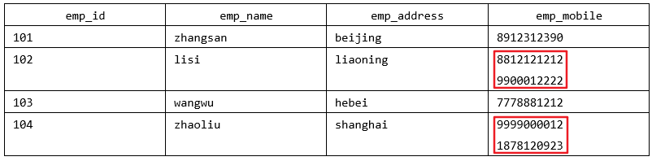
该表不符合 1NF ，因为规则说“表的每个属性必须具有原子（单个）值”，lisi和zhaoliu员工的emp_mobile 值违反了该规则。为了使表符合 1NF ，我们应该有如下表数据：
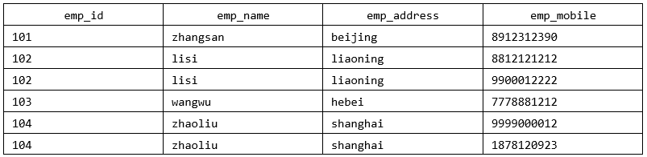
**举例2**：

user 表的设计不符合第一范式


其中，user_info字段为用户信息，可以进一步拆分成更小粒度的字段，不符合数据库设计对第一范式的要求。
将`user_info`拆分后如下：

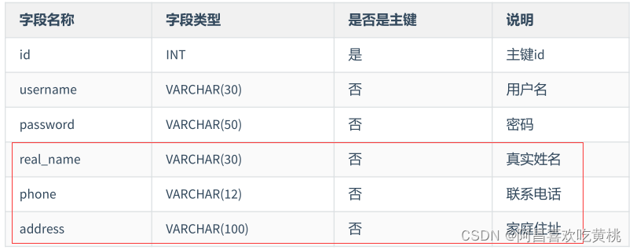
**举例3**：
属性的原子性是 `主观的` 。

例如，Employees关系中雇员姓名应当使用1个（fullname）、2个（firstname和lastname）还是3个（firstname、middlename和lastname）属性表示呢？答案取决于应用程序。

如果应用程序需要分别处理雇员的姓名部分（如：用于搜索目的），则有必要把它们分开。否则，不需要。
表1：

表2：


*地址被再细粒度拆分*

### 5、第二范式(2nd NF)

**第二范式**要求，*在满足第一范式的基础上*，还要**满足数据表里的每一条数据记录，都是可唯一标识的。而且所有非主键字段，都必须完全依赖主键，不能只依赖主键的一部分**。如果知道主键的所有属性的值，就可以检索到任何元组（行）的任何属性的任何值。（要求中的主键，其实可以拓展替换为候选键）。
**举例1**：

`成绩表` （学号，课程号，成绩）关系中，（学号，课程号）可以决定成绩，但是学号不能决定成绩，课程号也不能决定成绩，所以“（学号，课程号）→成绩”就是 `完全依赖关系` 。

**举例2**：

比赛表 player_game ，里面包含球员编号、姓名、年龄、比赛编号、比赛时间和比赛场地等属性，这里候选键和主键都为（球员编号，比赛编号），我们可以通过候选键（或主键）来决定如下的关系：

```
(球员编号, 比赛编号) → (姓名, 年龄, 比赛时间, 比赛场地，得分)
说明： 姓名和年龄只依赖于主键(球员编号, 比赛编号) 中的部分【球员编号】，违反第二范式的完全依赖主键，不能只依赖于主键的部分
```

但是这个数据表不满足第二范式，因为数据表中的字段之间还存在着如下的对应关系：

```
(球员编号) → (姓名，年龄)   
(比赛编号) → (比赛时间, 比赛场地)
```

对于非主属性来说，并非完全依赖候选键。这样会产生怎样的问题呢？

1. `数据冗余` ：如果一个球员可以参加 m 场比赛，那么球员的姓名和年龄就重复了 m-1 次。一个比赛也可能会有 n 个球员参加，比赛的时间和地点就重复了 n-1 次。
2. `插入异常` ：如果我们想要添加一场新的比赛，但是这时还没有确定参加的球员都有谁，那么就没法插入。
3. `删除异常` ：如果我要删除某个球员编号，如果没有单独保存比赛表的话，就会同时把比赛信息删除掉。
4. `更新异常` ：如果我们调整了某个比赛的时间，那么数据表中所有这个比赛的时间都需要进行调整，否则就会出现一场比赛时间不同的情况。

为了避免出现上述的情况，我们可以把球员比赛表设计为下面的三张表。


这样的话，每张数据表都符合第二范式，也就避免了异常情况的发生。

> `1NF` 告诉我们字段属性需要是`原子性`的，而 `2NF` 告诉我们一张表就是一个`独立的对象`，一张表只表达一个意思。

**举例3**：
定义了一个名为 Orders 的关系，表示订单和订单行的信息：
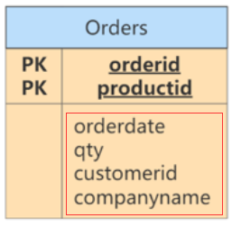

违反了第二范式，因为有非主键属性仅依赖于候选键（或主键）的一部分。例如，可以仅通过orderid找到订单的 orderdate，以及 customerid 和 companyname，而没有必要再去使用productid。

修改：
Orders表和OrderDetails表如下，此时符合第二范式。
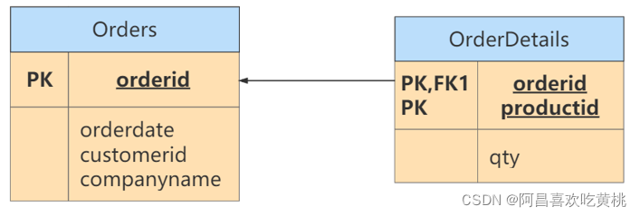


### 6、第三范式(3rd NF)

第三范式是在第二范式的基础上，确保数据表中的每一个非主键字段都和主键字段直接相关，也就是说**，要求数据表中的所有非主键字段不能依赖于其他非主键字段**。（即，`不能存在非主属性A依赖于非主属性B，非主属性B依赖于主键C的情况，即存在“A→B→C”的决定关系`）通俗地讲，该规则的意思是**所有非主键属性之间不能有依赖关系，必须相互独立**。
这里的主键可以拓展为候选键。


非主键字段，相互之间不能存在间接依赖

**举例1**：

`部门信息表` ：每个部门有部门编号（dept_id）、部门名称、部门简介等信息。
`员工信息表` ：每个员工有员工编号、姓名、部门编号。列出部门编号后就不能再将部门名称、部门简介等与部门有关的信息再加入员工信息表中。如果不存在部门信息表，则根据第三范式（3NF）也应该构建它，否则就会有大量的数据冗余。

**举例2**：

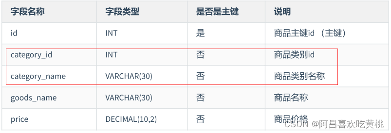

商品类别名称依赖于商品类别编号，不符合第三范式。
修改：
表1：符合第三范式的 `商品类别表` 的设计


表2：符合第三范式的 `商品表` 的设计

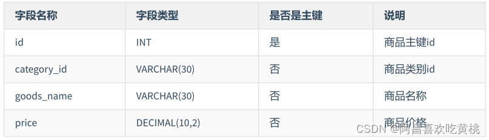
商品表goods通过商品类别id字段（category_id）与商品类别表goods_category进行关联。

**举例3**：
`球员player表` ：球员编号、姓名、球队名称和球队主教练。现在，我们把属性之间的依赖关系画出来，如下图所示：

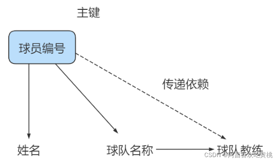
你能看到球员编号决定了球队名称，同时球队名称决定了球队主教练，非主属性球队主教练就会传递依赖于球员编号，因此不符合 3NF 的要求。

如果要达到 3NF 的要求，需要把数据表拆成下面这样：


**举例4**：

修改第二范式中的举例3。
此时的Orders关系包含 orderid、orderdate、customerid 和 companyname 属性，主键定义为 orderid。

customerid 和companyname均依赖于主键——orderid。例如，你需要通过orderid主键来查找代表订单中客户的customerid，同样，你需要通过 orderid 主键查找订单中客户的公司名称（companyname）。然而， customerid和companyname也是互相依靠的。为满足第三范式，可以改写如下：

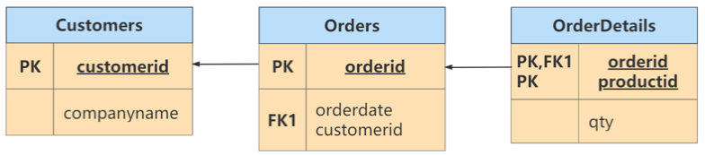

> 符合3NF后的数据模型通俗地讲，2NF和3NF通常以这句话概括：“每个非键属性依赖于键，依赖于整个键，并且除了键别无他物”。

### 7 小节

关于数据表的设计，有三个范式要遵循。

+ （1）第一范式（1NF），确保每列保持`原子性`
  数据库的每一列都是不可分割的原子数据项，不可再分的最小数据单元，而不能是集合、数组、记录等非原子数据项。
+ （2）第二范式（2NF），确保每列都`和主键完全依赖`
  尤其在复合主键的情况下，`非主键部分不应该依赖于部分主键`。
+ （3）第三范式（3NF）确保`每列都和主键列直接相关`，而不是间接相关

**范式的优点**：数据的标准化有助于消除数据库中的`数据冗余`，第三范式（3NF）通常被认为在性能、扩展性和数据完整性方面达到了最好的平衡。

**范式的缺点**：范式的使用，可能`降低查询的效率`。因为范式等级越高，设计出来的数据表就越多、越精细，数据的冗余度就越低，进行数据查询的时候就可能需要关联多张表，这不但代价昂贵，也可能使一些`索引策略无效`。


范式只是提出了设计的标准，实际上设计数据表时，未必一定要符合这些标准。开发中，我们会出现为了性能和读取效率违反范式化的原则，通过`增加少量的沉余或重复的数据来提高数据库的读性能，减少关联查询`，join表的次数，实现`空间换取时间`的目的。因此在实际的设计过程中要理论结合实际，灵活运用。


> 范式本身没有优劣之分，只有适用场景不同。没有完美的设计，只有合适的设计，我们在数据表的设计中，还需要根据需求将范式和反范式混合使用。

------

## 三、反范式化

根据业务，适当的冗余存储字段，减少多表查询的压力

### 1、概述


**规范化 vs 性能**

> 1. 为满足某种商业目标 , `数据库性能比规范化数据库更重要`
> 2. 在数据规范化的同时 , 要综合考虑`数据库的性能`
> 3. 通过在给定的表中添加额外的字段，以大量`减少需要从中搜索信息所需的时间`
> 4. 通过在给定的表中插入计算列，以`方便查询`

### 2、应用举例

**举例1**：

员工的信息存储在`employees 表` 中，部门信息存储在`departments 表` 中。通过 employees 表中的
department_id字段与 departments 表建立关联关系。如果要查询一个员工所在部门的名称：

```sql
select employee_id,department_name
from employees e join departments d
on e.department_id = d.department_id;
```

如果经常需要进行这个操作，连接查询就会浪费很多时间。可以在 employees 表中增加一个冗余字段department_name，这样就不用每次都进行连接操作了。【违反第三范式】

**举例2**：

反范式化的 goods商品信息表 设计如下：
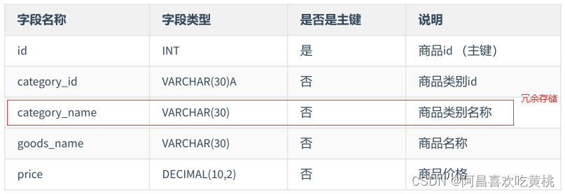

**举例3**：

有 2 个表，分别是 `商品流水表（atguigu.trans ）和 商品信息表（atguigu.goodsinfo）` 。
商品流水表里有 400 万条流水记录，商品信息表里有 2000 条商品记录。

商品流水表：

商品信息表：

新的商品流水表如下所示：

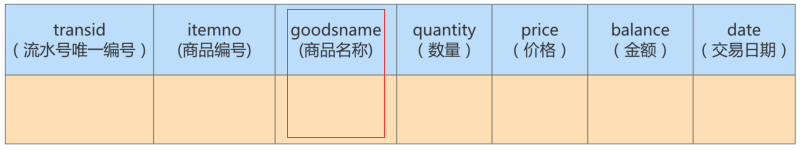

**举例4**：

`课程评论表 class_comment`，对应的字段名称及含义如下：

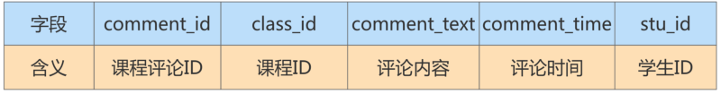
`学生表 student` ，对应的字段名称及含义如下：


在实际应用中，我们在显示课程评论的时候，通常会显示这个学生的昵称，而不是学生 ID，因此当我们想要查询某个课程的前 1000 条评论时，需要关联 class_comment 和 student这两张表来进行查询。

**实验数据：模拟两张百万量级的数据表**

```mysql
#反范式化的举例：

CREATE DATABASE atguigudb3;

USE atguigudb3;

#学生表
CREATE TABLE student(
stu_id INT PRIMARY KEY AUTO_INCREMENT,
stu_name VARCHAR(25),
create_time DATETIME
);

#课程评论表
CREATE TABLE class_comment(
comment_id INT PRIMARY KEY AUTO_INCREMENT,
class_id INT,
comment_text VARCHAR(35),
comment_time DATETIME,
stu_id INT
);

###创建向学生表中添加数据的存储过程
DELIMITER //

CREATE PROCEDURE batch_insert_student(IN START INT(10), IN max_num INT(10))
BEGIN
DECLARE i INT DEFAULT 0;
DECLARE date_start DATETIME DEFAULT ('2017-01-01 00:00:00');
DECLARE date_temp DATETIME;
SET date_temp = date_start;
SET autocommit=0;
REPEAT
SET i=i+1;
SET date_temp = DATE_ADD(date_temp, INTERVAL RAND()*60 SECOND);
INSERT INTO student(stu_id, stu_name, create_time)
VALUES((START+i), CONCAT('stu_',i), date_temp);
UNTIL i = max_num
END REPEAT;
COMMIT;
END //

DELIMITER ;

#调用存储过程，学生id从10001开始，添加1000000数据
CALL batch_insert_student(10000,1000000);

####创建向课程评论表中添加数据的存储过程
DELIMITER //

CREATE PROCEDURE batch_insert_class_comments(IN START INT(10), IN max_num INT(10))
BEGIN
DECLARE i INT DEFAULT 0;
DECLARE date_start DATETIME DEFAULT ('2018-01-01 00:00:00');
DECLARE date_temp DATETIME;
DECLARE comment_text VARCHAR(25);
DECLARE stu_id INT;
SET date_temp = date_start;
SET autocommit=0;
REPEAT
SET i=i+1;
SET date_temp = DATE_ADD(date_temp, INTERVAL RAND()*60 SECOND);
SET comment_text = SUBSTR(MD5(RAND()),1, 20);
SET stu_id = FLOOR(RAND()*1000000);
INSERT INTO class_comment(comment_id, class_id, comment_text, comment_time, stu_id)
VALUES((START+i), 10001, comment_text, date_temp, stu_id);
UNTIL i = max_num
END REPEAT;
COMMIT;
END //

DELIMITER ;

#添加数据的存储过程的调用，一共1000000条记录
CALL batch_insert_class_comments(10000,1000000);

#########
SELECT COUNT(*) FROM student;

SELECT COUNT(*) FROM class_comment;

###需求######
SELECT p.comment_text, p.comment_time, stu.stu_name 
FROM class_comment AS p LEFT JOIN student AS stu 
ON p.stu_id = stu.stu_id 
WHERE p.class_id = 10001 
ORDER BY p.comment_id DESC 
LIMIT 10000;


#####进行反范式化的设计######
#表的复制
CREATE TABLE class_comment1
AS
SELECT * FROM class_comment;

#添加主键，保证class_comment1 与class_comment的结构相同
ALTER TABLE class_comment1
ADD PRIMARY KEY (comment_id);

SHOW INDEX FROM class_comment1;

#向课程评论表中增加stu_name字段
ALTER TABLE class_comment1
ADD stu_name VARCHAR(25);

#给新添加的字段赋值
UPDATE class_comment1 c
SET stu_name = (
SELECT stu_name
FROM student s
WHERE c.stu_id = s.stu_id
);

#查询同样的需求
SELECT comment_text, comment_time, stu_name 
FROM class_comment1 
WHERE class_id = 10001 
ORDER BY comment_id DESC 
LIMIT 10000;
```

为了更好地进行 SQL 优化实验，我们需要给学生表和课程评论表随机模拟出百万量级的数据。
我们可以通过存储过程来实现模拟数据。

**反范式优化实验对比**

如果我们想要查询课程 ID 为 10001 的前 1000 条评论，需要写成下面这样：

```sql
SELECT p.comment_text, p.comment_time, stu.stu_name
FROM class_comment AS p LEFT JOIN student AS stu
ON p.stu_id = stu.stu_id
WHERE p.class_id = 10001
ORDER BY p.comment_id DESC
LIMIT 1000;
```

运行结果（1000 条数据行）：

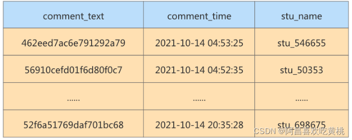
运行时长为`0.395` 秒，对于网站的响应来说，这已经很慢了，用户体验会非常差。

如果我们想要提升查询的效率，可以允许适当的数据冗余，也就是在商品评论表中增加用户昵称字段，在 class_comment 数据表的基础上增加 stu_name 字段，就得到了 class_comment2 数据表。

这样一来，只需单表查询就可以得到数据集结果：

```sql
SELECT comment_text, comment_time, stu_name
FROM class_comment2
WHERE class_id = 10001
ORDER BY class_id DESC LIMIT 1000;
```

运行结果（1000 条数据）：

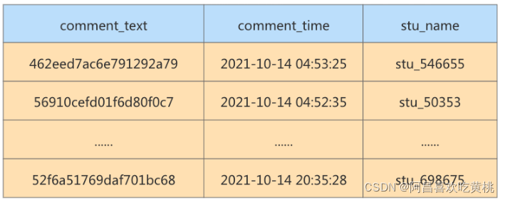
优化之后只需要扫描一次聚集索引即可，运行时间为 `0.039` 秒，查询时间是之前的 1/10。
你能看到，在数据量大的情况下，`查询效率会有显著的提升`。

### 3、反范式的新问题

反范式可以通过空间换时间，提升查询的效率，但是反范式也会带来一些新问题：

- 存储 `空间变大` 了
- 一个表中字段做了修改，另一个表中冗余的字段也需要做同步修改，否则 `数据不一致`
- 若采用存储过程来支持数据的更新、删除等额外操作，如果更新频繁，会非常 `消耗系统资源`
- 在 `数据量小` 的情况下，反范式不能体现性能的优势，可能还会让数据库的设计更加 复杂

### 4、反范式的适用场景

当冗余信息有价值或者能 `大幅度提高查询效率` 的时候，我们才会采取反范式的优化。

- **增加冗余字段的建议**

  

- **历史快照、历史数据的需要**
  在现实生活中，我们经常需要一些冗余信息，比如订单中的收货人信息，包括姓名、电话和地址等。每次发生的 `订单收货信息` 都属于 `历史快照` ，需要进行保存，但用户可以随时修改自己的信息，这时保存这些冗余信息是非常有必要的。

反范式优化也常用在 `数据仓库` 的设计中，因为数据仓库通常 `存储历史数据` ，对增删改的实时性要求不强，对历史数据的分析需求强。这时适当允许数据的冗余度，更方便进行数据分析。


------

## 四、BCNF(巴斯范式)


### 1、案例

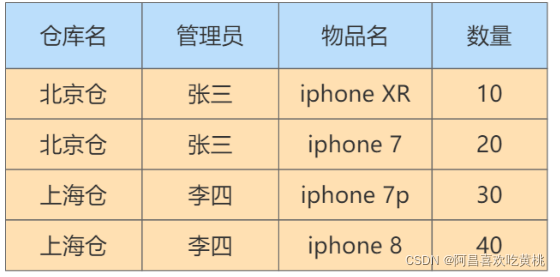
在这个表中，一个仓库只有一个管理员，同时一个管理员也只管理一个仓库。我们先来梳理下这些属性之间的依赖关系。

仓库名决定了管理员，管理员也决定了仓库名，同时（仓库名，物品名）的属性集合可以决定数量这个属性。这样，我们就可以找到数据表的候选键。

- `候选键`：是`（管理员，物品名）`和`（仓库名，物品名）`，然后我们从候选键中选择一个作为 主键 ，比如（仓库名，物品名）。
- `主属性` ：包含在任一候选键中的属性，也就是`仓库名`，`管理员`和`物品名`。
- `非主属性` ：`数量`这个属性。

### 2、是否符合三范式

如何判断一张表的范式呢？我们需要根据范式的等级，从低到高来进行判断。

- 首先，数据表每个属性都是`原子性`的，符合`1NF` 的要求；
- 其次，数据表中`非主属性【数量】都与候选键全部依赖`，`（仓库名，物品名）`决定数量，`（管理员，物品名）`决定数量。因此，数据表符合`` 2NF` 的要求；
- 最后，数据表中的非主属性，`不传递依赖于【即直接依赖】候选键`。因此符合`3NF`的要求。

### 3、存在的问题

既然数据表已经符合了 3NF 的要求，是不是就不存在问题了呢？我们来看下面的情况：

1. 增加一个仓库，但是还没有存放任何物品。根据数据表实体完整性的要求，主键不能有空值，因此会出现 `插入异常` ；
2. 如果仓库更换了管理员，我们就可能会 `修改数据表中的多条记录` ；
3. 如果仓库里的商品都卖空了，那么此时仓库名称和相应的管理员名称也会随之被删除。

你能看到，即便数据表符合 3NF 的要求，同样可能存在插入，更新和删除数据的异常情况。

### 4、问题解决

首先我们需要确认造成异常的原因：
主属性仓库名对于候选键（管理员，物品名）是部分依赖的关系，这样就有可能导致上面的异常情况。
因此引入BCNF，它**在 3NF 的基础上消除了主属性对候选键的部分依赖或者传递依赖关系**。

- 如果在关系R中，U为主键，A属性是主键的一个属性，若存在A->Y，Y为主属性，则该关系不属于BCNF。

根据 BCNF 的要求，我们需要把仓库管理关系 warehouse_keeper 表拆分成下面这样：
`仓库表` ：（仓库名，管理员）
`库存表` ：（仓库名，物品名，数量）
这样就不存在主属性对于候选键的部分依赖或传递依赖，上面数据表的设计就符合 BCNF。

------

**再举例**：

有一个`学生导师表` ，其中包含字段：学生ID，专业，导师，专业GPA，这其中`学生ID和专业是联合主键`。
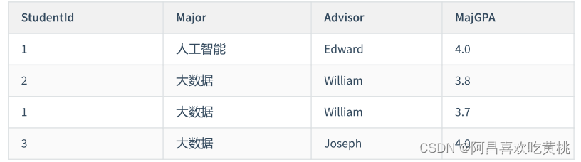
这个表的设计满足三范式，但是这里存在另一个依赖关系，“专业”依赖于“导师”，也就是说每个导师只做一个专业方面的导师，只要知道了是哪个导师，我们自然就知道是哪个专业的了。

所以这个表的部分主键Major依赖于非主键属性Advisor，那么我们可以进行以下的调整，拆分成2个表：

**学生导师表**：
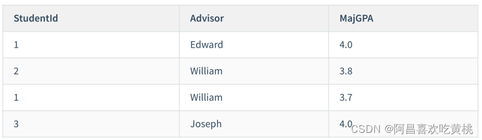

**导师表**：


------

## 五、第四范式

多值依赖的概念：

+ `多值依赖`即属性之间的一对多关系，记为K→→A。
+ `函数依赖`事实上是单值依赖，所以不能表达属性值之间的一对多关系。
+ `平凡的多值依赖`：全集U=K+A，一个K可以对应于多个A，即K→A。此时整个表就是一组一对多关系。
+ `非平凡的多值依赖`：全集U=K+A+B，一个K可以对应于多个A，也可以对应于多个B，A与B互相独立，即K→→A，K→→B。整个表有多组一对多关系，且有：“一”部分是相同的属性集合，“多”部分是互相独立的属性集合。

第四范式即在满足巴斯-科德范式（BCNF）的基础上，消除非平凡且非函数依赖的多值依赖（即把同一表内的多对多关系删除）


**举例1**：
职工表(职工编号，职工孩子姓名，职工选修课程)。

在这个表中，同一个职工可能会有多个职工孩子姓名。
同样，同一个职工也可能会有多个职工选修课程，即这里存在着多值事实，不符合第四范式。

如果要符合第四范式，只需要将上表分为两个表，使它们只有一个多值事实，例如： `职工表一`(职工编
号，职工孩子姓名)， `职工表二` (职工编号，职工选修课程)，两个表都只有一个多值事实，所以符合第四
范式。

------

**举例2**：

比如我们建立课程、教师、教材的模型。我们规定，每门课程有对应的一组教师，每门课程也有对应的一组教材，一门课程使用的教材和教师没有关系。
我们建立的关系表如下：
课程ID，教师ID，教材ID；这三列作为联合主键。

为了表述方便，我们用Name代替ID，这样更容易看懂：

这个表除了主键，就没有其他字段了，所以肯定满足BC范式，但是却存在 `多值依赖` 导致的异常。

假如我们下学期想采用一本新的英版高数教材，但是还没确定具体哪个老师来教，那么我们就无法在这
个表中维护Course高数和Book英版高数教材的的关系。

解决办法是我们把这个多值依赖的表拆解成2个表，分别建立关系。这是我们拆分后的表：

以及


------

## 六、第五范式、域键范式

除了第四范式外，我们还有更高级的第五范式（又称完美范式）和域键范式（DKNF）。

在满足第四范式（4NF）的基础上，消除不是由候选键所蕴含的连接依赖。`如果关系模式R中的每一个连接依赖均由R的候选键所隐含`，则称此关系模式符合第五范式。

函数依赖是多值依赖的一种特殊的情况，而多值依赖实际上是连接依赖的一种特殊情况。但连接依赖不像函数依赖和多值依赖可以由 `语义直接导出` ，而是在 `关系连接运算` 时才反映出来。存在连接依赖的关系模式仍可能遇到数据冗余及插入、修改、删除异常等问题。

第五范式处理的是 `无损连接问题` ，这个范式基本 `没有实际意义` ，因为无损连接很少出现，而且难以察觉。

而域键范式试图定义一个 `终极范式` ，该范式考虑所有的依赖和约束类型，但是实用价值也是最小的，只存在理论研究中。

------

实操案例

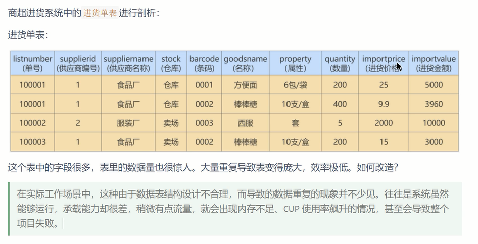

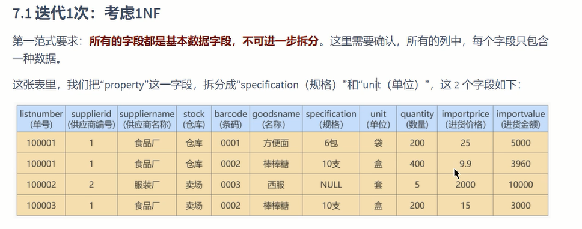


二范式：**满足数据表里的每一条数据记录，都是可唯一标识的。而且所有非主键字段，都必须完全依赖主键，不能只依赖主键的一部分**

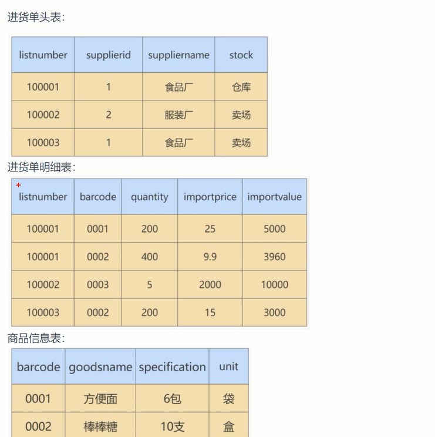

三范式：非主键字段之间不能相互依赖


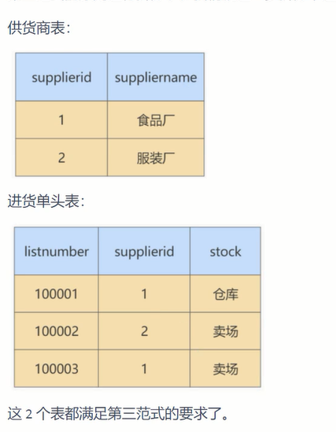

**最终结果：**

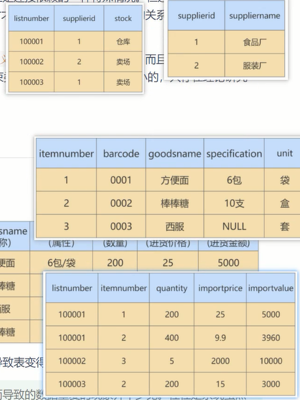


## 七、ER模型


ER 模型中有三个要素，分别是`实体`、`属性`和`关系`。

- `实体` ，可以看做是数据对象，往往对应于现实生活中的真实存在的个体。在 ER 模型中，用 `矩形` 来表示。实体分为两类，分别是 `强实体`和 `弱实体`。强实体是指不依赖于其他实体的实体；弱实体是指对另一个实体有很强的依赖关系的实体。
- `属性` ，则是指实体的特性。比如超市的地址、联系电话、员工数等。在 ER 模型中用 `椭圆形` 来表示。
- `关系` ，则是指实体之间的联系。比如超市把商品卖给顾客，就是一种超市与顾客之间的联系。在 ER 模型中用 `菱形` 来表示。

**注意**：实体和属性不容易区分。这里提供一个原则：我们要从系统整体的角度出发去看，`可以独立存在的是实体，不可再分的是属性`。也就是说，属性不能包含其他属性。

### 1、关系的类型

在 ER 模型的 3 个要素中，关系又可以分为 3 种类型，分别是`一对一`、`一对多`、`多对多`。

- `一对一` ：指实体之间的关系是一一对应的，比如个人与身份证信息之间的关系就是一对一的关系。一个人只能有一个身份证信息，一个身份证信息也只属于一个人。
- `一对多` ：指一边的实体通过关系，可以对应多个另外一边的实体。相反，另外一边的实体通过这个关
  系，则只能对应唯一的一边的实体。比如说，我们新建一个班级表，而每个班级都有多个学生，每个学
  生则对应一个班级，班级对学生就是一对多的关系。
- `多对多` ：指关系两边的实体都可以通过关系对应多个对方的实体。比如在进货模块中，供货商与超市之间的关系就是多对多的关系，一个供货商可以给多个超市供货，一个超市也可以从多个供货商那里采购商品。再比如一个选课表，有许多科目，每个科目有很多学生选，而每个学生又可以选择多个科目，这就是多对多的关系。

### 2、建模分析

ER 模型看起来比较麻烦，但是对我们把控项目整体非常重要。如果你只是开发一个小应用，或许简单设计几个表够用了，一旦要设计有一定规模的应用，在项目的初始阶段，建立完整的 ER 模型就非常关键
了。
开发应用项目的实质，其实就是 `建模` 。

我们设计的案例是 `电商业务` ，由于电商业务太过庞大且复杂，所以我们做了业务简化，比如针对SKU（StockKeepingUnit，库存量单位）和SPU（Standard Product Unit，标准化产品单元）的含义上，我们直接使用了SKU，并没有提及SPU的概念。本次电商业务设计总共有8个实体，如下所示。

- 地址实体
- 用户实体
- 购物车实体
- 评论实体
- 商品实体
- 商品分类实体
- 订单实体
- 订单详情实体

其中， `用户` 和 `商品分类` 是强实体，因为它们不需要依赖其他任何实体。而其他属于弱实体，因为它们虽然都可以独立存在，但是它们都依赖用户这个实体，因此都是弱实体。知道了这些要素，我们就可以
给电商业务创建 ER 模型了，如图：
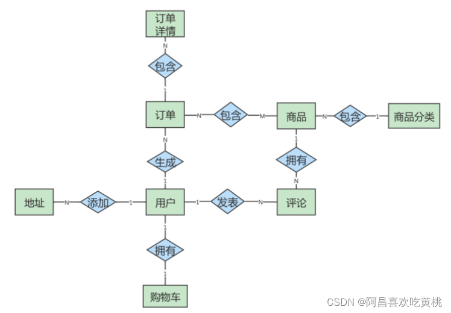
在这个图中，地址和用户之间的添加关系，是一对多的关系，而商品和商品详情示一对1的关系，商品和
订单是多对多的关系。 这个 ER 模型，包括了 8个实体之间的 8种关系。

> （1）用户可以在电商平台添加多个地址；
> （2）用户只能拥有一个购物车；
> （3）用户可以生成多个订单；
> （4）用户可以发表多条评论；
> （5）一件商品可以有多条评论；
> （6）每一个商品分类包含多种商品；
> （7）一个订单可以包含多个商品，一个商品可以在多个订单里。
> （8）订单中又包含多个订单详情，因为一个订单中可能包含不同种类的商品

### 3、ER 模型的细化

有了这个 ER 模型，我们就可以从整体上 `理解` 电商的业务了。刚刚的 ER 模型展示了电商业务的框架，但是只包括了订单，地址，用户，购物车，评论，商品，商品分类和订单详情这八个实体，以及它们之间的关系，还不能对应到具体的表，以及表与表之间的关联。我们需要把 `属性加上` ，用 `椭圆` 来表示，这样我们得到的 ER 模型就更加完整了。

因此，我们需要进一步去设计一下这个 ER 模型的各个局部，也就是细化下电商的具体业务流程，然后把它们综合到一起，形成一个完整的 ER 模型。这样可以帮助我们理清数据库的设计思路。
接下来，我们再分析一下各个实体都有哪些属性，如下所示。

> （1） `地址实体` 包括用户编号、省、市、地区、收件人、联系电话、是否是默认地址。
> （2） `用户实体` 包括用户编号、用户名称、昵称、用户密码、手机号、邮箱、头像、用户级别。
> （3） `购物车实体` 包括购物车编号、用户编号、商品编号、商品数量、图片文件url。
> （4） `订单实体` 包括订单编号、收货人、收件人电话、总金额、用户编号、付款方式、送货地址、下单时间。
> （5） `订单详情实体` 包括订单详情编号、订单编号、商品名称、商品编号、商品数量。
> （6） `商品实体` 包括商品编号、价格、商品名称、分类编号、是否销售，规格、颜色。
> （7） `评论实体` 包括评论id、评论内容、评论时间、用户编号、商品编号
> （8） `商品分类实体` 包括类别编号、类别名称、父类别编号

这样细分之后，我们就可以重新设计电商业务了，ER 模型如图：
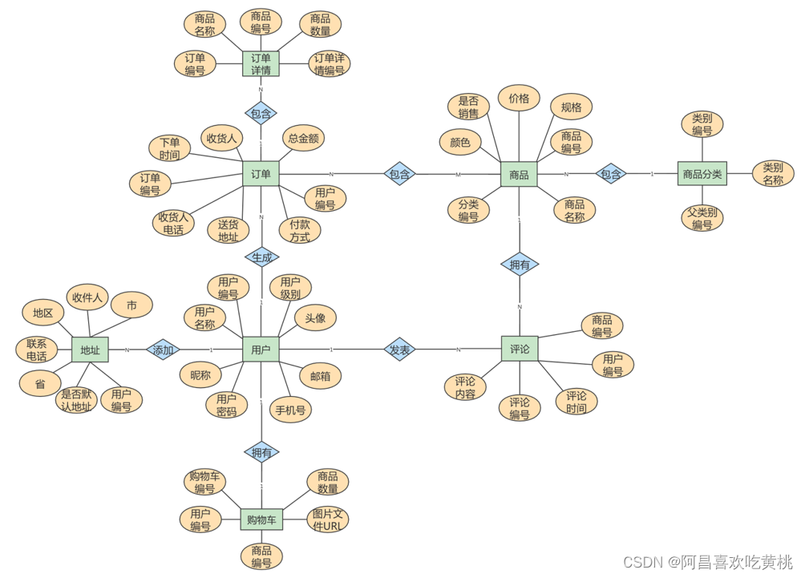

### 4、ER 模型图转换成数据表


其实，任何一个基于数据库的应用项目，都可以通过这种 `先建立 ER 模型` ，再 `转换成数据表` 的方式，
完成数据库的设计工作。创建 ER 模型不是目的，目的是把业务逻辑梳理清楚，设计出优秀的数据库。我建议你不是为了建模而建模，要利用创建 ER 模型的过程来整理思路，这样创建 ER 模型才有意义。

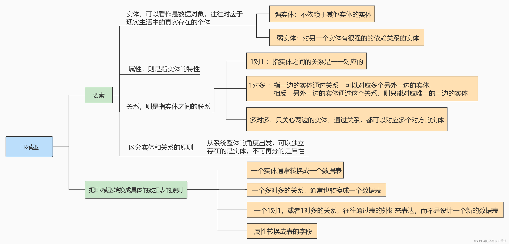

------

## 八、数据表的设计原则

综合以上内容，总结出数据表设计的一般原则：“三少一多”

1. **数据表的个数越少越好**

   

2. **数据表中的字段个数越少越好**

   

3. **数据表中联合主键的字段个数越少越好**

   

4. **使用主键和外键越多越好**

   

> **注意**：这个原则并不是绝对的，有时候我们需要牺牲数据的冗余度来换取数据处理的效率。

------

## 九、数据库对象编写建议

### 1、 关于库

1. 【强制】库的名称必须控制在32个字符以内，只能使用英文字母、数字和下划线，建议以英文字母开头。
2. 【强制】库名中英文 `一律小写` ，不同单词采用 `下划线`分割。须见名知意。
3. 【强制】库的名称格式：业务系统名称_子系统名。
4. 【强制】库名禁止使用关键字（如type,order等）。
5. 【强制】创建数据库时必须 `显式指定字符集` ，并且字符集只能是utf8或者utf8mb4。创建数据库SQL举例：CREATE DATABASE crm_fund `DEFAULT CHARACTER SET 'utf8'` ;
6. 【建议】对于程序连接数据库账号，遵循 `权限最小原则`使用数据库账号只能在一个DB下使用，不准跨库。程序使用的账号`原则上不准有drop权限` 。
7. 【建议】临时库以`tmp_` 为前缀，并以日期为后缀；备份库以 `bak_` 为前缀，并以日期为后缀。

### 2、关于表、列

1. 【强制】表和列的名称必须控制在32个字符以内，表名只能使用英文字母、数字和下划线，建议以 `英文字母开头` 。
2. 【强制】 `表名、列名一律小写` ，不同单词采用下划线分割。须`见名知意`。
3. 【强制】表名要求有模块名强相关，同一模块的表名尽量使用 `统一前缀`。比如：crm_fund_item
4. 【强制】创建表时必须 `显式指定字符集` 为utf8或utf8mb4。
5. 【强制】表名、列名`禁止使用关键字`（如type,order等）。
6. 【强制】创建表时必须 `显式指定表存储引擎` 类型。如无特殊需求，一律为InnoDB。
7. 【强制】建表必须有comment。
8. 【强制】字段命名应尽可能使用表达实际含义的英文单词或 `缩写` 。如：公司 ID，不要使用corporation_id, 而用corp_id 即可。
9. 【强制】布尔值类型的字段命名为`is_描述` 。如member表上表示是否为enabled的会员的字段命
   名为 is_enabled。
10. 【强制】`禁止在数据库中存储图片、文件等大的二进制数据通常文件很大`，短时间内造成数据量快速增长，数据库进行数据库读取时，通常会进行大量的随机IO操作，文件很大时，IO操作很耗时。通常存储于文件服务器，数据库只存储文件地址信息。
11. 【建议】建表时关于主键： `表必须有主键`
    (1)强制要求主键为id，类型为int或bigint，且为auto_increment 建议使用unsigned无符号型。
    (2)标识表里每一行主体的字段不要设为主键，建议设为其他字段如user_id，order_id等，并建立unique key索引。因为如果设为主键且主键值为随机插入，则会导致innodb内部页分裂和大量随机I/O，性能下降。
12. 【建议】核心表（如用户表）必须有行数据的 `创建时间字段` （create_time）和 `最后更新时间字段 （update_time）`，便于查问题。
13. 【建议】表中所有字段尽量都是 `NOT NULL` 属性，业务可以根据需要定义 `DEFAULT值` 。 因为使用NULL值会存在每一行都会占用额外存储空间、数据迁移容易出错、聚合函数计算结果偏差等问题。
14. 【建议】所有存储相同数据的`列名和列类型必须一致`（一般作为关联列，如果查询时关联列类型不一致会自动进行数据类型隐式转换，会造成列上的索引失效，导致查询效率降低）。
15. 【建议】中间表（或临时表）用于保留中间结果集，名称以`tmp_`开头。
    备份表用于备份或抓取源表快照，名称以 `bak_`开头。中间表和备份表定期清理。

**【示范】一个较为规范的建表语句**：

```sql
CREATE TABLE user_info (
	 `id` int unsigned NOT NULL AUTO_INCREMENT COMMENT '自增主键',
	 `user_id` bigint(11) NOT NULL COMMENT '用户id',
	 `username` varchar(45) NOT NULL COMMENT '真实姓名',
	 `email` varchar(30) NOT NULL COMMENT '用户邮箱',
	 `nickname` varchar(45) NOT NULL COMMENT '昵称',
	 `birthday` date NOT NULL COMMENT '生日',
	 `sex` tinyint(4) DEFAULT '0' COMMENT '性别',
	 `short_introduce` varchar(150) DEFAULT NULL COMMENT '一句话介绍自己，最多50个汉字',
	 `user_resume` varchar(300) NOT NULL COMMENT '用户提交的简历存放地址',
	 `user_register_ip` int NOT NULL COMMENT '用户注册时的源ip',
	 `create_time` timestamp NOT NULL DEFAULT CURRENT_TIMESTAMP COMMENT '创建时间',
	 `update_time` timestamp NOT NULL DEFAULT CURRENT_TIMESTAMP ON UPDATE
	CURRENT_TIMESTAMP COMMENT '修改时间',
	 `user_review_status` tinyint NOT NULL COMMENT '用户资料审核状态，1为通过，2为审核中，3为未通过，4为还未提交审核',
	PRIMARY KEY (`id`),
	 UNIQUE KEY `uniq_user_id` (`user_id`),
	 KEY `idx_username`(`username`),
	 KEY `idx_create_time_status`(`create_time`,`user_review_status`)
) ENGINE=InnoDB DEFAULT CHARSET=utf8 COMMENT='网站用户基本信息'
```

### 3、关于索引

1. 【强制】InnoDB表必须主键为id int/bigint auto_increment，且主键值`禁止被更新` 。
2. 【强制】InnoDB和MyISAM存储引擎表，索引类型必须为 `BTREE` 。
3. 【建议】主键的名称以`pk_` 开头，唯一键以 `uni_` 或`uk_`开头，普通索引以`idx_`开头，一律
   使用小写格式，以字段的名称或缩写作为后缀。
4. 【建议】多单词组成的columnname，取前几个单词首字母，加末单词组成column_name。如:
   sample 表 member_id 上的索引：idx_sample_mid。
5. 【建议】单个表上的索引个数 `不能超过6个` 。
6. 【建议】在建立索引时，多考虑建立 `联合索引` ，并把区分度最高的字段放在最前面。
7. 【建议】在多表 JOIN 的SQL里，保证`被驱动表的连接列上有索引`，这样JOIN 执行效率最高。
8. 【建议】建表或加索引时，保证表里互相不存在 `冗余索引` 。 比如：如果表里已经存在key(a,b)，则key(a)为冗余索引，需要删除。

### 4、SQL编写

1. 【强制】程序端SELECT语句必须指定具体字段名称，`禁止写成 *`。
2. 【建议】程序端insert语句指定具体字段名称，不要写成INSERT INTO t1 VALUES(…)。
3. 【建议】除静态表或小表（100行以内），DML语句必须有WHERE条件，且使用索引查找。
4. 【建议】INSERT INTO…VALUES(XX),(XX),(XX)… 这里XX的值不要超过5000个。 值过多虽然上线很快，但会引起主从同步延迟。
5. 【建议】SELECT语句不要使用UNION，推荐使用UNION ALL【不去重】，并且UNION子句个数限制在5个以内。
6. 【建议】线上环境，多表 JOIN 不要超过5个表。
7. 【建议】减少使用ORDER BY，和业务沟通能不排序就不排序，或将排序放到程序端去做。ORDER BY、GROUP BY、DISTINCT 这些语句较为耗费CPU，数据库的CPU资源是极其宝贵的。
8. 【建议】包含了ORDER BY、GROUP BY、DISTINCT 这些查询的语句，WHERE 条件过滤出来的结果集请保持在1000行以内，否则SQL会很慢。
9. 【建议】对单表的多次alter操作必须合并为一次
   对于超过100W行的大表进行alter table，必须经过DBA审核，并在业务低峰期执行，多个alter需整合在一起。 因为alter table会产生 `表锁` ，期间阻塞对于该表的所有写入，对于业务可能会产生极大影响。
10. 【建议】批量操作数据时，需要控制事务处理间隔时间，进行必要的sleep。
11. 【建议】事务里包含SQL不超过5个。
    因为过长的事务会导致锁数据较久，MySQL内部缓存、连接消耗过多等问题。
12. 【建议】事务里更新语句尽量基于主键或UNIQUE KEY，如UPDATE… WHERE id=XX;否则会产生间隙锁，内部扩大锁定范围，导致系统性能下降，产生死锁。