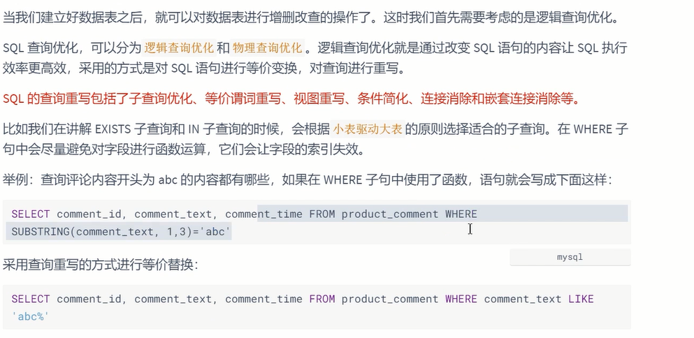
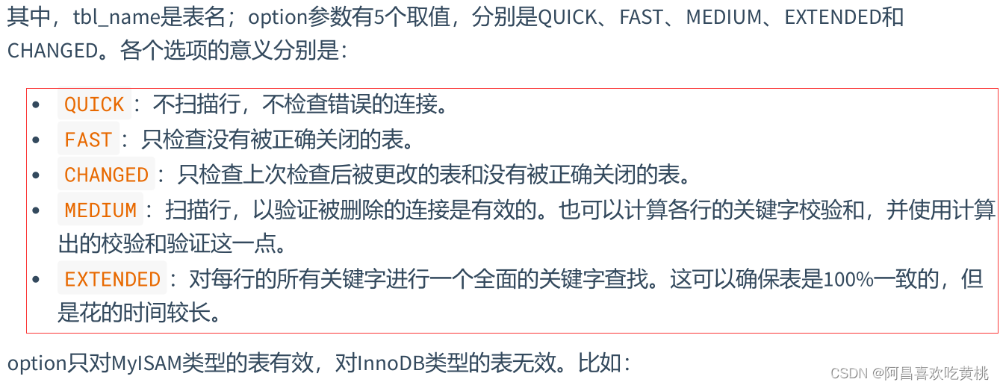
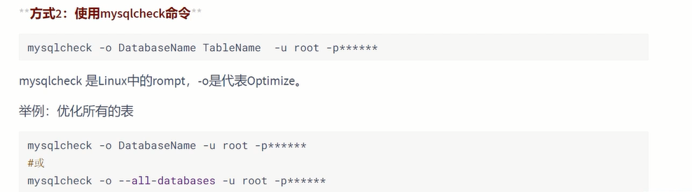

# 数据库其它调优策略

## 一、数据库调优的措施

### 1、调优的目标

- 尽可能 `节省系统资源` ，以便系统可以提供更大负荷的服务。（吞吐量更大）
- 合理的结构设计和参数调整，以提高用户操作 `响应的速度` 。（响应速度更快）
- 减少系统的瓶颈，提高`MySQL数据库整体的性能`。

### 2、如何定位调优问题

有如下几种方式：

- 用户的反馈（主要）
- 日志分析（主要）
- 服务器资源使用监控
- 数据库内部状况监控
- 其它

除了活动会话监控以外，我们也可以对 `事务` 、 `锁等待` 等进行监控，这些都可以帮助我们对数据库的运行状态有更全面的认识。

### 3、调优的维度和步骤

需要调优的对象是整个数据库管理系统，它不仅包括 SQL 查询，还包括数据库的部署配置、架构等。从这个角度来说，我们思考的维度就不仅仅局限在 SQL 优化上了。通过如下的步骤我们进行梳理：

#### ①选择适合的 DBMS


#### ②优化表设计


根据实际需求你改变字段的数据类型，来`减少占用的空间`，从而`减少IO次数`，提升性能

#### ③优化逻辑查询



#### ④优化物理查询


#### ⑤使用 Redis 或 Memcached 作为缓存

除了可以对 SQL 本身进行优化以外，我们还可以请`外援`提升查询的效率。
因为数据都是存放到数据库中，我们需要从数据库层中取出数据放到内存中进行业务逻辑的操作，当用户量增大的时候，如果频繁地进行数据查询，会消耗数据库的很多资源。如果我们将常用的数据直接放到内存中，就会大幅提升查询的效率。

键值存储数据库可以帮我们解决这个问题。
常用的键值存储数据库有 Redis 和 Memcached，它们都可以将数据存放到内存中。


#### ⑥库级优化

**读写分离**：


**数据分片**：


> 但需要注意的是，分拆在提升数据库性能的同时，也会增加`维护和使用成本`。

------

## 二、优化MySQL服务器

### 1、优化服务器硬件


### 2、优化MySQL的参数


可以通过如下几个MySQL状态值来适当调整线程池的大小：

```shell
mysql> show global status like 'Thread%';
+-------------------+-------+
| Variable_name   | Value |
+-------------------+-------+
| Threads_cached  | 2   |
| Threads_connected | 1   |
| Threads_created  | 3   |
| Threads_running  | 2   |
+-------------------+-------+
4 rows in set (0.01 sec)
```

> 当 Threads_cached 越来越少，但 Threads_connected 始终不降，且 Threads_created 持续升高，可适当增加 thread_cache_size 的大小。


------

这里给出一份my.cnf的`参考`配置：

```shell
[mysqld]
port=3306 
serverid=1 
socket=/tmp/mysql.sock  
skip-locking #避免MySQL的外部锁定，减少出错几率增强稳定性。  
skip-name-resolve #禁止MySQL对外部连接进行DNS解析，使用这一选项可以消除MySQL进行DNS解析的时间。但需要注意，如果开启该选项，则所有远程主机连接授权都要使用IP地址方式，否则MySQL将无法正常处理连接请求！  
back_log=384
key_buffer_size=256M 
max_allowed_packet=4M 
thread_stack=256K
table_cache=128K 
sort_buffer_size=6M 
read_buffer_size=4M
read_rnd_buffer_size=16M 
join_buffer_size=8M 
myisam_sort_buffer_size=64M 
table_cache=512 
thread_cache_size=64 
query_cache_size=64M
tmp_table_size=256M 
max_connections=768 
max_connect_errors = 10000000
wait_timeout = 10 
thread_concurrency = 8 #该参数取值为服务器逻辑CPU数量*2，在本例中，服务器有2颗物理CPU，而每颗物理CPU又支持H.T超线程，所以实际取值为4*2=8  
skip-networking #开启该选项可以彻底关闭MySQL的TCP/IP连接方式，如果WEB服务器是以远程连接的方式访问MySQL数据库服务器则不要开启该选项！否则将无法正常连接！  
table_cache=1024
innodb_additional_mem_pool_size=4M #默认为2M
innodb_flush_log_at_trx_commit=1
innodb_log_buffer_size=2M #默认为1M  
innodb_thread_concurrency=8 #你的服务器CPU有几个就设置为几。建议用默认一般为8  
tmp_table_size=64M #默认为16M，调到64-256最挂
thread_cache_size=120 query_cache_size=32M
```

很多情况还需要具体情况具体分析！


------

## 三、优化数据库结构


### 1、拆分表：冷热数据分离


### 2、增加中间表


**举例1**： `学生信息表` 和 `班级表` 的SQL语句如下：

```sql
CREATE TABLE `class` (
	`id` INT(11) NOT NULL AUTO_INCREMENT,
	`className` VARCHAR(30) DEFAULT NULL,
	`address` VARCHAR(40) DEFAULT NULL,
	`monitor` INT NULL ,
	PRIMARY KEY (`id`)
) ENGINE=INNODB AUTO_INCREMENT=1 DEFAULT CHARSET=utf8;

CREATE TABLE `student` (
	`id` INT(11) NOT NULL AUTO_INCREMENT,
	`stuno` INT NOT NULL ,
	`name` VARCHAR(20) DEFAULT NULL,
	`age` INT(3) DEFAULT NULL,
	`classId` INT(11) DEFAULT NULL,
	PRIMARY KEY (`id`)
) ENGINE=INNODB AUTO_INCREMENT=1 DEFAULT CHARSET=utf8;
```

现在有一个模块需要经常查询带有学生名称（name）、学生所在班级名称（className）、学生班级班长（monitor）的学生信息。根据这种情况可以创建一个 temp_student 表。`temp_student`表中存储学生名称（stu_name）、学生所在班级名称（className）和学生班级班长（monitor）信息。创建表的语句如下：

```sql
CREATE TABLE `temp_student` (
	`id` INT(11) NOT NULL AUTO_INCREMENT,
	`stu_name` INT NOT NULL ,
	`className` VARCHAR(20) DEFAULT NULL,
	`monitor` INT(3) DEFAULT NULL,
	PRIMARY KEY (`id`)
) ENGINE=INNODB AUTO_INCREMENT=1 DEFAULT CHARSET=utf8;
```

接下来，从学生信息表和班级表中查询相关信息存储到临时表中：

```sql
insert into temp_student(stu_name,className,monitor)
select s.name,c.className,c.monitor
from student as s,class as c
where s.classId = c.id
```

以后，可以直接从temp_student表中查询学生名称、班级名称和班级班长，而不用每次都进行联合查询。

这样可以提高数据库的查询速度。


### 3、增加冗余字段

设计数据库表时应尽量遵循范式理论的规约，尽可能减少冗余字段，让数据库设计看起来精致、优雅。但是，合理地加入`冗余字段可以提高查询速度`。

表的规范化程度越高，表与表之间的关系就越多，需要连接查询的情况也就越多。尤其在数据量大，而且需要频繁进行连接的时候，为了提升效率，我们也可以考虑增加冗余字段来减少连接。

### 4、优化数据类型


### 5、优化插入记录的速度


#### (1)MyISAM引擎的表

① 禁用索引

② 禁用唯一性检查

③ 使用批量插入

```sql
insert into student values(1,'zhangsan',18,1);
insert into student values(2,'lisi',17,1);
insert into student values(3,'wangwu',17,1);
insert into student values(4,'zhaoliu',19,1);

#使用一条INSERT语句插入多条记录的情形如下：

insert into student values
(1,'zhangsan',18,1),
(2,'lisi',17,1),
(3,'wangwu',17,1),
(4,'zhaoliu',19,1);

#第2种情形的插入速度要比第1种情形快。

```

④ 使用LOAD DATA INFILE 批量导入


#### (2)InnoDB引擎的表

① 禁用唯一性检查

② 禁用外键检查

③ 禁止自动提交


### 6、使用非空约束


### 7、分析表、检查表与优化表

#### ①分析表

MySQL中提供了ANALYZE TABLE语句分析表，ANALYZE TABLE语句的基本语法如下：

```sql
ANALYZE [LOCAL | NO_WRITE_TO_BINLOG] TABLE tbl_name[,tbl_name]…
```

默认的，**MySQL服务会将 ANALYZE TABLE语句写到binlog中，以便在主从架构中，从服务能够同步数据。**

可以添加参数LOCAL 或者 NO_WRITE_TO_BINLOG取消将语句写到binlog中。使用 `ANALYZE TABLE`分析表的过程中，数据库系统会自动对表加一个 `只读锁` 。在分析期间，只能读取表中的记录，不能更新和插入记录。ANALYZE TABLE语句能够分析InnoDB和MyISAM类型的表，但是`不能作用于视图`。

ANALYZE TABLE分析后的统计结果会反应到 `cardinality 的值`，该值统计了表中某一键所在的列不重复的值的个数。

`该值越接近表中的总行数，则在表连接查询或者索引查询时，就越优先被优化器选择使用`。也就是索引列的cardinality的值与表中数据的总条数差距越大，即使查询的时候使用了该索引作为查询条件，存储引擎实际查询的时候使用的概率就越小。下面通过例子来验证下。cardinality可以通过SHOW INDEX FROM 表名查看。

#### ②检查表

MySQL中可以使用 `CHECK TABLE` 语句来检查表。CHECK TABLE语句能够检查InnoDB和MyISAM类型的表是否存在错误。

CHECK TABLE语句在执行过程中也会给表加上 `只读锁` 。

对于MyISAM类型的表，CHECK TABLE语句还会更新关键字统计数据。而且，CHECK TABLE也可以检查视图是否有错误，比如在视图定义中被引用的表已不存在。该语句的基本语法如下：

```sql
CHECK TABLE tbl_name [, tbl_name] ... [option] ...
option = {QUICK | FAST | MEDIUM | EXTENDED | CHANGED}
```



该语句对于检查的表可能会产生多行信息。最后一行有一个状态的 Msg_type 值，Msg_text 通常为 OK。

如果得到的不是 OK，通常要对其进行修复；是 OK 说明表已经是最新的了。表已经是最新的，意味着存储引擎对这张表不必进行检查。

#### ③优化表

**方式1**：`OPTIMIZE TABLE`

MySQL中使用 `OPTIMIZE TABLE` 语句来优化表。但是，OPTILMIZE TABLE语句只能优化表中的VARCHAR 、 BLOB 或 TEXT 类型的字段。一个表使用了这些字段的数据类型，若已经 `删除` 了表的一大部分数据，或者已经对含有可变长度行的表（含有VARCHAR、BLOB或TEXT列的表）进行了很多 `更新` ，则应使用OPTIMIZE TABLE来重新利用未使用的空间，并`整理数据`文件的` 碎片` 。

OPTIMIZE TABLE 语句对InnoDB和MyISAM类型的表都有效。该语句在执行过程中也会给表加上 `只读锁` 。OPTILMIZE TABLE语句的基本语法如下：

```sql
OPTIMIZE [LOCAL | NO_WRITE_TO_BINLOG] TABLE tbl_name [, tbl_name] ...
```

LOCAL | NO_WRITE_TO_BINLOG关键字的意义和分析表相同，都是指定不写入二进制日志。

执行完毕，Msg_text显示

> ‘numysql.SYS_APP_USER’, ‘optimize’, ‘note’, ‘Table does not support optimize, doing recreate +analyze instead’

原因是我服务器上的MySQL是InnoDB存储引擎。

到底优化了没有呢？[看官网](https://dev.mysql.com/doc/refman/8.0/en/optimize-table.html)！

在MyISAM中，是先分析这张表，然后会整理相关的MySQL datafile，之后回收未使用的空间；在InnoDB中，回收空间是简单通过Alter table进行整理空间。

在优化期间，MySQL会创建一个临时表，优化完成之后会删除原始表，然后会将临时表rename成为原始表。

> **说明**： 在多数的设置中，根本不需要运行OPTIMIZE TABLE。即使对可变长度的行进行了大量的更新，也不需要经常运行， `每周一次` 或 `每月一次` 即可，并且只需要对 `特定的表` 运行。

**方式二：**



### 8、小结


------

## 四、大表优化


### 1、限定查询的范围

禁止不带任何限制数据范围条件的查询语句。比如：我们当用户在查询订单历史的时候，我们可以控制在一个月的范围内；

### 2、读/写分离

经典的数据库拆分方案，主库负责写，从库负责读。

- **一主一从模式**：
  
- **双主双从模式**：
  

### 3、垂直拆分

当数据量级达到 `千万级` 以上时，有时候我们需要把一个数据库切成多份，放到不同的数据库服务器上，减少对单一数据库服务器的访问压力。


**垂直拆分的优点**：

> 可以使得列数据变小，在查询时减少读取的Block数，减少I/O次数。此外，垂直分区可以简化表的结构，易于维护。

**垂直拆分的缺点**：

> 主键会出现冗余，需要管理冗余列，并会引起 JOIN 操作。此外，垂直拆分会让事务变得更加复杂。

### 4、水平拆分


下面补充一下数据库分片的`两种常见方案`：

- **客户端代理**：
  分片逻辑在应用端，封装在jar包中，通过修改或者封装JDBC层来实现。 当当网的Sharding-JDBC 、阿里的TDDL是两种比较常用的实现。
- **中间件代理**：
  在应用和数据中间加了一个代理层。分片逻辑统一维护在中间件服务中。我们现在谈的 Mycat 、360的Atlas、网易的DDB等等都是这种架构的实现。

------

## 五、其它调优策略

### 1、服务器语句超时处理

在MySQL 8.0中可以设置 `服务器语句超时的限制` ，单位可以达到 `毫秒级别` 。当中断的执行语句超过设置的毫秒数后，服务器将终止查询影响不大的事务或连接，然后将错误报给客户端。

设置服务器语句超时的限制，可以通过设置系统变量 `MAX_EXECUTION_TIME` 来实现。默认情况下，MAX_EXECUTION_TIME的值为0，代表没有时间限制。 例如：

```sql
SET GLOBAL MAX_EXECUTION_TIME=2000;
SET SESSION MAX_EXECUTION_TIME=2000; #指定该会话中SELECT语句的超时时间
```

### 2、创建全局通用表空间


