# 事务基本知识

## 一、数据库事务概述

事务是数据库区别于文件系统的重要特性之一，当我们有了事务就会让数据库始终保持`一致性`，同时我们还能通过事务的机制`恢复到某个时间点`，这样可以保证已提交到数据库的修改不会因为系统崩溃而丢失。

### 1、 存储引擎支持情况

`SHOW ENGINES` 命令来查看当前 MySQL 支持的存储引擎都有哪些，以及这些存储引擎是否支持事务。
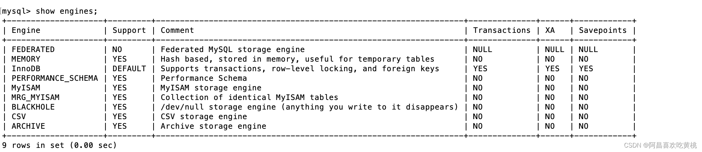
能看出在 MySQL 中，只有`InnoDB 是支持事务的`。

### 2、基本概念

**事务**：
一组逻辑操作单元，使数据从一种状态变换到另一种状态。

**事务处理的原则**：
保证所有事务都作为 `一个工作单元` 来执行，即使出现了故障，都不能改变这种执行方式。当在一个事务中执行多个操作时，要么所有的事务都被提交( `commit` )，那么这些修改就 `永久` 地保存下来；要么数据库管理系统将 `放弃` 所作的所有 `修改` ，整个事务回滚( `rollback` )到最初状态。

### 3、事务的ACID特性

#### ①原子性（atomicity）

`原子性`是指事务是 **一个不可分割的工作单位**，要么全部提交，要么全部失败回滚。


#### ②一致性（consistency）

根据定义，一致性是指事务执行前后，数据从一个 `合法性状态` 变换到另外一个 `合法性状态` 。这种状态是 `语义上` 的而不是语法上的，跟具体的业务有关。

那什么是合法的数据状态呢？满足 `预定的约束` 的状态就叫做合法的状态。通俗一点，这状态是由你自己来定义的（比如满足现实世界中的约束）。满足这个状态，数据就是一致的，不满足这个状态，数据就是不一致的！

如果事务中的某个操作失败了，系统就会自动撤销当前正在执行的事务，返回到事务操作之前的状态。


#### ③隔离型（isolation）

事务的隔离性是指一个事务的执行 `不能被其他事务干扰` ，即一个事务内部的操作及使用的数据`对 并发 的其他事务是隔离`的，并发执行的各个事务之间不能互相干扰。

如果无法保证隔离性会怎么样？假设A账户有200元，B账户0元。A账户往B账户转账两次，每次金额为50元，分别在两个事务中执行。如果无法保证隔离性，会出现下面的情形：

```sql
UPDATE accounts SET money = money - 50 WHERE NAME = 'AA';
UPDATE accounts SET money = money + 50 WHERE NAME = 'BB';
```

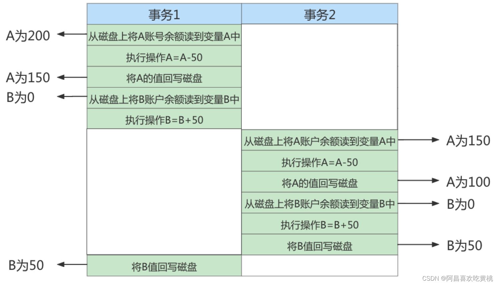

#### ④持久性（durability）

持久性是指一个事务一旦被提交，它对数据库中数据的改变就是 `永久性的` ，接下来的其他操作和数据库故障不应该对其有任何影响。

持久性是通过 `事务日志` 来保证的。日志包括了 `重做日志redo.log` 和 `回滚日志undo.log` 。当我们通过事务对数据进行修改的时候，首先会将数据库的变化信息记录到重做日志中，然后再对数据库中对应的行进行修改。

这样做的好处是，即使数据库系统崩溃，数据库重启后也能找到没有更新到数据库系统中的重做日志，重新执行，从而使事务具有持久性。

### 4、事务的状态

我们现在知道 `事务` 是一个抽象的概念，它其实对应着一个或多个数据库操作，MySQL根据这些操作所执行的不同阶段把 `事务` 大致划分成几个状态：

- **活动的**（active）
  事务对应的数据库操作正在执行过程中时，我们就说该事务处在 `活动的` 状态。
- **部分提交的**（partially committed）
  当事务中的最后一个操作执行完成，但由于操作都在内存中执行，所造成的影响并 `没有刷新到磁盘时`，我们就说该事务处在 `部分提交的` 状态。
- **失败的**（failed）
  当事务处在 `活动的` 或者 `部分提交的` 状态时，可能遇到了某些错误（数据库自身的错误、操作系统错误或者直接断电等）而无法继续执行，或者人为的停止当前事务的执行，我们就说该事务处在 `失败的` 状态。
- **中止的**（aborted）
  如果事务执行了一部分而变为 `失败的`状态，那么就需要把已经修改的事务中的操作还原到事务执行前的状态。换句话说，就是要撤销失败事务对当前数据库造成的影响。我们把这个撤销的过程称之为`回滚` 。当 `回滚` 操作执行完毕时，也就是数据库恢复到了执行事务之前的状态，我们就说该事务处在了 `中止的` 状态。
- **提交的**（committed）
  当一个处在 `部分提交的` 状态的事务将修改过的数据都 `同步到磁盘` 上之后，我们就可以说该事务处在了 `提交的` 状态。

一个基本的状态转换图如下所示：
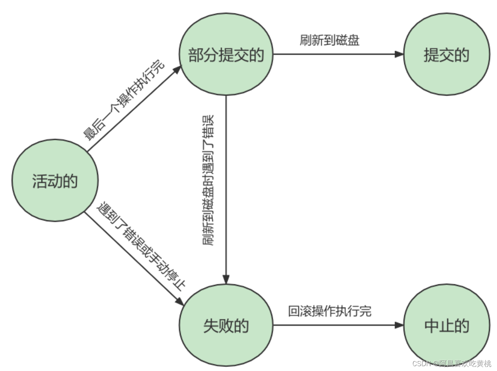

图中可见，只有当事务处于`提交的或者中止的状态`时，一个事务的生命周期才算是结束了。对于已经提交的事务来说，该事务对数据库所做的修改将永久生效，对于处于中止状态的事务，该事务对数据库所做的所有修改都会被回滚到没执行该事务之前的状态。

------

## 二、如何使用事务

使用事务有两种方式，分别为`显式事务` 和 `隐式事务` 。

### 1、显式事务

**步骤1**： `START TRANSACTION` 或者 `BEGIN` ，作用是显式开启一个事务。

```sql
mysql> BEGIN;
#或者
mysql> START TRANSACTION;
```

`START TRANSACTION`语句相较于 BEGIN 特别之处在于，后边能跟随几个 修饰符 ：

① `READ ONLY` ：标识当前事务是一个 `只读事务` ，也就是属于该事务的数据库操作只能读取数据，而不能修改数据。


② `READ WRITE` 【**默认**】：标识当前事务是一个 `读写事务` ，也就是属于该事务的数据库操作既可以读取数据，也可以修改数据。

③ `WITH CONSISTENT SNAPSHOT` ：启动一致性读。

**步骤2**：一系列事务中的操作（主要是DML，不含DDL）

**步骤3**：提交事务 或 中止事务（即回滚事务）

```sql
# 提交事务。当提交事务后，对数据库的修改是永久性的。
mysql> COMMIT;

# 回滚事务。即撤销正在进行的所有没有提交的修改
mysql> ROLLBACK;

# 将事务回滚到某个保存点。
mysql> ROLLBACK TO [SAVEPOINT]

-- 其中有关与SAVEPOINT相关操作有：

    #在事务中创建保存点，方便后续针对保存点进行回滚。一个事务中可以存在多个保存点。
    SAVEPOINT 保存点名称；
    #删除某个保存点
    RELEASE SAVEPOINT 保存点名称:
```

### 2、隐式事务

MySQL中有一个系统变量 `autocommit`：

```sql
mysql> SHOW VARIABLES LIKE 'autocommit';
+---------------+-------+
| Variable_name | Value |
+---------------+-------+
| autocommit  | ON  |
+---------------+-------+
1 row in set (0.01 sec)
```

当然，如果我们想关闭这种`自动提交` 的功能，可以使用下边两种方法之一：

- 显式的的使用`START TRANSACTION`或者 `BEGIN`语句开启一个事务。这样在本次事务提交或者回滚前会暂时关闭掉自动提交的功能。

- 把系统变量`autocommit的值设置为OFF`，就像这样：

  ```sql
  SET autocommit = OFF;
  #或
  SET autocommit = 0;
  ```

这样的话，我们写入的多条语句就算是属于同一个事务了，直到我们显式的写出`COMMIT`语句来把这个事务提交掉，或者显式的写出`ROLLBACK`语句来把这个事务回滚掉。

> 补充：Oracle默认不自动提交，需要手写COMMIT 命令，而MySQL默认自动提交。

```mysql
#3.2 如果关闭自动提交？
#方式1：
SET autocommit = FALSE; #针对于DML操作是有效的，对DDL操作是无效的。

UPDATE account SET balance = balance - 10 WHERE id = 1;

UPDATE account SET balance = balance + 10 WHERE id = 2; 

COMMIT; #或rollback;

#方式2：我们在autocommit为true的情况下，使用start transaction 或begin开启事务，那么DML操作就不会自动提交数据

START TRANSACTION;

UPDATE account SET balance = balance - 10 WHERE id = 1;

UPDATE account SET balance = balance + 10 WHERE id = 2; 

COMMIT; #或rollback;
```


### 3、隐式提交数据的情况

- **数据定义语言**（Data definition language，缩写为：DDL）

  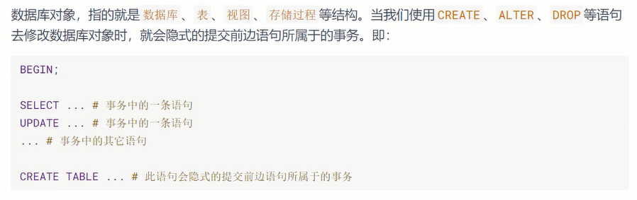

- **隐式使用或修改mysql数据库中的表**

  

- 事务控制或关于锁定的语句
  - ① 当我们在一个事务还没提交或者回滚时就又使用 `START TRANSACTION` 或者`BEGIN` 语句开启了另一个事务时，会 隐式的提交` 上一个事务。即：
  
    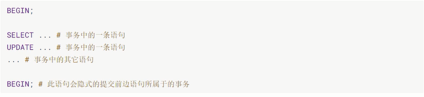
  
  - ② 当前的 `autocommit`系统变量的值为 `OFF` ，我们手动把它调为 `ON` 时，也会 `隐式的提交` 前边语句所属的事务。
  
  - ③ 使用 `LOCK TABLES 、 UNLOCK TABLES` 等关于锁定的语句也会 `隐式的提交` 前边语句所属的事务。
  
- **加载数据的语句**

  

- **关于MySQL复制的一些语句**

  

- **其它的一些语句**

  

------

### 案例分析

```mysql
#4. 案例分析
#SET autocommit = TRUE; 
#举例1： commit 和 rollback

USE atguigudb2;
#情况1：
CREATE TABLE user3(NAME VARCHAR(15) PRIMARY KEY);

SELECT * FROM user3;

BEGIN;
INSERT INTO user3 VALUES('张三'); #此时不会自动提交数据
COMMIT;

BEGIN; #开启一个新的事务
INSERT INTO user3 VALUES('李四'); #此时不会自动提交数据
INSERT INTO user3 VALUES('李四'); #受主键的影响，不能添加成功
ROLLBACK;

SELECT * FROM user3;

#情况2：
TRUNCATE TABLE user3;  #DDL操作会自动提交数据，不受autocommit变量的影响。

SELECT * FROM user3;

BEGIN;
INSERT INTO user3 VALUES('张三'); #此时不会自动提交数据
COMMIT;

INSERT INTO user3 VALUES('李四');# 默认情况下(即autocommit为true)，DML操作也会自动提交数据。
INSERT INTO user3 VALUES('李四'); #事务的失败的状态

ROLLBACK;

SELECT * FROM user3;


#情况3：
TRUNCATE TABLE user3;

SELECT * FROM user3;

SELECT @@completion_type;

SET @@completion_type = 1;

BEGIN;
INSERT INTO user3 VALUES('张三'); 
COMMIT;


SELECT * FROM user3;

INSERT INTO user3 VALUES('李四');
INSERT INTO user3 VALUES('李四'); 

ROLLBACK;


SELECT * FROM user3;

#举例2：体会INNODB 和 MyISAM

CREATE TABLE test1(i INT) ENGINE = INNODB;

CREATE TABLE test2(i INT) ENGINE = MYISAM;

#针对于innodb表
BEGIN
INSERT INTO test1 VALUES (1);
ROLLBACK;

SELECT * FROM test1;


#针对于myisam表:不支持事务
BEGIN
INSERT INTO test2 VALUES (1);
ROLLBACK;

SELECT * FROM test2;


#举例3：体会savepoint

CREATE TABLE user3(NAME VARCHAR(15),balance DECIMAL(10,2));

BEGIN
INSERT INTO user3(NAME,balance) VALUES('张三',1000);
COMMIT;

SELECT * FROM user3;


BEGIN;
UPDATE user3 SET balance = balance - 100 WHERE NAME = '张三';

UPDATE user3 SET balance = balance - 100 WHERE NAME = '张三';

SAVEPOINT s1;#设置保存点

UPDATE user3 SET balance = balance + 1 WHERE NAME = '张三';

ROLLBACK TO s1; #回滚到保存点


SELECT * FROM user3;

ROLLBACK; #回滚操作

SELECT * FROM user3;
```

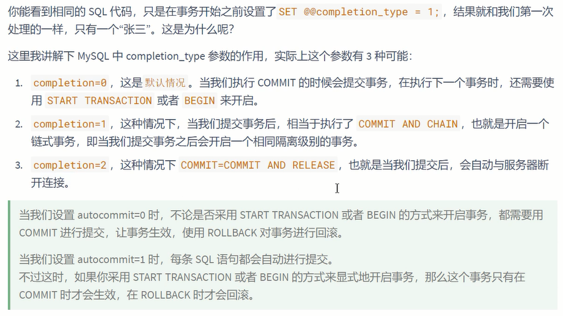

## 三、 事务隔离级别

MySQL是一个 `客户端／服务器` 架构的软件，对于同一个服务器来说，可以有若干个客户端与之连接，每个客户端与服务器连接上之后，就可以称为一个会话（ `Session` ）。

每个客户端都可以在自己的会话中向服务器发出请求语句，一个请求语句可能是某个事务的一部分，也就是对于服务器来说可能同时处理多个事务。

事务有 `隔离性` 的特性，理论上在某个事务 `对某个数据进行访问` 时，其他事务应该进行 `排队` ，当该事务提交之后，其他事务才可以继续访问这个数据。

但是这样对 `性能影响太大` ，我们既想保持事务的隔离性，又想让服务器在处理访问同一数据的多个事务时 性能尽量高些 ，那就看二者如何`权衡取舍`了。

### 数据的并发问题分析过程

**1、脏写**

对于两个事务Session A、Session B，如果事务Session A`修改了`另一个`未提交`事务Session B`修改过`的数据，那就意味着发生了脏写，示意图如下：


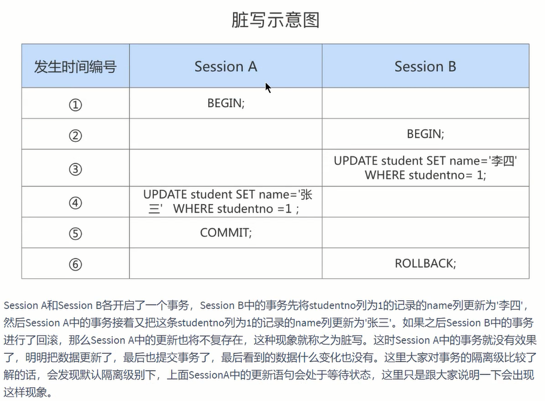

> 在事务隔离级别为`read uncommitted`级别是：第④步**sessionA进行更新操作时会阻塞**等待改行记录的事务结束，因为这一行记录sessionB的事务中，只有sessionB事务结束后，sessionA才能随该行进行操作。因此**读未提交解决了脏写**

**2、脏读**

对于两个事务Session A、Session B，Session A `读取` 了已经被Session B `更新但还没有被提交`的字段。之后若Session B 回滚，Session A读取 的内容就是临时且无效的。

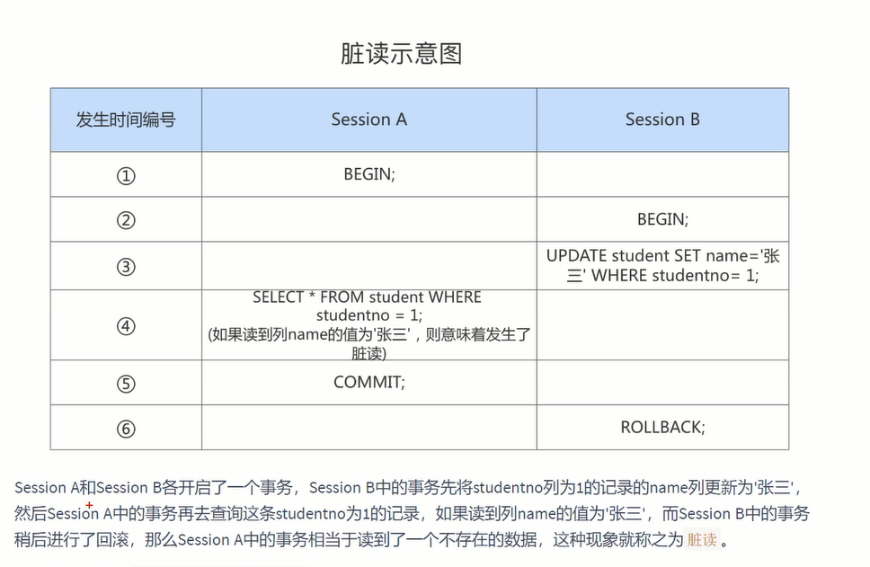

**3、不可重复读**

对于两个事务Session A、Session B，Session A `读取` 了一个字段，然后Session B`更新`了该字段。之后Session A`再次读取同一个字段，值就不同了`。那就意味着发生了不可重复读。【针对`update`和`delete`操作】  

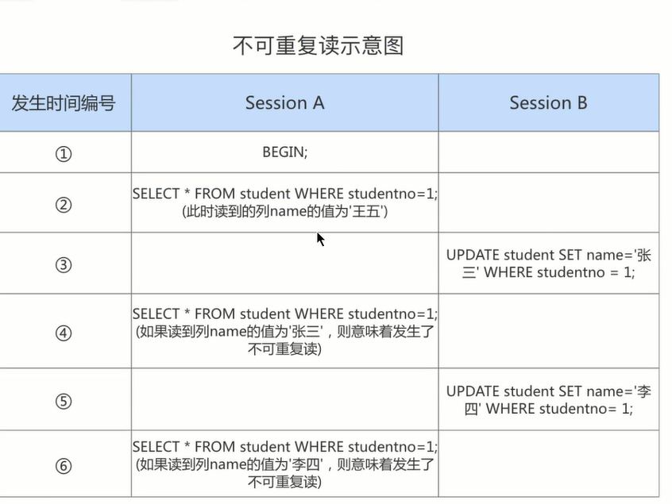


**4、幻读**

对于两个事务Session A、Session B，Session A从一个表中`读取`了一个字段，然后Session B在该表中`插入`了一些新的行。之后，如果Session A`再次读取同一个表，就会多出几行`。那就意味着发生了幻读。【针对`insert`操作】

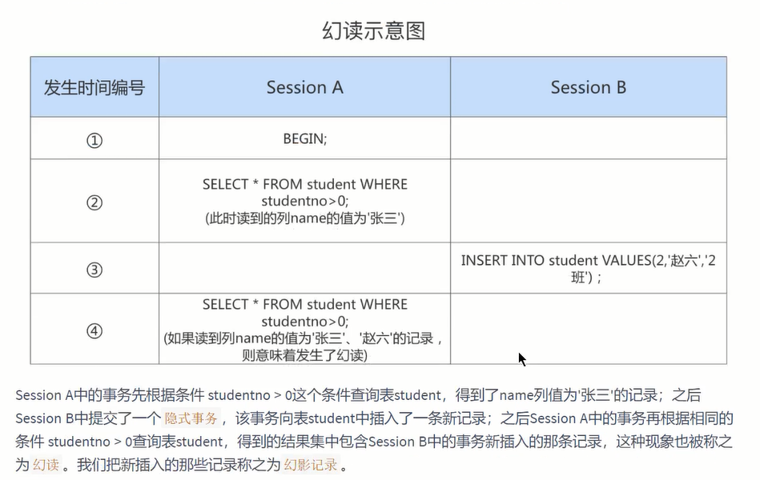


幻读解决：

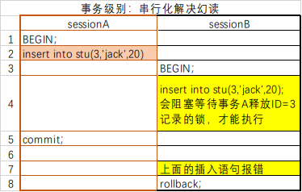


### 1、SQL中的四种隔离级别

按照`严重性`来排一下序：

```
脏写 > 脏读 > 不可重复读 > 幻读
```

我们愿意舍弃一部分隔离性来换取一部分性能在这里就体现在：设立一些隔离级别，隔离级别越低，并发问题发生的就越多。`SQL标准中设立了4个隔离级别`

+ `READ UNCOMMITTED`：读未提交，在该隔离级别，所有事务都可以看到其他未提交事务的执行结果。不能避免脏读、不可重复读、幻读。
+ `READ COMMITTED`：读已提交，它满足了隔离的简单定义：一个事务只能看见已经提交事务所做的改变。这是大多数数据库系统的默认隔离级别（但不是MySQL默认的）。可以避免脏读，但不可重复读、幻读问题仍然存在。
+ `REPEATABLE READ`：可重复读，事务A在读到一条数据之后，此时事务B对该数据进行了修改并提交，那么事务A再读该数据，读到的还是原来的内容。可以避免脏读、不可重复读，但幻读问题仍然存在。这是MySQL的默认隔离级别。
+ `SERIALIZABLE`：可串行化，确保事务可以从一个表中读取相同的行。在这个事务持续期间，禁止其他事务对该表执行插入、更新和删除操作。所有的并发问题都可以避免，但性能十分低下。能避免脏读、不可重复读和幻读。

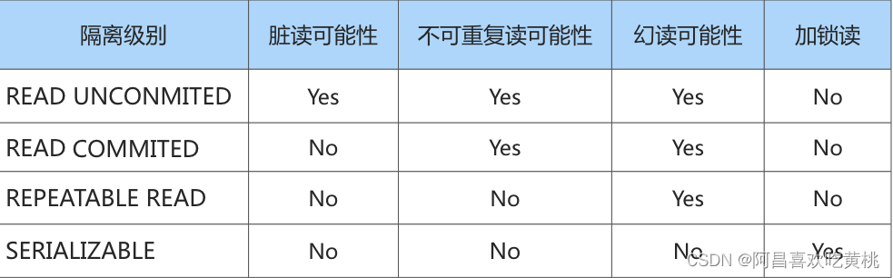
`脏写` 怎么没涉及到？因为脏写这个问题太严重了，不论是哪种隔离级别，都不允许脏写的情况发生。

不同的隔离级别有不同的现象，并有不同的锁和并发机制，隔离级别越高，数据库的并发性能就越差，4种事务隔离级别与并发性能的关系如下：

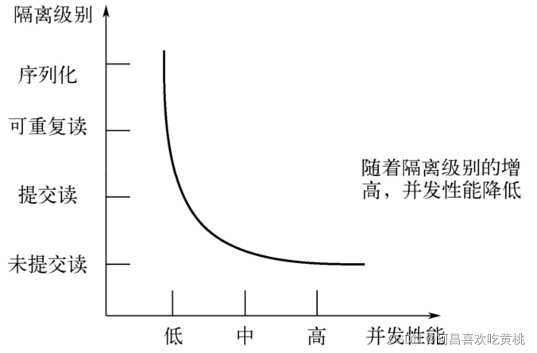

### 2、MySQL支持的四种隔离级别

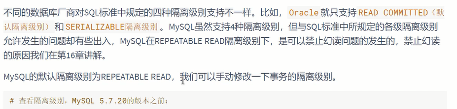

```sql
# 查看隔离级别，MySQL 5.7.20的版本之前：
mysql> SHOW VARIABLES LIKE 'tx_isolation';
+---------------+-----------------+
| Variable_name | Value      |
+---------------+-----------------+
| tx_isolation | REPEATABLE-READ |
+---------------+-----------------+
1 row in set (0.00 sec)


# MySQL 5.7.20版本之后，引入transaction_isolation来替换tx_isolation

# 查看隔离级别，MySQL 5.7.20的版本及之后：
mysql> SHOW VARIABLES LIKE 'transaction_isolation';
+-----------------------+-----------------+
| Variable_name     | Value      |
+-----------------------+-----------------+
| transaction_isolation | REPEATABLE-READ |
+-----------------------+-----------------+
1 row in set (0.02 sec)
#或者不同MySQL版本中都可以使用的：
SELECT @@transaction_isolation;
```

### 3、如何设置事务的隔离级别

**通过下面的语句修改事务的隔离级别**：

```sql
SET [GLOBAL|SESSION] TRANSACTION ISOLATION LEVEL 隔离级别;
#其中，隔离级别格式：
> READ UNCOMMITTED
> READ COMMITTED
> REPEATABLE READ
> SERIALIZABLE
```

或者：

```sql
SET [GLOBAL|SESSION] TRANSACTION_ISOLATION = '隔离级别'
#其中，隔离级别格式：
> READ-UNCOMMITTED
> READ-COMMITTED
> REPEATABLE-READ
> SERIALIZABLE
```

**关于设置时使用GLOBAL或SESSION的影响**：
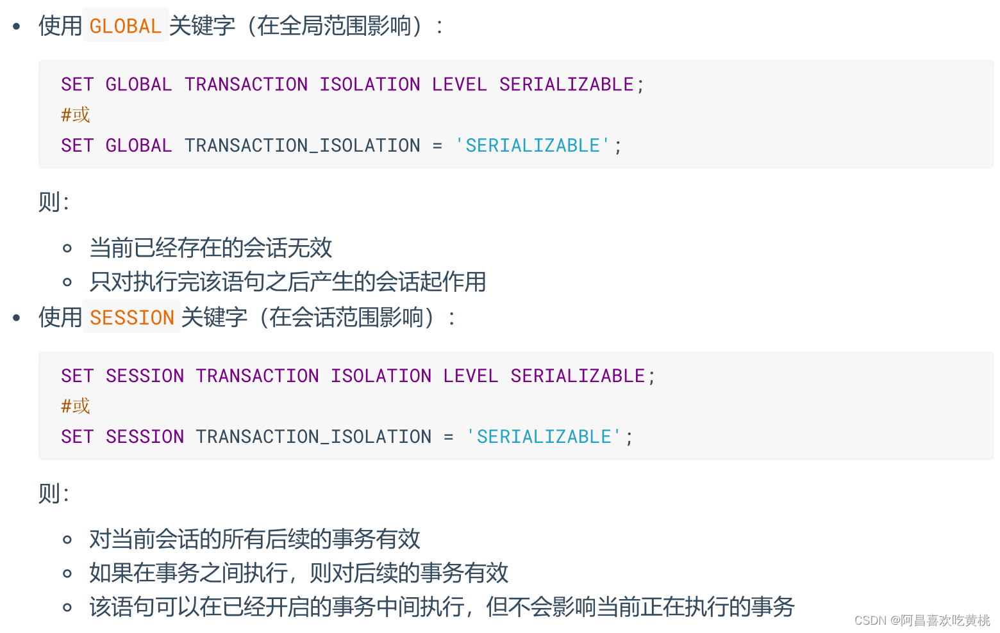

> **小结**：
> 数据库规定了多种事务隔离级别，不同隔离级别对应不同的干扰程度，`隔离级别越高，数据一致性就越好，但并发性越弱`。

------

## 四、事务的常见分类

从事务理论的角度来看，可以把事务分为以下几种类型：

- **扁平事务**（Flat Transactions）
- **带有保存点的扁平事务**（Flat Transactions with Savepoints）
- **链事务**（Chained Transactions）
- **嵌套事务**（Nested Transactions）
- **分布式事务**（Distributed Transactions）

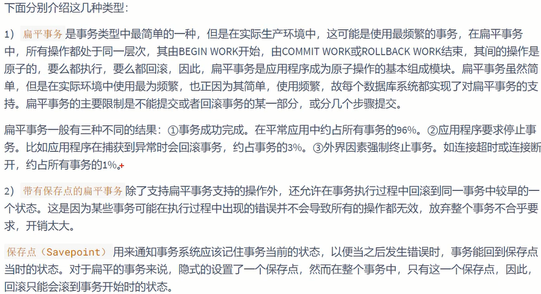

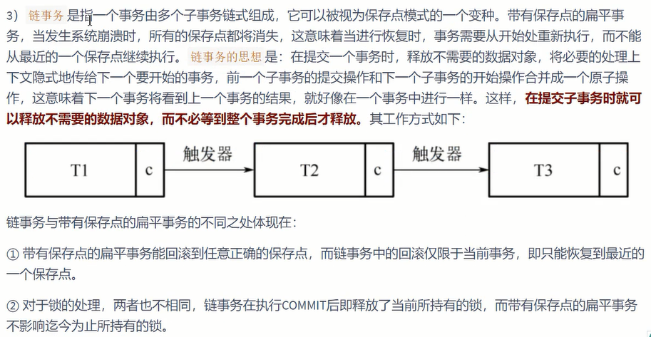

