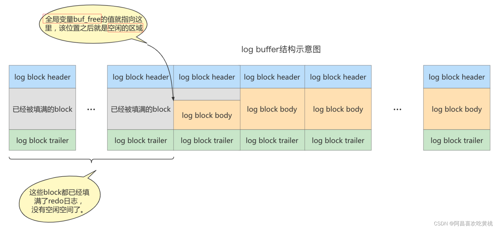
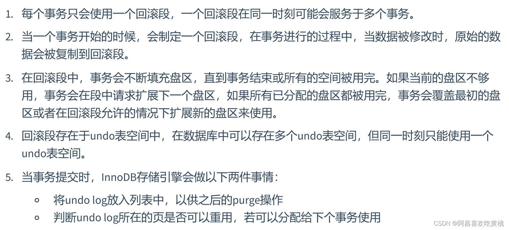

# MySQL事务日志

事务有4种特性：`原子性`、`一致性`、`隔离性`和`持久性`。那么事务的四种特性到底是基于什么机制实现呢？

- 事务的隔离性由 `锁机制` 实现。
- 而事务的原子性、一致性和持久性由事务的 redo 日志和undo 日志来保证。
  - `REDO LOG` 称为 `重做日志` ，提供再写入操作，恢复提交事务修改的页操作，用来保证事务的持久性。
  - `UNDO LOG` 称为 `回滚日志` ，回滚行记录到某个特定版本，用来保证事务的原子性、一致性。

> 

## 一、redo日志


### 1、为什么需要REDO日志

**通过REDOLOG保证了mysql的持久性**


一方面，缓冲池可以帮助我们消除CPU和磁盘之间的鸿沟，checkpoint机制可以保证数据的最终落盘，然而由于checkpoint `并不是每次变更的时候就触发` 的，而是master线程隔一段时间去处理的。所以最坏的情况就是事务提交后，刚写完缓冲池，数据库宕机了，那么这段数据就是丢失的，无法恢复。

另一方面，事务包含 `持久性` 的特性，就是说对于一个已经提交的事务，在事务提交后即使系统发生了崩溃，这个事务对数据库中所做的更改也不能丢失。

那么如何保证这个持久性呢？ `一个简单的做法` ：在事务提交完成之前把该事务所修改的所有页面都刷新到磁盘，但是这个简单粗暴的做法有些问题


`另一个解决的思路` ：我们只是想让已经提交了的事务对数据库中数据所做的修改永久生效，即使后来系统崩溃，在重启后也能把这种修改恢复出来。所以我们其实没有必要在每次事务提交时就把该事务在内存中修改过的全部页面刷新到磁盘，只需要把 `修改` 了哪些东西 `记录一下` 就好。比如，某个事务将系统表空间中 `第10号` 页面中偏移量为 `100` 处的那个字节的值 `1` 改成 `2` 。我们只需要记录一下：将第0号表空间的10号页面的偏移量为100处的值更新为 2 。

InnoDB引擎的事务采用了`WAL技术（Write-Ahead Logging）`，这种技术的`思想就是先写日志，再写磁盘`，**只有日志写入成功，才算事务提交成功，这里的日志就是redo log**。当发生宕机且数据未刷到磁盘的时候，可以通过redo log来恢复，保证ACID中的D，这就是redo log的作用。


### 2、REDO日志的好处、特点

#### ①好处

- **redo日志降低了刷盘频率**
- **redo日志占用的空间非常小**

存储表空间ID、页号、偏移量以及需要更新的值，所需的存储空间是很小的，刷盘快。

#### ②特点

- **redo日志是顺序写入磁盘的**

  

- **事务执行过程中，redo log不断记录**

  

### 3、redo的组成

Redo log可以简单分为以下两个部分：`redo log buffer`、`redo log file`

- `重做日志的缓冲 (redo log buffer)`，保存在内存中，是易失的。


**参数设置**：`innodb_log_buffer_size`：
*redo log buffer 大小，`默认 16M`，最大值是4096M，最小值为1M。*

```shell
mysql> show variables like '%innodb_log_buffer_size%';
+------------------------+----------+
| Variable_name     | Value  |
+------------------------+----------+
| innodb_log_buffer_size | 16777216 |
+------------------------+----------+
```

- `重做日志文件 (redo log file)`，保存在硬盘中，是持久的。

  REDO日志文件如图所示，其中的ib_logfile0和ib_logfile1即为REDO日志。

  

### 4、redo的整体流程

以一个更新事务为例，`redo log` 流转过程，如下图所示：


```
第1步：先将原始数据从磁盘中读入内存中来，修改数据的内存拷贝
第2步：生成一条重做日志并写入redo log buffer，记录的是数据被修改后的值
第3步：当事务commit时，将redo log buffer中的内容刷新到 redo log file，对 redo log file采用追加写的方式
第4步：定期将内存中修改的数据刷新到磁盘中
```

**体会**：

> **Write-Ahead Log**(预先日志持久化)：在持久化一个数据页之前，先将内存中相应的日志页持久化。

### 5、redo log的刷盘策略

*redo log的写入并不是直接写入磁盘的*，InnoDB引擎会在写redo log的时候先写`redo log buffer`，之后以 `一定的频率` 刷入到真正的`redo log file` 中。

（先写入对应内存的开辟的空间redo log buffer，然后根据某个策略写入磁盘redo log file）

这里的一定频率怎么看待呢？这就是我们要说的刷盘策略。


注意，redo log buffer刷盘到redo log file的过程并不是真正的刷到磁盘中去，只是刷入到 `文件系统缓存（page cache）`中去（这是现代操作系统为了提高文件写入效率做的一个优化），真正的写入会交给系统自己来决定（比如page cache足够大了）。

那么对于InnoDB来说就存在一个问题，如果交给系统来同步，同样如果系统宕机，那么数据也丢失了（虽然整个系统宕机的概率还是比较小的）。

针对这种情况，InnoDB给出 `innodb_flush_log_at_trx_commit`参数，该参数控制 commit提交事务时，如何将 redo log buffer 中的日志刷新到 redo log file 中。它支持`三种策略`：

- **设置为0** ：表示每次事务提交时`不进行刷盘操作`。（通过系统默认master thread每隔1s进行一次重做日志的同步）
- **设置为1** ：表示`每次事务提交时都将进行同步`，刷盘操作（ `默认值` ）
- **设置为2** ：表示`每次事务提交`时都只把 `redo log buffer 内容写入 page cache（操作系统的缓存）`，不进行同步。由os自己决定什么时候同步到磁盘文件。


### 6、不同刷盘策略演示

#### ①流程图

- 当参数为：`1` 的情况
  
- 

------

- 当参数为 `2` 的情况：

  

  

------

- 当参数为 `0` 的情况：


#### 举例说明：

不同刷盘策略的插入效率对比

```mysql
USE atguigudb3;

CREATE TABLE test_load(
a INT,
b CHAR(80)
)ENGINE=INNODB;


#创建存储过程，用于向test_load中添加数据
DELIMITER//
CREATE PROCEDURE p_load(COUNT INT UNSIGNED)
BEGIN
DECLARE s INT UNSIGNED DEFAULT 1;
DECLARE c CHAR(80)DEFAULT REPEAT('a',80);
WHILE s<=COUNT DO
INSERT INTO test_load SELECT NULL,c;
COMMIT;
SET s=s+1;
END WHILE;
END //
DELIMITER;

#测试1：
#设置并查看：innodb_flush_log_at_trx_commit

SHOW VARIABLES LIKE 'innodb_flush_log_at_trx_commit';

set GLOBAL innodb_flush_log_at_trx_commit = 1;

#调用存储过程
CALL p_load(30000); #1min 28sec

#测试2：
TRUNCATE TABLE test_load;

SELECT COUNT(*) FROM test_load;

SET GLOBAL innodb_flush_log_at_trx_commit = 0;

SHOW VARIABLES LIKE 'innodb_flush_log_at_trx_commit';

#调用存储过程
CALL p_load(30000); #37.945 sec

#测试3：
TRUNCATE TABLE test_load;

SELECT COUNT(*) FROM test_load;

SET GLOBAL innodb_flush_log_at_trx_commit = 2;

SHOW VARIABLES LIKE 'innodb_flush_log_at_trx_commit';

#调用存储过程
CALL p_load(30000); #45.173 sec
```

### 7、 写入redo log buffer 过程

#### ①补充概念 ： `Mini-Transaction`

MySQL把对底层页面中的一次原子访问的过程称之为一个`Mini-Transaction`，简称`mtr`，比如，向某个索引对应的B+树中插入一条记录的过程就是一个`Mini-Transaction`。`一个所谓的mtr可以包含一组redo日志`，在进行崩溃恢复时这一组redo日志作为一个不可分割的整体。

一个事务可以包含若干条语句，每一条语句其实是由若干个 `mtr` 组成，每一个 `mtr` 又可以包含若干条redo日志，画个图表示它们的关系就是这样：


#### ②redo 日志写入log buffer





#### ③redo log block的结构图


### 8、redo log file

#### ①相关参数设置

- `innodb_log_group_home_dir` ：指定 redo log 文件组所在的路径，默认值为`./`，表示在数据库的数据目录下。MySQL的默认数据目录（ `var/lib/mysql` ）下默认有两个名为 `ib_logfile0` 和`ib_logfile1` 的文件，log buffer中的日志默认情况下就是刷新到这两个磁盘文件中。此redo日志文件位置还可以修改。

- `innodb_log_files_in_group`：（log_files文件个数）：指明redo log file的个数，命名方式如：ib_logfile0，iblogfile1…iblogfilen。默认2个，最大100个。
  
  ```mysql
  mysql> show variables like 'innodb_log_files_in_group';
  +---------------------------+-------+
  | Variable_name       | Value |
  +---------------------------+-------+
  | innodb_log_files_in_group | 2   |
  +---------------------------+-------+
  #ib_logfile0
  #ib_logfile1
  ```
  
- `innodb_flush_log_at_trx_commit`：控制 redo log 刷新到磁盘的策略，默认为1。

- `innodb_log_file_size`：（log_files文件个数中单个大小）：单个 redo log 文件设置大小，默认值为`48M`
  
  。最大值为512G，注意最大值指的是整个 redo log 系列文件之和，即（innodb_log_files_in_group * innodb_log_file_size ）不能大于最大值512G。

  ```shell
  mysql> show variables like 'innodb_log_file_size';
  +----------------------+----------+
  | Variable_name    | Value  |
  +----------------------+----------+
  | innodb_log_file_size | 50331648 |
  +----------------------+----------+
  ```

根据业务修改其大小，以便容纳较大的事务。编辑`my.cnf`文件并重启数据库生效，如下所示

```shell
[root@localhost ~]# vim /etc/my.cnf
innodb_log_file_size=200M
```


#### ②日志文件组


总共的redo日志文件大小其实就是： `innodb_log_file_size × innodb_log_files_in_group` 。

采用循环使用的方式向redo日志文件组里写数据的话，会导致后写入的redo日志覆盖掉前边写的redo日志？
当然！所以InnoDB的设计者提出了checkpoint的概念。

#### ③checkpoint


如果 write pos 追上 checkpoint ，表示`日志文件组满了`，这时候不能再写入新的 redo log记录，MySQL 得停下来，清空一些记录，把 checkpoint 推进一下。


------

## 二、Undo日志

redo log是事务持久性的保证，`undo log`是事务`原子性`的保证。在事务中 `更新数据` 的 `前置操作` 其实是要先写入一个 `undo log` 。

### 1、如何理解Undo日志


### 2、Undo日志的作用

- 作用1：**回滚数据**

  

- 作用2：**MVCC**

  

### 3、undo的存储结构

#### ①回滚段与undo页

InnoDB对undo log的管理采用`段的方式`，也就是 `回滚段（rollback segment）` 。每个回滚段记录了1024 个 `undo log segment`，而在每个`undo log segment`段中进行 `undo页` 的申请。

- 在 `InnoDB1.1版本之前` （不包括1.1版本），只有`一个rollback segment`，因此支持同时在线的事务限制为 `1024` 。虽然对绝大多数的应用来说都已经够用。

- 从`1.1版本开始`InnoDB支持最大`128个rollback segment`，故其支持同时在线的事务限制提高到了`128*1024`

```shell
  mysql> show variables like 'innodb_undo_logs';
  +------------------+-------+
  | Variable_name  | Value |
  +------------------+-------+
  | innodb_undo_logs | 128  |
  +------------------+-------+
```


#### ②回滚段与事务



#### ③回滚段中的数据分类


### 4、undo的类型

- 

### 5、undo log的生命周期

#### ①简要生成过程


**只有Buffer Pool的流程**：


------

**有了Redo Log和Undo Log之后**：

简述：先找是否有加载对应的BufferPool有就使用没有就加载读取 ----> 写入UndoLog —>操作数据 —> 写入RedoLogBuffer内存 ----> 写入RedoLog到磁盘文件


#### ②详细生成过程


**当我们执行INSERT时**：

```sql
begin;
INSERT INTO user (name) VALUES ("tom");
```


------

**当我们执行UPDATE时**：


```sql
UPDATE user SET id=2 WHERE id=1;
```


#### ③undo log是如何回滚的


#### ④undo log的删除


------

## 3、小结

先找是否有加载对应的BufferPool有就使用没有就加载读取 ----> 写入UndoLog —>操作执行数据 —> 写入RedoLogBuffer内存 ----> 写入RedoLog到磁盘文件


`undo log`是**逻辑日志**，对事务回滚时，只是将数据库逻辑地恢复到原来的样子。

`redo log`是**物理日志**，记录的是数据页的物理变化，undo log不是redo log的逆过程（逻辑上的逆过程，但是物理上不是直接的逆过程）。