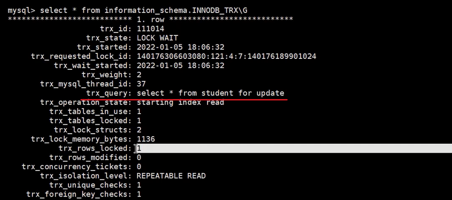

# Mysql锁

事务的 `隔离性` 由 `锁` 来实现。

## 一、概述

`锁`是计算机协调多个进程或线程`并发访问某一资源`的机制。在程序开发中会存在多线程同步的问题，当多个线程并发访问某个数据的时候，尤其是针对一些敏感的数据（比如订单、金额等），我们就需要保证这个数据在任何时刻`最多只有一个线程`在访问，保证数据的`完整性`和`一致性`。在开发过程中加锁是为了保证数据的一致性，这个思想在数据库领域中同样很重要。

在数据库中，除传统的计算资源（如CPU、RAM、I/O等）的争用以外，数据也是一种供许多用户共享的资源。为保证数据的一致性，需要对 `并发操作进行控制` ，因此产生了 `锁`。
同时 `锁机制` 也为实现MySQL的各个`隔离级别提供了保证`。
`锁冲突` 也是影响数据库 `并发访问性能` 的一个重要因素。所以锁对数据库而言显得尤其重要，也更加复杂。

------

## 二、MySQL并发事务访问相同记录

并发事务访问相同记录的情况大致可以划分为3种：

### 1、读-读情况

`读-读` 情况，即并发事务相继 `读取相同的记录` 。读取操作本身不会对记录有任何影响，并不会引起什么问题，所以允许这种情况的发生。

### 2、写-写情况

`写-写` 情况，即并发事务相继对相同的记录做出改动。
在这种情况下会发生 `脏写` 的问题，任何一种隔离级别都不允许这种问题的发生。所以在多个未提交事务相继对一条记录做改动时，需要让它们 `排队执行` ，这个排队的过程其实是通过 `锁` 来实现的。

这个所谓的锁其实是一个 `内存中的结构` ，在事务执行前本来是没有锁的，也就是说一开始是没有 `锁结构` 和记录进行关联的，如图所示：


当一个事务想对这条记录做改动时，首先会看看内存中有没有与这条记录关联的 `锁结构` ，当没有的时候就会在内存中生成一个 `锁结构` 与之关联。

比如，事务 T1 要对这条记录做改动，就需要生成一个 `锁结构与之关联`：


**小结几种说法**：

- 不加锁
  意思就是不需要在内存中生成对应的 `锁结构` ，可以直接执行操作。
- 获取锁成功，或者加锁成功
  意思就是在内存中生成了对应的 `锁结构` ，而且锁结构的`is_waiting`属性为 `false` ，也就是事务可以继续执行操作。
- 获取锁失败，或者加锁失败，或者没有获取到锁
  意思就是在内存中生成了对应的 `锁结构` ，不过锁结构的 `is_waiting` 属性为`true`，也就是事务需要等待，不可以继续执行操作。

### 3、读-写或写-读情况

`读-写` 或`写-读` ，即一个事务进行读取操作，另一个进行改动操作。这种情况下可能发生 `脏读 、 不可重复读 、 幻读` 的问题。

各个数据库厂商对 SQL标准 的支持都可能不一样。比如`MySQL`在 `REPEATABLE READ` 隔离级别上就已经解决了 `幻读` 问题。

### 4、并发问题的解决方案

怎么解决 `脏读 、 不可重复读 、 幻读` 这些问题呢？其实有两种可选的解决方案：

- 方案一：读操作利用多版本并发控制（ `MVCC` ），写操作进行 `加锁`。
  
  
- 方案二：读、写操作都采用 `加锁` 的方式。

  

**小结对比发现**：

- 采用 `MVCC` 方式的话，`读-写` 操作彼此并不冲突， `性能更高` 。
- 采用 `加锁` 方式的话，`读-写` 操作彼此需要 排队执行 ，`影响性能`。

一般情况下我们当然愿意采用 `MVCC` 来解决 `读-写` 操作并发执行的问题，但是业务在某些特殊情况下，要求必须采用 `加锁` 的方式执行。

------

## 三、锁的不同角度分类

锁的分类图，如下：


### 1、从数据操作的类型划分：读锁、写锁


> 读锁会阻塞写(X)，但是不会堵塞读(S)。而写锁则会把读(S)和写(X)都堵塞

对于InnoDB 在RR(MySQL默认隔离级别) 而言，`对于 update、delete 和 insert 语句， 会自动给涉及数据集加排它锁（X）`；

对于普通 select 语句，innodb 不会加任何锁`。如果想在select操作的时候加上 S锁 或者 X锁，需要我们手动加锁`。

```mysql
-- 加共享锁（S）
select * from table_name where ... lock in share mode
-- 加排它锁（X)
select * from table_name where ... for update
```

**用 select… in share mode 获得共享锁，主要用在需要数据依存关系时来确认某行记录是否存在，并确保没有人对这个记录进行 update 或者 delete 操作。**

但是如果当前事务也需要对该记录进行更新操作,则有可能造成死锁，对于锁定行记录后需要进行更新操作的应用，应该使用 select… for update 方式获得排他锁。


**1、锁定读**


**2、写操作**


------

### 2、从数据操作的粒度划分：表级锁、页级锁、行锁


#### ①表锁（Table Lock）


##### (1)表级别的S锁、X锁

在对某个表执行SELECT、INSERT、DELETE、UPDATE语句时，InnoDB存储引擎是不会为这个表添加表级别的 `S锁`或者`X锁` 的。在对某个表执行一些诸如 `ALTER TABLE` 、 `DROP TABLE` 这类的 DDL 语句时，其他事务对这个表并发执行诸如SELECT、INSERT、DELETE、UPDATE的语句会发生阻塞。同理，某个事务中对某个表执行SELECT、INSERT、DELETE、UPDATE语句时，在其他会话中对这个表执行 `DDL` 语句也会发生`阻塞`。这个过程其实是通过在 `server层` 使用一种称之为 `元数据锁` （英文名： Metadata Locks ，简称 MDL ）结构来实现的。

一般情况下，不会使用InnoDB存储引擎提供的表级别的 `S锁` 和 `X锁` 。只会在一些特殊情况下，比方说 `崩溃恢复` 过程中用到。比如，在系统变量 `autocommit=0`，`innodb_table_locks = 1` 时， 手动 获取InnoDB存储引擎提供的表t 的 `S锁`或者 `X锁` 可以这么写：

- `LOCK TABLES t READ` ：InnoDB存储引擎会对表 t 加表级别的 `S锁` 。
- `LOCK TABLES t WRITE` ：InnoDB存储引擎会对表 t 加表级别的 `X锁` 。

不过尽量避免在使用InnoDB存储引擎的表上使用`LOCK TABLES` 这样的手动锁表语句，它们并不会提供什么额外的保护，只是会降低并发能力而已。InnoDB的厉害之处还是实现了更细粒度的`行锁` ，关于InnoDB表级别的 `S锁`和 `X锁` 大家了解一下就可以了。


```mysql
show open tables; # 查看mysql所有库中所有表目前在使用的锁
LOCK TABLES t READ;  # t表加读锁
LOCK TABLES t WRITE;  # t表加写锁
UNLOCK TABLES ;# 解锁
```


MySQL的表级锁有两种模式：（以MyISAM表进行操作的演示）

- 表共享读锁（Table Read Lock）
- 表独占写锁（Table Write Lock）


##### (2)意向锁 （intention lock）


**意向锁的并发性**：

意向锁不会与行级的共享 / 排他锁互斥！正因为如此，意向锁并不会影响到多个事务对不同数据行加排
他锁时的并发性。（不然我们直接用普通的表锁就行了）

我们扩展一下上面 teacher表的例子来概括一下意向锁的作用（一条数据从被锁定到被释放的过程中，可能存在多种不同锁，但是这里我们只着重表现意向锁）。

**从上面的案例可以得到如下结论**：

1. InnoDB 支持 `多粒度锁` ，特定场景下，`行级锁可以与表级锁共存`。
2. 意向锁之间互不排斥，但除了 `IS` 与 `S` 兼容外， 意向锁会与 `共享锁 / 排他锁` 互斥 。
3. IX，IS是表级锁，不会和行级的X，S锁发生冲突。只会和表级的X，S发生冲突。
4. 意向锁在保证并发性的前提下，实现了 `行锁和表锁共存` 且 `满足事务隔离性` 的要求。

##### (3)自增锁（AUTO-INC锁）

在使用MySQL过程中，我们可以为表的某个列添加 `AUTO_INCREMENT`属性。举例：

```sql
CREATE TABLE `teacher` (
	 `id` int NOT NULL AUTO_INCREMENT,
	 `name` varchar(255) NOT NULL,
	 PRIMARY KEY (`id`)
) ENGINE=InnoDB DEFAULT CHARSET=utf8mb4 COLLATE=utf8mb4_0900_ai_ci;
```

由于这个表的id字段声明了AUTO_INCREMENT，意味着在书写插入语句时不需要为其赋值，SQL语句修改如下所示。

```sql
INSERT INTO `teacher` (name) VALUES ('zhangsan'), ('lisi');
```

上边的插入语句并没有为id列显式赋值，所以系统会自动为它赋上递增的值，结果如下所示。

```sql
mysql> select * from teacher;
+----+----------+
| id | name   |
+----+----------+
| 1 | zhangsan |
| 2 | lisi   |
+----+----------+
2 rows in set (0.00 sec)
```

现在我们看到的上面插入数据只是一种简单的插入模式，所有插入数据的方式总共分为三类，分别是:
“ `Simple inserts` ”，“ `Bulk inserts` ”和“ `Mixed-mode inserts` ”。


##### (4)元数据锁（MDL锁）


```mysql
#模拟验证

#事务1：
#开启事务
begin;
select * from emplees;


#事务2：执行dml操作会阻塞 ,直到事务1提交，获取到emplees的DML写锁
ALTER TABLE emplees ADD job_id varchar(15);

# 查看当前mysql的进程
show PROCESSLIST ;

```

------

#### ② InnoDB中的行锁


##### (1)记录锁（Record Locks）


**举例如下**：

记录锁是有S锁和X锁之分的，称之为 `S型记录锁` 和 `X型记录锁` 。

- 当一个事务获取了一条记录的S型记录锁后，其他事务也可以继续获取该记录的S型记录锁，但不可以继续获取X型记录锁；
- 当一个事务获取了一条记录的X型记录锁后，其他事务既不可以继续获取该记录的S型记录锁，也不可以继续获取X型记录锁。

>- 记录锁其实很好理解，对表中的记录加锁，叫做记录锁，简称行锁。比如
>
>  ```mysql
>  SELECT * FROM `test` WHERE `id`=1 FOR UPDATE;
>  ```
>
>  它会在 id=1 的记录上加上记录锁，以阻止其他事务插入，更新，删除 id=1 这一行。
>
>  需要注意的是：
>
>  - id 列必须为唯一索引列或主键列，否则上述语句加的锁就会变成临键锁(有关临键锁下面会讲)。
>  - 同时查询语句必须为精准匹配（=），不能为 >、<、like等，否则也会退化成临键锁。
>
>  其他实现
>
>  在通过 主键索引 与 唯一索引 对数据行进行 UPDATE 操作时，也会对该行数据加记录锁：
>
>  ```mysql
>  -- id 列为主键列或唯一索引列 
>  UPDATE SET age = 50 WHERE id = 1;
>  ```
>
>  记录锁是锁住记录，锁住索引记录，而不是真正的数据记录.
>
>  如果要锁的列没有索引，进行全表记录加锁
>
>  > 记录锁也是排它(X)锁,所以会阻塞其他事务对其插入、更新、删除。

------

##### (2)间隙锁（Gap Locks）

MySQL 在 `REPEATABLE READ` 隔离级别下是可以解决幻读问题的，解决方案有两种，可以使用 `MVCC` 方案解决，也可以采用 `加锁` 方案解决。但是在使用加锁方案解决时有个大问题，就是事务在第一次执行读取操作时，那些幻影记录尚不存在，我们无法给这些 `幻影记录` 加上 `记录锁` 。InnoDB提出了一种称之为Gap Locks 的锁，官方的类型名称为： `LOCK_GAP` ，我们可以简称为 `gap锁` 。

比如，把id值为8的那条记录加一个gap锁的示意图如下。


图中id值为8的记录加了gap锁，意味着 `不允许别的事务在id值为8的记录前边的间隙插入新记录` ，其实就是`id列的值(3, 8)这个开区间的新记录是不允许立即插入的`。比如，有另外一个事务再想插入一条id值为4的新记录，它定位到该条新记录的下一条记录的id值为8，而这条记录上又有一个gap锁，所以就会阻塞插入操作，直到拥有这个gap锁的事务提交了之后，id列的值在开区间(3, 8)中的新记录才可以被插入。


>如果锁定的id超过目前记录的范围，会将锁加到每一页的固定的最大值supremum/最小值Infimum记录上，

间隙锁会发生`死锁`：

两个间隙锁锁定的`范围发生交叉`


##### (3)临键锁（Next-Key Locks）

有时候我们既想 `锁住某条记录` ，又想 阻止 其他事务在该记录前边的 `间隙插入新记录` ，所以InnoDB就提出了一种称之为 `Next-Key Locks` 的锁，官方的类型名称为： `LOCK_ORDINARY`，我们也可以简称为next-key锁 。Next-Key Locks是在存储引擎 `innodb` 、事务级别在 `可重复读` 的情况下使用的数据库锁，`innodb默认的锁就是Next-Key locks`。

```sql
begin;
select * from student where id <=8 and id > 3 for update;
-- 锁定   id=8   锁定（3,8）  ==> [3,8]
```


##### (4) 插入意向锁（Insert Intention Locks）

我们说一个事务在 `插入` 一条记录时需要判断一下插入位置是不是被别的事务加了 `gap锁` （ `next-key锁也包含 gap锁` ），如果有的话，插入操作需要等待，直到拥有 `gap锁` 的那个事务提交。但是InnoDB规定事务在等待的时候也需要在内存中生成一个锁结构，表明有事务想在某个 `间隙` 中 `插入` 新记录，但是现在在等待。InnoDB就把这种类型的锁命名为 `Insert Intention Locks` ，官方的类型名称为：`LOCK_INSERT_INTENTION` ，我们称为 插入意向锁 。插入意向锁是一种 `Gap锁` ，不是意向锁，在insert操作时产生。
插入意向锁是在插入一条记录行前，由 `INSERT 操作产生的一种间隙锁` 。
事实上`插入意向锁并不会阻止别的事务继续获取该记录上任何类型的锁`。


##### 间隙锁和临键锁案例：

生成间隙(gap)锁、临键(next-key)锁的前提条件 是在 RR 隔离级别下。

有关Mysql记录锁、间隙(gap)锁、临键锁(next-key)锁的一些理论知识之前有写过，详细内容可以看这篇文章 [一文详解MySQL的锁机制](https://mp.weixin.qq.com/s/9EtN8lN3dfRwfwMZR_B_0A)

这篇主要通过小案例来对**记录锁**、**间隙(gap)锁**、**临键(next-key)锁**做一个更好的理解。

这里先给出结论，再来用实际例子证明

1、当使用唯一索引来等值查询的语句时, 如果这行数据存在，不产生间隙锁，而是记录锁。
2、当使用唯一索引来等值查询的语句时, 如果这行数据不存在，会产生间隙锁。
3、当使用唯一索引来范围查询的语句时，对于满足查询条件但不存在的数据产生间隙(gap)锁，如果查询存在的记录就会产生记录锁，加在一起就是临键锁(next-key)锁。

4、当使用普通索引不管是锁住单条，还是多条记录，都会产生间隙锁；

5、在没有索引上不管是锁住单条，还是多条记录，都会产生表锁；

间隙锁会封锁该条记录相邻两个键之间的空白区域，防止其它事务在这个区域内插入、修改、删除数据，这是为了防止出现 幻读 现象；

间隙的范围？

根据检索条件向下寻找最靠近检索条件的记录值A作为左区间，向上寻找最靠近检索条件的记录值B作为右区间，即锁定的间隙为（A，B] 左开右闭。

接下来我们开始来验证以上结论

###### 一、数据和环境准备

####### 1、创建表和数据

```sql
CREATE TABLE `t` (
  `id` int NOT NULL AUTO_INCREMENT COMMENT '主键',
  `age` int NOT NULL COMMENT '年龄',
  `mobile` int DEFAULT NULL COMMENT '手机号',
  `name` varchar(8)  DEFAULT NULL COMMENT '名称',
  PRIMARY KEY (`id`),
  KEY `index_age` (`age`)
) ENGINE=InnoDB AUTO_INCREMENT=8 DEFAULT CHARSET=utf8;
```

**id为主键(唯一索引)、age是普通索引、mobile没有加索引**

同时插入数据如下。


在进行测试之前，我们先来看看t表中存在的隐藏间隙：


`(-∞, 1]`
`(1, 4]`
`(4, 7]`
`(7, +supernum]`（其中supernum是数据库维护的最大的值。为了保证间隙锁都是左开右闭原则。）

############ 2、关闭事务默认提交

```sql
mysql> SHOW VARIABLES LIKE 'autocommit';
+---------------+-------+
| Variable_name | Value |
+---------------+-------+
| autocommit    | ON    |
+---------------+-------+
1 row in set (0.00 sec)
```

结果显示，**autocommit 的值是 ON**，表示系统开启自动提交模式。

在 MySQL 中，可以使用 SET autocommit 语句设置事务的自动提交模式，语法格式如下：

```sql
SET autocommit = 0|1|ON|OFF;
```

对取值的说明：

值为 0 和值为 OFF：关闭事务自动提交。如果关闭自动提交，用户将会一直处于某个事务中，只有提交或回滚后才会结束当前事务，重新开始一个新事务。

值为 1 和值为 ON：开启事务自动提交。如果开启自动提交，则每执行一条 SQL 语句，事务都会提交一次。


###### 二、唯一索引示例

############ 1、等值查询且数据存在示例


**事务A** 等值查询id=4，因为id是主键，同时是等值查询存在该记录,所以只会在id=4这条记录上加**记录锁**，不会加间隙锁。

**事务B** 等值查询id=5，没有锁冲突，所以查询正常，不会堵塞。(如果事务B 等值查询id=4,因为事务A加了记录锁，所以会堵塞)

############ 2、等值查询且数据不存在示例


**事务A** 等值查询id=5，因为查询记录不存在，所以无法加记录锁，但这里会存在一个(5,7]的间隙锁。

**事务B** 插入一条id=6的数据，因为上面存在了(5,7]的间隙锁，所以会堵塞。

############ 3、范围查询示例


**事务A** 范围查询id>4，那么这里就会存在一个(4,+supernum]的临键(next-key)锁。

**事务B** 插入一条id=6的数据，因为上面存在了(4,+supernum]的临键(next-key)锁，所以会堵塞。

如果 事务B 是更新 id=7 的记录，同样会堵塞。


###### 三、普通索引示例

############ 1、等值查询值


**事务A** 等值查询age=4，因为age是普通索引，所以会产生临键(next-key)锁(1,4]和(4,7],**左开右闭原则**。

**事务B** 插入一个id=6、age=6的数据，因为age值在上面临键锁，范围内，所以也会堵塞。

############ 2、左开右闭原则

按照上面的例子，如果**事务B**插入一条 **id=6，age=1** 的数据会不会堵塞呢，因为按照左开右闭原则，上面的age=1是开的，所以正常应该是可以插入的。

但实际上你真是实践之后，你发现同样也会堵塞。

通过实践之后，会发现，所谓的左开右闭原则，跟主键id有关系。

上面的**事务A** 等值查询age=4，它的当前主键id=4，上一条记录主键id=1，下条记录主键id=7。

如果插入 **id<1**, age 在(1,7)范围内，是 左闭右开原则。即age=1能插入，age=7会堵塞。

如果插入 **1<id<7**,age 在(1,7)范围内，是 左闭右闭原则。即age=1会堵塞，age=7也会堵塞。

如果插入 **id>7**,age 在(1,7)范围内，是 左开右闭原则。即age=1会堵塞，age=7能插入。

有关等值查询值不存在、普通索引范围的示例这里就不举了，跟上面的差不多，都会产生间隙锁。


###### 四、无索引示例

############ 1、等值查询值


**事务A** 等值查询 mobile = 8888884，因为mobile是无索引的，所以这个for update，变成表级排他(X)锁。

**事务B** 因为事务A已经加了表级的排他锁，所以其它事务无法进行任何的增删改操作。

############ 2、范围查询


**事务A** 等值查询 mobile > 8888884，因为mobile是无索引的，所以这个for update，变成表级排他(X)锁。

**事务B** 因为事务A已经加了表级的排他锁，所以其它事务无法进行任何的增删改操作。


------

#### ③页锁

**页锁**就是在 `页的粒度`上进行锁定，锁定的数据资源比行锁要多，因为一个页中可以有多个行记录。

当我们使用页锁的时候，会出现数据浪费的现象，但这样的浪费最多也就是一个页上的数据行。`页锁的开销介于表锁和行锁之间，会出现死锁。锁定粒度介于表锁和行锁之间，并发度一般`。

每个层级的锁数量是有限制的，因为锁会占用内存空间， `锁空间的大小是有限的` 。当某个层级的锁数量超过了这个层级的阈值时，就会进行`锁升级` 。锁升级就是用更大粒度的锁替代多个更小粒度的锁，比如InnoDB 中行锁升级为表锁，这样做的好处是占用的锁空间降低了，但同时数据的并发度也下降了。

------

### 3、从对待锁的态度划分:乐观锁、悲观锁

从对待锁的态度来看锁的话，可以将锁分成乐观锁和悲观锁，从名字中也可以看出这两种锁是两种看待`数据并发的思维方式` 。需要注意的是，乐观锁和悲观锁并不是锁，而是锁的 `设计思想` 。

#### ①悲观锁（Pessimistic Locking）

悲观锁是一种思想，顾名思义，就是很悲观，对数据被其他事务的修改持保守态度，会通过数据库自身的[锁机制](https://so.csdn.net/so/search?q=锁机制&spm=1001.2101.3001.7020)来实现，从而保证数据操作的排它性。

悲观锁总是假设最坏的情况，每次去拿数据的时候都认为别人会修改，所以每次在拿数据的时候都会上锁，这样别人想拿这个数据就会 `阻塞` 直到它拿到锁（`共享资源每次只给一个线程使用，其它线程阻塞，用完后再把资源转让给其它线程`）。

比如行锁，表锁等，读锁，写锁等，都是在做操作之前先上锁，当其他线程想要访问数据时，都需要阻塞挂起。Java中 `synchronized` 和 `ReentrantLock` 等独占锁就是悲观锁思想的实现。


------

#### ②乐观锁（Optimistic Locking）

乐观锁认为对同一数据的并发操作不会总发生，属于小概率事件，不用每次都对数据上锁，但是在更新的时候会判断一下在此期间别人有没有去更新这个数据，也就是不采用数据库自身的锁机制，而是通过程序来实现。在程序上，我们可以采用 `版本号机制` 或者 `CAS机制` 实现。乐观锁适用于多读的应用类型，这样可以提高吞吐量。**[乐观锁适用于读多的场景]**

在Java中 `java.util.concurrent.atomic` 包下的原子变量类就是使用了乐观锁的一种实现方式：`CAS实现的`。


------

#### ③两种锁的适用场景


------

### 4、按加锁的方式划分：显式锁、隐式锁

#### ①隐式锁


**session 1**:

```mysql
mysql> begin;
Query OK, 0 rows affected (0.00 sec)
mysql> insert INTO student VALUES(34,"周八","二班");
Query OK, 1 row affected (0.00 sec)
```

**session 2**:

```mysql
mysql> begin;
Query OK, 0 rows affected (0.00 sec)
mysql> select * from student lock in share mode; #执行完，当前事务被阻塞
```

**执行下述语句，输出结果**：

```mysql
mysql> SELECT * FROM performance_schema.data_lock_waits\G;  -- 查看锁
*************************** 1. row ***************************
             ENGINE: INNODB
   REQUESTING_ENGINE_LOCK_ID: 140562531358232:7:4:9:140562535668584
REQUESTING_ENGINE_TRANSACTION_ID: 422037508068888
     REQUESTING_THREAD_ID: 64
      REQUESTING_EVENT_ID: 6
REQUESTING_OBJECT_INSTANCE_BEGIN: 140562535668584
    BLOCKING_ENGINE_LOCK_ID: 140562531351768:7:4:9:140562535619104
BLOCKING_ENGINE_TRANSACTION_ID: 15902
      BLOCKING_THREAD_ID: 64
       BLOCKING_EVENT_ID: 6
BLOCKING_OBJECT_INSTANCE_BEGIN: 140562535619104
1 row in set (0.00 sec)
```

**隐式锁的逻辑过程如下**：

A. InnoDB的每条记录中都一个隐含的trx_id字段，这个字段存在于聚簇索引的B+Tree中。
B. 在操作一条记录前，首先根据记录中的trx_id检查该事务是否是活动的事务(未提交或回滚)。如果是活动的事务，首先将 `隐式锁` 转换为`显式锁` (就是为该事务添加一个锁)。
C. 检查是否有锁冲突，如果有冲突，创建锁，并设置为waiting状态。如果没有冲突不加锁，跳到E。
D. 等待加锁成功，被唤醒，或者超时。
E. 写数据，并将自己的trx_id写入trx_id字段。

------

#### ②显式锁

通过特定的语句进行加锁，我们一般称之为显示加锁，例如：

**显示加共享锁**【S锁】：

```sql
select ....  lock in share mode
```

**显示加排它锁**【X锁】：

```sql
select ....  for update
```

------

### 5、其它锁之：全局锁

全局锁就是对 整个数据库实例 `加锁`。当你需要让整个库处于 `只读状态` 的时候，可以使用这个命令，之后其他线程的以下语句会被阻塞：数据更新语句（数据的增删改）、数据定义语句（包括建表、修改表结构等）和更新类事务的提交语句。


> 全局锁的典型使用 `场景` 是：做 `全库逻辑备份` 。

**全局锁的命令**：

```sql
Flush tables with read lock
```

------

### 6、其它锁之：死锁

死锁是指两个或多个事务在同一资源上相互占用，并请求锁定对方占用的资源，从而导致恶性循环。死锁示例：


这时候，事务1在等待事务2释放id=2的行锁，而事务2在等待事务1释放id=1的行锁。 事务1和事务2在互相等待对方的资源释放，就是进入了死锁状态。当出现死锁以后，有 `两种策略`：

- 一种策略是，直接进入等待，直到超时。这个超时时间可以通过参数`innodb_lock_wait_timeout` 来设置。

  

- 另一种策略是，发起死锁检测，发现死锁后，主动回滚死锁链条中的某一个事务（将持有最少行级排他锁的事务进行回滚），让其他事务得以继续执行。将参数`innodb_deadlock_detect`设置为`on` ，表示开启这个逻辑。

  


------

## 四、锁的内存结构


`InnoDB` 存储引擎中的 `锁结构`如下：


1. **锁所在的事务信息** ：
   不论是 `表锁` 还是 `行锁`，都是在事务执行过程中生成的，哪个事务生成了这个 `锁结构` ，这里就记录这个事务的信息。
   此 `锁所在的事务信息` 在内存结构中只是一个指针，通过指针可以找到内存中关于该事务的更多信息，比方说事务id等。
2. **索引信息** ：
   对于 `行锁` 来说，需要记录一下加锁的记录是属于哪个索引的。这里也是一个指针。
3. **表锁／行锁信息** ：
   `表锁结构`和 `行锁结构` 在这个位置的内容是不同的：
   
4. **type_mode** ：
   这是一个32位的数，被分成了 `lock_mode` 、 `lock_type` 和 `rec_lock_type` 三个部分，如图所示：
   


1. **其他信息** ：
   为了更好的管理系统运行过程中生成的各种锁结构而设计了各种哈希表和链表。
2. **一堆比特位** ：
   

------

## 五、锁监控

关于MySQL锁的监控，我们一般可以通过检查 `InnoDB_row_lock` 等状态变量来分析系统上的行锁的争夺情况

```mysql
mysql> show status like 'innodb_row_lock%';
+-------------------------------+-------+
| Variable_name         | Value |
+-------------------------------+-------+
| Innodb_row_lock_current_waits | 0   |
| Innodb_row_lock_time     | 0   |
| Innodb_row_lock_time_avg   | 0   |
| Innodb_row_lock_time_max   | 0   |
| Innodb_row_lock_waits     | 0   |
+-------------------------------+-------+
5 rows in set (0.01 sec)
```


------

**其他监控方法**：

锁等待场景，我们依然使用记录锁中的案例，当事务2进行等待时，查询情况如下：

（1）**查询正在被锁阻塞的sql语句。**

```sql
SELECT * FROM information_schema.INNODB_TRX\G;
```

重要属性代表含义已在上述中标注。



（2）**查询锁等待情况**

```mysql
SELECT * FROM data_lock_waits\G;
*************************** 1. row ***************************
             ENGINE: INNODB
   REQUESTING_ENGINE_LOCK_ID: 139750145405624:7:4:7:139747028690608
REQUESTING_ENGINE_TRANSACTION_ID: 13845  #被阻塞的事务ID
REQUESTING_THREAD_ID: 72
      REQUESTING_EVENT_ID: 26
REQUESTING_OBJECT_INSTANCE_BEGIN: 139747028690608
    BLOCKING_ENGINE_LOCK_ID: 139750145406432:7:4:7:139747028813248
BLOCKING_ENGINE_TRANSACTION_ID: 13844 #正在执行的事务ID，阻塞了13845
      BLOCKING_THREAD_ID: 71
       BLOCKING_EVENT_ID: 24
BLOCKING_OBJECT_INSTANCE_BEGIN: 139747028813248
1 row in set (0.00 sec)
```

（3）**查询锁的情况**

```mysql
mysql > SELECT * from performance_schema.data_locks\G;
*************************** 1. row ***************************
       ENGINE: INNODB
   ENGINE_LOCK_ID: 139750145405624:1068:139747028693520
ENGINE_TRANSACTION_ID: 13847
     THREAD_ID: 72
      EVENT_ID: 31
   OBJECT_SCHEMA: atguigu
    OBJECT_NAME: user
   PARTITION_NAME: NULL
 SUBPARTITION_NAME: NULL
     INDEX_NAME: NULL
OBJECT_INSTANCE_BEGIN: 139747028693520
     LOCK_TYPE: TABLE
     LOCK_MODE: IX
    LOCK_STATUS: GRANTED
     LOCK_DATA: NULL
*************************** 2. row ***************************
       ENGINE: INNODB
   ENGINE_LOCK_ID: 139750145405624:7:4:7:139747028690608
ENGINE_TRANSACTION_ID: 13847
     THREAD_ID: 72
      EVENT_ID: 31
   OBJECT_SCHEMA: atguigu
    OBJECT_NAME: user
   PARTITION_NAME: NULL
 SUBPARTITION_NAME: NULL
     INDEX_NAME: PRIMARY
OBJECT_INSTANCE_BEGIN: 139747028690608
     LOCK_TYPE: RECORD
     LOCK_MODE: X,REC_NOT_GAP
    LOCK_STATUS: WAITING
     LOCK_DATA: 1
*************************** 3. row ***************************
       ENGINE: INNODB
   ENGINE_LOCK_ID: 139750145406432:1068:139747028816304
ENGINE_TRANSACTION_ID: 13846
     THREAD_ID: 71
      EVENT_ID: 28
   OBJECT_SCHEMA: atguigu
    OBJECT_NAME: user
   PARTITION_NAME: NULL
 SUBPARTITION_NAME: NULL
     INDEX_NAME: NULL
OBJECT_INSTANCE_BEGIN: 139747028816304
     LOCK_TYPE: TABLE
LOCK_MODE: IX
    LOCK_STATUS: GRANTED
     LOCK_DATA: NULL
*************************** 4. row ***************************
       ENGINE: INNODB
   ENGINE_LOCK_ID: 139750145406432:7:4:7:139747028813248
ENGINE_TRANSACTION_ID: 13846
     THREAD_ID: 71
      EVENT_ID: 28
   OBJECT_SCHEMA: atguigu
    OBJECT_NAME: user
   PARTITION_NAME: NULL
 SUBPARTITION_NAME: NULL
     INDEX_NAME: PRIMARY
OBJECT_INSTANCE_BEGIN: 139747028813248
     LOCK_TYPE: RECORD
     LOCK_MODE: X,REC_NOT_GAP
    LOCK_STATUS: GRANTED
     LOCK_DATA: 1
4 rows in set (0.00 sec)
ERROR:
No query specified
```

从锁的情况可以看出来，两个事务分别获取了IX锁，我们从意向锁章节可以知道，IX锁互相时兼容的。

所以这里不会等待，但是事务1同样持有X锁，此时事务2也要去同一行记录获取X锁，他们之间不兼容，导致等待的情况发生。