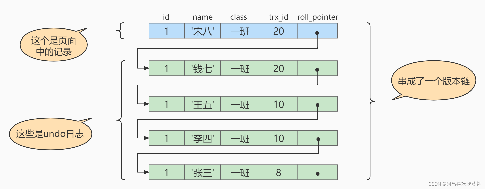
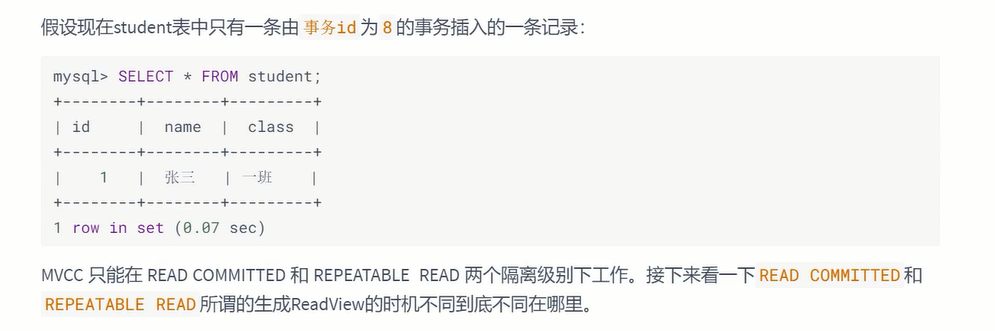
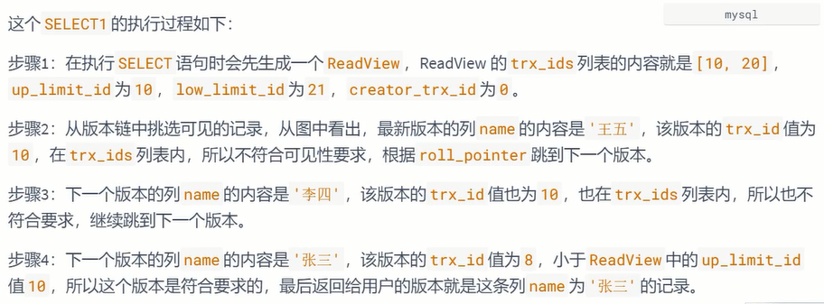

# 多版本并发控制

`隐藏字段（rowId+trxId）+undo log+readview`

## 一、什么是MVCC

MVCC（Multiversion Concurrency Control），多版本并发控制。顾名思义，MVCC是通过数据行的`多个版本管理来实现数据库的并发控制`。这项技术使得在InnoDB的事务隔离级别下执行`一致性`读操作有了保证。换言之，就是为了查询一些正在被另一个事务更新的行，并且可以看到它们被更新之前的值，这样在做查询的时候就不用等待另一个事务释放锁。

MVCC没有正式的标准，在不同的DBMS 中MVCC的实现方式可能是不同的，也不是普遍使用的（大家可以参考相关的DBMS文档）。这里讲解InnoDB中MVCC的实现机制（MySQL其它的存储引擎并不支持它）

------

## 二、快照读与当前读

MVCC在MySQL InnoDB中的实现主要是为了提高数据库并发性能，用更好的方式去处理 `读-写冲突` ，做到即使有读写冲突时，也能做到 `不加锁` ， `非阻塞并发读` ，而这个读指的就是 `快照读` , 而非 `当前读` 。

`当前读实际上是一种加锁的操作`，是悲观锁的实现。而`MVCC本质是采用乐观锁思想`的一种方式。

### 1、快照读

快照读又叫一致性读，读取的是快照数据。**`不加锁`的简单的 SELECT 都属于快照读**，即不加锁的非阻塞读；比如这样：

```sql
SELECT * FROM player WHERE ...
```

之所以出现快照读的情况，是基于提高并发性能的考虑，快照读的实现是基于MVCC，它在很多情况下，避免了加锁操作，降低了开销。

既然是基于多版本，那么快照读可能读到的并不一定是数据的最新版本，而有可能是之前的历史版本。

快照读的前提是隔离级别不是串行级别，串行级别下的快照读会退化成当前读。

### 2、当前读

当前读读取的是记录的最新版本（最新数据，而不是历史版本的数据），读取时还要保证其他并发事务不能修改当前记录，会对读取的记录进行加锁。**`加锁的` SELECT，或者对数据进行增删改都会进行当前读**。

比如：

```sql
SELECT * FROM student LOCK IN SHARE MODE;  # 共享锁
SELECT * FROM student FOR UPDATE; # 排他锁

INSERT INTO student values ...  # 排他锁
DELETE FROM student WHERE ...  # 排他锁
UPDATE student SET ...  # 排他锁
```

------

## 三、复习

### 1、再谈隔离级别

我们知道事务有 `4` 个隔离级别，可能存在三种并发问题：[SQL标准]


在MySQL中，默认的隔离级别是可重复读，可以解决脏读和不可重复读的问题，如果仅从定义的角度来看，它并不能解决幻读问题。如果我们想要解决幻读问题，就需要采用串行化的方式，也就是将隔离级别提升到最高，但这样一来就会大幅降低数据库的事务并发能力。


MVCC 可以不采用锁机制，而是通过乐观锁的方式来解决不可重复读和幻读问题！它可以在大多数情况下替代行级锁，降低系统的开销。

【MySQL实现】**另图**：


### 2、隐藏字段、Undo Log版本链

undo日志的版本链，对于使用 `InnoDB` 存储引擎的表来说，它的聚簇索引记录中都包含两个必要的`隐藏列`。

- **trx_id** ：每次一个事务对某条聚簇索引记录进行改动时，都会把该事务的 `事务id` 赋值给`trx_id` 隐藏列。
- **roll_pointer** ：每次对某条聚簇索引记录进行改动时，都会把旧的版本写入到 `undo日志` 中，然后这个隐藏列就相当于一个指针，可以通过它来找到该记录修改前的信息。


> insert undo只在事务回滚时起作用，当事务提交后，该类型的undo日志就没用了，它占用的UndoLog Segment也会被`系统回收`（也就是该undo日志占用的Undo页面链表要么被重用，要么被释放）。

假设之后两个事务id分别为 `10` 、 `20` 的事务对这条记录进行 `UPDATE` 操作，操作流程如下：


每次对记录进行改动，都会记录一条undo日志，每条undo日志也都有一个 `roll_pointer 属性`（ INSERT 操作对应的undo日志没有该属性，因为该记录并没有更早的版本)，可以将这些 `undo日志都连起来`，串成一个`链表`：



对该记录每次更新后，都会将旧值放到一条 `undo日志` 中，就算是该记录的一个旧版本，随着更新次数的增多，所有的版本都会被 `roll_pointer` 属性连接成一个`链表`，我们把这个链表称之为 `版本链` ，版本链的头节点就是当前记录最新的值。

`每个版本`中还包含生成该版本时对应的 `事务id` 。

------

## 四、MVCC实现原理之ReadView

MVCC = 隐藏字段（rowId+trxId）+undolog+readview

`MVCC` 的实现依赖于：`隐藏字段`、`Undo Log`、`Read View`。

### 1、什么是ReadView

在MVCC机制中，多个事务对同一个行记录进行更新会产生多个历史快照，这些历史快照保存在Undo Log里。如果一个事务想要查询这个行记录，需要读取哪个版本的行记录呢？这时就需要用到ReadView 了，它帮我们解决了行的可见性问题。

ReadView 就是事务在使用MVCC机制进行`快照读操作时产生的读视图`。当事务启动时，会生成数据库系统当前的一个快照，InnoDB为每个事务构造了一个数组，用来记录并维护系统当前`活跃事务的ID`（“活跃”指的就是，启动了但还没提交）


- **隐藏字段**（rowId+trxId）
  - rowId：针对每一行`行格式`，都会对应有一个隐藏记录的rowid
  - trxId：一次`事务`的操作，就会生成一个trxid
- **Undo Log**
  根据隔离级别，来记录每次操作的数据记录，`多版本`
- **Read View**
  根据对应的对应的`undolog+trxid+隔离级别`，来`判断决定`是否能够查询的到某记录数据

### 2、设计思路

使用 `READ UNCOMMITTED` 隔离级别的事务，由于可以读到未提交事务修改过的记录，所以直接读取记录的最新版本就好了。

使用 `SERIALIZABLE` 隔离级别的事务，InnoDB规定使用加锁的方式来访问记录。

------

使用 `READ COMMITTED` 和 `REPEATABLE READ` 隔离级别的事务，都必须保证读到 `已经提交了的 事务`修改过的记录。假如另一个事务已经修改了记录但是尚未提交，是不能直接读取最新版本的记录的，**核心问题就是需要判断一下版本链中的哪个版本是当前事务可见的**，这是ReadView要解决的主要问题。

**MVCC解决的是`READ COMMITTED` 和 `REPEATABLE READ`隔离级别的问题**

这个ReadView中主要包含4个比较重要的内容，分别如下：


### 3、ReadView的规则

有了这个ReadView，这样在访问某条记录时，只需要按照下边的步骤判断记录的某个版本是否可见。


### 4、MVCC整体操作流程

了解了这些概念之后，我们来看下当查询一条记录的时候，系统如何通过MVCC找到它：

1. 首先获取事务自己的版本号，也就是事务 ID；
2. 获取 ReadView；
3. 查询得到的数据，然后与 ReadView 中的事务版本号进行比较；
4. 如果不符合 ReadView 规则，就需要从 Undo Log 中获取历史快照；
5. 最后返回符合规则的数据。


在隔离级别为读已提交（Read Committed）时，一个事务中的每一次 SELECT 查询都会重新获取一次Read View。

**如表所示**：


> **注意**，此时同样的查询语句都会重新获取一次 Read View，这时如果 Read View 不同，就可能产生不可重复读或者幻读的情况。


当隔离级别为可重复读的时候，就避免了不可重复读，这是因为一个事务只在第一次 SELECT 的时候会获取一次 Read View，而后面所有的 SELECT 都会复用这个 Read View，如下表所示：


------

## 五、举例说明



### 1、READ COMMITTED隔离级别下

**READ COMMITTED ：每次读取数据前都生成一个ReadView。**

现在有两个 事务id 分别为 10 、 20 的事务在执行：

```sql
# Transaction 10
BEGIN;
UPDATE student SET name="李四" WHERE id=1;
UPDATE student SET name="王五" WHERE id=1;

# Transaction 20
BEGIN;
# 更新了一些别的表的记录
...
```

此刻，表student 中 `id` 为 `1` 的记录得到的版本链表如下所示：

假设现在有一个使用 `READ COMMITTED` 隔离级别的事务开始执行：

```sql
# 使用READ COMMITTED隔离级别的事务
BEGIN;
# SELECT1：Transaction 10、20未提交   查询不会生成新的事务id，默认0
SELECT * FROM student WHERE id = 1; # 得到的列name的值为'张三'
```




之后，我们把 `事务id` 为 `10` 的事务提交一下：

```sql
# Transaction 10
BEGIN;

UPDATE student SET name="李四" WHERE id=1;
UPDATE student SET name="王五" WHERE id=1;

COMMIT;
```

然后再到 `事务id` 为 `20` 的事务中更新一下表 `student` 中 `id` 为 `1` 的记录：

```sql
# Transaction 20
BEGIN;

# 更新了一些别的表的记录
...
UPDATE student SET name="钱七" WHERE id=1;
UPDATE student SET name="宋八" WHERE id=1;

```

此刻，表student中 `id` 为 `1`的记录的版本链就长这样：

然后再到刚才使用 `READ COMMITTED` 隔离级别的事务中继续查找这个 id 为 1 的记录

**如下**：

```sql
# 使用READ COMMITTED隔离级别的事务
BEGIN;

# SELECT1：Transaction 10、20均未提交
SELECT * FROM student WHERE id = 1; # 得到的列name的值为'张三'

# SELECT2：Transaction 10提交，Transaction 20未提交
SELECT * FROM student WHERE id = 1; # 得到的列name的值为'王五'
```


### 2、REPEATABLE READ隔离级别下

使用 `REPEATABLE READ` 隔离级别的事务来说，只会在`第一次执行查询语句`时生成一个 `ReadView` ，之后的查询就`不会重复生成`了。

比如，系统里有两个 `事务id` 分别为 `10` 、 `20` 的事务在执行：

```sql
# Transaction 10
BEGIN;

UPDATE student SET name="李四" WHERE id=1;
UPDATE student SET name="王五" WHERE id=1;

# Transaction 20
BEGIN;

# 更新了一些别的表的记录
...
```

此刻，表student 中 `id` 为 `1` 的记录得到的版本链表如下所示：

假设现在有一个使用 `REPEATABLE READ` 隔离级别的事务开始执行：

```sql
# 使用REPEATABLE READ隔离级别的事务
BEGIN;

# SELECT1：Transaction 10、20未提交
SELECT * FROM student WHERE id = 1; # 得到的列name的值为'张三'
```


之后，我们把 `事务id`为 `10` 的事务提交一下，就像这样：

```sql
# Transaction 10
BEGIN;

UPDATE student SET name="李四" WHERE id=1;
UPDATE student SET name="王五" WHERE id=1;

COMMIT;
```

然后再到 `事务id` 为 `20` 的事务中更新一下表 student 中 `id` 为 `1` 的记录：

```sql
# Transaction 20
BEGIN;

# 更新了一些别的表的记录
...
UPDATE student SET name="钱七" WHERE id=1;
UPDATE student SET name="宋八" WHERE id=1;
```

此刻，表student 中 `id` 为 `1` 的记录的版本链长这样：

然后再到刚才使用 `REPEATABLE READ` 隔离级别的事务中继续查找这个 `id` 为 `1` 的记录
**如下**：

```sql
# 使用REPEATABLE READ隔离级别的事务
BEGIN;

# SELECT1：Transaction 10、20均未提交
SELECT * FROM student WHERE id = 1; # 得到的列name的值为'张三'

# SELECT2：Transaction 10提交，Transaction 20未提交
SELECT * FROM student WHERE id = 1; # 得到的列name的值仍为'张三'
```


### 3、如何解决幻读

接下来说明InnoDB 是如何解决幻读的。

假设现在表 student 中只有一条数据，数据内容中，主键 `id=1`，隐藏的 `trx_id=10`，它的 `undo log` 如下图所示。


此时表student 中就有三条数据了，对应的 undo 如下图所示：

步骤3：接着事务 A 开启第二次查询，根据可重复读隔离级别的规则，此时事务 A 并不会再重新生成ReadView。此时表 student 中的 3 条数据都满足 where id>=1 的条件，因此会先查出来。然后根据ReadView 机制，判断每条数据是不是都可以被事务 A 看到。

1）首先 id=1 的这条数据，前面已经说过了，可以被事务 A 看到。
2）然后是 id=2 的数据，它的 trx_id=30，此时事务 A 发现，这个值处于 up_limit_id 和 low_limit_id 之间，因此还需要再判断 30 是否处于 trx_ids 数组内。由于事务 A 的 trx_ids=[20,30]，因此在数组内，这表示 id=2 的这条数据是与事务 A 在同一时刻启动的其他事务提交的，所以这条数据不能让事务 A 看到。
3）同理，id=3 的这条数据，trx_id 也为 30，因此也不能被事务 A 看见。


**结论**：
最终事务 A 的第二次查询，只能查询出 id=1 的这条数据。

这和事务 A 的第一次查询的结果是一样的，因此没有出现幻读现象，所以说在 MySQL 的可重复读隔离级别下，不存在幻读问题。

------

## 六、总结

这里介绍了 `MVCC` 在 `READ COMMITTD` 、 `REPEATABLE READ` 这两种隔离级别的事务在执行快照读操作时访问记录的版本链的过程。这样使不同事务的 `读-写` 、 `写-读` 操作并发执行，从而提升`系统性能`。

核心点在于 `ReadView` 的原理， `READ COMMITTD` 、 `REPEATABLE READ` 这两个隔离级别的一个`很大不同就是生成ReadView的时机不同`：

- **READ COMMITTD** 在`每一次`进行普通SELECT操作前`都会生成一个ReadView`
- **REPEATABLE READ** 只在`第一次`进行普通SELECT操作前`生成一个ReadView`，之后的查询操作`都重复使用这个ReadView`就好了。所以当前事务中不会读取到其他事务已经提交的内容，避免了幻读

