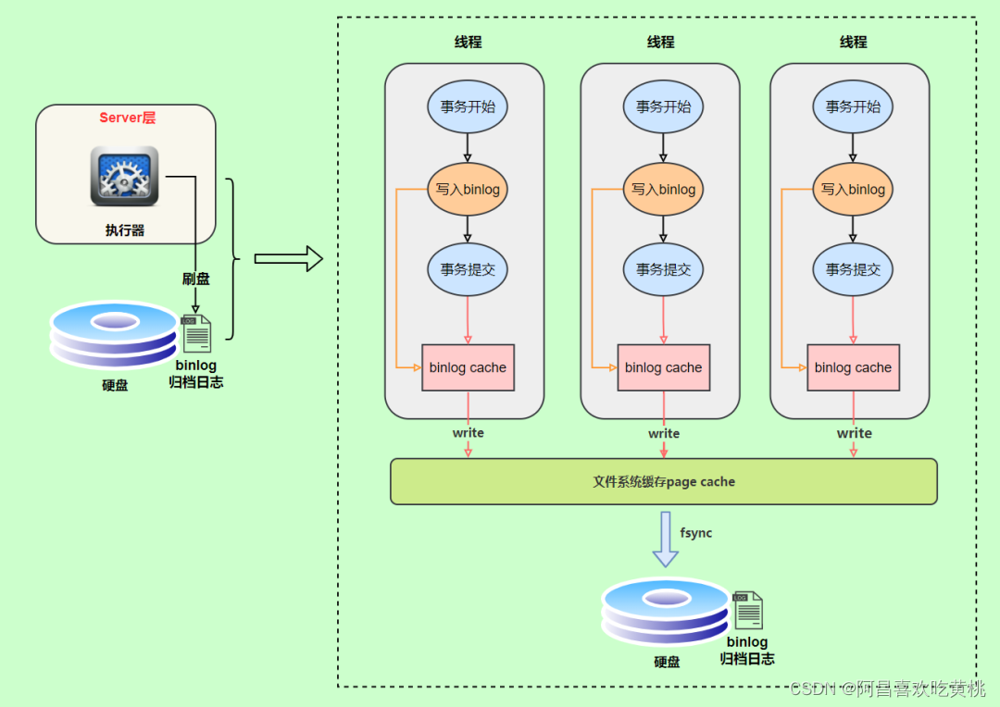

# 其他数据库日志


## 一、MySQL支持的日志

### 1、日志类型

MySQL有不同类型的日志文件，用来存储不同类型的日志，分为 `二进制日志` 、 `错误日志` 、 `通用查询日志`和 `慢查询日志` ，这也是常用的4种。

`MySQL 8`又新增两种支持的日志： `中继日志` 和 `数据定义语句日志` 。

使用这些日志文件，可以查看MySQL内部发生的事情。

这6类**日志分别**为：

除`二进制日志`外，其他日志都是 `文本文件` 。 默认情况下，所有日志创建于 `MySQL数据目录` 中。

### 2、日志的弊端

+ 日志功能会`降低MySQL数据库的性能`。例如，在查询非常频繁的MySQL数据库系统中，如果开启了通用查询日志和慢查询日志，MySQL数据库会花费很多时间记录日志。
+ 日志会`占用大量的磁盘空间`。对于用户量非常大、操作非常频繁的数据库，日志文件需要的存储空间设置比数，据库文件需要的存储空间还要大。

------

## 二、慢查询日志(slow query log)

[四、定位执行慢的 SQL：慢查询日志](https://blog.csdn.net/qq_43284469/article/details/122643587)

------

## 三、通用查询日志(general query log)

通用查询日志用来 `记录用户的所有操作`，包括启动和关闭MySQL服务、所有用户的连接开始时间和截止时间、发给 MySQL 数据库服务器的所有 SQL 指令等。

当我们的数据发生异常时，**查看通用查询日志，还原操作时的具体场景**，可以帮助我们准确定位问题。

### 1、查看当前状态

```shell
mysql> SHOW VARIABLES LIKE '%general%';
+------------------+------------------------------+
| Variable_name  | Value            |
+------------------+------------------------------+
| general_log   | OFF             | #通用查询日志处于关闭状态
| general_log_file | /var/lib/mysql/atguigu01.log | #通用查询日志文件的名称是atguigu01.log
+------------------+------------------------------+
2 rows in set (0.03 sec)
```

### 2、启动日志

**方式1：永久性方式**：
修改my.cnf或者my.ini配置文件来设置。在[mysqld]组下加入log选项，并重启MySQL服务。格式如下：

```shell
[mysqld]
general_log=ON
general_log_file=[path[filename]] #日志文件所在目录路径，filename为日志文件名
```

如果不指定目录和文件名，通用查询日志将默认存储在MySQL数据目录中的hostname.log文件中，hostname表示主机名。

**方式2：临时性方式**:

```sql
SET GLOBAL general_log=on;  # 开启通用查询日志

SET GLOBAL general_log_file=’path/filename’; # 设置日志文件保存位置
```

对应的，关闭操作SQL命令如下：

```sql
SET GLOBAL general_log=off;  # 关闭通用查询日志
```

查看设置后情况：

```sql
SHOW VARIABLES LIKE 'general_log%';
```

### 3、查看日志

通用查询日志是以 `文本文件` 的形式存储在文件系统中的，可以使用 `文本编辑器` 直接打开日志文件。每台MySQL服务器的通用查询日志内容是不同的。

> - 在Windows操作系统中，使用文本文件查看器；
> - 在Linux系统中，可以使用vi工具或者gedit工具查看；
> - 在Mac OSX系统中，可以使用文本文件查看器或者vi等工具查看。

从`SHOW VARIABLES LIKE 'general_log%';`结果中可以看到通用查询日志的位置。

```shell
/usr/sbin/mysqld, Version: 8.0.26 (MySQL Community Server - GPL). started with:
Tcp port: 3306 Unix socket: /var/lib/mysql/mysql.sock
Time         Id Command  Argument
2022-01-04T07:44:58.052890Z     10 Query   SHOW VARIABLES LIKE '%general%'
2022-01-04T07:45:15.666672Z     10 Query   SHOW VARIABLES LIKE 'general_log%'
2022-01-04T07:45:28.970765Z     10 Query   select * from student
2022-01-04T07:47:38.706804Z     11 Connect  root@localhost on  using Socket
2022-01-04T07:47:38.707435Z     11 Query   select @@version_comment limit 1
2022-01-04T07:48:21.384886Z     12 Connect  root@172.16.210.1 on  using TCP/IP
2022-01-04T07:48:21.385253Z     12 Query   SET NAMES utf8
2022-01-04T07:48:21.385640Z     12 Query   USE `atguigu12`
2022-01-04T07:48:21.386179Z     12 Query   SHOW FULL TABLES WHERE Table_Type !='VIEW'
2022-01-04T07:48:23.901778Z     13 Connect  root@172.16.210.1 on  using TCP/IP
2022-01-04T07:48:23.902128Z     13 Query   SET NAMES utf8
2022-01-04T07:48:23.905179Z     13 Query   USE `atguigu`
2022-01-04T07:48:23.905825Z     13 Query   SHOW FULL TABLES WHERE Table_Type !='VIEW'
2022-01-04T07:48:32.163833Z     14 Connect  root@172.16.210.1 on  using TCP/IP
2022-01-04T07:48:32.164451Z     14 Query   SET NAMES utf8
2022-01-04T07:48:32.164840Z     14 Query   USE `atguigu`
2022-01-04T07:48:40.006687Z     14 Query   select * from account
```

在通用查询日志里面，我们可以清楚地看到，什么时候开启了新的客户端登陆数据库，登录之后做了什么 SQL 操作，针对的是哪个数据表等信息。

### 4、停止日志

**方式1：永久性方式**：
修改 `my.cnf` 或者 `my.ini` 文件，把[mysqld]组下的 `general_log` 值设置为 `OFF` 或者把`general_log`一项注释掉。修改保存后，再 `重启MySQL服务` ，即可生效。

举例1：

```shell
[mysqld]
general_log=OFF
```

举例2：

```shell
[mysqld]
#general_log=ON
```

**方式2：临时性方式**

使用SET语句停止MySQL通用查询日志功能：

```sql
SET GLOBAL general_log=off;
```

查询通用日志功能：

```sql
SHOW VARIABLES LIKE 'general_log%';
```

### 5、删除/刷新日志

如果数据的使用非常频繁，那么通用查询日志会`占用服务器非常大的磁盘空间`。

数据管理员可以删除很长时间之前的查询日志，以保证MySQL服务器上的硬盘空间。

**手动删除文件**:

```sql
SHOW VARIABLES LIKE 'general_log%';
```

可以看出，通用查询日志的目录默认为MySQL数据目录。在该目录下`手动删除`通用查询日志`atguigu01.log`。

使用如下命令重新生成查询日志文件，具体命令如下。

刷新MySQL数据目录，发现创建了新的日志文件。`前提一定要开启通用日志`。

```sql
mysqladmin -uroot -p flush-logs

-- 输入密码
```

------

## 四、错误日志(error log)

错误日志记录了MySQL服务器启动、停止运行的时间，以及系统启动、运行和停止过程中的诊断信息，包括`错误`、`警告`和`提示`等。
通过错误日志可以查看系统的运行状态，便于即时发现故障、修复故障。如果MySQL服务出现异常，错误日志是发现问题、解决故障的`首选`。

### 1、启动日志

在MySQL数据库中，`错误日志`功能是 `默认开启` 的。而且，`错误日志 无法被禁止` 。

默认情况下，错误日志存储在MySQL数据库的数据文件夹下，名称默认为 `mysqld.log （Linux系统）`或`hostname.err （mac系统）`。

如果需要制定文件名，则需要在my.cnf或者my.ini中做如下配置：

```shell
[mysqld]
log-error=[path/[filename]] #path为日志文件所在的目录路径，filename为日志文件名
```

修改配置项后，需要`重启MySQL服务`以生效。

### 2、查看日志

MySQL错误日志是以`文本文件形式`存储的，可以使用文本编辑器直接查看。

查询错误日志的存储路径：

```shell
mysql> SHOW VARIABLES LIKE 'log_err%';
+----------------------------+----------------------------------------+
| Variable_name       | Value                 |
+----------------------------+----------------------------------------+
| log_error         | /var/log/mysqld.log          |
| log_error_services     | log_filter_internal; log_sink_internal |
| log_error_suppression_list |                    |
| log_error_verbosity    | 2                   |
+----------------------------+----------------------------------------+
4 rows in set (0.01 sec)
```

执行结果中可以看到错误日志文件是`mysqld.log`，位于MySQL`默认的数据目录`下。

### 3、删除\刷新日志

对于很久以前的错误日志，数据库管理员查看这些错误日志的可能性不大，可以将这些错误日志删除，以保证MySQL服务器上的 `硬盘空间` 。

MySQL的错误日志是以文本文件的形式存储在文件系统中的，可以`直接删除` 。

```shell
[root@atguigu01 log]# mysqladmin -uroot -p flush-logs
Enter password:
mysqladmin: refresh failed; error: 'Could not open file '/var/log/mysqld.log' for
error logging.'
```

**官网提示**：

**补充操作【解决不能删除】**：

```shell
install -omysql -gmysql -m0644 /dev/null /var/log/mysqld.log

mysqladmin -uroot -p flush-logs
```


------

## 五、二进制日志(bin log)

binlog可以说是MySQL中比较 `重要` 的日志了，在日常开发及运维过程中，经常会遇到。
binlog即binary log，二进制日志文件，也叫作变更日志（update log）。

它记录了数据库所有执行的`DDL` 和 `DML` 等数据库更新事件的语句，但是不包含没有修改任何数据的语句（如数据查询语句select、show等）。

它以`事件形式`记录并保存在`二进制`文件中。通过这些信息，我们可以再现数据更新操作的全过程。

> 如果想要记录所有语句（例如，为了识别有问题的查询），需要使用通用查询日志。

- 
  

### 1、查看默认情况

查看记录二进制日志是否开启：在`MySQL8中默认`情况下，`二进制文件是开启的`。

```shell
mysql> show variables like '%log_bin%';
+---------------------------------+----------------------------------+
| Variable_name          | Value              |
+---------------------------------+----------------------------------+
| log_bin             | ON                |
| log_bin_basename        | /var/lib/mysql/binlog      |
| log_bin_index          | /var/lib/mysql/binlog.index   |
| log_bin_trust_function_creators | OFF               |
| log_bin_use_v1_row_events    | OFF   |  # 主从同步时，不信任存储过程和函数，
| sql_log_bin           | ON                |
+---------------------------------+----------------------------------+
6 rows in set (0.00 sec)
```

### 2、日志参数设置

**方式1：永久性方式**：

修改MySQL的 `my.cnf`或 `my.ini`文件可以设置二进制日志的相关参数：

```shell
[mysqld]
#启用二进制日志
log-bin=atguigu-bin  
binlog_expire_logs_seconds=600 #  
max_binlog_size=100M
```


`systemctl restart mysqld`重新启动MySQL服务，查询二进制日志的信息，执行结果：

```mysql
mysql> show variables like '%log_bin%';
+---------------------------------+----------------------------------+
| Variable_name          | Value              |
+---------------------------------+----------------------------------+
| log_bin             | ON                |
| log_bin_basename        | /var/lib/mysql/atguigu-bin    |
| log_bin_index          | /var/lib/mysql/atguigu-bin.index |
| log_bin_trust_function_creators | OFF               |
| log_bin_use_v1_row_events    | OFF               |
| sql_log_bin           | ON                |
+---------------------------------+----------------------------------+
6 rows in set (0.00 sec)
```

**设置带文件夹的bin-log日志存放目录**

如果想改变日志文件的目录和名称，可以对my.cnf或my.ini中的log_bin参数修改如下：

```shell
[mysqld]
log-bin="/var/lib/mysql/binlog/atguigu-bin"
```

注意：新建的文件夹需要使用mysql用户，使用下面的命令即可。

```shell
chown -R -v mysql:mysql binlog
```

> mysql 的数据文件和binlog文件最好不要放在同一个磁盘上，规避风险

------

**方式2：临时性方式**:

如果不希望通过修改配置文件并重启的方式设置二进制日志的话，还可以使用如下指令，需要注意的是在mysql8中只有 `会话级别` 的设置，没有了global级别的设置。

```sql
# global 级别
mysql> set global sql_log_bin=0;
ERROR 1228 (HY000): Variable 'sql_log_bin' is a SESSION variable and can`t be used with SET GLOBAL

# session级别
mysql> SET sql_log_bin=0;
Query OK, 0 rows affected (0.01 秒)
```

### 3、查看日志

当MySQL创建二进制日志文件时，先创建一个以“filename”为名称、以“.index”为后缀的文件，再创建一个以“filename”为名称、以“.000001”为后缀的文件。

MySQL服务 `重新启动一次` ，以“.000001”为后缀的文件就会增加一个，并且后缀名按1递增。即日志文件的个数与MySQL服务启动的次数相同；如果日志长度超过了 `max_binlog_size` 的上限（`默认是1GB`），就会创建一个新的日志文件。


查看当前的二进制日志文件列表及大小。指令如下：

```sql
mysql> SHOW BINARY LOGS;
+--------------------+-----------+-----------+
| Log_name      | File_size | Encrypted |
+--------------------+-----------+-----------+
| atguigu-bin.000001 | 156    | No    |
+--------------------+-----------+-----------+
1 行于数据集 (0.02 秒)
```

下面命令将行事件以 `伪SQL的形式` 表现出来

```mysql
mysqlbinlog -v "/var/lib/mysql/binlog/atguigu-bin.000002"

#220105 9:16:37 server id 1 end_log_pos 324 CRC32 0x6b31978b Query  thread_id=10 
exec_time=0   error_code=0
SET TIMESTAMP=1641345397/*!*/;
SET @@session.pseudo_thread_id=10/*!*/;
SET @@session.foreign_key_checks=1, @@session.sql_auto_is_null=0,
@@session.unique_checks=1, @@session.autocommit=1/*!*/;
SET @@session.sql_mode=1168113696/*!*/;
SET @@session.auto_increment_increment=1, @@session.auto_increment_offset=1/*!*/;
/*!\C utf8mb3 *//*!*/;
SET
@@session.character_set_client=33,@@session.collation_connection=33,@@session.collatio
n_server=255/*!*/;
SET @@session.lc_time_names=0/*!*/;
SET @@session.collation_database=DEFAULT/*!*/;
/*!80011 SET @@session.default_collation_for_utf8mb4=255*//*!*/;
BEGIN
/*!*/;
# at 324
#220105 9:16:37 server id 1 end_log_pos 391 CRC32 0x74f89890 Table_map:
`atguigu14`.`student` mapped to number 85
# at 391
#220105 9:16:37 server id 1 end_log_pos 470 CRC32 0xc9920491 Update_rows: table id
85 flags: STMT_END_F
BINLOG '
dfHUYRMBAAAAQwAAAIcBAAAAAFUAAAAAAAEACWF0Z3VpZ3UxNAAHc3R1ZGVudAADAw8PBDwAHgAG
AQEAAgEhkJj4dA==
dfHUYR8BAAAATwAAANYBAAAAAFUAAAAAAAEAAgAD//8AAQAAAAblvKDkuIkG5LiA54+tAAEAAAAL
5byg5LiJX2JhY2sG5LiA54+tkQSSyQ==
'/*!*/;
### UPDATE `atguigu`.`student`
### WHERE
###  @1=1
###  @2='张三'
###  @3='一班'
### SET
###  @1=1
###  @2='张三_back'
###  @3='一班'
# at 470
#220105 9:16:37 server id 1 end_log_pos 501 CRC32 0xca01d30f Xid = 15
COMMIT/*!*/;

```

前面的命令同时显示binlog格式的语句，使用如下命令不显示它

```sql
mysqlbinlog -v --base64-output=DECODE-ROWS "/var/lib/mysql/binlog/atguigu-bin.000002"

#220105 9:16:37 server id 1 end_log_pos 324 CRC32 0x6b31978b Query  thread_id=10 
exec_time=0   error_code=0
SET TIMESTAMP=1641345397/*!*/;
SET @@session.pseudo_thread_id=10/*!*/;
SET @@session.foreign_key_checks=1, @@session.sql_auto_is_null=0,
@@session.unique_checks=1, @@session.autocommit=1/*!*/;
SET @@session.sql_mode=1168113696/*!*/;
SET @@session.auto_increment_increment=1, @@session.auto_increment_offset=1/*!*/;
/*!\C utf8mb3 *//*!*/;
SET
@@session.character_set_client=33,@@session.collation_connection=33,@@session.collatio
n_server=255/*!*/;
SET @@session.lc_time_names=0/*!*/;
SET @@session.collation_database=DEFAULT/*!*/;
/*!80011 SET @@session.default_collation_for_utf8mb4=255*//*!*/;
BEGIN
/*!*/;
# at 324
#220105 9:16:37 server id 1 end_log_pos 391 CRC32 0x74f89890 Table_map:
`atguigu14`.`student` mapped to number 85
# at 391
#220105 9:16:37 server id 1 end_log_pos 470 CRC32 0xc9920491 Update_rows: table id
85 flags: STMT_END_F
### UPDATE `atguigu14`.`student`
### WHERE
###  @1=1
###  @2='张三'
###  @3='一班'
### SET
###  @1=1
###  @2='张三_back'
###  @3='一班'
# at 470
#220105 9:16:37 server id 1 end_log_pos 501 CRC32 0xca01d30f Xid = 15
```

关于mysqlbinlog工具的使用技巧还有很多，例如只解析对某个库的操作或者某个时间段内的操作等。简单分享几个常用的语句，更多操作可以参考官方文档。

```sql
# 可查看参数帮助
mysqlbinlog --no-defaults --help

# 查看最后100行
mysqlbinlog --no-defaults --base64-output=decode-rows -vv atguigu-bin.000002 |tail -100

# 根据position查找
mysqlbinlog --no-defaults --base64-output=decode-rows -vv atguigu-bin.000002 |grep -A 20 '4939002'
```

上面这种办法读取出binlog日志的全文内容比较多，不容易分辨查看到pos点信息，下面介绍一种更为方便的查询命令：

```sql
mysql> show binlog events [IN 'log_name'] [FROM pos] [LIMIT [offset,] row_count];
```


```mysql
mysql> show binlog events in 'atguigu-bin.000002';

+--------------------+-----+----------------+-----------+-------------+---------------
--------------------------------------------------------------+
| Log_name      | Pos | Event_type   | Server_id | End_log_pos | Info     
                              |
+--------------------+-----+----------------+-----------+-------------+---------------
--------------------------------------------------------------+
| atguigu-bin.000002 | 4  | Format_desc  | 1     | 125     | Server ver:
8.0.26, Binlog ver: 4                      |
| atguigu-bin.000002 | 125 | Previous_gtids | 1     | 156     |       
                               |
| atguigu-bin.000002 | 156 | Anonymous_Gtid | 1     | 235     | SET
@@SESSION.GTID_NEXT= 'ANONYMOUS'                    |
| atguigu-bin.000002 | 235 | Query     | 1     | 324     | BEGIN    
                               |
| atguigu-bin.000002 | 324 | Table_map   | 1     | 391     | table_id: 85
(atguigu14.student)                      |
| atguigu-bin.000002 | 391 | Update_rows  | 1     | 470     | table_id: 85
flags: STMT_END_F                       |
| atguigu-bin.000002 | 470 | Xid      | 1     | 501     | COMMIT /*
xid=15 */                             |
| atguigu-bin.000002 | 501 | Anonymous_Gtid | 1     | 578     | SET
@@SESSION.GTID_NEXT= 'ANONYMOUS'                    |
| atguigu-bin.000002 | 578 | Query     | 1     | 721     | use
`atguigu14`; create table test(id int, title varchar(100)) /* xid=19 */ |
| atguigu-bin.000002 | 721 | Anonymous_Gtid | 1     | 800     | SET
@@SESSION.GTID_NEXT= 'ANONYMOUS'                    |
| atguigu-bin.000002 | 800 | Query     | 1     | 880     | BEGIN    
                               |
| atguigu-bin.000002 | 880 | Table_map   | 1     | 943     | table_id: 89
(atguigu14.test)                        |
| atguigu-bin.000002 | 943 | Write_rows   | 1     | 992     | table_id: 89
flags: STMT_END_F                       |
| atguigu-bin.000002 | 992 | Xid      | 1     | 1023    | COMMIT /*
xid=21 */      
+--------------------+-----+----------------+-----------+-------------+---------------
--------------------------------------------------------------+
14 行于数据集 (0.02 秒)
```


上面我们讲了这么多都是基于binlog的默认格式，binlog格式查看

```mysql
mysql> show variables like 'binlog_format';

+---------------+-------+
| Variable_name | Value |
+---------------+-------+
| binlog_format | ROW  |
+---------------+-------+
1 行于数据集 (0.02 秒)
```

除此之外，binlog还有2种格式，分别是`Statement`和`Mixed`


### 4、使用日志恢复数据

如果MySQL服务器启用了二进制日志，在数据库出现意外丢失数据时，可以使用MySQLbinlog工具从指定的时间点开始（例如，最后一次备份）直到现在或另一个指定的时间点的日志中恢复数据。

`mysqlbinlog`恢复数据的语法如下：

```sql
mysqlbinlog [option] filename|mysql –uuser -ppass;
```

这个命令可以这样理解：使用mysqlbinlog命令来读取filename中的内容，然后使用mysql命令将这些内容恢复到数据库中。

**注意**：

> 使用mysqlbinlog命令进行恢复操作时，必须是编号小的先恢复，例如atguigu-bin.000001必须在atguigu-bin.000002之前恢复。

```mysql
 flush logs; -- 恢复数据前使用`flush logs；`，重新生成一个binglog文件记录恢复的操作
 
 show binlog events in 'atguigu-bin.000002';  -- 查看恢复的起始节点，注意begin位置的id才算一个开始
 
 
 mysqlbinlog --start-position=884 --stop-position=1729 --database=atguigudb3 /var/lib/atguigu-bin.00005 |mysql –uroot -ppass -v atguigu3;
 
-- 说明：
    --start-position=884  id 884 开始恢复
    --stop-position=1729   id 1729 结束
    --database=atguigudb3 数据库
    /var/lib/atguigu-bin.00005  binlog的文件地址
 
```


### 5、删除二进制日志

MySQL的二进制文件可以配置自动删除，同时MySQL也提供了安全的手动删除二进制文件的方法。

PURGE MASTER LOGS 只删除指定部分的二进制日志文件， RESET MASTER 删除所有的二进制日志文件。

**具体如下**：

*PURGE MASTER LOGS：删除指定日志文件*

PURGE MASTER LOGS语法如下：

```sql
PURGE {MASTER | BINARY} LOGS TO ‘指定日志文件名’
PURGE {MASTER | BINARY} LOGS BEFORE ‘指定日期’
```


### 6、其它场景

二进制日志可以通过`数据库的全量备份`和二进制日志中保存的`增量信息`，完成数据库的`无损失恢复`。但是，如果遇到数据量大、数据库和数据表很多（比如分库分表的应用）的场景，用二进制日志进行数据恢复，是很有挑战性的，因为起止位置不容易管理。

在这种情况下，一个有效的解决办法是`配置主从数据库服务器`，甚至是`一主多从`的架构，把二进制日志文件的内容通过中继日志，同步到从数据库服务器中，这样就可以有效避免数据库故障导致的数据异常等问题。

------

## 六、再谈二进制日志(binlog)

### 1、写入机制

binlog的写入时机也非常简单，事务执行过程中，先把日志写到 `binlog cache` ，事务提交的时候，再把binlog cache写到binlog文件中。（类比redo log）

因为一个事务的binlog不能被拆开，无论这个事务多大，也要确保一次性写入，所以系统会给每个线程分配一个块内存作为binlog cache。


write和fsync的时机，可以由参数 `sync_binlog` 控制，默认是 `0` 。为0的时候，表示每次提交事务都只write，`由系统自行判断什么时候执行fsync`。虽然性能得到提升，但是机器宕机，page cache里面的binglog 会丢失。

如下图：


为了安全起见，可以设置为 `1`，表示每次提交事务都会执行fsync，就如同`redo log 刷盘流程一样`。

最后还有一种折中方式，可以设置为N(N>1)，表示每次提交事务都write，但`累积N个事务后才fsync`。

在出现IO瓶颈的场景里，将sync_binlog设置成一个比较大的值，可以提升性能。同样的，如果机器宕机，会丢失最近N个事务的binlog日志。

### 2、binlog与redolog对比

+ redo log 它是`物理日志`，记录内容是“在某个数据页上做了什么修改”，属于InnoDB存储引擎层产生的。

+ 而binlog是`逻辑日志`，记录内容是语句的原始逻辑，类似于“给ID=2这一行的c字段加1"，属于MySQL Server层。

+ 虽然它们都属于持久化的保证，但是则重点不同。

  + redo log 让InnoDB存储引擎拥有了崩溃恢复能力。

  + binlog保证了MySQL集群架构的数据一致性。


### 3、两阶段提交

在执行更新语句过程，会记录redo log与binlog两块日志，以基本的事务为单位，redo log在事务执行过程中可以不断写入，而binlog只有在提交事务时才写入，所以redo log与binlog的 `写入时机` 不一样。

*redo log与binlog两份日志之间的逻辑不一致，会出现什么问题？*


为了解决两份日志之间的逻辑一致问题，InnoDB存储引擎使用`两阶段提交方案`。原理很简单，将redo log的写入拆成了两个步骤`prepare`和`commit`，这就是两阶段提交。


使用`两阶段提交`后，写入binlog时发生异常也不会有影响

最后就查看binlog日志，是否写入成功，如果成功就redolog就commit阶段就提交正常流程下去，如果失败，就回滚

另一个场景，redo log设置commit阶段发生异常，那会不会回滚事务呢？


并不会回滚事务，它会执行上图框住的逻辑，虽然redo log是处于prepare阶段，但是能通过事务id找到对应的binlog日志，所以MySQL认为是完整的，就会提交事务恢复数据。

------

## 七、中继日志(relay log)

### 1、介绍


### 2、查看中继日志

中继日志与二进制日志的格式相同，可以用 `mysqlbinlog` 工具进行查看。下面是中继日志的一个片段：

```shell
SET TIMESTAMP=1618558728/*!*/;
BEGIN
/*!*/;
# at 950
#210416 15:38:48 server id 1 end_log_pos 832 CRC32 0xcc16d651  Table_map:
`atguigu`.`test` mapped to number 91
# at 1000
#210416 15:38:48 server id 1 end_log_pos 872 CRC32 0x07e4047c  Delete_rows: table id
91 flags: STMT_END_F  -- server id 1 是主服务器，意思是主服务器删了一行数据
BINLOG '
CD95YBMBAAAAMgAAAEADAAAAAFsAAAAAAAEABGRlbW8ABHRlc3QAAQMAAQEBAFHWFsw=
CD95YCABAAAAKAAAAGgDAAAAAFsAAAAAAAEAAgAB/wABAAAAfATkBw==
'/*!*/;
# at 1040
```

这一段的意思是，主服务器（“server id 1”）对表 atguigu.test 进行了 2 步操作：

```shell
定位到表 atguigu.test 编号是 91 的记录，日志位置是 832；
删除编号是 91 的记录，日志位置是 872。
```

### 3、恢复的典型错误

如果从服务器宕机，有的时候为了系统恢复，要重装操作系统，这样就可能会导致你的 服务器名称 `与之前` 不同 。而中继日志里是 `包含从服务器名` 的。

在这种情况下，就可能导致你恢复从服务器的时候，无法从宕机前的中继日志里读取数据，以为是日志文件损坏了，其实是名称不对了。

`解决的方法也很简单，把从服务器的名称改回之前的名称`。