# 主从复制

## 一、主从复制概述

### 1、如何提升数据库并发能力


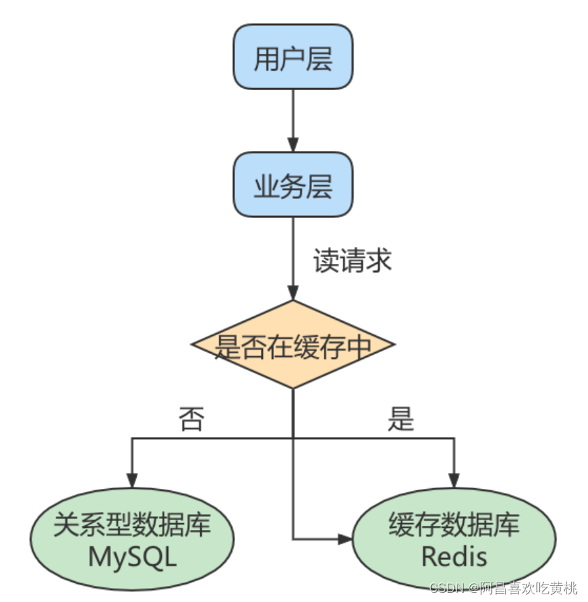
一般应用对数据库而言都是“ `读多写少` ”，也就说对数据库读取数据的压力比较大，有一个思路就是采用数据库集群的方案，做 `主从架构`、进行 `读写分离` ，这样同样可以提升数据库的并发处理能力。但并不是所有的应用都需要对数据库进行主从架构的设置，毕竟设置架构本身是有成本的。

如果我们的目的在于提升数据库高并发访问的效率，那么首先考虑的是如何 `优化SQL`和`索引` ，这种方式简单有效；其次才是采用 缓存的策略 ，比如使用 `Redis将热点数据保存在内存数据库中`，提升读取的效率；最后才是对数据库采用 `主从架构` ，进行`读写分离`。

### 2、主从复制的作用

主从同步设计不仅可以提高数据库的吞吐量，还有以下 3 个方面的作用。

**第1个作用**：读写分离。我们可以通过主从复制的方式来`同步数据`，然后通过读写分离提高数据库并发处理能力。
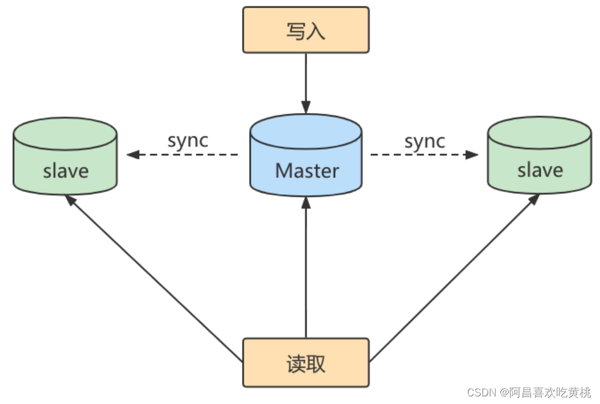

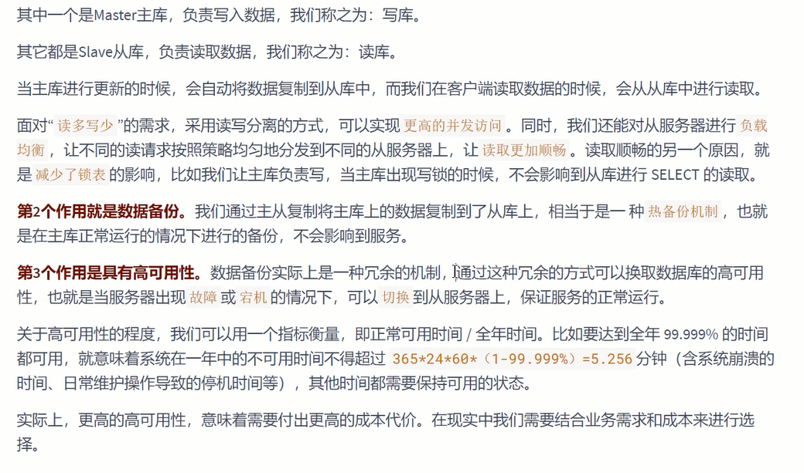

------

## 二、主从复制的原理

`Slave` 会从 `Master` 读取 `binlog` 来进行数据同步。

### 1、原理剖析

**三个线程**：

实际上主从同步的原理就是基于 binlog 进行数据同步的。在主从复制过程中，会基于 `3 个线程` 来操作，一个主库线程，两个从库线程。
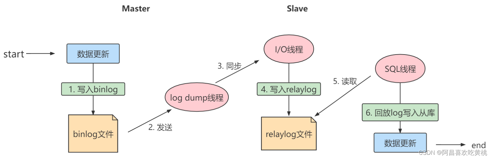

- `二进制日志转储线程` （Binlog dump thread）是一个主库线程。当从库线程连接的时候， 主库可以将二进制日志发送给从库，当主库读取事件（Event）的时候，会在 Binlog 上 `加锁` ，读取完成之后，再将锁释放掉。
- `从库 I/O 线程` 会连接到主库，向主库发送请求更新 Binlog。这时从库的 I/O 线程就可以读取到主库的二进制日志转储线程发送的 Binlog 更新部分，并且拷贝到本地的中继日志 （Relay log）。
- `从库 SQL 线程` 会读取从库中的中继日志，并且执行日志中的事件，将从库中的数据与主库保持同步。

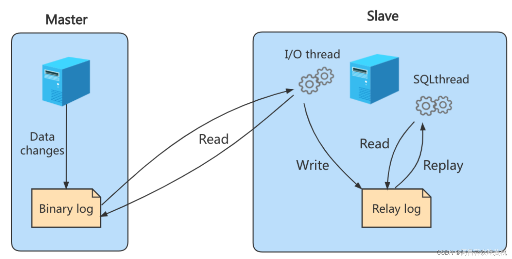

> 注意：不是所有版本的MySQL都默认开启服务器的二进制日志。在进行主从同步的时候，我们需要先检查服务器是否已经开启了二进制日志。
>
> 除非特殊指定，默认情况下从服务器会执行所有主服务器中保存的事件。也可以通过配置，使从服务器执行特定的事件。


**复制三步骤**:

步骤1：`Master`将写操作记录到二进制日志（binlog）。这些记录叫做`二进制日志事件`（binary log events）；

步骤2：`Slave`将`Master` 的binary log events拷贝到它的中继日志（`relay log`）；

步骤3：`Slave`重做中继日志中的事件，将改变应用到自己的数据库中。MySQL复制是异步的且串行化的，而且重启后从`接入点`开始复制。


**复制的问题**:`延时的问题，数据不一致`

### 2、复制的基本原则

+ 每个Slave只有一个Master
+ 每个Slave只能有一个唯一的服务器ID
+ 每个Master 可以有多个Slave


------

## 三、一主一从架构搭建

一台 `主机` 用于处理所有 `写请求` ，一台 `从机` 负责所有 `读请求` ，架构图如下：

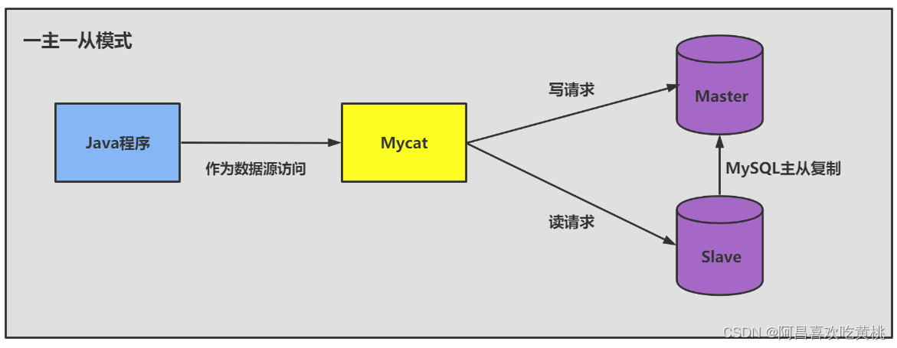

### 1、准备工作

- 准备 `2台 CentOS 虚拟机`
- 每台虚拟机上需要安装好MySQL (可以是MySQL8.0 )
  说明：前面我们讲过如何克隆一台CentOS。大家可以在一台CentOS上安装好MySQL，进而通过克隆的方式复制出1台包含MySQL的虚拟机。

**注意**：克隆的方式需要修改新克隆出来主机的：
① `MAC地址` ② `hostname` ③ `IP 地址` ④ `UUID` 。

此外，克隆的方式生成的虚拟机（包含MySQL Server），则克隆的虚拟机MySQL Server的UUID相同，必须修改，否则在有些场景会报错。

比如： `show slave status\G` ，报如下的错误：

```
Last_IO_Error: Fatal error: The slave I/O thread stops because master and slave have
equal MySQL server UUIDs; these UUIDs must be different for replication to work.
```

修改MySQL Server 的UUID方式： *保证从机和主机的uuid必须不同*

```shell
vim /var/lib/mysql/auto.cnf

# 重启MySQL服务
systemctl restart mysqld
```

### 2、主机配置文件

建议`mysql版本一致`且`后台以服务运行`，主从所有配置项都配置在`[mysqld]` 节点下，且都是小写字母。具体参数配置如下：

- 必选

  ```shell
  #[必须]主服务器唯一ID
  server-id=1 
  #[必须]启用二进制日志,指名路径。比如：自己本地的路径/log/mysqlbin
  log-bin=atguigu-bin
  ```
  
- 可选

  ```shell
  #[可选] 0（默认）表示读写（主机），1表示只读（从机）
  read-only=0
  #设置日志文件保留的时长，单位是秒
  binlog_expire_logs_seconds=6000
  #控制单个二进制日志大小。此参数的最大和默认值是1GB
  max_binlog_size=200M
  #[可选]设置不要复制的数据库
  binlog-ignore-db=test
  #[可选]设置需要复制的数据库,默认全部记录。比如：binlog-do-db=atguigu_master_slave
  binlog-do-db=需要复制的主数据库名字
  #[可选]设置binlog格式
  binlog_format=STATEMENT
  ```

重启后台mysqld服务，使配置生效

> 注意：先搭建完主从复制，再创建数据库。
> MySQL主从复制起始时，从机不继承主机数据。

**binlog格式设置**：
格式1： `STATEMENT模式` （基于SQL语句的复制(statement-based replication, SBR)）

```shell
binlog_format=STATEMENT
```

每一条会修改数据的`sql语句`会记录到binlog中。这是默认的binlog格式。
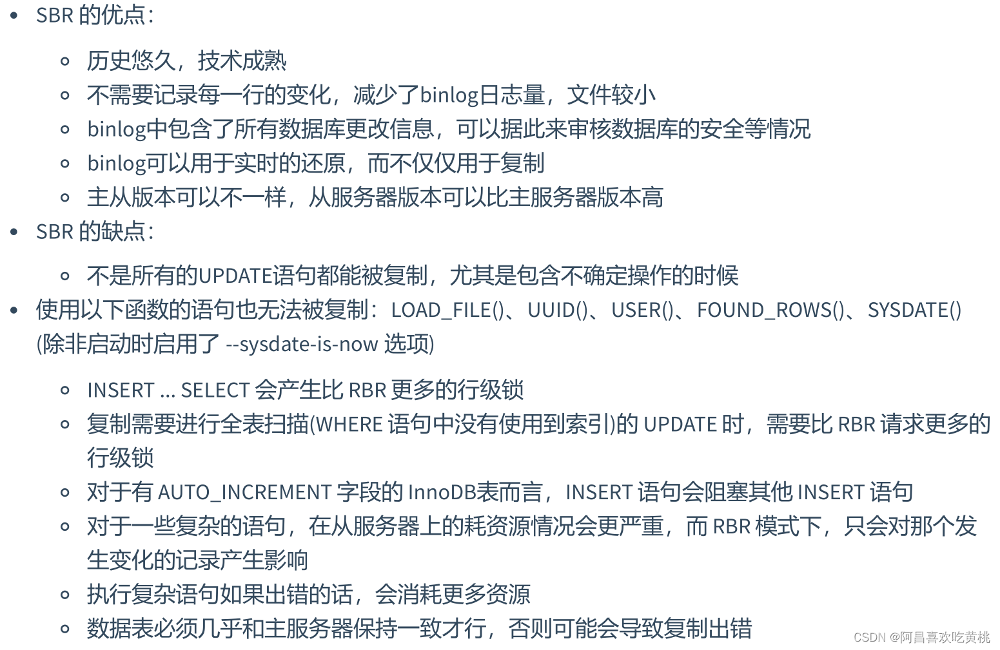

------

格式2：`ROW模式`（基于行的复制(row-based replication, RBR)）

```shell
binlog_format=ROW
```

5.1.5版本的MySQL才开始支持，不记录每条sql语句的上下文信息，`仅记录哪条数据被修改`了，`修改成什么样`了。

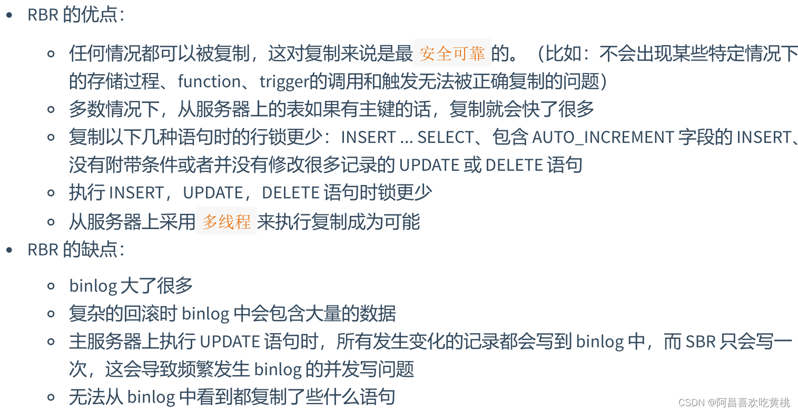

------

格式3：`MIXED模式`（混合模式复制(mixed-based replication, MBR)）

```shell
binlog_format=MIXED
```

从5.1.8版本开始，MySQL提供了Mixed格式，实际上就是`Statement与Row的结合`。

在Mixed模式下，一般的语句修改使用statment格式保存binlog。如一些函数，statement无法完成主从复制的操作，则采用row格式保存binlog。

MySQL会根据执行的每一条具体的sql语句来区分对待记录的日志形式，也就是在Statement和Row之间选择一种。

### 3、从机配置文件

要求主从所有配置项都配置在 `my.cnf`的 `[mysqld]` 栏位下，且都是小写字母。

- **必选**

```shell
#[必须]从服务器唯一ID
server-id=2
```

- **可选**

```shell
#[可选]启用中继日志
relay-log=mysql-relay
```

重启后台mysql服务，使配置生效。

**注意**：主从机都关闭防火墙

```shell
service iptables stop #CentOS 6

systemctl stop firewalld.service #CentOS 7
```

### 4、主机：建立账户并授权

```mysql
#在主机MySQL里执行授权主从复制的命令
GRANT REPLICATION SLAVE ON *.* TO 'slave1'@'从机器数据库IP' IDENTIFIED BY 'abc123';
#5.5,5.7
```

------

注意：如果使用的是MySQL8，需要如下的方式建立账户，并授权slave：

```mysql
CREATE USER 'slave1'@'%' IDENTIFIED BY '123456';

GRANT REPLICATION SLAVE ON *.* TO 'slave1'@'%';

#此语句必须执行。否则见下面。
ALTER USER 'slave1'@'%' IDENTIFIED WITH mysql_native_password BY '123456';

# 刷新权限
flush privileges;
```

**注意**：*在从机执行`show slave status\G`时报错*：

*Last_IO_Error: error connecting to master ‘slave1@192.168.1.150:3306’ - retry-time: 60 retries: 1 message: Authentication plugin ‘caching_sha2_password’ reported error: Authentication requires secure connection.*

------

**查询Master的状态，并记录下File和Position的值**。

```sql
show master status;
```

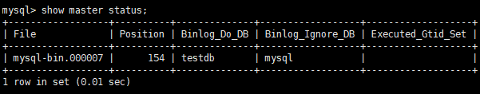
**记录下File和Position的值**

*执行完此步骤后不要再操作主服务器MySQL，防止主服务器状态值变化。*

### 5、从机：配置需要复制的主机

**步骤1**：从机上复制主机的命令

```mysql
CHANGE MASTER TO
MASTER_HOST='主机的IP地址',
MASTER_USER='主机用户名',
MASTER_PASSWORD='主机用户名的密码',
MASTER_LOG_FILE='mysql-bin.具体数字',
MASTER_LOG_POS=具体值;
```

**举例**：

```mysql
CHANGE MASTER TO MASTER_HOST='192.168.1.150',MASTER_USER='slave1',MASTER_PASSWORD='123456',MASTER_LOG_FILE='atguigu-bin.000007',MASTER_LOG_POS=154;
```

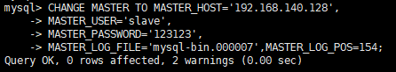
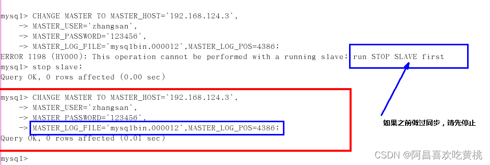

**步骤2**：

```sql
#启动slave同步
START SLAVE;
```

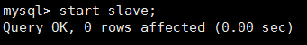
如果报错：
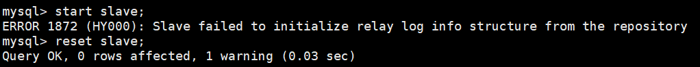
可以执行如下操作，删除之前的relay_log信息。然后重新执行 CHANGE MASTER TO …语句即可。

```sql
mysql> reset slave; #删除SLAVE数据库的relaylog日志文件，并重新启用新的relaylog文件
```

接着，查看同步状态：

```sql
SHOW SLAVE STATUS\G;
```

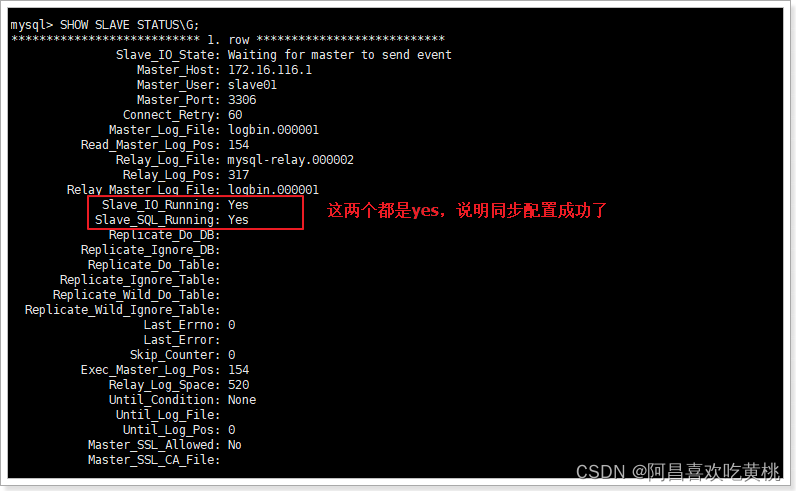
*上面两个参数都是Yes，则说明主从配置成功*！

显式如下的情况，就是不正确的。可能错误的原因有：

```
1. 网络不通
2. 账户密码错误
3. 防火墙
4. mysql配置文件问题
5. 连接服务器时语法
6. 主服务器mysql权限
```

### 6、停止主从同步

- **停止主从同步命令**：

```sql
stop slave;
```

- **如何重新配置主从**
  如果停止从服务器复制功能，再使用需要重新配置主从。否则会报错如下：
  
  重新配置主从，需要在从机上执行：

```sql
stop slave;

reset master; #删除Master中所有的binglog文件，并将日志索引文件清空，重新开始所有新的日志文件(慎用)
```


双主双从搭建

https://blog.csdn.net/xiaojin21cen/article/details/103913870

------

## 四、同步数据一致性问题

**主从同步的要求**：

+ 读库和写库的数据一致（最终一致）；
+ 写数据必须写到写库；
+ 读数据必须到读库（不一定）；

### 1、理解主从延迟问题

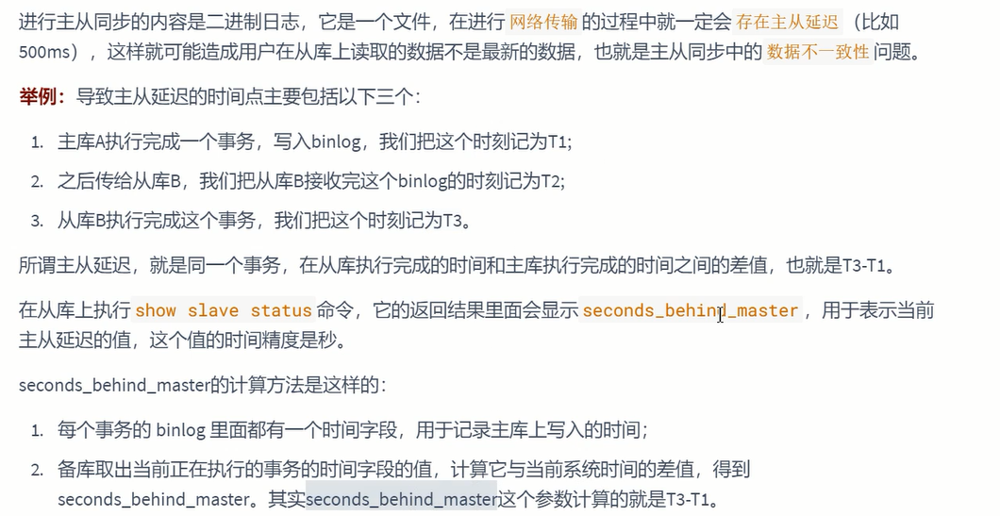


### 2、主从延迟问题原因

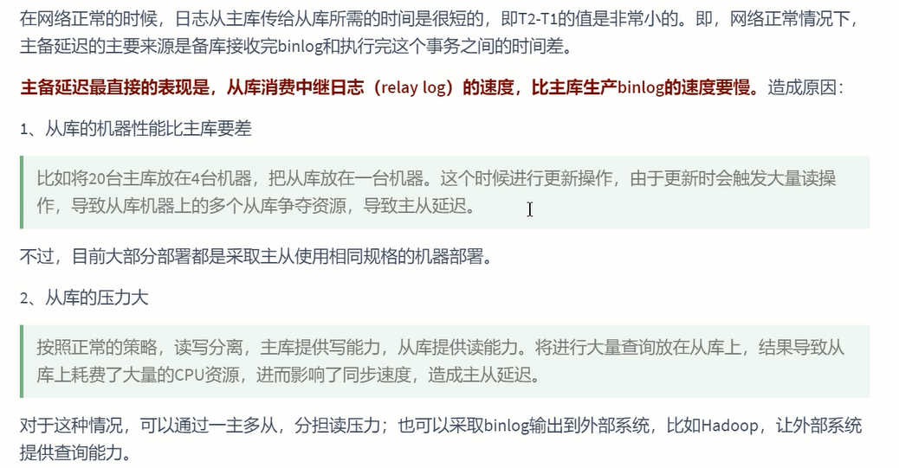

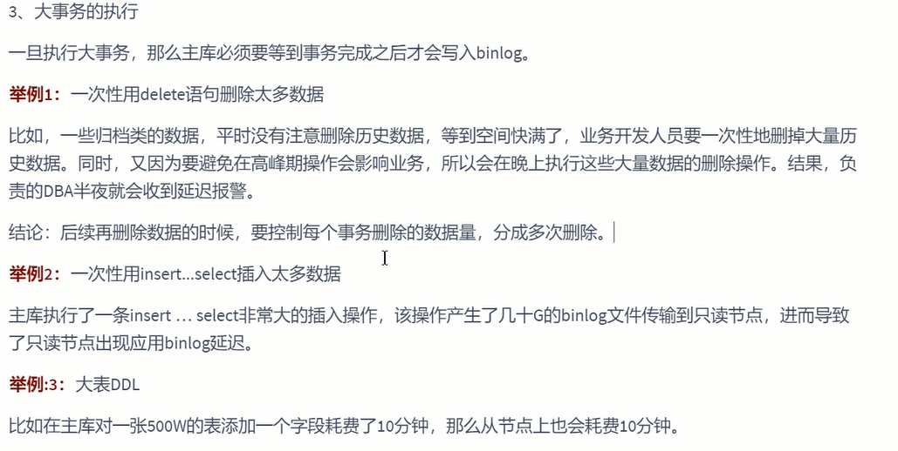


### 3、如何减少主从延迟

若想要减少主从延迟的时间，可以采取下面的办法：

1. 降低多线程大事务并发的概率，优化业务逻辑
2. 优化SQL，避免慢SQL， `减少批量操作` ，建议写脚本以update-sleep这样的形式完成。
3. `提高从库机器的配置` ，减少主库写binlog和从库读binlog的效率差。
4. 尽量采用 `短的链路` ，也就是主库和从库服务器的距离尽量要短，提升端口带宽，减少binlog传输的网络延时。
5. 实时性要求的业务读强制走主库，从库只做灾备，备份。

### 4、如何解决一致性问题

如果操作的数据存储在同一个数据库中，那么对数据进行更新的时候，可以对记录加写锁，这样在读取的时候就不会发生数据不一致的情况。但这时从库的作用就是 `备份` ，并没有起到 `读写分离` ，`分担主库读压力` 的作用
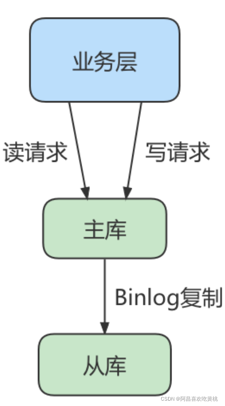
读写分离情况下，解决主从同步中数据不一致的问题， 就是解决主从之间 `数据复制方式 的问题`，如果按照数据一致性 `从弱到强` 来进行划分，有以下 3 种复制方式。


**方法 1：异步复制**:


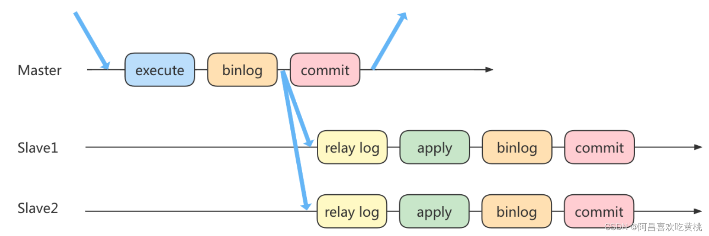

**方法 2：半同步复制**:


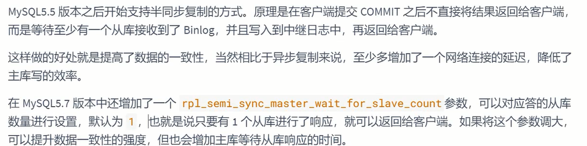
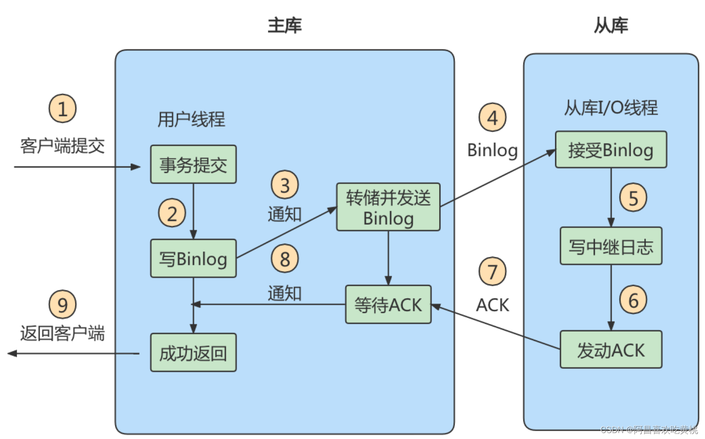

**方法 3：组复制**:
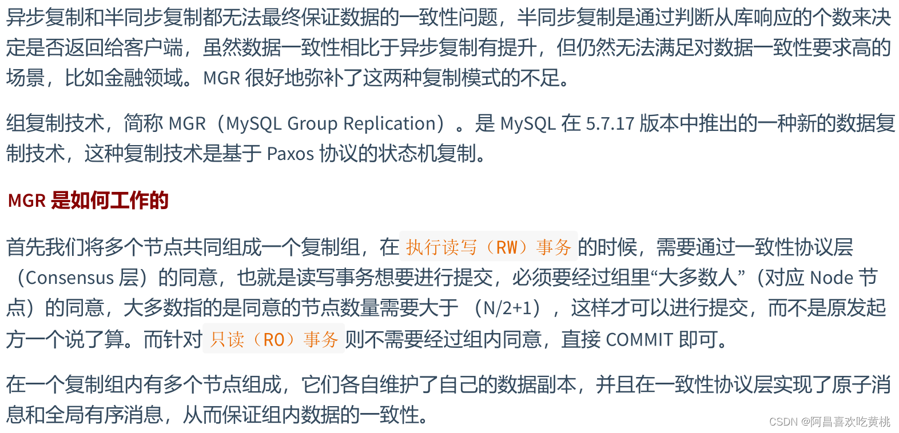


5、 知识延伸


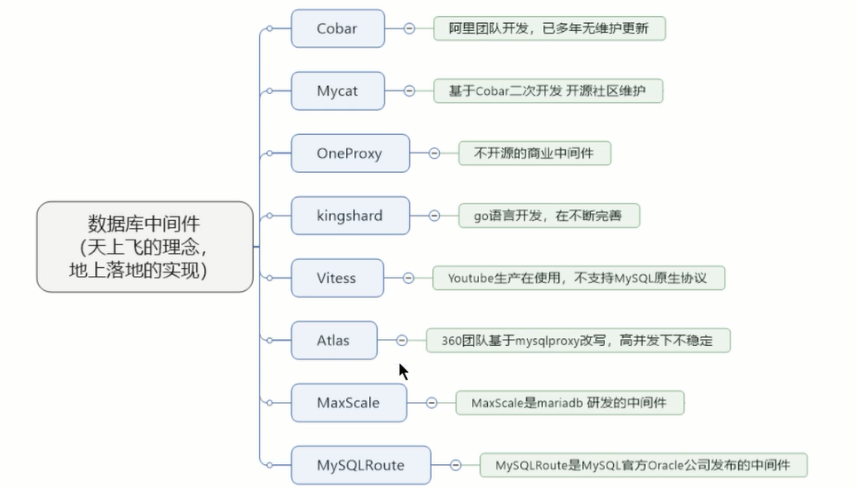

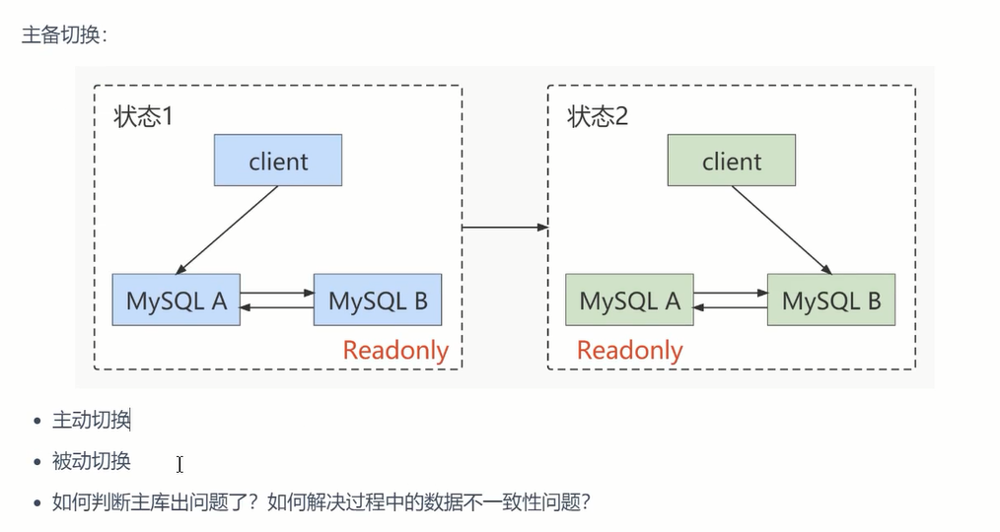