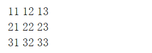
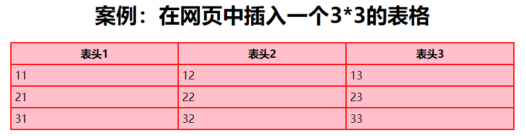
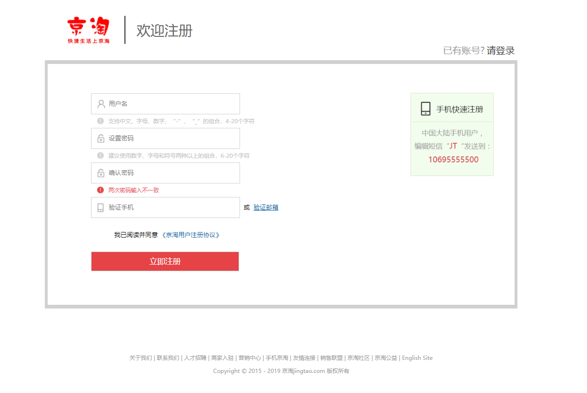
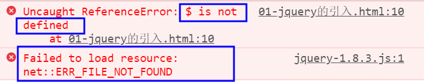
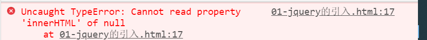
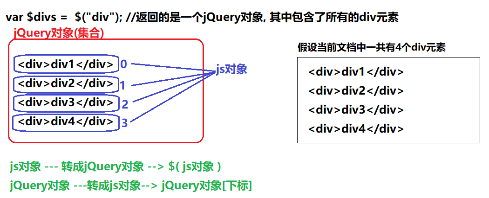

[TOC]


HTML、CSS
===============

HTML: 用于开发网页的一门技术

CSS: 用于修饰、渲染网页的一门技术

HTML+CSS可以开发一个非常美观、非常漂亮的网页

开发网页 										盖房子

HTML标签搭建网页的结构 			砖块(搭建房子的结构)

CSS属性 											石灰、油漆等涂料

HTML概述
--------

### HTML是什么

HTML(Hyper Text Markup Language): 超文本标记语言

超文本: 超级文本、超过文本（其中可以包含除了文本以外的其他数据，例如图片、音频、视频等各种格式）

标记：也叫标签、元素、节点等，就是用尖括号(<>)括起来的一组内容，例如：

```html
<head> <body> <div> <span> <table>等
```

HTML是最基础的开发网页的语言。

HTML由W3C组织提供(CSS/xml)

关于HTML的细节:

(1)使用HTML开发的网页文件通常以 .htm或.html 为后缀!

(2)使用HTML开发的网页文件由浏览器负责解析并显示（浏览器就是一个html解析器）

(3)HTML是文档的一种(txt/word/ppt/pdf等)

总结: HTML就是用于开发网页的一门语言!!

### HTML的结构

**1、案例：编写我的第一个HTML网页，并用浏览器打开**

新建一个txt文档，将后缀名改为.html，代码实现如下：

```html
<!DOCTYPE html>
<html>
	<head>
		<title>网页的标题</title>
	</head>
	<body>
		Hello CGB1808...
	</body>		
</html>
```

**2、HTML结构详解**

```html
(1)<!DOCTYPE HTML> 文档声明, 用来声明HTML文档所遵循的HTML规范和版本
	上面是html5.0的声明, 也是目前最常用的版本
(2)<head></head> 头部分, 用来存放HTML文档的基本属性信息, 比如网页的标题, 文档使用的编码等, 这部分信息会被浏览器优先加载.
(3)<body></body> 体部分, 用来存放网页可视化数据. 即真正的网页数据
(4)<title></title> 声明网页的标题
(5)<meta charset="utf-8"/> 用来通知浏览器使用哪一个编码来打开HTML文档, 这个编码一定要和文件保存时的编码保持一致, 才不会出现中文乱码问题.
```


### HTML语法(了解)

**1、html标签**

标签：也叫做标记、元素等，标签分为开始标签，例如：

```html
<head>、<body>
```

和结束标签，例如: 

```html
</head>、</body>
```

开始标签和结束标签之间还可以包含其他内容。

有些标签开始标签和结束标签之间没有内容要包裹，通常可以写成自闭标签，例如：

```html
<meta/> <br/> <hr/> <input/> 等
```

**2、html属性**

在标签上可以声明属性(属性不能独立存在,必须声明在标签上)

```html
<div id="d1" class="c1" style="color:red;"></div>
```

标签上可以声明多个属性，多个属性之间用空格分隔

标签上的属性的值可以使用单引号或者双引号引起来

```html
<meta charset="UTF-8" id="m1"/>
<meta charset='UTF-8' id='m1'/>
```

**3、html注释**

格式: `<!-- 注释内容 -->`

注释的作用: (1)为代码添加解释说明

(2)将一些暂时不需要执行的代码注释

浏览器对于注释中的内容不会解析，也不会显示！

**4、html空格和换行**

在浏览器中，多个连续的空白字符（空格、制表符tab、换行）会被浏览器显示为一个空格。那么：

如何在网页中做一个换行：可以使用 `<br/>` 标签做换行

如何在网页中做一个空格：可以使用`&nbsp;`或`&emsp;`做空格

补充: HTML中是不区分大小写的！

HTML中对语法要求非常不严格！（比如大小写混用，或者标签只有开始没有结束，或者标签的不合理嵌套），但是我们在书写HTML时要按照规范来写。

HTML标签
--------

### 图像标签

通过img标签可以在网页中插入一副图像

```html

```

其中src属性用于指定图片的路(图片的路径最好不要是带盘符的绝对路径,推荐使用相对路径)

alt属性图片路径错误或者未加载出来时显示alt属性的内容

```html
<！--	
	./:表示当前目录(当前文件所在目录) ,由于当前HTML在webcontent目录下,因此./表示webcontent目录(其中./可以省略默认是当前目录)
	../:表示当前目录的上一级目录
	../../:表示上一级的上一级目录
-->
```


width属性用于指定图片的宽度,示例:相对于页面的50%

height属性用于指定图片的高度

### 超链接a标签

超链接就是a标签，通过a标签可以在网页中创建指向另外一个文档的超链接

点击超链接可以跳转到另外一个网页(图片/下载路径等)，示例:

```html
<!-- 跳转到本地的一个网页 -->
<a href="01-第一个网页.html">01-第一个网页.html</a>

<!-- 跳转到百度首页 -->
<a href="http://www.baidu.com">百度一下，你就不知道</a><br/>

<!-- 点击图片跳转到tmooc -->
<a target="_blank" href="http://www.tmooc.cn">
	
</a>
```

其中 href 属性用于指定点击超链接后将要跳转到的URL地址

`target`属性用于指定以何种方式打开超链接

​		`_self`：默认值, 表示在当前窗口中打开超链接

​		`_blank`：表示在新的窗口中打开超链接

### 表格标签

**1.案例：在网页中插入一个3*3的表格**

```html
<h1>案例：在网页中插入一个3*3的表格</h1>
<table><!-- 用于在网页中定义一个表格 -->
    <tr><!-- 用于定义一个表格行 -->
        <th>表头1</th>
        <th>表头2</th>
        <th>表头3</th>
    </tr>
    <tr>
        <td>11</td><!-- 用于定义一个单元格 -->
        <td>12</td>
        <td>13</td>
    </tr>
    <tr>
        <td>21</td>
        <td>22</td>
        <td>23</td>
    </tr>
    <tr>
        <td>31</td>
        <td>32</td>
        <td>33</td>
    </tr>
</table>
```

**在浏览器中显示效果如下：**



**在head标签内style标签内添加如下css内容：**

```html
<style>
    /* style标签内只能书写css注释和css代码 */
    table{
        border:*2px solid red; /* 为表格添加边框 */
        border-collapse: collapse; /* 设置边框合并 */
        background-color: pink; /* 为表格设置背景颜色 */
        width: 70%; /* 为表格设置宽度 */
        /* margin-left: 15%; */
        /* 设置表格的左外边距和右外边距自适应(保证两者始终相等) */
        margin-left: auto;
        margin-right: auto;
    }
    td,th{
        border:2px solid red; /* 为单元格添加边框 */
        border-collapse: *collapse*; /* 设置边框合并 */
        padding: 5px; /* 设置单元格边框和内容的距离(内边距) */
    }
    h1{
        /* border: 2px solid blue; */
        text-align: *center*; /* 设置元素中的内容水平居中 */
    }
</style>
```

**再次刷新浏览器显示效果为：**



**2、表格标签介绍**

```html
table -- 用于在网页中定义一个表格
tr -- 用于定义表格中的行
th -- 用于定义表头行中的单元格（th中的文本默认居中，并且加粗）
td -- 用于定义表格中的单元格
```


### 表单标签

**1、表单的作用: 用于向服务器提交数据**

向服务器提交数据的两种方式：

**(1)通过表单向服务器提交数据**


表单中可以包含表单项标签，在表单项中可以填写数据（比如用户名、密码等），填写完成后通过提交表单，可以将表单中的数据提交给相应的服务器。

**(2)通过超链接向服务器提交数据**

```html
http://www.baidu.com?username=张三&pwd=123&like=篮球
```

在`地址栏URL地址的后面通过问号(?)可以拼接参数，参数可以有多个，多个参数之间用&分隔`，参数还分为参数名（例如：username/pwd/like）以及参数值(例如:张三/123/篮球)，在回车后访问百度服务器的同时，就可以将问号后面拼接的参数一并带给百度服务器。

**2、表单标签**

```html
<form action="地址" method="提交方式"></form>
```

其中action属性用于**指定表单的提交地址，**例如，将action指向百度服务器，就意味着将来填写完表单后，提交表单将会把表单中的数据提交给百度服务器。

method="GET/POST" 属性是用于**指定表单的提交方式**，常用的就是GET和POST提交。

### 表单项标签

1、`input`元素：

(1)普通文本输入框(比如:用户名/昵称/邮箱/验证码等)

```html
<input type="text" name="username"/>
```

(2)密码输入框(比如:密码/确认密码等)

```html
<input type="password" name="pwd"/>
```

(3)单选框(比如:性别/部门等)

​	注意:要求多个单选框必须具有相同的name属性值

```html
<input type="radio" name="gender"/>男
```

(4)复选框/多选框(比如:爱好/岗位等)

```html
<input type="checkbox" name="like"/>
```

(5)普通按钮(比如:换一张图片)

```html
<input type="button" value="换一张"/>
```

普通按钮本身没有功能,但我们可以通过js为按钮添加功能或添加行为

(6)提交按钮(比如:提交/注册/登录)

```html
<input type="submit" value="提交/注册/登录"/>
```

提交按钮用于提交表单中的数据到服务器中!

2、`select、option`标签：

```html
<select name="city">
    <option value="beijing">北京</option>
    <option value="shanghai">上海</option>
    <option selected="selected">广州</option>
    <option>深圳</option>
</select>
```

select用于定义一个下拉选框
		option用于定义下拉选框上的选项
		selected设置当前option选项默认被选中

3、`textarea`多行文本输入区域：

```html
<textarea name="description" cols="30" rows="5" placeholder="请输入描述信息..."></textarea>
```

cols属性: 用于设置文本输入框的列数(宽度)

rows属性: 用于设置文本输入框的行数(高度)

placeholder属性: 设置输入框中的提示消息!

### 表单细节问题

**1、提交表单时，表单中的数据为什么没有被提交？**

对于表单中的表单项标签，只要是需要向服务器提交数据，该表单项上必须添加name属性；如果表单项标签上没有name属性，在表单提交时，该项将会别忽略。例如：

```html
<input type="text" name="username"/>
<input type="password" name="pwd"/>
```

**2、如何让多个单选框只能有一个被选中？**

**要求多个单选框必须具有相同的name属性值**，如果多个单选框name属性值相同，则说明是一个组的内容，一个组中的单选框只能选择其中的一个！

```html
<td>性别:</td>
<td>
    <input type="radio" name="gender"/>男
    <input type="radio" name="gender"/>女
</td>
```

**3、为什么单选框、复选框选择某一项后提交的值都是on?**

因为单选框、复选框只能选择，不同于用户名、密码输入框，可以输入内容。

因此我们需要**通过value属性为单选框或复选框设置提交的值(如果不设置默认值都是on)**，例如：

```html
<input type="radio" name="gender" value="male"/>男
<input type="radio" name="gender" value="female"/>女
```

**4、如何设置单选框或复选框默认选中某一项?**

可以在单选框或复选框标签上添加一个`checked="checked"`属性，就可以让当前单选框或复选框默认被选中。例如：

```html
<!-- 默认选择男 -->
<input type="radio" checked="checked" name="gender" value="male"/>男
<input type="radio" name="gender" value="female"/>女

<!-- 爱好复选框/多选框 -->
<input type="checkbox" name="like" value="basketball"/>篮球
<input type="checkbox" checked="checked" name="like" value="football"/>足球
<input type="checkbox" name="like" value="volleyball"/>排球
```

**5、如何设置下拉选框默认选中某一项?**

在option标签上添加一个selected="selected"属性，可以让当前option选项默认被选中，例：

```html
<!--  默认选择广州 -->
<select name="city">
    <option>北京</option>
    <option>上海</option>
    <option selected="selected">广州</option>
    <option>深圳</option>
</select>
```

**6、下拉选框中option选项上的value属性的作用是什么？**

```html
<select name="city">
	<option value="beijing">北京</option>
	<option value="shanghai">上海</option>
	<option selected="selected">广州</option>
	<option>深圳</option>
</select>
```

如果某一个选项被选中，并且该选项上添加了value属性，在提交表单时，将会提交value属性的值。

如果某一个选项被选中，该选项上没有添加value属性，在提交表单时，将会提交标签中的内容

注册表单案例
------------

```html
<!DOCTYPE html>
<html>
<head>
<meta charset="UTF-8">
<title>Insert title here</title>
<style>
/* style标签内只能书写css注释和css代码 */
table {
	border: 2px solid red; /* 为表格添加边框 */
	border-collapse: collapse; /* 设置边框合并 */
	background-color: lightgrey; /* 为表格设置背景颜色 */
	/* margin-left: 15%; */
	/* 设置表格的左外边距和右外边距自适应(保证两者始终相等) */
	margin-left: auto;
	margin-right: auto;
}

td, th {
	border: 2px solid red; /* 为单元格添加边框 */
	border-collapse: collapse; /* 设置边框合并 */
	padding: 5px; /* 设置单元格边框和内容的距离(内边距) */
}

h1 {
	/* border: 2px solid blue; */
	text-align: center; /* 设置元素中的内容水平居中 */
}
</style>
</head>
<body>
	<h1>欢迎注册</h1>
	<form action="#">
		<table>
			<tr>
				<!-- 用户名输入框 -->
				<td>用户名:</td>
				<td><input type="text" name="username" /></td>
			</tr>
			<tr>
				<!-- 密码输入框 -->
				<td>密码:</td>
				<td><input type="password" name="pwd" /></td>
			</tr>
			<tr>
				<!-- 性别单选框 -->
				<td>性别:</td>
				<td>
                    <input type="radio" checked="checked" name="gender"
					value="male" />男 
                    <input type="radio" name="gender" value="female" />女
				</td>
			</tr>
			<tr>
				<!-- 爱好复选框/多选框 -->
				<td>爱好:</td>
				<td>
                    <input type="checkbox" name="like" value="basketball" />篮球
					<input type="checkbox"  name="like" value="football" />足球 
                    <input type="checkbox" name="like" value="volleyball" />排球
                </td>
			</tr>
			<tr>
				<!-- 城市下拉选框 -->
				<td>城市:</td>
				<td><select name="city">
						<option value="beijing">北京</option>
						<option value="shanghai">上海</option>
						<option selected="selected">广州</option>
						<option>深圳</option>
				</select></td>
			</tr>
			<tr>
				<!-- 自我描述 多行文本输入框 -->
				<td>自我描述:</td>
				<td><textarea name="description" cols="30" rows="5"
						placeholder="请输入描述信息..."></textarea></td>
			</tr>
			<tr>
				<!-- 提交按钮 -->
				<!-- colspan: 设置单元格横跨的列数 -->
				<td colspan="2" style="text-align: center;"><input
					type="submit" value="提交" /></td>
			</tr>
		</table>
	</form>
</body>
</html>
```

CSS概述
-------

### 什么是CSS？(了解)

CSS: 层叠样式表，用于修饰、渲染网页的一门技术

使用css样式修饰网页，可以实现将设置样式的css代码和展示数据的html代码进行分离，增强了网页的展示能力！

### 在HTML中引入CSS

**方式1：通过style属性引入css（不推荐）**

```html
<!-- 
	1.通过标签上的style属性给div设置样式 
	边框:2px solid red 
	字体大小:26px
	背景颜色为:pink
-->
<div style="border:2px solid red;font-size:26px;background:pink;">这是一个div...</div>
```

由于上面这种方式是将css属性代码，直接写在标签上的style属性内部，如果属性太多，容易造成页面结构的混乱，不利于后期的维护。

将样式代码写在标签上，样式代码只对当前标签生效，代码无法复用！

并且使用这种方式无法将HTML标签和css样式分离

因此不推荐使用这种方式！（这种通过style属性添加的样式，叫做行内样式/内联样式）

**方式2：通过style标签引入css**

在head标签内部可以添加一个style标签，在style标签内部可以直接书写css样式

这种方式是将所有的css属性代码集中在一个style标签内部统一管理，这种方式不会造成页面结构的混乱，并且可以实现代码的复用！

初步的将HTML标签代码和css样式分离

代码示例 ：

```html
<!-- 2.通过style标签给span设置样式如下： 
	边框: 2px solid green
	字体大小: 30px
	字体加粗
-->
<head>
<meta charset="utf-8" />
<style type="text/css">
	/* ****** CSS样式 ****** */
	span{ /* 为当前html中的所有span标签设置样式 */
		border:2px solid green;
		font-size:30px;
		font-weight:bolder; /* bold/bolder */
	}
</style>
</head>
```


**方式3：通过link链接引入外部的css文件**

在head标签内部，通过一个link标签可以引入外部的CSS文件

这种方式是将所有的css代码集中在一个单独的css文件中统一管理，真正的实现了将css代码和html代码的分离，实现了代码的复用。

代码示例：html中引入demo.css文件

```html
<!-- 3.通过link标签引入外部的css文件，为p元素设置样式如下： 
	边框: 2px solid blue;
	字体颜色:red
	字体设置为华文琥珀
	设置首行文本缩进50px
-->
<!-- 引入demo.css文件(中的样式) -->
<link rel="stylesheet"  href="demo.css"  />
```

demo.css文件

```css
@charset "UTF-8";
p{
	border: 2px solid blue;
	color: red;
	font-family: 华文琥珀;
	text-indent: 50px;
}
```


CSS选择器
---------

所谓的选择器就是能够在html中帮助我们选中元素进行修饰的一门技术。

### 标签名选择器

通过元素名称(或标签名称)选中指定名称的所有标签

格式: **元素名/标签名{ css样式... }**

```css
/* ----- 1.标签名选择器练习 ----- 
将所有span标签的背景颜色设置为#efbdef, 设置字体大小为22px，字体加粗；*/
span{ /* 选中所有的span元素 */
	background-color:#efbdef; 
	font-size: 22px;
	font-weight: bolder;
}
```

### class选择器

可以为元素添加一个通用的属性 -- class，通过class属性为元素设置所属的组，class值相同的元素则为一组。通过class值可以选中这一组的元素，为元素添加样式。

格式：**.class值{ css样式... }**

实例:

```css
/* ----- 2.类选择器练习 ----- 
(1)将所有的span（但是不包括div和p标签下的span）的背景颜色设置为#faf77b，边框改为2px solid cyan；
(2)将div下的span和内容为"span111"的span，背景颜色设置为#5eff1e、字体颜色设置
#ec0e7e；*/
.s1{ /* 选中所有class值为s1的元素 */
	background: #faf77b;
	border: 2px solid cyan;
}
.s2{ /* 选中所有class值为s2的元素 */
	background: #5eff1e;
	color: #ec0e7e;
}
```

另外，一个元素也可以设置多个class值，`多个class值中间用空格分隔`，例如：

```html
<span class="s1 s2" >span111</span>
```

表示当前元素同时属于多个分组，多个分组上设置的样式也会同时作用在当前元素上。

如果多个分组设置了相同的样式（但是值不一样），样式会发生冲突，写在后面的样式会覆盖前面的样式！

---

内容补充：

选择器优先级顺序：

（1）如果是同一类选择器，同时给某些元素设置了 样式，如果样式冲突了，那么写在后面的样式会覆盖前面的样式

（2）如果不同的选择器，设置的样式优先级顺序及权重是：id选择器（100）>类选择器class（10）>元素名选择器（1）

---

### id选择器

通过标签上通用的属性id，可以为标签设置一个独一无二的编号（id值应该是唯一的），通过id值可以唯一的选中一个元素。(一个id值只对应一个标签)

格式：**#id值{ css样式 }**

```css
/* ----- 3.id选择器练习 -----
用id选择器将第一个p标签设置字体大小为24px，字体颜色为#a06649, 首行文本缩进20px。*/
#p1{ /* 选中id值为p1的元素 */
	font-size:24px;
	color: #a06649;
	text-indent: 20px;
}
```

```html
<p id="p1">这是一个p元素!!!</P>
```

### 后代选择器

选中指定元素内部的指定后代元素

格式: **祖先 后代{ css样式... }**

```css
/* ----- 4.后代选择器练习 ----- 
为p元素内部的所有span元素，设置字体大小为18px,字体颜色为红色,背景颜色为pink;*/
p span{ 
    /* p span{} 匹配所有p元素内部的所有span元素,属于后代选择器 */
    /* p,span{} 匹配所有的p元素和所有的span元素,属于标签选择器 */
	font-size:18px;
	color: red;
	background: pink;
}
```

```html
<p id="p1">
    这是一个p元素!!!
    <span>这是一个span元素</span>
</P>
```


### 属性选择器

在选择器选中元素的基础上，根据元素的属性条件筛选/过滤元素

格式：**选择器[属性条件]...{ css样式 }**

```css
/* ----- 5.属性选择器 ----- 
为所有的文本输入框，设置背景颜色为#FF7CCC、字体大小22px，首行文本缩进15px；*/
input[type='text']{ /* 匹配所有的input并且type值为text的元素 */
	background: #FF7CCC;
	font-size: 22px;
	text-indent: 15px;
}
input[type='text'][name='email']{ 
	/* 选中所有的input并且type值为text、并且name为email的元素 */
	background : yellow;
}
```

常用属性总结
------------

### 文本属性

1、`text-align`：设置元素中文本水平对齐方式，其常用取值为:

```css
left: 默认值。左对齐
right: 右对齐
center: 居中对齐
justify: 两端对齐
```

2、`text-decoration`：设置文本的下划线样式，其常用取值为:

```css
underline: 有下划线
none: 没有下划线
```

3、`text-indent`：设置文本首行缩进，单位: 像素/百分比

4、`letter-spacing`：设置字符间隔/间距，其常用取值为:

```css
normal
像素值
```

5、`text-shadow`：设置字体阴影，其取值为:

```css
像素值 像素值 像素值 颜色值
第一个值为阴影水平位移，第二个值为阴影垂直位移，第三个值为阴影扩散值，第四个值为阴影颜色
```

### 字体属性

`font-size`：设置字体大小

`font-weight`：设置字体粗细 bold、bolder、normal 100/200/300../900

`font-family`：设置字体，比如微软雅黑、黑体、楷体等

`color`：设置字体颜色

### 背景属性

`background-color`：设置背景颜色

`background-image`：设置背景图片，url('图片的路径');

`background-repeat`：设置或检索对象的背景图像是否及如何铺排，常用取值：

```css
repeat(默认值,重复排列)
repeat-x(横向重复排列,但纵向不重复)
repaet-y(纵向重复排列,但横向不重复)
no-repeat(不重复)
```

`background-position`：设置或检索对象的背景图像位置

`background`: 背景颜色 背景图片 背景图片是否重复 背景图片的位置

### 边框（border）

`border:2px solid red;` -- 设置元素的边框(可以同时设置边框的宽度、样式、颜色)

border属性可以拆分为如下设置:

```css
border-width: 2px; -- 设置元素边框的宽度
border-style: solid; -- 设置元素边框的样式
border-color: red; -- 设置元素边框的颜色
```

其中border-width、border-style、border-color也可以按照上右下左方向进行拆分，以border-width为例：

```css
border-top-width: 2px; -- 设置上边框的宽度
border-left-width: 2px; -- 设置左边框的宽度
border-right-width: 2px; -- 设置右边框的宽度
border-bottom-width: 2px; -- 设置下边框的宽度
```

### 其他属性

width：设置元素的宽度

height：设置元素的高

### 元素定位

定位：

1. 文档流定位（html使用默认方式）

2. 浮动定位:浮动定位后的元素会脱离文档流，漂浮至上一层

​        为了解决父级元素失去高度的问题，可以直接给父级元素设置一个固定 高度即可

​		或者在父级下与浮动元素同级下添加如下代码

```html
 <div style="clear: both;"></div>
```

3. 相对定位

​          position: relative;   定位原点是自身的最上角, 原有位置保存，不允许其他元素占据

​          left: 100px; x轴正方向偏移

​          top: 100px;  y轴正方向偏移

4. 绝对定位，原位置不保留

​          position: absolute;

​          left

​          top

​        定位原点：

​        1. 其上层元素中无任一元素使用过position，则以body的 左上角作为定位原点

​        2. 如果其上层元素中使用了position，将使用离自己最近一层使用过position的元素作为定位

5.固定定位

​        position: fixed;

​        z-index:99999;

### 补充: 颜色设置

颜色取值方式常见的方式有三种:

方式一：设置颜色名，例如：

```
red、green、blue、yellow、cyan、pink、white、black等
```

方式二：设置#加上六位的十六进制数值

```
#FF0000（red）、#00FF00（green）、#0000FF（blue）、#FFFF00（yellow）、#00FFFF（cyan）等
```

方式三：设置rgb颜色值

```
rgb(255,0,0) 、rgb(0,255,0) 、rgb(0,0,255) 、rgb(255,255,0) 、rgb(0,255,255) 等
（red） （green） （blue） （yellow） （cyan）
```

网页开发实战
------------

通过css样式和html实现如下效果:



```html
<!DOCTYPE html>
<html>
<head>
<meta charset="UTF-8">
<title>Insert title here</title>
<!-- 引入regist.css文件 -->
<link rel="stylesheet"  href="regist.css"/>
</head>
<body>
	<!-- 头部(header) -->
	<div id="header">
		<div id="line1"><!-- 头部的第1行 -->
			
			<span class="line"></span>
			<span class="wel-reg">欢迎注册</span>
		</div>
		<div id="line2"><!-- 头部的第2行 -->
			<span>已有账号?</span>
			<a href="#">请登录</a>
		</div>
	</div>
	
	
	<!-- 主体(main) -->
	<div id="main">
		<form action="#">
			<table>
				<tr><!-- 用户名 -->
					<td>
						<input type="text" name="username" placeholder="用户名"/>
					</td>
				</tr>
				<tr><!-- 用户名输入框下方的提示消息 -->
					<td class="msg">支持中文、字母、数字、“-”、“_”的组合，4-20个字符</td>
				</tr>
				<tr><!-- 密码 -->
					<td>
						<input type="password" name="pwd" placeholder="设置密码"/>
					</td>
				</tr>
				<tr><!-- 密码输入框下方的提示消息 -->
					<td class="msg">建议使用数字、字母和符号两种以上的组合，6-20个字符</td>
				</tr>
				<tr><!-- 确认密码 -->
					<td>
						<input type="password" name="repwd" placeholder="确认密码"/>
					</td>
				</tr>
				<tr><!-- 确认密码输入框下方的提示消息 -->
					<td class="msg alert">两次密码输入不一致</td>
				</tr>
				<tr><!-- 验证手机 -->
					<td class="yzsj">
						<input type="text" name="phone" placeholder="验证手机"/>
						&nbsp;<span>或</span>&nbsp;
						<a href="#">验证邮箱</a>
					</td>
				</tr>
				<tr><!-- 同意协议 -->
					<td class="protocol">
						<span>我已阅读并同意 </span>
						<a href="#">《京淘用户注册协议》</a>
					</td>
				</tr>
				<tr>
					<td>
						<input type="submit" value="立即注册"/>
					</td>
				</tr>
				
				
			</table>
		</form>
		
	</div>
	
	
	<!-- 尾部(footer) -->
	<div id="footer">
		<p>
			关于我们 | 联系我们 | 人才招聘 | 商家入驻 | 营销中心 | 手机京淘 | 友情连接 | 销售联盟 | 京淘社区 | 京淘公益 | English Site
			<br/>
			Copyright © 2015 - 2019 京淘jingtao.com 版权所有
		</p>
	</div>
</body>
</html>
```

```css
@charset "UTF-8";
/* 头部(header) */
#header{
	/* background:pink; */
	width: 1200px;
	/* 设置当前元素在水平方向居中显示 */
	margin-left: auto;
	margin-right: auto;
	margin-top: 41px; /* 设置上外边距 */
	height: 114px; /* 设置元素的高度 */
}
#line1{ /* 头部的第1行 */
	height: 72px;
}
#line1 img{ /* logo图片 */
	margin-left: 50px;
	margin-right: 33px;
	vertical-align: middle; /* 设置元素的中线对齐 */
}
#line1 .line{ /* 竖线 */
	border: 2px solid #676767;
	height: 68px;
	/* 设置当前元素为行内块元素 */
	display: inline-block;
	margin-right: 23px; 
	background: #676767;
	vertical-align: middle; /* 设置元素的中线对齐 */
}
#line1 .wel-reg{ /* 欢迎注册 */
	font-size: 36px;
	color: #676767;
	vertical-align: middle; /* 设置元素的中线对齐 */
}
#line2{ /* 头部的第2行 */
	height: 42px;
	text-align: right; /* 设置元素内容居右 */
}
#line2  span{ /* 已有账号 */
	color: #999;
	font-size: 24px;
}
#line2  a{ /* 请登录 */
	color: #333;
	/* 设置元素中的文本没有下划线 */
	text-decoration: none;
	font-size: 24px;
}

/* 主体(main) */
#main{
	width: 1200px;
	/* 设置当前元素在水平方向居中显示 */
	margin-left: auto;
	margin-right: auto;
	height: 545px;
	border: 7px solid #d0d0d0;
	border-top-width: 9px;
	border-bottom-width: 9px;
	/* 设置元素的上内边距 */
	padding-top: 75px;
}
#main  form{ /* form表单 */
	/*background:yellow;*/ 
	width: 819px;
	margin-left: 109px;
	/* 设置form为行内块元素, 能够和其他元素显示在同一行 */
	display: inline-block;
}
/* 选中所有的input元素 */
#main form table input{
	width:381px;
	height:50px;
	font-size:16px;
	color:#999;
	border: 1px solid #d0d0d0;
	text-indent: 45px;
}
/* 用户名输入框 */
#main form table input[name='username']{
	background: url(imgs/u_ico.jpg)  no-repeat  15px 15px;
}
/* 密码和确认密码输入框 */
#main form table input[type='password']{
	background: url(imgs/p_ico.jpg)  no-repeat  15px 15px;
}
/* 验证手机输入框 */
#main form table input[name='phone']{
	background: url(imgs/phone_ico.jpg)  no-repeat  15px 15px;
}
/* 选中 或、验证邮箱 */
#main form table .yzsj span{ font-size: 16px; }
#main form table .yzsj a{ 
	font-size: 16px; 
	color: #005ea7;
}
/* 选中用户名、密码、确认密码输入框下方的提示消息 */
#main form table .msg{
	height: 32px;
	font-size: 12px;
	text-indent: 45px;
	color: #c3c3c3;
	background: url(imgs/alert_1.jpg) no-repeat 17px 7px;
}
/* 选中class为alert的td元素 */
#main form table .alert{
	background: url(imgs/alert_2.jpg) no-repeat 17px 7px;
	color: #e64346;
}
/* 选中 "我已阅读并同意: 的span元素 */
#main form table  .protocol { 
	height: 83px;
	font-size:16px;
	line-height: 52px;
	text-indent: 60px;
}
/* 选中 "京淘用户注册协议"的a元素 */
#main form table  .protocol  a{ 
	color: #005ea7;
	text-decoration: none;
}
/* 选中立即注册按钮 */
#main form table input[type='submit']{
	background: #e64346;
	color: #fff;
	font-size: 20px;
	/* 覆盖之前设置的首行缩进 */
	text-indent: 0px;
}

#main  img{ /* 快速注册图片 */
	vertical-align: top;/* 设置当前元素的顶部和行内最高元素的顶部对齐 */
}


/* 尾部(footer) */
#footer{
	/* background:cyan; */
	width: 1200px;
	/* 设置当前元素在水平方向居中显示 */
	margin-left: auto;
	margin-right: auto;
	margin-top: 109px;
}
#footer  p{
	text-align: center;
	font-size: 14px;
	line-height: 34px;
	color: #999;
}

```


扩展内容
--------

### display属性

display用来设置元素的类型，常用取值：

```
block：块级元素的默认值
    默认情况下独占一行
    可以设置宽高
inline：行内元素的默认值
    默认情况下多个行内元素可以处在同一行
    一般不能设置宽高
inline-block：行内块元素
    多个元素既可以显示在同一行, 也可以设置宽和高
none：表示隐藏元素
```


### 元素类型(了解)

div/span/p 都是一个容器标签，用于包裹其他内容（这些元素本身不具备太多的样式！）

```
span：行内元素，默认可以和其他元素显示在同一行。
p: 块级元素，默认独占一行，用于包裹一段文本（写文章时用于p标签包裹每一段内容）
div: 块级元素，默认独占一行，用于包裹其他内容，将样式设置在div上，就可以作用在div的内容上。
```

**(1)块级元素（block）**

默认情况下，块级元素独占一行

可以设置宽和高，如果设置了就是设置的宽和高

如果不设置宽和高，其中宽是默认填满父元素，而高是由内容决定(由内容支撑)

比如: div/p/h1~h6/form/table 等元素都是块级元素

**(2)行内元素（inline）**

默认情况下，多个行内元素可以处在同一行

不能设置宽和高

比如: span/input/img/i/b 等元素都是行内元素

**(3)行内块元素（inline-block）**

既具备行内元素的特征(可以同行显示)，还具备块级元素的特征(可以设置宽和高)


## 拓展:eclipse的相关设置

### 设置eclipse的默认浏览器

设置步骤:Windows→web browser→选择相应的浏览器为默认浏览器

### eclipse添加Chrome\Firefox

设置步骤:Windows→preference→general→web browser→new(将浏览器exe文件目录添加进来)

JavaScript
================

JavaScript简介
--------------

### 什么是JavaScript(了解)

全称叫做JavaScript，简称叫做JS

由NetScape(网景)公司提供，是一门专门嵌入在浏览器中执行的脚本语言

JS运行在浏览器中，负责实现网页中的动画效果

或者是实现表单校验等功能

### JS特点和优势(了解)

**1、特点：**

(1)JS是一门直译式的语言(边解释边执行，没有编译的过程)

(2)JS是一门基于对象的语言(JS中没有类的概念,也没有编译的过程)

JS中是有对象的(内置对象、自定义对象)

(3)JS是一门弱类型的语言(Java:强类型)

```javascript
在java中:变量一旦声明,就属于固定的数据类型,不能被改变
String s = "abc";
int n = 100;
在JS中:变量是不区分类型的,可以指向任意的数据类型
var s = 100;
s = "abc";
s = true;
s = [];
s = function(){}
```

**2、优势：**

(1)JS具有良好的交互性

(2)JS具有一定的安全性(只能在浏览器内部运行,不能访问浏览器以外的资源)

(3)JS具有跨平台性(JS 浏览器)

( JS语言是跨平台的，是因为有浏览器，但浏览器不跨平台

Java语言是跨平台的，是因为有虚拟机，但虚拟主机不跨平台 )

### 在HTML书写JS的方式

**1、在script标签内部可以书写JS代码：**

在head或者body标签内部可以添加一个script标签，在script标签内部可以直接书写JS代码！

```html
<!-- 在script标签内部可以书写JS注释和JS代码 -->
<script type="text/javascript">
  //JS的单行注释
  /* JS的多行注释 */
	alert( "在html中引入JS的第一种方式..." );
</script>
```

**2、通过script标签引入外部的JS文件**

在head或body标签内部，可以通过script标签引入外部的JS文件。例如：

```html
<!-- 通过script标签可以引入外部的JS文件 -->
<script src="demo.js"></script>
```

注意：

(1)在引入js文件的script标签内部不要书写JS代码,,写了野无法执行,例如:

```html
<script src="demo.js">
	alert( 111 ); //这里的代码不会执行
</script>
```

(2)不要将引入JS文件的script标签自闭，因为可能会导致文件引入失败，如下：

```html
<script src="demo.js" />  <!--错误写法-->
```

**扩展内容：也可以直接在元素上书写JS代码**

```html
<!-- 直接在元素上书写JS代码：
onclick属性用于给当前元素绑定点击事件：点击元素就会触发事件，执行相应函数
-->
<input type="button" value="点我~" onclick="alert('叫你点你还真敢点啊!!!')"/>
<input type="button" value="别点我"  onclick="console.log( new Date() )"/>
```

JavaScript语法
--------------

### 注释格式

JS的注释符号和Java的注释符号相同，如下：

```javascript
// 单行注释内容
/* 多行注释内容 */
```

### 数据类型

**1、基本数据类型**

**(1)数值类型(number)**

在JS中，所有的数值在底层都是浮点型，但是在处理和显示的过程中会自动的和整型进行转换。

```
例如：2.4+3.6=6
特殊值：Infinity(无穷大) / -Infinity(负无穷大) / NaN(非数字)
```

**(2)字符串类型(string)**

在JS中，字符串类型属于基本数据类型，字符串常量可以使用单引号或者使用双引号引起来。例如：

```javascript
var s1 = "Hello JS";
var s2 = 'Hello JS';//字符串可以是单引号,也可以是双引号
```

另外，JS中字符串类型有对应的包装对象（String），在需要时会自动的和包装对象进行转换。

```javascript
var s1 = "Hello JS";//s1是基本数据类型
console.log( typeof s1 ); //string
var s2 = new String("Hello JS");//s2是复杂数据类型
console.log( typeof s2 ); //object
//不管是基本数据类型s1, 还是对象类型s2, 都可以当作对象来用
console.log( s1.valueOf() ); //s1是基本数据类型, 会转成对象, 调用valueOf函数
console.log( s2.valueOf() );
```

**(3)布尔类型(boolean)**

布尔类型的值有两个，分别为true和false。

(4)undefined类型

undefined类型的值只有一个，就是undefined，表示变量未定义(但不是指对象没有声明)。

是指声明了变量，但没有为变量赋值，该变量的值就是undefined。

```javascript
/* 1.undefined类型 */
var x;
alert( x ); //undefined
alert( y ); //抛异常
```

(5)null类型

null类型的值也只有一个，就是null，表示空值。

可以作为函数的返回值，表示函数返回的是一个空的对象。

注意：null和undefined类型的变量是不能调用函数或属性的，会抛异常！

**2、复杂数据类型**

主要指对象(JS的内置对象、自定义的对象、函数、数组)

### 变量声明

JS中是通过var关键字声明变量，声明的变量是不区分类型，可以指向任意的数据。例如：

JS严格区分大小写

```javascript
var x = 100;
x = "abc";
x = true;
x = [];
x = function(){}
x = new Object();
x = {};
```

另外，JS中多次声明同名的变量不会出现语法错误，例如：

```javascript
/* 2.变量的定义 */
var s = "Hello"; // var s; s="Hello";
var s = 123; // var s; s=123; 第二次声明变量x没有生效
alert( s ); //123
```


### JS运算符

JS和Java中的运算符大致相同，例如：

```
算术运算符: +，-，*，/，%，++，--
赋值运算符: =，+=，-=，*=，/=，%=
比较运算符: ==，!=，>，>=，<，<=
位运算符: & ， |
逻辑运算符: && ，|| (短路效果)
前置逻辑运算符: ! (not)
三元运算符: 表达式 ? 表达式 : 表达式
。。。
```

### JS语句

JS中的语句和Java中的语句也大致相同

**1、if分支结构**

if分支结构用于基于不同的条件来执行不同的动作。语法结构如下：

```javascript
if (条件 1){
	当条件 1 为 true 时执行的代码
}else if (条件 2){
	当条件 2 为 true 时执行的代码
}else{
	当条件 1 和 条件 2 都不为 true 时执行的代码
}
```

**2、switch语句**

使用 switch 语句来选择要执行的多个代码块之一。语法结构如下：

```javascript
switch(n){
	case 1:
		执行代码块 1
		break;
	case 2:
        执行代码块 2
		break;
    ...
	default:
		与 case 1 和 case 2 不同时执行的代码
}
```

执行原理：首先设置表达式 n（通常是一个变量）。随后表达式的值会与结构中的每个case 的值做比较。如果存在匹配，则与该 case 关联的代码块会被执行。请使用 break来阻止代码自动地向下一个 case 运行。

**3、for循环语句** -- 循环代码块一定的次数

for 循环的语法结构如下：

```javascript
for (语句 1; 语句 2; 语句 3){
	被执行的代码块
}
```

**4、while循环** -- 在指定条件为真时循环执行代码块

JS中while循环也分为while和do/while循环，下面为while循环语法结构:

```javascript
while (条件){
	需要执行的代码
}

do{
    需要执行的代码;
}while(条件);
```

while 循环会在指定条件为真时循环执行代码块。

`案例1：if分支案例: 接收用户输入的成绩，判断成绩所属的等级`

```
80~100(包括80，也包括100) 优秀
60~80(包括60，但不包括80) 中等
0~60(包括0，但不包括60) 不及格
其他值 输入有误
```

代码实现如下：

​		prompt(参数1,参数2)函数:在页面弹出一个消息输入框,接受的参数实在弹框中显示的提示内容,用户输入的内容会作为函数的返回值返回

​		参数2,是输入框中的默认值,可以修改

```javascript
//弹出一个消息输入框,接受输入数据,返回一个字符串,不输入返回默认值0
var score = prompt("在下面的输入框中,请输入您的成绩: ");
if( score >= 80 && score <=100 ){
	alert("您的成绩属于: 优秀!");
}else if( score >= 60 && score < 80 ){
	alert("您的成绩属于: 中等!");
}else if( score >= 0 && score < 60 ){
	alert("您的成绩属于: 不及格!");
}else{
	alert("您的输入有误, 请重新输入!");
}
```

案例2：switch语句案例—实现一个简易的计算器：

可以接收用户输入的两个数值和一个操作符(+、-、*、/)，根据操作符号的不同，对两个数值执行不同的运算。

代码实现如下：

```javascript
//1.接收用户输入的数值和运算符, 中间用空格分隔

var str = prompt("请输入数值1、运算符、数值2，中间用空格分隔：","10 + 5"); //"10 + 5"

//2.对用户输入的内容进行切割(以空格作为分隔符切割)
var arr = str.split(" "); // ["10", "+", "5"]

var num1 = arr[0] - 0 ;//-、*、/两端都必须是数,会将arr[0]转换成数字，+可以连接字符串
var opt = arr[1];
var num2 = parseFloat(arr[2]);//利用parseFloat转换成浮点数
//3.通过switch分支实现计算器
switch( opt ){
	case "+":
		alert( "两个数的和为: "+( num1+num2 ) );
		break;
	case "-":
		alert( "两个数的差为: "+( num1-num2 ) );
		break;
	case "*":
		alert( "两个数的乘积为: "+( num1*num2 ) );
		break;
	case "/":
		alert( "两个数的商为: "+( num1/num2 ) );
		break;
	default:
		alert( "您输入的运算符有误, 请重新输入!" );
}
```

案例3：for循环语句案例

遍历1\~100之间的所有整数，求1\~100之间所有整数的和，并输出到控制台;

代码实现如下：

```javascript
//--------------------------------------
var i = 1;
var sum = 0;
while( i <= 100 ){
    sum += i;
    i++;
}
alert( "1~100之间所有整数的和为: "+sum );
//--------------------------------------
var sum = 0;
for( var i=0; i<=100; i++){
	sum += i;
}
alert( "1~100之间所有整数的和为: "+sum );
//--------------------------------------
```

案例4：while循环语句案例

遍历下面数组中的元素，将元素输出到控制台。

```javascript
var arr = [123, "abc", false, new Object() ];
```

代码实现如下：

```javascript
var arr = [123, "abc", false, new Object() ];
var index = 0;
while( index < arr.length ){
	console.log( arr[index] );
	index++;
}
for( var i=0; i<arr.length; i++ ){
	console.log( arr[i] );
}
```

### JS数组

Array 对象用于在单个的变量中存储多个值。

**JS数组的声明方式一:**

```javascript
//声明一个空数组,长度为零
var arr1 = [];
//声明一个数组，并为数组设置初始值
var arr2 = ["Hello", 111, false, new Object() ];
```

**JS数组的声明方式二:**

```javascript
//声明一个空数组，长度为零
var arr3 = new Array();
//声明一个数组，并为数组设置初始值
var arr4 = new Array("Hello", 111, false, new Object());
```

**数组中的细节问题:**

(1)JS中的数组可以存储任意类型的数据

(2)JS中的数组长度是可以被任意改变的,下标从0开始

```javascript
var arr1 = [];
console.log("此处数组的长度为: "+arr1.length ); // 0

//方式1:通过改变length属性值,可以扩展数组也可以缩短数组
arr1.length = 5;
console.log("此处数组的长度为: "+arr1.length ); // 5

//方式2,通过下标赋值扩展,只能扩大数组
arr1[9] = "a";
console.log("此处数组的长度为: "+arr1.length ); // 10
arr1[99] = "b";
console.log("此处数组的长度为: "+arr1.length ); // 100
```

**常用方法：**

- **toString()** - 将数组转换为以逗号分隔的字符串。
- **join()** - 将所有数组元素组合成一个字符串。
- **concat** - 将两个数组组合在一起，或者将更多项添加到数组中，然后返回一个新数组。
- **push()** - 将项目添加到数组的末尾，**改变**原始数组。
- **pop()** - 删除数组的最后一项并**返回**
- **shift()** - 删除数组的第一项并**返回**
- **unshift()** - 将一个项添加到数组的开头，**改变**原始数组。
- **splice()** - 通过添加，删除和插入元素**修改**一个数组。
- **slice()** - 复制数组的给定部分，并将复制的部分作为新数组返回。 **它不会改变原始数组。**
- **split()** - 将一个字符串分成子串并将它们作为数组返回。
- **indexOf()** - 查找数组中的项目并返回其**索引**，如果没找到则返回`-1`
- **lastIndexOf()** - 从右到左查找项目并返回找到的最后一个索引。
- **filter()** - 如果数组的项目符合某个条件，则创建一个新数组。
- **map()** - 通过操纵数组中的值来创建一个新数组。
- **reduce()** - 根据数组中的单个值进行计算。
- **forEach()** - 遍历数组，将函数作用于数组中的所有项
- **every()** - 检查数组中的所有项是否都符合指定的条件，如果符合则返回 `true`，否则返回 `false`。
- **some()** - 检查数组中的项（一个或多个）是否符合指定的条件，如果符合则返回 true，否则返回 false。
- **includes()** - 检查数组是否包含某个项目。

```javascript
一、concat()
concat() 方法用于连接两个或多个数组。该方法不会改变现有的数组，仅会返回被连接数组的一个副本。

var arr1 = [1,2,3];
var arr2 = [4,5];
var arr3 = arr1.concat(arr2);
console.log(arr1); //[1, 2, 3]
console.log(arr3); //[1, 2, 3, 4, 5]
二、join()
join() 方法用于把数组中的所有元素放入一个字符串。元素是通过指定的分隔符进行分隔的，默认使用','号分割，不改变原数组。

var arr = [2,3,4];
console.log(arr.join());  //2,3,4
console.log(arr);  //[2, 3, 4]
三、push()
push() 方法可向数组的末尾添加一个或多个元素，并返回新的长度。末尾添加，返回的是长度，会改变原数组。

var a = [2,3,4];
var b = a.push(5);
console.log(a);  //[2,3,4,5]
console.log(b);  //4
push方法可以一次添加多个元素push(data1,data2....)
四、pop()
pop() 方法用于删除并返回数组的最后一个元素。返回最后一个元素，会改变原数组。

var arr = [2,3,4];
console.log(arr.pop()); //4
console.log(arr);  //[2,3]
五、shift()
shift() 方法用于把数组的第一个元素从其中删除，并返回第一个元素的值。返回第一个元素，改变原数组。

var arr = [2,3,4];
console.log(arr.shift()); //2
console.log(arr);  //[3,4]
六、unshift()
unshift() 方法可向数组的开头添加一个或更多元素，并返回新的长度。返回新长度，改变原数组。

var arr = [2,3,4,5];
console.log(arr.unshift(3,6)); //6
console.log(arr); //[3, 6, 2, 3, 4, 5]
tip:该方法可以不传参数,不传参数就是不增加元素。
七、slice()
返回一个新的数组，包含从 start 到 end （不包括该元素）的 arrayObject 中的元素。返回选定的元素，该方法不会修改原数组。

var arr = [2,3,4,5];
console.log(arr.slice(1,3));  //[3,4]
console.log(arr);  //[2,3,4,5]
八、splice()
splice() 方法可删除从 index 处开始的零个或多个元素，并且用参数列表中声明的一个或多个值来替换那些被删除的元素。如果从 arrayObject 中删除了元素，则返回的是含有被删除的元素的数组。splice() 方法会直接对数组进行修改。

var a = [5,6,7,8];
console.log(a.splice(1,0,9)); //[]
console.log(a);  // [5, 9, 6, 7, 8]
var b = [5,6,7,8];
console.log(b.splice(1,2,3));  //[6, 7]
console.log(b); //[5, 3, 8]

十、sort 排序
按照 Unicode code 位置排序，默认升序

var fruit = ['cherries', 'apples', 'bananas'];
fruit.sort(); // ['apples', 'bananas', 'cherries']

var scores = [1, 10, 21, 2];
scores.sort(); // [1, 10, 2, 21]
十一、reverse()
reverse() 方法用于颠倒数组中元素的顺序。返回的是颠倒后的数组，会改变原数组。

var arr = [2,3,4];
console.log(arr.reverse()); //[4, 3, 2]
console.log(arr);  //[4, 3, 2]
十二、indexOf 和 lastIndexOf
都接受两个参数：查找的值、查找起始位置
不存在，返回 -1 ；存在，返回位置。indexOf 是从前往后查找， lastIndexOf 是从后往前查找。
indexOf

var a = [2, 9, 9];
a.indexOf(2); // 0
a.indexOf(7); // -1

if (a.indexOf(7) === -1) {
  // element doesn't exist in array
}
lastIndexOf

var numbers = [2, 5, 9, 2];
numbers.lastIndexOf(2);     // 3
numbers.lastIndexOf(7);     // -1
numbers.lastIndexOf(2, 3);  // 3
numbers.lastIndexOf(2, 2);  // 0
numbers.lastIndexOf(2, -2); // 0
numbers.lastIndexOf(2, -1); // 3
十三、every
对数组的每一项都运行给定的函数，每一项都返回 ture,则返回 true

function isBigEnough(element, index, array) {
  return element < 10;
}    
[2, 5, 8, 3, 4].every(isBigEnough);   // true
十四、some
对数组的每一项都运行给定的函数，任意一项都返回 ture,则返回 true

function compare(element, index, array) {
  return element > 10;
}    
[2, 5, 8, 1, 4].some(compare);  // false
[12, 5, 8, 1, 4].some(compare); // true
十五、filter
对数组的每一项都运行给定的函数，返回 结果为 ture 的项组成的数组

var words = ["spray", "limit", "elite", "exuberant", "destruction", "present", "happy"];

var longWords = words.filter(function(word){
  return word.length > 6;
});
// Filtered array longWords is ["exuberant", "destruction", "present"]
十六、map
对数组的每一项都运行给定的函数，返回每次函数调用的结果组成一个新数组

var numbers = [1, 5, 10, 15];
var doubles = numbers.map(function(x) {
   return x * 2;
});
// doubles is now [2, 10, 20, 30]
// numbers is still [1, 5, 10, 15]
十七、forEach 数组遍历
const items = ['item1', 'item2', 'item3'];
const copy = [];    
items.forEach(function(item){
  copy.push(item)
});
ES6新增新操作数组的方法
1、find()：
传入一个回调函数，找到数组中符合当前搜索规则的第一个元素，返回它，并且终止搜索。

const arr = [1, "2", 3, 3, "2"]
console.log(arr.find(n => typeof n === "number")) // 1
2、findIndex()：
传入一个回调函数，找到数组中符合当前搜索规则的第一个元素，返回它的下标，终止搜索。

const arr = [1, "2", 3, 3, "2"]
console.log(arr.findIndex(n => typeof n === "number")) // 0
3、fill()：
用新元素替换掉数组内的元素，可以指定替换下标范围。

arr.fill(value, start, end)
4、copyWithin()：
选择数组的某个下标，从该位置开始复制数组元素，默认从0开始复制。也可以指定要复制的元素范围。

arr.copyWithin(target, start, end)
const arr = [1, 2, 3, 4, 5]
console.log(arr.copyWithin(3))
 // [1,2,3,1,2] 从下标为3的元素开始，复制数组，所以4, 5被替换成1, 2
const arr1 = [1, 2, 3, 4, 5]
console.log(arr1.copyWithin(3, 1)) 
// [1,2,3,2,3] 从下标为3的元素开始，复制数组，指定复制的第一个元素下标为1，所以4, 5被替换成2, 3
const arr2 = [1, 2, 3, 4, 5]
console.log(arr2.copyWithin(3, 1, 2)) 
// [1,2,3,2,5] 从下标为3的元素开始，复制数组，指定复制的第一个元素下标为1，结束位置为2，所以4被替换成2
5、from
将类似数组的对象（array-like object）和可遍历（iterable）的对象转为真正的数组

const bar = ["a", "b", "c"];
Array.from(bar);
// ["a", "b", "c"]

Array.from('foo');
// ["f", "o", "o"]
6、of
用于将一组值，转换为数组。这个方法的主要目的，是弥补数组构造函数 Array() 的不足。因为参数个数的不同，会导致 Array() 的行为有差异。

Array() // []
Array(3) // [, , ,]
Array(3, 11, 8) // [3, 11, 8]
Array.of(7);       // [7]
Array.of(1, 2, 3); // [1, 2, 3]

Array(7);          // [ , , , , , , ]
Array(1, 2, 3);    // [1, 2, 3]
7、entries() 返回迭代器：返回键值对
//数组
const arr = ['a', 'b', 'c'];
for(let v of arr.entries()) {
  console.log(v)
}
// [0, 'a'] [1, 'b'] [2, 'c']

//Set
const arr = new Set(['a', 'b', 'c']);
for(let v of arr.entries()) {
  console.log(v)
}
// ['a', 'a'] ['b', 'b'] ['c', 'c']

//Map
const arr = new Map();
arr.set('a', 'a');
arr.set('b', 'b');
for(let v of arr.entries()) {
  console.log(v)
}
// ['a', 'a'] ['b', 'b']
8、values() 返回迭代器：返回键值对的value
//数组
const arr = ['a', 'b', 'c'];
for(let v of arr.values()) {
  console.log(v)
}
//'a' 'b' 'c'

//Set
const arr = new Set(['a', 'b', 'c']);
for(let v of arr.values()) {
  console.log(v)
}
// 'a' 'b' 'c'

//Map
const arr = new Map();
arr.set('a', 'a');
arr.set('b', 'b');
for(let v of arr.values()) {
  console.log(v)
}
// 'a' 'b'
9、keys() 返回迭代器：返回键值对的key
//数组
const arr = ['a', 'b', 'c'];
for(let v of arr.keys()) {
  console.log(v)
}
// 0 1 2

//Set
const arr = new Set(['a', 'b', 'c']);
for(let v of arr.keys()) {
  console.log(v)
}
// 'a' 'b' 'c'

//Map
const arr = new Map();
arr.set('a', 'a');
arr.set('b', 'b');
for(let v of arr.keys()) {
  console.log(v)
}
// 'a' 'b'
10、includes
判断数组中是否存在该元素，参数：查找的值、起始位置，可以替换 ES5 时代的 indexOf 判断方式。indexOf 判断元素是否为 NaN，会判断错误。

var a = [1, 2, 3];
a.includes(2); // true
a.includes(4); // false=
```

### JS函数

函数就是一个具有功能的代码块, 可以反复调用

函数就是包裹在花括号中的代码块，前面使用了关键词 function。

**JS中声明函数的方式为:**

```javascript
function 函数名称([参数列表]){
	函数体
}
//示例:
function fn (){
    console.log("普通无参无返回值函数定义");
}
```

或者匿名创建函数：

```javascript
var 变量名/函数名 = function([参数列表]){
	函数体
}
var fn = function(){
    console.log("将匿名函数赋值给变量fn方便,通过fn3调用");
}
```

调用函数: 函数名称([参数列表]);

### 综合练习

(自己完成)声明一个函数fn，在函数中实现：遍历指定的两个数值(例如1和100)之间的整数，将是3的倍数的数值存入到一个数组中，并将数组返回。

1、声明fn函数

```javascript
function fn(x,y){
    var arr = [];//接受数据数组
    var index=0;//接受数据下标索引
    for(var i=x,j=0;i<y;i++){
        if(i%3==0){
        	arr[index] = i;
        	index++;
    	}
    }
    return arr;
}
```

2、调用fn函数, 获取1\~100之间是3的倍数的数值组成的数组

var arr = fn(1,100);

3、遍历数组中的元素, 输出在网页上(提示: document.write("输出的内容") )

```javascript
for(var i=0;i<arr.length;i++){
	document.write(arr[i]+" ");
}
```

DOM操作
-------

DOM: Document Object Model，文档对象模型，其实就是JS专门为访问html元素提供的一套API。

### 案例：电灯开关(切换指向的图片)

点击电灯可以实现开/关灯，代码实现如下：

```javascript
var flag = "off"; //flag表示灯的状态, off表示灯是关闭的!
function changeImg( ){
    //1.通过id获取img元素(返回是一个JS对象)
    var imgObj = document.getElementById("img1");
    if( flag == "off" ){ // 表明灯是关闭状态, 点击后则需要打开
    	imgObj.src = "imgs/on.gif";
    	flag = "on"; // 更新灯的状态为开灯
    }else{ // flag="on" 表名灯是打开状态, 点击后则需要关闭
    	imgObj.src = "imgs/off.gif";
    	flag = "off";
    }
}
```

```html
<!-- 开关灯的全部完整代码 -->
<!doctype html>
<html>
<head>
	<meta charset="utf-8"/>
	<title>电灯开关案例</title>
	<style>
		body{padding:20px;font-size:20px;}
		#div1{width:30%;border:1px solid red;padding:5px;margin-bottom:20px;}
	</style>
    
	<script>
	/** 练习：点击按钮，开灯或关灯,修改属性值 */
	var flag=false;//记录灯当前状态,默认为关闭(false关闭off,true为开on,记录变量设置在函数外,不随每次点击创建)
	function changeImg(){
		//1.获取表示img元素的JS对象（对象）（img元素的id值为img1）
		var oImg=document.getElementById("img1");
		
		//2.通过判断切换图片（改变src属性值）,并修改状态值flag
		if(!flag){			
			oImg.src="imgs/on.gif";//修改灯的状态
			flag=true;//记录灯的状态
		}else{
			oImg.src="imgs/off.gif";
			flag=false;
		}			
	}	
	</script>
</head>
    
<body>
	<!-- 类型按钮，显示为 开/关灯，添加点击事件onclick,指向changeImg的js函数 -->
	<input type="button" value="开/关灯" onclick="changeImg()" />
	
	 <br/><br/>
		
</body>
</html>
```

### 案例：增删改元素(通过id获取对象,在父元素下增\删)

点击网页中的按钮对html元素进行操作

练习1、添加元素:添加一个div元素到body中

```javascript
function addNode(){
    //1.创建一个新的div元素(返回的是一个JS对象, 表示新创建的div元素)
    var newDivObj = document.createElement("div"); // \<div\>\</div\>
    newDivObj.innerHTML = "我是新来的....";
    //2.获取body元素(body是父元素)
    var bodyObj = document.body;
    //3.通过父元素(body)添加子元素(newDivObj)
    bodyObj.appendChild( newDivObj );
}
```

练习2、删除元素: 删除id为div_2的元素

```javascript
function deleteNode(){
    //1.获取要删除的元素(id为div_2)
    var div2 = document.getElementById("div_2");
    //2.获取id为div_2的元素的父元素
    var parent = div2.parentNode;
    //3.通过父元素删除子元素
    parent.removeChild( div2 );
}
```

练习3、更新元素内容：将div_3的内容更新为当前时间

```javascript
function updateNode(){
    //1.获取id为div_3的元素
    var div3 = document.getElementById("div_3");
    //2.获取表示当前时间的字符串
    var dateStr = new Date().toLocaleString();
    //3.将div_3元素的内容更新为当前时间
    div_3.innerHTML = dateStr;
}
```

```html
<!--  -->
<!DOCTYPE HTML>
<html>
<head>
<meta charset="utf-8" />
<title>元素的增删改查</title>
<!-- 加入样式表 -->
<style type="text/css">
div {
	border: #0099FF 2px solid;
	height: 60px;
	width: 350px;
	margin: 20px 10px;
	padding: 5px 7px;
	line-height: 60px;
	font-size: 26px;
	text-align: center;
}

#div_1 {
	background-color: #d400ff;
}

#div_2 {
	background-color: #FF3399;
}

#div_3 {
	background-color: #00FF00;
}

#div_4 {
	background-color: #FFFF66;
}

#info {
	width: 250px;
	height: 90px;
	font-size: 22px;
	padding: 5px;
	resize: none;
}

input {
	font-size: 18px;
}
</style>

<!-- 引入jquery的js库    <script src="js/jquery-1.8.3.min.js"></script>    -->
<script type="text/javascript">

	/** 练习1、添加元素:添加一个div元素到body中 */
	function addNode() {
		//通过document.createElement创建一个div元素(<div></div>)
		var oDiv = document.createElement("div");
		//给div元素设置内容
		oDiv.innerHTML = "我是新的div元素";
		//获取父元素(body)
		var oBody = document.body;
		//将div元素挂载到body上(将div作为子元素添加到body的最后面)
		oBody.appendChild(oDiv);
	}

	/** 练习2、删除元素: 删除id为div_2的元素 */
	//parentNode
	function deleteNode() {
		//获取要删除的元素
		var oDiv = document.getElementById("div_2");

		//获取父元素
		//var oBody = document.body; 直接获取父元素body
		var oBody = oDiv.parentNode; //通过子元素属性获取父元素
		//解除父子关系
		oBody.removeChild(oDiv);
	}

	/** 练习3、更新元素内容：将div_3的内容更新为当前时间 */
	function updateNode() {
		//1.获取要更新的元素
		var oDiv = document.getElementById("div_3");

		//2.将元素内容替换为当前时间
        //toString();把此 Date 对象转换为以下形式的 String： dow mon dd hh:mm:ss zzz yyyy 其中： dow 是一周中的某一天 (Sun, Mon, Tue, Wed, Thu, Fri, Sat)。结果:Mon May 11 2020 14:34:24 GMT+0800 (中国标准时间)
        //	var dateStr = new Date().toString();//结果:Mon May 11 2020 14:34:24 GMT+0800 (中国标准时间)
        
        //toLocaleString();按照本地时间格式将date中的日期转换成字符创
		var dateStr = new Date().toLocaleString();//结果:2020/5/11 下午2:35:34
	
		oDiv.innerHTML = dateStr;
	}
</script>
</head>
<body>
	<input type="button" onclick="addNode()" value="创建一个div添加到body中" />
	<input type="button" onclick="deleteNode()" value="删除id为div_2的元素" />
	<input type="button" onclick="updateNode()" value="将div_3的内容更新为当前时间" />
	<hr />
	<div id="div_1">div_1</div>
	<div id="div_2">div_2</div>
	<div id="div_3">div_3</div>
	<div id="div_4">div_4</div>
</body>
</html>
```

### 案例：改变字体大小网页换肤(点击更换css样式和字体大小)

```javascript
/** 练习1：执行下面的函数，切换字体大小 */
function resize( size ){
	//获取id为newstext元素
	var div = document.getElementById("newstext");
	//将id为newstext元素的class属性值设置为 selector
	div.className = size;
}

/** 练习2：执行下面的函数，为页面切换不同的皮肤
	点击换肤链接时,执行changeStyle函数，将link标签的href属性值指向
	不同的css文件的路径，就会使用不同的css文件中的样式 */
//定义数组，存放不同的皮肤（css文件的路径）
var styleArr = ["css/red.css", "css/green.css", "css/blue.css"];
var index = 0;
function changeStyle(){
	//获取head中的link标签(id=link)
	var link = document.getElementById("link");
	//	将link标签的href属性值指向css文件的路径
	link.href = styleArr[index];
	index++;
	if( index == styleArr.length ){ //如果下标等于数组长度
		index = 0; //则将下标重置为0
	}
}
```

换肤：通过改变link标签的href值，调用不同的css样式，达到效果

更换字体：通过div标签id=newstext的class属性值，className设置class值

```html
<!DOCTYPE HTML>
<html>
<head>
<meta charset="utf-8" />
<title>网页换肤</title>
<style type="text/css">
body {	font-size: 18px;	font-family: "微软雅黑";}
hr {	border: 1px solid yellow;}
a {	font-size: 17px;	font-weight: 500;}
a:hover {	color: #0099FF;}
h2, #change-font {	text-align: center;}

#newstext {
	padding: 10px;
	margin: 0 auto;
	letter-spacing: 2px;
}
/* 预先定一些选择器 */
.min {	font-size: 16px;}
.middle {	font-size: 18px;}
.max {	font-size: 20px;}
.super-max {	font-size: 24px;}
    
</style>

<!-- 引入外部的CSS文件,none.css不存在 -->
<link rel="stylesheet" href="css/none.css" id="link" />

<!-- 引入jquery的js库
<script src="js/jquery-1.8.3.min.js"></script> -->
<script type="text/javascript">
	/** 练习1：执行下面的函数，切换字体大小 */	
	function resize(size) {
		//获取div元素
		var oDiv = document.getElementById("newstext");
		//将参数（样式）赋值给div的class属性,js中class是保留字,得用className		
		oDiv.className = size;
	}
	
	//定义数组，存放不同的皮肤（css文件的路径）
	var styleArr = [ "css/red.css", "css/green.css", "css/blue.css" ];
	var i = 0;//记录当前样式数组的下标,定义为全局变量,是为了保证每次调用的记录值是同一个
	/* 练习2：执行下面的函数，为页面切换不同的皮肤 ,修改link标签下href属性值*/
	function changeStyle() {
		//获取link标签
		var oLink = document.getElementById("link");
		oLink.href = styleArr[i];
		i++;
		if (i >= styleArr.length) {//当数组下标超过数组长度时重置为
			i = 0;
		}
	}
	
</script>
</head>
<body>
	<h2>达内时代科技集团简介</h2>
	<div id="change-font">
	<!-- 当为a标签赋值为 javascript:void(0),阻止超链接跳转,即点击后不会跳转到任何网页,
	这里使用a标签时为了使用a标签的样式 -->
		<a href="javascript:void(0)" onclick="resize('min')">小字体</a> 
		<a href="javascript:void(0)" onclick="resize('middle')">中字体</a> 
		<a href="javascript:void(0)" onclick="resize('max')">大字体</a>
		<a href="javascript:void(0)" onclick="resize('super-max')">超大字体</a>
		<a href="javascript:void(0)" onclick="changeStyle()">换肤</a>
	</div>
	<hr />

	<div id="newstext" class="middle">
		<p>
			达内时代科技集团有限公司，是中国高端IT培训的领先品牌，致力于培养面向互联网、电信和金融领域的Java、C++、C#、.Net、软件测试、嵌入式、PHP、android等方面的中高端软件人才。
		</p>
		<p>
			达内创办于2002年，专注IT职业教育17年，2014年在美国纳斯达克上市公司。目前，已开设24大课程方向，在全国70多个城市建立了330家培训中心，真正实现“一地学习，全国就业”。高薪聘请总监级名师全职授课，术业有专攻，名师出高徒。实施“因材施教，分级培优”教学方案，让每一位学员都成才，让强者更强。采用“先学习，就业后付款”的模式，已帮助80万名学员成功就业。
		</p>
		<p>
			达内优秀的教学效果和行业领先的经营模式赢得了社会各界的广泛赞誉和好评，荣获了各界权威机构的颁奖：达内成为业界唯一的一家2006、2007、2008、2009连续4年入选德勤评选的
			“中国高科技高成长50强公司”、“亚太地区高科技高成长500强公司”，获得首届中国留学人才归国创业“腾飞”奖、中关村管理委员会指定的“软件人才培养示范基地”、被《计算机世界》评选的“就业服务杰出贡献奖”、被《中国计算机报》评选的“最具影响力培训机构奖”、被搜狐评为“中国十大教育集团”、被腾讯评为“中国大学生心目中最具影响力的IT品牌”。
			有实力、有信誉，要培训，就选上市公司！</p>
	</div>

	<hr />
</body>
</html>
```


```css
<!--blue.css-->
@charset "UTF-8";
body{
	background:#baecde;
}
#newstext{
	background:yellow;
	color:blue;
}
```

```css
<!--green.css-->
@charset "UTF-8";
body{
	background:#ffaff5;
}
#newstext{
	background:#eee5e1;
	color:green;
}

```

```css
<!--red.css-->
@charset "UTF-8";
body{
	background:pink;
}
#newstext{
	background:#fff;
	color:red;
}
```


## 	js	DOM总结

### 总结：JS获取元素

document是一个js对象,用于表示当前html网页。当浏览器加载玩整个html网页后，会用document对象表示整个

html网页！

```js
document.getElementById( id值 ) -- 通过元素的id值，获取一个元素。返回的是表示该元素的js对象。

document.getElementsByTagName( 元素名 )-- 通过元素名称获取当前文档中的所有指定名称的元素，返回的是一个数组，其中包含了所有指定名称的元素。

document.body -- 根据属性获取当前文档中的body元素

ele.parentNode-- 根据属性获取当前元素的父元素。ele表示当前元素
```


### 总结：JS增删改元素

```javascript
document.createElement( 元素名称 ) -- 根据元素名称创建指定名称的元素，返回的是表示新创建元素的js对象

parent.appendChild( child ) -- 通过父元素添加子元素，其中parent表示父元素，child表示子元素

parent.removeChild( child ) -- 通过父元素删除子元素，其中parent表示父元素，child表示子元素

ele.innerHTML -- 根据属性获取当前元素的html内容(从开始标签到结束标签之间的所有内容)，还可以设置当前元素的html内容(如果元素内部有内容，将会覆盖原有内容)
```


## htmlcss+JS作业

`03-24作业：`

1、独立完成京淘注册页面（1~2遍）

2、（选作）完成京淘的登录页面

3、完成课上讲过的JS语句案例里

```
(1) if分支结构案例: 接收用户输入的成绩, 判断成绩所属的等级
(2) switch语句: 实现一个简易计算器
(3) 综合案例
```

`03-25作业：`

完成课上讲过的DOM操作相关的案例：

```
（1）电灯开关
（2）增删改元素
（3）网页换皮肤
```

jQuery
============

jQuery简介
---------

### 什么是jQuery(了解)

jQuery: JavaScript Query  JS查询

jQuery是一门轻量的、免费开源的JS函数库（就是JS的简单框架）

jQuery可以极大的简化JS代码

jQuery的核心思想：“写的更少，但做的更多”


*轻量的：是指一个技术对代码或程序的侵入程度是比较低的。*

*或者说代码对该技术依赖程度越低，这个技术越轻。对该技术的依赖程度越高，这个技术越重。*

*jQuery本质就是一个包含了很多函数的JS文件，如果要在某一个HTML中使用这个JS文件中的函数，就必须得将JS文件引入到HTML中*


### jQuery的优势(了解)

(1) 可以极大的简化JS代码

(2) 可以像CSS选择器一样获取html元素


css中获取所有的div,给div添加样式:

```javascript
div{ css属性... }
```

jQuery中获取所有div,给div添加边框样式:

```javascript
$("div").css("border", "2px solid red");
```

```javascript
JS获取id为div1的元素: document.getElementById("div1")
jQuery获取id为div1的元素: $("#div1")
```

(3) 可以通过修改css属性控制页面的效果

(4) 可以兼容常用的浏览器

比如: JS中的innerText属性、removeNode()函数、replaceNode( )函数 这些函数在某些浏览器中是无法使用的。

jQuery中提供了相应的函数（ text函数、remove函数、replaceWith函数 ）

常用浏览器：谷歌浏览器、火狐浏览器、苹果浏览器、欧朋浏览器等


### jQuery引入

jQuery的函数库文件就是一个普通的JS文件，引入jQuery和引入JS文件的方式一样。

```javascript
<!-- 在使用jQuery之前，必须先引入jQuery的函数库文件 -->
<script src="js/jquery-1.8.3.js"></script>
```

在引入jQuery函数库文件时，如果文件引入路径错误，则会导致文件引入失败，如下图：



```html
<!DOCTYPE html>
<html>
<head>
	<meta charset="UTF-8">
	<title>Insert title here</title>
	
	<!-- 引入jQuery函数库文件(js文件) -->
	<script src= "./js/jquery-1.8.3.js"></script>
	
	<script type="text/javascript">
		//使用jquery提供的函数
		//$()这是调用jQuery中的函数$ == jQuery
		$(function(){
			alert("jQuery引入成功");
		});	
		
	</script>
</head>
<body>

</body>
</html>
```


### 文档就绪事件函数

```html
<head>
<meta charset="UTF-8">
<!-- 在使用jQuery之前，必须先引入jQuery的函数库文件 -->
<script src="js/jquery-1.8.3.js"></script>
<script>
	//1.获取id为demo的h1元素
	var h1 = document.getElementById( "demo" );
	//2.获取h1元素中的内容( innerHTML )
	alert( h1.innerHTML );
</script>
</head>
<body>
	<h1 id="demo">jQuery的引入示例...</h1>
</body>
```

问题描述：上面的代码在执行时，会报一个错误：



**原因描述**：在执行获取id为demo的元素时, 浏览器按照从上到下,从左到右执行,body里的h1元素还没有被浏览器加载到，所以获取不到h1元素。

**解决方式一：**调整元素已加载完成位置

将script标签移到body内部，也就是h1元素的后面

这样浏览器在加载时，会先加载h1元素，再执行获取h1元素的代码，由于在获取h1元素之前，h1元素已经被浏览器加载过了，所以后面再获取就能够获取到！

代码示例：

```html
<body>
	<h1 id="demo">jQuery的引入示例...</h1>
	<script>
		//1.获取id为demo的h1元素
		var h1 = document.getElementById( "demo" );
		//2.获取h1元素中的内容( innerHTML )
		alert( h1.innerHTML );
	</script>
</body>
```


**解决方式二：**jQuery的文档就绪事件函数

将获取元素的代码放在文档就绪事件函数中，**文档就绪事件函数会在浏览器加载完所有的html元素后（也就是加载完最后一个html元素时）会立即执行。**

由于整个html网页都被加载了，h1元素肯定也被加载了，此时再获取h1元素就一定能获取到。

```html
<head>
<meta charset="UTF-8">
<!-- 在使用jQuery之前，必须先引入jQuery的函数库文件 -->
<script src="js/jquery-1.8.3.js"></script>
<script>
	$(function(){
		//1.获取id为demo的h1元素
		var h1 = document.getElementById( "demo" );
		//2.获取h1元素中的内容( innerHTML )
		alert( h1.innerHTML );
	});
</script>
</head>
<body>
	<h1 id="demo">jQuery的引入示例...</h1>
</body>
```

**解决方式三：**点击事件

将获取元素的代码放在一个自定义的函数中，并将该函数绑定在h1元素的点击事件上，当我们点击h1元素时会执行自定义的函数，函数执行时才获取h1元素，此时就能够获取到h1元素。

```html
<head>
<meta charset="UTF-8">
<!-- 在使用jQuery之前，必须先引入jQuery的函数库文件 -->
<script src="js/jquery-1.8.3.js"></script>
<script>
	function fn1(){
		//1.获取id为demo的h1元素
		var h1 = document.getElementById( "demo" );
		//2.获取h1元素中的内容( innerHTML )
		alert( h1.innerHTML );
	}
</script>
</head>
<body>
	<h1 id="demo" onclick="fn1()">jQuery的引入示例...</h1>
</body>
```

**总结：什么时候该使用文档就绪事件函数?**

如果在获取元素时，**获取元素的代码执行的时机，比元素本身加载的时间还要早**，如果元素还没有加载就获取，必然是获取不到的。

**可以将获取元素的代码放在文档就绪事件函数中**，等浏览器加载完整个网页后，文档就绪事件函数才会执行，此时所有的元素都被加载了，再获取任何元素都能获取到！

jQuery提供的文档就绪事件函数（简写形式）：

```html
<script>
	$(function(){
		//在浏览器加载完整个html网页后立即执行
  });
</script>
```

其完整写法为：

```html
<script>
	$(document).ready(function(){
		//在浏览器加载完整个html网页后立即执行
	})
</script>
```

JS也为我们提供了文档就绪事件函数，其写法为：

```html
<script>
	window.onload = function(){
		//在浏览器加载完整个html网页后立即执行
	}
</script>
```

jQuery选择器(重点掌握)
----------------------

### 基本选择器

```javascript
(1)元素名选择器
$("div") -- 选中所有的div元素
$("span") -- 选中所有的span元素

(2)class/类选择器
$(".s1") -- 选中所有class值为s1的元素(class值为s1的元素可能是任何元素)
$("span.s1") -- 选中所有class值为s1的span元素

(3)id选择器
$("#one") -- 选中id为one的元素

(4)多元素选择器
$("div,span,.s1,#one") -- 选中所有的div元素,以及所有的span元素,以及所有class值为s1的元素,以及id为one的元素
```

### 层级选择器

```javascript
$("div span") -- 选中所有div内部的所有span元素
$("#one span") -- 选中id为one的元素内部的所有span元素

$("#two+span") -- 选中id为two的元素后面紧邻(必须相邻,中间不能间隔任何平级元素)的span兄弟元素
$("#two").next("span") -- 选中id为two的元素后面紧邻(必须相邻,中间不能间隔任何平级元素)的span兄弟元素

$("#two").prev("span") -- 选中id为two的元素前面紧邻(必须相邻,中间不能间隔任何平级元素)的span兄弟元素

$("#two~span") -- 选中id为two的元素后面所有的span兄弟元素
$("#two").nextAll("span") -- 选中id为two的元素后面所有的span兄弟元素

$("#two").prevAll("span") -- 选中id为two的元素前面所有的span兄弟元素

$("#two").siblings("span") -- 选中id为two的元素前、后所有的span兄弟元素
```


### 基本过滤选择器

```javascript
(1) 选中第一个div元素
$("div:first")
$("div:eq(0)")
$("div").eq(0)

(2) 选中最后一个div元素
$("div:last")
$("div:eq(-1)")
$("div").eq(-1)//-1表示最后一个元素,-2表示倒数第二个元素..以此类推

(3) 选中第n+1个div元素(n从零开始)
$("div:eq(n)")
$("div").eq(n)
```

### 选择器练习:

```javascript
<!-- 引入jquery函数库文件 -->
<script src="js/jquery-1.8.3.min.js"></script>
<script type="text/javascript">
	/* 文档就绪事件函数(即在浏览器加载完最后一个html元素后立即执行) */
	$(function() {
		/* -------一、基本选择器练习------- */
		/* 1、选中id为b1的按钮,为b1按钮绑定点击事件，点击b1按钮：改变所有 div 元素的背景色为 #FD5551 */
		$("#b1").click(function(){
			//改变所有 div 元素的背景色为 #FD5551
			$("div").css("background-color","#FD5551");
			
			//css也可以同时设置多个样式
			$("div").css({
				"background-color" : "#FD5551",
				"border" : "3px solid bule" ,
				"font-size" : "26px" ,
				"color" : "green"
			});						
		});
		
		
		/* 2、选中id为b2的按钮,为b2按钮绑定点击事件，点击b2按钮：改变 id 为 one 的元素的背景色为 #91BF2F */
		$("#b2").click(function(){
			$("#one").css("background-color" , "#91BF2F");			
		});

		/* 3、选中id为b3的按钮,为b3按钮绑定点击事件，点击b3按钮：
		改变 class 为 mini 的所有元素的背景色为 #EE82EE */
		$("#b3").click(function(){
			$(".mini").css("background-color" , "#EE82EE")
		});

		/* ---------二、层级选择器------- */
		/* 4、选中id为b4的按钮,为b4按钮绑定点击事件，点击b4按钮：改变 div 内所有 span 的背景色为 #DC21D2 */
		$("#b4").click(function(){
			$("div span").css("background-color" , "#DC21D2");			
		});
		
		/* 5、选中id为b5的按钮,为b5按钮绑定点击事件，点击b5按钮：改变 id为two 元素的下一个相邻的 div元素(如果两者之间有其余元素间隔,则不能选择上) 的背景色为 #2CADAA */
		$("#b5").click(function(){
			//$("#two+div").css("background-color" , "#2CADAA");	//第一种写法
			$("#two").next("div").css("background-color" , "#2CADAA");	//第二种写法
			$("#two").prev("div").css("background-color" , "#2CADAA");	//改变id=two前一个div兄弟元素
		});

		/* 6、选中id为b6的按钮,为b6按钮绑定点击事件，点击b6按钮：改变 id为two 元素的后面所有的div兄弟元素 的背景色为 #ECD822 */
		$("#b6").click(function(){
			//$("#two~div").css("background-color" , "#ECD822");	//第一种
			$("#two").nextAll("div").css("background-color" , "#ECD822");	//第二种
		});

		/* 7、选中id为b7的按钮,为b7按钮绑定点击事件，点击b7按钮：改变 id为two 元素的前、后所有的div兄弟元素 的背景色为 #EE0077 */
		$("#b7").click(function(){
			$("#two").nextAll("div").css("background","#EE0077");
			$("#two").prevAll("div").css("background","#EE0077");
       
           // $("#two").siblings("div").css("background","#EE0077");//等价于上两句效果一样,选择two前后所有兄弟
		});
		
		/* ---------三、基本过滤选择器------- */
		/* 8、选中id为b8的按钮,为b8按钮绑定点击事件，点击b8按钮：改变第一个以及最后一个 div 元素的背景色为 #0074E8 */
		$("#b8").click(function(){
			$("div:first").css("background" , "#0074E8");
			$("div:last").css("background" , "#0074E8");
		});
		
		/* 9、选中id为b9的按钮,为b9按钮绑定点击事件，点击b9按钮：改变第4个 div 元素的背景色为 #D917C6 */
		
		$("#b9").click(function(){
			$("div").eq(3).css("background" , "#D917C6");//0是第一个,-1表示最后一个,与数组下标类似
		});
	});
</script>
```


### ifream选择

由于公司项目开发中，经常会用到 iframe，难免会碰到需要在父窗口中使用 iframe 中的元素、或者在 iframe 框架中使用父窗口的元素。

#### _**js**_

*   **在父窗口中获取 iframe 中的元素**

1.  Js 代码 

```js
// 格式：
window.frames\["iframe的name值"\].document.getElementById("iframe中控件的ID").click();  
// 实例
window.frames\["ifm"\].document.getElementById("btnOk").click();  
```

         2. js 代码

```js
// 格式：  
var obj=document.getElementById("iframe的name").contentWindow;  
var ifmObj=obj.document.getElementById("iframe中控件的ID");  
ifmObj.click();  
// 实例：  
var obj=document.getElementById("ifm").contentWindow;  
var ifmObj=obj.document.getElementById("btnOk");  
ifmObj.click();
```

*    **在 iframe 中获取父窗口的元素**

Js 代码 

```js
// 格式：
window.parent.document.getElementById("父窗口的元素ID").click();  
// 实例：
window.parent.document.getElementById("btnOk").click();  
```

#### **_jquery_**

*   **在父窗口中获取 iframe 中的元素**

1.  Jquery 代码 

```javascript
// 格式：
$("#iframe的ID").contents().find("#iframe中的控件ID").click();//jquery 方法1  
// 实例：
$("#ifm").contents().find("#btnOk").click();//jquery 方法1  
```

       2. Jquery 代码

```javascript
// 格式：
$("#iframe中的控件ID",document.frames("frame的name").document).click();//jquery 方法2  
// 实例：
$("#btnOk",document.frames("ifm").document).click();//jquery 方法2 
```

*   **在 iframe 中获取父窗口的元素**

Jquery 代码 :

```
// 格式：
$('#父窗口中的元素ID', parent.document).click();  
// 实例：
$('#btnOk', parent.document).click();  
```

综合案例
--------

### 创建表格元素

**练习1：创建单行单列的表格**

```javascript
function createTable1(){
	//1.创建一个table元素
	var $tab = $("<table></table>");
	//2.创建一个tr元素
	var $tr = $("<tr></tr>");
	//3.创建一个td元素, 并为td添加内容
	var $td = $("<td></td>");
	$td.html("Hello TD~~");
	//4.将td添加到tr元素内部
	$tr.append( $td );
	//5.将tr添加到table元素内部
	$tab.append( $tr );
	//6.将table添加到body元素内部
	$("body").append( $tab ); 
	//单行添加一行的table
	//$("body").append( "<table><tr><td>Hello~~TD...</td></tr></table>" );
}
```

**练习2.1：创建单行6列的表格**

```javascript
function createTable2(){
	//1.创建一个table元素
	var $tab = $("<table></table>");
	//2.创建一个tr元素
	var $tr = $("<tr></tr>");
	for(var i=0;i<6;i++){ 
		//3.创建一个td元素, 并为td添加内容
		var $td = $("<td></td>");
		$td.html("Hello TD~~");
		//4.将td添加到tr元素内部
		$tr.append( $td );
	}
	//5.将tr添加到table元素内部
	$tab.append( $tr );
	//6.将table添加到body元素内部
	$("body").append( $tab ); 
}
```

**练习2.2：创建5行6列的表格**

```javascript
function createTable2(){
	//1.创建一个table元素
	var $tab = $("<table></table>");
	for(var j=0;j<5;j++){ //外层循环:控制行数
		//2.创建一个tr元素
		var $tr = $("<tr></tr>");
		for(var i=0;i<6;i++){ //内层循环:控制列数
			//3.创建一个td元素, 并为td添加内容
			var $td = $("<td></td>");
			$td.html("Hello TD~~");
			//4.将td添加到tr元素内部
			$tr.append( $td );
		}
		//5.将tr添加到table元素内部
		$tab.append( $tr );
	}
	//6.将table添加到body元素内部
	$("body").append( $tab ); 
}
```

**练习3：创建指定行和列的表格**

```javascript
function createTable3(){
	//获取用户输入的行数和列数(js方式)
	//var rows = document.getElementById("rows").value;
	//var cols = document.getElementById("cols").value;
	var rows = $("#rows").val();
	var cols = $("#cols").val();
	console.log(rows+" : "+cols);
	//1.创建一个table元素
	var $tab = $("<table></table>");
	for(var j=0;j<rows;j++){ //外层循环:控制行数
		//2.创建一个tr元素
		var $tr = $("<tr></tr>");
		for(var i=0;i<cols;i++){ //内层循环:控制列数
			//3.创建一个td元素, 并为td添加内容
			var $td = $("<td></td>");
			$td.html("Hello TD~~");
			//4.将td添加到tr元素内部
			$tr.append( $td );
		}
		//5.将tr添加到table元素内部
		$tab.append( $tr );
	}
	//6.将table添加到body元素内部
	$("body").append( $tab ); 
}
```

### 仿QQ好友列表

```javascript
/** 通过jQuery实现仿QQ列表好友列表 */
function openDiv(thisobj){ //thisobj是一个js对象 --转成--> jQuery对象
	//先将其他三个分组关闭( 将其他三个分组内的div设置为隐藏,通过not排除当前span )
	//hide()等价于css("display", "none"),show()等价于css("display", "block")
    $("table span").not(thisobj).next("div").hide(); 
    
	//根据被点击的分组找到分组内的好友列表, 切换好友列表的展示状态
	$(thisobj).next("div").toggle(); //切换当前元素的现实状态,如果元素显示则切换为隐藏, 如果隐藏则切换为显示
    
    //----------底层实现toggle()函数------------------		
		/*通过css获取display的值判断是否展开折叠*/
		/*
		if($div.css("display") == "none"){
			$div.css("display","block");
		}else{
			$div.css("display","none");
		}
	*/
	//-------------------------------
}
```

仿QQ列表的全部代码

```html
<!DOCTYPE HTML>
<html>
<head>
<meta charset="utf-8"/>
<title>仿QQ好友分组</title>
<style type="text/css">
	table{border:#09f 1px solid;width:100px;border-collapse:collapse;margin:15px 10px;width:10%;margin:20px 20px;}
	table td{border:#06f 1px solid;background-color:#6f5f3e;text-align:center;padding:5px 0;}
	table td div{background-color:#ff9;text-align:left;line-height:28px;padding-left:14px;text-indent:padding-left:20px;}
	table td span{color:#fff;font-size:19px;width:100%;border:none;display:block;cursor:pointer;}
	table td a:hover{color:#0c0}
</style>

<!--引入jquery的js库-->
<script src="js/jquery-1.8.3.min.js"></script>
    
<script type="text/javascript">
	/** 通过jQuery实现仿QQ列表好友列表 */
    /*通过修改span相邻的div元素的现实状态,实现效果*/
	function openDiv(thisobj){
		//在展开当前分组之前, 先关闭其他三个分组
		//选中其他三个分组并关闭.hide()等价于css("display", "none"),.show()等价于css("display", "block")
		$(thisobj).parents("tr").siblings().find("div").hide();
		//点击当前分组, 切换分组的状态(如果展开则关闭, 如果关闭则展开)
		$(thisobj).next().toggle();
	}
	
	/** 通过javascipt实现仿QQ列表好友列表 
	function openDiv(thisobj){
		//1.获取当前分组内好友列表div
		var oDiv = thisobj.parentNode.getElementsByTagName("div")[0];
		//2.判断当前分组div是展开还是关闭
		if(oDiv.style.display == "block"){
			//3.如果当前div是打开的, 只需关闭该div即可
			oDiv.style.display = "none";
		}else{
			//4.如果当前div是关闭的, 先关闭其他分组的div, 再打开当前的  
			//获取所有分组内的div,遍历依次关闭所有分组
			var aDiv = document.getElementsByTagName("div");
			for(var i=0;i<aDiv.length; i++){
				aDiv[i].style.display = "none";
			}
			//再打开当前分组
			oDiv.style.display = "block";
		}
	} */
</script>
</head>
<body>
<table>
	<tr>
		<td>
			<span onclick="openDiv(this)">君王好友</span>
			<div style="display:none">
				秦始皇<br />
				刘邦<br />
				李世民<br />
				康熙<br />
			</div>
		</td>
	</tr>
	<tr>
		<td>
			<span onclick="openDiv(this)">三国好友</span>
			<div style="display:none">
				刘备<br />
				关羽<br />
				张飞<br />
				赵云<br />
			</div>
		</td>
	</tr>
	<tr>
		<td>
			<span onclick="openDiv(this)">美女好友</span>
			<div style="display:none">
				西施<br />
				貂蝉<br />
				杨贵妃<br />
				王昭君<br />
			</div>
		</td>
	</tr>
	<tr>
		<td>
			<span onclick="openDiv(this)">IT好友</span>
			<div style="display:none">
				王海涛<br />
				马云<br />
				李开复<br />
				俞敏洪<br />
			</div>
		</td>
	</tr>
</table>
</body>
</html>

```


### 模拟员工信息管理系统

练习1：添加员工信息

```javascript
function addEmp(){
	//1.获取要添加的员工信息(id, name, email, salary)、获取文本框内容并去除两端空格
	var id = $("#box1 input[name='id']").val().trim();
	var name = $("#box1 input[name='name']").val().trim();
	var email = $("#box1 input[name='email']").val().trim();
	var salary = $("#box1 input[name='salary']").val().trim();
	console.log(id+" : "+name+" : "+email+" : "+salary);
	
	//2.校验员工信息
	//2.1.添加的员工信息不能为空!
	if( id == "" || name == "" || email == "" || salary == "" ){
		alert( "添加的员工信息不能为空!" );
		return;//提前结束函数的执行
	}
	
	//2.2.添加的员工id不能重复! (id=3)
	//获取所有的tr元素, 并遍历所有的tr元素
	var flag = false; //false表示id是不存在的!!!
	$("table tr").each(function(){ //this(JS对象)表示当前被遍历的元素 
		// this --转换为jQuery对象--> $( this ) 
		var _id = $(this).find("td:eq(1)").text();//传入本次遍历的tr获取第二个td
		//拿着用户输入的id和当前员工的id进行比较
		if( id == _id ){ //只要有一个相等,就说明id已存在,则停止添加
			alert("您输入的员工ID已存在, 请重新添加!");
			flag = true; //true表示id已存在!!
			//return; 放在这里的return不能终止程序的执行，return只能终止一层函数
		}
	});
	if( flag ){ //true表示id已存在!!
		return;
	}
	//3.将员工信息添加到页面上(添加到table中)
	//>>创建一个tr元素
	var $tr = $("<tr></tr>");
	//>>创建5个td元素,并将员工信息添加到td中
	var $td1 = $("<td><input type='checkbox'/></td>"); //复选框
	var $td2 = $("<td>"+id+"</td>"); //ID
	var $td3 = $("<td>"+name+"</td>"); //name
	var $td4 = $("<td>"+email+"</td>"); //email
	var $td5 = $("<td>"+salary+"</td>"); //email
	//>>将td元素添加到tr中
	$tr.append( $td1 ).append( $td2 ).append( $td3 ).append( $td4 ).append( $td5 );
			
	//>>将tr元素添加到table中
	$("table").append( $tr );
}
```

练习2：删除员工信息

```javascript
function delEmp(){
	//1.获取所选中员工所在的tr行 (获取所有被选中的复选框)
    //$("input:checked")匹配所有被选中的复选框	$("input[type='check']")匹配所有复选框
	//$("input:checked").parents("tr").remove(); //会连接表头一起删除
	$("input:checked").parent("td").parent("tr").remove();
}
```

练习3：修改员工信息（自己完成）

练习4：实现全选或全不选

```javascript
function checkAll(){
	//1.获取全选复选框的选中状态( 选中(true)?  没选中(false)? )
	var isCheck = $("#all").prop("checked"); //true|false
	//2.获取所有普通复选框, 将全选框的选中状态设置给所有普通复选框
	$("input[type='checkbox'][id!='all']").prop("checked",isCheck);
}
```

模拟员工信息管理系统全部代码

```html
<!DOCTYPE HTML>
<html>
<head>
<title>模拟员工信息管理系统</title>
<meta http-equiv="content-type" content="text/html; charset=UTF-8">
<style type="text/css">
	body{font-family: "微软雅黑"}
	h2, h4{ text-align: center; }
	div#box1, div#box2 {text-align:center;}
	hr{margin: 20px 0;}
	table{margin: 0 auto;width:70%;text-align: center;border-collapse:collapse;}
	td, th{padding: 7px; width:20%;}
	th{background-color: #DCDCDC;}
	input[type='text']{width:130px;}
</style>
<!--引入jquery的js库-->
<script src="js/jquery-1.8.3.js"></script>
<script type="text/javascript">
	/* --- 添加一个新员工 --- */
	function addEmp(){
		//1.获取要添加的员工的id、name、email、salary
		// trim()是jquery提供的函数, 可以去除字符串两端的空格
		var id = $("#box1 input[name='id']").val().trim();
		var name = $("#box1 input[name='name']").val().trim();
		var email = $("#box1 input[name='email']").val().trim();
		var salary = $("#box1 input[name='salary']").val().trim();
		
		//2.校验数据
		//2.1.添加的员工信息不能为空!
		if( id=="" || name=="" || email=="" || salary=="" ){
			alert("添加的员工信息不能为空!");
			return; //提前结束函数的执行!
		}
		
		//2.2.添加的员工id不能重复
		var idExists = false; //假设id是不存在的, 默认值为false
        
		//>>获取所有的tr行, 遍历每一个tr元素;  i是下标, ele是正在遍历的元素(可以用this代替获取)
		$("table tr").each(function( ){ //$(this)是当前正在遍历的tr
			//获取当前tr行中的id值(也就是获取当前tr行中所有td中第2个td元素的内容)
			var _id = $(this).find("td").eq(1).html();
			//拿着用户输入的id, 和当前行中的id进行比较
			if( id == _id ){ //如果相等则,认为id已存在, 停止添加操作!
				alert( "添加的id已存在, 添加失败!" );
				idExists = true; //true表示id已存在
				// return; 注意,只能结束当前所在的function函数
			}
		});
		if( idExists ){ //true表示id已存在
			return; //所在的函数是addEmp, 可以提前结束函数的执行
		}
		
		//3.将员工信息添加到表格中
		//3.1.创建一个tr元素
		var $tr = $("<tr></tr>");
		//3.2.创建5个td元素, 并将td添加到tr中
		var $td1 = $("<td><input type='checkbox'/></td>");
		var $td2 = $("<td>"+id+"</td>");
		var $td3 = $("<td>"+name+"</td>");
		var $td4 = $("<td>"+email+"</td>");
		var $td5 = $("<td>"+salary+"</td>");
		$tr.append( $td1 ).append( $td2 ).append( $td3 ).append( $td4 ).append( $td5 );
		//3.3.将tr元素添加到table
		$("table").append( $tr );
	}
	
	/* --- 删除选中的员工 --- */
	function delEmp(){
		//获取所有被选中的复选框 所在的tr行
		// $("input[type='checkbox']") -- 匹配所有的复选框
		// $("input[type='checkbox']:checked") -- 匹配所有被选中的复选框
		$("input[type='checkbox']:checked").parent("td").parent("tr").remove();
				
	}
	/* 点击全选设置 员工所在的行全选或者全不选 */
	function checkAll(){
		//获取全选复选框的选中状态(状态:被选中、没有被选中), 即获取全选复选框的checked属性值
		var isChecked = $("#all").prop("checked");
		//获取其他普通复选框(除全选以外),将全选框的状态设置给其他复选框!
		$("input[type='checkbox'][id!='all']").prop("checked", isChecked);
		
	}
	/* --- 修改指定id的员工 --- */
	function updEmp(){
		//1.获取修改后的员工信息
		//2.校验数据
		//2.1.修改后的员工信息不能为空!
		//2.2.修改的员工的id必须存在!
		//3.修改指定id的员工信息
        var id = $("#box2 input[name='id']").val().trim();
		var name = $("#box2 input[name='name']").val().trim();
		var email = $("#box2 input[name='email']").val().trim();
		var salary = $("#box2 input[name='salary']").val().trim();

		//校验空白数据
		if (id == "" || name == "" || email == "" || salary == "") {
			alert("信息不能为空");
			return;
		}
		//校验id是否存在

		var flag = false;//记录是否存在,因为return只能结束一层函数

		$("table tr").each(function() {
			var $id = $(this).find("td:eq(1)");
			//console.log($id);

			var varid = $id.text();
			//console.log(varid);
			if (id == varid) {
				$id.parent("tr").find("td:eq(2)").text(name);
				$id.parent("tr").find("td:eq(3)").text(email);
				$id.parent("tr").find("td:eq(4)").text(salary);
				flag = true;
				return;
			}
		});

		if (flag) {
			alert("修改成功");			return;
		} else 	alert("id不存在");
	}
</script>
</head>

<body>
<h2>添加新员工</h2>
<div id="box1">
	ID：<input type="text" name="id"/>
	姓名：<input type="text" name="name"/>
	邮箱：<input type="text" name="email"/>
	工资：<input type="text" name="salary"/>
	<input type="button" onclick="addEmp()" id="add" value="添加新员工"/>
</div>
<hr/>
<table border="1">
	<tr>
		<th>
			<!-- 全选复选框 -->
			<input type="checkbox" onclick="checkAll()" id="all"/>
		</th>
		<th>ID</th>
		<th>姓名</th>
		<th>邮箱</th>
		<th>工资</th>
	</tr>
	<tr>
		<td>
			<input type="checkbox"/>
		</td>
		<td>1</td>
		<td>宋江</td>
		<td>sj@163.com</td>
		<td>12000</td>
	</tr>
	<tr>
		<td>
			<input type="checkbox"/>
		</td>
		<td>2</td>
		<td>武松</td>
		<td>ws@163.com</td>
		<td>10500</td>
	</tr>
	<tr>
		<td>
			<input type="checkbox"/>
		</td>
		<td>3</td>
		<td>孙二娘</td>
		<td>sen@163.com</td>
		<td>11000</td>
	</tr>
</table>
<h4><a href="javascript:void(0)" onclick="delEmp()" id="del">删除选中员工</a></h2>
<hr/>

<div id="box2">
	ID：<input type="text" name="id"/>
	姓名：<input type="text" name="name"/>
	邮箱：<input type="text" name="email"/>
	工资：<input type="text" name="salary"/>
	<input type="button" onclick="updEmp()" id="upd" value="根据ID修改员工信息"/>
</div>
</body>
</html>
```


jQuery总结
----

### html元素操作

**1、创建元素**

```javascript
$("<div></div>") -- 创建一个div元素，返回的是一个表示div元素的jQuery对象
$("<div>xxxx</div>") -- 创建一个包含内容的div元素，返回的是一个表示div元素的jQuery对象
```

**2、添加子元素**

```javascript
$parent.append( $child ) -- 父元素调用append方法添加子元素
$("body").append( "<div>我是新来的...</div>" ); -- 往body元素内部追加一个div子元素
```

**3、删除元素**

```javascript
$("div").remove() -- 删除所有的div元素

/*		JS删除所有div元素：	*/
//获取所有的div元素(返回的是所有div组成的数组)
var divArr = document.getElementsByTagName("div"); //div数组
//遍历div数组,依次删除每一个div元素
var len = divArr.length;//获取div数组的长度,js数组的长度一致会改变
for(var i=0;i<len;i++){
    //通过当前元素的父元素删除当前元素(始终删除第一个)
    divArr[0].parentNode.removeChild( divArr[0] );
}
```

**4、替换元素**

```javascript
$("div").replaceWith("<p>我是来替换的…</p>")
```


### html元素内容和值的操作

```html
<div>
  	这是一个div11元素
    <span>这是一个span元素</span>
    这是一个div1111元素
</div>
```

**1、html()函数 (类似于js中的innerHTML属性)** 

-- 用于获取或设置元素的内容，比如为div、span、p、h1~h6、table、tr、td|、form等元素设置内容

取出时会连带标签（<div>...等）,设置时html标签元素会被浏览器渲染,与text()做区别学习,针对普通文本,二者效果一致.

```javascript
$("div").html() -- 获取所有div中的第一个div的内容
$("div").html("xxxx") -- 为所有div设置内容
```

**2、text()函数 (类似于js中的innerText属性，innerText在部分浏览器中不兼容)**

\-- 用于获取或设置元素的文本内容，

取出时会抛弃标签（<div>..等），设置时标签元素会被当做普通文本处理,不会被浏览器渲染

```javascript
$("div").text() -- 获取所有div中的所有文本内容，
$("div").text("xxxx") -- 为所有div设置文本内容
```

**3、val()函数** (类似于js中的value属性)

\-- 获取或设置表单项元素的value值(input/select/option/textarea)

```javascript
$("input").val() -- 获取所有input元素中的第一个input元素的value值
$("input").val(值) -- 为所有的input元素设置value值
```

jQuery中val()、text（）、html（）区别:

val：取得或者设置是value属性的值

text：取出或者设置标签内的内容，写入或者取出的标签（div...）、文本会被渲染为普通文本

html：可以取出或者设置html元素标签，标签（div...）会被渲染为网页内容

例如：

```html
<!DOCTYPE html>
<html>
<head>
<script src="/jquery/jquery-1.11.1.min.js"></script>
<script>
$(document).ready(function(){
  $("#btn1").click(function(){
    alert("Text: " + $("#test").text());//弹框内容:Text: 这是段落中的粗体文本。
  });
  $("#btn2").click(function(){
    alert("HTML: " + $("#test").html());//弹框内容:HTML: 这是段落中的<b>粗体</b>文本。
  });
});
</script>
</head>
<body>
<p id="test">这是段落中的<b>粗体</b>文本。</p>
    
<button id="btn1">显示文本</button>
<button id="btn2">显示 HTML</button>
</body>
</html>
```

4、`serialize()`序列表表格内容为字符串。

序列表表格内容为字符串，用于 Ajax 请求。

**HTML 代码:**

```html
<p id="results"><b>Results: </b> </p>
<form>
  <select name="single">
    <option>Single</option>
    <option>Single2</option>
  </select>
  <select name="multiple" multiple="multiple">
    <option selected="selected">Multiple</option>
    <option>Multiple2</option>
    <option selected="selected">Multiple3</option>
  </select><br/>
  <input type="checkbox" name="check" value="check1"/> check1
  <input type="checkbox" name="check" value="check2" checked="checked"/> check2
  <input type="radio" name="radio" value="radio1" checked="checked"/> radio1
  <input type="radio" name="radio" value="radio2"/> radio2
</form>
```

**jQuery 代码:**

```javascript
$("#results").append( "<tt>" + $("form").serialize() + "</tt>" );
```

### 元素属性和css属性操作

```html
<input type="text" name="username" id="inp"/>
```

**1、prop()函数** -- 用于获取或设置元素的属性值

在jQuery1.6版本之后才有这个函数，1.6之前版本的jQuery可以使用attr()函数

```javascript
$("input[type='checkbox']").prop("checked")
-- 获取input复选框的选中状态, 返回true表示复选框为选中状态,返回false表示复选框为取消选中状态
$("input[type='checkbox']").prop("checked", true)
-- 设置所匹配的复选框元素为选中状态

$("#inp").prop("name"); //获取id为inp元素的name属性值, 返回useranme
$("#inp").prop("name","user"); //为id为inp的元素设置name属性值, name属性值就会变成user
```

**jQuery中attr()、prop()、data()用法及区别**

.attr()，此方法从jq1.0开始一直存在，官方文档写的作用是读/写DOM的attribute值，其实1.6之前有时候是attribute，有时候又是property。
.prop()，此方法jq1.6引入，读/写DOM的property。
.data()，此方法在jq1.2.3引入，作用是把任意的值读取/存储到DOM元素对应的jq对象上。removedata()移除自定义属性

从性能上对比，.prop() > .data() > .attr()，不同浏览器不同版本.data()和.attr()的性能关系有差异，不过.prop()总是最优的。


**2、css()函数** -- 用于获取或设置元素的css属性值

```javascript
$("#div1").css("width") -- 获取id为div1元素的宽度
$("#div1").css("width","200px") -- 设置id为div1元素的宽度为200px
$("#div1").css({
	"width" : "200px",
	"height" : "150px",
	"border" : "5px solid red",
	"background" : "pink"
}); // 设置id为div1元素的宽度为200px、高度为150px、边框以及背景颜色等样式
```

### jquery获取表单数据

前提:input有name属性

$("#formId").serialize()	将formId表单的数据转换成url格式串

$("#formId").serializeArray()	将formId表单的数据转换成JSON串

### Jquery封装的ajaxj

```js
<!DOCTYPE html>
<html>
<head>
<meta charset="UTF-8">
<title>Insert title here</title>
</head>
<body>
	<div>
		<button onclick="doAjax()">Ajax</button>
		<button onclick="doGet()">Get</button>
		<button onclick="doGetJSON()">GetJson</button>
		<button onclick="doPost()">Post</button>
		<button onclick="doLoad()">Load</button>
	</div>
	<div id="div_1"></div>
	<script type="text/javascript" src="/bootstrap/js/jquery.min.js"></script>
	<script type="text/javascript">
		 function doAjax(){
			 $.ajax({//自定义加载
				 "url":"doFindActivitys",
				 "type":"GET",
				 "dataType":"json",
				 "success":function(result){
					 console.log(result) }	 
			 });
		 }
		 
		 function doGet(){
			 var url="doFindActivitys";
		   	  var params="";
		   	  $.get(url,params,function(result){
		   		  console.log("get",result);
		   	  }) ;
		 }
		 function doGetJSON(){
			 var url="doFindActivitys";
		   	  var params="";
		   	  $.getJSON(url,params,function(result){
		   		  console.log("getJSON",result);
		   	  });
		 }
		 function doPost(){
			 var url="doFindActivitys";
		   	  var params="";
		   	  $.post(url,params,function(result){
		   		  console.log("post",result);
		   	  }); 
		 }
		 function doLoad(){//将响应的数据加载到id=” container”的div内部显示
			 var url="doFindActivitys";
		   	  var params="";
			 
			 $("#div_1").load(url,function(){
				 console.log("data load complete");
			 })
		 }

	</script>
</body>
</html>
```


### 其他函数

**1、each() 函数**

```javascript
$(selector).each(function( index,element ){})
-- each()函数可以遍历$(selector)选择器选中的所有元素(即每次都选择器选中的元素中获取一个元素,并执行function 函数)
-- function中的index -- 表示遍历的元素的下标
-- function中的element -- 表示当前正在遍历的元素(也可以通过this获取)
```

**2、show()/hide() 函数**

show() -- 设置元素由隐藏变为显示

hide() -- 设置元素由显示变为隐藏

```javascript
$("div").show() -- 设置所有的div元素为显示
```

等价于:

```javascript
$("div").css("display", "block");
```

```
$("div").hide() -- 设置所有的div元素为隐藏
```

等价于:

```javascript
$("div").css("display", "none")
```

**2、toggle()/slideToggle()**

toggle() -- 切换元素的显示状态, 如果元素是显示的, 则切换为隐藏, 否则切换为显示；——动画效果为宽度变化

slidToggle() --切换元素的显示状态, 如果元素是显示的, 则切换为隐藏，否则切换为显示，切换为显示为下拉状态，隐藏为收缩状态。——动画效果为高度变化

**3.location.href=跳转网络		实现跳转**


扩展
--------------

### 为元素绑定点击事件

以点击事件为例，为元素绑定点击事件的方式为:

**方式1(js版)：**

```javascript
<script>
  function fn(){
    alert("input按钮被点击了...");
  }
</script>
<body>
	<input onclick="fn()" type="button" value="点我~!" />
</body>
```

**方式2(js版)：**

```javascript
<script>
	window.onload = function(){
		//获取id为btn的元素
		var btn = document.getElementById("btn");
		btn.onclick = function(){
			alert("input按钮被点击了...");
		}
	}
</script>
<body>
	<input id="btn" type="button" value="点我~!" />
</body>
```

**方式3(jQuery版)：**

```javascript
<script>
$(function(){
    //当点击btn按钮时,触发点击事件执行其中的函数
    $("#btn").click( function(){
        alert("input按钮被点击了...");
    });
});
</script>
<body>
	<input id="btn" type="button" value="点我~!" />
</body>
```

利用$().on()为btn1和btn2绑定f函数事件,

```js
<script>
	$("button").on("click","#btn1,#btn2",f)
    function f(){
        alert("点击事件")
    }
</script>
<body>
	<input id="btn1" type="button" value="点我~!" />
    <input id="btn2" type="button" value="点我~!" />
</body>
```


### js对象和jQuery对象的相互转换

通过js的方式获取元素，返回的是就是对象，js对象只能调用js的属性和方法

通过jQuery选择器获取的对象，返回的是jQuery对象（结果像一个集合），jQuery对象只能调用jQuery的属性和函数

如果现有js对象，但我们需要jQuery的属性或函数，可以将js对象转换成jQuery对象		$(js对象)

如果现有jQuery对象，但我们需要js的属性或函数，可以将js对象转换成js对象				jQuery对象[index]




