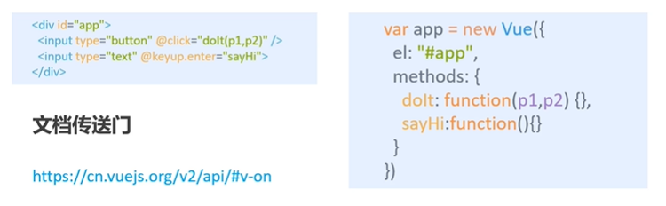
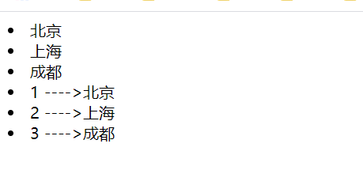

[传送门]: https://www.bilibili.com/video/BV1HE411e7vY

# 第一个Vue程序

+ 导入开发版本的Vue.js
+ 创建Vue实例对象，设置el属性和data属性
+ 使用简洁的模板语法把数据渲染到页面上

```html
<!DOCTYPE html>
<html lang="en">
    <head>
        <meta charset="UTF-8" />
        <meta http-equiv="X-UA-Compatible" content="IE=edge" />
        <meta name="viewport" content="width=device-width, initial-scale=1.0" />
        <title>Document</title>
    </head>
    <body>
        <div id="app">
            <!--3. 使用简洁的模板语法把数据渲染到页面上 -->
            <span> {{ message }}</span>
        </div>
        <!-- 1. 导入开发版本的Vue.js -->
        <script src="https://cdn.jsdelivr.net/npm/vue@2/dist/vue.js"></script>
        <script>
            // 2.创建Vue实例对象，设置el属性和data属性
            var App = new Vue({
                el: "#app",
                data: {
                    message: "你好 vue",
                }
            });
        </script>
    </body>
</html>
```

## el：挂载点

+ el是用来设置Vue实例挂载（管理）的元素
+ Vue会管理el选**项命中的元素**及其内部的后代元素
+ 可以使用其他的选择器，但是建议使用**ID选择器**
+ 可以使用其他的双标签，**不能使用HTML和Body**


## data：数据对象

+ Vue中用到的数据定义在**data**中
+ data中可以写**复杂类型**的数据
+ 渲染复杂类型数据时，遵守**js的语法**即可

```html
    <body>
        <div id="app">
            <!--3. 使用简洁的模板语法把数据渲染到页面上 -->
            <span> {{ message }}</span>
            <div>
                <li>{{arr[0]}}</li>
                <li>{{arr[1]}}</li>
            </div>
            <table style="border: 2px solid #0094ff;">
                <tr>
                    <td>姓名 {{obj.name}}</td>
                </tr>
                <tr>
                    <td>年龄 {{obj.age}}</td>
                </tr>
            </table>
        </div>
        <!-- 1. 导入开发版本的Vue.js -->
        <script src="https://cdn.jsdelivr.net/npm/vue@2/dist/vue.js"></script>
        <script>
            // 2.创建Vue实例对象，设置el属性和data属性
            var App = new Vue({
                el: "#app",
                data: {
                    message: "你好 vue",
                    arr: ["北京", "上海"],
                    obj: {
                        name: "张三",
                        age: 10,
                    }
                }
            });
        </script>
    </body>
```

# 指令+本地应用

## `{{}}`差值表达式

## V-text

+ `v-text`指令的作用是设置标签的内容（textContent）
+ 默认写法会**替换全部内容**，使用`差值表达式{{}}`可以替换指定内容
+ 内部支持写**表达式**

## V-html

+ `v-html`指令的作用是设置元素的`innerHTML`
+ 内容中有**htmlt**构会被解析为标签
+ **v-text**指令无论内容是什么只会解析为文本
+ 解析文本使用**v-text**，需要解析html结构使用v-html

```html
<!DOCTYPE html>
<html lang="en">
    <head>
        <meta charset="UTF-8" />
        <meta http-equiv="X-UA-Compatible" content="IE=edge" />
        <meta name="viewport" content="width=device-width, initial-scale=1.0" />
        <title>Document</title>
    </head>

    <body>
        <div id="app">
            <!--3. 使用简洁的模板语法把数据渲染到页面上 -->
            <p v-text="context"></p>
            <p v-html="context"></p>
        </div>
        <!-- 1. 导入开发版本的Vue.js -->
        <script src="https://cdn.jsdelivr.net/npm/vue@2/dist/vue.js"></script>
        <script>
            // 2.创建Vue实例对象，设置el属性和data属性
            var App = new Vue({
                el: "#app",
                data: {
                    context: '<a href="http://www.baidu.com" class="">text解析为文本，html解析为元素</a>',
                },
            });
        </script>
    </body>
</html>
```


## v-on

为元素绑定事件

```html
<!DOCTYPE html>
<html lang="en">
    <head>
        <meta charset="UTF-8" />
        <meta http-equiv="X-UA-Compatible" content="IE=edge" />
        <meta name="viewport" content="width=device-width, initial-scale=1.0" />
        <title>Document</title>
    </head>

    <body>
        <div id="app">
            {{context}}:{{index}}
            <input type="button" value="点击事件" v-on:click="doit" />
            <input type="button" value="点击简写" @click="doit" />
            <input type="button" value="鼠标移入事件" @mouseenter="doit" />
            <input type="button" value="双击" @dblclicl="doit" />
        </div>
        <!-- 1. 导入开发版本的Vue.js -->
        <script src="https://cdn.jsdelivr.net/npm/vue@2/dist/vue.js"></script>
        <script>
            // 2.创建Vue实例对象，设置el属性和data属性
            var App = new Vue({
                el: "#app",
                data: {
                    context: "绑定事件",
                    index: 0,
                },
                methods: {
                    doit: function () {
                        this.index++;
                    },
                },
            });
        </script>
    </body>
</html>
```

传递自定义参数事件修饰符



+ 事件绑定的方法写成`函数调用`的形式，可以传入自定义参数
+ 定义方法时需要定义`形参`来接收传入的实参
  事件的后面跟上`.修饰符`可以对事件进行限制
+ `.enter`可以限制触发的按键为回车
+ 事件修饰符有多种

```html
<!DOCTYPE html>
<html lang="en">
    <head>
        <meta charset="UTF-8" />
        <meta http-equiv="X-UA-Compatible" content="IE=edge" />
        <meta name="viewport" content="width=device-width, initial-scale=1.0" />
        <title>Document</title>
    </head>
    <body>
        <div id="app">
            <input type="button" value="点击" @click="doIt(666)" />
            <!-- 监听回车键 -->
            <input type="text" @keyup.enter="sayhi">
        </div>

        <script src="https://cdn.jsdelivr.net/npm/vue@2/dist/vue.js"></script>
        <script>
            var app = new Vue({
                el: "#app",
                data: {},
                methods: {
                    doIt: function (p1) {
                        alert(p1);
                    },
                    sayhi:function(){
                        alert("监听回车键")
                    }
                },
            });
        </script>
    </body>
</html>
```


## 案例1：计数器

1，`data`中定义数据比如num
2，`methods`中添加两个方法比如`add`（递增）`sub`（递减）
3，使用`v-text`将num设置给span标签
4，使用`v-on`将add，sub分别绑定给+，-按钮
5，累加的逻辑：小于10累加，否则提示
6，递减的逻辑大于0递减否则提示

```html
<!DOCTYPE html>
<html lang="en">
    <head>
        <meta charset="UTF-8" />
        <meta http-equiv="X-UA-Compatible" content="IE=edge" />
        <meta name="viewport" content="width=device-width, initial-scale=1.0" />
        <title>Document</title>
    </head>
    <body>
        <div id="app">
            <button @click="sub">-</button>
            <span v-text="num"></span>
            <button @click="add">+</button>
        </div>

        <script src="https://cdn.jsdelivr.net/npm/vue@2/dist/vue.js"></script>
        <script>
            var app = new Vue({
                el: "#app",
                data: {
                    num: 0,
                },
                methods: {
                    add: function () {
                        if (this.num < 10) {
                            this.num++;
                        } else {
                            alert("不能继续加");
                        }
                    },
                    sub: function () {
                        if (this.num > 0) {
                            this.num--;
                        } else {
                            alert("不能继续减");
                        }
                    },
                },
            });
        </script>
    </body>
</html>
```

## `v-show/v-if`

`v-show`根据表达值的真假切换元素的显示和隐藏  **操作`display: none;`属性**

`v-if`根据表达值的真假切换元素的显示和隐藏（**操纵dom元素**）


> + v-if指令的作用是**根据表达式的真假**切换元素的显示状态
> + v-if本质是通过操纵dom元素来切换显示状态
> + 表达式的值为true，元素存在于dom树中为false，从dom树中移除
> + v-if频繁的切换v-show，反之使用v-if，前者的切换消耗小

```html
<!DOCTYPE html>
<html lang="en">
    <head>
        <meta charset="UTF-8" />
        <meta http-equiv="X-UA-Compatible" content="IE=edge" />
        <meta name="viewport" content="width=device-width, initial-scale=1.0" />
        <title>Document</title>
    </head>
    <body>
        <div id="app">
            <button @click="change">切换</button>
            <h1 v-show="isShow">标题v-show</h1>
            <h1 v-if="isShow">标题v-if</h1>
        </div>

        <script src="https://cdn.jsdelivr.net/npm/vue@2/dist/vue.js"></script>
        <script>
            var app = new Vue({
                el: "#app",
                data: {
                    isShow: true,
                },
                methods: {
                    change: function () {
                        this.isShow = !this.isShow;
                    },
                },
            });
        </script>
    </body>
</html>
```

`v-if/v-else`

```html
<div v-if="Math.random() > 0.5">
  Now you see me
</div>
<div v-else>
  Now you don't
</div>
```


## `v-bind`

设置元素的属性（比如：src，title，class）


+ `v-bind`指令的作用是：为元素娜定属性
+ 完整写法是`v-bind：属性名`
+ 简写的话可以直接省略v-bind，只保留`:属性名`
+ 需要动态的增删`class`建议使用对象的方式

```html
<!DOCTYPE html>
<html lang="en">
    <head>
        <meta charset="UTF-8" />
        <meta http-equiv="X-UA-Compatible" content="IE=edge" />
        <meta name="viewport" content="width=device-width, initial-scale=1.0" />
        <title>Document</title>
    </head>

    <body>
        <div id="app">
           <a href="http:\\www.baidu.com" v-bind:title="msg">v-bind</a>
           <!-- 支持表达式 -->
           <a href="http:\\www.baidu.com" :title="msg + '！！！'">v-bind简写</a>
            <!-- 支持表达式 如果：payOrder.payType === 'wxpay'  增加current 样式 -->
            <div :class="['ChannelOption_payment-channel-option', {current:payOrder.payType === 'wxpay'}]"
        </div>
        <!-- 1. 导入开发版本的Vue.js -->
        <script src="https://cdn.jsdelivr.net/npm/vue@2/dist/vue.js"></script>
        <script>
        
            var App = new Vue({
                el: "#app",
                data: {
                    msg:"进入百度"
                },
                methods: {
                    
                },
            });
        </script>
    </body>
</html>
```

## 图片切换案例：


1 定义團片R组
2 添图片素引
3 定src属性
4 图片切换逻辑
5 显示状态切换


+ 列表数使用数姐保存
+ `v-bind`指令可以设置元素属性比如src
+ `v-show`/`v-if`都可以切换元素的显示状态频繁切挽用v-show

```html
<!DOCTYPE html>
<html lang="en">
    <head>
        <meta charset="UTF-8" />
        <meta http-equiv="X-UA-Compatible" content="IE=edge" />
        <meta name="viewport" content="width=device-width, initial-scale=1.0" />
        <title>Document</title>
    </head>

    <body>
        <div id="app">
            <button @click="pre" v-show="index > 0">-</button>
            
            <button @click="next" v-show="index&lt;imgArr.length-1">+</button>
        </div>
        <!-- 1. 导入开发版本的Vue.js -->
        <script src="https://cdn.jsdelivr.net/npm/vue@2/dist/vue.js"></script>
        <script>
            // 2.创建Vue实例对象，设置el属性和data属性
            var App = new Vue({
                el: "#app",
                data: {
                    imgArr: [
                        "./img/图片1.png",
                        "./img/图片2.png",
                        "./img/图片3.png",
                        "./img/图片4.png",
                        "./img/图片5.png",
                        "./img/图片6.png",
                        "./img/图片7.png",
                    ],
                    index: 0,
                },
                methods: {
                    pre: function () {
                        this.index--;
                    },
                    next: function () {
                        this.index++;
                    },
                },
            });
        </script>
    </body>
</html>
```

## `v-for`

根据数据生成列表结构


+ `v-for`指令的作用是：根据数据生成列表结构
+ 数组经常和v-for结合使用
+ 语法是`（item，index）in数据`
+ item和index可以结合其他指令一起使用
+ **数组长度的更新会同步到页面上是响应式的**

```html
<!DOCTYPE html>
<html lang="en">
    <head>
        <meta charset="UTF-8" />
        <meta http-equiv="X-UA-Compatible" content="IE=edge" />
        <meta name="viewport" content="width=device-width, initial-scale=1.0" />
        <title>Document</title>
    </head>
    <body>
        <div id="app">
            <li v-for="item in arr">{{item}}</li>
            <!-- 使用索引 -->
            
            <li v-for="(item,index) in arr">{{index+1}} ---->{{item}}</li>
            <button @click="add">++++</button>
            <button @click="remove">----</button>
        </div>

        <script src="https://cdn.jsdelivr.net/npm/vue@2/dist/vue.js"></script>
        <script>
            var app = new Vue({
                el: "#app",
                data: {
                    arr: ["北京", "上海", "成都"],
                },methods:{
                    add:function(){
                        this.arr.push({name:"111",age:30});//向数组尾增加元素
                    },
                    remove:function(){
                        this.arr.shift();//从数组头移除元素
                    }
                }
            });
        </script>
    </body>
</html>

```



## `v-model`

获取和设置表单元素的值（**双向数据绑定**）


+ `v-model`指令的作用是便捷的设置和获取表单元素的值
+ 绑定的数据会和表单元素**值**相关联
+ 绑定的数据`→←`表单元素的值

```html
<!DOCTYPE html>
<html lang="en">
    <head>
        <meta charset="UTF-8" />
        <meta http-equiv="X-UA-Compatible" content="IE=edge" />
        <meta name="viewport" content="width=device-width, initial-scale=1.0" />
        <title>Document</title>
    </head>
    <body>
        <div id="app">
            <!-- imput 框value与data中message进行双向绑定 -->
            <button @click="setM">验证双向绑定</button>
            <input type="text" v-model="message" @keyup.enter="getM"/>
            <h1>{{message}}</h1>
        </div>

        <script src="https://cdn.jsdelivr.net/npm/vue@2/dist/vue.js"></script>
        <script>
            var app = new Vue({
                el: "#app",
                data: {
                    message: "v-model数据双向绑定",
                },
                methods: {
                    getM:function(){
                        alert(this.message)
                    },
                    setM:function(){
                        this.message="修改message"
                    }
                },
            });
        </script>
    </body>
</html>
```

```html
<!DOCTYPE html>
<html lang="en">
<head>
    <meta charset="UTF-8">
    <title>Title</title>
</head>
<body>
<div id="app">
    <div>
        <!--绑定单选框-->
        <input type="radio" name="sex" value="man" v-model="sex">男
        <input type="radio" name="sex" value="women" v-model="sex">女
        {{sex}}
    </div>

    <div>
        <!-- 复选框绑定-->
        <input type="checkbox" name="hobbys" value="yumanqiu" v-model="hobby"> 羽毛球
        <input type="checkbox" name="hobbys" value="pingang" v-model="hobby"> 乒乓球
        <input type="checkbox" name="hobbys" value="football" v-model="hobby"> 足球
        {{hobby}}
    </div>


    <div>
        <!-- 绑定下拉框-->
        <select name="" v-model="selects">
            <option value="" disabled>请选择</option>
            <option value="A">A</option>
            <option value="B">B</option>
            <option value="C">C</option>
        </select>
        {{selects}}
    </div>
</div>

<script src="https://cdn.jsdelivr.net/npm/vue@2/dist/vue.js"></script>
<script>
    var app = new Vue({
        el: "#app",
        data: {
            sex: "",
            selects: "",
            hobby: []
        }
    })
</script>
</body>
</html>
```


## 记事本


```html
<!DOCTYPE html>
<html lang="en">

<head>
    <meta charset="UTF-8" />
    <meta http-equiv="X-UA-Compatible" content="IE=edge" />
    <meta name="viewport" content="width=device-width, initial-scale=1.0" />
    <title>Document</title>
</head>

<body>
    <!-- 主体区域 -->
    <section id="todoapp" >
        <!-- 输入框 -->
        <header class="header">
            <h1>NoteBook</h1>
            <!-- 数据绑定到inputvalue，添加回车事件，将数据添加到数组中，并清空input框内容 -->
            <input v-model="inputvalue" @keyup.enter="add" type="text" autofocus="autofocus" autocomplete="off"
                placeholder="请输入任务" />
        </header>
        <!-- 列表区域  数组长度大于0 时显示-->
        <section class="main" v-show="notes.length > 0">
            <table>
                <ul>
                    <!-- v-for展示列表 -->
                    <li v-for="(item,index) in notes">
                        <!-- 在v-for循环中可以获取索引 -->
                        <span>{{index+1}}</span>
                        <label>{{item}}</label>
                        <button @click="remove(index)">x</button>
                    </li>
                </ul>
            </table>
        </section>

        <!-- 统计和清空   数组长度大于0 时显示-->
        <footer class="footer" v-if="notes.length > 0">
            <!-- 统计列表数量 -->
            <span>
                <strong>{{notes.length}}</strong>items left
            </span>
            <!-- 清空数组的内容 a标签点击不调整 -->
            <a href="javascript:void(0)" @click="clearAll"> clearAll</a>

        </footer>
    </section>

    <!-- 底部 -->
    <footer class="info"></footer>
    <script src="https://cdn.jsdelivr.net/npm/vue@2/dist/vue.js"></script>
    <script>
        var app = new Vue({
            el: "#todoapp",
            data: {
                notes: ["吃饭饭", "打豆豆", "123"],//记事本内容
                inputvalue: "",//数据双向绑定到input框
            },
            methods: {
                add: function () {//添加
                    this.notes.push(this.inputvalue);
                    this.inputvalue = "";//清空input框里面输入的内容 
                },
                remove: function (index) {//移除
                    this.notes.splice(index, 1);//删除数组中指定元素
                },
                clearAll: function () {
                    this.notes = [];
                }
            },
        });
    </script>
</body>

</html>
```


# 网络应用

## axios入门

功能强大的网络请求库`https://unpkg.com/axios@0.21.1/dist/axios.min.js`


+ axios必须先导入才可以使用
+ 使用get/post方法即可发送对应的请求
+ then方法中的回调函数会在请求成功或失败时触发
+ 通t回调函的形可以获取响应内容或错误信息

官方文档：`https://github.com/axios/axios`

```html
<!DOCTYPE html>
<html lang="en">

<head>
    <meta charset="UTF-8">
    <meta http-equiv="X-UA-Compatible" content="IE=edge">
    <meta name="viewport" content="width=device-width, initial-scale=1.0">
    <title>测试axios</title>
</head>

<body>
    <input type="button" value="get请求" class="get">
    <input type="button" value="post请求" class="post">
    <script src="https://unpkg.com/axios@0.21.1/dist/axios.min.js"></script>
    <script>
        /*
        按口1：随机笑话
        请求地址：https://autumnfish.cn/api/joke/list
        请求方法：get
        请求参数：num（笑话条数，数字）
        响应内容：随机笑话
        */
        //给class=“get” 元素绑定点击事件
        document.querySelector(".get").onclick = function () {
            axios.get("https://autumnfish.cn/api/joke/list?num=6")
                .then(function (respone) {
                    console.log(respone)
                },
                    function (err) {
                        console.log(err);
                        alert("错误" + err.state)
                    }
                )
        }

        /*
        按口2：用户注册
        请求地址：https://autumnfish.cn/api/user/reg
        请求方法：post
        请求参数：username（用户名，字符串）
        响应内容：注册成功或失败
         */
        document.querySelector("post").onclick = function () {
            axios.post("https://autumnfish.cn/api/user/reg", { nsername: "jjack" })
                .then(function (respone) {
                    console.log(respone)
                },
                    function (err) {
                        console.log(err)
                    }
                )
        }

    </script>
</body>

</html>
```

## axios+vue

+ `axios`回调函数中的`this`已经改变无法访问到data中数据
+ 把`this`保存起来，回调函数中直接使用保存的`this`即可
+ 和本地应用的最大区别就是改变了`数据来源`

```html
<!DOCTYPE html>
<html lang="en">

<head>
    <meta charset="UTF-8">
    <meta http-equiv="X-UA-Compatible" content="IE=edge">
    <meta name="viewport" content="width=device-width, initial-scale=1.0">
    <title>测试axios</title>
</head>

<body>
    <div id="app">
        <input type="button" value="获取笑话" @click="getJoke">
        <p v-text="joke"></p>

    </div>

    <script src="https://cdn.jsdelivr.net/npm/vue@2/dist/vue.js"></script>
    <script src="https://unpkg.com/axios@0.21.1/dist/axios.min.js"></script>
    <script>

        var app = new Vue({
            el: "#app",
            data: {
                joke: "很好笑的笑话"
            },
            methods: {
                getJoke: function () {
                    var that = this;
                    axios.get("https://autumnfish.cn/api/joke").then(
                        function (response) {
                            // app.joke = response.data;
                            that.joke =  response.data;
                        }, function (err) {
                            console.log(err);
                        }
                    );
                }
            }
        });


    </script>
</body>

</html>
```

## 天知道  网络应用


+ 应用的逻辑代码建议和页面分离，使用单独的js文件编写
+ axios回调函数中this指向改变了，需要额外的保存一份
+ 服务器返回的数据比较复杂时，获取的时候需要注意层级结构
+ 自定义参数可以让代码的复用性更高
+ methods中定义的方法内部，可以通**过this关键字点出其他的方法**

```html
<!DOCTYPE html>
<html lang="en">

<head>
    <meta charset="UTF-8">
    <meta http-equiv="X-UA-Compatible" content="IE=edge">
    <meta name="viewport" content="width=device-width, initial-scale=1.0">
    <title>Document</title>
</head>

<body>

    <div id="app">
        <div style="margin: auto;">
            <div>
                <!-- 将值绑定到city，添加回车事件 -->
                <input type="text" v-model="city" @keyup.enter="serachWeather">
                <button @click="serachWeather">查询</button>
            </div>
            <div>
                <a href="javascript:void(0);" @click="changeCity('北京')">北京</a>
                <a href="javascript:void(0);" @click="changeCity('上海')">上海</a>
                <a href="javascript:void(0);" @click="changeCity('深圳')">深圳</a>
                <a href="javascript:void(0);" @click="changeCity('成都')">成都</a>
            </div>
        </div>
        <ul>
            <!-- 展示查询到的数据 -->
            <div v-for="item in weatherList"
                style="display: inline-block;width: 200px;border: 1px solid #F00;text-align:center;">
                <p>{{item.date}}</p>
                <h2>{{item.type}}</h2>
                <p>{{item.fengxiang}}</p>
                <p>{{item.high}}</p>
                <p>{{item.low}}</p>

            </div>
        </ul>
    </div>

    <script src="https://cdn.jsdelivr.net/npm/vue@2/dist/vue.js"></script>
    <script src="https://unpkg.com/axios@0.21.1/dist/axios.min.js"></script>
    <script>

        /*
        请求地址：http://wthrcdn.etouch.cn/weather_mini
        请求方法：get请求参数：city（城市名）
        响应内容：天气信息
        1，点击回车2，查询数据3，渲染数据
        */
        new Vue({
            el: "#app",
            data: {
                city: "",
                weatherList: []
            },
            methods: {
                serachWeather: function () {
                    var that = this;
                    var url = "http://wthrcdn.etouch.cn/weather_mini?city="

                    axios.get(url + this.city).then(
                        function (respone) {
                            console.log(respone.data.data.forecast);
                            that.weatherList = respone.data.data.forecast;
                        },
                        function (err) {
                            console.log(err);
                        })
                },
                changeCity: function (city) {//改变数据框的值，调用查询天气接口
                    this.city = city;
                    this.serachWeather();//调用vue自身的函数
                }
            }
        })
    </script>
</body>

</html>
```

# 综合应用


`https://autumnfish.cn/search`


`https://autumnfish.cn/song/url`


`https://autumnfish.cn/song/detail`


监听播放条开始暂停事件，修改css样式


`https://autumnfish.cn/mv/url`

```html
<!DOCTYPE html>
<html lang="en">

<head>
    <meta charset="UTF-8">
    <meta http-equiv="X-UA-Compatible" content="IE=edge">
    <meta name="viewport" content="width=device-width, initial-scale=1.0">
    <title>音乐播放器</title>
</head>
<style>
    .list {
        display: inline-block;
        width: 200px;
        height: 400px;
        border: 1px solid #F00;
        overflow-y: auto;
    }

    .displayer {
        display: inline-block;
        margin-left: 10px;
        margin-right: 10px;
        width: 400px;
        height: 400px;
        border: 1px solid #F00;
    }
</style>

<body style="margin: auto;">

    <div id="app">

        <!-- 搜索音乐  双向绑定到keyWord 添加回车事件-->
        <div>
            <input type="text" v-model="keyWord" @keyup.enter="serachMusic" placeholder="输入搜索的内容,回车搜索">
        </div>
        <div>

            <div class="list">
                <!-- 展示搜索列表 -->
                <ul>
                    <li v-for="item in musicList">
                        <b @click="playMusic(item.id)">{{item.name}}</b>
                        <span><a href="Javascript:;" @click="playMv(item.mvid)" v-if="item.mvid!=0">MV</a></span>
                    </li>
                </ul>
            </div>

            <!-- 展示歌曲封面  如果playFlag 为true 表示开启旋转动画-->
            <div style="display: inline-block;" v-bind:class="{playing:playFlag}">
                
            </div>


            <!-- 评论展示 -->
            <div class="list">
                <div v-for="item in contentArr" style=" border: 1px solid #F00;margin-bottom: 3px;">
                    
                    <span>{{item.user.nickname}}</span>
                    <br>
                    <span>{{item.content}}</span>
                </div>

            </div>

        </div>

        <div>
            <!-- 音乐播放标签 v-bind 修改src地址-->
            <audio controls v-bind:src="musicUrl" @play="play" @pause="pause">
                Your browser does not support the
                <code>audio</code> element.
            </audio>

        </div>

        <div>
            <video controls width="250">

                <source :src="mvUrl" type="video/mp4">

                Sorry, your browser doesn't support embedded videos.
            </video>

        </div>

    </div>

    <script src="https://cdn.jsdelivr.net/npm/vue@2/dist/vue.js"></script>
    <script src="https://unpkg.com/axios@0.21.1/dist/axios.min.js"></script>
    <script>
        new Vue({
            el: "#app",
            data: {
                keyWord: "",//查询关键字
                musicList: [],//音乐列表
                musicUrl: "",//音乐url
                imgSrc: "hh.jpg",//图片url
                contentArr: [],//评论列表
                playFlag: false,//图片是否开始动画
                mvUrl: ""//视频播放地址
            },
            methods: {
                serachMusic: function () {//搜索音乐
                    var that = this;
                    axios.get("https://autumnfish.cn/search?keywords=" + this.keyWord).then(
                        function (respone) {
                            console.log(respone.data.result.songs);
                            that.musicList = respone.data.result.songs;
                        },
                        function (err) {

                        })

                },
                playMusic: function (musicId) {//点击列表播放音乐，显示评论，显示图片
                    var that = this;
                    //获取歌曲播放url
                    axios.get("https://autumnfish.cn/song/url?id=" + musicId).then(
                        function (respone) {
                            console.log(respone)
                            that.musicUrl = respone.data.data[0].url;
                        },
                        function (err) {

                        })

                    //获取歌曲播放详情
                    axios.get("https://autumnfish.cn/song/detail?ids=" + musicId).then(
                        function (respone) {
                            console.log(respone)
                            that.imgSrc = respone.data.songs[0].al.picUrl;
                        },
                        function (err) {

                        })

                    //歌曲评论
                    axios.get("https://autumnfish.cn/comment/hot?type=0&id=" + musicId).then(
                        function (respone) {
                            that.contentArr = respone.data.hotComments;
                        },
                        function (err) {

                        })
                },
                play: function () {//音乐开始播放，图片修改样式开始旋转
                    this.playFlag = true;
                },
                pause: function () {//音乐暂停播放，图片修改样式停止旋转
                    this.playFlag = false;
                },
                playMv: function (mvID) {
                    var that = this;
                    //通过mvid去请求视频地址  使用video标签播放
                    axios.get("https://autumnfish.cn/mv/url?id=" + mvID).then(
                        function (respone) {
                            that.mvUrl = respone.data.data.url;

                        },
                        function (err) {

                        })

                }
            }

        })

    </script>
</body>

</html>
```

# 计算属性与监听器

## 计算属性

```html
<div id="example">
  <p>Original message: "{{ message }}"</p>
  <p>Computed reversed message: "{{ reversedMessage }}"</p>
</div>

 <script>
var vm = new Vue({
  el: '#example',
  data: {
    message: 'Hello'
  },
  computed: {
    // 计算属性的 getter
    reversedMessage: function () {
      // `this` 指向 vm 实例
      return this.message.split('').reverse().join('')
    }
  }
})
</script>

```

## 监听器

```html
<!DOCTYPE html>
<html lang="en">

<head>
    <meta charset="UTF-8">
    <meta http-equiv="X-UA-Compatible" content="IE=edge">
    <meta name="viewport" content="width=device-width, initial-scale=1.0">
    <title>Document</title>
</head>

<body>
    <div id="watch-example">
        <p>
            Ask a yes/no question:
            <input v-model="question">
        </p>
        <p>{{ answer }}</p>
    </div>

    <script src="https://cdn.jsdelivr.net/npm/vue@2/dist/vue.js"></script>
    <!-- 因为 AJAX 库和通用工具的生态已经相当丰富，Vue 核心代码没有重复 -->
    <!-- 提供这些功能以保持精简。这也可以让你自由选择自己更熟悉的工具。 -->
    <script src="https://cdn.jsdelivr.net/npm/axios@0.12.0/dist/axios.min.js"></script>
    <script src="https://cdn.jsdelivr.net/npm/lodash@4.13.1/lodash.min.js"></script>
    <script>
        var watchExampleVM = new Vue({
            el: '#watch-example',
            data: {
                question: '',
                answer: 'I cannot give you an answer until you ask a question!'
            },
            watch: {
                // 如果 `question` 发生改变，这个函数就会运行
                question: function (newQuestion, oldQuestion) {
                    this.answer = 'Waiting for you to stop typing...'
                    this.debouncedGetAnswer()
                }
            },
            created: function () {
                // `_.debounce` 是一个通过 Lodash 限制操作频率的函数。
                // 在这个例子中，我们希望限制访问 yesno.wtf/api 的频率
                // AJAX 请求直到用户输入完毕才会发出。想要了解更多关于
                // `_.debounce` 函数 (及其近亲 `_.throttle`) 的知识，
                // 请参考：https://lodash.com/docs#debounce
                this.debouncedGetAnswer = _.debounce(this.getAnswer, 500)
            },
            methods: {
                getAnswer: function () {
                    if (this.question.indexOf('?') === -1) {
                        this.answer = 'Questions usually contain a question mark. ;-)'
                        return
                    }
                    this.answer = 'Thinking...'
                    var vm = this
                    axios.get('https://yesno.wtf/api')
                        .then(function (response) {
                            vm.answer = _.capitalize(response.data.answer)
                        })
                        .catch(function (error) {
                            vm.answer = 'Error! Could not reach the API. ' + error
                        })
                }
            }
        })
    </script>

</body>

</html>
```

# 自定义组件

#### **（1）第一个Vue组件**

注意：在实际开发中，我们并不会用以下方式开发组件，而是采用`vue-cli`创建，`vue`模板文件的方式开发，以下方法只是为了让大家理解什么是组件。
  **使用`Vue.component()`方法注册组件，格式如下：**

```html
<div id="app">
  <pan></pan>
</div>

<script src="https://cdn.jsdelivr.net/npm/vue@2.5.21/dist/vue.min.js"></script>
<script type="text/javascript">
    //先注册组件
    Vue.component("pan",{
        
        template:'<li>Hello</li>'

    });
    //再实例化Vue
    var vm = new Vue({
        el:"#app",
    });
</script>
```

说明：

- `Vue.component()`：注册组件
- `pan`：自定义组件的名字
- `template`：组件的模板

#### **（2）使用`props`属性传递参数**

像上面那样用组件没有任何意义，所以我们是需要传递参数到组件的，此时就需要使用`props`属性了！
  **注意：默认规则下props属性里的值不能为大写；**

```html
<!DOCTYPE html>
<html lang="en">
<head>
    <meta charset="UTF-8">
    <title>Title</title>
</head>
<body>

<div id="app">
    <!--组件：传递给组件中的值：props-->
  <pan v-for="item in items" v-bind:panh="item"></pan>
</div>

<script src="https://cdn.jsdelivr.net/npm/vue@2.5.21/dist/vue.min.js"></script>
<script type="text/javascript">
    //定义组件
    Vue.component("pan",{
        props:['panh'],
        template:'<li>{{panh}}</li>'

    });
    var vm = new Vue({
        el:"#app",
        data:{
            items:["java","Linux","前端"]
        }
    });
</script>
</body>
</html>
```

**说明**：

- `v-for="item in items"`：遍历`Vue`实例中定义的名为`items`的数组，并创建同等数量的组件
- `v-bind:panh="item"`：将遍历的`item`项绑定到组件中`props`定义名为`item`属性上；= 号左边的`panh`为`props`定义的属性名，右边的为`item in items` 中遍历的item项的值

