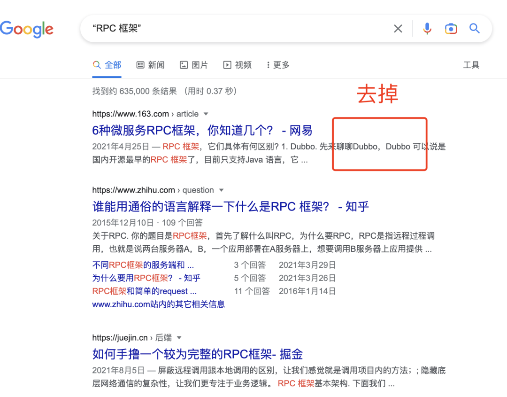
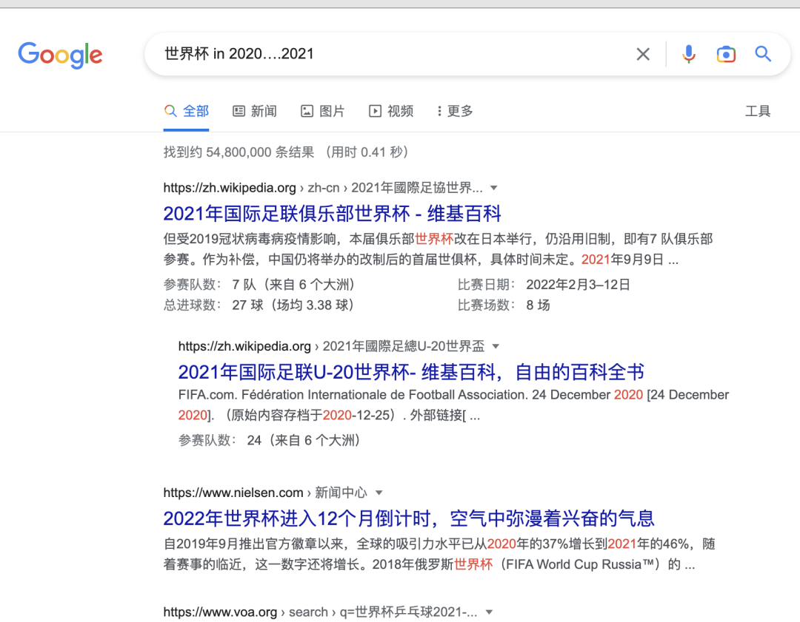

### **1、匹配多个关键字**

如果你搜索的内容包含多个关键词，**中间可以用「空格」来分隔**。当然有些技术同学喜欢用 「and」，效果差不多

### **2、匹配一个关键字**

如果搜索的多个关键词只需包含其中一个即可，**可以使用 「****竖线****」**，例如：“微观技术 |  Tom哥”

我们看到搜索的结果比较多，很多都是无关的。这种模式适合一些资料比较少的场景，广撒网找灵感。

### **3、精确搜索**

搜索引擎之索引能从海量的资料中快速查找到我们需要的信息，是因为采用了倒排索引。将一篇文章提前做了分词，然后对每个词语做反向关联文档。

查找时，关键词也会先分词，用多个词语并行去查询，再将返回结果去重合并、评分，按分数的高低排序后返回给我们。

任何事物都是有两面性，有时关闭分词更有利于快速检索结果。**我们可以采用 「双引号」将关键词包裹起来，**这样搜索出来的就是包含完整这段话的页面

### **4、模糊搜索**

如果我们搜索时，忘了单词怎么写了，**可以后面加「\*」**，比如：git comi*

### **5、排除干扰**

我们的搜索结果有很多内容是我们明确不想要的，我们可以对查询结果再做一层过滤。**采用「减号」后面跟关键词**

特别注意：减号前面有空格，后面没有空格，直接拼接搜索词。这种方式可以进一步精简搜索结果，避开很多干扰信息。

### **6、限标题搜**

一般搜索时，只要文章中有这个关键词都能被搜出来，不管是标题还是正文。如果只想搜索标题含有这个关键词，可以在搜索词前面加个指令，**比如  intitle:关键词，**

### **7、限某网站搜**

搜索是个好东西，极大提升我们查找资料的效率，很多垂直网站也都配置了站内搜索，提高用户体验。

但是有些网站没有搜索功能怎么办？

教你一招，**通过这个格式：关键词 site:网站域名。比如：高并发 site:csdn.net，那等同在 CSDN 这个站点内搜索「高并发」关键词**

### **8、搜索 pdf 文件**

如果你想定向搜索某一类型的文件，**可以在搜索词后面拼接  filetype:pdf，比如：**「“微博”  "高并发"  filetype:pdf」

当然其他类型文件也是一样道理，比如：

- filetype:ppt
- filetype:doc

### **9、搜索图书**

如果你想搜索一本图书怎么办，指向性很强，**可以使用「《》」，比如：搜索 《如何成为学习高手》**

### **10、限定时间范围**

如果想在指定时间之后，可以在搜索词后面拼接 「after:2021」

如果想在指定时间之前，后面拼接 「before:2021」

如果想在一段时间区间内，后面拼接「in 2020….2021」

### **11、寻找替代网站**

想要知道与某个网站相关的网站还有哪些？**可以使用 「related:网站」，比如  related:github.com**

搜索引擎会为你列出许多相似的网站

最后，我们赶上一个好时代，强大的互联网为了我们创造了海量的资料，我相信任何资料网上查到。但是如果成为这个淘金人却是我们需要去思考的。

工欲善其事必先利其器，掌握了技巧，你的工作效率会更好。时间就是生命，你把节省下来的时间用在其他地方，收获更多的成长

**·**